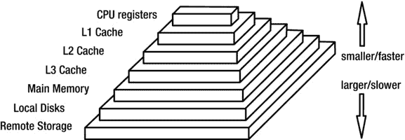
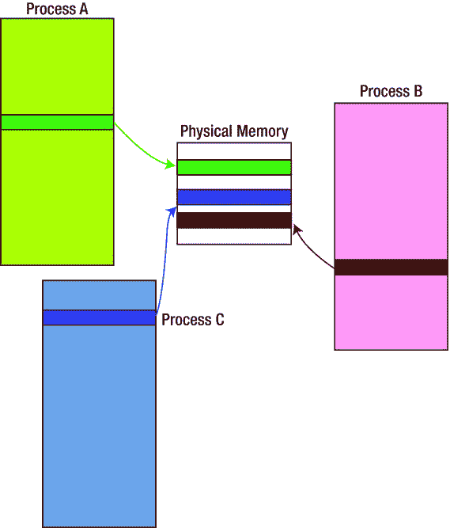
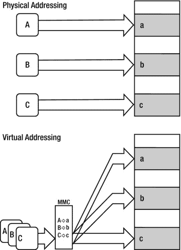

# 一、多任务操作系统基础

Abstract

与构建可执行程序相关的所有技术的最终目标是对程序执行过程建立尽可能多的控制。为了真正理解可执行程序结构某些部分的目的和意义，最重要的是充分理解程序执行过程中发生的事情，因为操作系统内核和嵌入可执行程序内部的信息之间的相互作用起着最重要的作用。在执行的初始阶段尤其如此，此时对运行时影响(如用户设置、各种运行时事件等)来说还为时过早。)这通常会发生。

与构建可执行程序相关的所有技术的最终目标是对程序执行过程建立尽可能多的控制。为了真正理解可执行程序结构某些部分的目的和意义，最重要的是充分理解程序执行过程中发生的事情，因为操作系统内核和嵌入可执行程序内部的信息之间的相互作用起着最重要的作用。在执行的初始阶段尤其如此，此时对运行时影响(如用户设置、各种运行时事件等)来说还为时过早。)这通常会发生。

朝着这个方向必须迈出的第一步是理解程序运行的环境。本章的目的是提供一个现代多任务操作系统功能的最有力的细节。

就如何实现最重要的功能而言，现代多任务操作系统在许多方面非常相似。因此，首先将有意识地努力以独立于平台的方式说明这些概念。此外，还将关注特定平台解决方案的复杂性(无处不在的 Linux 和 ELF 格式与 Windows 的对比),并将对其进行详细分析。

## 有用的抽象

计算技术领域的变化往往发生得非常快。集成电路技术提供的元件不仅种类丰富(光、磁、半导体)，而且功能也在不断升级。根据摩尔定律，集成电路上的晶体管数量大约每两年翻一番。与可用晶体管数量密切相关的处理能力也有类似的趋势。

正如很早就发现的那样，充分适应变化步伐的唯一方法是以抽象/概括的方式，在不断变化的实现细节之上的级别，定义计算机系统的总体目标和体系结构。这项工作的关键部分是以这样一种方式制定抽象，即任何新的实际实现都符合基本定义，而将实际实现的细节放在一边，因为相对来说不重要。整个计算机架构可以表示为一组结构化的抽象，如图 [1-1](#Fig1) 所示。

图 1-1。

Computer Architecture Abstractions

最底层的抽象通过用字节流的本质属性来表示各种 I/O 设备(鼠标、键盘、操纵杆、轨迹球、光笔、扫描仪、条形码阅读器、打印机、绘图仪、数码相机、网络摄像头),来处理这些设备。事实上，不管各种设备的目的、实现和能力之间的差异，从计算机系统设计的角度来看，这些设备产生或接收(或两者)的字节流是最重要的细节。

下一个抽象层次是虚拟内存的概念，它代表了系统中常见的各种内存资源，对于本书的主题来说是非常重要的。这种特定的抽象实际上表示各种物理存储设备的方式不仅影响实际硬件和软件的设计，而且为编译器、链接器和加载器的设计奠定了基础。

抽象物理 CPU 的指令集是下一级的抽象。理解指令集的特性和它所承载的处理能力绝对是编程大师感兴趣的话题。从我们主要话题的角度来看，这个抽象层次不是最重要的，也不会详细讨论。

操作系统的复杂性代表了抽象的最终层次。操作系统设计的某些方面(最明显的是多任务处理)对整个软件架构有决定性的影响。多方试图访问共享资源的场景需要深思熟虑的实现，避免不必要的代码重复，这是直接导致共享库设计的因素。

让我们在分析整个计算机系统的错综复杂的过程中绕一小段路，而是特别注意与内存使用相关的重要问题。

## 内存层次和缓存策略

有几个与计算机系统内存相关的有趣事实:

*   对记忆的需求似乎永无止境。人们总是需要远远超过现有水平的东西。在提供更大数量(更快的内存)方面的每一次飞跃都立即满足了人们对技术的长期等待的需求，这些技术在概念上已经准备好了相当长的一段时间，其实现被推迟到物理内存变得足够多的那一天。
*   这项技术在克服处理器的性能障碍方面似乎比内存更有效。这种现象通常被称为“处理器内存差距”
*   存储器的存取速度与存储容量成反比。最大容量存储设备的存取时间通常比最小容量存储设备的存取时间大几个数量级。

现在，让我们从程序员/设计师/工程师的角度快速看一下这个系统。理想情况下，系统需要尽可能快地访问所有可用内存——我们知道这是不可能实现的。接下来的问题就变成了:我们能为此做些什么吗？

让我们松了一口气的细节是，系统并不总是使用所有的内存，而只是在某些时候使用一些内存。在这种情况下，我们真正需要做的是为运行立即执行保留最快的内存，并为不立即执行的代码/数据使用较慢的内存设备。当 CPU 从快速存储器中取出安排立即执行的指令时，硬件试图猜测下一步将执行程序的哪一部分，并将该部分代码提供给较慢的存储器等待执行。在执行存储在较慢的存储器中的指令的时间到来之前不久，它们被转移到较快的存储器中。这一原理被称为缓存。

现实生活中的贮藏类似于普通家庭对食物供应的处理。除非我们住在非常偏僻的地方，否则我们通常不会购买并带回家一整年所需的所有食物。相反，我们通常会在家里(冰箱、餐具室、货架)保留相当大的储存空间，以备一两周的食物供应。当我们注意到这些小储备即将耗尽时，我们会去杂货店买足够的食物来填满当地的储备。

程序的执行通常会受到许多外部因素的影响(用户设置只是其中之一)，这一事实使得缓存机制成为一种猜测或漫无目的的游戏。程序执行流程越可预测(通过缺少跳转、中断等来衡量)。)缓存机制工作得越顺畅。相反，每当程序遇到流改变时，先前累积的指令由于不再需要而被丢弃，并且需要从较慢的存储器提供新的、更合适的程序部分。

缓存原理的实现无处不在，并且跨越了几个级别的内存，如图 [1-2](#Fig2) 所示。

图 1-2。

Memory caching hierarchy principle

## 虚拟内存

内存缓存的一般方法在下一个体系结构级别上获得实际的实现，其中运行的程序由称为进程的抽象表示。

现代多任务操作系统的设计意图是允许一个或多个用户同时运行几个程序。对于普通用户来说，同时运行多个应用程序(例如网络浏览器、编辑器、音乐播放器、日历)并不罕见。

虚拟内存的概念解决了内存需求和有限的内存可用性之间的不均衡，虚拟内存的概念可以通过以下一组指导原则来概括:

*   程序内存余量是固定的，对所有程序都是一样的，本质上是声明性的。

操作系统通常允许程序(进程)使用 2 N 字节的内存，现在 N 是 32 或 64。该值是固定的，与系统中物理内存的可用性无关

*   物理内存的数量可能会有所不同。通常，可用内存的数量比声明的进程地址空间小几倍。运行程序可用的物理内存量是一个奇数是很正常的。
*   运行时的物理内存被分成小片段(页面)，每个页面用于同时运行的程序。
*   正在运行的程序的完整内存布局保存在慢速内存(硬盘)中。只有当前将要执行的内存部分(代码和数据)被加载到物理内存页面中。

虚拟内存概念的实际实现需要大量系统资源的交互，例如硬件(硬件异常、硬件地址转换)、硬盘(交换文件)以及最低级别的操作系统软件(内核)。虚拟内存的概念如图 [1-3](#Fig3) 所示。

图 1-3。

Virtual memory concept implementation

## 虚编址

虚拟寻址的概念是虚拟内存实现的基础，并且在许多方面极大地影响了编译器和连接器的设计。

作为一般规则，程序设计者完全不用担心他的程序在运行时将占用的寻址范围(至少对大多数用户空间应用程序来说是这样；内核模块在这个意义上有些例外)。相反，编程模型假设地址范围在 0 和 2 N (虚拟地址范围)之间，并且对所有程序都是相同的。

为所有程序授予简单统一的寻址方案的决定对代码开发过程有着巨大的积极影响。以下是一些好处:

*   链接被简化。
*   装载被简化。
*   运行时进程共享变得可用。
*   简化了内存分配。

程序存储器在具体地址范围内的实际运行时位置由操作系统通过地址转换机制来执行。它的实现是由称为内存管理单元(MMU)的硬件模块执行的，它不需要程序本身的任何参与。

图 [1-4](#Fig4) 比较了虚拟寻址机制和简单明了的物理寻址方案(至今仍用于简单微控制器系统领域)。

图 1-4。

Physical vs. virtual addressing

## 进程内存划分方案

上一节解释了为什么可以为(几乎)任何程序的设计者提供相同的内存映射。本节的主题是讨论过程记忆图内部组织的细节。假设程序地址(从程序员的角度来看)位于 0 和 2 N 之间的地址范围内，N 为 32 或 64。

各种多任务/多用户操作系统指定不同的内存映射布局。特别是，Linux 进程虚拟内存映射遵循图 [1-5](#Fig5) 所示的映射方案。

图 1-5。

Linux process memory map layout

无论给定平台的进程内存划分方案有何特点，都必须始终支持内存映射的以下部分:

*   携带机器代码指令供 CPU 执行的代码段。文本部分)
*   携带 CPU 将操作的数据的数据段。通常，为初始化数据保留单独的部分。数据段)，对于未初始化的数据(。bss 部分)，也适用于常量数据(。rdata 部分)
*   运行动态内存分配的堆
*   堆栈，用于为函数提供独立的空间
*   属于内核的最顶层部分，其中存储了特定于进程的环境变量

Gustavo Duarte 对这一特定主题的详细讨论可以在

[`duartes.org/gustavo/blog/post/anatomy-of-a-program-in-memory`](http://duartes.org/gustavo/blog/post/anatomy-of-a-program-in-memory)

## 二进制文件、编译器、链接器和加载器的角色

上一节揭示了运行进程的内存映射。接下来的重要问题是如何在运行时创建正在运行的进程的内存映射。这一部分将对故事的这一特定方面提供初步的见解。

在草图中，

*   程序二进制文件携带了运行进程内存映射蓝图的细节。
*   二进制文件的框架是由链接器创建的。为了完成其任务，链接器组合由编译器创建的二进制文件，以便填充各种存储器映射部分(代码、数据等)。).
*   进程存储器映射的初始创建任务由称为程序加载器的系统实用程序执行。在最简单的意义上，加载程序打开二进制可执行文件，读取与节相关的信息，并填充进程内存映射结构。

这种角色划分适用于所有现代操作系统。

请注意，这种最简单的描述远远不能提供完整的情况。它应该被看作是对后续讨论的一个温和的介绍，随着我们进一步深入这个主题，将会传达关于二进制文件和进程加载主题的更多细节。

## 摘要

本章概述了对现代多任务操作系统的设计影响最大的概念。虚拟内存和虚拟寻址的基础概念不仅影响程序的执行(将在下一章详细讨论)，而且直接影响程序可执行文件的构建方式(将在本书后面详细解释)。