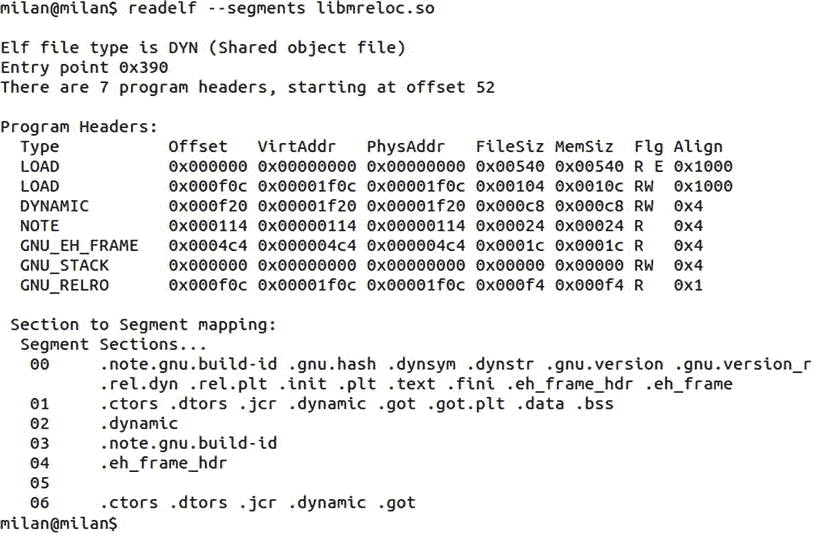
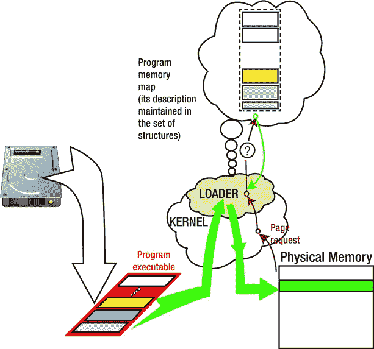

# 三、程序执行阶段

Abstract

本章的目的是描述当用户启动一个程序时发生的一系列事件。分析主要集中在指出操作系统和可执行二进制文件的布局之间相互作用的细节，这与进程内存映射紧密相关。不用说，本讨论的主要焦点是通过在 C/C++ 中构建代码而创建的可执行二进制文件的执行顺序。

本章的目的是描述当用户启动一个程序时发生的一系列事件。分析主要集中在指出操作系统和可执行二进制文件的布局之间相互作用的细节，这与进程内存映射紧密相关。不用说，本讨论的主要焦点是通过在 C/C++ 中构建代码而创建的可执行二进制文件的执行顺序。

## 外壳的重要性

在用户控制下的程序执行通常通过外壳发生，外壳是监视用户在键盘和鼠标上的动作的程序。Linux 有许多不同的 shells，最流行的是 sh、bash 和 tcsh。

一旦用户键入命令名并按下 Enter 键，shell 首先尝试将键入的命令名与它自己的内置命令进行比较。如果确认程序名不是 shell 支持的任何命令，shell 将尝试查找名称与命令字符串匹配的二进制文件。如果用户只键入程序名(即不是可执行二进制文件的完整路径)，shell 会尝试在 path 环境变量指定的每个文件夹中查找可执行文件。一旦知道了可执行二进制文件的完整路径，shell 就会激活加载和执行二进制文件的过程。

shell 的第一个强制性动作是通过派生相同的子进程来创建自己的克隆。通过复制 shell 的现有内存映射来创建新的进程内存映射似乎是一个奇怪的举动，因为新的进程内存映射很可能与 shell 的内存映射没有任何共同之处。这个奇怪的操作有一个很好的理由:这样 shell 就可以有效地将其所有的环境变量传递给新进程。事实上，在新进程内存映射创建后不久，其原始内容的大部分被擦除/清零(除了携带继承的环境变量的部分),并被新进程的内存映射覆盖，从而为执行阶段做好准备。图 [3-1](#Fig1) 说明了这个想法。

图 3-1。

The shell starts creating the new process memory map by copying its own process memory map, with the intention to pass its own environment variables to the new process

从这一点开始，shell 可能会遵循两种可能的场景之一。默认情况下，外壳等待其分叉克隆进程完成命令(即启动的程序完成执行)。或者，如果用户在程序名后面键入一个&符号，子进程将被推到后台，shell 将继续监视用户随后键入的命令。完全相同的模式可以通过用户不在可执行文件名称后附加&符号来实现；相反，在程序启动后，用户可以按 Ctrl-Z(向子进程发出 SIGSTOP 信号)并在 shell 窗口中键入“bg”(向子进程发出 SIGCONT 信号)，这将导致相同的效果(将 shell 子进程推到后台)。

当用户在应用程序图标上点击鼠标时，会出现一个非常相似的启动程序的场景。提供图标的程序(比如 Linux 上的 gnome-session 和/或 Nautilus 文件浏览器)负责将鼠标点击转换成`system( )`调用，这导致一系列非常相似的事件发生，就好像通过在 shell 窗口中键入来调用应用程序一样。

## 核心角色

一旦 shell 委派了运行程序的任务，内核就通过调用`exec`系列函数中的一个函数来做出反应，所有这些函数都提供了几乎相同的功能，但是在如何指定执行参数的细节上有所不同。不管选择哪一个特定的`exec`类型的函数，它们中的每一个最终都会调用`sys_execve`函数，该函数开始执行程序的实际工作。

下一步(发生在函数`search_binary_handler`(文件`fs/exec.c`)是识别可执行格式。除了支持最新的 ELF 二进制可执行格式之外，Linux 还通过支持其他几种二进制格式来提供向后兼容性。如果 ELF 格式被识别，动作的焦点移到`load_elf_binary`功能(文件`fs/binfmt_elf.c`)。

在可执行格式被识别为支持的格式之一之后，准备用于执行的进程存储器映射的工作开始。特别是，由外壳创建的子进程(外壳本身的克隆)从外壳传递到内核，目的如下:

*   内核获得了沙箱(进程环境)，更重要的是，获得了相关的内存，可以用来启动新程序。

内核要做的第一件事是彻底清除大部分内存映射。紧接着，它将把用从新程序的二进制可执行文件 harePoint 中读取的数据填充擦除的内存映射的过程委托给加载程序。

*   通过克隆 shell 进程(通过`fork( )`调用)，shell 中定义的环境变量被传递到子进程，这有助于环境变量的继承链不会被破坏。

## 加载者角色

在详细介绍加载器功能之前，必须指出加载器和链接器对二进制文件的内容有不同的观点。

### 二进制文件的特定于加载程序的视图(段与段)

链接器可以被认为是一个高度复杂的模块，能够精确地区分各种性质的各种各样的部分(代码、未初始化的数据、初始化的数据、构造函数、调试信息等)。).为了解析引用，它必须非常了解其内部结构的细节。

另一方面，加载程序的职责要简单得多。在大多数情况下，它的任务是将链接器创建的部分复制到进程内存映射中。为了完成它的任务，它不需要知道很多关于部分的内部结构。相反，它所关心的是这些部分的属性是否是只读的、可读写的，以及(后面将讨论)在可执行文件准备好启动之前是否需要应用一些补丁。

Note

正如后面关于动态链接过程的讨论中所显示的，加载器的功能比简单的复制数据块要复杂一些。

因此，加载器倾向于根据它们共同的加载需求将链接器创建的部分分组为段也就不足为奇了。如图 [3-2](#Fig2) 所示，加载程序段通常包含几个具有共同访问属性的部分(读或读写，或者最重要的，是否打补丁)。

图 3-2。

Linker vs. loader

如图 [3-3](#Fig3) 所示，使用`readelf`实用程序来检查段说明了将许多不同的链接程序段分组到加载程序段中。

图 3-3。

Sections grouped into segments

### 程序装入阶段

一旦确定了二进制格式，内核的加载器模块就开始发挥作用了。加载程序首先尝试在可执行二进制文件中定位 PT_INTERP 段，这将有助于它执行动态加载任务。

为了避免众所周知的“本末倒置”的情况——因为动态加载还有待解释——让我们假设一个最简单的场景，其中程序是静态链接的，不需要任何类型的动态加载。

STATIC BUILD EXAMPLE

术语静态构建用于表示可执行文件，它不具有任何动态链接依赖关系。创建这种可执行文件所需的所有外部库都是静态链接的。因此，获得的二进制文件是完全可移植的，因为它不需要任何系统共享库(甚至不需要`libc`)就可以执行。完全可移植性的好处(很少需要如此激烈的措施)是以可执行文件的字节大小大大增加为代价的。

除了完全的可移植性之外，静态构建可执行文件的原因可能纯粹是教育性的，因为它非常适合解释加载程序最初的、最简单的可能角色的过程。

静态建筑的效果可以用简单明了的“Hello World”的例子来说明。让我们使用同一个源文件来构建两个应用程序，其中一个是用`-static`链接器标志构建的；请参见清单 3-1 和 3-2。

清单 3-1。主页面

`#include <stdio.h>`

`int main(int argc, char* argv[])`

`{`

`printf("Hello, world\n");`

`return 0;`

`}`

清单 3-2。build.sh

`gcc main.cpp -o regularBuild`

`gcc``-static`

比较这两个可执行文件的字节大小可以看出，静态构建的可执行文件的字节大小要大得多(在这个特定的例子中大约大 100 倍)。

加载程序继续读入程序的二进制文件段的头，以确定每个段的地址和字节长度。需要指出的一个重要细节是，在这个阶段，加载程序仍然没有向程序存储器映射写入任何内容。加载程序在这一阶段所做的就是建立和维护一组结构(例如`vm_are_struct`)，携带可执行文件段(实际上是每个段的页宽部分)和程序内存映射之间的映射。

从可执行文件中实际复制段发生在程序执行开始之后。当授予进程物理存储器页面和程序存储器映射之间的虚拟存储器映射已经建立时；第一个分页请求开始从内核到达，请求页面范围的程序段可用于执行。这种策略的直接结果是，只有运行时真正需要的程序部分会被加载(图 [3-4](#Fig4) )。

图 3-4。

Program loading stage

## 执行程序入口点

从通常的 C/C++ 编程角度来看，程序入口点是`main()`函数。然而，从程序执行的角度来看，并非如此。在执行流程到达`main()`函数之前，会执行一些其他函数，为程序的运行铺平道路。

让我们仔细看看在 Linux 中程序加载和执行`main()`函数的第一行代码之间通常会发生什么。

### 加载程序找到入口点

加载程序后(即准备程序蓝图并将必要的部分复制到内存中以便执行)，加载程序快速查看 ELF 头中`e_entry`字段的值。该值包含程序存储器地址，执行将从该地址开始。

反汇编可执行二进制文件通常会显示出,`e_entry`值只携带代码的第一个地址(。文本)部分。巧合的是，这个程序存储器地址通常表示`_start`函数的来源。

以下是`.text`部分的拆卸:

`08048320 <_start>:`

`8048320:        31 ed                        xor    ebp,ebp`

`8048322:        5e                           pop    esi`

`8048323:        89 e1                        mov    ecx,esp`

`8048325:        83 e4 f0                     and    esp,0xfffffff0`

`8048328:        50                           push   eax`

`8048329:        54                           push   esp`

`804832a:        52                           push   edx`

`804832b:        68 60 84 04 08               push   0x8048460`

`8048330:        68 f0 83 04 08               push   0x80483f0`

`8048335:        51                           push   ecx`

`8048336:        56                           push   esi`

`8048337:        68 d4 83 04 08               push   0x80483d4`

`804833c:        e8 cf ff ff ff               call   8048310 <``__libc_start_main`

`8048341:        f4                           hlt`

### _start()函数的作用

`_start`函数的作用是为接下来要调用的`__libc_start_main`函数准备输入参数。其原型被定义为

`int __libc_start_main(int (*main) (int, char * *, char * *), /* address of main function   */`

`int argc,                 /* number of command line args             */`

`char * * ubp_av,          /* command line arg array                  */`

`void (*init) (void),      /* address of init function                */`

`void (*fini) (void),      /* address of fini function                */`

`void (*rtld_fini) (void), /* address of dynamic linker fini function */`

`void (* stack_end)        /* end of the stack address                */`

`);`

事实上，call 指令之前的所有指令都是按照预期的顺序堆叠调用所需的参数。

为了理解这些指令到底是做什么的，为什么，请看下一节，这一节将专门解释堆栈机制。但是在去那里之前，我们先完成关于开始程序执行的故事。

### __libc_start_main()函数的作用

在为程序运行准备环境的过程中，这个函数是关键角色。它不仅在程序执行期间为程序设置环境变量，而且还执行以下操作:

*   启动程序的线程。
*   调用`_init()`函数，该函数执行需要在`main()`函数开始之前完成的初始化。

GCC 编译器通过`the __attribute__ ((constructor))`关键字支持自定义设计您可能希望在程序启动前完成的例程。

*   注册程序终止后要调用来清理的`_fini()`和`_rtld_fini()`函数。通常，`_fini()`的动作与`_init()`函数的动作相反。

GCC 编译器，通过`__attribute__ ((destructor))`关键字，支持在程序启动前您可能想要完成的例程的定制设计。

最后，在所有的先决条件动作完成后，_ `libc_start_main()`调用`main()`函数，从而使您的程序运行。

### 堆栈和调用约定

任何具有绝对初学者水平以上编程经验的人都知道，典型的程序流实际上是一系列函数调用。通常，主函数至少调用一个函数，而这个函数又可能调用大量的其他函数。

堆栈的概念是函数调用机制的基石。程序执行的这个特殊方面对于本书的整个主题来说并不是最重要的，我们也不会花太多的时间来讨论堆栈如何工作的细节。这个话题早已是老生常谈，众所周知的事实无需赘述。

相反，将只指出与堆栈和函数相关的几个要点。

*   进程内存映射为堆栈的需要保留了一定的区域。
*   运行时使用的堆栈内存量实际上是变化的；函数调用序列越长，使用的堆栈内存就越多。
*   堆栈内存不是无限的。相反，可用堆栈内存量与可用于分配的内存量(进程内存中称为堆的部分)绑定在一起。

#### 函数调用约定

函数如何将参数传递给它调用的函数是一个非常有趣的话题。已经设计了各种非常复杂的将变量传递给函数的机制，产生了特定的汇编语言例程。这种堆栈实现机制通常被称为调用约定。

事实上，已经为 X86 架构开发了许多不同的调用约定，例如`cdecl`、`stdcall`、`fastcall`、`thiscall`等等。它们中的每一个都是从各种设计角度为特定场景定制的。由内曼贾·特里弗诺维奇( [`www.codeproject.com/Articles/1388/Calling-Conventions-Demystified`](http://www.codeproject.com/Articles/1388/Calling-Conventions-Demystified) )撰写的标题为“召唤惯例去神秘化”的文章提供了一个有趣的视角，深入了解各种召唤惯例之间的差异。几年后，传奇人物 Raymond Chen 发表了一系列名为“呼叫约定的历史”的博客文章( [`http://blogs.msdn.com/b/oldnewthing/archive/2004/01/02/47184.aspx`](http://blogs.msdn.com/b/oldnewthing/archive/2004/01/02/47184.aspx) )，这可能是关于该主题的最完整的单一信息来源。

在这个特定的主题上不要花费太多时间，一个特别重要的细节是，在所有可用的调用约定中，有一个特别的,`cdecl`调用约定是实现导出到另一个世界的动态库的接口的首选。请继续关注更多细节，因为在第 6 章中关于库 ABI 功能的讨论将对这个主题提供更好的见解。