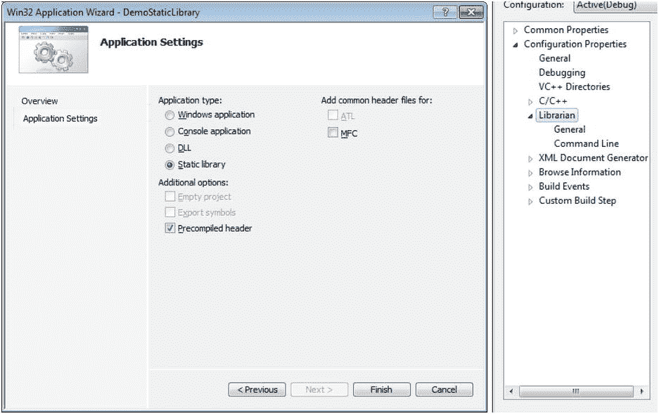

# 五、使用静态库

Abstract

在这一章中，我将回顾处理静态库的典型生命周期。我将从创建静态库的简单指南开始，然后我将提供典型用例场景的概述，最后我将仔细研究某些专家级的设计技巧和诀窍。

在这一章中，我将回顾处理静态库的典型生命周期。我将从创建静态库的简单指南开始，然后我将提供典型用例场景的概述，最后我将仔细研究某些专家级的设计技巧和诀窍。

## 创建静态库

当编译器从源文件集中创建的目标文件被捆绑在一起成为单个归档文件时，静态库被创建。这个任务是由一个叫做归档器的工具来执行的。

### 创建 Linux 静态库

在 Linux 上，归档工具(简称 ar)是 GCC 工具链的一部分。下面的简单示例演示了从两个源文件创建静态库的过程:

`$ gcc -c first.c second.c`

`$ ar rcs libstaticlib.a first.o second.o`

按照 Linux 惯例，静态库名称以前缀 lib 开头，文件扩展名为. a。

除了执行将目标文件绑定到档案(静态库)的基本任务外，`ar`还可以执行几个额外的任务:

*   从库中删除一个或多个目标文件。
*   替换库中的一个或多个目标文件。
*   从库中提取一个或多个目标文件。

支持功能的完整列表可以在`ar`工具手册页( [`http://linux.die.net/man/1/ar`](http://linux.die.net/man/1/ar) )中找到。

### 创建 Windows 静态库

在 Windows 上创建静态库的任务与在 Linux 上执行的相同任务没有实质性的不同。尽管它可以从命令行完成，但事实是，在大多数情况下，创建静态库的任务是通过创建一个专用的 Visual Studio(或其他类似的 IDE 工具)项目来执行的，该项目带有构建静态库的选项。当检查项目命令行时，您可以在图 5-1 中看到，该任务本质上归结为使用一个归档工具(尽管是 Windows 版本)。

图 5-1。

Creating a Win32 static library

## 使用静态库

静态库用于构建可执行文件或动态库的项目的链接阶段。静态库的名称通常与需要链接的目标文件列表一起传递给链接器。如果项目还链接到动态库中，则它们的名称是同一链接器输入参数列表的一部分。

### 推荐的用例场景

静态库是二进制共享代码的最基本方式，在动态库发明之前很久就已经存在了。同时，更复杂的动态库范例已经接管了二进制代码共享的领域。然而，在一些场景中，静态库的使用仍然是有意义的。

静态库非常适合于实现各种算法(主要是专有算法)核心的所有场景，从搜索和排序等基本算法到非常复杂的科学或数学算法。以下因素可以为决定使用静态库作为交付代码的形式提供额外的推动力:

*   整个代码架构可以更好地描述为“各种能力的广泛集合”，而不是“具有严格定义的接口的模块”
*   实际的计算不依赖于特定的操作系统资源(如图形卡的设备驱动程序，或高优先级系统定时器等)。)这需要加载动态库。
*   最终用户想使用你的代码，但不一定想和其他人分享。
*   代码部署需求表明需要整体部署(即交付给客户端机器的二进制文件总数很少)。

使用静态库总是意味着对代码更严格的控制，尽管代价是灵活性降低。模块化通常会降低，新代码版本的出现通常意味着重新编译使用它的每个应用程序。

在多媒体领域，信号处理(分析、编码、解码、DSP)例程通常以静态库的形式交付。另一方面，它们与多媒体框架(DirectX、GStreamer、OpenMAX)的集成是以动态库的形式实现的，这些动态库链接到与算法相关的静态库中。在该方案中，与框架通信的简单且严格的任务被委托给动态库部分的薄壳，而信号处理的复杂性属于静态库部分。

## 静态库提示和技巧

下一节涵盖了与使用静态库相关的重要提示和技巧列表。

### 失去符号可见性和唯一性的可能性

链接器将静态库部分和符号集成到客户端二进制文件中的方式非常简单明了。当链接到客户机二进制文件时，静态库部分与来自客户机二进制文件的本地对象文件部分无缝地结合在一起。静态库符号成为客户端二进制符号列表的一部分，并保留其原始可见性；静态库的全局符号成为客户端二进制文件的全局符号，静态库的局部符号成为客户端二进制文件的局部符号。

当客户端二进制文件是动态库(即不是应用程序)时，这些简单明了的集成规则的结果可能会受到其他动态库设计规则的影响。

转折在哪里？

动态库概念中隐含的假设是模块化。将动态库想象成一个模块是没有错的，它被设计成在需要出现时可以被容易地替换。为了正确地实现模块化概念，动态库代码通常围绕接口构造，该接口是将模块的功能暴露给外部世界的一组函数，而动态库的内部通常远离库用户的窥探。

幸运的是，静态库通常被设计成提供动态库的“心脏和灵魂”。不管静态库对其宿主动态库的整体功能的贡献有多宝贵，设计动态库的规则规定它们应该仅导出(即，使可见)库与外部世界通信所需的最低限度。

作为这种设计规则的直接结果(正如您将在下面的章节中看到的)，静态库符号的可见性最终被抑制了。静态库符号不是保持全局可见(它们在链接完成后立即可见)，而是立即降级为私有库符号，或者甚至可能被去除(即，从动态库符号列表中完全消除)。

另一方面，一个特殊但非常重要的细节是动态库对它们的本地符号享有完全的自主权。事实上，几个动态库可以被加载到同一个进程中，每个动态库都具有与其他动态库的局部符号同名的局部符号。然而链接器设法避免任何命名冲突。

允许同名符号的多个实例存在可能会导致许多不希望的后果。一个场景被称为单例类悖论的多个实例，这将在第十章中更详细地说明。

### 违反指示的用例场景

假设您有一段提供特定功能的代码，您必须决定是否以静态库的形式封装它。下面是一些典型的场景，在这些场景中，静态库的情况是相反的:

*   当链接静态库需要链接几个动态库(可能除了`libc`)时，那么静态库可能不应该被使用，而匹配的动态库选项应该被偏爱。

匹配的动态库选项可能意味着下列之一:或或

*   可用的静态库应该被分解成目标文件，这些文件(除了极少数情况)可能会在构建动态库的构建项目中使用。

*   应该重新构建库源代码(如果可用)来创建动态库。

or

*   应该使用同一库的现有动态库版本。

or

这与有特殊需求(特殊饮食习惯或特殊医疗/环境条件要求)的人在访问朋友居住的城镇时决定住在朋友家的情况完全类似。为了满足客人的特殊需求，他需要重新安排自己的日常生活，以便额外跑一趟特色食品店，或者提供一些他自己在日常生活中并不真正需要的特殊条件。让来访者扮演一个更独立的角色更有意义，比如得到一个旅馆房间或者为他的特殊需求安排支持；一旦他自己的推荐信解决了，就和他要去的城市的朋友联系。

*   如果您实现的功能需要一个类的单个实例(单例模式)，遵循良好的动态库设计实践将最终导致强烈建议将您的代码封装在动态而不是静态库中。这背后的理由在前一段已经解释过了。这种场景的一个很好的真实例子是日志记录实用程序的设计。它通常具有对各种功能模块可见的类的单个实例，专门用于序列化所有可能的日志语句并将日志流发送到记录介质(标准输出、硬盘或网络文件等)。).如果功能模块实现为动态库，强烈建议将 logger 类托管在另一个动态库中。

### 链接静态库的特定规则

在 Linux 中链接静态库遵循以下规则:

*   链接静态库是按顺序进行的，一个静态库一个静态库地链接。
*   链接静态库从传递给链接器(从命令行或通过 makefile)的静态库列表中的最后一个静态库开始，并向后朝着列表中的第一个库进行。
*   链接器详细搜索静态库，在静态库中包含的所有目标文件中，它只链接包含客户端二进制文件真正需要的符号的目标文件。

由于这些特定的规则，有时需要在传递给链接器的同一静态库列表上多次指定同一静态库。当一个静态库提供几组不相关的功能时，发生这种情况的可能性会增加。

### 将静态库转换为动态库

静态库可以相当简单地转换成动态库。你只需要做以下事情:

*   使用 archiver (ar)工具从库中提取所有的目标文件，就像`$ ar -x <static library>.a`一样，这会将从静态库中提取的目标文件收集到当前文件夹中。在 Windows 上，您可以使用通过 Visual Studio 控制台提供的`lib.exe`工具。基于 MSDN 在线文档( [`http://support.microsoft.com/kb/31339`](http://support.microsoft.com/kb/31339) )，可以提取至少一个目标文件(首先需要列出静态库内容，这也可以通过使用`lib.exe`工具来实现)。
*   从提取的目标文件集到链接器构建动态库。

这个食谱几乎在所有情况下都有效。接下来介绍必须满足附加要求的特殊情况。

### 64 位 Linux 上的静态库问题

在 64 位 Linux 上使用静态库会带来一个有趣的极端情况。以下是概要:

*   将静态库链接到可执行文件与在 32 位 Linux 上做同样的事情没有区别。
*   然而，将静态库链接到共享库中需要使用`-fPIC`编译器标志(由编译器的错误打印输出建议)或`-mcmodel=large`编译器标志来构建静态库。

这是一个非常有趣的场景。

首先，在静态库的上下文中仅仅提到`-fPIC`编译器标志可能会有点混乱。正如我将在下一章讨论动态库时所讨论的，使用`-fPIC`标志传统上与构建动态库联系在一起。

人们普遍认为，将`-fPIC`标志传递给编译器是动态库严格要求的两个关键要求之一，但编译静态库从来不需要。在静态库的上下文中提到`-fPIC`编译器标志有点令人震惊。

事实上，这种信念并不完全正确，但它是相当安全的。事实是，`-fPIC`标志的使用并不是静态或动态库将被创建的决定性因素；它是-shared 链接器标志。

回到残酷的现实。编译器坚持用`-fPIC`标志编译静态库的真正原因是，在 64 位平台上，使用 32 位寄存器的普通编译器汇编程序结构无法覆盖地址偏移量的范围。为了用 64 位寄存器实现相同的代码，编译器需要一次排序(使用`-fPIC`或`-mcmodel=large`编译器标志)。

#### 解决现实生活场景中的问题

在 64 位操作系统时代之前，并不是完全不可能设计出软件包，在 64 位操作系统时代，静态库是在没有`-fPIC`(或`-mcmodel=large`)标志的情况下构建的。此外，交付他们的静态库的人不一定是处理与编译器/连接器/库相关的问题的超级明星/(不像那些读完这本书的人；).如果您有幸(像我一样)从不了解这种特定场景的第三方开发人员那里获得了静态库，那么有一些坏消息:对于这种问题没有简单的解决方法。

试图将静态库分解到目标文件中并不能改变这种情况，哪怕是一丁点儿；目标文件没有使用这个特定场景所需的编译器标志进行编译，没有库转换魔法可以帮助避免重新编译静态库源代码的需要。

这类问题的唯一真正解决方案是，拥有源代码的人(代码发布者或最终用户)通过向编译器标志集添加所需的标志来修改构建参数(编辑 Makefile)。

如果这能安慰你的话，想象一下你根本没有库源代码。现在，那会很可怕，是吧？