# 六、设计动态库：基础

Abstract

第四章详细介绍了静态库概念背后的基本思想，所以现在是时候研究处理动态库的细节了。这很重要，因为这些细节会影响程序员/软件设计师/软件架构师的日常工作。

第五章详细介绍了静态库概念背后的基本思想，所以现在是时候研究处理动态库的细节了。这很重要，因为这些细节会影响程序员/软件设计师/软件架构师的日常工作。

## 创建动态库

编译器和连接器通常提供丰富多样的标志，这些标志最终可能会为构建动态库的过程提供许多风格。对于真正有趣的事情来说，即使是最简单的、广泛使用的、需要一个编译器和一个链接器标志的方法也可能不像最初看起来那样简单明了，更深入的分析可能会揭示出一组真正有趣的事实。不管怎样，让我们从头开始。

### 在 Linux 中创建动态库

构建动态库的过程传统上由以下最小标志集组成:

*   `-fPIC`编译器标志
*   `-shared`左旗

下面的简单示例演示了从两个源文件创建动态库的过程:

`$ gcc -fPIC -c first.c second.c`

`$ gcc -shared first.o second.o -o libdynamiclib.so`

按照 Linux 惯例，动态库以前缀`lib`开始，文件扩展名为`.so`。

如果你遵循这个食谱，你就不会误入歧途。如果将这些标志分别传递给编译器和链接器，那么每当您打算构建一个动态库时，最终的结果将是正确且可用的动态库。然而，把这个食谱当作无可争议的普遍真理并不是正确的做法。更准确地说，尽管将`-shared`标志传递给链接器并没有什么错，但是使用`-fPIC`编译器标志确实是一个有趣的话题，值得特别关注。

本节的其余部分将主要集中在 Linux 方面(尽管一些概念也存在于 Windows 中)。

#### 关于-fPIC 编译器标志

关于使用`-fPIC`标志的细节可以通过以下问题和答案的顺序得到最好的说明。

##### 问题 1:fPIC 代表什么？

`-fPIC`中的“PIC”是位置无关代码的首字母缩写。在与位置无关的代码的概念出现之前，创建动态库是可能的，加载程序能够将动态库加载到进程内存空间中。然而，只有首先加载动态库的进程才能享受它的存在带来的好处；所有其他需要加载同一个动态库的正在运行的进程别无选择，只能将同一个动态库的另一个副本加载到内存中。加载特定动态库所需的进程越多，内存中必须存在的副本就越多。

这些限制的根本原因是次优的加载程序设计。在将动态库加载到进程中时，加载程序更改了动态库的代码(。使所有动态库的符号仅在加载该库的进程范围内有意义。尽管这种方法适合最基本的运行时需求，但最终结果是加载的动态库被不可逆地改变了，因此任何其他进程都很难重用已经加载的库。这种原始的加载程序设计方法被称为加载时重定位，将在后续段落中更详细地讨论。

事先知情同意的概念显然是一个巨大的进步。通过重新设计加载机制来避免绑定已加载库的代码(。`text`)段映射到加载它的第一个进程的内存映射，通过为多个进程提供将已经加载的动态库无缝映射到其内存映射的方式，实现了所需的额外功能。

##### 问题 2:使用-fPIC 编译器标志是构建动态库的严格要求吗？

答案不是唯一的。在 32 位体系结构(X86)上，这不是必需的。但是，如果没有指定，动态库将遵循旧的加载时重定位加载机制，其中只有首先加载动态库的进程才能将其映射到其进程内存映射中。

在 64 位架构(X86_64 和 I686)上，简单地省略`-fPIC`编译器标志(试图实现加载时重定位机制)将导致链接器错误。本书后面将讨论为什么会发生这种情况以及如何解决这个问题。这种情况的补救方法是将`-fPIC`标志或`-mcmodel=large`传递给编译器。

##### 问题 3:fPIC 编译器标志的使用是否严格限制在动态库的范围内？在构建静态库时可以使用它吗？

人们普遍认为,`-fPIC`标志的使用严格限制在动态库领域。事实有点不一样。

在 32 位架构(X86)上，是否使用`-fPIC`标志编译静态库并不重要。会对编译后代码的结构产生一定的影响；但是，它对库的链接和整体运行时行为的影响可以忽略不计。

在 64 位架构上(当然是 X86_64)，事情就更有趣了。

*   链接到可执行文件的静态库可以使用或不使用`-fPIC`编译器标志进行编译(即，您是否指定它并不重要)。

然而:

*   链接到动态库的静态库必须用`-fPIC`标志编译！！！(或者，你可以指定`-mcmodel=large`编译器标志来代替`-fPIC`标志。)

如果静态库没有用这两个标志中的任何一个进行编译，试图将它链接到动态库会导致如图 6-1 所示的链接器错误。

图 6-1。

Linker error

与这个问题相关的一个有趣的技术讨论可能会在下面的网络文章中找到: [`www.technovelty.org/c/position-independent-code-and-x86-64-libraries.html`](http://www.technovelty.org/c/position-independent-code-and-x86-64-libraries.html) 。

### 在 Windows 中创建动态库

在 Windows 中构建一个简单的动态库的过程需要遵循一个相当简单的方法。截图的顺序(图 6-2 到 6-6 )说明了创建 DLL 项目的过程。创建项目后，构建 DLL 只需要启动 Build 命令。

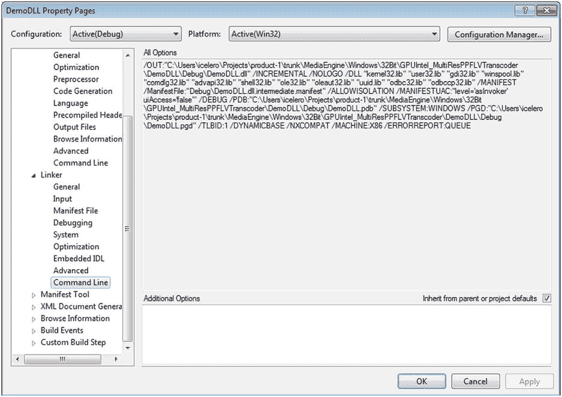

图 6-6。

Created DLL linker flags

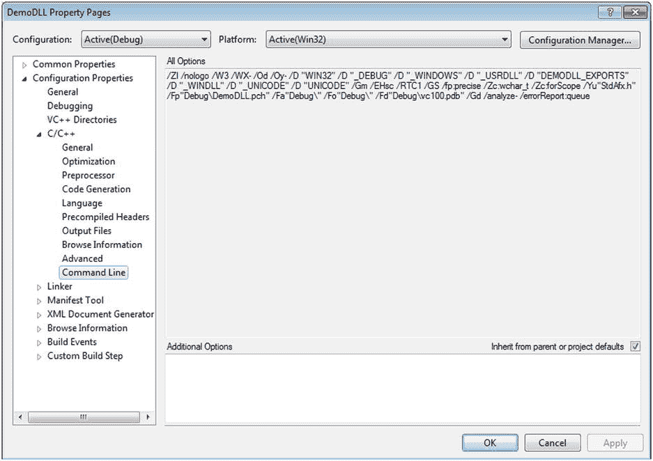

图 6-5。

Created DLL compiler flags

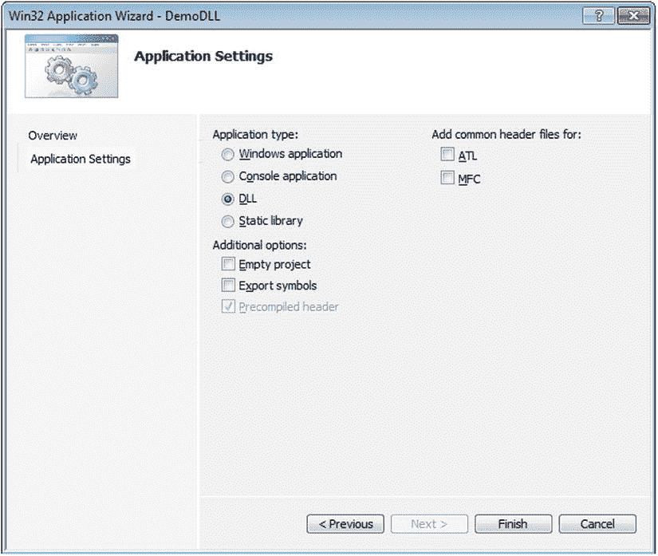

图 6-4。

Available Win32 DLL Settings

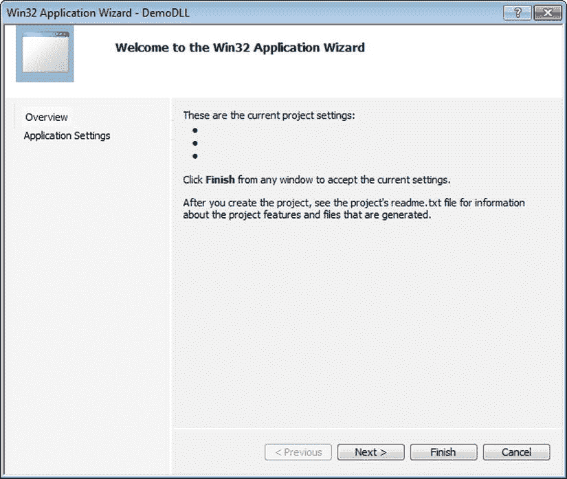

图 6-3。

Click the Next button to specify DLL choice

图 6-2。

The first step in creating Win32 dynamic library (DLL)

## 设计动态库

一般来说，设计动态库的过程与设计任何其他软件没有太大的不同。鉴于动态库的特殊性质，有几个特别重要的地方需要详细讨论。

### 设计二进制接口

就其本质而言，动态库通常向外部世界提供特定的功能，这种方式应该最小化客户对内部功能细节的参与。实现的方式是通过接口，在这个接口上，客户端可以最大程度地了解它不需要担心的任何事情。

在面向对象编程领域中无处不在的接口概念，在二进制代码重用领域中获得了额外的味道。正如在第五章的中的“二进制重用概念的影响”一节所解释的，动态链接的构建时和运行时阶段之间的应用程序二进制接口(ABI)的不变性是成功的动态链接的最基本要求。

乍一看，ABI 的设计与 API 的设计没有太大区别。接口概念的基本含义保持不变:为了使用专门模块提供的服务，需要向客户端提供一组功能。

事实上，只要程序不是用 C++ 编写的，动态库的 ABI 的设计工作就不需要比设计可重用软件模块的 API 更多的思考。事实上，ABI 只是一组需要在运行时加载的链接器符号，这并没有使事情发生实质性的变化。

然而，C++ 语言的影响(最明显的是缺乏严格的标准化)需要在设计动态库 ABI 时进行额外的思考。

#### C++ 问题

生活中一个不幸的事实是，在编程语言领域的进步之后，并没有对称地出现连接器的设计，或者准确地说，并没有出现软件领域标准制定机构的严格性。不这样做的充分理由将在本节中指出。一篇阐述这些问题的优秀文章是 [`www.lurklurk.org/linkers/linkers.html`](http://www.lurklurk.org/linkers/linkers.html) 的“初学链接者指南”。

让我们从简单的事实开始，回顾一些问题。

#### 问题 1: C++ 强加了更复杂的符号名要求

与 C 编程语言不同，C++ 函数到链接器符号的映射给链接器设计带来了更多的挑战。C++ 面向对象的特性带来了以下额外的考虑:

*   一般来说，C++ 函数很少是独立的；相反，它们倾向于隶属于各种代码实体。首先想到的是，在 C++ 中，函数通常属于类(因此甚至有一个特殊的名字:方法)。此外，类(以及它们的方法)可能属于名称空间。当模板发挥作用时，情况变得更加复杂。为了唯一地标识函数，链接器必须在它为函数入口点创建的符号中包含函数从属信息。
*   C++ 重载机制允许同一类的不同方法具有相同的名称、相同的返回值，但是在输入参数列表方面有所不同。为了唯一地标识共享相同名称的函数(方法)，链接器必须以某种方式将关于输入参数的信息添加到它为函数入口点创建的符号中。

响应这些复杂得多的需求的链接器设计工作导致了名为名称管理的技术。简而言之，名称管理是将函数名、函数的附属信息和函数的参数列表结合起来创建最终符号名的过程。通常，函数从属关系是在前面(前缀)，而函数签名信息是在函数名后面(后缀)。

麻烦的主要来源是名称混淆约定不是唯一标准化的，直到今天仍然是特定于供应商的。维基百科的文章( [`http://en.wikipedia.org/wiki/Name_mangling#How_different_compilers_mangle_the_same_functions`](http://en.wikipedia.org/wiki/Name_mangling#How_different_compilers_mangle_the_same_functions) )说明了不同链接者在名称篡改实现上的差异。正如文章中所述，除了 ABI 之外，还有许多因素在实现处理机制中发挥作用(异常处理堆栈、虚拟表的布局、结构和堆栈帧填充)。考虑到各种各样的需求，带注释的 C++ 参考手册甚至建议维护单独的 mangling 方案。

C-STYLE FUNCTIONS

使用 C++ 编译器时，使用 C 风格的函数会发生有趣的事情。即使 C 函数不需要 mangling，默认情况下，链接器也会为它们创建 mangled 名称。在希望避免篡改的情况下，必须应用特殊的关键字，以便建议链接器不要应用篡改。

该技术基于使用`extern "C"`关键字。当函数以如下方式声明时(通常在头文件中)

`#ifdef __cplusplus`

`extern "C"`

`{`

`#endif // __cplusplus`

`int myFunction(int x, int y);`

`#ifdef __cplusplus`

`}`

`#endif // __cplusplus`

最终的结果是，链接器创建了它的符号，没有任何混乱。在这一章的后面，关于输出 ABI 的部分将包含一个更详细的解释，为什么这是一个非常重要的技术。

#### 问题#2:静态初始化顺序失败

C 语言的继承之一是链接器可以处理相当简单的初始化变量，无论是简单的数据类型还是结构。链接器需要做的就是在`.data`部分保留存储，并将初始值写入该位置。在 C 语言的领域中，变量初始化的顺序通常并不特别重要。重要的是在程序启动前完成变量的初始化。

而在 C++ 中，数据类型一般是对象，它的初始化是在运行时通过对象构造的过程来完成的，对象构造是在类构造函数方法完成执行时完成的。显然，为了初始化 C++ 对象，链接器需要做更多的事情。为了方便链接器的工作，编译器将需要为特定文件执行的所有构造函数的列表嵌入到目标文件中，并将该信息存储到特定的目标文件段中。在链接时，链接器检查所有的目标文件，并将这些构造列表组合成将在运行时执行的最终列表。

在这一点上，重要的是要提到，链接器确实遵守基于继承链的构造函数的执行顺序。换句话说，保证首先执行基类构造函数，然后执行派生类的构造函数。这种嵌入到链接器中的逻辑对于大多数可能的场景都是足够的。

然而，链接器并不是无限智能的。不幸的是，有一整类情况，程序员没有以任何方式偏离 C++ 语法规则，然而链接器有限的逻辑仍然导致非常严重的崩溃，这种崩溃发生在程序加载之前，任何调试器都无法捕捉到它。

当一个对象的初始化依赖于其他一些预先初始化的对象时，这种典型的情况就会发生。我将首先解释问题的潜在机制，然后为程序员建议避免这些问题的方法。在 C++ 程序员的圈子里，这类问题通常被称为静态初始化顺序的惨败。

Note

Scott Meyer 的经典之作《有效的 C++》一书(“第 47 条:确保非局部静态对象在被使用前被初始化”)很好地说明了这个问题和解决方案。

##### 问题描述

非局部静态对象是 C++ 类的实例，其可见性范围超出了类的边界。更具体地，这样的对象可以是以下之一:

*   在全局或命名空间范围内定义
*   在类中声明为静态
*   在文件范围内定义了静态

在程序开始运行之前，这些对象通常由链接器初始化。对于每个这样的对象，链接器维护创建这样的对象所需的构造器的列表，并按照继承链指定的顺序执行它们。

不幸的是，这是链接器识别和实现的唯一对象初始化排序方案。现在是整个故事发生特殊转折的时候了。

让我们假设这些对象中的一个依赖于其他一些预先被初始化的对象。例如，假设您有两个静态对象:

*   对象`A`(类`a`的实例)，它初始化网络基础设施，查询可用网络列表，初始化套接字，并建立与认证服务器的初始连接。
*   对象`B`(类`b`的实例)，通过调用类`b`的实例上的接口方法，通过网络将消息发送到远程认证服务器。

显然，正确的初始化顺序是对象`B`在对象`A`之后初始化。显然，违反对象初始化的顺序很有可能造成严重破坏。即使设计者已经足够小心地设想了初始化没有完成的情况(即，在进行实际调用之前检查指针值)，最好的情况也是类`B`的任务没有按预期完成。

事实上，没有规则规定静态对象初始化的顺序。实现将检查代码的算法的尝试识别这样的场景，并向链接器建议正确的顺序，已经被证明属于非常难以解决的问题类别。其他 C++ 语言特性(模板)的存在只会增加问题解决的难度。

最终的结果是，链接器可以决定以任何顺序初始化非局部静态对象。更糟糕的是，链接器决定遵循哪个顺序可能取决于难以想象的大量不相关的运行时环境。

现实生活中，这样的问题很吓人，原因多种多样。首先，它们很难跟踪，因为它们会导致崩溃发生在进程加载连接之前，远远早于调试器可以提供任何帮助的时间。此外，崩溃事件可能不是持久的；崩溃可能不时发生，或者在某些情况下每次都有不同的症状。

##### 回避问题

尽管这个问题不适合心脏虚弱的人，但有一种方法可以避免这种丑陋的混乱。链接器规则不指定初始化变量的顺序，但是对于在函数体内声明的静态变量，这个顺序是非常精确地指定的。也就是说，在函数(或类方法)内部声明为静态的对象，当在调用该函数的过程中第一次遇到它的定义时，就被初始化。

这个问题的解决方案变得显而易见。实例不应在数据内存中自由漫游。相反，它们应该是

*   在函数中声明为静态变量。
*   函数应该被方便地用作访问这种在文件范围内静态定义的变量(例如，返回对对象的引用)的唯一方式。

总之，以下两种可能的解决方案传统上用于解决这类问题:

*   解决方案 1:提供`_init()`方法的自定义实现，这是一个加载动态库时立即调用的标准方法，其中一个类静态方法实例化对象，从而强制构造初始化。因此，可以提供标准`_fini()`的定制实现，即在动态库被卸载之前立即调用的标准方法，其中可以完成对象解除分配。
*   解决方案 2:用对自定义函数的调用替换对这种对象的直接访问。这样的函数将包含一个 C++ 类的静态实例，并将返回对它的引用。在第一次访问之前，将构造一个声明为 static 的变量，确保它的初始化发生在第一次实际调用之前。GNU 编译器和 C++11 标准保证了这个解决方案是线程安全的。

#### 问题#3:模板

引入模板的概念是为了消除相同算法的重复和可能分散的实现，这些实现只在算法操作的数据类型上有所不同。尽管这个概念很有用，但它给链接过程带来了额外的问题。

问题的本质是模板的不同专门化有完全不同的机器码表示。幸运的是，一旦编写完成，模板可能会以无数种方式专门化，这取决于模板用户希望如何使用它。以下模板

`template <class T>`

`T max(T x, T y)`

`{`

`if (x>y) { return x;}`

`else   536:26  { return y;}`

`}`

可能专门用于支持比较运算符的尽可能多的数据类型(从`char`一直到`double`的简单数据类型是直接候选)。

当编译器遇到模板时，它需要将其具体化为某种形式的机器代码。但是，在检查完所有其他源文件以确定代码中发生了哪个特定的专门化之前，这是不可能的。由于这对于独立应用程序来说可能相对容易，所以当模板由动态库导出时，这项任务需要认真考虑。

有两种解决这类问题的通用方法:

*   编译器可以生成所有可能的模板特化，并为每个模板特化创建弱符号。弱符号概念的完整解释可以在关于链接器符号类型的讨论中找到。请注意，一旦链接器确定在最终版本中实际上不需要弱符号，它就可以自由地丢弃它们。
*   另一种方法是，链接器直到最后都不包含任何模板专门化的机器码实现。一旦完成了所有其他的工作，链接器就可以检查代码，准确地确定哪些专门化是真正需要的，调用 C++ 编译器来创建所需的模板专门化，最后将机器码插入到可执行文件中。这种方法受到 Solaris C++ 编译器套件的青睐。

### 设计应用程序二进制接口

为了最大限度地减少潜在的麻烦，提高对不同平台的可移植性，甚至增强不同编译器创建的模块之间的互操作性，强烈建议实践以下准则。

#### 准则#1:将动态库 ABI 实现为一组 C 风格的函数

有很多很好的理由说明为什么这个建议很有意义。例如，您可以

*   避免基于 C++ 与链接器交互的各种问题
*   提高跨平台可移植性
*   提高不同编译器生成的二进制文件之间的互操作性。(有些编译器倾向于生成可供其他编译器使用的二进制文件。著名的例子是 MinGW 和 Visual Studio 编译器。)

为了将 ABI 符号导出为 C 风格的函数，使用`extern "C"`关键字来指示链接器不要在这些符号上应用名称篡改。

#### 准则 2:提供带有完整 ABI 声明的头文件

“完整的 ABI 声明”不仅指函数原型，还指预处理器定义、结构布局等。

#### 准则#3:使用广泛支持的标准 C 关键字

更具体地说，使用特定于项目的数据类型定义，或特定于平台的数据类型，或任何不被不同编译器和/或不同平台普遍支持的东西，只会招致将来的问题。所以，尽量不要表现得像个自以为聪明的家伙；相反，尽可能简单明了地编写代码。

#### 准则#4:使用类工厂机制(C++)或模块(C)

如果动态库的内部功能是由 C++ 类实现的，这并不意味着你应该违反准则#1。相反，你应该遵循所谓的类工厂方法(图 6-7 )。

类工厂(class factory)是一个 C 风格的函数，向外界表示一个或多个 C++ 类(类似于好莱坞代理人在与电影制片厂的谈判中代表很多明星演员)。

一般来说，类工厂对 C++ 类的布局非常了解，这通常是通过将其声明为同一个 C++ 类的静态方法来实现的。

当感兴趣的客户端调用时，类工厂创建它所代表的 C++ 类的一个实例。为了不让客户窥探 C++ 类布局的细节，它从不将类的实例转发回调用者。相反，它将 C++ 类强制转换为 C 风格的接口，并将指向创建的 C++ 对象的指针强制转换为接口指针。

图 6-7。

The class factory concept

当然，为了让这个方案正确运行，由类工厂表示的 C++ 类必须实现导出接口。在 C++ 的特殊情况下，这意味着类应该公开继承接口。这样，将类指针转换为接口指针就非常自然了。

最后，这种方案要求某种分配跟踪机制跟踪由类工厂函数分配的所有实例。在 Microsoft 组件对象模型(COM)技术中，引用计数确保分配的对象在不再使用时被销毁。在其他实现中，建议保留指向已分配对象的指针列表。在终止时(通过调用某种清理函数来描述)，每个列表元素都将被删除，列表最终被清理。

类工厂的 C 等价体通常被称为模块。它是通过一组精心设计的接口函数向外部世界提供功能的代码体。

模块化设计是低层内核模块和设备驱动程序的典型设计，但它的应用决不局限于那个特定的领域。典型模块导出函数，如`Open()`(或`Initialize()`)、一个或多个工人函数(`Read()`、`Write()`、`SetMode()`等。)，最后是`Close()`(或者`Deinitialize()`)。

对于模块来说，非常典型的是使用`handle`，一种模块实例标识符，经常被实现为 void 指针，这是 C++ 中`this`指针的前身。

`handle`通常在`Open()`方法中创建，并返回给调用者。在对其他模块接口方法的调用中，`handle`是必需的第一个函数参数。

在 C++ 不是一个选项的情况下，设计 C 模块是完全可行的，相当于类工厂的面向对象概念。

#### 准则 5:只导出真正重要的符号

由于本质上是模块化的，动态库的设计应该使其功能通过一组明确定义的函数符号(应用程序二进制接口，ABI)向外界公开，而所有其他只在内部使用的函数的符号应该可以被客户端可执行文件访问。

这种方法有几个好处:

*   增强了对专有内容的保护。
*   由于导出符号数量的显著减少，库加载时间可能会大大缩短。
*   不同动态库之间冲突/重复符号的机会显著减少。

这个想法相当简单:动态库应该只导出加载库的人绝对需要的函数和数据的符号，所有其他的符号都应该是不可见的。下一节将介绍有关控制动态库符号可见性的更多详细信息。

#### 准则#6:使用名称空间来避免符号命名冲突

通过将动态库的代码包含到唯一的名称空间中，您消除了不同的动态库使用相同命名的符号的可能性(函数`Initialize()`是一个很好的例子，它可能出现在功能范围完全不同的动态库中)。

### 控制动态库符号的可见性

从高层次的角度来看，导出/隐藏链接器符号的机制在 Windows 和 Linux 中几乎是相同的。唯一的实质性区别是，默认情况下，所有 Windows DLL 链接器符号都是隐藏的，而在 Linux 中，所有动态库链接器符号都是默认导出的。

实际上，由于 GCC 为实现跨平台一致性而提供的一组功能，符号导出的机制看起来非常相似，做的事情也非常相似，从某种意义上说，最终只有包含应用程序二进制接口的链接器符号被导出，而所有剩余的符号都被隐藏/不可见。

#### 导出 Linux 动态库符号

与 Windows 不同，在 Linux 中，所有动态库的链接器符号都是默认导出的，所以无论是谁试图动态链接该库，它们都是可见的。尽管这样的缺省使得处理动态库变得容易，但是出于许多不同的原因，保持所有的符号导出/可见并不是推荐的做法。过多地暴露在顾客窥探的目光下从来都不是一个好习惯。此外，加载所需的最少数量的符号与加载大量符号相比，可能会在加载库所需的时间上产生明显的差异。

很明显，需要对哪些符号被导出进行某种控制。此外，由于这种控制已经在 Windows DLLs 中实现，实现并行性将极大地促进可移植性工作。

有几种机制可以在生成时实现对符号导出的控制。此外，可以通过在动态库二进制文件上运行`strip`命令行工具来应用强力方法。最后，为了控制动态库符号的可见性的同一个目标，可以组合几种不同的方法。

##### 构建时的符号导出控件

GCC 编译器提供了几种设置链接器符号可见性的机制:

方法 1:(影响整个代码体)

`-fvisibility compiler flag`

正如 GCC 手册页所述( [`http://linux.die.net/man/1/gcc`](http://linux.die.net/man/1/gcc) )，通过传递

对于试图动态链接动态库的人来说，可以使每个动态库符号不导出/不可见。

方法 2:(仅影响单个符号)

`__attribute__ ((visibility("<default | hidden>")))`

通过用 attribute 属性修饰函数签名，可以指示链接器允许(默认)或不允许(隐藏)导出符号。

方法 3:(影响单个符号或一组符号)

`#pragma GCC visibility [push | pop]`

该选项通常用在头文件中。通过做这样的事情

`#pragma visibility push(hidden)`

`void someprivatefunction_1(void);`

`void someprivatefunction_2(void);`

`...`

`void someprivatefunction_N(void);`

`#pragma visibility pop`

你基本上是使所有在`#pragma`语句之间声明的函数不可见/不导出。

这三种方法可以以程序员认为合适的任何方式组合。

##### 其他方法

GNU 链接器支持处理动态库版本的复杂方法，其中一个简单的脚本文件被传递给链接器(通过`-Wl,--version-script,<script filename>`链接器标志)。尽管该机制的最初目的是指定版本信息，但它也具有影响符号可见性的能力。它完成任务的简单性使这种技术成为控制符号可见性的最优雅的方式。关于这项技术的更多细节可以在第十一章讨论 Linux 库版本控制的章节中找到。

#### 符号导出控件演示示例

为了说明可见性控制机制，我创建了一个演示项目，其中构建了两个具有不同可见性设置的相同动态库。这些库被恰当地命名为`libdefaultvisibility.so`和`libcontrolledvisibility.so`。库构建完成后，使用`nm`实用程序检查它们的符号(在第十二章和第十三章中有详细介绍)。

##### 默认符号可见性情况

清单 6-1 显示了`libdefaultvisibility.so`的源代码。

清单 6-1。libdefaultvisibility.so

`#include "sharedLibExports.h"`

`void mylocalfunction1(void)`

`{`

`printf("function1\n");`

`}`

`void mylocalfunction2(void)`

`{`

`printf("function2\n");`

`}`

`void mylocalfunction3(void)`

`{`

`printf("function3\n");`

`}`

`void printMessage(void)`

`{`

`printf("Running the function exported from the shared library\n");`

`}`

对构建的库二进制文件中存在的符号进行检查并不会带来什么意外，因为所有函数的符号都被导出并可见，如图 6-8 所示。

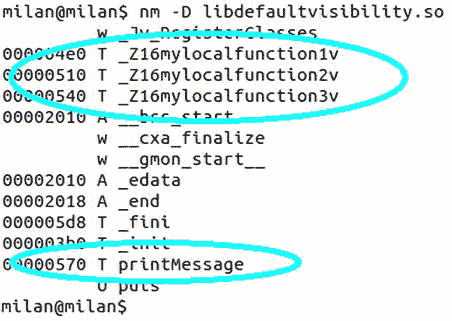

图 6-8。

All library symbols are originally exported/visible

##### 受控符号可见性情况

在你想要控制符号可见性/可导出性的动态库的情况下，`-fvisibility`编译器标志是在项目 Makefile 中指定的，如清单 6-2 所示。

清单 6-2。-fvisibility 编译器标志

`...`

`#`

`# Compiler`

`#`

`INCLUDES        = $(COMMON_INCLUDES)`

`DEBUG_CFLAGS    = -Wall -g -O0`

`RELEASE_CFLAGS  = -Wall -O2`

`VISIBILITY_FLAGS = -fvisibility=hidden -fvisibility-inlines-hidden`

`ifeq ($(DEBUG), 1)`

`CFLAGS          = $(DEBUG_CFLAGS) -fPIC $(INCLUDES)`

`else`

`CFLAGS          = $(RELEASE_CFLAGS) -fPIC $(INCLUDES)`

`endif`

`CFLAGS          +=` `$(VISIBILITY_FLAGS)`

`COMPILE          = g++ $(CFLAGS)`

`...`

当仅使用这种特殊的符号可见性设置构建库时，对符号的检查表明功能符号尚未导出(图 6-9 )。

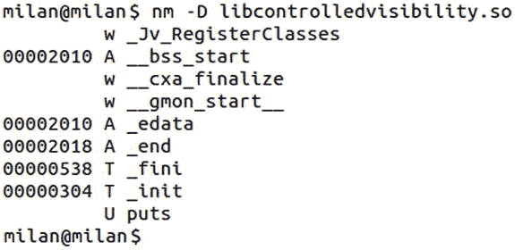

图 6-9。

All library symbols are now hiden

接下来，当应用带有可见性属性的函数签名修饰时，如清单 6-3 所示，最终结果是用`__attribute__ ((visibility("default")))`声明的函数变得可见(图 6-10 )。

清单 6-3。应用了可见性属性的函数签名修饰

`#include "sharedLibExports.h"`

`#if 1`

`#define FOR_EXPORT __attribute__ ((visibility("default")))`

`#else`

`#define FOR_EXPORT`

`#endif`

`void mylocalfunction1(void)`

`{`

`printf("function1\n");`

`}`

`...etc...`

`//`

`// also supported:`

`//              FOR_EXPORT void printMessage(void)`

`// but this is not supported:`

`//      void printMessage FOR_EXPORT (void)`

`// nor this:`

`//              void printMessage(void) FOR_EXPORT`

`//`

`// i.e. attribute may be declared anywhere`

`// before the function name`

`void``FOR_EXPORT`

`{`

`printf("Running the function exported from the shared library\n");`

`}`

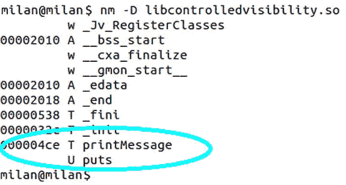

图 6-10。

Visibility control applied to function printMessage

##### 使用去废工具

控制符号可见性的另一种机制是可用的。它没有那么复杂，也不可编程。相反，它是通过运行`strip`命令行实用程序来实现的(图 6-11 )。这种方法要残酷得多，因为它有能力完全擦除关于任何库符号的任何信息，以至于任何通常的符号检查实用程序都无法看到任何符号，无论它是否在`.dynamic`部分。

图 6-11。

Using the strip utility to eliminate certain symbols Note

关于`strip`工具的更多信息可以在第十三章中找到。

#### 导出 Windows 动态库符号

在 Linux 中，默认情况下，客户端可执行文件可以访问动态库中的所有链接器符号。然而，在 Windows 中，情况并非如此。相反，只有正确导出的符号对客户端可执行文件可见。强制实施这一限制的重要部分是在构建阶段使用单独的二进制文件(导入库),它只包含计划导出的符号。

幸运的是，导出 DLL 符号的机制完全在程序员的控制之下。事实上，有两种受支持的机制可以声明 DLL 符号用于导出。

##### 使用 __declspec(dllexport)关键字

这种机制是 Visual Studio 标准提供的。在新建项目对话框中勾选“导出符号”复选框，如图 6-12 所示。

图 6-12。

Selecting the “Export symbols” option in Win32 DLL Wizzard dialog

在这里，您指定希望项目向导生成包含代码片段的库导出头，看起来有点像图 6-13 。

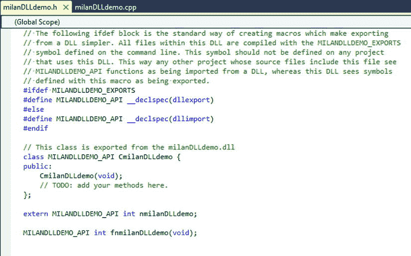

图 6-13。

Visual Studio generates project-specific declaration of __declspec(dllexport) keywords

如图 6-13 所示，导出头既可以在 DLL 项目内部使用，也可以由客户端可执行项目使用。当在 DLL 项目中使用时，特定于项目的宏在 DLL 项目中计算为关键字`__declspec(dllexport)`，而在客户端可执行项目中计算为`__declspec(dllimport)`。这是由 Visual Studio 强制执行的，它会自动将预处理器定义插入到 DLL 项目中(图 6-14 )。

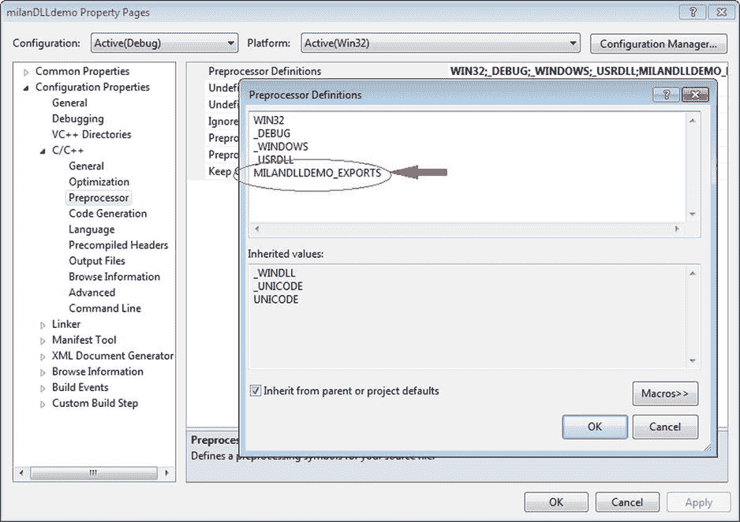

图 6-14。

Visual Studio automatically generates the project-specific preprocessor definition

当评估为`__declspec(dllexport)`的特定于项目的关键字被添加到函数声明中时，函数链接器符号被导出。否则，省略这样一个特定于项目的关键字肯定会阻止函数符号的导出。图 6-15 有两个功能，其中只有一个声明出口。

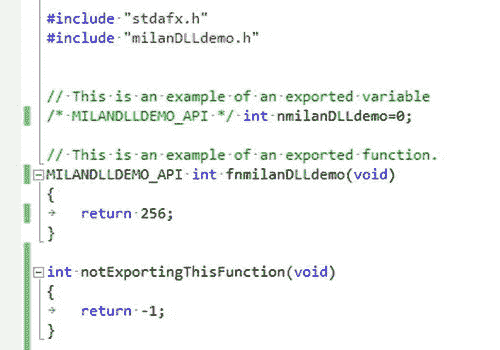

图 6-15。

Visual Studio automatically generates example of using project-specific symbol export control keyword

现在是介绍 Visual Studio `dumpbin`实用程序的最佳时机，您可以使用它在搜索导出符号时分析 DLL。它是 Visual Studio tools 的一部分，只有运行专门的 Visual Studio Tools 命令提示符才能使用(图 6-16 )。

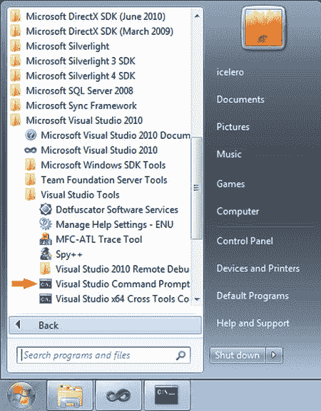

图 6-16。

Launching Visual Studio command prompt to access the collection of binary analysis command-line tools

图 6-17 显示了`dumpbin`工具(用`/EXPORT`标志调用)关于你的 DLL 输出的符号的报告。

图 6-17。

Using dumpbin.exe to view the list of DLL exported symbols

显然，用特定于项目的导出符号声明的函数符号最终会被 DLL 导出。然而，链接器根据 C++ 准则处理它，该准则使用名称篡改。客户端可执行文件通常不会有解释这些符号的问题，但是如果有，你可以将函数声明为`extern "C"`，这将导致函数符号遵循 C 风格的约定(图 6-18 )。

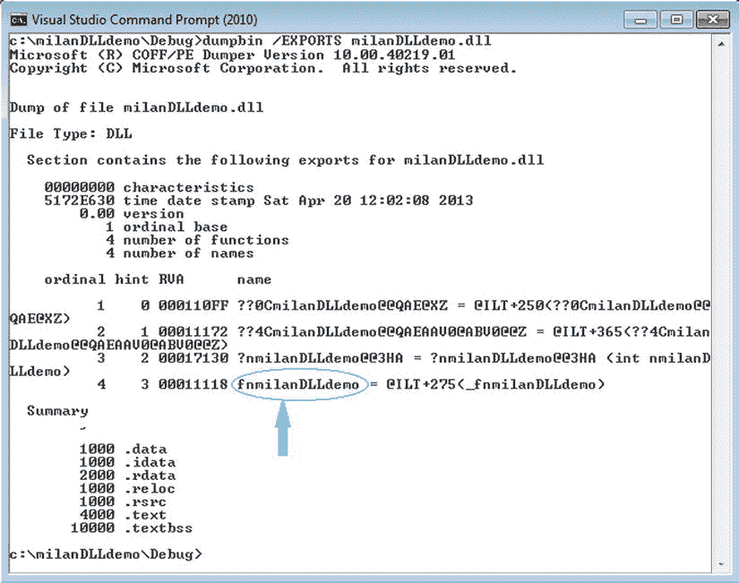

图 6-18。

Declaring the function as `extern "C"`

##### 使用模块定义文件(。def)

控制 DLL 符号导出的另一种方法是通过使用模块定义(。`def`)文件。与前面描述的机制(基于`__declspec(dllexport)`关键字)不同，它可以通过选中“Export symbols”复选框，通过项目创建向导来指定，模块定义文件的使用需要一些更明确的措施。

首先，如果你计划使用`.def`文件，建议不要勾选“导出符号”复选框。相反，使用文件➡新建菜单创建一个新的定义(。`def`)文件。如果这一步完成正确，项目设置会显示模块定义文件正式成为项目的一部分，如图 6-19 所示。

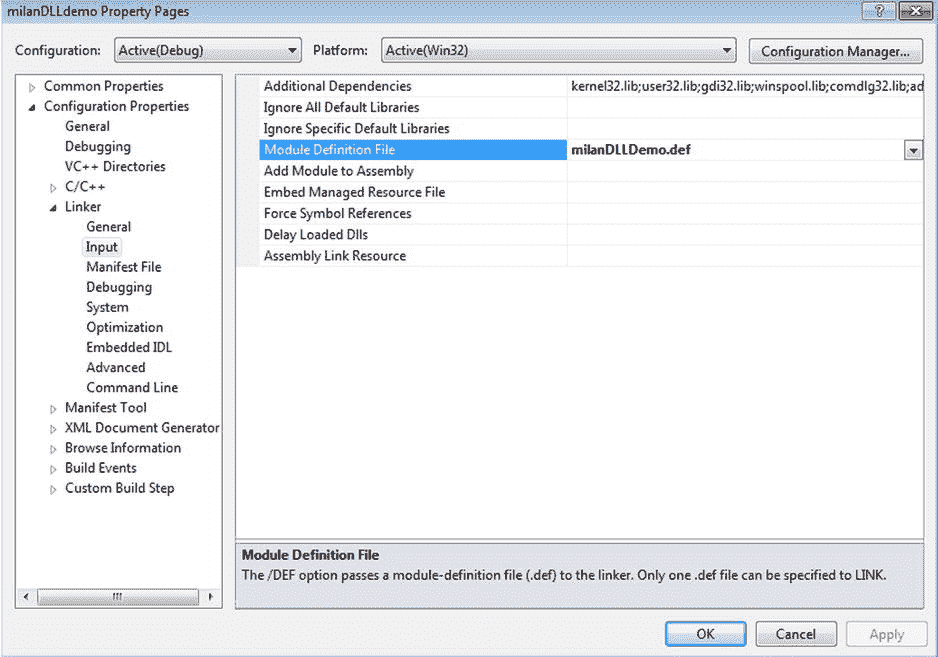

图 6-19。

Module-definition (.def) file is officially part of the project

或者，您可以手动编写`.def`文件，手动将其添加到项目源文件列表中，最后，手动编辑链接器属性页，如图 6-19 所示。指定用于导出的演示功能的模块定义文件如图 6-20 所示。

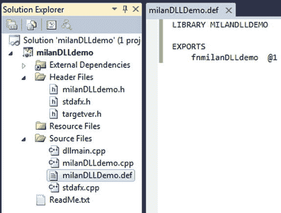

图 6-20。

Module-definition file example

在 EXPORTS 行下，它可能包含与您计划导出其符号的函数一样多的行。

一个有趣的细节是，模块定义文件的使用导致函数符号导出为 C 风格的函数，而不需要将函数声明为`extern "C"`。这是优点还是缺点取决于个人喜好和设计环境。

使用模块定义的一个特别优点是。`def`)文件作为导出 DLL 符号的方法是，在某些交叉编译的情况下，非微软编译器倾向于支持这个选项。

一个这样的例子是使用 MinGW 编译器，它编译一个开源项目(例如 ffmpeg)来创建 Windows DLLs 和相关的`.def`文件。为了在构建时动态链接 DLL，您需要使用它的导入库，不幸的是，它不是由 MinGW 编译器生成的。

幸运的是，Visual Studio 工具提供了`lib.exe`命令行实用程序，它可以基于`.def`文件的内容生成导入库文件(图 6-20 )。lib 工具可通过 Visual Studio 工具命令提示符获得。图 6-21 中的例子说明了在交叉编译会话后如何使用该工具，在交叉编译会话中，运行在 Linux 上的 MinGW 编译器产生了 Windows 二进制文件(但没有提供导入库)。

图 6-21。

Generating import library files for DLLs generated by MingW compiler based on specified module definition (.def) files

处理模块定义文件的缺点(。def)

在试验`.def`文件时，发现了以下缺点:

*   无法区分 C++ 类方法和 C 函数:如果在一个 DLL 中有一个类，并且该类有一个与您在`.def`文件中指定要导出的 C 函数同名的方法，编译器将报告一个冲突，同时试图确定这两个中的哪一个应该被导出。
*   `extern "C"`怪癖:一般来说，在`.def`文件中声明为导出的函数不需要声明为`extern "C"`，因为链接器会注意它的符号遵循 C 惯例。然而，如果您仍然决定将函数修饰为`extern "C"`，请确保在头文件和源文件`.cpp`中都这样做(后者通常不是必需的)。如果不这样做，链接器会不知何故地混乱，客户端应用程序将无法链接您导出的函数符号。对于更难的问题，`dumpbin`实用程序输出不会显示任何差异，这使得问题更难解决。

### 链接完成要求

动态库创建过程是一个完整的构建过程，因为它包括编译和链接阶段。一般来说，一旦每个链接器符号都被解析，链接阶段就完成了，不管目标是可执行还是动态库，都应该遵守这个标准。

在 Windows 中，这一规则被严格执行。在每个动态库符号被解析之前，链接过程不会被视为完成，输出二进制文件也不会被创建。搜索相关库的完整列表，直到最后一个符号引用被解析。

然而，在 Linux 中，默认情况下，当构建动态库时，这个规则有点扭曲，因为它允许动态库的链接完成(并创建二进制文件)，即使不是所有的符号都已被解析。

允许这种偏离原本严格的规则的原因是，它隐含地假设在链接阶段丢失的符号最终会以某种方式出现在进程内存映射中，这很可能是运行时加载其他动态库的结果。动态库未提供的所需符号被标记为未定义(“U”)。

通常，如果由于某种原因，预期的符号没有出现在进程的内存映射中，操作系统倾向于通过在 stderr 流中打印文本消息，指定丢失的符号来报告原因。

链接动态库的 Linux 规则中的这种灵活性已经在许多场合被证明是一个积极的因素，允许有效地克服某些非常复杂的链接限制。

#### -no-未定义的链接器标志

尽管默认情况下在 Linux 中链接动态库要宽松得多，但是 GCC 链接器支持建立与 Windows 链接器遵循的标准相匹配的链接严格性标准。

如果在构建时没有解析每个符号，那么将`--no-undefined`标志传递给 gcc 链接器将导致构建失败。通过这种方式，Linux 默认的容忍未解析符号的存在被有效地转化为类似 Windows 的严格标准。

注意，当通过 gcc 调用链接器时，链接器标志必须以前缀`-Wl`开头，例如:

`$ gcc -fPIC <source files> -l <libraries>``-Wl,--no-undefined`

## 动态链接模式

链接动态库的决定可以在程序生命周期的不同阶段做出。在某些场景中，您预先知道您的客户端二进制文件无论如何都需要加载特定的动态库。在其他场景中，关于加载某个动态库的决定是运行时环境的结果，或者是运行时设置的用户偏好。基于何时实际做出关于动态链接的决定，可以区分以下动态链接模式。

### 静态感知(加载时)动态链接

在到目前为止的所有讨论中，我已经隐含地假设了这个特定的场景。事实上，从程序启动的那一刻起，一直到程序终止，对特定动态库功能的需求是经常发生的，这一事实是预先知道的。在这种情况下，构建过程需要下列项目。

在编译时:

*   动态库的导出头文件，指定与库的 ABI 接口相关的所有内容

链接时:

*   项目所需的动态库列表
*   客户端二进制文件设置预期库符号列表所需的动态库二进制文件的路径。

关于如何指定路径的更多细节，请查看“构建时库位置规则”一节。

*   指定链接过程细节的可选链接器标志

### 运行时动态链接

动态链接特性的全部优点是程序员能够在运行时确定是否真的需要某个动态库和/或需要加载哪个特定的库。

很多时候，设计要求存在许多动态库，每个库都支持相同的 ABI，并且根据用户的选择只加载其中的一个。这种情况的一个典型例子是多语言支持，在这种情况下，应用程序根据用户的偏好加载动态库，该动态库包含以用户选择的语言编写的所有资源(字符串、菜单项、帮助文件)。

在这种情况下，构建过程需要下列项目。

在编译时:

*   动态库的导出头文件，指定与库的 ABI 接口相关的所有内容

链接时:

*   至少是要加载的动态库的文件名。动态库文件名的确切路径通常通过依赖于控制路径选择的一组优先级规则来隐式解析，在运行时在该路径中期望找到库二进制文件。

所有主要的操作系统都提供了一组简单的 API 函数，允许程序员充分利用这一宝贵的特性(表 6-1 )。

表 6-1。

API Functions

<colgroup><col> <col> <col></colgroup> 
| 目的 | Linux 版本 | Windows 版本 |
| --- | --- | --- |
| 库装载 | `dlopen()` | `LoadLibrary()` |
| 寻找符号 | `dlsym()` | `GetProcAddress()` |
| 库卸载 | `dlclose()` | `FreeLibrary()` |
| 错误报告 | `dlerror()` | `GetLastError()` |

不管操作系统和/或编程环境如何，使用这些函数的典型范例可以用下面的伪代码序列来描述:

`1) handle = do_load_library("<library path>", optional_flags);`

`if(NULL == handle)`

`report_error();`

`2) pFunction = (function_type)do_find_library_symbol(handle);`

`if(NULL == pFunction)`

`{`

`report_error();`

`unload_library();`

`handle = NULL;`

`return;`

`}`

`3) pFunction(function arguments); // execute the function`

`4) do_unload_library(handle);`

`handle = NULL;`

清单 6-4 和 6-5 提供了运行时动态加载的简单说明。

清单 6-4。Linux 运行时动态加载

`#include <stdlib.h>`

`#include <stdio.h>`

`#include <dlfcn.h>`

`#define PI (3.1415926536)`

`typedef double (*PSINE_FUNC)(double x);`

`int main(int argc, char **argv)`

`{`

`void *pHandle;`

`pHandle =``dlopen`

`if(NULL == pHandle) {`

`fprintf(stderr, "%s\n",``dlerror`

`return -1;`

`}`

`PSINE_FUNC pSineFunc = (PSINE_FUNC)``dlsym`

`if (NULL == pSineFunc) {`

`fprintf(stderr, "%s\n",``dlerror`

`dlclose(pHandle);`

`pHandle = NULL;`

`return -1;`

`}`

`printf("sin(PI/2) = %f\n", pSineFunc(PI/2));`

`dlclose` `(pHandle);`

`pHandle = NULL;`

`return 0;`

`}`

清单 6-5 展示了 Windows 运行时动态加载，其中我们试图加载 DLL，定位函数 DllRegisterServer()和/或 DllUnregisterServer()的符号并执行它们。

清单 6-5。Windows 运行时动态加载

`#include <stdio.h>`

`#include <Windows.h>`

`#ifdef __cplusplus`

`extern "C"`

`{`

`#endif // __cplusplus`

`typedef HRESULT (*PDLL_REGISTER_SERVER)(void);`

`typedef HRESULT (*PDLL_UNREGISTER_SERVER)(void);`

`#ifdef __cplusplus`

`}`

`#endif // __cplusplus`

`enum`

`{`

`CMD_LINE_ARG_INDEX_EXECUTABLE_NAME = 0,`

`CMD_LINE_ARG_INDEX_INPUT_DLL,`

`CMD_LINE_ARG_INDEX_REGISTER_OR_UNREGISTER,`

`NUMBER_OF_SUPPORTED_CMD_LINE_ARGUMENTS`

`} CMD_LINE_ARG_INDEX;`

`int main(int argc, char* argv[])`

`{`

`HINSTANCE dllHandle = ::``LoadLibraryA`

`if(NULL == dllHandle)`

`{`

`printf("Failed loading %s\n", argv[CMD_LINE_ARG_INDEX_INPUT_DLL]);`

`return -1;`

`}`

`if(NUMBER_OF_SUPPORTED_CMD_LINE_ARGUMENTS > argc)`

`{`

`PDLL_REGISTER_SERVER pDllRegisterServer =`

`(PDLL_REGISTER_SERVER)``GetProcAddress`

`if(NULL == pDllRegisterServer)`

`{`

`printf("Failed finding the symbol \"DllRegisterServer\"");`

`::``FreeLibrary`

`dllHandle = NULL;`

`return -1;`

`}`

`pDllRegisterServer();`

`}`

`else`

`{`

`PDLL_UNREGISTER_SERVER pDllUnregisterServer =`

`(PDLL_UNREGISTER_SERVER)``GetProcAddress`

`if(NULL == pDllUnregisterServer)`

`{`

`printf("Failed finding the symbol \"DllUnregisterServer\"");`

`::``FreeLibrary`

`dllHandle = NULL;`

`return -1;`

`}`

`pDllUnregisterServer();`

`}`

`::``FreeLibrary`

`dllHandle = NULL;`

`return 0;`

`}`

### 动态链接模式比较

这两种动态链接模式之间几乎没有实质性的区别。尽管动态链接发生的时刻不同，但在两种情况下，动态链接的实际机制是完全相同的。

此外，可以静态加载的动态库也可以在运行时动态加载。动态库设计中没有任何元素可以严格限定库在不同场景中的使用。

唯一的实质性区别是，在静态感知场景中，有一个额外的需求需要满足:您需要提供构建时库的位置。正如将在下一章中展示的，这个任务需要一些技巧，一个好的软件开发人员在 Linux 和 Windows 环境中都需要知道这些技巧。