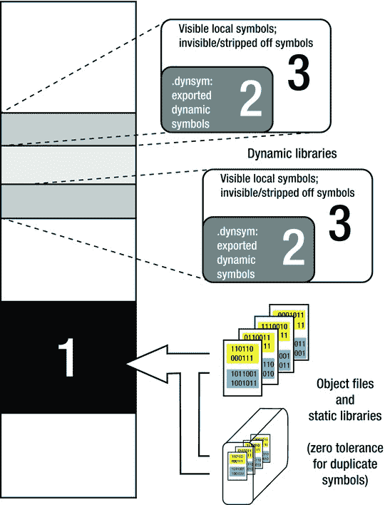
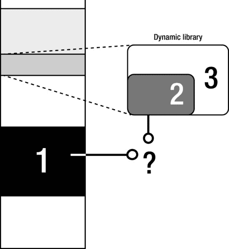
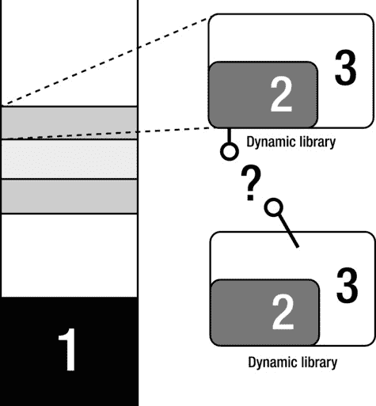
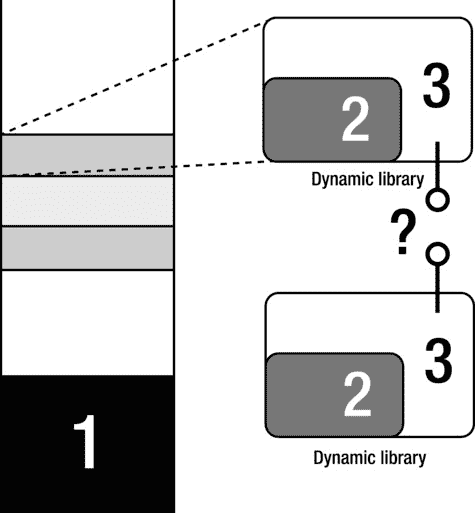

# 九、在动态库中链接时处理重复符号

Abstract

动态链接的概念显然代表了软件设计领域的一大进步。它带来的前所未有的灵活性为技术进步开辟了许多途径，也为全新的概念打开了许多新的大门。

动态链接的概念显然代表了软件设计领域的一大进步。它带来的前所未有的灵活性为技术进步开辟了许多途径，也为全新的概念打开了许多新的大门。

出于同样的原因，动态库内部如何工作的复杂性给软件工具链(编译器、连接器、加载器)领域带来了几个不同的挑战。早期认识到需要链接器和加载器更紧密地合作，实现这一点的技术在前一章已经讨论过了。

然而，这并不是故事的结尾。

与动态库领域密切相关的另一个有趣的范例是处理重复符号的问题。更具体地说，当动态库是链接过程中的输入成分时，链接器偏离了通常的、常识性的方法，该方法通常在单个目标文件和/或静态库被组合成二进制文件的情况下遵循。

## 重复符号定义

在解析引用的过程中可能发生的最常见问题是出现重复符号，在链接的最后阶段，当所有可用符号的列表包含两个或更多同名符号时，就会出现这种情况。

顺便提一下，出于内部目的，链接器算法通常会修改原始符号名。作为一个直接的结果，链接器打印出来的报告的重复问题可能指的是与原始名称有些不同的名称。符号名称修改的范围可以从简单的名称修饰(例如，在下划线前加前缀)一直到 C++ 函数关联问题的系统处理。幸运的是，修改通常以严格统一和可预测的方式执行。

### 典型的重复符号场景

重复符号的原因可能各不相同。在最简单的情况下，不同的设计者为他们的模块类、函数、结构选择了最明显的名字(例如，类`Timer`、函数`getLength()`或变量`lastError`或`libVersion`)。试图组合这些设计者的模块不可避免地导致发现重复符号的存在。

其他可能性包括在头文件中定义数据类型实例(类、结构或简单数据类型)的典型情况。不止一次包含头文件不可避免地会产生重复符号的情况。

#### 重复的 C 符号

C 语言对于两个或更多的符号被认为是彼此的副本强加了相当简单的标准。只要函数、结构或数据类型的名称相同，符号就被认为是相同的。

例如，构建以下代码将会失败:

`file: main.c`

`#include <stdio.h>`

`int``function_with_duplicated_name`

`{`

`printf("%s\n", __FUNCTION__);`

`return 0;`

`}`

`int``function_with_duplicated_name`

`{`

`printf("%s\n", __FUNCTION__);`

`return 0;`

`}`

`int main(int argc, char* argv[])`

`{`

`function_with_duplicated_name(1);`

`function_with_duplicated_name(1,2);`

`return 0;`

`}`

它将产生以下错误消息:

`main.c:9:5: error: conflicting types for 'function_with_duplicated_name'`

`main.c:3:5: note: previous definition of 'function_with_duplicated_name' was here`

`main.c: In function 'main':`

`main.c:17:5: error: too few arguments to function 'function_with_duplicated_name'`

`main.c:9:5: note: declared here`

`gcc: error: main.o: No such file or directory`

`gcc: fatal error: no input files`

`compilation terminated.`

#### 重复的 C++ 符号

作为一种面向对象的编程语言，C++ 规定了更宽松的重复符号标准。就名称空间、类/结构和简单数据类型而言，使用相同的名称仍然是重复符号的唯一标准。然而，在函数领域中，重复符号标准不再仅限于函数名，还考虑了参数列表。

函数(方法)重载的原则允许对具有不同输入参数列表的同一类的不同方法使用相同的名称，只要返回值类型相同。

同样的原则也适用于属于同一个名称空间的两个或多个函数不属于任何类的情况。即使这样的函数不附属于任何类，也适用更灵活的 C++ 重复标准——只有当它们的名称相同并且它们的输入参数列表相同时，它们才被认为是重复的。

将成功完成以下代码的构建:

`file: main.cpp`

`#include <iostream>`

`using namespace std;`

`class CTest`

`{`

`public:`

`CTest(){ x = 0;};`

`∼CTest(){};`

`public:`

`int runTest(void){ return x;};`

`private:`

`int x;`

`};`

`int``function_with_duplicated_name`

`{`

`cout << __FUNCTION__ << "(x)" << endl;`

`return 0;`

`}`

`int``function_with_duplicated_name`

`{`

`cout << __FUNCTION__ << "(x,y)" << endl;`

`return 0;`

`}`

`int main(int argc, char* argv[]){`

`CTest test;`

`int x = test.runTest();`

`function_with_duplicated_name(x);`

`function_with_duplicated_name(x,1);`

`return 0;`

`}`

`file: build.sh`

`g++ -Wall -g -O0 -c main.cpp`

`g++ main.o -o clientApp`

运行生成的二进制文件将创建以下输出:

`function_with_duplicated_name(x)`

`function_with_duplicated_name(x,y)`

然而，试图将下面方法的声明添加到`main.cpp`

`float function_with_duplicated_name(int x)`

`{`

`cout << __FUNCTION__ << "(x)" << endl;`

`return 0.0f;`

`}`

将违反 C++ 函数重载的基本规则，这将导致以下构建失败:

`main.cpp: In function 'float function_with_duplicated_name(int)':`

`main.cpp:23:42: error: new declaration 'float function_with_duplicated_name(int)'`

`main.cpp:17:5: error: ambiguates old declaration 'int function_with_duplicated_name(int)'`

`g++: error: main.o: No such file or directory`

`g++: fatal error: no input files`

`compilation terminated.`

## 重复符号默认处理

当单个目标文件或静态库被链接在一起成为结果二进制文件时，链接器严格遵循对重复符号的零容忍策略。

当链接器检测到重复符号时，它会打印出一条错误消息，指明出现重复符号的文件/代码行，并声明链接失败。这基本上意味着开发人员需要回到绘图板并尝试解决问题，这很可能意味着代码需要重新编译。

以下示例说明了当您试图将两个具有重复符号的静态库链接到同一个客户端二进制文件时会发生什么。该项目由两个非常简单的静态库组成，具有重复的符号以及试图链接它们的客户端应用程序:

`Static Library libfirst.a:`

`file: staticlibfirstexports.h`

`#pragma once`

`int staticlibfirst_function(int x);`

`int staticlib_duplicate_function(int x);`

`file: staticlib.c`

`#include <stdio.h>`

`int staticlibfirst_function(int x)`

`{`

`printf("%s\n", __FUNCTION__);`

`return (x+1);`

`}`

`int staticlib_duplicate_function(int x)`

`{`

`printf("%s\n", __FUNCTION__);`

`return (x+2);`

`}`

`file: build.sh`

`gcc -Wall -g -O0 -c staticlib.c`

`ar -rcs libfirst.a staticlib.o`

`Static Library libsecond.a:`

`file: staticlibsecondexports.h`

`#pragma once`

`int staticlibsecond_function(int x);`

`int staticlib_duplicate_function(int x);`

`file: staticlib.c`

`#include <stdio.h>`

`int staticlibsecond_function(int x)`

`{`

`printf("%s\n", __FUNCTION__);`

`return (x+1);`

`}`

`int staticlib_duplicate_function(int x)`

`{`

`printf("%s\n", __FUNCTION__);`

`return (x+2);`

`}`

`file: build.sh`

`gcc -Wall -g -O0 -c staticlib.c`

`ar -rcs libsecond.a staticlib.o`

客户端应用程序:

`file: main.c`

`#include <stdio.h>`

`#include "staticlibfirstexports.h"`

`#include "staticlibsecondexports.h"`

`int main(int argc, char* argv[])`

`{`

`int nRetValue = 0;`

`nRetValue += staticlibfirst_function(1);`

`nRetValue += staticlibsecond_function(2);`

`nRetValue += staticlib_duplicate_function(3);`

`printf("nRetValue = %d\n", nRetValue);`

`return nRetValue;`

`}`

文件:build.sh

`gcc -Wall -g -O0 -I../libFirst -I../libSecond -c main.c`

`gcc main.o -L../libFirst -lfirst -L../libSecond -lsecond -o clientApp`

由于两个静态库中存在重复的符号，尝试构建客户端应用程序会导致链接器错误:

`/home/milan/Desktop/duplicateSymbolsHandlingResearch/01_duplicateSymbolsCriteria/02_duplicatesInTwoStaticLibs/01_plainAndSimple/libSecond/staticlib.c:10: multiple definition of 'staticlib_duplicate_function'`

`../libFirst/libfirst.a(staticlib.o):/home/milan/Desktop/duplicateSymbolsHandlingResearch/01_duplicateSymbolsCriteria/02_duplicatesInTwoStaticLibs/01_plainAndSimple/libFirst/staticlib.c:10: first defined here`

`collect2: ld returned 1 exit status`

注释掉对 duplicate 函数的调用无助于避免链接器失败。显然，链接器首先试图把来自输入静态库和单个目标文件的所有东西拼在一起(`main.c`)。如果重复的符号在链接游戏的早期出现，链接器会声明失败，不管没有人试图引用重复的符号。

### 允许重复的本地符号

有趣的是，用 C 语言中的关键字`static`声明的局部函数(即，可见性范围仅限于驻留在同一源文件中的函数)不会被注册为重复的。使用以下代码修改示例中静态库的源文件:

`Static Library libfirst.a:`

`file: staticlib.c`

`static` `int local_staticlib_duplicate_function(int x)`

`{`

`printf("libfirst: %s\n", __FUNCTION__);`

`return 0;`

`}`

`int staticlibfirst_function(int x)`

`{`

`printf("%s\n", __FUNCTION__);`

`local_staticlib_duplicate_function(x);`

`return (x+1);`

`}`

`Static Library libsecond.a:`

`file: staticlib.c`

`static` `int local_staticlib_duplicate_function(int x)`

`{`

`printf("libsecond: %s\n", __FUNCTION__);`

`return 0;`

`}`

`int staticlibsecond_function(int x)`

`{`

`printf("%s\n", __FUNCTION__);`

`local_staticlib_duplicate_function(x);`

`return (x+1);`

`}`

客户端应用程序:

`file: main.c`

`#include <stdio.h>`

`#include "staticlibfirstexports.h"`

`#include "staticlibsecondexports.h"`

`int main(int argc, char* argv[])`

`{`

`staticlibfirst_function(1);`

`staticlibsecond_function(2);`

`return 0;`

`}`

客户端应用程序现在将成功构建并产生以下输出:

`staticlibfirst_function`

`libfirst: local_staticlib_duplicate_function`

`staticlibsecond_function`

`libsecond: local_staticlib_duplicate_function`

显然，链接器为本地函数保留了单独的区间。即使它们的符号名称完全相同，也不会发生冲突。

## 动态库中链接时的重复符号处理

当动态库在链接阶段被添加到输入成分的混合中时，链接器处理重复符号的方式变得更加有趣和复杂。首先也是最重要的，链接器放弃了对重复符号的零容忍政策，并且不立即声明链接失败。相反，它应用近似的、不太理想的方法来解决符号命名冲突。

为了说明链接器对这个特定场景的完全不同的方法，创建了一个简单的演示项目。它由两个动态库组成，这两个动态库以重复符号和链接它们的客户端应用程序为特色:

`Shared Library libfirst.so:`

`file: shlibfirstexports.h`

`#pragma once`

`int shlibfirst_function(int x);`

`int shlib_duplicate_function(int x);`

`file: shlib.c`

`#include <stdio.h>`

`static int local_shlib_duplicate_function(int x)`

`{`

`printf("shlibFirst: %s\n", __FUNCTION__);`

`return 0;`

`}`

`int shlibfirst_function(int x)`

`{`

`printf("shlibFirst: %s\n", __FUNCTION__);`

`local_shlib_duplicate_function(x);`

`return (x+1);`

`}`

`int shlib_duplicate_function(int x)`

`{`

`printf("shlibFirst: %s\n", __FUNCTION__);`

`local_shlib_duplicate_function(x);`

`return (x+2);`

`}`

`file: build.sh`

`gcc -Wall -g -O0 -fPIC -c shlib.c`

`gcc -shared shlib.o -Wl,-soname,libfirst.so.1 -o libfirst.so.1.0.0`

`ldconfig -n .`

`ln -s libfirst.so.1 libfirst.so`

共享库 libsecond.so:

`file: shlibsecondexports.h`

`#pragma once`

`int shlibsecond_function(int x);`

`int shlib_duplicate_function(int x);`

`file: shlib.c`

`#include <stdio.h>`

`static int local_shlib_duplicate_function` `(int x)`

`{`

`printf("shlibSecond: %s\n", __FUNCTION__);`

`return 0;`

`}`

`int shlibsecond_function(int x)`

`{`

`printf("shlibSecond: %s\n", __FUNCTION__);`

`local_shlib_duplicate_function(x);`

`return (x+1);`

`}`

`int shlib_duplicate_function(int x)`

`{`

`printf("shlibSecond: %s\n", __FUNCTION__);`

`local_shlib_duplicate_function(x);`

`return (x+2);`

`}`

`file: build.sh`

`gcc -Wall -g -O0 -fPIC -c shlib.c`

`gcc -shared shlib.o -Wl,-soname,libsecond.so.1 -o libsecond.so.1.0.0`

`ldconfig -n .`

`ln -s libsecond.so.1 libsecond.so`

客户端应用程序:

`file: main.c`

`#include <stdio.h>`

`#include "shlibfirstexports.h"`

`#include "shlibsecondexports.h"`

`int main(int argc, char* argv[])`

`{`

`int nRetValue = 0;`

`nRetValue += shlibfirst_function(1);`

`nRetValue += shlibsecond_function(2);`

`nRetValue += shlib_duplicate_function(3);`

`return nRetValue;`

`}`

文件:build.sh

`gcc -Wall -g -O0 -I../libFirst -I../libSecond -c main.c`

`gcc main.o -Wl,-L../libFirst -Wl,-lfirst   \`

`-Wl,-L../libSecond -Wl,-lsecond \`

`-Wl,-R../libFirst               \`

`-Wl,-R../libSecond              \`

`-o clientApp`

即使两个共享库都有副本，甚至其中一个副本(`shlib_duplicate_function`)不是本地函数，构建客户端应用程序也能成功完成。

然而，运行客户端应用程序会带来一些惊喜:

`shlibFirst: shlibfirst_function`

`shlibFirst: local_shlib_duplicate_function`

`shlibSecond: shlibsecond_function`

`shlibSecond: local_shlib_duplicate_function`

`shlibFirst: shlib_duplicate_function`

`shlibFirst: local_shlib_duplicate_function`

显然，链接器找到了一些解决重复符号的方法。它通过选取一个符号出现来解决这个问题(在`shlibfirst.so`中的那个)，并将所有对`shlib_duplicate_function`的引用指向那个特定的符号出现。

这个链接器的决定显然是一个非常有争议的步骤。在现实世界的场景中，不同动态库的同名函数可能具有完全不同的功能。例如，假设每个动态库`libcryptography.so`、`libnetworkaccess.so`和`libaudioport.so`都有`Initialize()`方法。现在想象一下，链接器决定对`Initialize()`的调用总是意味着只初始化其中一个库(从不初始化另外两个库)。

显然，应该小心避免这种情况。要想做对，首先要彻底了解连接者“思考”的方式。

链接器处理动态库重复符号的内部算法的细节将在本章后面讨论。

### 消除重复符号问题的一般策略

一般来说，解决重复符号的最佳方法是加强符号与其特定模块的关联，因为这通常可以消除绝大多数潜在的重复符号问题。

特别是，诉诸于名称空间的使用是最推荐的技术，因为它已经被证明可以在许多不同的场景中工作，而不管代码以何种形式提供给软件社区(静态库还是共享库)。这个特性仅限于 C++ 语言领域，并且需要使用 C++ 编译器。

或者，如果出于某种原因，强烈建议使用严格的 C 编译器，那么在函数名前面加上惟一的前缀也是一种可行的方法，但这种方法功能稍弱，灵活性也较差。

#### 重复符号和动态链接模式

在详细介绍链接器处理重复符号的新方法之前，有必要指出几个重要的事实。

动态库的运行时动态加载(通过`dlopen()`或`LoadLibrary()`调用)实际上没有重复符号的风险。检索到的动态库符号通常被分配(通过`dlsym()`或`GetProcAddress()`调用)给变量，该变量的名称很可能已经被选择为不复制客户端二进制文件中的任何现有符号。

相反，动态库的静态感知链接代表了重复符号出现的典型场景。

决定链接到动态库中的真正原因是对动态库的 ABI 符号集或其子集感兴趣。然而，动态库经常会携带更多与客户端二进制项目无关或不重要的符号，不知道它们的存在可能会导致无意中选择来自不同动态库的重复命名的函数或数据。

为了让事情变得更好，动态库开发人员只能采取这么多预防措施。将动态库符号的导出减少到仅基本符号集无疑是一种可以显著降低符号名称冲突概率的措施。然而，这种强烈推荐的设计实践并不能直接解决问题的根源。无论您在导出动态库符号时多么节俭，不同的开发人员仍然有可能为符号选择最简单的名称，这会导致两个或更多的二进制文件争夺使用符号名称的权利。

最后，需要指出的是，您不是在处理特定平台上特定链接器的特性；Windows 链接器(当然是 Visual Studio 2010)在确定如何处理动态链接过程中遇到的重复符号时，几乎完全遵循同一组规则。

### 解决动态库重复符号近似算法中的链接器准则

在搜索表示重复符号名称的最佳候选时，链接器基于以下情况做出决定:

*   重复符号的位置:链接器为位于进程内存映射不同部分的符号分配不同的重要性级别。接下来是更详细的解释。
*   动态库的指定链接顺序:如果两个或多个符号驻留在具有相同优先级的代码部分中，则驻留在动态库中的、在指定动态库列表中较早传递给链接器的符号将在表示复制符号的回合中获胜，而不是驻留在列表中稍后声明的动态库中的符号。

#### 位置，位置，位置:代码优先级分区规则

参与构建客户机二进制文件的各种链接器符号可驻留在各种位置。链接器应用于解决符号间名称冲突的第一个标准是基于以下符号优先级方案之间的比较。

##### 第一级优先级符号:客户端二进制符号

构建二进制文件的最初要素是它的目标文件的集合，这些文件要么是项目固有的，要么以静态库的形式出现。在 Linux 的情况下，来自这些组件的部分通常占据进程内存映射的较低部分。

##### 二级优先符号:动态库可见符号

链接器将动态库导出的符号(位于动态库的动态部分)作为优先级方案中的下一个优先级。

##### 第三级优先(非优先、非竞争性)符号

声明为静态的符号通常不会成为重复符号名称冲突的对象，无论它们是属于客户端二进制文件还是静态感知链接动态库。

属于同一组的是动态库的剥离符号，它们显然不参与链接客户机二进制文件的阶段。图 9-1 说明了符号优先级分区方法。

图 9-1。

Linker’s priority zoning

## 特定重名案例分析

以下部分涵盖了几个用例。

### 案例 1:客户端二进制符号与动态库 ABI 函数冲突

这种情况基本上可以描述为属于优先区 1 的符号与属于优先区 2 的符号发生冲突(图 9-2 )。

图 9-2。

Case 1: The client binary symbol collides with the dynamic library ABI symbol

作为一般规则，与较高优先级代码区域相关的符号总是胜出；换句话说，它被链接器选择作为对重复命名符号的所有引用的目标。

创建以下项目来演示这一特定场景。它由一个静态库、一个动态库和链接它们的客户端应用程序组成(动态库是静态链接的)。这些库具有重复的名称符号:

`Static Library libstaticlib.a:`

`file: staticlibexports.h`

`#pragma once`

`int staticlib_first_function(int x);`

`int staticlib_second_function(int x);`

`int shared_static_duplicate_function(int x);`

`file: staticlib.c`

`#include <stdio.h>`

`#include "staticlibexports.h"`

`int staticlib_first_function(int x)`

`{`

`printf("%s\n", __FUNCTION__);`

`return (x+1);`

`}`

`int staticlib_second_function(int x)`

`{`

`printf("%s\n", __FUNCTION__);`

`return (x+2);`

`}`

`int shared_static_duplicate_function(int x)`

`{`

`printf("staticlib: %s\n", __FUNCTION__);`

`return 0;`

`}`

`file: build.sh`

`gcc -Wall -g -O0 -c staticlib.c`

`ar -rcs libstaticlib.a staticlib.o`

`Shared Library libshlib.so:`

`file: shlibexports.h`

`#pragma once`

`int shlib_function(void);`

`int shared_static_duplicate_function(int x);`

`file: shlib.c`

`#include <stdio.h>`

`#include "staticlibexports.h"`

`int shlib_function(void)`

`{`

`printf("sharedLib: %s\n", __FUNCTION__);`

`return 0;`

`}`

`int shared_static_duplicate_function(int x)`

`{`

`printf("sharedLib: %s\n", __FUNCTION__);`

`return 0;`

`}`

`file: build.sh`

`gcc -Wall -g -O0 -I../staticLib -c shlib.c`

`gcc -shared shlib.o -Wl,-soname,libshlib.so.1 -o libshlib.so.1.0.0`

`ldconfig -n .`

`ln -s libshlib.so.1 libshlib.so`

客户端应用程序:

`file: main.c`

`#include <stdio.h>`

`#include "staticlibexports.h"`

`#include "shlibexports.h"`

`int main(int argc, char* argv[])`

`{`

`int nRetValue = 0;`

`nRetValue += staticlib_first_function(1);`

`nRetValue += staticlib_second_function(2);`

`shlib_function();`

`shared_static_duplicate_function(1);`

`printf("nRetValue = %d\n", nRetValue);`

`return nRetValue;`

`}`

`file: build.sh`

`gcc -Wall -g -O0 -I../staticLib -I../sharedLib -c main.c`

`gcc main.o -Wl,-L../staticLib -lstaticlib \`

`-Wl,-L../sharedLib -lshlib     \`

`-Wl,-R../sharedLib             \`

`-o clientApp`

客户端应用程序成功构建并产生以下输出:

`staticlib_first_function`

`staticlib_second_function`

`sharedLib: shlib_function`

`staticlib: shared_static_duplicate_function`

`nRetValue = 6`

显然，链接器选择静态库符号，因为它属于更高优先级的代码区域。

更改构件顺序，如下所示:

`file: buildDifferentLinkingOrder.sh`

`gcc -Wall -g -O0 -I../staticLib -I../sharedLib -c main.c`

`gcc main.o -Wl,-L../sharedLib -lshlib     \`

`-Wl,-L../staticLib -lstaticlib \`

`-Wl,-R../sharedLib             \`

`-o clientAppDifferentLinkingOrder`

请注意，代码的更改不会改变最终结果:

`$ ./clientAppDifferentLinkingOrder`

`staticlib_first_function`

`staticlib_second_function`

`sharedLib: shlib_function`

`staticlib: shared_static_duplicate_function`

`nRetValue = 6`

#### 特定于 Windows 的扭曲

在这种特殊情况下(即，当静态库使用与动态库 ABI 符号同名的符号时)，Visual Studio 链接器实现这一规则的方式略有不同。

当静态库出现在库列表的第一个位置时，DLL 的符号会被忽略，这完全符合预期。

但是，如果 DLL 被指定为库列表中的第一个库，所发生的事情可能不是您所期望的(即静态库符号总是占优势)。相反，链接会失败，并显示如下消息

`StaticLib (staticlib.obj): error LNK2005: function_xyz already defined \`

`in SharedLib.lib (SharedLib.dll)`

`ClientApp.exe: fatal error LNK1169: one or more multiply defined symbols found`

`BUILD FAILED.`

### 案例二:不同动态库的 ABI 符号碰撞

这种情况基本上可以描述为两个都属于优先区域 2 的符号相互碰撞(图 9-3 )。

图 9-3。

Case 2: ABI symbols of different dynamic libraries collide

显然，由于没有一个符号具有分区优势，所以在这种情况下，决定性因素将是链接顺序。

为了演示这一特定场景，我们创建了以下演示项目，该项目由两个共享库和客户端应用程序组成，共享库包含重复的 ABI 符号，客户端应用程序以静态方式链接两个动态库。为了提供一些更重要的细节，共享库 ABI 函数之一在内部调用复制的 ABI 函数:

`Shared Library libfirst.so:`

`file: shlibfirstexports.h`

`#pragma once`

`int shlib_function(void); // duplicate ABI function`

`int shlibfirst_function(void);`

`file: shlib.c`

`#include <stdio.h>`

`int shlib_function(void)`

`{`

`printf("shlibFirst: %s\n", __FUNCTION__);`

`return 0;`

`}`

`int shlibfirst_function(void)`

`{`

`printf("%s\n", __FUNCTION__);`

`return 0;`

`}`

`file: build.sh`

`gcc -Wall -g -O0 -c shlib.c`

`gcc -shared shlib.o -Wl,-soname,libfirst.so.1 -o libfirst.so.1.0.0`

`ldconfig -n .`

`ln -s libfirst.so.1 libfirst.so`

`Shared Library libsecond.so:`

`file: shlibsecondexports.h`

`#pragma once`

`int shlib_function(void);`

`int shlibsecond_function(void);`

`int shlibsecond_another_function(void);`

`file: shlib.c`

`#include <stdio.h>`

`int shlib_function(void)`

`{`

`printf("shlibSecond: %s\n", __FUNCTION__);`

`return 0;`

`}`

`int shlibsecond_function(void)`

`{`

`printf("%s\n", __FUNCTION__);`

`return 0;`

`}`

`int shlibsecond_another_function(void)`

`{`

`printf("%s\n", __FUNCTION__);`

`shlib_function()` `; // internal call to the duplicate ABI function`

`return 0;`

`}`

`file: build.sh`

`gcc -Wall -g -O0 -fPIC -c shlib.c`

`gcc -shared shlib.o -Wl,-soname,libsecond.so.1 -o libsecond.so.1.0.0`

`ldconfig -n .`

`ln -s libsecond.so.1 libsecond.so`

客户端应用程序:

`file: main.c`

`#include <stdio.h>`

`#include "shlibfirstexports.h"`

`#include "shlibsecondexports.h"`

`int main(int argc, char* argv[])`

`{`

`shlib_function();    // duplicate ABI function`

`shlibfirst_function();`

`shlibsecond_function();`

`shlibsecond_another_function(); // this one internally calls shlib_function()`

`return 0;`

`}`

`file: build.sh`

`gcc -Wall -g -O0 -I../libFirst -I../libSecond -c main.c`

`gcc main.o -Wl,-L../libFirst -Wl,-lfirst   \`

`-Wl,-L../libSecond -Wl,-lsecond \`

`-Wl,-R../libFirst               \`

`-Wl,-R../libSecond              \`

`-o clientApp`

即使两个共享库都有副本，甚至其中一个副本(`shlib_duplicate_function`)不是本地函数，构建客户端应用程序也能成功完成。

运行客户端应用程序会产生以下输出:

`$ ./clientApp`

`shlibFirst: shlib_function`

`shlibfirst_function`

`shlibsecond_function`

`shlibsecond_another_function`

`shlibFirst: shlib_function`

显然，链接器选择了`shlibFirst`版本的重复符号来唯一地表示重复符号的名称。此外，即使`shlibsecond_another_function()`在内部调用复制的`shlib_function()`，也不会影响链接阶段的最终结果。

作为 ABI 符号(`.dynsym`部分的一部分),重复的函数符号总是以同样的方式被解析，尽管它与其余的 ABI 函数驻留在同一个源文件中。

#### 不同的函数调用顺序没有影响

作为调查的一部分，颠倒的函数调用顺序的影响被检查(见清单 9-1)。

清单 9-1。main_differentOrderOfCalls.c

`#include <stdio.h>`

`#include "shlibfirstexports.h"`

`#include "shlibsecondexports.h"`

`int main(int argc, char* argv[])`

`{`

`// Reverse order of calls - first shlibsecond methods`

`// get called, followed by the shlibfirst methods`

`shlibsecond_function();`

`shlibsecond_another_function();`

`shlib_function();    // duplicate ABI function`

`shlibfirst_function();`

`return 0;`

`}`

这一特殊的变化并没有以任何方式影响最终的结果。显然，对重复符号解析过程产生关键影响的链接阶段的重要时刻发生在链接的早期阶段。

#### 不同链接顺序的影响

然而，使用不同的链接顺序构建应用程序会产生不同的结果:

`file: buildDifferentLinkingOrder.sh`

`gcc -Wall -g -O0 -I../shlibFirst -I../shlibSecond -c main.c`

`gcc main.o -Wl,-L../shlibSecond -lsecond \`

`-Wl,-L../shlibFirst  -lfirst  \`

`-Wl,-R../shlibFirst           \`

`-Wl,-R../shlibSecond          \`

`-o clientAppDifferentLinkingOrder`

`$ ./clientAppDifferentLinkingOrder`

`shlibSecond: shlib_function`

`shlibfirst_function`

`shlibsecond_function`

`shlibsecond_another_function`

`shlibSecond: shlib_function`

显然，指定的反向链接顺序影响了链接器的决定。复制的`shlib_function`的`shlibSecond`版本现在被选择来表示复制的符号。

### 案例 3:动态库 ABI 符号与另一个动态库本地符号冲突

这种情况基本上可以描述为属于优先区域 2 的符号与属于优先区域 3 的符号发生冲突(图 9-4 )。

图 9-4。

Case 3: Dynamic library ABI symbol collides with another dynamic library local symbol

作为一般规则，很像情况 1 的例子，与较高优先级代码区域相关的符号总是赢得回合；换句话说，它被链接器选择作为对重复命名符号的所有引用的目标。

为了说明这个特定的场景，创建了下面的演示项目；它由两个共享库(以重复符号为特征)和静态感知链接这两个库的客户端应用程序组成:

`Shared Library libfirst.so:`

`file: shlibfirstexports.h`

`#pragma once`

`int shlib_function(void);`

`int shlibfirst_function(void);`

`file: shlib.c`

`#include <stdio.h>`

`int shlib_function(void)`

`{`

`printf("shlibFirst: %s\n", __FUNCTION__);`

`return 0;`

`}`

`int shlibfirst_function(void)`

`{`

`printf("%s\n", __FUNCTION__);`

`return 0;`

`}`

`file: build.sh`

`gcc -Wall -g -O0 -c shlib.c`

`gcc -shared shlib.o -Wl,-soname,libfirst.so.1 -o libfirst.so.1.0.0`

`ldconfig -n .`

`ln -s libfirst.so.1 libfirst.so`

`Shared Library libsecond.so:`

`file: shlibsecondexports.h`

`#pragma once`

`int shlibsecond_function(void);`

`file: shlib.c`

`#include <stdio.h>`

`static` `int shlib_function(void)`

`{`

`printf("shlibSecond: %s\n", __FUNCTION__);`

`return 0;`

`}`

`int shlibsecond_function(void)`

`{`

`printf("%s\n", __FUNCTION__);`

`shlib_function();`

`return 0;`

`}`

`file: build.sh`

`gcc -Wall -g -O0 -c shlib.c`

`gcc -shared shlib.o -Wl,-soname,libsecond.so.1 -o libsecond.so.1.0.0`

`ldconfig -n .`

`ln -s libsecond.so.1 libsecond.so`

客户端应用程序:

`file: main.c`

`#include <stdio.h>`

`#include "shlibfirstexports.h"`

`#include "shlibsecondexports.h"`

`int main(int argc, char* argv[])`

`{`

`shlibfirst_function();`

`shlibsecond_function();`

`return 0;`

`}`

`file: build.sh`

`gcc -Wall -g -O0 -I../shlibFirst -I../shlibSecond -c main.c`

`gcc main.o -Wl,-L../shlibFirst -lfirst   \`

`-Wl,-L../shlibSecond -lsecond \`

`-Wl,-R../shlibFirst           \`

`-Wl,-R../shlibSecond          \`

`-o clientApp`

构建客户端应用程序成功完成。运行客户端应用程序会产生以下输出:

`$ ./clientApp`

`shlibFirst: shlib_function`

`shlibsecond_function`

`shlibSecond: shlib_function`

这里我们有一点有趣的情况。

首先，当客户端二进制程序调用名为`shlib_function`的副本时，链接器毫不怀疑这个符号应该由`shlibFirst`库方法来表示，因为它位于更高优先级的代码区域。客户端应用程序输出的第一行证明了这一事实。

然而，早在链接器考虑发生之前，在动态库本身的构建过程中，`shlibsecond_function()`对其局部`shlib_function()`的内部调用就已经解决了，原因很简单，因为这两个符号彼此都是局部的。这就是为什么一个`shlibSecond`函数对另一个`shlibSecond`函数的内部调用不会受到构建客户端二进制文件过程的影响。

正如所料，当链接器的决定由代码区优先级的差异决定时，颠倒链接顺序对最终结果没有影响。

### 情况 4:动态库非导出符号与另一个动态库非导出符号冲突

这种情况基本上可以描述为两个都属于优先区 3 的符号相互碰撞(图 9-5 )。

图 9-5。

Case 4: Dynamic library’s non-exported symbol collides with another dynamic library’s non-exported symbol

属于代码区域 3 的符号对于构建客户端二进制文件的过程来说几乎是不可见的。这些符号要么被声明为局部范围的(并且对链接器完全不感兴趣)，要么被剥离(对链接器不可见)。

即使符号名可能重复，这些符号也不会出现在链接器的符号列表中，也不会导致任何冲突。它们的重要性严格限制在它们所属的动态库的领域内。

为了说明这个特定的场景，创建了下面的演示项目；它由一个静态库、一个共享库和链接这两个库的客户端应用程序组成。动态库是静态链接的。

每个二进制文件都有一些局部函数，它们的名字与其余模块中的局部函数的名字相同。此外，客户端应用程序具有与共享库的函数同名的本地函数，共享库的符号被有意剥离。

`Static Library libstaticlib.a:`

`file: staticlibexports.h`

`#pragma once`

`int staticlib_function(int x);`

`file: staticlib.c`

`#include <stdio.h>`

`#include "staticlibexports.h"`

`static int local_function(int x)`

`{`

`printf("staticLib: %s\n", __FUNCTION__);`

`return 0;`

`}`

`int staticlib_function(int x)`

`{`

`printf("%s\n", __FUNCTION__);`

`local_function(x);`

`return (x+1);`

`}`

`file: build.sh`

`gcc -Wall -g -O0 -c staticlib.c`

`ar -rcs libstaticlib.a staticlib.o`

`Shared Library libshlib.so:`

`file: shlibexports.h`

`#pragma once`

`int shlib_function(void);`

`file: shlib.c`

`#include <stdio.h>`

`#include "staticlibexports.h"`

`static int local_function(int x)`

`{`

`printf("sharedLib: %s\n", __FUNCTION__);`

`return 0;`

`}`

`static int local_function_strippedoff(int x)`

`{`

`printf("sharedLib: %s\n", __FUNCTION__);`

`return 0;`

`}`

`int shlib_function(void)`

`{`

`printf("sharedLib: %s\n", __FUNCTION__);`

`local_function(1);`

`local_function_strippedoff(1);`

`return 0;`

`}`

`file: build.sh`

`gcc -Wall -g -O0 -I../staticLib -c shlib.c`

`gcc -shared shlib.o -Wl,-soname,libshlib.so.1 -o libshlib.so.1.0.0`

`strip -N local_function_strippedoff libshlib.so.1.0.0`

`ldconfig -n .`

`ln -s libshlib.so.1 libshlib.so`

`Client Application:`

`file: main.c`

`#include <stdio.h>`

`#include "staticlibexports.h"`

`#include "shlibexports.h"`

`static int local_function(int x)`

`{`

`printf("clientApp: %s\n", __FUNCTION__);`

`return 0;`

`}`

`static int local_function_strippedoff(int x)`

`{`

`printf("clientApp: %s\n", __FUNCTION__);`

`return 0;`

`}`

`int main(int argc, char* argv[])`

`{`

`shlib_function();`

`staticlib_function(1);`

`local_function(1);`

`local_function_strippedoff(1);`

`return 0;`

`}`

`file: build.sh`

`gcc -Wall -g -O0 -I../staticLib -I../sharedLib -c main.c`

`gcc main.o -Wl,-L../staticLib -lstaticlib \`

`-Wl,-L../sharedLib -lshlib     \`

`-Wl,-R../sharedLib             \`

`-o clientApp`

正如预期的那样，客户端应用程序成功构建并产生了以下输出:

`sharedLib: shlib_function`

`sharedLib: local_function`

`sharedLib: local_function_strippedoff`

`staticlib_function`

`staticLib: local_function`

`clientApp: local_function`

`clientApp: local_function_strippedoff`

显然，链接器没有发现任何重复的符号问题。所有局部/剥离符号都已在其特定模块中得到解析，并且不与其他模块中任何同名的局部/剥离符号冲突。

#### 有趣的场景:静态库中的单例

既然你已经知道了链接器是如何处理动态库的本地/剥离符号的非优先/非竞争域的，那么就更容易理解在第六章中描述的有趣场景“单一类的多个实例”问题(使用静态库的一个相反的场景)。

想象一下下面的真实场景:假设您需要设计一个独特的进程级日志记录实用程序类。它应该存在于一个实例中，并且应该对所有不同的功能模块可见。

实现范例通常基于单例设计模式。让我们假设你的单例类的家是一个专用的静态库。

为了访问日志记录实用程序，托管您的功能模块的几个动态库链接到那个特定的静态库中。由于只是动态库内部功能的一部分(即，不是动态库的 ABI 接口的一部分)，单例类符号没有被导出。单例类符号自动开始属于非优先/非竞争代码区域。

一旦进程开始并且所有的动态库都被加载，你最终会遇到这样的情况:几个动态库存在于同一个进程中，每个动态库在它们自己的“私有后院”中都有一个单独的类你瞧，由于动态库的本地符号区域的非竞争性质，突然之间你就有了多个(很好地共存的)单例日志记录实用程序类的实例。

唯一的问题是您想要一个单一的、唯一的 singleton 类实例，而不是很多！！！

为了说明这个特定的场景，我们使用以下组件创建了下一个演示项目:

*   承载单例类的静态库
*   两个共享库，每个都链接到静态库中。每个共享库只导出一个符号:一个在内部调用单例对象方法的函数。来自链接静态库的单例类符号不会被导出。
*   一个客户端应用程序，它链接到静态库中，以便访问单例类本身。它还静态感知两个共享库中的链接。

客户端应用程序和两个共享库自己调用 singleton 类。很快你就会看到，这个应用程序将包含三个不同的 singleton 类实例:

`Static Library libsingleton.a:`

`file: singleton.h`

`#pragma once`

`class Singleton`

`{`

`public:`

`static Singleton& GetInstance(void);`

`public:`

`∼Singleton(){};`

`int DoSomething(void);`

`private:`

`Singleton(){};`

`Singleton(Singleton const &);     // purposefully not implemented`

`void operator=(Singleton const&); // purposefully not implemented`

`private:`

`static Singleton* m_pInstance;`

`};`

`file: singleton.cpp`

`#include <iostream>`

`#include "singleton.h"`

`using namespace std;`

`Singleton* Singleton::m_pInstance = NULL;`

`Singleton& Singleton::GetInstance(void)`

`{`

`if(NULL == m_pInstance)`

`m_pInstance = new Singleton();`

`return *m_pInstance;`

`}`

`int Singleton::DoSomething(void)`

`{`

`cout << "singleton instance address = " << this << endl;`

`return 0;`

`}`

`file: build.sh`

`# for 64-bit OS must also pass -mcmodel=large compiler flag`

`g++ -Wall -g -O0 -c singleton.cpp`

`ar -rcs libsingleton.a singleton.o`

`Shared Library libfirst.so:`

`file: shlibfirstexports.h`

`#pragma once`

`#ifdef __cplusplus`

`extern "C"`

`{`

`#endif // __cplusplus`

`int shlibfirst_function(void);`

`#ifdef __cplusplus`

`}`

`#endif // __cplusplus`

`file: shlib.c`

`#include <iostream>`

`#include "singleton.h"`

`using namespace std;`

`#ifdef __cplusplus`

`extern "C"`

`{`

`#endif // __cplusplus`

`int shlibfirst_function(void)`

`{`

`cout << __FUNCTION__ << ":" << endl;`

`Singleton& singleton = Singleton::GetInstance();`

`singleton.DoSomething();`

`return 0;`

`}`

`#ifdef __cplusplus`

`}`

`#endif // __cplusplus`

`file: build.sh`

`rm -rf *.o lib*`

`g++ -Wall -g -O0 -fPIC -I../staticLib -c shlib.cpp`

`g++ -shared shlib.o -L../staticLib -lsingleton     \`

`-Wl,--version-script=versionScript             \`

`-Wl,-soname,libfirst.so.1 -o libfirst.so.1.0.0`

`ldconfig -n .`

`ln -s libfirst.so.1 libfirst.so`

`file: versionScript`

`{`

`global:`

`shlibfirst_function;`

`local:`

`*;`

`};`

`Shared Library libsecond.so:`

`file: shlibfirstexports.h`

`#pragma once`

`#ifdef __cplusplus`

`extern "C"`

`{`

`#endif // __cplusplus`

`int shlibsecond_function(void);`

`#ifdef __cplusplus`

`}`

`#endif // __cplusplus`

`file: shlib.c`

`#include <iostream>`

`#include "singleton.h"`

`using namespace std;`

`#ifdef __cplusplus`

`extern "C"`

`{`

`#endif // __cplusplus`

`int shlibsecond_function(void)`

`{`

`cout << __FUNCTION__ << ":" << endl;`

`Singleton& singleton = Singleton::GetInstance();`

`singleton.DoSomething();`

`return 0;`

`}`

`#ifdef __cplusplus`

`}`

`#endif // __cplusplus`

`file: build.sh`

`rm -rf *.o lib*`

`g++ -Wall -g -O0 -fPIC -I../shlibFirst -I../staticLib -c shlib.cpp`

`g++ -shared shlib.o -L../staticLib -lsingleton       \`

`-Wl,--version-script=versionScript               \`

`-Wl,-soname,libsecond.so.1 -o libsecond.so.1.0.0`

`ldconfig -n .`

`ln -s libsecond.so.1 libsecond.so`

`file: versionScript`

`{`

`global:`

`shlibsecond_function;`

`local:`

`*;`

`};`

客户端应用程序:

`file: main.c`

`#include <iostream>`

`#include "shlibfirstexports.h"`

`#include "shlibsecondexports.h"`

`#include "singleton.h"`

`using namespace std;`

`int main(int argc, char* argv[])`

`{`

`shlibfirst_function();`

`shlibsecond_function();`

`cout << "Accesing singleton directly from the client app" << endl;`

`Singleton& singleton = Singleton::GetInstance();`

`singleton.DoSomething();`

`return 0;`

`}`

`file: build.sh`

`g++ -Wall -g -O0 -I../staticLib -I../shlibFirst -I../shlibSecond -c main.cpp`

`g++ main.o -L../staticLib -lsingleton \`

`-L../shlibFirst -lfirst    \`

`-L../shlibSecond -lsecond  \`

`-Wl,-R../shlibFirst        \`

`-Wl,-R../shlibSecond       \`

`-o clientApp`

客户端应用程序产生以下输出:

`shlibfirst_function:`

`singleton instance address =` `0x9a01008`

`shlibsecond_function:`

`singleton instance address =` `0x9a01018`

`Accesing singleton directly from the client app`

`singleton instance address =` `0x9a01028`

Note

勤奋的读者会发现，运行时动态加载(dlopen)在这方面不会有任何改变。

关于这个主题的最后一点，我们尝试了一个线程安全的 singleton 版本，其中 singleton 实例是一个函数静态变量，而不是一个类静态变量:

`Singleton& Singleton::GetInstance(void)`

`{`

`Static Singleton uniqueInstance;`

`return uniqueInstance;`

`}`

这种方法只产生了稍微好一点的结果，其中两个共享库打印出了相同的单例实例地址值，尽管客户端应用程序打印出了基本不同的单例实例地址值。

#### 解决问题

为了不完全悲观，有几种方法可以解决这类问题。

一种可能性是通过允许动态库额外导出单例类符号来稍微放宽符号导出标准。导出后，单例符号将不再属于允许存在于大量实例中的非优先/非竞争类别的符号。相反，他们将被提升到“竞争 ABI 符号”类别。根据详细的规则，链接器将只选择其中一个符号，并将所有引用指向该特定的单例类符号。

这个问题的最终解决方案是在动态库中托管 singleton 类。这样，绝大多数可能不想要的场景将被完全消除。没有一个 ABI 设计规则会被违反，新模块的设计将不会面临可笑的额外设计要求。

## 最后一点:链接不提供任何类型的名称空间继承

名称空间的使用无疑是最强大的工具，可以完全避免由于在处理重复符号时过于依赖链接器的内部推理而带来的令人不快的意外。

不管一个共享库可能链接另一个共享库，而另一个共享库又可能链接另一个共享库，最后又可能链接静态库，保护位于链接链中间某个位置的库所携带的符号的唯一性都需要将特定库的代码完全封装在它自己的专有名称空间中。

期望最顶层的库的名称空间会在与其他动态库的可能冲突之间保护库的符号的唯一性是完全错误的。

唯一可靠的计划，也是真正有效的计划，是每个库，不管是静态的还是动态的，都应该有自己专用的名称空间。