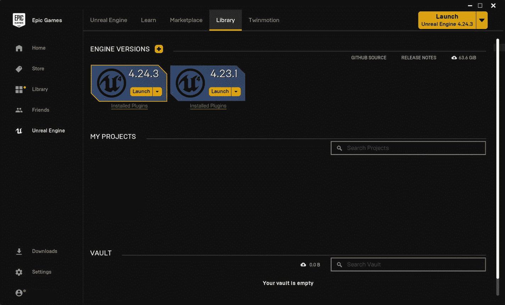
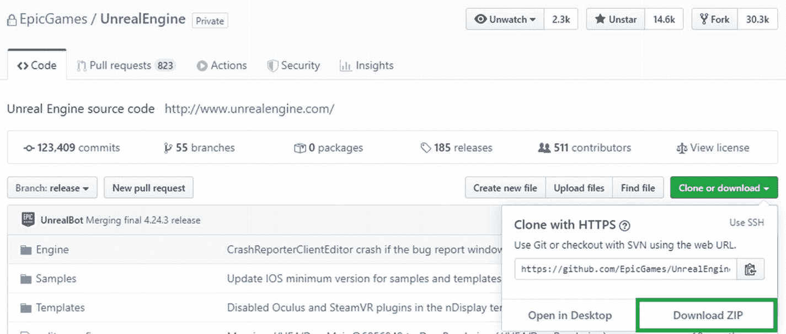
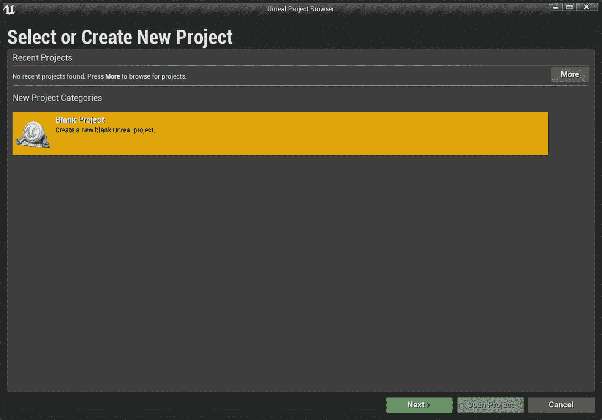
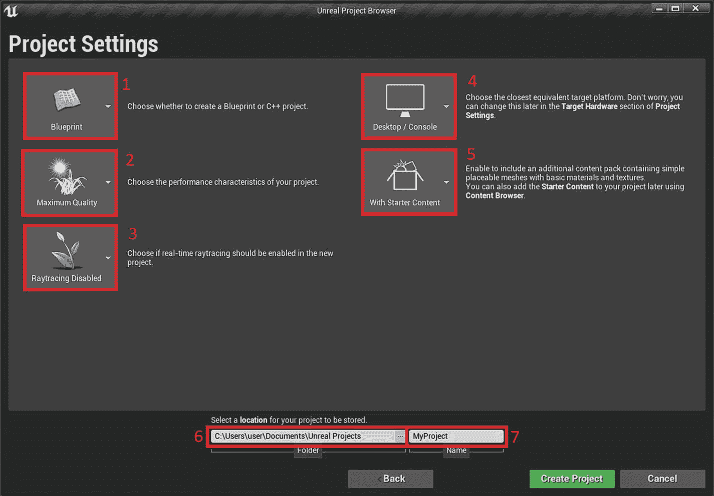
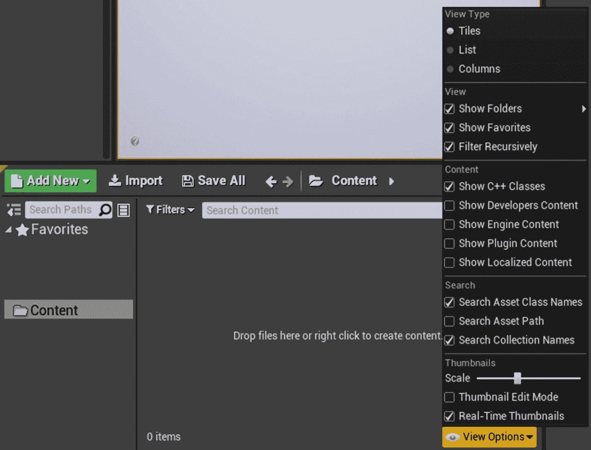
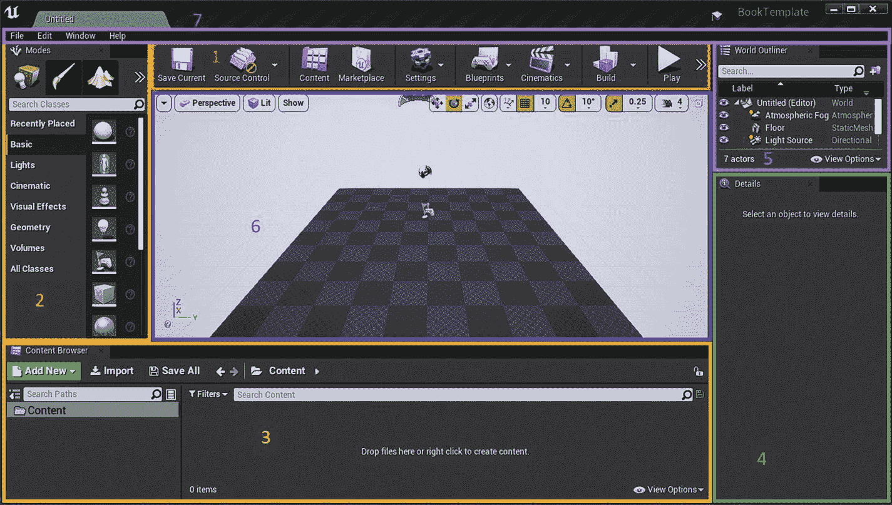
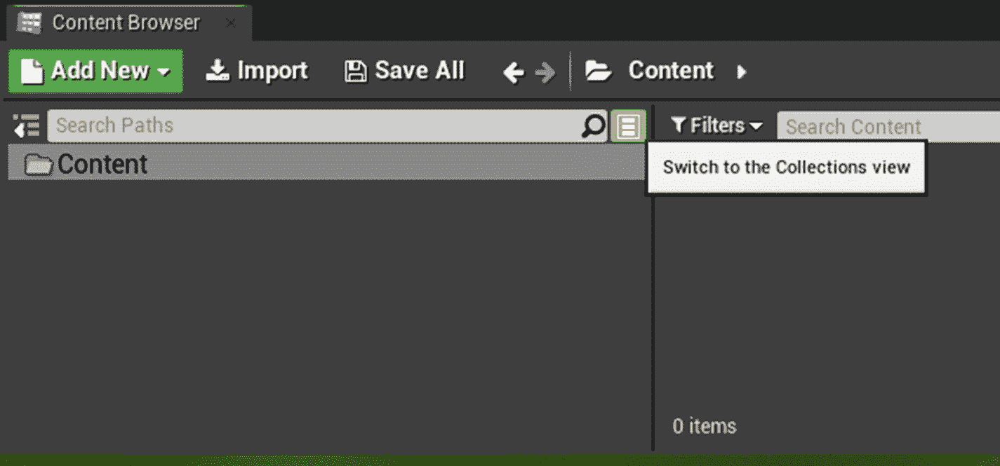
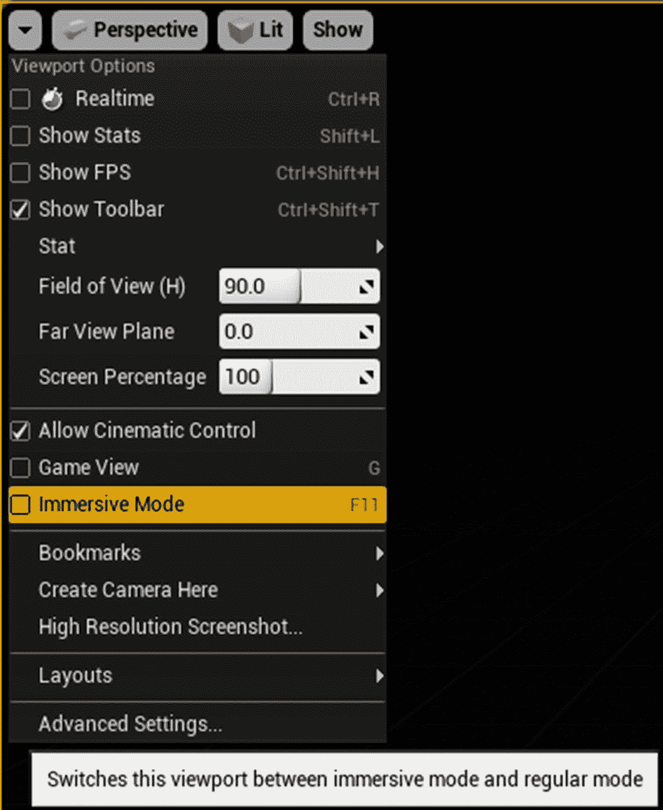
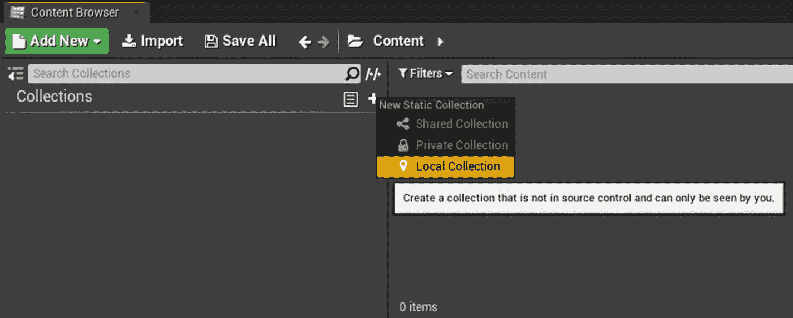

# 1.虚幻引擎 4 简介

你好，欢迎来到虚幻引擎 4 的初学者指南。在这本书里，你学习了虚幻引擎 4 的不同方面，并且你学会了用你获得的知识创建一个示例游戏。在本章中，你将学习如何通过 Epic Games Launcher 和 GitHub 下载虚幻引擎。之后，您将学习项目的结构，并熟悉虚幻编辑器界面。

## 获得虚幻引擎

本章着眼于你如何获得虚幻引擎。你可以通过 Epic Games Launcher 或者 GitHub 下载。无论哪种方式，都需要在 [`www.unrealengine.com`](http://www.unrealengine.com) 创建一个账户，是免费的。

首先，我们来看看 Epic Games Launcher 和 GitHub 的区别。

*   虚幻引擎 4 的 Epic Games Launcher 版本(也称为二进制版本或普通版本)带有预构建的引擎，您可以选择您需要的平台。如果需要，您还可以选择引擎源、starter 模板、特性包等等。二进制版本不支持为你的游戏创建专用服务器，所以如果你打算开发一个带有专用服务器的多人游戏，你必须使用源代码版本。

*   GitHub 版本(也称为源代码版本)提供了引擎的完整源代码，没有任何二进制文件，因此您需要手动编译它。引擎的源代码版本通常由想要修复引擎的错误或添加新功能的开发人员使用。如果你的游戏依赖于专用服务器，这个版本也是必需的。该引擎的源代码版本的先决条件是 Windows 上的 Visual Studio 2019(或更高版本)或 macOS 上的 Xcode。

### 从 Epic Games 启动器下载

如果您没有 Epic Games 帐户，您需要在 [`www.unrealengine.com/id/register`](http://www.unrealengine.com/id/register) 创建一个。

如果你有一个 Epic Games 账户，那么去 [`www.unrealengine.com/en-US/get-now`](http://www.unrealengine.com/en-US/get-now) 选择你的许可证，为你的平台下载并安装 Epic Games Launcher。安装后，打开启动器，使用您的凭证登录。您应该会看到如图 [1-1](#Fig1) 所示的截图。



图 1-1

安装了引擎版本 4.24 的 Epic Games 启动器

在 ENGINE VERSIONS 选项卡附近，您可以看到一个 **+** 按钮，它允许您下载并安装您想要的任何引擎版本。

### 从 GitHub 下载

如果您更喜欢使用引擎的源代码版本，可以通过下载引擎源代码并自行编译来实现，但如果您在 macOS 上使用 Windows 或 Xcode，则必须安装 Visual Studio 2019(启用 C++ 支持)。

首先，你必须创建一个 GitHub 帐户(它是免费的),并登录你的 Epic Games 帐户。登录后，在 Epic Games 中打开你的帐户面板，链接你的 GitHub 帐户。在此之后，您就可以下载虚幻引擎 4 的完整源代码了。

#### 下载源代码

进入虚幻引擎库后，可以点击**克隆或下载**按钮，选择**下载 ZIP** 按钮(如图 [1-2](#Fig2) )。



图 1-2

在虚幻引擎 Git 存储库中下载 ZIP 按钮

#### 克隆虚幻引擎库

要克隆一个存储库，您需要安装一个 Git 客户机。克隆是将存储库下载或复制到工作机器的一个空文件夹中的过程，包括完整的 Git 历史，因此您可以使用 Git 命令。您只下载没有任何 Git 文件的源代码，所以您不会跟踪更改或有任何关于以前提交的信息。

我用的是亚特兰蒂斯的 SourceTree。

Note

如果您喜欢其他工具，请访问 Windows 的 [`https://git-scm.com/download/gui/windows`](https://git-scm.com/download/gui/windows) 或 macOS 的 [`https://git-scm.com/download/gui/mac`](https://git-scm.com/download/gui/mac) 。

安装 SourceTree 后，打开应用程序。在新建选项卡中，选择**添加账户**。在新窗口中，将托管服务切换到 GitHub，并选择**刷新 OAuth 令牌**按钮。一旦 SourceTree 访问了您的回购，您可以从您的存储库列表中选择**虚幻引擎回购**，然后选择**克隆**。这允许您选择保存文件的路径。在**高级选项下，**选择**释放**分支，点击**克隆**按钮。

克隆完成后或下载 ZIP 文件后，转到目录并双击 **Setup.bat** 文件。(如果您下载了 ZIP 文件，请先解压缩)。您可以通过在 Setup.bat 文件中传递必要的标志来包含或排除特定的平台。例如，要排除 Windows 机器上的 Mac 和 iOS 平台，可以像这样运行 Setup.bat:

```cpp
Setup.bat --exclude=Mac --exclude=iOS

```

这可以确保跳过 Mac 和 iOS 平台所需的任何依赖项和文件。Setup.bat 完成后，运行 **GenerateProjectFiles.bat** ，它会生成可以在 Visual Studio 中打开的 UE4 解决方案文件。打开解决方案文件后，您可以在解决方案资源管理器的 Engine 文件夹下看到 UE4。右键单击 UE4 并选择 Build。这将启动构建过程，编译可能需要一个小时或更长时间，具体取决于您的硬件。

## 了解虚幻编辑器

现在，您已经安装(或编译)了您的引擎，让我们启动它。在本书中，我们只使用引擎的二进制版本，即 4.24。您将创建一个空白项目，并了解引擎的各个方面。要启动引擎，请单击 4.24.3 的启动按钮。这将打开**虚幻项目浏览器**窗口，在这里您可以选择一个现有的项目或者从头开始创建一个新的项目或者一个模板(参见图 [1-3](#Fig3) )。



图 1-3。

让我们选择**空白项目**并点击下一步。在下一页上，系统会提示您启动一个空白项目或基于模板创建一个项目。出于我们的目的，让我们选择一个空白模板，然后单击 Next。这将为您提供一个没有代码或内容、使用默认设置的项目。最后，最后一页允许您进行基本的配置并命名您的项目。

让我们浏览一下图 [1-4](#Fig4) 所示的项目设置页面。



图 1-4。

*   **Blueprint** (截图中标为 1)让您选择您的项目是基于 Blueprints 还是基于 C++。如果您从蓝图开始，您可以稍后将 C++ 代码添加到您的项目中。

*   根据您的项目，您可以将**最高质量**(在截图中标记为 2)更改为**可缩放 3D/2D** 。第一个选项适合 PC/控制台，第二个选项适合移动。

*   如果你的目标是高端 PC 游戏，并且拥有英伟达 RTX 显卡，你可以为你的游戏启用**光线追踪**功能(截图中标为 3)。

*   **桌面/控制台**(截图中标为 4)让您选择最接近的等效目标平台。

*   **With Starter Content** (截图中标为 5)让您选择是否要将 Starter 内容复制到项目中。它包含带有基本材质的简单网格。

*   **文件夹**(截图中标为 6)是你输入项目文件夹位置的地方。

*   **Name** (截图中标为 7)是您输入新创建项目的名称的地方。

要创建项目，点击**创建项目**按钮。这将启动引擎，并为您创建一个空项目。

### 项目结构

接下来，让我们来看看您刚刚创建的项目文件夹，以了解项目的结构。如果您导航到项目文件夹，您应该会看到类似于图 [1-5](#Fig5) 中所示的屏幕截图的结构。


图 1-5

一个示例项目(注意项目名称可能不同)

*   **Config** :这个文件夹是当您更改编辑器首选项或项目设置时保存设置的地方。您还可以创建配置文件来保存数据。

*   **内容**:这个文件夹是保存你所有游戏资产的地方。

*   **中间**:编辑器和游戏临时文件在这里生成。删除该文件夹是安全的，当编辑器下次启动时，它会自动重新生成。

*   **保存的**:该文件夹包含所有自动生成的配置文件、日志文件和自动保存。

以下是您可能会看到的其他文件夹。

*   **二进制文件**:这个文件夹包含项目的 DLL 文件。只有当您的项目包含 C++ 源代码时，它才会出现。

*   **DerivedDataCache** :该文件夹包含您的资产在其目标平台上的版本。您可以安全地删除该文件夹，编辑器下次会重新生成它。

*   **来源**:该文件夹包含标题(。h)和源(。cpp)文件。只有当您的项目包含 C++ 源代码时，它才会出现。

*   **插件**:这个文件夹包含你的项目的所有插件。要创建新插件，您的项目必须包含 C++。

### 不真实的编辑之旅

一旦引擎启动，你的屏幕应该看起来类似于图 [1-6](#Fig6) 。



图 1-7。



图 1-6

默认虚幻编辑器用户界面

让我们浏览一下虚幻编辑器的布局，如图 [1-6](#Fig6) 所示。



图 1-8。

*   标有 1 的区域是**工具栏**。在这里，您可以保存当前场景，打开内容浏览器，访问快速设置，构建照明，在编辑器中播放，等等。

*   标记为 2 的区域是**模式面板**。在这里，您可以在不同的模式之间切换，例如放置演员模式(默认)，网格绘制模式，风景模式，树叶模式和笔刷模式。

*   标记为 3 的区域是**内容浏览器**，您可以在其中导入或创建所有资产。

*   标记为 4 的区域是**细节面板**，在这里您可以修改放置在一个级别内的所选角色的属性。

*   标记为 5 的区域是**世界大纲视图**。它显示了当前关卡中的所有角色。使用眼睛图标，您可以快速隐藏/取消隐藏演员。

*   标有**菜单栏**的区域。它允许您添加新的 C++ 类，访问编辑器和项目设置，重新打开关闭的选项卡，等等。

#### 工具栏

工具栏显示在视口的正上方。它提供了对各种编辑器命令的简单访问。

*   **保存**:保存当前场景。如果当前场景没有保存，它会提示用户选择一个位置来保存地图。

*   **源代码控制**:提供对不同源代码控制的访问，比如 Perforce、Git、Subversion 等等。你也可以安装其他的源码控制插件。源代码控制是跟踪和管理代码或资产变更的实践。你可以在 [`https://en.wikipedia.org/wiki/Version_control`](https://en.wikipedia.org/wiki/Version_control) 了解更多关于源码控制的内容。

*   **内容**:打开内容浏览器。

*   **Marketplace** :在默认浏览器中打开 UE4 marketplace。

*   **设置**:快速访问一些编辑器设置，以及项目设置和世界设置。

*   **蓝图**:创建一个新的蓝图职业或者打开一个等级蓝图。你将在下一章学到更多关于蓝图的知识。

*   **电影艺术**:添加关卡或主序列。

*   **构建**:构建灯光、导航、几何等等。当“在会话中播放”处于活动状态时，或者当前级别正在小于着色器模型 5 中预览时，此按钮被禁用。

*   **播放**:在活动视口中播放当前关卡。“播放”按钮旁边的箭头显示了一个下拉菜单，其中包含允许开发者在新窗口中播放游戏、移动预览、作为独立游戏等等的选项。也可以设置游戏启动专用服务器测试多人游戏。

*   **启动**:启动给定设备中的当前级别。

#### 模式

“模式”面板在编辑器的各种工具模式之间切换。通过按 **Shift +** ***1 到 5*** *可以切换各个模式面板。*

*   **放置模式(Shift+1)** :将演员放置在场景中。

*   **绘制模式(Shift+2)** :允许你直接在视口顶点绘制一个静态网格演员。这意味着您可以将颜色数据绘制到放置在层级上的静态网格角色的顶点上，并在指定给该静态网格的材质中使用该信息。

*   **风景模式(Shift+3)** :创建新风景或编辑现有风景。

*   **树叶模式(Shift+4)** :绘制树叶。

*   **笔刷模式(Shift+5)** :修改 BSP(二进制空间划分)笔刷。这是一个几何工具，可以快速原型化或封闭级别。

#### 内容浏览器

内容浏览器是项目的核心。构成你的大片游戏的所有资产都在这里。您可以导入支持的文件类型，并创建新的资源，如蓝图、材料和序列。内容浏览器允许您收藏您的资源，并将它们排列在您自己的收藏中以便快速访问，这极大地改进了您的工作流程。所以让我们来看看他们。

##### 收藏夹

您可以将任何文件夹指定为收藏夹，以便快速访问。默认情况下，不会启用收藏夹。可以通过单击内容浏览器右下角的“视图选项”并选择“显示收藏夹”来启用它。收藏夹部分位于主内容文件夹上方。

Note

只能将文件夹指定为收藏夹，不能将资产指定为收藏夹。

##### 收集

集合允许您将资产组织到单独的集合中。比如你在做一个开放世界的游戏，你可以为玩家建筑、城市建筑、目标建筑、任务道具等等做不同的收集。每个集合可以有子集合，并且可以随时添加或删除资产。从集合中移除一个项并不会移除实际的资产，因为它只是在集合中保存一个引用。您可以在多个集合中拥有相同的资源，并根据需要创建任意多个集合。

您可以通过单击内容浏览器中的**切换到收藏视图**按钮来切换到收藏视图。

有三种类型的集合—共享、私有和本地。

*   共享集合可以与其他团队成员共享。要使此选项生效，您必须启用源代码管理。

*   私人收藏可以与被邀请查看该收藏的任何人共享。要使此选项生效，您必须启用源代码管理。

*   本地收藏仅供您使用。它不通过网络共享。无论您的源代码管理设置如何，此选项始终可用。

创建收藏后，您可以将资产拖放到其中。您可以查看收藏中可用的项目数量。

如图 [1-10](#Fig10) 所示，要从集合中删除一个资产，您必须首先选择该集合，右键单击该资产，然后选择**从** *中删除 **YourCollectionName*** 。这将从集合中删除资产，但是它不会删除资产。


图 1-12。



图 1-11。


图 1-10。



图 1-9。

#### 细节

详细信息面板包含所选参与者的信息和功能。它显示特定演员的所有变换控件和所有可编辑属性。可以双击细节面板中的所有缩略图，在各自的编辑器中打开它们。例如，双击静态网格缩略图会打开该网格。同样，如果双击材质缩略图，它会在材质编辑器中打开该材质。

详细信息面板还提供了一个搜索面板，可以根据文本过滤属性。修改属性时，旁边会显示一个黄色小箭头。这将属性重置为其默认值。

#### 世界离群值

世界大纲视图显示当前层级中的所有演员。当编辑器中的游戏激活时，它会用黄色显示当前游戏的所有演员。可以在大纲视图中选择任何演员，并且“细节”面板会显示与该演员相关的所有属性。还支持拖放，因此您可以将一个执行元拖到另一个执行元上以附加它。高级选项也支持搜索，如精确匹配和排除。

要从搜索中排除某个项目，请将`-`追加到搜索词中；例如，*-表*显示除了任何包含术语*的演员之外的所有内容，表*。

要搜索一个精确的项目，将 **+** 追加到搜索词中；例如，*+表格*显示了带有精确术语*表格*的所有内容。

若要使用完整的术语搜索精确的项目，请将术语放在双引号("")内；例如，“午餐桌”显示带有确切术语*午餐桌*的所有内容。

#### 视口

视口是你花大部分时间开发游戏的地方。它是你看到实际游戏的地方，所以理解视口对你的开发是至关重要的。按 G 键在游戏模式和编辑器模式之间切换视口。游戏模式通过隐藏所有与编辑器相关的元素来显示游戏中出现的场景。

除了视口的最大化状态，Unreal Editor 还提供了一个名为**沉浸式模式** **、**的附加状态，通过按 **F11** 快捷键或访问视口选项来激活该状态。激活后，视口将最大化到包含视口面板的窗口的最大范围。

下面解释了如何导航视口。

*   右键单击并按住鼠标。使用 **W** 、 **A** 、 **S** 、 **D** 左右移动。

*   左键单击并按住鼠标。向前、向后和横向移动鼠标。

*   按住鼠标中键并移动到平移位置。

*   右键单击并按住鼠标。移动它四处看看。

了解这些快捷方式可以改进您的开发工作流程。

在视口顶部，您可以看到视口工具栏。它切换到不同的视口布局和视图模式，移动/旋转/缩放资源，相机速度，等等。您可以使用以下快捷方式切换翻译模式。

*   **W** 移动演员

*   **E** 旋转演员

*   **R** 缩放演员

使用**空格键**在所有三个选项之间切换。

Note

您可以通过按下 **Ctrl+Shift+T** 来切换该工具栏的可见性。

在工具栏的最末端，您会看到一个数字图标。这是编辑器内的相机移动速度。您可以点按它并将滑块调整到右侧以加快相机移动，或者将滑块滑动到左侧以减慢相机移动。要快速更改它，请在视口中按住鼠标右键，并使用鼠标滚轮来调整相机速度。向上滚动可获得较高速度，向下滚动可获得较低速度。