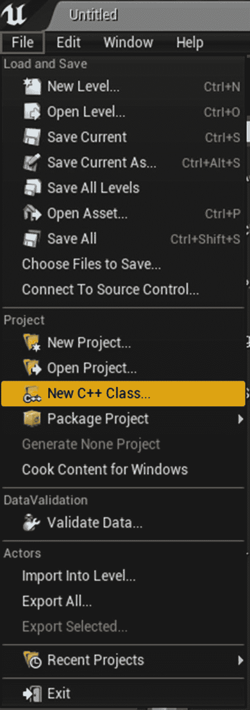
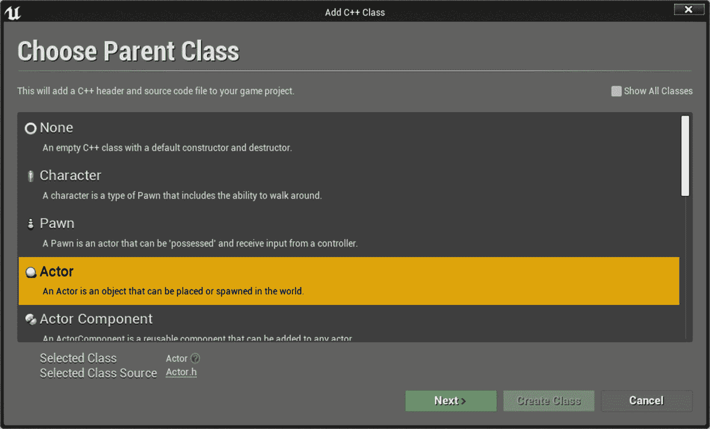
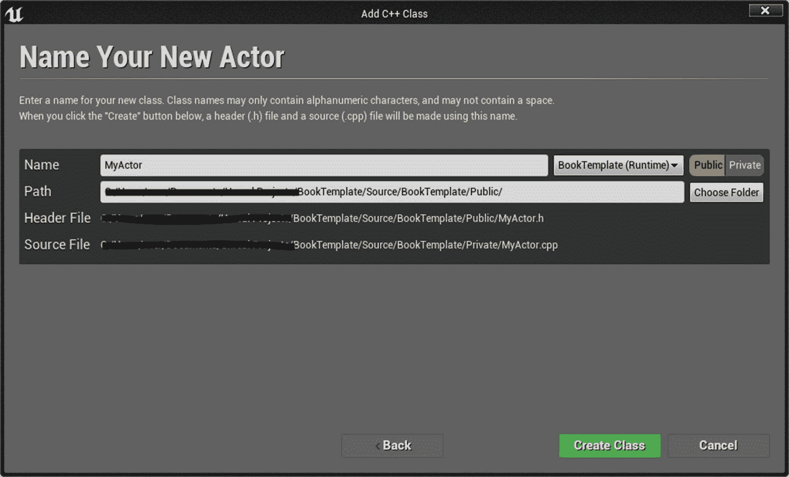
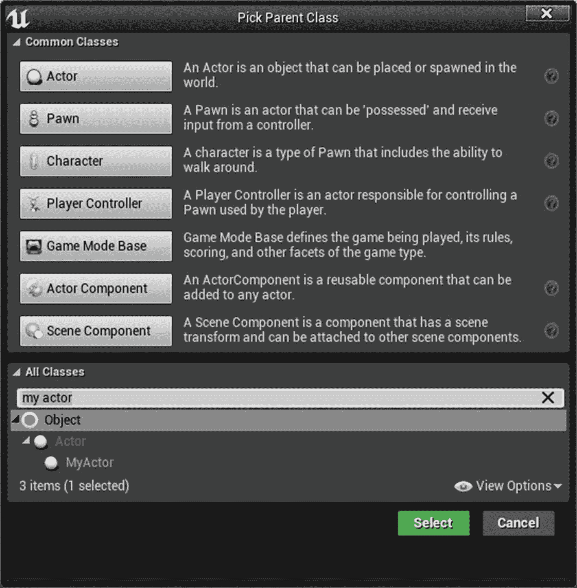
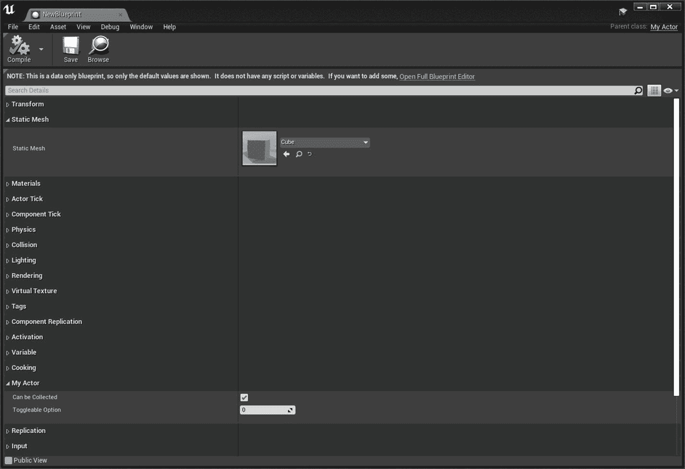
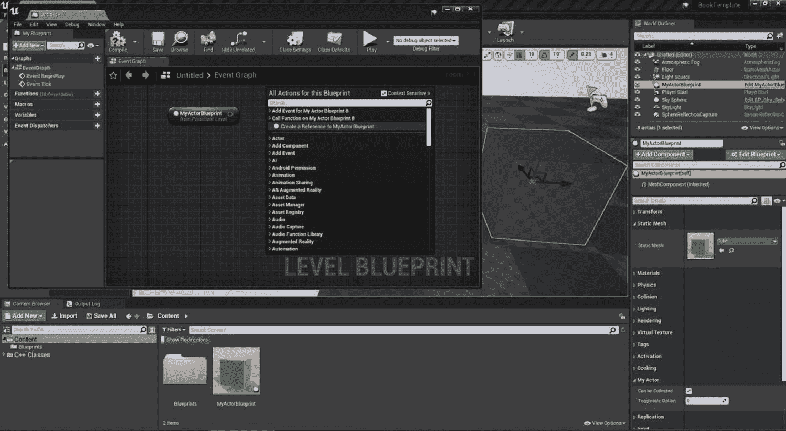
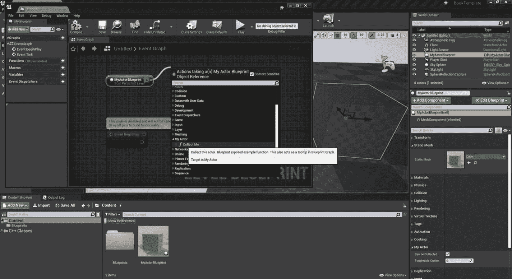
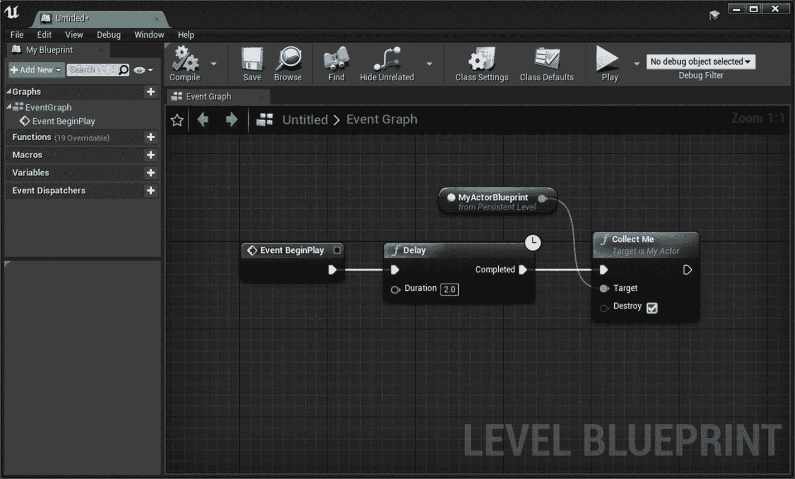

# 三、C++ 和虚幻引擎 4

虚幻引擎 4 中使用 C++ 来创建游戏性元素或修改引擎。在本章中，您将学习如何安装 Visual Studio for 虚幻引擎。您还将学习如何创建 C++ 类，并了解它们的结构。

## 安装 Visual Studio

在编写和编译 C++ 代码之前，您需要在您的计算机上安装 Microsoft Visual Studio(Community Edition 或更高版本)(在 macOS 上，您需要 Xcode)。如果您是第一次安装 Visual Studio，请确保在您的安装中包含 C++(参见图 3-1 )。


图 3-1

安装 Visual Studio 并启用 C++ 进行游戏开发

安装完成后，重启电脑。可以开始用虚幻引擎 4 写 C++ 了。

## 添加 C++ 代码

从虚幻编辑器中添加新的 C++ 类。C++ 类是一种用户定义的数据类型，它拥有自己的变量和函数，可以通过创建该类的实例来访问这些变量和函数。这些变量和函数定义了类的行为。类定义不占用任何内存，但是在创建类的实例时会分配内存。在 UE4 中，Blueprints 从 C++ 中创建的一个类扩展而来，并继承了所有的类属性。

在本章中，您将创建一个基于 Actor 的类，它可以放在您的级别上。在 Unreal Engine 中，您需要了解两个主要的类:Actor 类和 Object 类。尽管用途取决于您的目标，但在创建类时，有些事情您必须牢记在心。

任何基于 Actor 的类都可以被放置或派生到该级别中。这些类有一个可视化的表示，并支持网络。基于对象的类通常用于存储数据，它们的内存大小通常小于基于角色的类。

在我们基于 Actor 的类中，您将某些属性和功能暴露给蓝图，用于修改 Actor 的行为。要创建一个新的 C++ 类，点击文件菜单并选择新建 C++ 类…选项(见图 3-2 )。或者，您可以右键单击内容浏览器并选择“新建 C++ 类”。创建 Visual Studio (*。sln)文件中，右键单击*。向上投影文件，并选择“生成 Visual Studio 项目文件”。



图 3-2。

从文件菜单创建新的 C++

向导会提示您，您可以在其中选择基类。从类列表中，选择 Actor 类(参见图 3-3 ，然后点击 Next。



图 3-3。

选择执行元类别

下一页提示您命名您的类，输入保存位置，并选择是否要将您的类组织成文件夹结构(见图 3-4 )。



图 3-4。

选择名称、位置和范围

通常，将头文件放在公共文件夹中，将源文件放在私有文件夹中是一种很好的推荐做法，因此选择 public 选项，将头文件放在公共文件夹中，将源文件放在私有文件夹中。现在，让我们坚持使用默认的 MyActor 名称，并单击 Create Class。

虚幻引擎现在将代码添加到您的项目中，并开始编译 C++ 代码。这可能需要几秒钟才能完成，因此您可以转到项目文件夹并查看创建了哪些新文件夹和文件。

在您的根项目文件夹中，您会看到以下新文件夹。

*   **二进制文件**:该文件夹包含可执行文件或编译过程中创建的其他文件。如果编辑器没有运行，可以将其删除，并在下次编译项目时创建。

*   **中间**:这个文件夹包含临时游戏对象文件和 Visual Studio 生成的项目文件。可以安全删除。

*   **Source** :这个文件夹包含了你游戏特有的代码文件。很明显，不要删。

如果您进入源文件夹，您会看到创建了一些额外的文件，例如*your project name*. target . cs 和*your project name*. build . cs 文件(您的项目的实际名称替换了您的项目名称)。目标文件决定了特定目标(如游戏、编辑器等)的构建设置(如何构建项目)。)，而构建文件决定应该构建哪些模块。模块是容器，包括 C++ 类的集合，附带一个 C#编译文件(扩展名为*.build.cs)。当您生成一个模块时，在 Binaries 文件夹中会生成一个相应的 DLL 文件。当您发布项目时，所有模块都在一个 EXE 文件中链接在一起。

在公共文件夹中，MyActor.h 是头文件。在私有文件夹中，MyActor.cpp 是源文件。头文件是你声明变量和函数的地方。您在源文件中实现变量和函数。

### 检查标题

我们来分析一下 MyActor.h 文件。

```cpp
#pragma once

#include "CoreMinimal.h"
#include "GameFramework/Actor.h"
#include "MyActor.generated.h"

UCLASS()
class BOOKTEMPLATE_API AMyActor : public AActor
{
     GENERATED_BODY()

public:
     // Sets default values for this actor's properties
     AMyActor();

protected:
     // Called when the game starts or when spawned

     virtual void BeginPlay() override;

public:
     // Called every frame
     virtual void Tick(float DeltaTime) override;

};

```

#### #杂注一次

#pragma once 被称为预处理程序指令，这意味着您只能包含这个头文件一次。如果在任何其他文件中多次包含 MyActor.h，所有后续包含都将被忽略。

#### UCLASS()宏

UCLASS()宏是一个特殊的宏，Unreal Engine 需要它来使编辑器知道该类，并包含它以实现序列化、优化和其他引擎相关的功能。这个宏与 GENERATED_BODY()宏成对出现，后者在类体中包含了额外的函数和类型定义。

Note

UCLASS()宏可以接受参数(也称为说明符)。你可以在 [`https://docs.unrealengine.com/en-US/Programming/UnrealArchitecture/Reference/Classes/Specifiers/index.html`](https://docs.unrealengine.com/en-US/Programming/UnrealArchitecture/Reference/Classes/Specifiers/index.html) 了解更多。

#### class book template _ API Amy actor:public a actor

是你上课的开始。`_API`宏与 DLL 链接有关，这意味着它对 DLL 文件公共的函数、类或数据进行标记；导入这个 API 模块的任何其他模块都可以直接访问这些类或函数。这是从虚幻构建工具传递给编译器的。`public AActor`意味着你从 Actor 类型继承了这个类。继承是一个特性，你可以从一个现有的类(也称为一个*基类*)创建一个新的类(也称为一个*派生类*)。继承的类继承了其基类(也称为*父类*)的所有特性，并且可以拥有自己的功能。

在这一行中，您可能已经注意到了类名的前缀。不是`MyActor`，是`AMyActor`。这是因为虚幻反射系统要求类以某个字母为前缀。反射系统是虚幻引擎的基础技术。它可以在运行时自我检查。以下是前缀列表以及每个前缀的含义。

*   a 表示参与者类型(例如，参与者、控制者、AGameMode)

*   u 表示非真实对象(例如，UObject、UActorComponent、USceneComponent)

*   模板的 t(例如，TWeakPtr、TArray、TMap)

*   s 代表 Slate(例如 SWidget、SCompundWidget、SCurveEditor)

*   I 表示接口(例如，IAssetRegistry、ILevelViewport、IAsyncTask)

*   e 代表 Enum(例如，EAnchorWidget、EAcceptConnection)

*   g 代表全球(如 GEditor、GWorld)

*   f 代表浮点型(例如，FVector、FGameplayTag)

#### 公共:，受保护:，和私有:

`public:`、`protected:`和`private:`被称为*访问说明符*(也称为*访问修饰符*)。它们定义了如何在这个类之外访问变量、函数等等。

*   **public** :任何外部类都可以访问成员

*   **protected** :任何继承类都可以访问成员

*   **private** :没有其他类可以访问成员

#### AMyActor()

`AMyActor()`是构造器，是在创建对象时自动调用的特殊函数。它与类同名，并且从不返回任何类型。在这里，您可以初始化头文件中定义的任何类型的所有默认值。例如，如果创建一个 int32 类型的变量(比如 int32 MyVariable)在构造器内部，可以赋任意默认值，比如 MyVariable = 1。

#### 虚拟 void BeginPlay()覆盖

关键字`override`意味着这个函数已经在 Actor 类中声明和定义了，并且您正在重写它以拥有您自己的定制功能。因此，您声明了来自 Actor 类的 BeginPlay 函数。同样的想法也适用于 Tick 方法。

### 检查源文件

头文件只声明函数，不包含实现(代码不执行任何操作)。因为所有的实现都是在源文件(*。cpp)，我们来看源文件。

```cpp
#include "MyActor.h"

AMyActor::AMyActor()
{
     PrimaryActorTick.bCanEverTick = true;
}

void AMyActor::BeginPlay()
{
     Super::BeginPlay();
}

void AMyActor::Tick(float DeltaTime)
{
     Super::Tick(DeltaTime);
}

```

这个源文件只包含一个非常基本的实现。这里需要记住的重要事情是`Super`调用(Super::begin play()；和 Super::Tick()；)，这意味着即使您覆盖了这些函数，它们仍然调用父类中定义的基实现。如果您正在覆盖本机引擎实现，包含`Super`调用是非常重要的。

## 向蓝图展示变量和函数

从 C++ 类中，您可以将您需要的函数或变量暴露给蓝图，以便设计人员可以相应地修改它们。您修改新添加的 actor，使变量和函数暴露给蓝图。

### 修改标题

首先，让我们添加几个变量。在 GENERATED_BODY()宏下添加以下代码。

*   UCLASS 宏是针对类的。

*   UPROPERTY 宏用于变量。

*   UFUNCTION 宏是针对函数的。

```cpp
private:

     /* Our root component for this actor. We can assign a Mesh to this component using Mesh variable. */
     UPROPERTY(VisibleAnywhere)
     UStaticMeshComponent* MeshComponent;

     /* Determines if this item can be collected. */
     UPROPERTY(EditAnywhere)
     bool bCanBeCollected;

     /* Just an example to show toggleable option using metadata specifier. */
     UPROPERTY(EditAnywhere, meta = (EditCondition = "bCanBeCollected"))
     int32 ToggleableOption;

```

UPROPERTY 是一个特殊的引擎宏。在内部，指定如何公开变量。

以下是一些常见的 UPROPERTY 说明符。

*   **EditAnywhere** :该属性可以在默认蓝图和世界中放置的实例中编辑。

*   **EditDefaultsOnly** :该属性只能在默认蓝图中编辑。当您在世界中放置一个演员的实例时，您不能按实例单独编辑该属性。

*   **EditInstanceOnly** :该属性只能为放置在级别中的实例更改。此属性在默认蓝图中不可用。

*   **VisibleAnywhere** :该属性与 EditAnywhere 具有相同的可见性，但是该属性不可编辑。它是只读的。

*   **VisibleDefaultsOnly** :该属性与 EditDefaultsOnly 具有相同的可见性，但是该属性不可编辑。它是只读的。

*   **VisibleInstanceOnly** :该属性与 EditInstanceOnly 具有相同的可见性，但该属性不可编辑。它是只读的。

如有必要，可以基于布尔值启用或禁用属性编辑。这是使用名为 EditCondition 的元数据说明符实现的。前面的代码中提供了一个示例。

在`AMyActor();,`下面添加一个暴露在蓝图中的功能。

```cpp
/* Just a sample Blueprint exposed function. This comment appears as a tooltip in Blueprint Graph. */
UFUNCTION(BlueprintCallable, Category = "My Actor")
void CollectMe(bool bDestroy = true);

```

### 修改源文件

现在让我们修改源文件。首先，您需要分配一个网格组件变量，这是一个静态网格组件类型，用于创建静态网格的实例。您这样做是因为您需要一个有效的根组件来移动这个 actor。为此，您需要在构造器中构造静态网格组件对象，并在那里对其赋值。让我们看看下面的示例代码。

```cpp
MeshComponent = CreateDefaultSubobject<UStaticMeshComponent>(TEXT("MeshComponent"));
RootComponent = MeshComponent;

```

在代码中，您会看到一个名为 CreateDefaultSubobject 的特殊引擎函数。这个函数允许你创建一个给定类型的对象，它在编辑器中是可见的。该函数只能在构造器内部调用；在运行时调用它会使编辑器崩溃。

然后在源文件中为 CollectMe 函数创建一个定义。

Note

函数名可以是任何东西，但一般来说，建议使用描述函数用法的动词或基于返回值的动词。

现在，您基于输入参数和 bCanBeCollected 变量记录信息。如下定义该函数。

```cpp
void AMyActor::CollectMe(bool bDestroy /*= true*/)
{
     // Check if this actor can be collected...
     if (bCanBeCollected)
     {
         // ...Now check if the actor must be destroyed...
         if (bDestroy)
         {
               // ...Actor has to be destroyed so log that information and destroy.
               UE_LOG(LogTemp, Log, TEXT("Actor collected and destroyed."));
               Destroy();
          }
          else

          {
               // ...Dont destroy the actor. Just log the information.
               UE_LOG(LogTemp, Warning, TEXT("Actor collected but not destroyed."));
          }
     }
     else
     {
          // ...Actor cannot be collected thus cannot be destroyed.
          UE_LOG(LogTemp, Error, TEXT("Actor not collected."));
     }
}

```

### 最终代码

整个标题应该类似于下面的代码。请注意，BeginPlay 和 Tick 函数已被删除。

```cpp
#pragma once

#include "CoreMinimal.h"
#include "GameFramework/Actor.h"
#include "MyActor.generated.h"

UCLASS()
class BOOKTEMPLATE_API AMyActor : public AActor
{
     GENERATED_BODY()

private:

     /* Our root component for this actor. We can assign a Mesh to this component using Mesh variable. */
     UPROPERTY(VisibleAnywhere)
     UStaticMeshComponent* MeshComponent;

     /* Determines if this item can be collected. */
     UPROPERTY(EditAnywhere)
     bool bCanBeCollected;

     /* Just an example to show toggleable

option using metadata specifier. Uncheck Can Be Collected boolean and this option  disable (grey out). */
     UPROPERTY(EditAnywhere, meta = (EditCondition = "bCanBeCollected"))
     int32 ToggleableOption;

public:

     AMyActor();

     /* Collect this actor. Blueprint exposed example function. This also acts as a tooltip in Blueprint Graph. */
     UFUNCTION(BlueprintCallable, Category = "My Actor")
     void CollectMe(bool bDestroy = true);

};

```

源代码应该是这样的。

```cpp
#include "MyActor.h"
#include "Components/StaticMeshComponent.h"

AMyActor::AMyActor()
{
     MeshComponent = CreateDefaultSubobject<UStaticMeshComponent>(TEXT("MeshComponent"));
     RootComponent = MeshComponent;

     bCanBeCollected = true;
     ToggleableOption = 0;

     // Set this actor to call Tick() every frame. You can turn this off to improve performance if you don't need it.
     PrimaryActorTick.bCanEverTick = true;

}

void AMyActor::CollectMe(bool bDestroy /*= true*/)
{
     // Check if this actor can be collected

...
     if (bCanBeCollected)
     {
          // ...Now check if the actor must be destroyed...
          if (bDestroy)
          {
               // ...Actor has to be destroyed so log that information and destroy.
               UE_LOG(LogTemp, Log, TEXT("Actor collected and destroyed."));
               Destroy();
          }
          else
          {
               // ...Dont destroy the actor. Just log a warning.
               UE_LOG(LogTemp, Warning, TEXT("Actor collected but not destroyed."));
          }
     }
     else
     {
          // ...Actor cannot be collected thus cannot be destroyed. Log as an error.
          UE_LOG(LogTemp, Error, TEXT("Actor not collected."));
     }

}

```

### 使用类

在 Visual Studio 中，按 F5 编译并启动项目。编辑器启动并运行后，右键单击内容浏览器并选择 Blueprint Class。在 Pick Parent Class 窗口中，展开所有的类并搜索 My Actor。然后，您应该选择我们的自定义 Actor 类作为 Blueprint 的基础(参见图 3-5 )。



图 3-5。

选择我们以前创建的 C++ 类作为父类

接下来，打开蓝图演员。您可以分配您的自定义网格并调整您选择暴露给 Blueprint 的属性(参见图 3-6 )。将鼠标悬停在属性上，会以工具提示的形式显示您在 C++ 中添加的注释。



图 3-6。

调整从 C++ 公开的属性

## 在蓝图中调用 C++ 函数

我的演员蓝图已经在编辑器里准备好了。您还在名为 Collect Me 的 actor 内部创建了一个蓝图可调用函数。在本节中，我们使用相对简单的逻辑在关卡蓝图中快速调用这个函数。

首先，将新创建的我的演员蓝图拖放到关卡上。之后，确保在关卡编辑器中选中我的演员蓝图，打开关卡蓝图。在 Level Blueprint 中，右键单击图表并创建对所选 My Actor Blueprint 的引用。在图 3-7 中，我把我的演员蓝图放在关卡上，选中它，在关卡蓝图中创建了一个引用。



图 3-7。

参考我的演员蓝图

从参考中，拖动一个大头针并选择收集我功能(参见图 3-8 )。



图 3-8。

呼叫对方付费功能

现在，您可以随时调用 Collect Me 功能。举个例子，让我们在延迟两秒钟后开始播放。最终的图形如图 3-9 所示。



图 3-9。

最终图形

尽管这里只使用了 boolean 作为输入，但是也可以使用其他类型，比如 floats、integers、units，甚至 UObjects 或 AActors。例如，如果您想要使用 int32，请在头文件和源文件中将布尔值更改为 int32。void collect me(int 32 Myint variable)；。之后，可以在源文件中定义的 CollectMe 函数中使用 MyIntVariable。

单击播放按钮。2 秒钟后，My Actor Blueprint 将消息(见图 3-10 )打印到 C++ 中定义的日志中，并自我销毁。


图 3-10。

显示记录的信息