# 四、游戏类

本章着眼于你在几乎所有项目中使用的一些重要和常见的游戏职业。

## 行动者

Actor 类是游戏世界中所有可放置和可生成对象的基础。任何可以拖放到世界中或在运行时产生的东西都是从 Actor 类继承的。Actor 类是可以支持平移(位置)、旋转和缩放(大小)的基本类。Actors 可以包含任意数量的 Actor 组件类，这些类定义了它应该如何移动和呈现。默认情况下，Actors 是泛型类，没有任何类型的可视化表示。由组件给它一个可视化的表示。Actor 类还支持跨网络的复制和函数调用。

## 游戏模式库

游戏模式基础定义了游戏的基本规则，例如允许哪些演员、玩家分数、获胜规则等等。它保存了游戏世界中所有玩家的信息。例如，您可以定义赢得比赛所需的分数。游戏模式设置棋子、玩家控制器、游戏状态、玩家状态、观众等类别。在多人游戏中，游戏模式类只存在于服务器端，对于客户端来说，它总是空的，就好像从来没有存在过一样。这仅适用于多人游戏，因为在单人游戏中，没有客户端，只有服务器。

游戏模式是游戏模式基础的一个子类，是为多人游戏设计的。它包含为每个玩家选择种子点的默认行为。

## 游戏状态基础

游戏状态基础定义了游戏的当前状态。游戏状态类是由游戏模式产生的。它们在多人游戏中特别有用，因为游戏状态类被复制到每个客户端，所以对复制值的任何更改都会反映到所有客户端。例如，假设你有一个游戏模式，需要一定数量的杀戮才能赢得游戏。每当玩家消灭另一个玩家时，它运行一个服务器函数来更新游戏模式中当前的总击杀数，然后在游戏状态中改变该击杀数，并且在所有客户端上更新该击杀数。游戏状态是游戏状态库的子类。

## 游戏实例

游戏实例类是在运行游戏时创建的。它存在于游戏运行的时候。它有助于在不同级别之间传递信息。例如，想象在你的游戏中，玩家完成了某个挑战。你可以在游戏实例中存储这些特定信息。当玩家返回主菜单时，您可以在屏幕上显示一条消息，说明挑战已经完成。游戏实例是一个基于对象的类；它不会复制给任何人。服务器或客户端不知道除了他们自己之外的任何其他游戏实例。

游戏实例通过项目设置➤地图和模式➤游戏实例类设置(见图 4-1 )。

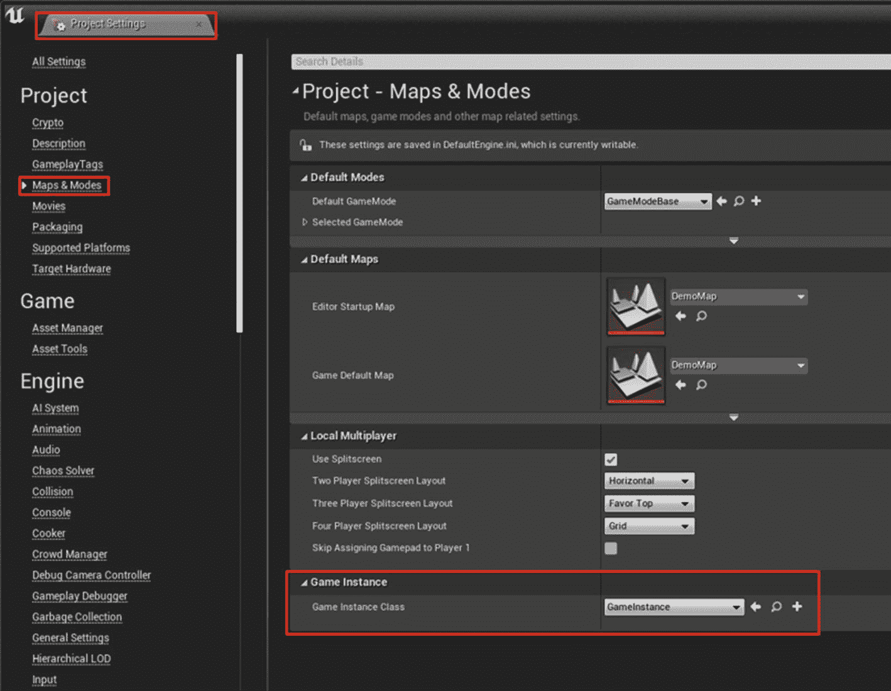

图 4-1

设置游戏实例类

下面描述了三个主要的游戏类别。

*   **游戏模式**持有游戏流程的权限，只存在于服务器上，防止作弊。

*   **游戏状态**保存游戏的复制状态。它存在于服务器和客户端。客户端可以向游戏状态询问游戏的当前状态，服务器可以修改游戏的当前状态，并将其复制到所有客户端。

*   **游戏实例**是一个真正的持久类，保证从游戏开始到退出都是可用和可访问的。它不被复制，同时存在于服务器和客户机上。

## 卒

卒是一个基于角色的类，充当玩家或人工智能(AI)的物理表示。棋子由控制器控制，控制器可以是玩家控制器，也可以是 AI 控制器。尽管默认情况下棋子没有视觉表示，但它仍然表示游戏世界中的位置、旋转等。棋子可以包含自己的移动逻辑，但最好在控制器中完成。棋子可以在网络上复制。

## 性格；角色；字母

Character 从 Pawn 类扩展而来，通过使用动画的骨架网格组件来支持可视化表示。它还包括模拟运动碰撞的胶囊组件和角色运动组件，角色运动组件是一个功能丰富的组件，包括行走、奔跑、跳跃、游泳和飞行等运动。它还包括基本的网络支持，这使它成为两足动物角色的首选。角色移动组件是特定于角色类的，因此它不能用于任何其他类。

## 播放器控制器

玩家控制器是控制器的子类，控制器本质上是它所控制的棋子的大脑。基于上下文，如果控制器由人类玩家控制(并且可以处理所有玩家输入)，或者 AI 控制器由人工智能控制，则该控制器是玩家控制器。

默认情况下，通过调用 possession()函数，一个控制器在任何给定时间只能控制一个棋子。它通过调用 UnPossess()函数停止控制。控制器还允许来自它所控制的卒类的通知。在网络游戏中，服务器知道所有的控制器，而客户端只知道自己的本地控制器。

## 玩家状态

玩家状态是每个玩家都可以使用的复制角色。在单人游戏中只有一个玩家状态，但是在多人游戏中，每个玩家都有自己的玩家状态。因为它是复制的，所以服务器和客户机知道所有的玩家状态，并且它们都可以从游戏状态类中访问。这是一个存储玩家网络相关信息的好地方，比如分数、玩家名字等等。

让我们分享一个可以使用这些类的场景。写这本书的时候，battle royale games ( *堡垒之夜*， *PUBG* 等。)在我们游戏玩家中很受欢迎，所以如果你要创建一个皇室战争游戏，你可以使用下面的类。

*   **游戏模式**:这个类定义了规则。在这个类中，你可以跟踪进入比赛的玩家数量，活着的玩家数量，死去的玩家数量，以及退出的玩家数量。该类还跟踪并决定其他游戏元素，如战斗机(或*堡垒之夜*的战斗巴士)、圆圈等等，以及比赛是已经开始还是正在等待开始(热身)。

*   **游戏状态**:这个类跟踪游戏的复制状态。例如，当游戏模式从预匹配(大厅)转换到匹配状态(战斗飞机或巴士在地图顶部开始)时，它会通知游戏状态状态已改变，并且游戏状态可以通知所有匹配开始的客户端。

*   **游戏实例**:这个类保存游戏中完成的任何目标或挑战的信息，以便玩家可以在返回主菜单时获得奖励。

*   **角色**:角色的视觉表现。

*   棋子:游戏中的车辆或动物。(可选)

*   玩家控制器:这个类处理所有的输入，创建和管理用户界面。它还可以向服务器发送 RPC(远程过程调用)。服务器知道所有的玩家控制器(例如，如果游戏有 100 个玩家，服务器知道所有的 100 个玩家控制器)，但是客户端只知道它自己的。

*   **玩家状态**:这个类保存与玩家特定状态相关的信息(例如，你杀死的玩家数量，你发射的弹药数量，等等)。

## 创建角色类和玩家控制器类

在本节中，您将学习如何创建一个新的角色类，允许玩家使用玩家控制器类在游戏世界中移动。在本节的后面，一个 UMG(虚幻运动图形)小部件向玩家显示健康信息。

要创建新的角色类，请在内容浏览器上单击鼠标右键，然后选择“蓝图类”。系统会提示您为蓝图选择一个父类。从公共类别部分选择角色(参见图 4-2 )。

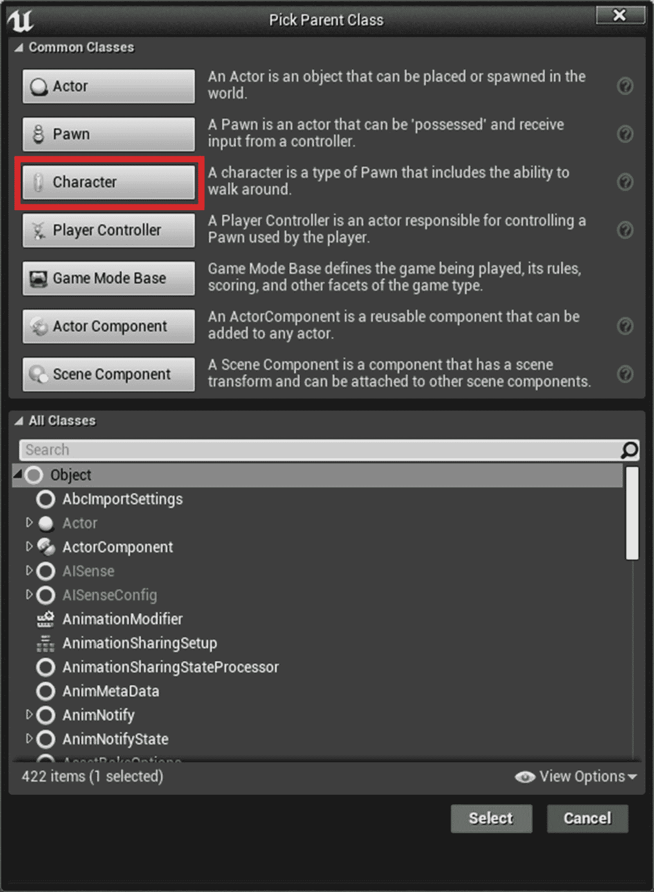

图 4-2

选择字符类

接下来，打开角色蓝图。您会看到默认的胶囊组件、网格组件和角色移动组件(参见图 4-3 )。

图 4-3。

默认组件

*   **CapsuleComponent** 是 actor 的根组件。它负责碰撞。CharacterMovement 知道这个胶囊组件，并根据玩家的输入移动它。

*   **ArrowComponent** 是一个编辑器专用组件，帮助指示对象面向哪个方向。

*   **网格**是角色的视觉表示，属于骨骼网格组件类型。

*   **角色移动**处理相关角色的移动逻辑。该组件更新 CapsuleComponent 的位置和旋转，使角色移动。它是一个高度特色的组件，包括网络支持。

我们将使用引擎自带的默认人体模型作为我们的角色。要使用它，您必须将第三人称项目添加到您的项目中。如果尚未添加，您可以通过点击内容浏览器中的添加新项按钮并选择**添加特性或内容包**来添加(参见图 4-4 )。

图 4-4。

从内容浏览器添加功能包或初学者内容

接下来，从蓝图功能选项卡中选择第三个人，然后单击添加到项目。现在你有了人体模型。将人体模型指定给之前创建的角色蓝图类。

您可能会注意到网格没有正确对齐。角色网格位于胶囊组件的中心，角色的旋转方向错误。要解决此问题，请将网格组件的位置和旋转调整为适当的值。

*   位置:X: 0，Y: 0，Z:–97

*   旋转:滚动:0，俯仰:0，偏航:270

你还需要给播放器增加一个摄像头来获得一个合适的视角。首先，添加一个弹簧臂组件，使其子组件与其父组件保持固定距离。为此，点击“组件”选项卡中的“添加组件”按钮，并选择“摄像机”部分下的“弹簧臂”(见图 4-5 )。

图 4-5。

添加弹簧臂组件

使用相同的方法，将相机添加到弹簧臂组件中。结果应该如图 4-6 所示。

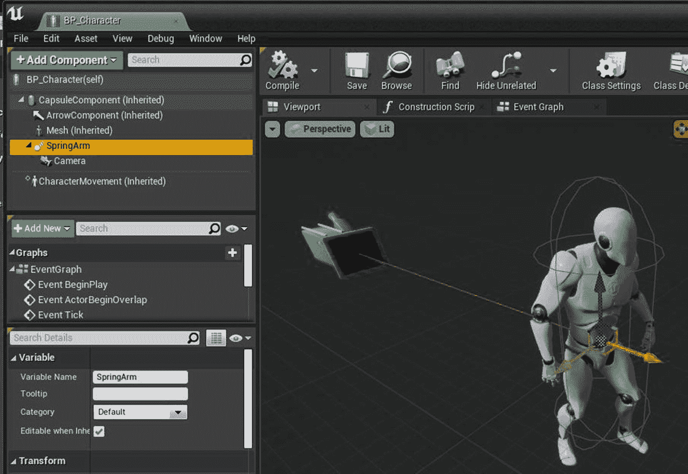

图 4-6。

将相机添加到弹簧臂后

如果你将角色拖放到关卡编辑器中，你可以预览玩家如何从这个视角看到角色。角色类中几乎没有需要更改的设置。单击蓝图编辑器工具栏中的类默认值按钮。在“细节”面板中，禁用“棋子”区域下的“使用控制器旋转偏航”。之后，选择添加的弹簧臂组件，并启用“摄影机设置”下的“使用棋子控制旋转”。最后，选择角色移动组件，并启用“将旋转定向到移动”。

现在我们的角色差不多准备好了，让我们实现一个基本的功能来移动它。

首先，您需要添加两个函数，使角色向前/向后和向左/向右移动。要创建新函数，请在角色类的“我的蓝图”选项卡中单击函数部分下的函数按钮。点击按钮后，您可以重命名该功能；姑且称之为**前进或者后退**。

还添加了一个名为 ScaleValue 的浮点参数，用于缩放输入。要向函数添加参数，选择紫色节点，在细节面板中，添加新的输入参数，并从下拉列表中选择 Float(参见图 4-7 )。

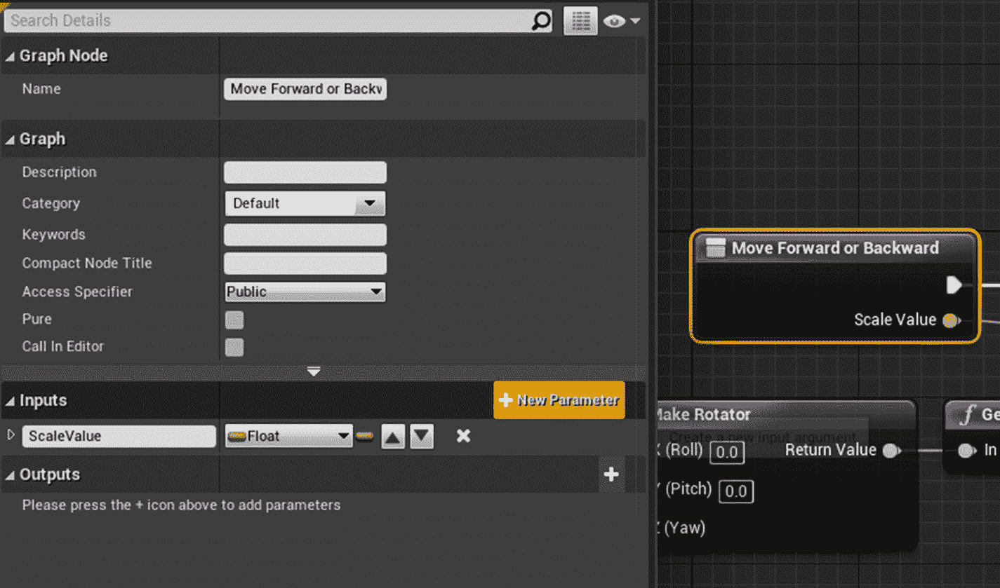

图 4-7。

向函数添加输入

在这个函数中，你得到角色的控制旋转。您可以使用它的偏航旋转来查找向前向量，并将其用作移动角色的方向。向前向量是一个规范化的向量，它指向演员面对的方向。最终的功能应该如图 4-8 所示。

图 4-8。

最终功能

同样的功能可以复制；称之为**向左或向右移动**。使用向右向量，而不是向前向量。最终的功能应该如图 4-9 所示。

图 4-9。

获得右向量的功能相同

请注意，除了获取前向向量和获取右向向量之外，这两个函数看起来是相同的。

在继续输入之前，您需要在引擎部分下的输入设置中定义这些函数，该部分可从项目设置中访问。在图 4-10 中，你可以看到我定义的基本输入设置。

图 4-10。

通过项目设置添加输入

可以从棋子类或控制器类访问轴值。我们将使用后一种选择。

要创建新的播放器控制器，右键单击内容浏览器，然后选择 Blueprint Class。在下一个窗口中，选择“玩家控制器”并打开资源以添加节点。在播放器控制器图形中，右键单击图形并搜索 MoveForward，该名称与您在输入设置中定义的名称相同。选择节点后，再次右键单击图表并搜索“获取受控棋子”。“获得控制的棋子”节点的返回值指向玩家正在控制的当前角色或棋子。因此，从返回值中，拖动一个大头针并将其转换为您创建的字符类。从铸造的角色类中，拖动另一个大头针并调用您创建的向前或向后移动函数。将这组节点连接到 InputAxis MoveForward 事件。相同的一组节点连接到 InputAxis MoveRight 事件，但是不使用向前或向后移动函数，而是调用向右或向左移动函数。最终的图表应该如图 4-11 所示。

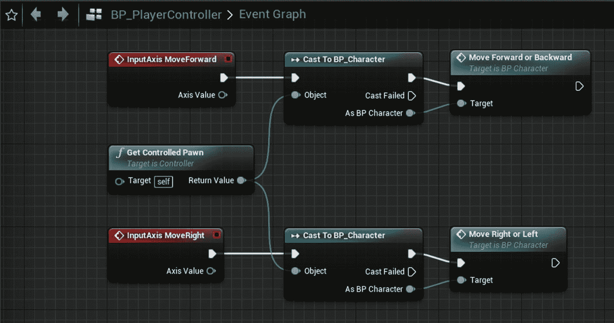

图 4-11。

包含所有功能的最终图形

最后一步使用我们游戏中的角色和控制器类。为此，创建一个新的游戏模式蓝图，并将我们的角色指定为默认棋子，将控制器指定为游戏模式中的玩家控制器类。在图 4-12 中，你可以看到我将我们的蓝图创建的角色和控制器分配给了游戏模式类。

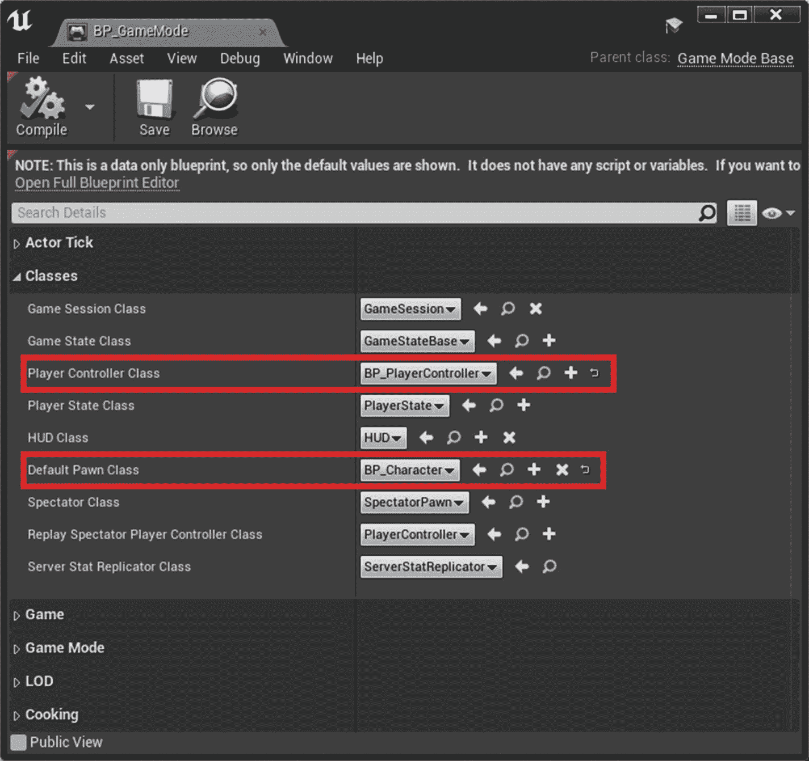

图 4-12。

在游戏模式中分配控制器和棋子

要使用我们创建的 BP_GameMode，您需要将其分配到您的关卡的世界设置中。在关卡编辑器的主工具栏中，点击设置并选择世界设置(见图 4-13 )。

图 4-13。

从设置中选择世界设置

在世界设置选项卡中，指定游戏模式(参见图 4-14 )。

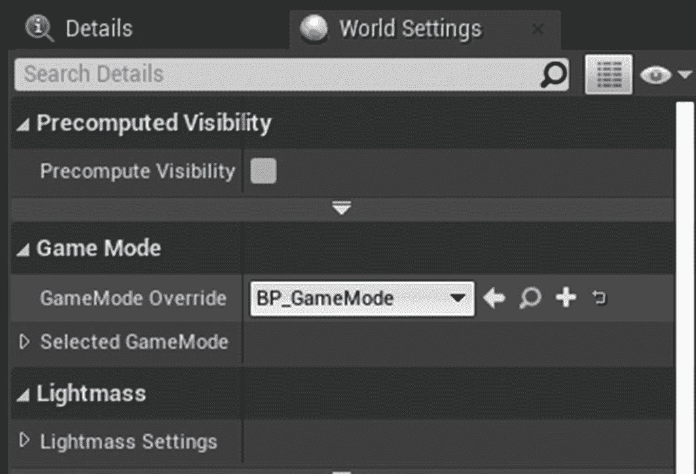

图 4-14。

分配游戏模式

如果您按下播放，您可以使用 W、A、S、D 键或您在输入设置中指定的任何键来移动角色。

## 在 HUD 上创建和显示数据

在本节中，您将为玩家角色添加一个基本的 HUD，创建一个在玩家受到伤害时会改变的健康变量，并创建一个在 3 秒后自动消失的欢迎文本。注意，这里显示的实现只适用于单人游戏；它在多人游戏中不起作用。

首先，让我们通过右击内容浏览器并选择用户界面➤小部件蓝图来创建一个 UMG 小部件蓝图(见图 4-15 )。

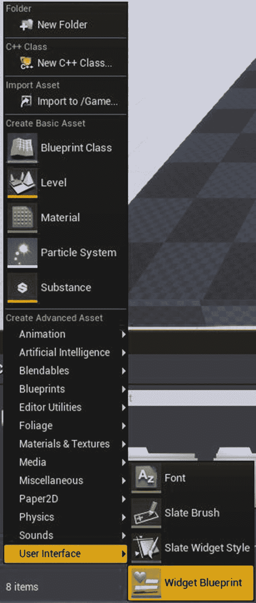

图 4-15。

创建小部件蓝图

打开小部件蓝图。您会看到主设计器部分，在这里您可以从面板中拖放不同的小部件。在右上角，您可以在设计器视图和图形视图之间切换(参见图 4-16 )。图形视图用于创建所有的蓝图逻辑。

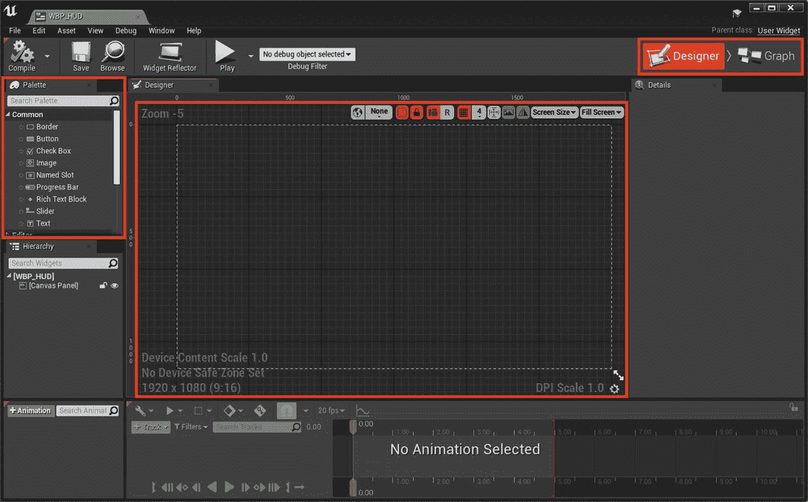

图 4-16。

绕图排文

让我们将一个进度条小部件从面板拖放到 Designer 选项卡中。选择进度条小部件。在详细信息面板中，输入进度条的名称(如健康条)(见图 4-17 )。

图 4-17。

设置变量名

为了实现这个逻辑，让我们首先切换到图形视图并创建一个新事件。在图形中右键单击，并从添加事件类别中选择添加新事件。将此事件重命名为 UpdateHealth，并添加两个名为 CurrentHealth 和 MaxHealth 的浮点参数。从 CurrentHealth 浮动引脚拖动，搜索除法运算符，并选择它。然后将 MaxHealth 连接到 Divide 的 B 输入端。这是您在 ProgressBar 中使用的结果。这样做是因为 ProgressBar 在 0–1 范围内工作，并且因为您将 CurrentHealth 除以 MaxHealth，所以您会得到这个范围内的结果。

要设置 ProgressBar 的值，请将 ProgressBar 从变量类别拖放到图形视图，从大头针拖动，然后搜索 Set Percent。将“除法”节点的结果连接到“设置百分比的百分比”节点。您的节点设置应该类似于图 4-18 。

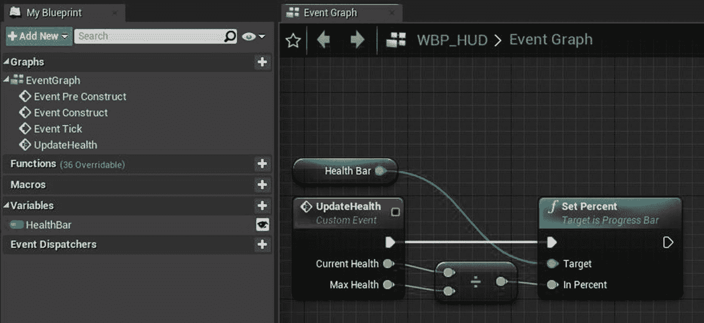

图 4-18。

更新健康设置

要使用 widget，您需要将其添加到屏幕上。我们打开角色蓝图，切换到事件图。在图形中右键单击并搜索创建小部件节点。在类输入中，设置新创建的 UMG HUD。然后右击返回值并选择提升为变量(见图 4-19 )。命名为 **PlayerHUD** 。这会将结果缓存到一个变量中，以便您可以随时访问它。

图 4-19。

提升为变量

从 PlayerHUD 变量中，拖动一个大头针，搜索添加到视口，并选择它(参见图 4-20 )。

图 4-20。

将小部件添加到视口

如果你现在玩，你可以在你的屏幕上看到新添加的 HUD，但它还没有做任何事情，因为我们还没有调用更新健康事件。要快速修复此问题，请从 PlayerHUD 变量中拖动一个大头针，然后搜索 UpdateHealth。现在创建一个名为 Health 的浮点变量，并将其默认值设置为 100。从我的蓝图选项卡中拖动此变量，将其连接到更新健康功能的当前健康，并将最大健康设置为 100(参见图 4-21 )。

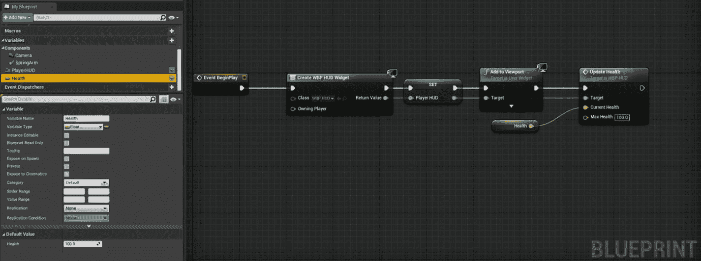

图 4-21。

最初调用更新健康事件

设置好一切后，添加欢迎文本。将文本小部件从调色板选项卡拖放到设计器中。要将此文本在屏幕中央对齐，请通过扩展它并将最小值和最大值都设置为 0.5 来将锚点设置为居中。您还需要将对齐设置为 0.5。之后，将位置 X 和位置 Y 设置为 0。文本现在在屏幕上居中。接下来，启用“根据内容调整大小”来根据文本自动调整小部件的大小。

在内容类别下，根据您的喜好更改文本。对于这个例子，让我们写一些类似**欢迎来到 UMG** 的东西。展开“外观”下的字体，并将“大小”设置为 48。你需要文本在 3 秒钟后消失。为此，确保细节选项卡中的 Is 变量设置为真，并输入小部件的名称(如 WelcomeText)(参见图 4-22 )。

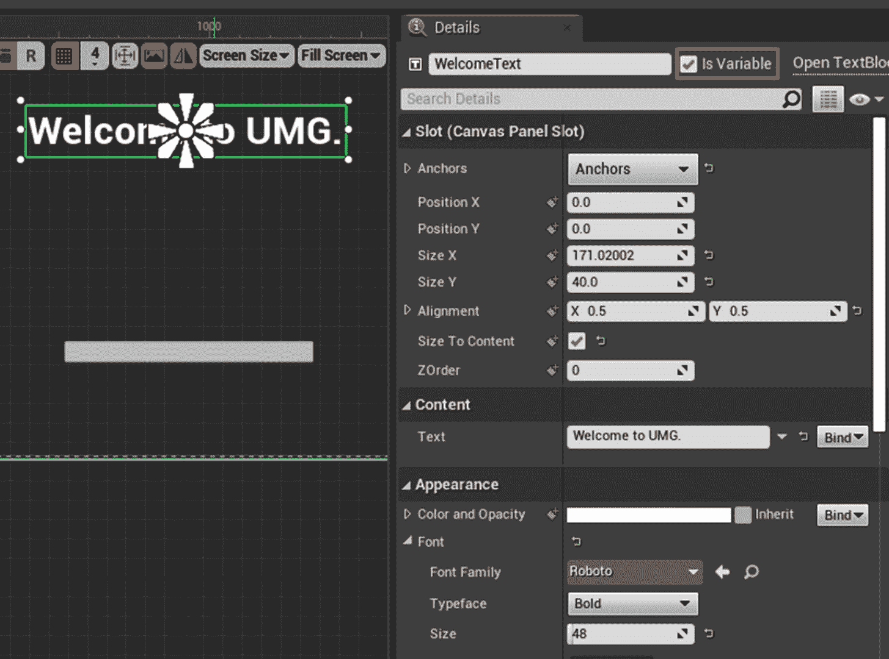

图 4-22。

为文本设置变量名

切换到 Graph 视图，现在可以将 WelcomeText 小部件从 MyBlueprint 选项卡(在 Variables 部分下)拖放到图形中。右键单击图表，搜索延迟，并选择它。将延迟节点连接到事件构造。然后从小部件文本的输出管脚拖动一条线，搜索 Set Visibility，并选择它。可见性从可见变为折叠，并将延迟节点的输出完成连接到设置可见性节点。最后，将延迟节点的持续时间更改为 3 秒(参见图 4-23 )。

图 4-23。

带延迟节点的图形

单击播放按钮。您会看到欢迎文本和进度条正在显示(参见图 4-24 )。

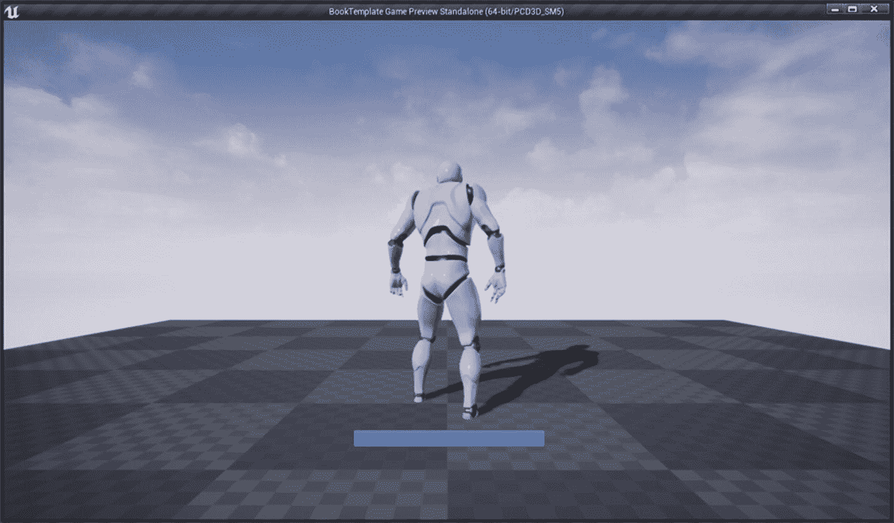

图 4-24。

添加了 UMG 插件来玩游戏

每当你的玩家受到伤害时，你可以降低你的生命值，并调用生命值与当前生命值关联的更新生命值，这样可以正确更新 UMG 的进度条。