# 五、物理学和光线投射

虚幻引擎中的物理负责所有物理角色的模拟和碰撞，这意味着任何运动，如下落或施加力或它们之间的相互作用都是使用物理来完成的。在写这本书的时候，Unreal 使用的是 PhysX 版，用于所有的模拟。

UE4 包括一个内置的高性能定制物理引擎，名为 Chaos Physics Engine，该引擎(在撰写本书时)只能通过 GitHub 源代码获得。混沌物理预计将在 UE4 版本 4.26 中投入生产。

光线投射(Raycasting，也称为 *trace* )是在游戏世界中从一个位置向另一个位置发送不可见光线，并确定光线是否击中任何东西的过程。点击结果包含可以用来改变游戏状态的信息。

在本章中，您将学习模拟、碰撞和追踪。

## 模拟

当一个物体通过施加一些力而下落或移动时，那么这个物体就是在模拟物理。要进行物理模拟，网格必须首先具有碰撞形状。因为实际的 3D 网格可能很复杂，所以 UE4 使用简单的代理形状，这些形状称为物理实体(也称为实体实例)，如长方体、球体、胶囊或自定义凸包来模拟物理。通过选择要应用物理的网格来调整该物理实体的属性。例如，在第三章中，我们分配了一个静态网格组件，并为我们的 C++ actor 创建了一个蓝图类。

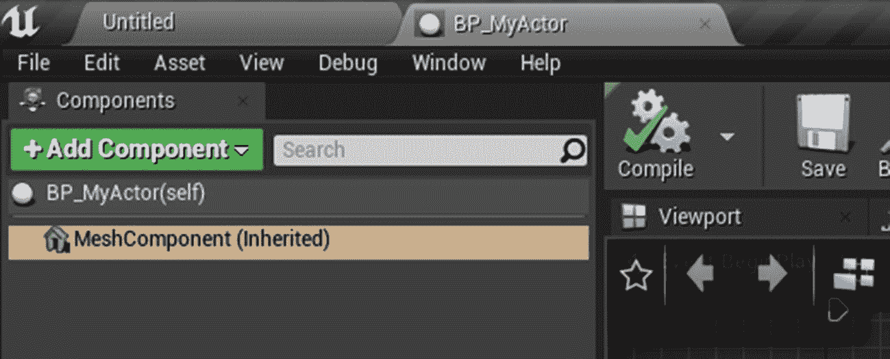

图 5-1。

继承网格组件

1.  打开蓝图，从组件选项卡中选择 MeshComponent(继承的)(见图 5-1 )。

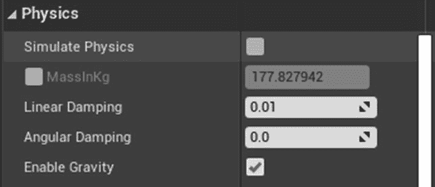

图 5-2。

详细信息面板中的物理类别

1.  在细节面板中，向下滚动到物理类别(参见图 5-2 )。

让我们来看看这些属性。

*   **模拟物理**:启用或禁用物理模拟。如果该选项是灰色的，则您没有在选定的网格上设置碰撞。对于骨骼网格，您需要一个物理资源设置，对于静态网格，您需要一个简单的碰撞设置。

*   **质量**:物体的质量，单位为千克。

*   **线性阻尼**:施加在直线运动上的阻力，决定直线运动。

*   **角阻尼**:施加在角运动上的阻力，角运动相当于线性运动的旋转。

*   **启用重力**:决定物理模拟是否应该应用重力。

## 冲突

在 Unreal 中，每个具有碰撞的对象都被指定一个对象类型，该类型定义了它如何与其他对象类型交互。有些对象类型可以阻塞，有些可以重叠，有些可以忽略。对象还可以使用跟踪通道定义它应该如何对跟踪做出反应。默认情况下，有两种类型的跟踪通道:可见性和摄影机。

有两种类型的冲突:阻塞和重叠。

*   **阻挡碰撞**发生在两个物体碰撞而无法通过的时候(比如一个物体撞到一面墙)。

*   **重叠碰撞**发生在两个物体相互重叠的时候(例如，一个物体落入水中)。

碰撞由碰撞类别下组件上的预设决定。冲突生成带有信息的事件，包括与谁发生了冲突。图 5-3 显示了碰撞特性。

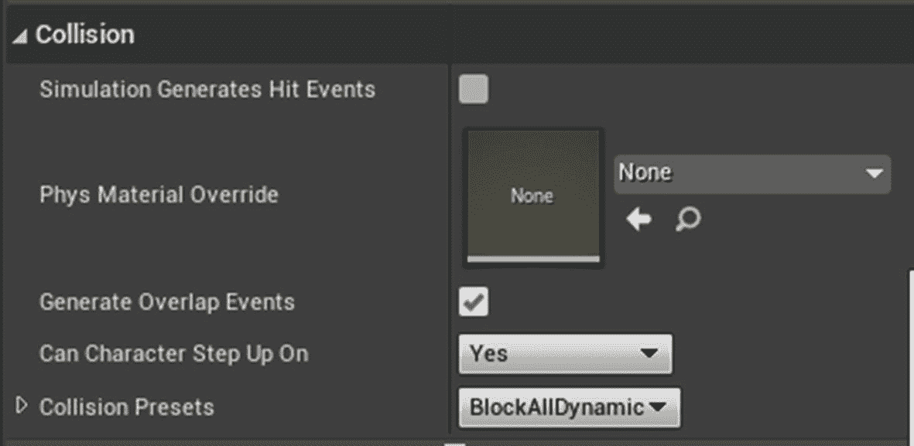

图 5-3。

静态网格的碰撞特性

*   **模拟生成碰撞事件**:如果为真，当碰撞成功时，该物理实体调用一个本地 on 组件碰撞事件。

*   **物理材质覆盖**:指定一种物理材质(不要与下一章的材质混淆)来定义摩擦、恢复和密度等属性。

*   **生成重叠事件**:如果为真，该物理实体在重叠开始时调用本机 On Begin Overlap 事件，在重叠结束时调用 On End Overlap 事件。

*   **角色能否登上**:决定玩家角色能否登上该物体。如果没有，玩家试图踩上去就会被拒绝。

碰撞有四种不同的状态。

*   **无碰撞**:没有任何类型碰撞的表示。这意味着没有重叠或阻塞。

*   **仅查询**:物体只能触发重叠事件，没有刚体碰撞；该对象不能阻止任何其他对象。

*   **Physics only** :该对象可以与其他对象交互，但不支持重叠。

*   **碰撞使能**:物体可以重叠并遮挡其他物体。

现在让我们来看看如何定义一个新的轨迹类型，并在游戏中使用它来拾取一个物品。

## 使用跟踪(光线投射)拾取项目

当你想拿起游戏中的一个物品时，你先看着这个物品，然后按下一个特定的键。当您按下引擎盖下的那个键时，引擎会从摄像机位置发出一条指定长度的不可见光线。在开始位置和结束位置之间，如果跟踪命中某个对象，它将返回包含命中信息的命中结果。图 5-4 说明了跟踪是如何工作的。

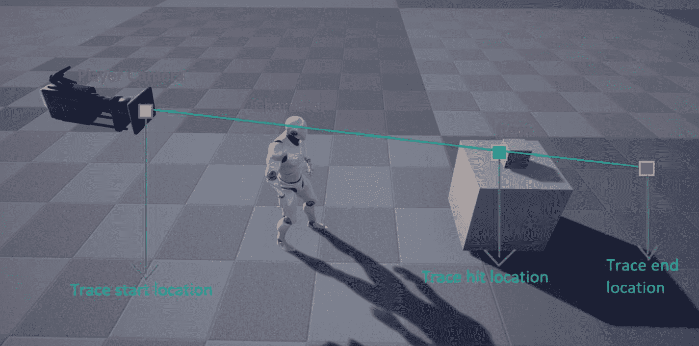

图 5-4。

展示跟踪如何工作的示例

那么 trace 怎么知道要打什么呢？这是使用跟踪通道完成的。虚幻引擎带有两个跟踪通道:可见性和相机。在本节中，您将创建我们自己的跟踪通道，将其设置为一个项目，并使用 trace 来检测它。

首先，让我们创建一个跟踪通道。点击菜单栏上的编辑打开项目设置，然后选择项目设置(参见图 5-5 )。

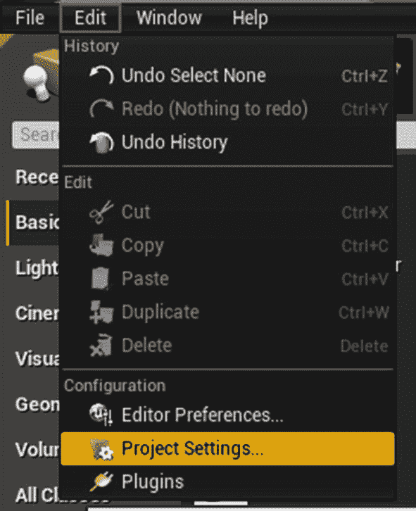

图 5-5。

访问项目设置

从项目设置中，单击引擎部分下的碰撞以修改碰撞设置(参见图 5-6 )。

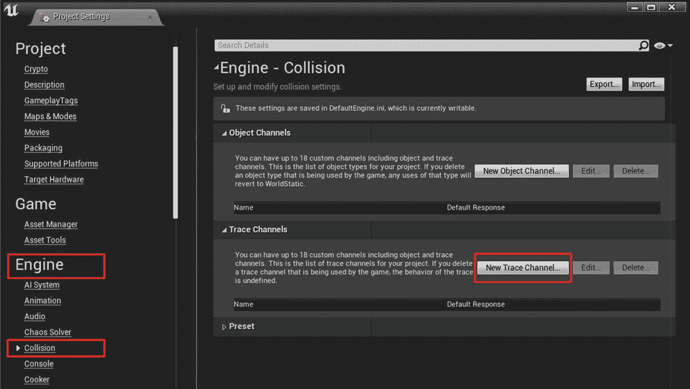

图 5-6。

添加新的跟踪通道

单击“跟踪通道”类别下的“新建跟踪通道”按钮。出现一个新对话框，提示您命名跟踪和默认响应。输入名称 **MyItemTrace** 并将默认响应设置为忽略(参见图 5-7 )。

图 5-7。

用名称和响应定义新跟踪

按下 Accept 按钮后，您会在 Trace Channels 类别下看到新创建的跟踪。现在，您可以访问每个网格组件下的跟踪通道来启用或禁用它。

在我们做任何其他事情之前，让我们首先确保您使用的网格(1M_Cube)有碰撞可用。转到网格所在的内容浏览器，将鼠标悬停在网格上。在工具提示中，如果碰撞优先级大于 0，则网格包含碰撞(参见图 5-8 )。

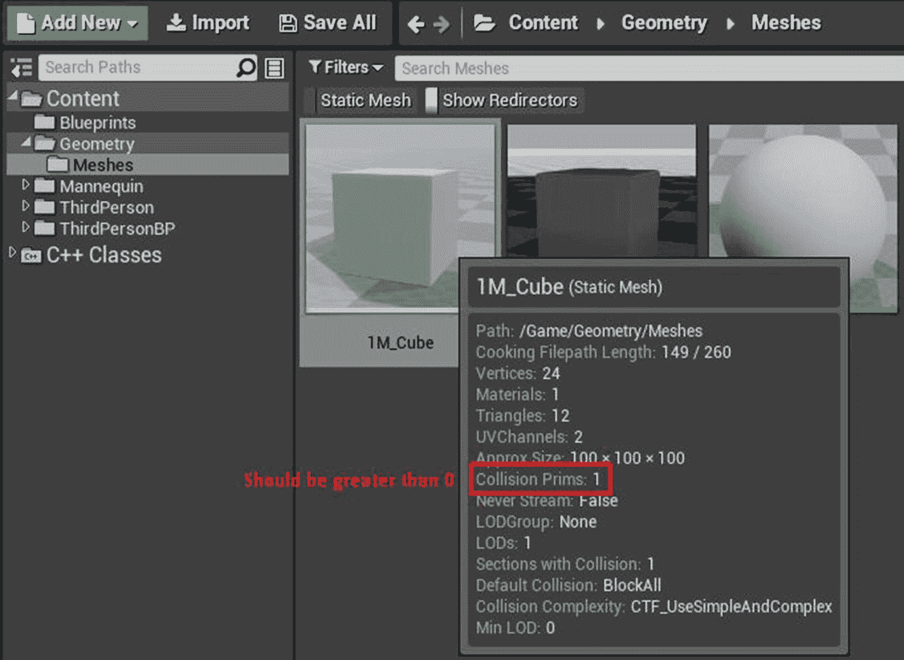

图 5-8。

显示碰撞基本体数量的工具提示

如果网格是缺失碰撞，可以在静态网格编辑器中生成碰撞形状。从菜单栏中，单击“碰撞”并选择一个选项来生成所需的碰撞形状。对于简单的形状，可以选择长方体、圆柱体、球体等等，但是对于复杂的形状，选择自动凸碰撞(见图 5-9 )。

图 5-9。

各种碰撞

要使用跟踪通道，首先要打开之前创建的 Blueprint Actor，并从 Components 选项卡中选择 MeshComponent(继承的)。指定包含静态网格的碰撞。在我们的示例中，您使用 1M_Cube 静态网格。

接下来，转到细节面板，向下滚动到碰撞类别。展开“碰撞预设”区域，然后单击 BlockAllDynamic 下拉按钮。从选项列表中，选择自定义。通过选择“自定义”,可以选择对象如何响应与其他对象的碰撞。通过启用 block(参见图 5-10 )来选择阻止 MyItemTrace 跟踪响应。

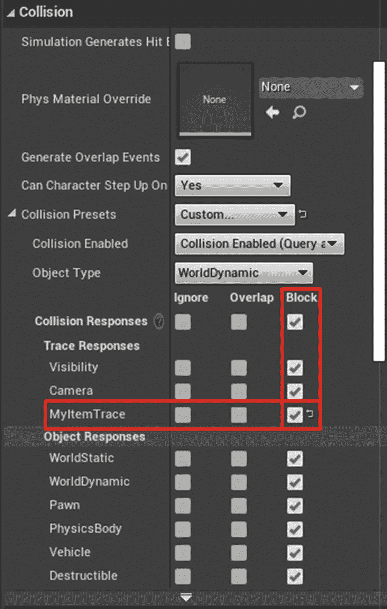

图 5-10。

将我们的跟踪设置为阻止

您现在已经完成了项目设置，但是跟踪呢？您可以在字符类中这样做，但是您需要有一个输入来开始跟踪。为此，请单击菜单栏上的编辑，然后选择项目设置。接下来，选择引擎部分下的输入。在右侧，点击动作映射旁边的 **+** 按钮。将输入命名为您想要的任何名称，并为其选择一个键。我将其命名为 Trace，并选择 E 作为键(见图 5-11 )。

图 5-11。

创建要跟踪的新输入

如果尚未添加第三人称项目，可以通过在内容浏览器中单击绿色的“添加新项目”按钮来添加。选择添加功能或内容包。在对话框中，选择第三个人，点击**+添加到项目**。

接下来，按下 **Shift+Alt+O** 打开打开资产对话框。搜索 ThirdPersonCharacter 并打开它。或者，您可以导航到内容/第三个人/蓝图并打开第三个人角色蓝图(参见图 5-12 )。

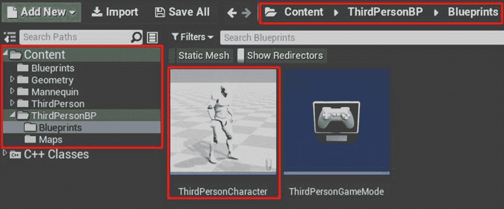

图 5-12。

开放式第三人称角色

在事件图中，右键单击并搜索输入跟踪(在输入→动作事件下)。您可以添加跟踪事件，当您按下 E 键时会调用该事件。再次右键单击图形，并按通道搜索线追踪。(还有其他类型的轨迹，如盒子、胶囊和球体。请访问 https:// docs 了解更多信息。不现实。com/en-US/Engine/Physics/Tracing/Overview/index。html 。

按通道的线追踪是从起始位置追踪到结束位置的主要节点。图 5-4 显示了从摄像机开始的轨迹，并向摄像机面对的方向拍摄。要创建该设置，请右键单击图表并搜索 GetFollowCamera(无空格),然后选择“获取跟随摄影机”节点。这是组件中的角色包含的摄像机的 getter 节点。(或者，可以将跟随相机从“组件”选项卡拖动到图形上以创建节点)。

从该节点的输出管脚，拖动一条线，搜索 GetWorldLocation，并选择它。该节点显示摄影机组件在世界空间中的位置。将 GetWorldLocation 黄色输出连接到线跟踪节点的开始输入(见图 5-13 )。

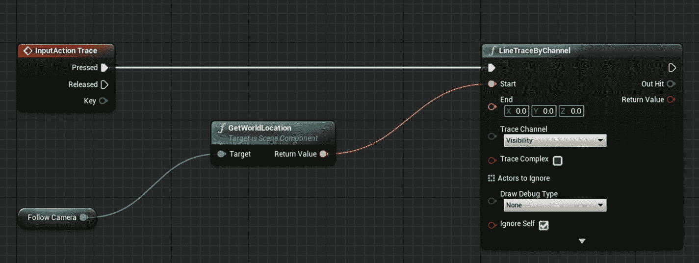

图 5-13。

设置线追踪起始位置

现在，您需要跟踪在相机正在寻找的特定长度处结束。为此，从“跟随摄影机”中拖动一个关联，搜索并选择 GetWorldRotation，它表示摄影机组件的世界旋转。要找到方向，请从 GetWorldRotation 蓝色输出中拖动一条线，然后搜索并选择 GetForwardVector。

GetForwardVector 节点表示方向，但它返回一个单位向量，这意味着它在 0-1 范围内，在我们的上下文中没有用( [`https://en.wikipedia.org/wiki/Rotation_matrix`](https://en.wikipedia.org/wiki/Rotation_matrix) )。所以你要把它乘以一个更大的数字，来决定这个轨迹应该走多远。

从 GetForwardVector 节点的黄色输出中拖动一条线，搜索**乘**并选择 vector * float 节点。选择该节点后，在新创建的乘法节点的绿色框中输入 **5000** 。5000 是我们追踪的长度。将乘法节点输出连接到线路跟踪节点的末端输入。

接下来，单击线追踪节点上的可见性下拉按钮，并将其更改为 MyItemTrace(参见图 5-14 )。

图 5-14。

设置线追踪结束位置

您还没有完全完成，但是您已经完成了跟踪设置。如果你现在玩游戏并按下 E(或者你用来追踪的键)，看起来好像什么都没发生，但是你在追踪。要对此进行检查，请单击绘制调试类型处的无下拉按钮，并将其更改为持续时间。再次按下播放按钮，开始跟踪。你现在会看到一条从你的相机出发的红线，它射向你正在看的地方。

即使您完成了跟踪，您仍然没有使用来自命中结果的任何信息。让我们解决这个问题。从线条跟踪的红色返回值中拖动一个大头针，搜索并选择分支节点。返回值是布尔值(真或假)。如果命中成功则为真(如果命中任何带有 MyItemTrace 的对象，跟踪响应为阻塞；在我们这里是我们创造的蓝图演员)。如果跟踪没有命中任何东西，则为假。从“出点击”节点拖动另一条线，并选择“断开点击结果”。产生的节点称为结构节点，它是包含其他数据类型的容器。

在“中断命中结果”节点中，单击向下箭头展开节点并显示所有高级类型。右键单击事件图，搜索并选择 Print String，这是一个将消息打印到屏幕上的简单节点。从 Hit Actor 拖动一条线，并将其连接到打印字符串的 In 字符串。这将在打印字符串和结构节点之间自动创建一个新节点。最后，用打印字符串连接分支节点，你就有了一个完整的设置(见图 5-15 )。

图 5-15。

使用打印节点添加调试设置

因为您需要跟踪来做出反应，所以您必须放置您创建的蓝图。将蓝图从内容浏览器拖放到游戏世界。现在按下播放键，查看放置在世界中的物品。按下跟踪输入键。您会看到一条红色的跟踪线(如果您将绘制调试类型设置为持续时间或持续时间),并在屏幕上显示一条消息(参见图 5-16 )。

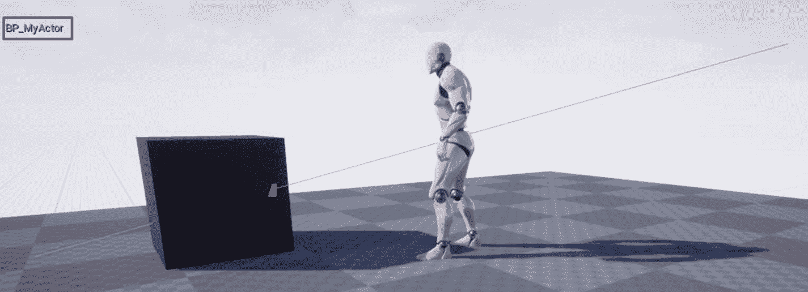

图 5-16。

打印节点输出正确的信息

## 使用物理的破坏

在本节中，您将使用 Apex 破坏插件创建一个可破坏的网格，并在游戏中与之交互。在写这本书的时候，虚幻引擎正在从 Physx 过渡到混沌物理系统，使得这一部分在未来变得过时。我不介绍 Chaos，因为它还没有准备好投入生产，需要 GitHub 源代码版本，而不是启动程序版本。

要创建一个可破坏的网格，你首先需要从插件部分启用 Apex 插件。单击菜单栏中的编辑按钮，然后选择插件。转到物理类别，并启用 Apex 破坏插件。重启编辑器(参见图 5-17 )。

图 5-17。

启用 Apex 销毁插件

重新启动后，您可以在内容浏览器中右键单击任何静态网格角色(在我们的示例中为 1M_Cube ),然后选择 Create Destructible Mesh。一个新的可析构编辑器打开，静态网格旁边有一个新的可析构编辑器 actor。让我们来看一下图 5-18 中的可破坏网格编辑器的基础。

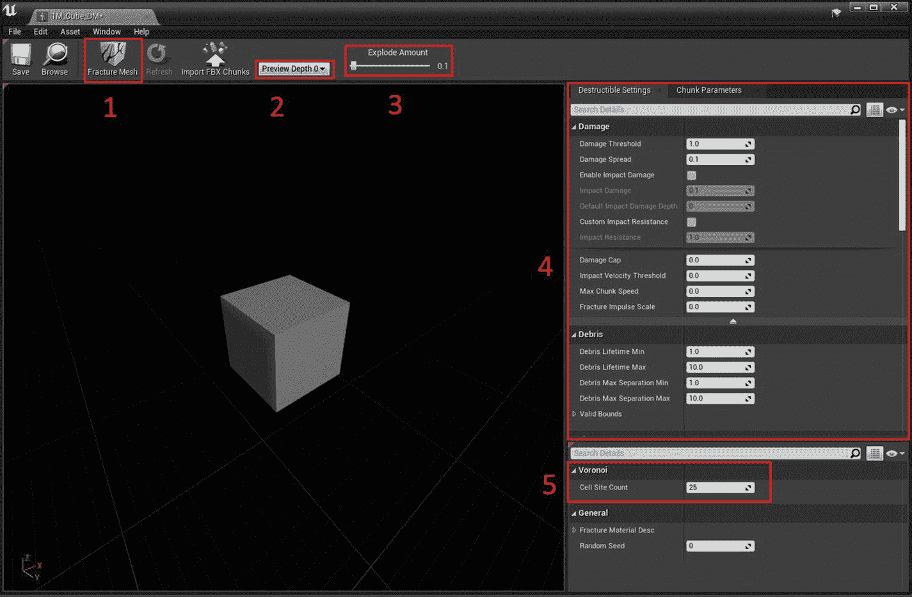

图 5-18。

可析构编辑器布局

*   **断裂网格**(图 5-18 中的 1 区)将网格断裂成多个块。组块的数量基于 Voronoi 部分(右下角)下的小区站点计数。

*   **预览深度 0** (图中 2 区 5-18 )为组块深度。

*   **爆炸量**(图 5-18 中的区域 3)是一个滑块，将碎片移开。

*   **可破坏设置**(图 5-18 中的区域 4)是调整各种可破坏设置的面板。

*   **断裂设置**(图 5-18 中的区域 5)是您决定生成组块数量的区域。

首先，将小区站点计数设置为 100，然后按“断开网格”按钮。这将网格分成 100 个不同的大块(见图 5-19 )。

图 5-19。

100 片网眼

返回内容浏览器，将新创建的可析构网格角色(1M_Cube_DM)拖到游戏世界中。如果你现在按下播放按钮，什么也不会发生，因为可破坏的网格没有模拟物理。要修复它，请在视口中选择可析构角色，并在“细节”面板中启用模拟物理(参见图 5-20 )。

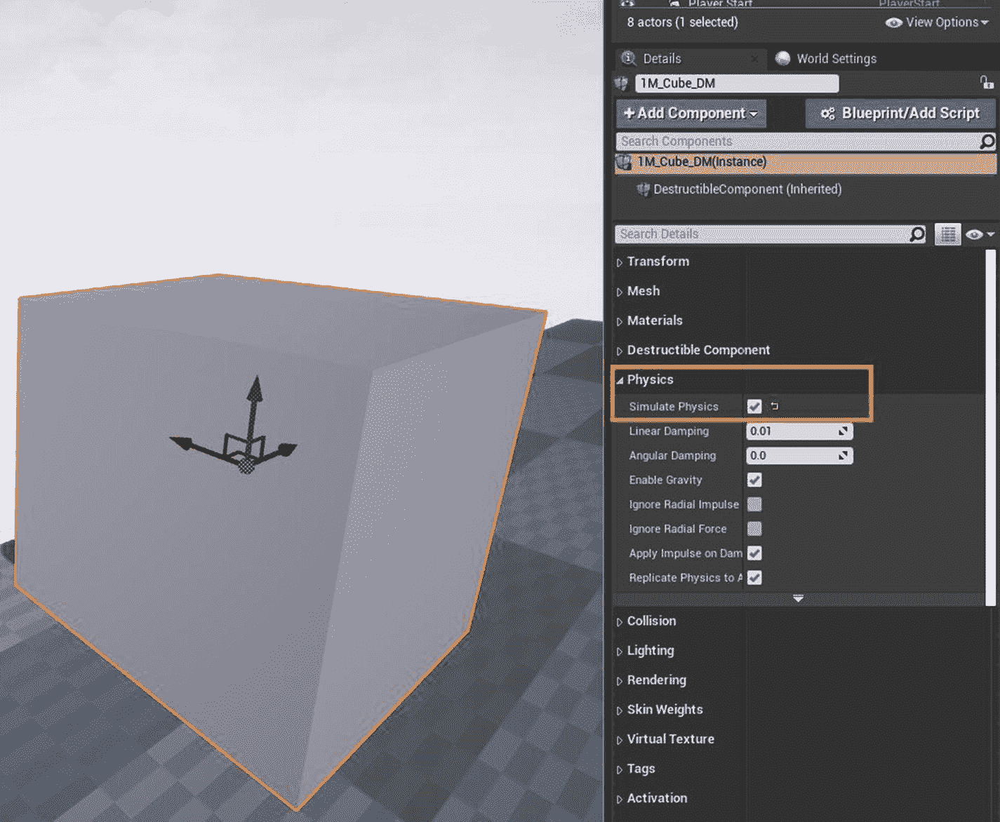

图 5-20。

模拟物理已启用

现在，如果你按下 Play，你会看到可破坏的网格掉落并撞击地面，但没有破坏。为什么呢？这是可破坏的网格，但是没有破坏，对吧？嗯，这是因为你还没有启用破坏网的伤害。那你是怎么做到的呢？打开可破坏网格角色，打开启用冲击破坏(见图 5-21 )。

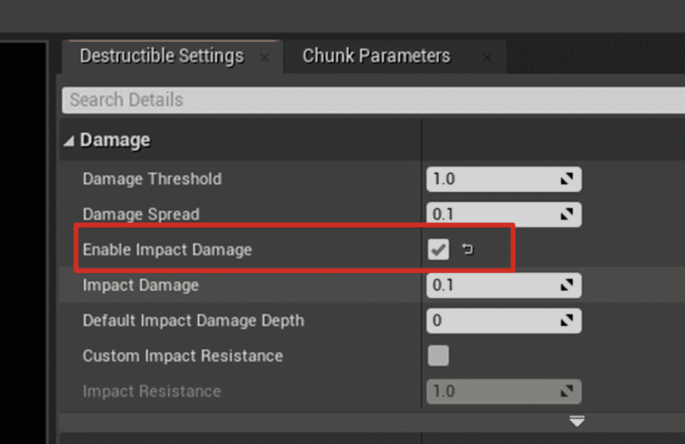

图 5-21。

撞击伤害启动

回到你的游戏世界，按 Play。观察网状物是如何落下并碎成碎片的(参见图 5-22 )。

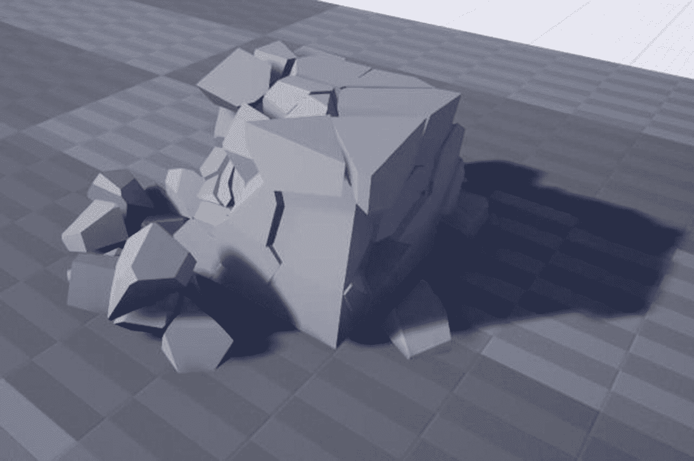

图 5-22。

跌落后网眼断裂

当网格破裂时，让我们通过应用粒子效果来增加一点趣味。对于粒子系统，如果尚未添加，请添加 Starter 内容包。要添加初学者内容，请在内容浏览器中单击“添加新内容”按钮，然后选择第一个添加功能或内容包。在下一个对话窗口中，切换到内容包选项卡，选择起始内容，并单击**+添加到项目**(参见图 5-23 )。

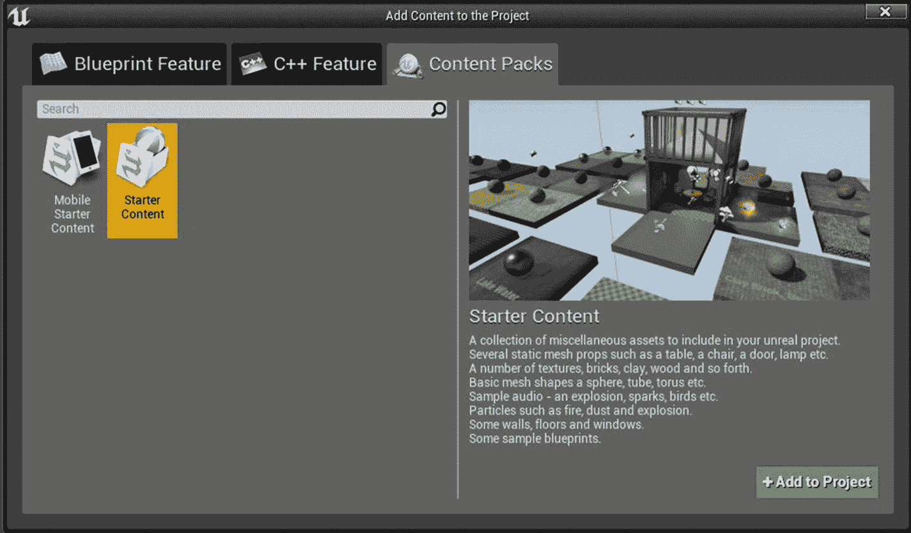

图 5-23。

向我们的项目添加入门内容

添加 Starter 内容后，打开 1M_Cube_DM，并在“效果”类别下的“破坏设置详细信息”面板中，展开“断开设置”。这里你看到两个数字:0 和 1。展开 1 并分配 P_Smoke(这是起始内容中的粒子)(见图 5-24 )。

图 5-24。

指定烟雾粒子系统

如果你现在玩，当物体掉落破碎时，你看到的是在破碎位置播放的粒子效果(见图 5-25 )。

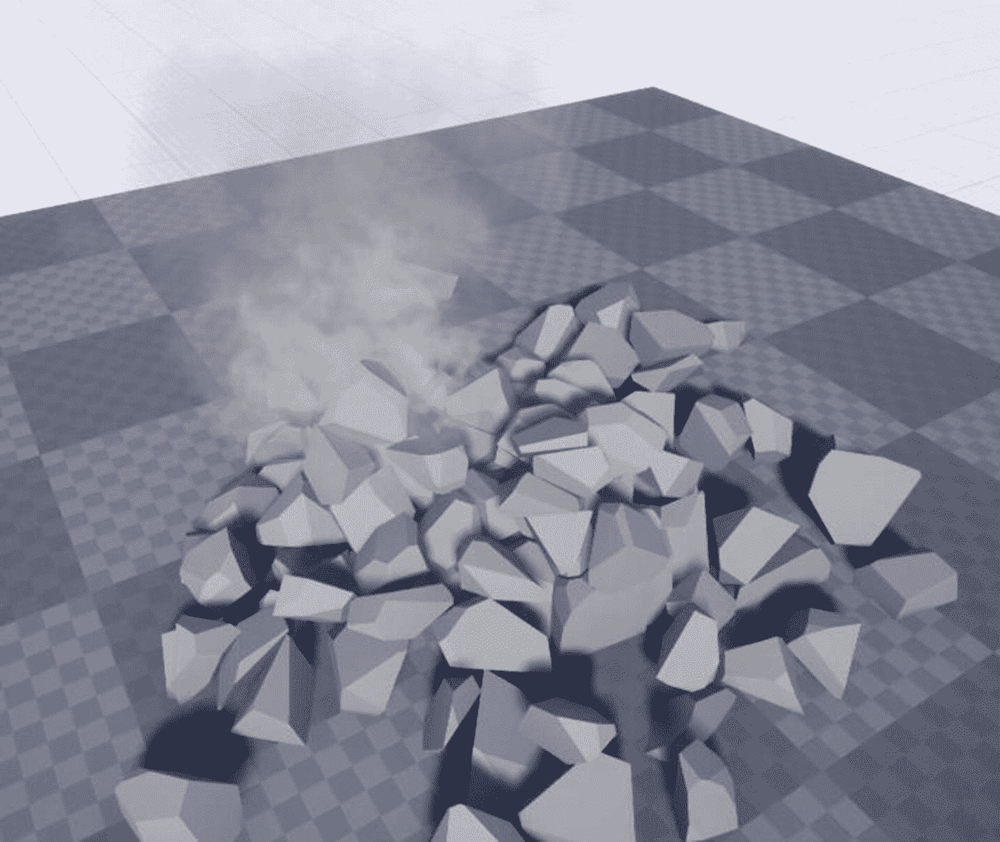

图 5-25。

网格断开后正在播放烟雾效果