# 7.演示游戏

在这最后一章中，您将使用虚幻引擎(发射器版本)附带的默认第一人称射击游戏模板(蓝图版本)创建一个演示游戏，并扩展它以包括各种功能，如弹药计数、弹药拾取等。完成这些功能后，您将学习如何为 Windows 打包游戏。

## 创建项目

让我们从使用第一人称模板创建一个项目开始。打开 Epic Games Launcher，点击右上角的黄色启动按钮。这将启动虚幻引擎，很快，你就会看到虚幻项目浏览器窗口(见图 [7-1](#Fig1) )。

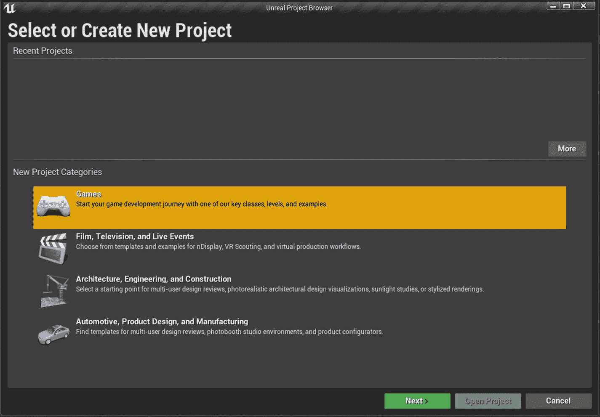

图 7-1

。虚幻项目浏览器

选择游戏，然后单击下一步。从模板选择屏幕中，选择第一个人模板并点击下一步(参见图 [7-2](#Fig2) )。

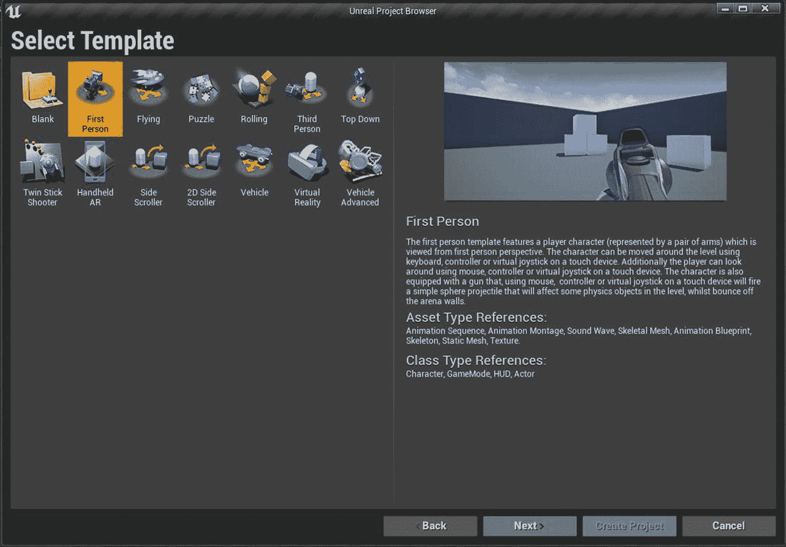

图 7-2。

选择第一个人模板

在项目设置页面中，您可以设置项目的初始设置和类型(Blueprint 或 C++)。从一个 C++ 项目开始，创建蓝图。选择 C++，设置一个位置，命名您的项目，然后单击“创建项目”。重要的是要记住，这些文件是在这个上下文中命名的: <projectname><classtype>.h .在这个例子中，我将项目命名为 Chapter07，所以我的文件就是基于这个命名的——例如 Chapter07Character，Chapter07GameMode 等等(见图 [7-3](#Fig3) )。</classtype></projectname>

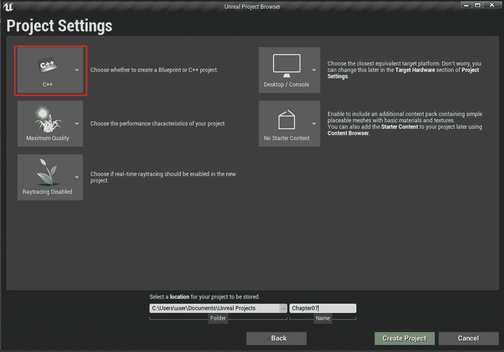

图 7-3。

选择 C++ 项目类型

创建项目后，Visual Studio 会自动打开该项目的解决方案文件。虚幻编辑器也会启动。按下工具栏上的播放按钮(或 **Alt+P** )来测试 FPS 模板。玩的时候，用 W 键前进，S 键后退，A 键向左扫射，D 键向右扫射，鼠标环顾四周，鼠标左键发射弹丸。该模板还包括基本的物理模拟，因此当你拍摄任何一个白盒时，它都会翻滚(见图 [7-4](#Fig4) )。

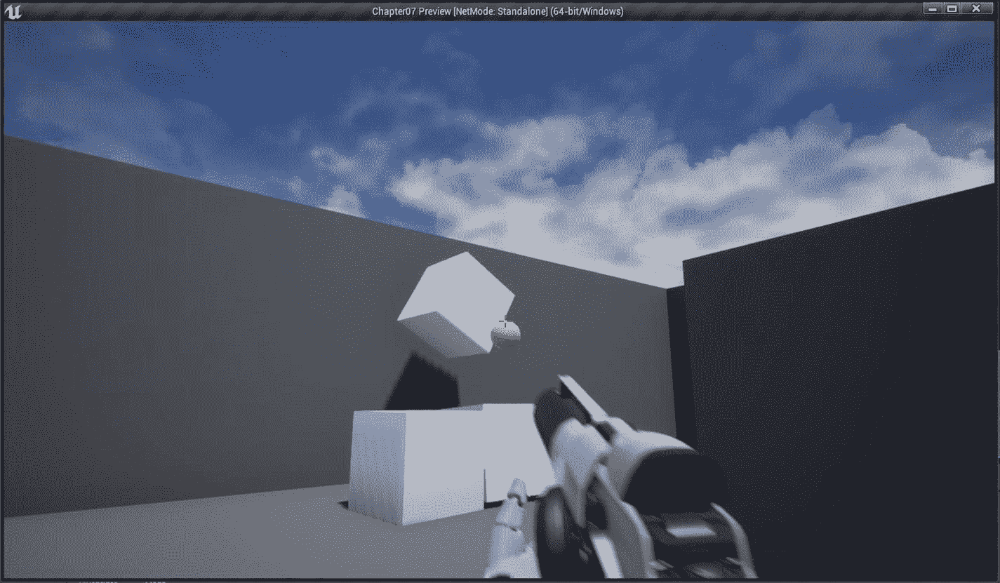

图 7-4。

启用物理的盒子

## 弹药设置

你可能已经注意到了，你可以随心所欲地发射炮弹。我们需要改变这种情况。我们需要设置武器的弹夹数量和每个弹夹的弹药量。例如，如果这个武器有 3 个弹夹，每个弹夹有 20 发弹药，那么这个武器可以拥有的最大弹药量是 3 * 20 = 60。每次发射 20 发子弹，每个弹夹都会被耗尽。在拍摄下一个片段之前有两秒钟的暂停时间。在实际项目中，这个超时被一个重新加载动画所取代。我们将使用变量来定义值，因此您可以调整一切，而不必担心内部工作。

要有弹药功能，打开 Chapter07Character.h 头文件。以下变量是在 GENERATED_BODY()宏下创建的。

*   **最大弹夹数**(整数):武器可以拥有的最大弹夹数。默认 5。

*   **开始片段**(整数):游戏开始时武器拥有的片段数。这不应大于最大片段数。默认 3。

*   **每个弹夹的弹药量**(整数):每个弹夹的弹药量。默认 20。

*   **当前弹夹**(整数):武器当前拥有的弹夹数量。每次武器重新装填时，将该变量减一，以表示弹夹已被使用。默认为 0。

*   当前弹药(整数):武器当前的弹药量。每次射击时，将这个变量减一，表示你发射了一颗子弹。默认为 0。

*   **bCanShoot** (boolean):决定你能不能开枪的真或假变量。默认为假。

*   **ReloadTime** :当所有子弹发射完毕后，武器重新装弹的时间(秒)。默认 2。

因为您希望它们向编辑器公开，所以将它们标记为 UPROPERTY。以下是变量的代码。请注意 BlueprintReadOnly 和 BlueprintReadWrite 的用法。

```cpp
/* Maximum amount of clips this weapon is allowed to have.  */
     UPROPERTY(EditDefaultsOnly, BlueprintReadOnly)
     int32 MaxClips;
     /* Amount of clips for the weapon to have when the game starts. This should never be greater than Max Clips. */
     UPROPERTY(EditDefaultsOnly, BlueprintReadWrite)
     int32 StartingClips;
      /* Amount of ammo per clip. */
     UPROPERTY(EditDefaultsOnly, BlueprintReadOnly)
     int32 AmmoPerClip;
     /* True or false variable that determines if you can shoot or not. */
     UPROPERTY(EditDefaultsOnly, BlueprintReadWrite)
     bool bCanShoot;
     /* Time in seconds for the weapon to reload when all bullets are fired. */
     UPROPERTY(EditDefaultsOnly, BlueprintReadOnly)
     float ReloadTime;
     /* Amount of clips this weapon currently has. Every time the weapon reloads, you subtract this variable by one to denote that the clip has been used. */
     UPROPERTY(BlueprintReadWrite)
     int32 CurrentClips;
     /* Amount of ammo this weapon currently has. Every time you shoot, you subtract this variable by one to denote that you fired one bullet. */
     UPROPERTY(BlueprintReadWrite)
     int32 CurrentAmmo;

```

设置完变量后，让我们在构造脚本图中创建初始逻辑。在此之前，您必须为这些变量分配默认值；否则，它们为 0 和 false。打开 Chapter07Character.cpp。在文件的顶部(第 20 行周围)，您会看到 AChapter07Character 构造函数(例如，a chapter 07 character::a chapter 07 character())。在这个块中，按如下方式分配默认变量。

```cpp
MaxClips = 5;
StartingClips = 3;
AmmoPerClip = 20;
CurrentClips = 0;
CurrentAmmo = 0;
bCanShoot = false;
ReloadTime = 2.f;

```

按 F5 从 Visual Studio 编译并启动项目。编辑器启动后，打开第一个人物蓝图和建筑脚本图。

从构造脚本的输出管脚拖动一条线，搜索序列节点，并添加它。Sequence 节点是一个特殊的 Blueprint 节点，允许您从上到下运行多个输出(您可以添加任意数量的输出)。添加一个分支节点，并将序列节点的第一个输出(标签为 Then 0)连接到该分支节点。

您需要使用分支节点条件来确保起始片段不大于最大片段。将起始剪辑和最大剪辑从我的蓝图选项卡拖放到构造脚本图表中。从起始剪辑拖动一个大头针，搜索>符号，然后选择“整数>整数节点”(起始剪辑现在自动连接到>节点的第一个输入)。如果第一个输入大于第二个输入，则该节点返回 true，因此将 Max Clips 连接到>(大于)节点的第二个输入，并将红色输出连接到分支节点的条件输入。

要设置起始剪辑节点的值，请按住键盘上的 Alt 键，然后再次将起始剪辑节点从蓝图选项卡拖放到构造脚本图中。这将为开始剪辑创建设置节点。将分支节点的真实输出连接到集合节点。连接最大片段作为设定开始片段节点的新输入。该图应如图 [7-5](#Fig5) 所示。

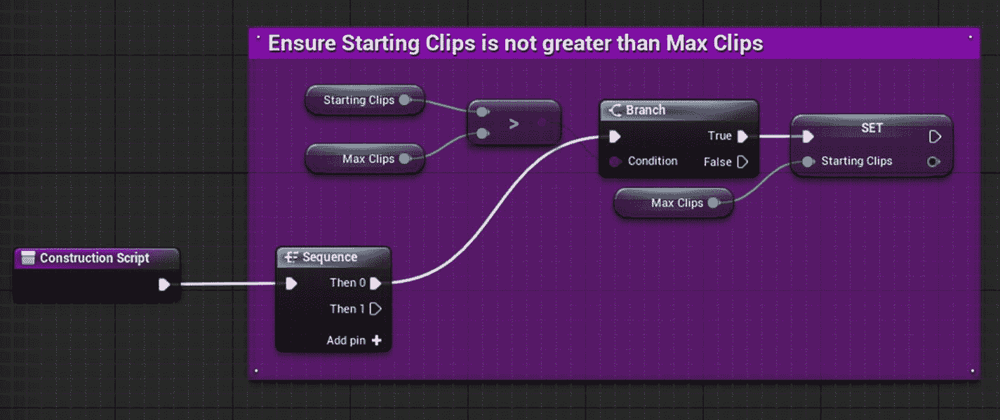

图 7-5。

弹药准备。设置起始剪辑

第二步是为这个武器设置当前的弹药。只有当你至少有一个弹夹时，你才需要设置当前弹药。因此，首先将当前剪辑设置为起始剪辑，然后检查当前剪辑是否大于 0。如果是的话，那么你就把当前弹药设置为和每个弹夹的弹药相同的值。如果当前剪辑是 0，那么当前弹药也是 0。图表的第二步应该如图 [7-6](#Fig6) 所示。

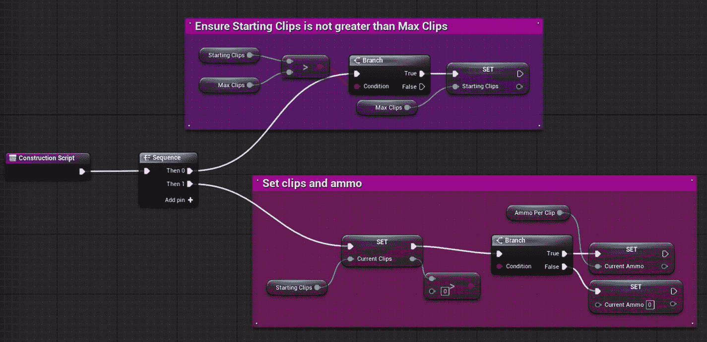

图 7-6。

弹药准备。设置当前弹药

构造图的最后一步是确定能不能拍。创建以下节点。

1.  为 Can Shoot 布尔变量设置节点。

2.  获取当前弹药的节点。

3.  大于整数节点(整数>整数)。

将当前弹药节点连接到>节点的第一个输入，将>节点的红色输出连接到 Set Can Shoot 节点。最终的图形应该如图 [7-7](#Fig7) 所示。

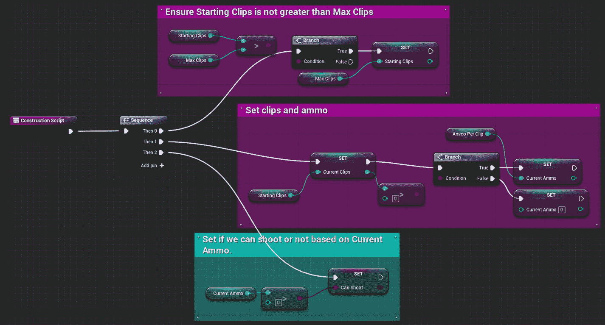

图 7-7。

设置我们是否可以拍摄

现在你已经为弹药和弹夹定义了一个基本的逻辑，所以是时候使用它们了。

既然这是在 Blueprint 中完成的，那么我们就来做一个每当玩家射出子弹时都会在 Blueprint Graph 上调用的函数。要创建函数，首先打开 Chapter07Character.h 并添加以下函数。

```cpp
/* Event called whenever the player shoots. */
UFUNCTION(BlueprintImplementableEvent, Category = "Chapter 07 Character")
void OnFireEvent();

```

然后打开 Chapter07Character.cpp，找到 OnFire()函数(应该在 140 行左右)。在这个函数中，添加一个新的 if 条件，该条件只有在 bCanShoot 为 true 时才会继续。然后在 if 条件的最后，调用我们之前添加的 OnFireEvent Blueprint 事件。以下是修改后的 OnFire 函数的完整代码。

```cpp
void AChapter07Character::OnFire()
{
     // See if you can shoot first.
     if (bCanShoot)
     {
          // try and fire a projectile
          if (ProjectileClass != NULL)
          {
               UWorld* const World = GetWorld();
               if (World != NULL)
               {
                    if (bUsingMotionControllers)
                    {
                         const FRotator SpawnRotation = VR_MuzzleLocation->GetComponentRotation();
                         const FVector SpawnLocation = VR_MuzzleLocation->GetComponentLocation();
                         World->SpawnActor<AChapter07Projectile>(ProjectileClass, SpawnLocation, SpawnRotation);
                    }
                    Else
                    {
                         const FRotator SpawnRotation = GetControlRotation();
                         // MuzzleOffset is in camera space, so transform it to world space before offsetting from the character location to find the final muzzle position
                         const FVector SpawnLocation = ((FP_MuzzleLocation != nullptr) ? FP_MuzzleLocation->GetComponentLocation() : GetActorLocation()) + SpawnRotation.RotateVector(GunOffset);
                         //Set Spawn Collision Handling Override
                         FActorSpawnParameters ActorSpawnParams;
                         ActorSpawnParams.SpawnCollisionHandlingOverride = ESpawnActorCollisionHandlingMethod::AdjustIfPossibleButDontSpawnIfColliding;
                         // spawn the projectile at the muzzle
                         World->SpawnActor<AChapter07Projectile>(ProjectileClass, SpawnLocation, SpawnRotation, ActorSpawnParams);
                    }
               }
          }
          // try and play the sound if specified
          if (FireSound != NULL)
          {
               UGameplayStatics::PlaySoundAtLocation(this, FireSound, GetActorLocation());
          }
          // try and play a firing animation if specified
          if (FireAnimation != NULL)
          {
               // Get the animation object for the arms mesh
               UAnimInstance* AnimInstance = Mesh1P->GetAnimInstance();
               if (AnimInstance != NULL)
               {
                    AnimInstance->Montage_Play(FireAnimation, 1.f);
               }
          }
          // Call the Blueprint event.
          OnFireEvent();
     }
}

```

按 F5 从 Visual Studio 编译并启动项目。一旦编辑器启动，打开我们的第一个人物角色蓝图。在事件图中，右键单击并搜索 On Fire Event。您可以看到您在 C++ 中声明的事件现在可以在蓝图图中访问(参见图 [7-8](#Fig8) )。

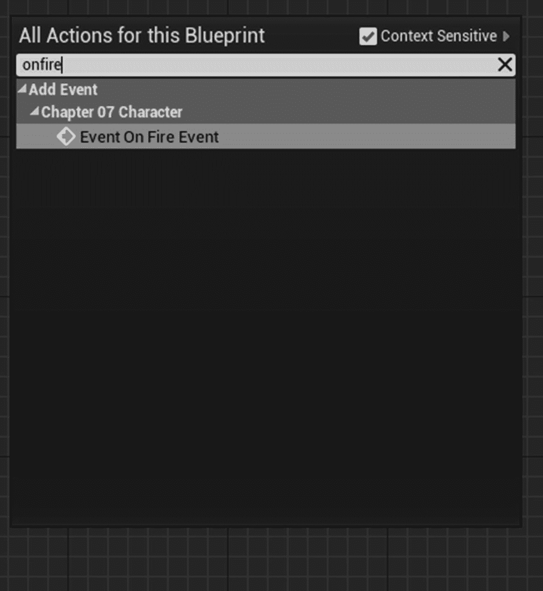

图 7-8。

在蓝图中添加 C++ 事件

选择它并在图中再次右键单击，搜索获取当前弹药并选择它。从当前弹药中拖出一条线，搜索并选择它。这个宏节点取一个整数，减去 1，设置值，然后返回它，所以输出管脚包含当前 Ammo–1 的结果。

如果 Decrement Int 的输出节点不为 0，不要做任何事情，因为玩家可以再次开火。如果是 0，意味着你没子弹了。要比较结果，右键单击图表，搜索 Compare Int 并添加它。然后将 Decrement Int 节点的输出连接到 Compare Int 的第一个输入(带标签输入)。

这也是一个有三个输出节点和两个输入节点的宏。第一个输入节点是要比较的值，第二个输入是要比较的值。如果第一个输入值大于第二个输入值，则触发第一个输出。如果第一输入与第二输入相同，则触发第二输出。如果第一输入小于第二输入，则触发第三输出。

在我们的例子中，您对第二个输出(label ==)感兴趣，所以将名为 Compare With 的输入设置为 0。右键单击图表并搜索“Set Can Shoot”。将其添加到图形中，并将其设置为 false。连接 Compare Int 的第二个输出(带 label ==)设置 Can Shoot 节点。如果玩家现在试图射击，什么也不会发生，因为你刚刚告诉武器一旦当前弹药为 0 它就不能射击了(见图 [7-9](#Fig9) )。


图 7-9。

更新当前弹药，可以射击变量

这是添加重新加载逻辑的地方。右键单击图表，搜索按事件设置计时器，并选择它。该节点可以在设定的时间(即重新加载时间)后触发给定的事件。该事件是重新加载事件。右键单击图表，搜索获取重新加载时间并选择它。将其连接到设置定时器节点的时间输入。然后从设置定时器节点的事件输入的红色输入中拖动一条线，并从添加事件部分选择自定义事件(参见图 [7-10](#Fig10) )。

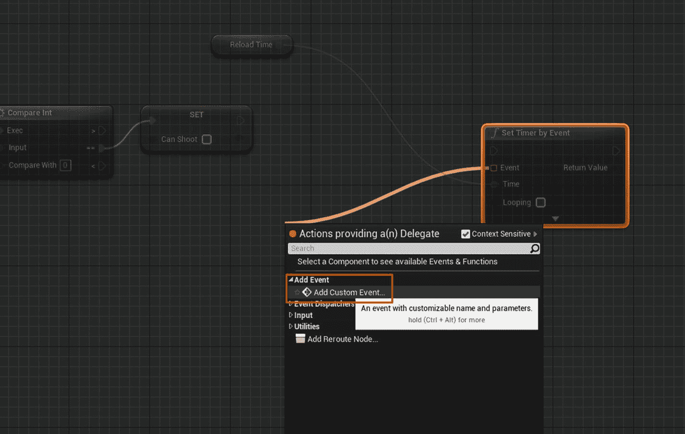

图 7-10。

将事件添加到计时器

选中事件后，将其重命名为 Reload(或者任何你喜欢的名字)，并将 Can Shoot 变量连接到 Set Timer By Event 节点(见图 [7-11](#Fig11) )。

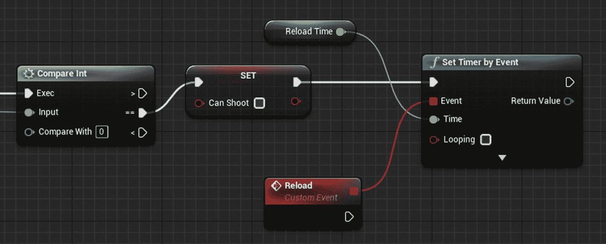

图 7-11。

重命名事件以重新加载

重载事件很简单。简而言之，这就是将要发生的事情。

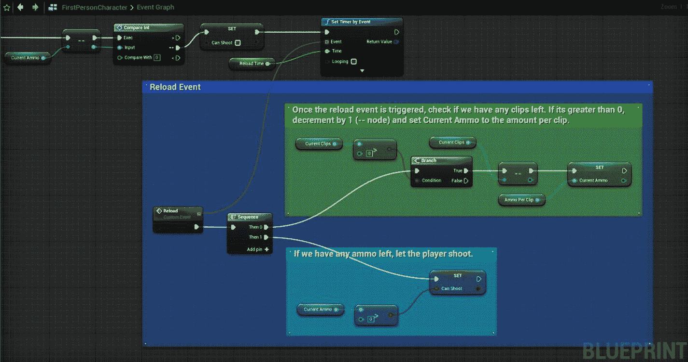

图 7-12。

更新可以拍摄变量

1.  检查一下你是否还有剩余的夹子。如果你有一个弹夹，那么把它减一，把当前弹药设置为每个弹夹的弹药。

2.  根据当前弹药启用或禁用射击变量(见图 [7-12](#Fig12) )。

随着重装事件的完成，你已经完成了我们的弹药设置。如果你回到视口，按下 play，开始射击，你最终会耗尽弹药，它会在 2 秒后自动重新加载。一旦你完全用完了弹夹，你就再也不能开枪了。

从这里开始，您继续实现 HUD 和拾取项。首先，你使用虚幻的运动图形(UMG)创建一个基本的 HUD，显示你的弹药数量。然后你继续创造一个补充弹药的弹药拾取物品。

转到内容浏览器，右键单击并从用户界面类别中选择 Widget Blueprint。系统会提示您重命名蓝图。姑且称之为 WBP_PlayerHUD (WBP 是 Widget BluePrint 的简称)。打开它，在设计器的右下角添加一个来自通用类别的文本块(见图 [7-13](#Fig13) )。

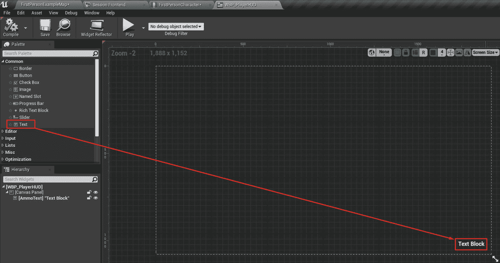

图 7-13。

在 UMG 设计器中添加文本块

保持文本块处于选中状态。在细节面板中，将名称设置为 AmmoText(或您想要的任何名称)，并确保选择了 Is Variable(参见图 [7-14](#Fig14) )。

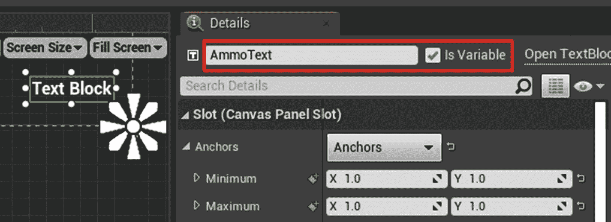

图 7-14。

将弹药文本设置为变量

将变量设置为 true 很重要；否则，您无法在事件图中访问它。您也可以展开“锚点”部分，并将“最小值”和“最大值”设置为 1。现在，您可以切换到图形选项卡(右上角)并创建一个新的自定义事件，方法是在图形内单击鼠标右键并选择 Add Event 类别下的 **Add Custom Event…** 。您将这个新事件称为 UpdateAmmo，并添加两个整数参数。第一个输入称为 CurrentAmmo，第二个输入称为 TotalAmmo。由于您在 Designer 选项卡中为 AmmoText 启用了 Is Variable，因此现在您可以从 My Blueprint 选项卡中拖放对我们的文本块的引用。从“弹药文本”节点拖动一条线，搜索“设置文本”并选择它。该节点接受文本输入，因此您可以使用一个特殊的节点创建格式化的文本。在图形中右键单击，搜索格式文本，然后选择该节点。此节点有助于使用花括号{}构建格式化文本。

在格式文本节点的格式输入内，键入 **{Current}/{Total}** 并按回车键。节点现在用两个新的灰色输入(也称为通配符)进行自我更新，这两个输入分别叫做 Current 和 Total，可以直接接受任何节点(见图 [7-15](#Fig15) )。

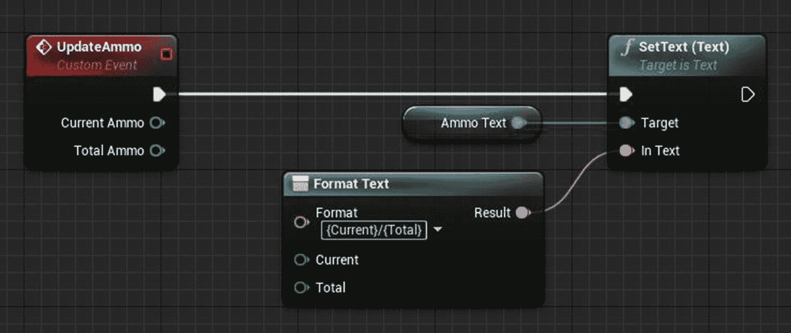

图 7-15。

使用格式文本节点设置文本

将更新弹药事件的当前弹药连接到当前灰色输入，将更新弹药事件的总弹药连接到总灰色输入(见图 [7-16](#Fig16) )。


图 7-16。

连接到格式文本后

现在剩下的就是从我们的第一人称角色蓝图类中调用这个事件。为此，您首先需要在该类中创建这个 HUD。打开 FirstPersonCharacter Blueprint 类并找到事件 BeginPlay 节点。这个节点在游戏开始时为这个演员自动调用。

如果你没有使用 VR(虚拟现实)，请随意删除所有连接到 Event BeginPlay 的节点(对于本教程，我将删除它们，因为 VR 不是我们的重点)。右键单击图形，搜索 Create Widget，然后选择该节点。该节点基于类输入创建一个小部件，因此单击选择类按钮(紫色输入)并选择我们之前创建的 WBP _ 玩家类。右键单击创建小部件节点的返回值输出，并选择提升为变量。这是因为你想在弹药更换后访问它。要将此小部件添加到屏幕，请从 PlayerHUD 节点的输出中拖动一条线，搜索添加到视口，然后选择它(参见图 [7-17](#Fig17) )。


图 7-17。

将玩家 HUD 添加到视口

如果你现在按 Play (Alt+P)，你可以在屏幕上看到默认的文本块(在 UMG 设计器中创建的那个)(见图 [7-18](#Fig18) )。

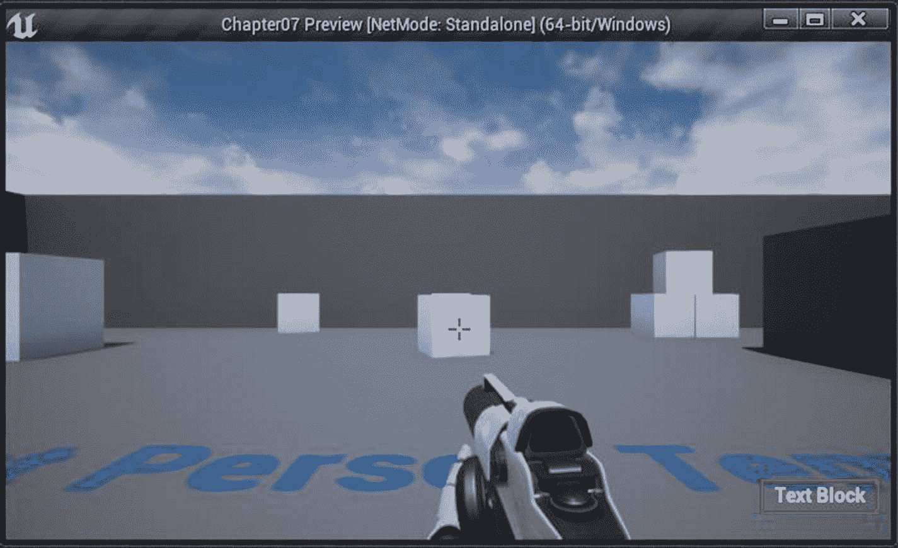

图 7-18。

增加了玩家 HUD 的游戏画面

因为你必须在游戏开始时更新弹药，所以你需要在射击时和重装弹药后在多个地方调用更新弹药事件。最好创建一个函数，所以在我的蓝图选项卡中，创建一个新函数，并将其命名为 UpdateAmmo。打开这个函数图，将 PlayerHUD(在上下文菜单中选择 Get PlayerHUD)变量拖放到这个图中。从 PlayerHUD 变量中拖动一根线，搜索更新弹药并选择它。您为此做了两个输入，所以对于第一个输入，连接当前的弹药变量。对于第二次输入，你需要全部弹药。

记住，在这一章的开始，我向你展示了如何用弹夹的数量和每个弹夹的弹药数来计算弹药总数。要获得弹药总量，首先将当前剪辑拖放到图表中。从该当前“片段”节点中，拖动一条线，搜索“倍增”节点，然后选择“整数*整数”。现在将每个剪辑的弹药拖放到图形中，并将其作为第二个输入连接到乘法节点，并将乘法节点连接到更新弹药节点的第二个输入(见图 [7-19](#Fig19) )。

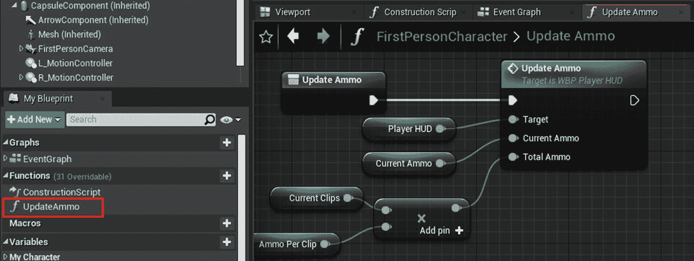

图 7-19。

更新玩家 HUD 中的弹药

现在唯一剩下的事情就是调用函数。您可以将该功能从“我的蓝图”选项卡拖放到事件图中。调用该函数的第一个位置是在开始播放执行链的末端(参见图 [7-20](#Fig20) )。


图 7-20。

开始游戏后调用更新弹药功能

第二个位置是在减少了 InputAction Fire 节点中的当前弹药数量之后(见图 [7-21](#Fig21) )。


图 7-21。

开火后呼叫更新弹药

第三个位置在重载事件内部。设置好 Can Shoot 变量后，调用更新弹药功能(见图 [7-22](#Fig22) )。

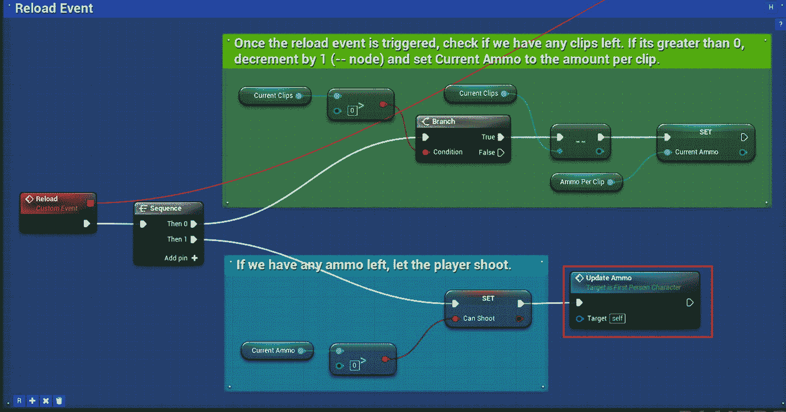

图 7-22。

重装弹药后呼叫更新弹药

如果你现在按 Play (Alt+P)并射击，你可以看到弹药数正确更新(见图 [7-23](#Fig23) )。


图 7-23。

玩家 HUD 上的弹药计数更新

## 弹药收集

在第 [5](5.html) 章中，您学习了如何创建输入键并使用跟踪来检测我们面前的物品。作为一个练习，我想让你重新创建那个设置，但是有两个不同之处。


图 7-24。

更新线追踪的结束位置

1.  请使用 ItemPickup，而不是使用 MyItemTrace 作为名称。

2.  将追踪的开始位置设置为球体组件的世界位置。将该位置添加到乘法节点，然后将结果连接到线跟踪节点的末端输入(见图 [7-24](#Fig24) )。

右键单击图形，搜索输入操作跟踪，并选择跟踪节点。将 Trace 节点按下的执行引脚连接到 Line Trace By Channel 节点。你已经完成了追踪设置，现在，让我们创建我们的补充弹药功能，这给了我们一个单一的剪辑。

创建一个新函数，并将其命名为 ReplenishAmmo。这个函数没有输入，但是你创建了一个布尔输出，它决定了弹药是否被成功补充。要创建输出，请选择函数(在 My Blueprint 选项卡中或打开函数图并选择紫色节点)，然后在 Details 面板中，单击 Outputs 类别下的加号按钮。这将创建一个带有布尔输出的新返回节点。

将 NewParam 输出重命名为 bReturnValue。该函数负责在最大剪辑下添加新剪辑。首先，将当前 Clips 变量拖放到图形中(在上下文菜单中选择 Get CurrentClips)。从此变量中拖动一条线，搜索 less，然后选择 integer < integer node。CurrentClips 现在自动连接到< node 的第一个输入。让我们将 MaxClips 变量拖放到图形中(在上下文菜单中选择 Get MaxClips)并将其连接到< node 的第二个输入。

创建一个分支节点，连接< node to the Condition input of Branch input. If the current clips are less than max clips, the True output of the Branch node trigger drags a wire from Current Clips, search for Increment Int and select it. This is the same as Decrement Int except instead of subtracting by 1 this node add 1\. Now drag and drop the Update Ammo function and connect it to the ++ node. After that, connect this to the Return node and make sure the return value is true. Right-click the graph, search for Add Return node and select it. Connect this to the Branch node’s False output and make sure it is set to False (see Figure [7-25](#Fig25) 的输出。


图 7-25。

补充弹药

转到内容浏览器，创建一个新的 Blueprint 类(基于 Actor)，并将其命名为 BP_AmmoPickup。这是我们的职业，给玩家一个弹夹，然后自我毁灭。打开我们新创建的 actor (BP_AmmoPickup)并创建一个新的自定义事件。让我们称之为 GiveAmmo，并向该事件添加一个新的输入，将类型设置为 FirstPersonCharacter，并将其命名为 Character。

这个输入是我们的第一人称角色，所以从这个输入中拖动一根线，搜索补充弹药并选择它。创建一个分支节点，并将补充弹药的输出连接到这个分支节点。然后右键单击图表，搜索并选择 DestroyActor。将分支节点的真实输出连接到分解器，这个类就完成了(见图 [7-26](#Fig26) )。


图 7-26。

给弹药事件

尽管您已经完成了我们的函数和事件，但是您还没有使用它们中的任何一个，所以让我们来解决这个问题。让我们回到跟踪设置。创建一个新的分支节点，并将 Line Trace 节点的返回值连接到分支节点的条件输入。你只需要在追踪遇到什么的时候继续。

从“出点击”节点拖动一条线，并选择“断开点击结果”。通过单击箭头按钮展开“点击结果”节点，并从“点击执行元”插针拖动一条线。搜索 Cast to BP_AmmoPickup 节点并选择它。这是一个方便的节点，它试图将给定的对象输入转换为相应的类型，如果成功，则触发第一个输出，如果转换失败，则触发 Cast Failed。

从标记为 BP Ammo Pickup 的输出节点拖动一条线，并搜索 Give Ammo，这是您创建的事件。选择它，您可以看到它需要一个应该是第一人称字符类的输入。因为您在第一人称角色中使用了跟踪，所以右键单击图表并搜索 self，然后选择 Get a reference to self。Self 节点输出对该蓝图实例的引用，因此将其连接到 Give Ammo 输入(见图 [7-27](#Fig27) )。


图 7-27。

从线追踪结果给出弹药

你完了！将 BP_AmmoPickup 类拖放到游戏世界中，然后按 Play (Alt+P)。继续射击，直到弹药耗尽。然后走到世界上一个弹药拾取物品附近，按 E 键追踪并拾取该物品。

## 包名

包装游戏是一个简单的过程。打包是以优化的方式为目标平台编译和烹饪内容的过程。调用打包命令时，首先编译所有源代码(如果有)。如果编译成功，那么所有的内容(蓝图、网格、纹理、材质等等)都会被转换(也称为烹饪)成目标平台可以使用的特殊格式。虚幻引擎支持各种各样的平台，从一台 Windows 机器上，你可以为除苹果 Mac 之外的任何平台编译和打包。

每个平台都有自己的设置，您可以覆盖这些设置。为此，点击工具栏中的编辑并选择项目设置(参见图 [7-28](#Fig28) )。


图 7-28。

访问项目设置

在“项目设置”的右侧面板中，向下滚动直至到达“平台”类别。在此类别中，您可以选择您想要的平台并覆盖任何设置(参见图 [7-29](#Fig29) )。


图 7-29。

平台类别

要打包您的项目，请从文件菜单打开打包设置➤打包项目➤打包设置(参见图 [7-30](#Fig30) )。

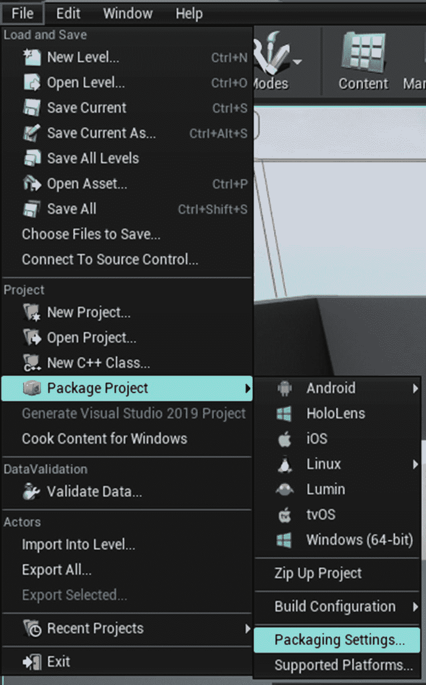

图 7-30。

访问打包设置

这将打开打包设置。在“设置”窗口中，在“项目”类别下，将构建配置切换到“发货”，并确保“完全重建”和“用于分发”复选框处于选中状态(参见图 [7-31](#Fig31) )。

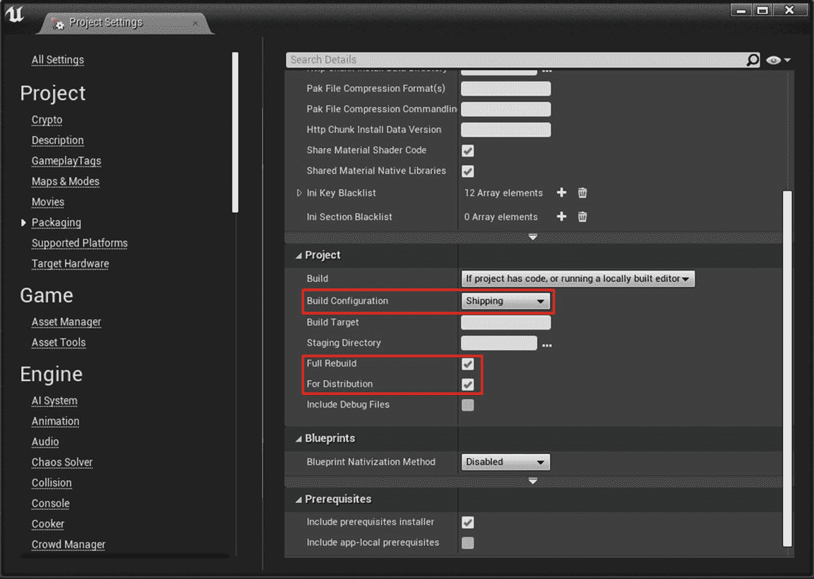

图 7-31。

选择装运配置

验证这些设置后，再次单击“文件”菜单，并从“包项目”菜单中选择“Windows (64 位)”。如果这是第一次，Unreal Engine 现在会提示您选择保存打包版本的位置。导航到所需位置，然后单击选择文件夹。虚幻引擎现在开始打包你的构建，你会在屏幕的右上角看到一个提示通知(见图 [7-32](#Fig32) )。


图 7-32。

显示 Windows 打包的 Toast 通知

您可以单击 Toast 通知上的 Show Output Log 来查看构建过程。