# 九、设计模式和习惯用法

优秀的工匠可以利用丰富的经验和知识。一旦他们为某个问题找到了一个好的解决方案，他们就会把这个解决方案运用到他们的技能中，以便在将来解决类似的问题。理想情况下，他们将他们的解决方案转换成某种被称为规范形式的东西，并为自己和他人记录下来。

Canonical Form

在这个上下文中，术语“标准形式”描述的是在不失一般性的情况下简化为最简单和最有意义的形式。与设计模式相关，模式的规范形式描述了其最基本的元素:名称、上下文、问题、力量、解决方案、示例、缺点等。

对于软件开发者来说也是如此。有经验的开发人员可以利用大量的示例解决方案来解决软件中经常出现的设计问题。他们与他人分享他们的知识，并使其可重复用于类似的问题。这背后的原则:不要多此一举！

1995 年，一本备受关注并广受好评的书出版了。它的四位作者，即 Erich Gamma、Richard Helm、Ralph Johnson 和 John Vlissides，也称为四人帮(g of ),将设计模式的原则引入了软件开发，并提出了 23 个面向对象设计模式的目录。它的标题是设计模式:可重用面向对象软件的元素[Gamma95],直到今天，它仍被视为软件开发领域最重要的作品之一。

一些人认为 Gamma 等人发明了他们书中描述的所有设计模式。但事实并非如此。设计模式不是发明出来的，而是可以找到的。作者研究了在灵活性、可维护性和可扩展性方面做得很好的软件系统。他们找到了这些积极特征的原因，并以规范的形式描述了它们。

在“四人帮”的书出现后，人们认为在接下来的几年里将会出现大量的图案书。但这并没有发生。事实上，在接下来的几年中，出现了一些关于主题模式的其他重要书籍，如面向模式的软件架构(也称为缩写“POSA”)[Busch 96]或关于架构模式的企业应用架构模式[Fowler02]，但是预期的大部分都没有出现。

## 设计原则与设计模式

在前几章中，我们已经讨论了很多设计原则。但是这些原则和设计模式有什么关系呢？什么更重要？

好吧，让我们假设一下，也许有一天面向对象会变得完全不受欢迎，函数式编程(见第七章)将成为主导的编程范例。原则有吻、干、YAGNI、单一责任原则、开闭原则、信息隐藏等。，然后变得无效，因此毫无价值？明确的答案是否定的！

原则是作为决策基础的基本“真理”或“法则”。因此，在大多数情况下，原则独立于特定的编程范式或技术。例如，接吻原则(见第三章)是一个非常普遍的原则。无论您是使用面向对象还是函数式风格编程，或者使用不同的语言，如 C++、C#、Java 或 Erlang，尝试做一些尽可能简单的事情总是一种值得的态度！

相比之下，设计模式是特定环境下具体设计问题的解决方案。尤其是那些在著名的“四人帮”设计模式书中描述的模式，都与面向对象密切相关。因此，原则更持久，也更重要。你可以自己找到某个编程问题的设计模式，如果你已经内化了原理的话。

> Decision-making and mode give people solutions; Principles help them design their own. —— —Eoin Woods' keynote speech at the 2009 IEEE/IFIP Joint Working Conference on Software Architecture (WICSA2009)

## 一些模式，以及何时使用它们

除了四人帮书中描述的 23 种设计模式，当然还有更多模式。一些模式经常在开发项目中被发现，而另一些或多或少是罕见的或奇特的。以下部分讨论了一些我认为最重要的设计模式。那些解决经常出现的设计问题的人，开发人员至少应该听说过这些问题。

顺便说一句，我们已经在前面的章节中使用了一些设计模式，有些甚至相对激烈，但我们只是没有提到或注意到它。只是一个小小的提示:在“四人帮”的书[Gamma95]中，你可以找到一种被称为……迭代器的设计模式！

在我们继续讨论各个设计模式之前，这里必须指出一个警告:

Warning

不要用设计模式的用法来夸大它！毫无疑问，设计模式很酷，有时甚至令人着迷。但是过度使用它们，特别是如果没有好的理由来证明它，可能会产生灾难性的后果。你的软件设计将遭受无用的过度工程。永远记住《吻》和《YAGNI》(见第三章)。

但是现在让我们来看看几个模式。

### 依赖注入

依赖注入是敏捷架构的一个关键要素。—沃德·坎宁安，转述自 2004 年太平洋西北软件质量会议(PNSQC)上的“敏捷和传统开发”小组讨论

当然，我用四人帮的名著中没有提到的一个模式来开始关于特定设计模式的部分是有重要原因的。我确信依赖注入是迄今为止最重要的模式，可以帮助软件开发人员显著改进软件设计。这种模式可以被视为游戏规则的改变者。

在我们深入依赖注入之前，我首先要考虑另一种不利于良好软件设计的模式:单例模式！

#### 单例反模式

我很确定你知道名为 Singleton 的设计模式。乍一看，这是一种简单而普遍的模式，不仅仅是在 C++ 领域(我们很快就会看到它所谓的简单可能是欺骗性的)。一些代码库甚至布满了单线。例如，这种模式通常用于所谓的记录器(用于记录目的的对象)、数据库连接、中央用户管理或表示来自物理世界的事物(例如，硬件，如 USB 或打印机接口)。此外，工厂和那些所谓的实用程序类通常是作为单件实现的。后者对他们自己来说是一种代码味道，因为它们是弱内聚的标志(见第三章)。

记者经常问设计模式的作者他们什么时候会修改他们的书并出版新的版本。他们通常的回答是，他们看不出这有什么理由，因为这本书的内容在很大程度上仍然有效。然而，在接受在线杂志 InformIT 采访时，他们给出了一个更详细的答案。下面是整个采访的一小段摘录，它揭示了 Gamma 关于单件的一个有趣的观点(拉里·奥布赖恩是采访者，Erich Gamma 给出了答案):

> [......] Larry: How will you reconstruct the "design pattern"? Erich: We did this exercise in 2005\. The following are some records of our meeting. We found that since then, the object-oriented design principles and most patterns have not changed. (...) When discussing which models to abandon, we found that we still love them all. (Not really-I'm in favor of giving up Singleton. Its use is almost always a design smell. —— Design pattern after 15 years: Interview with Erich Gamma, Richard Helm and Ralph Johnson, 2009 [InformIT09]

那么，为什么 Erich Gamma 说单例模式几乎总是一种设计气味呢？有什么问题吗？

为了回答这个问题，让我们首先来看看通过单线图要达到什么目标。这种模式可以满足什么要求？下面是 GoF 书中的 Singleton 模式的任务声明:

> Ensure that there is only one instance of a class and provide a global access point. Erich Gama and others. Al. , design mode [Gamma95]

这种说法包含两个显著的方面。一方面，该模式的任务是控制和管理其唯一实例的整个生命周期。根据关注点分离的原则，对象生命周期的管理应该是独立的，并与其特定领域的业务逻辑相分离。在单例中，这两个问题基本上是分开的。

另一方面，提供了对该实例的全局访问，因此应用程序中的每个其他对象都可以使用它。这个关于面向对象环境中的“全局访问点”的演讲已经显得可疑，应该引起警惕。

让我们先来看一个 C++ 中单例的一般实现风格，所谓的 Meyers' Singleton，以《高效 C++ 书[Meyers05]的作者 Scott Meyers 命名:

```cpp
#ifndef SINGLETON_H_

#define SINGLETON_H_

class Singleton final {

public:
  static Singleton& getInstance() {
    static Singleton theInstance { };
    return theInstance;
  }

  int doSomething() {
    return 42;
  }

  // ...more member functions doing more or less useful things here...

private:
  Singleton() = default;
  Singleton(const Singleton&) = delete;
  Singleton(Singleton&&) = delete;
  Singleton& operator=(const Singleton&) = delete;
  Singleton& operator=(Singleton&&) = delete;
  // ...
};

#endif

Listing 9-1.An implementation of Meyers’ Singleton in modern C++

```

这种单例实现风格的主要优点之一是，从 C++11 开始，在`getInstance()`中使用静态变量的唯一实例的构造过程在默认情况下是线程安全的(参见【ISO11】中的 6.7)。要小心，因为这并不自动意味着 Singleton 的所有其他成员函数也是线程安全的！后者必须由开发商保证。

在源代码中，这种全局单例实例的使用通常如下所示:

```cpp
001  #include "AnySingletonUser.h"
002  #include "Singleton.h"
003  #include <string>
004
...  // ...
024
025  void AnySingletonUser::aMemberFunction() {
...    // ...
040    std::string result = Singleton::getInstance().doThis();
...    // ...
050  }
051
...  // ...
089
090  void AnySingletonUser::anotherMemberFunction() {
...    //...
098    int result = Singleton::getInstance().doThat();
...    //...
104    double value = Singleton::getInstance().doSomethingMore();
...    //...
110  }
111  // ...
Listing 9-2.An excerpt from the implementation of an arbitrary class that uses the Singleton

```

我想现在单身族的一个主要问题是什么变得很清楚了。由于它们的全局可见性和可访问性，它们可以简单地在其他类的实现中的任何地方使用。这意味着在软件设计中，对这个单例的所有依赖都隐藏在代码中。通过检查类的接口，也就是它们的属性和方法，你看不到这些依赖关系。

上面举例说明的类`AnySingletonUser`只是一个大型代码库中数百个类的代表，其中许多也在不同的地方使用`Singleton`。换句话说:OO 中的单例就像过程编程中的全局变量。您可以在任何地方使用这个全局对象，您在 using 类的接口中看不到这种用法，而只能在它的实现中看到。

这对项目中的依赖情况有很大的负面影响，如图 9-1 所示。

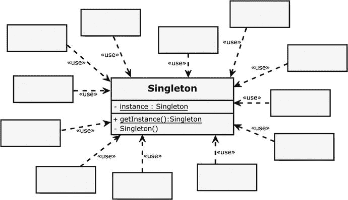

图 9-1。

Loved by everyone: the Singleton! Note

当你看着图 9-1 时，也许你想知道在 Singleton 类中有一个私有成员变量`instance`，这在 Meyers 推荐的实现中是找不到的。嗯，UML 是与编程语言无关的，也就是说，作为一种多用途的建模语言，它不了解 C++、Java 或其他面向对象语言。事实上，在 Meyers 的 Singleton 中也有一个变量保存唯一的实例，但是在 UML 中没有一个带有静态存储持续时间的变量的图形符号，因为这个特性是 C++ 专有的。因此，我选择了将这个变量表示为私有静态成员的方式。这使得这种表示也与 GoF 书籍[Gamma95]中描述的现在不再推荐的单例实现兼容。

我认为很容易想象所有这些依赖关系在可重用性、可维护性和可测试性方面都有很大的缺陷。Singleton 的所有匿名客户端类都与它紧密耦合(还记得我们在第三章中讨论过的松耦合的良好特性)。

因此，我们完全丧失了利用多态性来提供替代实现的可能性。想想单元测试吧。如果在要测试的类的实现中使用了不能被 Test Double 轻易替换的东西，那么实现真正的单元测试又怎么可能成功呢？参见第二章中关于测试替身的部分)？

记住我们在第二章中讨论的好的单元测试的所有规则，尤其是单元测试独立性。像 Singleton 这样的全局对象有时持有可变状态。如果一个代码库中的许多或者几乎所有的类都依赖于一个对象，而这个对象的生命周期随着程序的终止而结束，并且可能拥有一个在它们之间共享的状态，那么如何保证测试的独立性呢？！

单例的另一个缺点是，如果由于新的或不断变化的需求而必须对它们进行更改，这种更改可能会在所有依赖类中引发一连串的更改。图 9-1 中可见的所有指向单例的依赖关系都是变更的潜在传播路径。

最后，在分布式系统中也很难保证一个类只有一个实例，这在当今的软件架构中是很常见的。想象一下微服务模式，一个复杂的软件系统由许多小的、独立的、分布式的进程组成。在这样的环境中，单例不仅很难防止多实例化，而且由于它们造成的紧密耦合，它们也是有问题的。

所以，也许你现在会问:“好吧，我明白了，单身是不好的，但有什么替代方案呢？”也许令人惊讶的简单答案，当然需要一些进一步的解释，是这样的:只需创建一个，并将其注入任何需要的地方！

#### 依赖注入拯救

在上面提到的对 Erich Gamma 等人的采访中，作者也对那些设计模式做了一个声明，他们希望在他们的书的新版本中包含它们。他们只提名了几个可能成为他们传奇作品的模式，其中之一就是依赖注入。

基本上，依赖注入(DI)是一种从外部提供依赖客户机对象所需的独立服务对象的技术。客户端对象不必关心它自己需要的服务对象，或者主动请求服务对象，例如，从工厂(参见本章后面的工厂模式)，或者从服务定位器。

DI 背后的意图可以表述如下:

> Separate components from the services they need in such a way that they don't have to know the names of these services or how they are obtained.

让我们看一个具体的例子，上面已经提到的日志记录器，例如，一个服务类，它提供了写日志条目的可能性。这种记录器通常被实现为单件。因此，记录器的每个客户端都依赖于那个全局单例对象，如图 9-2 所示。


图 9-2。

Three domain-specific classes of a web shop are dependent on the Logger singleton

这是 Logger singleton 类在源代码中的样子(只显示了相关部分):

```cpp
#include <string_view>

class Logger final {

public:
  static Logger& getInstance() {
    static Logger theLogger { };
    return theLogger;
  }

  void writeInfoEntry(std::string_view entry) {
    // ...
  }

  void writeWarnEntry(std::string_view entry) {
    // ...
  }

  void writeErrorEntry(std::string_view entry) {
    // ...
  }
};

Listing 9-3.The Logger implemented as a Singleton

```

std::string_view [C++17]

从 C++17 开始，C++ 语言标准中新增了一个类:`std :: string_view`(在头文件`<string_view>`中定义)。这个类的对象是字符串的高性能代理(顺便说一下，代理也是一种设计模式)，构造起来很便宜(没有为原始字符串数据分配内存)，因此复制起来也很便宜。

另一个很好的特性是:`std::string_view`还可以作为 C 风格字符串(`char*`)、字符数组的适配器，甚至可以作为来自不同框架的专有字符串实现的适配器，例如`CString` (MFC)或`QString` (Qt):

```cpp
CString aString("I'm a string object of the MFC type CString");
std::string_view viewOnCString { (LPCTSTR)aString };

```

因此，如果需要只读访问(例如，在函数执行期间),它是表示其数据已被他人拥有的字符串的理想类。例如，代替广泛使用的常量引用`std::string`，现在`std::string_view`应该被用来代替现代 C++ 程序中的只读字符串函数参数。

出于演示的目的，我们现在只挑选其中一个在实现中使用 Logger Singleton 来写日志条目的类，即类`CustomerRepository`:

```cpp
#include "Customer.h"

#include "Identifier.h"

#include "Logger.h"

class CustomerRepository {

public:
  //...
  Customer findCustomerById(const Identifier& customerId) {
    Logger::getInstance().writeInfoEntry("Starting to search for a customer specified by a
      given unique identifier...");
    // ...
  }
  // ...
};

Listing 9-4.An excerpt from class CustomerRepository

```

为了摆脱 Singleton，并且能够在单元测试中用测试 Double 替换`Logger`对象，我们必须首先应用依赖倒置原则(DIP 参见第六章。这意味着我们首先必须引入一个抽象(一个接口)，并使`CustomerRepository`和具体的`Logger`都依赖于该接口，如图 9-3 所示。

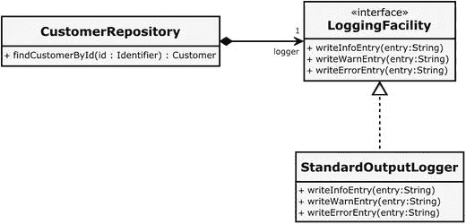

图 9-3。

Decoupling through the applied Dependency Inversion Principle

这是新引入的接口`LoggingFacility`在源代码中的样子:

```cpp
#include <memory>

#include <string_view>

class LoggingFacility {

public:
  virtual ∼LoggingFacility() = default;
  virtual void writeInfoEntry(std::string_view entry) = 0;
  virtual void writeWarnEntry(std::string_view entry) = 0;
  virtual void writeErrorEntry(std::string_view entry) = 0;
};

using Logger = std::shared_ptr<LoggingFacility>;

Listing 9-5.The LoggingFacility interface

```

`StandardOutputLogger`是实现`LoggingFacility`接口并在标准输出中写入日志的特定日志记录器类的一个例子，顾名思义:

```cpp
#include "LoggingFacility.h"

#include <iostream>

class StandardOutputLogger : public LoggingFacility {

public:
  virtual void writeInfoEntry(std::string_view entry) override {
    std::cout << "[INFO] " << entry << std::endl;
  }

  virtual void writeWarnEntry(std::string_view entry) override {
    std::cout << "[WARNING] " << entry << std::endl;
  }

  virtual void writeErrorEntry(std::string_view entry) override {
    std::cout << "[ERROR] " << entry << std::endl;
  }
};

Listing 9-6.One possible implementation of a LoggingFacility: the StandardOutputLogger

```

接下来我们需要修改`CustomerRepository`类。首先，我们创建一个智能指针类型别名`Logger`的新成员变量。这个指针实例通过初始化构造函数传递到类中。换句话说，我们允许在构造期间将实现`LoggingFacility`接口的类的实例注入到`CustomerRepository`对象中。我们还删除了默认的构造函数，因为我们不希望在没有记录器的情况下创建一个`CustomerRepository`。此外，我们移除了实现中对 Singleton 的直接依赖，而是使用智能指针`Logger`来写日志条目。

```cpp
#include "Customer.h"

#include "Identifier.h"

#include "LoggingFacility.h"

class CustomerRepository {

public:
  CustomerRepository() = delete;
  explicit CustomerRepository(const Logger& loggingService) : logger { loggingService } { }
  //...

  Customer findCustomerById(const Identifier& customerId) {
    logger->writeInfoEntry("Starting to search for a customer specified by a given unique identifier...");
  // ...
  }
  // ...

private:
  // ...
  Logger logger;
};

Listing 9-7.The modified class Customer Repository

```

作为这一重构的结果，我们现在已经实现了`CustomerRepository`类不再依赖于特定的日志记录器。相反，`CustomerRepository`只是依赖于一个抽象(接口),这个抽象现在在类及其接口中显式可见，因为它由一个成员变量和一个构造函数参数表示。这意味着`CustomerRepository`类现在接受从外部传入的用于记录目的的服务对象，如下所示:

```cpp
Logger logger = std::make_shared<StandardOutputLogger>();
CustomerRepository customerRepository { logger };
Listing 9-8.The Logger object is injected into the instance of CustomerRepository

```

这一设计变更具有显著的积极影响。松散耦合得到了提升，客户端对象`CustomerRepository`现在可以配置各种提供日志功能的服务对象，如下面的 UML 类图所示(图 9-4 ):

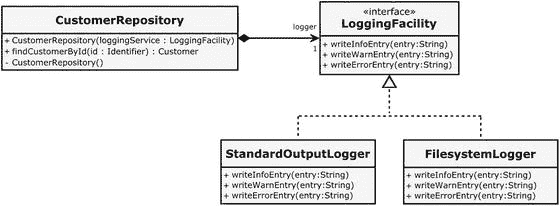

图 9-4。

Class CustomerRepository can be supplied with specific logging implementations via its constructor

另外,`CustomerRepository`类的可测试性也得到了显著的改进。不再有对单例的隐藏依赖。现在我们可以很容易地用一个模拟对象替换一个真正的日志服务(参见第二章关于单元测试和测试加倍)。我们可以用 spy 方法装备模拟对象，例如，在单元测试中检查哪些数据将通过`LoggingFacility`接口离开我们的`CustomerRepository`对象。

```cpp
namespace test {

#include "../src/LoggingFacility.h"

#include <string>

class LoggingFacilityMock : public LoggingFacility {

public:
  virtual void writeInfoEntry(std::string_view entry) override {
    recentlyWrittenLogEntry = entry;
  }

  virtual void writeWarnEntry(std::string_view entry) override {
    recentlyWrittenLogEntry = entry;
  }

  virtual void writeErrorEntry(std::string_view entry) override {
    recentlyWrittenLogEntry = entry;
  }

  std::string_view getRecentlyWrittenLogEntry() const {
    return recentlyWrittenLogEntry;
  }

private:
  std::string recentlyWrittenLogEntry;
};

using MockLogger = std::shared_ptr<LoggingFacilityMock>;

}

Listing 9-9.A test double (mock object) for Unit-Testing of classes that have a dependency on LoggingFacility

```

在这个示例性的单元测试中，您可以看到运行中的模拟对象:

```cpp
#include "../src/CustomerRepository.h"

#include "LoggingFacilityMock.h"

#include <gtest/gtest.h>

namespace test {

TEST(CustomerTestCase, WrittenLogEntryIsAsExpected) {
  MockLogger logger = std::make_shared<LoggingFacilityMock>();
  CustomerRepository customerRepositoryToTest { logger };
  Identifier customerId { 1234 };

  customerRepositoryToTest.findCustomerById(customerId);

  ASSERT_EQ("Starting to search for a customer specified by a given unique identifier...",
    logger->getRecentlyWrittenLogEntry());}

}

Listing 9-10.An example unit test

using the mock object

```

在前面的例子中，我将依赖注入作为一种模式来消除烦人的单例，但是当然这只是许多应用中的一种。基本上，一个好的面向对象软件设计应该确保所涉及的模块或组件尽可能地松散耦合，而依赖注入是实现这一目标的关键。通过始终如一地应用这种模式，软件设计将会出现一个非常灵活的插件架构。作为一种积极的副作用，这种技术产生了高度可测试的对象。

对象创建和链接的责任从对象本身中移除，并集中在一个基础设施组件中，即所谓的组装器或注入器。该组件(见图 9-5 )通常在程序启动时运行，并为整个软件系统处理类似于“构建计划”(例如，配置文件)的东西，也就是说，它以正确的顺序实例化对象和服务，并将服务注入需要它们的对象。

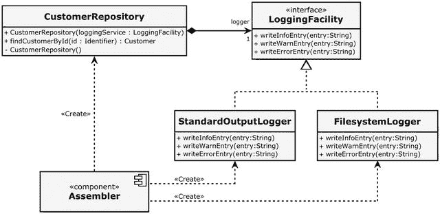

图 9-5。

The Assembler is responsible for object creation and injection

请注意愉快的依赖情况。创建依赖关系的方向(原型创建的虚线箭头)从`Assembler`指向其他模块(类)。换句话说，在这个设计中没有一个类“知道”像`Assembler`这样的基础设施元素的存在(这并不完全正确，因为软件系统中至少有一个其他元素知道这个组件的存在，因为组装过程必须由某人触发，通常是在程序开始时)。

在`Assembler`组件中的某个地方，可能会发现类似下面几行代码的内容:

```cpp
// ...
Logger loggingServiceToInject = std::make_shared<StandardOutputLogger>();

auto customerRepository = std::make_shared<CustomerRepository>(loggingServiceToInject);
// ...
Listing 9-11.Parts of the implementation of the Assembler could look like this

```

这种 DI 技术称为构造函数注入，因为要注入的服务对象作为参数传递给客户机对象的初始化构造函数。构造函数注入的优点是客户机对象在构造过程中被完全初始化，然后可以立即使用。

但是，如果服务对象在程序运行时被注入到客户机对象中，例如，如果客户机对象只是在程序执行期间偶尔被创建，或者特定的记录器应该在运行时被交换，我们该怎么办呢？然后，客户端对象必须为服务对象提供一个 setter，如下例所示:

```cpp
#include "Address.h"

#include "LoggingFacility.h"

class Customer {

public:
  Customer() = default;

  void setLoggingService(const Logger& loggingService) {
    logger = loggingService;
  }

  //...

private:
  Address address;
  Logger logger;
};

Listing 9-12.The class Customer provides a setter to inject a Logger

```

这种 DI 技术被称为 setter 注入。当然，也可以将构造函数注入和设置器注入结合起来。

依赖注入是一种设计模式，它使得软件设计松散耦合并且非常容易配置。它允许为不同的客户或软件产品的预期目的创建不同的产品配置。它极大地增加了软件系统的可测试性，因为它能够非常容易地注入模拟对象。因此，在设计任何严肃的软件系统时，都不应该忽略这种模式。如果您想更深入地研究这种模式，我推荐您阅读由 Martin Fowler 撰写的引领潮流的博客文章“反转控制容器和依赖注入模式”。

在实践中，通常使用依赖注入框架，它既可以作为商业解决方案也可以作为开源解决方案。

### 适配器

我确信适配器(同义词:包装器)是最常用的设计模式之一。其原因是，在软件开发中，不兼容接口的适应肯定是经常需要的，例如，如果必须集成另一个团队开发的模块，或者当使用第三方库时。

下面是适配器模式的任务声明:

> Convert the interface of one class into another interface expected by the customer. Allow adapter classes to work together, otherwise they will not work because of incompatible interfaces. Erich Gama and others. Al. , design mode [Gamma95]

让我们进一步开发上一节中关于依赖注入的例子。让我们假设我们想要使用 BoostLog v2(参见 [`http://www.boost.org`](http://www.boost.org) )进行日志记录，但是我们想要保持这个第三方库的用法可以与其他日志记录方法和技术交换。

解决方案很简单:我们只需要提供`LoggingFacility`接口的另一个实现，它将 BoostLog 的接口适配成我们想要的接口，如图 9-6 所示。


图 9-6。

An adapter for a Boost logging solution

在源代码中，我们对接口`BoostTrivialLogAdapter`的额外实现如下所示:

```cpp
#include "LoggingFacility.h"

#include <boost/log/trivial.hpp>

class BoostTrivialLogAdapter : public LoggingFacility {

public:
  virtual void writeInfoEntry(std::string_view entry) override {
    BOOST_LOG_TRIVIAL(info) << entry;
  }

  virtual void writeWarnEntry(std::string_view entry) override {
    BOOST_LOG_TRIVIAL(warn) << entry;
  }

  virtual void writeErrorEntry(std::string_view entry) override {
    BOOST_LOG_TRIVIAL(error) << entry;
  }
};

Listing 9-13.The Adapter for Boost.Log is just another implementation of LoggingFacility

```

优点是显而易见的:通过适配器模式，现在在我的整个软件系统中正好有一个类依赖于第三方日志解决方案。这也意味着我们的代码不会被专有的日志语句污染，比如`BOOST_LOG_TRIVIAL()`。因为这个适配器类只是`LoggingFacility`接口的另一个实现，所以我也可以使用依赖注入(见上一节)将这个类的实例——或者完全相同的实例——注入到所有想要使用它的客户机对象中。

适配器可以为不兼容的接口提供广泛的适应和转换可能性。这包括从简单的修改(如操作名和数据类型转换)到支持一整套不同的操作。在上面的例子中，带有字符串参数的成员函数的调用被转换成流的插入操作符的调用。

如果要适配的接口是相似的，那么接口适配当然更容易。如果接口非常不同，适配器也可能变成非常复杂的代码。

### 战略

如果我们记得第六章中描述的开闭原则(OCP)作为可扩展面向对象设计的指导方针，那么策略设计模式可以被认为是这一重要原则的“名人表演”。下面是这个模式的任务声明:

> Define an algorithm family, encapsulate each algorithm and make them interchangeable. Let the algorithm change independently of the client using it. Erich Gama and others. Al. , design mode [Gamma95]

用不同的方式做事是软件设计中常见的需求。想想列表的排序算法。有各种排序算法，它们在时间复杂度(所需的操作数)和空间复杂度(除输入列表之外的额外所需存储空间)方面具有不同的特征。例如冒泡排序、快速排序、合并排序、插入排序和堆排序。

例如，冒泡排序是最不复杂的一种，它在内存消耗方面非常有效，但也是最慢的排序算法之一。相比之下，快速排序是一种快速有效的排序算法，通过其递归结构易于实现，并且不需要额外的内存，但对于预排序和倒排列表，它的效率非常低。在策略模式的帮助下，可以实现排序算法的简单交换，例如，取决于要排序的列表的属性。

让我们考虑另一个例子。假设我们希望在任意的业务 IT 系统中有一个类`Customer`实例的文本表示。一个涉众需求声明文本表示应该被格式化为各种输出格式:纯文本、XML(可扩展标记语言)和 JSON (JavaScript 对象符号)。

好的，首先让我们为各种格式化策略引入一个抽象，抽象类`Formatter`:

```cpp
#include <memory>

#include <string>

#include <string_view>

#include <sstream>

class Formatter {

public:
  virtual ∼Formatter() = default;

  Formatter& withCustomerId(std::string_view customerId) {
    this->customerId = customerId;
    return *this;
  }

  Formatter& withForename(std::string_view forename) {
    this->forename = forename;
    return *this;
  }

  Formatter& withSurname(std::string_view surname) {
    this->surname = surname;
    return *this;
  }

  Formatter& withStreet(std::string_view street) {
    this->street = street;
    return *this;
  }

  Formatter& withZipCode(std::string_view zipCode) {
    this->zipCode = zipCode;
    return *this;
  }

  Formatter& withCity(std::string_view city) {
    this->city = city;
    return *this;
  }

  virtual std::string format() const = 0;

protected:
  std::string customerId { "000000" };
  std::string forename { "n/a" };
  std::string surname { "n/a" };
  std::string street { "n/a" };
  std::string zipCode { "n/a" };
  std::string city { "n/a" };n
};

using FormatterPtr = std::unique_ptr<Formatter>;

Listing 9-14.The abstract Formatter contains everything that all specific formatter classes have in common

```

提供风险承担者所要求的格式化样式的三个特定格式化程序如下:

```cpp
#include "Formatter.h"

class PlainTextFormatter : public Formatter {

public:
  virtual std::string format() const override {
    std::stringstream formattedString { };
    formattedString << "[" << customerId << "]: "
      << forename << " " << surname << ", "
      << street << ", " << zipCode << " "
      << city << ".";
    return formattedString.str();
  }
};

class XmlFormatter : public Formatter {

public:
  virtual std::string format() const override {
    std::stringstream formattedString { };
    formattedString <<
      "<customer id=\"" << customerId << "\">\n" <<
      "  <forename>" << forename << "</forename>\n" <<
      "  <surname>" << surname << "</surname>\n" <<
      "  <street>" << street << "</street>\n" <<
      "  <zipcode>" << zipCode << "</zipcode>\n" <<
      "  <city>"  << city << "</city>\n" <<
      "</customer>\n";
    return formattedString.str();
  }
};

class JsonFormatter : public Formatter {

public:
  virtual std::string format() const override {
    std::stringstream formattedString { };
    formattedString <<
      "{\n" <<
      "  \"CustomerId : \"" << customerId << END_OF_PROPERTY <<
      "  \"Forename: \"" << forename << END_OF_PROPERTY <<
      "  \"Surname: \"" << surname << END_OF_PROPERTY <<
      "  \"Street: \"" << street << END_OF_PROPERTY <<
      "  \"ZIP code: \"" << zipCode << END_OF_PROPERTY <<
      "  \"City: \"" << city << "\"\n" <<
      "}\n";
    return formattedString.str();
  }

private:
  static constexpr const char* const END_OF_PROPERTY { "\",\n" };
};

Listing 9-15.The three specific formatters override the pure virtual format() member function of Formatter

```

从这里可以清楚地看出，OCP 得到了特别好的支持。一旦需要新的输出格式，只需实现抽象类`Formatter`的另一个专门化。不需要对已经存在的格式化程序进行修改。

```cpp
#include "Address.h"

#include "CustomerId.h"

#include "Formatter.h"

class Customer {

public:
  // ...
  std::string getAsFormattedString(const FormatterPtr& formatter) const {
    return formatter->
    withCustomerId(customerId.toString()).
    withForename(forename).
    withSurname(surname).
    withStreet(address.getStreet()).
    withZipCode(address.getZipCodeAsString()).
    withCity(address.getCity()).
    format();
  }
  // ...

private:
  CustomerId customerId;
  std::string forename;
  std::string surname;
  Address address;
};

Listing 9-16.This is how the passed-in formatter object is used inside the member function getAsFormattedString()

```

成员函数`Customer::getAsFormattedString()`有一个参数，该参数需要一个指向格式化程序对象的唯一指针。这个参数可以用来控制通过这个成员函数检索的字符串的格式，或者换句话说:成员函数`Customer::getAsFormattedString()`可以提供一个格式化策略。

顺便说一下:也许你已经注意到了`Formatter`的公共接口的特殊设计，它有许多链接的`with...()`成员函数。这里也使用了另一种设计模式，叫做流畅界面。在面向对象编程中，流畅的接口是一种设计 API 的风格，其代码的可读性接近于普通的书面语言。在前一章关于测试驱动开发(第八章)中，我们已经看到了这样的界面。在这里，我们引入了一个自定义断言(参见“使用自定义断言进行更复杂的测试”一节)来编写更优雅、可读性更好的测试。在我们这里的例子中，技巧是每个`with...()`成员函数都是自引用的，也就是说，在格式化程序上调用成员函数的新上下文等同于以前的上下文，除非最后一个`format()`函数被调用。

像往常一样，这里也有一个我们的代码示例的类结构的可视化图形，一个 UML 类图(图 9-7 ):

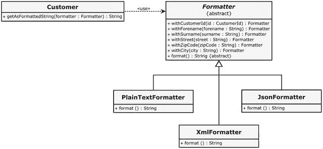

图 9-7。

An abstract Formatting strategy and its three concrete Formatting strategies

显而易见，本例中的策略模式确保了成员函数`Customer::getAsFormattedString()`的调用者可以根据需要配置输出格式。您想支持另一种输出格式吗？没问题:由于开闭原则的出色支持，可以很容易地添加另一种具体的格式化策略。其他的格式化策略，以及类`Customer`，完全不受这个扩展的影响。

### 命令

由于接收到指令，软件系统通常必须执行各种动作。例如，文本处理软件的用户通过与软件的用户界面交互来发出各种命令。他们想要打开文档、保存文档、打印文档、复制一段文本、粘贴一段复制的文本等。这种普遍模式在其他领域也可以观察到。例如，在金融领域，客户可以向其证券交易商发出购买股票、出售股票等指令。在制造业等更具技术性的领域，命令用于控制工业设施和机器。

当实现由命令控制的软件系统时，确保动作请求与实际执行动作的对象分离是很重要的。这背后的指导原则是松耦合(参见第三章)和关注点分离。

一个很好的比喻是餐馆。在餐馆里，服务员接受顾客的订单，但她不负责烹饪食物。这是餐厅厨房的任务。事实上，对于顾客来说，食物是如何准备的甚至是透明的。也许餐馆自己准备食物，但食物也可能是从其他地方送来的。

在面向对象的软件开发中，有一种称为命令(同义词:动作)的行为模式促进了这种分离。它的使命陈述如下:

> Encapsulate a request into an object, so that you can parameterize client, queue or log requests of different requests and support revocable operations. Erich Gama and others. Al. , design mode [Gamma95]

命令模式的一个很好的例子是客户机/服务器体系结构，其中客户机——所谓的调用程序——发送应该在服务器上执行的命令，服务器被称为接收者。

让我们从抽象的`Command`开始，它是一个简单的小界面，看起来如下:

```cpp
#include <memory>

class Command {

public:
  virtual ∼Command() = default;
  virtual void execute() = 0;
};

using CommandPtr = std::shared_ptr<Command>;

Listing 9-17.The Command interface

```

我们还为指向命令的智能指针引入了类型别名(`CommandPtr`)。

这个抽象的`Command`接口现在可以通过各种具体的命令来实现。让我们先来看看一个非常简单的命令，输出字符串“Hello World！”：

```cpp
#include <iostream>

class HelloWorldOutputCommand : public Command {

public:
  virtual void execute() override {
    std::cout << "Hello World!" << "\n";
  }
};

Listing 9-18.A first and very simple implementation of a concrete Command

```

接下来，我们需要接受和执行命令的元素。在这个设计模式的一般描述中，这个元素被称为接收器。在我们的例子中，扮演这个角色的是一个名为`Server`的类:

```cpp
#include "Command.h"

class Server {

public:
  void acceptCommand(const CommandPtr& command) {
    command->execute();
  }
};

Listing 9-19.The Command receiver

```

目前，这个类只包含一个可以接受和执行命令的简单公共成员函数。

最后，我们需要所谓的 Invoker，它是我们的客户机/服务器架构中的类`Client`:

```cpp
class Client {

public:
  void run() {
    Server theServer { };
    CommandPtr helloWorldOutputCommand = std::make_shared<HelloWorldOutputCommand>();
    theServer.acceptCommand(helloWorldOutputCommand);
  }
};
Listing 9-20.The Client sends commands to the Server

```

在`main()`函数中，我们可以找到下面的简单代码:

```cpp
#include "Client.h"

int main() {
  Client client { };
  client.run();
  return 0;
}

Listing 9-21.The main() function

```

如果这个程序现在正在编译和执行，那么输出“Hello World！”会出现在 stdout 上。乍一看，这似乎不是很令人兴奋，但是我们通过命令模式实现的是，命令的发起和发送与其执行是分离的。我们现在可以处理命令对象以及其他对象。

由于这种设计模式支持开闭原则(Open 参见第六章)很好，添加新命令也很容易，只需对现有代码进行微不足道的微小修改。例如，如果我们想强制`Server`等待一段时间，我们可以添加以下新命令:

```cpp
#include "Command.h"

#include <chrono>

#include <thread>

class WaitCommand : public Command {

public:
  explicit WaitCommand(const unsigned int durationInMilliseconds) noexcept :
    durationInMilliseconds{durationInMilliseconds} { };

  virtual void execute() override {
    std::chrono::milliseconds dur(durationInMilliseconds);
    std::this_thread::sleep_for(dur);
  }

private:
  unsigned int durationInMilliseconds { 1000 };
};

Listing 9-22.Another concrete command that instructs the server to wait

```

现在我们可以这样使用新的`WaitCommand`:

```cpp
class Client {

public:
  void run() {
    Server theServer { };
    const unsigned int SERVER_DELAY_TIMESPAN { 3000 };

    CommandPtr waitCommand = std::make_shared<WaitCommand>(SERVER_DELAY_TIMESPAN);
    theServer.acceptCommand(waitCommand);

    CommandPtr helloWorldOutputCommand = std::make_shared<HelloWorldOutputCommand>();
    theServer.acceptCommand(helloWorldOutputCommand);
  }
};

Listing 9-23.Our new WaitCommand in use

```

为了获得到目前为止已经产生的结构的概述，图 9-8 描绘了一个相应的 UML 类图:


图 9-8。

The Server just knows the Command interface, but not any concrete command

从这个例子中可以看出，我们可以用值来参数化命令。由于纯虚拟`execute()`成员函数的签名被`Command`接口指定为无参数，因此参数化是在初始化构造函数的帮助下完成的。此外，我们不需要改变`Server`类中的任何东西，因为它能够立即处理和执行新命令。

命令模式提供了多种可能的应用。例如，命令可以排队。这也支持命令的异步执行:调用者发送命令，然后可以立即做其他事情，但是命令是由接收者在稍后的时间执行的。

但是，少了点什么！在上面引用的命令模式的使命陈述中，你可以读到一些关于“…支持可撤销操作”的内容下一节将专门讨论这个话题。

### 命令处理程序

在上一节的客户机/服务器架构的小例子中，我做了一点手脚。实际上，服务器不会像我上面演示的那样执行命令。到达服务器的命令对象将被分发到负责执行命令的服务器内部。举例来说，这可以借助于另一种叫做责任链的模式来完成(这种模式在本书中没有描述)。

让我们考虑另一个更复杂的例子。假设我们有一个绘图程序。这个程序的用户可以画出许多不同的形状，例如，圆形和矩形。为此，在程序的用户界面中提供了相应的菜单，通过这些菜单可以调用这些绘图操作。我敢肯定你已经猜到了:这个程序的熟练软件开发人员实现了命令模式来执行这些绘图操作。然而，涉众的需求表明程序的用户也可以撤销绘图操作。

为了满足这个需求，我们首先需要可撤销的命令。

```cpp
#include <memory>

class Command {

public:
  virtual ∼Command() = default;
  virtual void execute() = 0;
};

class Revertable {

public:
  virtual ∼Revertable() = default;
  virtual void undo() = 0;
};

class UndoableCommand : public Command, public Revertable { };

using CommandPtr = std::shared_ptr<UndoableCommand>;

Listing 9-24.The UndoableCommand interface is created by combining Command and Revertable

```

根据接口隔离原理(ISP 参见第六章)我们添加了另一个支持撤销功能的接口`Revertable`。这个新接口可以使用对一个`UndoableCommand`的继承与现有的`Command`接口相结合。

作为许多不同的可撤销绘图命令的示例，我在这里只显示了圆的具体命令:

```cpp
#include "Command.h"

#include "DrawingProcessor.h"

#include "Point.h"

class DrawCircleCommand : public UndoableCommand {

public:
  DrawCircleCommand(DrawingProcessor& receiver, const Point& centerPoint,
    const double radius) noexcept :
    receiver { receiver }, centerPoint { centerPoint }, radius { radius } { }

  virtual void execute() override {
    receiver.drawCircle(centerPoint, radius);
  }

  virtual void undo() override {
    receiver.eraseCircle(centerPoint, radius);
  }

private:
  DrawingProcessor& receiver;
  const Point centerPoint;
  const double radius;
};

Listing 9-25.An undoable command for drawing circles

```

很容易想象绘制矩形和其他形状的命令看起来非常相似。命令的执行接收者是一个名为`DrawingProcessor`的类，它是执行绘图操作的元素。在命令的构造过程中，对该对象的引用与其他参数一起传递(请参见初始化构造函数)。在这里，我只展示了可能很复杂的类`DrawingProcessor`的一小部分摘录，因为它对于理解模式并不重要:

```cpp
class DrawingProcessor {

public:
  void drawCircle(const Point& centerPoint, const double radius) {
    // Instructions to draw a circle on the screen...
  };

  void eraseCircle(const Point& centerPoint, const double radius) {
    // Instructions to erase a circle from the screen...
  };

  // ...
};

Listing 9-26.The DrawingProcessor is the element that will perform the drawing operations

```

现在我们来看这个模式的核心部分，即`CommandProcessor`:

```cpp
#include <stack>

class CommandProcessor {

public:
  void execute(const CommandPtr& command) {
    command->execute();
    commandHistory.push(command);
  }

  void undoLastCommand() {
    if (commandHistory.empty()) {
      return;
    }
    commandHistory.top()->undo();
    commandHistory.pop();
  }

private:
  std::stack<std::shared_ptr<Revertable>> commandHistory;
};

Listing 9-27.The class CommandProcessor manages a stack of undoable command objects

```

`CommandProcessor`类(顺便说一下，在使用上面的实现时，它不是线程安全的)包含一个`std::stack<T>`(在头文件`<stack>`中定义)，它是一个抽象数据类型，以后进先出(LIFO)的方式运行。在一个命令的执行被`CommandProcessor::execute()`成员函数触发后，命令对象被存储在`commandHistory`堆栈中。当调用`CommandProcessor::undoLastCommand()`成员函数时，保存在堆栈上的最后一个命令被撤销，然后从堆栈顶部删除。

撤销操作现在也可以被建模为一个命令对象。在这种情况下，命令接收者当然是`CommandProcessor`本身:

```cpp
#include "Command.h"

#include "CommandProcessor.h"

class UndoCommand : public UndoableCommand {

public:
  explicit UndoCommand(CommandProcessor& receiver) noexcept :
      receiver { receiver } { }

  virtual void execute() override {
    receiver.undoLastCommand();
  }

  virtual void undo() override {
    // Intentionally left blank, because an undo should not be undone.
  }

private:
  CommandProcessor& receiver;
};

Listing 9-28.The UndoCommand prompts the CommandProcessor to perform an undo

```

丢了总览？好了，又到了以 UML 类图的形式展示“大图”的时候了(图 9-9 )。

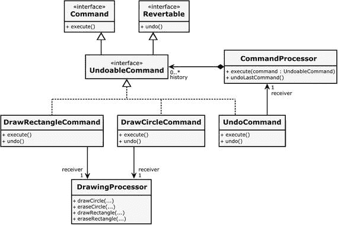

图 9-9。

The CommandProcessor (on the right) executes the Commands he receives and manages a command history

在实践中使用命令模式时，您经常会遇到这样的需求，即能够将几个简单的命令组合成一个更复杂的命令，或者记录和重放命令(脚本)。为了能够以优雅的方式实现这样的需求，下面的设计模式是合适的。

### 复合材料

在计算机科学中广泛使用的数据结构是树的结构。到处都可以找到树。例如，数据介质(例如，硬盘)上的文件系统的层次结构符合树的结构。集成开发环境(IDE)的项目浏览器通常具有树形结构。在编译器设计中，抽象语法树(AST)，顾名思义，是源代码的抽象语法结构的树表示，通常是编译器语法分析阶段的结果。

树状数据结构的面向对象蓝图被称为复合模式。这个模式有如下意图:

> The objects are grouped into a tree structure to represent the part-whole hierarchy. Composite allows clients to handle single objects and combinations of objects uniformly. Erich Gama and others. Al. , design mode [Gamma95]

我们之前在命令和命令处理器小节中的例子应该可以扩展，我们可以构建复合命令，命令可以被记录和重放。所以我们在之前的设计中添加了一个新的类，一个`CompositeCommand`:

```cpp
#include "Command.h"

#include <vector>

class CompositeCommand : public UndoableCommand {

public:
  void addCommand(CommandPtr& command) {
    commands.push_back(command);
  }

  virtual void execute() override {
    for (const auto& command : commands) {
      command->execute();
    }
  }

  virtual void undo() override {
    for (const auto& command : commands) {
      command->undo();
    }
  }

private:
  std::vector<CommandPtr> commands;
};

Listing 9-29.A new concrete UndoableCommand that manages a list of commands

```

复合命令有一个成员函数`addCommand()`，它允许您向`CompositeCommand`的实例添加命令。由于类`CompositeCommand`也实现了`UndoableCommand`接口，它的实例可以像普通命令一样处理。换句话说，也可以将复合命令与其他复合命令分层组装。通过复合模式的递归结构，您能够生成命令树。

下面的 UML 类图(图 9-10 )描述了扩展设计。

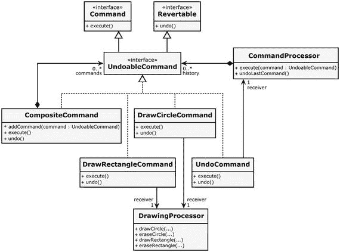

图 9-10。

With the added CompositeCommand (on the left), commands can now be scripted

新添加的类别`CompositeCommand`现在可以用作宏记录器，以记录和重放命令序列:

```cpp
int main() {
  CommandProcessor commandProcessor { };
  DrawingProcessor drawingProcessor { };

  auto macroRecorder = std::make_shared<CompositeCommand>();

  Point circleCenterPoint { 20, 20 };
  CommandPtr drawCircleCommand = std::make_shared<DrawCircleCommand>(drawingProcessor,
  circleCenterPoint, 10);
  commandProcessor.execute(drawCircleCommand);
  macroRecorder->addCommand(drawCircleCommand);

  Point rectangleCenterPoint { 30, 10 };
  CommandPtr drawRectangleCommand = std::make_shared<DrawRectangleCommand>(drawingProcessor,
  rectangleCenterPoint, 5, 8);
  commandProcessor.execute(drawRectangleCommand);
  macroRecorder->addCommand(drawRectangleCommand);

  commandProcessor.execute(macroRecorder);

  CommandPtr undoCommand = std::make_shared<UndoCommand>(commandProcessor);
  commandProcessor.execute(undoCommand);

  return 0;
}

Listing 9-30.Our new CompositeCommand in action as a Macro Recorder

```

在复合模式的帮助下，现在很容易从简单的命令组装复杂的命令序列(后者在规范形式中被称为“叶子”)。由于`CompositeCommand`也实现了`UndoableCommand`接口，它们可以像简单的命令一样使用。这极大地简化了客户端代码的使用。

仔细观察，有一个小缺点。您可能已经注意到，只有使用具体类型`CompositeCommand`的实例(`macroRecorder`)时，才能访问成员函数`CompositeCommand::addCommand()`(参见上面的源代码)。该成员功能无法通过接口`UndoableCommand`使用。换句话说，这里没有给出复合物和叶子的承诺的平等待遇(记住模式的意图)!

如果你看一下[Gamma95]中的通用复合模式，你会发现用于管理子元素的管理功能是在抽象中声明的。然而，在我们的例子中，这意味着我们必须在接口`UndoableCommand`中声明一个`addCommand()`(顺便说一下，这违反了 ISP)。致命的后果是叶子元素必须覆盖`addCommand()`，并且必须为这个成员函数提供一个有意义的实现。这是不可能的！请问，如果我们给`DrawCircleCommand`的一个实例添加一个命令，会发生什么，什么不违反最小惊讶原则(见第三章)?

如果我们那样做，就违反了利斯科夫替代原理(LSP 参见第六章。因此，在我们的情况下，最好做一个折衷，不要同等对待复合材料和叶片。

### 观察者

构建软件系统的一个众所周知的架构模式是模型-视图-控制器(MVC)。在这种架构模式的帮助下,《面向模式的软件架构》[Busch96]一书中详细描述了这种架构模式，通常应用程序的表现部分(用户界面)是结构化的。其背后的原则是关注点分离(SoC)。其中，要显示的数据保存在所谓的模型中，与这些数据的多种视觉表示(所谓的视图)相分离。

在 MVC 中，视图和模型之间的耦合应该尽可能的松散。这种松散耦合通常通过观察者模式来实现。观察者是一种在[Gamma95]中描述的行为模式，它有如下意图:

> Define one-to-many dependencies between objects, so that when an object changes state, all its dependent objects will be notified and automatically updated. Erich Gama and others. Al. , design mode [Gamma95]

通常，这种模式可以用一个例子来解释。让我们考虑一个电子表格应用程序，它是许多办公软件套件的自然组成部分。在这样的应用程序中，数据可以显示在工作表中、饼图图形中以及许多其他呈现形式中；所谓的观点。可以创建数据的不同视图，也可以再次关闭。

首先，我们需要一个抽象的视图元素，叫做观察者。

```cpp
#include <memory>

class Observer {

public:
  virtual ∼Observer() = default;
  virtual int getId() = 0;
  virtual void update() = 0;
};

using ObserverPtr = std::shared_ptr<Observer>;

Listing 9-31.The abstract Observer

```

观察者观察一个所谓的对象。为此，他们可以在主体处注册，也可以注销。

```cpp
#include "Observer.h"

#include <algorithm>

#include <vector>

class IsEqualTo final {

public:
  explicit IsEqualTo(const ObserverPtr& observer) :
    observer { observer } { }
  bool operator()(const ObserverPtr& observerToCompare) {
    return observerToCompare->getId() == observer->getId();
  }

private:
  ObserverPtr observer;
};

class Subject {
public:
  void addObserver(ObserverPtr& observerToAdd) {
    auto iter = std::find_if(begin(observers), end(observers),
        IsEqualTo(observerToAdd));
    if (iter == end(observers)) {
      observers.push_back(observerToAdd);
    }
  }

  void removeObserver(ObserverPtr& observerToRemove) {
    observers.erase(std::remove_if(begin(observers), end(observers),
        IsEqualTo(observerToRemove)), end(observers));
  }

protected:
  void notifyAllObservers() const {
    for (const auto& observer : observers) {
      observer->update();
    }
  }

private:
  std::vector<ObserverPtr> observers;
};

Listing 9-32.Observers can be added to and removed from a so-called Subject

```

除了类`Subject`之外，还定义了一个名为`IsEqualTo`的函子(见第七章关于函子)，用于添加和移除观察者时的比较。仿函数比较`Observer`的 id。也可以想象它会比较`Observer`实例的内存地址。然后，甚至可能有几个相同类型的观察员在`Subject`登记。

核心是`notifyAllObservers()`成员函数。它是`protected`,因为它旨在由从这个对象继承的具体对象调用。这个函数遍历所有注册的观察者，并调用它们的`update()`成员函数。

让我们来看一个具体的主题`SpreadsheetModel`。

```cpp
#include "Subject.h"

#include <iostream>

#include <string_view>

class SpreadsheetModel : public Subject {

public:

  void changeCellValue(std::string_view column, const int row, const double value) {
    std::cout << "Cell [" << column << ", " << row << "] = " << value << std::endl;
    // Change value of a spreadsheet cell, and then...
    notifyAllObservers();
  }
};

Listing 9-33.The SpreadsheetModel is a concrete Subject

```

当然，这只是绝对最小值的一个`SpreadsheetModel`。它只是用来解释模式的功能原理。这里您唯一能做的就是调用一个成员函数，该函数调用继承的`notifyAllObservers()`函数。

在我们的例子中，实现`Observer`接口的`update()`成员功能的三个具体观察者是三个视图`TableView`、`BarChartView`和`PieChartView`。

```cpp
#include "Observer.h"

#include "SpreadsheetModel.h"

class TableView : public Observer {

public:
  explicit TableView(SpreadsheetModel& theModel) :
    model { theModel } { }
  virtual int getId() override {
    return 1;
  }

  virtual void update() override {
    std::cout << "Update of TableView." << std::endl;
  }

private:
  SpreadsheetModel& model;
};

class BarChartView : public Observer {

public:
  explicit BarChartView(SpreadsheetModel& theModel) :
    model { theModel } { }
  virtual int getId() override {
    return 2;
  }

  virtual void update() override {
    std::cout << "Update of BarChartView." << std::endl;
  }

private:
  SpreadsheetModel& model;
};

class PieChartView : public Observer {

public:
  explicit PieChartView(SpreadsheetModel& theModel) :
    model { theModel } { }
  virtual int getId() override {
    return 3;
  }

  virtual void update() override {
    std::cout << "Update of PieChartView." << std::endl;
  }

private:
  SpreadsheetModel& model;
};

Listing 9-34.Three concrete views implement the abstract Observer interface

```

我认为是时候再次以类图的形式展示一个概述了。图 9-11 描述了已经出现的结构(类和依赖关系)。

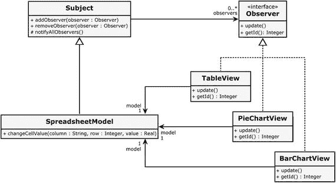

图 9-11。

When the SpreadsheetModel gets changed, it notifies all its observers

在`main()`函数中，我们现在使用`SpreadsheetModel`和如下三个视图:

```cpp
#include "SpreadsheetModel.h"

#include "SpreadsheetViews.h"

int main() {
  SpreadsheetModel spreadsheetModel { };

  ObserverPtr observer1 = std::make_shared<TableView>(spreadsheetModel);
  spreadsheetModel.addObserver(observer1);

  ObserverPtr observer2 = std::make_shared<BarChartView>(spreadsheetModel);
  spreadsheetModel.addObserver(observer2);

  spreadsheetModel.changeCellValue("A", 1, 42);

  spreadsheetModel.removeObserver(observer1);

  spreadsheetModel.changeCellValue("B", 2, 23.1);

  ObserverPtr observer3 = std::make_shared<PieChartView>(spreadsheetModel);
  spreadsheetModel.addObserver(observer3);

  spreadsheetModel.changeCellValue("C", 3, 3.1415926);

  return 0;
}

Listing 9-35.Our SpreadsheetModel and the three Views assembled together and in action

```

编译并运行程序后，我们在标准输出中看到以下内容:

```cpp
Cell [A, 1] = 42
Update of TableView.
Update of BarChartView.
Cell [B, 2] = 23.1
Update of BarChartView.
Cell [C, 3] = 3.14153
Update of BarChartView.
Update of PieChartView.

```

除了松散耦合的积极特征(具体主体对观察者一无所知)，这种模式还非常支持开闭原则。可以非常容易地添加新的具体观察者(在我们的例子中是新的视图),因为在现有的类中不需要调整或更改任何东西。

### 工厂

根据关注点分离(SoC)原则，对象创建或采购应该与对象拥有的特定领域任务分离。上面讨论的依赖注入模式以一种直接的方式遵循这个原则，因为整个对象创建过程都集中在一个基础结构元素中，并且对象不必担心它。

但是如果需要在运行时的某个时刻动态创建一个对象，我们该怎么办呢？那么，这个任务可以由对象工厂来接管。

工厂设计模式基本上相对简单，并且以许多不同的形式和种类出现在代码库中。除了 SoC 原则之外，信息隐藏(参见第三章)也得到了极大的支持，因为实例的创建过程应该对用户隐藏。

正如已经说过的，工厂有无数的形式和变种。我们只讨论一个简单的变体。

#### 简单工厂

工厂最简单的实现可能是这样的(我们从上面的 DI 小节中获取日志示例):

```cpp
#include "LoggingFacility.h"

#include "StandardOutputLogger.h"

class LoggerFactory {

public:
  static Logger create() {
    return std::make_shared<StandardOutputLogger>();
  }
};

Listing 9-36.Probably the simplest imaginable object factory

```

这个非常简单的工厂的用法如下:

```cpp
#include "LoggerFactory.h"

int main() {
  Logger logger = LoggerFactory::create();
  // ...log something...
  return 0;
}

Listing 9-37.Using the LoggerFactory to create a Logger instance

```

也许你现在会问，为这样一个微不足道的任务多上一节课是否值得。嗯，也许不是。更明智的做法是，如果工厂能够创建不同的记录器，并决定它应该是哪种类型。例如，这可以通过读取和评估配置文件，或者从 Windows 注册表数据库中读取某个键来完成。还可以想象，生成的对象的类型依赖于一天中的时间。可能性是无穷的。这对于客户端类应该是完全透明的，这一点很重要。所以，这里有一个稍微复杂一点的`LoggerFactory`，它读取一个配置文件(例如，从硬盘)并决定当前的配置，创建哪个特定的记录器:

```cpp
#include "LoggingFacility.h"

#include "StandardOutputLogger.h"

#include "FilesystemLogger.h"

#include <fstream>

#include <string>

#include <string_view>

class LoggerFactory {

private:
  enum class OutputTarget : int {
    STDOUT,
    FILE
  };

public:
  explicit LoggerFactory(std::string_view configurationFileName) :
    configurationFileName { configurationFileName } { }

  Logger create() const {
    const std::string configurationFileContent = readConfigurationFile();
    OutputTarget outputTarget = evaluateConfiguration(configurationFileContent);
    return createLogger(outputTarget);
  }

private:
  std::string readConfigurationFile() const {
    std::ifstream filestream(configurationFileName);
    return std::string(std::istreambuf_iterator<char>(filestream),
      std::istreambuf_iterator<char>());  }

  OutputTarget evaluateConfiguration(std::string_view configurationFileContent) const {
    // Evaluate the content of the configuration file...
    return OutputTarget::STDOUT;
  }

  Logger createLogger(OutputTarget outputTarget) const {
    switch (outputTarget) {
    case OutputTarget::FILE:
      return std::make_shared<FilesystemLogger>();
    case OutputTarget::STDOUT:
    default:

      return std::make_shared<StandardOutputLogger>();
    }
  }

  const std::string configurationFileName;
};

Listing 9-38.A more sophisticated Factory that reads and evaluates a configuration file

```

图 9-12 中的 UML 类图描绘了我们基本上从依赖注入部分了解到的结构(图 9-5 ，但是现在用我们简单的`LoggerFactory`代替了汇编器。

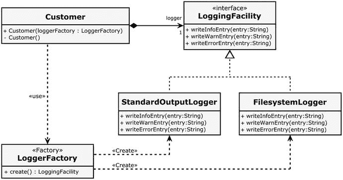

图 9-12。

The Customer uses a LoggerFactory to obtain concrete Loggers

这个图与图 9-5 的比较显示了一个显著的不同:当类`CustomerRepository`不依赖于汇编器时，客户在使用工厂模式时“知道”工厂类。据推测，这种依赖并不是一个严重的问题，但是它再次清楚地表明，依赖注入将松散耦合带到了最大程度。

### 外表

Facade 模式是一种结构模式，常用于架构级别，其目的如下:

> Provide a unified interface for a group of interfaces in the subsystem. Facade defines a more advanced interface, which makes the subsystem easier to use. Erich Gama and others. Al. , design mode [Gamma95]

根据关注点分离原则、单一责任原则(参见第六章)和信息隐藏(参见第三章)构建大型软件系统通常会产生某种更大的组件或模块。通常，这些组件或模块有时可以被称为“子系统”即使在分层架构中，各个层也可以被视为子系统。

为了促进封装，组件或子系统的内部结构应该对其客户端隐藏(参见第三章中的信息隐藏)。子系统之间的通信以及它们之间的依赖程度应该最小化。如果一个子系统的客户必须知道它的内部结构和各部分的交互的细节，这将是致命的。

外观通过为客户端提供定义良好的简单接口来控制对复杂子系统的访问。对子系统的任何访问都只能在外观上完成。

下面的 UML 图(图 9-13 )显示了一个名为`Billing`的准备发票子系统。它的内部结构由几个相互连接的部分组成。子系统的客户端不能直接访问这些部分。他们必须使用 Facade `BillingService`，它由子系统边界上的 UML 端口(原型 Facade)表示。


图 9-13。

The Billing subsystem provides a facade BillingService as an access point for clients

在 C++ 和其他语言中，Facade 没有什么特别的。它通常只是一个简单的类，在其公共接口接收调用，并将它们转发到子系统的内部结构。有时它只是简单地将一个调用转发给子系统的一个内部结构元素，但偶尔一个 Facade 也执行数据转换，那么它也是一个适配器(参见关于适配器的部分)。

在我们的例子中，Facade 类`BillingService`实现了两个接口，由 UML 球符号表示。根据接口隔离原理(ISP 参见第六章，`Billing`子系统的配置(接口`Configuration`)与账单生成(接口`InvoiceCreation`)分离。因此，Facade 必须覆盖在两个接口中声明的操作。

### 金钱阶级

如果高精度很重要，您应该避免浮点值。类型为`float`、`double`或`long double`的浮点变量在简单加法中已经失败，如这个小例子所示:

```cpp
#include <assert.h>

#include <iostream>

int main() {

  double sum = 0.0;
  double addend = 0.3;

  for (int i = 0; i < 10; i++) {
    sum = sum + addend;
  };

  assert(sum == 3.0);
  return 0;
}

Listing 9-39.When adding 10 floating point numbers this way, the result is possibly not accurate enough

```

如果您编译并运行这个小程序，您将看到它的控制台输出:

```cpp
Assertion failed: sum == 3.0, file ..\main.cpp, line 13

```

我认为这种偏差的原因是众所周知的。浮点数在内部以二进制格式存储。因此，不可能在`float`、`double`或`long double`类型的变量中精确存储 0.3(及其他)的值，因为它在二进制中没有有限长度的精确表示。在十进制中，我们也有类似的问题。我们不能只用十进制来表示 1/3(三分之一)这个值。0.33333333 并不完全准确。

这个问题有几种解决方法。对于货币，将货币值存储为具有所需精度的整数可能是一种合适的方法，例如，$12.45 将存储为 1245。如果要求不是很高，整数可能是一个可行的解决方案。请注意，C++ 标准没有以字节为单位指定整型的大小；因此，您必须小心处理非常大的数量，因为可能会发生整数溢出。如果有疑问，应该使用 64 位整数，因为它可以容纳非常大量的钱。

Determining the Range of an Arithmetic Type

算术类型(整数或浮点)的实际实现特定范围可以在头文件`<limits>`中的类模板中找到。例如，这就是你如何找到`int`的最大范围:

```cpp
#include <limits>

constexpr auto INT_LOWER_BOUND = std::numeric_limits<int>::min();

constexpr auto INT_UPPER_BOUND = std::numeric_limits<int>::max();

```

另一种流行的方法是为此提供一个特殊的类，即所谓的 Money 类:

> Provide a class to represent the exact amount. Currency class deals with different currencies and the exchange between them. —Martin Fowler, Enterprise Application Architecture Pattern [Fowler02]

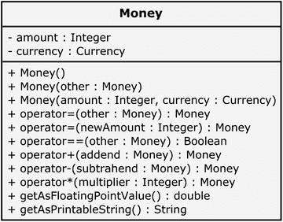

图 9-14。

A Money Class

Money 类模式基本上是一个封装了金融金额及其货币的类，但是处理货币只是这类中的一个例子。还有许多其他的性质或维度，必须精确地表示出来，例如，物理学中的精确测量(时间、电压、电流、距离、质量、频率、物质的数量……)。

1991: Patriot Missile Mistiming

MIM-104 爱国者是一种地对空导弹(SAM)系统，由美国雷神公司设计和制造。其典型应用是对抗高空战术弹道导弹、巡航导弹和先进飞机。在第一次波斯湾战争(1990-1991)期间，又名“沙漠风暴”行动，“爱国者”被用于击落来袭的伊拉克飞毛腿或阿尔·侯赛因短程弹道导弹。

1991 年 2 月 25 日，位于沙特阿拉伯东部省份达兰市的一个炮台未能拦截一枚飞毛腿导弹。导弹击中了一个军营，造成 28 人死亡，98 人受伤。

一份调查报告[GAOIMTEC92]揭示，这起故障的原因是，由于计算机运算错误，对系统通电后的时间计算不准确。为了使爱国者导弹能够在发射后发现并击中目标，它们必须在空间上接近目标，也就是所谓的“距离门”。为了预测目标下一步将出现在哪里(所谓的偏转角)，必须对系统的时间和目标的飞行速度进行一些计算。系统启动后经过的时间以十分之一秒为单位，用整数表示。目标的速度以英里/秒为单位，用十进制数值表示。为了计算“距离门”，系统计时器的值必须乘以 1/10 才能得到以秒为单位的时间。这个计算是通过使用只有 24 位长的寄存器来完成的。

问题是十进制的 1/10 值在 24 位寄存器中无法准确表示。该值在小数点后 24 位被截断。结果是，时间从整数到实数的转换会导致精度的轻微损失，从而导致时间计算不太精确。根据其作为移动系统运行的概念，如果系统仅运行几个小时，这种精度误差可能不会成为问题。但在这种情况下，系统已经运行了 100 多个小时。代表系统正常运行时间的数字相当大。这意味着 1/10 转换成 24 位十进制表示的小误差会导致将近半秒的大偏差误差！一枚伊拉克飞毛腿导弹大约。这段时间跨度为 800 米——足以超出正在逼近的爱国者导弹的“射程门”。

尽管在许多商业 IT 系统中，准确处理货币数量是一个非常常见的情况，但是在大多数主流的 C++ 基础类库中，你将徒劳地寻找一个货币类。但是不要多此一举！有许多不同的 C++ Money 类实现，只要问问你信任的搜索引擎，你就会得到成千上万的点击。通常，一个实现不能满足所有需求。关键是要了解你的问题域。在选择(或设计)货币类别时，您可能需要考虑几个约束和要求。这里有几个你可能必须首先澄清的问题:

*   要处理的值的完整范围是什么(最小值、最大值)？
*   哪些舍入规则适用？有些国家有关于四舍五入的国家法律或惯例。
*   法律对准确性有要求吗？
*   必须考虑哪些标准(例如，ISO 4217 货币代码国际标准)？
*   这些值将如何显示给用户？
*   转换多久发生一次？

从我的角度来看，对于一个 Money 类来说，拥有 100%的单元测试覆盖率(参见第二章关于单元测试)是绝对必要的，这样可以检查这个类是否在所有情况下都像预期的那样工作。当然，与用整数表示的纯数字相比，Money 类有一个小缺点:您会损失一点点性能。在某些系统中，这可能是一个问题。但是我确信在大多数情况下优势会占优势(永远记住过早的优化是不好的)。

### 特殊情况对象(空对象)

在第四章的“不要传递或返回 0 (NULL，nullptr)”一节中，我们了解到从一个函数或方法返回一个`nullptr`是不好的，应该避免。在那里，我们还讨论了在现代 C++ 程序中避免常规(原始)指针的各种策略。在“异常就是异常——从字面上看！”在第五章中，我们了解到异常应该只用于真正的异常情况，而不是为了控制正常的程序流程。

现在，一个开放且有趣的问题是:我们如何在不使用非语义`nullptr`或其他奇怪值的情况下，处理那些不是真正异常的特殊情况(例如，内存分配失败)？

让我们再来看看我们的代码示例，这个示例我们已经看过几次了:通过名称查询 a `Customer`。

```cpp
Customer CustomerService::findCustomerByName(const std::string& name) {
  // Code that searches the customer by name...
  // ...but what shall we do, if a customer with the given name does not exist?!
}
Listing 9-40.A look up method for customers by name

```

一种可能是总是返回列表，而不是单个实例。如果返回的列表为空，则查询的业务对象不存在:

```cpp
#include "Customer.h"

#include <vector>

using CustomerList = std::vector<Customer>;

CustomerList CustomerService::findCustomerByName(const std::string& name) {
  // Code that searches the customer by name...
  // ...and if a customer with the given name does not exist:
  return CustomerList();
}

Listing 9-41.An alternative to nullptr: Returning an empty list if the look-up for a customer fails

```

现在可以在下一个程序序列中查询返回的列表是否为空。但是什么语义有空列表呢？是一个错误导致了列表的空空如也吗？嗯，成员函数`std::vector<T>::empty()`不能够回答这个问题。空是列表的一种状态，但是这种状态没有特定于域的语义。

伙计们，毫无疑问，这个解决方案比返回一个`nullptr`要好得多，但是在某些情况下可能不够好。更令人满意的是，可以查询返回值的来源，以及可以用它做什么。答案是特例模式！

> A subclass that provides special behavior for special situations. —Martin Fowler, Enterprise Application Architecture Pattern [Fowler02]

特例模式背后的思想是我们利用了多态性，并且我们提供了代表特例的类，而不是返回`nullptr`或其他一些奇怪的值。这些特例类与调用者所期望的“普通”类具有相同的接口。图 9-15 中的类图描述了这样一种专门化。

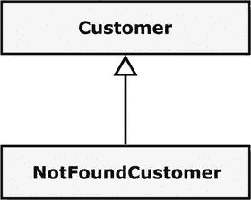

图 9-15。

The class(es) representing a special case are derived from class Customer

在 C++ 源代码中，代表特殊情况的`Customer`类和`NotFoundCustomer`类的实现如下所示(只显示了相关部分):

```cpp
#ifndef CUSTOMER_H_

#define CUSTOMER_H_

#include "Address.h"

#include "CustomerId.h"

#include <memory>

#include <string>

class Customer {

public:
  // ...more member functions here...
  virtual ∼Customer() = default;

  virtual bool isPersistable() const noexcept {
    return (customerId.isValid() && ! forename.empty() && ! surname.empty() &&
      billingAddress->isValid() && shippingAddress->isValid());
  }

private:
  CustomerId customerId;
  std::string forename;
  std::string surname;
  std::shared_ptr<Address> billingAddress;
  std::shared_ptr<Address> shippingAddress;
};

class NotFoundCustomer final : public Customer {

public:
  virtual bool isPersistable() const noexcept override {
    return false;
  }
};

using CustomerPtr = std::unique_ptr<Customer>;

#endif /* CUSTOMER_H_ */

Listing 9-42.An excerpt from file Customer.h with the classes Customer and NotFoundCustomer

```

代表特殊情况的对象现在可以像类`Customer`的有效(正常)实例一样使用。即使对象在程序的不同部分之间传递，永久的空检查也是多余的，因为总是有一个有效的对象。使用`NotFoundCustomer`对象可以做很多事情，就好像它是`Customer`的一个实例一样，例如，在用户界面中呈现它。对象甚至可以揭示它是否是持久的。对于“真实的”`Customer`，这是通过分析其数据字段来完成的。然而，在`NotFoundCustomer`的例子中，这种检查总是有否定的结果。

与无意义的空检查相比，如下语句更有意义:

```cpp
if (customer.isPersistable()) {
  // ...write the customer to a database here...
}

```

std::optional<t> [C++17]

自 C++17 以来，有另一种有趣的替代方法可以用于可能丢失的结果或值:`std::optional<T>`(在头文件`<optional>`中定义)。这个类模板的实例表示一个“可选的包含值”，即一个可能存在也可能不存在的值。

通过引入类型别名，可以使用`std::optional<T>`将类`Customer`用作可选值，如下所示:

```cpp
#include "Customer.h"

#include <optional>

using OptionalCustomer = std::optional<Customer>;

```

我们的搜索功能`CustomerService::findCustomerByName()`现在可以实现如下:

```cpp
class CustomerRepository {

public:
  OptionalCustomer findCustomerByName(const std::string& name) {
    if ( /* the search was successful */ ) {
      return Customer();
    } else {
      return {};
    }
  }
};

```

在函数的调用位置，您现在有两种方法来处理返回值，如下例所示:

```cpp
int main() {
  CustomerRepository repository { };
  auto optionalCustomer = repository.findCustomerByName("John Doe");

  // Option 1: Catch an exception, if 'optionalCustomer' is empty
  try {
    auto customer = optionalCustomer.value();
  } catch (std::bad_optional_access& ex) {
    std::cerr << ex.what() << std::endl;
  }

  // Option 2: Provide a substitute for a possibly missing object
  auto customer = optionalCustomer.value_or(NotFoundCustomer());

  return 0;
}

```

例如，在第二个选项中，如果`optionalCustomer`为空，则可以提供一个标准(默认)客户，或者——在本例中——一个特例对象的实例。当一个对象的缺失是意料之外的，并且是一定发生了严重错误的线索时，我建议选择第一个选项。对于其他情况，丢失对象并不罕见，我推荐选项 2。

## 什么是成语？

编程习惯用法是用特定的编程语言或技术解决问题的一种特殊模式。也就是说，与更一般的设计模式不同，习惯用法的适用性是有限的。通常，它们的适用性仅限于一种特定的编程语言或某种技术，例如框架。

如果编程问题必须在较低的抽象层次上解决，习惯用法通常在详细设计和实现过程中使用。C 和 C++ 领域中一个众所周知的习惯用法是所谓的 Include Guard，有时也称为宏保护或头文件保护，用于避免重复包含同一个头文件:

```cpp
#ifndef FILENAME_H_

#define FILENAME_H_

// ...content of header file...

#endif

```

这种习惯用法的一个缺点是必须确保文件名的一致命名方案，因此也必须确保包含保护宏名的一致命名方案。因此，现在大多数 C 和 C++ 编译器都支持非标准的`#pragma once`指令。该指令插入到头文件的顶部，将确保头文件只被包含一次。

顺便说一下，我们已经了解了一些成语。在第四章中，我们讨论了资源获取即初始化(RAII)习惯用法，在第七章中，我们看到了擦除-移除习惯用法。

### 一些有用的 C++ 习惯用法

这不是一个笑话，但你实际上可以找到一个近 100(！)网上的 C++ 成语(WikiBooks:更多 C++ 成语；网址: [`https://en.wikibooks.org/wiki/More_C++_Idioms`](https://en.wikibooks.org/wiki/More_C++_Idioms) )。问题是，并不是所有这些习惯用法都有利于一个现代的、干净的 C++ 程序。它们有时非常复杂，甚至对于相当熟练的 C++ 开发人员来说也难以理解(例如，代数层次)。此外，随着 C++11 和后续标准的发布，一些习惯用法在很大程度上已经过时了。因此，我在这里只介绍一小部分，我认为它们很有趣，仍然有用。

#### 永恒的力量

有时，拥有一旦创建就不能改变其状态的对象的类(也称为不可变类)是非常有利的(这实际上意味着不可变对象，因为准确地说，一个类只能由开发人员更改)。例如，不可变对象可以用作散列数据结构中的键值，因为键值在创建后不应改变。另一个已知的不可变的例子是其他语言中的 String 类，比如 C# 或 Java。

不可变类和对象的好处如下:

*   默认情况下，不可变对象是线程安全的，所以如果几个线程或进程以不确定的方式访问这些对象，您不会有任何同步问题。因此，不变性使得创建可并行化的软件设计更加容易，因为对象之间没有冲突。
*   不变性使得编写、使用和推理代码变得更加容易，因为类不变量(即一组必须始终为真的约束)在对象创建时就已建立，并且确保在对象的生存期内保持不变。

要在 C++ 中创建一个不可变的类，必须采取以下措施:

*   该类的成员变量必须都是不可变的，也就是说，它们必须都是`const`(参见第四章中关于常量正确性的章节)。这意味着它们只能在构造函数中初始化一次，使用构造函数的成员初始化列表。
*   操作方法不会更改调用它们的对象，但会返回一个状态已改变的类的新实例。原始对象不会改变。为了强调这一点，不应该有 setter，因为名称以`set…()`开头的成员函数会引起误解。不可变对象上没有什么可设置的。
*   该类应标记为`final`。这不是一个硬性的规则，但是如果一个新类可以从一个声称不可变的类继承，就有可能绕过它的不变性。

下面是一个 C++ 中不可变类的例子:

```cpp
#include "Identifier.h"

#include "Money.h"

#include <string>

#include <string_view>

class Employee final {

public:
  Employee(std::string_view forename,
    std::string_view surname,
    const Identifier& staffNumber,
    const Money& salary) noexcept :
    forename { forename },
    surname { surname },
    staffNumber { staffNumber },
    salary { salary } { }

  Identifier getStaffNumber() const noexcept {
    return staffNumber;
  }

  Money getSalary() const noexcept {
    return salary;
  }

  Employee changeSalary(const Money& newSalary) const noexcept {
    return Employee(forename, surname, staffNumber, newSalary);
  }

private:
  const std::string forename;
  const std::string surname;
  const Identifier  staffNumber;
  const Money       salary;
};

Listing 9-43.Employee is designed as an immutable class

```

#### 替换失败不是错误(SFINAE)

事实上，替换失败不是一个错误(简称:SFINAE)不是一个真正的习惯用法，而是 C++ 编译器的一个特性。它已经是 C++98 标准的一部分，但是 C++11 增加了几个新特性。然而，它仍然被称为一种习惯用法，也是因为它以一种非常习惯的风格使用，特别是在模板库中，如 C++ 标准库或 Boost。

标准中的定义文本段落可以在 14.8.2 节关于模板参数推导中找到。在那里我们可以在 8 中读到下面的语句:

> If a substitution leads to an invalid type or expression, the type deduction fails. An invalid type or expression of refers to a type or expression that will be formatted incorrectly if it is written with an alternative parameter. Only invalid types and expressions in the direct context of function types and their template parameter types will cause the derivation to fail. —— Programming language C++ [ISO11] standard

C++ 模板实例化错误时的错误消息，例如，带有错误模板参数的错误消息，可能会非常冗长和隐晦。SFINAE 是一种编程技术，可以确保模板参数替换失败不会产生令人讨厌的编译错误。简而言之，这意味着如果模板参数替换失败，编译器将继续搜索合适的模板，而不是因出错而中止。

下面是一个非常简单的例子，有两个重载的函数模板:

```cpp
#include <iostream>

template <typename T>

void print(typename T::type) {
  std::cout << "Calling print(typename T::type)" << std::endl;
}

template <typename T>

void print(T) {
  std::cout << "Calling print(T)" << std::endl;
}

struct AStruct {
  using type = int;
};

int main() {
  print<AStruct>(42);
  print<int>(42);
  print(42);

  return 0;
}

Listing 9-44.SFINAE by example of two overloaded function templates

```

这个小例子在 stdout 上的输出将是:

```cpp
Calling print(typename T::type)
Calling print(T)
Calling print(T)

```

可以看出，编译器使用第一个版本的`print()`进行第一次函数调用，使用第二个版本进行两次后续调用。并且这段代码在 C++98 中也是有效的。

嗯，但是 SFINAE 之前的 C++11 有几个缺点。关于在实际项目中使用这种技术的真正努力，上面这个非常简单的例子有点欺骗性。以这种方式在模板库中应用 SFINAE 导致了非常冗长和复杂的代码，难以理解。此外，它的标准化很差，有时是编译器特有的。

随着 C++11 的出现，引入了所谓的类型特征库，这一点我们在第七章中已经了解过了。尤其是元函数`std::enable_if()`(在头文件`<type_traits>`中定义)，从 C++11 开始就有了，现在在 SFINAE 中扮演着核心角色。通过这个函数，我们可以根据类型特征从重载决策中获得一个有条件的“移除函数能力”。换句话说，例如，我们可以根据参数的类型选择一个函数的重载版本，如下所示:

```cpp
#include <iostream>

#include <type_traits>

template <typename T>

void print(T var, typename std::enable_if<std::is_enum<T>::value, T>::type* = 0) {
  std::cout << "Calling overloaded print() for enumerations." << std::endl;
}

template <typename T>
void print(T var, typename std::enable_if<std::is_integral<T>::value, T>::type = 0) {
  std::cout << "Calling overloaded print() for integral types." << std::endl;
}

template <typename T>
void print(T var, typename std::enable_if<std::is_floating_point<T>::value, T>::type = 0) {
  std::cout << "Calling overloaded print() for floating point types." << std::endl;
}

template <typename T>
void print(const T& var, typename std::enable_if<std::is_class<T>::value, T>::type* = 0) {
  std::cout << "Calling overloaded print() for classes." << std::endl;
}

Listing 9-45.SFINAE by using function template std::enable_if<>

```

可以通过简单地用不同类型的参数调用重载函数模板来使用它们，如下所示:

```cpp
enum Enumeration1 {
  Literal1,
  Literal2
};

enum class Enumeration2 : int {
  Literal1,
  Literal2
};

class Clazz { };

int main() {
  Enumeration1 enumVar1 { };
  print(enumVar1);

  Enumeration2 enumVar2 { };
  print(enumVar2);

  print(42);

  Clazz instance { };
  print(instance);

  print(42.0f);

  print(42.0);

  return 0;
}

Listing 9-46.Thanks to SFINAE, there is a matching print() function for arguments of different type

```

编译和执行后，我们在标准输出中看到以下结果:

```cpp
Calling overloaded print() for enumerations.
Calling overloaded print() for enumerations.
Calling overloaded print() for integral types.
Calling overloaded print() for classes.
Calling overloaded print() for floating point types.
Calling overloaded print() for floating point types.

```

由于 C++11 版本的`std::enable_if`有点冗长，C++14 增加了一个别名叫做`std::enable_if_t`。

#### 复制和交换的习惯用法

在第五章的“预防胜于治疗”一节中，我们学习了异常安全保证的四个级别:无异常安全、基本异常安全、强异常安全和不抛出保证。类的成员函数应该始终保证的是基本的异常安全，因为这种异常安全级别通常很容易实现。

在第五章的“零的规则”一节中，我们已经了解到我们应该总是以这样一种方式设计类，使得编译器自动生成的特殊成员函数(复制构造函数、复制赋值操作符等等)。)自动做正确的事情。或者换句话说:当我们被迫提供一个非平凡的析构函数时，我们正在处理一个异常情况，它需要在对象的析构过程中进行特殊处理。因此，编译器生成的特殊成员函数不足以处理这种情况，我们必须自己实现它们。

然而，偶尔也不可避免地无法满足零规则，即一个开发人员必须自己实现特殊的成员函数。在这种情况下，创建重载赋值运算符的异常安全实现可能是一项具有挑战性的任务。在这种情况下，复制和交换的习惯用法是解决这个问题的好方法。

因此，这个习惯用法的意图如下:

> Implement the copy assignment operator with strong exception security.

解释问题及其解决方案的最简单方法是举一个小例子。考虑以下类别:

```cpp
#include <cstddef>

class Clazz final {

public:
  Clazz(const std::size_t size) : resourceToManage { new char[size] }, size { size } { }
  ∼Clazz() {
    delete [] resourceToManage;
  }

private:
  char* resourceToManage;
  std::size_t size;
};

Listing 9-47.A class that manages a resource that is allocated on the heap

```

当然，这个类只是为了演示的目的，不应该成为真实程序的一部分。

让我们假设我们想对类`Clazz`做以下事情:

```cpp
int main() {
  Clazz instance1 { 1000 };
  Clazz instance2 { instance1 };
  return 0;
}

```

从第五章我们已经知道，编译器生成的复制构造函数在这里做了错误的事情:它只创建了字符指针`resourceToManage`的平面副本！

因此，我们必须提供自己的复制构造函数，如下所示:

```cpp
#include <algorithm>

class Clazz final {

public:
  // ...
  Clazz(const Clazz& other) : Clazz { other.size } {
    std::copy(other.resourceToManage, other.resourceToManage + other.size, resourceToManage);
  }
  // ...
};

```

目前为止，一切顺利。现在，复制结构可以正常工作了。但是现在我们还需要一个复制赋值操作符。如果您不熟悉复制和交换的习惯用法，赋值运算符的实现可能如下所示:

```cpp
#include <algorithm>

class Clazz final {

public:
  // ...
  Clazz& operator=(const Clazz& other) {
    if (&other == this) {
      return *this;
    }
    delete [] resourceToManage;
    resourceToManage = new char[other.size];
    std::copy(other.resourceToManage, other.resourceToManage + other.size, resourceToManage);
    size = other.size;
    return *this;
  }
  // ...
};

```

基本上，这个赋值操作符可以工作，但是它有几个缺点。例如，构造函数和析构函数代码在其中重复，这违反了 DRY 原则(见第三章)。此外，在开始时有一个自我分配检查。但是最大的缺点是我们不能保证异常安全。例如，如果`new`语句导致一个异常，那么对象可能会处于一种违反基本类不变量的奇怪状态。

现在，复制和交换的习惯用法开始发挥作用，也称为“创建临时和交换”！

为了更好地理解，我现在介绍全班同学:

```cpp
#include <algorithm>

#include <cstddef>

class Clazz final {

public:
  Clazz(const std::size_t size) : resourceToManage { new char[size] }, size { size } { }

  ∼Clazz() {
    delete [] resourceToManage;
  }

  Clazz(const Clazz& other) : Clazz { other.size } {
    std::copy(other.resourceToManage, other.resourceToManage + other.size, resourceToManage);
  }

  Clazz& operator=(Clazz other) {
    swap(other);
    return *this;
  }

private:
  void swap(Clazz& other) noexcept {
    using std::swap;
    swap(resourceToManage, other.resourceToManage);
    swap(size, other.size);
  }

  char* resourceToManage;
  std::size_t size;
};

Listing 9-48.A much better implementation of an assignment operator using the copy-and-swap idiom

```

这里的诀窍是什么？让我们看看完全不同的赋值操作符。这不再有 const 引用(`const Clazz& other`)作为参数，而是一个普通的值参数(`Clazz other`)。这意味着当这个赋值操作符被调用时，首先调用`Clazz`的复制构造函数。反过来，复制构造函数调用为资源分配内存的默认构造函数。这正是我们想要的:我们需要一个`other`的临时副本！

现在我们来看看这个习惯用法的核心:私有成员函数`Clazz::swap()`的调用。在这个函数中，临时实例`other`的内容，也就是它的成员变量，与我们自己的类上下文(`this`)的相同成员变量的内容交换(“交换”)。这通过使用非投掷`std::swap()`功能(在标题`<utility>`中定义)来完成。在交换操作之后，临时对象`other`现在拥有以前由`this`对象拥有的资源，反之亦然。

此外，`Clazz::swap()`成员函数现在使得实现移动构造函数变得非常容易:

```cpp
class Clazz {

public:
  // ...
  Clazz(Clazz&& other) noexcept {
    swap(other);
  }
  // ...
};

```

当然，一个好的类设计的主要目标应该是完全没有必要实现显式的复制构造函数和赋值操作符(零规则)。但是当你被迫这样做时，你应该记住复制和交换的习惯用法。

#### 实施指南(PIMPL)

这一章的最后一节是关于一个成语的，这个成语有一个有趣的首字母缩略词 PIMPL。PIMPL 代表实施的指针；这个习语也被称为句柄体、编译防火墙或柴郡猫技术(柴郡猫是一个虚构的角色，一只咧嘴大笑的猫，来自刘易斯·卡罗尔的小说《爱丽丝漫游奇境记》)。顺便说一下，它与[Gamma95]中描述的桥接模式有一些相似之处。

PIMPL 的意图可以表述如下:

> By relocating the internal class implementation details to a hidden implementation class, the compilation dependence on the internal class implementation details is removed, thus improving the compilation time.

让我们来看一下 Customer 类的摘录，这个类我们以前在很多例子中都见过:

```cpp
#ifndef CUSTOMER_H_

#define CUSTOMER_H_

#include "Address.h"

#include "Identifier.h"

#include <string>

class Customer {

public:
  Customer();
  virtual ∼Customer() = default;
  std::string getFullName() const;
  void setShippingAddress(const Address& address);
  // ...

private:
  Identifier customerId;
  std::string forename;
  std::string surname;
  Address shippingAddress;
};

#endif /* CUSTOMER_H_ */

Listing 9-49.An excerpt from the content of header file Customer.h

```

让我们假设这是我们商业软件系统中的一个中心商业实体，它被许多其他类使用(`#include "Customer.h"`)。当这个头文件改变时，任何使用该文件的文件都需要重新编译，即使只添加、重命名了一个私有成员变量。

为了将这些重新编译减少到最低限度，PIMPL 的习惯用法开始发挥作用。

首先我们如下重建类`Customer`的类接口:

```cpp
#ifndef CUSTOMER_H_

#define CUSTOMER_H_

#include <memory>

#include <string>

class Address;

class Customer {

public:
  Customer();
  virtual ∼Customer();
  std::string getFullName() const;
  void setShippingAddress(const Address& address);
  // ...

private:
  class Impl;
  std::unique_ptr<Impl> impl;
};

#endif /* CUSTOMER_H_ */

Listing 9-50.The altered header file Customer.h

```

很明显，所有以前的私有成员变量，以及它们相关的 include 指令，现在都消失了。取而代之的是一个名为`Impl`的类的前向声明，以及这个前向声明类的`std::unique_ptr<T>`。

现在，让我们来看看核心绑定实现文件:

```cpp
#include "Customer.h"

#include "Address.h"

#include "Identifier.h"

class Customer::Impl final {

public:
  std::string getFullName() const;
  void setShippingAddress(const Address& address);

private:
  Identifier customerId;
  std::string forename;
  std::string surname;
  Address shippingAddress;
};

std::string Customer::Impl::getFullName() const {
  return forename + " " + surname;
}

void Customer::Impl::setShippingAddress(const Address& address) {
  shippingAddress = address;
}

// Implementation of class Customer starts here...

Customer::Customer() : impl { std::make_unique<Customer::Impl>() } { }

Customer::∼Customer() = default;

std::string Customer::getFullName() const {
  return impl->getFullName();
}

void Customer::setShippingAddress(const Address& address) {
  impl->setShippingAddress(address);
}

Listing 9-51.The content of file Customer.cpp

```

在实现文件的上半部分(直到源代码注释)，我们可以看到类`Customer::Impl`。在这个类中，所有的东西现在都被重新定位了，而前者是由类`Customer`直接完成的。这里我们也找到了所有的成员变量。

在下半部分(从注释开始)，我们现在找到了类`Customer`的实现。构造函数创建了一个`Customer::Impl`的实例，并将它保存在智能指针`impl`中。至于其余的，类`Customer`的 API 的任何调用都被委托给内部实现对象。

如果现在必须在`Customer::Impl`的内部实现中改变一些东西，编译器必须只编译`Customer.h/Customer.cpp`，然后链接器可以立即开始工作。这种改变对外界没有任何影响，并且避免了对几乎整个项目进行耗时的编译。