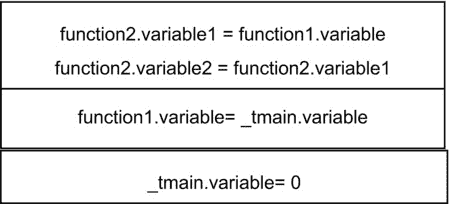
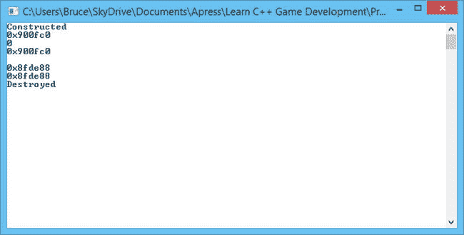

# 一、为游戏开发者管理内存

内存管理是游戏开发中一个非常重要的话题。所有游戏都会经历一段内存不足的发展时期，美术团队需要更多额外的纹理或网格。内存的布局方式对游戏的性能也至关重要。了解何时使用堆栈内存，何时使用堆内存，以及每种内存的性能含义，对于优化程序的缓存一致性和数据局部性来说是非常重要的因素。在你理解如何处理这些问题之前，你需要理解 C++ 程序存储数据的不同位置。

在 C++ 中有三个地方可以存储内存:一个静态空间用于存储静态变量，一个堆栈用于存储局部变量和函数参数，还有一个堆(或自由存储区),从这里可以动态地为不同的目的分配内存。

## 静态存储装置

静态内存是由编译器处理的，没有太多要说的。当您使用编译器构建程序时，它会留出一块足够大的内存来存储程序中定义的所有静态和全局变量。这包括源代码中的字符串，它们包含在静态内存的一个区域中，称为字符串表。

关于静态内存没有什么可说的，所以我们将继续讨论堆栈。

## C++ 堆栈内存模型

堆栈更难理解。每次调用函数时，编译器都会在后台生成代码，为被调用函数的参数和局部变量分配内存。清单 1-1 显示了一些简单的代码，然后我们用它们来解释栈是如何工作的。

清单 1-1。一个简单的 C++ 程序

`void function2(int variable1)`

`{`

`int variable2{ variable1 };`

`}`

`void function1(int variable)`

`{`

`function2(variable);`

`}`

`int _tmain(int argc, _TCHAR* argv[])`

`{`

`int variable{ 0 };`

`function1(variable);`

`return 0;`

`}`

清单 1-1 中的程序非常简单:它以`_tmain`开始，?? 调用`function1`，?? 调用`function2`。图 1-1 展示了主函数的堆栈。

图 1-1。

The stack for `tmain`

`main`的堆栈空间非常简单。它为名为`variable`的局部变量提供了一个单独的存储空间。这些用于单个函数的堆栈空间被称为堆栈帧。当`function1`被调用时，一个新的堆栈框架被创建在`_tmain`的现有框架之上。图 1-2 显示了这一点。

图 1-2。

The added stack frame for `function1`

当编译器创建代码将`function1`的堆栈帧推送到堆栈上时，它还确保参数`variable`用来自`_tmain`的`variable`中存储的值初始化。这就是参数通过值传递的方式。最后，图 1-3 显示了添加到堆栈中的`function2`的最后一个堆栈帧。

图 1-3。

The complete stack frame

最后一个堆栈帧稍微复杂一些，但是你应该能够看到`_tmain`中的文字值 0 是如何沿着堆栈传递的，直到它最终被用来初始化`function2`中的`variable2`。

剩下的堆栈操作相对简单。当`function2`返回堆栈时，为该调用生成的帧从堆栈中弹出。这使我们回到图 1-2 所示的状态，当`function1`返回时，我们回到图 1-1 所示的状态。要理解 C++ 中堆栈的基本功能，你只需要知道这些。

不幸的是，事情实际上没有这么简单。C++ 中的堆栈是一件非常复杂的事情，要完全理解它需要一点汇编编程知识。这个主题超出了一本针对初学者的书的范围，但是一旦你掌握了基础知识，它就非常值得一读。《游戏开发者杂志》2012 年 9 月版中的文章《程序员反汇编》是一篇关于 x86 堆栈操作的优秀入门文章，值得一读，可从 [`http://www.gdcvault.com/gdmag`](http://www.gdcvault.com/gdmag) 免费获得。

这一章并没有涉及栈中引用和指针是如何处理的，或者返回值是如何实现的。一旦你开始思考这个问题，你可能会开始理解它有多复杂。您可能还想知道为什么理解堆栈的工作方式是有用的。答案在于试图找出为什么你的游戏一旦进入真实环境就会崩溃。在开发过程中，找出游戏崩溃的原因是相对容易的，因为您可以在调试器中简单地重现崩溃。在已经启动的游戏上，您可能会收到一个称为崩溃转储的文件，它没有任何调试信息，只是有堆栈的当前状态。此时，您需要从构建中查找符号文件，以便计算出被调用函数的内存地址，然后您可以手动计算出哪些函数是从堆栈中的地址调用的，并尝试计算出哪个函数在堆栈中传递了无效的内存地址值。

这是一项复杂且耗时的工作，但在专业游戏开发中确实经常出现。iOS 和 Android 的 Crashlytics 或 Windows PC 程序的 BugSentry 等服务可以上传崩溃转储，并在 web 服务上为您提供调用堆栈，以帮助减轻手动解决游戏问题的痛苦。

C++ 中内存管理的下一个大主题是堆。

## 使用堆内存

手动管理动态分配的内存有时很有挑战性，比使用堆栈内存要慢，而且经常是不必要的。一旦你开始编写从外部文件加载数据的游戏，管理动态内存对你来说将变得更加重要，因为通常不可能知道你在编译时需要多少内存。我开发的第一个游戏完全阻止了程序员分配动态内存。我们通过分配对象数组并在用完时重用这些数组中的内存来解决这个问题。这是避免分配内存的性能成本的一种方法。

分配内存是一项开销很大的操作，因为它必须尽可能地防止内存损坏。在现代多处理器 CPU 架构上尤其如此，在这种架构中，多个 CPU 可能会同时尝试分配相同的内存。本章并不打算成为游戏开发中内存分配技术的详尽资源，而是介绍管理堆内存的概念。

清单 1-2 显示了一个使用`new`和`delete`操作符的简单程序。

清单 1-2。为一个`class`动态分配内存

`class Simple`

`{`

`private:`

`int variable{ 0 };`

`public:`

`Simple()`

`{`

`std::cout << "Constructed" << std::endl;`

`}`

`∼Simple()`

`{`

`std::cout << "Destroyed" << std::endl;`

`}`

`};`

`int _tmain(int argc, _TCHAR* argv[])`

`{`

`Simple* pSimple = new Simple();`

`delete pSimple;`

`pSimple = nullptr;`

`return 0;`

`}`

这个简单的程序展示了`new`和`delete`的运行。当你决定在 C++ 中使用`new`操作符分配内存时，所需的内存量是自动计算的。清单 1-2 中的`new`操作符将保留足够的内存来存储`Simple`对象及其成员变量。如果你向`Simple`添加更多的成员或者从另一个类继承它，程序仍然会运行，并且会为扩展的类定义保留足够的内存。

new 运算符返回一个指针，指向您请求分配的内存。一旦你有了一个指向动态分配的内存的指针，你就有责任确保这个内存也被适当地释放。您可以看到这是通过将指针传递给`delete`操作符来完成的。`delete`操作符负责告诉操作系统，我们预留的内存不再使用，可以用于其他用途。当指针被设置为存储`nullptr`时，最后一项内务处理就完成了。通过这样做，我们有助于防止我们的代码假设指针仍然有效，我们可以从内存中读取和写入，就好像它仍然是一个`Simple`对象。如果你的程序以看似随机和莫名其妙的方式崩溃，从没有被清除的指针访问释放的内存是一个常见的嫌疑。

分配单个对象时使用标准的`new`和`delete`运算符；然而，在分配和释放数组时，也应该使用特定的`new`和`delete`操作符。这些如清单 1-3 所示。

清单 1-3。数组`new`和`delete`

`int* pIntArray = new int[16];`

`delete[] pIntArray;`

对`new`的调用将分配 64 字节的内存来存储 16 个`int`变量，并返回一个指向第一个元素地址的指针。您使用`new[]`操作符分配的任何内存都应该使用`delete[]`操作符删除，因为使用标准的`delete`会导致您请求的内存不能全部被释放。

Note

没有释放内存和没有正确释放内存被称为内存泄漏。以这种方式泄漏内存是不好的，因为您的程序最终将耗尽可用内存并崩溃，因为它最终将没有任何可用内存来完成新的分配。

希望您能从这段代码中明白为什么使用可用的 STL 类来避免自己管理内存是有益的。如果您发现自己不得不手动分配内存，STL 还提供了`unique_ptr`和`shared_ptr`模板来帮助您在适当的时候删除内存。清单 1-4 更新了清单 1-2 和清单 1-3 中的代码，使用了`unique_ptr`和`shared_ptr`对象。

清单 1-4。使用`unique_ptr`和`shared_` `ptr`

`#include <memory>`

`class Simple`

`{`

`private:`

`int variable{ 0 };`

`public:`

`Simple()`

`{`

`std::cout << "Constructed" << std::endl;`

`}`

`∼Simple()`

`{`

`std::cout << "Destroyed" << std::endl;`

`}`

`};`

`int _tmain(int argc, _TCHAR* argv[])`

`{`

`using UniqueSimplePtr = std::unique_ptr<Simple>;`

`UniqueSimplePtr pSimple1{ new Simple() };`

`std::cout << pSimple1.get() << std::endl;`

`UniqueSimplePtr pSimple2;`

`pSimple2.swap(pSimple1);`

`std::cout << pSimple1.get() << std::endl;`

`std::cout << pSimple2.get() << std::endl;`

`using IntSharedPtr = std::shared_ptr<int>;`

`IntSharedPtr pIntArray1{ new int[16] };`

`IntSharedPtr pIntArray2{ pIntArray1 };`

`std::cout << std::endl << pIntArray1.get() << std::endl;`

`std::cout << pIntArray2.get() << std::endl;`

`return 0;`

`}`

顾名思义，`unique_ptr`用于确保一次只有一个对已分配内存的引用。清单 1-3 展示了这一点。`pSimple1`被赋予一个`new Simple`指针，然后`pSimple2`被创建为空。你可以尝试通过传递`pSimple1`或者使用赋值操作符来初始化`pSimple2`，你的代码将无法编译。将指针从一个`unique_ptr`实例传递到另一个实例的唯一方法是使用`swap`方法。`swap`方法移动存储的地址，并将原始`unique_ptr`实例中的指针设置为`nullptr`。图 1-4 中输出的前三行显示了存储在`unique_ptr`实例中的地址。

图 1-4。

The output from Listing 1-4

这个输出显示调用了来自`Simple`类的构造器。在调用`swap`之前，存储在`pSimple1`中的指针被打印出来。在对`swap pSimple1`的调用之后，存储一个作为`00000000`输出的`nullptr`，并且`pSimple2`存储最初保存在那里的地址。输出的最后一行显示还调用了`Simple`对象的析构函数。这是我们从使用`unique_ptr`和`shared_ptr`中得到的另一个好处:一旦对象超出范围，内存就会自动释放。

您可以从包含`Destroyed`的行之前的两行输出中看到，两个`shared_ptr`实例可以存储对同一个指针的引用。只有一个`unique_ptr`可以引用一个内存位置，但是多个`shared_ptr`实例可以引用一个地址。这种差异体现在对内存存储的删除调用的时间上。一旦超出范围，`unique_ptr`就会删除它引用的内存。它可以这样做，因为`unique_ptr`可以确保它是引用该内存的唯一对象。另一方面，A `shared_ptr`在超出范围时不会删除内存；相反，当指向该地址的所有`shared_ptr`对象不再被使用时，内存被删除。

这确实需要一点训练，就好像你在这些对象上使用`get`方法来访问指针，那么你仍然可以在内存被删除后引用它。如果你正在使用`unique_ptr`或`shared_ptr`，确保你只是使用提供的`swap`和模板提供的其他访问器方法来传递指针，而不是手动使用`get`方法。

## 编写一个基本的单线程内存分配器

本节将向您展示如何重载`new`和`delete`操作符来创建一个非常基本的内存管理系统。这个系统将有很多缺点:它将在一个静态数组中存储有限数量的内存，它将遭受内存碎片问题，并且它还将泄漏任何释放的内存。这一节只是对分配内存时发生的一些过程的介绍，并强调了一些使编写一个功能完整的内存管理器成为一项困难任务的问题。

清单 1-5 首先向您展示了一个结构，它将被用作内存分配的标题。

清单 1-5。`MemoryAllocation` `Header struct`

`struct MemoryAllocationHeader`

`{`

`void* pStart{ nullptr };`

`void* pNextFree{ nullptr };`

`size_t size{ 0 };`

`};`

这个`struct`在`pStart void*`变量中存储一个指向返回给用户的内存的指针，在`pNextFree`指针中存储一个指向下一个空闲内存块的指针，在`size`变量中存储分配内存的大小。

我们的内存管理器不会使用动态内存来为用户程序分配内存。相反，它将从静态数组中返回一个地址。这个数组是在清单 1-6 所示的未命名空间中创建的。

清单 1-6。未命名的`namespace`来自`Chapter1-MemoryAllocator.cpp`

`namespace`

`{`

`const unsigned int ONE_MEGABYTE = 1024 * 1024 * 1024;`

`char pMemoryHeap[ONE_MEGABYTE];`

`const size_t SIZE_OF_MEMORY_HEADER = sizeof(MemoryAllocationHeader);`

`}`

这里你可以看到我们分配了一个 1 MB 大小的静态数组。我们知道这是 1 MB，因为在大多数平台上,`char`类型的大小是一个字节，我们分配的数组大小是 1，024 字节乘以 1，024 KB，总共是 1，048，576 字节。未命名的名称空间也有一个常量，存储我们的`MemoryAllocationHeader`对象的大小，使用`sizeof`函数计算。这个大小是 12 个字节:4 个字节用于`pStart`指针，4 个字节用于`pNextFree`指针，4 个字节用于`size`变量。

下一段重要的代码重载了新的操作符。到目前为止，您看到的`new`和`delete`函数都是可以隐藏的函数，就像您可以用自己的实现隐藏任何其他函数一样。清单 1-7 展示了我们的新函数。

清单 1-7。重载的`new`函数

`void* operator new(size_t size)`

`{`

`MemoryAllocationHeader* pHeader =`

`reinterpret_cast<MemoryAllocationHeader*>(pMemoryHeap);`

`while (pHeader != nullptr && pHeader->pNextFree != nullptr)`

`{`

`pHeader = reinterpret_cast<MemoryAllocationHeader*>(pHeader->pNextFree);`

`}`

`pHeader->pStart = reinterpret_cast<char*>(pHeader)+SIZE_OF_MEMORY_HEADER;`

`pHeader->pNextFree = reinterpret_cast<char*>(pHeader->pStart) + size;`

`pHeader->size = size;`

`return pHeader->pStart;`

`}`

向`new`操作符传递我们想要保留的分配的`size`,并向用户可以写入的内存块的开头返回一个`void*`。该函数首先遍历现有的内存分配，直到找到第一个在`pNextFree`变量中带有`nullptr`的分配块。

一旦找到一个空闲内存块，`pStart`指针被初始化为空闲内存块的地址加上内存分配头的大小。这确保了每个分配也包括用于分配的`pStart`和`pNextFree`指针以及`size`的空间。新函数通过返回存储在`pHeader->pStart`中的值来结束，确保用户不知道关于`MemoryAllocationHeader struct`的任何事情。他们只是收到一个指向他们所请求的`size`的内存块的指针。

一旦我们分配了内存，我们也可以释放内存。在清单 1-8 中，重载的`delete`操作符从我们的堆中清除分配。

清单 1-8。重载的`delete`函数

`void operator delete(void* pMemory)`

`{`

`MemoryAllocationHeader* pLast = nullptr;`

`MemoryAllocationHeader* pCurrent =`

`reinterpret_cast<MemoryAllocationHeader*>(pMemoryHeap);`

`while (pCurrent != nullptr && pCurrent->pStart != pMemory)`

`{`

`pLast = pCurrent;`

`pCurrent = reinterpret_cast<MemoryAllocationHeader*>(pCurrent->pNextFree);`

`}`

`if (pLast != nullptr)`

`{`

`pLast->pNextFree = reinterpret_cast<char*>(pCurrent->pNextFree);`

`}`

`pCurrent->pStart = nullptr;`

`pCurrent->pNextFree = nullptr;`

`pCurrent->size = 0;`

`}`

这个操作符使用两个指针`pLast`和`pCurrent`遍历堆。遍历堆，直到传入`pMemory`的指针与存储在`MemoryAllocationHeader struct`的`pStart`指针中的分配内存块相匹配。一旦我们找到匹配的分配，我们设置`pNextFree`指针指向存储在`pCurrent->pNextFree`中的地址。这是我们制造两个问题的地方。我们通过在另外两个已分配内存块之间释放内存来对内存进行分段，这意味着只有相同大小或更小的分配才能从这个内存块中填充。在这个例子中，碎片是多余的，因为我们没有实现任何跟踪空闲内存块的方法。一种选择是使用一个列表来存储所有的空闲块，而不是将它们存储在内存分配头本身中。编写一个全功能的内存分配器是一项复杂的任务，可以写满一整本书。

Note

你可以看到我们有一个在`new`和`delete`操作符中使用`reinterpret_cast`的有效案例。这种类型的演员没有多少有效的案例。在这种情况下，我们希望使用不同的类型来表示相同的内存地址，因此`reinterpret_cast`是正确的选项。

清单 1-9 包含了这个部分的最后一个内存函数，它用于打印出堆中所有活动的`MemoryAllocationHeader`对象的内容。

清单 1-9。`PrintAllocations`功能

`void PrintAllocations()`

`{`

`MemoryAllocationHeader* pHeader =`

`reinterpret_cast<MemoryAllocationHeader*>(pMemoryHeap);`

`while (pHeader != nullptr)`

`{`

`std::cout << pHeader << std::endl;`

`std::cout << pHeader->pStart << std::endl;`

`std::cout << pHeader->pNextFree << std::endl;`

`std::cout << pHeader->size << std::endl;`

`pHeader = reinterpret_cast<MemoryAllocationHeader*>(pHeader->pNextFree);`

`std::cout << std::endl << std::endl;`

`}`

`}`

这个函数循环遍历我们头脑中所有有效的`MemoryAllocationHeader`指针，并打印它们的`pStart`、`pNextFree`和`size`变量。清单 1-10 显示了一个使用这些函数的示例`main`函数。

清单 1-10。使用内存堆

`int _tmain(int argc, _TCHAR* argv[])`

`{`

`memset(pMemoryHeap, 0, SIZE_OF_MEMORY_HEADER);`

`PrintAllocations();`

`Simple* pSimple1 = new Simple();`

`PrintAllocations();`

`Simple* pSimple2 = new Simple();`

`PrintAllocations();`

`Simple* pSimple3 = new Simple();`

`PrintAllocations();`

`delete pSimple2;`

`pSimple2 = nullptr;`

`PrintAllocations();`

`pSimple2 = new Simple();`

`PrintAllocations();`

`delete pSimple2;`

`pSimple2 = nullptr;`

`PrintAllocations();`

`delete pSimple3;`

`pSimple3 = nullptr;`

`PrintAllocations();`

`delete pSimple1;`

`pSimple1 = nullptr;`

`PrintAllocations();`

`return 0;`

`}`

这是一个非常简单的函数。首先使用`memset`函数初始化内存堆的前 12 个字节。`memset`的工作原理是获取一个地址，然后是要使用的值，然后是要设置的字节数。然后将每个字节设置为作为第二个参数传递的字节值。在我们的例子中，我们将`pMemoryHeap`的前 12 个字节设置为`0`。

然后我们第一次调用`PrintAllocations`，我运行的输出如下。

`0x00870320`

`0x00000000`

`0x00000000`

`0`

第一行是`MemoryAllocationHeader struct`的地址，对于我们的第一次调用，它也是存储在`pMemoryHeap`中的地址。下一行是存储在`pStart`，然后是`pNextFree`，然后是`size`的值。这些都是`0`因为我们还没有做任何分配。内存地址被打印为 32 位十六进制值。

然后分配我们的第一个`Simple`对象。原来因为`Simple`类只包含一个`int`变量，我们只需要分配 4 个字节来存储它。第二个`PrintAllocations`调用的输出证实了这一点。

`Constructed`

`0x00870320`

`0x0087032C`

`0x00870330`

`4`

`0x00870330`

`0x00000000`

`0x00000000`

`0`

我们可以看到`Constructed`文本，它被打印在`Simple`类的构造器中，然后我们的第一个`MemoryAllocationHeader struct`被填充。第一次分配的地址保持不变，因为它是堆的开始。`pStart`变量从开头之后的 12 个字节开始存储地址，因为我们已经留有足够的空间来存储头。`pNextFree`变量存储添加存储`pSimple`变量所需的 4 个字节后的地址，size 变量存储从 size 传递到`new`的`4`。然后，我们得到第一个空闲块的打印输出，从`00870330`开始，方便地在第一个之后 16 个字节。

然后程序分配另外两个`Simple`对象来产生下面的输出。

`Constructed`

`0x00870320`

`0x0087032C`

`0x00870330`

`4`

`0x00870330`

`0x0087033C`

`0x00870340`

`4`

`0x00870340`

`0x0087034C`

`0x00870350`

`4`

`0x00870350`

`0x00000000`

`0x00000000`

`0`

在这个输出中，您可以看到三个分配的 4 字节对象，以及每个分配头中的每个起始地址和下一个地址。删除第二个对象后，输出会再次更新。

`Destroyed`

`0x00870320`

`0x0087032C`

`0x00870340`

`4`

`0x00870340`

`0x0087034C`

`0x00870350`

`4`

`0x00870350`

`0x00000000`

`0x00000000`

`0`

第一个分配的对象现在指向第三个，第二个分配的对象已经从堆中移除。分配第四个对象只是为了看看会发生什么。

`Constructed`

`0x00870320`

`0x0087032C`

`0x00870340`

`4`

`0x00870340`

`0x0087034C`

`0x00870350`

`4`

`0x00870350`

`0x0087035C`

`0x00870360`

`4`

`0x00870360`

`0x00000000`

`0x00000000`

`0`

此时`pSimple1`存储在地址`0x0087032C`，`pSimple2`在`0x0087035C`，`pSimple3`在`0x0087034C`。然后，程序通过逐个删除每个分配的对象而结束。

尽管存在一些问题，会妨碍您在生产代码中使用这个内存管理器，但它确实是一个关于堆如何操作的有用示例。使用某种跟踪分配的方法，以便内存管理系统可以知道哪个内存正在使用，哪个内存可以自由分配。

## 摘要

本章已经给了你一个非常简单的 C++ 内存管理模型的介绍。您已经看到，您的程序将使用静态内存、堆栈内存和堆内存来存储游戏要使用的对象和数据。

静态内存和堆栈内存是由编译器自动处理的，您已经使用过这些类型的内存，而不需要做任何特别的事情。堆内存具有较高的管理开销，因为它要求您在用完内存后也释放内存。您已经看到 STL 提供了`unique_ptr`和`shared_ptr`模板来帮助自动管理动态内存分配。最后，向您介绍了一个简单的内存管理器。这个内存管理器可能不适合生产代码，但它确实为您提供了如何从堆中分配内存以及如何重载全局`new`和`delete`方法来挂钩您自己的内存管理器的概述。

要扩展这个内存管理器的功能，需要增加对重新分配空闲块的支持，对堆中连续的空闲块进行碎片整理，并最终确保分配系统是线程安全的。现代游戏也倾向于创建多个堆来服务于不同的目的。游戏创建内存分配器来处理网格数据、纹理、音频和在线系统并不少见。还可以有线程安全的分配器和非线程安全的分配器，它们可以用在不止一个线程进行内存访问的情况下。复杂的内存管理系统也有小块分配器来处理特定大小以下的内存请求，以帮助减轻内存碎片，这可能是由 STL 为字符串存储等频繁进行的小分配引起的。正如你所看到的，现代游戏中的内存管理是一个远比这一章所能涵盖的更复杂的问题。