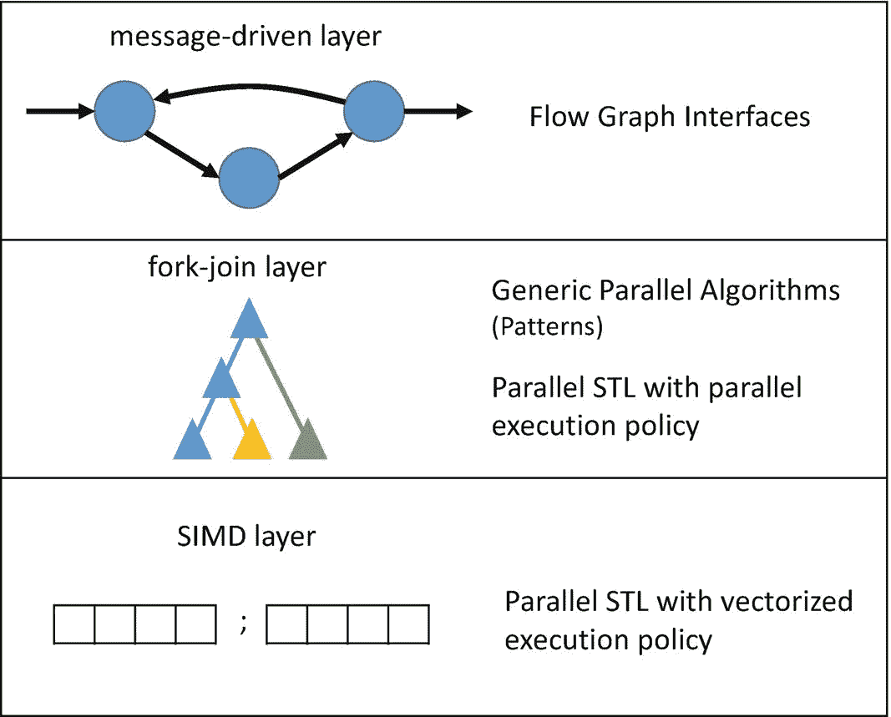
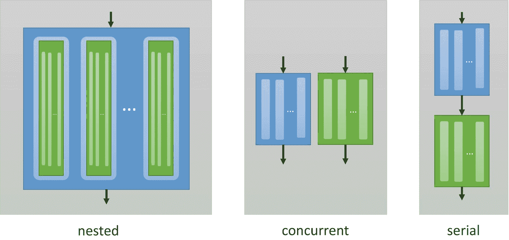
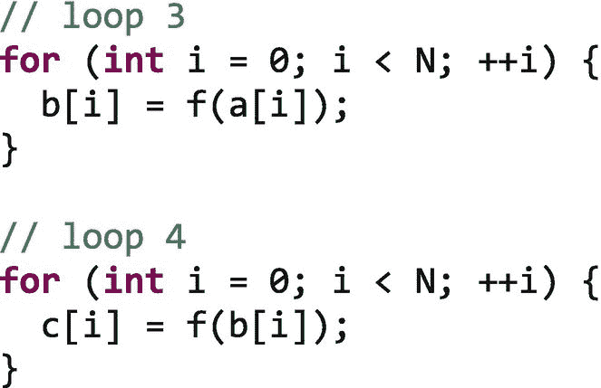
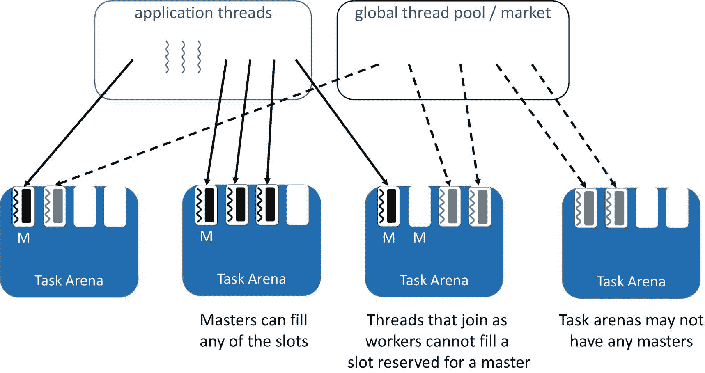
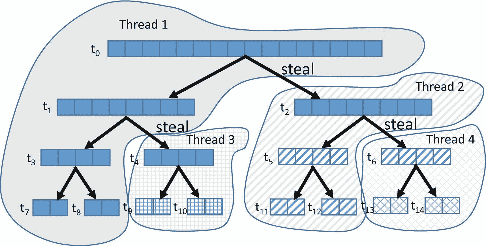
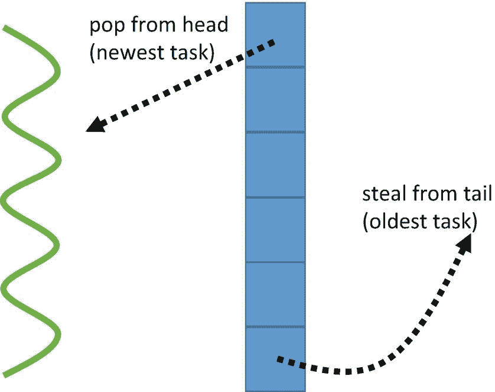
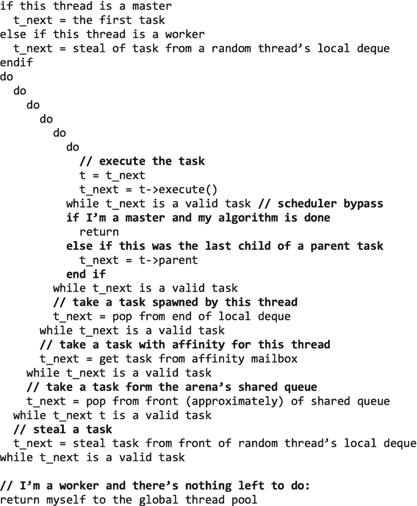
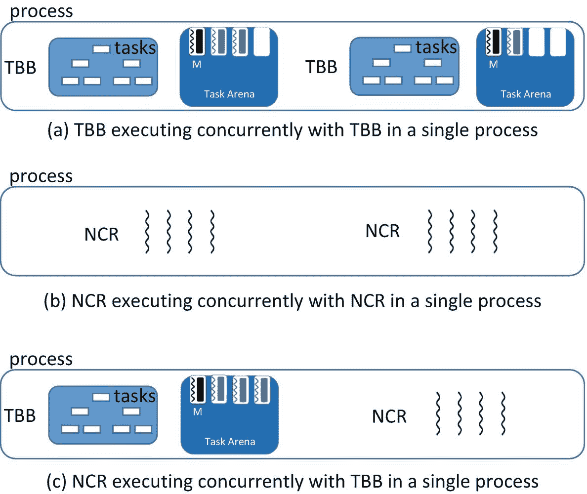
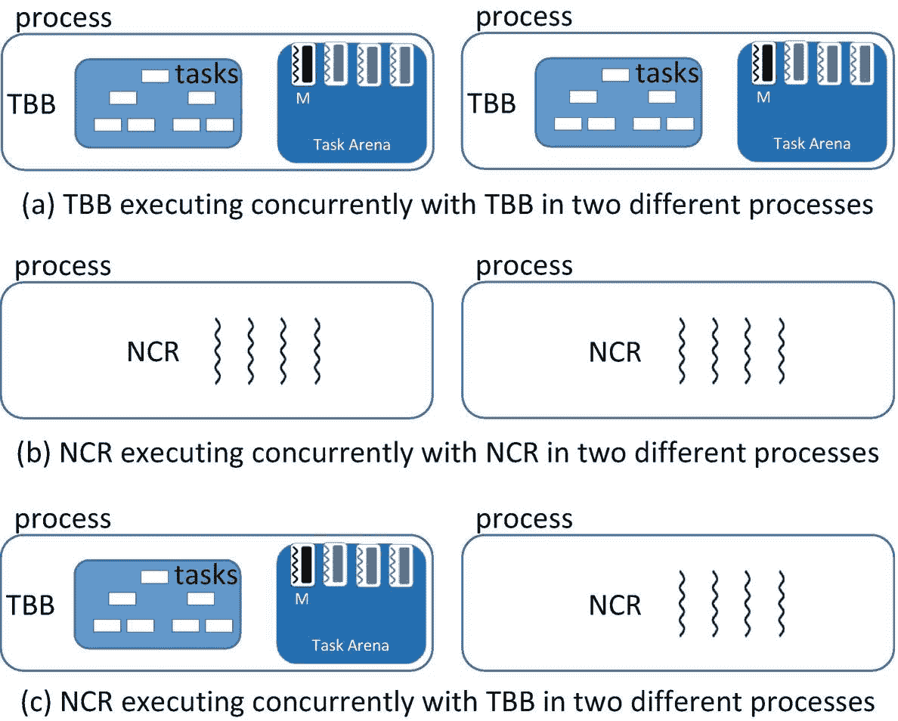

# 九、可组合性的支柱

在这一章中，我们讨论可组合性:它是什么，什么特征使线程构建模块(TBB)成为可组合的线程库，以及如何使用像 TBB 这样的库来创建可伸缩的应用程序。C++ 是一种可组合的语言，TBB 以一种保持可组合性的方式增加了并行性。与 TBB 的可组合性是非常有价值的，因为这意味着我们可以自由地暴露并行的机会，而不用担心系统过载。如果我们不公开并行性，我们就限制了伸缩性。

最终，当我们说 TBB 是一个可组合的并行库时，我们的意思是开发者可以在任何他们想要的地方混合和匹配使用 TBB 的代码。TBB 的这些用法可以是连续的，一个接一个；它们可以嵌套；它们可以是并发的；它们可以都在单个单片应用程序中；它们可以分布在不相交的库中；或者它们可以在同时执行的不同进程中。

并行编程模型通常具有在复杂应用程序中难以管理的限制，这一点可能并不明显。想象一下，如果我们不能在"`if`"语句中使用"`while`"语句，即使是在我们调用的函数中间接使用。在 TBB 之前，一些并行编程模型也存在同样困难的限制，比如 OpenMP。即使是较新的 OpenCL 标准也缺乏完全的可组合性。

不可组合的并行编程模型最令人沮丧的一面是要求过多的并行性。这太可怕了，而这正是 TBB 所避免的。根据我们的经验，不可组合模型的天真用户经常过度使用并行性——他们的程序会因为内存使用的爆炸而崩溃，或者因为无法承受的同步开销而慢如蜗牛。对这些问题的担心会导致有经验的程序员暴露太少的并行性，从而导致负载不平衡和扩展性差。使用可组合编程模型可以避免担心这种困难的平衡行为。

可组合性使得 TBB 在简单和复杂的应用程序中都非常可靠。可组合性是一种设计理念，它允许我们创建更具可伸缩性的程序，因为我们可以无所畏惧地公开并行性。在第一章中，我们介绍了在许多应用中常见的三层并行蛋糕的概念，如图 9-1 所示。

图 9-1

应用中常见的三个并行层，以及它们如何映射到高级 TBB 并行执行接口

我们在第二章的通用并行算法中介绍了图 9-1 所示的高级接口的基础知识，在第三章介绍了流程图，在第四章介绍了并行 STL。这些高级接口中的每一个都在构建这些并行层中扮演着重要的角色。因为它们都是使用 TBB 任务实现的，而 TBB 是可组合的，所以我们可以安全地将它们组合在一起，形成复杂的、可扩展的应用程序。

## 什么是可组合性？

不幸的是，可组合性不是编程模型简单的是或否属性。尽管 OpenMP 已经知道嵌套并行的可组合性问题，但是将 OpenMP 标记为不可组合的编程模型是不正确的。如果一个应用程序一个接一个地连续调用 OpenMP 构造，这种连续组合工作得很好。同样，如果说 TBB 是一个完全可组合的编程模型，在任何情况下都能与所有其他并行编程模型很好地协作，那也是言过其实。更准确地说，可组合性是对两个编程模型以特定方式组合时表现如何的度量。

例如，让我们考虑两个并行编程模型:模型`A`和模型`B`。让我们将`T` `A` 定义为一个内核使用模型`A`表示外层并行时的吞吐量，将`T` `B` 定义为同一个内核使用模型 B(不使用模型`A`)表示内层并行时的吞吐量。如果编程模型是可组合的，我们会期望使用外部和内部并行的内核的吞吐量为`T``AB``>= max(T``A``, T``B``)``T``AB`比`max(T``A``, T``)`大多少，这取决于模型相互组合的效率和物理属性

图 9-2 显示了我们可以用来组合软件结构的三种通用组合类型:嵌套执行、并发执行和串行执行。我们说 TBB 是一个可组合的线程库，因为当一个使用 TBB 的并行算法以图 9-2 所示的三种方式之一与其他并行算法组合时，产生的代码执行良好，即`T``TBB+Other``>= max(T``TBB``, T``Other``)`。

图 9-2

组成软件结构的方式

在我们讨论导致良好可组合性的 TBB 特性之前，让我们看看每种组合类型，可能出现的问题，以及我们可以预期的性能影响。

### 嵌套组合

在*嵌套*组合中，机器在另一个并行算法中执行一个并行算法。嵌套组合的目的几乎总是增加额外的并行性，它甚至可以成倍地增加可以并行执行的工作量，如图 9-3 所示。有效处理嵌套并行是 TBB 设计的主要目标。

图 9-3

嵌套并行会导致可用并行任务的数量呈指数级增长(或者当使用不可组合的库、线程时)

事实上，TBB 库提供的算法在许多情况下依赖于嵌套并行，以便创建可扩展的并行。例如，在第二章中，我们讨论了如何使用嵌套调用 TBB 的`parallel_invoke`来创建可伸缩的并行版本的快速排序。线程构建模块库的设计初衷是成为嵌套并行的有效执行者。

与 TBB 相反，在嵌套并行的情况下，其他并行模型的性能可能会非常糟糕。一个具体的例子是 OpenMP API。OpenMP 是一种广泛用于共享内存并行的编程模型，对于单级并行非常有效。然而，对于嵌套并行来说，这是一个众所周知的坏模型，因为强制并行是其定义中不可分割的一部分。在具有多级并行的应用中，每个 OpenMP 并行结构都会创建一个额外的线程组。每个线程分配堆栈空间，也需要由操作系统的线程调度程序进行调度。如果线程数量非常大，应用程序可能会耗尽内存。如果线程数量超过逻辑核心数量，线程必须共享核心。一旦线程数量超过内核数量，由于硬件资源的超额预订，它们往往不会带来什么好处，只会增加开销。

对于 OpenMP 的嵌套并行，最实际的选择通常是完全关闭嵌套并行。事实上，OpenMP API 提供了一个环境变量`OMP_NESTED`，用于打开或关闭嵌套并行性。因为 TBB 放宽了顺序语义，使用任务而不是线程来表示并行性，所以它可以灵活地使并行性适应可用的硬件资源。我们可以放心地让嵌套并行在 TBB 上运行——在 TBB 不需要关闭并行的机制！

在本章的后面，我们将讨论 TBB 在执行嵌套并行时非常有效的关键特性，包括它的线程池和工作窃取任务调度器。在第八章中，我们将嵌套视为并行编程中一个非常重要的重复主题(模式)。在第十二章中，我们将讨论一些特性，这些特性允许我们在执行嵌套并行时影响 TBB 库的行为，以创建隔离并改善数据局部性。

### 并发合成

如图 9-4 ，*并发*合成是当并行算法的执行在时间上重叠时。并发组合可用于有意增加额外的并行性，或者当两个不相关的应用程序(或同一程序中的构造)在同一系统上并发执行时，它可能偶然出现。并发和并行执行并不总是一回事！如图 9-3 ，*并发执行*是多个构造在同一时间段内执行，而*并行执行*是多个构造同时执行。这意味着并行执行是并发执行的一种形式，但并发执行并不总是并行执行。当并发组合被有效地转化为并行执行时，它可以提高性能。

图 9-4

并行与并发执行

图 9-5 中两个循环的并发组合是指循环 1 的并行实现与循环 2 的并行实现同时执行，无论是在两个不同的进程中，还是在同一进程的两个不同线程中。

图 9-5

并发执行的两个循环

当并发执行构造时，仲裁器(像 TBB、操作系统或系统的某种组合这样的运行时库)负责将系统资源分配给不同的构造。如果这两个构造需要同时访问相同的资源，那么对这些资源的访问必须是交叉的。

并发组合的良好性能可能意味着挂钟执行时间与执行运行时间最长的构造的时间一样短，因为所有其他构造都可以与它并行执行(如图 9-4 中的并行执行)。或者，良好的性能可能意味着挂钟执行时间不会长于所有结构的执行时间之和，如果执行需要交错的话(如图 9-4 中的并发执行)。但是没有一个系统是理想的，破坏性和建设性的干扰源使我们不可能获得与这两种情况完全匹配的性能。

首先，仲裁成本增加了。例如，如果仲裁器是 OS 线程调度器，那么这将包括调度算法的开销；抢占式多任务的开销，比如切换线程上下文；以及操作系统的安全和隔离机制的开销。如果仲裁器是像 TBB 这样的用户级库中的任务调度器，那么这个开销就仅限于将任务调度到线程上的开销。如果我们表达非常细粒度的工作，使用调度到一小组线程上的许多任务比直接使用许多线程具有低得多的调度开销，即使任务最终在线程之上执行。

其次，并发使用共享的系统资源(如功能单元、内存和数据缓存)会影响性能。例如，结构的重叠执行会导致数据缓存性能的变化——通常会增加缓存未命中，但在极少数建设性干扰的情况下，甚至可能会减少缓存未命中。

TBB 的线程池及其窃取工作的任务调度程序(将在本章后面讨论)也有助于并发合成，减少仲裁开销，并且在许多情况下导致优化资源使用的任务分配。如果 TBB 的默认行为不令人满意，可以根据需要使用第 11–14 章中描述的功能来减轻资源共享的负面影响。

### 连续合成

组合两个构造的最后一种方法是顺序执行它们，一个接一个，不要在时间上重叠。这看起来似乎是一种对性能没有影响的微不足道的组合，但(不幸的是)事实并非如此。当我们使用串行组合时，我们通常期望良好的性能意味着两个构造之间没有干扰。

例如，如果我们考虑图 9-6 中的循环，串行组合是先执行循环 3，然后执行循环 4。我们可能会认为，当串行执行时，完成每个并行构造的时间与单独执行同一个构造的时间没有什么不同。如果在使用并行编程模型 A 添加并行性之后单独执行循环 3 所花费的时间是`t` `3,A` ，并且使用并行编程模型 B 单独执行循环 4 所花费的时间是`t` `4,B` ，那么我们将期望连续执行构造的总时间不超过每个构造、`t``3,A``+ t``4,B`的次数之和。

图 9-6

一个接一个执行的两个循环

然而，与并发组合一样，可能会出现破坏性和建设性的干扰，并导致实际执行时间偏离这个简单的预期。

在串行组合中，应用程序必须从一个并行结构过渡到下一个。图 9-7 显示了使用相同或不同的并行编程模型时，结构之间的理想和非理想转换。在这两种理想情况下，都没有开销，我们可以立即从一个构造转移到下一个。实际上，在并行执行一个构造之后，通常需要一些时间来清理资源，在执行下一个构造之前，也需要一些时间来准备资源。

图 9-7

在不同构造的执行之间转换

当使用相同的模型时，如图 9-7(b) 所示，运行时库可能会关闭并行运行时，但不得不立即再次启动它。在图 9-7(d) 中，我们看到如果两个不同的模型被用于构造，它们可能不知道彼此，因此第一个构造的关闭和下一个构造的启动，甚至执行可能重叠，也许降低性能。这两种情况都可以进行优化——TBB 在设计时就考虑到了这些转变。

与任何组合一样，性能会受到两个结构之间共享资源的影响。与嵌套或并发组合不同，这些构造不会同时或以交错方式共享资源，但一个构造完成后资源的结束状态仍然会影响下一个构造的性能。例如，在图 9-6 中，我们可以看到循环 3 写入数组`b`，然后循环 4 读取数组`b`。将循环 3 和 4 中的相同迭代分配给相同的内核可能会提高数据局部性，从而减少缓存未命中。相比之下，将相同的迭代分配给不同的内核会导致不必要的缓存缺失。

## 使 TBB 成为可组合库的特性

根据设计，线程构建模块(TBB)库是一个可组合库。当它在 10 年前首次推出时，人们认识到，作为一个面向所有开发人员的并行编程库——不仅仅是平面、单一应用程序的开发人员——它必须正面解决可组合性的挑战。使用 TBB 的应用程序通常是模块化的，并利用第三方库，这些库本身可能包含并行性。这些其他并行算法可能有意或无意地与使用 TBB 库的算法组合在一起。此外，应用程序通常在多程序环境中执行，例如在共享服务器或个人笔记本电脑上，其中多个进程同时执行。为了成为一个对所有开发者都有效的并行编程库，TBB 必须要有正确的可组合性。确实如此。

虽然使用 TBB 的特性创建可伸缩的并行应用程序并不需要详细了解它的设计，但我们在这一节中为感兴趣的读者提供了一些细节。如果你足够高兴地相信 TBB 做了正确的事情，并且对如何做不太感兴趣，那么你可以放心地跳过这一节的其余部分。如果没有，请继续阅读，了解为什么 TBB 在可组合性方面如此有效。

### TBB 线程池(市场)和任务竞技场

线程构建模块库的两个主要负责其可组合性的特性是其*全局线程池(市场)*和*任务舞台*。图 9-8 显示了在一个只有一个主线程的应用程序中，全局线程池和一个默认任务舞台是如何交互的；为简单起见，我们假设目标系统上有`P=4`个逻辑核心。图 9-8(a) 显示应用程序有`1`个应用程序线程(主线程)和一个用`P-1`线程初始化的全局线程工作池。全局线程池中的工作线程执行调度程序(由实心框表示)。最初，全局线程池中的每个线程都处于休眠状态，等待参与并行工作的机会。图 9-8(a) 还显示创建了一个默认任务竞技场。每个使用 TBB 的应用程序线程都有自己的任务舞台，将自己的工作与其他应用程序线程的工作隔离开来。在图 9-8(a) 中，只有一个任务竞技场，因为只有一个应用程序线程。当应用程序线程执行一个 TBB 并行算法时，它会执行一个与该任务领域相关的调度程序，直到算法完成。在等待算法完成时，主线程可以参与执行产生到竞技场中的任务。主线程被示为填充为主线程保留的槽。

图 9-8

在许多应用程序中，只有一个主线程，默认情况下，TBB 库会创建 P-1 个工作线程来参与并行算法的执行

当一个主线程加入一个竞技场并首次产生一个任务时，睡在全局线程池中的工作线程被唤醒并迁移到任务竞技场，如图 9-8(b) 所示。当一个线程加入一个任务领域时，通过填充它的一个槽，它的调度程序可以参与执行由该领域中的其他线程产生的任务，以及产生可以被连接到该领域的其他线程的调度程序看到和窃取的任务。在图 9-8 中，刚好有足够的线程来填充任务竞技场中的槽，因为全局线程池创建了`P-1`个线程，而默认任务竞技场有足够的槽来容纳`P-1`个线程。通常，这正是我们想要的线程数量，因为主线程加上`P-1`工作线程将完全占用机器中的内核，而不会超额订阅它们。一旦任务竞技场被完全占据，任务的产生不会唤醒在全局线程池中等待的额外线程。

图 9-8(c) 显示了当一个工作线程变得空闲，并且在其当前的任务舞台上找不到更多的工作要做时，它返回到全局线程池。在这一点上，工作者可以加入一个需要工作者的不同的任务竞技场，如果一个可用的话，但是在图 9-8 中，只有一个任务竞技场，所以线程将回到睡眠状态。如果稍后有更多的任务可用，已经返回到全局线程池的线程将重新醒来，重新加入任务竞技场，以协助完成额外的工作，如图 9-8(d) 所示。

图 9-8 中概述的场景代表了一个应用程序的常见情况，该应用程序只有一个主线程，没有额外的应用程序线程，并且没有使用 TBB 的高级功能来更改任何默认值。在第 11 和 12 章中，我们将讨论先进的 TBB 特性，这些特性将允许我们创建更复杂的例子，如图 9-9 所示。在这个更复杂的场景中，有许多应用程序线程和几个任务领域。当任务区域的槽多于工作线程时，如图 9-8 所示，工作线程会根据每个任务区域的需求按比例划分。因此，举例来说，一个任务竞技场的开放槽数是另一个任务竞技场的两倍，那么这个任务竞技场将接收大约两倍的工作线程。

图 9-9 强调了关于任务竞技场的其他一些有趣的点。默认情况下，有一个槽是为主线程保留的，如图 9-8 所示。然而，如图 9-9 中右侧的两个任务竞技场所示，可以创建一个任务竞技场(使用我们在后面章节中讨论的高级功能),为主线程保留多个插槽或者根本不为主线程保留插槽。主线程可以填充任何槽，而从全局线程池迁移到 arena 的线程不能填充为主线程保留的槽。

图 9-9

一个更复杂的应用程序，有许多本机线程和任务区

不管我们的应用程序有多复杂，总有一个全局线程池。当 TBB 库初始化时，它将线程分配给全局线程池。在第十一章中，我们将讨论一些特性，这些特性允许我们在初始化时改变分配给全局线程池的线程数量，如果需要的话，甚至可以动态地改变。但是这一组有限的工作线程是 TBB 可组合的一个原因，因为它防止了平台内核的意外超额预订。

每个应用程序线程也有自己的隐式任务舞台。一个线程不能从另一个任务竞技场中的线程窃取任务，所以这很好地隔离了默认情况下不同应用程序线程所做的工作。在第十二章中，我们将讨论应用程序线程如何选择加入其他竞技场——但默认情况下它们有自己的竞技场。

TBB 的设计使得使用 TBB 任务的应用程序和算法在嵌套、并发或串行执行时组合良好。嵌套时，在所有级别生成的 TBB 任务都在同一个竞技场内执行，只使用 TBB 库分配给竞技场的有限工作线程集，防止线程数量呈指数级增长。当由不同的主线程并发运行时，工作线程会在不同的领域之间进行划分。当串行执行时，工作线程可以跨结构重用。

尽管 TBB 库并不直接知道其他并行线程模型所做的选择，但它在全局线程池中分配的有限数量的线程也限制了它对那些其他模型的负担。我们将在本章后面更详细地讨论这一点。

### TBB 任务调度员:偷工减料和更多

线程构建模块调度策略通常被描述为*工作窃取*。这几乎是真的。工作窃取是一种设计用于动态环境和应用程序的策略，在这些环境和应用程序中，任务是动态产生的，并且在多程序系统上执行。当通过工作窃取来分配工作时，工作线程在空闲时会主动寻找新的工作，而不是被动地将工作分配给它们。这种现收现付的工作分配方法非常有效，因为它不会强迫线程停止做有用的工作，这样它们就可以将部分工作分配给其他空闲的线程。偷工减料会将这些开销转移到空闲线程上——反正这些线程也没什么更好的事情可做！工作窃取调度器与*工作共享*调度器形成对比，后者在任务第一次产生时就预先将任务分配给工作线程。在动态环境中，任务是动态产生的，一些硬件线程可能比其他线程负载更重，工作窃取调度程序更具反应性，从而实现更好的负载平衡和更高的性能。

在 TBB 应用中，线程通过执行附属于特定任务场所的任务分派器来参与执行 TBB 任务。图 9-10 显示了在每个任务竞技场和每个线程任务调度器中维护的一些重要数据结构。

图 9-10

任务竞技场和每线程任务调度程序中的队列

现在，让我们忽略任务竞技场中的共享队列和任务调度程序中的亲和邮箱，只关注任务调度程序中的本地队列 1 。它是用于在 TBB 实现工作窃取调度策略的本地队列。其他数据结构用于实现工作窃取的扩展，我们稍后将回到这些。

在第二章中，我们讨论了由 TBB 库中包含的通用并行算法实现的不同种类的循环。它们中的许多依赖于范围的概念，一组递归可分的值表示循环的迭代空间。这些算法递归地划分循环的范围，使用*分割任务*来划分范围，直到它们达到一个合适的大小来与循环体配对，以作为*体任务*来执行。图 9-11 显示了实现循环模式的任务分布示例。顶层任务`t` `0` 表示完整范围的分割，其被递归地分割到叶子，其中循环体被应用到每个给定子范围。使用图 9-11 中所示的分布，每个线程执行主体任务，这些任务在一组连续的迭代中执行。因为附近的迭代经常访问附近的数据，所以这种分布倾向于针对局部性进行优化。因为线程在独立的任务树中执行任务，一旦一个线程得到一个初始子范围，它就可以在那个树上执行，而不需要与其他线程进行太多的交互。

图 9-11

实现循环模式的任务分布

TBB 循环算法是*缓存无关*算法的例子。具有讽刺意味的是，高速缓存无关算法可能是为了高度优化 CPU 数据高速缓存的使用而设计的——它们只是在不知道高速缓存或高速缓存行大小的细节的情况下这样做。与 TBB 循环算法一样，这些算法通常使用分而治之的方法来实现，该方法递归地将数据集划分为越来越小的片段，这些片段最终可以放入数据缓存中，而不管其大小如何。我们将在第十六章中更详细地介绍缓存无关算法。

TBB 库任务分派器使用它们的本地队列来实现一个调度策略，该策略被优化为与缓存无关的算法一起工作，并创建如图 9-11 所示的分布。这种策略有时被称为深度优先工作，广度优先窃取策略。每当一个线程*产生*一个新的任务——也就是说，使它可用于它的任务竞技场执行——该任务被放置在其任务调度器的本地队列的头部。稍后，当它完成当前正在处理的任务并需要执行一个新任务时，它会尝试从其本地队列的头端接管工作，接管它最近产生的任务，如图 9-12 所示。然而，如果在任务分派器的本地队列中没有可用的任务，它会通过在其任务领域中随机选择另一个工作线程来寻找非本地工作。我们称所选线程为受害者*,因为调度程序正计划从中窃取任务。如果受害者的本地队列不为空，调度程序从受害者线程的本地队列的尾部获取一个任务，如图 9-12 所示，获取该线程最近最少产生的任务。*

 *

图 9-12

任务调度程序使用的策略，从本地队列的头部获取本地任务，但从受害线程的队列尾部窃取任务

图 9-13 显示了仅使用两个线程执行时，TBB 调度策略如何分配任务的快照。图 9-13 所示的任务是 TBB 循环算法的简化近似。TBB 算法的实现是高度优化的，因此可能会递归地划分一些任务而不产生任务，或者使用调度程序旁路之类的技术(如第十章所述)。图 9-13 中所示的例子假设每个分割和主体任务都产生到任务竞技场中——这对于优化的 TBB 算法来说并不是真正的情况；然而，这个假设在这里用于说明的目的是有用的。

图 9-13

任务如何在两个线程之间分配以及两个任务调度程序为获取任务而采取的操作的快照。注意:TBB 循环模式的实际实现使用调度程序旁路和其他优化来消除一些问题。即便如此，偷窃和执行的顺序也会和这个数字差不多。

在图 9-13 中，线程 1 从根任务开始，最初将范围分成两大块。然后，它沿着任务树的一侧进行深度优先，拆分任务，直到到达叶子，在叶子处将主体应用到最后一个子范围。最初空闲的线程 2 从线程 1 的本地 deque 的尾部偷取，为自己提供线程 1 从原始范围创建的第二大块。图 9-13(a) 是一个时间快照，例如任务`t` `4` 和`t` `6` 还没有被任何线程占用。如果多两个工作线程可用，我们可以很容易地想象得到如图 9-11 所示的分布。在图 9-13(b) 中时间线的末端，线程 1 和线程 2 在其本地队列中仍有任务。当他们弹出下一个任务时，他们会抓住与他们刚刚完成的任务相邻的叶子。

当查看图 9-11 和图 9-13 时，我们不应该忘记显示的分布只是一种可能性。如果每次迭代的工作量是均匀的，并且没有内核超额预订，我们可能会得到所示的相等分布。然而，工作窃取意味着，如果其中一个线程正在过载的内核上执行，那么它窃取的次数将会减少，因此获得的工作也会减少。然后，其他线程将接手这一松弛部分。仅向内核提供静态、均等的迭代划分的编程模型将无法适应这种情况。

正如我们前面提到的，TBB 任务调度程序不仅仅是窃取工作的调度程序。图 9-14 提供了整个任务分派循环的简化伪代码表示。我们可以看到注释为“执行任务”、“接受由该线程产生的任务”和“窃取任务”的行。这些点实现了我们刚刚在这里概述的偷工减料策略，但是我们可以看到在任务分派循环中还有其他交错的动作。

标有“调度程序旁路”的行实现了一种用于避免任务调度开销的优化。如果一个任务确切地知道调用线程接下来应该执行哪个任务，它可以直接返回它，从而避免任务调度的一些开销。作为 TBB 的用户，这可能是我们不需要直接使用的东西，但是你可以在第十章中了解更多。高度优化的 TBB 算法和流程图不使用如图 9-13 所示的简单实现，而是依靠优化，如调度程序旁路，来提供最佳性能。

标记为“take a task with affinity for this thread”的行查看任务调度程序的 affinity 邮箱，以便在任务试图从随机受害者那里窃取工作之前找到它。这个特性用于实现任务到线程的关联，我们将在第十三章中详细描述。

图 9-14 中标有“从竞技场的共享队列中提取任务”的行用于支持排队的任务——在通常的生成机制之外提交给任务竞技场的任务。这些排队的任务用于需要以大致先进先出的顺序进行调度的工作，或者用于最终需要执行但不是结构化算法的一部分的“发射并忘记”任务。任务排队将在第十章中详细介绍。

图 9-14

用于近似 TBB 任务分派循环的伪代码

图 9-14 所示的 TBB 调度程序是一个用户级的非抢占式任务调度程序。OS 线程调度器要复杂得多，因为它不仅需要处理调度算法，还需要处理线程抢占、线程迁移、隔离和安全性。

## 把所有的放在一起

前面几节描述了允许 TBB 算法和任务在以各种方式组合时高效执行的设计。早些时候，我们还声称 TBB 在与其他并行车型混合使用时表现也很好。利用我们新获得的知识，让我们重新审视一下我们的组合类型，让我们自己相信 TBB 实际上是一个可组合的模型，因为它的设计。

在这个讨论中，我们将与一个假想的不可组合线程库，不可组合运行时(NCR)进行比较。我们虚构的 NCR 包括需要强制并行的并行结构。每个 NCR 构造将需要一组 P 线程，这些线程需要专用于该构造，直到它完成——它们不能被其他并发执行或嵌套的 NCR 构造共享。NCR 还会在第一次使用 NCR 构造时创建线程，但不会在构造结束后让线程休眠——它会保持线程活跃地旋转，耗尽 CPU 周期，以便在遇到另一个 NCR 构造时能够尽快做出响应。类似这样的行为在其他并行编程模型中并不少见。OpenMP 并行区域确实具有强制并行性，当环境变量 OMP 嵌套设置为“真”时，这会导致大麻烦英特尔 OpenMP 运行时库还提供了一个选项，通过将环境变量`OMP_WAIT_POLICY`设置为“活动”来保持工作线程在区域之间积极旋转为了公平起见，我们应该明确指出，英特尔 OpenMP 运行时默认为`OMP_NESTED=false`和`OMP_WAIT_POLICY=passive`，因此这些不可组合的行为不是默认行为。但是作为比较，我们用 NCR 作为稻草人来代表一个非常糟糕的，不可组合的模型。

现在，让我们看看 TBB 与自己和 NCR 的关系有多好。作为性能的代表，我们将关注超额预订，因为系统超额预订越多，它可能会产生越多的调度和破坏性共享开销。图 9-15 显示了我们的两个模型如何嵌套在一起。当 TBB 算法嵌套在 TBB 算法中时，所有生成的任务将在同一个舞台上执行，并共享`P`线程。然而，NCR 显示了线程的爆炸，因为每个嵌套的构造都需要组装自己的`P`线程团队，最终甚至需要`P` `2` 线程来实现两级深度嵌套。

图 9-15

用于嵌套在 TBB 的 TBB 和嵌套在 NCR 的不可组合运行时(NCR)的线程数

图 9-16 显示了当我们组合模型时会发生什么。有多少线程同时执行 TBB 算法并不重要——当 TBB 嵌套在 NCR 内部时，TBB 工作线程的数量将保持在`P-1!`的上限，因此我们最多只使用`2P-1`线程:`P`来自 NCR 的线程，它们将在嵌套的 TBB 算法中充当主线程，以及`P-1` TBB 工作线程。然而，如果 NCR 构造嵌套在 TBB 内部，那么每个执行 NCR 构造的 TBB 任务将需要组装一组 P 线程。其中一个线程可能是执行外部 TBB 任务的线程，但是其他的`P-1`线程将需要由 NCR 库创建或从其获得。因此，我们以 TBB 的`P`线程结束，每个线程并行执行，每个线程使用一个额外的`P-1`线程，总共有`P` `2` 个线程。我们可以从图 9-15 和 9-16 中看到，当 TBB 嵌套在一个表现很差的模型中时，它表现良好——不像 NCR 这样的不可组合模型。

图 9-16

当 TBB 和不可组合的运行时(NCR)相互嵌套时

当我们考虑并发执行时，我们需要考虑单进程并发(当并行算法由同一进程中的不同线程并发执行时)和多进程并发。TBB 库为每个进程提供了一个全局线程池——但是不在进程间共享线程池。图 9-17 显示了单进程情况下不同并发执行组合使用的线程数量。当 TBB 在两个线程中与自己并发执行时，每个线程都有自己的隐式任务竞技场，但是这些竞技场共享`P-1`工作线程；因此，线程总数为`P+1`。NCR 在每个构造中使用一组`P`线程，所以它使用`2P`线程。同样，由于 TBB 和 NCR 不共享线程池，当在单个进程中并发执行时，它们将使用`2P`线程。

图 9-17

用于在单个进程中并发执行 TBB 算法和不可组合运行时(NCR)构造的线程数

图 9-18 显示了多进程情况下不同并发执行组合使用的线程数量。由于 TBB 为每个进程创建了一个全局线程池，在这种情况下，它不再比 NCR 有优势。在这三种情况下，都使用了`2P`线程。

图 9-18

用于在两个不同的进程中同时执行 TBB 构造和 NCR 构造的线程数

最后，让我们考虑串行合成的情况，当一个算法或构造被一个接一个地执行时。TBB 和 NCR 都将与他们自己的图书馆的其他用途很好地串联起来。如果延迟很短，TBB 线程将仍然在任务舞台上，因为一旦它们用完工作，它们会在很短的时间内积极地寻找工作。如果 TBB 算法之间的延迟很长，TBB 工作线程将返回到全局线程池，并在新工作可用时迁移回任务区。这种迁移的开销非常小，但是不可忽略。即便如此，通常负面影响会非常低。我们假设的不可组合运行时(NCR)从不休眠，所以它总是准备好执行下一个构造——不管延迟多长时间。从可组合性的角度来看，更有趣的情况是当我们将 NCR 和 TBB 组合在一起时，如图 9-17 所示。在一个算法结束后，TBB 很快让它的线程进入睡眠状态，因此它不会对后面的 NCR 构造产生负面影响。相比之下，反应异常灵敏的 NCR 库将保持其线程活跃，因此遵循 NCR 构造的 TBB 算法将被迫与这些旋转的线程争夺处理器资源。TBB 显然是更好的公民，因为它的设计考虑了与其他并行模型的串行可组合性。

图 9-19

用于连续执行 TBB 构造和使用强制并行的构造的线程数

图 9-15 至 9-19 表明，TBB 自身的组合性很好，由于其可组合设计，其对其他并行车型的负面影响有限。TBB 算法能有效地与其他 TBB 算法相结合——但总的来说也是好公民。

## 展望未来

在后面的章节中，我们将讨论一些扩展本章主题的话题。

### 控制线程的数量

在第十一章中，我们描述了如何使用`task_scheduler_init`、`task_arena`和`global_control`类来改变全局线程池中的线程数量，并控制分配给任务区域的插槽数量。通常，TBB 使用的默认值是正确的选择，但是如果需要，我们可以更改这些默认值。

### 工作隔离

在这一章中，我们看到了每个应用程序线程在默认情况下都有自己的隐式任务舞台，将自己的工作与其他应用程序线程的工作隔离开来。在第十二章中，我们讨论了函数`this_task_arena::isolate`，它可以用在为了正确性需要工作隔离的不常见情况下。我们还将讨论类`task_arena`，它用于创建显式的任务舞台，可用于出于性能原因隔离工作。

### 任务到线程和线程到内核的亲和性

在图 9-10 中，我们看到每个任务分派器不仅有一个本地的 deque，还有一个亲和邮箱。我们还在图 9-14 中看到，当一个线程在其本地队列中没有剩余工作时，它会在尝试随机窃取工作之前检查这个相似性邮箱。在第十三章中，我们将讨论如何通过使用 TBB 任务所揭示的底层特性来创建任务到线程的关联和线程到内核的关联。在第十六章中，我们将讨论高级 TBB 算法利用数据局部性所使用的范围和分割器等特性。

### 任务优先级

在第十四章中，我们将讨论任务优先级。默认情况下，TBB 任务分派器将所有任务视为同等重要，并且只是试图尽可能快地执行任务，而不偏袒任何特定的任务。然而，TBB 库允许开发人员为任务分配低、中、高优先级。在第十四章中，我们将讨论如何使用这些优先级以及它们对调度的影响。

## 摘要

在这一章中，我们强调了可组合性的重要性，并强调如果我们使用 TBB 作为我们的并行编程模型，我们会自动得到它。本章开始时，我们讨论了并行结构相互组合的不同方式，以及每种组合方式所产生的问题。然后，我们描述了 TBB 库的设计，以及这种设计如何导致可组合并行。最后，我们回顾了不同的组合类型，并将 TBB 与一个假想的不可组合运行时(NCR)进行了比较。我们看到，TBB 不仅自身表现良好，而且在与其他并行模式结合时也是一个好公民。

## 更多信息

Cilk 是一个并行模型和平台，它是最初的 TBB 调度器的主要灵感之一。它提供了工作窃取调度程序的空间高效实现，如

*   罗伯特·d·布卢莫菲和查尔斯·e·莱塞尔森。1993.多线程计算的空间高效调度。《第 25 届 ACM 计算理论年会论文集》(STOC '93)。美国纽约州纽约市 ACM，362–371。

TBB 提供了使用在线程上执行的任务实现的通用算法。通过使用 TBB，开发人员可以使用这些高级算法，而不是直接使用低级线程。有关为什么应该避免直接使用线程作为编程模型的一般性讨论，请参见

*   爱德华·a·李，“线程的问题。”计算机，39，5(2006 年 5 月)，33–42。

在某些方面，我们在本章中使用 OpenMP API 作为一个 strawman 不可组合的模型。事实上，OpenMP 是一种非常有效的编程模型，拥有广泛的用户基础，在 HPC 应用中尤其有效。有关 OpenMP 的更多信息，请访问

*   [`www.openmp.org`](http://www.openmp.org)

 

**开放存取**本章根据知识共享署名-非商业-非专用 4.0 国际许可协议(http://Creative Commons . org/licenses/by-NC-nd/4.0/)的条款进行许可，该协议允许以任何媒体或格式进行任何非商业使用、共享、分发和复制，只要您适当注明原作者和来源，提供知识共享许可协议的链接，并指出您是否修改了许可材料。根据本许可证，您无权共享从本章或其部分内容派生的改编材料。

本章中的图像或其他第三方材料包含在该章的知识共享许可中，除非该材料的信用额度中另有说明。如果材料未包含在本章的知识共享许可中，并且您的预期用途不被法定法规允许或超出了允许的用途，您将需要直接从版权所有者处获得许可。

<aside class="FootnoteSection">Footnotes 1

dequee 的意思是*双端队列*，这是一种数据结构，不要与 dequeue 混淆，dequeue 是从队列中删除项目的动作。

 </aside>*