# 十、使用任务创建自己的算法

我们最喜欢 TBB 的一点是它的“多分辨率”特性。在并行编程模型的上下文中，多分辨率意味着我们可以在不同的抽象层次中进行选择来编码我们的算法。在 TBB，我们有高级模板，如`parallel_for`或`pipeline`(见第二章)，当我们的算法适合这些特定模式时，就可以使用这些模板。但是如果我们的算法没有那么简单呢？或者，如果可用的高级抽象没有挤出我们的并行硬件的最后一滴性能呢？我们应该放弃并继续被编程模型的高级特性所束缚吗？当然不是！应该有一种更接近硬件的能力，一种从头开始构建我们自己的模板的方法，以及一种使用编程模型的底层和更多可调特性来彻底优化我们的实现的方法。在 TBB，这种能力是存在的。在这一章中，我们将关注 TBB 最强大的底层功能之一，任务编程接口。正如我们在整本书中所说的，任务是 TBB 的核心，任务是用来构建高层模板(如`parallel_for`和`pipeline`)的构件。但是，没有什么可以阻止我们进入这些更深的水域，开始用任务直接编码我们的算法，构建我们自己的高级模板以供将来在任务上使用，或者如我们在下一章中所述，通过微调任务的执行方式来全面优化我们的实现。本质上，这就是你通过阅读本章和后面的章节将学到的东西。享受深潜吧！

## 一个连续的例子:序列

基于任务的 TBB 实现特别适合于这样的算法，在这种算法中，一个问题可以按照树状分解递归地分成更小的子问题。诸如此类的问题还有很多。分治和分支定界并行模式(第八章)就是这类算法的例子。如果问题足够大，它通常可以在并行架构上很好地扩展，因为很容易将其分成足够多的任务，以充分利用硬件并避免负载不平衡。

为了本章的目的，我们选择了一个最简单的问题，它可以按照一个树状的方法来实现。这个问题被称为斐波那契数列，它包括计算从 0 和 1 开始的整数序列，然后，序列中的每个数字都是前面两个数字的和:

```cpp

0, 1, 1, 2, 3, 5, 8, 13, 21, 34, 55, 89, 144, ...

```

数学上，数列中的`nth`、`F`、<sub>、`n`、</sub>，可以递归计算为

F<sub>n</sub>= F<sub>n-1</sub>+F<sub>n-2</sub>

用初始值`F`<sub>`0`</sub>`=0``F`<sub>`1`</sub>`=1`。有几种算法可以计算`F` <sub>`n`</sub> ，但是为了说明 TBB 任务是如何工作的，我们选择了图 10-1 中所示的算法，尽管它不是最有效的。

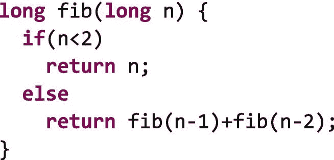

图 10-1

*递归实现* *的运算* `F` <sub>`n`</sub>

Fibonacci 数计算是展示递归的经典计算机科学示例，但也是简单算法效率低下的经典示例。更有效的方法是计算

![$$ {F}_n={\left[\begin{array}{cc}1&amp; 1\\ {}1&amp; 0\end{array}\right]}^{n-1} $$](img/Image00252.jpg)

取左上角的元素。矩阵的幂运算可以通过重复平方快速完成。但是，我们将在这一节继续讨论，并使用经典的递归例子进行教学。

图 10-1 中呈现的代码显然类似于计算`F`<sub>`n`</sub>`= F`<sub>`n-1`</sub>`+ F`<sub>`n-2`</sub>的递归方程。虽然这可能很容易理解，但我们在图 10-2 中进一步阐明了这一点，其中我们描述了调用`fib(4)`时的递归调用树。

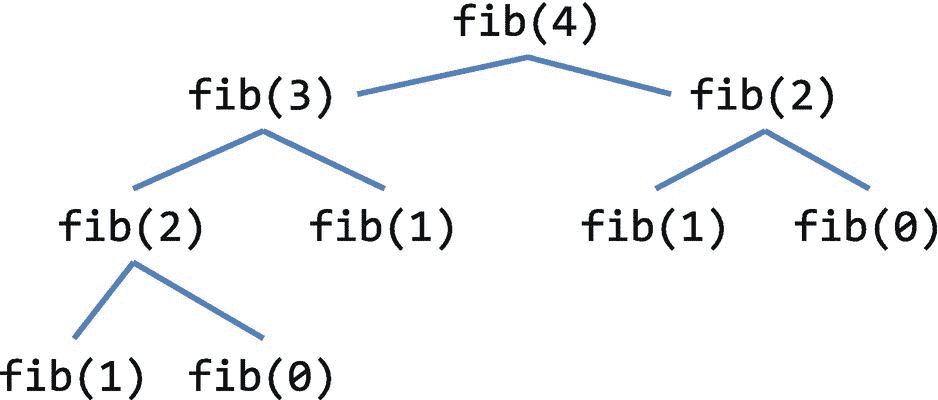

图 10-2

fib 的递归调用树(4)

图 10-1 的串行代码开头的`if (n<2)`行迎合了所谓的*基本情况*，这在递归代码中总是需要的，以避免无限递归，这很好，因为我们不想用核武器攻击堆栈，不是吗？

我们将使用不同的基于任务的方法对这第一个顺序实现进行并行化，从简单到更精细和优化的版本。我们从这些例子中学到的经验可以在其他树状或递归算法中模仿，我们展示的优化也可以在类似的情况下充分利用我们的并行架构。

## 高层方法:`parallel_invoke`

在第二章中，我们已经展示了一个高级类，它可以满足我们生成并行任务的需求:`parallel_invoke`。依靠这个类，我们可以实现 Fibonacci 算法的第一个并行实现，如图 10-3 所示。

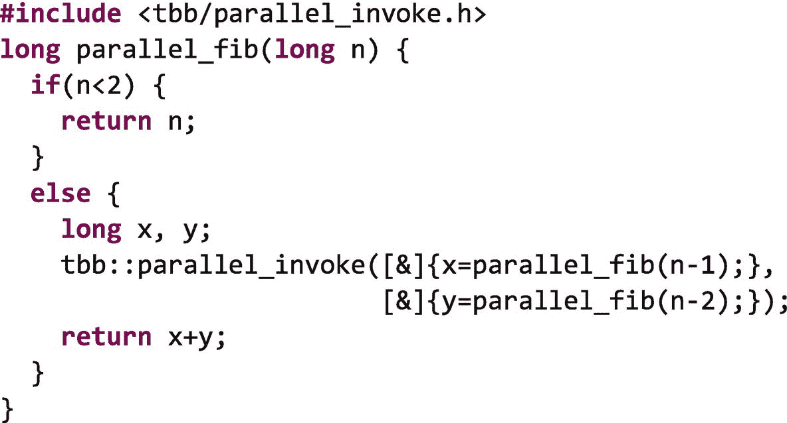

图 10-3

*并行实现* *的斐波那契利用* `parallel_invoke`

`parallel_invoke`成员函数递归产生`parallel_fib(n-1)`和`parallel_fib(n-2)`，返回堆栈变量`x`和`y`中的结果，这两个变量由两个 lambdas 中的引用捕获。当这两个任务完成时，调用者任务简单地返回`x+y`的和。实现的递归性质保持调用并行任务，直到在`n<2`时达到基本情况。这意味着 TBB 将创建一个任务来计算分别返回`1`和`0`的`parallel_fib(1)`和`parallel_fib(0)`。正如我们在整本书中所说的，我们希望向架构展示足够的并行性，从而创建足够多的任务，但同时任务还必须具有最小的粒度(`>1`微秒，正如我们在第 16 和 17 章中讨论的那样)，以便任务创建开销得到回报。如图 10-4 所示，这种折衷通常在这种算法中使用一个`cutoff`参数来实现。

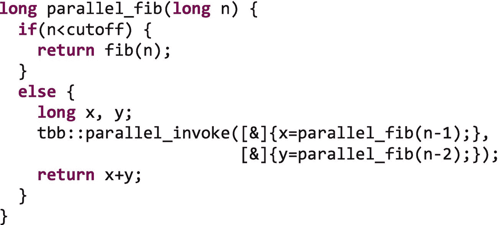

图 10-4

`parallel_invoke`实现的截断版本

想法是修改基本情况，以便当`n`不够大(`n<cutoff`)时，我们停止创建更多的任务，在这种情况下，我们求助于串行执行。计算一个合适的`cutoff`值需要一些实验，所以建议编写我们的代码，使`cutoff`可以作为输入参数，以方便搜索合适的值。例如，在我们的测试床上，`fib(30)`只需要大约 1 毫秒，所以这是一个足够细粒度的任务，可以阻止进一步的分裂。因此，设置`cutoff=30`是有意义的，这导致为接收`n=29`和`n=28`的任务调用代码的串行版本，如图 10-5 所示。

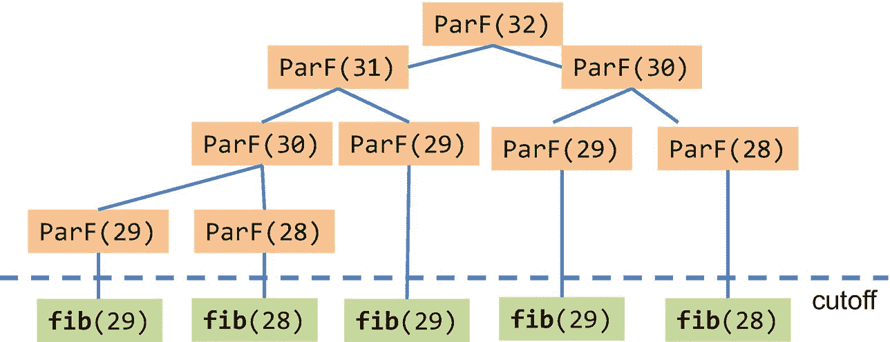

图 10-5

为了节省空间，图中调用`parallel_fib(32) – ParF(32)`后的调用树——`fib()`是串行实现的基础用例

如果在看了图 10-5 后，你认为在三个不同的任务中计算`fib(29`和在另外两个任务中计算`fib(28)`是愚蠢的，你是对的，这是愚蠢的！作为免责声明，我们已经说过这不是最佳的实现，而是一个服务于我们教育兴趣的常用递归示例。一个明显的优化是以这样一种方式实现递归，使得已经计算过的斐波纳契数不再被重新计算，从而实现最优的`O(log n)`复杂度，但这不是我们今天的目标。

看完图 10-4 后，你可能会想，为什么我们要再次重温在第 2 中已经讨论过的`parallel_invoke`。我们真的到达了本书的第二部分，更高级的部分了吗？没错。嗯……我们可能需要的高级功能、低级旋钮和我们喜欢的优化机会在哪里？？？好吧，让我们开始潜入更深的水域！！！

## 较低者中的最高者:`task_group`

如果我们可以在没有一些任务旋钮和优化特性的情况下生存，那么`task_group`类可以很好地为我们服务。如果你愿意的话，这是一个更高级、更容易使用的类，一个中级抽象。图 10-6 给出了依赖于`task_group`的斐波纳契码的一种可能的重新实现。


图 10-6

基于`task_group`的并行斐波那契

显然，这只是实现图 10-4 中我们使用`parallel_invoke`的代码的一种更冗长的方式。然而，我们想强调的是，与`parallel_invoke`选项不同，现在我们有了一组任务的句柄`g`，正如我们将在后面讨论的，这实现了一些额外的可能性，如任务取消。此外，通过显式调用成员函数`g.run()`和`g.wait()`，我们产生了新的任务，并等待它们在两个不同的程序点完成计算，而`parallel_invoke`函数在任务产生后有一个隐式的任务屏障。首先，`run()`和`wait()`之间的这种分离将允许调用者线程在产生一些任务和在阻塞调用`wait()`中等待它们之间进行一些计算。此外，该类还提供了其他有趣的成员函数，在某些情况下会派上用场:

*   `void run_and_wait( const Func& f )`，相当于`{run(f); wait();}`，但保证`f`运行在当前线程上。我们将在后面(在“低级任务接口:第二部分——任务延续”一节中)看到，有一个绕过 TBB 调度程序的简便技巧。如果我们第一次调用`run(f)`，我们基本上生成了一个任务，该任务在工作线程本地队列中排队。当调用`wait()`时，我们调用调度器，如果没有其他人在此期间窃取了刚刚入队的任务，那么调度器会将它出队。`run_and_wait`的目的有两个:首先，我们避免了入队-调度-出队步骤的开销，其次，我们避免了任务在队列中时可能发生的潜在窃取。

*   `void cancel()`，取消此`task_group`中的所有任务。也许计算是由一个用户界面触发的，这个用户界面也包括一个“取消”按钮。如果用户现在按下这个按钮，就有办法停止计算。在第十五章中，我们将进一步阐述取消和异常处理。

*   `task_group_status wait()`，返回任务组的最终状态。返回值可以是:`complete`(组内所有任务都已完成)；`canceled` ( `task_group`收到取消请求)；`not_completed`(组内任务未全部完成)。

注意，在图 10-6 的并行实现中，每个对`parallel_fib`的调用都会创建一个新的`task_group`，因此可以取消一个分支而不影响其他分支，我们将在第十五章中看到。拥有一个`task_group`也带来了一个额外的缺点:在一个组中创建太多的任务会导致任务创建的序列化和随之而来的可伸缩性的损失。例如，我们想写一段这样的代码:


正如我们所见，`n`任务将由同一个线程一个接一个地产生。其他工作线程将被迫窃取执行`g.run()`的线程创建的每个任务。这肯定会降低性能，尤其是如果`foo()`是一个细粒度的任务，并且工作线程的数量`nth`很高的话。推荐的替代方案是图 10-6 中使用的方案，其中执行了任务的递归部署。在这种方法中，工作线程在计算开始时偷取，理想情况下，在 log <sub>`2`</sub> `(nth)`步骤中，所有`nth`工作线程都在各自的任务中工作，这些任务依次将更多的任务放入它们的本地队列中。例如，对于`nth=4`，第一个线程`A`产生了两个任务，并开始处理其中一个任务，而线程`B`窃取了另一个任务。现在，线程`A`和`B`各自产生两个任务(总共四个),并在其中两个中开始工作，但是另外两个被线程`C`和`D`窃取。从现在开始，所有四个线程都在工作，并在它们的本地队列中加入更多的任务，只有当它们用完本地任务时才再次窃取。

### 当心！风险自担:低级任务界面

task 类有很多特性，这意味着也有很多出错的方法。如果所需的并行模式是一个常见的模式，那么肯定有一个已经可用的高级模板，由聪明的开发人员在任务接口之上实现和优化。在大多数情况下，推荐使用这种高级算法。因此，本章其余部分的目的是服务于两个目标。首先，如果 TBB 已经提供的并行算法或高级模板不适合您的需求，它为您提供了开发自己的基于任务的并行算法或高级模板的方法。第二个是揭示 TBB 机制的底层细节，这样你就可以理解一些优化和技巧，这些将在以后的章节中提到。例如，后面的章节将会引用这一章来解释`parallel_pipeline`和流图由于调度绕过技术而更好地利用局部性的方式。在这里，我们解释这项技术是如何工作的，为什么它是有益的。

## 低级任务接口:第一部分——任务阻塞

TBB 任务类有大量的特性和旋钮来微调我们基于任务的实现的行为。缓慢但肯定的是，我们将引入可用的不同成员函数，逐渐增加我们的 Fibonacci 实现的复杂性。首先，图 10-7 和 10-8 显示了使用低级任务实现斐波那契算法所需的代码。这是我们的基线，使用任务阻塞风格，将在后续版本中优化。


图 10-7

`parallel_fib`使用任务类重新实现

图 10-7 的代码包括以下不同的步骤:

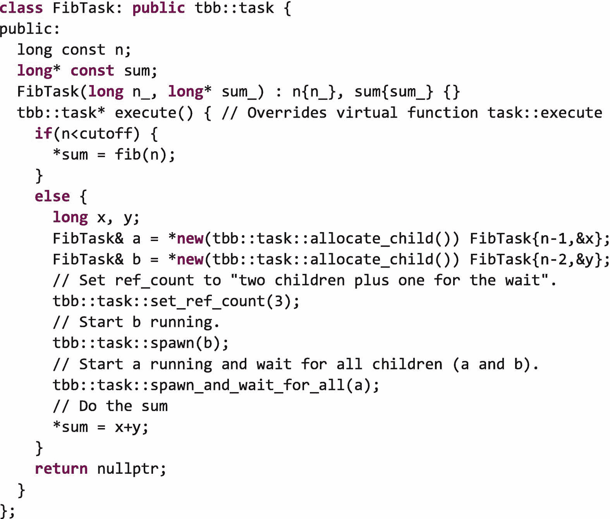

图 10-8

图 10-7 中使用的`FibTask`类的定义

1.  为任务分配空间。任务必须由特殊的成员函数来分配，以便在任务完成时可以有效地回收空间。分配是由一个特殊的重载成员函数`new`和`task::allocate_root`完成的。名称中的`_root`后缀表示创建的任务没有父任务。它是任务树的根。

2.  用构造器`FibTask{n,&sum}`构造任务(任务定义如下图所示)，由`new`调用。当任务在步骤 3 中运行时，它计算出`nth`斐波纳契数，并将其存储到`sum`中。

3.  使用`task::spawn_root_and_wait`运行任务直至完成。

真正的工作是在图 10-8 中定义的类`FibTask`内完成的。与`fib`和`parallel_fib`之前的两个并行实现相比，这是一段相对较大的代码。我们被告知，这是一个较低层次的实现，因此它不像一个高层次的抽象那样高效和友好。为了弥补额外的负担，我们将在后面看到这个类是如何让我们在引擎盖下动手调整行为和性能的。

像 TBB 调度的所有任务一样，`FibTask`是从`tbb::task`类派生出来的。字段`n`和`sum`分别保存输入值和指向输出的指针。这些都是用传递给构造器`FibTask(long n_, long ∗sum_)`的参数初始化的。

成员函数`execute`执行实际的计算。每个任务都必须提供一个覆盖纯虚拟成员函数`tbb::task::execute`的`execute`定义。定义应该完成任务的工作，并返回`nullptr`或指向下一个要运行的任务的指针，如图 9-14 所示。在这个简单的例子中，它返回`nullptr`。

成员函数`FibTask::execute()`执行以下操作:

1.  检查`n<cutoff`是否正确，并在这种情况下采用顺序版本。

2.  否则，执行 else 分支。代码创建并运行两个子任务，分别计算`F` <sub>`n-1`</sub> 和`F` <sub>`n-2`</sub> 。这里，继承的成员函数`allocate_child()`用于为任务分配空间。记住，顶层例程`parallel_fib`使用`allocate_root()`为任务分配空间。不同之处在于，这里的任务是创建子任务。这种关系由分配方法的选择来表示。附录 B 图 B-76 中列出了不同的分配方法。

3.  调用`set_ref_count(3)`。数字 3 代表两个孩子和成员函数`spawn_and_wait_for_all`所需的一个额外的隐式引用。这个`set_ref_count`成员函数初始化每个 TBB 任务的`ref_count`属性。每次子节点结束计算，它都会减少其父节点的`ref_count`属性。如果任务使用`wait_for_all`在子任务完成后恢复，确保在产生`k`子任务之前调用`set_reference_count(k+1)`。否则会导致未定义的行为。该库的调试版本通常会检测并报告这种类型的错误。

4.  产生两个子任务。生成一个任务向调度程序表明，它可以随时运行该任务，可能与执行其他任务并行。由`tbb::task::spawn(b)`成员函数进行的第一次派生会立即返回，而不会等待子任务开始执行。第二次产卵，由成员函数`tbb::task::spawn_and_wait_for_all(a)`完成，相当于`tbb::task::spawn(a); tbb::task::wait_for_all()`。最后一个成员函数使父任务等待所有当前分配的子任务完成。出于这个原因，我们说这种实现遵循了我们所说的任务阻塞风格。

5.  在两个子任务完成之后，父任务的`ref_count`属性已经减少了两次，现在它的值是 1。这导致父任务在`spawn_and_wait_for_all(a)`调用后立即恢复，因此它计算`x+y`并将其存储在`∗sum`中。

在图 10-9 中，我们展示了在设置了`cutoff=7`的`root_task FibTask(8, &sum)`生成时，该任务的创建和执行。假设单个线程执行所有任务，并简化堆栈的使用方式，在图 10-9 中，我们有一个简化的计算表示。当`parallel_fib(8)`被调用时，变量`sum`被存储在堆栈中，根任务被分配在堆上，用`FibTask(8, &sum)`构造。这个根任务由运行被覆盖的成员函数`execute()`的工作线程执行。在这个成员函数中，声明了两个堆栈变量`x`和`y`，两个新的子任务`a`和`b`被分配到工作线程的本地队列中。在这两个任务的构造器中，我们传递了`FibTask(7, &x)`和`FibTask(6, &y)`，这意味着新创建的任务的变量成员`sum`将分别指向`FibTask(8)`栈变量`x`和`y`。


图 10-9

带有`cutoff=7`的`parallel_fib(8)`的递归调用树

成员函数`execute()`继续将任务的`ref_count`设置为`3`，首先生成`b`，然后生成`a`，并等待两者。此时，根任务被挂起，直到它没有未决的子任务。记住这是任务阻塞风格。工作线程返回到调度器，在那里它将首先使任务`a`出队(因为它是最后入队的)。这个任务`a (FibTask(7,&x))`将递归地重复相同的过程，在堆栈上分配一个新的`x`和`y`并生成`FibTask(5,&x)`和`FibTask(6,&y)`后挂起自己。从`cutoff=7`开始，这两个新任务将求助于基础用例，分别调用`fib(5)`和`fib(6)`。`FibTask(6,&x)`先出列，将`8`写入`∗sum`(其中`sum`指向`FibTask(7)`栈中的`x`)，返回`nullptr`。然后，`FibTask(6,&x)`被销毁，但是在这个过程中，父任务`(FibTask(7,&x))`的`ref_cont`变量首先被递减。然后，工作线程让将 5 写入`∗sum`(现在是堆栈中`y`的别名)的`FibTask(5,&y)`出列，并返回`nullptr`。这导致`ref_count`达到值`1`，唤醒刚刚要加`5+8`的父线程`FibTask(7,&x)`，将其写入`∗sum`(`FibTask(8)`中`x`的别名)堆栈，并返回`nullptr`。这将根任务的`ref_count`减少到 2。接下来，工作线程让调用`fib(6)`的`FibTask(6,&y)`出列，在堆栈上写`y=8`，返回，然后终止。这最终使根任务没有子任务`(ref_count=1)`，因此它可以在`spawn_and_wait_for_all()`成员函数之后继续执行，添加`8+13`，写入`∗sum`(sum 在`parallel_fib`堆栈中的别名)，然后销毁。如果你在读完所有这些过程的描述后感到筋疲力尽，那么我们也一样，但是还有更多，所以再坚持一秒钟。现在，假设有不止一个工作线程。每一个都会有自己的栈，争着抢任务。结果`21`将是相同的，本质上，相同的任务将被执行，尽管现在我们不知道哪个线程将负责每个任务。我们所知道的是，如果问题大小和任务数量足够大，并且如果`cutoff`被明智地设置，那么这个并行代码将比顺序代码运行得更快。

### 注意

正如我们已经看到的，TBB 偷工减料调度程序评估一个任务图。该图是有向图，其中每个节点是一个任务。每个任务指向它的父任务，也称为后继任务，是等待它完成的另一个任务。如果一个任务没有父/后继，它的父引用指向`nullptr`。方法`tbb::task::parent()`给予你对后继指针的只读访问。每个任务都有一个`ref_count`,它说明了以它为后继的任务的数量(即，在它被触发执行之前，父任务必须等待的子任务的数量)。

被大肆吹嘘的旋钮和调谐可能性在哪里？的确，我们刚刚讨论的基于底层任务的代码与我们已经用`parallel_invoke`和`task_group`类实现的代码做得差不多，但是编程成本更高。那么，物有所值的优势在哪里？task 类有更多的成员函数，我们将很快介绍，本节讨论的实现只是构建更优化版本的基础。坚持和我们在一起，继续阅读。

## 低级任务接口:第二部分——任务延续

如果任务的主体需要许多局部变量，我们刚才介绍的任务阻塞风格可能会造成问题。这些变量放在堆栈中，直到任务被销毁。但是直到它的所有子任务都完成了，任务才被销毁。如果问题非常大，并且很难在不限制可用并行性的情况下找到一个临界值，那么这将是一个潜在的障碍。当面对用于通过遵循基于树的策略明智地遍历搜索空间来找到最优值的分支和界限问题时，这可能发生。在有些情况下，树可能非常大，不平衡(一些树枝比其他树枝更深)，树的深度未知。对这些问题使用阻塞方式很容易导致任务数量的激增和堆栈空间的过度使用。

阻塞风格的另一个微妙的不便是由于在父任务中遇到`wait_for_all()`调用的工作线程的管理。浪费这个工作线程等待子任务完成是没有意义的，所以我们委托它执行其他任务。这意味着当父任务准备好再次运行时，负责处理它的原始工作线程可能会因其他任务而分心，无法立即响应。

### 注意

*延续，延续，延续！！！*《TBB》的作者和其他并行专家喜欢鼓励延续式编程。为什么呢？？？事实证明，使用它可以区分相对容易编写的工作程序和因堆栈溢出而崩溃的程序。更糟糕的是，除了使用延续之外，解决这种崩溃的代码可能很难理解，并给并行编程带来坏名声。幸运的是，TBB 被设计成使用延续，并鼓励我们默认使用延续。流程图(第 3 和 17 章)鼓励使用`continue_node`(以及其他具有调度程序旁路潜力的节点)。作为一名并行程序员，延续(和任务回收，我们接下来将讨论)的力量是值得了解的——您绝不会希望让一个任务再次等待(浪费宝贵的资源)！

为了避免这个问题，我们可以采用一种不同的编码风格，称为延续传递。图 10-10 显示了我们称之为延续任务的新任务的定义，图 10-11 在方框中强调了`FibTask`中实现延续传递风格所需的更改。

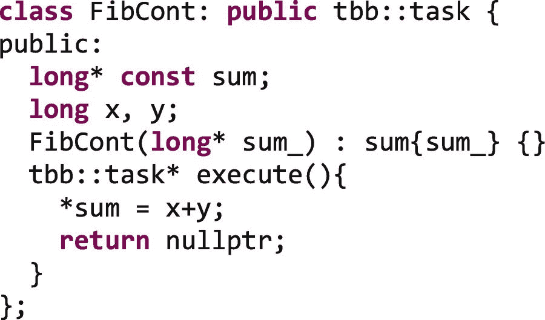

图 10-10

斐波那契示例的延续任务`FibCont`

延续任务`FibCont`也有一个`execute()`成员函数，但是现在它只包含子任务完成后必须完成的代码。对于我们的斐波那契示例，在子元素完成之后，我们只需要添加它们带来并返回的结果，这是图 10-8 代码中`spawn_and_wait_for_all(a)`之后仅有的两行代码。continuation 任务声明了三个成员变量:一个指向最终变量`sum`的指针和两个子变量`x`和`y`的部分和。构造器`FibCont(long∗ sum)`充分初始化指针。现在我们必须修改我们的`FibTask`类来正确地创建和初始化延续任务`FibCont`。

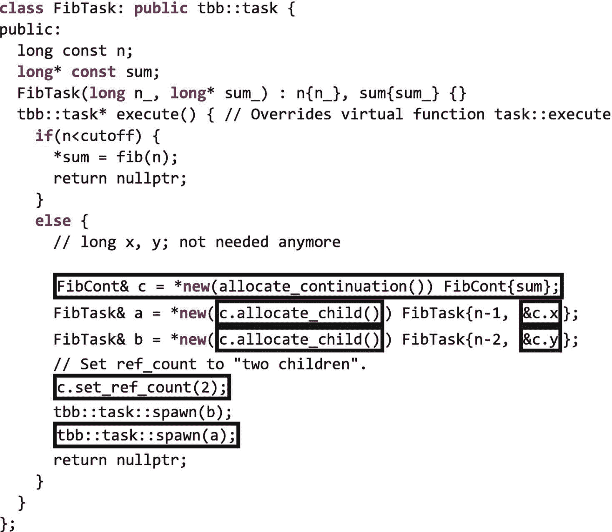

图 10-11

遵循并行斐波那契的连续传递风格

在图 10-11 中，除了不变的基本情况，我们在代码的 else 部分发现现在，`x`和`y`私有变量不再声明，已经被注释掉。然而，现在有了一个新的任务`FibCont&`类型的`c`。这个任务是使用类似于`allocate_child()`的`allocate_continuation()`函数分配的，除了它将调用任务`(this)`的父引用传递给`c`，并将`this`的父属性设置为`nullptr`。`this`的父代的引用计数`ref_count`不会改变，因为该父代仍然具有相同数量的子代，尽管其中一个子代突然从`FibTask`类型突变为`FibCont`类型。如果你是一个快乐的父母，不要在家里尝试这个！

在这一点上，`FibTask`仍然活着，但我们很快就会除掉它。`FibTask`已经没有父母了，但临死前还在负责一些杂务。`FibTask`先造两个`FibTask`孩子，但是小心！

*   新任务`a`和`b`现在是`c`(不是`this`)的子任务，因为我们使用`c.allocate_child()`而不仅仅是`allocate_child()`来分配它们。换句话说，`c`现在是`a`和`b`的继承者。

*   子项的结果不再写入堆栈存储的变量中。初始化`a`时，现在调用的构造器是`FibTask(n-1,` `&c.` `x)`，所以子任务`a` ( `a.sum`)中的指针`sum`实际上是指向`c.x`。同样，`b.sum`指向`c.y`。

*   由于`FibCont c`实际上只有两个子节点(`a`和`b`),所以`c`(内部和私有`c.ref_count`)的引用计数仅被设置为两个(`c.set_ref_count(2)`)。

现在子任务`a`和`b`已经准备好被衍生，这就是`FibTask`的所有职责。现在它可以平静地死去，它所占用的内存也可以安全地被回收。愿死者安息

### 注意

正如我们在上一节中提到的，当遵循阻塞风格时，如果一个任务`A`产生了`k`子任务并使用`wait_for_all`成员函数等待它们，那么`A.ref_count`必须被设置为`k+1`。额外的“`1`”说明了任务`A`在结束和分派`A`的父任务之前必须完成的额外工作。当遵循延续传递风格时，不需要这个额外的“`1`”，因为 A 将额外的工作转移到延续任务`C`。在这种情况下，如果`C.ref_count`有`k`子节点，则`C.ref_count`必须准确设置为`k`。

为了更好地说明这一切是如何工作的，现在我们遵循延续传递的风格，图 10-12 和 10-13 包含了这个过程的一些快照。


图 10-12

`parallel_fib(8)`与`cutoff=7`的连续传球方式

在图 10-12 的上部，根`FibTask(8,&sum)`已经创建了延续`FibCont(sum)`和任务`FibTask(7,&c.x)`和`FibTask(6,&c.y)`，它们实际上是`FibCont`的子节点。在堆栈中，我们看到我们只存储了最终结果的和，这是因为`x`和`y`没有使用这种风格的堆栈空间。现在，`x`和`y`是`FibCont`的成员变量，存储在堆中。在这个图的底部，我们看到原来的根任务已经消失了，它使用了所有的内存。本质上，我们是用堆栈空间交换堆空间，用`FibCont`的对象交换`FibTask`的对象，如果`FibCont`的对象更小，这是有益的。我们还看到从`FibTask(7,&c.x)`到根`FibCont(&sum)`的父引用已经转移到了更年轻的`FibCont`。

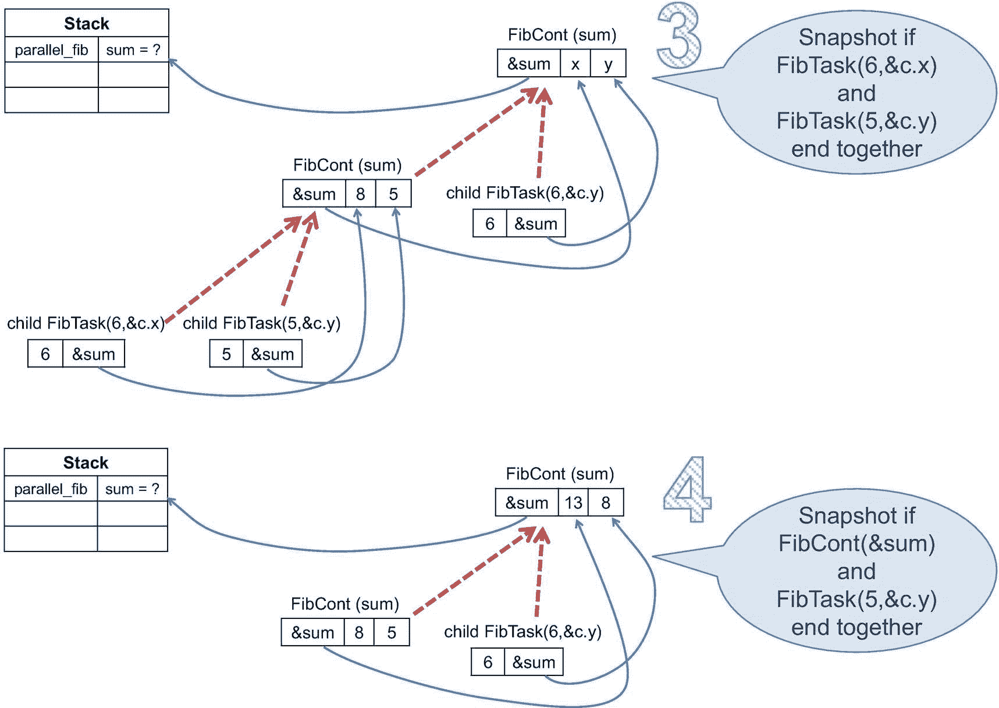

图 10-13

延续-传递样式示例(延续！！)

在图 10-13 的顶部，我们开始递归算法的展开部分。不再有`FibTask`物体的痕迹。子任务`FibTask(6,&c.x)`和`FibTask(5,&c.y)`已经求助于基例(`n<cutoff`，假设`cutoff=7`，分别用 8 和 5 写完`∗sum`后即将返回。每个子任务都将返回`nullptr`，因此工作线程再次取得控制权，并返回到窃取工作的调度程序，减少父任务的`ref_count`，并检查`ref_count`是否为 0。在这种情况下，按照第九章的图 9-14 所示的 TBB 任务分派循环的高级描述，下一个要执行的任务是父任务(在这种情况下为`FibCont`)。与阻塞风格相反，现在这是立即执行的。在图 10-13 的底部，我们看到原始根任务的两个子任务已经写出了它们的结果。

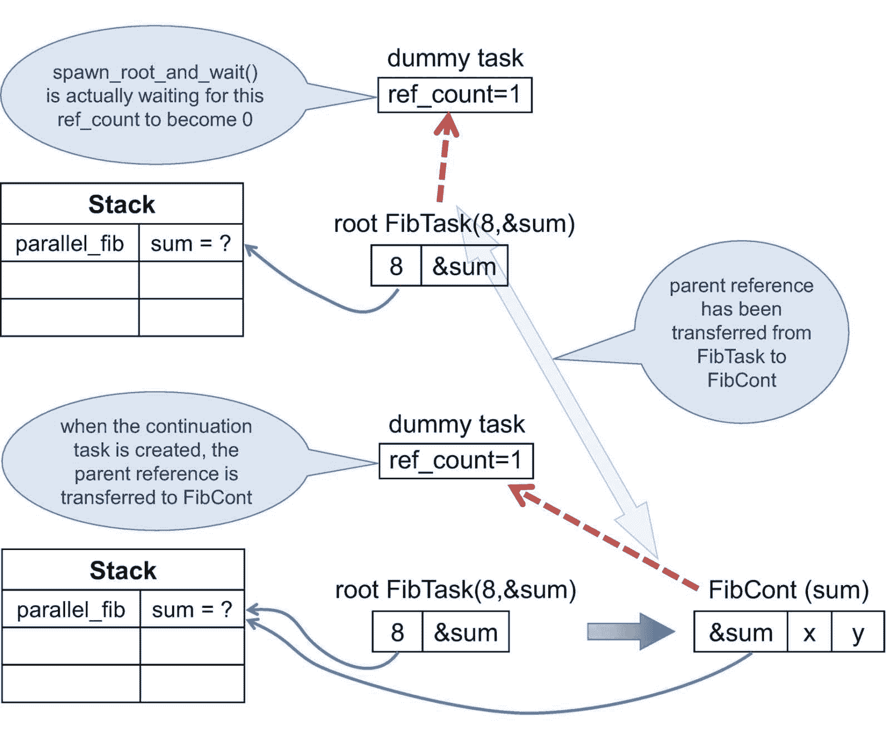

图 10-14

`parallel_fib`等待`FibCont`完成，这要感谢一个拥有自己的`ref_count`的虚拟任务

您可能想知道`parallel_fib`函数是否仍然在`spawn_root_and_wait(a)`中等待第一个被创建的根任务，因为这个原始的`FibTask`被第一个`FibCont`对象替换，然后死亡(见图 10-12 )。嗯，事实上`parallel_fib`还在等待，因为`spawn_root_and_wait`被设计成可以在连续传球风格下正常工作。对`spawn_root_and_wait(x)`的调用实际上并不等待`x`完成。相反，它构造了一个`x`的伪后继，并等待后继的`ref_count`变成`0`。因为`allocate_continuation`将父引用转发给延续，所以伪后继的`ref_count`不会递减，直到延续`FibCont`完成。如图 10-14 所示。

### 绕过调度程序

调度程序绕过是一种优化，在这种优化中，您直接指定要运行的下一个任务，而不是让调度程序挑选。延续传递风格经常为调度程序旁路打开了机会。例如，在延续传递的例子中，一旦`FibTask::execute()`返回，根据第九章中描述的工作窃取调度器的获取规则，任务`a`总是从就绪池中获取的下一个任务，因为它是最后一个被产生的任务(除非它已经被另一个工作线程窃取)。更确切地说，事件的顺序如下:

*   将任务`a`推到线程的队列中。

*   从成员函数`execute()`返回。

*   从线程的队列中弹出任务`a`，除非它被另一个线程窃取。

将任务放入 deque，然后再取出会导致一些可以避免的开销，或者更糟的是，允许在不增加显著并行性的情况下破坏局部性的窃取。为了避免这两个问题，确保`execute`不会产生任务，而是返回一个指向它的指针作为结果。这种方法保证了同一个工作线程立即执行`a`，而不是其他线程。为此，在图 10-11 的代码中，我们需要将这两行替换如下:

<colgroup><col class="tcol1 align-left"> <col class="tcol2 align-left"> <col class="tcol3 align-left"></colgroup> 
| `spawn(a);`返回零数据； | -什么 | //spawn(a)；注释掉了！返回`&a;` |

## 低级任务接口:第三部分——任务回收

除了绕过调度程序，我们可能还想绕过任务分配和释放。这种机会经常出现在绕过调度程序的递归任务中，因为当父任务完成时，子任务会在返回时立即启动。图 10-15 显示了在斐波纳契例子中实现任务循环所需的变化。

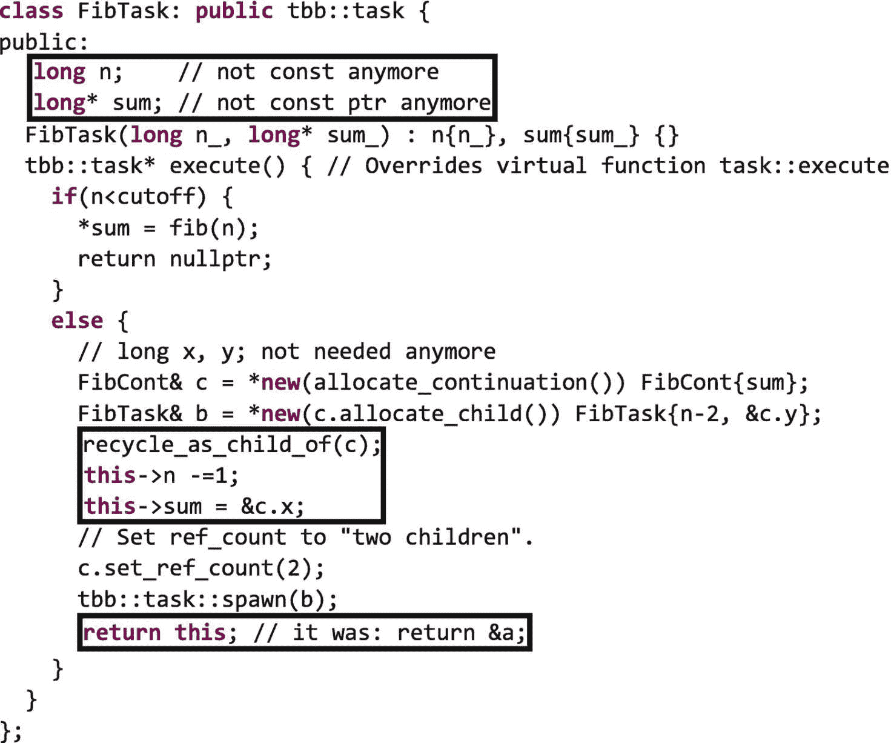

图 10-15

遵循并行斐波那契的任务循环风格

之前叫`a`的孩子现在是回收的`this`。`recycle_as_child_of(c)`这个称呼有几个影响:

*   它标记`this`在 execute 返回时不被自动销毁。

*   它将`this`的后继者设置为`c`。为了防止引用计数问题，`recycle_as_child_of`有一个先决条件，即`this`必须有一个`nullptr`后继(`this`的父引用应该指向`nullptr`)。`allocate_continuation`发生后就是这种情况。

成员变量必须被更新以模仿先前使用构造器`FibTask(n-1,&c.x)`实现的内容。在这种情况下，`this->n`递减(`n -=1;`)，并且`this->sum`被初始化为指向`c.x`。

回收时，确保在产生回收的任务后，`this`的成员变量没有在任务的当前执行中使用。在我们的例子中就是这种情况，因为回收的任务实际上并没有产生，只会在返回指针`this`后运行。您可以生成回收的任务(即`spawn (∗this); return nullptr;`)，只要在生成后没有使用它的成员变量。这种限制甚至适用于`const`成员变量，因为在任务产生之后，它可能会在父任务进一步发展之前运行并被销毁。一个类似的成员函数，`task::recycle_as_continuation()`，回收一个任务作为延续，而不是作为子任务。

在图 10-16 中，我们展示了一旦`FibCont`的孩子更新了成员变量(`8`变成了`7`并且 sum 指向了`c.x`)时，回收`FibTask(8,&sum)`作为`FibCont`的孩子的效果。

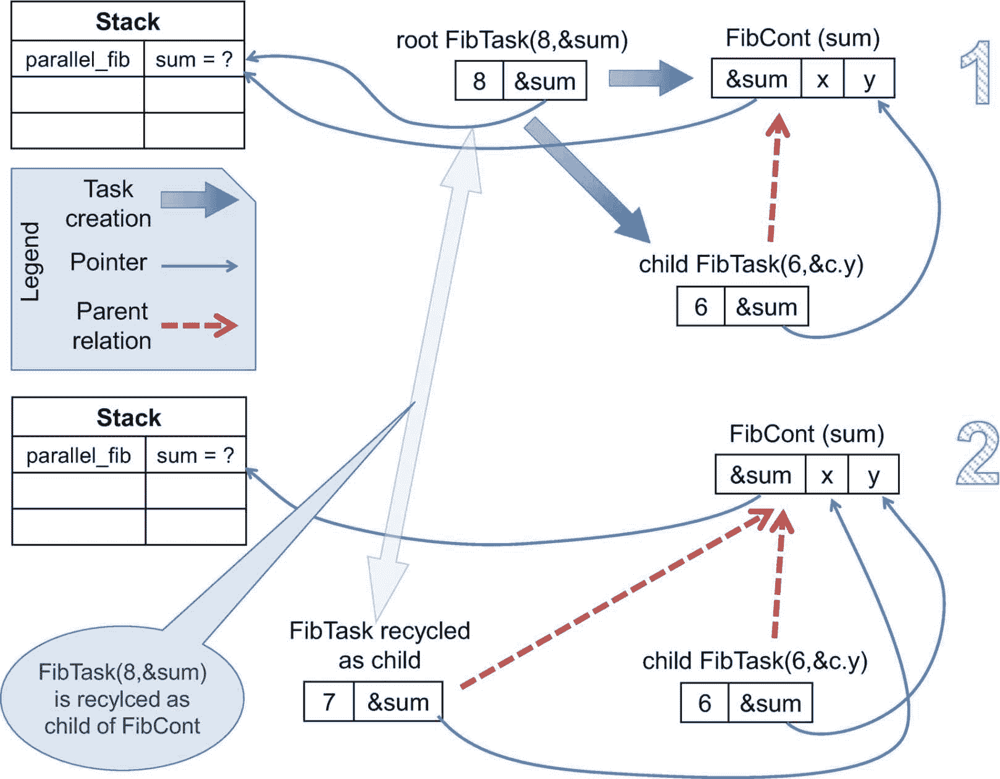

图 10-16

回收`FibTask(8,&sum)`作为`FibCont`的孩子

### 注意

***更环保(也更容易)的并行编程☺***

通过使用 TBB，对可组合性、延续和任务回收的接受对使并行编程变得更加容易产生了强大的影响。考虑到回收已经在世界范围内获得了青睐，任务的回收也确实有助于节约能源！加入更绿色的并行编程运动——它也让有效的编程变得更容易，这没有坏处！

调度器旁路和任务回收是强大的工具，可以带来显著的改进和代码优化。它们实际上是用来实现第 2 和 3 章中介绍的高级模板，我们也可以利用它们来设计其他满足我们需求的定制高级模板。流程图(第章 3 和第章 17 中的更多内容)鼓励使用`continue_node`(以及其他具有调度程序旁路潜力的节点)。在下一节中，我们将展示一个例子，在这个例子中，我们利用低级任务 API 并评估其影响，但在此之前，请先查看我们的“清单”

## 任务界面清单

求助于 task 接口对于具有大量 fork 的 fork-join 并行性是可取的，这样任务窃取可以导致足够的广度优先行为来占用线程，然后线程以深度优先的方式进行管理，直到它们需要窃取更多的工作。换句话说，任务调度器的基本策略是“广度优先偷窃和深度优先工作”广度优先盗窃规则充分提高了并行性，使线程保持忙碌。深度优先工作规则使每个线程在有足够的工作要做时保持高效运行。

请记住，这不是最简单的 API，而是专门为速度而设计的。在许多情况下，我们面临的问题可以通过使用更高级的接口来解决，就像模板`parallel_for`、`parallel_reduce`等等所做的那样。如果情况不是这样，并且您需要任务 API 提供的额外性能，那么需要记住一些细节

*   总是使用`new(allocation_method) T`来分配一个任务，其中`allocation_method`是类任务的分配方法之一(见附录 B，图 B-76)。不要创建任务的本地或文件范围的实例。

*   所有的兄弟都应该在任何开始运行之前分配，除非你正在使用`allocate_additional_child_of`。我们将在本章的最后一节详细阐述这一点。

*   利用延续传递、调度程序旁路和任务回收来挤出最大性能。

*   如果任务完成，并且没有被标记为重新执行(回收)，它将被自动销毁。此外，它的后继引用计数递减，如果达到零，则自动产生后继。

## 还有一件事:先进先出(又名发射并忘记)任务

到目前为止，我们已经看到了任务是如何产生的以及产生任务的结果:将任务排入队列的线程很可能是以 LIFO(后进先出)顺序将其排出队列的线程(如果没有其他线程窃取产生的任务)。正如我们所说的，由于“深度优先工作”，这种行为在局部性和限制内存占用方面有一些有益的影响然而，如果随后还产生了一堆任务，那么所产生的任务可能会隐藏在线程的本地队列中。

如果我们喜欢类似 FIFO 的执行顺序，任务应该使用 enqueue 函数而不是 spawn 函数进行排队，如下所示:


我们的示例`FifoTask`类从`tbb::task`派生而来，并像每个普通任务一样覆盖了`execute()`成员函数。衍生任务的四个不同之处是

*   调度器可以推迟一个衍生任务，直到它被等待，但是一个排队的任务最终将被执行，即使没有线程明确地等待该任务。即使工作线程的总数为零，也会创建一个特殊的额外工作线程来执行排队的任务。

*   衍生的任务以类似 LIFO 的顺序进行调度(最近衍生的任务在下一个开始)，但是排队的任务以大致(不精确)的 FIFO 顺序进行处理(大致以它们进入队列的顺序开始——“近似”给了 TBB 一些灵活性，使其比严格的策略允许的更高效)。

*   由于深度优先遍历，为了节省内存空间，衍生任务是递归并行的理想选择，但是排队的任务可能会过度消耗递归并行的内存，因为递归将在广度优先遍历中扩展。

*   衍生的父任务应该等待其衍生的子任务完成，但是排队的任务不应该被等待，因为来自程序的不相关部分的其他排队的任务可能必须首先被处理。使用排队任务的推荐模式是让它异步发出完成信号。本质上，排队的任务应该作为根任务分配，而不是作为等待的子任务。

在第十四章中，排队的任务也在一些任务优先于其他任务的情况下进行了说明。《线程构建模块设计模式手册》中还描述了另外两个用例(参见本章末尾的“更多信息”)。有两种设计模式可以让排队的任务派上用场。在第一种情况下，即使用户启动了长时间运行的任务，GUI 线程也必须保持响应。在提出的解决方案中，GUI 线程将任务排队，但不等待它完成。该任务执行繁重的工作，然后在终止前用一条消息通知 GUI 线程。第二种设计模式也与给不同的任务分配非抢占式优先级有关。

## 让这些底层特性发挥作用

让我们切换到一个更具挑战性的应用程序来评估不同的基于任务的实现方案的影响。波前是一种出现在科学应用中的编程模式，例如基于动态编程或序列比对的应用。在这种模式中，数据元素分布在表示逻辑平面或空间的多维网格上。元素必须按顺序计算，因为它们之间存在依赖关系。一个例子是我们在图 10-17 中展示的 2D 波前。这里，计算从矩阵的一个角开始，扫描将沿着对角线轨迹穿过平面进行到对角。每个反对角线代表可以并行执行的计算或元素的数量，它们之间没有相关性。

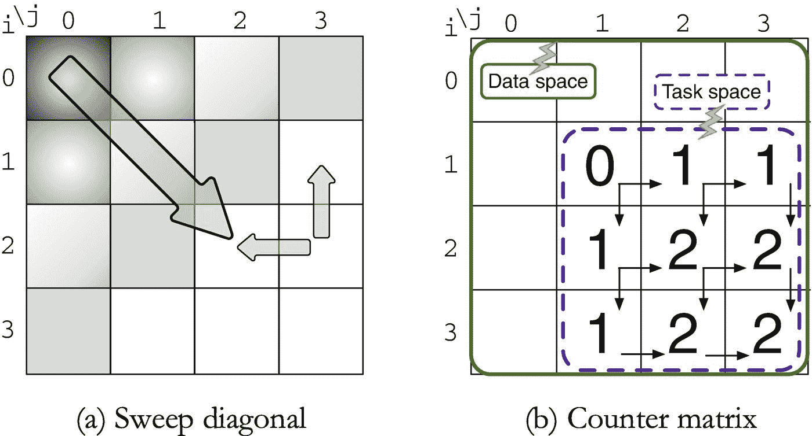

图 10-17

典型的 2D 波前图案(a)和转换成原子计数器矩阵的相关性(b)

在图 10-18 的代码中，我们为`nxn` 2D 网格的每个单元计算一个函数。每个单元与相邻单元的两个元素具有数据相关性。例如，在图 10-17 (a)中，我们看到单元(2，3)依赖于北面(1，3)和西面(2，2)的单元，因为在`i`和`j`循环的每次迭代中，都需要以前迭代中计算的单元:`A[i,j]`依赖于`A[i-1,j]`(北面依赖)和`A[i,j-1]`(西面依赖)。在图 10-18 中，我们展示了数组 A 已被线性化的计算的顺序版本。显然，抗角细胞是完全独立的，因此它们可以并行计算。为了利用这种并行性(循环“`i`”和“`j`”)，任务将在迭代空间(或从现在开始的任务空间)内执行对应于每个单元的计算，并且独立的任务将被并行执行。


图 10-18

2D 波前问题的代码片段。阵列 A 是 2D 网格的线性化视图。

在我们的任务并行化策略中，基本工作单元是由函数`foo`在矩阵的每个(`i,j`)单元执行的计算。不失一般性，我们假设每个单元的计算负荷将由`foo`函数的`gs`(粒度)参数控制。这样，我们可以定义任务的粒度，因此，我们可以根据任务粒度研究不同实现的性能，以及同构或异构任务负载的情况。

在图 10-17(b) 中，箭头显示了我们的波前问题的数据依赖流。例如，在执行了不依赖于任何其他任务的左上任务`(1, 1`之后，可以分派两个新任务(一个在`(2, 1)`下方，一个在右侧`(1, 2)`)。这种相关性信息可以通过带有计数器的 2D 矩阵来获取，如图 10-17(b) 所示。计数器的值指出我们必须等待多少任务。只能调度相应计数器无效的任务。

实现这种波前计算的替代方案在英特尔 TBB 设计模式中有所介绍(请参阅“了解更多信息”)，其中实现了非循环任务的一般图表。这个版本可以和本章的源代码一起以`wavefront_v0_DAG.cpp`的名字获得。然而，该版本要求预先分配所有任务，我们接下来介绍的实现更加灵活，可以进行调整以更好地利用本地性，我们将在后面看到这一点。在图 10-19 中，我们展示了第一个基于任务的实现，我们称之为`wavefront_v1_addchild`。每个就绪任务首先执行任务体，然后它将减少依赖它的任务的计数器。如果该递减操作以计数器等于 0 结束，则该任务还负责产生新的独立任务。请注意，计数器是共享的，并且将被并行运行的不同任务修改。为了说明这个问题，计数器是原子变量(参见第五章)。

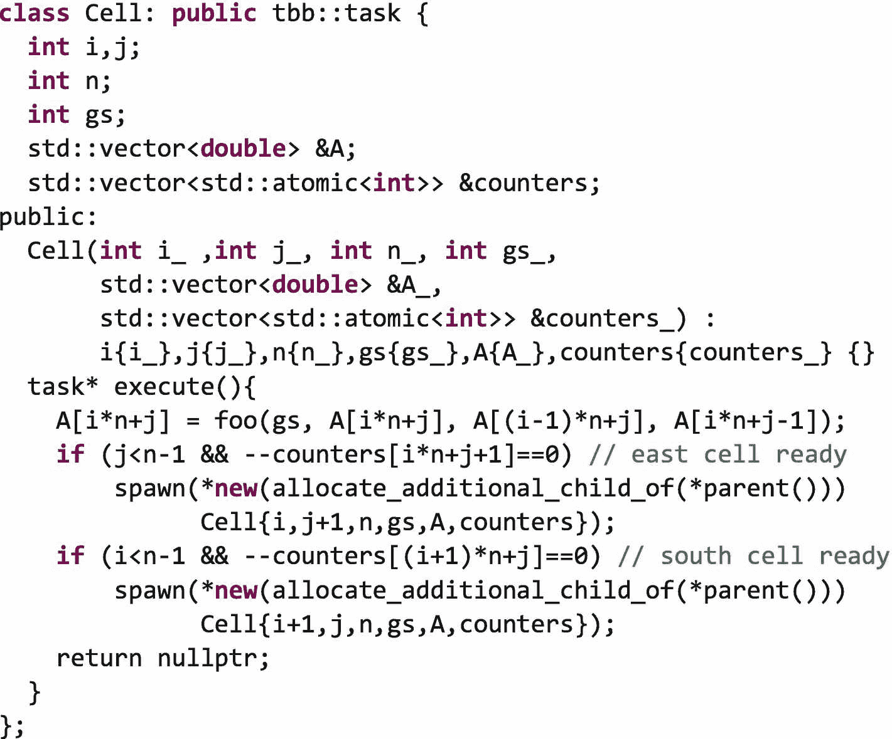

图 10-19

摘自 wavefront_v1_addchild 版本的代码

注意，在图 10-19 中，我们使用`allocate_additional_child_of(∗parent())`作为新任务的分配方法。通过使用这种分配方法，我们可以在其他人运行时添加孩子。从积极的方面来看，这允许我们节省一些代码，这些代码对于确保在产生任何子任务之前分配所有子任务是必要的(因为这取决于东部任务、南部任务或者两者都准备好被分派)。从负面来看，这种分配方法要求父节点的`ref_count`自动更新(当分配一个`additional_child`时递增，当任何子节点死亡时递减)。由于我们使用的是`allocate_additional_child_of(∗parent())`，所有创建的任务都将是同一个父任务的子任务。任务空间的第一个任务是任务`(1, 1)`，它是由


这个根任务的父任务是我们已经在图 10-14 中介绍过的虚拟任务。然后，这段代码中创建的所有任务都会自动更新虚拟任务的`ref_count`。

使用`allocate_additional_child_of`分配方法的另一个警告是，用户(我们)必须确保在分配额外的子节点之前，父节点的`ref_count`不会过早地到达`0`。我们的代码已经考虑到了这种可能性，因为分配了一个额外的子节点`c`的任务`t`已经保证了`t`父节点的`ref_count`至少为 1，因为`t`只会在死亡时(即在分配了`c)`之后)减少其父节点的`ref_count`。

在第二章中，已经展示了`parallel_do_feeder`模板来说明不同的波前应用:正向替换。这个模板本质上实现了一个工作列表算法，通过调用`parallel_do_feeder::add()`成员函数可以将新任务动态添加到工作列表中。我们调用`wavefront_v2_feeder`到依赖`parallel_do_feeder`的波前代码版本，如图 2 中的图 2-19 所示，使用`feeder.add()`代替图 10-19 中的 spawn 调用。

如果我们想避免所有的子任务都被一个父任务挂起，并努力自动更新它的`ref_count`，我们可以实现一个更精细的版本，模仿前面解释的阻塞风格。图 10-20 显示了这种情况下的`execute()`成员函数，这里我们先标注是东、南还是两个单元格都准备好调度，然后分配调度相应的任务。注意，现在我们使用`allocate_child()`方法，每个任务最多有两个后代来等待。尽管单个`ref_count`的原子更新不再是瓶颈，但是更多的任务正在等待它们的子任务完成(并占用内存)。这个版本将命名为 wavefront_v3_blockstyle。


图 10-20

波前 _v3_blockstyle 版本的 execute()成员函数

现在，让我们也利用延续传递和任务回收的风格。在我们的波前模式中，每个任务都有机会产生两个新任务(东邻和南邻)。我们可以通过返回一个指向下一个任务的指针来避免其中一个任务的产生，所以不是产生一个新的任务，而是当前的任务回收到新的任务中。正如我们已经解释过的，这样我们实现了两个目标:减少任务分配、调用`spawn()`的数量，以及节省从本地队列获取新任务的时间。由此产生的版本被称为`wavefront_v4_recycle`，主要优点是它将产生的数量从`n x n`—`2n`(以前版本中产生的数量)减少到`n`—`2`(大约一列的大小)。请参阅随附的源代码，了解完整的实现。

此外，在回收时，我们可以向调度程序提供关于如何区分任务执行优先级的提示，例如，保证数据结构的缓存感知遍历，这可能有助于改善数据局部性。在图 10-21 中，我们看到了`wavefront_v5_locality`版本的代码片段，其中包含了这个优化。如果在执行任务的东边有一个准备分派的任务，我们设置标志`recycle_into_east`。否则，我们就设定`recycle_into_south`号标志，如果南下任务准备分派。稍后，根据这些标志，我们将当前任务循环到东边或南边的任务中。注意，由于在这个例子中数据结构是按行存储的，如果 east 和 south 任务都准备好了，那么通过回收到 east 任务中可以更好地利用数据缓存。这样，执行当前任务的同一个线程/内核将负责处理遍历邻居数据的任务，因此我们充分利用了空间局部性。因此，在这种情况下，我们循环到东部任务，并生成一个稍后执行的新的南部任务。

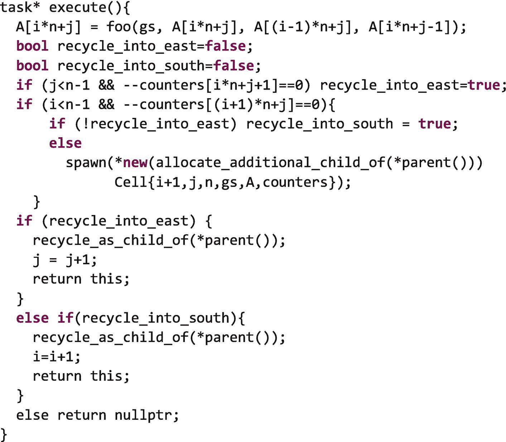

图 10-21

wavefront_v5_locality 版本的 execute()成员函数

对于巨大的波前问题，减少每个分配任务的足迹可能是相关的。根据您是否喜欢使用全局变量，您可以考虑在全局变量中存储所有任务的共享全局状态(`n`、`g` s、`A`和`counters`)。这个选项在`wavefront_v6_global`中实现，并且在本章示例的源代码目录中提供。

使用设置每个任务浮点操作数量的参数`gs`,我们发现对于执行超过 2000 次浮点操作(FLOPs)的粗粒度任务，七个版本之间没有太大差异，代码几乎呈线性扩展。这是因为与计算所有任务所需的大量时间相比，并行开销消失了。然而，对于这种粗粒度的任务，很难找到真正的波前码。在图 10-22 中，我们展示了版本 0 到 5 在四核处理器上实现的加速，更准确地说，是一个 2.6 GHz 的酷睿 i7-6700HQ (Skylake 架构，第六代)，6 MB 三级高速缓存和 16 GB RAM。粒度，`gs`，仅设置为 200 FLOPs 和`n=1024`(对于此`n`，版本 6 执行版本 5)。


图 10-22

在不同版本的四个内核上加速

很明显，TBB v5 是这个实验中的最佳解决方案。事实上，我们测量了其他更细粒度大小的加速，发现粒度越细，v4 和 v5 相对于 v1 和 v2 的改进就越好。此外，有趣的是，v4 对 v1 版本的增强指出，大量的改进贡献是由于回收优化。A. Dios 在本章末尾列出的论文中进行了更详细的研究。

由于波前算法的性能会随着任务工作负载粒度变得更细而下降，因此一种众所周知的抵消这种趋势的技术是平铺(有关简要定义，请参见词汇表)。通过平铺，我们实现了几个目标:更好地利用局部性，因为每个任务在一段时间内在数据的空间受限区域内工作；减少任务的数量(从而减少分配和生成的数量)；并且节省波前簿记中的一些开销(存储器空间和计数器/相关性矩阵的初始化时间，由于它要求每个块-瓦片一个计数器，而不是每个矩阵元素一个计数器，所以现在它变小了)。在通过平铺来粗化任务的粒度之后，我们又可以自由地进行 v1 或 v2 实现了，对吗？但是，平铺的缺点是减少了独立任务的数量(它们更粗糙，但数量更少)。然后，如果我们需要将我们的应用扩展到大量的内核，而问题的规模没有以相同的速度增长，我们可能必须从 TBB 的低级功能中挤出最后一滴可用性能。在这样具有挑战性的情况下，我们必须展示我们对 TBB 的杰出控制，并且我们已经成功地磨练了我们的并行编程技能。

## 摘要

在这一章中，我们深入研究了基于任务的替代方案，这些方案对于实现递归、分而治之和 wavefront 等应用特别有用。我们使用斐波那契数列作为一个运行的例子，它是我们第一次与已经讨论过的高级`parallel_invoke`并行实现的。然后，我们开始使用由`task_group`类提供的中级 API 潜入更深的水域。任务界面提供了更大程度的灵活性来满足我们特定的优化需求。TBB 任务是本书第一部分中介绍的其他高级模板的基础，但我们也可以利用它们来构建我们自己的模式和算法，利用延续传递、调度程序旁路和任务回收等高级技术。对于要求更高的开发人员来说，由于我们将在下一章讨论的任务优先级、任务相似性和任务排队特性，更多的可能性是可用的。我们迫不及待地想看看你能从现在你手中的这些强大的工具中创造和发展出什么。

## 更多信息

以下是我们推荐的一些与本章相关的额外阅读材料:

*   A.迪奥斯，r .阿森约，A .纳瓦罗，f .科尔贝拉，E.L .萨帕塔，基于任务的并行波前模式的案例研究，并行计算的进展:应用，工具和技术，通往万亿次计算之路，国际标准书号:978-1-61499-040-6，第 22 卷，第 65-72 页，荷兰阿姆斯特丹 ios 出版社，2012 年(可在此获得扩展版本: [`www.ac.uma.es/~compilacion/publicaciones/UMA-DAC-11-02.pdf`](http://www.ac.uma.es/~compilacion/publicaciones/UMA-DAC-11-02.pdf) )。

*   A.迪奥斯，r .阿森约，a .纳瓦罗，f .科尔贝拉，E.L .萨帕塔*基于任务的并行波前模式的高级模板，IEEE Intl。糖膏剂高性能计算大会(HiPC，2011 年)，2011 年 12 月 18 日至 21 日，印度班加罗尔。在 TBB 任务之上实现一个高级模板，以简化波前算法的实现。*

*   González Vázquez，Carlos Hugo，基于库的复杂并行模式算法解决方案，博士报告，2015 年。 [`http://hdl.handle.net/2183/14385`](http://hdl.handle.net/2183/14385) 。描述三种复杂的并行模式，并通过在 TBB 任务之上实现高级模板来解决它们。

*   英特尔 TBB 设计模式:
    *   GUI 线程: [`http://software.intel.com/en-us/node/506119`](http://software.intel.com/en-us/node/506119)

    *   重点: [`http://software.intel.com/en-us/node/506120`](http://software.intel.com/en-us/node/506120)

    *   波前: [`http://software.intel.com/en-us/node/506110`](http://software.intel.com/en-us/node/506110)

 

**开放存取**本章根据知识共享署名-非商业-非专用 4.0 国际许可协议(http://Creative Commons . org/licenses/by-NC-nd/4.0/)的条款进行许可，该协议允许以任何媒体或格式进行任何非商业使用、共享、分发和复制，只要您适当注明原作者和来源，提供知识共享许可协议的链接，并指出您是否修改了许可材料。根据本许可证，您无权共享从本章或其部分内容派生的改编材料。

本章中的图像或其他第三方材料包含在该章的知识共享许可中，除非该材料的信用额度中另有说明。如果材料未包含在本章的知识共享许可中，并且您的预期用途不被法定法规允许或超出了允许的用途，您将需要直接从版权所有者处获得许可。