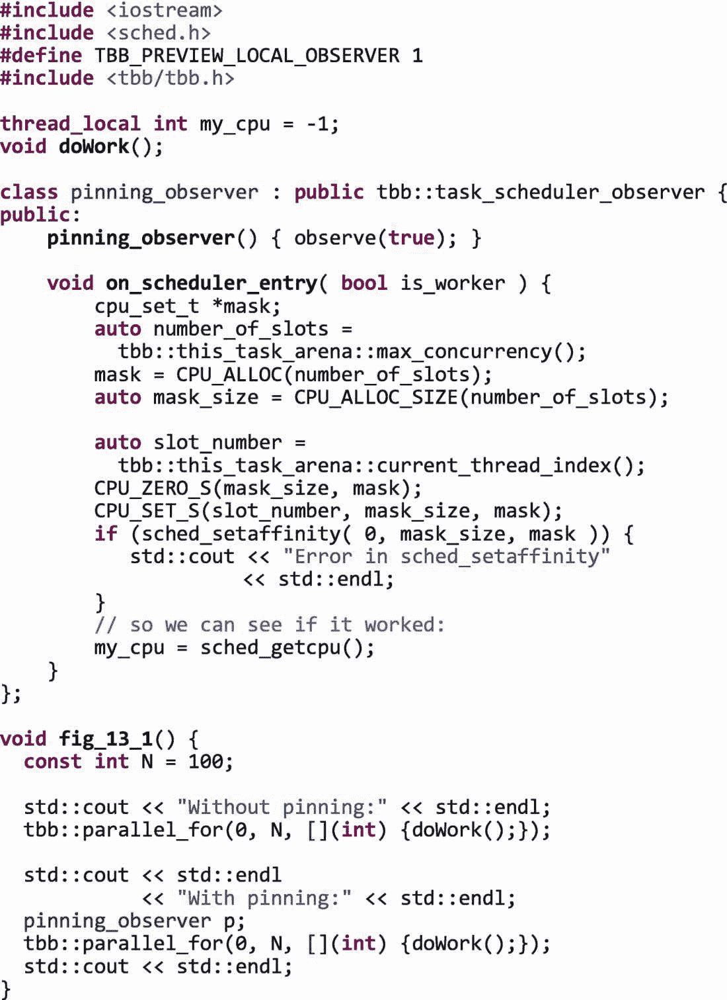
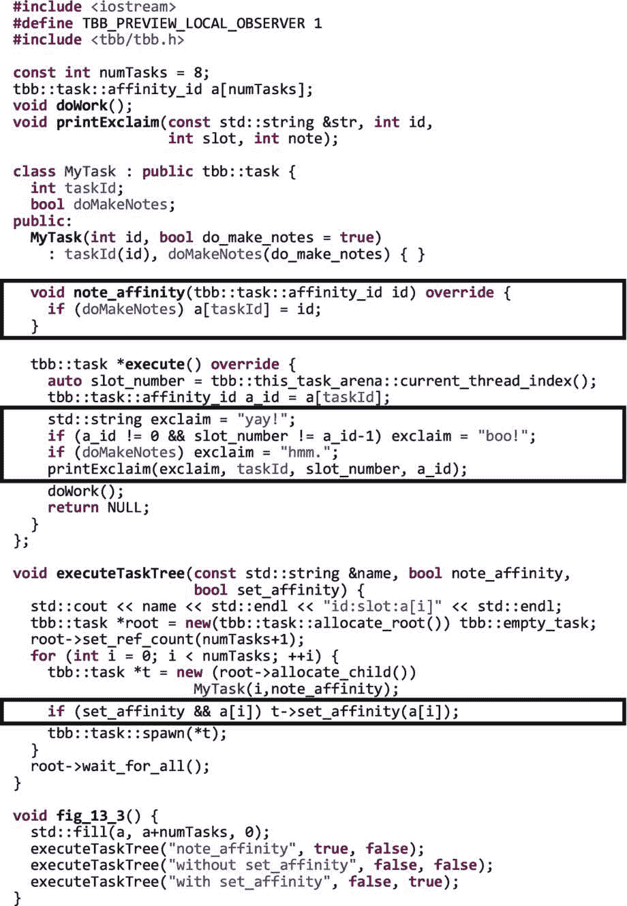
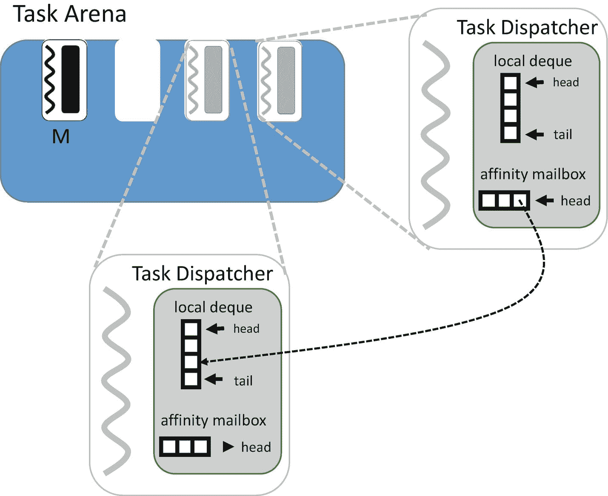
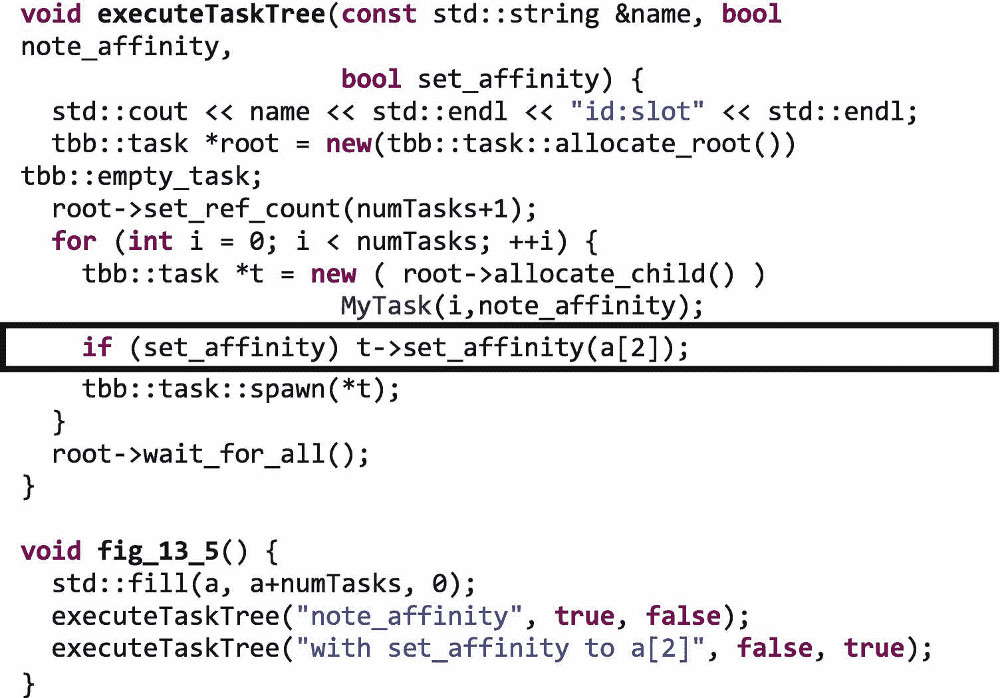

# 十三、创建线程到内核和任务到线程的亲和性

当使用线程构建模块库开发并行应用时，我们通过使用高级执行接口或低级 API 来创建任务。这些任务由 TBB 库使用工作窃取的方式调度到软件线程上。这些软件线程由操作系统(OS)调度到平台的核心(硬件线程)上。在这一章中，我们将讨论 TBB 的一些特性，这些特性让我们能够影响操作系统和 TBB 做出的调度选择。*当我们想要影响操作系统，以便它将软件线程调度到特定的内核上时，就会使用线程到内核的亲和性*。*当我们想要影响 TBB 调度程序，以便它将任务调度到特定的软件线程上时，就使用任务到线程的亲和性*。根据我们想要达到的目标，我们可能对一种或另一种亲和力感兴趣，或者对两者的结合感兴趣。

创造亲和力有不同的动机。最常见的动机之一是利用数据局部性。正如我们在本书中反复提到的，数据局部性会对并行应用程序的性能产生巨大的影响。TBB 库、它的高级执行接口、它的工作窃取调度器和它的并发容器都是在考虑了本地性的情况下设计的。对于许多应用程序来说，使用这些特性可以在不进行任何手动调整的情况下获得良好的性能。但是，有时我们需要提供提示或完全掌握自己的事情，以便 TBB 和操作系统中的调度程序更好地调度数据附近的工作。除了数据局部性之外，当使用异构系统时，当内核的能力不同时，或者当软件线程具有不同的属性时，例如更高或更低的优先级时，我们也可能对亲和性感兴趣。

在第 [16](16.html#b978-1-4842-4398-5_16) 章中，介绍了 TBB 并行算法揭示的数据局部性的高级特性。在第 [17](17.html#b978-1-4842-4398-5_17) 章中，我们将讨论 TBB 流程图中调整缓存和内存使用的特性。在第 20 章[中，我们展示了如何使用 TBB 库的特性来调优非一致内存访问(NUMA)架构。对于许多读者来说，这些章节中的信息将足以完成他们需要执行的特定任务，以调整他们的应用程序。在这一章中，我们将重点关注由 TBB 调度程序和任务提供的底层基础支持，这些任务有时由这些章节中描述的高级功能进行抽象，有时直接在这些章节中使用以创建关联性。](20.html#b978-1-4842-4398-5_20)

## 创建线程到内核的关联性

所有主流操作系统都提供了允许用户设置软件线程亲缘关系的接口，包括 Linux 上的`pthread_setaffinity_np`或`sched_setaffinity`以及 Windows 上的`SetThreadAffinityMask`。在第 20 章中，我们使用可移植硬件本地性(hwloc)包作为一种可移植的方式来设置跨平台的关联性。在这一章中，我们不关注设置亲缘关系的机制——因为这些机制会因系统而异——相反，我们关注 TBB 库提供的挂钩，这些挂钩允许我们使用这些接口来设置 TBB 主线程和辅助线程的亲缘关系。

默认情况下，TBB 库会创建足够的工作线程来匹配可用内核的数量。在第 [11](11.html#b978-1-4842-4398-5_11) 章中，我们讨论了如何改变这些默认值。无论我们是否使用默认值，TBB 库都不会自动将这些线程关联到特定的内核。TBB 允许操作系统在其认为合适的时候调度和迁移线程。在放置 TBB 线程的地方给予操作系统灵活性是库中有意的设计选择。在多程序环境中，TBB 在这个环境中表现出色，操作系统可以看到所有的应用程序和线程。如果我们在单个应用程序的有限视图中决定线程应该在哪里执行，我们可能会做出导致整体系统资源利用率低下的选择。因此，通常最好不要将线程关联到内核，而是允许操作系统选择 TBB 主线程和工作线程的执行位置，包括允许操作系统在程序执行期间动态迁移线程。

然而，就像我们将在本书的许多章节中看到的那样，TBB 图书馆提供了一些功能，如果我们愿意，可以让我们改变这种行为。如果我们想让 TBB 线程对内核具有亲和力，我们可以使用`task_scheduler_observer`类来实现(参见**用** `task_scheduler_observer` **类**观察调度程序)。该类允许应用程序定义回调，每当线程进入和离开 TBB 调度程序或特定的任务区域时调用这些回调，并使用这些回调来分配亲缘关系。TBB 库没有提供抽象来帮助进行设置线程关联性所需的特定于操作系统的调用，所以我们必须使用我们前面提到的特定于操作系统的或可移植的接口来自己处理这些底层细节。

### 用`Task_Scheduler_Observer`类观察调度程序

`task_scheduler_observer`类提供了一种观察线程何时开始或停止参与任务调度的方法。该类的接口如下所示:


为了使用这个类，我们创建了自己的类，它继承了`task_scheduler_observer`并实现了`on_scheduler_entry`和`on_scheduler_exit`回调。当这个类的一个实例被构造并且它的`observe`状态被设置为 true 时，每当一个主线程或工作线程进入或退出全局 TBB 任务调度器时，入口和出口函数将被调用。

最近对该类的扩展现在允许我们向构造器传递一个`task_arena`。该扩展是 TBB 2019 Update 4 之前的预览功能，但现在完全支持。当传递一个`task_arena`引用时，观察器将只接收进入和退出该特定领域的线程的回调:


图 [13-1](#Fig1) 展示了一个简单的例子，展示了如何在 Linux 上使用`task_scheduler_observer`对象将线程固定到内核。在这个例子中，我们使用`sched_setaffinity`函数来设置每个线程加入默认竞技场时的 CPU 掩码。在第 [20](20.html#b978-1-4842-4398-5_20) 章中，我们展示了一个使用 hwloc 软件包分配亲缘关系的例子。在图 [13-1](#Fig1) 的例子中，我们使用`tbb::this_task_arena::max_concurrency()`来查找竞技场中的槽数，使用`tbb::this_task_arena::current_thread_index()`来查找调用线程被分配到的槽。因为我们知道默认领域中的插槽数量与逻辑核心的数量相同，所以我们将每个线程固定到与其插槽号相匹配的逻辑核心。



图 13-1

在 Linux 平台上使用`task_scheduler_observer`将线程固定到内核

我们当然可以创建更复杂的方案来为线程分配逻辑内核。而且，虽然我们在图 [13-1](#Fig1) 中没有这么做，但是我们也可以为每个线程存储原始的 CPU 掩码，这样我们就可以在线程离开竞技场时恢复它。

正如我们在第 [20](20.html#b978-1-4842-4398-5_20) 章中所讨论的，我们可以使用`task_scheduler_observer`类，结合显式`task_arena`实例，来创建独立的线程组，这些线程组被限制在共享非统一内存访问(NUMA)系统(一个 NUMA 节点)中相同本地内存库的内核上。如果我们还控制数据放置，我们可以通过将工作放到数据所在的 NUMA 节点的舞台上来大大提高性能。详见第 20 章。

我们应该始终记住，如果我们使用线程到内核的亲和性，我们会阻止操作系统将线程从超额预订的内核迁移到使用率较低的内核，因为它试图优化系统利用率。如果我们在生产应用中这样做，我们需要确保不会降低多道程序的性能！正如我们将多次提到的，只有专门运行单个应用程序的系统才有可能拥有限制动态迁移的环境。

## 创建任务到线程的关联性

因为我们在 TBB 使用任务来表达我们的并行工作，所以创建线程到内核的亲和性，正如我们在上一节中所描述的，只是难题的一部分。如果我们将线程固定到内核上，我们可能不会得到太多好处，但是会让我们的任务被工作窃取随机移动！

当使用第 10 章[中介绍的低级 TBB 任务接口时，我们可以提供一些提示，告诉 TBB 调度器应该在特定的 arena 槽中的线程上执行一个任务。因为我们可能会尽可能使用更高级的算法和任务接口，例如`parallel_for`、`task_group`和流程图，但是我们很少直接使用这些低级接口。第](10.html#b978-1-4842-4398-5_10) [16](16.html#b978-1-4842-4398-5_16) 章展示了`affinity_partitioner`和`static_partitioner`类如何与 TBB 循环算法一起使用，从而在不求助于这些低级接口的情况下创建亲缘关系。类似地，第 [17](17.html#b978-1-4842-4398-5_17) 章讨论了影响亲和力的 TBB 流图的特征。

因此，虽然任务到线程的亲和性是在低级任务类中公开的，但我们将通过高级抽象几乎专门使用这一特性。因此，使用我们在本节中描述的接口是留给 TBB 专家的，他们使用最底层的任务接口编写自己的算法。如果您是这样的专家，或者想更深入地了解高级接口是如何实现亲和力的，请继续阅读这一部分。

图 [13-2](#Fig2) 显示了 TBB `task`类提供的函数和类型，我们用它们来提供相似性提示。


图 13-2

`tbb::task`中用于任务到线程关联的函数

类型`affinity_id`被用来表示一个任务在竞技场中的位置。零值意味着任务没有关联性。非零值具有映射到 arena 槽的实现定义的值。在生成任务之前，我们可以通过向其`set_affinity`函数传递一个`affinity_id`来设置任务与竞技场插槽的亲缘关系。但是因为`affinity_id`的含义是由实现定义的，所以我们不传递特定的值，例如 2 表示插槽 2。相反，我们通过覆盖`note_affinity`回调函数从之前的任务执行中捕获一个`affinity_id`。

当(1)任务没有亲缘关系，但是将在除了产生它的线程之外的线程上执行，或者(2)任务有亲缘关系，但是将在除了它的亲缘关系所指定的线程之外的线程上执行时，函数`note_affinity`由 TBB 库在调用任务的`execute`函数之前调用。通过覆盖这个回调，我们可以跟踪 TBB 窃取行为，这样我们就可以向库提供提示，以便在算法的后续执行中重新创建相同的窃取行为，正如我们将在下一个示例中看到的那样。

最后，`affinity`函数让我们查询任务的当前亲缘性设置。

图 [13-3](#Fig3) 显示了一个继承自`tbb::task`的类，它使用任务关联函数将`affinity_id`的值记录到一个全局数组`a`中。它只记录其`doMakeNotes`变量设置为真时的值。`execute`函数打印任务 id、它正在执行的线程的槽，以及记录在这个任务 id 数组中的值。如果任务的`doMakeNotes`为真(它将记录该值)，它将在报告前加上“嗯”前缀，“耶！”如果任务正在 array `a`中记录的 arena 槽中执行(它被再次调度到同一个线程上)，并且“boo！”如果它在不同的竞技场插槽中执行。打印的细节包含在函数`printExclaim`中。



图 13-3

使用任务关联性函数

虽然`affinity_id`的含义是实现定义的，但 TBB 是开源的，所以我们在实现方面达到了顶峰。因此我们知道，如果没有亲缘关系，`affinity_id`是 0，否则它是槽索引加 1。在 TBB 的生产应用中，我们不应该依赖这些知识，但是在我们的例子的`execute`函数中，我们依赖这些知识，所以我们可以分配正确的感叹词“耶！”或者“嘘！”。

图 [13-3](#Fig3) 中的函数`fig_13_3`构建并执行三个任务树，每个任务树有八个任务，并给它们分配从 0 到 7 的 id。这个例子使用了我们在第 [10 章](10.html#b978-1-4842-4398-5_10)中介绍的低级任务接口。第一个任务树使用`note_affinity`来跟踪任务何时被窃取，以便在主线程之外的其他线程上执行。第二个任务树执行时没有注意或设置关联性。最后，最后一个任务树使用`set_affinity`来重新创建第一次运行时记录的调度。

当我们在具有八个线程的平台上执行这个示例时，我们记录了以下输出:

```cpp

note_affinity
id:slot:a[i]
hmm. 7:0:-1
hmm. 0:1:1
hmm. 1:6:6
hmm. 2:3:3
hmm. 3:2:2
hmm. 4:4:4
hmm. 5:7:7
hmm. 6:5:5

without set_affinity
id:slot:a[i]
yay! 7:0:-1
boo! 0:4:1
boo! 1:3:6
boo! 4:5:4
boo! 3:7:2
boo! 2:2:3
boo! 5:6:7
boo! 6:1:5

with set_affinity
id:slot:a[i]
yay! 7:0:-1
yay! 0:1:1
yay! 4:4:4
yay! 5:7:7
yay! 2:3:3
yay! 3:2:2
yay! 6:5:5
yay! 1:6:6

```

从这个输出中，我们看到第一棵树中的任务分布在八个可用的线程上，每个任务的`affinity_id`记录在数组`a`中。执行下一组任务时，每个任务记录的`affinity_id`不用于设置亲和度，任务被不同的线程随机窃取。这就是随机偷窃所做的！但是，当我们执行最后一个任务树并使用`set_affinity`时，第一次运行的线程分配被重复。太好了，这正是我们想要的！

然而，`set_affinity`只提供了一个亲和*提示*，TBB 图书馆实际上可以随意忽略我们的请求。当我们使用这些接口设置亲缘关系时，对具有亲缘关系的任务的引用被放置在目标线程的亲缘关系邮箱中(参见图 [13-4](#Fig4) )。但是实际的任务保留在产生它的线程的本地队列中。任务分派器仅在其本地队列中的工作耗尽时检查亲和邮箱，如第 [9](pt2.html#b978-1-4842-4398-5_9) 章中的任务分派循环所示。因此，如果一个线程没有足够快地检查它的相似性邮箱，另一个线程可能会先窃取或执行它的任务。



图 13-4

相似性邮箱保存对任务的引用，该任务保留在产生该任务的线程的本地队列中

为了证明这一点，我们可以在我们的小例子中改变任务关联性的分配方式，如图 [13-5](#Fig5) 所示。现在，愚蠢的是，我们将所有的亲缘关系都设置到了同一个槽位，即`a[2]`中记录的那个槽位。



图 13-5

首先运行不同任务组的功能，有时记录相似性，有时设置相似性。还显示了一个输出示例。

如果 TBB 调度器接受我们的相似性请求，将会有很大的负载不平衡，因为我们已经要求它将所有的工作发送到同一个工作线程。但是如果我们执行这个新版本的示例，我们会看到:


因为 affinity 只是一个提示，所以其他空闲线程仍然会找到任务，在槽`a[2]`中的线程能够清空其 affinity 邮箱之前，从主线程的本地队列中窃取它们。事实上，只有第一个产生的任务`id==0`被线程在先前记录在`a[2]`中的槽中执行。因此，我们仍然看到我们的任务分布在所有八个线程上。

TBB 库忽略了我们的请求，而是避免了将所有这些任务发送到同一个线程所造成的负载不平衡。这种弱亲缘关系在实践中是有用的，因为它让我们交流亲缘关系，即*应该*提高性能，但它仍然允许库进行调整，以便我们不会无意中造成很大的负载不平衡。

虽然我们可以直接使用这些任务接口，但我们在第 [16 章](16.html#b978-1-4842-4398-5_16)中看到，循环算法提供了一个简化的抽象，`affinity_partitioner`幸运的是，它对我们隐藏了这些底层细节。

## 我们应该何时以及如何使用 TBB 亲和力特征？

只有当我们在专用系统上调优以获得绝对最佳的性能时，我们才应该使用`task_scheduler_observer`对象来创建线程到内核的亲和性。否则，我们应该让操作系统去做它的工作，并从全局的角度来调度它认为合适的线程。如果我们选择将线程绑定到内核，我们应该仔细权衡将这种灵活性从操作系统中移除的潜在影响，尤其是如果我们的应用程序运行在多程序环境中。

对于任务到线程的亲和性，我们通常希望使用高级接口，比如第 [16](16.html#b978-1-4842-4398-5_16) 章中描述的`affinity_partitioner`。`affinity_partitioner`使用本章描述的特性来跟踪任务的执行位置，并向 TBB 调度程序提供提示，以便在循环的后续执行中重放分区。它还跟踪更改以保持提示是最新的。

因为 TBB 任务关联性只是调度器提示，误用这些接口的潜在影响要小得多——所以我们在使用任务关联性时不需要那么小心。事实上，我们应该被鼓励去尝试任务相似性，特别是通过更高层次的接口，作为调整我们的应用程序的正常部分。

## 摘要

在本章中，我们讨论了如何在我们的 TBB 应用中创建线程到内核和任务到线程的亲和性。虽然 TBB 没有提供一个接口来处理设置线程到内核亲缘关系的机制，但它的`class task_scheduler_observer`提供了一个回调机制，允许我们插入必要的调用到我们自己的特定于操作系统的或可移植的库，这些库分配亲缘关系。因为 TBB 偷工减料调度程序随机地将任务分配给软件线程，线程与内核的亲和性本身并不总是足够的。因此，我们也讨论了 TBB 的`class task`中的接口，它让我们向 TBB 调度器提供关于我们希望任务被调度到哪个软件线程上的相似性提示。我们注意到我们很可能不会直接使用这些接口，而是使用第 [16](16.html#b978-1-4842-4398-5_16) 和 [17](17.html#b978-1-4842-4398-5_17) 章中描述的更高级接口。对于有兴趣了解这些低级接口的读者，我们提供了一些例子，展示了如何使用`note_affinity`和`set_affinity`函数为使用低级 TBB 任务接口的代码实现任务到线程的相似性。

就像 TBB 库的许多优化特性一样，需要小心使用相似性。不正确地使用线程到内核的关联性会限制操作系统平衡负载的能力，从而显著降低性能。使用任务到线程的相似性提示，仅仅是 TBB 调度器可以忽略的提示，如果不明智地使用，可能会对性能产生负面影响，但影响要小得多。

## 更多信息

*   Posix 设置/获取 CPU 对一个线程的亲和力， [`http://man7.org/linux/man-pages/man3/pthread_setaffinity_np.3.html`](http://man7.org/linux/man-pages/man3/pthread_setaffinity_np.3.html)

*   SetThreadAffinityMask 函数， [`https://docs.microsoft.com/en-us/windows/desktop/api/winbase/nf-winbase-setthreadaffinitymask`](https://docs.microsoft.com/en-us/windows/desktop/api/winbase/nf-winbase-setthreadaffinitymask)

*   可移植硬件位置(hwloc)， [`www.open-mpi.org/projects/hwloc/`](http://www.open-mpi.org/projects/hwloc/)

[](https://creativecommons.org/licenses/by-nc-nd/4.0) 

**开放存取**本章根据知识共享署名-非商业-非专用 4.0 国际许可协议(http://Creative Commons . org/licenses/by-NC-nd/4.0/)的条款进行许可，该协议允许以任何媒体或格式进行任何非商业使用、共享、分发和复制，只要您适当注明原作者和来源，提供知识共享许可协议的链接，并指出您是否修改了许可材料。根据本许可证，您无权共享从本章或其部分内容派生的改编材料。

本章中的图像或其他第三方材料包含在该章的知识共享许可中，除非该材料的信用额度中另有说明。如果材料未包含在本章的知识共享许可中，并且您的预期用途不被法定法规允许或超出了允许的用途，您将需要直接从版权所有者处获得许可。