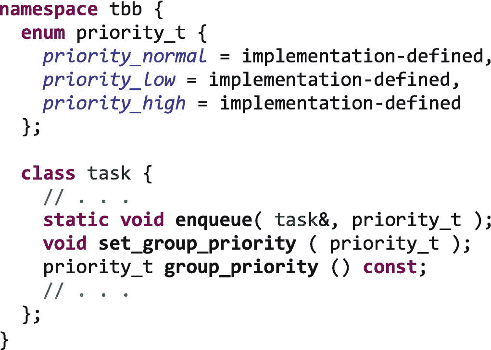
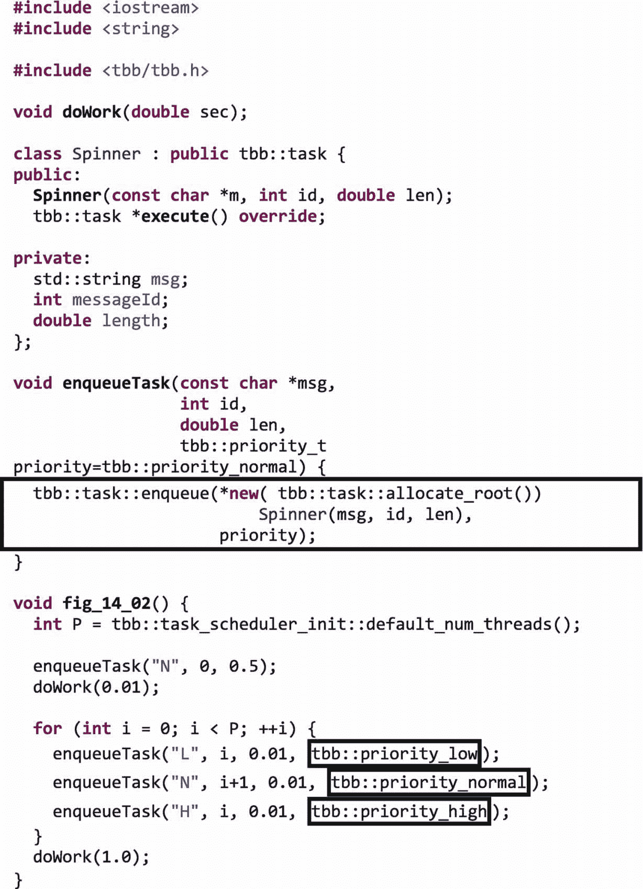
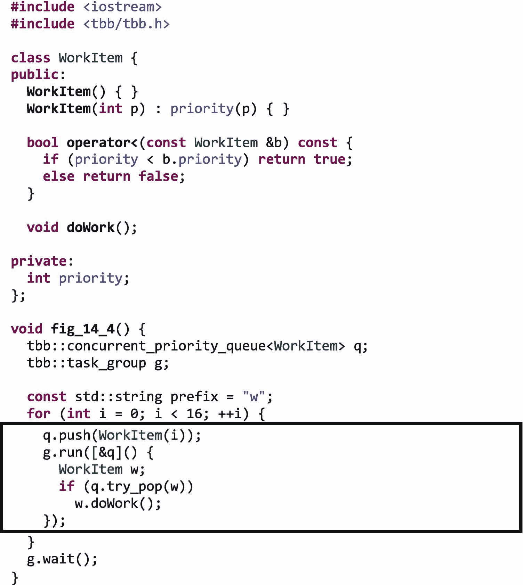

# 十四、使用任务优先级

线程构建模块调度程序不是实时调度程序，因此不适合在*硬*实时系统中使用。在实时系统中，可以给任务一个必须完成的截止日期，如果错过了截止日期，任务的有用性就会降低。在硬实时系统中，错过最后期限会导致整个系统失败。在软实时系统中，错过截止时间并不是灾难性的，但会导致服务质量下降。TBB 图书馆不支持给任务分配期限，但是它支持任务优先级。这些优先级可能在具有软实时需求的应用中有用。无论它们是否足够，都需要了解应用程序的软实时需求以及 TBB 任务和任务优先级的属性。

除了软实时使用，任务优先级还可以有其他用途。例如，我们可能希望优先处理一些任务，因为这样做会提高性能或响应能力。也许我们想让释放内存的任务优先于分配内存的任务，以便减少应用程序的内存占用。或者，我们希望将接触缓存中已有数据的任务优先于将新数据加载到缓存中的任务。

在本章中，我们将描述 TBB 任务和 TBB 任务调度程序所支持的任务优先级。考虑将 TBB 用于软实时应用程序的读者可以使用这些信息来确定 TBB 是否足以满足他们的要求。如果需要实现受益于任务优先级的性能优化，其他读者可能会发现这些信息很有用。

## 支持 TBB 任务类中的非抢占式优先级

就像在第 13 章中描述的对任务关联性的支持一样，TBB 对优先级的支持是通过低级任务类中的函数来实现的。TBB 图书馆定义了三个优先级:`priority_normal`、`priority_low`、`priority_high`，如图 [14-1](#Fig1) 所示。



图 14-1

支持优先级的类任务的类型和功能

一般来说，TBB 会在优先级较低的任务之前执行优先级较高的任务。但是有一些警告。

最重要的警告是，TBB 任务是由 TBB 线程非抢占式执行的。一旦任务开始执行，它将执行到完成——即使更高优先级的任务已经产生或排队。虽然这种行为看起来是一个缺点，因为它可能会延迟应用程序切换到更高优先级的任务，但它也是一个优点，因为它可以帮助我们避免一些危险的情况。想象一下，如果一个任务 t <sub>0</sub> 持有一个共享资源的锁，然后产生了更高优先级的任务。如果 TBB 不允许 t <sub>0</sub> 完成并释放它的锁，那么如果更高优先级的任务阻塞对同一资源的锁的获取，它们就会死锁。一个更复杂但类似的问题，*优先级反转*，是 20 世纪 90 年代末火星探路者号出现问题的著名原因。在“火星上发生了什么？”，迈克·琼斯建议优先继承作为解决这些情况的一种方法。使用优先级继承，阻塞较高优先级任务的任务继承它阻塞的最高任务的优先级。TBB 库没有实现优先级继承或其他复杂的方法，因为它使用了非抢占式优先级，避免了许多这样的问题。

TBB 库**没有为设置 ***线程优先级*** 提供任何高级抽象。因为在 TBB 中没有对线程优先级的高级支持，如果我们想要设置线程优先级，我们需要使用特定于操作系统的代码来管理它们——就像我们在第 [13](13.html#b978-1-4842-4398-5_13) 章中对线程到内核关联性所做的那样。就像线程到内核的亲和性一样，当线程进入和退出 TBB 任务调度程序或特定的任务领域时，我们可以使用`task_scheduler_observer`对象并在回调中调用这些特定于操作系统的接口。但是，我们警告开发人员在使用 ***线程优先级*** 时要格外小心。如果我们引入线程优先级，这是抢占式的，我们也邀请回来所有已知的病理伴随抢占式优先级，如优先级反转。**

 **### 重要的经验法则

不要为在同一舞台上运行的线程设置不同的优先级。奇怪的事情会发生，因为 TBB 平等地对待竞技场中的线程。

除了 TBB 任务执行的不可抢占性之外，它对任务优先级的支持还有一些其他重要的限制。首先，更改可能不会立即在所有线程上生效。即使存在较高优先级的任务，一些较低优先级的任务也可能开始执行。第二，工作者线程可能需要迁移到另一个领域来获得对最高优先级任务的访问，正如我们之前在第 [12](12.html#b978-1-4842-4398-5_12) 章中提到的，这可能需要时间。一旦工作者已经迁移，这可能会留下一些没有工作者线程的领域(没有高优先级任务)。但是，因为主线程不能迁移，所以主线程将留在那些领域中，并且它们自己不会被停止——它们可以继续从它们自己的任务领域中执行任务，即使它们具有较低的优先级。

任务优先级并不像第 13 章中描述的 TBB 对任务-线程相似性的支持。尽管如此，还是有足够多的警告让任务优先级在实践中比我们期望的要弱。此外，在复杂的应用程序中，只支持低、正常和高三个优先级，这是非常有限的。尽管如此，我们将在下一节继续描述使用 TBB 任务优先级的机制。

## 设置静态和动态优先级

*静态优先级*可以分配给排队到共享队列的单个任务(参见第 [10 章](10.html#b978-1-4842-4398-5_10)中的排队任务)。通过`set_group_priority`函数或者通过`task_group_context`对象的`set_priority`函数，动态优先级*可以被分配给任务组(参见`task_group_context`侧栏)。*

### `Task_Group_Context`:每个任务都属于一个组

一个`task_group_context`代表一组可以一起取消或设置优先级的任务。所有任务都属于某个组，一个任务一次只能是其中一个组的成员。

在第 10 章[的](10.html#b978-1-4842-4398-5_10)中，我们使用特殊函数比如`allocate_root()`来分配 TBB 任务。这个函数有一个重载，让我们将一个`task_group_context`分配给一个新分配的根任务:


`task_group_context`也是 TBB 高级算法和 TBB 流图的可选参数，例如:


我们可以在分配期间在任务级别分配组，也可以通过更高级的接口，例如 TBB 算法和流程图。还有其他的抽象，比如`task_group`，让我们为了执行的目的对任务进行分组。`task_group_context`组的目的是支持取消、异常处理和优先级。

当我们使用`task::enqueue`函数来提供一个优先级时，这个优先级只影响单个任务，并且以后不能改变。当我们给一组任务分配一个优先级时，这个优先级会影响组中的所有任务，并且这个优先级可以在任何时候通过调用`task::set_group_priority`或`task_group_context::set_priority`来改变。

TBB 调度器跟踪就绪任务的最高优先级，包括排队的和产生的任务，并推迟(除了前面的警告)较低优先级任务的执行，直到所有较高优先级任务都被执行。默认情况下，所有任务和任务组都是用`priority_normal`创建的。

## 两个小例子

图 [14-2](#Fig2) 显示了一个例子，它在一个有 P 个逻辑内核的平台上排列了 25 个任务。每个任务在给定的持续时间内积极地旋转。`task_priority`函数中的第一个任务以正常优先级排队，并被设置为旋转大约 500 毫秒。然后，函数中的 for 循环创建 P 个低优先级、P 个普通优先级和 P 个高优先级任务，每个任务都将活跃地旋转大约 10 毫秒。当每个任务执行时，它会将一条消息记录到线程本地缓冲区中。高优先级任务`id`以`H`为前缀，普通任务`id`以`N`为前缀，低优先级任务`id`以`L`为前缀。在函数结束时，打印所有线程本地缓冲区，提供参与线程执行任务的顺序。这个例子的完整实现可以在 Github 库中找到。



图 14-2

将具有不同优先级的任务排队

在具有八个逻辑核心的系统上执行此示例，我们会看到以下输出:

```cpp

N:0              ← thread 1
H:7 H:5 N:3 L:7  ← thread 2
H:2 H:1 N:8 L:5  ← thread 3
H:6 N:1 L:3 L:2  ← thread 4
H:0 N:2 L:6 L:4  ← thread 5
H:3 N:4 N:5 L:0  ← thread 6
H:4 N:7 N:6 L:1  ← thread 8

```

在这个输出中，每一行代表一个不同的 TBB 工作线程。对于每个线程，它执行的任务从左到右排序。主线程从不参与这些任务的执行，因为它不调用`wait_for_all`，所以我们只能看到 7 行。第一个线程只执行第一个执行了 500 毫秒的正常优先级的长任务。因为 TBB 任务是不可抢占的，所以这个线程一旦开始就不能放弃这个任务，所以即使当更高优先级的任务变得可用时，它也继续执行这个任务。否则，我们会看到，即使`for`-循环将高优先级、普通优先级和低优先级任务混合在一起排队，高优先级任务也会首先由工作线程执行，然后是普通任务，最后是低优先级任务。

图 [14-3](#Fig3) 显示了使用两个本机线程`t0`和`t1`并行执行两个`parallel_for`算法的代码。每个`parallel_for`有 16 次迭代，并使用一个`simple_partitioner`。如第 [16](16.html#b978-1-4842-4398-5_16) 章中更详细的描述，一个`simple_partitioner`划分迭代空间，直到达到一个固定的粒度，默认的粒度是 1。在我们的例子中，每个`parallel_for`将产生 16 个任务，每个任务将持续 10 毫秒。线程`t0`执行的循环首先创建一个`task_group_context`，并将其优先级设置为`priority_high`。由另一个线程`t1`执行的循环使用默认的`task_group_context`，它有一个`priority_normal`。


图 14-3

执行具有不同优先级的算法

在具有八个逻辑内核的平台上执行时，示例输出如下:

```cpp

Normal
High
High
High
High
High
High
Normal
High
High
High
High
High
High
High
High
Normal
High
High
Normal
Normal
Normal
Normal
Normal
Normal
Normal
Normal
Normal
Normal
Normal
Normal
Normal

```

最初，执行了七个“`High`”任务

对于每一个“`Normal`”任务。这是因为以普通优先级启动了`parallel_for`的线程`t1`不能从它的隐式任务竞技场迁移出去。它只能执行“`Normal`”任务。然而，其他七个线程只执行“`High`”任务，直到它们全部完成。一旦高优先级任务完成，工作线程就可以迁移到线程`t1`的竞技场来帮忙。

## 不使用 TBB 任务支持来实施优先级

低，正常，高不够怎么办？一种解决方法是生成通用包装器任务，这些任务查看优先级队列或其他数据结构，以找到它们应该做的工作。通过这种方法，我们依靠 TBB 调度器将这些通用包装器任务分布在内核上，但任务本身通过共享数据结构强制实施优先级。

图 [14-4](#Fig4) 显示了一个使用`task_group`和`concurrent_priority_queue`的例子。当一项工作需要完成时，采取两个动作:(1)将工作的描述推入共享队列，以及(2)在`task_group`中产生一个包装器任务，它将弹出并执行共享队列中的一个项目。结果是，每个工作项只产生一个任务——但是直到任务执行后才确定任务将处理的具体工作项。



图 14-4

使用并发优先级队列将工作提供给包装任务

默认情况下，`concurrent_priority_queue`依赖于`operator<`来决定顺序，所以当我们定义如图 [14-4](#Fig4) 所示的`work_item::operator<`时，我们将看到一个输出，显示项目以降序执行，从 15 到 0:

```cpp

WorkItem: 15
WorkItem: 14
WorkItem: 13
WorkItem: 12
WorkItem: 11
WorkItem: 10
WorkItem: 9
WorkItem: 8
WorkItem: 7
WorkItem: 6
WorkItem: 5
WorkItem: 4
WorkItem: 3
WorkItem: 2
WorkItem: 1
WorkItem: 0

```

如果我们将运算符改为返回 true if `(` `priority > b.priority` `)`，那么我们将看到任务从 0 到 15 按升序执行。

使用通用包装器任务方法提供了更大的灵活性，因为我们可以完全控制如何定义优先级。但是，至少在图 [14-4](#Fig4) 中，它引入了一个潜在的瓶颈——线程并发访问的共享数据结构。即便如此，当 TBB 任务优先级不够时，我们可能会使用这种方法作为备用计划。

## 摘要

在本章中，我们概述了 TBB 的任务优先级支持。使用`class task`提供的机制，我们可以为任务分配低、正常和高优先级。我们展示了可以使用`task_group_context`对象将静态优先级分配给排队的任务，将动态优先级分配给任务组。因为 TBB 任务是由 TBB 工作线程非抢占式执行的，所以 TBB 的优先级也是非抢占式的。我们简要讨论了非抢占式优先级的优点和缺点，还强调了在使用这种支持时需要注意的一些其他注意事项。然后，我们提供了几个简单的例子，展示了如何将任务优先级应用于 TBB 任务和算法。

由于库中的任务优先级支持有许多限制，我们用一个使用包装器任务和优先级队列的替代方案来结束我们的讨论。

TBB 调度程序不是一个硬实时调度程序。我们在这一章中看到，尽管对任务和算法的优先级排序有一些有限的支持。这些特性对于软实时应用程序或应用性能优化是否有用，需要由开发人员根据具体情况来考虑。

## 更多信息

*迈克·琼斯，“火星上发生了什么？”1997 年 12 月 5 日发出的通知。* [`www.cs.cmu.edu/afs/cs/user/raj/www/mars.html`](http://www.cs.cmu.edu/afs/cs/user/raj/www/mars.html) *。*

沙、拉杰库马尔和莱霍奇基。优先级继承协议:一种实时同步的方法。IEEE 计算机学报，第 39 卷，第 1175-1185 页，1990 年 9 月。

[](https://creativecommons.org/licenses/by-nc-nd/4.0) 

**开放存取**本章根据知识共享署名-非商业-非专用 4.0 国际许可协议(http://Creative Commons . org/licenses/by-NC-nd/4.0/)的条款进行许可，该协议允许以任何媒体或格式进行任何非商业使用、共享、分发和复制，只要您适当注明原作者和来源，提供知识共享许可协议的链接，并指出您是否修改了许可材料。根据本许可证，您无权共享从本章或其部分内容派生的改编材料。

本章中的图像或其他第三方材料包含在本章的知识共享许可中，除非在材料的信用额度中另有说明。如果材料不包括在本章的知识共享许可中，并且您的预期使用不被法律法规允许或超出了允许的使用范围，您将需要直接从版权所有者处获得许可。**