# 十八、使用异步节点增强流程图

早在 2005 年，Herb Sutter 写了“免费的午餐结束了” <sup>1</sup> 的论文来警告我们多核时代的到来及其对软件开发的影响。在多核时代，关心性能的开发人员再也不能坐以待毙，懒洋洋地等待下一代处理器，以便高兴地看到他们的应用运行得更快。那些日子早已过去。Herb 的意思是，希望充分利用现代处理器的开发人员必须接受并行技术。在这本书的这一点上，我们当然知道这一点，那又怎么样呢？嗯，我们认为今天“午餐越来越贵了。”我们来详细阐述一下这个。

近年来，在能源限制的强烈推动下，更复杂的处理器已经出现。如今，不难发现包含一个或多个 GPU、FPGA 或 DSP 以及一个或多个多核 CPU 的异构系统。就像我们采用并行来充分利用所有 CPU 内核一样，现在将部分计算卸载到这些加速器上也是有意义的。但是，嘿，这太难了！是的，它是！如果顺序编程曾经是“免费的午餐”，那么今天的异构并行编程更像是三星级米其林餐厅的盛宴——我们必须付费，但它太棒了！

TBB 有助于节省一些晚餐的价格吗？当然可以！你怎么敢怀疑？在本书的这一章和下一章中，我们将介绍 TBB 图书馆最近整合的功能，以帮助人们再次负担得起午餐——我们将展示如何将计算卸载到异步设备，从而拥抱异构计算。在这一章中，我们将采用 TBB 流图接口，并用一种新的节点类型来加强它:`async_node`。在下一章中，我们将更进一步，将流图放在 OpenCL Steroids 上。

## 异步世界示例

让我们从使用`async_node`的最简单的例子开始。我们将说明为什么这个特定的流图节点是有用的，我们还将给出一个对下一章有用的更复杂的例子。

因为没有比“Hello World”代码片段更简单的了，所以我们提出了一个基于流图 API 的“`Async World`”替代方案，它在图中包含了一个`async_node`。如果您对 TBB 的流程图有疑问，您可能希望通读第三章以获得可靠的背景信息，并使用附录 B 中的“流程图”部分作为 API 的参考。我们在第一个例子中建立的流程图如图 18-1 所示。

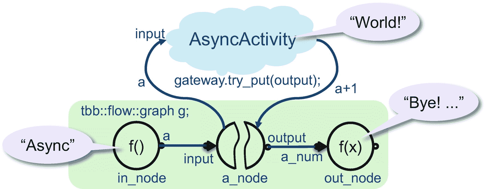

图 18-1

“异步世界”示例的流程图

我们的目标是从一个`source_node`、`in_node`向一个`asynchronous node`、`a_node`发送一条消息，但是这个任务不是在`a_node`内部处理消息，而是被卸载到一个正在某个地方运行的异步活动(一个不同的 MPI 节点，一个 OpenCL 支持的 GPU，一个 FPGA，你能想到的)。一旦这个异步任务完成，流图引擎必须取回控制，读取异步活动的输出，并将消息传播到图中的后代节点。在我们非常简单的"`Async World`"例子中，`in_node`只是打印出"`Async`，并将`a=10`传递给`a_node`。`a_node`接收`a=10`作为`input`并将其转发给`AsyncActivity`。在这个例子中，`AsyncActivity`是一个类，它只是增加输入消息并输出“`World!`”。这两个动作在一个新的线程中执行，该线程在这里模拟一个异步操作或设备。只有当`AsyncActivity`设计用`output=11`响应时，`out_node`才会收到该值，程序结束。

图 18-2 中的代码包含了`async_world()`函数定义，我们在其中构建了由图 18-1 的三个节点组成的图`g`。

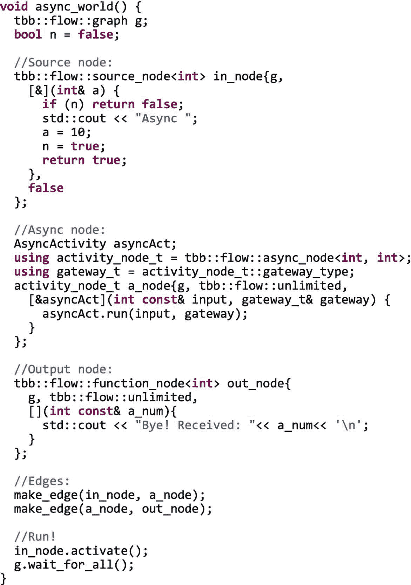

图 18-2

构建“`Async World`”示例的流程图

在附录 B 的图 B-37 的表格的第一个条目中描述了`source_node`接口。在我们的例子中，我们创建了`source_node`类型的`in_node`。lambda 的参数`int& a`实际上是将被发送到图中它的后继节点`async_node`的输出消息。当源节点在接近`async_world()`函数结束时被激活，通过使用`in_node.activate()`，lambda 将只被执行一次，因为它只为第一次调用返回`true`(最初`n=false`，`n`在 lambda 中被设置为`true`，只有在`n=true`时才返回 true)。在这个调用中，带有`a=10`的消息被发送到图中的下一个节点。`in_node`的最后一个参数是`false`，以便源节点在休眠模式下创建，并且仅在调用`in_node.activate()`后唤醒(否则，节点在输出边沿连接后立即开始发送消息)。

接下来是`async_node`定义。`async_node`接口所需的语法是


在我们的例子中，`a_node`是在这里构造的:


这在图`g`中创建了一个具有`unlimited`并发性的`async_node<int, int>`。通过使用`unlimited`，我们指示库在消息到达时立即生成一个任务，而不管已经生成了多少其他任务。如果我们只想同时调用`a_node`的`4`，我们可以将`unlimited`改为`4`。模板参数`<int, int>`指出类型`int`的消息进入`a_node`，类型`int`的消息离开`a_node`。`a_node`构造器中使用的 lambda 如下:


它通过引用捕获一个`AsyncActivity`对象`asyncAct`，并声明对于到达`a_node`的每个消息必须运行的仿函数。这个仿函数有两个参数，`input`和`gateway`，通过引用传递。但是等等，我们不是说过模板参数`<int, int>`意味着节点期望一个传入的整数并发出一个传出的整数吗？仿子的原型不应该是`(const int& input) -> int`吗？嗯，对于普通的`function_node`来说应该是这样，但是我们现在面对的是`async_node`和它的特殊性。这里，我们得到了预期的`const int& input`，但是还有第二个输入参数`gateway_t& gateway`，它作为一个接口将`AsyncActivity`的输出注入到图中。我们在讲解`AsyncActivity`类的时候会讲到这一招。现在，为了完成对这个节点的描述，让我们假设它基本上用`asyncAct.run(input, gateway)`调度`AsyncActivity`。

输出节点`out_node`是一个`function_node`，它在本例中被配置为不发送任何输出消息的端节点:


该节点接收来自`AsyncActivity`到`gateway`的整数，并完成打印“`Bye!`，后跟该整数的值。

在图 18-2 中`Async World`示例的最后几行，我们发现两个`make_edge`调用创建了图 18-1 中描述的连接，最后该图被`in_node.activate()`唤醒，立即等待，直到所有消息都被`g.wait_for_all()`处理完毕。

接下来是`AsyncActivity`类，它实现了我们例子中的异步计算，如图 18-3 所示。


图 18-3

异步活动的实现

公共成员函数“`run`”(在`a_node`的带有`asyncAct.run`的仿函数中调用)首先执行`gateway.reserve_wait()`，通知流程图工作已经提交给外部活动，因此在`async_world()`结束时`g.wait_for_all()`可以考虑到这一点。然后，产生一个异步线程来执行 lambda，它通过引用捕获`gateway`,通过值捕获`input`整数。通过值传递`input`很关键，因为否则引用的变量`source_node`中的`a`可能会在线程读取其值之前被破坏(如果`source_node`在`asyncThread`可以读取`a`的值之前结束)。

线程构造器中的 lambda 首先打印“`World`”消息，然后分配`output=11` ( `input+1`，更准确地说)。这个输出通过调用成员函数`gateway.try_put(output)`传递回流程图。最后，通过`gateway.release_wait()`，我们通知流程图，就`AsyncActivity`而言，无需再等待。

### 注意

不需要为提交给外部活动的每个输入消息调用成员函数`reserve_wait()`。唯一的要求是每个对`reserve_wait()`的调用必须有一个对`release_wait()`的相应调用。请注意，当有一些`reserve_wait()`调用不匹配`release_wait()`时，`wait_for_all()`不会退出

结果代码的输出是

```cpp

Async World! Input: 10
Bye! Received: 11

```

其中“`Async`由`in_node`写，“`World! Input: 10`由异步任务写，最后一行由`out_node`写。

## 为什么以及何时`async_node`？

现在，可能会有读者表现出自负的傻笑，并认为“我不需要一个`async_node`来实现它。”为什么我们不依靠好的 ol' `function_node`？

例如，`a_node`可以如图 18-4 所示实现，这里我们使用一个`function_node`接收一个整数`input`，并返回另一个整数`output`。相应的 lambda 表达式生成一个线程`asyncThread`，它打印并生成`output`值，然后等待线程完成`asyncThread.join()`并愉快地返回`output`。

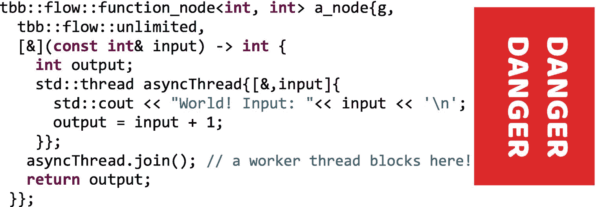

图 18-4

创建并等待异步线程的最简单的实现。有人说危险吗？

如果你以前不是那种傻笑的读者，那现在呢？因为，这个简单得多的实现有什么问题？为什么不依靠同样的方法将计算卸载到 GPU 或 FPGA，然后等待加速器完成它的任务呢？

要回答这些问题，我们必须回到 TBB 设计的一个基本标准，即可组合性要求。TBB 是一个可组合的库，因为如果开发人员决定或需要在其他并行模式中嵌套并行模式，无论嵌套了多少层，性能都不会受到影响。使 TBB 成为可组合的因素之一是，添加嵌套的并行级别不会增加工作线程的数量。这反过来又避免了超额认购及其相关的开销破坏我们的性能。为了充分利用硬件，TBB 通常被配置为运行与逻辑核心一样多的工作线程。各种 TBB 算法(嵌套或非嵌套)只添加足够的用户级轻量级任务来支持这些工作线程，从而利用内核。然而，正如我们在第五章中所警告的，在用户级任务中调用阻塞函数不仅会阻塞该任务，还会阻塞处理该任务的操作系统管理的工作线程。在这种不幸的情况下，如果我们每个内核都有一个工作线程，并且其中一个线程被阻塞，那么相应的内核可能会空闲。在这种情况下，我们将无法充分利用硬件！

在图 18-4 的简单例子中，`asyncThread`在运行流程图控制之外的任务时将使用空闲内核。但是把工作卸载到加速器(GPU/FPGA/DSP，随你挑！)，还等什么？如果一个 TBB 任务调用 OpenCL、CUDA 或 Thrust 代码(仅举几个例子)中的阻塞函数，运行这个任务的 TBB 工人将不可避免地阻塞。

在`async_node`出现在节点的流程图列表中之前，一个可能的，尽管不理想的解决方法是用一个额外的线程超额订阅系统。为了实现这一点(如第十一章中更详细的描述)，我们通常依赖于以下几行:


如果我们在代码中不需要流程图，只想将工作从`parallel_invoke`或`parallel_pipeline`的某个阶段转移到加速器，那么这个解决方案仍然是可行的。这里需要注意的是，我们应该知道，在等待加速器的大部分时间里，额外的线程都会被阻塞。然而，这种变通办法的缺点是，系统会在一段时间内超额订阅(在卸载操作之前和之后，或者甚至在加速器驱动程序决定阻止 <sup>2</sup> 线程时)。

为了避免这个问题，`async_node`来拯救我们。当`async_node`任务(通常是它的 lambda)完成时，负责该任务的工作线程切换到流程图的其他未决任务上。这样，工作线程不会阻塞，留下一个空闲的内核。需要记住的关键是，在`async_node`任务完成之前，流程图应该被警告一个异步任务正在运行(使用`gateway.reserve_wait()`)，并且在异步任务将其结果重新注入流程图之后(使用`try_put()`)，我们应该通知异步任务已经在`gateway.release_wait()`完成。还傻笑？如果有，请告诉我们原因。

## 更现实的例子

众所周知的流基准测试 <sup>3</sup> 的三元组函数是一个基本的数组操作，也称为“链接三元组”，它主要计算`C = A +` α `∗B`，其中`A`、`B`和`C`是 1D 数组。因此，它非常类似于实现`A=A+` α `∗B`的 BLAS 1 `saxpy`操作，但是将结果写入不同的向量。图示上，图 18-5 有助于理解该操作。

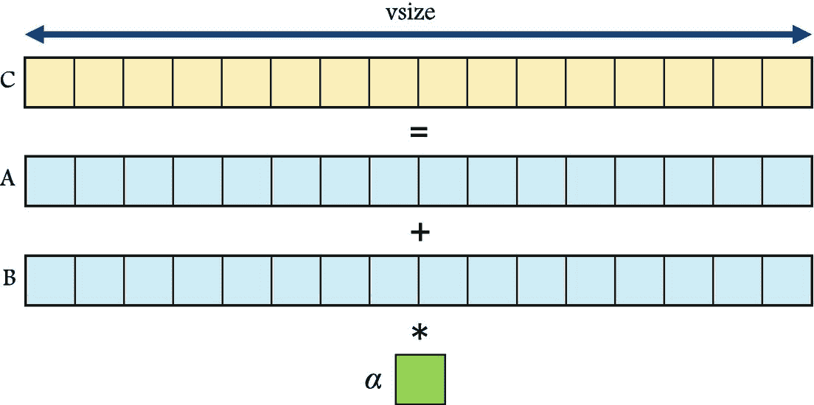

图 18-5

计算`C = A +`α`∗B`(`c`<sub>`i`</sub>`= a`<sub>`i`</sub>`+`α`∗b`<sub>`i`</sub>`,`【∀】的三元向量运算

在我们的实现中，我们将假设数组大小由变量`vsize`决定，并且三个数组存储单精度浮点数。在这本书的这一点上，提出这种令人尴尬的并行算法的并行实现对我们来说还不够有挑战性。让我们来看一个异构实现。

好吧，那么你有一个集成的图形处理器？那没给我留下太多印象！ <sup>4</sup> 据报道，超过 95%的出货处理器都带有集成 GPU，与多核 CPU 共享芯片。在一个 CPU 内核上运行 triad 代码后，您会睡得很香吗？不完全是，对吗？CPU 核心不应该闲置。同理，GPU 核心也不应该闲置。在许多情况下，我们可以利用出色的 GPU 计算能力来进一步加快我们的一些应用程序。

在图 18-6 中，我们展示了三元组计算将在不同计算设备之间分配的方式。

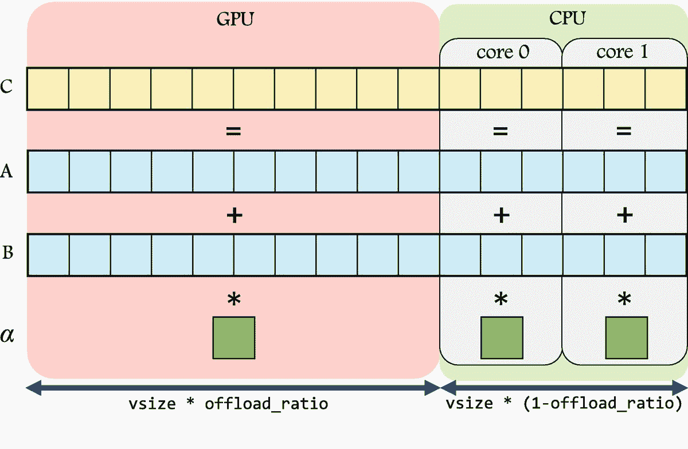

图 18-6

三元组计算的异构实现

在我们的实现中，我们将依赖于`offload_ratio`变量，它控制卸载到 GPU 的迭代空间的一部分，而其余部分在 CPU 上并行处理。`0` ≤ `offload_ratio` ≤ `1`不言而喻。

代码将基于图 18-7 所示的流程图。第一个节点`in_node`是一个`source_node`，它向`a_node`和`cpu_node`发送相同的`offload_ratio`。前者是一个`async_node`，它将数组的相应子区域的计算卸载到支持 OpenCL 的 GPU 上。后者是一个常规的`function_node`,它嵌套了一个 TBB `parallel_for`,用于在可用的 CPU 内核之间分割分配给阵列的子区域。GPU 上的执行时间`Gtime`和 CPU 上的执行时间`Ctime`都被收集在相应的节点中，并被转换成`join_node`中的一个元组。最后，在`out_node`中，打印这些时间，并且将数组 C 的异构计算版本与三元组循环的普通串行执行获得的黄金版本进行比较。

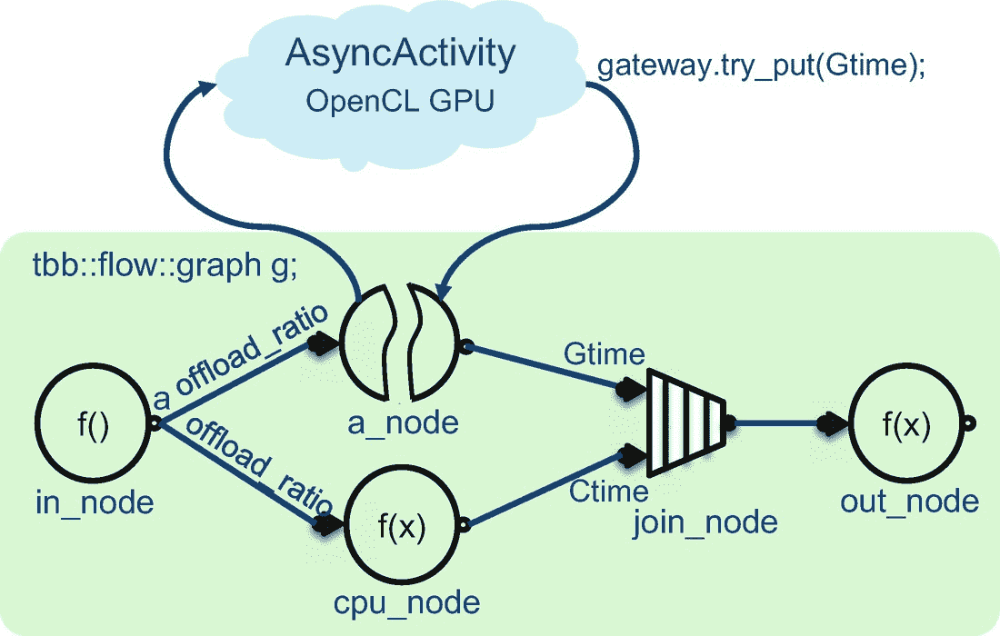

图 18-7

实现异构三元组的流程图

### 注意

我们喜欢温和地引入新的概念，我们试图遵循这一点，尤其是当涉及到 TBB 内容时。然而，OpenCL 超出了本书的范围，所以我们不得不放弃我们自己的规则，仅仅简单地评论一下在下面的例子中使用的 OpenCL 结构。

为了简单起见，在本例中，我们将接受以下假设:

1.  为了利用零拷贝缓冲策略来减少设备间数据移动的开销，我们假设有一个 OpenCL 1.2 驱动程序可用，并且有一个 CPU 和 GPU 都可见的公共内存区域。这通常是集成 GPU 的情况。对于最近的异构芯片，OpenCL 2.0 也是可用的，在这种情况下，我们可以利用 SVM(共享虚拟内存)，我们也将在接下来说明。

2.  为了减少流图节点的参数数量，从而提高代码的可读性，指向三个数组`A`、`B`和`C`的 CPU 和 GPU 视图的指针是全局可见的。变量`vsize`也是全局的。

3.  为了跳过与 TBB 不太相关的方面，所有的 OpenCL 样板文件都被封装到一个函数`opencl_initialize()`中。该函数负责获取平台`platform`，选择 GPU 设备`device`，创建 GPU 上下文`context`和命令队列`queue`，读取 OpenCL 内核的源代码，编译它以创建内核，并初始化存储数组`A`、`B`和`C`的 GPU 视图的三个缓冲区。由于`AsyncActivity`也需要命令队列和程序处理程序，相应的变量`queue`和`program`也是全局变量。我们利用了 OpenCL C API 可用的 C++ 包装器。更准确地说，我们使用了可以在 [`https://github.com/KhronosGroup/OpenCL-CLHPP/`](https://github.com/KhronosGroup/OpenCL-CLHPP/) 上找到的`cl2.hpp` OpenCL C++ 头文件。

先说代码的主要功能；在图 18-8 中，我们只展示了两个第一节点的定义:`in_node`和`cpu_node`。

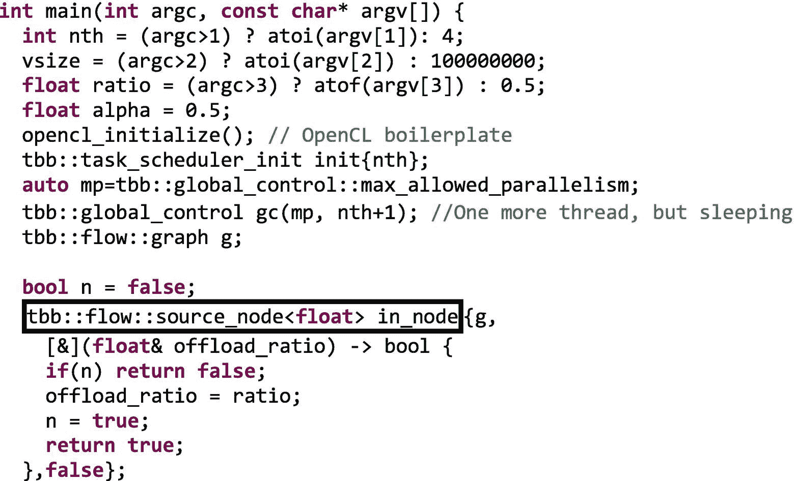

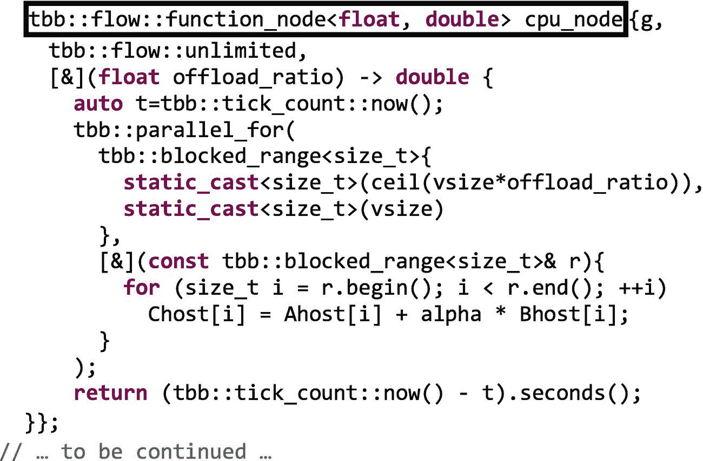

图 18-8

具有前两个节点的异构三元组计算的主要功能

我们首先读取程序参数并初始化调用`opencl_initialize()`的 OpenCL 样板文件。从这个函数中，我们只需要知道它初始化了一个 GPU 命令队列`queue`，和一个 OpenCL 程序`program`。线程数量的初始化以及初始化一个`global_control`对象的原因将在本节的最后进行说明。GPU 内核的源代码非常简单:

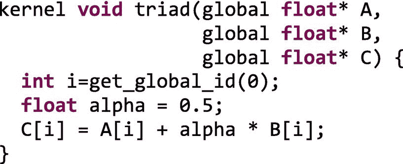

这实现了三元运算，`C = A +` α `∗B`，假设α `=0.5`，并且浮点数组存储在全局内存中。在内核启动时，我们必须指定 GPU 将遍历的迭代范围，GPU 内部调度程序将使用指令`i=get_global_id(0)`从该空间中选取单次迭代。对于这些`i`中的每一个，计算`C[i] = A[i] + alpha ∗ B[i]`将在 GPU 的不同计算单元中并行进行。

在`opencl_initialize()`函数中，我们还分配了三个 OpenCL 缓冲区和从 CPU 端指向相同缓冲区的相应 CPU 指针(我们称之为数组的 CPU 视图)。假设我们有 OpenCL 1.2，对于输入数组 A，我们依靠 OpenCL `cl::Buffer`构造器来分配一个叫做`Adevice`的 GPU 可访问数组:


标志`CL_MEM_ALLOC_HOST_PTR`是利用零拷贝缓冲区 OpenCL 特性的关键，因为它强制分配主机可访问的内存。同样的调用用于数组的另外两个 GPU 视图，`Bdevice`和`Cdevice`。为了获得指向这些缓冲区的 CPU 视图的指针，OpenCL `enqueueMapBuffer`是可用的，其用法如下:


这为我们提供了一个浮点指针【the CPU 可以使用它在同一个内存区域中进行读写操作。指针`Bhost`和`Chost`也需要类似的调用。在具有集成 GPU 的现代处理器中，这种调用并不意味着数据复制开销，因此这种策略被称为零复制缓冲区。关于 OpenCL 还有其他一些微妙之处，比如`clEnqueueUnmapMemObject()`的含义和功能，以及在同一阵列的不同区域同时写入 CPU 和 GPU 所带来的潜在问题，但这些都超出了本书的范围。

### 注意

如果您的设备支持 OpenCL 2.0，实现起来会更容易，尤其是如果异构芯片实现了所谓的细粒度缓冲 SVM。在这种情况下，有可能分配一个不仅对 CPU 和 GPU 可见，而且可以同时更新并由底层硬件保持一致的内存区域。为了检查 OpenCL 2.0 和细粒度缓冲 SVM 是否可用，我们需要使用:`device.getInfo<CL_DEVICE_SVM_CAPABILITIES>();`

为了利用这个特性，在`opencl_initialize()`中，我们可以使用`cl::SVMAllocator()`并将其作为`std::vector`构造器的分配器模板参数传递。这将为我们提供一个`std::vector A`，即同时显示数据的 GPU 视图和 CPU 视图:


这就是，再也不需要`Ahost`和`Adevice`了。只是`A`。与任何共享数据一样，我们有责任避免数据竞争。在我们的示例中，这很容易，因为 GPU 在数组`C`的一个区域中写入，该区域与 CPU 写入的区域不重叠。如果这个条件不满足，在某些情况下，解决方案是求助于原子数组。这种解决方案通常被称为平台原子或系统原子，因为它们可以由 CPU 和 GPU 自动更新。这个特性是可选实现的，它要求我们用`cl::SVMTraitAtomic<>`实例化`SVMAllocator`。

图 18-8 中的下一件事是图`g`的声明和`source_node`、`in_node`的定义，它与图 18-2 中解释的非常相似，唯一的区别是它传递一个值为`offload_ratio`的消息。

我们示例中的下一个节点是一个`function_node`、`cpu_node`，它接收一个`float`(实际上是`offload_ratio`)并发送一个`double`(进行 CPU 计算所需的时间)。在`cpu_node` lambda 中，调用了一个`parallel_for`，它的第一个参数是一个阻塞范围，如下所示:


这意味着只有数组的上部会被遍历。这个`parallel_for`的 lambda 为不同的迭代块并行计算`Chost[i] = Ahost[i] + alpha ∗ Bhost[i]`，其中范围被自动划分。

我们可以继续图 18-9 中的下一个节点`a_node`，这是一个异步节点，它接收一个浮点值(同样是`offload_ratio`值)并发送 GPU 计算所需的时间。这是在`a_node`的 lambda 中异步完成的，其中`AsyncActivity`对象`asyncAct`的成员函数`run`被调用，类似于我们已经在图 18-2 中看到的。

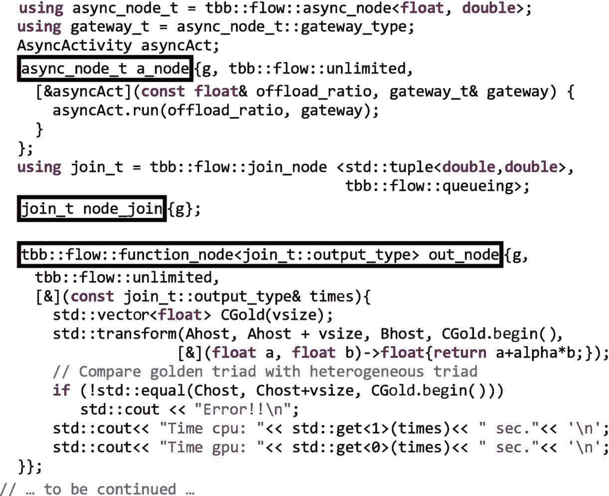

图 18-9

具有最后三个节点定义的异构三元组计算的主要功能

`join_node`不值得我们在这里浪费时间，因为它已经在第三章中讨论过了。可以说，它将一个包含 GPU 时间和 CPU 时间的元组转发到下一个节点。

最后一个节点是一个`function_node`，`out_node`，它接收带有时间的元组。在打印它们之前，它检查产生的`C`数组是否部分在 CPU 上、部分在 GPU 上被正确计算。为此，分配`C`、`CGold`的黄金版本，然后使用 STL 算法`transform`进行串行计算。然后，如果`Chost`和`CGold`重合，我们就都定好了。STL 算法可以方便地实现这种比较。

图 18-10 通过节点连接完成`main()`功能，这得益于五个`make_edge`调用，随后是`in_node`激活以触发图的执行。我们用`g.wait_for_all()`等待完成。

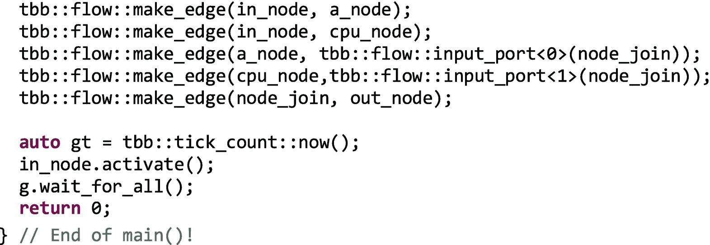

图 18-10

三元组主函数的最后一部分，在这里连接节点并调度图形

最后，在图 18-11 中，我们展示了`AsyncActivity`类的实现，它的运行成员函数是从`async_node`调用的。

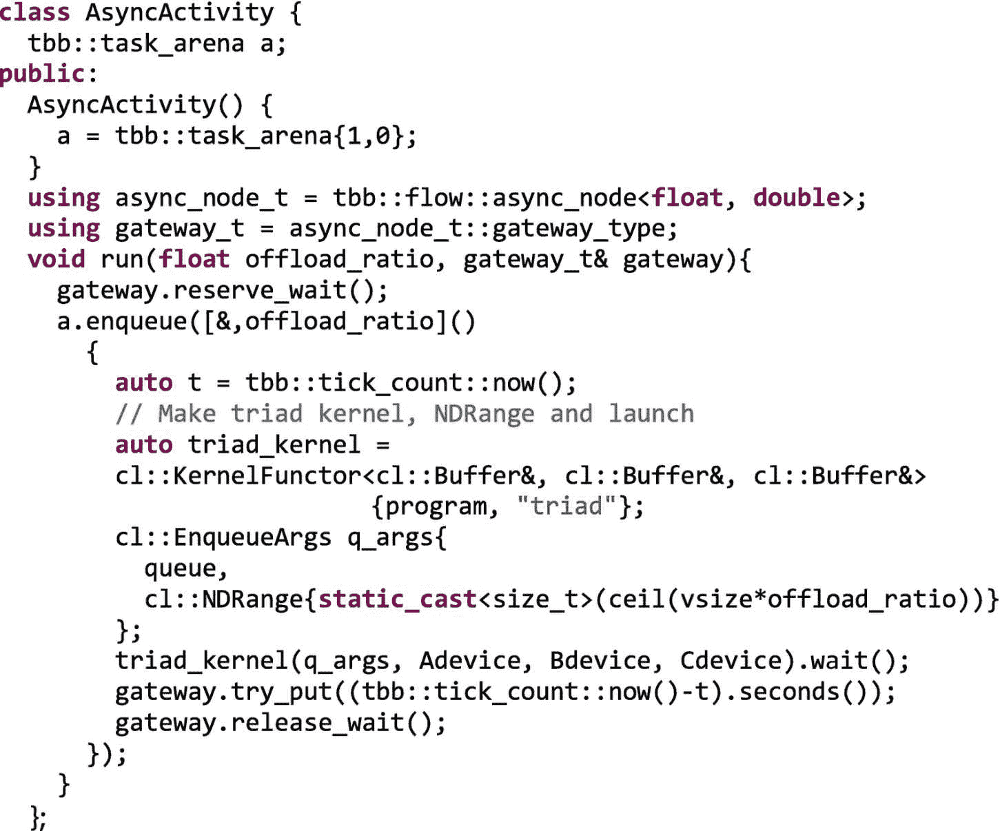

图 18-11

`AsyncActivity`实现，实际的 GPU 内核调用发生在这里

我们没有像在图 18-3 的`AsyncActivity`中那样生成一个线程，而是遵循一个更精细、更有效的替代方案。请记住，我们推迟了对为什么在图 18-8 中使用`global_control`对象的解释。在此图中，我们初始化了调度程序，如下所示:


如果您还记得第十一章中的内容，那么`task_scheduler_init`行将产生以下结果:

*   将创建一个带有`nth`槽的默认竞技场(其中一个槽是为主线程保留的)。

*   工作线程将被填充到全局线程池中，一旦该领域中有工作等待处理，全局线程池将占用该领域的工作线程槽。

但是后来，`global_control`对象，`gc`被构造，使得全局线程池中的实际工作线程数增加。这个额外的线程在默认的竞技场中没有空位，所以它将被休眠。

现在，`AsyncActivity`类，不是像我们以前那样产生一个新线程，而是唤醒休眠线程，这通常更快，特别是如果我们调用几次`AsyncActivity`。为此，该类的构造器初始化了一个新的 arena，`a = tbb::task_arena{1,0}`，它有一个工作线程槽，因为它为主线程保留了 0 个槽。当成员函数`run()`被调用时，一个新任务与`a.enqueue()`一起在这个竞技场中排队。这将导致休眠线程的分派，该线程将占据这个新竞技场的槽位并完成任务。

接下来，这个`AsyncActivity`中产生的任务按照通常的步骤将计算卸载到 GPU。首先，构造`triad_kernel KernelFunctor`，告知`triad kernel`有三个`cl::Buffer`参数。第二，调用`triad_kernel`通过`NDRange`，计算为`ceil(vsize∗offload_ratio)`，以及缓冲区的 GPU 视图`Adevice`、`Bdevice`、`Cdevice`。

在集成 GPU 的英特尔处理器上运行这段代码时，会生成以下两行代码:

```cpp

Time cpu: 0.132203 sec.
Time gpu: 0.130705 sec.

```

其中`vsize`设置为 1 亿个元素，我们一直在玩`offload_ratio`,直到两个设备在计算分配给它们的数组子区域时消耗大约相同的时间。

## 摘要

在这一章中，我们首先介绍了`async_node`类，它增强了流程图的功能，可以处理脱离流程图控制的异步任务。在第一个简单的`Async`世界的例子中，我们展示了这个类和它的伙伴`gateway`接口的使用，这对于将来自异步任务的消息重新注入流图是有用的。然后，我们激发了这个扩展与 TBB 流图的相关性，如果我们认识到阻塞 TBB 任务会导致阻塞 TBB 工作线程，这就很容易理解了。`async_node`允许在流程图之外分派异步工作，但在等待异步工作完成时不会阻塞 TBB 工作线程。我们用一个更现实的例子结束了这一章，这个例子让`async_node`将`parallel_for`的一些迭代卸载到 GPU 上。我们希望我们已经提供了详细阐述更复杂的项目的基础，其中涉及到异步工作。然而，如果我们通常的目标是支持 OpenCL 的 GPU，我们有好消息:在下一章，我们将介绍 TBB 的`opencl_node`特性，它提供了一个更友好的界面来让 GPU 为我们工作！

## 更多信息

以下是我们推荐的一些与本章相关的额外阅读材料:

*   赫伯·萨特(Herb Sutter)，《免费的午餐结束了:软件并发性的根本转变》， [`www.gotw.ca/publications/concurrency-ddj.htm`](http://www.gotw.ca/publications/concurrency-ddj.htm) 。

*   约翰·麦卡尔平， [`www.cs.virginia.edu/stream/ref.html`](http://www.cs.virginia.edu/stream/ref.html) 。

*   大卫凯利，佩哈德米斯特里，达纳沙，张东平。使用 OpenCL 2.0 进行异构计算。摩根·考夫曼 2015。

 

**开放存取**本章根据知识共享署名-非商业-非专用 4.0 国际许可协议(http://Creative Commons . org/licenses/by-NC-nd/4.0/)的条款进行许可，该协议允许以任何媒体或格式进行任何非商业使用、共享、分发和复制，只要您适当注明原作者和来源，提供知识共享许可协议的链接，并指出您是否修改了许可材料。根据本许可证，您无权共享从本章或其部分内容派生的改编材料。

本章中的图像或其他第三方材料包含在本章的知识共享许可中，除非在材料的信用额度中另有说明。如果材料不包括在本章的知识共享许可中，并且您的预期使用不被法律法规允许或超出了允许的使用范围，您将需要直接从版权所有者处获得许可。

<aside class="FootnoteSection">Footnotes 1

“免费的午餐结束了:软件并发性的根本转变，”Herb Sutter。 [`www.gotw.ca/publications/concurrency-ddj.htm`](http://www.gotw.ca/publications/concurrency-ddj.htm) 。

  2

当线程使用阻塞调用将内核卸载到 GPU 时，驱动程序可能不会立即阻塞调用线程。例如，一些 GPU 驱动程序保持线程旋转，以便它可以更早地响应轻量级内核，并在一段时间后最终阻止线程，以避免在重量级内核完成时消耗资源。

  3

约翰·麦卡尔平， [`www.cs.virginia.edu/stream/ref.html`](http://www.cs.virginia.edu/stream/ref.html) 。

  4

仙妮娅·唐恩——那没给我留下太多印象，*来看看 1997 年的*专辑。

 </aside>