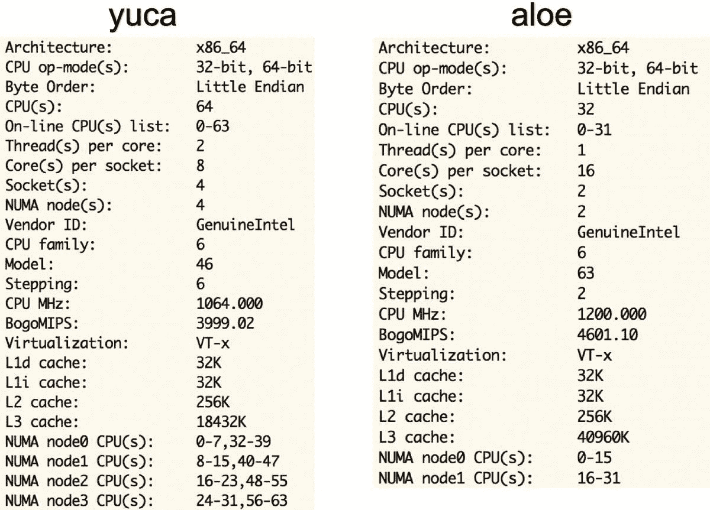
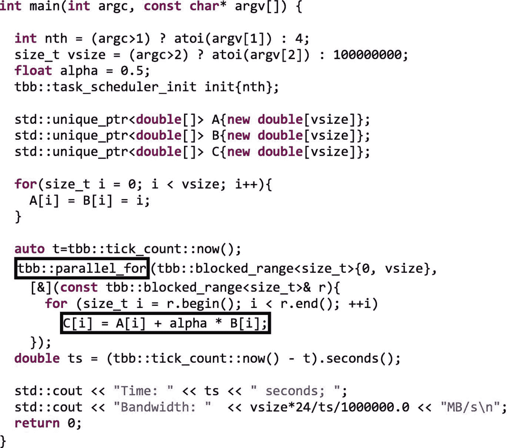
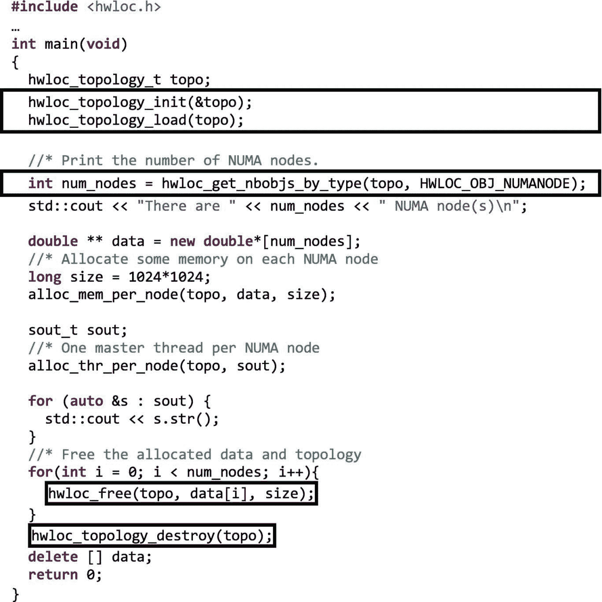
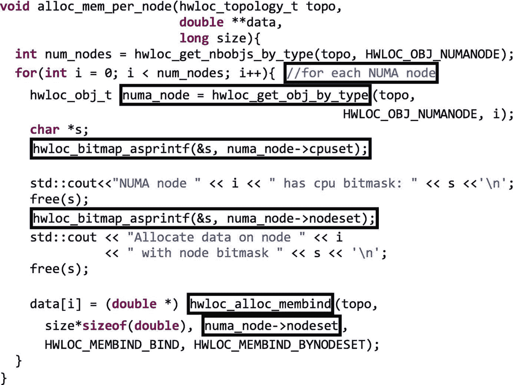
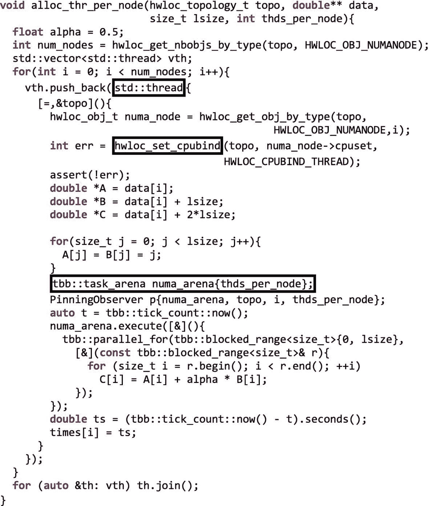
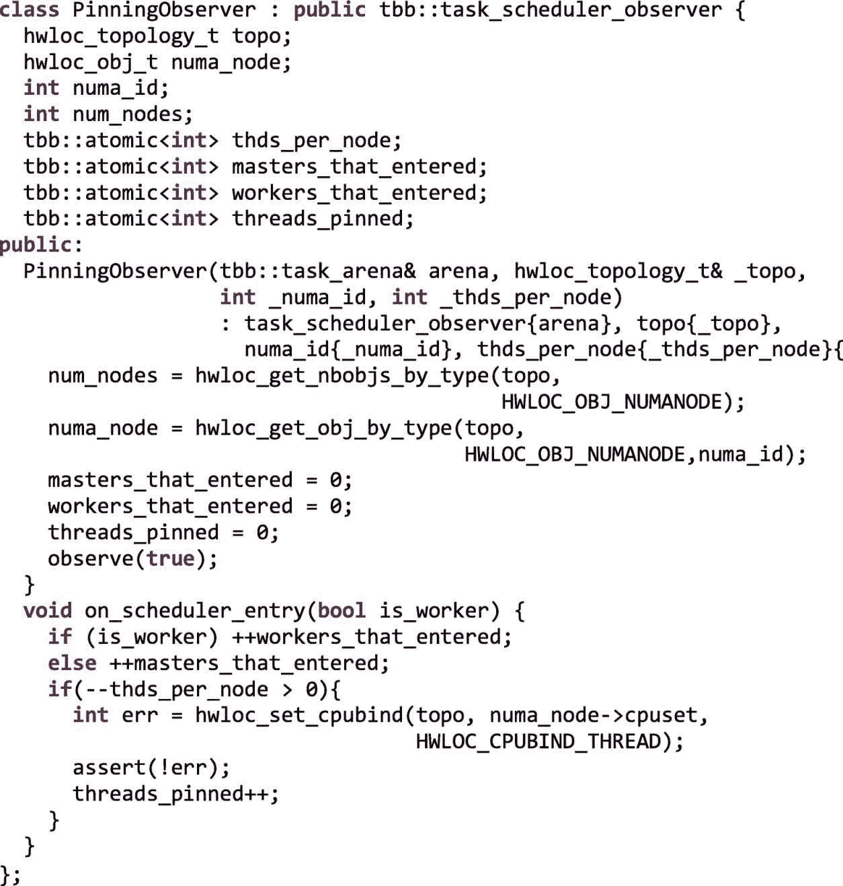

# 二十、NUMA 架构上的 TBB

关心性能的高级程序员知道利用本地性是最重要的。谈到局部性，缓存局部性是第一个想到的，但是在许多情况下，对于运行在大型共享内存架构上的重型应用程序，还应该考虑非统一内存访问(NUMA)局部性。众所周知，NUMA 传达了这样一个信息:内存组织在不同的存储体中，一些内核对一些“近”存储体的访问速度要快于对“远”存储体的访问速度。更正式地说， *NUMA 节点*是内核、高速缓存和本地存储器的分组，其中所有内核共享对本地共享高速缓存和存储器的相同访问时间。从一个 NUMA 节点到另一个节点的访问时间可能要长得多。出现了一些问题，例如程序数据结构如何在不同的 NUMA 节点上分配，以及处理这些数据结构的线程在哪里运行(它们是靠近还是远离数据？).在本章中，我们将解决这些问题，但更重要的是，在 TBB 并行应用程序中，如何利用 NUMA 局部性。

针对 NUMA 系统的性能调优归结为四项活动:(1)发现您的平台拓扑结构，(2)了解从系统的不同节点访问内存的相关成本，(3)控制数据的存储位置(数据放置)，以及(4)控制工作的执行位置(处理器关联性)。

为了防止你进一步失望(也就是现在就让你失望！)，我们应该提前声明:目前，TBB 不提供利用 NUMA 本地性的高级特性。或者换句话说，在前面列出的四个活动中，TBB 只在第四个活动中提供了一些帮助，在第四个活动中，我们可以依靠 TBB `task_arena`(参见第十二章)和本地`task_sheduler_observer`(参见第十三章)类来识别应该限制在 NUMA 节点中的线程。对于所有其他活动，甚至对于将线程实际固定到 NUMA 节点(这是第四个活动的基本部分)，我们需要使用低级的依赖于操作系统的系统调用或高级别的第三方库和工具。这意味着，即使这是一本 TBB 的书，这最后一章也不完全是关于 TBB 的。我们的目标是详细阐述如何实现利用 NUMA 局部性的 TBB 代码，即使大多数必需的活动与 TBB 没有直接关系。

既然我们已经提醒了读者，让我们把这一章分解成几个部分。我们基本上按顺序遵循前面列出的四项活动。第一部分展示了一些工具，它们可以用来发现我们平台的拓扑结构，并检查有多少 NUMA 节点可用。如果有多个 NUMA 节点，我们可以继续下一部分。在这里，我们使用一个基准来了解在我们的特定平台上利用 NUMA 本地性时潜在的加速效果。如果预期的收益令人信服，我们应该开始考虑在我们自己的代码中利用 NUMA 局部性(不仅仅是在一个简单的基准中)。如果我们认识到我们自己的问题可以受益于 NUMA 局部性，我们就可以进入问题的核心，即掌握数据放置和处理器关联性。有了这些知识，在 TBB `task_arena`和`task_scheduler_observer`类的帮助下，我们实现了第一个简单的 TBB 应用程序，该应用程序利用了 NUMA 局部性，并评估了相对于基线实现所获得的加速。整个过程总结在图 20-1 中。我们结束这一章，概述可以考虑用于更复杂应用的更高级和更通用的替代方案。


图 20-1

开发 NUMA 地区所需的活动

### 注意

如果你想知道为什么在当前版本的 TBB 中没有高级别的支持，这里有一些原因。首先，这是一个棘手的问题，高度依赖于必须并行化的特定应用程序及其运行的架构。因为没有一个放之四海而皆准的解决方案，所以由开发人员来决定最适合当前应用的特定数据放置和处理器关联性替代方案。其次，TBB 的架构师和开发人员总是试图避免在 TBB 库中使用特定于硬件的解决方案，因为它们可能会损害代码的可移植性和 TBB 的可组合性。该库不仅仅是为了执行 HPC 应用程序而开发的，在 HPC 应用程序中，我们通常可以独占访问整个高性能平台(或它的一个分区)。TBB 还应该在其他应用程序和进程也在运行的共享环境中尽力而为。在许多情况下，将线程绑定到内核并将内存绑定到 NUMA 节点会导致底层架构的利用不尽人意。在任何具有动态特性的应用程序或系统中，手动锁定被反复证明是一个坏主意。我们强烈建议不要采用这种方法，除非您确信您将在您的特定并行平台上提高您的特定应用程序的性能，并且您不关心可移植性(或者付出额外的努力来实现可移植的 NUMA 感知应用程序)。

考虑到 TBB 并行算法基于任务的特性和支持并行执行的工作窃取调度程序，让任务在接近本地内存的内核中运行似乎具有挑战性。但这不会阻止像我们这样勇敢无畏的程序员。让我们去吧！

## 发现您的平台拓扑

"知己知彼，百战不殆."—*孙子兵法*。这句千年名言告诉我们，在解决问题之前，首先要努力仔细理解我们所面临的问题。有一些工具可以方便地理解底层的 NUMA 架构。在本章中，我们将使用`hwloc`和`likwid` <sup>1</sup> 来收集关于架构和代码执行的信息。`hwloc`是一个软件包，它提供了一种便捷的方式来查询关于系统拓扑的信息，以及应用一些 NUMA 控制，如数据放置和处理器关联性。`likwid`是另一个软件包，它告知硬件拓扑结构，可用于收集硬件性能计数器，还提供一组有用的微基准，可用于描述系统特征。我们还可以使用 VTune 来分析代码的性能。虽然`likwid`只适用于 Linux，但是`hwloc`和 VTune 也可以很容易地安装在 Windows 和 MacOS 上。然而，由于用于说明我们代码的共享内存平台运行 Linux，除非另有说明，否则这将是我们假定的操作系统。

因为针对 NUMA 的调优需要对所使用的平台有深入的理解，所以我们将从描述两台机器的特征开始，这两台机器将贯穿本章。我们接下来介绍的两台机器被称为`yuca`(来自丝兰工厂)和`aloe`(来自芦荟工厂)。首先，我们可以收集这些机器的基本信息。在 Linux 上，可以使用命令“`lscpu`”获得这些信息，如图 20-2 所示。



图 20-2

尤卡和芦荟的`lscpu`产量

乍一看，我们看到 yuca 有 64 个逻辑内核，编号从 0 到 63，每个物理内核有两个逻辑内核(超线程又称 SMT 或同步多线程，可用)，每个插槽有八个物理内核，四个插槽也是四个 NUMA 节点或 NUMA 域。就其本身而言，aloe 有 32 个禁用超线程的物理内核(每个内核只有一个线程)，每个插槽有 16 个物理内核，还有两个插槽(NUMA 节点)。在`lscpu`输出的最后，我们可以看到 NUMA 节点和每个节点中包含的逻辑核心的 id，但是如果我们使用来自`hwloc`库的`lstopo`实用程序，画面会变得更加清晰。在图 20-3 中，我们包括了执行`lstopo` `--no-io yuca.pdf`命令时在 yuca 上生成的 PDF 文件(参数`--no-io`不考虑 I/O 设备拓扑)。


图 20-3

在 yuca 上执行`lstopo`的结果

从这个图中，我们可以清楚地看到尤卡的 NUMA 组织。四个 NUMA 节点包括八个物理核心，操作系统将其视为 16 个逻辑核心(也称为硬件线程)。请注意，逻辑内核 id 取决于架构、固件(电脑上的 BIOS 配置)和操作系统版本，因此我们不能从编号中做出任何假设。对于 yuca 的特定配置，逻辑核心 0 和 32 共享同一个物理核心。现在我们更好地理解了 yuca 上`lscpu`最后四行的意思:

```cpp

NUMA node0 CPU(s):     0-7,32-39
NUMA node1 CPU(s):     8-15,40-47
NUMA node2 CPU(s):     16-23,48-55
NUMA node3 CPU(s):     24-31,56-63

```

在 yuca 上，每个 NUMA 节点有 63 GB 的本地内存，总共 252 GB。类似地，aloe 也具有 252 GB 的容量，但仅组织在两个 NUMA 节点中。在图 20-4 中，我们看到了芦荟上`lstopo`输出的编辑版本。


图 20-4

对芦荟执行`lstopo`的结果

我们看到，在 aloe 上，每个物理核心都包含一个逻辑核心，在第一个域中编号为 0-15，在第二个域中编号为 16-31。

### 了解访问内存的成本

现在我们知道了平台的拓扑结构，假设我们已经控制了处理器关联性和数据放置，让我们量化由于非本地访问而产生的开销。实际上，我们确实在已经可用的基准上控制这两个方面，比如在`likwid`工具中可用的`likwid` `-bench`。使用这个基准，我们可以使用一个命令行运行流三元组代码(参见前两章):

```cpp

likwid-bench -t stream -i 1 -w S0:12GB:16-0:S0,1:S0,2:S0

```

它运行用`-w`参数配置的流基准的单次迭代(`-i 1`)

*   S0:线程被固定到 NUMA 节点 0。

*   12 GB:三个三元组阵列占用 12 GB(每个阵列 4 GB)。

*   16: 16 个线程将共享计算，每个线程处理 31，250，000 个 double 的数据块(即 40 亿字节/每个 double/16 个线程 8 个字节)。

*   `0:S0,1:S0,2:S0`:三个数组分配在 NUMA 节点 0 上。

在 yuca 上，该命令的结果报告了 8219 MB/s 的带宽。但是，更改三个数组的数据放置是很容易的，例如，更改到 NUMA 节点 1(使用`0:S1,1:S1,2:S1`)将 16 个线程的计算限制在 NUMA 节点 0 中。毫不奇怪，我们现在得到的带宽只有 5110 MB/s，这意味着我们损失了 38%的带宽，这是我们在利用 NUMA 本地性时测量的。对于计算本地数据的其他配置(数据放置在线程固定的内核上)和不利用本地性的配置(数据放置在没有线程关联性的内核上)，我们得到了类似的结果。在 yuca 上，所有非本地配置都会导致相同的带宽冲击，但是在其他 NUMA 拓扑上，我们会根据数据放置的位置和线程运行的位置而付出不同的代价。

在芦荟上，我们只有两个 NUMA 节点 0 和 1。将数据和计算放在同一个域中可以获得 38671 MB/s 的速度，而沿着错误的路径只能获得 20489 MB/s 的速度(几乎是一半，整整少了 47%的带宽)。我们确信，像您这样渴望阅读和学习性能编程主题的读者，现在正积极地在您自己的项目中利用 NUMA 本地性！

### 我们的基线示例

图 20-5 显示了我们最近一直在使用的三元组示例的并行版本，只有一个`parallel_for`算法。



图 20-5

对基线算法进行评估和改进

这段代码的最后两行报告了执行时间和获得的带宽，它还没有针对 NUMA 进行优化。对于后者，访问的总字节数计算为每个数组元素的`vsize` × 8 字节/double × 3 次访问(两次加载和一次存储)，然后除以执行时间和一百万(转换为每秒兆字节)。在 yuca 上，当使用 32 个线程和一个千兆元素的数组运行时，会产生以下输出:

```cpp

./fig_20_05 32 1000000000
Time: 2.23835 seconds; Bandwidth: 10722.2MB/s

```

关于芦荟:

```cpp

./fig_20_05 32 1000000000
Time: 0.621695 seconds; Bandwidth: 38604.2MB/s

```

请注意，我们的 triad 实现获得的带宽不应与之前由`likwid-bench`报告的带宽进行比较。现在，我们使用 32 个线程(而不是 16 个)，根据操作系统调度程序，这些线程可以在每个内核上自由运行(而不是局限于单个 NUMA 节点)。类似地，阵列现在由操作系统按照自己的数据放置策略来放置。在 Linux 中，默认的策略 <sup>2</sup> 是“本地分配”,其中执行分配的线程决定数据的位置:如果有足够的空间，则在本地内存中，否则在远程。这种策略有时被称为“首次接触”，因为数据放置不是在分配时完成的，而是在首次接触时完成的。这意味着一个线程可以分配一个区域，但是首先访问这个区域的线程是引发页面错误的线程，并且实际上是将内存中的页面分配给该线程。在我们的图 20-5 的例子中，相同的线程分配并初始化数组，这意味着在相同的 NUMA 节点上运行的`parallel_for`工作线程将具有更快的访问速度。最后一个区别是`likwid-bench`用汇编语言实现三元组计算，这阻止了进一步的编译器优化。

### 掌握数据放置和处理器关联性

绑定数据和计算一点也不简单。主要是因为它依赖于操作系统，每个操作系统都有自己的系统调用。在 Linux 中，低级接口由`libnuma` <sup>3</sup> 提供，其包括控制在 Linux 内核中实现的数据放置和处理器亲缘关系策略的功能。一个更高级的替代命令是`numactl` <sup>4</sup> 命令，它解决了同样的问题，但是灵活性较差。

然而，破坏我们的 TBB 应用程序与依赖于操作系统的 NUMA 库的可移植性并不是最好的主意。已经提到的`hwloc`库是一个可移植且广泛使用的替代方案。目前，TBB 没有提供自己的 API 来处理 NUMA 本地数据，但是正如我们将在后面看到的，我们可以采取一些措施来让我们的 TBB 任务在可能的时候访问本地数据。在撰写本文时，必须通过第三方库来手动控制数据放置和处理器关联性，不失一般性，我们将求助于本章中的`hwloc`。这个库可以在 Windows、MacOS 和 Linux 中使用(实际上，在 Linux 中`hwloc`使用下面的`numactl/libnuma`)。

在图 20-6 中，我们展示了一个例子，它查询 NUMA 节点的数量，然后在每个节点上分配一些数据，稍后为每个节点创建一个线程，并将其绑定到相应的域。我们在下面使用的是`hwloc` 2.0.1。



图 20-6

使用`hwloc`为每个 NUMA 节点分配内存和绑定线程

所有`hwloc`函数的一个反复出现的参数是对象拓扑，在我们的例子中是`topo`。这个对象首先被初始化，然后加载平台的可用信息。之后，我们准备从`topo`数据结构中获取信息，正如我们对`hwloc_get_nbobjs_by_type`所做的那样，当第二个参数是`HWLOC_OBJ_NUMANODE`时，它返回 NUMA 节点的数量(其他几种类型也是可用的，如`HWLOC_OBJ_CORE or HWLOC_OBJ_PU`–逻辑核心或处理单元)。NUMA 节点的数量存储在变量`num_nodes`中。

该示例继续创建一个指向 doubles 的指针数组`num_nodes`，该数组将在函数`alloc_mem_per_node`中初始化。对`alloc_thr_per_node`的函数调用创建了`num_nodes`个线程，每个线程都被固定到相应的 NUMA 节点。这两个功能分别在图 20-7 和 20-8 中描述。这个例子通过释放分配的内存和`topo`数据结构来结束。



图 20-7

为每个 numa 节点分配双精度数组的函数

图 20-7 显示了功能`alloc_mem_per_node`的实现。关键操作是`hwloc_get_obj_by_type`，当第二个和第三个参数分别为`HWLOC_OBJ_NUMANODE`和`i`时，它返回一个句柄给`i` <sup>`th`</sup> NUMA 节点对象`numa_node`。这个`numa_node`有几个属性，如`numa_node->cpuset`(标识节点中包含的逻辑内核的位掩码)和`numa_node->nodeset`(标识节点的类似位掩码)。函数`hwloc_bitmap_asprintf`可以方便地将这些集合转换成字符串，我们将在程序的输出中看到后面的内容。使用`nodeset`位掩码，我们可以在带有`hwloc_alloc_membind`的节点中分配内存。

当运行代码直到`alloc_mem_per_node`返回到主函数时，我们在 yuca 上得到的输出是

```cpp

There are 4 NUMA node(s)
NUMA node 0 has cpu bitmask: 0x000000ff,0x000000ff
Allocate data on node 0 with node bitmask 0x00000001
NUMA node 1 has cpu bitmask: 0x0000ff00,0x0000ff00
Allocate data on node 1 with node bitmask 0x00000002
NUMA node 2 has cpu bitmask: 0x00ff0000,0x00ff0000
Allocate data on node 2 with node bitmask 0x00000004
NUMA node 3 has cpu bitmask: 0xff000000,0xff000000
Allocate data on node 3 with node bitmask 0x00000008

```

这里我们看到每个 NUMA 节点的`cpuset`和`nodeset`。如果我们再次刷新我们的记忆，查看图 20-3 ，我们会看到在节点 0 中我们有 8 个内核和 16 个逻辑内核，编号从 0 到 7 和从 32 到 39，在`hwloc`中用位掩码`0x000000ff,0x000000ff`表示。请注意，“”分隔了共享八个物理内核的两组逻辑内核。与禁用超线程的平台相比，这是 aloe 上的相应输出:

```cpp

There are 2 NUMA node(s)
NUMA node 0 has cpu bitmask: 0x0000ffff
Allocate data on node 0 with node bitmask 0x00000001
NUMA node 1 has cpu bitmask: 0xffff0000
Allocate data on node 1 with node bitmask 0x00000002

```

在图 20-8 中，我们列出了为每个 NUMA 节点生成一个线程的函数`alloc_thr_per_node`，然后使用`cpuset`属性绑定它。


图 20-8

为每个 NUMA 节点创建并固定一个线程的函数

这个函数还查询 NUMA 节点的数量`num_nodes`，以便稍后在创建线程的循环中迭代这个次数。在每个线程执行的 lambda 表达式中，我们使用`hwloc_set_cpubind`将线程绑定到每个特定的 NUMA 节点，现在依赖于`numa_node->cpuset`。为了验证锁定，我们打印线程 id(使用`std::this_thread::get_id`)和运行线程的逻辑内核的 id(使用`sched_getcpu`)。接下来是 yuca 上的结果，也如图 20-9 所示。


图 20-9

描绘了由于固定到 yuca 上的 NUMA 节点而导致的线程移动

```cpp

Before: Thread 0 with tid 873342720 on core 33
After: Thread 0 with tid 873342720 on core 33
Before: Thread 1 with tid 864950016 on core 2
After: Thread 1 with tid 864950016 on core 8
Before: Thread 2 with tid 856557312 on core 33
After: Thread 2 with tid 856557312 on core 16
Before: Thread 3 with tid 848164608 on core 5
After: Thread 3 with tid 848164608 on core 24

```

这里有两件事值得一提。首先，线程最初由操作系统分配到同一个 NUMA 节点中的逻辑核心上，因为它假设它们会协作。线程 0 和 2 甚至被分配在同一个逻辑核心上。其次，线程不是固定在单个内核上，而是固定在属于同一个 NUMA 节点的整个内核集上。如果操作系统认为将一个线程移动到同一个节点的不同内核会更好，这就留有余地。为了完整起见，下面是芦荟的等效输出:

```cpp

Before: Thread: 0 with tid 140117643171584 on core 3
After: Thread: 0 with tid 140117643171584 on core 3
Before: Thread: 1 with tid 140117634778880 on core 3
After: Thread: 1 with tid 140117634778880 on core 16

```

有兴趣的读者可以从各自的文档和在线教程中了解到`hwloc`和`likwid`的更多特性。然而，我们在本节中所介绍的内容足以让我们继续前进，卷起袖子，使用 TBB 实现一个 NUMA 意识版本的 triad 算法。

## 和 TBB 一起工作

显然，首要目标是最大限度地减少非本地访问的数量，这意味着在离存储数据的内存最近的内核上进行计算。一种非常简单的方法是在 NUMA 节点上手动划分数据，并将处理这些数据的线程限制在相同的节点上。出于教育目的，我们将首先描述这个解决方案，并在下一节简要阐述更高级的替代方案。

我们可以依靠`hwloc` API 来完成数据放置和处理器关联任务，但是我们想要一个 NUMA 感知的 triad 基准的 TBB 实现。在这种情况下，管理线程的是 TBB 调度程序。从第十一章中，我们知道在`tbb::task_scheduler_init`函数中创建了许多线程。此外，这个 TBB 函数创建了一个默认的竞技场，它有足够的工作线程槽来允许线程参与执行任务。在我们 triad 的基线实现中(见图 20-5),`parallel_for`负责将迭代空间划分为不同的任务。所有线程将协作处理这些任务，而不管每个任务处理的迭代块以及线程运行的内核。但我们不希望它出现在 NUMA 的平台上，对吗？

我们最简单的基线三元组实施替代方案将通过执行以下三个步骤来增强实施:

*   它将在不同的 NUMA 节点上划分和分配三元组算法的三个向量 A、B 和 C。作为最简单的解决方案，静态块分区现在就可以了。在 yuca 上，这意味着 A、B 和 C 这四大块将被分配到四个节点中的每一个上。

*   它将在每个 NUMA 节点上创建一个主线程。每个主线程将创建自己的任务竞技场和自己的本地`task_scheduler_observer`。然后，每个主线程执行自己的`tbb::parallel_for`算法来处理对应于这个 NUMA 节点的 A、B 和 C 的分数。

*   它会自动将连接每个竞技场的线程固定到相应的 NUMA 节点。我们为每个竞技场创建的本地`task_scheduler_observer`将会负责此事。

让我们来看看所描述的每一个要点的实现。对于主函数，我们稍微修改了我们为图 20-6 的`hwloc`示例提供的函数。在图 20-10 中，我们列出了这个新示例所需的新行，在没有变化的行上使用省略号(…)。


图 20-10

NUMA 意识的主要功能是实现三和弦

程序参数`thds_per_node`允许我们在每个 NUMA 节点上使用不同数量的线程。如图 20-6 所示，`num_nodes`是我们使用`hwloc` API 获得的 NUMA 节点数。因此，我们传递给 TBB 调度器构造器`(thds_per_node-1)*(num_nodes)`而不是`thds_per_node*num_nodes`，因为我们将在`alloc_thr_per_node`中显式创建额外的`num_nodes`主线程。

函数`alloc_mem_per_node`本质上与图 20-7 中列出的函数相同，但现在用不同的大小参数调用它:`doubles_per_node = vsize*3/num_nodes`，其中`vsize`是三个向量的大小，所以 doubles 的总量乘以 3，但除以节点数来实现块划分。为了简洁起见，我们假设`vsize`是`num_nodes`的倍数。`alloc_mem_per_node`完成后，`data[i]`指向`i` <sup>`th`</sup> NUMA 节点上分配的数据。

如图 20-11 所示，`alloc_thr_per_node`功能的改编版本还有其他不同之处。它现在接收数据的句柄，每个节点将要遍历的本地向量的大小，`lsize`，以及用户设置的每个节点的线程数，`thds_per_node`。



图 20-11

该函数为每个节点创建一个线程，以计算每个 NUMA 节点上的三元组计算

注意，在图 20-11 呈现的代码片段中，在遍历`num_nodes`的`i-`循环内部，有三个嵌套的 lambda 表达式:(1)对于线程对象；(2)进行`task_arena::execute`会员功能；和(3)用于`parallel_for`算法。在外层，我们首先将线程固定到相应的 NUMA 节点`i`。

第二步是初始化在`data[i]`数组中分配的指向数组`A`、`B`和`C`的指针。在图 20-10 中，我们调用`alloc_thr_per_node`作为第三个参数`vsize/num_nodes`，因为在每个节点上，我们只遍历三个数组的块分布中的一个块。因此，函数的参数`lsize = vsize/num_nodes`，在初始化数组`A`和`B`的循环中使用，并作为计算`C`的`parallel_for`的参数。

接下来，我们初始化一个每个 NUMA 节点的 arena，`numa_arena`，它随后作为参数传递给一个`task_scheduler_observer`对象，`p`，并用于调用一个局限于这个 arena 的`parallel_for`(使用`numa_arena.execute`)。这就是我们 NUMA 感知的 triad 实现的关键。

`parallel_for`将创建遍历三个向量的局部分区块的任务。这些任务将由运行在同一个 NUMA 节点内核上的线程执行。但是到目前为止，我们只有`thds_per_node*num_nodes`个线程，其中`num_nodes`已经被明确衍生为主线程，并被固定到不同的 NUMA 节点，但是其余的仍然可以在任何地方自由运行。全局线程池中可用的线程将各自加入一个`num_nodes`竞技场。方便的是，每个`numa_arena`都已经用`thds_per_node`槽初始化，一个槽已经被主线程占用，其余的可供工作线程使用。我们现在的目标是将进入每个`numa_arena`的第一个`thds_per_node-1`线程固定到相应的 NUMA 节点。为此，我们创建了一个`PinningObserver`类(从`task_scheduler_observer`派生而来)并构造了一个对象`p`，向构造器传递了四个参数:`PinningObserver p{numa_arena, topo, i, thds_per_node}`。记住这里，`i`是主线程`i`的 NUMA 节点的 id。

在图 20-12 中，我们看到了`PinningObserver`类的实现。



图 20-12

实现本地`task_scheduler_observer`为三元组

在第十三章中介绍了`task_scheduler_observer`类。它有一个预览功能，允许我们在每个任务竞技场都有一个观察者——也称为本地`task_scheduler_observer`。这种观察者通过引用 arena 来初始化，就像我们在使用`task_scheduler_observer{arena}`的`PinningObserver`构造器的初始化列表中所做的那样。这导致进入这个特定领域的每个线程的成员函数`on_scheduler_entry`的执行。该类的构造器还设置了 NUMA 节点的数量，`num_nodes`和`numa_node`对象，它们将为我们提供对`numa_node->cpuset`位掩码的访问。构造器最后调用成员函数`observe(true)`开始跟踪任务是否进场。

函数`on_scheduler_entry`跟踪已经固定到原子变量`thds_per_node`中的`numa_node`的线程数量。这个变量在构造器的初始化列表中被设置为每个节点的线程数，用户将它作为程序的第一个参数传递。对于每个进入 arena 的线程，该变量递减，只有当值大于 0 时，该变量才会被固定到节点。由于每个`numa_arena`都是用`thds_per_node`槽初始化的，并且创建竞技场的已经被钉住的主线程占据了其中一个槽，所以首先加入竞技场的`thds_per_node - 1`线程将被钉住到节点，并处理由该竞技场正在执行的`parallel_for`生成的任务。

### 注意

我们的 PinningObserver 类的实现并不完全正确。一个线程可能离开竞技场并重新进入同一个竞技场，被钉住两次，但数量会减少`thds_per_node`。一个更正确的实现是检查进入竞技场的线程是否是一个还没有被固定到这个竞技场的新线程。为了避免这个例子变得复杂，我们把这个修正留给读者作为练习。

我们现在可以在 yuca 和 aloe 上评估这种 NUMA 优化版 triad 算法的带宽(以每秒兆字节为单位)。为了与图 20-5 中的基线实现进行比较，我们将向量大小设置为 10<sup>9</sup>double，并设置每个 NUMA 节点的线程数量，这样我们最终总共有 32 个线程。例如，在 yuca 中，我们将可执行文件称为:

```cpp

baseline:           ./fig_20_05 32 1000000000
NUMA conscious:     ./fig_20_10  8 1000000000

```

图 20-13 的表格中显示的结果是十次运行的平均值，其中 yuca 和 aloe 有一个用户专门使用该平台进行实验。


图 20-13

由于 NUMA 意识的实施而加速

这在 yuca 上快了 74%,在 aloe 上快了 54%!您会忽略我们通过一些额外的实现工作从 NUMA 架构中挤出的额外性能吗？

为了进一步研究这种改进，我们可以利用能够读出硬件性能计数器的`likwid-perfctr`应用程序。通过调用`likwid-perctr -a`，我们可以得到一个事件组列表，只需使用组名就可以指定这些事件组。在 aloe 中，`likwid`提供了一个`NUMA`组，它收集关于本地和远程内存访问的信息。要在我们的基线和 NUMA 感知实现上测量该组中的事件，我们可以调用以下两个命令:

```cpp

likwid-perfctr -g NUMA ./fig_20_05 32 1000000000
likwid-perfctr -g NUMA ./fig_20_10 16 1000000000

```

这将报告关于所有核心上的一些性能计数器的值的大量信息。被统计的事件包括

```cpp

OFFCORE_RESPONSE_0_LOCAL_DRAM
OFFCORE_RESPONSE_1_REMOTE_DRAM

```

它为我们提供了本地内存和远程内存中被访问数据量的大致信息(因为是基于事件的采样)。对于基线 triad 实现，本地数据与远程数据的比率仅为 3.25，但在 NUMA 优化的 triad-numa 版本中，该比率高达 25.5。这证实了，对于这个内存受限的应用程序，我们利用 NUMA 局部性的努力在本地访问数量和执行带宽方面都取得了回报。

## 更高级的替代方案

对于常规的三元组代码，我们实现的简单解决方案是可以的，但是 TBB 的偷工减料调度器仅限于独立地平衡每个 NUMA 节点上的负载。在 yuca 上，将有四个`parallel_for`算法在运行，每个算法运行在一个 NUMA 节点上，该节点有八个线程，由八个物理内核提供服务。这种简单方法的缺点是，四个竞技场配置了八个插槽，这对于执行的稳态部分来说是没问题的，但是如果 NUMA 节点之间的负载没有完全平衡，就会限制 TBB 的灵活性。

例如，如果其中一个`parallel_for`算法首先结束，那么八个线程就变成空闲。他们回到全局线程池，但不能加入其他三个繁忙的舞台，因为所有的位置都已被填满。一个简单的解决方案是增加竞技场的插槽数量，同时保持固定线程的数量为`thds_per_node`。在这种情况下，如果一个`parallel_for`首先完成，那么返回全局池的八个线程可以在其他三个竞技场的空闲槽中重新分配。请注意，这些线程仍然被固定到原始节点，尽管它们现在将在不同节点的不同领域中工作，因此内存访问将是远程的。

当进入扩展竞技场的线程占用其空闲槽时，我们可以将它们固定到相应的 NUMA 节点(即使它们之前被固定到不同的 NUMA 节点)。现在这些帮助线程也将访问本地内存。但是，该节点可能会超额预订，这通常会影响性能(否则，您应该从一开始就超额预订每个 NUMA 节点)。对于每个特定的应用程序和体系结构，都应该进行彻底的实验，以决定是将线程迁移到 NUMA 节点有利，还是从原始节点远程访问数据有利。对于简单和规则的三元组算法，这些讨论的方法都没有显著提高性能，但是在更复杂和不规则的应用中，它们可能会提高性能。不仅远程访问有开销，而且线程从一个领域到另一个领域的迁移，以及再次锁定线程，都代表了必须通过更好的工作负载平衡来分摊的开销。

我们可以选择进行的另一场战斗与数据分区有关。在我们简单的三元组实现中，我们使用了三个数组的基本块分布，但是我们当然知道对于更不规则的应用程序有更好的数据分布。例如，代替在 NUMA 节点之间预先划分迭代空间，我们可以遵循引导调度方法。在每个 NUMA 节点上领导计算的每个主线程可以在计算开始时获得更大的迭代空间块，并且随着我们接近空间的末端而变小。这里需要注意的是，要保证数据块有足够的粒度，可以在每个 NUMA 节点的内核之间再次重新划分。

一个更复杂的替代方案是以一种分层的方式来概括工作窃取框架。为了允许竞技场之间和每个竞技场内部的偷工减料，可以实现竞技场的层次结构。Chen 和 Guo 为 Cilk 实现了类似的思想(参见“更多信息”部分),他们提出了一个三级工作窃取调度器，对于内存受限的应用程序，与更传统的工作窃取替代方案相比，性能提高了 54%。请注意，与受 CPU 限制的应用程序相比，受内存限制的应用程序将从 NUMA 局部性利用中获益更多。对于后者，内存访问开销通常被 CPU 密集型计算所隐藏。实际上，对于 CPU 受限的应用程序，为了利用 NUMA 局部性而增加调度程序的复杂性会导致额外的开销，最终得不偿失。

## 摘要

在这一章中，我们探索了一些利用 NUMA 局部性的替代方法，结合了 TBB 和第三方库，有助于控制数据放置和处理器关联性。我们从研究我们想要打败的敌人开始:NUMA 建筑。为此，我们引入了一些盟友库，`hwloc`和`likwid`。有了它们，我们不仅可以查询 NUMA 拓扑的底层细节，还可以控制数据放置和处理器关联性。我们展示了使用一些`hwloc`函数来分配每个节点的内存，为每个 NUMA 节点创建一个线程，并将线程固定到节点的内核。有了这个模板，我们重新实现了 triad 算法的基线版本，现在注意 NUMA 局部性。最简单的解决方案是将三个三元组数组分布在块中，在不同的 NUMA 节点中分配和遍历这些块。库`hwloc`是分配和固定线程的关键，TBB `task_arena`和`task_scheduler_observer`类有助于识别进入特定 NUMA 节点的线程。对于像 triad 基准测试这样常规的代码来说，这个初始解决方案已经足够好了，在两个不同的 NUMA 平台上，分别报告了 74%和 54%的性能提升(相对于基线 triad 实现)。对于更不规则和复杂的应用，本章的最后一节概述了更高级的替代方案。

## 更多信息

以下是我们推荐的一些与本章相关的额外阅读材料:

*   Christoph Lameter，NUMA(非统一内存访问):概述，ACMqueue，第 11 卷，第 7 期，2013 年。

*   Ulrich Drepper，每个程序员都应该知道的内存知识， [`www.akkadia.org/drepper/cpumemory.pdf`](http://www.akkadia.org/drepper/cpumemory.pdf) ，2017。

*   、郭敏毅、关海兵，LAWS:面向多插槽多核架构的局部感知工作窃取，国际超级计算大会，ICS，2014。

 

**开放存取**本章根据知识共享署名-非商业-非专用 4.0 国际许可协议(http://Creative Commons . org/licenses/by-NC-nd/4.0/)的条款进行许可，该协议允许以任何媒体或格式进行任何非商业使用、共享、分发和复制，只要您适当注明原作者和来源，提供知识共享许可协议的链接，并指出您是否修改了许可材料。根据本许可证，您无权共享从本章或其部分内容派生的改编材料。

本章中的图像或其他第三方材料包含在本章的知识共享许可中，除非在材料的信用额度中另有说明。如果材料不包括在本章的知识共享许可中，并且您的预期使用不被法律法规允许或超出了允许的使用范围，您将需要直接从版权所有者处获得许可。

<aside class="FootnoteSection">Footnotes 1

[`www.open-mpi.org/projects/hwloc`](https://www.open-mpi.org/projects/hwloc/) 和 [`https://github.com/RRZE-HPC/likwid`](https://github.com/RRZE-HPC/likwid) 。

  2

我们可以使用 numatl-show 查询强制执行的 NUMA 策略。

  3

[`http://man7.org/linux/man-pages/man3/numa.3.html`](http://man7.org/linux/man-pages/man3/numa.3.html) 。

  4

[`http://man7.org/linux/man-pages/man8/numactl.8.html`](http://man7.org/linux/man-pages/man8/numactl.8.html) 。

 </aside>