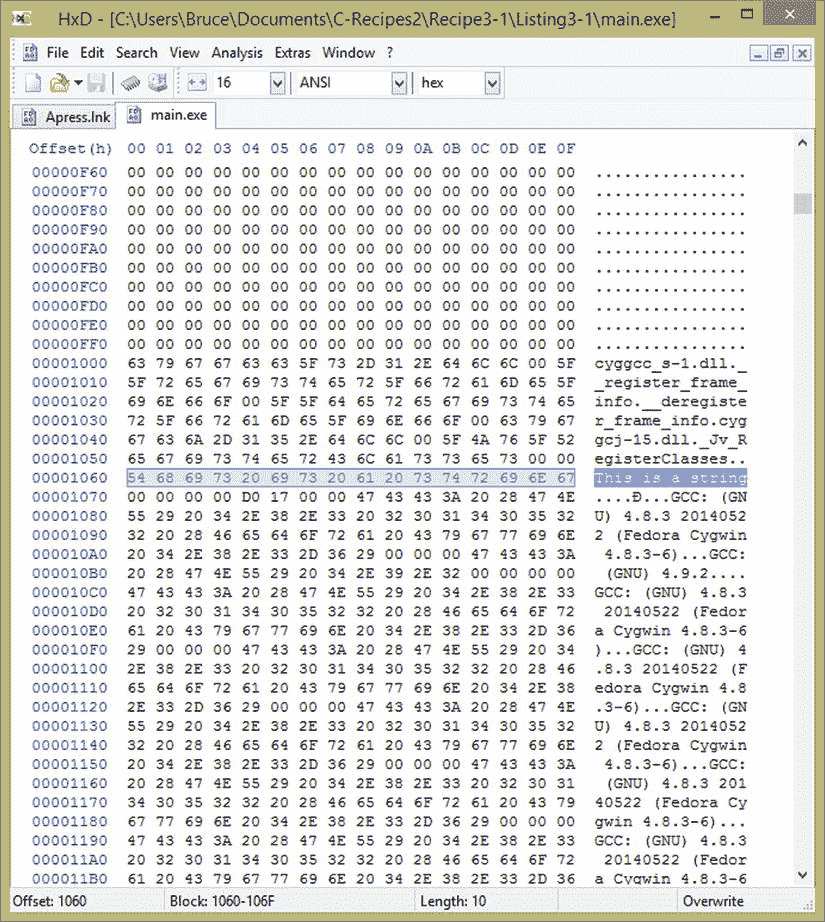
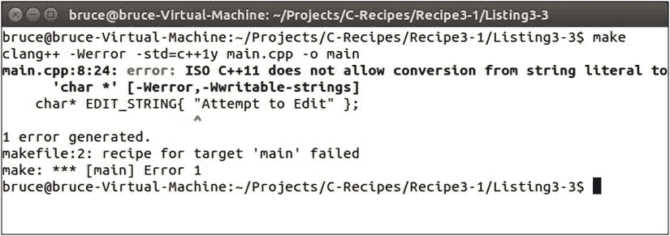
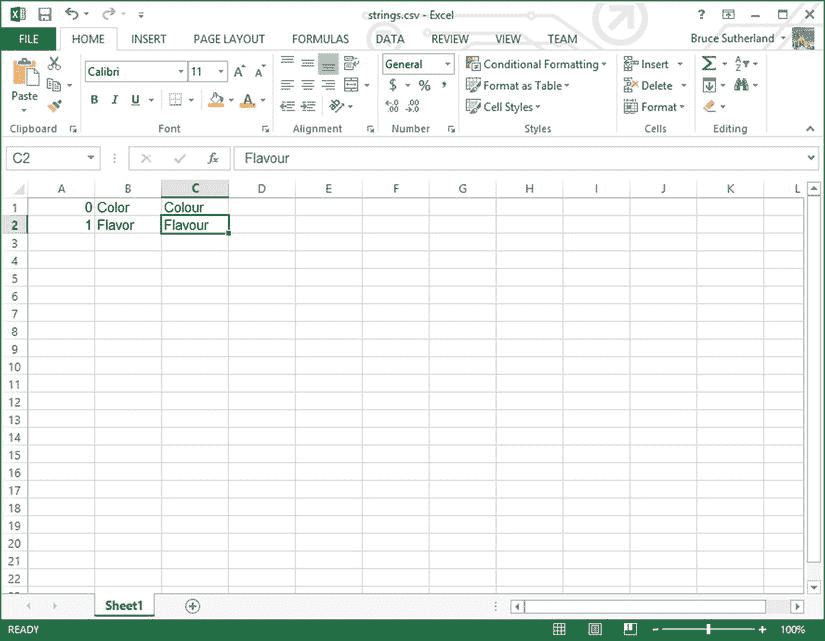
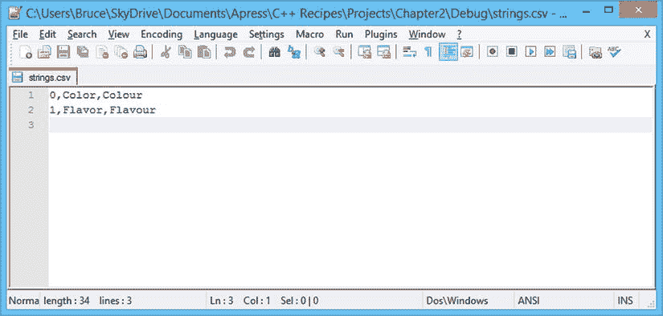
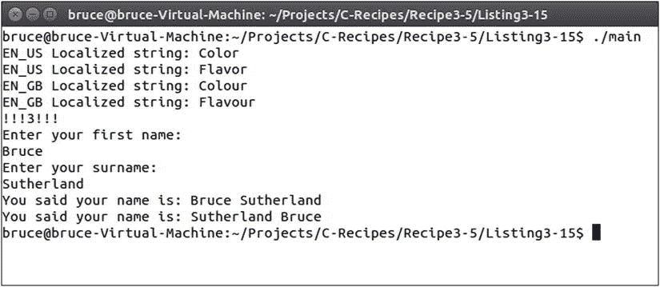

# 三、处理文本

处理文本将是 C++ 程序员必须处理的最常见的任务之一。您可能需要读入用户输入，向用户写出消息，或者为其他程序员编写日志功能，以便更容易地调试正在运行的程序。不幸的是，处理文本不是一件容易或直接的任务。程序员太经常地匆忙工作，在他们的文本处理中犯根本性的错误，这些错误后来成为他们项目中的主要问题。最糟糕的是没有正确考虑文本字符串的本地化版本。使用英文字符集通常很容易，因为所有英文字符和标点符号都适合 ASCII 字符集。这很方便，因为表示英语所需的每个字符都可以放入一个 8 位的`char`变量中。一旦你的程序被要求支持外语，事情就变得混乱了。您需要支持的每个字符将不再适合单一的 8 位值。C++ 可以用多种方式处理非英语语言，我将在本章中介绍。

配方 3-1。使用文本在代码中表示字符串

问题

在调试程序时，提供输出文本通常很有用。为了做到这一点，C++ 允许你将字符串直接嵌入到你的代码中。

解决办法

C++ 程序有一个称为字符串表的概念，程序中的所有字符串都包含在程序的可执行文件中。

它是如何工作的

标准的 C++ 字符串很容易使用。清单 3-1 显示了创建一个字符串文字的代码。

***清单 3-1*** 。字符串文字

```cpp
#include <iostream>
#include <string>

using namespace std;

namespace
{
    const std::string STRING{ "This is a string"s };
}

int main()
{
    cout << STRING << endl;

    return 0;
}
```

本例中的字符串文字是包含在引号内的句子，后跟字母 s。编译器将在编译期间创建一个字符串表，并将它们放在一起。你可以在从图 3-1 中的源创建的 exe 文件中看到这个字符串。



图 3-1 。来自 HxD 的屏幕截图显示了嵌入到可执行文件中的字符串文字

您可以使用字符串来初始化 STL 字符串对象。编译器会找到程序中的所有字符串，并使用字符串表中的地址来初始化字符串。你可以在清单 3-1 中看到这一点，其中指针字符串是使用字符串文字初始化的，实际上这段代码是告诉编译器将文字添加到字符串表中，并从表中获取这个特定字符串的地址，将其传递给`string`构造函数。

清单 3-1 中的字符串文字是一个 C++14 风格的字符串文字。旧样式的字符串文字必须小心使用，因为它们带有一些警告。首先，你不应该试图改变字符串的内容。考虑清单 3-2 中的代码。

***清单 3-2*** 。编辑字符串文字

```cpp
#include <iostream>
using namespace std;

namespace
{
    const char* const STRING{ "This is a string" };
    char* EDIT_STRING{ "Attempt to Edit" };
}

int main()
{
    cout << STRING << endl;

    cout << EDIT_STRING << endl;
    EDIT_STRING[0] = 'a';
    cout << EDIT_STRING << endl;

    return 0;
}
```

清单 3-2 添加了一个新的字符串文字，它被分配给一个非常数指针。`main`函数也有试图将字符串中的第一个字符编辑成小写字母 a 的代码。该代码将编译无误，但是您应该会收到来自 C++11/C++14 编译器的警告，因为试图使用数组操作符改变字符串是完全合法的。但是，试图改变字符串中包含的数据是一个运行时异常。尝试运行该程序会导致如图图 3-2 所示的错误。


图 3-2 。试图改变字符串文字时产生运行时错误

通过遵循一条非常简单的建议，您可以在编译时而不是运行时发现这些错误。总是给类型`const char* const`的变量分配旧式的字符串文字。如果你想以一种非常直接的方式实施，你可以使用清单 3-3 中的 makefile。

***清单 3-3*** 。编译时将警告作为错误

```cpp
main: main.cpp
clang++ -Werror -std=c++1y main.cpp -o main
```

用清单 3-3 中的 makefile 编译你的程序将确保编译器不能用非常数字符串来构建你的应用程序。你可以在图 3-3 中看到一个输出的例子。



图 3-3 。使用–Werror 和可写字符串进行编译时出现错误输出

字符串文字引起的第二个问题是它们增加了程序的大小。在数字世界中，减少程序的下载量是帮助增加软件安装数量的一个关键目标。删除不必要的字符串是减小可执行文件大小的一种方法。清单 3-4 展示了如何使用预处理器来实现这一点。

***清单 3-4*** 。从构建中移除调试字符串

```cpp
#include <iostream>
#include <string>

using namespace std;

#define DEBUG_STRING_LITERALS !NDEBUG

namespace
{
#if DEBUG_STRING_LITERALS
    using StringLiteral = string;
#endif

    StringLiteral STRING{ "This is a String!"s };
}

int main()
{
    cout << STRING << endl;

    return 0;
}
```

清单 3-4 使用`NDEBUG`符号创建一个预处理器符号`DEBUG_STRING_LITERALS`。`NDEBUG`预处理器符号代表不调试，因此我们可以用它来决定我们是否想要在程序中包含调试字符串。然后，类型别名`StringLiteral`的定义被包装在`#if...#endif`块中，确保`StringLiteral`只在构建调试版本时存在。`NDEBUG`符号通常在 ide 中构建程序的发布版本时使用。由于本书附带的示例是使用 make 构建的，因此您必须在 makefile 中手动定义它。清单 3-5 中显示了一个 makefile 示例。

***清单 3-5*** 。定义 NDEBUG 的 makefile

```cpp
main: main.cpp
        clang++ -D NDEBUG -O2 -Werror -std=c++1y main.cpp -o main
```

此时，您还需要包装创建或使用任何`StringLiteral`类型变量的任何代码。这时你应该会发现一个问题，使用这个 define 意味着你的程序中不能有任何字符串。清单 3-6 给出了一个更好的解决方案。

***清单 3-6*** 。分离调试和非调试字符串文字

```cpp
#include <iostream>
#include <string>

using namespace std;

#define DEBUG_STRING_LITERALS !NDEBUG

namespace
{
#if DEBUG_STRING_LITERALS
    using DebugStringLiteral = string;
#endif

#if DEBUG_STRING_LITERALS
    DebugStringLiteral STRING{ "This is a String!"s };
#endif
}

int main()
{
#if DEBUG_STRING_LITERALS
    cout << STRING << endl;
#endif

    return 0;
}
```

对诊断代码使用调试文字，如清单 3-6 所示，最终用户永远不会看到，这允许您删除字符串和代码，从而减少可执行文件的大小并提高执行速度。

食谱 3-2。本地化面向用户的文本

问题

你永远不知道什么时候你可能需要支持一种除了你母语之外的语言。确保用户可以看到的任何字符串都来自本地化的源。

解决办法

构建一个字符串管理器类，它从自己创建的表中返回字符串，并且只引用使用 id 的字符串。

它是如何工作的

通过使用您在源代码中定义为字符串文字的字符串与用户通信，您可以合法地对整个项目进行编码。这有几个主要缺点。首先，很难即时切换语言。今天，你的软件很可能会通过互联网发布。你的程序不被和你说不同语言的人使用的可能性非常小。在大型开发团队中，开发团队中的人有可能拥有不同的第一语言。从一开始就在你的程序中建立本地化文本的能力将会在以后为你省去很多麻烦。这是通过从文件中为你的程序加载字符串数据来实现的。然后，您可以在数据中包含多种不同的语言，方法是用您的母语编写字符串，并让朋友或翻译服务为您将字符串翻译成其他语言。

您需要创建一个类来处理游戏的本地化字符串内容。清单 3-7 显示了本地化管理器的类定义。

***清单 3-7*** 。本地化经理

```cpp
#pragma once
#include <array>
#include <cinttypes>
#include <string>
#include <unordered_map>

namespace Localization
{
    using StringID = int32_t;

    enum class Languages
    {
        EN_US,
        EN_GB,
        Number
    };

    const StringID STRING_COLOR{ 0 };

    class Manager
    {
    private:
        using Strings = std::unordered_map<StringID, std::string>;
        using StringPacks =
            std::array<Strings, static_cast<size_t>(Languages::Number)>;

        StringPacks m_StringPacks;
        Strings* m_CurrentStringPack{ nullptr };

        uint32_t m_LanguageIndex;

    public:
        Manager();

        void SetLanguage(Languages language);

        std::string GetString(StringID stringId) const;
    };
}
```

清单 3-7 中做了很多事情。源代码需要注意的第一个方面是名称空间。如果您在名称空间中保存不同的类，并且这些类的名称有意义，那么您会发现管理代码会更容易。对于本地化模块，我使用了名称`Localization`。当你使用这个模块中的类和对象时，这将有助于在你的代码中清楚地表达出来。

创建了一个类型别名作为不同字符串的标识符。同样，类型别名在这里很有用，因为您可能会在将来的某个时候决定更改字符串 id 的类型。有一个`enum class` 决定了本地化管理器支持的语言。`StringID STRING_COLOR`被定义为 0。这是本例中唯一的`StringID`,因为它是我们说明本地化管理器如何操作所需要的全部内容。

`Manager`本身定义了一些私有类型别名来使代码清晰。有一个定义的别名允许我们创建一个`unordered_map of StringID to std::string`对，另一个允许创建这些字符串映射的数组。还声明了一个变量来实例化一个字符串映射数组以及一个指向当前正在使用的字符串映射的指针。这个类有一个构造函数和另外两个方法，`SetLanguage`和`GetString`。清单 3-8 显示了构造函数的源代码。

***清单 3-8*** 。本地化::管理器构造函数

```cpp
Manager::Manager()
{
    static const uint32_t INDEX_EN_US{ static_cast<uint32_t>(Languages::EN_US) };
    m_StringPacks[INDEX_EN_US][STRING_COLOR] = "COLOR"s;

    static const uint32_t INDEX_EN_GB{ static_cast<uint32_t>(Languages::EN_GB) };
    m_StringPacks[INDEX_EN_GB][STRING_COLOR] = "COLOUR"s;

    SetLanguage(Languages::EN_US);
}
```

这个基本构造函数初始化两个字符串映射，一个用于美国英语，一个用于英国英语。您可以看到单词 color 的不同拼写被传递到每个地图中。源代码的最后一行将默认语言设置为美国英语。`SetLanguage`方法如清单 3-9 所示。

***清单 3-9*** 。本地化::Manager::SetLanguage

```cpp
void Manager::SetLanguage(Languages language)
{
    m_CurrentStringPack = &(m_StringPacks[static_cast<uint32_t>(language)]);
}
```

这个方法很简单。它只是设置`m_CurrentStringPack`变量来存储所选语言的字符串映射的地址。你必须`static_cast`枚举类型变量，因为 C++ 的 STL 数组不允许你使用非数值类型的索引。您可以看到`static_cast`正在将语言参数转换为`uint32_t`。

`Manager`类中的最后一个方法是`GetString`方法，你可以在清单 3-10 中看到。

***清单 3-10*** 。本地化::Manager::GetString

```cpp
std::string Manager::GetString(StringID stringId) const
{
    stringstream resultStream;
    resultStream << "!!!"s;
    resultStream << stringId;
    resultStream << "!!!"s;
    string result{ resultStream.str() };

    auto iter = m_CurrentStringPack->find(stringId);
    if (iter != m_CurrentStringPack->end())
    {
        result = iter->second;
    }

    return result;
}
```

`GetString`方法从构建从函数返回的默认字符串开始。这将允许您打印出程序中任何丢失的字符串 id，以帮助本地化测试工作。然后使用`unordered_map::find`方法在映射中搜索字符串 id。如果返回一个有效的`iterator`，你就知道`find`调用是否成功。如果搜索没有找到匹配，它将返回`end iterator`。`if`语句检查是否在映射中找到了字符串 id。如果找到了，给定 id 的字符串将存储在`result`变量中，并传递回方法调用方。

 **注意**你可以让缺省的缺失字符串只发生在非最终版本中。这将节省在最终用户的计算机上构建这个字符串的执行成本。他们应该希望永远不会在他们的程序中看到丢失的字符串。

清单 3-11 列出了一个更新的`main`函数，展示了如何在你的代码中使用这个`Manager`。

***清单 3-11*** 。使用`Localization::Manager class`

```cpp
#include <iostream>
#include "LocalizationManager.h"

using namespace std;

int main()
{
    Localization::Manager localizationManager;
    string color{ localizationManager.GetString(Localization::STRING_COLOR) };
    cout << "EN_US Localized string: " << color.c_str() << endl;

    localizationManager.SetLanguage(Localization::Languages::EN_GB);
    color = localizationManager.GetString(Localization::STRING_COLOR);
    cout << "EN_GB Localized string: " << color.c_str() << endl;

    color = localizationManager.GetString(1);
    cout << color.c_str() << endl;

    return 0;
}
```

`main`函数现在创建了一个`Localization::Manager`类的实例。您可以看到一个如何从管理器中检索字符串并使用`cout`将其输出的示例。然后，语言被切换到英国英语，字符串被检索并被第二次打印。为了完整起见，最后一个例子显示了当您请求一个不存在的字符串 id 时会发生什么。图 3-4 包含程序的输出。


图 3-4 。本地化管理器字符串的输出

下图显示了您所期望的输出。首先显示颜色的美国英语拼写，然后是英国英语拼写，最后输出缺少的 id，在开头和结尾有三个感叹号。这将有助于突出程序中缺少的字符串标识符。

食谱 3-3。从文件中读取字符串

问题

在源代码中嵌入面向用户的文本会使将来的文本更新和本地化难以管理。

解决办法

您可以从数据文件中加载本地化字符串数据。

它是如何工作的

我将向您展示如何将字符串数据从逗号分隔的值(csv)文件。在加载这样的文件之前，您需要创建一个。图 3-5 显示了我输入 Excel 导出为. csv 文件的数据。



图 3-5 。Excel 2013 中的字符串. csv 文件

我已经用 Excel 创建了一个非常基本的。csv 文件。你可以看到我在上一节中使用的颜色和颜色值，以及美国和英国风味的拼写。图 3-6 显示了该文件如何出现在基本文本编辑器中。



图 3-6 。strings.csv 文件在 Notepad++ 中打开

Excel 文档中的每一行都放在 csv 文件中自己的行中，每一列都用逗号分隔。这也是 csv 得名的原因。现在我们有了一个 csv 文件，我们可以将数据加载到`Localization::Manager`的构造函数中。清单 3-12 包含代码，可用于加载和解析字符串 csv 文件。

***清单 3-12*** 。从 csv 加载字符串

```cpp
Manager::Manager()
{
    ifstream csvStringFile{ "strings.csv"s };

    assert(csvStringFile);
    if (csvStringFile)
    {
        while (!csvStringFile.eof())
        {
            string line;
            getline(csvStringFile, line);

            if (line.size() > 0)
            {
                // Create a stringstream for the line
                stringstream lineStream{ line };

                // Use the line stream to read in the string id
                string stringIdText;
                getline(lineStream, stringIdText, ',');

                stringstream idStream{ stringIdText };
                uint32_t stringId;
                idStream >> stringId;

                // Loop over the line and read in each string
                uint32_t languageId = 0;
                string stringText;
                while (getline(lineStream, stringText, ','))
                {
                    m_StringPacks[languageId++][stringId] = stringText;
                }
            }
        }
    }

    SetLanguage(Languages::EN_US);
}
```

在 strings.csv 文件中读取的代码并不太复杂。第一步是打开文件进行读取，代码使用一个`ifstream`对象来实现。C++ 提供了`ifstream`类来从文件中读取数据，并提供了实现这一点的方法。我们使用的第一个方法是重载指针操作符。当我们使用`assert`或`if`来确定传入`ifstream`的文件是否有效并被打开时，就会调用这个函数。接下来是一个 while 循环，它将一直运行到文件结束或者`eof`方法返回 true。这是理想的，因为我们不希望在所有的字符串都被加载之前停止读取数据。

`ifstream`类提供了一个`getline`方法，可以用于 C 风格的字符串数组。一般来说，使用`std::string`比使用原始的 C 字符串更好，更不容易出错，所以在清单 3-12 中，你可以看到`std::getline`方法的使用，它引用任何类型的流。getline 的第一个用途是将 csv 文件中的一整行文本检索到一个`std::string`对象中。这一行包含关于单个字符串的数据，以其 id 开始，后面是文本的每个本地化版本。

s `td::getline`方法有一个非常有用的第三个参数。默认情况下，该方法从文件中检索文本，直到它到达一个换行符，但是我们可以传入一个不同的字符作为第三个参数，当遇到这个字符时，该函数将停止收集文本。清单 3-11 通过传入一个逗号作为分隔符来利用这个特性。这允许我们从 Excel 文档的每个单元格中提取值。

`getline`函数需要一个流对象传递给它，但是该行被读入到`std::string`中。你可以看到这个问题是通过创建一个`stringstream`对象并将 line 变量传递给构造函数来解决的。一旦创建了 stringstream，就使用 getline 方法通过一个`stringstream`对象检索字符串 id。

 **注** C++ 提供了几种将字符串转换成数值的方法。这些包括转换成整数的`stoi`和转换成浮点数的`stof`以及其他。这些都在字符串头文件中定义。你还可以在那里找到一个函数`named to_string`，它可以用来将几种不同的类型转换成一个字符串。您可能正在使用的 STL 的实现并不总是提供这些。例如，Cygwin 中当前可用的 libstdc++ 版本不提供这些函数，因此代码示例没有使用它们。

在该方法检索到 id 之后，它循环遍历该行的其余部分，并读出每种语言的字符串数据。这依赖于`Languages enum class`定义的语言顺序与 csv 文件中的列顺序相同。

配方 3-4。从 XML 文件中读取数据

问题

虽然 CSV 文件是一种非常简单的格式，对于某些应用程序来说非常好，但是它们有一个主要的缺陷；用逗号分隔字符串意味着不能在字符串数据中使用逗号，因为加载代码会将它们解释为字符串的结尾。如果发生这种情况，代码可能会崩溃，因为它试图读入太多的字符串，使数组溢出。

解决办法

将字符串文件保存为 XML 文档，并使用解析器加载数据。

它是如何工作的

RapidXML 库是一个开源的 XML 解决方案，可以用于您的 C++ 应用程序。它以头文件的形式提供，可以包含在任何需要 XML 处理能力的源文件中。您可以从以下位置`http://rapidxml.sourceforge.net/`下载 RapidXML 的最新版本。我使用 XML Spreadsheet 2003 文件类型保存了我的 Excel 文档。本节中显示的代码能够加载这种类型的 XML 文件。清单 3-13 显示了包含我们的字符串数据的整个文件。

***清单 3-13*** 。XML 电子表格文件

```cpp
<?xml version="1.0"?>
<?mso-application progid="Excel.Sheet"?>
<Workbook
 xmlns:o="urn:schemas-microsoft-com:office:office"
 xmlns:x="urn:schemas-microsoft-com:office:excel"
 xmlns:ss="urn:schemas-microsoft-com:office:spreadsheet"
 xmlns:html="http://www.w3.org/TR/REC-html40">
 <DocumentProperties >
  272103_1_EnBruce Sutherland</Author>
  <LastAuthor>Bruce</LastAuthor>
  <Created>2014-06-13T06:29:44Z</Created>
  <Version>15.00</Version>
 </DocumentProperties>
 <OfficeDocumentSettings >
  <AllowPNG/>
 </OfficeDocumentSettings>
 <ExcelWorkbook >
  <WindowHeight>12450</WindowHeight>
  <WindowWidth>28800</WindowWidth>
  <WindowTopX>0</WindowTopX>
  <WindowTopY>0</WindowTopY>
  <ProtectStructure>False</ProtectStructure>
  <ProtectWindows>False</ProtectWindows>
 </ExcelWorkbook>
 <Styles>
  <Style ss:ID="Default" ss:Name="Normal">
   <Alignment ss:Vertical="Bottom"/>
   <Borders/>
   <Font ss:FontName="Calibri" x:Family="Swiss" ss:Size="11" ss:Color="#000000"/>
   <Interior/>
   <NumberFormat/>
   <Protection/>
  </Style>
 </Styles>
 <Worksheet ss:Name="strings">
  <Table ss:ExpandedColumnCount="3" ss:ExpandedRowCount="2" x:FullColumns="1"
   x:FullRows="1" ss:DefaultColumnWidth="54" ss:DefaultRowHeight="14.25">
   <Row>
    <Cell><Data ss:Type="Number">0</Data></Cell>
    <Cell><Data ss:Type="String">Color</Data></Cell>
    <Cell><Data ss:Type="String">Colour</Data></Cell>
   </Row>
   <Row>
    <Cell><Data ss:Type="Number">1</Data></Cell>
    <Cell><Data ss:Type="String">Flavor</Data></Cell>
    <Cell><Data ss:Type="String">Flavour</Data></Cell>
   </Row>
  </Table>
  <WorksheetOptions >
   <PageSetup>
    <Header x:Margin="0.3"/>
    <Footer x:Margin="0.3"/>
    <PageMargins x:Bottom="0.75" x:Left="0.7" x:Right="0.7" x:Top="0.75"/>
   </PageSetup>
   <Selected/>
   <ProtectObjects>False</ProtectObjects>
   <ProtectScenarios>False</ProtectScenarios>
  </WorksheetOptions>
 </Worksheet>
</Workbook>
```

从这个文件清单中，您可能会发现我们的解析代码需要忽略大量的数据。从文档根开始，我们将通过工作簿节点访问字符串数据，然后是工作表、表、行、单元格，最后是数据节点。

 **注意**这种 XML 数据格式非常冗长，不必要的数据有点多。使用 Excel 的 Visual Basic for Applications 宏支持编写自己的轻量级导出器会更好，但这个主题超出了本书的范围。

清单 3-14 涵盖了使用 RapidXML 加载字符串数据所需的代码。

***清单 3-14*** 。使用 RapidXML 加载字符串

```cpp
Manager::Manager()
{
    ifstream xmlStringFile{ "strings.xml"s };
    xmlStringFile.seekg(0, ios::end);
    uint32_t size{ static_cast<uint32_t>(xmlStringFile.tellg()) + 1 };
    char* buffer{ new char[size]{} };
    xmlStringFile.seekg(0, ios::beg);
    xmlStringFile.read(buffer, size);
    xmlStringFile.close();

    rapidxml::xml_document<> document;
    document.parse<0>(buffer);

    rapidxml::xml_node<>* workbook{ document.first_node("Workbook") };
    if (workbook != nullptr)
    {
        rapidxml::xml_node<>* worksheet{ workbook->first_node("Worksheet") };
        if (worksheet != nullptr)
        {
            rapidxml::xml_node<>* table{ worksheet->first_node("Table") };
            if (table != nullptr)
            {
                rapidxml::xml_node<>* row{ table->first_node("Row") };
                while (row != nullptr)
                {
                    uint32_t stringId{ UINT32_MAX };

                    rapidxml::xml_node<>* cell{ row->first_node("Cell") };
                    if (cell != nullptr)
                    {
                        rapidxml::xml_node<>* data{ cell->first_node("Data") };
                        if (data != nullptr)
                        {
                            stringId = static_cast<uint32_t>(atoi(data->value()));
                        }
                }

                if (stringId != UINT32_MAX)
                {
                    uint32_t languageIndex{ 0 };

                    cell = cell->next_sibling("Cell");
                    while (cell != nullptr)
                    {
                        rapidxml::xml_node<>* data = cell->first_node("Data");
                        if (data != nullptr)
                        {
                            m_StringPacks[languageIndex++][stringId] = data->value();
                        }

                        cell = cell->next_sibling("Cell");
                    }
                }

                row = row->next_sibling("Row");
            }
        }
    }
}
```

这个清单有很多内容，所以我将一节一节地分解。第一步是使用下面的代码将 XML 文件的全部内容加载到内存中。

```cpp
ifstream xmlStringFile{ "strings.xml"s };
xmlStringFile.seekg(0, ios::end);
uint32_t size{ static_cast<uint32_t>(xmlStringFile.tellg()) + 1 };
char* buffer{ new char[size]{} };
xmlStringFile.seekg(0, ios::beg);
xmlStringFile.read(buffer, size);
xmlStringFile.close();
```

你需要将整个文件存储在一个空终止的内存缓冲区中，这就是为什么使用`ifstream`打开文件，然后使用`seekg`移动到流的末尾。一旦结束，`tellg`方法可以用来计算出文件有多大。来自`tellg`的值加 1，以确保有足够的内存分配给 RapidXML 要求的空终止字符。动态内存分配用于在内存中创建缓冲区，而`memset`清除整个缓冲区以包含零。`seekg`方法用于在 read 用于将文件的全部内容获取到分配的缓冲区之前，将文件流位置移动到文件的开头。最后一步是在代码处理完文件后立即关闭文件流。

这两行负责从文件内容初始化 XML 数据结构。

```cpp
rapidxml::xml_document<> document;
document.parse<0>(buffer);
```

这段代码创建了一个包含解析方法的 XML 文档对象。作为模板参数传递的 0 可用于在解析器上设置不同的标志，但本例不需要这些标志。现在代码已经创建了 XML 文档的解析表示，可以开始访问它包含的节点了。接下来的几行检索指向工作簿、工作表、表和行节点的指针。

```cpp
rapidxml::xml_node<>* workbook{ document.first_node("Workbook") };
if (workbook != nullptr)
{
    rapidxml::xml_node<>* worksheet{ workbook->first_node("Worksheet") };
    if (worksheet != nullptr)
    {
        rapidxml::xml_node<>* table{ worksheet->first_node("Table") };
       if (table != nullptr)
        {
            rapidxml::xml_node<>* row{ table->first_node("Row") };
            while (row != nullptr)
            {
```

这些线都是直的。在一个简单的 Excel XML 文档中只有一个工作簿、工作表和表格，因此我们可以简单地向每个节点请求该名称的第一个子节点。一旦代码到达行元素，就会有一个 while 循环。这将允许我们检查电子表格中的每一行，并将我们的字符串加载到适当的映射中。整行 while 循环如下。

```cpp
rapidxml::xml_node<>* row{ table->first_node("Row") };
while (row != nullptr)
{
    uint32_t stringId{ UINT32_MAX };

    rapidxml::xml_node<>* cell{ row->first_node("Cell") };
    if (cell != nullptr)
    {
        rapidxml::xml_node<>* data{ cell->first_node("Data") };
        if (data != nullptr)
        {
            stringId = static_cast<uint32_t>(atoi(data->value()));
        }
    }

    if (stringId != UINT32_MAX)
    {
        uint32_t languageIndex{ 0 };

        cell = cell->next_sibling("Cell");
        while (cell != nullptr)
        {
            rapidxml::xml_node<>* data = cell->first_node("Data");
            if (data != nullptr)
            {
                m_StringPacks[languageIndex++][stringId] = data->value();
            }

            cell = cell->next_sibling("Cell");
        }
    }

    row = row->next_sibling("Row");
}
```

`while`循环从从第一个单元和数据节点获取`stringId`开始。`atoi`函数用于将 C 风格的字符串转换成一个必须转换成`unsigned int` 的整数。下面的`if`检查是否获得了有效的字符串 id，如果是，则代码进入另一个`while`循环。这个循环从后续的单元格和数据节点中获取每个字符串，并将它们放入正确的映射中。它通过最初将语言索引设置为 0，并在输入每个字符串后递增索引来实现这一点。这再次要求将本地化的字符串以正确的顺序输入到电子表格中。

这就是从 XML 文件加载字符串数据所需的全部内容。您应该能够找到一种更好的方法来生成这些文件，而不会消耗太多的数据。您可能还会遇到这样的情况:加载所有文本会消耗太多系统内存。此时，您应该考虑将每种语言拆分到一个单独的文件中，并且只在需要时才加载这些语言。用户不太可能需要您选择支持的每一种翻译语言。

配方 3-5。将运行时数据插入字符串

问题

有时，您需要在字符串中输入运行时数据，如数字或用户名。虽然 C++ 支持旧的 C 函数来格式化 C 风格的字符串，但是这些函数不能处理 STL 的`string`类。

解决办法

boost 库为 C++ 提供了广泛的库支持，包括用于格式化 STL 字符串中保存的数据的方法和函数。

它是如何工作的

首先，您应该在电子表格中添加一个包含以下数据的新行；2, %1% %2%, %2% %1%.您应该将逗号后面的每个元素放在新的单元格中。清单 3-15 更新了 main 函数以利用这个新的字符串。

***清单 3-15*** 。使用`boost::format`

```cpp
#include <iostream>
#include "LocalizationManager.h"
#include "boost/format.hpp"

using namespace std;

int main()
{
    Localization::Manager localizationManager;
    std::string color{ localizationManager.GetString(Localization::STRING_COLOR) };
    std::cout << "EN_US Localized string: " << color.c_str() << std::endl;

    std::string flavor{ localizationManager.GetString(Localization::STRING_FLAVOR) };
    std::cout << "EN_US Localized string: " << flavor.c_str() << std::endl;

    localizationManager.SetLanguage(Localization::Languages::EN_GB);
    color = localizationManager.GetString(Localization::STRING_COLOR);
    std::cout << "EN_GB Localized string: " << color.c_str() << std::endl;

    flavor = localizationManager.GetString(Localization::STRING_FLAVOR);
    std::cout << "EN_GB Localized string: " << flavor.c_str() << std::endl;

    color = localizationManager.GetString(3);
    std::cout << color.c_str() << std::endl;

    std::cout << "Enter your first name: " << std::endl;
    std::string firstName;
    std::cin >> firstName;

    std::cout << "Enter your surname: " << std::endl;
    std::string surname;
    std::cin >> surname;

    localizationManager.SetLanguage(Localization::Languages::EN_US);
    std::string formattedName{ localizationManager.GetString(Localization::STRING_NAME) };
    formattedName = str( boost::format(formattedName) % firstName % surname );
    std::cout << "You said your name is: " << formattedName << std::endl;

    localizationManager.SetLanguage(Localization::Languages::EN_GB);
    formattedName = localizationManager.GetString(Localization::STRING_NAME);
    formattedName = str(boost::format(formattedName) % firstName % surname);
    std::cout << "You said your name is: " << formattedName << std::endl;

    return 0;
}
```

你可以看到在清单 3-15 中添加的`main`附件要求用户输入他们自己的名字。对`cin`的调用将停止程序执行，直到用户输入他们的名字和姓氏。一旦程序存储了用户名，它就将语言更改为 EN_US，并从本地化管理器获取字符串。下一行使用 b `oost::format`函数将字符串中的符号替换为`firstName`和`surname`值。我们的新字符串包含符号%1%和%2%。这用于决定将哪些变量替换到字符串中。对`format`的调用后跟一个%操作符，然后是`firstName`字符串。因为 firstName 是传递给%运算符的第一个参数，所以它将替换字符串中的%1%。类似地，姓氏将用于替换%2%,因为它是使用%传递的第二个参数。

这都是因为`format`函数正在设置一个从`format`函数返回的对象。然后这个对象被传递给它的`%`操作符，后者将值存储在`firstName`中。对操作符`%`的第一次调用返回对 boost `format`对象的引用，该对象被传递给对操作符`%`的第二次调用。直到 format 对象被传递到`str`函数中，源字符串中的符号才被真正解析。Boost 在全局名称空间中声明了`str`函数，因此它不需要名称空间范围操作符。`str`方法获取格式对象并构造一个新的`string`，将参数替换到适当的位置。当您将源字符串输入到电子表格中时，EN_GB 字符串的名称被调换了。你可以在图 3-7 中看到代码的结果。



图 3-7 。来自`boost::format`的输出

您可以使用`boost::format`将各种数据替换成字符串。不幸的是，boost 并不遵循与标准 C `printf`函数相同的约定，因此你需要对标准 C 程序使用不同的字符串。boost 提供的格式化选项的完整列表可以在`http://www.boost.org/doc/libs/1_55_0/libs/format/doc/format.html`找到。

在程序中包含 boost/format.hpp 头文件所需的 makefile 相对来说比较简单。你可以在清单 3-16 中看到。

***清单 3-16*** 。包括 Boost 库

```cpp
main: main.cpp LocalizationManager.cpp
        clang++ -g -std=c++1y -Iboost_1_55_0 main.cpp LocalizationManager.cpp -o main
```

您可以从这个 makefile 中看到，我使用的是 1.55 版本的 Boost 库，并且我将该文件夹放在了与我的 makefile 相同的文件夹中。包含 Boost 头文件的约定是在 include 指令中命名 Boost 文件夹，因此 clang++ 命令中的–I 开关只是告诉编译器查看 boost_1_55_0 文件夹内部。boost 文件夹位于该文件夹中。