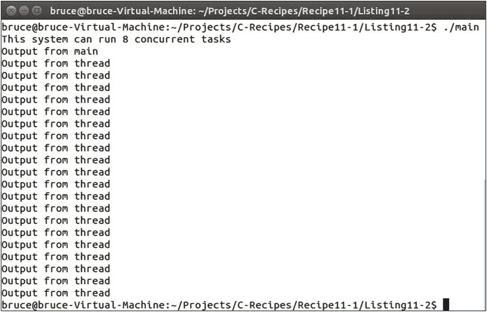
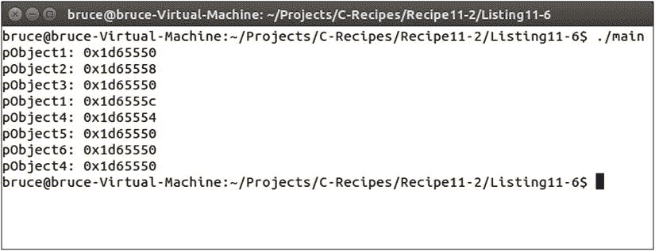
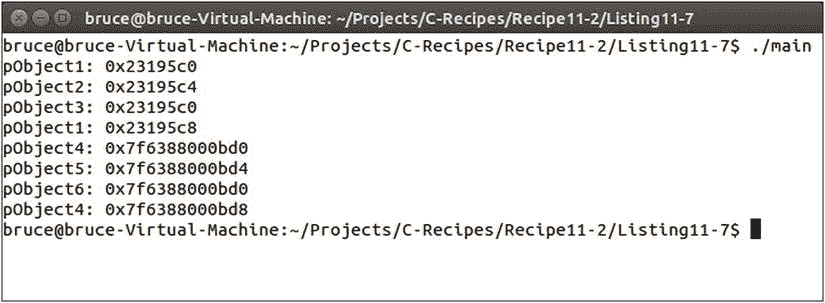
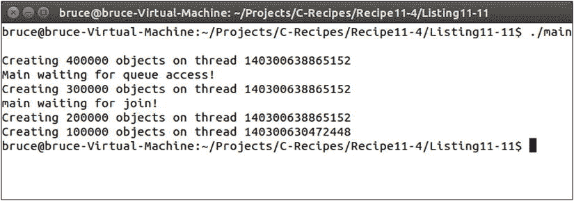
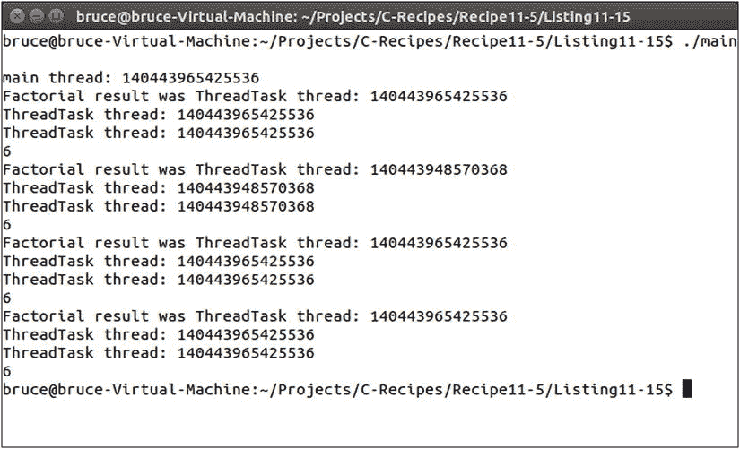

# 十一、并发

CPU 制造商最近努力以 20 世纪 90 年代可能达到的速度提高 CPU 频率。通过巧妙的 CPU 设计和在单个芯片上包含多个处理器，CPU 性能一直在不断提高。这意味着今天的程序员如果希望他们的程序在现代计算机芯片上快速运行，就必须采用并发编程或多线程编程。

对于程序员来说，并发编程可能是一个挑战。许多陷阱等待着并发程序，包括数据不同步，因此是错误的，以及一旦您的任务需要使用锁来管理访问时的死锁。本章的食谱向你介绍了 C++ 提供的 STL 特性的一些实际应用，以帮助你编写并发程序。

11-1.使用线程执行并发任务

问题

您正在编写一个性能很差的程序，并且您希望通过在一个系统中使用多个处理器来加快执行速度。

解决办法

C++ 提供了`thread`类型，可以用来创建本地操作系统线程。程序线程可以在多个处理器上运行，因此允许您编写可以使用多个 CPU 和 CPU 内核的程序。

它是如何工作的

检测逻辑 CPU 核心的数量

C++ 线程库提供了一个特性集，允许程序使用给定计算机系统中所有可用的内核和 CPU。您应该知道的 C++ 线程功能提供的第一个重要功能允许您查询计算机包含的执行单元的数量。清单 11-1 展示了 C++ `thread::hardware_concurrency`方法 。

***清单 11-1*** 。`thread::hardware_concurrency`法

```cpp
#include <iostream>
#include <thread>

using namespace std;

int main(int argc, char* argv[])
{
    const unsigned int numberOfProcessors{ thread::hardware_concurrency() };

    cout << "This system can run " << numberOfProcessors << " concurrent tasks" << endl;

    return 0;
}
```

这段代码使用`thread::hardware_concurrency`方法来查询执行程序的计算机上可以同时运行的线程数量。图 11-1 显示了这个程序在我的台式电脑上生成的输出。


图 11-1 。在英特尔酷睿 i7 3770 上调用`thread::hardware_concurrency`的结果

在采用英特尔酷睿 i5 4200U 处理器的 Surface Pro 2 上运行相同的代码，会返回 4 的值，而酷睿 i7 3770 返回 8 的值。你可以在图 11-2 中看到 Surface Pro 2 给出的结果。


图 11-2 。在 Surface Pro 2 上运行清单 11-1 的结果

在逻辑内核太少的计算机上运行太多线程会导致计算机无响应，因此在创建程序时记住这一点很重要。

创建线程

一旦您知道您正在运行的系统可能会从使用并发执行中受益，您就可以使用 C++ `thread`类来创建要在多个处理器内核上运行的任务。`thread`类是一个可移植的内置类型，允许您为任何操作系统编写多线程代码。

 **注意**`thread`类是 C++ 编程语言的新成员。它是在 C++11 语言规范中添加的，所以您可能需要查看您正在使用的 STL 库的文档，以确保它支持这个特性。

**线程**构造函数使用简单，并接受一个函数在另一个 CPU 内核上执行。清单 11-2 显示了一个简单的`thread`输出到控制台。

***清单 11-2*** 。创建一个`thread`

```cpp
#include <iostream>
#include <thread>

using namespace std;

void ThreadTask()
{
    for (unsigned int i{ 0 }; i < 20; ++i)
    {
        cout << "Output from thread" << endl;
    }
}

int main(int argc, char* argv[])
{
    const unsigned int numberOfProcessors{ thread::hardware_concurrency() };

    cout << "This system can run " << numberOfProcessors << " concurrent tasks" << endl;

    if (numberOfProcessors > 1)
    {
        thread myThread{ ThreadTask };

        cout << "Output from main" << endl;

        myThread.join();
    }
    else
    {
        cout << "CPU does not have multiple cores." << endl;
    }

        return 0;
}
```

清单 11-2 根据执行程序的计算机上逻辑核心的数量决定是否创建一个**线程**。

 **注意**大多数操作系统都允许你运行比处理器数量更多的线程，但是你可能会发现这样做会降低你的程序速度，因为管理多线程的开销很大。

如果 CPU 有不止一个逻辑核心，程序会创建一个名为`myThread`的`thread`对象。`myThread`变量用一个指向函数的指针初始化。这个函数将在**线程**上下文中执行，并且很可能在与`main`函数不同的 CPU 线程上执行。

`ThreadTask`功能由一个`for`循环组成，简单地多次输出到控制台。`main`功能也输出到控制台。目的是显示两种功能同时运行。你可以在图 11-3 的中看到这一点，其中`main`的输出出现在`ThreadTask`输出的中间。



图 11-3 。输出显示清单 11-2 中的`main`和`ThreadTask`同时运行

线程后清理

清单 11-2 中的`main`函数立即调用线程上的`join`方法。`join`方法用于告诉当前**线程**等待附加**线程**结束执行后再继续。这一点很重要，因为 C++ 程序需要销毁自己的线程来防止泄漏的发生。在一个`thread`对象上调用析构函数不会破坏当前正在执行的`thread`上下文。清单 11-3 显示的代码已经被修改为不在`myThread`调用`join` 。

***清单 11-3*** 。忘记在`thread`上调用`join`

```cpp
#include <iostream>
#include <thread>

using namespace std;

void ThreadTask()
{
    for (unsigned int i{ 0 }; i < 20; ++i)
    {
        cout << "Output from thread" << endl;
    }
}

int main(int argc, char* argv[])
{
    const unsigned int numberOfProcessors{ thread::hardware_concurrency() };

    cout << "This system can run " << numberOfProcessors << " concurrent tasks" << endl;

    if (numberOfProcessors > 1)
    {
        thread myThread{ ThreadTask };

        cout << "Output from main" << endl;
    }
    else
    {
        cout << "CPU does not have multiple cores." << endl;
    }

    return 0;
}
```

这段代码导致`myThread`对象在`ThreadTask`函数完成执行之前超出范围。这会导致程序中的**线程**泄漏，最终可能导致程序或操作系统变得不稳定。运行在 Linux 命令行上的程序将会失败，并显示如图图 11-4 所示的错误。


图 11-4 。在完成前调用`thread`析构函数时的 Linux 错误

正如您所看到的，这个警告不是特别具有描述性，而且也不能保证您在使用其他操作系统和库时会得到任何警告。因此，了解您的**线程的**生存期并确保您恰当地处理它们是非常重要的。

一种方法是使用`join`方法让程序在关闭线程之前等待**线程**完成。C++ 还提供了第二个选项:`detach`方法。清单 11-4 显示了正在使用的`detach`方法。

***清单 11-4*** 。使用`detach`方法

```cpp
#include <iostream>
#include <thread>

using namespace std;

void ThreadTask()
{
    for (unsigned int i = 0; i < 20; ++i)
    {
        cout << "Output from thread" << endl;
    }
}

int main(int argc, char* argv[])
{
    const unsigned int numberOfProcessors{ thread::hardware_concurrency() };

    cout << "This system can run " << numberOfProcessors << " concurrent tasks" << endl;

    if (numberOfProcessors > 1)
    {
        thread myThread{ ThreadTask };

        cout << "Output from main" << endl;

        myThread.detach();
    }
    else
    {
        cout << "CPU does not have multiple cores." << endl;
    }

    return 0;
}
```

清单 11-4 显示了`detach`方法可以用来代替`join`。`join`方法使程序在继续之前等待一个正在运行的**线程**完成，但是`detach`方法不会。`detach`方法允许你创建**线程**，它们比你的程序执行的时间更长。这对于需要长时间跟踪时间的系统任务可能很有用；然而，我怀疑许多日常程序是否会使用这种方法。还有一个风险是你的程序会泄漏已经被分离的**线程**，并且没有办法取回那些任务。一旦**线程**中的执行上下文被分离，您就永远不能重新附加它。

11-2.创建线程范围变量

问题

您有在实现中使用静态数据的对象类，并且您希望将它们与**线程**一起使用。

解决办法

C++ 提供了`thread_local`说明符，允许计算机在每个线程的基础上创建静态数据的实例。

它是如何工作的

在我介绍如何使用`thread_local`之前，让我们先来看一个可能出现这个问题的场景，这样你就可以清楚地看到这个问题以及解决方案本身可能导致的问题。清单 11-5 包含了一个类，它使用对象的静态向量来阻止对`new`和`delete`的多次调用。

***清单 11-5*** 。创建使用静态数据跟踪状态的类

```cpp
#include <cstdlib>
#include <iostream>
#include <stack>
#include <thread>
#include <vector>

using namespace std;

class MyManagedObject
{
private:
    static const unsigned int MAX_OBJECTS{ 4 };

    using MyManagedObjectCollection = vector < MyManagedObject > ;
    static MyManagedObjectCollection s_ManagedObjects;

    static stack<unsigned int> s_FreeList;

    unsigned int m_Value{ 0xFFFFFFFF };

public:
    MyManagedObject() = default;
    MyManagedObject(unsigned int value)
        : m_Value{ value }
    {

    }

    void* operator new(size_t numBytes)
    {
        void* objectMemory{};

        if (s_ManagedObjects.capacity() < MAX_OBJECTS)
        {
            s_ManagedObjects.reserve(MAX_OBJECTS);
        }

        if (numBytes == sizeof(MyManagedObject) &&
            s_ManagedObjects.size() < s_ManagedObjects.capacity())
        {
            unsigned int index{ 0xFFFFFFFF };
            if (s_FreeList.size() > 0)
            {
                index = s_FreeList.top();
                s_FreeList.pop();
            }

            if (index == 0xFFFFFFFF)
            {
                s_ManagedObjects.push_back({});
                index = s_ManagedObjects.size() - 1;
            }

            objectMemory = s_ManagedObjects.data() + index;
        }
        else
        {
            objectMemory = malloc(numBytes);
        }

        return objectMemory;
    }

    void operator delete(void* pMem)
    {
        const intptr_t index{
            (static_cast<MyManagedObject*>(pMem) - s_ManagedObjects.data()) /
            static_cast<intptr_t>(sizeof(MyManagedObject)) };
        if (0 <= index && index < static_cast<intptr_t>(s_ManagedObjects.size()))
        {
            s_FreeList.emplace(static_cast<unsigned int>(index));
        }
        else
        {
            free(pMem);
        }
    }
};

MyManagedObject::MyManagedObjectCollection MyManagedObject::s_ManagedObjects{};
stack<unsigned int> MyManagedObject::s_FreeList{};

int main(int argc, char* argv[])
{
    cout << hex << showbase;

    MyManagedObject* pObject1{ new MyManagedObject(1) };

    cout << "pObject1: " << pObject1 << endl;

    MyManagedObject* pObject2{ new MyManagedObject(2) };

    cout << "pObject2: " << pObject2 << endl;

    delete pObject1;
    pObject1 = nullptr;

    MyManagedObject* pObject3{ new MyManagedObject(3) };

    cout << "pObject3: " << pObject3 << endl;

    pObject1 = new MyManagedObject(4);

    cout << "pObject1: " << pObject1 << endl;

    delete pObject2;
    pObject2 = nullptr;

    delete pObject3;
    pObject3 = nullptr;

    delete pObject1;
    pObject1 = nullptr;

    return 0;
}
```

清单 11-5 中的代码重载了`MyManagedObject`类上的`new`和`delete`方法。这些重载用于从预分配内存的初始池中返回新创建的对象。这样做将允许你把一个给定类型的对象的数量限制在一个预先安排好的限度内，但仍然允许你使用熟悉的`new`和`delete`语法。

 **注意**清单 11-5 中的代码实际上并不强制限制；当达到限制时，它简单地退回到动态分配。

托管类通过使用常数来确定应该存在的预分配对象的数量。该数字用于在第一次分配时初始化向量。每次后续分配都从这个向量开始，直到用完为止。维护索引的自由列表。如果池中的一个对象被释放，它的索引将被添加到自由堆栈的顶部。空闲列表中的对象按照它们被添加到堆栈中的顺序重新发布。图 11-5 显示`pObject3`以`pObject1`被删除前使用的相同地址结束。


图 11-5 。显示`MyManagedObject`池正确运行的输出

这个托管池的操作使用一个`static vector`和一个`static stack`来跨所有`MyManagedObject`实例维护该池。这在与**线程**耦合时会产生问题，因为你不能确定不同的**线程**不会同时尝试访问这些对象。

清单 11-6 更新了来自清单 11-5 的代码，使用一个`thread`来创建`MyManagedObject`实例。

***清单 11-6*** 。使用一个`thread`来创建`MyManagedObject`实例

```cpp
#include <cstdlib>
#include <iostream>
#include <stack>
#include <thread>
#include <vector>

using namespace std;

class MyManagedObject
{
private:
    static const unsigned int MAX_OBJECTS{ 8 };

    using MyManagedObjectCollection = vector < MyManagedObject >;
    static MyManagedObjectCollection s_ManagedObjects;

    static stack<unsigned int> s_FreeList;

    unsigned int m_Value{ 0xFFFFFFFF };

public:
    MyManagedObject() = default;
    MyManagedObject(unsigned int value)
        : m_Value{ value }
    {

    }

    void* operator new(size_t numBytes)
    {
        void* objectMemory{};

        if (s_ManagedObjects.capacity() < MAX_OBJECTS)
        {
            s_ManagedObjects.reserve(MAX_OBJECTS);
        }

        if (numBytes == sizeof(MyManagedObject) &&
            s_ManagedObjects.size() < s_ManagedObjects.capacity())
        {
            unsigned int index{ 0xFFFFFFFF };
            if (s_FreeList.size() > 0)
            {
                index = s_FreeList.top();
                s_FreeList.pop();
            }

            if (index == 0xFFFFFFFF)
            {
                s_ManagedObjects.push_back({});
                index = s_ManagedObjects.size() - 1;
            }

            objectMemory = s_ManagedObjects.data() + index;
        }
        else
        {
            objectMemory = malloc(numBytes);
        }

        return objectMemory;
    }

    void operator delete(void* pMem)
    {
        const intptr_t index{
            (static_cast<MyManagedObject*>(pMem)-s_ManagedObjects.data()) /
            static_cast< intptr_t >(sizeof(MyManagedObject)) };
        if (0 <= index && index < static_cast< intptr_t >(s_ManagedObjects.size()))
        {
            s_FreeList.emplace(static_cast<unsigned int>(index));
        }
        else
        {
            free(pMem);
        }
    }
};

MyManagedObject::MyManagedObjectCollection MyManagedObject::s_ManagedObjects{};
stack<unsigned int> MyManagedObject::s_FreeList{};

void ThreadTask()
{
    MyManagedObject* pObject4{ new MyManagedObject(5) };

    cout << "pObject4: " << pObject4 << endl;

    MyManagedObject* pObject5{ new MyManagedObject(6) };

    cout << "pObject5: " << pObject5 << endl;

    delete pObject4;
    pObject4 = nullptr;

    MyManagedObject* pObject6{ new MyManagedObject(7) };

    cout << "pObject6: " << pObject6 << endl;

    pObject4 = new MyManagedObject(8);

    cout << "pObject4: " << pObject4 << endl;

    delete pObject5;
    pObject5 = nullptr;

    delete pObject6;
    pObject6 = nullptr;

    delete pObject4;
    pObject4 = nullptr;
}

int main(int argc, char* argv[])
{
    cout << hex << showbase;

    thread myThread{ ThreadTask };

    MyManagedObject* pObject1{ new MyManagedObject(1) };

    cout << "pObject1: " << pObject1 << endl;

    MyManagedObject* pObject2{ new MyManagedObject(2) };

    cout << "pObject2: " << pObject2 << endl;

    delete pObject1;
    pObject1 = nullptr;

    MyManagedObject* pObject3{ new MyManagedObject(3) };

    cout << "pObject3: " << pObject3 << endl;

    pObject1 = new MyManagedObject(4);

    cout << "pObject1: " << pObject1 << endl;

    delete pObject2;
    pObject2 = nullptr;

    delete pObject3;
    pObject3 = nullptr;

    delete pObject1;
    pObject1 = nullptr;

    myThread.join();

    return 0;
}
```

清单 11-6 中的代码使用一个`thread`与`main`函数同时从池中分配对象。这意味着可以从两个位置同时访问静态池，您的程序可能会遇到问题。两个常见的问题是意外的程序崩溃和数据竞争。

数据竞争 是一个更微妙的问题，会导致意外的内存损坏。图 11-6 说明了这个问题。



图 11-6 。线程间发生数据竞争所导致的问题

从同一个池中分配对象所带来的问题可能很微妙，一开始很难发现。如果你仔细观察，你会发现`pObject6`和`pObject3`指向同一个内存地址。这些指针是在不同的线程上创建和初始化的，你永远也不会期望它们指向同一个内存地址，即使在你的池中有对象重用。这也是使用**螺纹**的一个难点。相关的问题是非常时间敏感的，它们的表现形式可以被执行时的计算机条件所改变。其他程序可能会创建导致您自己的线程稍微延迟的线程，因此您的线程逻辑中的问题可能会以许多不同的方式表现出来，尽管其根本原因是相同的。

C++ 为这个问题提供了一个解决方案:`thread_local`关键字。`thread_local`关键字告诉编译器，你创建的`static`对象对于你创建的每个使用这些对象的`thread`应该是唯一的。副作用是您没有一个跨所有类的静态对象的共享实例。这与`static`的正常用法有很大的不同，在正常用法中，该类型的所有实例只有一个共享对象。清单 11-7 显示了内存池函数和相关的`static`变量被更新为使用`thread_local`。

***清单 11-7*** 。使用`thread_local`

```cpp
#include <cstdlib>
#include <iostream>
#include <stack>
#include <thread>
#include <vector>

using namespace std;

class MyManagedObject
{
private:
    static thread_local const unsigned int MAX_OBJECTS;

    using MyManagedObjectCollection = vector < MyManagedObject >;
    static thread_local MyManagedObjectCollection s_ManagedObjects;

    static thread_local stack<unsigned int> s_FreeList;

    unsigned int m_Value{ 0xFFFFFFFF };

public:
    MyManagedObject() = default;
    MyManagedObject(unsigned int value)
        : m_Value{ value }
    {

    }

    void* operator new(size_t numBytes)
    {
        void* objectMemory{};

        if (s_ManagedObjects.capacity() < MAX_OBJECTS)
        {
            s_ManagedObjects.reserve(MAX_OBJECTS);
        }

        if (numBytes == sizeof(MyManagedObject) &&
            s_ManagedObjects.size() < s_ManagedObjects.capacity())
        {
            unsigned int index{ 0xFFFFFFFF };
            if (s_FreeList.size() > 0)
            {
                index = s_FreeList.top();
                s_FreeList.pop();
            }

            if (index == 0xFFFFFFFF)
            {
                s_ManagedObjects.push_back({});
                index = s_ManagedObjects.size() - 1;
            }

            objectMemory = s_ManagedObjects.data() + index;
        }
        else
        {
            objectMemory = malloc(numBytes);
        }

        return objectMemory;
    }

        void operator delete(void* pMem)
    {
        const intptr_t index{
            (static_cast<MyManagedObject*>(pMem)-s_ManagedObjects.data()) /
            static_cast<intptr_t>(sizeof(MyManagedObject)) };
        if (0 <= index && index < static_cast< intptr_t >(s_ManagedObjects.size()))
        {
            s_FreeList.emplace(static_cast<unsigned int>(index));
        }
        else
        {
            free(pMem);
        }
    }
};

thread_local const unsigned int MyManagedObject::MAX_OBJECTS{ 8 };
thread_local MyManagedObject::MyManagedObjectCollection MyManagedObject::s_ManagedObjects{};
thread_local stack<unsigned int> MyManagedObject::s_FreeList{};

void ThreadTask()
{
    MyManagedObject* pObject4{ new MyManagedObject(5) };

    cout << "pObject4: " << pObject4 << endl;

    MyManagedObject* pObject5{ new MyManagedObject(6) };

    cout << "pObject5: " << pObject5 << endl;

    delete pObject4;
    pObject4 = nullptr;

    MyManagedObject* pObject6{ new MyManagedObject(7) };

    cout << "pObject6: " << pObject6 << endl;

    pObject4 = new MyManagedObject(8);

    cout << "pObject4: " << pObject4 << endl;

    delete pObject5;
    pObject5 = nullptr;

    delete pObject6;
    pObject6 = nullptr;

    delete pObject4;
    pObject4 = nullptr;
}

int main(int argc, char* argv[])
{
    cout << hex << showbase;

    thread myThread{ ThreadTask };

    MyManagedObject* pObject1{ new MyManagedObject(1) };

    cout << "pObject1: " << pObject1 << endl;

    MyManagedObject* pObject2{ new MyManagedObject(2) };

    cout << "pObject2: " << pObject2 << endl;

    delete pObject1;
    pObject1 = nullptr;

    MyManagedObject* pObject3{ new MyManagedObject(3) };

    cout << "pObject3: " << pObject3 << endl;

    pObject1 = new MyManagedObject(4);

    cout << "pObject1: " << pObject1 << endl;

    delete pObject2;
    pObject2 = nullptr;

    delete pObject3;
    pObject3 = nullptr;

    delete pObject1;
    pObject1 = nullptr;

    myThread.join();

    return 0;
}
```

清单 11-7 显示了您可以通过在声明和定义中添加`thread_local`标识符来指定`static`变量具有`thread_local`存储。这一变化的影响是主函数和`ThreadTask`函数在它们自己的执行上下文中有单独的`s_ManagedObjects`、`s_FreeList`和`MAX_OBJECT`变量。既然每个都有两个副本，您就有了两倍数量的潜在对象，因为池已经被复制了。这对你的程序来说可能是也可能不是问题，但是你在使用`thread_local`时应该小心，并考虑任何意想不到的后果。图 11-7 显示了运行清单 11-7 中代码的结果。



图 11-7 。使用`thread_local`时的输出

你可以在使用**螺纹**时看到问题。第一行输出在两个**线程**之间分配，但是很明显两个**线程**被分配了内存中完全不同位置的值。这证明编译器已经确保`static`变量对于程序中的每个`thread`是唯一的。你可以更进一步，给程序添加更多的线程，并看到它们从内存的不同位置分配对象，并且不同**线程**上的两个指针决不能指向同一个内存地址。

11-3.使用互斥访问共享对象

问题

您有一个对象，您希望能够在不止一个**线程**上同时访问它。

解决办法

C++ 提供了`mutex`对象，允许您提供对代码段的互斥访问。

它是如何工作的

互斥体可以用来同步**线程**。这是通过`mutex`类及其提供的获取和释放**互斥体**的方法来实现的。在继续执行之前，一个**线程**可以通过等待直到它可以获得**互斥体**来确定当前没有其他**线程**正在访问共享资源。清单 11-8 中的程序包含一个*数据竞争*:两个**线程**可以同时访问一个共享资源并导致不稳定和意外的程序行为。

***清单 11-8*** 。包含数据竞赛的程序

```cpp
#include <cstdlib>
#include <iostream>
#include <stack>
#include <thread>
#include <vector>

using namespace std;

class MyManagedObject
{
private:
    static const unsigned int MAX_OBJECTS{ 8 };

    using MyManagedObjectCollection = vector < MyManagedObject >;
    static MyManagedObjectCollection s_ManagedObjects;

    static stack<unsigned int> s_FreeList;

    unsigned int m_Value{ 0xFFFFFFFF };

public:
    MyManagedObject() = default;
    MyManagedObject(unsigned int value)
        : m_Value{ value }
    {

    }

    void* operator new(size_t numBytes)
    {
        void* objectMemory{};

        if (s_ManagedObjects.capacity() < MAX_OBJECTS)
        {
            s_ManagedObjects.reserve(MAX_OBJECTS);
        }

        if (numBytes == sizeof(MyManagedObject) &&
            s_ManagedObjects.size() < s_ManagedObjects.capacity())
        {
            unsigned int index{ 0xFFFFFFFF };
            if (s_FreeList.size() > 0)
            {
                index = s_FreeList.top();
                s_FreeList.pop();
            }

            if (index == 0xFFFFFFFF)
            {
                s_ManagedObjects.push_back({});
                index = s_ManagedObjects.size() - 1;
            }

            objectMemory = s_ManagedObjects.data() + index;
        }
        else
        {
            objectMemory = malloc(numBytes);
        }

        return objectMemory;
    }

    void operator delete(void* pMem)
    {
        const intptr_t index{
            (static_cast<MyManagedObject*>(pMem)-s_ManagedObjects.data()) /
            static_cast<intptr_t>(sizeof(MyManagedObject)) };
        if (0 <= index && index < static_cast< intptr_t >(s_ManagedObjects.size()))
        {
            s_FreeList.emplace(static_cast<unsigned int>(index));
        }
        else
        {
            free(pMem);
        }
    }
};

MyManagedObject::MyManagedObjectCollection MyManagedObject::s_ManagedObjects{};
stack<unsigned int> MyManagedObject::s_FreeList{};

void ThreadTask()
{
    MyManagedObject* pObject4{ new MyManagedObject(5) };

    cout << "pObject4: " << pObject4 << endl;

    MyManagedObject* pObject5{ new MyManagedObject(6) };

    cout << "pObject5: " << pObject5 << endl;

    delete pObject4;
    pObject4 = nullptr;

    MyManagedObject* pObject6{ new MyManagedObject(7) };

    cout << "pObject6: " << pObject6 << endl;

    pObject4 = new MyManagedObject(8);

    cout << "pObject4: " << pObject4 << endl;

    delete pObject5;
    pObject5 = nullptr;

    delete pObject6;
    pObject6 = nullptr;

    delete pObject4;
    pObject4 = nullptr;
}

int main(int argc, char* argv[])
{
    cout << hex << showbase;

    thread myThread{ ThreadTask };

    MyManagedObject* pObject1{ new MyManagedObject(1) };

    cout << "pObject1: " << pObject1 << endl;

    MyManagedObject* pObject2{ new MyManagedObject(2) };

    cout << "pObject2: " << pObject2 << endl;

    delete pObject1;
    pObject1 = nullptr;

    MyManagedObject* pObject3{ new MyManagedObject(3) };

    cout << "pObject3: " << pObject3 << endl;

    pObject1 = new MyManagedObject(4);

    cout << "pObject1: " << pObject1 << endl;

    delete pObject2;
    pObject2 = nullptr;

    delete pObject3;
    pObject3 = nullptr;

    delete pObject1;
    pObject1 = nullptr;

    myThread.join();

    return 0;
}
```

这个程序不能阻止`ThreadTask`中的代码和`main`函数访问`MyManagedObject class` 中的`s_ManagedObjects`和`s_FreeList`池。对这些对象的访问可以由一个**互斥体**来保护，正如你在清单 11-9 中看到的。

***清单 11-9*** 。添加互斥体以保护对共享对象的访问

```cpp
#include <cstdlib>
#include <iostream>
#include <mutex>
#include <stack>
#include <thread>
#include <vector>

using namespace std;

class MyManagedObject
{
private:
    static const unsigned int MAX_OBJECTS{ 8 };

    using MyManagedObjectCollection = vector < MyManagedObject >;
    static MyManagedObjectCollection s_ManagedObjects;

    static stack<unsigned int> s_FreeList;

    static mutex s_Mutex;

    unsigned int m_Value{ 0xFFFFFFFF };

public:
    MyManagedObject() = default;
    MyManagedObject(unsigned int value)
        : m_Value{ value }
    {

    }

    void* operator new(size_t numBytes)
    {
        void* objectMemory{};

        s_Mutex.lock();

        if (s_ManagedObjects.capacity() < MAX_OBJECTS)
        {
            s_ManagedObjects.reserve(MAX_OBJECTS);
        }

        if (numBytes == sizeof(MyManagedObject) &&
            s_ManagedObjects.size() < s_ManagedObjects.capacity())
        {
            unsigned int index{ 0xFFFFFFFF };
            if (s_FreeList.size() > 0)
            {
                index = s_FreeList.top();
                s_FreeList.pop();
            }

            if (index == 0xFFFFFFFF)
            {
                s_ManagedObjects.push_back({});
                index = s_ManagedObjects.size() - 1;
            }

            objectMemory = s_ManagedObjects.data() + index;
        }
        else
        {
            objectMemory = malloc(numBytes);
        }

        s_Mutex.unlock();

        return objectMemory;
    }

    void operator delete(void* pMem)
    {
        s_Mutex.lock();

        const intptr_t index{
            (static_cast<MyManagedObject*>(pMem)-s_ManagedObjects.data()) /
            static_cast<intptr_t>(sizeof(MyManagedObject)) };
        if (0 <= index && index < static_cast< intptr_t >(s_ManagedObjects.size()))
        {
            s_FreeList.emplace(static_cast<unsigned int>(index));
        }
        else
        {
            free(pMem);
        }

        s_Mutex.unlock();
    }
};

MyManagedObject::MyManagedObjectCollection MyManagedObject::s_ManagedObjects{};
stack<unsigned int> MyManagedObject::s_FreeList{};
mutex MyManagedObject::s_Mutex;

void ThreadTask()
{
    MyManagedObject* pObject4{ new MyManagedObject(5) };

    cout << "pObject4: " << pObject4 << endl;

    MyManagedObject* pObject5{ new MyManagedObject(6) };

    cout << "pObject5: " << pObject5 << endl;

    delete pObject4;
    pObject4 = nullptr;

    MyManagedObject* pObject6{ new MyManagedObject(7) };

    cout << "pObject6: " << pObject6 << endl;

    pObject4 = new MyManagedObject(8);

    cout << "pObject4: " << pObject4 << endl;

    delete pObject5;
    pObject5 = nullptr;

    delete pObject6;
    pObject6 = nullptr;

    delete pObject4;
    pObject4 = nullptr;
}

int main(int argc, char* argv[])
{
    cout << hex << showbase;

    thread myThread{ ThreadTask };

    MyManagedObject* pObject1{ new MyManagedObject(1) };

    cout << "pObject1: " << pObject1 << endl;

    MyManagedObject* pObject2{ new MyManagedObject(2) };

    cout << "pObject2: " << pObject2 << endl;

    delete pObject1;
    pObject1 = nullptr;

    MyManagedObject* pObject3{ new MyManagedObject(3) };

    cout << "pObject3: " << pObject3 << endl;

    pObject1 = new MyManagedObject(4);

    cout << "pObject1: " << pObject1 << endl;

    delete pObject2;
    pObject2 = nullptr;

    delete pObject3;
    pObject3 = nullptr;

    delete pObject1;
    pObject1 = nullptr;

    myThread.join();

    return 0;
}
```

这段代码使用一个**互斥体**来确保`MyManagedObject`类中的`new`和`delete`函数在任何给定时间都只在一个**线程**上执行。这确保了为这个**类**维护的对象池总是处于有效状态，并且相同的地址不会被给予不同的**线程**。代码要求在它所保护的函数的整个执行过程中都保持锁。C++ 提供了一个名为`lock_guard`的助手类，它在构造时自动锁定一个**互斥体**，在销毁时释放**互斥体**。清单 11-10 显示了一个`lock_` `guard` 在使用。

***清单 11-10*** 。使用`lock_guard`

```cpp
#include <cstdlib>
#include <iostream>
#include <mutex>
#include <stack>
#include <thread>
#include <vector>

using namespace std;

class MyManagedObject
{
private:
    static const unsigned int MAX_OBJECTS{ 8 };

    using MyManagedObjectCollection = vector < MyManagedObject >;
    static MyManagedObjectCollection s_ManagedObjects;

    static stack<unsigned int> s_FreeList;

    static mutex s_Mutex;

    unsigned int m_Value{ 0xFFFFFFFF };

public:
    MyManagedObject() = default;
    MyManagedObject(unsigned int value)
        : m_Value{ value }
    {

    }

    void* operator new(size_t numBytes)
    {
        lock_guard<mutex> lock{ s_Mutex };

        void* objectMemory{};

        if (s_ManagedObjects.capacity() < MAX_OBJECTS)
        {
            s_ManagedObjects.reserve(MAX_OBJECTS);
        }

        if (numBytes == sizeof(MyManagedObject) &&
            s_ManagedObjects.size() < s_ManagedObjects.capacity())
        {
            unsigned int index{ 0xFFFFFFFF };
            if (s_FreeList.size() > 0)
            {
                index = s_FreeList.top();
                s_FreeList.pop();
            }

            if (index == 0xFFFFFFFF)
            {
                s_ManagedObjects.push_back({});
                index = s_ManagedObjects.size() - 1;
            }

            objectMemory = s_ManagedObjects.data() + index;
        }
        else
        {
            objectMemory = malloc(numBytes);
        }

        return objectMemory;
    }

    void operator delete(void* pMem)
    {
        lock_guard<mutex> lock{ s_Mutex };

        const intptr_t index{
            (static_cast<MyManagedObject*>(pMem)-s_ManagedObjects.data()) /
            static_cast<intptr_t>(sizeof(MyManagedObject)) };
        if (0 <= index && index < static_cast<intptr_t>(s_ManagedObjects.size()))
        {
            s_FreeList.emplace(static_cast<unsigned int>(index));
        }
        else
        {
            free(pMem);
        }
    }
};

MyManagedObject::MyManagedObjectCollection MyManagedObject::s_ManagedObjects{};
stack<unsigned int> MyManagedObject::s_FreeList{};
mutex MyManagedObject::s_Mutex;

void ThreadTask()
{
    MyManagedObject* pObject4{ new MyManagedObject(5) };

    cout << "pObject4: " << pObject4 << endl;

    MyManagedObject* pObject5{ new MyManagedObject(6) };

    cout << "pObject5: " << pObject5 << endl;

    delete pObject4;
    pObject4 = nullptr;

    MyManagedObject* pObject6{ new MyManagedObject(7) };

    cout << "pObject6: " << pObject6 << endl;

    pObject4 = new MyManagedObject(8);

    cout << "pObject4: " << pObject4 << endl;

    delete pObject5;
    pObject5 = nullptr;

    delete pObject6;
    pObject6 = nullptr;

    delete pObject4;
    pObject4 = nullptr;
}

int main(int argc, char* argv[])
{
    cout << hex << showbase;

    thread myThread{ ThreadTask };

    MyManagedObject* pObject1{ new MyManagedObject(1) };

    cout << "pObject1: " << pObject1 << endl;

    MyManagedObject* pObject2{ new MyManagedObject(2) };

    cout << "pObject2: " << pObject2 << endl;

    delete pObject1;
    pObject1 = nullptr;

    MyManagedObject* pObject3{ new MyManagedObject(3) };

    cout << "pObject3: " << pObject3 << endl;

    pObject1 = new MyManagedObject(4);

    cout << "pObject1: " << pObject1 << endl;

    delete pObject2;
    pObject2 = nullptr;

    delete pObject3;
    pObject3 = nullptr;

    delete pObject1;
    pObject1 = nullptr;

    myThread.join();

    return 0;
}
```

使用`lock_guard`意味着你不必担心在**互斥体**上调用`unlock`。它也符合许多 C++ 开发人员试图遵循的资源分配初始化(RAII)模式。

11-4.创建等待事件的线程

问题

你想要创建一个**线程**来等待你程序中的另一个事件。

解决办法

C++ 提供了`condition_variable class` ，它可以用来通知等待的**线程**发生了一个事件。

它是如何工作的

`condition_variable`是另一个 C++ 构造，它将复杂的行为包装到一个简单的对象接口中。在多线程编程中，创建**线程**来等待另一个**线程**中的某个事件发生是很常见的。这在生产者/消费者的情况下很常见，其中一个**线程**可能正在创建任务，而另一个**线程**正在拍卖或执行这些任务。在这些场景中，条件变量是完美的。

一个`condition_variable`需要一个**互斥**才能生效。它的工作方式是等待某个条件变为真，然后试图获取保护共享资源的互斥锁。清单 11-11 使用一个**互斥体**、一个`unique_lock`和一个`condition_variable`在**线程**之间进行通信，此时一个生产者**线程**已经为两个消费者`threads`排队了工作。

***清单 11-11*** 。使用`condition_variable`唤醒线程

```cpp
#include <condition_variable>
#include <cstdlib>
#include <functional>
#include <iostream>
#include <mutex>
#include <thread>
#include <stack>
#include <vector>

using namespace std;

class MyManagedObject
{
private:
    static const unsigned int MAX_OBJECTS{ 8 };

    using MyManagedObjectCollection = vector < MyManagedObject >;
    static MyManagedObjectCollection s_ManagedObjects;

    static stack<unsigned int> s_FreeList;

    static mutex s_Mutex;

    unsigned int m_Value{ 0xFFFFFFFF };

public:
    MyManagedObject() = default;
    MyManagedObject(unsigned int value)
        : m_Value{ value }
    {

    }

    unsigned int GetValue() const { return m_Value; }

    void* operator new(size_t numBytes)
    {
        lock_guard<mutex> lock{ s_Mutex };

        void* objectMemory{};

        if (s_ManagedObjects.capacity() < MAX_OBJECTS)
        {
            s_ManagedObjects.reserve(MAX_OBJECTS);
        }

        if (numBytes == sizeof(MyManagedObject) &&
            s_ManagedObjects.size() < s_ManagedObjects.capacity())
        {
            unsigned int index{ 0xFFFFFFFF };
            if (s_FreeList.size() > 0)
            {
                index = s_FreeList.top();
                s_FreeList.pop();
            }

            if (index == 0xFFFFFFFF)
            {
                s_ManagedObjects.push_back({});
                index = s_ManagedObjects.size() - 1;
            }

            objectMemory = s_ManagedObjects.data() + index;
        }
        else
        {
            objectMemory = malloc(numBytes);
        }

        return objectMemory;
    }

        void operator delete(void* pMem)
    {
        lock_guard<mutex> lock{ s_Mutex };

        const intptr_t index{
            (static_cast<MyManagedObject*>(pMem)-s_ManagedObjects.data()) /
            static_cast<intptr_t>(sizeof(MyManagedObject)) };
        if (0 <= index && index < static_cast<intptr_t>(s_ManagedObjects.size()))
        {
            s_FreeList.emplace(static_cast<unsigned int>(index));
        }
        else
        {
            free(pMem);
        }
    }
};

MyManagedObject::MyManagedObjectCollection MyManagedObject::s_ManagedObjects{};
stack<unsigned int> MyManagedObject::s_FreeList{};
mutex MyManagedObject::s_Mutex;

using ProducerQueue = vector < unsigned int > ;

void ThreadTask(
    reference_wrapper<condition_variable> condition,
    reference_wrapper<mutex> queueMutex,
    reference_wrapper<ProducerQueue> queueRef,
    reference_wrapper<bool> die)
{
    ProducerQueue& queue{ queueRef.get() };

    while (!die.get() || queue.size())
    {
        unique_lock<mutex> lock{ queueMutex.get() };

        function<bool()> predicate{
            [&queue]()
            {
                return !queue.empty();
            }
        };
        condition.get().wait(lock, predicate);

        unsigned int numberToCreate{ queue.back() };
        queue.pop_back();

        cout << "Creating " <<
            numberToCreate <<
            " objects on thread " <<
            this_thread::get_id() << endl;

        for (unsigned int i = 0; i < numberToCreate; ++i)
        {
            MyManagedObject* pObject{ new MyManagedObject(i) };
        }
    }
}

int main(int argc, char* argv[])
{
    condition_variable condition;
    mutex queueMutex;
    ProducerQueue queue;
    bool die{ false };

    thread myThread1{ ThreadTask, ref(condition), ref(queueMutex), ref(queue), ref(die) };
    thread myThread2{ ThreadTask, ref(condition), ref(queueMutex), ref(queue), ref(die) };

    queueMutex.lock();
    queue.emplace_back(300000);
    queue.emplace_back(400000);
    queueMutex.unlock();

    condition.notify_all();

    this_thread::sleep_for( 10ms );
    while (!queueMutex.try_lock())
    {
        cout << "Main waiting for queue access!" << endl;
        this_thread::sleep_for( 100ms );
    }

    queue.emplace_back(100000);
    queue.emplace_back(200000);

    this_thread::sleep_for( 1000ms );

    condition.notify_one();

    this_thread::sleep_for( 1000ms );

    condition.notify_one();

    this_thread::sleep_for( 1000ms );

    queueMutex.unlock();

    die = true;

    cout << "main waiting for join!" << endl;

    myThread1.join();
    myThread2.join();

    return 0;
}
```

这段代码包含一个使用 C++ 语言多线程功能的复杂场景。您需要理解的这个例子的第一个方面是用于将变量从`main`传递到**线程**的方法。当**线程**对象被创建时，您可以认为您传递给它的值是通过值传递给函数的。实际上，这导致您的**线程**接收变量的副本，而不是变量本身。当您试图在**线程**之间共享对象时，这会造成困难，因为一个线程中的变化不会反映在另一个线程中。您可以通过使用`reference_wrapper`模板来克服这个限制。一个`reference_` `wrapper` 本质上存储了一个指向你试图在**线程**之间共享的对象的指针，但是它通过确保值不能为空来帮助克服你通常必须考虑空指针的问题。当您将变量传递给线程构造函数时，您实际上是将变量传递给了`ref`函数，该函数又将包含您的对象的`reference_wrapper`传递给了`thread`。当**线程**构造函数复制您传递给它的值时，您收到的是`reference_wrapper`的副本，而不是对象本身的副本。您可以通过使用指向对象的指针来获得相同的结果，但是这种内置的 C++ 方法要简单得多，并且提供了更多的安全性。`ThreadTask`函数使用`reference_wrapper`模板提供的`get`方法从它们的`reference_wrapper`实例中检索共享对象。

`ThreadTask`函数由程序中两个不同的**线程**使用，因此`reference_wrapper`的使用对于确保两个实例共享同一个**互斥体**和`condition_variable`以及`main`至关重要。每个实例使用一个`unique_lock`来包装**互斥体**的行为。奇怪的是，一个`unique_lock`在构造时会自动锁定一个**互斥体**，但是清单 11-11 中的代码从来不会对**互斥体**调用`unlock`。首先由`wait`方法执行`unlock`调用。`condition_variable::wait`方法解锁**互斥体**，并等待另一个线程发出它应该继续的信号。不幸的是，这种等待并不完全可靠，因为一些操作系统可以在没有发送适当信号的情况下决定解锁**线程**。出于这个原因，有一个备份计划是一个好主意——`wait`方法通过接受一个谓词参数提供了这一点。谓词接受一个可以像函数一样调用的变量。清单 11-11 中的代码提供了一个决定队列是否为空的闭包。当**线程**唤醒时，因为它已经被程序或操作系统通知唤醒，所以它在试图重新获取所提供的**互斥体**上的锁之前，首先检查谓词是否为**真**。如果谓词为**真**，则`wait`函数调用`lock`并返回；这样做允许**线程的**函数继续执行。由于`while`循环，`ThreadTask`功能在重新开始之前创建适当数量的对象。在`while`循环的每次迭代结束时，**互斥体**的`unique_lock`包装器超出范围；它的析构函数在**互斥体**上调用`unlock`，允许其他**线程**被解锁。

 **注意**清单 11-11 中`unique_lock`的使用在技术上是低效的。持有锁的时间长于从**队列**中检索要创建的对象数量的时间，这实质上是通过在一个**线程**创建对象时使所有**线程**同步来串行化对象的创建。这个例子设计得不好，是为了展示这些对象在实践中是如何使用的。

鉴于`ThreadTask`函数在两个**线程**中使用，以消耗来自`queue`的作业，`main`函数是一个生产者**线程**，它将作业添加到`queue`。它首先创建两个消费者线程**来执行它的任务。一旦**线程**被创建，`main`功能继续向`queue`添加任务。它锁定**互斥**，添加两个作业——一个创建 300，000 个对象，另一个创建 400，000 个对象——并解锁**互斥**。然后它在`condition_variable`上调用`notify_all`。`condition_variable`对象存储等待信号继续的**线程**的列表；`notify_all`方法唤醒所有这些线程，以便它们可以执行工作。然后`main`函数使用`try_lock`来表明当**线程**忙碌时它不能添加任务。在普通代码中，您可以调用`lock`；但这是一个如何让**线程**等待一定时间的例子，以及如果**互斥**无法锁定，如何使用`try_lock`方法有条件地执行代码。一旦`try_lock`返回**真**并且在**互斥**再次解锁之前，更多的任务被添加到`queue`中。然后使用`notify_one`函数一次唤醒一个**线程**，以表明可以编写对**线程**进行更精细控制的代码。第二个**线程**也必须被唤醒，否则程序将在`join`调用时无限期停止。**

图 11-8 显示了运行这段代码产生的输出。你可以看到`main`在等待访问**互斥体**时被阻塞，两个**线程**都被用来消耗来自`queue`的任务。



图 11-8 。显示多个线程被条件变量唤醒的输出

11-5.从线程中检索结果

问题

您想要创建一个能够返回结果的线程。

解决办法

C++ 提供了`promise`和`future`对象，可以用来在**线程**之间传输数据。

它是如何工作的

使用承诺和未来类

将数据从工作线程**的**传回开始一项任务的**线程**可能是一个复杂的过程。您必须确保互斥访问为存储结果而留出的内存，并处理**线程**之间的所有信号。这些信号包括让工作**线程**指定**线程**操作的结果何时可用，以及让调度**线程**等待该结果可用。现代 C++ 使用`promise`模板解决了这个问题。

一个`promise`模板可以被一个`thread`任务返回类型特殊化。这在**线程**之间创建了一个契约，允许将这种类型的对象从一个线程转移到另一个线程。一个`promise`包含一个`future`。这意味着一个`promise`可以实现它的名字:它本质上承诺在将来的某个时候向它的`future`的持有者提供一个其专用类型的值。不要求在一个以上的**线程**上使用`promise`，但是`promise`是线程安全的，非常适合这项工作。`promise` / `future`对的另一个用途是从异步操作中检索结果，比如 HTTP 请求。清单 11-12 显示了在单线程上使用`promise`。

***清单 11-12*** 。在一个线程上使用`promise`

```cpp
#include <future>
#include <iostream>

using namespace std;

using FactorialPromise = promise< long long >;

long long Factorial(unsigned int value)
{
    return value == 1
        ? 1
        : value * Factorial(value - 1);
}

int main(int argc, char* argv[])
{
    using namespace chrono;

    FactorialPromise promise;
    future<long long> taskFuture{ promise.get_future() };

    promise.set_value(Factorial(3));
    cout << "Factorial result was " << taskFuture.get() << endl;

    return 0;
}
```

清单 11-12 展示了使用`promise`为一个值提供存储，这个值可以在以后计算和检索。您可以将它用于长期运行的任务，例如从文件中加载数据或从服务器中检索信息。当`promise`没有实现时，程序可以继续呈现 UI 或进度条。

用默认的构造函数初始化`promise`，您可以使用`get_future`方法来获取`promise`放置其值的`future`。`promise`上的`set_value`方法设置`future`上的值，而`future`上的`get`方法提供对该值的访问。

当像清单 11-12 中的一样将`promise`和`future`紧密地放在一起使用时，很难看出它们之间关注点的分离。清单 11-13 通过将`promise`移动到另一个**线程**来克服这个问题。

***清单 11-13*** 。将`promise`移动到第二个线程

```cpp
#include <future>
#include <iostream>

using namespace std;

using FactorialPromise = promise< long long > ;

long long Factorial(unsigned int value)
{
    this_thread::sleep_for(chrono::seconds(2));
    return value == 1
        ? 1
        : value * Factorial(value - 1);
}

void ThreadTask(FactorialPromise& threadPromise, unsigned int value)
{
    threadPromise.set_value(Factorial(value));
}

int main(int argc, char* argv[])
{
    using namespace chrono;

    FactorialPromise promise;
    future<long long> taskFuture{ promise.get_future() };

    thread taskThread{ ThreadTask, std::move(promise), 3 };

    while (taskFuture.wait_until(system_clock::now() + seconds(1)) != future_status::ready)
    {
        cout << "Still Waiting!" << endl;
    }

    cout << "Factorial result was " << taskFuture.get() << endl;

    taskThread.join();

    return 0;
}
```

在清单 11-13 中，`promise`和`future`对象的初始化方式与清单 11-12 中相同；然而，`Factorial`函数是使用`ThreadTask`函数从**线程**中调用的。一些额外的行显示了如何使用一个`future`来等待完成，而不必阻塞一个**线程**。`Factorial`方法有一个`sleep_for`调用，这个调用导致`Factorial`的计算比平常花费更长的时间。这考虑到了`future::wait_until`方法的例子。这个方法要么等到提供的绝对时间，要么等到承诺已经实现并且可以检索到`future`的值。`wait_until`方法需要绝对的系统时间来等待；这可以使用`system_clock::now`方法和合适的`duration`很容易地提供，在这种情况下是一个`second`。如果打印“仍在等待！”不存在，那么对`future`上的`get`的调用将是阻塞调用。这将导致您的**线程**停止，直到在`promise`上调用了`set_value`方法。有时这种行为是合适的，而其他时候则不合适。这取决于你正在编写的软件的需求。

一个`promise`和一个`future`的使用直接依赖于你管理你自己的`thread`函数。有时这可能有点矫枉过正，如清单 11-13 中的情况。`ThreadTask`函数只有一个工作:给`set_value`打电话。C++ 提供了`packaged_task`模板，让你无需创建自己的`thread`函数。一个`packaged_task`构造函数把要调用的函数作为参数；一个对应的`thread`构造函数，可以带一个`packaged_task`。这样构造的**线程**可以自动调用提供的`packaged_task`中的方法，并在其内部`promise`上调用`set_value`。清单 11-14 显示了一个`packaged_task` 的用法。

***清单 11-14*** 。使用`packaged_task`

```cpp
#include <future>
#include <iostream>

using namespace std;

long long Factorial(unsigned int value)
{
    this_thread::sleep_for(chrono::seconds(2));
    return value == 1
        ? 1
        : value * Factorial(value - 1);
}

int main(int argc, char* argv[])
{
    using namespace chrono;

    packaged_task<long long(unsigned int)> task{ Factorial };
    future<long long> taskFuture{ task.get_future() };

    thread taskThread{ std::move(task), 3 };

    while (taskFuture.wait_until(system_clock::now() + seconds(1)) != future_status::ready)
    {
        cout << "Still Waiting!" << endl;
    }

    cout << "Factorial result was " << taskFuture.get() << endl;

    taskThread.join();

    return 0;
}
```

清单 11-14 显示当使用`packaged_task`时不再需要`ThreadTask`函数。`packaged_task`构造函数将一个函数指针作为参数。`packaged_task`模板还提供了一个`get_future`方法，并使用 move 语义传递给一个`thread`。

尽管打包的任务消除了对`thread`函数的需求，但您仍然必须手动创建自己的**线程**。C++ 提供了第四层抽象，让你不必担心 ?? 线程。清单 11-15 使用`async`函数异步调用一个函数。

***清单 11-15*** 。使用`async`调用函数

```cpp
#include <future>
#include <iostream>

using namespace std;

long long Factorial(unsigned int value)
{
    cout << "ThreadTask thread: " << this_thread::get_id() << endl;
    return value == 1
        ? 1
        : value * Factorial(value - 1);
}

int main(int argc, char* argv[])
{
    using namespace chrono;

    cout << "main thread: " << this_thread::get_id() << endl;

    auto taskFuture1 = async(Factorial, 3);
    cout << "Factorial result was " << taskFuture1.get() << endl;

    auto taskFuture2 = async(launch::async, Factorial, 3);
    cout << "Factorial result was " << taskFuture2.get() << endl;

    auto taskFuture3 = async(launch::deferred, Factorial, 3);
    cout << "Factorial result was " << taskFuture3.get() << endl;

    auto taskFuture4 = async(launch::async | launch::deferred, Factorial, 3);
    cout << "Factorial result was " << taskFuture4.get() << endl;

    return 0;
}
```

清单 11-15 显示了`async`函数及其重载版本的不同可能组合，它将`launch`枚举作为一个参数。对`async`的第一次调用是最简单的:您调用`async`并传递给它一个函数和该函数的参数。`async`函数返回一个未来值，该值可用于获取提供给`async`的函数的返回值。然而，不能保证该函数会在另一个**线程**上被调用。所有的`async`保证的是在创建对象和调用`future`上的 get 之间的某个时间调用这个函数。

超载版的`async`给你更多的控制权。传递`launch::async`保证了该函数将尽快在另一个**线程**上被调用。这未必是一个全新的线程。`async`的实现者可以自由使用他们选择的任何**线程**。这可能意味着拥有一个可以重用的**线程**池。另一方面，`deferred`选项告诉返回的`future`在调用`get`时评估提供的函数。这不是一个并发进程，会导致调用 get 的**线程**阻塞，但这也是特定于实现的，并不是所有 C++ 库都一样。你必须检查你的库的文档或者通过运行和检查执行时间和`thread`id 来测试你的代码。

对`async`的最后调用使用一个`or`同时通过`async`和`deferred`。这与在没有指定执行策略的情况下调用`async`并让实现决定是否应该使用`async`或`deferred`是一样的。图 11-9 显示了每次调用`async`的结果。



图 11-9 。调用`async`时使用的线程 id

如您所见，除了明确标记为`async`的调用之外，该库对每个调用都使用了`main`线程。确保在所有平台和使用的库上测试您的程序，以确保您看到了您期望的行为。

11-6.在线程间同步排队的消息

问题

您有一个**线程**,您希望它在整个程序期间都存在，并响应它发送的消息。

解决办法

您可以使用`function`、`bind`、`condition_variable`、`mutex`和`unique_lock`的组合来创建一个双缓冲消息队列，以将工作从一个**线程**转移到另一个线程。

它是如何工作的

许多程序受益于将显示逻辑与业务逻辑分离(或者，在视频游戏中，将模拟与渲染分离)并在不同的 CPU 内核上运行。最终，这些任务通常可以彼此独立地执行，只要您能够在系统之间定义一个结构良好的边界，并开发一种将数据从一个**线程**传输到另一个线程的方法。一种方法是创建消息或命令的双缓冲区。业务逻辑**线程**可以将命令添加到队列中，而显示逻辑**线程**正在从队列中读取命令。双缓冲队列允许您减少线程之间存在的同步点的数量，以增加两个线程的吞吐量。生产者**线程**执行工作并将大量任务排队到缓冲区的一侧，而消费者**线程**正忙于处理最后一组要排队的任务。在任一**线程**上发生的唯一时间延迟是当一个线程完成并等待另一个线程时。清单 11-16 显示了双缓冲消息队列的类定义。

***清单 11-16*** 。创建双缓冲消息队列

```cpp
#include <future>
#include <iostream>

using namespace std;

template <typename T>
class MessageQueue
{
private:
    using Queue = vector < T > ;
    using QueueIterator = typename Queue::iterator;

    Queue m_A;
    Queue m_B;

    Queue* m_Producer{ &m_A };
    Queue* m_Consumer{ &m_B };

    QueueIterator m_ConsumerIterator{ m_B.end() };

    condition_variable& m_MessageCondition;
    condition_variable m_ConsumptionFinished;

    mutex m_MutexProducer;
    mutex m_MutexConsumer;

    unsigned int m_SwapCount{ 0 };

public:
    MessageQueue(condition_variable& messageCondition)
        : m_MessageCondition{ messageCondition }
    {

    }

    unsigned int GetCount() const
    {
        return m_SwapCount;
    }

    void Add(T&& operation)
    {
        unique_lock<mutex> lock{ m_MutexProducer };
        m_Producer->insert(m_Producer->end(), std::move(operation));
    }

    void BeginConsumption()
    {
        m_MutexConsumer.lock();
    }

    T Consume()
    {
        T operation;

        if (m_Consumer->size() > 0)
        {
            operation = *m_ConsumerIterator;
            m_ConsumerIterator = m_Consumer->erase(m_ConsumerIterator);
            assert(m_ConsumerIterator == m_Consumer->begin());
        }

        return operation;
    }

    void EndConsumption()
    {
        assert(m_Consumer->size() == 0);
        m_MutexConsumer.unlock();
        m_ConsumptionFinished.notify_all();
    }

    unsigned int Swap()
    {
        unique_lock<mutex> lockB{ m_MutexConsumer };
        m_ConsumptionFinished.wait(
            lockB,
            [this]()
            {
                return m_Consumer->size() == 0;
            }
        );

        unique_lock<mutex> lockA{ m_MutexProducer };

        Queue* temp{ m_Producer };
        m_Producer = m_Consumer;
        m_Consumer = temp;

        m_ConsumerIterator = m_Consumer->begin();

        m_MessageCondition.notify_all();

        return m_SwapCount++;
    }
};
```

清单 11-16 中的类模板是一个功能消息队列，包含一个双缓冲区，用于将对象从一个**线程**传递到另一个线程。它由两个向量`m_A`和`m_B`组成，通过指针`m_Producer`和`m_Consumer`访问。当正确使用时，`class`允许跨越`Add`和`Consume`方法的无阻塞访问。如果你只是简单地从一个**线程**添加并从另一个线程消耗，你可以缓冲大量的工作，而不必同步**线程**。两个**线程**唯一需要同步的时候是生产者**线程**想要将工作同步到消费者**线程**的时候。这在`Swap`方法中处理。交换方法使用`m_ConsumptionFinished condition_variable`等待`m_Consumer`队列为空。这里的`condition_variable`是通过`EndConsumption`方法通知的。这个实现依赖于消费者**线程**在通知队列它已经完成之前耗尽队列中的对象。不这样做将导致死锁。

`Add`方法的工作原理是将一个对象的`rvalue`引用移动到另一个**线程**中。一个`rvalue`引用用于确保被发送到另一个线程的对象在被移动到队列后在当前**线程**中无效。这有助于防止数据竞争，其中生产者**线程**可能被留下一个有效的数据引用，该引用被发送到另一个**线程**。添加的每个对象都在队列的末尾，以便消费者可以按顺序消费对象。`Consume`方法使用一个`copy`操作从队列的开始拉出对象，然后从队列中移除原始对象。`Swap`方法简单地切换`m_Producer`和`m_Consumer`指针；它在两个**互斥体**的保护下完成这项工作，因此当所有生产者和消费者**线程**都能够处理切换时，它可以确信切换正在发生。`Swap`还将`m_ConsumerIterator`设置到正确的队列，并向所有等待交换操作完成的**线程**发出一个`notify`。

为了展示这个队列的作用，清单 11-17 中的例子使用了一个对象来维护一些算术运算的运行总数。`main`函数充当生产者，将待完成的操作添加到队列中，并且创建一个**线程**来接收这些操作并执行它们。

***清单 11-17*** 。一个可行的例子

```cpp
#include <cassert>
#include <future>
#include <iostream>
#include <vector>

using namespace std;

class RunningTotal
{
private:
    int m_Value{ 0 };
    bool m_Finished{ false };

public:
    RunningTotal& operator+=(int value)
    {
        m_Value += value;
        return *this;
    }

    RunningTotal& operator-=(int value)
    {
        m_Value -= value;
        return *this;
    }

    RunningTotal& Finish()
    {
        m_Finished = true;
        return *this;
    }

    int operator *() const throw(int)
    {
        if (!m_Finished)
        {
            throw m_Value;
        }
        return m_Value;
    }
};

template <typename T>
class MessageQueue
{
private:
    using Queue = vector < T > ;
    using QueueIterator = typename Queue::iterator;

    Queue m_A;
    Queue m_B;

    Queue* m_Producer{ &m_A };
    Queue* m_Consumer{ &m_B };

    QueueIterator m_ConsumerIterator{ m_B.end() };

    condition_variable& m_MessageCondition;
    condition_variable m_ConsumptionFinished;

    mutex m_MutexProducer;
    mutex m_MutexConsumer;

    unsigned int m_SwapCount{ 0 };

public:
    MessageQueue(condition_variable& messageCondition)
        : m_MessageCondition{ messageCondition }
    {

    }

    unsigned int GetCount() const
    {
        return m_SwapCount;
    }

    void Add(T&& operation)
    {
        unique_lock<mutex> lock{ m_MutexProducer };
        m_Producer->insert(m_Producer->end(), std::move(operation));
    }

    void BeginConsumption()
    {
        m_MutexConsumer.lock();
    }

    T Consume()
    {
        T operation;

        if (m_Consumer->size() > 0)
        {
            operation = *m_ConsumerIterator;
            m_ConsumerIterator = m_Consumer->erase(m_ConsumerIterator);
            assert(m_ConsumerIterator == m_Consumer->begin());
        }

        return operation;
    }

    void EndConsumption()
    {
        assert(m_Consumer->size() == 0);
        m_MutexConsumer.unlock();
        m_ConsumptionFinished.notify_all();
    }

    unsigned int Swap()
    {
        unique_lock<mutex> lockB{ m_MutexConsumer };
        m_ConsumptionFinished.wait(
            lockB,
            [this]()
            {
                return m_Consumer->size() == 0;
            }
        );

        unique_lock<mutex> lockA{ m_MutexProducer };

        Queue* temp{ m_Producer };
        m_Producer = m_Consumer;
        m_Consumer = temp;

        m_ConsumerIterator = m_Consumer->begin();

        m_MessageCondition.notify_all();

        return m_SwapCount++;
    }
};

using RunningTotalOperation = function < RunningTotal&() > ;
using RunningTotalMessageQueue = MessageQueue < RunningTotalOperation > ;

int Task(reference_wrapper<mutex> messageQueueMutex,
        reference_wrapper<condition_variable> messageCondition,
        reference_wrapper<RunningTotalMessageQueue> messageQueueRef)
{
    int result{ 0 };

    RunningTotalMessageQueue& messageQueue = messageQueueRef.get();
    unsigned int currentSwapCount{ 0 };

    bool finished{ false };
    while (!finished)
    {
        unique_lock<mutex> lock{ messageQueueMutex.get() };
        messageCondition.get().wait(
            lock,
            [&messageQueue, &currentSwapCount]()
            {
                return currentSwapCount != messageQueue.GetCount();
            }
        );

        messageQueue.BeginConsumption();
        currentSwapCount = messageQueue.GetCount();

        while (RunningTotalOperation operation{ messageQueue.Consume() })
        {
            RunningTotal& runningTotal = operation();

            try
            {
                result = *runningTotal;
                finished = true;
                break;
            }
            catch (int param)
            {
                // nothing to do, not finished yet!
                cout << "Total not yet finished, current is: " << param << endl;
            }
        }
        messageQueue.EndConsumption();
    }

    return result;
}

int main(int argc, char* argv[])
{
    RunningTotal runningTotal;

    mutex messageQueueMutex;
    condition_variable messageQueueCondition;
    RunningTotalMessageQueue messageQueue(messageQueueCondition);

    auto myFuture = async(launch::async,
        Task,
        ref(messageQueueMutex),
        ref(messageQueueCondition),
        ref(messageQueue));

    messageQueue.Add(bind(&RunningTotal::operator+=, &runningTotal, 3));
    messageQueue.Swap();

    messageQueue.Add(bind(&RunningTotal::operator-=, &runningTotal, 100));
    messageQueue.Add(bind(&RunningTotal::operator+=, &runningTotal, 100000));
    messageQueue.Add(bind(&RunningTotal::operator-=, &runningTotal, 256));
    messageQueue.Swap();

    messageQueue.Add(bind(&RunningTotal::operator-=, &runningTotal, 100));
    messageQueue.Add(bind(&RunningTotal::operator+=, &runningTotal, 100000));
    messageQueue.Add(bind(&RunningTotal::operator-=, &runningTotal, 256));
    messageQueue.Swap();

    messageQueue.Add(bind(&RunningTotal::Finish, &runningTotal));
    messageQueue.Swap();

    cout << "The final total is: " << myFuture.get() << endl;

    return 0;
}
```

这段代码代表了许多现代 C++ 语言特性的复杂使用。让我们将源代码分解成更小的例子来展示各个任务是如何在一个长时间运行的助手线程上执行的。清单 11-18 涵盖了`RunningTotal`类。

***清单 11-18*** 。`RunningTotal Class`

```cpp
class RunningTotal
{
private:
    int m_Value{ 0 };
    bool m_Finished{ false };

public:
    RunningTotal& operator+=(int value)
    {
        m_Value += value;
        return *this;
    }

    RunningTotal& operator-=(int value)
    {
        m_Value -= value;
        return *this;
    }

    RunningTotal& Finish()
    {
        m_Finished = true;
        return *this;
    }

    int operator *() const throw(int)
    {
        if (!m_Finished)
        {
            throw m_Value;
        }
        return m_Value;
    }
};
```

清单 11-18 中的`RunningTotal`类是一个简单的对象，代表一个长期运行的数据存储。在适当的程序中，这个类可以是 web 服务器、数据库或呈现引擎的接口，它公开了更新其状态的方法。出于本例的目的，该类简单地包装了一个跟踪操作结果的`int`和一个确定计算何时完成的`bool`。使用被覆盖的`+=`操作符、`-=`操作符和`*`操作符来操作这些值。还有一个`Finished`方法将`m_Finished`布尔值设置为`true`。

`main`函数负责实例化`RunningTotal`对象以及消息队列和消费者**线程**。在清单 11-19 中可以看到。

***清单 11-19*** 。`main`功能

```cpp
#include <future>
#include <iostream>

using namespace std;

using RunningTotalOperation = function < RunningTotal&() >;
using RunningTotalMessageQueue = MessageQueue < RunningTotalOperation > ;

int main(int argc, char* argv[])
{
    RunningTotal runningTotal;

    mutex messageQueueMutex;
    condition_variable messageQueueCondition;
    RunningTotalMessageQueue messageQueue(messageQueueCondition);

    auto myFuture = async(launch::async,
        Task,
        ref(messageQueueMutex),
        ref(messageQueueCondition),
        ref(messageQueue));

    messageQueue.Add(bind(&RunningTotal::operator+=, &runningTotal, 3));
    messageQueue.Swap();

    messageQueue.Add(bind(&RunningTotal::operator-=, &runningTotal, 100));
    messageQueue.Add(bind(&RunningTotal::operator+=, &runningTotal, 100000));
    messageQueue.Add(bind(&RunningTotal::operator-=, &runningTotal, 256));
    messageQueue.Swap();

    messageQueue.Add(bind(&RunningTotal::operator-=, &runningTotal, 100));
    messageQueue.Add(bind(&RunningTotal::operator+=, &runningTotal, 100000));
    messageQueue.Add(bind(&RunningTotal::operator-=, &runningTotal, 256));
    messageQueue.Swap();

    messageQueue.Add(bind(&RunningTotal::Finish, &runningTotal));
    messageQueue.Swap();

    cout << "The final total is: " << myFuture.get() << endl;

    return 0;
}
```

清单 11-19 中的第一段重要代码是`main`之前的类型别名。这些用于创建表示您将使用的消息队列的类型以及消息队列包含的对象类型。在这种情况下，我创建了一个类型，您可以用它来对`RunningTotal`类执行操作。这个类型别名是使用 C++ `function`对象创建的，它允许你创建一个函数的表示，以便以后调用。这种类型要求您在模板中指定函数的签名类型——您可能会惊讶地发现签名是在没有参数的情况下描述的。这意味着存储在队列中的函子没有直接传递给它们的参数。这通常会导致`+=`和`-=`等需要参数的操作出现问题；但是`bind`功能来帮忙了。你可以在`main`函数中看到`bind`的几种用法。所有这些`bind`的例子都用来将一个方法指针绑定到该类型的一个方法实例。当使用方法指针时，传递给`bind`的第二个参数应该总是调用该方法的对象的实例。执行仿函数时，任何后续参数都会自动传递给该函数。这种绑定参数的自动传递就是为什么您不需要在类型别名中指定任何参数类型，以及为什么您可以使用单个队列来表示具有不同签名的函数。

`main`使用`async`函数创建一个`thread`,并将几个要在**线程**上执行的操作以及多个交换进行排队。例子的最后一段是`Task`函数，在第二个**线程上执行；**见清单 11-20 。

***清单 11-20*** 。`Task`功能

```cpp
#include <future>
#include <iostream>

using namespace std;

int Task(reference_wrapper<mutex> messageQueueMutex,
        reference_wrapper<condition_variable> messageCondition,
        reference_wrapper<RunningTotalMessageQueue> messageQueueRef)
{
    int result{ 0 };

    RunningTotalMessageQueue& messageQueue = messageQueueRef.get();
    unsigned int currentSwapCount{ 0 };

    bool finished{ false };
    while (!finished)
    {
        unique_lock<mutex> lock{ messageQueueMutex.get() };
        messageCondition.get().wait(
            lock,
            [&messageQueue, &currentSwapCount]()
            {
                return currentSwapCount != messageQueue.GetCount();
            }
        );

        messageQueue.BeginConsumption();
        currentSwapCount = messageQueue.GetCount();

        while (RunningTotalOperation operation{ messageQueue.Consume() })
        {
            RunningTotal& runningTotal = operation();

            try
            {
                result = *runningTotal;
                finished = true;
                break;
            }
            catch (int param)
            {
                // nothing to do, not finished yet!
                cout << "Total not yet finished, current is: " << param << endl;
            }
        }
        messageQueue.EndConsumption();
    }

    return result;
}
```

`Task`功能循环，直到`finished bool`被设置为`true`。在继续工作之前，它等待`messageCondition condition_variable`发出信号，并使用 lambda 来确保在**线程**被操作系统而不是 notify 调用唤醒的情况下，交换确实发生了。

一旦**线程**被踢出，并且有工作要执行，它就调用队列上的`BeginConsumption`方法。这具有锁定队列的`Swap`方法的效果，直到**线程**中的所有当前作业都已完成。更新`currentSwapCount`变量以确保`condition_variable`在下次进入循环时能够保证安全。第二个`while`循环负责从队列中取出每个函子，直到队列为空。这里是执行`main`创建的绑定函数对象的地方。**线程**本身并不知道它正在执行的工作的实质；它只是响应已经在`main`函数中排队的请求。

每次操作后使用`* operator` 来测试`Finished`命令是否已发送。如果没有调用`Finished`方法，`RunningTotal::operator*`方法将抛出一个包含当前存储值的 **int** 异常。你可以看到这是如何在`try...catch`模块的`Task`功能中使用的。只有在`operator*`返回值而不是抛出该值的情况下，才会执行`result`变量、完成的`bool`和`break`语句。每次没有将操作标记为完成的操作完成时，当前总数都会打印到控制台。您可以在图 11-10 中看到该代码的结果。


图 11-10 。输出显示了正在运行的消息队列