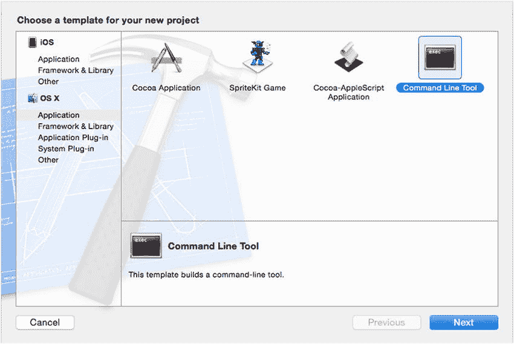
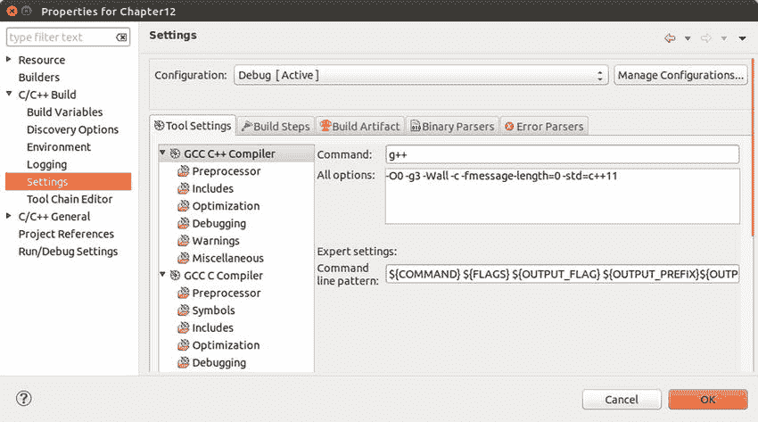
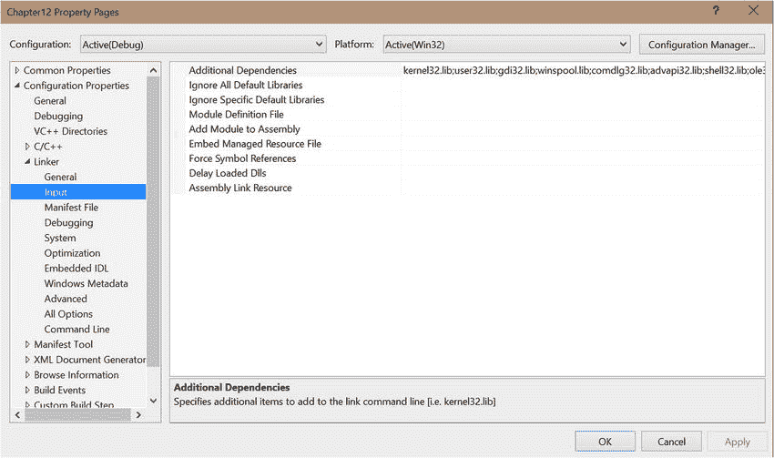
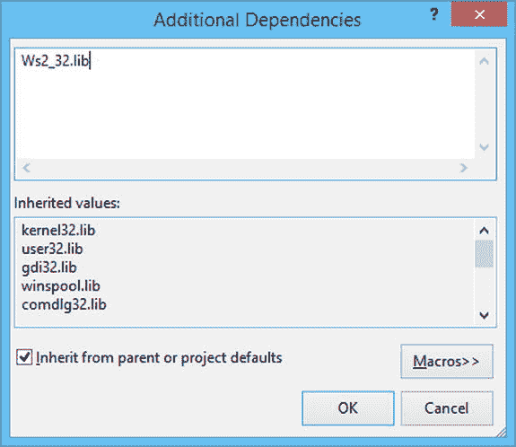
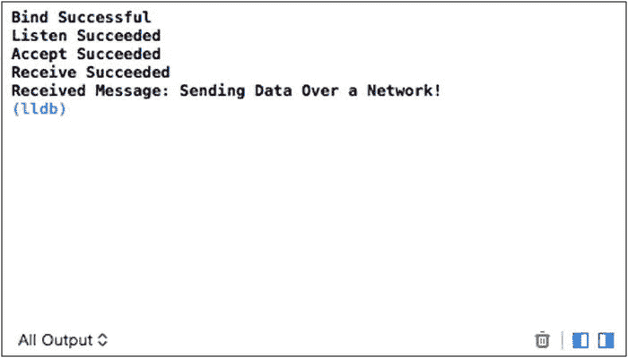

# 十二、网络

通过互联网进行通信正日益成为许多现代计算机程序不可或缺的一部分。很难找到任何程序不连接到同一程序的另一个实例或为程序或应用程序的某个部分提供基本功能的 web 服务器。这为专门从事网络编程领域的开发人员创造了机会。当编写连接程序时，您可以采用几种不同的方法，使用高级库是一种有效的技术；然而，本章着眼于可以在 OS X、Linux 和 Windows 上使用的 Berkeley 套接字库。

Berkeley 套接字于 1983 年首次出现在 Unix 操作系统中。该操作系统在 20 世纪 80 年代末不再受版权问题的困扰，使得 Berkeley Sockets API 成为今天大多数操作系统上使用的标准实现。即使 Windows 不直接支持 Berkeley，但它的网络 API 几乎与 Berkeley 标准 API 完全相同。

这一章讲述了如何创建和使用套接字来编写可以通过网络(如互联网)相互通信的程序。配方 14-1、14-2 和 14-3 涵盖了当今使用的主要操作系统的相同材料。你应该阅读与你正在开发的系统相关的配方，然后继续阅读配方 12-4。

12-1.在 OS X 上设置 Berkeley Sockets 应用程序

问题

您想要创建一个可以在 OS X 上使用的网络套接字程序。

解决办法

OS X 将 Berkeley Sockets API 作为操作系统的一部分提供，无需借助外部库即可使用。

它是如何工作的

苹果提供了 Xcode IDE ，你可以用它从苹果电脑上构建 OS X 应用程序。Xcode 可以从 App Store 免费获得。安装后，您可以使用 Xcode 创建要在您选择的电脑上运行的程序。这个方法创建了一个命令行程序，它连接到互联网并打开一个到服务器的套接字。

首先，您必须为应用程序创建一个有效的项目。打开 Xcode，选择[图 12-1](#Fig1) 所示的新建 Xcode 项目选项。


[图 12-1](#_Fig1) 。带有创建新 Xcode 项目选项的 Xcode 欢迎屏幕

系统会要求您选择希望创建的应用程序类型。选择 OS X 应用类别下的命令行工具选项；[图 12-2](#Fig2) 显示了这个窗口。



[图 12-2](#_Fig2) 。OS X 应用程序命令行工具选项

接下来，要求您指定一个文件夹来存储您的项目文件。之后，Xcode 主窗口打开，您可以从左侧的项目视图中选择源文件。用清单 12-1 中的代码替换新 CPP 文件中的代码，创建一个打开 Google HTTP web 服务器套接字的应用程序。

[***清单 12-1***](#_list1) 。打开伯克利插座

```cpp
#include <iostream>
#include <netdb.h>
#include <sys/types.h>
#include <sys/socket.h>

using SOCKET = int;

using namespace std;

int main(int argc, const char * argv[])
{
    addrinfo hints{};
    hints.ai_family = AF_UNSPEC;
    hints.ai_socktype = SOCK_STREAM;

    addrinfo *servinfo{};
    getaddrinfo("www.google.com", "80", &hints, &servinfo);

    SOCKET sockfd{
        socket(servinfo->ai_family, servinfo->ai_socktype, servinfo->ai_protocol)
    };

    int connectionResult{ connect(sockfd, servinfo->ai_addr, servinfo->ai_addrlen) };
    if (connectionResult == -1)
    {
        cout << "Connection failed!" << endl;
    }
    else
    {
        cout << "Connection successful!" << endl;
    }

    freeaddrinfo(servinfo);

    return 0;
}
```

清单 12-1 中的代码需要一个关于互联网如何工作的简短入门，以便你完全理解正在发生的事情。在连接到服务器之前，您需要知道它所在的地址。最好使用域名服务(DNS) 找到它。DNS 的工作原理是保存给定主机名的服务器地址缓存。在本例中，您向 DNS 请求与`www.google.com`相关联的地址。如果您正在创建一个在您自己的网络上运行的程序，您可以手动指定服务器的 IP 地址，但是对于使用互联网访问信息的程序来说，这通常是不可能的。服务器可以移动，IP 地址可以在不同的时间为不同的系统更改或重新使用。`getaddrinfo`功能向 DNS 请求与端口 80 上的`www.google.com`相关联的地址。

特定服务的服务器地址通常由两部分组成:要连接的计算机的 IP 地址和您希望与之通信的服务器上特定服务的端口。万维网使用 HTTP 协议进行通信，该协议通常配置为使用端口 80 提供数据。您可以在清单 12-1 中看到，这是您试图在远程计算机上建立连接的端口。

`getaddrinfo`函数将网址、端口和两个`addrinfo struct`作为参数。这些`struct`中的第一个为 DNS 服务提供了一些提示，关于你想与远程计算机建立的连接类型。此时最重要的两个是`ai_family`和`ai_socktype`字段。

`ai_family`字段指定您想要为您的程序检索的地址类型。这允许您指定是需要 IPv4、IPv6、NetBIOS、红外线还是蓝牙地址。清单 12-1 中[提供的选项是未指定的，它允许`getaddrinfo`函数返回所请求网址的所有有效 IP 地址。这些有效的 IP 地址由相同的`addrinfo struct`表示，并通过提供给`getaddrinfo`第四个参数的指针传回程序。](#list1)

`ai_socktype`字段允许您指定与相关插座一起使用的传输机制的类型。[清单 12-1](#list1) 中的`SOCK_STREAM`选项创建了一个使用 TCP/IP 作为传输机制的套接字。这种类型的套接字允许您发送保证按顺序到达目的地的信息包。本章中使用的另一种传动机构是`SOCK_DGRAM`型。这种传输机制不保证数据包会到达，也不保证它们会按预期的顺序到达；然而，它们没有 TCP/IP 机制带来的开销，因此可以在计算机之间以更低的延迟发送数据包。

由`getaddrinfo`函数返回的`servinfo`可以用来创建一个套接字。从`socket`函数中获得一个套接字文件描述符，该函数从`servinfo`结构中传递信息。在这个例子中,`servinfo`结构可以是一个链表，因为 Google 支持 IPv4 和 IPv6 地址格式。您可以在这里编写代码来选择要使用的地址并适当地操作。只要列表中有更多的元素，字段`ai_next`就存储指向列表中下一个元素的指针。`ai_family`、`ai_socktype`和`ai_protocol`变量都被传递到`socket`函数中，以创建一个有效的套接字来使用。一旦有了有效的套接字，就可以调用`connect`函数。`connect`函数获取套接字 ID、来自包含地址的`servinfo`对象的`ai_addr`字段和`ai_addrlen`来确定地址的长度。如果连接没有成功，您将从`connect`收到一个返回值-1。[清单 12-1](#list1) 显示了连接是否成功。

12-2.在 Ubuntu 上的 Eclipse 中设置 Berkeley Sockets 应用程序

问题

您想使用 Eclipse 创建一个可以在 Ubuntu 上使用的网络套接字程序。

解决办法

Ubuntu 提供了 Berkeley Sockets API 作为操作系统的一部分，可以在不借助外部库的情况下使用。

它是如何工作的

Eclipse IDE 可用于在运行 Linux 的计算机上构建应用程序。Eclipse 可以从 Ubuntu 软件中心免费获得。一旦安装完毕，您就可以使用 Eclipse 创建在您选择的计算机上运行的程序。这个方法创建了一个命令行程序，它连接到互联网并打开一个到服务器的套接字。

首先，您必须为应用程序创建一个有效的项目。打开 Eclipse，从菜单栏中选择项目 New 选项。新建项目向导打开，如图[图 12-3](#Fig3) 所示。


[图 12-3](#_Fig3) 。Eclipse 新项目向导

新建项目向导允许您选择 C++ 项目作为选项。然后，点击下一步，你会看到如图 12-4 所示的 C++ 项目设置窗口。


[图 12-4](#_Fig4) 。Eclipse C++ 项目设置窗口

在此窗口中，您可以给项目命名，并决定应该在哪个文件夹中创建项目。在项目类型下，选择可执行文件 Hello World C++ 项目。这样做将创建一个项目，该项目被配置为构建为可执行文件，并且包含一个用于添加您自己的代码的源文件。

本章中的示例代码使用了 C++11 语言规范中的功能。默认的 Eclipse 项目没有启用这一功能。您可以通过右键单击您的项目并选择 Properties 来打开它。你应该会看到图 12-5 中[所示的设置窗口，左边是类别。要启用 C++11 支持](#Fig5)，选择 C/C++ Build 下的设置，将`–std=c++11`添加到 All Options 字段，然后单击 OK。



[图 12-5](#_Fig5) 。向您的 Eclipse 项目添加 C++11 支持

用清单 12-2 中的代码替换新 CPP 文件中的代码，创建一个打开 Google HTTP web 服务器套接字的应用程序。

 **注**以下代码和描述与配方 12-1 完全相同。如果你已经读过这份材料，你可能希望跳到食谱 12-4。如果你跳过了食谱 12-1，因为 OS X 与你无关，那么继续读下去。

[***清单 12-2***](#_list2) 。打开伯克利插座

```cpp
#include <iostream>
#include <netdb.h>
#include <sys/types.h>
#include <sys/socket.h>

using SOCKET = int;

using namespace std;

int main(int argc, const char * argv[])
{
    addrinfo hints{};
    hints.ai_family = AF_UNSPEC;
    hints.ai_socktype = SOCK_STREAM;

    addrinfo *servinfo{};
    getaddrinfo("www.google.com", "80", &hints, &servinfo);

    SOCKET sockfd{
        socket(servinfo->ai_family, servinfo->ai_socktype, servinfo->ai_protocol)
    };

    int connectionResult{ connect(sockfd, servinfo->ai_addr, servinfo->ai_addrlen) };
    if (connectionResult == -1)
    {
        cout << "Connection failed!" << endl;
    }
    else
    {
        cout << "Connection successful!" << endl;
    }

    freeaddrinfo(servinfo);

    return 0;
}
```

清单 12-2 中的代码需要一个关于互联网如何工作的简短入门，以便你完全理解正在发生的事情。在连接到服务器之前，您需要知道它所在的地址。最好使用域名服务(DNS)找到它。DNS 的工作原理是保存给定主机名的服务器地址缓存。在本例中，您向 DNS 请求与`www.google.com`相关联的地址。如果你正在创建一个在你自己的网络上运行的程序，你可以手动指定服务器的 IP 地址，但是这对于通过互联网访问信息的程序来说通常是不可能的。服务器可以移动，IP 地址可以在不同的时间为不同的系统更改或重新使用。`getaddrinfo`功能向 DNS 请求与端口 80 上的`www.google.com`相关的地址。

特定服务的服务器地址通常由两部分组成:要连接的计算机的 IP 地址和您希望与之通信的服务器上特定服务的端口。万维网使用 HTTP 协议进行通信，该协议通常配置为使用端口 80 提供数据。您可以在清单 12-2 中看到，这是您试图在远程计算机上建立连接的端口。

`getaddrinfo`函数将网址、端口和两个`addrinfo struct`作为参数。这些`struct`中的第一个为 DNS 服务提供了一些提示，关于你想与远程计算机建立的连接类型。此时最重要的两个是`ai_family`和`ai_socktype`字段。

`ai_family`字段指定您想要为您的程序检索的地址类型。这允许您指定是否需要 IPv4、IPv6、NetBIOS、红外线或蓝牙地址。在[清单 12-2](#list2) 中提供的选项是未指定的，它允许`getaddrinfo`函数为请求的 web 地址返回所有有效的 IP 地址。这些有效的 IP 地址由相同的`addrinfo struct`表示，并通过提供给`getaddrinfo`第四个参数的指针传回程序。

`ai_socktype`字段允许您指定与相关插座一起使用的传输机制的类型。[清单 12-2](#list2) 中的`SOCK_STREAM`选项创建了一个使用 TCP/IP 作为传输机制的套接字。这种类型的套接字允许您发送保证按顺序到达目的地的信息包。本章中使用的另一种传动机构是`SOCK_DGRAM`型。这种传输机制不保证数据包会到达，也不保证它们会按预期的顺序到达；然而，它们没有 TCP/IP 机制带来的开销，因此可以在计算机之间以更低的延迟发送数据包。

由`getaddrinfo`函数返回的`servinfo`可以用来创建一个套接字。从`socket`函数中获得一个套接字文件描述符，该函数从`servinfo`结构中传递信息。在这个例子中,`servinfo`结构可以是一个链表，因为 Google 支持 IPv4 和 IPv6 地址格式。您可以在这里编写代码来选择要使用的地址并适当地操作。只要列表中有更多的元素，字段`ai_next`就存储指向列表中下一个元素的指针。`ai_family`、`ai_socktype`和`ai_protocol`变量都被传递到`socket`函数中，以创建一个有效的套接字来使用。一旦有了有效的套接字，就可以调用`connect`函数。`connect`函数获取套接字 ID、来自包含地址的`servinfo`对象的`ai_addr`字段和`ai_addrlen`来确定地址的长度。如果连接没有成功，您将从`connect`收到一个返回值-1。[清单 12-2](#list2) 显示了连接是否成功。

12-3.在 Windows 上的 Visual Studio 中设置 Winsock 2 应用程序

问题

您想要创建一个可以在 Windows 机器上使用的网络套接字程序。

解决办法

微软提供了 Winsock 库，它支持计算机之间基于套接字的通信。

它是如何工作的

Windows 操作系统没有像 OS X 或 Ubuntu 那样自带本地的 Berkeley 套接字实现。相反，微软提供了 Winsock 库。幸运的是，这个库与 Berkeley Sockets 库非常相似，在某种程度上，大部分代码可以在三个平台之间互换。通过打开 Visual Studio 并选择 File  New 项目选项，可以创建一个使用 Winsock 的新 C++ 应用程序。这样做将打开新项目向导，如图[图 12-6](#Fig6) 所示。


[图 12-6](#_Fig6) 。Visual Studio 新建项目向导

您希望创建一个 Win32 控制台应用程序来运行本章中的示例代码。选择这种类型的应用程序，输入名称，并选择存储数据的文件夹。然后单击确定。

您将进入 Win32 应用程序向导。点击下一步，进入图 12-7 中[所示的对话框。](#Fig7)


[图 12-7](#_Fig7) 。Win32 应用程序向导

取消选择预编译头和安全开发生命周期(SDL) 检查选项，然后单击完成。当你这样做的时候，你会看到一个工作项目。不过，该项目不支持套接字，因为 Windows 要求您链接一个库来提供套接字支持。您可以通过在“解决方案资源管理器”窗口中右击项目并选择“属性”来实现这一点。在配置属性链接器输入部分指定要链接的库。[图 12-8](#Fig8) 显示了选择了特定选项的窗口。



[图 12-8](#_Fig8) 。Visual Studio 链接器输入选项

您希望向附加依赖项部分添加一个新库。选择该选项，点击向下箭头，打开如图[图 12-9](#Fig9) 所示的对话框。



[图 12-9](#_Fig9) 。附加依赖对话框

Winsock API 由`Ws2_32.lib`静态库提供。在文本框中输入该值，然后点击确定。这允许您在程序中毫无问题地使用 Winsock 2 API。

用清单 12-3 中的代码替换新 CPP 文件中的代码，创建一个打开 Google HTTP web 服务器套接字的应用程序。

 **注**以下代码和描述与配方 12-1 中的大部分相同。但是，有些部分是 Windows 独有的。如果你已经阅读了这份材料，你可能希望涵盖 Windows 特有的方面，然后跳到食谱 12-4。如果您跳过了配方 12-1 和配方 12-2，请继续阅读。

[***清单 12-3***](#_list3) 。打开 Winsock 套接字

```cpp
#include <iostream>
#include <winsock2.h>
#include <WS2tcpip.h>

using namespace std;

int main(int argc, char* argv[])
{
    WSADATA wsaData;
    if (WSAStartup(MAKEWORD(2, 2), &wsaData) != 0)
    {
        return 1;
    }

    addrinfo hints{};
    hints.ai_family = AF_UNSPEC;     // don't care IPv4 or IPv6
    hints.ai_socktype = SOCK_STREAM; // TCP stream sockets

    // get ready to connect
    addrinfo* servinfo{};  // will point to the results
    getaddrinfo("www.google.com", "80", &hints, &servinfo);

    SOCKET sockfd{ socket(servinfo->ai_family, servinfo->ai_socktype, servinfo->ai_protocol) };
    int connectionResult{ connect(sockfd, servinfo->ai_addr, servinfo->ai_addrlen) };
    if (connectionResult == -1)
    {
        cout << "Connection failed!" << endl;
    }
    else
    {
        cout << "Connection successful!" << endl;
    }

    freeaddrinfo(servinfo);

    WSACleanup();

    return 0;
}
```

在[清单 12-3](#list3) 中用粗体显示的代码部分是 Windows socket 库独有的，不能转移到 Unix 和 OS X 的 Berkeley Sockets 实现中。Windows 要求您的程序启动并关闭 Winsock 库。这是通过使用`WSAStartup`和`WSACleanup`功能实现的。另一个细微的区别是，Winsock API 将`SOCKET`类型指定为`unsigned int`。OS X 和 Ubuntu 中的 Berkeley 实现都从`socket`函数返回一个标准的`int`。[清单 12-1](#list1) 和[清单 12-2](#list2) 中的代码使用类型别名来指定`SOCKET`类型，使代码看起来更具可移植性；然而，平台之间的类型仍然不同。

为了让你完全理解正在发生的事情，这个代码需要一个关于互联网如何工作的简短入门。在连接到服务器之前，您需要知道它所在的地址。最好使用域名服务(DNS)找到它。DNS 的工作原理是保存给定主机名的服务器地址缓存。在这个例子中，您向 DNS 请求与`www.google.com`相关联的地址。如果您正在创建一个在您自己的网络上运行的程序，您可以手动指定服务器的 IP 地址，但是对于使用互联网访问信息的程序来说，这通常是不可能的。服务器可以移动，IP 地址可以在不同的时间为不同的系统更改或重新使用。`getaddrinfo`功能向 DNS 请求与端口 80 上的`www.google.com`相关的地址。

特定服务的服务器地址通常由两部分组成:要连接的计算机的 IP 地址和您希望与之通信的服务器上特定服务的端口。万维网使用 HTTP 协议进行通信，该协议通常配置为使用端口 80 提供数据。您可以在清单 12-3 中看到，这是您试图在远程计算机上建立连接的端口。

`getaddrinfo`函数将网址、端口和两个`addrinfo struct`作为参数。这些`struct`中的第一个为 DNS 服务提供了一些提示，关于你想与远程计算机建立的连接类型。此时最重要的两个是`ai_family`和`ai_socktype`字段。

`ai_family`字段指定您想要为您的程序检索的地址类型。这允许您指定是需要 IPv4、IPv6、NetBIOS、红外线还是蓝牙地址。清单 12-3 中[提供的选项是未指定的，它允许`getaddrinfo`函数返回所请求网址的所有有效 IP 地址。这些有效的 IP 地址由相同的`addrinfo struct`表示，并通过提供给`getaddrinfo`第四个参数的指针传回程序。](#list3)

`ai_socktype`字段允许您指定与相关插座一起使用的传输机制的类型。[清单 12-3](#list3) 中的`SOCK_STREAM`选项创建了一个使用 TCP/IP 作为传输机制的套接字。这种类型的套接字允许您发送保证按顺序到达目的地的信息包。本章中使用的另一种传动机构是`SOCK_DGRAM`型。这种传输机制不保证数据包会到达，也不保证它们会按预期的顺序到达；然而，它们没有 TCP/IP 机制带来的开销，因此可以在计算机之间以更低的延迟发送数据包。

由`getaddrinfo`函数返回的`servinfo` 可以用来创建一个套接字。从`socket`函数中获得一个套接字文件描述符，该函数从`servinfo`结构中传递信息。在这个例子中,`servinfo`结构可以是一个链表，因为 Google 支持 IPv4 和 IPv6 地址格式。您可以在这里编写代码来选择要使用的地址并适当地操作。只要列表中有更多的元素，字段`ai_next`就存储指向列表中下一个元素的指针。`ai_family`、`ai_socktype`和`ai_protocol`变量都被传递到`socket`函数中，以创建一个有效的套接字来使用。一旦有了有效的套接字，就可以调用`connect`函数。`connect`函数获取套接字 ID、来自包含地址的`servinfo`对象的`ai_addr`字段和`ai_addrlen`来确定地址的长度。如果连接没有成功，您将从`connect`收到一个返回值-1。[清单 12-3](#list3) 显示了连接是否成功。

12-4.在两个程序之间创建套接字连接

问题

你想写一个网络客户端程序和一个服务器程序，可以通过网络进行通信。

解决办法

您可以使用 Berkeley Sockets API 通过套接字发送和接收数据。

它是如何工作的

Berkeley 套接字被设计成通过网络发送和接收信息。API 提供了`send`和`recv`函数来实现这个目标。实现这一点的困难在于，您必须确保为数据传输正确配置您的套接字。设置套接字时，接收数据所需的操作与发送数据所需的操作非常不同。该方法还创建了可以在多种平台上运行的代码，并使用 Microsoft Visual Studio、Xcode 或在 Linux 机器上使用 Clang 作为编译器进行编译。

 **注意**`Socket`类在使用 GCC 时不会编译，因为编译器还不支持`stringstream`类的`move`构造函数。如果您使用 GCC，您可以修改示例代码以避免用`stringstream`调用`move`。

当程序构建为在 Windows 机器上运行时，要查看的第一个类启动和停止 Winsock。当您在 OS X 或 Linux 计算机上构建和运行时，这个类不应该有任何影响。清单 12-4 显示了这是如何实现的。

[***清单 12-4***](#_list4) 。包装 Winsock

```cpp
#include <iostream>
using namespace std;

#ifdef _MSC_VER

#pragma comment(lib, "Ws2_32.lib")

#include <WinSock2.h>
#include <WS2tcpip.h>

#define UsingWinsock 1

using ssize_t = SSIZE_T;

#else

#define UsingWinsock 0

#endif

class WinsockWrapper
{
public:
    WinsockWrapper()
    {
#if UsingWinsock
        WSADATA wsaData;
        if (WSAStartup(MAKEWORD(2, 2), &wsaData) != 0)
        {
            exit(1);
        }

#ifndef NDEBUG
        cout << "Winsock started!" << endl;
#endif
#endif
    }

    ~WinsockWrapper()
    {
#if UsingWinsock
        WSACleanup();

#ifndef NDEBUG
        cout << "Winsock shut down!" << endl;
#endif
#endif
    }
};

int main(int argc, char* argv[])
{
    WinsockWrapper myWinsockWrapper;

    return 0;
}
```

清单 12-4 中的代码使用预处理器检测微软 Visual Studio 的存在。Visual Studio 在构建时定义了符号 **_MSC_VER** 。您可以在用 Visual Studio 构建 Windows 程序时使用它来包含特定于 Windows 的文件，就像我在这里所做的那样。仅当使用 Visual Studio 生成时，Winsock 2 库才使用 pragma 包含在此程序中；必要的 Winsock 头文件也包括在内。设置了一个专门用于该程序的`define`。在 Visual Studio 中构建代码时，`UsingWinsock`宏被定义为 1；当代码不是使用 Visual Studio 构建时，它被设置为 0。Windows 构建还要求您创建一个类型别名来将`SSIZE_T`映射到`ssize_t`，因为当不在 Windows 计算机上构建时，该类型使用小写拼写。

`WinsockWrapper`类在其构造函数和析构函数中检测`UsingWinsock`的值。如果该值为 1，则启动和停止 Winsock API 的函数在。当不使用 Visual Studio 构建时，不编译此代码；因此以这种方式包含是安全的。

`main`函数在其第一行创建一个`WinsockWrapper`对象。这将导致在 Windows 计算机上调用构造函数并初始化 Winsock 它对非 Windows 版本没有影响。当该对象超出范围时，Winsock API 也会关闭，因为会调用析构函数。现在，您有了一种方便的方法，可以跨多个平台移植来启动和停止 Winsock。

类是从一个程序到另一个程序通信的组成部分。它负责为基于 C 的 Berkeley Sockets API 提供面向对象的包装。`socket`本身由一个描述符表示，这个描述符本质上是一个`int`。一种方法创建一个类，该类将创建 Berkeley 套接字所需的数据与处理套接字所需的代码相关联。`Socket`类的完整源代码显示在[清单 12-5](#list5) 中。

[***清单 12-5***](#_list5) 。创建面向对象的`Socket Class`

```cpp
class Socket
{
private:
#if !UsingWinsock
    using SOCKET = int;
#endif

    addrinfo* m_ServerInfo{ nullptr };
    SOCKET m_Socket{ static_cast<SOCKET>(0xFFFFFFFF) };
    sockaddr_storage m_AcceptedSocketStorage{};
    socklen_t m_AcceptedSocketSize{ sizeof(m_AcceptedSocketStorage) };

    void CreateSocket(string& webAddress, string& port, addrinfo& hints)
    {
        getaddrinfo(webAddress.c_str(), port.c_str(), &hints, &m_ServerInfo);

        m_Socket = socket(
            *m_ServerInfo->ai_family,*
            *m_ServerInfo->ai_socktype,*
            m_ServerInfo->ai_protocol);
    }

    Socket(int newSocket, sockaddr_storage&& socketStorage)
        : m_Socket{ newSocket }
        , m_AcceptedSocketStorage(move(socketStorage))
    {

    }

public:
    Socket(string& port)
    {
#ifndef NDEBUG
        stringstream portStream{ port };
        int portValue{};
        portStream >> portValue;
        assert(portValue > 1024); // Ports under 1024 are reserved for certain applications and protocols!
#endif

        addrinfo hints{};
        hints.ai_family = AF_UNSPEC;
        hints.ai_socktype = SOCK_STREAM;
        hints.ai_flags = AI_PASSIVE;

        string address{ "" };
        CreateSocket(address, port, hints);
    }

    Socket(string& webAddress, string& port)
    {
        addrinfo hints{};
        hints.ai_family = AF_UNSPEC;
        hints.ai_socktype = SOCK_STREAM;

        CreateSocket(webAddress, port, hints);
    }

    Socket(string& webAddress, string& port, addrinfo& hints)
    {
        CreateSocket(webAddress, port, hints);
    }

    ~Socket()
    {
        Close();
    }

    bool IsValid()
    {
        return m_Socket != -1;
    }

    int Connect()
    {
        *int connectionResult{*
            connect(m_Socket, m_ServerInfo->ai_*addr, m_ServerInfo->ai_addrlen)*
        };

#ifndef NDEBUG
        if (connectionResult == -1)
        {
            cout << "Connection failed!" << endl;
        }
        else
        {
            cout << "Connection successful!" << endl;
        }
#endif

        return connectionResult;
    }

    int Bind()
    {
        int bindResult{ ::bind(m_Socket, m_ServerInfo->ai_addr, m_ServerInfo->ai_addrlen) };

#ifndef NDEBUG
        if (bindResult == -1)
        {
            cout << "Bind Failed!" << endl;
        }
        else
        {
            cout << "Bind Successful" << endl;
        }
#endif

        return bindResult;
    }

    int Listen(int queueSize)
    {
        int listenResult{ listen(m_Socket, queueSize) };

#ifndef NDEBUG
        if (listenResult == -1)
        {
            cout << "Listen Failed" << endl;
        }
        else
        {
            cout << "Listen Succeeded" << endl;
        }
#endif

        return listenResult;
    }

    Socket Accept()
    {
        SOCKET newSocket{
            *accept(m_Socket,*
            reinterpret_cast<sockad*dr*>(*&*m_AcceptedSocketStorage),*
            &*m_AcceptedSocketSize)*
        };

#ifndef NDEBUG
        if (newSocket == -1)
        {
            cout << "Accept Failed" << endl;
        }
        else
        {
            cout << "Accept Succeeded" << endl;
        }
#endif

        m_AcceptedSocketSize = sizeof(m_AcceptedSocketStorage);
        return Socket(newSocket, move(m_AcceptedSocketStorage));
    }

    void Close()
    {
#ifdef _MSC_VER
        closesocket(m_Socket);
#else
        close(m_Socket);
#endif

        m_Socket = -1;
        freeaddrinfo(m_ServerInfo);
    }

    ssize_t Send(stringstream data)
    {
        string packetData{ data.str() };
        ssize_t sendResult{ send(m_Socket, packetData.c_str(), packetData.length(), 0) };

#ifndef NDEBUG
        if (sendResult == -1)
        {
            cout << "Send Failed" << endl;
        }
        else
        {
            cout << "Send Succeeded" << endl;
        }
#endif

        return sendResult;
    }

    stringstream Receive()
    {
        const int size{ 1024 };
        char dataReceived[size];

        ssize_t receiveResult{ recv(m_Socket, dataReceived, size, 0) };

#ifndef NDEBUG
        if (receiveResult == -1)
        {
            cout << "Receive Failed" << endl;
        }
        else if (receiveResult == 0)
        {
            cout << "Receive Detected Closed Connection!" << endl;
            Close();
        }
        else
        {
            dataReceived[receiveResult] = '\0';
            cout << "Receive Succeeded" << endl;
        }
#endif
        stringstream data{ dataReceived };
        return move(data);
    }
};
```

`Socket class`有三个不同的构造函数，允许你为不同的目的创建套接字。第一个公共构造函数只接受一个`port`作为参数。这种构造方法适用于用于监听传入连接的`Socket`对象。构造函数中的`hints addrinfo struct`将`ai_flags`参数设置为`AI_PASSIVE`值，并为`address`传递一个空的`string`。这告诉`getaddrinfo`函数填写本地计算机的 IP 地址作为套接字使用的地址。以这种方式使用本地地址可以让您打开套接字来监听计算机—当您希望从外部源接收程序中的数据时，这是一项重要的任务。

第二个公共构造函数接受一个地址和一个端口。这允许您创建一个`Socket`，它自动使用 IPv6 或 IPv4 和 TCP/IP 来创建一个可用于发送数据的套接字。第一个和第二个构造函数都是为了方便起见——它们都可以被删除，以支持第三个公共构造函数，它接受一个地址、一个端口和一个`addrinfo struct`,并允许用户按照自己的意愿配置一个`Socket`。

最后一个构造函数是私有构造函数。当外部程序连接到套接字侦听连接时，使用这种类型的构造函数。您可以看到这是如何在`Accept`方法中使用的。

`IsValid`方法确定`Socket`是否已经用适当的描述符初始化。`CreateSocket`中的`socket`函数在失败的结果中返回-1；`m_Socket`的默认值也是-1。

当你希望建立一个到远程计算机的连接，并且对接收来自其他程序的连接不感兴趣时，可以使用`Connect`方法。它主要用于客户端-服务器关系的客户端；然而，不难想象，您可以编写使用不同套接字监听和连接他人的对等程序。`Connect`调用 Berkeley `connect`函数，但是能够从对象中使用`m_Socket`和`m_ServerInfo`对象，而不必从外部位置手动传递它们。

当您希望接收输入连接时，使用`Bind`方法。Berkeley `bind`函数负责协商访问您希望与操作系统一起使用的端口。操作系统负责发送和接收网络流量，端口用于让计算机知道哪个程序正在哪个端口上等待数据。当`using namespace std;`语句存在时，`bind`函数上的`scope`操作符对于该代码是必需的。这告诉编译器从全局名称空间而不是从`std`名称空间使用`bind`方法。来自`std`名称空间的`bind`方法用于创建仿函数，与套接字无关。

`Listen`方法出现在对`Bind`的调用之后，它告诉套接字开始对来自远程机器的连接进行排队。`queueSize`参数指定队列的大小；一旦队列满了，操作系统就会丢弃连接。您的操作系统可以支持的连接数量会有所不同。桌面操作系统通常支持比服务器专用操作系统少得多的排队连接。大多数情况下，5 这样的数字就可以了。

`Accept`方法从调用`Listen`时创建的队列中提取连接。`Accept`调用 Berkeley `accept`函数，该函数将`m_Socket`变量作为其第一个参数。第二个和第三个参数是`m_AcceptedSocketStorage`和`m_AcceptedSocketSize`变量。`m_AcceptedSocketStorage`成员变量属于`sockaddr_storage`类型，而不是`accept`方法所期望的`sockaddr`类型。`sockaddr_storage`类型足够大，可以处理 IPv4 和 IPv6 地址，但是`accept`方法仍然需要一个指向`sockaddr`类型的指针。这并不理想；但是，可以使用`reinterpret_cast`来解决这个问题，因为 accept 也会考虑被传递对象的大小。如果返回的对象小于传入的大小，则改变大小；因此，在函数返回之前，大小被重置。将`m_AcceptedSocketStorage`对象移动到从函数返回的新的`Socket`对象中，以确保初始`Socket`中的副本无效。

`Close`方法负责在不再需要`Socket`时关闭它。在 Windows 上调用`closesocket`函数，在非 Windows 平台上使用`close`函数。`freeaddrinfo`对象也在该类的析构函数中被释放。

接下来的方法是`Send`。不出所料，这个方法将数据发送到连接另一端的机器。`Send`被设置为发送一个`stringstream`对象，因为正确序列化二进制数据超出了本书的范围。您可以看到，调用`send` Berkeley 函数时使用了`m_Socket`描述符以及从传入的`stringstream`对象中提取的字符串数据和大小。

`Receive`方法负责从远程连接引入数据。这个调用会一直阻塞，直到准备好从套接字连接读取数据。`Receive`函数可以返回三种类型的值:-1(当遇到错误时)，0(当连接被远程计算机关闭时)，或者一个表示接收到的字节数的正值。接收到的数据被读入一个`char`数组，然后传递给一个`stringstream`对象，该对象将使用`move`构造函数从函数中返回。

现在你已经有了一个全功能的`Socket`类，你可以创建程序来发送和接收数据。清单 12-6 中的代码可以用来创建一个等待远程连接和单个接收消息的程序。

[***清单 12-6***](#_list6) 。创建一个可以接收数据的程序

```cpp
#include <cassert>
#include <iostream>
#include <type_traits>
#include <vector>

#ifndef NDEBUG
#include <sstream>
#endif

using namespace std;

#ifdef _MSC_VER

#pragma comment(lib, "Ws2_32.lib")

#include <WinSock2.h>
#include <WS2tcpip.h>

#define UsingWinsock 1

using ssize_t = SSIZE_T;

#else

#include <netdb.h>
#include <sys/types.h>
#include <sys/socket.h>
#include <unistd.h>

#define UsingWinsock 0

#endif

class WinsockWrapper
{
public:
    WinsockWrapper()
    {
#if UsingWinsock
        WSADATA wsaData;
        if (WSAStartup(MAKEWORD(2, 2), &wsaData) != 0)
        {
            exit(1);
        }

        cout << "Winsock started!" << endl;
#endif
    }

    ~WinsockWrapper()
    {
#if UsingWinsock
        WSACleanup();

        cout << "Winsock shut down!" << endl;
#endif
    }
};

class Socket
{
private:
#if !UsingWinsock
    using SOCKET = int;
#endif

    addrinfo* m_ServerInfo{ nullptr };
    SOCKET m_Socket{ static_cast<SOCKET>(0xFFFFFFFF) };
    sockaddr_storage m_AcceptedSocketStorage{};
    socklen_t m_AcceptedSocketSize{ sizeof(m_AcceptedSocketStorage) };

    void CreateSocket(string& webAddress, string& port, addrinfo& hints)
    {
        getaddrinfo(webAddress.c_str(), port.c_str(), &hints, &m_ServerInfo);

        m_Socket = socket(
            m_ServerInfo->ai_family,
            m_ServerInfo->ai_socktype,
            m_ServerInfo->ai_protocol);
    }

    Socket(int newSocket, sockaddr_storage&& socketStorage)
        : m_Socket{ newSocket }
        , m_AcceptedSocketStorage(move(socketStorage))
    {

    }

public:
    Socket(string& port)
    {
#ifndef NDEBUG
        stringstream portStream{ port };
        int portValue{};
        portStream >> portValue;
        assert(portValue > 1024);
        // Ports under 1024 are reserved for certain applications and protocols!
#endif

        addrinfo hints{};
        hints.ai_family = AF_UNSPEC;
        hints.ai_socktype = SOCK_STREAM;
        hints.ai_flags = AI_PASSIVE;

        string address{ "" };
        CreateSocket(address, port, hints);
    }

    Socket(string& webAddress, string& port)
    {
        addrinfo hints{};
        hints.ai_family = AF_UNSPEC;
        hints.ai_socktype = SOCK_STREAM;

        CreateSocket(webAddress, port, hints);
    }

    Socket(string& webAddress, string& port, addrinfo& hints)
    {
        CreateSocket(webAddress, port, hints);
    }

    ~Socket()
    {
        Close();
    }

    bool IsValid()
    {
        return m_Socket != -1;
    }

    int Connect()
    {
        int connectionResult{
            connect(m_Socket, m_ServerInfo->ai_addr, m_ServerInfo->ai_addrlen)
        };

#ifndef NDEBUG
        if (connectionResult == -1)
        {
            cout << "Connection failed!" << endl;
        }
        else
        {
            cout << "Connection successful!" << endl;
        }
#endif

        return connectionResult;
    }

    int Bind()
    {
        int bindResult{ ::bind(m_Socket, m_ServerInfo->ai_addr, m_ServerInfo->ai_addrlen) };

#ifndef NDEBUG
        if (bindResult == -1)
        {
            cout << "Bind Failed!" << endl;
        }
        else
        {
            cout << "Bind Successful" << endl;
        }
#endif

        return bindResult;
    }

    int Listen(int queueSize)
    {
        int listenResult{ listen(m_Socket, queueSize) };

#ifndef NDEBUG
        if (listenResult == -1)
        {
            cout << "Listen Failed" << endl;
        }
        else
        {
            cout << "Listen Succeeded" << endl;
        }
#endif

        return listenResult;
    }

    Socket Accept()
    {
        SOCKET newSocket{
            accept(m_Socket,
                reinterpret_cast<sockaddr*>(&m_AcceptedSocketStorage),
                &m_AcceptedSocketSize)
        };

#ifndef NDEBUG
        if (newSocket == -1)
        {
            cout << "Accept Failed" << endl;
        }
        else
        {
            cout << "Accept Succeeded" << endl;
        }
#endif

        m_AcceptedSocketSize = sizeof(m_AcceptedSocketStorage);
        return Socket(newSocket, move(m_AcceptedSocketStorage));
    }

    void Close()
    {
#ifdef _MSC_VER
        closesocket(m_Socket);
#else
        close(m_Socket);
#endif

        m_Socket = -1;
        freeaddrinfo(m_ServerInfo);
    }

    ssize_t Send(stringstream data)
    {
        string packetData{ data.str() };
        ssize_t sendResult{ send(m_Socket, packetData.c_str(), packetData.length(), 0) };

#ifndef NDEBUG
        if (sendResult == -1)
        {
            cout << "Send Failed" << endl;
        }
        else
        {
            cout << "Send Succeeded" << endl;
        }
#endif

        return sendResult;
    }

    stringstream Receive()
    {
        const int size{ 1024 };
        char dataReceived[size];

        ssize_t receiveResult{ recv(m_Socket, dataReceived, size, 0) };

#ifndef NDEBUG
        if (receiveResult == -1)
        {
            cout << "Receive Failed" << endl;
        }
        else if (receiveResult == 0)
        {
            cout << "Receive Detected Closed Connection!" << endl;
            Close();
        }
        else
        {
            dataReceived[receiveResult] = '\0';
            cout << "Receive Succeeded" << endl;
        }
#endif
        stringstream data{ dataReceived };
        return move(data);
    }
};

int main(int argc, char* argv[])
{
    WinsockWrapper myWinsockWrapper;

    string port{ "3000" };
    Socket myBindingSocket(port);
    myBindingSocket.Bind();

    int listenResult{ myBindingSocket.Listen(5) };
    assert(listenResult != -1);

    Socket acceptResult{ myBindingSocket.Accept() };
    assert(acceptResult.IsValid());

    stringstream data{ acceptResult.Receive() };

    string message;
    getline(data, message, '\0');

    cout << "Received Message: " << message << endl;

    return 0;
}
```

清单 12-6 中的代码创建了一个程序，该程序有一个套接字，它等待从远程连接接收一条消息。由于封装在`WinsockWrapper` 和`Socket`类中的困难工作，`main`函数最终只包含几行代码。如果运行在 Visual Studio for Windows 计算机构建的服务器上，`main`函数首先创建一个`WinsockWrapper`来初始化 Winsock。然后用一个空地址将一个`Socket`初始化到端口 3000。此端口将用于侦听本地计算机上的连接。你可以看到是这样的，因为`main`函数接着调用`Bind`，然后调用队列大小为 5 的`Listen`，最后才调用`Accept`。`Accept`调用会阻塞，直到队列中出现一个远程连接。`Accept`返回一个用于接收数据的单独的`Socket`对象。对那个`Socket`的`Receive`调用也是一个阻塞调用，程序在那里等待，直到数据可用。在返回之前，程序通过打印出接收到的消息来结束。

一旦构建并运行了服务器程序，就需要一个客户机程序来连接它并发送消息。这显示在[清单 12-7](#list7) 中。

[***清单 12-7***](#_list7) 。客户端程序

```cpp
#include <cassert>
#include <iostream>
#include <type_traits>

#ifndef NDEBUG
#include <sstream>
#endif

using namespace std;

#ifdef _MSC_VER

#pragma comment(lib, "Ws2_32.lib")

#include <WinSock2.h>
#include <WS2tcpip.h>

#define UsingWinsock 1

using ssize_t = SSIZE_T;

#else

#include <netdb.h>
#include <sys/types.h>
#include <sys/socket.h>

#define UsingWinsock 0

#endif

class WinsockWrapper
{
public:
    WinsockWrapper()
    {
#if UsingWinsock
        WSADATA wsaData;
        if (WSAStartup(MAKEWORD(2, 2), &wsaData) != 0)
        {
            exit(1);
        }

#ifndef NDEBUG
        cout << "Winsock started!" << endl;
#endif
#endif
    }

    ~WinsockWrapper()
    {
#if UsingWinsock
        WSACleanup();

#ifndef NDEBUG
        cout << "Winsock shut down!" << endl;
#endif
#endif
    }
};

class Socket
{
private:
#if !UsingWinsock
    using SOCKET = int;
#endif

    addrinfo* m_ServerInfo{ nullptr };
    SOCKET m_Socket{ static_cast<SOCKET>(0xFFFFFFFF) };
    sockaddr_storage m_AcceptedSocketStorage{};
    socklen_t m_AcceptedSocketSize{ sizeof(m_AcceptedSocketStorage) };

    void CreateSocket(string& webAddress, string& port, addrinfo& hints)
    {
        getaddrinfo(webAddress.c_str(), port.c_str(), &hints, &m_ServerInfo);

        m_Socket = socket(m_ServerInfo->ai_family,
            m_ServerInfo->ai_socktype,
            m_ServerInfo->ai_protocol);
    }

    Socket(int newSocket, sockaddr_storage&& socketStorage)
        : m_Socket{ newSocket }
        , m_AcceptedSocketStorage(move(socketStorage))
    {

    }

public:
    Socket(string& port)
    {
#ifndef NDEBUG
        stringstream portStream{ port };
        int portValue{};
        portStream >> portValue;
        assert(portValue > 1024);
        // Ports under 1024 are reserved for certain applications and protocols!
#endif

        addrinfo hints{};
        hints.ai_family = AF_UNSPEC;
        hints.ai_socktype = SOCK_STREAM;
        hints.ai_flags = AI_PASSIVE;

        string address{ "" };
        CreateSocket(address, port, hints);
    }

    Socket(string& webAddress, string& port)
    {
        addrinfo hints{};
        hints.ai_family = AF_UNSPEC;
        hints.ai_socktype = SOCK_STREAM;

        CreateSocket(webAddress, port, hints);
    }

    Socket(string& webAddress, string& port, addrinfo& hints)
    {
        CreateSocket(webAddress, port, hints);
    }

    ~Socket()
    {
        Close();
    }

    bool IsValid()
    {
        return m_Socket != -1;
    }

    int Connect()
    {
        int connectionResult{ connect(
            m_Socket,
            m_ServerInfo->ai_addr,
            m_ServerInfo->ai_addrlen)
        };

#ifndef NDEBUG
        if (connectionResult == -1)
        {
            cout << "Connection failed!" << endl;
        }
        else
        {
            cout << "Connection successful!" << endl;
        }
#endif

        return connectionResult;
    }

    int Bind()
    {
        int bindResult{ ::bind(m_Socket, m_ServerInfo->ai_addr, m_ServerInfo->ai_addrlen) };

#ifndef NDEBUG
        if (bindResult == -1)
        {
            cout << "Bind Failed!" << endl;
        }
        else
        {
            cout << "Bind Successful" << endl;
        }
#endif

        return bindResult;
    }

    int Listen(int queueSize)
    {
        int listenResult{ listen(m_Socket, queueSize) };

#ifndef NDEBUG
        if (listenResult == -1)
        {
            cout << "Listen Failed" << endl;
        }
        else
        {
            cout << "Listen Succeeded" << endl;
        }
#endif

        return listenResult;
    }

    Socket Accept()
    {
        SOCKET newSocket{ accept(m_Socket, reinterpret_cast<sockaddr*>(&m_AcceptedSocketStorage), &m_AcceptedSocketSize) };

#ifndef NDEBUG
        if (newSocket == -1)
        {
            cout << "Accept Failed" << endl;
        }
        else
        {
            cout << "Accept Succeeded" << endl;
        }
#endif

        m_AcceptedSocketSize = sizeof(m_AcceptedSocketStorage);
        return Socket(newSocket, move(m_AcceptedSocketStorage));
    }

    void Close()
    {
#ifdef _MSC_VER
        closesocket(m_Socket);
#else
        close(m_Socket);
#endif

        m_Socket = -1;
        freeaddrinfo(m_ServerInfo);
    }

    ssize_t Send(stringstream data)
    {
        string packetData{ data.str() };
        ssize_t sendResult{ send(m_Socket, packetData.c_str(), packetData.length(), 0) };

#ifndef NDEBUG
        if (sendResult == -1)
        {
            cout << "Send Failed" << endl;
        }
        else
        {
            cout << "Send Succeeded" << endl;
        }
#endif

        return sendResult;
    }

    stringstream Receive()
    {
        const int size{ 1024 };
        char dataReceived[size];

        ssize_t receiveResult{ recv(m_Socket, dataReceived, size, 0) };

#ifndef NDEBUG
        if (receiveResult == -1)
        {
            cout << "Receive Failed" << endl;
        }
        else if (receiveResult == 0)
        {
            cout << "Receive Detected Closed Connection!" << endl;
            Close();
        }
        else
        {
            dataReceived[receiveResult] = '\0';
            cout << "Receive Succeeded" << endl;
        }
#endif
        stringstream data{ dataReceived };
        return move(data);
    }
};

int main(int argc, char* argv[])
{
    WinsockWrapper myWinsockWrapper;

    string address("192.168.178.44");
    string port("3000");
    Socket myConnectingSocket(address, port);
    myConnectingSocket.Connect();

    string message("Sending Data Over a Network!");
    stringstream data;
    data << message;

    myConnectingSocket.Send(move(data));

    return 0;
}
```

[清单 12-7](#list7) 显示了相同的`Socket`类可以在服务器和客户机上使用。客户端的`main`函数也使用`WinsockWrapper`对象来处理 Winsock 库的启动和关闭。然后创建一个连接到 IP 地址 192.168.178.44 的`Socket`。(这是我用来托管服务器程序的计算机的地址。)在创建了`Socket`之后，调用`Connect`方法，以在不同计算机上运行的两个程序之间建立连接。`Send`方法是最后一个函数调用，发送字符串“通过网络发送数据！”[图 12-10](#Fig10) 显示了在 MacBook Pro 上运行服务器和在 Windows 8.1 桌面 PC 上运行客户端所获得的输出。



[图 12-10](#_Fig10) 。在 OS X 上运行服务器生成的输出

12-5.在两个程序之间创建网络协议

问题

您希望创建两个能够遵循标准模式相互通信的程序。

解决办法

您可以创建一个两个程序都可以遵循的协议，这样每个程序都知道如何响应给定的请求。

它是如何工作的

在两个程序之间建立的套接字连接可以用来双向发送数据:从发起连接的程序到接收者，也可以从接收者返回到发起者。这个特性允许您编写能够响应请求的网络应用程序，甚至可以构建需要在单个应用程序中来回发送多条消息的更复杂的协议。

您可能熟悉的当今使用的最常见的协议示例是 HTTP。HTTP 是支持万维网的网络协议。它是一个请求和响应协议，让客户端程序从服务器请求数据。当浏览器向服务器请求网页时，可以看到常见的应用程序，但移动应用程序使用 HTTP 在其应用程序和服务器后端之间传输数据也并不罕见。其他常见的协议有 FTP(用于促进计算机之间的文件传输)以及 POP 和 SMTP 电子邮件协议。

这个菜谱展示了一个非常简单的网络协议，它向服务器提出一个问题，让客户机用一个答案进行响应，并让服务器告诉客户机答案是否正确。与 HTTP 这样复杂的例子相比，这个协议微不足道，但是它是一个很好的起点。

该协议由四条消息组成:`QUESTION`、`ANSWER`、`QUIT`和`FINISHED`。当用户应该被询问一个问题时,`QUESTION`消息从客户端发送到服务器。服务器通过向客户端发送一个问题来响应此消息。客户端通过向服务器发送`ANSWER` 以及用户的回答来响应问题。客户端可以在任何时候向服务器发送`QUIT` 来终止套接字连接。一旦服务器将所有问题发送到服务器，来自客户端的后续`QUESTION`请求将导致`FINISHED` 被发送到客户端；那么连接将被终止。

这个方法中的服务器程序可以同时处理多个客户端连接。它通过使用`Socket::Accept`方法接受单个连接，然后使用`async`函数将连接到客户端的`Socket`交给一个`thread`来实现这一点。你可以在清单 12-8 的[中看到服务器程序](#list8)的源代码。

[***清单 12-8***](#_list8) 。协议服务器程序

```cpp
#include <array>
#include <cassert>
#include <future>
#include <iostream>
#include <thread>
#include <type_traits>
#include <vector>

#ifndef NDEBUG
#include <sstream>
#endif

using namespace std;

#ifdef _MSC_VER

#pragma comment(lib, "Ws2_32.lib")

#include <WinSock2.h>
#include <WS2tcpip.h>

#define UsingWinsock 1

using ssize_t = SSIZE_T;

#else

#include <netdb.h>
#include <sys/types.h>
#include <sys/socket.h>
#include <unistd.h>

#define UsingWinsock 0

#endif

class WinsockWrapper
{
public:
    WinsockWrapper()
    {
#if UsingWinsock
        WSADATA wsaData;
        if (WSAStartup(MAKEWORD(2, 2), &wsaData) != 0)
        {
            exit(1);
        }

        cout << "Winsock started!" << endl;
#endif
    }

    ~WinsockWrapper()
    {
#if UsingWinsock
        WSACleanup();

        cout << "Winsock shut down!" << endl;
#endif
    }
};

class Socket
{
private:
#if !UsingWinsock
    using SOCKET = int;
#endif

    addrinfo* m_ServerInfo{ nullptr };
    SOCKET m_Socket{ static_cast<SOCKET>(0xFFFFFFFF) };
    sockaddr_storage m_AcceptedSocketStorage{};
    socklen_t m_AcceptedSocketSize{ sizeof(m_AcceptedSocketStorage) };

    void CreateSocket(string& webAddress, string& port, addrinfo& hints)
    {
        getaddrinfo(webAddress.c_str(), port.c_str(), &hints, &m_ServerInfo);

        m_Socket = socket(m_ServerInfo->ai_family,
            m_ServerInfo->ai_socktype,
            m_ServerInfo->ai_protocol);
    }

    Socket(int newSocket, sockaddr_storage&& socketStorage)
        : m_Socket{ newSocket }
        , m_AcceptedSocketStorage(move(socketStorage))
    {

    }

public:
    Socket(string& port)
    {
#ifndef NDEBUG
        stringstream portStream{ port };
        int portValue{};
        portStream >> portValue;
        assert(portValue > 1024);
        // Ports under 1024 are reserved for certain applications and protocols!
#endif

        addrinfo hints{};
        hints.ai_family = AF_UNSPEC;
        hints.ai_socktype = SOCK_STREAM;
        hints.ai_flags = AI_PASSIVE;
 `string address{ "" };`
        `CreateSocket(address, port, hints);`
    `}`

    `Socket(string& webAddress, string& port)`
    `{`
        `addrinfo hints{};`
        `hints.ai_family = AF_UNSPEC;`
        `hints.ai_socktype = SOCK_STREAM;`

        `CreateSocket(webAddress, port, hints);`
    `}`

    `Socket(string& webAddress, string& port, addrinfo& hints)`
    `{`
        `CreateSocket(webAddress, port, hints);`
    `}`

    `~Socket()`
    `{`
        `Close();`
    `}`

    `Socket(const Socket& other) = delete;`

    `Socket(Socket&& other)`
        `: m_ServerInfo( other.m_ServerInfo )`
        `, m_Socket( other.m_Socket )`
        `, m_AcceptedSocketStorage( other.m_AcceptedSocketStorage )`
        `, m_AcceptedSocketSize( other.m_AcceptedSocketSize )`
    `{`
        `if (this != &other)`
        `{`
            `other.m_ServerInfo = nullptr;`
            `other.m_Socket = -1;`
            `other.m_AcceptedSocketStorage = sockaddr_storage{};`
            `other.m_AcceptedSocketSize = sizeof(other.m_AcceptedSocketStorage);`
        `}`
    `}`

    `bool IsValid()`
    `{`
        `return m_Socket != -1;`
    `}`

    `int Connect()`
    `{`
        `int connectionResult{`
            `connect(m_Socket,`
                `m_ServerInfo->ai_addr,`
                `m_ServerInfo->ai_addrlen)`
        `};`

`#ifndef NDEBUG`
        `if (connectionResult == -1)`
        `{`
            `cout << "Connection failed!" << endl;`
        `}`
        `else`
        `{`
            `cout << "Connection successful!" << endl;`
        `}`
`#endif`

        `return connectionResult;`
    `}`

    `int Bind()`
    `{`
        `int bindResult{ ::bind(m_Socket, m_ServerInfo->ai_addr, m_ServerInfo->ai_addrlen) };`

`#ifndef NDEBUG`
        `if (bindResult == -1)`
        `{`
            `cout << "Bind Failed!" << endl;`
        `}`
        `else`
        `{`
            `cout << "Bind Successful" << endl;`
        `}`
`#endif`

        `return bindResult;`
    `}`

    `int Listen(int queueSize)`
    `{`
        `int listenResult{ listen(m_Socket, queueSize) };`

`#ifndef NDEBUG`
        `if (listenResult == -1)`
        `{`
            `cout << "Listen Failed" << endl;`
        `}`
        `else`
        `{`
            `cout << "Listen Succeeded" << endl;`
        `}`
`#endif`

        `return listenResult;`
    `}`

    `Socket Accept()`
    `{`
        `SOCKET newSocket{`
            `accept(m_Socket,`
                `reinterpret_cast<sockaddr*>(&m_AcceptedSocketStorage),`
                `&m_AcceptedSocketSize)`
        `};`

`#ifndef NDEBUG`
        `if (newSocket == -1)`
        `{`
            `cout << "Accept Failed" << endl;`
        `}`
        `else`
        `{`
            `cout << "Accept Succeeded" << endl;`
        `}`
`#endif`

        `m_AcceptedSocketSize = sizeof(m_AcceptedSocketStorage);`
        `return Socket(newSocket, move(m_AcceptedSocketStorage));`
    `}`

    `void Close()`
    `{`
`#ifdef _MSC_VER`
        `closesocket(m_Socket);`
`#else`
        `close(m_Socket);`
`#endif`

        `m_Socket = -1;`
        `freeaddrinfo(m_ServerInfo);`
    `}`

    `ssize_t Send(stringstream data)`
    `{`
        `string packetData{ data.str() };`
        `ssize_t sendResult{ send(m_Socket, packetData.c_str(), packetData.length(), 0) };`

`#ifndef NDEBUG`
        `if (sendResult == -1)`
        `{`
            `cout << "Send Failed" << endl;`
        `}`
        `else`
        `{`
            `cout << "Send Succeeded" << endl;`
        `}`
`#endif`

        `return sendResult;`
    `}`

    `stringstream Receive()`
    `{`
        `const int size{ 1024 };`
        `char dataReceived[size];`

        `ssize_t receiveResult{ recv(m_Socket, dataReceived, size, 0) };`

`#ifndef NDEBUG`
        `if (receiveResult == -1)`
        `{`
            `cout << "Receive Failed" << endl;`
        `}`
        `else if (receiveResult == 0)`
        `{`
            `cout << "Receive Detected Closed Connection!" << endl;`
            `Close();`
        `}`
        `else`
        `{`
            `dataReceived[receiveResult] = '\0';`
            `cout << "Receive Succeeded" << endl;`
        `}`
`#endif`
        `stringstream data{ dataReceived };`
        `return move(data);`
    `}`
`};`

`namespace`
`{`
    `const int NUM_QUESTIONS{ 2 };`
    `const array<string, NUM_QUESTIONS> QUESTIONS`
    `{`
        `"What is the capital of Australia?",`
        `"What is the capital of the USA?"`
    `};`
    `const array<string, NUM_QUESTIONS> ANSWERS{ "Canberra", "Washington DC" };`
`}`

`bool ProtocolThread(reference_wrapper<Socket> connectionSocketRef)`
`{`
    `Socket socket{ move(connectionSocketRef.get()) };`

    `int currentQuestion{ 0 };`

    `string message;`
    `while (message != "QUIT")`
    `{`
        `stringstream sstream{ socket.Receive() };`
        `if (sstream.rdbuf()->in_avail() == 0)`
        `{`
            `break;`
        `}`

        `sstream >> message;`

        `stringstream output;`
        `if (message == "QUESTION")`
        `{`
            `if (currentQuestion >= NUM_QUESTIONS)`
            `{`
                `output << "FINISHED";`
                `socket.Send(move(output));`

                `cout << "Quiz Complete!" << endl;`
                `break;`
            `}`

            `output << QUESTIONS[currentQuestion];`
        `}`
        `else if (message == "ANSWER")`
        `{`
            `string answer;`
            `sstream >> answer;`

            `if (answer == ANSWERS[currentQuestion])`
            `{`
                `output << "You are correct!";`
            `}`
            `else`
            `{`
                `output << "Sorry the correct answer is " << ANSWERS[currentQuestion];`
            `}`
            `++currentQuestion;`
        `}`
        `socket.Send(move(output));`
    `}`

    `return true;`
`}`

`int main(int argc, char* argv[])`
`{`
    `WinsockWrapper myWinsockWrapper;`

    `string port("3000");`
    `Socket myListeningSocket(port);`

    `int bindResult{ myListeningSocket.Bind() };`
    `assert(bindResult != -1);`
    `if (bindResult != -1)`
    `{`
        `int listenResult{ myListeningSocket.Listen(5) };`
        `assert(listenResult != -1);`
        `if (listenResult != -1)`
        `{`
            `while (true)`
            `{`
                `Socket acceptedSocket{ myListeningSocket.Accept() };`
                `async(launch::async, ProtocolThread, ref(acceptedSocket));`
            `}`
        `}`
    `}`

    `return 0;`
`}` 
```

 `清单 12-8 中的[服务器程序使用的`Socket`类与配方 12-4 中详细描述的](#list8)相同。`main`函数负责同时处理多个客户端。它通过创建一个`Socket`并将其绑定到端口 3000 来实现这一点。然后，要求绑定的`Socket`监听传入的连接；它使用长度为 5 的队列来实现。`main`的最后一部分使用一个`while`循环来接受任何传入的连接，并将它们交给`async`函数。`async`函数创建一个`thread`来处理从`Socket::Accept`获取的每个`Socket`；第一个参数是`launch::async`。

`ProtocolThread`功能响应连接客户端的请求，并支持简单问答网络协议的服务器端。通过将字符串打包到每个数据包中，在客户端和服务器之间传输数据。`message`变量保存来自`stringstream`T14 的单个消息。这个协议可以用一个基本的`if...else if`模块来处理。当收到`QUESTION`消息时，服务器将当前问题打包成输出`stringstream`。如果消息是`ANSWER`，那么服务器检查用户是否正确，并将适当的响应打包到输出中。使用最初接收数据的同一个`Socket`将输出`stringstream`发送到客户端，这表明`Socket`连接不一定是单向通信通道。如果接收到`QUESTION`消息，并且已经发送了服务器可用的所有问题，则服务器向客户端发送`FINISHED`消息，并退出循环；这导致`Socket`超出范围，进而关闭连接。

所有这些活动都需要连接一个客户机来与服务器程序通信。你可以在清单 12-9 的[中看到一个基本的客户端实现](#list9)。

[***清单 12-9***](#_list9) 。一个简单的测验协议客户端

```cpp
#include <cassert>
#include <iostream>
#include <type_traits>

#ifndef NDEBUG
#include <sstream>
#endif

using namespace std;

#ifdef _MSC_VER

#pragma comment(lib, "Ws2_32.lib")

#include <WinSock2.h>
#include <WS2tcpip.h>

#define UsingWinsock 1

using ssize_t = SSIZE_T;

#else

#include <netdb.h>
#include <sys/types.h>
#include <sys/socket.h>
#include <unistd.h>

#define UsingWinsock 0

#endif

class WinsockWrapper
{
public:
    WinsockWrapper()
    {
#if UsingWinsock
        WSADATA wsaData;
        if (WSAStartup(MAKEWORD(2, 2), &wsaData) != 0)
        {
            exit(1);
        }

        cout << "Winsock started!" << endl;
#endif
    }

    ~WinsockWrapper()
    {
#if UsingWinsock
        WSACleanup();

        cout << "Winsock shut down!" << endl;
#endif
    }
};

class Socket
{
private:
#if !UsingWinsock
    using SOCKET = int;
#endif

    addrinfo* m_ServerInfo{ nullptr };
    SOCKET m_Socket{ static_cast<SOCKET>(0xFFFFFFFF) };
    sockaddr_storage m_AcceptedSocketStorage{};
    socklen_t m_AcceptedSocketSize{ sizeof(m_AcceptedSocketStorage) };

    void CreateSocket(string& webAddress, string& port, addrinfo& hints)
    {
        getaddrinfo(webAddress.c_str(), port.c_str(), &hints, &m_ServerInfo);

        m_Socket = socket(
            m_ServerInfo->ai_family,
            m_ServerInfo->ai_socktype,
            m_ServerInfo->ai_protocol);
    }

    Socket(int newSocket, sockaddr_storage&& socketStorage)
        : m_Socket{ newSocket }
        , m_AcceptedSocketStorage(move(socketStorage))
    {

    }

public:
    Socket(string& port)
    {
#ifndef NDEBUG
        stringstream portStream{ port };
        int portValue{};
        portStream >> portValue;
        assert(portValue > 1024);
        // Ports under 1024 are reserved for certain applications and protocols!
#endif

        addrinfo hints{};
        hints.ai_family = AF_UNSPEC;
        hints.ai_socktype = SOCK_STREAM;
        hints.ai_flags = AI_PASSIVE;

        string address{ "" };
        CreateSocket(address, port, hints);
    }

    Socket(string& webAddress, string& port)
    {
        addrinfo hints{};
        hints.ai_family = AF_UNSPEC;
        hints.ai_socktype = SOCK_STREAM;

        CreateSocket(webAddress, port, hints);
    }

    Socket(string& webAddress, string& port, addrinfo& hints)
    {
        CreateSocket(webAddress, port, hints);
    }

    ~Socket()
    {
        Close();
    }

    Socket(const Socket& other) = delete;

    Socket(Socket&& other)
        : m_ServerInfo(other.m_ServerInfo)
        , m_Socket(other.m_Socket)
        , m_AcceptedSocketStorage(other.m_AcceptedSocketStorage)
        , m_AcceptedSocketSize(other.m_AcceptedSocketSize)
    {
        if (this != &other)
        {
            other.m_ServerInfo = nullptr;
            other.m_Socket = -1;
            other.m_AcceptedSocketStorage = sockaddr_storage{};
            other.m_AcceptedSocketSize = sizeof(other.m_AcceptedSocketStorage);
        }
    }

    bool IsValid()
    {
        return m_Socket != -1;
    }

    int Connect()
    {
        int connectionResult{ connect(
            m_Socket,
            m_ServerInfo->ai_addr,
            m_ServerInfo->ai_addrlen)
        };

#ifndef NDEBUG
        if (connectionResult == -1)
        {
            cout << "Connection failed!" << endl;
        }
        else
        {
            cout << "Connection successful!" << endl;
        }
#endif

        return connectionResult;
    }

    int Bind()
    {
        int bindResult{ ::bind(m_Socket, m_ServerInfo->ai_addr, m_ServerInfo->ai_addrlen) };

#ifndef NDEBUG
        if (bindResult == -1)
        {
            cout << "Bind Failed!" << endl;
        }
        else
        {
            cout << "Bind Successful" << endl;
        }
#endif

        return bindResult;
    }

    int Listen(int queueSize)
    {
        int listenResult{ listen(m_Socket, queueSize) };

#ifndef NDEBUG
        if (listenResult == -1)
        {
            cout << "Listen Failed" << endl;
        }
        else
        {
            cout << "Listen Succeeded" << endl;
        }
#endif

        return listenResult;
    }

    Socket Accept()
    {
        SOCKET newSocket{ accept(
            m_Socket,
            reinterpret_cast<sockaddr*>(&m_AcceptedSocketStorage),
            &m_AcceptedSocketSize)
        };

#ifndef NDEBUG
        if (newSocket == -1)
        {
            cout << "Accept Failed" << endl;
        }
        else
        {
            cout << "Accept Succeeded" << endl;
        }
#endif

        m_AcceptedSocketSize = sizeof(m_AcceptedSocketStorage);
        return Socket(newSocket, move(m_AcceptedSocketStorage));
    }

    void Close()
    {
#ifdef _MSC_VER
        closesocket(m_Socket);
#else
        close(m_Socket);
#endif

        m_Socket = -1;
        freeaddrinfo(m_ServerInfo);
    }

    ssize_t Send(stringstream data)
    {
        string packetData{ data.str() };
        ssize_t sendResult{ send(m_Socket, packetData.c_str(), packetData.length(), 0) };

#ifndef NDEBUG
        if (sendResult == -1)
        {
            cout << "Send Failed" << endl;
        }
        else
        {
            cout << "Send Succeeded" << endl;
        }
#endif

        return sendResult;
    }

    stringstream Receive()
    {
        const int size{ 1024 };
        char dataReceived[size];

        ssize_t receiveResult{ recv(m_Socket, dataReceived, size, 0) };

#ifndef NDEBUG
        if (receiveResult == -1)
        {
            cout << "Receive Failed" << endl;
        }
        else if (receiveResult == 0)
        {
            cout << "Receive Detected Closed Connection!" << endl;
            Close();
        }
        else
        {
            dataReceived[receiveResult] = '\0';
            cout << "Receive Succeeded" << endl;
        }
#endif
        stringstream data{ dataReceived };
        return move(data);
    }
};

int main(int argc, char* argv[])
{
    WinsockWrapper myWinsockWrapper;

    string address("192.168.178.44");
    string port("3000");
    Socket mySocket(address, port);
    int connectionResult{ mySocket.Connect() };
    if (connectionResult != -1)
    {
        stringstream output{ "QUESTION" };
        mySocket.Send(move(output));

        stringstream input{ mySocket.Receive() };
        if (input.rdbuf()->in_avail() > 0)
        {
            string question;
            getline(input, question, '\0');
            input.clear();

            while (question != "FINISHED")
            {
                cout << question << endl;

                string answer;
                cin >> answer;

                output << "ANSWER ";
                output << answer;
                mySocket.Send(move(output));

                input = mySocket.Receive();
                if (input.rdbuf()->in_avail() == 0)
                {
                    break;
                }

                string result;
                getline(input, result, '\0');
                cout << result << endl;

                output << "QUESTION";
                mySocket.Send(move(output));

                input = mySocket.Receive();
                getline(input, question, '\0');
                input.clear();
            }
        }
    }

    return 0;
}

```

清单 12-9 中的[客户端程序可以连接到清单 12-8](#list9) 中的[服务器，并向玩家展示服务器测验。客户端代码比服务器简单，因为它只需要考虑一个连接，因此不需要线程或处理多个套接字。客户端不需要知道要连接的服务器的地址；IP 地址是我在家庭网络上运行服务器的 MacBook Pro 的 IP 地址。客户端将`QUESTION`发送给服务器，然后在`Receive`调用中等待响应。`Receive`是阻塞呼叫；因此，客户端会等待，直到数据可用。然后，它从玩家那里获得输入并发送回服务器，并等待关于用户是否正确的响应。这个过程循环重复，直到服务器通知客户端测验已经结束。](#list8)

以这种方式实现的网络协议的美妙之处在于它们可以在不同的程序中重用。如果您想扩展这个例子，您可以使用 Qt 之类的框架轻松地创建一个 GUI 版本，让所有对`Receive`的调用都发生在一个线程中，并让 UI 动画化一个旋转的徽标，以向用户表明程序正在等待数据通过远程连接。您还可以扩展服务器应用程序来存储结果，并添加到协议中，让用户重新开始正在进行的测验。最后，该协议简单地规定了两个程序应该如何相互通信，以便于从一台计算机向另一台计算机提供服务。`