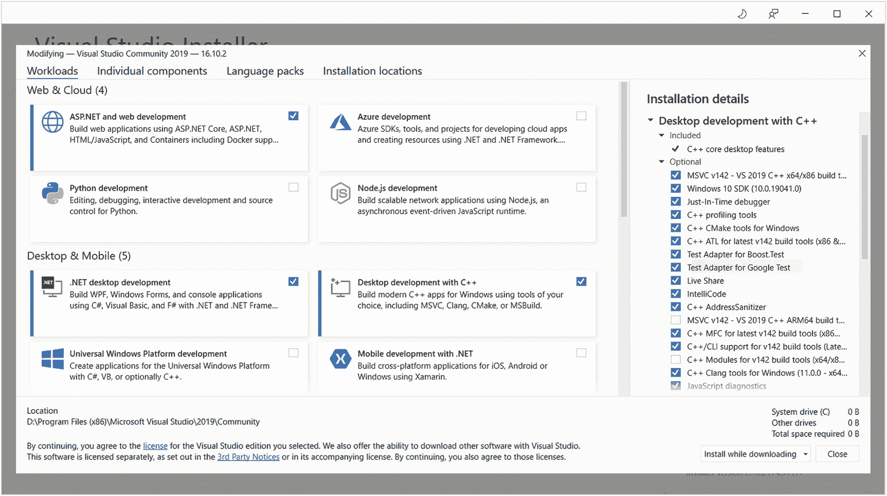
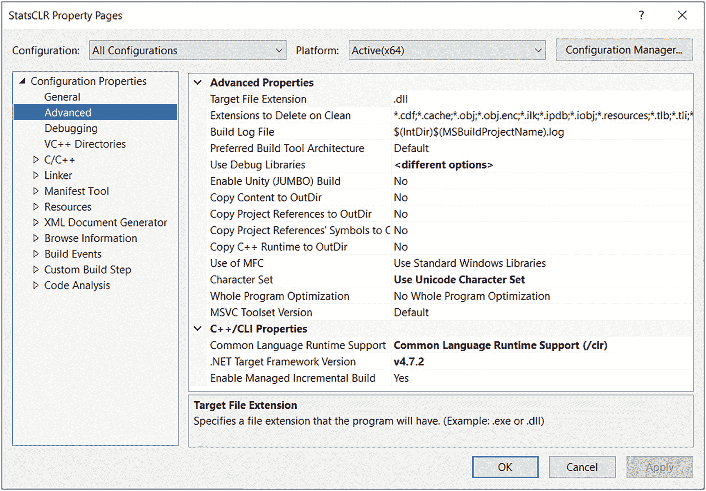
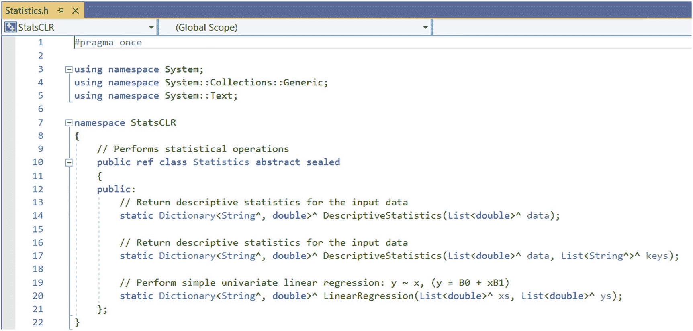
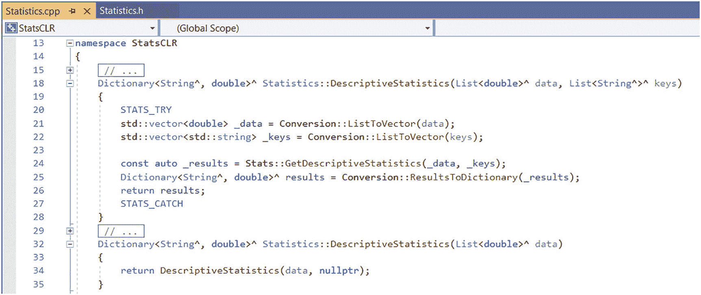
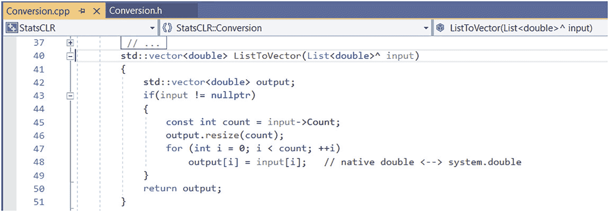
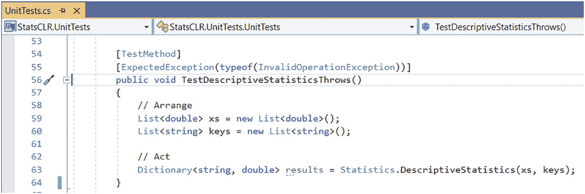
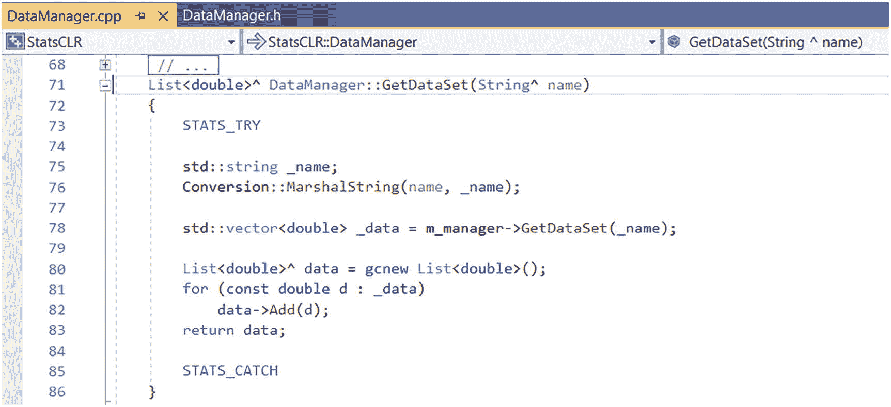

# 三、构建 C++/CLI 包装器

## 介绍

在本章中，我们将构建我们的第一个包装组件。我们使用 C++/CLI 允许。NET 客户端调用 C++ 代码。我们使用 StatsLib，我们在第二章中构建的统计函数库，并通过 C++/CLI 公开该功能。

本章的目的是创建一个完全工作和可用的。NET 组件，尽管功能有限。这样做的原因是为了在现实环境中涵盖尽可能多的技术细节。另一方面，本章不是 C++/CLI 的参考手册。C++/CLI 语言规范是一个大型文档，它规定了实现 C++/CLI 绑定的要求。它深入地涵盖了该语言的所有特性。此外，我们并不打算在我们的报道面面俱到。我们将自己限制在我们正在开发的组件的细节所要求的范围内。我们让有限的代码来决定我们涵盖的主题。本章末尾的“附加资源”部分提供了其他地方更详细介绍的主题的链接。

我们想要包装的底层统计库(StatsLib)具有足够的功能，使它变得有趣，并作为进一步开发的出发点。这一章的目的是用一种足够现实的方式来展示一个特定的架构选择，以便于使用。通过编写一个小组件来连接两种语言，我们能够将统计功能从客户端使用中分离出来。此外，本章还演示了 C++/CLI 包装中涉及的内部设计，将公开函数和类的代码与负责在托管和非托管环境之间转换类型的代码层分开。

## 先决条件

### C++/CLI 支持

该项目的主要先决条件是安装对 C++/CLI 的支持。C++/CLI 支持是 Visual Studio Community 2019 中的额外工作负载，可以使用 Visual Studio 安装程序进行安装。如果您已经安装了它，您可以跳过这一部分。如果没有，启动安装程序，从右边的“使用 C++ 进行桌面开发”部分，选择“C++/CLI 支持”。如图 3-1 所示。



图 3-1

安装 C++/CLI 支持

之后，选择您喜欢的下载和安装选项，并安装工作负载。

## StatsCLR

### 项目设置

StatsCLR 项目是用 CLR 类库(.NET Framework)面向 C++ 的项目模板。我们同样可以使用 CLR 空项目(。NET 框架)。但是，前者生成我们使用的预编译头文件和 *AssemblyInfo.cpp* 属性。

表 3-1 总结了项目设置。

表 3-1

StatsCLR 项目设置

<colgroup><col class="tcol1 align-left"> <col class="tcol2 align-left"> <col class="tcol3 align-left"></colgroup> 
| 

设置

 |   |   |
| --- | --- | --- |
| 标签 | 财产 | 价值 |
| 一般 | C++ 语言标准 | ISO C++17 标准版(/std:c++17) |
| 高级> C++/CLI 属性 | 公共语言运行时支持 | 公共语言运行时支持(/clr) |
| C/C++ >常规 | 其他包含目录 | *$(解决方案目录)通用\包含* |

从表 3-1 中，我们将 C++ 语言标准设置为 C++17。这是为了与 StatsLib 项目保持一致。接下来，我们设置了附加的包含目录。我们需要一个对 C++ 代码的引用，所以我们将其设置为*$(solution dir)Common \ include*。我们还向项目引用节点添加了对 StatsLib 项目的引用。这个项目最重要的设置是公共语言运行时支持。如图 3-2 所示。



图 3-2

设置 CLR 支持

*/clr* 开关是 C++/CLI 项目的默认选项。开关允许使用托管运行时。C++/CLI 项目有时被称为混合程序集，因为它们同时包含非托管机器指令和 MSIL (Microsoft 中间语言)指令。 <sup>1</sup> 从实用的角度来看，这种安排允许我们混合使用。NET 和原生 C++ 代码。使用托管运行时意味着我们可以添加对其他。NET 框架组件添加到项目中，使用`using`指令，我们可以访问所有的。NET 功能。例如，在这个项目中，我们利用。NET 泛型，方法是包含以下代码行:

```cpp
using namespace System::Collections::Generic;

```

除了像我们在这里所做的那样从头开始开发一个独立的符合 clr 的包装组件，还有其他的架构选择。我们可以直接使用 StatsLib 项目，并用 */clr* 开关重新编译它。然而，这种方法在某种程度上依赖于我们在库中引入的依赖项(例如，在我们的例子中，我们依赖于 Boost 库)。这可能会导致编译时出现问题。另一种方法是在同一个文件中使用相应的`#pragma`指令将函数编译为托管或非托管。这两种方法我们都不使用。相反，我们更喜欢保持简单。因此，我们将底层的原生 C++ 库与包装组件分开。

### 代码组织

StatsCLR 项目由以下文件组成，并简要描述了它们包含的内容:

*   *Conversion.h/。cpp* 这包含了类型转换函数。

*   *DataManager.h/。cpp* 这包含了本机 C++ `DataManager`类的托管包装。

*   *Statistics.h/。cpp* 它包含了本机 C++ 统计测试类的托管包装。

*   *pch.h/。cpp* 这是预编译的头文件。

*   项目的资源文件。

*   AssemblyInfo.cpp 它包含关于这个程序集的基本元数据:名称、描述、版本等。

代码被组织到 StatsCLR 项目名称空间下的两个独立的名称空间中:`Functions`和`Conversion`。在开发包装层时，将这两项任务分开是很有帮助的。`Functions`名称空间组织调用函数和类的代码。在这种情况下，我们将查看`Statistics`类，然后是`DataManager,`，最后是`StatisticalTest`类。名称空间包含了类型转换代码。这为我们选择如何处理转换提供了一定程度的灵活性。

### 统计课

我们从查看`Statistics`类开始。代码复制在清单 3-1 中。

```cpp
-

Listing 3-1The Statistics class declaration

```



这段代码有几个值得强调的特性。我们将`Statistics`声明为`ref class`。`ref class`是一个 C++/CLI 类。这将创建一个引用类型，其生存期由 CLR 自动管理。如果您想创建一个可在 C# 中使用的类，您通常会创建一个`ref class`。例如，可以使用 C# 的`new`操作符来调用它。类似地，一个`ref struct`做完全相同的事情，但是使用 C++ 的标准`struct`默认可访问性规则。在这种情况下，因为我们只有静态函数，所以没有构造函数或析构函数。接下来，`abstract`关键字将这个类声明为一个可以用作基类型的类型，但是不能被实例化。接下来，`sealed`关键字(用于`ref`类)表示虚拟成员不能被覆盖，或者某个类型不能用作基类型。因此，我们不能从这个类派生。它类似于 C++ 类上的`final`关键字。可以从 C# 代码中调用这些函数，如下所示:

```cpp
List<double> xs = new List<double> {0,1,2,3,4,5,6,7,8,9};
Dictionary<string, double> results = Statistics.DescriptiveStatistics(xs);

```

最后一个值得注意的特性是引用句柄，在 C++/CLI 中用^表示。这可以被认为是一种不透明的指针类型。更重要的是它引用的内存是托管的。这里我们需要区分非托管内存(从 C++ 的`operator new`返回给我们的内存)和托管内存，前者来自 CRT (C-Runtime Library)堆，后者由。NET 运行时，并由垃圾收集器(GC)恢复。让 GC 代表我们管理内存在某种程度上简化了我们的代码。不需要显式删除托管内存。另一方面，我们需要意识到被引用的托管内存没有固定的地址，可能会被移动。因此，在 C++/CLI 中处理内存时，需要给予特殊的考虑。

#### 参数和返回值

在前面提到的函数中，我们将参数作为通用列表`List<double>^`传递。这是我们做出的选择。鉴于底层类型是一个`std::vector<double>`，这似乎是合理的。例如，我们可以选择一个数组类型或其他更适合我们目的的类型。这里重要的一点是，这是一种选择。鉴于此，我们需要将`List<double>^`转换为`std::vector<double>`。类似地，`LinearRegression`函数的返回类型是一个由`string`键和`double`值组成的字典。声明为`Dictionary<String^, double>^`。和以前一样，我们一直试图保持接近底层类型`std::unordered_map<std::string, double>`。然而，还有其他选择。我们可以使用`List<Tuple<String^, double>>`，在某些方面这更好地代表了`std::unordered_map`，因为它不像`Dictionary`集合那样强加任何顺序。

#### 描述统计学

函数`DescriptiveStatistics`的实现非常简单。它与清单 3-2 中的重载版本一起显示。

```cpp
-

Listing 3-2The implementation of the DescriptiveStatistics function and the overloaded version

```



在清单 3-2 中，该函数首先将传入的托管`List<double>`转换成一个`std::vector<double>`。类似地，按键从`List<String^>`转换为`std::vector<std::string>`。接下来，我们将参数传递给我们的本机函数，它将结果打包为一个`std::unordered_map`，以`string`为键，以`double`为值。然后，结果包被转换回托管字典，并传递回调用者。我们将在下面更详细地处理这些转换。局部变量用前导下划线声明，以区别于参数和返回值。这只是为了避免产生额外的变量名。

原生 C++ 函数`GetDescriptiveStatistics`有一个默认的第二个参数，键的向量。该函数的用户可以选择提供键来请求特定的结果，或者提供单个参数来获得所有的结果。为了在 C++/CLI 中表示这一点，我们需要提供一个带有单个参数的函数的重载版本。这也显示在清单 3-2 中。单参数重载中的代码将调用转发到完整版本，提供一个`nullptr`作为第二个参数。这将允许客户端调用函数的单参数版本或双参数版本。

#### 线性回归

`LinearRegression`包装器的实现遵循与`DescriptiveStatistics`相似的结构。清单 3-3 显示了代码。

```cpp
-

Listing 3-3The implementation of the LinearRegression wrapper function

```


对于`LinearRegression`函数，有两个数据集。因此，我们为每个数据集执行到一个`std::vector<double>`的转换。接下来，我们调用原生 C++ `LinearRegression`函数并获得结果包。这些然后被转换成我们选择的托管类型，在这个例子中是一个`Dictionary`。注意，我们可以将关键字`auto`用于本机 C++ 和托管代码。一般来说，编写 C++/CLI 代码实际上等同于编写本机 C++ 代码。

### 类型变换

既然我们已经看到了基本的统计函数`DescriptiveStatistics`和`LinearRegression`，我们来看看类型转换。在 C++/CLI 中，我们不需要显式转换内置类型。在我们的代码中，使用`bool`、`double`或`std::size_t`(或`long`)作为参数或返回值的函数不需要显式封送。通常，内置 C++ 类型是在`System`名称空间中定义的相应类型的别名。但是，我们确实需要转换以下类型:`std::string, std::vector<double>`和`std::unordered_map<std::string, double>`。

在`Conversion`名称空间中，我们定义了以下两个函数:

```cpp
void MarshalString(String^ s, std::string& os)
void MarshalString(String^ s, std::wstring& os)

```

这些是在托管环境中封送字符串的标准函数。函数`Marshal::StringToHGlobalAnsi`获取一个`String^`并将它转换成一个指向`char*`的空终止指针。然后`char`被分配给一个`std::string`，被分配的内存被`FreeHGlobal`释放。该函数的重写版本处理宽字符串的大小写(Windows 上的 UTF-16 Unicode 字符串)。

我们还定义了两个函数来将列表转换成向量。第一个`ListToVector`函数将一个泛型`List<double>`转换成一个`std::vector<double>`。第二个将一个普通的`List<String^>`转换为`std::vector<std::string>`。原则上，从托管容器(`List<double>^`)中复制项目并将其放入非托管 STL 容器是一件简单的事情。初始实现如清单 3-4 所示。

```cpp
-

Listing 3-4Converting List<double> to std::vector<double>

```



我们做的第一件事是构造一个空的输出向量。在我们检查输入指针之后，我们获得输入条目的计数，并使用它来确定`std::vector<double>`的大小。然后，我们从输入列表中提取每一项，并将其放入输出向量中。字符串的`ListToVector`覆盖遵循类似的逻辑，但是使用`MarshalString`显式地从托管的`string`转换为`std::string`。值得强调的是，在这两种情况下，我们都从托管内存(`double` s，`string` s)中获取实体，并将它们复制到非托管 C++ 内存中。

就性能而言，进行基于元素的复制不太可能是性能最好的方法。有各种方法可以改善这一点。一种可能是利用“牵制”。在正常情况下，CLR 管理与对象关联的内存。除了别的以外，这意味着它可以自由地移动内存。但是，在某些情况下，可能希望能够告诉 CLR 暂时不要移动一些内存。这就是钉扎所实现的。`pin_ptr<T>`类型允许您向 CLR 指示，在锁定指针超出范围之前，不应该移动内存。清单 3-5 通过使用`std::copy`将`cli::array`复制到`std::vector`演示了这种方法。

```cpp
-

Listing 3-5Pinning a CLI array

```


在这个例子中，我们获得了输入项的计数，并使用它来确定`std::vector<double>`的大小，如前所述。然后我们创建一个指向`cli::array`的固定指针，并获得指向`first`和`last`元素的指针。`pin_ptr`的目的是确保 GC 在复制操作期间不会移动或删除内存。最后我们使用`std::copy`来复制内存块。

我们从使用`ListToVector`改为使用`ArrayToVector`的目的是为了提高性能。然而，为了做到这一点，我们需要将输入类型从`List<double>`改为`cli::array<double>`。我们还需要将函数调用改为:

```cpp
static Dictionary<String^, double>^ DescriptiveStatistics(cli::array<double>^ data);

```

最后，我们需要改变对类型转换代码的调用，使用`ArrayToVector`而不是`ListToVector`。如前所述，在转换层需要做出选择。

第二个转换函数将一个`std::unordered_map`转换成一个`Dictionary`。清单 3-6 显示了代码。

```cpp
-

Listing 3-6Converting the results package to a Dictionary

```


从封装在`std::unordered_map`中的结果到`Dictionary`的转换与之前的转换功能方向相反。我们使用`gcnew`实例化一个新的托管`Dictionary`。这将返回给我们一个垃圾回收引用。然后，我们迭代地将非托管容器(输入)中的项目放置到托管容器(输出)中。`Add`方法接受两个对应于`Dictionary`键值对的参数。这个键是一个托管的`string`，因此我们需要将`std::string`键转换成一个`System::String`实例。同样，我们使用`gcnew`。托管的`String`类有一个构造函数，它接受一个指向`char`的本机数组的指针。

我们前面使用的转换函数完全专用于处理 StatsLib 中使用的类型。然而，有许多方法可以使它更通用。例如，将`ArrayToVector`转换(清单 3-5 )推广到任何从`array<T>`到`vector<T>`的转换可能是有用的。或者我们可能更喜欢在`std::array<T>`和`cli::array<T>`之间转换。我们还可以利用`cliext`名称空间提供的功能。另一种可能是使用 C++ 互操作。最后一个值得一提的选择(但我们没有在这里讨论)是使用自己的 c++“object-with-type-information”如果所有的 C++ 类型都可以和类型信息一起封装在一个公共实体中(例如，COM `VARIANT`类)，那么我们可以通过一些工作来定义这些类型和`System::Object`(所有类型的基类)之间的标准转换。网络类型)。这样做的好处是，调用方不需要选择它们转换的类型。为了做到这一点，您需要编写一个 C++ 类来处理内置类型以及复合类型和容器的转换。这不是一项完全无足轻重的任务。这种方法在其他框架中也有使用。例如，Rcpp 使用`RObject` `*`和 CPython 使用`PyObject*`包装原生 C++ 类型。我们将在后面的章节中看到这些例子。这种方法使您可以完全控制如何进行类型转换，也可以完全控制允许的转换集。然而，这可能只有在您有大量类型转换逻辑的情况下才合适。所有这些的主要目的是让您了解转换层可以有多灵活。

### 异常处理

因为这是一个翻译层，我们需要注意异常。具体来说，我们希望确保从非托管 C++ 层抛出的异常在我们的代码中得到处理，而不是以未翻译的形式传播到使用包装组件的客户端。为此，我们用宏`STATS_TRY/STATS_CATCH`包装每个函数调用。清单 3-7 显示了宏的定义。

```cpp
-

Listing 3-7Exception handling in the managed wrapper

```


代码捕捉任何`std::exception`并创建一个新的类型为`InvalidOperationException`的托管异常，将原始异常字符串(经过适当转换)传递给它。因此，C# 客户端将能够查看和处理这些异常。显然，这是可以推广的。标准库定义了更多类型的异常，将这些异常转换成更适当管理的异常类型可能会很有用。

## 测试代码

### StatsCLR.UnitTests

有了这些，我们就可以构建和测试这个库了。为了测试 StatsCLR 组件，我们使用一个名为 StatsCLR.UnitTests 的 C# MSUnitTest 项目。为了简单起见，我们只有一个文件， *UnitTests.cs* 。这包含了针对`DescriptiveStatistics`和`LinearRegression`的测试用例，以及针对统计假设测试功能和`DataManager`类的测试。这类似于我们在为底层 StatsLib 编写的原生 C++ (GoogleTest)单元测试中使用的方法。清单 3-8 中显示了一种典型的测试方法。

```cpp
-

Listing 3-8Testing the LinearRegression function

```


测试函数使用属性`[TestMethod]`。这意味着我们可以从 Visual Studio 中的 Test 菜单(以及 Test Explorer 面板)运行它。如前所述，测试遵循*安排-动作-断言*模式。 <sup>3</sup> 我们以预期的形式提供数据，并调用`LinearRegression`函数。然后将结果与预期值进行比较。此外，我们测试该函数在用空数据调用时会抛出预期的异常。清单 3-9 显示了这方面的代码。

```cpp
-

Listing 3-9Testing exception handling

```



和以前一样，我们将此归因于一个`[TestMethod]`。此外，我们声明了用我们期望的异常类型参数化的`[ExpectedException]`属性。在函数体中，我们声明一个空列表，并将其传递给`DescriptiveStatistics`函数。异常是在底层 C++ 层中抛出的，而不是在转换函数中抛出的。类似地，如果我们传入一个空引用，转换函数会将一个空的`std::vector<double>`传递给底层的 C++ 函数，后者会抛出相应的异常。作为使用`[ExpectedException]`属性的替代方法，我们可以在前面的`// Act`部分中编写以下代码:

```cpp
Assert.ThrowsException<InvalidOperationException>(() => Statistics.DescriptiveStatistics(xs));

```

这与使用属性获得相同的结果。

## 托管包装类

### 介绍

到目前为止，我们已经编写了包装本机 C++ 函数的代码。我们还在标准库类型之间进行了转换。但是，为了从 StatsLib 中公开其余的功能，仍然需要做一些准备工作。我们仍然想要由`DataManager`和统计测试类提供的功能。

为了使这一功能可用，我们需要围绕非托管对象编写一个托管包装类。这种方法非常简单。我们定义了一个托管类，它包含一个指向底层非托管 C++ 类型的私有成员变量。然后，我们使用构造函数通过`operator new`创建这个非托管类型的新实例。对于我们想要公开的每个基础函数，我们声明一个等效的托管成员函数，它将调用转发到基础类型。该函数负责将参数转换为适当的基础类型。当托管对象被释放时，我们删除指向底层 C++ 类型的指针。这种方法类似于“指向实现的指针”( *pimpl* )设计模式。我们有不同的类将(托管的)接口与(非托管的)实现细节分开。

### 数据管理器

`DataManager`是一个典型的包装类。它遵循清单 3-10 中所示的 *pimpl* 习语。

```cpp
-

Listing 3-10The DataManager wrapper class

```


`DataManager`包装类公开了原生 C++ 类的所有缓存功能。我们可以从类声明中看到，从广义上讲，我们处理的是两个方面。首先，我们管理本机指针`Stats::DataManager*`的生命周期。我们使用构造函数和析构函数来完成这项工作。清单 3-11 显示了代码。

```cpp
-

Listing 3-11Instantiating the native pointer in our wrapper class

```


构造函数遵循底层类的语义。在这种情况下，没有要传递的参数，所以我们只需创建一个新的实例。析构函数的行为方式与本机 C++ 析构函数类似。它是确定性的，所以当对象超出范围时，析构函数被调用。此外，还有一个由 GC 调用的非确定性终结器。清单 3-12 中显示了这两种析构函数的代码。

```cpp
-

Listing 3-12The DataManager destructors

```


从清单 3-12 中，我们可以看到，在 finalizer 中，我们显式地调用了析构函数。C++/CLI 引用类型中的析构函数执行确定性的资源清理。终结器清理非托管资源，可以由析构函数确定性地调用(就像我们在这种情况下所做的那样)，也可以由垃圾收集器非确定性地调用。这里重要的是实现类的非托管内存是通过析构函数显式释放的。否则，将会发生内存泄漏。

除了生命周期管理，我们在`DataManager`中做的第二件事是转发对底层对象的调用并返回结果。具体来说，我们需要转发调用来检索数据集的计数、添加新的数据集、检索命名的数据集、列出所有带有项目计数的数据集，最后清除所有数据集。清单 3-13 显示了功能`GetDataSet`。

```cpp
-

Listing 3-13The implementation of the GetDataSet function

```



`GetDataSet`函数从本机`DataManager`类中检索一个命名数据集。在调用函数之前，我们将 name 参数转换成一个`std::string`。数据集作为`double`的`vector`返回。因此，当我们返回结果时，我们显式地将其转换为`List`。任何时候，我们都需要意识到，我们正在充当一个受管理和不受管理的世界之间的边界。因此，我们需要将传入的参数转换为本机类型，当我们获得返回的本机类型时，我们需要将它们转换为托管类型。

### TTest 类

`TTtest`类类似于`DataManager`。在这种情况下，我们选择不公开基类(`StatisticalTest`)。我们可以在托管上下文中重新创建层次结构；然而，这是不必要的，所以我们限制自己只公开`TTest`类。清单 3-14 显示了完整的类声明。

```cpp
-

Listing 3-14Class declaration for the TTest

```


和以前一样，我们在托管类中包装了一个本机指针`Stats::TTest*`。在这种情况下，我们模仿原生类的构造语义。每个构造函数使用传递给它的参数实例化适当的本机指针类型。例如，单样本 t 检验的构造函数如清单 3-15 所示。

```cpp
-

Listing 3-15The TTest constructor for a one-sample t-test

```


在单样本 t 检验的情况下，我们传入一个`double`和一个`List<double>`。第一个参数是隐式转换的，而我们使用转换函数`ListToVector`显式转换第二个参数。最后，我们创建一个新的非托管`TTest`对象，处理任何可能抛出的异常。

正如我们所看到的，即使是这些简单的例子，能够向客户端公开用户定义的类型，而不是编写过程包装函数，提供了一种更丰富的方法来与本机 C++ 代码进行互操作。我们能够更准确地反映底层 C++ 类型的语义，同时允许我们自由选择公开什么。

值得强调的是，我们用相对较少的几行代码完成了什么。我们已经将 C++ 库中的所有功能公开在一个完全可用的包装器组件中，该组件可以在。NET 框架。开发该组件非常简单，尤其是与编写等效的 COM 包装相比。

例如，使用 ATL/COM 构建的 COM 包装需要更多的基础结构。至少，接口和实现需要注册。公开函数和类虽然不难，但比使用 C++/CLI 要复杂得多。我们需要创建新的 COM 接口(例如，`IStatisticalTest`，`IDataManager,`)，这些接口将在 ATL/COM 类中实现。这个类也将提供其他标准接口的实现(例如`IDispatch`和`IErrorInfo,`)。虽然大量的代码是样板文件，是为我们生成的，但这仍然比使用 C++/CLI `ref class`要复杂得多。此外，对于不使用内置类型的函数，我们需要处理与`VARIANT`之间的转换。这些并非完全无关紧要。例如，考虑将一个`std::unordered_map<std::string, double>`转换成一个连接到`VARIANT`的`SafeArray`的情况。StatsATLCOM 项目说明了其中的一些问题。 <sup>4</sup> 总的来说，C++/CLI 包装器提供了一个更简单的选择，同时允许我们使用原生 C++ 开发代码。

## 摘要

在本章中，我们围绕 StatsLib 构建了一个 C++/CLI 包装器。我们使用这个包装器来公开函数和类，同时在需要的地方转换类型。我们还看到了一个简单的例子，展示了 C# 客户端如何在单元测试项目中使用这一功能。在下一章，我们来看一个使用 Excel 作为客户端的更复杂的场景。

在这么小的空间里，显然有很多东西我们还没有涉及到。我们还没有谈到代表和事件。如果您需要从本机 C++ 环境中使用回调，这些是很重要的。我们提到了“牵制”，但没有包括“拳击”，因为我们试图保持事情简单。在托管和非托管环境中，有许多与内存管理的细节相关的小细节我们还没有涉及到。附加资源部分和参考资料提供了详细介绍这些主题的文档链接。

总的来说，如果您必须将现有代码迁移到。NET 平台。通过编写包装器组件，我们增加了一个间接层，有助于重构底层代码。正如第二章所指出的，我们本可以围绕 StatsLib 编写一个 COM 包装器(同时保持关注点的分离)，然后使用 COM 互操作提供的工具直接使用. NET 项目中的组件。然而，正如我们前面提到的，这可能需要更多的基础设施，并导致比使用 C++/CLI 更复杂的体系结构。

### 额外资源

以下链接提供了本章所涵盖主题的更多详细信息:

*   C++/CLI 语言规范提供了涵盖所有语言特性的最全面的参考文档。可以从这里下载: [www。ECMA-国际。org/publications-and-standards/standards/ECMA-372/](http://www.ecma-international.org/publications-and-standards/standards/ecma-372/)。

*   如果您需要有关 C++/CLI 语言的其他信息，请参阅 Microsoft 文档”。NET 使用 C++/CLI 编程”是一个很好的起点: [` docs。微软。com/en-us/CPP/dot net/dot net-programming-with-CPP-CLI-visual-CPP？view= msvc-160`](https://docs.microsoft.com/en-us/cpp/dotnet/dotnet-programming-with-cpp-cli-visual-cpp%253Fview%253Dmsvc-160) 。

*   关于 C++/CLI 的基本原理的讨论，有 Herb Sutter 的一篇有用的文章，网址是 www . gotw . ca/publications/c++ CLI rational . pdf。

*   有关混合本机程序集和托管程序集的更多信息，以下文档很有用: [` docs。微软。com/en-us/CPP/dot net/mixed-native-and-managed-assemblies？view= msvc-160`](https://docs.microsoft.com/en-us/cpp/dotnet/mixed-native-and-managed-assemblies%253Fview%253Dmsvc-160) 。

*   名称空间包含了 STL/CLR 库的所有类型。这里是这样描述的: [` docs。微软。com/en-us/CPP/dot net/STL-clr-library-reference？view= msvc-160`](https://docs.microsoft.com/en-us/cpp/dotnet/stl-clr-library-reference%253Fview%253Dmsvc-160) 。

*   使用 C++ 互操作在这里描述: [` docs。微软。com/en-us/CPP/dot net/how-to-marshal-arrays-using-CPP-interop？view= msvc-160`](https://docs.microsoft.com/en-us/cpp/dotnet/how-to-marshal-arrays-using-cpp-interop%253Fview%253Dmsvc-160) 。

*   有关 C++/CLI 中析构函数和终结器的更多信息，请参见以下内容:[。微软。com/en-us/previous-versions/visual studio/visual-studio-2008/ms 177197(v = vs . 90)？redirectedfrom= MSDN](https://docs.microsoft.com/en-us/previous-versions/visualstudio/visual-studio-2008/ms177197%2528v%253Dvs.90%2529%253Fredirectedfrom%253DMSDN) 。

*   关于“装箱”和“固定”的全部细节可以在 [` docs 找到。微软。com/en-us/CPP/dot net/boxing-CPP-CLI？view= msvc-160`](https://docs.microsoft.com/en-us/cpp/dotnet/boxing-cpp-cli%253Fview%253Dmsvc-160) 和 [` docs。微软。com/en-us/CPP/extensions/pin-ptr-CPP-CLI？view= msvc-160`](https://docs.microsoft.com/en-us/cpp/extensions/pin-ptr-cpp-cli%253Fview%253Dmsvc-160) 。

## 练习

本节中的练习提供了一些使本机 C++ 功能可用于的实践。NET 客户端通过 C++/CLI 包装组件。

我们对 C++ 层做了三个主要的改变，我们有兴趣公开:

*   我们向`LinearRegression`函数添加了更多的结果。

*   我们添加了一个执行统计 z 测试的`ZTest`类。这类似于`TTest`类，所以我们可以在此基础上创建任何新代码。

*   我们添加了一个`TimeSeries`类，带有一个计算简单移动平均值的函数。

1)在 StatsCLR 中。UnitTests 项目，扩展测试方法`TestLinearRegression`以包含相关系数 *r* 和*r*2 度量的测试。重建并重新运行测试，确认没有错误。

2)在 StatsCLR 项目中，公开 z 测试功能。虽然完全可以为 *Statistics.h* 和 *Statistics.cpp* 添加用于`ZTest`功能的过程包装器，但是最好创建一个托管的`ZTest`类来包装底层的本地 C++ 类并调用`Perform`和`Results`函数。这种方法在托管包装类一节中有描述。

所需的步骤如下:

*   在 *StatisticalTests.h* 中增加`public ref class ZTest { };`。遵循用于`TTest`包装器的类定义。

*   在 *StatisticalTests.cpp* 中，添加类实现。构造函数需要调用底层 C++ 构造函数的适当版本。现有的转换函数可用于将构造函数参数转换为标准库类型。`Perform`和`Results`的实现只是将调用转发给底层的非托管本地实例。结果需要转换成一个托管的`Dictionary`。同样，这可以使用现有的转换函数来完成。

*   重新构建 StatsCLR 项目。在 StatsCLR 中。单元测试，为我们处理的三种类型的 z 测试添加测试用例:`TestSummaryDataZTest`、`TestOneSampleZTest`和`TestTwoSampleZTest`。这些类似于本地 C++ 类的测试用例，可以使用相同的数据。检查测试用例运行是否没有错误。

3)公开`TimeSeries`类。这与前面的练习类似，但更复杂一些，因为我们需要添加一个转换函数来处理日期的输入列表，并添加另一个转换函数来返回移动平均值的列表。

所需的步骤如下:

*   将文件 *TimeSeries.h* 和 *TimeSeries.cpp* 添加到项目中。

*   在头文件中，添加包含本机 C++ 类声明的行:

*   使用声明添加以下内容:

    ```cpp
    using namespace System;
    using namespace System::Collections::Generic;
    using namespace System::Text;

    ```

*   Add the class definition with appropriate C++/CLI types. In the case of the “dates,” the native C++ class treats these as `long`s. While we could just have a list of `long`s, in .NET the `DateTime` class is more useful. We should be able to make use of the `.ToOADate` member function to get a serial number. The suggested `TimeSeries` constructor arguments are therefore

    ```cpp
    List<System::DateTime>^ dates, List<double>^ observations

    ```

    `MovingAverage`成员函数应该返回一个`List<double>^`。

*   在实现文件中，添加

```cpp
#include "..\include\TimeSeries.h"

```

*   添加类定义(构造器、析构器、终结器和`MovingAverage`函数)。对于构造函数参数`List<System::DateTime>^ dates`，我们需要添加一个转换函数:

```cpp
#include "pch.h"
#include "Conversion.h"
#include "TimeSeries.h"

```

*   对于`MovingAverage`函数，我们可以将`window`参数直接转发给非托管类实例。然而，我们需要将返回的`vector`转换成一个`List`:

```cpp
std::vector<long> ListToVector(List<System::DateTime>^ dates);

```

*   在`Conversion`名称空间中，添加以下函数声明:

    ```cpp
    std::vector<long> ListToVector(List<System::DateTime>^ dates);
    List<double>^ VectorToList(const std::vector<double>& input);

    ```

*   在文件 *Conversion.cpp* 中，添加实现。这些类似于现有的转换函数。

*   重新构建 StatsCLR 项目。在 StatsCLR 中。UnitTests，添加一个名为`TestMovingAverage`的测试方法。这将类似于本地 C++ 类的测试用例。检查测试用例运行是否没有错误。

```cpp
List<double>^ VectorToList(const std::vector<double>& input);

```

<aside aria-label="Footnotes" class="FootnoteSection" epub:type="footnotes">Footnotes 1

对于那些对细节感兴趣的人，中间语言反汇编工具(ildasm.exe)允许您探索生成的 IL 代码。

  2

这里介绍一下这个方法: [` docs。微软。com/ en-us/ cpp/预处理器/托管-非托管？view= msvc-160`](https://docs.microsoft.com/en-us/cpp/preprocessor/managed-unmanaged%253Fview%253Dmsvc-160) 。

  3

这里将更详细地描述*安排-行为-断言*模式: [` docs。微软。com/ en-us/ visualstudio/ test/单元测试-基础？view= vs-2019`](https://docs.microsoft.com/en-us/visualstudio/test/unit-test-basics%253Fview%253Dvs-2019) 。

  4

StatsATLCOM 项目只是反映了 StatsCLR 包装器的部分功能。它的目的是说明与使用 C++/CLI 作为将 C++ 连接到 C# 和. NET 的方法相比，编写 COM 包装所涉及的一些差异和困难。

 </aside>