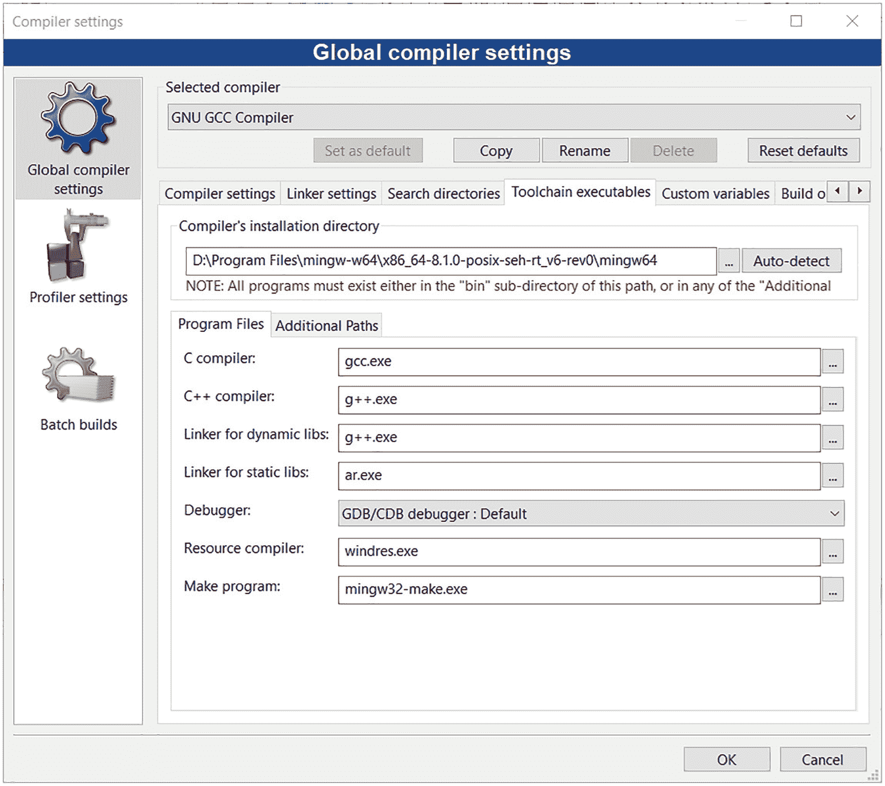
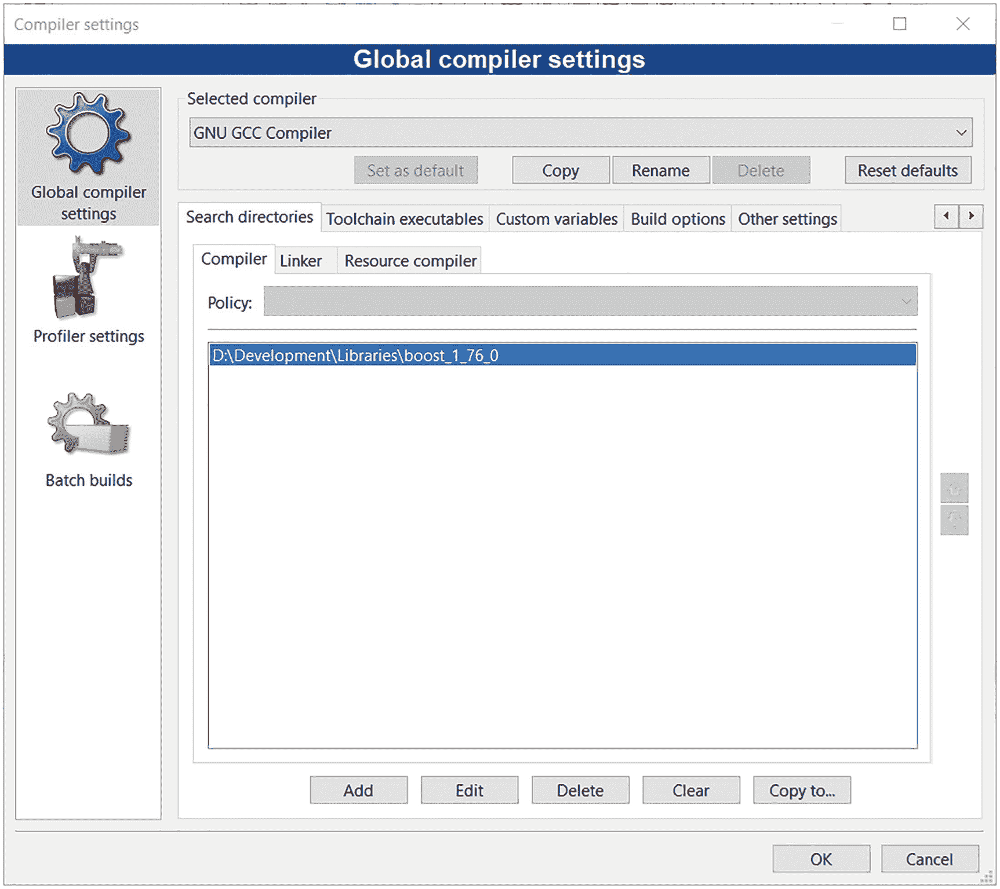
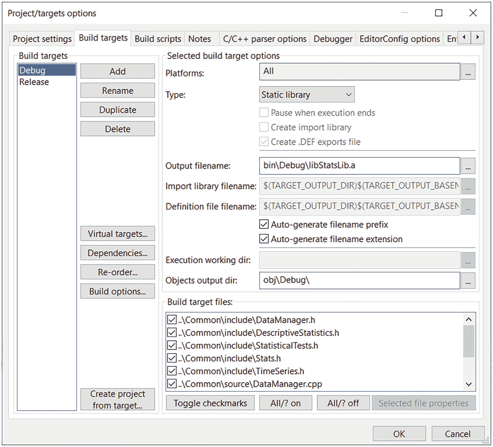
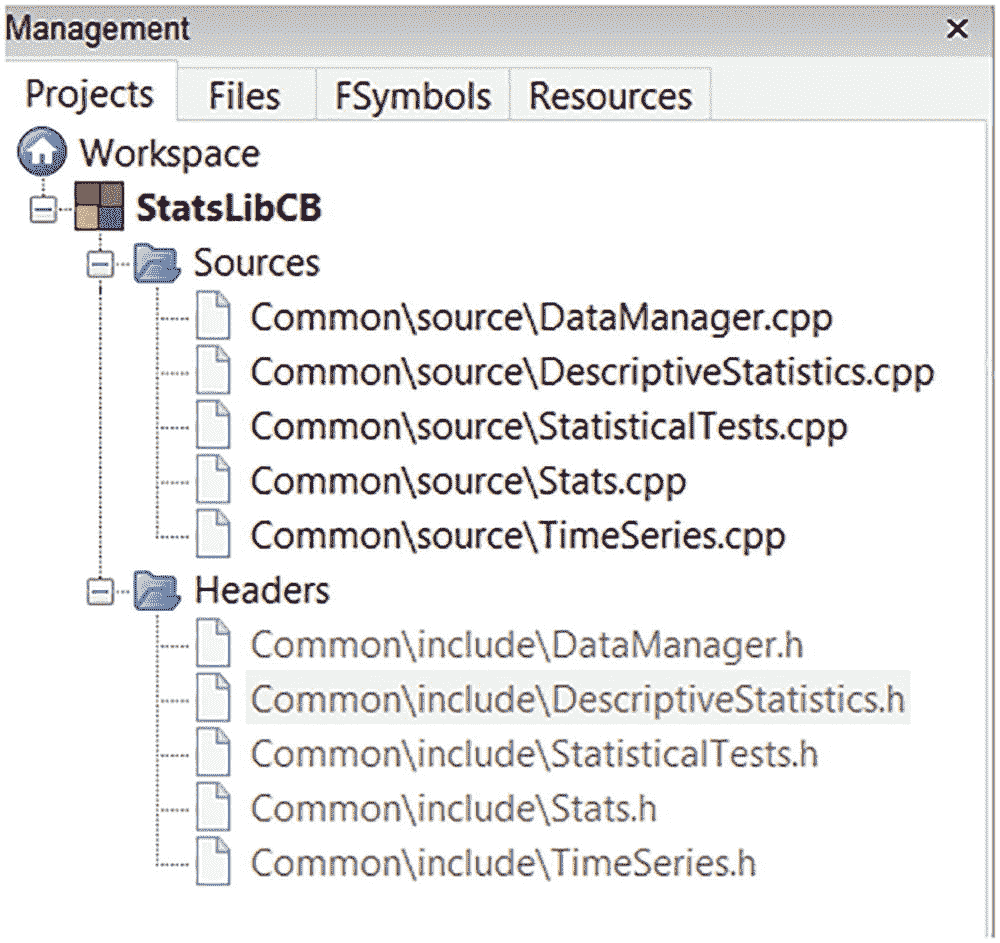
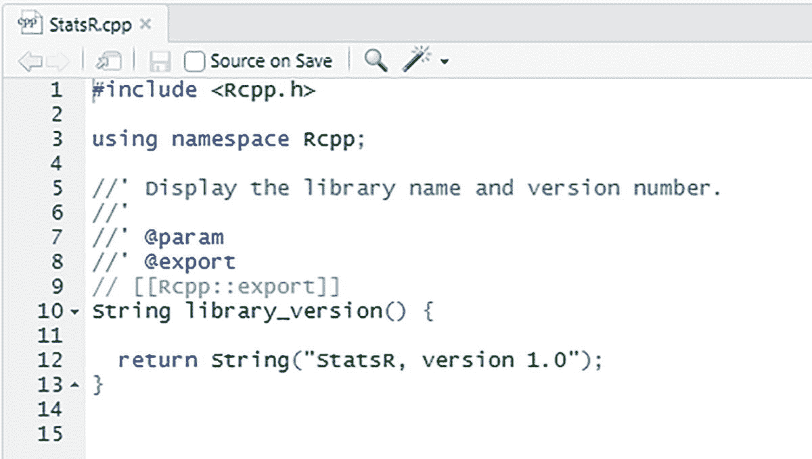
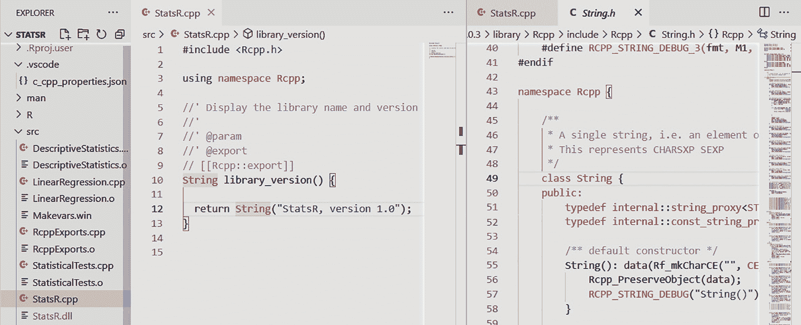
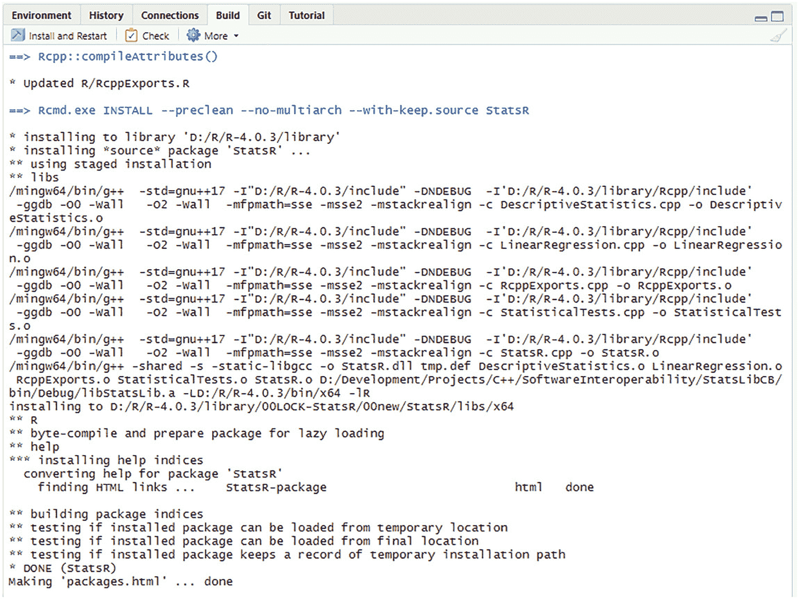
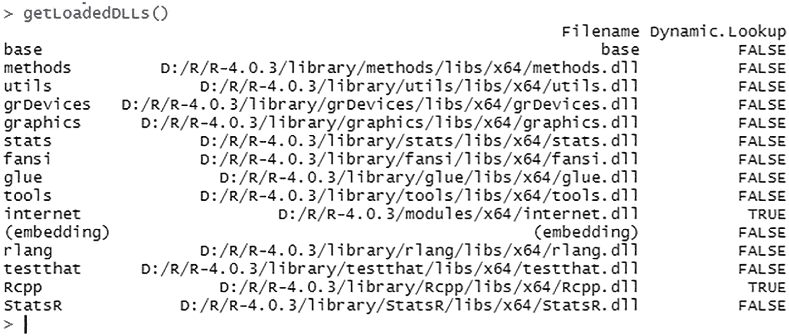

# 五、构建 R 包

## 介绍

在这一章和下一章中，我们将简单的 C++ 统计函数库连接到 R 上。然后，我们使用这个包装组件来公开我们想要的功能。本章着重于项目设置和用 RStudio 构建包的机制。下一章将重点介绍使用 Rcpp 作为连接 C++ 和 r 的框架的细节。

这种情况下的项目设置比以前稍微复杂一些。总的来说，我们需要构建一个 CRAN <sup>[1](#Fn1)</sup> 包的标准环境。更具体地说，开发环境需要使用合适的编译器。因为不同 C++ 编译器(GCC、MSVC 等)产生的输出不尽相同，所以不可能混合不同编译器产生的目标代码。从我们狭隘的从业者的角度来看，结果是我们需要用不同的编译器/链接器构建一个版本的 C++ 统计函数库。具体来说，GNU 编译器集合(gcc)必须与 C++ 语言对应的 g++ 编译器(GCC)一起使用。这是为了构建一个 ABI(应用程序二进制接口)兼容的组件，该组件将驻留在 R 中，并在 R 环境中进行互操作。

所涉及步骤的简要概述如下:

1.  安装所需的 gcc 工具。

2.  从与之前相同的源代码中设置并构建一个新的静态库(使用代码块)。库输出是 *libStatsLib.a* 。

3.  在 RStudio ( *StatsR* )中创建 Rcpp 项目。

4.  配置 Rcpp 项目以使用新的静态库。

这将为我们提供一个有效的包装外壳。稍后，我们将了解如何添加功能。与前几章不同，本章我们更关注工具链(代码块、Rtools 和 RStudio)。我们把编写 Rcpp 层、构建和测试功能留到下一章。

## 先决条件

### 工具

Rtools 是一套在 Windows 上构建 R 包的工具，包括 gcc 编译器。Rtools 的安装程序从 [`https://cran.r-project.org/bin/windows/Rtools/`](https://cran.r-project.org/bin/windows/Rtools/) 开始提供。应该安装 64 位版本的 Rtools:*Rtools 40-x86 _ 64 . exe*。需要注意的是，要安装 Rtools 4.0，你需要 4.0.0 或更高版本的 R。完成安装后，确保将`RTOOLS40_HOME`环境变量设置为 *rtools* 目录。另外，将 *rtools* 目录添加到`PATH`环境变量中。也可以使用命令:`install.Rtools()`从 RStudio 内部直接安装 Rtools。这将安装最新版本的 Rtools。以下链接给出了如何操作的说明: [`https://rdrr.io/cran/installr/man/install.Rtools.html`](https://rdrr.io/cran/installr/man/install.Rtools.html) 。要检查 Rtools 是否已正确安装，请打开 PowerShell 提示符并键入`gcc --version`以显示程序版本信息。

### 安装代码块

实际上，安装代码块并不是先决条件，这只是一种便利。安装程序可从 [`www.codeblocks.org/downloads/binaries`](http://www.codeblocks.org/downloads/binaries) 获得。我们的目标是用 gcc 工具链构建一个符合 ABI 标准的静态库，有几种方法可以实现这个目标。如果您习惯于使用 makefiles 手动构建库，或者您更喜欢使用 CMake 来配置使用 gcc 工具链的构建环境，那么您不需要使用代码块。附录 [B](https://doi.org/10.1007/978-1-4842-7966-3) 包含关于配置 Visual Studio CMake 项目 *StatsLibCM* 以构建我们需要的库输出的基本说明。另一方面，如果您更喜欢将 Visual Studio 代码作为您的 C++ 开发环境，也可以使用 MinGW 将它配置为与 GCC 一起工作。有关更多信息，请参见本章末尾的附加资源部分。

因为已经使用 gcc 为跨平台 C++ 开发配置了 CodeBlocks，所以我们将在这里继续使用它。此外，CodeBlocks 提供了多种有用的项目类型和几个构建目标(例如，静态链接库、动态链接库)。此外，调试支持(包括设置断点和观察变量)比从控制台会话使用 gdb 更容易。

## 代码块

### 工具链设置

打开代码块。转到设置➤编译器...。在选定的编译器下，选择 GNU GCC 编译器，并配置以 C++17 为目标的 g++ 版本。图 [5-1](#Fig1) 显示了全局编译器设置。


图 5-1

代码块中的编译器设置

除了常规设置(如图 [5-1](#Fig1) 所示)，还有许多控制编译方面的有用选项。具体来说，有用于调试、分析、警告、优化和 CPU 架构的选项。对于这个项目，我们不使用这些选项中的任何一个，但是知道它们的存在是有用的。

接下来，在 Toolchain executables 选项卡中，单击 Auto Detect 按钮。这个要填写到编译器安装目录的路径，例如，*D:\ Program Files \ mingw-w64 \ x86 _ 64-8 . 1 . 0-POSIX-seh-rt _ V6-rev 0 \ mingw 64*。如果不是这种情况，请点击*“..”*按钮，手动选择 MinGW 目录(gcc 工具所在的目录)。请注意，CodeBlocks 本身会安装 MinGW 工具集。所以，除了 Rtools 之外，你还可以安装第二个 MinGW。我有两个版本的 MinGW 软件包——一个是 CodeBlocks 的 gcc 8.1.0，另一个是 Rtools 的 gcc 8.3.0。这不会造成问题，因为两者的输出都是 ABI 兼容的。来自 CodeBlocks 的 MinGW 安装将目录放入`PATH`环境变量中，所以这是我们用来构建的。但是，如果您愿意，可以将其更改为使用 Rtools 的路径。

如图 [5-2](#Fig2) 所示，填入剩余的工具。



图 5-2

工具链可执行文件

最后，在搜索目录选项卡下，添加到 *boost_1_76_0* 目录的路径。图 [5-3](#Fig3) 显示了我们使用的设置。



图 5-3

设置搜索路径以使用 Boost

完成配置后，按 OK 保存所有更改。

### 项目设置

StatsLibCB 目录包含 CodeBlocks 项目文件( *StatsLibCB.cbp* )。该项目使用静态库模板。静态库基于与前面相同的 C++ 源代码，位于*\公共*目录中。在代码块中打开项目。右键单击项目节点，选择项目属性，如图 [5-4](#Fig4) 所示。


图 5-4

项目设置

整个项目设置非常简单。该页面(图 [5-4](#Fig4) )给出了与目标文件生成、 *pch* 文件、平台和执行目录相关的选项。我们在这里没有做任何更改。选择构建目标页面，检查(调试和发布)构建目标如图 [5-5](#Fig5) 所示。



图 5-5

为 libStatsLib 生成目标

查看图 [5-5](#Fig5) ，我们可以看到项目的类型被设置为静态库。输出文件名为 *libStatsLib.a* (均为*调试*和*发布*)。在图 [5-5](#Fig5) 的底部，我们可以看到我们已经添加的构建目标文件。单击确定保存设置。项目环境应该如图 [5-6](#Fig6) 所示。



图 5-6

包含源文件和包含文件的项目节点

根据 StatsLibCB 工作区节点的显示方式(右键单击该节点可获得各种选项)，项目文件的视图可能会略有不同。在这个阶段，项目已经可以构建了。从“生成”菜单中，选择“生成”(Ctrl+F9)。构建该库的调试版本和发布版本。“生成日志工具”窗口显示传递给编译器和链接器的命令行。项目应该在没有警告或错误的情况下构建，库( *libStatsLib.a* )应该位于与所选构建目标相对应的输出目录中。

## R/RStudio 包

### 背景

对于这一部分，您需要启动并运行 RStudio。RStudio 是托管 R 环境和使用 R 语言开发应用程序的首选 IDE。我们可以使用更基本的 RGui 然而，RStudio 提供了更好的工具，特别是在构建 R 包的时候。因此，在成功构建了符合 ABI 标准的统计库之后，我们现在准备创建一个使用它的 R 包。

在 Windows 上，R 包是动态链接库。它们可以通过使用完整文件名(包括 *dll* 扩展名)的`dyn.load()`函数动态加载，或者，更典型的是，对于已安装(注册)的包，使用`library()`命令。其中，RStudio 提供了一个方便的 IDE 来管理软件包的安装和加载。

为了与包进行通信，R 语言和环境提供了一个低级的 C 风格的 API(应用程序编程接口)。一旦加载了包，用户就可以调用包中的函数，传递参数，并返回结果。这意味着一旦我们将*StatsR.dll*构建成一个包，我们就可以加载它并执行下面的命令，例如:

```cpp
> .Call("_StatsR_get_descriptive_statistics", c(0,1,2,3,4,5,6,7,8,9), c("StdErr"))
   StdErr 0.9574271

```

这调用了带有两个作为集合传递的参数的`get_descriptive_statistics`函数:数据和一个键“`StdErr`”。结果按预期返回。我们在调用`_StatsR_get_descriptive_statistics`时使用的实际函数名是 C 风格的导出函数名。我们可以通过使用类似于*Depends.exe*的工具检查*StatsR.dll*来得到这个。

然而，这个 API 非常低级，对于扩展开发来说并不理想。我们在这里的目的是从底层 C++ 统计库中公开(有限)数量的函数。使用 C 风格的 API 方法，我们需要将所有函数声明为类型`extern "C" SEXP`。这是一个指向`SEXPREC`或简单表达式记录的指针，r 使用的不透明指针类型。此外，参数必须被类型化为指向 S 表达式对象的指针(`SEXP`)。使用 C 风格的 API 确实允许我们在 C++ 和 R 之间交换数据和对象，但是对于更复杂的 C++ 开发来说，这不是一个实际的建议。

Rcpp 框架解决了这个问题。Rcpp 层位于`.Call()` API 之上，保护 C++ 开发人员不需要使用底层的`SEXP`类型。Rcpp 提供了一个接口，可以自动将标准 C++ 翻译成对低级 API 的调用。从开发的角度来看，Rcpp 允许我们对包装组件使用标准 C++。

### 用 Rcpp 构建一个包

#### 安装 Rcpp

Rcpp 包可以通过运行 R 命令:`install.packages("Rcpp")`来安装。或者，从 RStudio 菜单中，我们可以使用工具➤安装包...命令。一旦完成，我们就可以构建 Rcpp 包了。在 RStudio 中，打开 StatsR 项目:文件➤打开项目...。 *StatsR。Rproj* 文件位于 *SoftwareInteroperability* 目录下的 *StatsR* 目录下。

#### 项目文件

RStudio IDE 提供了直接创建 Rcpp 项目的工具。StatsR 是使用文件➤新建项目创建的，在新建项目向导中，选择新建目录，然后选择“R Package using Rcpp”和一个目录名。这样，样板文件就生成了。我们可以从头开始生成所需的包文件，也可以使用命令`Rcpp.package.skeleton`来生成项目文件。在我们的例子中，Rcpp 项目模板在 *StatsR* 项目目录下的几个子目录中生成文件。下面列出了这些文件，并对每个文件进行了简要说明:

*   状态先生。*项目*

    这是 RStudio 项目文件。

*   *描述*

    这个文件包含关于这个包的描述性信息(包名、类型、版本、日期、作者等等)。它还包含关于包依赖关系的元数据。更多关于包元数据的详细信息，请参见附加资源一节。

*   *命名空间*

    这个文件包含三个指令。首先，`useDynLib(...)`确保作为这个包的一部分的动态库被加载和注册。接下来，`importFrom(...)`指令从其他包中导入变量(除了 baseR，它总是被导入)。在这种情况下，我们从 Rcpp 和 evalCpp 包中导入变量。最后一个指令`exportPattern(...)`声明了哪些标识符应该从这个包的名称空间中全局可见。默认情况下，导出所有以字母开头的标识符。这是在正则表达式中定义的。

*   *\man\StatsR-package。研发*

    这是一个 R markdown 模板文件，用于描述软件包。您可以在 RStudio 中进行编辑。按下预览按钮会在帮助窗口中显示格式化的内容。

*   *\ R \ RCP 导出。R*

    这个文件包含 Rcpp 生成的 R 语言函数调用。

*   *\ src \ rcppeexports . CPP*

    这个文件包含 Rcpp 生成的 C++ 函数。

*   *\src\Makevars.win*

    该文件包含编译器/链接器的配置选项。

*   *\ src \ statsr CPP*

    这是我们将在本章中使用的主要文件，包含样板代码。

#### 编辑生成文件

在包装方面，到目前为止，我们一直在从两边向内努力。一方面，我们将统计函数库重建为 *libStatsLib.a* 。另一方面，我们使用 Rcpp 创建了一个 *StatsR* 项目。现在，我们需要将 C++ 统计函数库链接到 Rcpp 项目中。为此，我们需要更新 *Makevars.win* 。这个文件可以在 *\src* 目录下找到。 *Makevars.win* 是这个项目的 Windows makefile。它覆盖了默认的构建配置文件 *Makeconf* 。作为参考，这个文件可以通过运行`file.path(R.home("etc"), "` `Makeconf` `")`命令找到。它包含了使用 gcc 工具链进行编译和链接的所有设置，因此应该小心处理。对于这个项目，配置要简单得多。我们只使用一面旗帜:

*   `PKG_LIBS`:该标志用于链接额外的库(如 *libStatsLib.a* )。

根据构建目标，另外两个感兴趣的标志是

*   `PKG_CXXFLAGS`:该标志可用于设置额外的调试或发布选项。对于调试，我们用调试信息构建 gdb ( `-ggdb`)、零优化级别(`-o0`)和警告级别(`-Wall`)。对于发布版本，我们删除了这些设置。

*   `PKG_CPPFLAGS`:这些与预处理器标志有关，可以用来用`-I`设置附加的包含目录。

附加资源部分提供了对标志及其用法的更详细描述的链接。回到 *Makevars.win* ，我们在 makefile 的底部添加了以下几行:

```cpp
## Directory where the static library is output
PKG_LIBS=<your path>/SoftwareInteroperability/StatsLibCB/bin/Release/libStatsLib.a

```

这将告诉链接器链接到发布版本的 *libStatsLib* 库。保存您的更改。

#### 样板代码

还是在 *\src* 目录下，打开文件 *StatsR.cpp* 。这里有一些有用的生成的样板代码，我们将使用它们来检查构建过程。清单 [5-1](#PC3) 显示了代码。

```cpp
-

Listing 5-1Boilerplate C++ function in the StatsR package

```



在这个文件中，我们定义了一个名为`library_version`的 C++ 函数，它返回一个硬编码的字符串。在这个小例子中，有几个特性值得强调。

首先，在文件的顶部，我们包含了 *Rcpp.h* 。这是主 Rcpp 集管。你可以在你的 R 发行版(例如， *D:\R\R-4.0.3\library* )中的 *\library\Rcpp* 下找到它，以及其余的源代码。Rcpp 是一个相当大的包(大约 300 多个文件),并且有很多值得探索的工具。文档目录( *Rcpp\doc* )包含了大量有用的 bitesize 参考文档，值得参考。在这本书的两章中，我们仅仅触及了 R 的皮毛。

其次，值得注意的是属性

```cpp
// [[Rcpp::export]].

```

这表明我们想让这个 C++ 函数对 r 可用。函数本身相当简单。它构造一个`String`对象并将其返回给调用者。

RStudio IDE 非常适合编写和开发 R 脚本。然而，对于 C++ 开发来说，它就没那么有用了，尤其是当它能够通读源代码或者访问类型定义的时候(就像前面例子中的`String`)。虽然不是绝对重要的，但是能够右键单击一个符号并跳转到定义(如果可能的话)是很好的。这也使得浏览源代码和调查任何与类型转换相关的编译错误变得更加容易。

考虑到这一点，下面是使用 Visual Studio 代码实现这一点的一种快速且非侵入性的解决方法。在 Visual Studio 代码中打开 *StatsR* 目录(文件➤打开文件夹…)，然后打开 *StatsR.cpp* 文件。为此，您需要安装 VSCode C++ 插件(“Visual Studio 代码的 C/C++”)。编辑插件配置文件( *<你的路径>\ software inter operability \ StatsR \vs code \ c _ CPP _ properties . JSON*)来查找 Rcpp 位置和根 include 目录中的源代码。将清单 [5-2](#PC5) 中的`"configurations"`部分添加到 *c_cpp_properties.json* 属性文件中。

```cpp
-

Listing 5-2Adding include paths to the c_cpp_properties.json file in VSCode

```


这样，你可以右击符号(或按 F12)并跳转到如图 [5-7](#Fig7) 所示的定义。



图 5-7

使用 Visual Studio 代码导航 Rcpp 源文件

看图 [5-7](#Fig7) ，原来`String`类封装了一个`CHARSXP`——一个`char`类型的 S 表达式指针(粗略来说)。

#### 建筑统计

回到函数`library_version`:我们将使用这个简单的函数来测试构建的端到端。我们应该能够从清单 [5-3](#PC6) 中的最小 R 脚本中调用这个函数。

```cpp
library(StatsR)                 # Load the library
res = StatsR::library_version() # Retrieve the library version
res                             # Display it

Listing 5-3A simple test R script

```

单击“构建➤清理并重建”(或从“构建”窗格的“构建”菜单中)。有时，当前的 R 会话是活动的，例如，如果您在打开一个项目时重新加载了环境。这将导致清理和重建显示一条消息，表明库正在使用中，如下所示:

```cpp
ERROR: cannot remove earlier installation, is it in use?
* removing 'D:/R/R-4.0.3/library/StatsR'
* restoring previous 'D:/R/R-4.0.3/library/StatsR'
...
Exited with status 1.

```

如果发生这种情况，只需从主菜单中选择会话➤重启 r，然后像以前一样继续操作。输出应该如清单 [5-4](#PC8) 所示。

```cpp
-

Listing 5-4Clean and Rebuild output

```



清单 [5-4](#PC8) 详细展示了构建过程中采取的步骤。正如所料，“清理和重建”过程有些复杂。第一阶段是对`Rcpp::compileAttributes()`的调用。这将检查 *\src* 目录中的 C++ 函数，并查找表单`// [[Rcpp::export]]`的属性。当它找到一个时，它生成 C++ 和将函数公开给 R 所需的 R 代码。这些函数包装器在*src/RCP exports . CPP*和*R/RCP exports 中生成。R* (注意不同的文件扩展名和位置)。更具体地说，Rcpp 使用 export 属性生成一个函数包装器，它将 R 函数`library_version`映射到 C 风格的函数调用。这是 R 调用(在*RCP exports 中找到。R* )。清单 [5-5](#PC9) 显示了 R 函数。

```cpp
-

Listing 5-5The R function stub generated from the library_version C++ code

```


你可以看到这使用了我们之前描述过的底层`.Call()`接口。相应的 C++ 函数也在*RCP exports . CPP*中生成。这显示在清单 [5-6](#PC10) 中。

```cpp
-

Listing 5-6Low-level C++ code generated by Rcpp

```


第一行(注释之后)是 C++ 函数的函数签名。接下来是 C 风格的 API 声明。在函数内部，Rcpp 已经生成了调用函数并返回结果的代码。在下一章中，我们将对这里生成的 Rcpp 代码有更多的介绍。

除了生成的 C++ 函数包装器，*RCP exports . CPP*还包含模块定义。这是从函数名到导出函数地址的映射。它还包含关于参数数量的信息。您应该永远不需要直接使用这些文件。两个文件(*src/RCP exports . CPP*和*R/RCP exports。R* )被标记为只读。不建议手动修改这些文件。

总结一下目前发生的事情:我们已经写了一个 C++ 函数`library_version`(事实上这是样板代码，但是过程是一样的)；Rcpp 已经生成了一个 R 函数和底层包装器代码，该代码将 Rcpp 类型翻译成 R `.Call()` API 理解的底层类型。

在文件生成之后，构建过程会构建一个 DLL 并使它对 r 可用。您可以通过查看您的 R 发行版中的 *\library* 来确认这一点。在我们的例子中，它位于*D:\ R \ R-4 . 0 . 3 \ library \ StatsR*下。最后，构建过程会生成一些文档。如果需要，可以配置构建过程使用 roxygen2。在这种情况下，我们坚持使用默认的 R markdown 文档。这用于在包位置生成文档的 html 版本(*D:/R/R-4 . 0 . 3/library/StatsR/html/StatsR-package . html*)。

如果一切按计划进行，我们现在应该在项目目录中的 *\src* 下找到一个*StatsR.dll*。并且应该将其加载到 RStudio 环境中。您可以通过执行清单 [5-7](#PC11) 中的命令来确认。

```cpp
-

Listing 5-7Obtaining a list of the loaded DLLs

```



StatsR 包出现在清单 [5-7](#PC11) 中加载的 dll 列表的底部。根据当前加载的内容，您的输出会有所不同。我们可以通过执行以下命令来检查 version 函数是否按预期工作:

```cpp
> library_version()

```

输出应该是:`[1] "StatsR, version 1.0"`。

此外，我们可以检查包中可用的功能，如下所示:

```cpp
> library(pkgload)
> StatsFunctions = names(pkg_env("StatsR"))
> as.data.frame(StatsFunctions)
              StatsFunctions
1          t_test_two_sample
2 get_descriptive_statistics
3          t_test_one_sample
4        t_test_summary_data
5            library_version
6          linear_regression

```

完成这些之后，我们就有了一个完全可用的 Rcpp 包，它为我们的 C++ 统计函数库提供了一个包装器。

## 摘要

我们在这一章中涉及了相当多的内容。我们已经使用 gcc 编译器/链接器(重新)构建了统计函数库。我们还构建了包装组件，*StatsR.dll*。这很方便，因为它允许我们不加修改地重用源代码，同时将包装组件(【StatsR.dll】)从底层 C++ 代码中分离出来。

本章主要关注于建立构建使用 C++ 功能的 R 包所需的基础设施。应该强调的是，这种安排只是组织 R 包开发和构建过程的许多可能方式中的一种。随着代码块作为我们的 C++ 开发 IDE 开放，我们现在可以开发 C++ 代码，例如，我们可以编译并构建到静态库( *libStatsLib.a* )中。然后，在 RStudio 中，我们可以使用我们的 Rcpp 项目( *StatsR* )来公开 C++ 函数。我们可以将其构建到 R 包中，并在 R 会话中立即使用该功能。我们现在有了端到端 C++ 和 R 开发的基础设施。有了这个基础设施，我们现在可以考虑使用 Rcpp 了。在下一章中，我们将更详细地查看我们在包装组件中使用的 Rcpp 框架，以及统计函数是如何通过 Rcpp 暴露给 R 的。

### 额外资源

以下链接提供了本章所涵盖主题的更多信息:

*   关于在 Visual Studio 代码下使用 GCC 和 MinGW 的详细信息可从 [`https://code.visualstudio.com/docs/cpp/config-mingw`](https://code.visualstudio.com/docs/cpp/config-mingw) 获得。除了配置 Visual Studio 代码以使用 GCC C++ 编译器(g++)和 mingw-w64 中的 GDB 调试器之外，本教程还演示了编译和调试。

*   代码块的完整文档可在 [`www.codeblocks.org/user-manual/`](http://www.codeblocks.org/user-manual/) 获得。

*   关于包元数据的全部细节，下面的链接非常有用: [`https://r-pkgs.org/description.html`](https://r-pkgs.org/description.html) ，尤其是第 [8 章](08.html)。

*   如果你不熟悉 GCC 编译器的设置和选项，下面的链接提供了一个有用的列表: [`https://caiorss.github.io/C-Cpp-Notes/compiler-flags-options.html`](https://caiorss.github.io/C-Cpp-Notes/compiler-flags-options.html) 。

*   有关编译器/链接器开关的详细信息，请参见使用 Makevars: [`https://cran.r-project.org/doc/manuals/r-devel/R-exts.html#Using-Makevars`](https://cran.r-project.org/doc/manuals/r-devel/R-exts.html%2523Using-Makevars) 一节。这篇文档也给出了很多关于编写 R 扩展的有用信息。下面 Stackoverflow 的帖子提供了一个有用的总结: [`https://stackoverflow.com/questions/43597632/understanding-the-contents-of-the-makevars-file-in-r-macros-variables-r-ma/43599233#43599233`](https://stackoverflow.com/questions/43597632/understanding-the-contents-of-the-makevars-file-in-r-macros-variables-r-ma/43599233%252343599233) 。

## 练习

接下来的练习主要处理向 C++ 代码库添加代码和在库中构建这些更改的效果，我们可以使用这些库来构建 R 包。这些练习与设置 R/RStudio 中使用的基础设施有关。

1)重新构建 *libStatsLib.a* ，准备在 R/RStudio 中使用。这里的目的是重新编译静态库中的代码，并确保我们可以将它链接到 StatsR 项目。

接下来的步骤是

*   在代码块中打开 StatsLibCB 项目。`TimeSeries`类已经作为项目的一部分，所以不需要做任何事情。展开 Sources 节点，确认 *TimeSeries.cpp* 存在。对头文件进行同样的操作。如果你已经在*statisticaltests . h/statisticaltests . CPP*中添加了一个`ZTest`类，那么它们可以立即被构建。

    另一方面，如果您已经在单独的文件中添加了`ZTest`类，那么您将需要将这些文件添加到 StatsLibCB 项目中。为此，请选择“项目➤属性”、“构建目标”选项卡，然后添加它们。

*   构建调试/发布版本。他们应该在没有警告或错误的情况下构建。检查文件是否正在编译/链接。

*   打开 RStudio。选择 Build ➤ Clean and Rebuild，检查构建是否(仍然)正常工作，没有警告或错误。确认 StatsR 包加载并工作。

<aside aria-label="Footnotes" class="FootnoteSection" epub:type="footnotes">Footnotes [1](#Fn1_source)

CRAN(Comprehensive R Archive Network)是 R 包和 R 文档的官方存储库([https://CRAN . R-project . org/](https://cran.r-project.org/))。

 </aside>