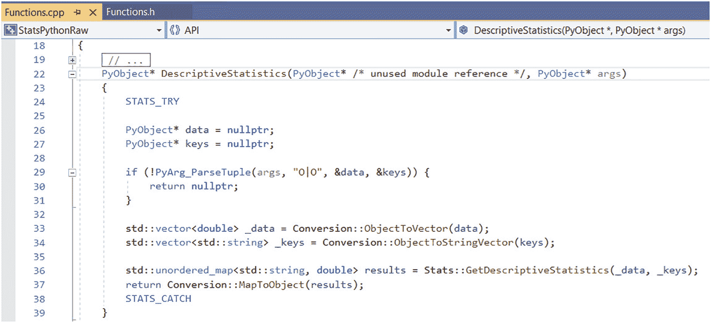
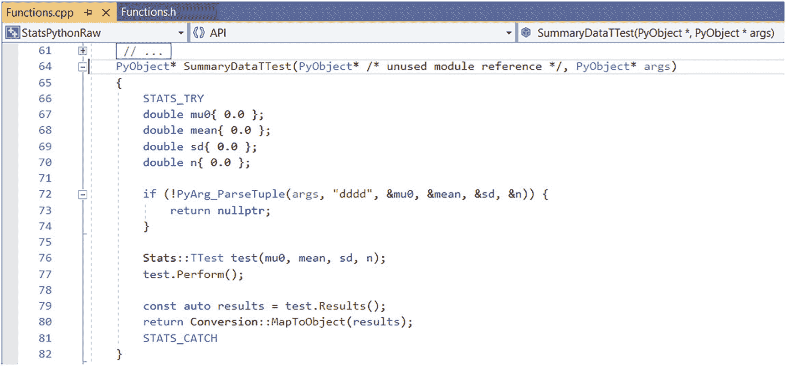
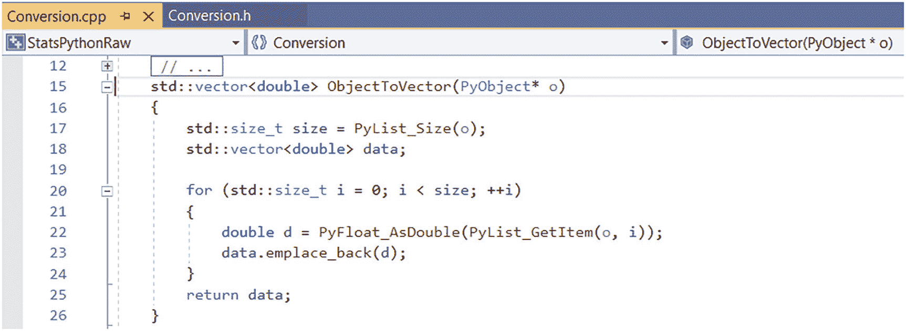
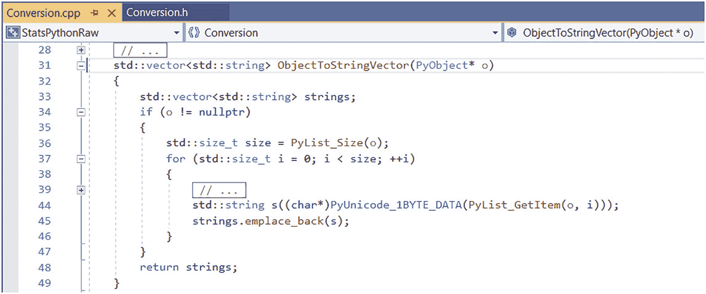
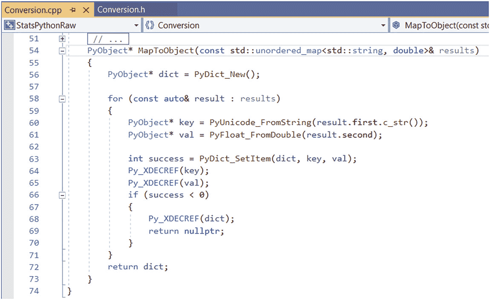
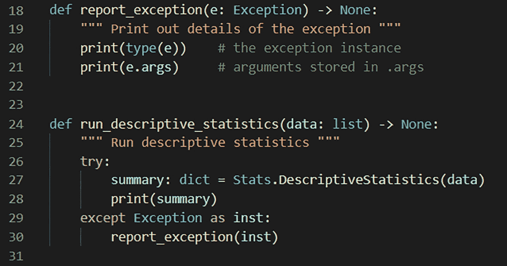
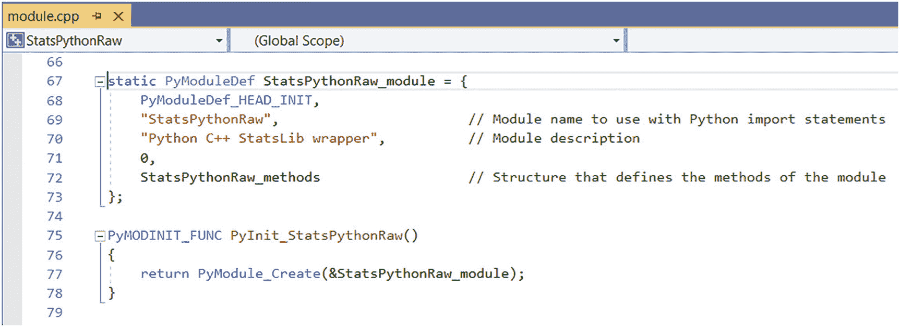
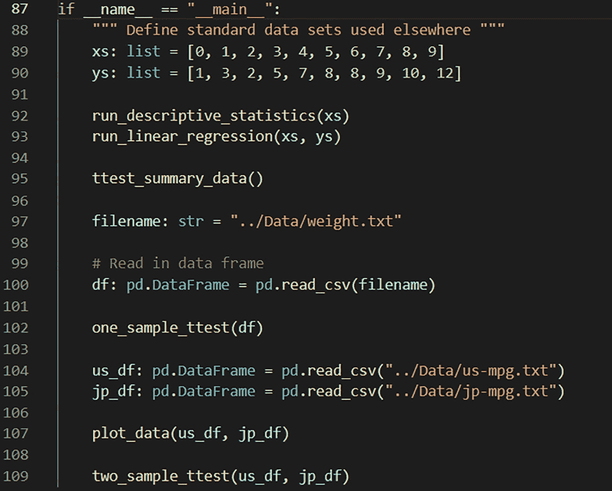
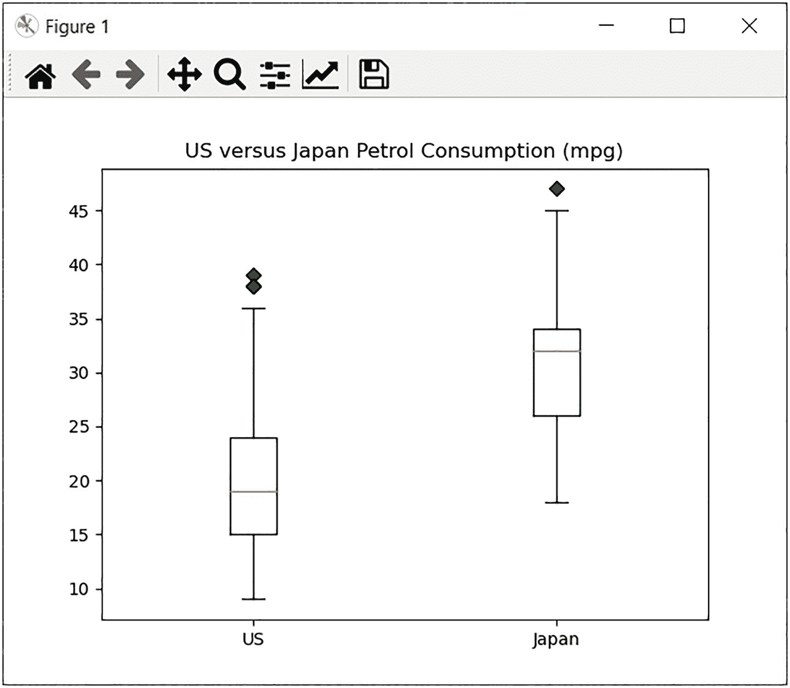

# 七、构建 Python 扩展模块

## 介绍

在这一章和下一章中，我们将着眼于构建 Python 扩展模块。这些是将 C/C++ 连接到 Python 的组件。Python 已经存在很长时间了，多年来，已经开发了许多不同的方法来实现这一点。表 7-1 列出了一些方法。

表 7-1

将 C/C++ 连接到 Python 的方法 <sup>1</sup>

<colgroup><col class="tcol1 align-left"> <col class="tcol2 align-left"> <col class="tcol3 align-left"></colgroup> 
| 

方法

 | 

过时的

 | 

代表性用户

 |
| --- | --- | --- |
| 【CPython 的 C/C++ 扩展模块 | One thousand nine hundred and ninety-one | 标准程序库 |
| *PyBind11(推荐用于 C++)* | Two thousand and fifteen |   |
| Cython(建议用于 C) | Two thousand and seven | 盖文，基维 |
| 持有期收益率 | Two thousand and nineteen |   |
| mypyc | Two thousand and seventeen |   |
| ctypes(类型) | Two thousand and three | oscrypto |
| 财务信息管理系统 | Two thousand and thirteen | 密码学，pypy |
| 大喝 | One thousand nine hundred and ninety-six | 你们这些混蛋 |
| *助推。Python* | Two thousand and two |   |
| cppyy | Two thousand and seventeen |   |

在本章和接下来的章节中，我们将重点介绍三种主要的方法。这些在表 7-1 中突出显示。在本章中，我们从一个使用 CPython 的“原始”Python 项目开始。这是有教育意义的。我们将看到如何从头开始建立一个 Python 扩展模块项目，以及如何从我们的小型统计库中公开功能。这让我们有机会了解模块是如何定义的，以及`PyObject`是如何在转换层中使用的。它还说明了低级方法的一些困难。第章第 8 关注助推。Python 然后是 PyBind。这两个框架都提供了有用的工具，克服了我们在编写 CPython 扩展模块时面临的一些问题。我们还将研究如何公开类和函数。最后，我们使用我们构建的模块来说明检查对象和测量性能以及其他事情。

## 先决条件

对于本章和下一章，主要的先决条件是 Python 安装( [`www.python.org/downloads/`](http://www.python.org/downloads/) )。对于这本书，我们使用 Python 3.8(这个项目开始时可用的最新版本)。除了 Python 的版本，我们还需要了解构建环境。在下一章中，我们将需要 Boost。Python 和 Boost。Python 库需要针对这个相同版本的 Python 来构建。

### 使用 Visual Studio 社区版 2019

在同一个解决方案中，使用 Visual Studio 管理 C++ 项目(我们这样做)和 Python 项目(我们不这样做)是完全可能的。这样做的好处是，您可以在开发 C++ 组件的同一环境中调试 Python 脚本。然而，这种设置有一个缺点。它将我们与 Visual Studio Community Edition 2019 针对的 Python 版本(目前为 Python 3.7)联系起来。而这反过来又会导致 Python、Boost 版本的不一致。Python 和 C++ 项目。为了开发 Python 模块，我们确实需要将 Python (3.8)版本和 Boost 库的 Boost 发行版结合起来。Python(使用 Python 3.8 构建)。

因此，这里的建议是将两个开发领域分开。我们对 C++ 包装器组件使用 Visual Studio Community Edition 2019，对 Python 项目和脚本使用 VSCode。这意味着我们可以方便地使用 MSBuild 编译扩展模块，而不必编写自己的安装和构建脚本。这种方法的优点是使调试稍微容易一些，尽管不如使用完全混合模式调试那样无缝。

## StatsPythonRaw

我们的第一个扩展模块是一个名为 StatsPythonRaw 的“原始”Python 项目。我们首先看看项目设置，然后看看代码是如何组织的。在此过程中，我们将研究如何公开底层统计库的函数以及类型转换层。我们还处理异常处理。在最后一节中，我们将练习 Python 客户机的功能，并研究如何调试扩展模块。

### 项目设置

StatsPythonRaw 是作为 Windows 动态链接库(DLL)项目创建的。该项目引用 StatsLib 静态库。表 7-2 总结了项目设置。

表 7-2

StatsPythonRaw 的项目设置

<colgroup><col class="tcol1 align-left"> <col class="tcol2 align-left"> <col class="tcol3 align-left"></colgroup> 
| 

标签

 | 

财产

 | 

价值

 |
| --- | --- | --- |
| 一般 | C++ 语言标准 | ISO C++17 标准版(/std:c++17) |
| 先进的 | 目标文件扩展名 | *。pyd* |
| C/C++ >常规 | 其他包含目录 | *<用户\用户>\蟒蛇 3 \包含**$(解决方案目录)通用\包含* |
| 链接器>常规 | 附加库目录 | *<用户\用户> \Anaconda3\libs* |
| 生成事件>后期生成事件 | 命令行 | 请参见下文 |

以下几点值得注意。首先，我们将目标输出从 *dll* 改为 *pyd* 。这表明输出是一个 Python 扩展库。其次，我们需要注意 Python 安装的位置。在附加的包含目录中，我们引用了可以找到 *Python.h* 的 *\include* 目录。在附加的库目录中，我们引用了 *\libs* 目录(而不是 *\Lib* 或 *\Library* ，它们也存在于 Python 发行版中)。这就是可以找到 *python38.lib* 的地方。最后，我们将*statspithonraw . pyd*模块复制到 Python 脚本( **)所在的目录中。py* )导入它所在的位置。我们在后期构建步骤中使用以下脚本:

```cpp
del "$(SolutionDir)StatsPython\$(TargetName).pyd"
copy /Y "$(OutDir)$(TargetName)$(TargetExt)" "$(SolutionDir)StatsPython\$(TargetName)$(TargetExt)"

```

这简化了 Python 的设置。通过将 *pyd* 文件复制到脚本将要执行的位置，我们避免了必须调用 *setup.py* 来将 Python 模块安装到 Python 环境中。在生产场景中，这是必需的。然而，为了便于说明，我们走这条捷径。

### 代码组织

在 StatsPythonRaw 项目下，代码被组织成三个主要区域:我们想要公开的函数(*functions . h/functions . CPP*)、转换层(*conversion . h/conversion . CPP*)以及我们正在构建的扩展模块( *module.cpp* )。我们将依次处理这些问题。

### 功能

#### 声明

在文件 *Functions.h* 中，我们声明了用于公开底层功能的包装函数。为了方便起见，我们将所有函数放在一个名为`API`的名称空间中。清单 7-1 再现了完整的声明。

```cpp
-

Listing 7-1Declaration of the wrapper functions we want to expose

```


在清单 7-1 中，文件顶部的预处理宏很重要。Python 文档(参见附加参考资料部分)建议我们在包含任何标准库头文件之前使用`#define PY_SSIZE_T_CLEAN`。例如，当使用有大小的对象、列表和数组时，宏指的是 size 变量的类型。如果定义了宏，那么大小类型是`Py_ssize_t`，否则大小类型是`int`。接下来，我们有一些构建指令。我们希望能够构建这个扩展模块的调试和发布版本。但是，我们不想链接调试版本的 Python 库，因为我们还没有安装它们。如果没有这个预处理器指令，当我们构建 StatsPythonRaw 的调试版本时，链接器将试图链接到 *python38_d.lib* 。因为我们没有这个，所以会产生一个构建错误。所以，我们被要求`UNDEF`对准`_DEBUG`符号。如果您下载并安装 Python 调试库，您可以删除它。最后，`#include <Python.h>`引入 Python API。

在`API`名称空间中，所有的 C++ 包装函数都返回一个`PyObject`指针。这可以被认为是一个不透明的类型或句柄。通常，Python 运行时将参数作为`PyObject`传递给我们，然后我们需要解释这些参数。当我们从函数返回时，我们需要将`PyObject`返回到 Python 运行时。具体来说，从清单 7-1 中我们可以看到，包装函数总是接受两个`PyObject`参数，习惯上称为`self`和`args`。`self`参数指向模块级函数的模块对象(这里就是这种情况)；对于类方法，它指向对象实例(即调用调用的对象)。我们在这个项目中不使用这个论点，所以我们忽略它。对于`args`参数，我们区分两种情况。对于只有一个参数的函数，这将直接在 Python 对象中传递。在函数有多个参数的情况下，`args`参数指向一个`tuple`对象。`tuple`的每一项对应调用的参数列表中的一个参数。我们将在本章后面讨论如何解释`tuple`。

#### 描述统计学

看了函数声明之后，我们现在来看函数定义。我们从想要公开的最简单的函数开始。在底层 C++ 库中，函数`GetDescriptiveStatistics`(在 *\StatsLib\Stats.h* 中)被声明为接受两个参数，其中第二个是可选的。我们想从 Python 中调用这个函数，如清单 7-2 所示。

```cpp
-

Listing 7-2Calling the DescriptiveStatistics function from Python

```


从清单 7-2 ，即交互式 Python 会话，我们可以看到，我们首先用一个参数(`data`)调用函数，然后用两个参数(`data`、`keys`)。清单 7-3 显示了相应的 C++ 包装函数定义。

```cpp
-

Listing 7-3The definition of the DescriptiveStatistics function

```



该函数的结构很简单。第一部分涉及从`args`元组中提取`PyObject`指针。第二部分包括为底层 C++ 层翻译这些并返回结果。Python API 中的函数`PyArg_ParseTuple`检查参数类型，并将它们转换成 C/C++ 值。它使用一个模板字符串来确定所需的参数类型以及存储转换值的 C/C++ 变量的类型。模板字符串决定了元组如何解包它的参数。在这种情况下，我们告诉它有两个`PyObject`指针，这是由`O`(大写字母)表示的。分隔`"O|O"`字符串的“`|`表示第二个参数是可选的。稍后，我们将看到更多使用模板字符串的例子。下面的列表总结了模板字符串中使用的一些更常见的参数类型。

<colgroup><col class="tcol1 align-center"> <col class="tcol2 align-left"></colgroup> 
| 

**字符串**

 | 

**转换**

 |
| --- | --- |
| “我” | 将 Python 整数转换成`int`。 |
| " l " | 将 Python 整数转换成`long`。 |
| " d " | 将一个 Python 浮点数转换成一个`double`。 |
| “哦” | 在一个`PyObject`指针中存储一个 Python 对象。 |

模板字符串中参数类型及其用法的完整列表如下: [`https://docs.python.org/3/c-api/arg.html`](https://docs.python.org/3/c-api/arg.html) 。

在这种情况下，正如我们所说的，两个参数都是 Python 对象。为了对它们做任何事情，我们的函数必须将它们转换成 C/C++ 类型。这里，使用函数`ObjectToVector`将第一个参数转换为`std::vector<double>`。类似地，我们使用`ObjectToStringVector`将第二个参数从`PyObject`转换为`std::vector<std::string>`。转换后的对象(`_data`、`_keys`)被传递给本机 C++ 函数，结果被打包为`std::unordered_map`中的键值对返回。这些然后被转换回一个指向`PyObject`的指针，并返回给调用者。

#### 线性回归

在更详细地查看转换函数之前，我们先来看看更多我们想要公开的函数。清单 7-4 显示了`LinearRegression`的包装函数。

```cpp
-

Listing 7-4The wrapper function for LinearRegression

```


我们可以在清单 7-4 中看到，这个函数遵循与我们之前看到的`DescriptiveStatistics`函数相似的结构。然而，在这种情况下，`args`参数包含两个非可选项目。因此，模板字符串是`"OO"`。这些代表执行操作所需的两个数据集。在调用原生 C++ 函数之前，我们需要将`args`元组解包成有效的`PyObject`、`xs`和`ys`。然后我们需要将每一项转换成适当的 C++ 类型。一旦完成，我们调用底层的 C++ 函数并返回结果。

#### 统计测试

对于统计测试函数，我们以与前面相同的方式构造函数。然而，在这种情况下，包装函数在堆栈上创建了一个`TTest`类的实例。为此，它需要将参数传递给相应的构造函数。清单 7-5 中显示了一个这样的例子。

```cpp
-

Listing 7-5The SummaryDataTTest wrapper function

```



到目前为止，我们已经看到了`PyObject* args`元组被传入`PyArg_ParseTuple`，参数被提取为`PyObjects`。然而，在清单 7-5 中，我们利用了标准转换。来自样本数据构造器的 t-test 需要四个`double`。因此，我们使用带有模板字符串`"dddd"`的`PyArg_ParseTuple`来解包`args`元组，以表示四个双精度值。因为这些是内置类型，函数`PyArg_ParseTuple`隐式地转换它们。无需进一步转换。然后，该函数继续创建`TTest`实例，并调用`Perform`进行计算，然后调用`Results`获得结果包。然后将它转换回 Python 字典。

`OneSampleTTest`和`TwoSampleTTest`的处理方式相似。`OneSampleTTest`如清单 7-6 所示。

```cpp
-

Listing 7-6The OneSampleTTest wrapper function

```


从清单 7-6 和之前的清单中，我们可以看到函数`OneSampleTTest`和`TwoSampleTTest`的相似结构。我们首先声明我们期望从`args`中得到的类型。然后我们使用带有适当模板字符串的`PyArg_ParseTuple`将参数解包成内置类型或`PyObject`指针。然后，在将结果返回给 Python 之前，我们进行所需的任何进一步的转换。在`OneSampleTTest`的情况下，模板字符串是`"dO"`，表示第一个参数是 double，第二个参数是`PyObject`。因此，我们对第一个参数(`double mu0`)使用标准转换，并将第二个参数解包为一个`PyObject`指针，然后它被转换为一个`std::vector<double>`，如我们之前所见。

### 转换层

我们已经看到，对于内置类型(`bool`、`int`、`double,`等)。)，我们不需要做什么特别的事情。转换由`PyArg_ParseTuple`使用适当的模板字符串参数来处理。对于 STL 类型，转换层(*conversion . h/conversion . CPP*)为类型转换逻辑提供了一个中心位置。只有三个功能。一个用于将代表 Python 的`PyObject`转换为`std::vector<double>`。第二个函数是将代表 Python 字符串的`PyObject`转换成`std::vector<std::string>`。最后，我们有一个函数将结果(字符串键和数值的无序映射)转换成一个`PyObject`指针。清单 7-7 显示了`ObjectToVector`功能。

```cpp
-

Listing 7-7Converting a PyObject to a std::vector<double>

```



查看清单 7-7 中的代码，我们看到从 Python 对象到 STL 类型的转换非常简单。我们期望来自 Python 的参数是一个`list`，所以我们需要使用`PyList_xxx`函数。首先，我们获取输入列表的大小，然后使用 for 循环提取每一项。我们使用函数`PyList_GetItem`来检索索引数据项，并根据需要将其从 Python 编号转换为`double` ( `PyFloat_AsDouble`)。然后将其放入`std::vector<double>`中。当循环完成时，数据被返回给调用者。

清单 7-8 显示了三个函数中的第二个，`ObjectToStringVector`。

```cpp
-

Listing 7-8The ObjectToStringVector function

```



清单 7-8 中显示的`ObjectToStringVector`函数将 Python 列表转换为字符串向量。我们可以看到这和前面的函数类似。在这种情况下，我们首先检查输入对象是否有效。我们知道这里的`PyObject`代表一个可选参数，所以参数有可能是 null。在前一种情况下，如果不提供参数，函数`PyArg_ParseTuple`就会失败，所以检查是多余的。然而，我们应该意识到，如果我们扩展了`ObjectToVector`函数的用法(特别是允许可选数据)，那么我们需要改变这一点。检查之后，我们继续从列表中提取有效的`PyObject`。这种情况下的不同之处在于，我们需要将其转换为字符串。为了简单起见，我们不检查 Python 字符串是 Unicode UTF-8 还是 UTF-16。我们简单地假设 UTF-8 并使用 Python 函数`PyUnicode_1BYTE_DATA`将字符串转换成`char*`，然后在`std::string`的构造函数中使用它。执行转换的一种更健壮的方法是检查各种可能的 Python 类型，并相应地处理这些情况。以一种通用的方式处理字符串，并在一个跨平台的环境中工作，这是一个非常大的话题，超出了本章的范围。

清单 7-9 展示了最后一个函数`MapToObject`，它将结果地图转换为 Python 字典。

```cpp
-

Listing 7-9Converting the underlying results package to a Python dictionary

```



正如我们在清单 7-9 中看到的，`MapToObject`函数比以前稍微复杂一些。在这种情况下，我们将对结果图的引用作为输入。代码做的第一件事是创建一个新的 Python 字典。然后，我们迭代结果项，并将每个项插入字典中。密钥是字符串，所以我们使用`PyUnicode_FromString`来执行转换。为了获得该值，我们使用`PyFloat_FromDouble`(就像我们之前做的那样)。最后，我们将提取的键值对设置为一个字典项，并检查这是否成功。在这种情况下，我们需要减少键和值的引用计数，因为我们不再使用`PyObject`引用。我们使用`Py_XDECREF`宏，它允许对象为空，而不是`Py_DECREF`。如果`PyDict_SetItem`没有成功，我们还需要减少字典的引用计数，并返回`nullptr`以向 Python 运行时指示失败。

这个上下文中的引用计数非常复杂，但是为了避免 Python 的内存泄漏，引用计数是必需的。但是，对引用计数的全面讨论超出了本章的范围。Python 文档包含关于该主题的有用部分。

现在很清楚，转换层可以做得更通用，从而得到改进。我们的三个转换函数完全特定于底层原生 C++ 层的需求。如果能对一些代码进行一般化就好了。特别是，使用 RAII(资源获取是初始化)来管理引用计数似乎是一种有用的方法。此外，处理默认参数以及在标准库容器和模板之间进行转换也是有益的。虽然这可能很诱人，但在 C++ 和 Python 之间编写一个“通用”转换层可能很难做到，而且实现起来很耗时。附加资源部分提供了许多关于这些主题的参考资料。幸运的是，正如我们将在下一章看到的，两者都有所促进。Python 和 PyBind 在这方面做得非常出色。

### 错误处理

我们知道 StatsLib 抛出异常。如果我们不处理这些，有可能从 Python 脚本中，我们只是终止了 Python 外壳。这不一定是我们想要的。因此，和以前一样，我们使用代码将`STATS_TRY/STATS_CATCH`宏封装到函数调用中，将`std::exception`转换成 Python 可以解释的信息字符串。

`STATS_TRY/STATS_CATCH`宏的定义如清单 7-10 所示。

```cpp
-

Listing 7-10Handling exceptions

```


在清单 7-10 中，在一个异常被抛出后，我们首先使用`PyErr_SetString`函数指出一个错误情况。根据文档，传递给这个函数的对象不需要`Py_DECREF`([`https://docs.python.org/3/extending/extending.html#refcounts`](https://docs.python.org/3/extending/extending.html%2523refcounts))。第一个参数是 Python 异常对象，第二个是来自 C++ 函数的信息字符串。第二阶段是通过返回`nullptr`来指示失败。如果我们想更进一步，我们可以为这个模块创建一个标准的异常，或者我们可以用一个自定义类来扩展异常处理。然而，对异常处理主题的全面讨论超出了本章的范围。附加资源部分提供了更多的参考资料。

既然我们在 C++ 层处理异常，我们可以在 Python 脚本中添加等效的异常处理。例如，我们将`DescriptiveStatistics`函数包装在`try/except`块中，并报告任何异常。报告异常后，代码继续正常执行。清单 7-11 显示了代码。

```cpp
-

Listing 7-11Reporting exceptions from Python

```



清单 7-11 中的代码很简单。我们接受包装函数抛出的异常，并输出信息字符串。一个典型的交互式会话展示了这种情况是如何出现的:

```cpp
>>> import StatsPythonRaw as Stats
>>> data = []
>>> print(Stats.DescriptiveStatistics(data))
Traceback (most recent call last):
  File "<stdin>", line 1, in <module>
RuntimeError: Insufficient data to perform the operation.

```

正如我们所看到的，我们捕获并报告 C++ 异常，并将其返回给 Python，在 Python 中我们可以继续交互会话。

### 模块定义

到目前为止，我们已经讨论了调用函数和类型转换。Python 扩展模块组件需要的最后一部分是模块定义。代码位于 *module.cpp* 中。代码由三个主要部分组成:导出函数、模块定义和初始化函数。我们将依次了解每一项。清单 7-12 显示了导出的函数。

```cpp
-

Listing 7-12Exporting functions from the module

```


导出的函数(列表 7-12 )在一个`struct`中定义，它包含一个我们想要导出的函数数组。参数很简单。第一个参数是向 Python 公开的函数的名称。第二个参数是实现它的函数。该功能必须符合`typedef`:

```cpp
typedef PyObject *(*PyCFunction)(PyObject *, PyObject *)

```

这声明了一个函数，它将两个`PyObject`指针作为参数，并返回一个`PyObject`指针。这对应于我们如何声明我们的函数(参见清单 7-1 )。第三个参数是描述函数所期望的`args`的`METH_xxx`标志的组合。对于单参数函数，我们将使用`METH_O`。这意味着该函数只接受一个`PyObject`参数。采用`METH_O`的函数直接在`args`参数中传递`PyObject`。所以，没必要用`PyArg_ParseTuple`。`METH_VARARGS`表示函数接受可变数量的参数，这些参数需要由`PyArg_ParseTuple`解包。最后一个参数是 Python docstring 属性(`__doc__`)，也可以是一个`nullptr`。

导出的函数列表后面是模块定义结构，如清单 7-13 所示。

```cpp
-

Listing 7-13The module definition structure

```



清单 7-13 所示的`PyModuleDef`结构定义了模块的结构。我们用符号`PyModuleDef_HEAD_INIT`初始化这个结构。接下来，我们提供用于 Python 导入语句的模块名，后面是模块描述。我们使用的最后一个参数是指向定义导出方法的结构的指针(清单 7-12 中定义的结构)。按照模块定义，我们用模块的名字定义函数`PyInit_StatsPythonRaw`。这与模块定义中声明的名称相匹配是很重要的(即*“statspithornaw”*)。Python 运行时环境将寻找这个函数来调用，以便在这个模块被`import`调用时执行这个模块的初始化。这就是这个组件。我们现在可以建造它。它应该不会出现警告或错误。输出文件(*statsphythonraw . pyd*)将被复制到 StatsPython 项目中，我们可以在 Python 脚本中导入它。

## Python 客户端

既然我们已经有了一个封装了本地 C++ 函数的 Python 扩展模块，我们就可以用我们选择的任何方式来使用它。我们可以推出一款 Jupyter 笔记本，并在另一个项目中使用我们的功能。或者作为对我们已经公开的函数的快速测试，我们也可以运行 Python 的 shell 并交互式地使用读取-评估-打印循环(REPL)。清单 7-14 显示了一个小例子。

```cpp
-

Listing 7-14Performing a summary data t-test

```


正如我们从清单 7-14 中看到的，这提供了一种简单的方法来实现这些功能。作为一个稍微复杂一点的替代方案，我们可以使用脚本*statspithornaw . py*。这提供了更广泛的功能测试。该脚本定义了一个主函数，因此我们可以直接从命令提示符(`> python StatsPythonRaw.py`)运行它。例如，我们也可以直接在 Visual Studio 代码中打开它，并执行它(F5)。主要功能如清单 7-15 所示。

```cpp
-

Listing 7-15The main function exercising StatsPythonRaw

```



清单 7-15 中的脚本定义了我们在别处使用过的`xs`和`ys`数据集。我们将这些作为描述性统计和线性回归函数的输入。接下来，我们调用`ttest_summary_data`函数。代码的最后一部分使用 Pandas 将数据加载到数据框中。使用这些数据，我们进行了单样本 t 检验。最后，我们加载 *us-mpg* 和 *jp-mpg* 数据集。这些数据集与我们在 StatsViewer MFC 应用程序中使用的数据集相同。我们使用 matplotlib 可视化箱线图中均值的差异(图 7-1 )，之后我们执行双样本 t 检验。



图 7-1

对比美国和日本汽车汽油消耗的箱线图

### 排除故障

调试 Python 和 C++ 出人意料地简单。VSCode IDE 可以很好地处理 Python 调试。调试 C++ 代码只需在 VSCode 中的 Python 脚本中放置一个断点(Python 执行将在那里暂停),然后使用 Visual Studio(调试➤附加到进程...)附加到正确的 Python 托管进程(您可以使用*procexp64.exe*来轻松识别这一点)。然后，脚本将跳转到 C++ 代码中，在适当的位置中断(假设您正在调用 C++ 模块的调试版本)。从这里开始，您可以逐句通过 C++ 代码。这只是许多可能性中的一种。附加资源部分提供了更多的细节。

## 摘要

在本章中，我们从头开始构建了一个基本的 Python 模块。我们首先公开底层 StatsLib 中的函数，然后根据需要转换类型。最后，我们定义了模块。这可以被认为是我们公开的函数和参数的声明性描述(元数据)。在使用 Python 模块方面，我们创建了一个简单的脚本。除了练习一些功能，我们还演示了模块如何与 Pandas 和 matplotlib 互操作。

正如我们在本章的介绍中指出的，使用“原始”CPython 编写一个模块是有益的，因为它说明了使用低级方法将 C/C++ 连接到 Python 所涉及的一些困难。我们不得不编写特定的代码来处理我们需要的转换。此外，我们已经看到，每当我们与`PyObject` s 交互时，我们都需要注意引用计数。Python 和 PyBind 框架，看看这两者如何减轻我们在这里看到的困难。

### 额外资源

以下资源有助于了解本章所涵盖主题的更多信息:

*   所有与 Python 相关的东西，优秀的 Python 文档都可以在 [`https://docs.python.org/3/`](https://docs.python.org/3/) 找到。对编写扩展模块特别感兴趣的是关于用 C 或 C++ 扩展 Python 的部分。这个推荐: [`https://docs.python.org/3/extending/extending.html`](https://docs.python.org/3/extending/extending.html) 。有关构建和安装 Python 模块的更多信息，请参见 [`https://docs.python.org/3/extending/building.html#building`](https://docs.python.org/3/extending/building.html%2523building) 和 [`https://docs.python.org/3/extending/windows.html#building-on-windows`](https://docs.python.org/3/extending/windows.html%2523building-on-windows) 。

*   以下文档提供了与 Python 扩展模块相关的各种主题的宝贵信息: [`https://pythonextensionpatterns.readthedocs.io/_/downloads/en/latest/pdf/`](https://pythonextensionpatterns.readthedocs.io/_/downloads/en/latest/pdf/) 。此外，它涵盖了将字符串从 Python 转换为`std::string`的健壮方法。

*   这里讨论一般化类型转换层和提供健壮的生存期管理的方法: [`https://pythonextensionpatterns.readthedocs.io/en/latest/cpp_and_cpython.html`](https://pythonextensionpatterns.readthedocs.io/en/latest/cpp_and_cpython.html) 。其他方法的例子可以在 [`https://github.com/mfontanini/Programs-Scripts/blob/master/pywrapper/pywrapper.h`](https://github.com/mfontanini/Programs-Scripts/blob/master/pywrapper/pywrapper.h) 和 [`https://github.com/dubzzz/Py2Cpp/blob/master/src/py2cpp.hpp`](https://github.com/dubzzz/Py2Cpp/blob/master/src/py2cpp.hpp) 中找到。

*   在异常处理方面，这里描述了为一个模块创建一个标准异常类型的方法: [`https://docs.python.org/3/extending/extending.html`](https://docs.python.org/3/extending/extending.html) 。用自定义类扩展异常处理这里描述: [`https://pythonextensionpatterns.readthedocs.io/en/latest/exceptions.html`](https://pythonextensionpatterns.readthedocs.io/en/latest/exceptions.html) 。

*   在 Visual Studio 中调试混合模式 C/C++ Python 代码这里介绍: [`https://docs.microsoft.com/en-us/visualstudio/python/debugging-mixed-mode-c-cpp-python-in-visual-studio?view=vs-2019`](https://docs.microsoft.com/en-us/visualstudio/python/debugging-mixed-mode-c-cpp-python-in-visual-studio%253Fview%253Dvs-2019) 。

## 练习

本节中的练习通过我们的 CPython 扩展模块向 Python 展示新的 C++ 功能。

1)为 z 测试函数添加过程包装。这些函数应该与 t-test 函数几乎相同。不需要额外的转换函数，因此您可以用一种简单的方式来修改 t-test 函数。

*   在 *Functions.h，*中添加三个函数的声明:

    ```cpp
    // Wrapper function for a z-test with summary input data (no sample)
    PyObject* SummaryDataZTest(PyObject* /* unused module reference */, PyObject* args);

    // Wrapper function for a one-sample z-test with known population mean
    PyObject* OneSampleZTest(PyObject* /* unused module reference */, PyObject* args);

    // Wrapper function for a two-sample z-test
    PyObject* TwoSampleZTest(PyObject* /* unused module reference */, PyObject* args);

    ```

*   在 *Functions.cpp* 中，添加这些函数的实现。遵循 t-test 包装函数的代码。

*   在 *module.cpp* 中，向数组添加三个新函数:

    ```cpp
    static PyMethodDef StatsPythonRaw_methods[] =
    {
    //...
    }

    ```

*   构建 StatsPythonRaw。它的构建应该没有警告和错误。这些函数现在应该可以从 Python 中调用了。以交互方式尝试这些功能，例如:

    ```cpp
    >>> import StatsPythonRaw as Stats
    >>> results: dict = Stats.SummaryDataZTest(5, 6.7, 7.1, 29)
    >>> print(results)
    {'z': 1.2894056580462898, 'sx1': 7.1, 'pval': 0.19725709541241007, 'x1-bar': 6.7, 'n1': 29.0}

    ```

*   在 VSCode 中打开 StatsPython 项目。打开*statspithonraw . py*脚本。添加函数以使用我们之前使用的数据测试 z 测试函数。

2)添加一个过程包装函数来计算一个简单的`MovingAverage`。我们从之前的练习中知道，在处理时间序列移动平均函数时，我们需要添加一些转换函数。具体来说，在这个 Python 例子中，我们需要将一个`PyObject`转换成一个`long`的向量。此外，我们需要将来自`std::vector<double>`的结果转换成一个 Python `list`。

添加转换函数所需的步骤如下:

*   在 *Conversion.h，*中添加一个转换函数的声明:

    ```cpp
    std::vector<long> ObjectToLongVector(PyObject* o);

    ```

*   在 *Conversion.cpp 中，*添加实现。这类似于`ObjectToVector`，但是它使用`PyLong_AsLong`从`PyObject`中提取长值。

类似地，我们需要将结果(一个矢量`double` s)转换成一个 Python `list`。

*   在 *Conversion.h* 中，添加声明:

    ```cpp
    PyObject* VectorToObject(const std::vector<double>& results);

    ```

*   In *Conversion.cpp*, add the following implementation:

    ```cpp
    PyObject* VectorToObject(const std::vector<double>& results)
    {
        const std::size_t size = results.size();
        PyObject* list = PyList_New(size);

        for(std::size_t i = 0; i < size; ++i)
        {
            double d = results[i];
            int success = PyList_SetItem(list, i, Py_BuildValue("d", d));
            if (success < 0)
            {
                Py_XDECREF(list);
                return nullptr;
            }
        }
        return list;
    }

    ```

    在这种情况下，我们使用输入向量大小创建一个新的 Python `list`。为了设置列表项，我们使用了函数`PyList_SetItem`。我们使用模板字符串`"d"`(用于`double`)将便利函数`Py_BuildValue`返回的`PyObject`传递给它。

转换函数就绪后，编写包装函数。编写包装函数所需的步骤如下:

*   在 *Functions.h，*中增加一个声明:

    ```cpp
    PyObject* MovingAverage(PyObject* /* unused module reference */, PyObject* args);

    ```

*   在 *Functions.cpp* 中，有许多细节:
    *   将`#include "TimeSeries.h"`添加到文件的顶部。

    *   添加实现。该函数采用三个非可选参数。日期列表、观察列表和窗口大小。

    *   添加异常处理程序`STATS_TRY/STATS_CATCH`。

    *   声明输入参数:

        ```cpp
        PyObject* dates = nullptr;
        PyObject* observations = nullptr;
        long window{ 0 };

        ```

    *   用模板字符串`"OOl"`解析输入`args`。

    *   像以前一样转换输入以构建时间序列。

    *   使用`VectorToObject`转换功能返回结果。

*   Finally, in *module.cpp,* add the new function to the list of exposed functions:

    ```cpp
    {
        "MovingAverage",
        (PyCFunction)API::MovingAverage,
        METH_VARARGS,
        "Compute a simple moving average of size = window."
    },

    ```

    这就完成了为`MovingAverage`函数添加过程包装器的代码。

*   构建 StatsPythonRaw。它的构建应该没有警告和错误。

*   以交互方式尝试该功能，例如:

    ```cpp
    >>> import StatsPythonRaw as Stats
    >>> dates: list = list(range(1, 16))
    >>> observations: list = [1, 3, 5, 7, 8, 18, 4, 1, 4, 3, 5, 7, 5, 6, 7]
    >>> sma: list = Stats.MovingAverage(dates, observations, 3)
    >>> print(sma)

    ```

*   在 VSCode 中打开 StatsPython 项目。打开*statspithonraw . py 脚本*。添加一个函数来测试移动平均线，包括异常处理。运行脚本，并根据需要进行调试。

<aside aria-label="Footnotes" class="FootnoteSection" epub:type="footnotes">Footnotes 1

来源: [`https://docs.microsoft.com/en-us/visualstudio/python/working-with-c-cpp-python-in-visual-studio?view=vs-2019`](https://docs.microsoft.com/en-us/visualstudio/python/working-with-c-cpp-python-in-visual-studio%253Fview%253Dvs-2019) 。

 </aside>