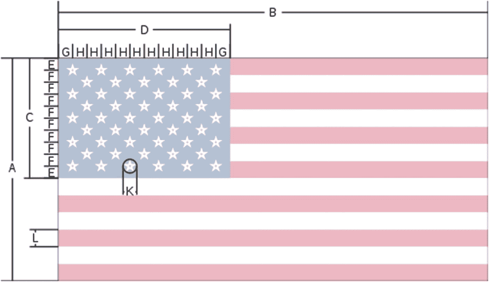
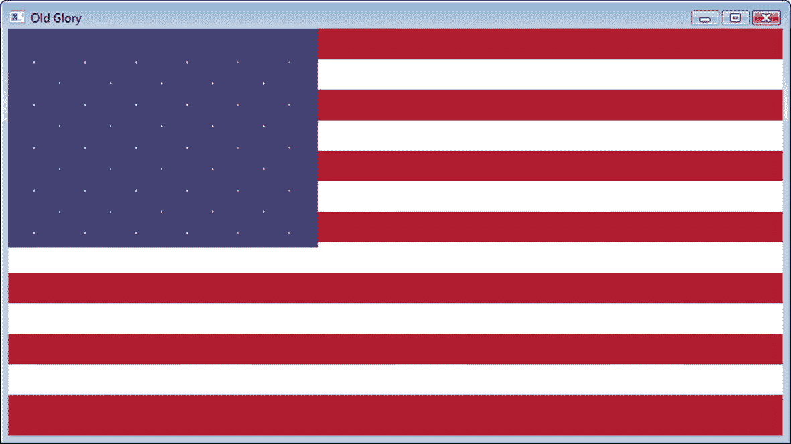
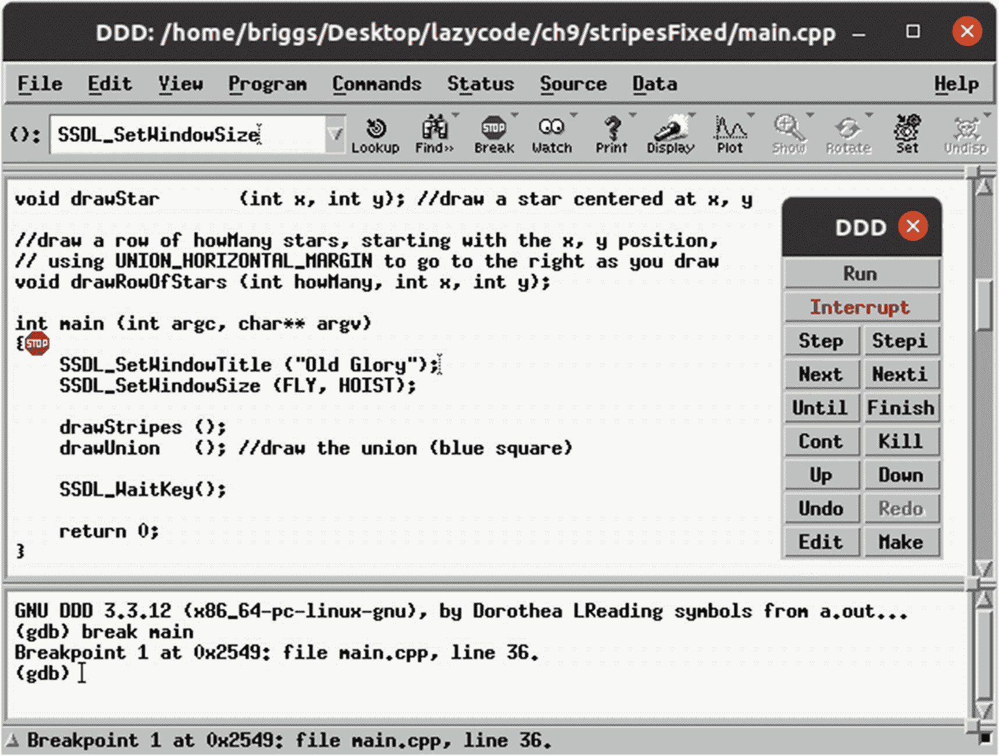
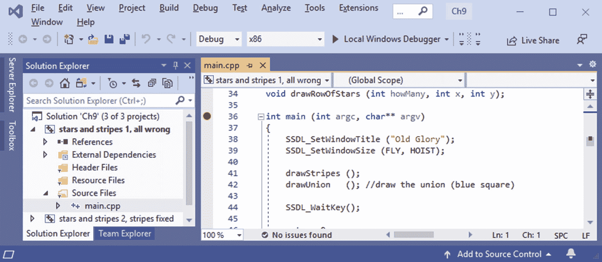
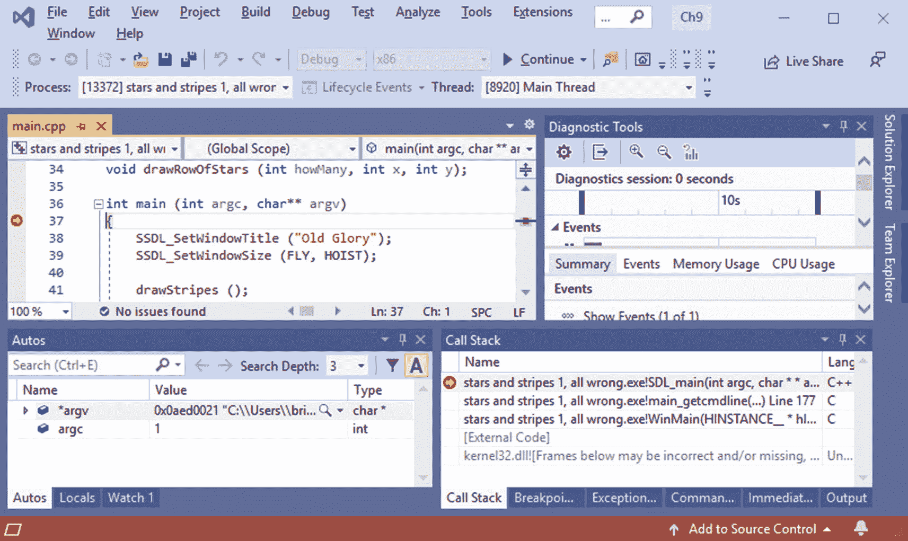
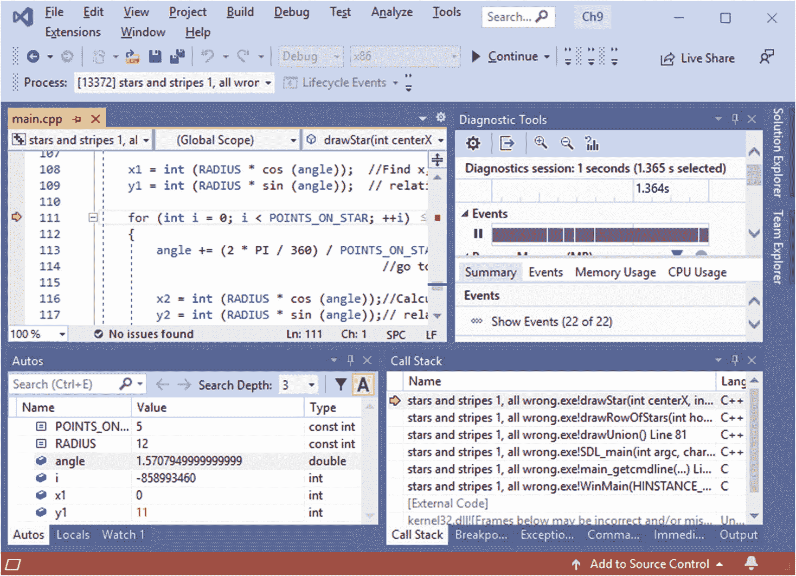
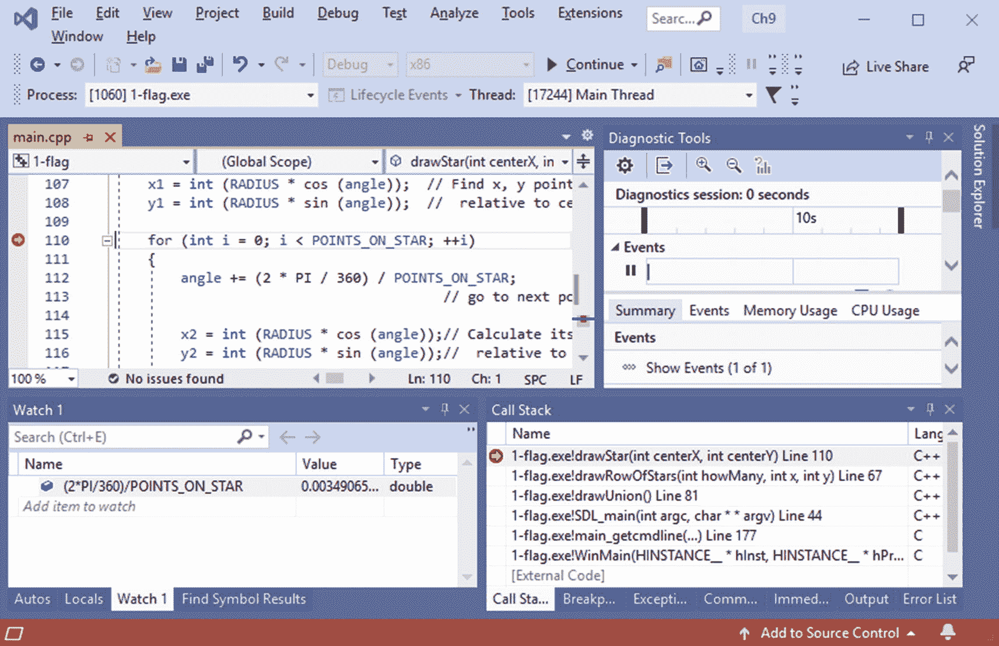
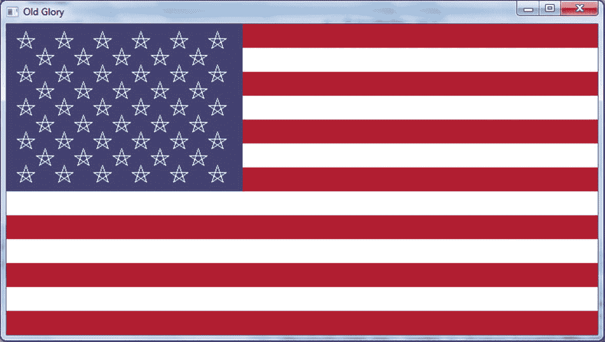
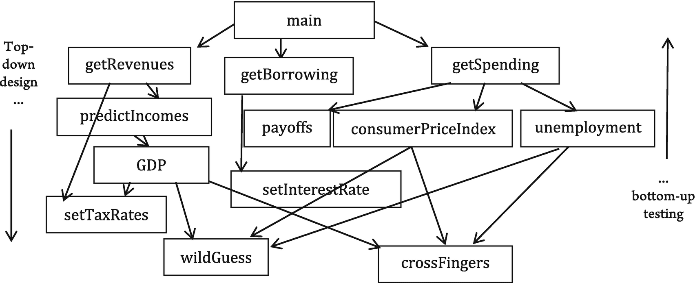

# 九、使用调试器

调试器可以让你一行一行或者一个函数一个函数地单步调试程序，查看变量值，这样你就可以判断出哪里出了问题。好主意，对吧？

我想是的。为了涵盖有用的调试器命令，让我们使用调试器来修复示例 [9-1](#PC1) 中有缺陷的程序。它打算画一面美国国旗:一种时髦的手工制作的版本，有空心的星星，如图所示。(为了做得更好，我们将使用文件中的图像——但是现在我想调试一个写星函数。)旗帜的设计如图 [9-1](#Fig1) 所示。



图 9-1

设计美国国旗

```cpp
// Program to draw Old Glory on the screen
//      -- from _C++20 for Lazy Programmers_

#include <cmath> // for sin, cos
#include "SSDL.h"

constexpr double PI = 3.14159;

// Dimensions1
constexpr int HOIST                   = 400; // My pick for flag width
                                             // Called "A" in Fig. 9-1
constexpr int FLY                     = int (HOIST * 1.9),    // B
              UNION_HOIST             = int (HOIST * 0.5385), // C
              UNION_FLY               = int (HOIST * 0.76);   // D

constexpr int UNION_VERTICAL_MARGIN   = int (HOIST * 0.054),  // E & F
              UNION_HORIZONTAL_MARGIN = int (HOIST * 0.063);  // G & H

constexpr int STAR_DIAMETER           = int (HOIST * 0.0616); // K

constexpr int STRIPE_WIDTH            = HOIST/13;             // L

Example 9-1A buggy program to draw the US flag. Output is in Figure 9-2

```

```cpp
// Colors2
const SSDL_Color RED_FOR_US_FLAG    = SSDL_CreateColor (179, 25, 66);
const SSDL_Color BLUE_FOR_US_FLAG   = SSDL_CreateColor ( 10, 49, 97);

void drawStripes    ();             // the white and red stripes
void drawUnion      ();             // the blue square
void drawStar       (int x, int y); // draw a star centered at x, y

// draw a row of howMany stars, starting with the x, y position,
//   using UNION_HORIZONTAL_MARGIN to go to the right as you draw
void drawRowOfStars (int howMany, int x, int y);

int main (int argc, char** argv)
{
    SSDL_SetWindowTitle ("Old Glory");
    SSDL_SetWindowSize (FLY, HOIST);

    drawStripes ();
    drawUnion   (); // draw the union (blue square)

    SSDL_WaitKey();

    return 0;
}

void drawStripes ()
{
    SSDL_SetRenderDrawColor (RED_FOR_US_FLAG);
    SSDL_RenderFillRect (0, 0, FLY, HOIST); // first, a big red square

    // Starting with stripe 1, draw every other stripe WHITE
    SSDL_SetRenderDrawColor (WHITE);
    for (int stripe = 1; stripe < 13; stripe += 2)
        SSDL_RenderFillRect (0, stripe*STRIPE_WIDTH,
                             FLY, STRIPE_WIDTH);
}

void drawRowOfStars (int howMany, int x, int y)
// draw a row of howMany stars, starting with the x, y position,
//   using UNION_HORIZONTAL_MARGIN to go to the right as you draw
{
    for (int i = 0; i < howMany; ++i)
    {

        drawStar (x, y); x += 2*UNION_HORIZONTAL_MARGIN;
    }
}

void drawUnion ()
{
    // draw the blue box
    SSDL_SetRenderDrawColor (BLUE_FOR_US_FLAG);
    SSDL_RenderFillRect (0, 0, UNION_FLY, UNION_HOIST);

    SSDL_SetRenderDrawColor (WHITE);
    int row = 1;  // What's the current row of stars?
    for (int i = 0; i < 4; ++i) // Need 4 pairs of 6- and 5-star rows
    {
        drawRowOfStars (6, UNION_HORIZONTAL_MARGIN,
                        row*UNION_VERTICAL_MARGIN);
        ++row;

        // Every 2nd row is staggered right slightly

        drawRowOfStars (5, 2*UNION_HORIZONTAL_MARGIN,
                        row*UNION_VERTICAL_MARGIN);
        ++row;
    }
    // ...and one final 6-star row
    drawRowOfStars (6, UNION_HORIZONTAL_MARGIN,
                    row*UNION_VERTICAL_MARGIN);
}

void drawStar (int centerX, int centerY)
{
    constexpr int RADIUS         = STAR_DIAMETER/2,
                  POINTS_ON_STAR = 5;

    int x1, y1, x2, y2;
    double angle = PI/2;    // 90 degrees: straight up vertically
                            // 90 degrees is PI/2 radians

    x1 = int (RADIUS * cos (angle));  // Find x, y point at this angle
    y1 = int (RADIUS * sin (angle));  //  relative to center

    for (int i = 0; i < POINTS_ON_STAR; ++i)
    {
        angle += (2 * PI / 360) / POINTS_ON_STAR;
                                        // go to next point on star

        x2 = int (RADIUS * cos (angle));// Calculate its x,y point
        y2 = int (RADIUS * sin (angle));//  relative to center

        SSDL_RenderDrawLine (centerX+x1, centerY+y1,
                             centerX+x2, centerY+y2);

        x1 = x2;                        // Remember the new point
        y1 = y2;                        //   for the next line
    }
}

```

图 9-2 向我们展示了:本来可以做得更好。星星是几乎看不见的点。甚至条纹也脱落了:注意蓝色的联合广场与中间的红色条纹不一致，底部的条纹太大。



图 9-2

有问题的美国国旗

您将使用什么调试器？如果你用的是微软的 Visual Studio，它是内置的。对于 Unix，我推荐使用`ddd`，一个友好的、免费的图形界面给`gdb`调试器。MinGW 在这一点上不支持`ddd`，所以我推荐`gdb`本身:基于文本但标准且免费。

当你阅读接下来的章节时……如果你自己做，最容易记住事情，所以我强烈建议你从本书的示例代码(`ch9/1-flag`)中加载这个程序，然后跟着做，做和书中一样的事情。

## 断点和监视的变量

让我们从检查尺寸开始，看看为什么条纹不对齐。什么维度？`STRIPE_WIDTH`似乎相关！蓝色方块的高度`UNION_HOIST`和整个物体的高度`HOIST`也是如此。

### `ddd`

要在 Unix 中用`ddd`调试程序`a.out`，请转到它的文件夹并键入`./dddx`。如果没有`dddx`，从你一直使用的`basicSSDLProject`文件夹中复制。

高亮显示`main`。(如果您没有看到任何代码，请查看反欺诈部分。)在控件的顶行，找到标有“Break”的停止标志图标；点击那个。一个停止标志出现在这条线上，意味着程序运行到这里就停止了。您应该会看到类似图 [9-3](#Fig3) 的内容。

在带有`(gdb)`提示符的底部窗口中，应该会出现命令`break main`。`ddd`是一个训练轮子界面，总是告诉你刚刚选择了什么`gdb`命令。这样你可以边走边学`gdb`。



图 9-3

`gdb`调试器的`ddd`接口

要运行，单击右侧菜单上的 run 或在`(gdb)`提示符下键入`run`。`print STRIPE_WIDTH`等等，得到`STRIPE_WIDTH`、`HOIST`和`UNION_HOIST`的值。

单击断点可能会将其删除。如果没有，`delete <breakpoint number>`。断点编号见`gdb`窗口。要退出，输入`quit`。

### `gdb`

转到程序的文件夹，键入`./gdbx` (Unix)或`bash gdbw` (MinGW)。

为了让程序停在第一行，我输入`break main` (Unix)或`break` `SDL_main` (MinGW)。当我运行这个程序时，它会在这里中断，我可以检查这些值。

要启动程序，请键入`run`。要查看这些值，请键入`print` : `print STRIPE_WIDTH`、`print HOIST`和`print UNION_HOIST`。

要结束`gdb`，请键入`quit`。

### 可视化工作室

确保在调试模式下编译。您应该在菜单栏下方的顶部附近看到 Debug，而不是 Release(参见图 [9-4](#Fig4) )。否则，调试器命令将不起作用。

点击`main`左侧的灰白色条；一种红色停车标志出现，如图 [9-4](#Fig4) 所示。(好吧，是红点。但是“停车标志”更容易记住。)



图 9-4

在 Microsoft Visual Studio 中设置断点

像往常一样启动程序。

Visual Studio 不喜欢我的断点在哪里，所以它把它向下移动了一行(图 [9-5](#Fig5) )。没问题。黄色箭头表示“这一行是下一个。”它即将开始`main`，所以它已经完成了初始常量声明。让我们看看它制造了什么。



图 9-5

在 Microsoft Visual Studio 中启动调试器会话

在 Visual Studio 窗口的左下角，您可能会看到一个带有汽车、局部变量等选项卡的窗口。(如果没有，请尝试使用菜单栏上的窗口➤重置窗口布局。)

汽车是 Visual Studio 认为您可能想看到的东西。这次错了。我不担心`argv`和`argc`。

局部变量是局部变量；我们没有。

Watch 1 是一个我们可以观察变量值的地方。单击该选项卡。你现在可以点击“名称”并给出你想看的东西的名称。试试`STRIPE_WIDTH`，然后是`UNION_HOIST`和`HOIST`。

这些是我们需要的数字。如果您愿意，可以再次单击断点将其删除，我们将继续。

## 修复条纹

现在我们有了数字；让我们来理解它们。

一个条纹应该是`HOIST`的十三分之一，也就是 400。400/13 是 30.76 几；作为一名 T2，他只有 30 岁。那个`UNION_HOIST`应该有七条条纹覆盖；条纹覆盖 7 * 30 = 210 像素，但是`UNION_HOIST`是`HOIST` * 7/13 = 215。

问题是我们在做整数除法，丢失了小数位。

让我们不要 400，而是能被 13 整除的数。`STRIPE_WIDTH`为 30；13 * 30 = 390.我们将相应地改变`HOIST`的初始化

```cpp
constexpr int HOIST = 390;  // My pick for flag width

```

再跑一次。条纹问题修复！

## 进入函数

明星问题需要进一步挖掘。因此，在`main`处恢复断点，并再次启动调试器。

### `ddd`

在右边的“DDD”菜单中，下一步将带您进入下一行，并单步执行一个函数。左边的箭头显示了将要执行的行。使用下一步转到`drawUnion`。到了那里，进入那个函数。

使用 Next 和 Step，进入`drawRowOfStars`，然后进入`drawStar`，直到到达 for 循环。

此时，找出变量是什么是有意义的。在数据菜单下，选择显示局部变量。您可能需要使数据区域可见:查看➤查看数据窗口。图 [9-6](#Fig6) 显示了结果。


图 9-6

在`ddd`中显示局部变量

看起来没有明显的问题。我们接着来看`SSDL_RenderDrawLine`。难道`angle`不应该改变更多吗？`print (2 * PI/360)/POINTS_ON_STAR`在`gdb`提示符下，看看你会得到什么。

### `gdb`

要在程序中更进一步，您可以键入`next`(或`n`)转到下一行，键入`step`(或`s)`进入一个函数。(回车重复最后一个命令。)随着你的进展，它会打印当前行，这样你就知道你在哪里了。使用这些命令进入`drawUnion`，然后通过`drawStar`，直到到达 for 循环。

你可能想放一个断点，以防你需要回到这一行。`break`将在当前行放置一个。`break drawStar`将在函数开始时中断。只是为了咧嘴笑，现在试试，然后输入`run`。然后`continue`，或`cont`或`c`，返回断点。

`delete <number of breakpoint>`删除断点；`delete`全部删除。

要打印本地变量，输入`info locals`。

看起来没有明显的问题。我们接着来看`SSDL_RenderDrawLine`。难道`angle`不应该改变更多吗？`print (2 * PI/360)/POINTS_ON_STAR`看看你得到了什么。

### 可视化工作室

查看“调试”菜单，您可以通过选择“单步调试”或在某些键盘上按下 F10-功能键-F10 来单步调试(执行)一行。当您这样做时，黄色箭头向下移动一行，执行该行。

当你下降到`drawUnion`时，你想让*进入*(F11/函数 F-11)那个函数。

使用 F10 和 F11，进入`drawRowOfStars`，然后进入`drawStar`，直到到达 for 循环，如图 [9-7](#Fig7) 。右下方的调用堆栈显示了您所在的函数(上面一行)以及您是如何到达那里的(下面一行)。



图 9-7

Microsoft Visual Studio 中的局部变量窗口

如果没有看到“局部变量”窗口，请单击“局部变量”选项卡。

看起来没有明显的问题。我们接着来看`SSDL_RenderDrawLine`。角度不应该改变更多吗？在 Watch 1 窗口中(见图 [9-8](#Fig8) ，输入或粘贴`(2 * PI/360)/POINTS_ON_STAR`。调试器将为您计算它。



图 9-8

Microsoft Visual Studio 中的 Watch 1 窗口

## 修理星星

本该带我们去星球上的下一个地方。圆的五分之一不是大于 0.00349 吗？应该是一个圆除以 5。那是 360 /5，或者用弧度表示，2π/5，但公式不是这么说的。看起来我把角度和弧度混淆了。这就是我们的问题，所以这里是我们的解决方案:

```cpp
angle += (2 * PI)/POINTS_ON_STAR;    // go to next point on star

```

当我们重新编译并运行时，我们得到一个标有五角星的旗帜。至少他们有五个面！

该程序告诉计算机绕圆走五步，每次画一条线，覆盖五分之一的距离。这不就是五边形，而不是星星的作用吗？

要画一颗星，不要画到圆的五分之一处。走五分之二的路。让我们试试:

```cpp
angle += 2*(2 * PI)/POINTS_ON_STAR; // go to next point on star,
                                    //    2/5 way around circle

```

现在星星在那里，但是颠倒了。我认为 90 度是垂直向上的，但是对于 SDL，我们有越来越大的 Y 向下的方向。这就是问题所在吗？我试着从-90 度开始，看看会发生什么:

```cpp
float angle = -PI/2;     // -90 degrees -- straight up vertically

```

结果如图 [9-9](#Fig9) 所示。好多了。



图 9-9

有真正星星的旗子

## 总结

有关常见调试器命令的摘要，请参见附录 g。

### 防错法

*   **(ddd/gdb)没有文件。也许你忘了** `make` **吧！或者你是为 Unix 做的，但正在用 MinGW 调试，或者相反。**

*   **(MinGW)上面说没有行号信息，所以不能说“下一个”**确保你一开始说的是`break SDL_main` **，**而不是`break main`。

*   它只是呆在那里，没有任何提示 **。**它可能正在等待输入。点击程序的窗口，给它所需要的。

*   你正在看一些不是你写的文件。是编译器的代码或者库的。

    Visual Studio:跳出(Shift-F11)您所在的函数，返回到您自己的代码。或者在代码中设置断点并继续(F5)。

    `ddd` / `gdb` : `up`带你上“调用栈”(被调用函数列表，从当前一个到`main`)；这样做足够多，看看你在你的代码的哪一部分。然后在你喜欢的地方设置一个断点，和`continue`。

Extra

GNU(“guh-NOO”)自由软件基金会( [`www.gnu.org`](http://www.gnu.org) )成立于 1984 年，为 Unix 操作系统提供自由软件。从那以后，它的使命扩大了，当人们想要自由分享他们的作品时，他们可以使用 GNU 公共许可证作为许可协议。

这就是我们如何不仅得到`ddd`和`gdb`而且得到`g++`、GIMP 和其他酷的东西。

GNU 经常给事物起一些搞笑的名字，GNU 本身也不例外。GNU 是首字母缩略词；它代表“GNU 不是 Unix”

## 自下而上测试

我们在第 7 章中看到了自顶向下的设计:从`main`开始，然后编写它调用的函数，然后是它们调用的函数*，直到完成。*

自底向上的测试是一个自然的推论。有时一次测试整个程序太难了。假设你正在用一个有许多函数的程序进行经济预测，如图 [9-10](#Fig10) 所示，其中`main`调用`getRevenues`、`getBorrowing`和`getSpending`，这些函数调用其他函数，一直到`wildGuess`、`crossFingers`等等。



图 9-10

一堆复杂的东西需要调试。`main`调用了三个函数`getRevenues`、`getBorrowing`和`getSpending`，它们还调用了许多其他函数

你运行这个程序，它会告诉你

```cpp
The nation will be bankrupt in -2 years.

```

那不可能是对的。但是哪个功能有问题呢？`main`？`consumerPriceIndex`？`wildGuess`？你不能从一个空的“-2！”

你需要知道你可以信任每一个函数。所以你拿最下面的(`wildGuess`和`crossFingers`)，不叫别人但是被叫的，测试一下，直到你有信心为止。

然后测试调用它们的和调用它们的…一直到`main`。

## 更多关于反欺诈的信息

这里有更多关于获得工作程序的提示。

*   **做好充足的备份** **。如果这是一个大的或者困难的项目，留下一条线索，这样如果有什么事情搞砸了，你可以回溯。**

*   保持函数模块化(无全局变量)。

*   **显示您需要的信息。**在前面的例子中，直到某个事件发生的年份的答案-2 显然是错误的，但在其他方面没有提供信息。

    The biggest problem in testing often is you just don’t know what values are in your variables. Here are two common fixes:
    *   **使用调试器**。

    *   使用大量的打印语句。如果一个变量有一个值，那么就在调试的时候，打印它——清楚地标记:not

        `sout << growthRate; // so 0.9 gets printed.`

        `// What does it mean?`

        但是

        `sout << "growthRate is " << growthRate << ".\n";`

        那就更长了，但总比努力记住数字的含义要好。盲目地去修复一个你无法识别的错误是一件很麻烦的事情。最好*看到*问题，这样你就可以解决它。

*   不要让它夺走你的 **进取心** **。在《禅宗与摩托车保养艺术》一书中，作者罗伯特·皮尔西格警告说，有些事情会消耗你的“进取心”，即你解决甚至专注于自行车问题的能力。或者你的论文。或者别的什么。**

    在编程中，你也会失去进取心。你刚刚发现了一个你以为已经解决的 bug，而这个程序在你修复它之前毫无用处，所以现在你太沮丧了，除了闷闷不乐什么也做不了。我去过那里。最近。

    有一次，我花了两个工作日的时间去寻找被证明是放错了位置的括号。那就是 *it* ？小括号？它们*很小，但却是个大问题，因为在它们修好之前我无法继续。*

    我只是说了声“咻！”然后进入下一个问题。

    如果你能在出现错误时暂停自我评估，回到问题上来，你就成功了。

*   如果你犯了愚蠢的错误…参见上面的“进取心”。愚蠢的错误是*最好的*类型，因为它们很容易修复。难的是微妙的。每个人都会犯愚蠢的错误。

*   如果你不擅长这个 …每个人一开始都会有这种感觉。我说了。你不会期望在几周的学习后就能流利地掌握一门新语言，C++ 比任何口头语言都酷。

*   快点做。想把事情做对，大概要先把事情做错。所以尽管做错吧。修复一个坏掉的程序比盯着屏幕直到有所启发要快得多。

Exercises

还没有练习，只是确保在后续章节中使用您选择的调试器！

<aside aria-label="Footnotes" class="FootnoteSection" epub:type="footnotes">Footnotes [1](#Fn1_source)

尺寸由美国政府提供，从 4 USC 1 开始，可在 uscode.house.gov 获得。

  [2](#Fn2_source)

来自美国国务院的颜色:ECA . State . gov/files/bureau/State _ Department _ u . s _ flag _ style _ guide . pdf

 </aside>