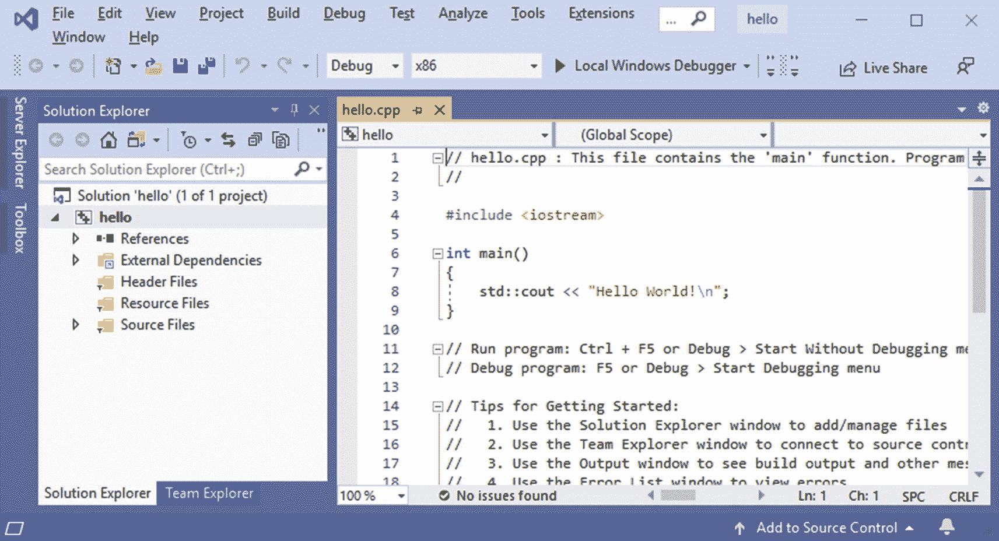

# 13.标准输入输出和文件操作

我们玩得太开心了。是时候认真对待了。

或者，当你*不使用图形和游戏库的时候，也许是时候学习如何编程了。毕竟，你通常不是。即使你是，你也可能需要访问文件(比如加载游戏关卡)，在 C++中，我们处理文件就像我们处理基于文本的用户交互一样——就像我们到目前为止用`sin`和`sout`所做的那样。*

## 标准输入输出程序

示例 [13-1](#PC1) 是一个使用标准 I/O 的程序，可能看起来很熟悉。

```cpp
// Hello, world! program
//      -- from _C++20 for Lazy Programmers_

// It prints "Hello, world!" on the screen.
//   Quite an accomplishment, huh?

#include <iostream>

using namespace std;

int main ( )
{
    cout << "Hello, world!" << endl;

    return 0;
}

Example 13-1“Hello, world!” using C++ standard I/O

```

以下是 SSDL 的《你好，世界》的变化。，从底层开始，反向工作:

*   是时候澄清一下了:`ssin`和`sout`是编译器自带的内置`cin`(读作“C-in”)和`cout`(C-out)的廉价仿制品。`cin`和`cout`与 SDL 窗口不兼容，所以我们需要一个替代品。`cin`和`cout`就像`ssin`和`sout`，但是 a)你不能设置光标——你只能向下移动屏幕——b)你不能设置字体或颜色。

*   我们需要`main`拥有与 SDL 兼容的参数(`int argc, char** argv`);现在可以省略了。

*   `using` `namespace std;` : `cout`是“标准”名称空间的一部分，你必须告诉编译器使用它，否则它会抱怨它不知道`cout`是什么。

*   我们加载的是`<iostream>`，而不是`"SSDL.h`，`"`，它就像`<cmath>`和`<cstdlib>`一样是编译器自带的。它定义了`cin`、`cout`、`endl`(输出`'\n'`)、 <sup>[1](#Fn1)</sup> 等东西。

### 编译标准输入输出程序

您可以像以前一样构建和运行 **Visual Studio** 程序:打开解决方案文件，右键单击要运行的项目，然后选择 Debug ➤ Start New Instance。但是要做自己的项目，不是抄`basicSSDLProject`而是抄`basicStandardProject`。

在 **Unix** 或 **MinGW 中，**变得更加简单。进入项目文件夹，输入`make`。(再也不用抄`Makefile.unix`或者`Makefile.mingw`；一个`Makefile`现在服务于两个平台——这是不使用库的优势。)要运行，输入`./a.out` (Unix)或`a.out` (MinGW)。

要创建自己的项目，在资源库的`newWork`文件夹中复制一份`basicStandardProject`，并以同样的方式使用它:`make`和`a.out`。

### 从头开始构建项目(可选)

#### …在 Microsoft Visual Studio 中

要制作自己的项目而不引用`basicStandardProject`，在启动 Visual Studio 时，告诉它创建一个新项目(图 [13-1](#Fig1) ，然后选择控制台 App(图 [13-2](#Fig2) )。在下一个窗口中(图 [13-3](#Fig3) )，Visual Studio 更愿意将你的项目放在一个很难找到的名为“repos”的文件夹中；我用台式机。我也强烈建议您选中“将解决方案和项目放在同一个目录中”——否则，您会得到多个调试文件夹，并且清理文件会更加困难。


图 13-3

在 Visual Studio 中配置新项目


图 13-2

在 Visual Studio 中创建新项目


图 13-1

正在启动 Visual Studio

默认的控制台项目是微软的 Hello，world！(图 [13-4](#Fig4) )。你可以删除它，输入你自己的代码。



图 13-4

新项目

如果你想使用 C++20 的最新特性(谁不想呢？)，可能需要告诉 Visual Studio。需求很可能会改变，所以请查看本书源代码的`newWork`文件夹，了解当前的指令。

现在你已经准备好输入你的程序了，但是在运行它之前，我建议你先阅读一下反欺诈部分。

##### 防错法

以下是您在使用 Microsoft Visual Studio 迁移到标准 I/O 时可能会发现的一些问题:

*   在你有机会看到任何东西之前，程序就关闭了。解决方案:在工具➤选项➤调试下，取消勾选调试停止时自动关闭控制台。这将适用于所有控制台项目，直到你改变它。

    之后，如果您正在运行它，并试图运行另一个副本，该后续副本可能会在您看到之前自动关闭。一次只运行一个副本。

*   **编译器找不到** **_WinMain@16** **，预编译头文件，或者其他让你去“嗯？”**您可能选择了错误的项目类型(图 [13-2](#Fig2) )。简单的解决方法是重新开始并选择控制台应用程序。

#### …使用 g++

要创建自己的程序，为它创建一个文件夹，在该文件夹中创建`main.cpp`，并使用以下命令进行编译:

```cpp
g++ -std=gnu++2a -g main.cpp -o myProgram

```

就这样。`-std=gnu++2a`表示“尽可能使用 g++支持的 C++20 标准，加上一些额外的‘GNU’(g++)特性”；`-g`表示“支持用`gdb`或`ddd`调试”；`-o myProgram`的意思是“命名可执行文件`myProgram`如果您不选择`-o`选项，可执行文件将是`a.out` (Unix)或`a.exe` (MinGW)。

要运行，请输入`./myProgram` (Unix)或`myProgram` (MinGW)。

要调试，使用`ddd myProgram &` <sup>[2](#Fn2)</sup> (Unix)或`gdb` `myProgram` (Unix 和 MinGW)。在 MinGW，我们习惯用`break``SDL_main`；自从 SDL 走了之后，`break main`取而代之。

Extra

为什么我们要把？/在 Unix 中的程序名前？

当您键入一个命令时，Unix 会查看一个名为 PATH 的目录列表:它认为可执行程序应该在其中的目录。如果当前目录(在 Unix 中称为`.`，单个句点)不在路径中，它不会在那里查找，所以如果您键入当前目录中的程序名，Unix 不会找到它。

我不喜欢那样，所以让我们把`.`(“点”)放在路径中。

假设这是它检查的第一个目录。然后，如果一个坏人可以让一个恶意程序进入你的目录，并将其命名为一个普通命令，如`ls`，他可以让你做可怕的事情:你输入`ls`，它就会删除操作系统或其他东西。

好的，那么我们将使它成为最后一个被检查的目录。现在，如果您键入`ls`，Unix 将在`/bin`(或任何地方)中查找，找到正确的`ls`，并运行它。

但是如果坏人猜出人们犯了什么错别字，并命名他的邪恶程序`sl`而你的手指错过了…他就抓住你了。

我不知道最后一种情况发生的可能性有多大，但如果你担心的话，这是一个让你置身事外的理由。

##### 防错法

*   **(gdb/ddd)调试器显示没有找到调试符号。**在`ddd`中，它也给出一个空白窗口。使用`-g`选项重新编译，或者使用`basicStandardProject`并键入`make`。

Exercises

1.  Write a program which prints all 99 verses of “99 bottles of beer on the wall.” In case you missed this cultural treasure, it goes like this:

    ```cpp
    99 bottles of beer on the wall
    99 bottles of beer;
    Take one down, pass it around,
    98 bottles of beer on the wall!

    ```

    最后一节是以 0 个瓶子结尾的。

## 文件 I/O（可选）

除了家庭作业之外，有用的程序通常需要访问文件。因此，让我们看看如何做到这一点:首先是简单的方法(使用`cin`和`cout`)，然后是更普遍适用的方法。

### `cin`和`cout`作为文件

从某种意义上说，我们已经在使用文件了，至少有两样东西 C++认为是文件:`cin`和`cout`。

`cin`是一个输入文件。它只是一个输入文件，当你输入的时候从键盘上获取信息。`cout`是输出文件:即你电脑屏幕的输出文件。定义的延伸？也许吧，但是很快我们将使用`cin`和`cout`作为*实际的*文件。

为此，我们必须知道如何使用命令提示符。Unix 和 MinGW 用户可以跳过下一节；你已经知道了。

#### 在 Windows 中设置命令提示符

打开 Windows 命令提示符(单击开始菜单并键入`cmd`)并转到您正在使用的项目的文件夹。这里有一个简单的方法:在该文件夹的窗口中，单击地址栏左侧的文件夹图标，该部分显示类似于`... > ch13 > 1-hello`的内容。当你这样做时，它将被一个高亮显示的路径所取代，如图 [13-5](#Fig5) 所示。


图 13-5

在 Windows 中获取用于命令提示符的路径

如果你在命令窗口提示中看到的驱动器与你刚才复制的地址左边的不同(在我的例子中是`C:`)，从地址输入驱动器，如图 [13-6](#Fig6) 。


图 13-6

在`cmd`中切换到项目的驱动器和目录。这里，我们从`D:`驱动器转到`C:`，然后从`cd`转到包含`1-hello`项目的目录

现在，在命令窗口中，键入`cd`并粘贴到您复制的路径中，然后按回车键。

Visual Studio 将您的可执行文件`<your project>.exe`放在一个子文件夹中，可能是`Debug`、`Release`、`x64`，或者是它们的某种组合。找到它，并将其复制到与你的`.vcxproj`相同的文件夹中，它将能够找到你放在那里的任何文件。

#### 在命令提示符下重定向 I/O

要让您的程序从`in.txt`而不是键盘获得输入，请键入

```cpp
myProgram < in.txt #3The < goes from file to program; makes sense

```

要让它也将其输出发送到`out.txt`，而不是屏幕，请键入

```cpp
myProgram < in.txt > out.txt

```

尝试将 Hello 程序的输出发送到一个文件，看看会发生什么。

Online Extra

“通过 I/O 重定向为你自己和你的用户节省一些时间”:在 YouTube 频道“以懒惰的方式编程”，或者在 [`www.youtube.com/watch?v=zQ3TY6oSAcQ`](http://www.youtube.com/watch%253Fv%253DzQ3TY6oSAcQ) 找到它。

#### `while (cin)`

我听说在英语文本中出现最频繁的字母是，以超级频繁的 E 开头，ETAOINSHRDLU。让我们看看这是不是真的，给程序一些巨大的文本，也许是关闭`gutenberg.org`，并计算频率:

```cpp
make an array of frequencies for letters, all initially zero

while there are characters left
    read in a character // we won't prompt the user;
                        // it's all coming from a file
    if it's a letter add 1 to frequency for that letter

print all those frequencies

```

我知道如何创建数组，给`int`加 1，并读入字符。但是我怎么知道还有字符呢？

`while (cin) ...`会做到的。如果你把`cin`放在某个你期望有`bool`的地方，它会被评估为类似于“如果`cin`没有出错”`cin`通常会出错的地方是到达输入文件的末尾。

示例 [13-2](#PC7) 是结果程序。

```cpp
// Program to get the frequencies of letters
//      -- from _C++20 for Lazy Programmers_

#include <iostream>

using namespace std;

int main ()
{
    // make an array of frequencies for letters, all initially zero
    constexpr int LETTERS_IN_ALPHABET = 26;
    int frequenciesOfLetters[LETTERS_IN_ALPHABET] = {}; // all zeroes

    // read in the letters
    while (cin)              // while there are letters left
    {
        char ch; cin >> ch;  // read one in
        ch = toupper(ch);    // capitalize it

        if (cin)             // Still no problems with cin, right?
            if (isalpha(ch)) //   and this is an alphabetic letter?
                ++frequenciesOfLetters[ch - 'A'];
                             // A's go in slot 0, B's in slot 1...
    }

    // print all those frequencies
    cout << "Frequencies are:\n";
    cout << "Letter\tFrequency\n";
    for (char ch = 'A'; ch <= 'Z'; ++ch) // for each letter A to Z...
        cout << ch << '\t' << frequenciesOfLetters[ch - 'A'] << '\n';

    return 0;
}

Example 13-2Counting frequencies of letters in a text file

```

用`a.out < in.txt > out.txt` (g++)或`2-frequencies < in.txt > out.txt` (Visual Studio)试试这个，你会得到一个类似于`out.txt`的文件

```cpp
Frequencies are:
Letter   Frequency
A        40
B        5
C        9
D        20
E        63
...

```

如果字母来自一个文件，`while (cin)`会在到达文件末尾时停止。但是实际的键盘输入没有文件结尾。您可以通过按 Ctrl-Z 和 Enter (Windows)或 Ctrl-D (Unix)来模拟它。*必须是该行的第一个字符，否则可能不起作用。*

#### 读入字符，包括空格

新任务:读入一个文件，每个字符，并大写一切。这是我们的输入文件。

这看起来应该可以工作，但却不能:

```cpp
while (cin)               // for each char in file
{
    char ch;  cin >> ch;  //    read in char
    ch = toupper (ch);    //    capitalize
    if (cin) cout << ch;  //    cin still OK? Then print
}

```

使用这个输入-`Twinkle, twinkle, little bat! How I wonder what you're at!`–我们得到这个输出:`TWINKLE,TWINKLE,LITTLEBAT!HOWIWONDERWHATYOU'REAT!`

跳过空白。对于用户交互和 ETAOIN SHRDLU 程序来说很好，但是这里我们*需要*空白。

解决方法:`ch = cin.get();`。`cin.get()`返回下一个字符，即使是空格、制表符`(\t`，或者行尾(`\n`)。

示例 [13-3](#PC10) 读入一个文件并生成一个全大写版本。要执行，请键入`a.out < in.txt > out.txt` (g++)或`3-capitalizeFile < in.txt > out.txt` (Visual Studio)。

```cpp
// Program to produce an ALL CAPS version of a file
//      -- from _C++20 for Lazy Programmers_

#include <iostream>
#include <cctype>             // for toupper

using namespace std;

int main ()
{
    while (cin)               // for each char in file
    {
        char ch = cin.get();  //   read in char
        ch = toupper (ch);    //   capitalize
        if (cin) cout << ch;  //   cin still OK? Then print
    }

    return 0;
}

Example 13-3Capitalizing a file, character by character

```

#### 防错法

*   **You told it to stop at the end of file** **, but it goes too far** **:**

    ```cpp
    /////////// get an average -- buggy version //////////////
    double total = 0.0;      // initialize total and howMany
    int  howMany = 0;

    while (cin)              // while there are numbers in file
    {
        int num; cin >> num; //   read one in

        total += num;        //   keep running total
        ++howMany;
    }

    ```

    `Your` input file is

    ```cpp
    1
    2

    ```

    而你的平均分是…1.6667。啊？

    用调试器跟踪它。它读入 1，将其相加，并递增`howMany`。它读入 2，将其相加，并再次递增`howMany`。用`while (cin)`测试文件结尾；它继续前进。

    但是我们不是在文件的末尾吗？也许不是。可能还有另一个\n 或者空间什么的。

    所以程序继续进行。它读入下一个数字，但是没有，所以它把 num 保持为 2，再加一次(！)，并再次递增。一个错误诞生了。

    It couldn’t know there wasn’t going to be another number till it tried to read it. So the solution is to test the input file after every attempt to read, to ensure it didn’t run out of input while reading:

    ```cpp
    int num; cin >> num; // read one in

    if (cin)             // still no problems with cin, right?
    {
        total += num;    // keep running total
        ++howMany;
    }

    ```

    `average`见源代码，`ch13`文件夹/解决方案，是本程序的完整正确版本。

Exercises

在所有这些练习中，使用标准 I/O。

1.  从文件中读入一系列数字，并以相反的顺序打印出来。你不知道有多少，但你知道不超过，比如说，100。(这样你可以声明一个足够大的数组。)

2.  计算文件中的字符数。

3.  …不包括空格或标点符号。

### 使用文件名

一直重定向 I/O 工作量太大。也许我有多个输入文件——它们不可能都是`cin`。或者，也许我只是想让程序记住文件名，而不是期望我在命令提示符下键入它。

假设我有一个游戏，游戏中愤怒的机器人四处游荡，试图与我的玩家发生冲突。播放器从屏幕的左边开始，我的工作是让它到右边，没有任何碰撞。

如果我把机器人放在特定的位置，设计一个比一个更难的关卡，可能会让游戏更有趣。我们将从三个机器人开始第一关，所以有三个位置。

如果我从`cin`得到这个(太烦人了，但是我们马上会改变它)，代码可能看起来像例子 [13-4](#PC14) 。要运行这个例子，输入六个整数，它会把它们返回给你。令人兴奋，是的，我知道。

```cpp
// A (partial) game with killer robots
//    meant to demonstrate use of file I/O
// This loads 3 points and prints a report
//       -- from _C++20 for Lazy Programmers_

#include <iostream>

using namespace std;

struct Point2D { int x_=0, y_=0; };

int main ()
{
                    // an array of robot positions
    constexpr int MAX_ROBOTS = 3;
    Point2D robots[MAX_ROBOTS];

    int whichRobot = 0;

    // while there's input and array's not full...
    while (cin && whichRobot < MAX_ROBOTS)
    {
        int x, y;
        cin >> x >> y;        // read in an x, y pair

        if (cin)              // if we got valid input (not at end of file)
        {
            robots[whichRobot] = {x, y}; //  store what we read
            ++whichRobot;                //  and remember there's 1 more robot
        }
    }

    for (int i = 0; i < MAX_ROBOTS; ++i)
        cout        << robots[i].x_ << ' '
                    << robots[i].y_ << endl;

    return 0;
}

Example 13-4Code to read in several points from cin

```

现在，让程序在不重定向 I/O 的情况下获取文件。下面是使用命名输入文件必须做的事情:

1.  `#include <` `fstream` `>,`其中有我需要的定义。

2.  `ifstream` `inFile;`声明我的输入文件。`ofstream`用于输出文件。

3.  `inFile.open``("level1.txt");`–打开一个文件会将它与一个文件名相关联，并确保没有问题。

4.  验证打开的文件没有错误。如果是输入文件，错误可能是该文件不存在或者不在您认为的文件夹中。如果是输出文件，可能是磁盘有问题或者是只读文件。以下是如何验证:

1.  在您想要使用新文件的任何地方，将`cin`更改为`inFile`。如果是输出文件，将`cout`改为`outFile`。

2.  完成后，关闭文件`: inFile.close` `();`。这告诉操作系统忘记`inFile`和`input.txt`之间的关联，从而让其他可能需要它的程序使用它。不可否认，当你的程序结束时，它引用的所有文件都将被关闭——但是，当你用完了你的玩具，我指的是文件，养成收起来的习惯是明智的。你妈妈会为你骄傲的。

```cpp
if (! inFile) // handle error

```

示例 [13-5](#PC16) 是程序的更新版本。

```cpp
// A (partial) game with killer robots
//    meant to demonstrate use of file I/O
// This loads 3 points and prints a report
//       -- from _C++20 for Lazy Programmers_

#include <iostream>
#include <fstream>  // 1\. include <fstream>

using namespace std;

struct Point2D { int x_=0, y_=0; };

int main ()
{
                    // an array of robot positions
    constexpr int MAX_ROBOTS = 3;
    Point2D robots[MAX_ROBOTS];

                    // 2\. Declare file variables.
                    // 3\. Open the files.
                    //  Here's two ways to do both; either's fine
    ifstream inFile; inFile.open("RobotGameLevel1.txt");
    ofstream outFile ("RobotSavedGame1.txt");

                    // 4\. Verify the files opened without error
    if (! inFile)
    {
        cout << "Can't open RobotGameLevel1.txt!\n"; return 1;
                    // 1 is a conventional return value for error
    }
    if (! outFile)
    {
        cout << "Can't create file RobotSavedGame1.txt!"; return 1;
    }

    int whichRobot = 0;

                   // 5\. Change cin to inFile, cout to outFile

    // while there's input and array's not full...
    while (inFile && whichRobot < MAX_ROBOTS)
    {
        int x, y;
        inFile >> x >> y;    //  read in an x, y pair

        if (inFile)           // if we got valid input (not at end of file)
        {
            robots[whichRobot] = {x, y}; // store what we read
            ++whichRobot;                // and remember there's 1 more robot
        }
    }

    for (int i = 0; i < MAX_ROBOTS; ++i)
        outFile     << robots[i].x_ << ' '
                    << robots[i].y_ << endl;

                   // 6\. When done, close the files
    inFile.close(); outFile.close();

                   // can still use cout for other things
    cout << "Just saved RobotSavedGame1.txt.\n";

    return 0;
}

Example 13-5Program that reads an input file and prints to an output file

```

这奏效了；它将`RobotSavedGame1.txt`保存在与`.vcxproj`文件相同的文件夹中。

程序启动时会删除`RobotSavedGame1.txt`中的所有内容，并用新内容替换它们。

程序中可以有多个输入和输出文件。您也可以将文件传递给函数:

```cpp
void readFile (ifstream& in,  double numbers[], int& howManyWeGot);
void writeFile(ofstream& out, double numbers[], int  howMany);

```

Exercises

1.  写一个程序来判断两个文件是否相同。

2.  写入和测试函数，以读取和打印到一个`Point2D` s 的文件。

3.  掷出两个骰子 100 次，并将结果存储在一个文件中…

4.  …然后加载该文件并打印一个柱状图:一个柱状图显示你得到 2 的次数，另一个柱状图显示你得到 3 的次数，以此类推。在 SSDL 这样做(使用`basicSSDLProject`；继续使用文件变量；只是不要指望`cin`和`cout`管用)；或者在屏幕上打印 x，显示每个值出现的次数——类似于:

    ```cpp
    1  : 
    2  : X
    3  : XXXXXXX
    4  : XXXXXXXX
    ...

    ```

1.  制作你自己的密码:一个字母方案，如 A 代表 R，B 代表 D，等等。然后使用您的加密方案对消息进行编码。还要写一个解密程序，验证一切正常。

2.  (用力)地球变暖了吗？

    在本章的示例代码中有一个文件`temperature.txt` <sup>[4](#Fn4)</sup> ，它包含给定年份的年份和估计的全球平均温度。(给出的温度是相对于 1910-2000 年估计平均温度的摄氏度数)。

    那么我们能从中学到什么呢？

    **The degrees increase per year**, which is

    

    x 是年份，y 是温度。σx 读作“x 的总和”，意思是“所有 x 的总和”m 是与数据最匹配的直线 y = mx + b 的斜率。

    **How closely the yearly temperatures actually match this line.** This is

    ![$$ \mathrm{R}=\frac{\mathrm{N}\sum xy-\sum \mathrm{x}\sum \mathrm{y}}{\sqrt{\left[\mathrm{N}\sum {\mathrm{x}}^2-{\left(\sum \mathrm{x}\right)}^2\right]\left[\mathrm{N}\sum {\mathrm{y}}^2-{\left(\sum \mathrm{y}\right)}^2\right]}} $$](img/477913_2_En_13_Chapter_TeX_Equb.png)

    如果 R 为–1 或 1，则相关性很强。如果 R 接近 0，就很弱。负 R 意味着温度随时间下降(但我们已经从 m 知道了)。

    写一个程序，读取文件，并为用户提供每年增加的学位和 r。你需要什么功能？在给出你的答案之前，充分测试他们以确保你信任他们。

    当然，相关性并不能证明因果关系。比如喝咖啡的人滑雪多(比方说)。这是否意味着咖啡会导致滑雪？也许是滑雪小屋提供免费咖啡。或者，喜欢找乐子的人更可能去滑雪和喝咖啡。对于因果关系，我们需要更多一点的(人类)思考。

<aside aria-label="Footnotes" class="FootnoteSection" epub:type="footnotes">Footnotes [1](#Fn1_source)

`endl`还告诉 C++立即将输出发送到屏幕——刷新它。我们通常不在乎，只要它最终到达那里，所以我倾向于使用`’\n’`。

  [2](#Fn2_source)

`&`的意思是“马上再给我一个命令提示；不要等待`ddd`结束”——这是一个好习惯。

  [3](#Fn3_source)

Unix 注释标记。在 Windows 中，使用& REM(或者干脆不放注释)。

  [4](#Fn4_source)

来源:[www . ncdc . NOAA . gov/CAG/global/time-series](http://www.ncdc.noaa.gov/cag/global/time-series)。

 </aside>