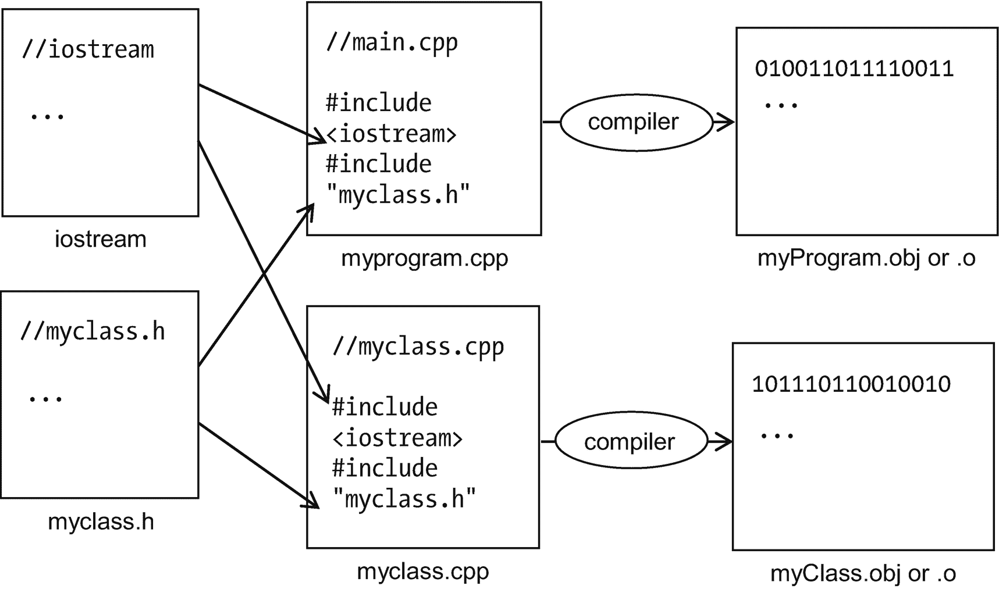
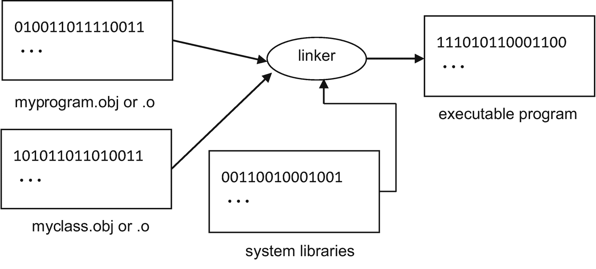
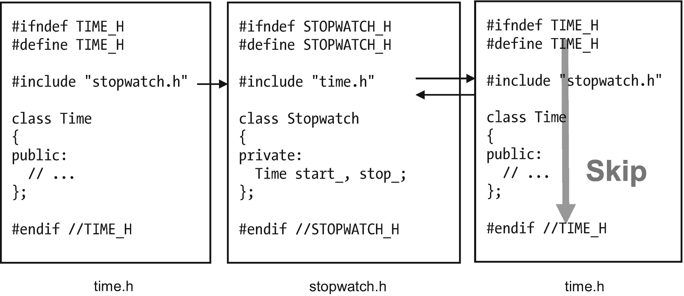

# 十六、类·续

更多的事情使你的类工作，并且工作得很好，特别是把你的程序的一部分放在多个文件中。

## `inline`提高效率的功能

考虑一下第 8 章和第 15 章的函数调用图。它们展示了计算机的功能。它创建函数的新副本，即“激活记录”，包含函数实例需要的所有内容，尤其是局部变量。它将参数复制到内存中该函数可以访问的部分。它存储它需要知道的关于它所在函数的信息(CPU 中寄存器的状态——如果你不知道那是什么，不用担心)。最后，它将控制权转移给新功能。

完成后，它反转这个过程:丢弃函数及其变量的副本，并恢复旧函数的状态。

在运行时，计算机上的工作量很大。那我们该怎么办？停止使用函数？

解决方案是**内联**函数。一个内联函数被*写成*一个函数，就程序员而言，它的行为就像一个函数，并且看起来像是作为一个函数编译的，但是编译器做了一些偷偷摸摸的事情:它用一段代码代替函数调用来做同样的事情。这里有一种方法可以让一个函数内联——只要在它前面加上`inline`:

```cpp
inline
void Date::print (std::ostream& out) const
{
   out << day_ << '-' << month_ << '-' << year_;
}

```

当你写这个的时候

```cpp
d.print (cout);

```

编译器会像你说的那样处理它

```cpp
cout << d.day_ << '-' << d.month_ << '-' << d.year_;
    // but there's no problem with these members being private

```

从而节省了函数调用的开销。

如果一个函数足够大，那么调用的时间开销与花在函数本身上的时间相比并不显著，所以帮助不大。并且`inline`引入了新的开销:内联扩展的大函数的多个副本将占用大量内存。以下是如何知道是否应该内联一个函数。

Golden Rule

**`inline`**功能****

 **一个函数应该是内联的，如果它

*   适合单行。

*   不包含循环(for、while 或 do-while)。

扩展仅仅是对编译器的一个建议，而不是命令。如果编译器认为函数不应该扩展，它会否决你。我没意见；在这种情况下，编译器最清楚。

这里有一个快速、简单的方法来使*成员*函数内联——将整个事情放在类定义中:

```cpp
class Date
{
    ...

   void print (ostream& out) const
           // inline, because it's inside the class definition
   {
        out << day_ << '-' << month_ << '-' << year_;
   }

   ...
};

```

## 访问功能

有时我们希望世界上的其他人能够*看到*我们的数据成员，但不能改变它们。这就像一个时钟:你必须通过适当的控件(成员函数)来设置它，但是你可以随时*看到*时间。

事情是这样的:

```cpp
class Date
{
public:
   ...

    // Access functions -- all const, as they don't change data, just //   access it
    int day     () const { return day_;   }
    int month   () const { return month_; }
    int year    () const { return year_;  }

    ....
};

```

调用它们的方法与使用`print`相同——使用`.`:

```cpp
cout << myBirthday.year () << " is the year of the lion. Fear me.\n";

```

使用访问函数通常是个好主意，*甚至在成员函数*中。假设我决定转储`day_`、`month_`和`year_`，并且只有一个数据成员`totalDays`，成员函数可以根据需要从中计算日、月和年。引用`day_`的函数将不再编译！但是如果它指的是仍然存在的`days()`，那就好了。

这就是为什么我们在数据成员名称:`day_`和其他之后使用下划线。这就是为什么我用了有趣的名字`theDay`、`theMonth`等等，作为我写的第一个构造器的参数。如果我这么做了

```cpp
class Date
{
public:
    Date(int day, int month, int year) :
        day(day),month(month),year(year)
    {
    }
    int day() const { return day; }
    ....
private:
    int day, months, years;
};

```

我有太多的东西要命名，我永远也不会把它们分类！ <sup>[1](#Fn1)</sup> 也不会编译。名称必须不同。

## 单独的编译和包含文件

现在我们的程序足够长了，我们应该把它们分成多个文件。这里有一些通用指南，这样你就知道在哪里可以找到东西了:

*   我们通常给每个类一个自己的文件。

*   …让每一组明确相关的函数共享一个文件。例如，如果你在写三角函数正弦、余弦、正切等等，你可以把它们放在一起。

*   我们给`main`它自己的文件，可能与`main`调用的函数共享，这些函数对其他程序没有用。比方说，如果你正在为扑克写一个程序，与叫牌相关的函数可能会放在`main`的文件中(因为只有扑克才进行扑克式的叫牌)，但是与洗牌和发牌相关的函数会放在其他地方(因为许多游戏都涉及到牌)。

然而，就让这一切发挥作用而言，还有一个问题。这个新文件需要知道某些事情(比如类定义！)—`main`也会如此。这些信息必须共享。

幸运的是，我们已经知道如何做到这一点:包含文件。

### 在单独编译中会发生什么

假设我创建了这些文件:`myclass.h`(如“header”中的“h”)，包含类定义；`myclass.cpp`，包含成员功能；和`main.cpp`，包含主程序。(我给`.h`和`.cpp`文件起了和类一样的名字，小写。习俗各不相同；保持一致。)我是这样收录的:

```cpp
#include "myclass.h" // <-- Use "" not <>; and let the file end in .h

```

下面是编译器构建程序的几个阶段。

首先，它**编译**c++“源”文件(你的`.cpp`文件；见图 [16-1](#Fig1) 。当它遇到一个`#include`指令时，它停止读取源文件，读取你包含的`.h`文件，然后返回源文件。



图 16-1

构建程序的编译阶段

编译器用机器语言为每个源文件生成一个“目标”文件。

如果没有错误，编译器准备好**链接**(图 [16-2](#Fig2) )。目标文件知道如何做它们要做的事情，但是它们不知道在哪里可以找到函数引用，无论是从彼此之间还是从系统库中。链接阶段通过解析引用将这些文件“链接”在一起，并生成一个可执行文件。如果您使用的是 Visual Studio，可执行文件将以`.exe`结尾；g++ 是灵活的。



图 16-2

构建程序的链接阶段

看到这个过程使我们能够准确地理解什么应该和不应该进入包含文件。

### 写你的。h 文件

以下是包含文件中可以包含的内容(到目前为止):

*   类型，包括类定义和枚举类型

*   函数声明

*   任何事情

以下是不应该的:

*   功能

*   常量或变量声明(除了`inline`–继续阅读)

原因如下。如果你把一个函数(或变量声明)放在一个包含文件中，它将被包含到不同的`.cpp`文件中。当你编译这些文件时，你会得到同一个函数的多个副本。当你调用这个函数的时候，编译器不知道使用哪个副本，也不知道它们是相同的。你会得到一个错误，说它有**个重复的定义**。

如果你想让你的函数出现在包含文件中…就把它设为`inline`。

如果您想在包含文件中包含变量、`const` s 或`constexpr`s…也让它们成为`inline`:

```cpp
inline constexpr int DAY_PER_WEEK = 7;
inline const SSDL_Color  BABY_BLUE = SSDL_CreateColor (137, 207, 240);2

```

不仅仅是为了提高函数调用的效率——它还防止了重复定义的问题。也许不是最清晰的关键字，但是`allowInIncludeFilesWithoutDuplicateDefinitionError`太难输入了。

#### 只包含一次. h 文件

假设`time.h (`来自第十五章的习题；它定义了新的类`Stopwatch`需要类`Time`。我们需要`#include "time.h"`，这样我们就可以声明`start_`和`stop_`:

```cpp
// stopwatch.h: defines class Stopwatch
//        -- from _C++20 for Lazy Programmers_

#include "time.h"                // trouble ahead...

class Stopwatch
{
public:
    Stopwatch () {}
private:
    Time start_, stop_;
};

```

然后我们到了`main.cpp`。

```cpp
// Program that uses Stopwatches and Times
//       -- from _C++20 for Lazy Programmers_

#include "time.h"
#include "stopwatch.h"

int main (int argc, char** argv)
{
    Time duration;
    Stopwatch myStopwatch

;

    // ...

    return 0;
}

Example 16-1A program that includes time.h and stopwatch.h. Since this and Example 16-2 work together, they’re in the same project in source code’s ch16 folder; it’s named 1-2-stopwatch

```

编译时`main.cpp`

首先，编译器包含了`time.h`，它定义了类`Time`。

然后包括`stopwatch.h`。做的第一件事*是`#include "time.h"`，它定义了类`Time`。*又来了。*编译器抱怨:类`Time`的重复定义！*

解决方案是告诉编译器只在还没有被读取的时候才读取一个`.h`文件。有一个常用的技巧:在`.h`文件中定义一些东西；然后在整个文件周围放些东西，说“如果你从来没听说过，就只看这个。”

```cpp
// time.h: defines class Time
//        -- from _C++20 for Lazy Programmers_

#ifndef TIME_H // If TIME_H is not defined...
#define TIME_H

class Time
{
    // ...
};

#endif //TIME_H

Example 16-2time.h, written so it will only be processed once. Part of the 1-2-stopwatch project in source code’s ch16

```

第一次通过时，它从未听说过`TIME_H`，所以它读取了`.h`文件。这定义了类别`Time`和`TIME_H`。

下一次，它听说过`TIME_H`，所以它跳到`#endif`。阶级`Time`没有被重新定义。任务完成。

为了防止这个问题，我对所有的包含文件都这样做。对常量(`MYFILE_H`)使用相同的形式意味着我总是记得我如何拼写它，并防止名称冲突。

#### 避免包含文件中的`using namespace std;`

`using` `namespace std` `;`不应该在你的包含文件里。如果有人包含了您的文件，但不想使用`std`名称空间怎么办？为了避免强加给他们，跳过`using`宣言。为了让 C++ 仍然能够识别`cin`和`cout`以及`std`名称空间中的其他东西，在它们前面加上`std::`，就像在`std::cin >> x;`中一样。

### 备份多文件项目

在 Unix 中，要备份目录`myproject`，请输入以下命令:`cp -R myproject myprojectBackup1`。

在 Windows 中，复制并粘贴整个文件夹，忽略不会复制的内容。

### 防错法

**循环包括**制造一个奇怪的错误。让我们修改`time.h`，这样它就需要`Stopwatch`:

```cpp
#include "stopwatch.h"

class Time
{
    void doSomethingWithStopwatch (const Stopwatch&);
};

```

假设某个`.cpp`文件包含了`time.h`。这定义了`TIME_H`，然后包括`stopwatch.h`(图 [16-3](#Fig3) ，左)。



图 16-3

`time.h`包括`stopwatch.h`，其中包括`time.h`——会有麻烦的

所以它暂时停止读取`time.h`，读取`stopwatch.h`(图 [16-3](#Fig3) ，中间)。这定义了`STOPWATCH_H`，然后又包含了`time.h`(图 [16-3](#Fig3) ，右图)。

因为已经定义了`TIME_H`，所以`#ifndef`让我们跳过内容。我们回到`stopwatch.h`，当它到达第`Time start_, stop_;`行时，它对我们大喊它从来没有读过`Time`的定义，这是真的。所以程序不会编译。

一个包含文件可以包含另一个——但是它们不能包含彼此的*。*

 *一些修复:

*   重新考虑这个功能是否应该在`Time`中。`Time`真的要靠`Stopwatch`吗？难道不应该反过来吗？(那是这个代码的最佳答案。)

*   如果那样不行…只要代码不需要细节，你可以在不知道是什么的情况下参考`Time`中的`Stopwatch`。只告诉`time.h`说`Stopwatch`是一个班:

    ```cpp
    class Stopwatch;
    class Time
    {
           void doSomethingWithStopwatch (const Stopwatch&);
    };

    ```

问题解决了。

下一个问题:**如果你有很多文件，却不记得把其中一个函数放在哪里，该怎么办？**

*   Visual Studio:右击函数名。“转到申报”将带您到申报；“转到定义”将带你到函数本身，如果它可用的话。

*   Unix:尽管有一些软件包可以帮助解决这个问题(emacs 的 ggtags 就是其中之一)，但不能保证它们就在您的系统上。这个命令是一个快速的 <sup>[3](#Fn3)</sup> 的方法来找到函数和对它的所有引用:`grep` `functionIWant *`。

*   MinGW:我用 Windows Grep——在网上找——来搜索函数名。

## Microsoft Visual Studio 中的多文件项目

**要添加新文件，**进入项目菜单，选择添加新项目。您可以通过这种方式添加任何您需要的`.h`或`.cpp`文件；它会把它们放在正确的地方。

然后像往常一样构建并运行您的项目。

Extra

现在您已经有了多个源文件，您可能想要一种更简单的方法来清理 Visual Studio 创建的额外文件。 <sup>[4](#Fn4)</sup>

在项目所在的文件夹中，使用记事本或其他编辑器创建一个文件`clean.txt`。把它放在一个文件夹里，里面只有你的工作(也许还有我的)，没有任何不可替代的东西。这里面应该有些什么:

```cpp
REM Erase folders you don't want -- here's my picks
for /r . %%d in (Debug,.vs) do @if exist "%%d" rd /s/q "%%d"
REM Erase other files -- here's my picks.
REM /s means "in subfolders too"
del /s *.obj    REM Not needed, but now you know how to
                REM   erase all files with a particular extension

```

保存您的文本文件，并将其名称从`clean.txt`改为`clean.bat`。(看不到`.txt`？取消选中隐藏已知文件类型的扩展名–参见第 1 章。)在图 [16-4](#Fig4) 的警告对话框中点击是。


图 16-4

Microsoft Windows 关于更改文件扩展名的警告

…并获取新的`clean.bat`文件。

每当您想要抹掉额外的文件时，您可以双击这个“批处理”文件，即一个命令文件。被警告:`del`永久删除东西。 <sup>[5](#Fn5)</sup>

## g++ 中的多文件项目

要在 g++ 项目中使用多个文件，只需将它们添加到从`basicStandardProject`(或`basicSSDLProject`)复制的项目文件夹中。`make`将照常建造一切。

不管有没有自己的 Makefiles，都要自己做，请继续阅读。

### 命令行:多打字，少思考

您可以使用以下命令构建程序:

```cpp
g++ -g -std=gnu++2a -o myprogram myprogram.cpp myclass.cpp

```

您可以将编译和链接阶段分开:

```cpp

g++ -g -std=gnu++2a -c myprogram.cpp   #-c means "compile only -- don't link
g++ -g -std=gnu++2a -c myclass.cpp
g++ -g -std=gnu++2a6 -o myprogram myprogram.o myclass.o #now link

```

### Makefiles:多思考，少打字(可选)

Makefiles 跟踪项目中已更改的文件。当你`make`的时候，它只会重建它需要的部分。这减少了编译时间。输入`make`比输入`g++ -g -o myprogram file1.cpp file2.cpp...`更好

Makefiles 并不容易，但对于大型项目或使用大量库的项目来说，它们是必不可少的。本节将向您展示如何制作它们，从最简单的版本(例如 [16-3](#PC18) )到最复杂但也是最常用的版本(例如 [16-5](#PC24) )。

#### 简单的版本

```cpp
#This is a basic Makefile, producing one program from 2 source files

myprogram:   myclass.o main.o       #link object files to get myprogram
      g++ -std=gnu++2a -g -o myprogram myclass.o main.o

main.o:      main.cpp myclass.h     #create main.o
      g++ -std=gnu++2a -g -c main.cpp

myclass.o:   myclass.cpp myclass.h  #create myclass.o
      g++ -std=gnu++2a -g -c myclass.cpp

clean:
      rm -f myprogram           # for Unix; with MinGW, rm -f myprogram.exe
      rm -f *.o

Example 16-3A simple Makefile. It’s in source code, ch16/3-4-5-makefiles, as Makefile.Ex-16.3\. To use it, copy it to Makefile and type make

```

第一行是注释，因为它以#开头。

为了简单起见，我将把事情打乱。这条线

```cpp
main.o:   main.cpp myclass.h

```

说要编译 main 的`.o`(对象)文件，你需要`main.cpp`和`myclass.h`。如果其中任何一个发生变化，`make`就会重建`main.o`。(`make`根据文件的修改时间检测更改。)

下一行`g++ -std=gnu++2a -g -c main.cpp`是编译它的命令。如果失败，`make`会停止，以便您可以纠正错误。

对`myclass.o`的理解是一样的。

让我们回到顶部:

```cpp
myprogram:   myclass.o main.o
             g++ -std=gnu++2a -g -o myprogram myclass.o main.o

```

这确定了`myprogram`依赖于`myclass.o`和`main.o`，并告诉如何创建它。

因为这是 Makefile 中的第一件事，所以当你键入`make`时，这就是计算机试图构建的东西。

`clean`很好:如果你说`make clean`，它会清除可执行文件和所有的`.o`文件。`-f`选项是这样的，如果没有错误，它不会报告错误，因为这不是问题。注意，Windows 将`.exe`附加到它的可执行文件中，所以 MinGW 版本的`clean`需要删除`myprogram.exe`。

#### 更好的版本

Makefile 的工作量太大了:我们必须指定每个`.cpp`文件以及它所依赖的`.h`文件。我们现在将创建一个 Makefile 文件，它应该适用于您将在本文剩余部分和其他地方遇到的大多数项目。

```cpp
# Makefile for a program with multiple .cpp files

PROG   = myprogram             # What program am I building?
                               #  MinGW: make this myprogram.exe
SRCS   = $(wildcard *.cpp)     # What .cpp files do I have?
OBJS   = ${SRCS:.cpp=.o}       # What .o   files do I build?

$(PROG):  $(OBJS)              # Build the program
      g++ -std=gnu++2a -g -o $@ $^

%.o:      %.cpp                # Make the .o files
      g++ -std=gnu++2a -g -o $@ -c $<

clean:                         # Clean up files
      rm -f $(PROG)
      rm -f *.o

Example 16-4A Makefile for any project of .cpp source files – first attempt. It’s in source code, ch16/3-4-5-makefiles, as Makefile.Ex-16-4.unix and Makefile.Ex-16.4.mingw. To test, copy the one for your platform to Makefile and make

```

首先，我们定义一些变量。

之后，我们看到我们的程序依赖于目标文件(和以前一样)。注意变量用`$()`括起来。然后第一个 g++ 命令告诉我们如何从目标文件创建程序。

`$@`表示“上面的`:`左边的东西”，`$^`表示“`:`右边的*一切*”——即所有的对象文件。

产生`.o`文件的部分为每个`.cpp`文件制作一个。`$<`的意思是“下一个文件右边有什么*，在这种情况下，下一个`.cpp`文件。*

(如果你想知道如何使用这些看起来很奇怪的结构的一切，互联网是你的。如果你只是想找点有用的……互联网还是你的。我就是这么做的:查阅教程，看看什么能解决我的问题。)

要查看这些变量是如何被翻译成实际命令的，输入`make`——它会在执行命令时打印出命令。

#### 完整的版本

Makefile 仍然有一个大错误(除了看起来像是用埃及象形文字写的)。它不引用任何`.h`文件。如果你改变了一个`.h`文件，`make`不会知道在此基础上重新编译——它应该知道。

所以我们在 Makefile 的末尾添加了一个神奇的咒语:

```cpp
%.dep:   %.cpp                         # Make the .dep files
      g++ -MM -MT "$*.o $@" $< > $@

ifneq ($(MAKECMDGOALS),clean)          # If not cleaning up...
-include $(DEPS)                       #  bring in the .dep files
endif

```

第一部分说对于我们拥有的每个`.cpp`文件，我们需要一个`.dep`文件，它将包含依赖关系的信息。`g++ -MM`行生成它。`main.dep`文件可能看起来像这样

```cpp
main.o main.dep: main.cpp myclass.h

```

意思是“每当`main.cpp`或`myclass.h`改变时，重新制作`main.o`和`main.dep`”

`-MT "$*.o $@"`选项指定了`:`左边的内容——它应该包含相关的`.o`文件`main.o`，加上`main.dep`，这里指定为`$@`。我们放置`main.dep`的原因是，如果`main.cpp`或`myclass.h`中有任何变化(比方说，我们添加另一个`#include` ), `main.dep`也会更新。

`$<`是相关的`.cpp`文件。

`>`表示将输出存储在一个文件中，特别是`$@`，这是我们正在创建的`.dep`文件。

`include $(DEPS)`表示将这些规则包含到 Makefile 中。最初的`-`表示如果有错误就不要报告，比如文件不存在，这将在`clean`之后第一次运行`make`时发生。而`ifneq...`说，如果你无论如何都要更新`.dep`文件，那就不要担心它们。

是的，这很复杂，但这是突破口。

这是我们的结果。它应该不加改变地为新项目工作；如果您想要不同的可执行文件名称，请更改`myprogram`。

```cpp
# Makefile for a program with multiple .cpp files

PROG     = myprogram             #What program am I building?
                                 # MinGW: make this myprogram.exe
SRCS     = $(wildcard *.cpp)     #What .cpp files do I have?
OBJS     = ${SRCS:.cpp=.o}       #What .o   files do I build?
DEPS     = $(OBJS:.o=.dep)       #What .dep files do I make?

##########################################################

all:        $(PROG)

$(PROG):    $(OBJS)                        # Build the program
      g++ -std=gnu++2a -o $@ -g $^

clean:              # Clean up files
      rm -f $(PROG)
      rm -f *.o
      rm -f *.dep

%.o:    %.cpp        # Make the .o files
      g++ -std=gnu++2a -g -o $@ -c $<

%.dep:  %.cpp        # Make the .dep files
      g++ -MM -MT "$*.o $@" $< > $@

ifneq ($(MAKECMDGOALS),clean)              # If not cleaning up...
-include $(DEPS)                           #  bring in the .dep files
endif

Example 16-5A complete Makefile. It’s in source code, ch16/3-4-5-makefiles, as Makefile.Ex16-5.unix and Makefile.Ex16-5.mingw. Copy the version for your platform into any folder where you have a project, naming it Makefile, and run by typing make

```

### 防错法

*   **Makefile:16: ***** **缺少分隔符** **。停下来。**

    不开玩笑:这是因为在指定的行上，你用空格而不是制表符缩进。解决方案:哼哼，翻白眼，或者其他什么，使用制表符。

## 最终`Date`程序

示例 [16-6](#PC25) 至 [16-8](#PC27) 显示了`Date`的完成程序，如前所述，该程序被分成文件。`main`是驱动程序，也就是设计用来测试类的程序。

```cpp
// A "driver" program to test the Date class
//        -- from _C++20 for Lazy Programmers_

#include <iostream>
#include "date.h"

using namespace std;

int main ()
{

    Date t (5,11,1955); // Test the 3-int constructor

    // ... and print
    cout << "This should print 5-11-1995:\t";
    t.print (cout);
    cout << endl;

    // Test access functions
    if (t.day () != 5 || t.month () != 11 || t.year () != 1955)
    {
        cout << "Date t should have been 5-11-1955, but was ";
        t.print ();
        cout << endl;
    }

    Date u = t;         // ...the copy constructor
    if (u.day () != 5 || u.month () != 11 || u.year () != 1955)
    {
        cout << "Date u should have been 5-11-1955, but was ";
        u.print ();
        cout << endl;
    }

    const Date DEFAULT; // ...and the default constructor
                        // I do consts to test const functions
    if (DEFAULT.day  () != 1 || DEFAULT.month () != 1 ||
        DEFAULT.year () != 1)
    {
        cout << "Date v should have been 1-1-1, but was ";
        DEFAULT.print ();
        cout << endl;
    }

    // ...and total days
    constexpr int DAYS_FOR_JAN1_5AD = 1462; // I found this number myself
                                            //   with a calculator
    Date Jan1_5AD (1, 1, 5);
    if (Jan1_5AD.totalDays () != DAYS_FOR_JAN1_5AD)
        cout << "Date Jan1_5AD should have had 1462 days, but had "
             << DAYS_FOR_JAN1_5AD << endl;

    // Test normalization
    const Date JAN1_2000 (32, 12, 1999);
    if (JAN1_2000.day  () != 1 || JAN1_2000.month () != 1 ||
        JAN1_2000.year () != 2000)
    {

        cout << "Date JAN1_2000 should have been 1-1-2000, but was ";
        JAN1_2000.print ();
        cout << endl;
    }

    cout << "If no errors were reported, "
         << " it looks like class Date works!\n";

    return 0;
}

Example 16-8A driver program for class Date. It’s in source code, ch16, as part of the 6-7-8-date project/folder

```

```cpp
// class Date -- functions
//        -- from _C++20 for Lazy Programmers_

#include "date.h"

bool isLeapYear (int year)
{

//...
}

int daysPerYear (int year)
{
    //...
}

int daysPerMonth (int month, int year)
{
    //...
}

void Date::normalize ()
{
    //...
}

int Date::totalDays () const
{
    //...
}

Example 16-7date.cpp, abbreviated for brevity. A complete version is in source code, ch16 folder, as part of the 6-7-8-date project/folder

```

```cpp
// class Date
//       -- from _C++20 for Lazy Programmers_

#ifndef DATE_H
#define DATE_H

#include <iostream>

enum class Month { JANUARY=1, FEBRUARY, MARCH, APRIL, MAY, JUNE,
                   JULY, AUGUST, SEPTEMBER, OCTOBER, DECEMBER};

bool isLeapYear   (int year);
int  daysPerYear  (int year);
int  daysPerMonth (int month, int year);// Have to specify year,
                                        // in case month is FEBRUARY
                                        //  and we're in a leap year
class Date
{
public:
    Date(int theDay=1, int theMonth=1, int theYear=1) :
       day_(theDay), month_(theMonth), year_(theYear)
    {
        normalize();
    }
    // Because of its default parameters, this 3-param
    //  ctor also serves as a conversion ctor
    //  (when you give it one int)
    //  and the default ctor (when you give it nothing)

    // Default is chosen so that the default day
    //  is Jan 1, 1 A.D.

    Date(const Date& otherDate) : // copy ctor
           day_  (otherDate.day_  ),
           month_(otherDate.month_),
           year_ (otherDate.year_ )
    {

    }

    // Access functions
    int days        () const { return day_;   }
    int months      () const { return month_; }
    int years       () const { return year_;  }

    int totalDays () const; // convert to total days since Dec 31, 1 BC

    void print (std::ostream& out = std::cout) const
    {
        out << day_ << '-' << month_ << '-' << year_;
    }

private:
    int day_;
    int month_;
    int year_;

    void normalize  ();
};
#endif //DATE_H

Example 16-6date.h. It’s in source code, ch16, as part of the 6-7-8-date project/folder

```

输出是

```cpp
This should print 5-11-1995: 5-11-1955
If no errors were reported, looks like class Date works!

```

为了对用户友好，如果一切正常，驱动程序给出尽可能少的输出——测试时需要费力处理的输出也越少。

Exercises

在这些练习中，使用单独的编译；为您的类提供适当的构造器，在有用的地方使用默认参数；以及相关的写访问函数和内联函数。

如果结果表明`.cpp`文件中没有任何内容(可能发生！)，不需要写一个:

1.  更新`Time`类以使用本章中所涉及的内容。

    添加一个常量`Time MIDNIGHT`，如果你的编译器支持的话，使用`inline`让它对`main.cpp,`可用。

2.  添加`Time`函数`sum`和`difference`，返回这个`Time`与另一个`Time`的和/差。它的返回值也是一个`Time`。

3.  你想在你的墓碑上刻什么？创建一个`Tombstone`类，包含出生日期、死亡日期、姓名和墓志铭。除了一个成员函数`print`之外，给它一个`lifespan`函数，它返回这个人生命的持续时间作为一个`Date`。

4.  将示例 [16-1](#PC11) 和 [16-2](#PC12) 中的`Stopwatch`具体化，以使用本章涵盖的内容。还要添加函数`start`和`stop`，它们启动和停止`Stopwatch`(您可能已经完成了第 15 章第一组练习中的练习 2:将`Time`设置为当前系统时间)，以及`duration`，它们返回差值。然后使用`Stopwatch`记录用户按 Enter 键的速度。

5.  创建一个类`Track`，它包含一段音乐的标题、艺术家和持续时间(a `Time`)。

    现在创建一个类`Album`，它包含一个标题和一个`Track`的数组。在你知道你将需要的其他函数中，包括一个函数`duration()`，它是所有`Track`持续时间的总和。

<aside aria-label="Footnotes" class="FootnoteSection" epub:type="footnotes">Footnotes [1](#Fn1_source)

或者我可以有一个数据成员`days`和一个访问函数`getDays ()`；有些人使用这个惯例。我觉得《T2》太难读了——你说了算。

  [2](#Fn2_source)

如果由于某种原因(可能是不兼容的编译器)这种方法对您不起作用，您可以采用这种更麻烦的形式:

**extern** const 类型 myConstant//在中。h 文件

和

常量类型 myConstant =...；//在相应的。cpp 文件

extern 的意思是“这个变量将在别处被声明——你会在链接时找到它的位置。”

  [3](#Fn3_source)

轻松，不优雅。

  [4](#Fn4_source)

Visual Studio 中还有一个选项:构建➤清洁解决方案。不疼，但是在我的机器上留下了一个文件`Browse.VC.db`，可能超过 5 MB。所以我不依赖它。

  [5](#Fn5_source)

如果使用来自教科书源代码的`clean.bat`，Windows 可能会给出“运行此应用程序可能会使你的电脑面临风险”的警告，并建议你不要这样做。Windows 是对的:`clean.bat`在错误的地方可能会擦除错误的东西。*我*知道没关系，但是……自己做吧。

  [6](#Fn6_source)

可能不需要在这个“link”命令中放入-STD = gnu++ 2a——但是万一发生变化，我会把它留在这里。

 </aside>***