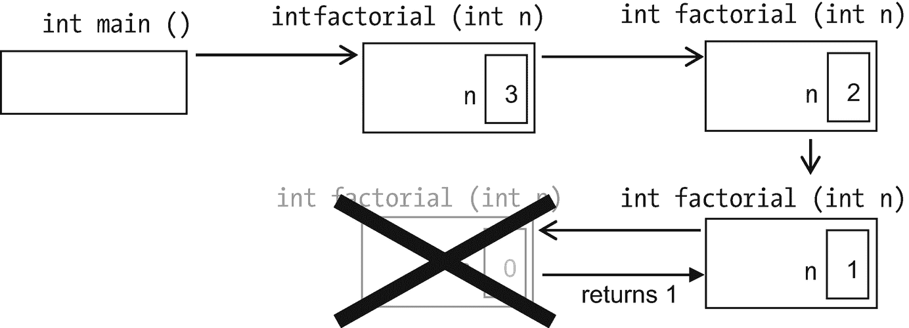

# 十八、异常、移动构造器和`=`、递归和 O 符号

一个必要的东西——处理错误条件的更好的方法——和一些非常好的东西:更有效的复制(“移动”函数)，调用自己的函数(递归),以及计算函数的时间效率的方法。

## 例外

程序应该如何处理运行时错误？一些选项:

*   鸵鸟算法:简单地希望问题永远不会发生——你的整数永远不会超过`INT_MAX`,你对`strcpy`的调用永远不会超过`char`数组，等等。我们做了很多，而且很有效！我们可以在核反应堆的软件中试试吗？验证谁能进入你的银行账户？哎呀。

*   崩溃:也不要在核电厂提出这个建议。

*   打印一条错误消息:适合您的笔记本电脑；对于微波炉或智能手表来说不太好。

*   返回一个错误代码:让你的函数返回`int`，如果返回值是表示“错误”的东西(可能是-1)，一定是哪里出错了。不过，总是检查返回值是一项很大的工作。

不同的情况需要不同的解决办法。我们需要一种简单的方法来区分错误检测(不会改变)和错误解决(会改变)。

为了说明做到这一点的“异常”机制，让我们举一个例子。**栈**是计算机科学中常用的数据结构。(你已经在第 9 章中遇到了调用栈。)就像一堆自助餐厅的托盘。你所能做的，就是在不打扰食堂工作人员的情况下，把一个托盘放在上面(“推”托盘)，从上面拿走一个(“砰”一声)，看着最上面的一个，注意这个托盘是否是空的。That 和(因为这是 C++)构造并可能破坏它。

我会偷懒(当然！)并避免动态记忆。

以下是我们可能会遇到的问题:

*   我们可能会尝试将一个项目推到一个已经满了的堆栈上(“溢出”)。

*   我们可能试图从空的堆栈中查看顶部的项目，或者弹出一个项目(“下溢”)。

成员函数应该只*注意到*的错误，比如这里的`top`:

```cpp
class                                    // A stack of strings
{
public:
    class UnderflowException    {};     // An "exception class"

    ...

    const std::string& top () const
    {
        if (empty()) throw UnderflowException ();
        else return contents_[howMany_-1]; // the top element
    }
    ...
};

```

如果一切顺利，`top`返回`Stack`中的最后一项，即`howMany_`-1。但是如果`Stack`为空，`top`使用对构造器的显式调用创建一个`UnderflowException`类型的对象。然后它**抛出** s(报告)。

(BNF 版本:`throw`

*<某些变量或值>* 。)如果没有人知道如何处理错误，程序就会崩溃，这是应该的。我们已经看到过未处理的异常，比如，当我们试图加载一个文件名拼错的图像时，SSDL 抛出了一个异常。这可能是我们所需要的，为了这个或者为了溢出。

示例 [18-1](#PC2) 显示了`Stack`类，突出显示了与异常相关的代码。

```cpp
// Stack class, with a limited stack size
//      -- from _C++20 for Lazy Programmers_

#ifndef STACK_H
#define STACK_H

#include <string>

class Stack
{
public:
    class UnderflowException    {}; // Exceptions
    class OverflowException     {};

    static constexpr int MAX_ITEMS = 5;
    Stack()                   { howMany_ = 0;  }
    Stack(const Stack& other)                   = delete

;1
    const Stack& operator= (const Stack& other) = delete;

    const std::string& top () const
    {
        if (empty()) throw UnderflowException ();
        else return contents_[howMany_-1];
    }

    void push (const std::string& what)
    {
        if (full ()) throw OverflowException  ();
        else contents_[howMany_++] = what;
    }

    std::string pop   ()
    {
        std::string result = top(); --howMany_; return result;
    }

    bool empty () const { return howMany_ == 0;         }
    bool full  () const { return howMany_ >= MAX_ITEMS; }
    // Why not just see if they're equal?  howMany_ *can't* be
    //   bigger than MAX_ITEMS, can it?
    //   Not if I did everything perfectly, but...
    //   better to program defensively if you aren't perfect

private:
    std::string contents_ [MAX_ITEMS];
    int         howMany_;  // how many items are in the stack?
};
#endif //STACK_H

Example 18-1A Stack class. Find it and Example 18-2 in source code, ch18, as 1-2-stack

```

但是如果我们愿意，我们可以让调用堆栈中的函数知道如何**捕捉**并处理抛出的内容。

把异常当成一个烫手山芋。`if`语句抛出。如果它所在的函数知道如何捕捉它，很好。如果没有，它就把这个烫手山芋，我指的是`UnderflowException`，传递给任何一个被称为 *it* 的函数，然后是那个调用那个函数的函数，以此类推。每一次，函数停止它正在做的事情并立即返回，延迟足够丢弃它的局部变量，必要时析构。这种情况一直持续到我们返回一个可以捕捉错误的函数，或者我们带着错误退出程序。

假设我们决定`main`应该处理这个错误。我将为`main`配备一个试抓块(例如 [18-2](#PC3) )。`try`部分包含了我想做的事情；`catch`部分包含出错时的错误处理代码。

```cpp
int main ()
{
    Stack S;

    try
    {

        ...
        cout << S.top (); // if top fails, skip the rest of the try block
                          //   and go straight to the catch block
        ...
    }
    catch (const Stack::UnderflowException&)
    {
        cout << "Error in main: stack underflow.\n";
        cout << "Saving everything and quitting...\n";
        ... code that handles any cleanup we need to do ...
        cout << "Quitting now.\n";
        return;
    }
    //maybe a catch for Stack::OverflowException too

    return 0;
}

Example 18-2Code to catch an UnderflowException. Also in project/folder 1-2-stack

```

`try` - `catch`块的结构是

```cpp
try { <do stuff> }
catch (<parameter>) {<error handling code> }

```

**可能还有更多的渔获**

 **那么什么*是*是`UnderflowException`？这就是你所看到的:一个类型为`UnderflowException`的对象，没有数据成员和成员函数。这很蠢吗？一点也不。`throw` ing 它告诉`main`发生了下溢。它还想知道什么？如果出于某种原因，你*确实*希望你的异常类包含数据成员、函数等等，没问题；`throw`和`catch`的工作方式相同。我几乎从来没有。

如果你在一个异常的`catch`块中，并想再次抛出它，请不带任何参数地说`throw`。

如果你想禁止一个函数抛出一个异常，在最上面一行追加`noexcept`:`void mustNotThrowExceptions () noexcept`。我很少这样做，但是下一节将展示一种用法。

应该使用异常吗？

没错。它们非常适合在应该处理错误的地方进行错误处理，只需编写最少的额外代码。我经常使用它们。(我承认我很少抓到他们。也许那是因为我更喜欢为那些核电站写库而不是软件。)

Exercises

1.  改编上一章的`String`类，如果传递给`[]`操作符或子串操作符`()`的索引超出范围，抛出异常。测试以确保其工作正常。

2.  添加并测试一个`Fraction`成员函数以转换为`double`；如果分母为 0，则抛出异常。

3.  将前一章中的`istream operator>>`修改为`Point2D`或`Fraction`，这样如果`istream`出错(就像在需要`int`的时候输入了`char`，它就会抛出一个异常。可以这样检测问题:`if (! myIstream) ...`

## 移动构造器并移动`=`(可选)

做了过多的工作，这可能会减慢我们的速度。(好的，*我*从来没有注意到，但是 C++ 社区对效率很挑剔。)考虑以下代码:

```cpp
newString = str1 + str2;

```

运算符`+`中有一个临时副本，重复如下。就是我们返回`result`的时候。这将调用复制构造器，其中包含对`strcpy`的调用。字符串越大，`strcpy`耗时越长。

```cpp
String String::operator+  (const String& other) const
{
    String result = *this; result += other; return result;
}

```

现代 C++ 有一种机制，通过这种机制，某些东西可以将它的内存让给需要它的其他东西，从而避免了复制的需要(例如 [18-3](#PC7) )。

```cpp
String (String&& other) noexcept   // The "move" constructor.
                                   // I'll explain "noexcept" in a moment
{
    contents_ = other.contents_;   // 2 statements; no loops,
    other.contents_ = nullptr;     //    no strcpy. Cheap!
}

Example 18-3A move constructor for String. In source code as part of project/folder 3-4-string

```

`&&`的意思是“如果参数可以放弃它的值，就应用这个函数。”`operator+`的`result`肯定是这样！所以我们从`result`(在 move 构造器中暂时称为`other`)获取内容。我们给它`nullptr`，这样当它遇到自己的析构函数时，它不会`delete[]`它给我们的`contents_`。

其他额外的工作是在我们离开+之后，当它提供的临时副本被`operator=`复制时，它也做一个`strcpy`。如果我们只是将副本的内容移动到`newString`中，我们可以节省时间。示例 [18-4](#PC8) 展示了新的`=`运算符。

像这样移动，而不是复制，被称为**移动语义**——我们将再次看到这个术语。

```cpp
String& String::operator= (String&& other)

noexcept //move =
{
    if (contents_) delete[] contents_;

    contents_       = other.contents_; //no loops! no strcpy!
    other.contents_ = nullptr;

    return *this;
}

Example 18-4A move assignment operator for String. Also part of 3-4-string in source code

```

为了测试这是否真的有效，我建议您这样做！–加载源代码(`ch18`的`3-4-string`项目)，在新的“move”函数中放置断点，并查看它们是否被调用。这条线应该叫两个:`newString = str1 + str2`；。

如果 move `=`或 move 构造器抛出异常，可能会发生奇怪的事情，所以如果我不把`noexcept`放在最后，编译器可能会警告我。我喜欢让它开心，所以我喜欢。

因为我们现在有了更多的选择，所以我想用下面的内容来取代旧的构造器和=的黄金法则:

Golden Rule of Constructors and =

要么有

*   没有构造器并且没有指定=(本质上是旧式的`struct` s ),或者

*   指定了默认构造器、复制构造器和=或

*   默认构造器、复制构造器和=，加上移动构造器和移动=。

Exercises

1.  改编第 16 章的练习 5 及其`Track`和`Album`来使用动态记忆。然后写一个 move 构造器，为`Album`移动`=`。使用调试器进行测试，以确保您在应该使用 move 函数的时候真的使用了它。

## 递归(可选；在下一节中引用)

有时候从事物本身来定义它是最简单的。

例如，考虑“阶乘”函数。5!(读作“5 阶乘”)就是 5*4*3*2*1 = 120。0!和 1！都是 1；总的来说，n！是 n*(n-1)*(n-2)...*2*1.(n-1)！is (n-1)*(n-2)*...*2*1;所以 n！= n*(n-1)！。随着 n 的增加，结果越来越大。

这是一个计算 n 的算法！；示例 [18-5](#PC10) 显示了完整的功能。

```cpp
if n is 0, return 1
else return n * (n-1)!

```

这说明了确保**递归**(一个调用自身的函数)终止所需的两个一般原则:

*   **必须有一个结束条件。**否则，递归永远不会结束(直到程序因内存不足而崩溃)。

*   出于同样的原因，必须朝着那个结束条件前进。

```cpp
int factorial (int n) // maybe give it unsigned --
                      //  and return unsigned long long?
{
    if (n == 0) return 1;
    else return n * factorial (n-1);
}

Example 18-5A simple recursive function, in source code as 5-factorial

```

递归有效的原因是 C++ 为每个调用创建了一个新的副本(“激活记录”)。假设您的主程序调用了参数为 3 的`factorial`。


`n`不是 0，只好调用`factorial (n-1)`。


我们一次又一次地调用`factorial`，直到我们得到一个版本的`factorial`，它的 n = 0，所以不再递归。它将向`factorial(1)`调用返回 1。



然后，`factorial(1)`返回`1*factorial(0)`，也是 1。


`factorial(2)`返回`2*factorial(1)`，为 2。


最后，`factorial(3)`返回`3` * `factorial(2)`，即 6。


如果你在微软 Visual Studio 中调试一个带有递归函数的程序，你可以在调用栈中看到该函数的副本(图 [18-1](#Fig1) )。


图 18-1

Visual Studio 中的调用堆栈

在`ddd`或`gdb`中，`where`向您显示调用栈。`up`和`down`带你在上面的函数副本之间切换——当你`print`一个变量时，它会使用你正在看的副本的上下文。

因为一个递归函数有多个副本，所以对于编译器来说，比我们通常的循环一个动作的方法，也就是迭代，要多做更多的工作。但是有时候递归编写函数比迭代更容易。

The Golden Rule of Recursion

每个递归函数都必须有，所以它会终止，

*   没有进一步递归调用的基本情况

*   在每次递归调用中向基本情况前进

### 防错法

*   **你的程序运行了一会儿，然后崩溃**说“分段错误”或“堆栈溢出”

    要么你忘记了结束条件，要么你没有朝它前进。您可以使用调试器来判断。

Exercises

1.  斐波那契数列是这样的:

    斐波那契(1) = 1

    Fibonacci (2) = 1

    如果 n > 2，则 Fibonacci(n)= Fibonacci(n–1)+Fibonacci(n–2)。

    使用递归来编写斐波那契函数和一个程序来测试它。

2.  编写并测试一个函数`void indent (const char* what, int howMuch)`，它在缩进`howMuch`空格后打印字符串`what`。如果`howMuch`为 0，则只打印字符串。如果没有，它打印一个空格并用`howMuch-1`空格来调用自己。

3.  编写并测试`pow`函数的递归版本。`pow (a, b)`返回 a <sup>b</sup> 。提示:a <sup>b</sup> = a * a <sup>b-1</sup> 。

4.  编写并测试一个递归函数 log，给定一个正整数`number`和一个整数`base`，返回 log <sub>base</sub> `number`。log <sub>base</sub> (number)定义为在达到 1 之前，你可以将数字除以底数的次数。比如 8/2 得 4，4/2 得 2，2/2 得 1；那是三个师；所以 log <sub>2</sub> 8 是 3。我们不会担心小数部分；log <sub>2</sub> 15 也是 3，因为(用整数除法)15/2 是 7，7/2 是 3，3/2 是 1。

## 效率和 O 符号(可选)

假设我们想对一个名字列表进行排序。我知道！让我们生成所有可能的名字排序，当我们得到一个完全有序的名字时就停止！电脑很快，对吧？

```cpp
do
   generate a new permutation of the elements
while we haven't found an ordered sequence

```

这不是很多细节，但我预测一个问题。假设有四个元素。第一个元素有四种可能。这就给下一个留下了三种可能性，给下一个留下了两种可能性，给最后一个留下了一种可能性；有 4*3*2*1 种可能:4！。所以对于 N 个元素，我们有 N 个！要考虑的顺序。用 N = 100，那就是 10 <sup>158</sup> 。电脑很快，但它们没有 T2 那么快。

有时候算法显然是个坏主意。有时直到你运行它，你才意识到它有多糟糕——除非你使用符号,这样你就能知道什么程序*而不是*要带给管理层，什么程序*而不是*要花时间去写。

考虑以下代码:

```cpp
for (int i = 0; i < N; ++i)
    sum += array[i];

```

初始化完成一次；比较、数组引用、赋值和递增都要进行 N 次。我们可以说有 1 + 4N 个东西被执行。

其他一些有循环的片段呢？可能有点不同，我们得到，哦，5 + 3N。哪个更快，或者它们是一样的？嗯。我们需要一个比较的方法。

O 符号极大地简化了我们描述这些时间需求的方式，从而帮助我们比较和评估它们。以下是 O 符号的简化规则:

*   当数据集很大时，如果一个加数明显小于另一个加数，则丢弃较小的加数。所以如果我们有 1 + 3N，我们丢弃 1，得到 3N。

*   放弃常数乘数。3N 变成 n。

结果写成 O(N)。for 循环是 O(N)，或者“是 N 阶的”

这种简化是合理的。我们关心的是当数据集很大时会发生什么(小数据集总是很快)。当 N 较大时，3N + 1 约为 3N；3，000，001 和 3，000，000 的差别可以忽略不计。我们也不关心常数乘数。无论是 N 从 3000 翻倍到 6000，还是 3N 从 9000 翻倍到 18000，都还是翻倍，我们想知道增加 N 是如何降低性能的。这告诉我们。

这里还有几个例子。考虑这个算法:

```cpp
read in N            1
read in M            1
read in P            1
add them             1
divide by 3          1
print the average    1

```

每一行是一个动作。把它们加起来，我们有六个。我们可以抛弃常数乘数；6 = 6 * 1，所以 O(6)=O(1)。这个算法是一阶的；不管我们给它什么值，它都需要相同的时间。

这里还有一个:

```cpp
for each element in an array     N x
   if this element is negative       (1
      change it to positive             + 1)

```

最后一行是一个动作。包含它的 if 语句多一个；O(2)=O(1)。因为是在 for 循环中，所以会做 N 次，其中 N 是数组的长度。所以这个算法是 O(N)。

这里还有一个:

```cpp
do
   for each successive pair of elements in an array
      if they are in the wrong order
         swap them
while our last iteration of the do-while loop had a swap in it

```

这个算法是一种对数组进行排序的方法。它是这样工作的。考虑一组芝麻街角色。

<colgroup><col class="tcol1 align-left"> <col class="tcol2 align-left"> <col class="tcol3 align-left"> <col class="tcol4 align-left"> <col class="tcol5 align-left"> <col class="tcol6 align-left"></colgroup> 
| 科米蛙 | 格罗弗 | 伯特(男子名ˌ等于 Burt) | 奥斯卡金像奖 | 小猪 | 埃尔默 |

do-while 循环的第一次迭代根据需要对每个连续的对进行交换。克米特应该换成格罗弗:


伯特:


我们继续在数组中移动，直到到达末尾，交换任何顺序错误的数组对。

<colgroup><col class="tcol1 align-left"> <col class="tcol2 align-left"> <col class="tcol3 align-left"> <col class="tcol4 align-left"> <col class="tcol5 align-left"> <col class="tcol6 align-left"></colgroup> 
| 格罗弗 | 伯特(男子名ˌ等于 Burt) | 科米蛙 | 奥斯卡金像奖 | 埃尔默 | 小猪 |

它仍然不正常，但我们取得了进展。这是我们再次遍历数组后得到的结果:

<colgroup><col class="tcol1 align-left"> <col class="tcol2 align-left"> <col class="tcol3 align-left"> <col class="tcol4 align-left"> <col class="tcol5 align-left"> <col class="tcol6 align-left"></colgroup> 
| 伯特(男子名ˌ等于 Burt) | 格罗弗 | 科米蛙 | 埃尔默 | 奥斯卡金像奖 | 小猪 |

另一个:

<colgroup><col class="tcol1 align-left"> <col class="tcol2 align-left"> <col class="tcol3 align-left"> <col class="tcol4 align-left"> <col class="tcol5 align-left"> <col class="tcol6 align-left"></colgroup> 
| 伯特(男子名ˌ等于 Burt) | 格罗弗 | 埃尔默 | 科米蛙 | 奥斯卡金像奖 | 小猪 |

另一个:

<colgroup><col class="tcol1 align-left"> <col class="tcol2 align-left"> <col class="tcol3 align-left"> <col class="tcol4 align-left"> <col class="tcol5 align-left"> <col class="tcol6 align-left"></colgroup> 
| 伯特(男子名ˌ等于 Burt) | 埃尔默 | 格罗弗 | 科米蛙 | 奥斯卡金像奖 | 小猪 |

这种算法被称为“冒泡排序”，因为元素逐渐“冒泡”到正确的位置。(还有“bogo-sort”被人说是邪恶的，因为太慢了。我不知道他们会把我之前的排列方法叫做什么，但它不会很好。)

用 O 表示法需要多长时间？“如果它们的顺序不对，就交换它们”是 O(1)。我们遍历整个数组，进行 N-1 次比较；所以通过数组的次数是 O(N-1)=O(N)。我们通过了多少次？如果数组非常无序——比方说，如果 Bert 在最后一个槽中——我们将需要 N-1 次传递，因为每次传递最多将 Bert 向左移动一个槽。O(N(N-1))= O(N<sup>2</sup>-N)= O(N<sup>2</sup>)。

O(N <sup>2</sup> )称为“二次时间”；O(N)可预测地称为“线性时间”O(1)是“恒定时间”我们尽量避免 O(2 <sup>N</sup> )，“指数时间”

Online Extra

要测量*实际的*时间…“测量你的代码到毫秒”:在 YouTube 频道“以懒惰的方式编程”，或者在 [`www.youtube.com/watch?v=u_zyO7LgXog`](http://www.youtube.com/watch%253Fv%253Du_zyO7LgXog) 找到它

运筹学

在 Apress 博客上用 C++ 计时的事情: [`www.apress.com/us/blog/all-blog-posts/timing-things-in-c-plus-plus/17405398`](http://www.apress.com/us/blog/all-blog-posts/timing-things-in-c-plus-plus/17405398) 。

Exercises

1.  对于示例 [10-3](10.html#PC13) 中返回数组中最小数字的函数，用 O 表示的时间是多少？

2.  …对于一个函数来说，确定一个单词是否是回文？

3.  …对于打印 N `×` N 网格中所有元素的函数？

4.  写一个函数`intersection`,在给定两个数组的情况下，找到所有相同的元素，并将它们放入一个新数组中。用 O 符号表示的时间要求是什么？

5.  编写冒泡排序，并验证它的工作原理。

6.  写一个程序，使用厄拉多塞筛找出所有达到某个极限的素数:你遍历并消除除 2 之外的所有能被 2 整除的数，然后除 3 之外的所有能被 3 整除的数，依此类推。

    用 O 符号表示的时间要求是什么？

7.  上一节的练习 2、3 和 4 需要多长时间？

8.  使用“在线附加”链接中的方法，对不同大小的数组进行时间泡排序。和 O 符号预测的相符吗？预计您测量的时间会有很多随机变化。

<aside aria-label="Footnotes" class="FootnoteSection" epub:type="footnotes">Footnotes [1](#Fn1_source)

这表示，“我不会写这个函数，编译器也不会。”复制一个堆栈对我来说似乎是不安全的，我绝对看不到一个原因。如果有任何东西试图调用这个函数，编译器会说不。

你也可以删除默认的构造器和析构函数，虽然我很少这样做。

 </aside>**