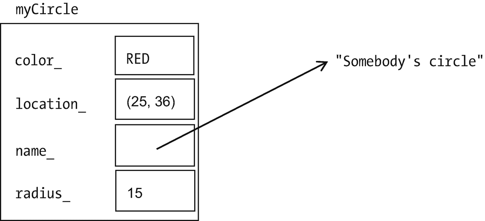
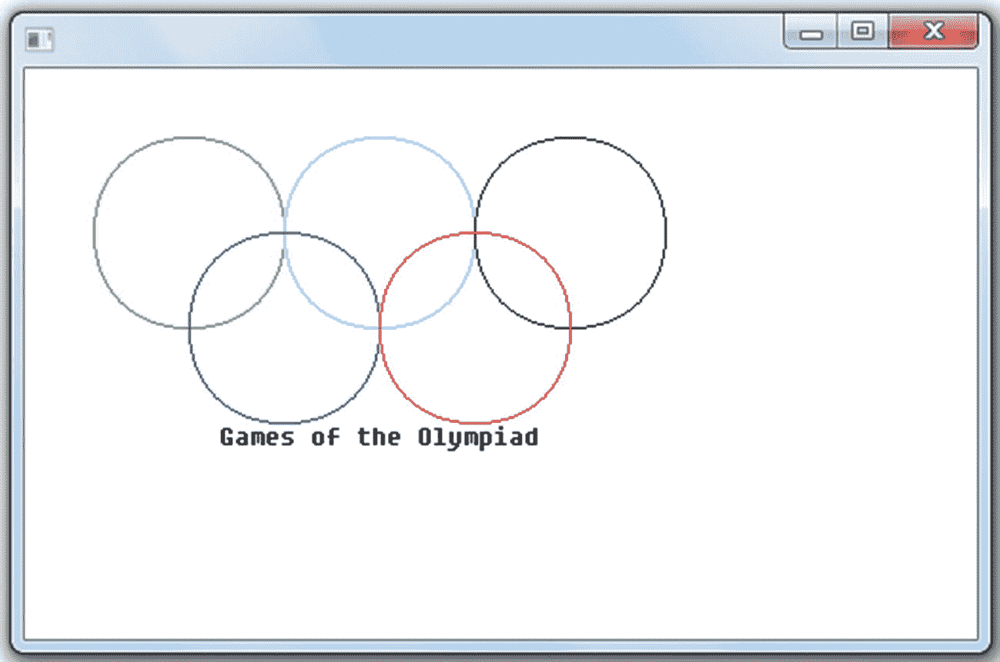
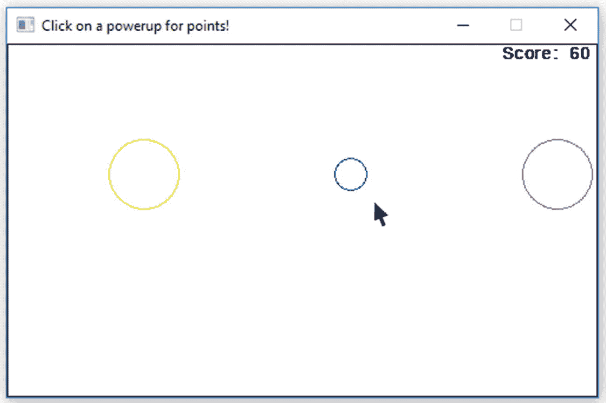
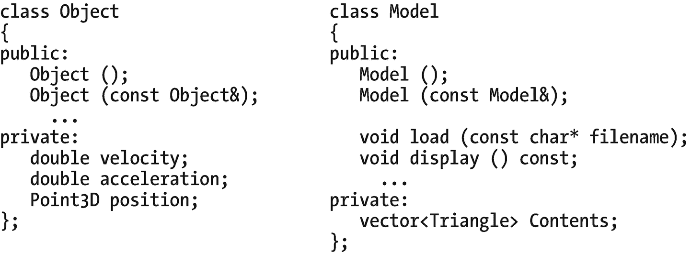
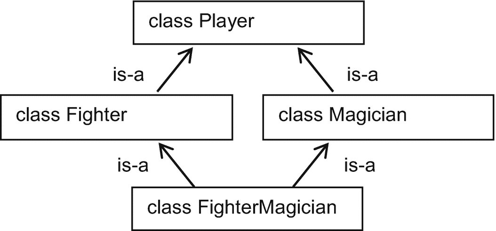

# 二十一、虚函数和多重继承

虚函数和多重继承在我写的大多数类中都没有出现——但是当我需要它们的时候，我就需要它们。

## 虚函数，加上:移动具有可移动父类和类成员的函数

**多态性**本质上是用同一个词来表示不同的东西。我们一直都是这么做的。考虑操作符`+`。我们用它来添加`int` s 或`double` s 或`string` s。这些在概念上是相似的，但它们由机器来完成是非常不同的。

另一个例子可能是函数`start`，它可以应用于汽车、飞机或割草机。在每种情况下，功能的主体将是不同的(转动钥匙，通过飞行检查，拉动曲柄绳)。但是名字是一样的。

考虑一下我们想要在计算机屏幕上绘制二维形状的类:圆形、矩形、正方形和大块文本。这些有很多共同点:位置、颜色以及被绘制和移动的能力。我们可以把那些共同的品质放在一个父类`Shape`(图 [21-1](#Fig1) ，例 [21-1](#PC1) )。


图 21-1

一个等级制度

```cpp
//Shape class, for use with the SSDL library
//        -- from _C++20 for Lazy Programmers_

#ifndef SHAPE_H
#define SHAPE_H

#include "SSDL.h"

struct Point2D  // Life would be easier if this were a full-fledged class
{               //   with operators +, =, etc. . . . but that
    int x_, y_; //   was left as an exercise
};

class Shape
{
 public:
    Shape (int x = 0, int y = 0, const char* text = "");
    Shape (const Shape& other);
    ~Shape() { if (description_) delete[] description_; }

    Shape& operator= (const Shape& s);

    // Color
    void  setColor(const SSDL_Color& c) { color_ = c;          }
    const SSDL_Color&  color   () const { return color_;       }

    // Access functions
    const Point2D&  location   () const { return location_;    }
    const char*     description() const { return description_; }

    // Drawing
    void   drawAux() const;
    void   draw   () const
    {
        SSDL_SetRenderDrawColor (color ()); drawAux();
    }

    // Moving
    void moveBy (int deltaX, int deltaY)
    {
        moveTo (location_.x_ + deltaX, location_.y_ + deltaY);
    }

    void moveTo (int x, int y)
    {
        location_.x_ = x;   // Point2D::operator= would help here!
        location_.y_ = y;
    }

 private:
    Point2D    location_;
    SSDL_Color color_;
    char*      description_;  // Using char* not std::string helps //   illustrate how this chapter
                              //   affects dynamic memory
    void copy(const char*);   // Used for copying descriptions
};
#endif //SHAPE_H

Example 21-1shape.h

```

注意函数`draw`:它使用`SSDL_SetRenderDrawColor`来告诉 SSDL 开始使用`Shape`的颜色，然后调用`drawAux`，一个助手函数来完成实际的绘制。对于`Circle` s 来说`drawAux`将是不同的(这里它将使用`SSDL_RenderDrawCircle`)，`Text` s(这里它将调用`SSDL_RenderText`)，等等。`Circle`的`drawAux`如示例 [21-2](#PC2) 所示。

```cpp
//Circle class, for use with the SSDL library
//   -- from _C++20 for Lazy Programmers_

#ifndef CIRCLE_H
#define CIRCLE_H

#include "shape.h"

class Circle: public Shape
{
 public:
    Circle () : radius_ (0)  {}
    Circle (const Circle& c) : Shape(c), radius_ (c.radius()) {}
    Circle (int x, int y, int theRadius, const char* txt="") :
        Shape (x, y, txt), radius_ (theRadius)
    {
    }

    Circle& operator= (const Circle& c)
    {
        Shape::operator= (c); radius_ = c.radius (); return *this;
    }

    int radius () const { return radius_; }

    void drawAux() const
    {
        SSDL_RenderDrawCircle (location().x_, location().y_, radius());
    }

 private:
    int radius_;
};

#endif //CIRCLE_H

Example 21-2circle.h

```

我们现在可以试着画一个`Circle`:

`Circle c (10,10,5); c.draw (); // draw a Circle of radius 5 at (10,10)`...但是行不通；编译器抱怨在`Shape::draw`中调用的`Shape::drawAux`没有被编写。没错。`Circle`的`drawAux`写了，但是`Shape::draw`对`Circle`的功能一无所知。

我们需要的是一种方法，让`Shape::draw`调用`drawAux`的*右*版本:`Circle` s 用`Circle::drawAux`，`Text` s 用`Text::drawAux`等等。

这是修复:**虚函数**。

```cpp
class Shape
{
public:
    ...
    virtual void drawAux ();
    ...
};

Example 21-3The Shape class, with a virtual function

```

在示例 [21-3](#PC3) 中，我们告诉`Shape`类，“无论何时调用`drawAux`，使用子类的版本，如果有的话。”

`Circle`需要被告知它的`drawAux`正在覆盖一个虚函数，所以我们也这样做(例子 [21-4](#PC4) )。

```cpp
class Circle: public Shape
{
    ...
    void drawAux () const override;1
    ...
};

Example 21-4The Circle class, with the override specifier

```

### 在幕后

以前，一个给定类的对象只存储数据成员(图 [21-2](#Fig2) )。它没有将成员函数和对象一起存储在内存中，因为这样会浪费空间。



图 21-2

一个`Circle`对象，在虚函数之前

但是现在对象也包含了任何虚函数的地址，所以它记住了要调用哪个版本(图 [21-3](#Fig3) )。



图 21-4

例 [21-6](#PC8) 中奥林匹克标志程序的输出


图 21-3

一个`Circle`对象，使用虚函数

我们增加了一些开销:在每个`Circle`中为`drawAux`函数增加了一个额外的指针。但是开销很小，没什么好担心的。

### 纯虚函数和抽象基类

下一个问题:不管怎样，我们怎么写`Shape::draw()`？

除非我们指定它是`Shape`的什么*种类*——除非它是`Circle`或其他子类——否则这个问题没有答案。所以我们将采取简单的方法:我们不会为`Shape`编写它，而是告诉编译器，“你不能有一个`Shape`那只是一个`Shape`，这个函数就是为什么。”

```cpp
class Shape
{
public:
    ...
    virtual void drawAux ()=0;
    ...
};

Example 21-5The Shape class, with a pure virtual function. This makes Shape an “abstract” class

```

通过添加`=0`，我们将`drawAux`变成了一个**纯虚拟的**函数，将`Shape`变成了一个**抽象类**，这意味着你不能用它来声明变量:

```cpp
Shape myShape;    // Nope, can't do this, the compiler will stop you
Circle myCircle;  // No problem: it's a shape, but it's also a Circle,
                  //    and we can drawAux Circles

```

### 为什么虚函数经常意味着使用指针

我们可能想对`Shape` s 做些什么:将它们放入一个向量，并对向量中的每个`Shape`做些什么(比如`draw()`):

```cpp
// Program to show, and move, the Olympic symbol
// It uses Circle, and a subclass of Shape called Text
//        -- from _C++20 for Lazy Programmers_

#include <vector>
#include "circle.h"
#include "text.h"

int main (int argc, char** argv)
{
    SSDL_SetWindowSize (500, 300); // make smaller window

    // Create Olympic symbol
    std::vector<Shape> olympicSymbol; // No, this isn’t going to work...
    constexpr int RADIUS = 50;

    // consisting of five circles
    olympicSymbol.push_back (Circle ( 50,  50, RADIUS));
    olympicSymbol.push_back (Circle (150,  50, RADIUS));
    olympicSymbol.push_back (Circle (250,  50, RADIUS));
    olympicSymbol.push_back (Circle (100, 100, RADIUS));
    olympicSymbol.push_back (Circle (200, 100, RADIUS));

    // plus a label
    olympicSymbol.push_back (Text (150,150,"Games of the Olympiad"));

    // color those circles (and the label)
    SSDL_Color olympicColors[] = { BLUE,
                      SSDL_CreateColor (0, 255, 255), // yellow
                      BLACK, GREEN, RED, BLACK };
    for (unsigned int i = 0; i < olympicSymbol.size(); ++i)
        olympicSymbol[i].setColor (olympicColors [i]);

    // do a game loop
    while (SSDL_IsNextFrame ())
    {
        SSDL_DefaultEventHandler ();

        SSDL_RenderClear (WHITE);     // clear the screen

        // draw all those shapes
        for (unsigned int i = 0; i < olympicSymbol.size(); ++i)
            olympicSymbol[i].draw ();

        // move all those shapes
        for (unsigned int i = 0; i < olympicSymbol.size(); ++i)
            olympicSymbol[i].moveBy (1, 1);
    }

    return 0;
}

```

这很有意义:创建一系列`Shape`的序列，然后绘制它们。但是行不通。一个原因是`Shape`现在是一个抽象类；既然你不能创造出仅仅是`Shape`的东西，你当然也不能创造出它们的`vector`。

另一个原因是，例如，`olympicSymbol[0]`有足够的空间来存储单个`Shape`。这意味着它有空间容纳一个`color_`、一个`location_`、一个`description_`和一个指向`drawAux`的指针。你会把`Circle`的`radius_`存放在哪里？`Text`对象的`contents_`？没有地方了！

为了解决这个问题，我们需要动态内存。是的，我知道；懒惰的程序员避免使用动态内存，因为它容易出错，也更难编写。但有时你必须拥有它。在这种情况下，当您使用`new`创建一个`Circle`时，它将分配它需要的数量。

和我们之前使用动态内存的方式不一样。然后，我们想要一个数组，所以我们用`[]` : `char* str = new char [someSize]`，和`delete [] str`来清理。这一次，当我们分配一个`Shape`时，我们分配*一个*??。所以我们省略了`[]`的:`new` `Circle`而不是`new Circle [...]`；`delete`不是`delete []`。我们将在下一章中得到更多分配/释放单个元素的练习。

```cpp
// Program to show, and move, the Olympic symbol
// It uses Circle, and a subclass of Shape called Text
//        -- from _C++20 for Lazy Programmers_

#include <vector>
#include "circle.h"
#include "text.h"

int main (int argc, char** argv)
{
    SSDL_SetWindowSize (500, 300); // make smaller window

    // Create Olympic symbol
    std::vector<Shape*> olympicSymbol;
    constexpr int RADIUS = 50;

    // consisting of five circles
    olympicSymbol.push_back (new Circle ( 50,  50, RADIUS));
    olympicSymbol.push_back (new Circle (150,  50, RADIUS));
    olympicSymbol.push_back (new Circle (250,  50, RADIUS));
    olympicSymbol.push_back (new Circle (100, 100, RADIUS));
    olympicSymbol.push_back (new Circle (200, 100, RADIUS));

    // plus a label
    olympicSymbol.push_back (new Text (150,150,"Games of the Olympiad"));

    // color those circles (and the label)
    SSDL_Color olympicColors[] = { BLUE,
                   SSDL_CreateColor (0, 255, 255), // yellow
                   BLACK, GREEN, RED, BLACK };
    for (unsigned int i = 0; i < olympicSymbol.size(); ++i)
        (*olympicSymbol[i]).setColor (olympicColors [i]);

    // do a game loop
    while (SSDL_IsNextFrame ())
    {
        SSDL_DefaultEventHandler ();

        SSDL_RenderClear (WHITE);   //clear the screen

        // draw all those shapes
        for (unsigned int i = 0; i < olympicSymbol.size(); ++i)
            (*olympicSymbol[i]).draw ();

        // move all those shapes
        for (unsigned int i = 0; i < olympicSymbol.size(); ++i)
            (*olympicSymbol[i]).moveBy (1, 1);
    }

    // done with our dynamic memory -- throw it back!
    for (unsigned int i = 0; i < olympicSymbol.size(); ++i)
        delete olympicSymbol [i];

    return 0;
}

Example 21-6A program that successfully uses a vector of Shapes to display and move a complex symbol. Output is in Figure 21-4

```

在这段代码中，我们使用的`vector`不是`Shape`的，而是`Shape*`的。然后，当我们使用`new`来创建一个`Circle`或`Text`时，它可以为我们获得一个适合该子类大小的内存块。

由于`olympicSymbol[i]`是一个指针，我们说的不是`olympicSymbol[i].draw ()`而是`(*olympicSymbol[i]).draw ()`。 <sup>[2](#Fn2)</sup>

最后，和使用动态内存时一样，当我们完成时，我们用`delete`把内存扔回去。

为了确保所有的数据都被返回，我们需要下一部分。

### 虚拟析构函数

考虑前面例子中的`Text`对象，它包含“奥林匹克运动会”

```cpp
// Text class, for use with the SSDL library
//        -- from _C++20 for Lazy Programmers_

#ifndef TEXT_H
#define TEXT_H

#include "shape.h"

class Text : public Shape
{
public:
    Text(const char* txt = "")             { copy(txt);             }
    Text(const Text& other) : Shape(other) { copy(other.contents_); }
    Text(int x, int y, const char* txt = "") : Shape(x, y)
    {
        copy(txt);
    }
    ~Text() { if (contents_) delete contents_; } // Not quite right...

    Text& operator= (const Text& other);

    const char* contents () const { return contents_; }

    void drawAux () const override
    {
        SSDL_RenderText(contents_, location().x_, location().y_);
    }

private:
    char* contents_;
    void copy(const char* txt); // used for copying contents
};
#endif //TEXT_H

Example 21-7text.h

```

它使用动态内存来分配它的字符数组。自然地，当我们完成后，我们需要把它扔回去。但是`main`中应该这样做的语句——`for (int i = 0; i < olympicSymbol.size(); ++i) delete olympicSymbol [i];`——却没有这样做。`olympicSymbol [i]`是一个`Shape`的指针，不是一个`Text`；所以只会删除属于`Shape`的东西。它不知道`Text`的`contents_`。

解决方法还是使用*知道*的函数版本:?? 的版本。我们通过让`Shape`的析构函数`virtual`和`Text`的析构函数`override`来做到这一点:

```cpp
virtual Shape::~Shape ()       { if (description_) delete[] description_; }

        Text::~Text   () override  { if (contents_) delete contents_;     }

```

现在，当调用`Shape`上的析构函数时，`Shape`将知道调用哪个版本。如果是一个`Text`，被调用的析构函数将是`Text::~Text ()`——当它完成时，调用父类`Shape`的析构函数，因为析构函数无论是否是虚拟的都会这样做。

当你建立一个继承层次时，很容易忘记你是否在这个类或那个类中使用了虚函数。当你写父类的时候，没有办法知道没有后代会使用动态内存。因此，如果有任何人动态分配某个子类的任何成员的可能性，你怎么知道呢？–将析构函数设为虚拟的更安全。

Golden Rule of Virtual Functions

(普通版本)如果你在一个类层次结构中使用虚函数，让析构函数是虚拟的。

(更强版本)既然你不知道写类的时候写子类的人会做什么……那就把所有析构函数都虚拟化吧。句号。

我在`Text`中使用了`char* contents_`,在`Shape`中使用了`char* description_`,以清楚地表明我们需要析构函数。但是如果它们是`string`的，同样的事情也会发生:当你删除一个指向`Shape`的指针，而这个指针实际上是一个指向`Text`的指针时，`delete`不会知道它实际上是一个`Text`，所以`Text`的析构函数——不管是我们写的还是编译器的默认——都不会被调用，也没有什么能告诉`Text`的成员`contents_`删除它的内存。所以你仍然需要给`Shape`一个虚拟析构函数:

```cpp
virtual Shape::~Shape () { }

```

### 使用可移动的父类和类成员移动函数(可选)

如果你为`Shape`及其子类编写 move 构造器，你可能会发现`Shape`的工作很好，但是当你试图从`Text`使用它时:

```cpp
Text::Text (Text&& other) noexcept: Shape (other) // Nope, not working right...
{
    ...
}

```

它调用`Shape`的常规复制构造器，尽管`Shape`也是可移动的(有移动函数)。

当您使用`Text`的 move 构造器时，这是因为 C++ 认为被复制的东西是一个“r 值”，一个您可以安全地用完、破坏等等的东西，因为它不会被再次使用，所以我们窃取它的内存是完全安全的。

但是当它在构造器中的时候，我们需要保留它直到我们完成，所以它的 r 值被去掉了。所以当我们调用`Shape (other),`时，它不知道使用 move 构造器。

C++ 的解决方法是强制它返回到调用的 r 值。`std::move(other)`将`other`变回 r 值:

```cpp
#include <utility> // for std::move

...

Text::Text (Text&& other) noexcept : Shape (std::move

(other))
{
    contents_ = other.contents_; other.contents_ = nullptr;
}

```

移动`=`也是如此:在将`other`交给`Shape`的移动`=`之前，我们需要将它变回 r 值。

```cpp
Text& Text::operator= (Text&&      other) noexcept
{
    Shape::operator= (std::move(other));
    //...
    return *this;
}

```

对于使用移动语义的数据成员也应该这样做。例如，如果我们让`Text::contents_`被声明为`String`(它也使用移动语义)而不是`char*`，`Text`的移动函数在访问它时将需要使用`std::move`(示例 [21-8](#PC15) ，突出显示)。

```cpp
Text::Text (Text&& other) noexcept :
    Shape (std::move(other)), contents_(std::move (other.contents_))
{
}

Text& Text::operator= (Text&&      other) noexcept
{
    Shape::operator= (std::move (other));
    contents_ = std::move (other.contents_);
    return *this;
}

Example 21-8How to call move functions of parents and movable data members: use std::move

```

### 防错法

*   **编译器说你的子类的** **覆盖** **函数与基类中的任何一个都不匹配。**您可能已经将`const`从函数头中去掉，或者拼写了不同的函数名，或者给了它一个稍微不同的参数列表。

*   编译器说你的子类是抽象的，但它不包含纯虚函数。比如，

`Circle myCircle;`

可能会抱怨`Circle`很抽象——但是你根本没有在里面放任何虚函数！

你可能忘了覆盖父类的纯虚函数。这也使得子类变得抽象。

或者您可能忘记了将相应的子类函数设置为`override`，并且它的头文件与父类函数的头文件不完全匹配(请参见反屏蔽一节中的前一条)。解决方法:添加`override`。

Exercises


图 21-6

从`Model`和`Object`继承`ModelObject`



图 21-5

通电练习，展示“虫洞”动画

1.  在这个简单的射击游戏中，你可以点击鼠标击中一个目标。启动的类型——闪速启动、巨型启动或虫洞——在你点击其中一个时会给出不同的点数并显示不同的动画(见图 [21-5](#Fig5) )。

在本章的示例代码部分，您会发现一个部分编写的程序，用于拍摄加电。它使用了`Shape`层次结构。为了让它工作，你需要修改`main.cpp`来使用指针，并在`Powerup`类层次结构的正确位置添加`virtual`和`override`。我建议将`Powerup`抽象化，原因和`Shape`一样。

1.  (使用移动语义)修改练习 1 中的类以使用移动语义。

2.  在第 19 章的`CardGroup`类层次中，给每个可能需要它们的子类添加函数`isLegalToAdd`和`isLegalToRemove`。(例如，只有当单元格为空时，`Cell::isLegalToAdd`才返回 true，只有当单元格不为空时，`Cell::isLegalToRemove`才返回 true。)

    让`CardGroup`的`addCardLegally`调用`isLegalToAdd`，使用虚函数，因此它调用适当的子类版本。其他职业都不应该有自己的`addCardLegally`。

    测试以确保实际调用了正确的函数。你可能需要一些试抓块。

3.  (更大的项目)扩展练习 2，写一个非图形化的自由细胞游戏。你应该有一个`CardGroup`(实际上是`CardGroup*`)的数组或向量，包括`FreecellPile`、`Cell`和`Foundation` s。让用户指定将卡片从哪个`CardGroup`移出或移入哪个`CardGroup`(比如说，“F1”代表基础 1，“P2”代表堆 2)。选择的`CardGroup`知道，基于它是什么子类，使用`isLegalToAdd`或`isLegalToRemove`的哪个版本:

    ```cpp
    CardGroup* from = askUserToPickCardGroup();
    if ((*from).isLegalToRemove())
                      // can we take card from top?
        ...

    ```

## 多重继承(可选)

考虑三维图形程序的这两个类:



类别`Object`有位置、速度和加速度。这是为了研究运动定律。

类是具有物理外观的东西。它由三角形组成，这些三角形组合在一起形成一个明显的固体。

你能拥有不是 ?? 的 ?? 吗？当然可以。你可能有一个其他格式的模型，不使用三角形——也许是一个球体。

你能拥有不是 ?? 的 ?? 吗？当然可以。你可以使用 CAD/CAM 来设计制造产品。

所以一个`Model`不是一个`Object`，一个`Object`也不是一个`Model`……但是两者兼而有之是有道理的。我会把那个东西叫做`ModelObject`。

由于`ModelObject`是一个`Model`和一个`Object`，它继承了两者的特征:它将拥有类似于`Object`和矢量`Triangle` s 的位置、速度和加速度，加上来自`Model`的`load`和`display`函数。

我们可以使用公共或私有继承。`public`有道理:

```cpp
class ModelObject: public Model, public Object
{
public:
    ModelObject () {}
     ModelObject (const ModelObject& other)
         : Model (other), Object (other)
    {
    }
     ...
};

```

要调用父构造器，就像处理普通继承一样使用`:`;但是这一次，调用两个父构造器(或者使用它们的默认值)。

这不是经常需要的，但是当需要时，它很方便。

### 防错法

假设我们做一个角色扮演游戏。其中我们有类`Player`，有一个`name_`和一些`hitPoints_`。它还有一个成员函数`takeAttack (int howMuch)`，可以减少一定数量的生命值。

我们创建两个子类，`Fighter`和`Magician`。一个`Fighter`有一个成员`attack`，带走一个`Player`，降低其生命值。A `Magician`有一个成员`bespell`，做魔法攻击。

但是有些游戏让你为你的角色制造混合职业。我们将使`FighterMagician`成为`Fighter`和`Magician`的子类。现在我们有了一个既能`attack`又能`bespell`的类。酷。

但是有一个问题。`Fighter`有成员`hitPoints_`和`name_`(继承自`Player`)。`Magician`还有`hitPoints_`和`name_`(继承自`Player`)。所以`FighterMagician`有两份`hitPoints_`和两份`name_`！

出于某种原因，这被称为“钻石问题”。也许图 [21-7](#Fig7) 会给我们一点线索？



图 21-7

多重遗传中的钻石问题

我们无法推理出解决这个问题的方法；C++ 将会帮助我们。它确实做到了:它让我们可以创建`Fighter`和`Magician`“虚拟”基类，本质上是说，“不要做那种额外复制公共祖父母成员的事情”:

```cpp
class Fighter:  virtual public Player ...
class Magician: virtual public Player ...

```

另一个问题:由于`Fighter`和`Magician`可能调用不同的`Player`构造器，这将导致歧义，`FighterMagician`必须明确声明它想要调用什么`Player`构造器，就像这样:

```cpp
FighterMagician (const char* name) : Fighter  (...some args...),
                                     Magician (...some args...),
                                     Player   (name)
{
}

```

如果我们不指定，编译器将使用缺省值。

Exercises

1.  编写反欺诈部分的类—`Player`、`Fighter`、`Magician`和`FighterMagician`。

    因为你不是在做一个真正的游戏，为了简单起见，`attack`和`bespell`都可以从对手的生命值中随机抽取数字。`FighterMagician`用`attack`还是`bespell`都没关系——从`main`中选一个作为它的战斗方式。

    现在让一个`Fighter`(比方说)和一个`FighterMagician`对抗，看谁赢了这场比赛。

2.  使用`Shape`类，创建一个既有`Shape`又有`location`、`virtual drawAux`等的`Composite`类。)和一个`Shape*`的向量(所以可以用`Circle` s、`Text` s，随便什么)。请确保您的`Composite`可以被创建、移动、显示并被正确地析构。如果您已经讨论了移动语义，那么编写移动构造器并移动`=`。

    一个棘手的问题是，`Composite`有两种位置:从`Shape`继承的位置和它所有子组件的位置。让你的`move`函数更新所有位置。

3.  如果你做了虚函数部分的练习 1，你可以用一个`PowerupSet`类来扩展它，它既是一个`Shape`也是一个`Powerup*`的向量。确保你的`PowerupSet`可以被创建、绘制和动画化，并且被正确地析构。`main.cpp`中采用`vector<Powerup>`的函数(或类似的函数)应该改为采用`PowerupSe` t。如果您已经讨论了 move 语义，那么编写 move 构造器并移动`=`。

    t 有两种位置:继承自 ?? 的位置和其子组件的位置。让你的`move`函数更新所有位置。

<aside aria-label="Footnotes" class="FootnoteSection" epub:type="footnotes">Footnotes [1](#Fn1_source)

编译器并不要求这样，但这是一个非常好的主意*。它会让编译器注意到父函数和子函数的拼写是否不同，或者参数列表或`const`规格是否略有不同。*

  [2](#Fn2_source)

如果所有这些括号让你的小指感到疲劳，那么，在下一章中，我们有一个更简单的方法来写它。

 </aside>