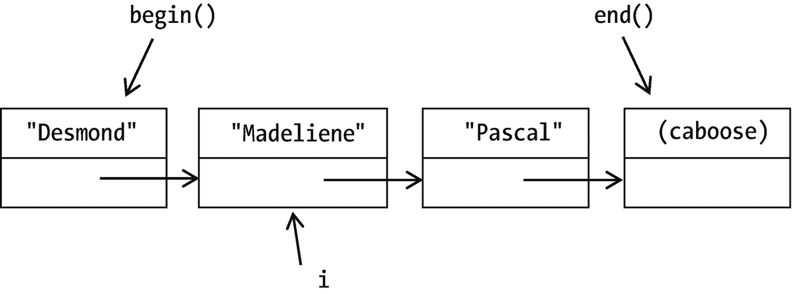

# 23.标准模板库

是不是每个程序员都应该自己做向量，列表等等？哦，当然不是。所以前段时间，标准模板库(STL)被放到了标准里。在 STL 中，你会发现像`list`和`vector`这样的容器；`string`年代，正如我们已经使用它们一样；以及`swap`、`find`、`copy`等常用功能。

你还会发现对效率的过分强调。我说“烦人”是因为 STL 通过*禁用*低效的东西来提升效率。如果你想把`operator[]`和一个`list`一起用，那就算了；太慢了(O(N)时间，如果你做 O 记号的话)。如果你想要`[]`，STL 的开发者认为你可以使用`vector`。他们是对的。但我还是会生气。

我们必须以某种方式获取列表的元素。怎么做？让我们现在就解决这个问题。

## 迭代程序

`list`的`operator[]`不存在。`Entry`年代是私有的。我们能做什么？

STL 的`list`类提供了**迭代器**——说明我们在`list`中的位置并可以遍历它。以下是您可以对它们做的事情:

```cpp
// doSomethingTo each element of myList, from beginning to end
for (list<T>::iterator i = myList.begin

(); i != myList.end (); ++i)
   doSomethingTo (*i);

```

像我们的`Entry`结构一样，`iterator`类型是`list<T>`的成员，但是是公开可用的。如图所示，它往往从`begin()`开始，即列表的开始，一直持续到到达`end()`(图 [23-1](#Fig1) )。



图 23-1

一个列表，有它的`begin()`和`end()`访问函数，一个迭代器`i`表示第二个元素。`end()`是最后一个元素的下一步

`end()`不是指最后一个元素，而是指最后一个元素之后的一个*。把`list`想象成一列汽车，这是它的车尾。我们检查它，看看我们是否走得太远，使用`!=`而不是`<`。(一个迭代器是否小于另一个迭代器没有定义——但是它们是否相等是有定义的。)*

 *`++i`和`i++`按预期工作；他们带你到下一个元素。

要得到的不是迭代器而是它所引用的东西，把`*`放在前面，就像前面的循环一样。

仅此而已！

你的反应类似于“但是什么是迭代器呢？”？

形式上，就像描述的那样:它是一个引用列表中一个元素的东西，当你说`++`的时候，它就转到下一个元素。

非正式地…它不完全是一个指针，但是它确实指向一些东西。你可以使用`*`和`->`，就像你使用指针一样。但是`++`的意思是转到列表中的下一个元素，*不是*下一个内存地址，就像用指针一样。把它想象成一个手指，你可以把它放在一个条目上，并在你喜欢的时候移动到下一个条目——但它实际上是一个类，如示例 [23-1](#PC2) 所示。

```cpp
template <typename T>
class List
{
    ...

private:
    ...

    Entry* start_;                         // points to first element
    Entry* end_;                           //  ...and the caboose

public:
    class iterator                         // an iterator for List
    {
    public:
        iterator (const iterator& other)  : where_ (other.where_) {}
        iterator (Entry* where = nullptr) : where_ (where)        {}

        const iterator& operator= (const iterator& other)
        {
            where_ = other.where_;
        }

        bool operator== (const iterator& other) const
        {
            return where_ == other.where_;
        }

        const iterator& operator++()    // pre-increment, as in ++i
        {
            if (where_->next_ == nullptr) throw BadPointer();
            else where_ = where_->next_;
            return *this;
        }
        iterator operator++ (int)       // post-increment, as in i++
        {
            iterator result = *this; ++(*this); return result;
        }

        T& operator* ()
        {
            if (where_->next_ == nullptr) throw BadPointer();
            return where_->data_;
        }

        T* operator->() // This really is how you do it.  It works!
        {
            if (where_->next_ == nullptr) throw BadPointer();
            return &(where_->data_);
        }
    private:
        Entry* where_;
    };

    iterator       begin() { return iterator(start_); }
    iterator       end  () { return iterator(end_  ); }
};

Example 23-1An iterator class for List

```

现在我们可以得到`List`类之外的`List`的数据*。*

### …也和`vector`一起

`list` s *需要*迭代器。但是 STL 为`vector`和其他容器提供了它们，STL 行家推荐使用它们。为什么呢？

*   轻松重写代码。考虑带有`vector` :

    ```cpp
    for (int i = 0; i < v.size(); ++i)
        doSomething(v[i]);
    and
    for (vector<T>::iterator i = v.begin(); i != v.end(); ++i)
        doSomething(*i);

    ```

    的这两个版本的代码

我写这一点后来又想，*不行，我现在看* `vector` *不是办法；* `list` *更好*。

如果我使用第一个版本，我对两行都做了重大的修改。如果我用第二个，我要做的就是把`vector`改成`list`。

*   `vector`的一些成员函数已经需要迭代器。比如`insert`。

*   泛型编程。假设您想对不同类型的容器做些什么:

`myIterator = find(digits.begin(), digits.end(), 7);                                          // Where's that 7?`

*   因为`list`的`find`必须使用迭代器，所以`vector`的`find`也使用迭代器。这样你可以学习一种调用函数的方法，不管你选择什么样的容器，它都会工作。本章末尾的“`<algorithm>`(可选)”一节介绍了 STL 提供的一些功能。

但是如果你像以前一样用`int index`代表`vector` s，天就不会塌下来。

### `const`和反向迭代器

在这段代码中，使用迭代器会导致类型冲突:

```cpp
class EmptyList {};                  // Exception

template <typename T>
double findAverageLength (const List<T>& myList)
{
   if (myList.empty()) throw EmptyList();

   double sum = 0;
   for (List<string>::iterator i = myList.begin();
           i != myList.end();
           ++i)
        sum += i->size();

    return sum / myList.size();
}

```

编译器给出一个错误信息，归结为:`myList`是`const`，但是你对它使用了一个`iterator`，这是一个类型冲突。

这就是 STL 如何防止你使用一个带有`const`容器的迭代器并做一些改变内容的事情。解决方案是使用一个不允许修改的迭代器版本:

```cpp
template <typename T>
double findAverageLength(const List<T>& myList)
{
    if (myList.empty()) throw EmptyList();

    double sum = 0;
    for (List<string>::const_iterator i = myList.begin();
           i != myList.end();
           ++i)
       sum += i->size();

    return sum / myList.size();
}

```

这就够了。

如果你愿意，你可以倒着穿过集装箱(注意`rbegin`和`rend`——与`begin`和`end`相同，只是方向相反):

`for (list<T>::` **反向 _ 迭代器** `i=myList.` **rbegin** `();`

```cpp
     i !=myList.rend();
     ++i)
        doSomethingTo (*i); // myList must be non-const
...or do backwards and const:
for (List<string>::const_reverse_iterator i = myList.begin();
     i != myList.end();
     ++i)
        sum += i->size();

```

要知道使用哪一种:

*   如果不打算换容器，使用`const_iterator`。

*   如果有，使用`iterator`。

*   如果你要倒退，把`reverse_`放在那里的某个地方。

### 防错法

*   **You get an error message too long to read:**

    ```cpp
    conversion from 'std::__cxx11::list<std::pair<std::__cxx11::basic_string<char>, std::__cxx11::basic_string<char> > >::const_iterator' {aka 'std::_List_const_iterator<std::pair<std::__cxx11::basic_string<char>, std::__cxx11::basic_string<char> > >'} to non-scalar type 'std::__cxx11::list<std::pair<std::__cxx11::basic_string<char>, int> >::const_iterator' {aka 'std::_List_const_iterator<std::pair<std::__cxx11::basic_string<char>, int> >'} requested

    ```

    Rip out things that don’t look important. This gets us

    ```cpp
    conversion from list<pair<string, string > >::const_iterator to list<pair<string, int> >::const_iterator requested.

    ```

    我的错误现在更清楚了:我忘记了我想要什么。

*   你得到几页错误信息，报告系统库中的错误。在信息中寻找你自己的文件名，并专注于这些文件名。

Exercises

1.  在 for 循环中使用迭代器，编写一个函数`reverse`，它返回一个你给它的`List`的反向副本。

2.  现在编写它，这样你不是传递一个`List`而是传递两个迭代器，可能是它的`begin()`和它的`end()`。

3.  给`List`添加一个`const_iterator`类。

    你需要`begin`和`end`的新`const`版本，来返回`const_iterator`而不是`iterator`。

4.  第 22 章最后一组练习中的练习 8 是关于装备一个`List`向后移动。使用它，将`reverse_iterator`和`const_reverse_iterator`合并到`List`类中。

5.  在 for 循环中使用迭代器，编写函数在 STL `list`和`vector`之间来回转换。

## 变得非常懒惰:基于范围的`for`和`auto`

当然，这适用于遍历容器:

```cpp
for (vector<string>::const_iterator i = myVector.begin();
     i != myVector.end();
     ++i)                        // A lot of typing...
        cout << *i << ' ';

```

但是这个更短的版本也有效:

```cpp
for (const string& i : myVector)
    cout << i << ' ';            // <-- no *: i is an element, not an //   iterator

```

这是一个“基于范围的”for 循环:它使用迭代器——期望有`begin()`和`end()`，因此适用于`vector`、`list`或其他——但是我们不必把这些都写出来(耶)。(本节代码在源代码项目/文件夹`ch23/range-based-for-and-auto`中收集和编译。)

它也适用于数组:

```cpp
int myArray[] = { 0, 1, 2, 3 };
for (int  i : myArray)  cout << i << ' ';

```

很好，但是我现在更懒了。让编译器计算出元素类型:

```cpp
for (auto
i : myArray)  cout << i << ' ';
                          // Overkill? I *did* know it was an int...
for (auto i : myVector) cout << i << ' ';

```

您可以将`auto`用于编译器能够识别类型的任何变量声明——也就是变量被初始化的地方。我们确实需要给 T2 一些帮助；它不会应用`&`的，除非我们告诉它:

```cpp
for (auto& i : myArray) i *= 2; // Without & it won't change the array

```

你也可以做我们熟悉的`const &`:

```cpp
for (const auto& i : myVector) cout << i << ' ';

```

当类型名太长，我觉得我的手指会掉下来的时候，我就用`auto`(`list<vector<int>>::const_reverse_iterator`–aigh！)并且在这些基于范围的循环中。我认为*对于简单的基本类型声明来说是*过度了。<sup>T5 1T7】</sup>

## 跨度

Pascal 语言(始于 1970 年)允许将数组作为函数参数传递，大小作为类型的一部分。问题:每个数组大小都需要不同的函数。

如你所知，C 和 C++不会保留这个大小，所以你需要额外的工作来传递它作为另一个参数。

直到 C++20。现在你可以传入一个数组，并让它转换成一个跨度为的数组。span 记住了数组的内容*和*大小，所以我们可以这样做:

```cpp
void print (const span<Heffalump> &s)
{
    for (int i = 0; i < s.size(); ++i) cout << s[i];
}

```

或者，既然我们现在有了 ranges 和`auto`，这:

```cpp
void print (const span<Heffalump> &s)
{
    for (const auto &element : s) cout << element;
}

```

我们能做到这一点吗——不需要指定长度就可以传递一个序列——不需要跨度？当然，我们可以使用`vector` s。但是将一个数组复制到`vector`需要时间，尤其是如果有很多元素的话。一个跨度并不真正拥有它的记忆；不复制，只是用大小捆绑；并使两者都可用，正如我们刚才看到的。示例 [23-2](#PC17) 显示了如何使用它。

```cpp
// Program to read in & dissect a phone number
//       -- from _C++20 for Lazy Programmers_

#include <iostream>
#include <span>     // for std::span

using namespace std;

// Converts a char to a single-digit number
int char2digit (char c) { return c - '0'; }

// Read/print arrays, I mean, spans
void read  (const span<      int>& s);
void print (const span<const int>& s);

int main(void)
{
    int phoneNumber[10];

    cout << "Enter your phone # (10 digits, no punctuation, ";
    cout << "e.g 2025550145):  ";   read  (phoneNumber);
    cout << "You entered:       ";  print (phoneNumber);
    cout << '\n';
    cout << "Area code was:     ";
    print (span (phoneNumber).subspan
(0, 3));     cout << '\n';

    // subspan is better, but this shows how to use
    //    a span with a pointer
    int* remainder = phoneNumber + 3;
    cout << "Rest of number is: ";  print (span (remainder, 7));2
    cout << '\n';

    return 0;
}

void print (const span<const int>& s)
{
    for (const auto& element : s) cout << element;
}

void read (const span<      int>& s)
{
    for (auto& element : s)
        element = char2digit (cin.get());
            // read in a digit, convert to int
            //   keeping it simple: no check for bad input
}

Example 23-2A program that uses spans to read, print, and dissect a phone number

```

`print`和`read`中跨度前的`const`表示跨度的结构不会被该功能改变。(所以你可以传入一个 r 值，一个不能赋值的东西，像`span (remainder, 7)`。)但是它的*元素*可以改变。

`print`跨度中的`const int`意味着其中的`int`也是`const`。如果你不想函数改变数组，使用这个。

Exercises


图 23-2

冠状病毒病例的样本数据，使用 7 天平均值进行平滑

1.  重写你在第 10 章中的程序，其中数组被传递到函数中，使用 ranges，auto 和 spans。

2.  假设你有数据，每天都有新的病例，从冠状病毒第一次成为大新闻开始(图 [23-2](#Fig2) )。为了平滑数据并帮助我们了解它总体上是增加还是减少——如果我们将曲线拉平——计算每天之前三天、之后三天以及自身的平均值。(您可以跳过数据集的前 3 天和后 3 天。)然后打印那些平均值。使用范围、`auto`、跨度和`subspan`。

1.  (使用文件 I/O)做前面的练习，从文件中获取数据。你不知道文件中有多少数据，所以使用动态数组。至少应该向一个函数(打印的函数)传递一个动态数组。

## `initializer_list` s(可选)

从数组到更复杂的容器，我很遗憾地放弃了一件事，那就是括号内的初始化列表，就像在`int array [] = {0, 1, 2, 3};`中一样。逐个元素初始化比较麻烦。

但是我们也可以用自己的类来做这件事，它是为 STL 内置的。示例 [23-3](#PC18) 用`Vector`说明了这一点。

```cpp
#include <initializer_list
> // for std::initializer_list

template <typename T>
class Vector
{
public:
    Vector (const std::initializer_list<T>& other);
    // ...
};

template <typename T>
Vector<T>::Vector (const std::initializer_list<T>& other) : Vector ()
{
    for (auto i = other.begin(); i != other.end(); ++i)
        push_back (*i);
}

Example 23-3Adapting Vector to use an initializer_list

```

内置了迭代器，所以这可以工作。不过，由于它内置了迭代器，所以这个更简单的版本也会如此:

```cpp
template <typename T>
Vector<T>::Vector (const std::initializer_list<T>& other) : Vector ()
{
    for (auto i : other) push_back (i);
}

```

然后我们可以像以前一样初始化数组

```cpp
Vector<int> V = { 1, 2, 3, 4, 5, 6, 7, 8, 9, 10 };

```

或者因为新的构造函数将根据需要隐式调用:

```cpp
Vector<int> U;
// ...
U = { 1, 2, 3, 4, 5, 6, 7, 8, 9, 10 };

```

Exercises

1.  在类`Point2D`中编写并测试一个接受`initializer_list`的构造函数。

2.  …在`Fraction`班。

3.  如果你按顺序通过一个`initializer_list`，使用`List::push_front`将它的元素添加到一个`List`，顺序将被颠倒。(如有必要，将它写在纸上，以便确认。)所以如果你还没有做上一章的练习 8，它提供了`List::push_back`，并给`List`一个带`initializer_list`的构造函数。

## `<algorithm>`（可选）

您可能想对容器做的许多事情都在包含文件`<algorithm>`中。

下面是如何在名为`digits`的容器中找到一个元素。可以是`list`、`vector`，或者随便什么。(这些代码片段是在源代码项目/文件夹`ch23/algorithm`中收集和编译的。)

```cpp
using namespace std;   // the ranges namespace is part of std;
                       //    without "using namespace std," say std::ranges::
auto i = ranges::find (digits, 7);

3
if (i != digits.end()) cout << "Found a 7!\n";

```

`find`返回引用第一个元素`digits`等于 7 的迭代器。如果没有这样的元素，它返回`digits.end()`。

下面是如何将一个容器中的内容复制到另一个容器中。它们可以是不同类型的容器:

```cpp
ranges::copy 

(digits, back_inserter (newContainer));

```

或者只是复制那些符合某种标准的。我们可以传入一个函数:

```cpp
bool isEven (int i) { return i % 2 == 0; }
..
ranges::copy_if 

(digits, back_inserter (anotherNewContainer), isEven);

```

这些功能中的大多数应该适用于任何类型的容器。`ranges::sort (digits);`做你认为它做的事。(运算符`<`对其元素必须进行定义。)但是如果你想对一个列表进行排序，你就必须使用它的成员函数:`myList.sort ();`。去想想。

这些函数从你的容器中删除一个值或者删除所有符合某些条件的元素: <sup>[4](#Fn4)</sup>

```cpp
erase_if (digits, isEven); // returns quantity erased. Not part of ranges:: //   (just std::)

erase    (digits, 11);    // ditto. Erases all instances of 11

```

STL 容器不会让 I/O 的`<<`和`>>`操作符过载。这是可以理解的，因为我们可能都想用不同的方式在容器中打印或读取，但这仍然是一种痛苦。STL 提供了另一种打印方式，名字很奇怪

```cpp
ranges::copy (digits, ostream_iterator<int>(cout, " ")); // "copy" digits //   to cout

```

`int`是我们的列表，`cout`是它的去向，`" "`是每个元素后要打印的内容。您将需要`#include <iterator>`(尽管它可能由另一个系统提供)。

有用的功能比较多；网上搜索会找到你需要的东西。cplusplus.com 和 cppreference.com 是开始的好地方。

### 防错法

*   **You add or remove elements in or from a loop, and get a crash.** When you do anything to change the contents of your container, it may invalidate iterators already in the container. Consider this code (assume `digits` is a `vector`):

    ```cpp
    for (auto i = digits.begin(); i != digits.end(); ++i)
        if (isEven(*i))
            digits.erase

    (i);    // erase element referenced by i
                                 // (different "erase" -- a member of //   vector)

    ```

    在你删除了`i`的内容后，`i`指向了一个不存在的元素。循环增加了`i`，并到达了另一个不存在的元素，结果是不可预知的。

    这种`erase`使哪些迭代器失效，如何修复取决于容器类型。您可以研究并为您选择的任何容器编写一个修复程序，或者使用内置的`erase (myContainer, predicate)`函数。我知道我会推荐什么。

Exercises

1.  在字符串“SoxEr776asdCsdfR1234qqE..T12Ci-98jOapqwe0DweE“有一个秘密代码。使用一个`<algorithm>`函数只提取大写字母并读取代码。

2.  (使用文件 I/O)首先，创建一个字符串文件。然后复印两份。一种方法是，改变一些字符串的顺序和大小写。另一方面，更换一些琴弦。

    Now write a program that can read two files into vectors or lists and, using STL functions, tell if the files are different, ignoring order and capitalization. Use an STL function not covered in this section (so you’ll need an Internet search) that changes a string to all caps or all lowercase. To find what’s in one sequence but not the other, consider this algorithm:

    ```cpp
    for each element in sequence 1 (using iterators)
       use the "find" function to see if it's also in sequence 2

    ```

3.  做前面的问题，但是不使用`find`和一个循环，而是使用`set_difference`(之前也没有提到)。

<aside aria-label="Footnotes" class="FootnoteSection" epub:type="footnotes">Footnotes [1](#Fn1_source)

如果你的编译器处理概念，你可以坚持让`auto`代表的类型有一些特征，以防止错误:

`for (std::integral auto& i: myVector) i *= 2;                        // Won’t compile if myVector’s base type isn’t integral`

  [2](#Fn2_source)

当从 phoneNumber 转换到 span 时，C++知道 phoneNumber 的大小，并可以将它放入 span。但是余数只是一个指针。要为它创建一个 span，我们必须指定它的大小。

  [3](#Fn3_source)

如果你不是 C++20 兼容的，对于这些函数中的每一个，忘记 ranges::并用它的 begin 和 end 替换容器:auto i = find (digits.begin()、digits.end()、7)；

  [4](#Fn4_source)

在 C++20 之前，我们用了一个函数`remove_if`，它实际上并没有把你告诉它的东西去掉(！).它只是把它们移动到末尾，然后返回一个迭代器，引用第一个你想删除的东西。为了让它们消失，你必须从迭代器返回到最后的`erase`:`auto removables = remove_if (digits.begin(), digits.end(), isEven);digits.erase (removables, digits.end());`

总算摆脱那个了。

 </aside>*