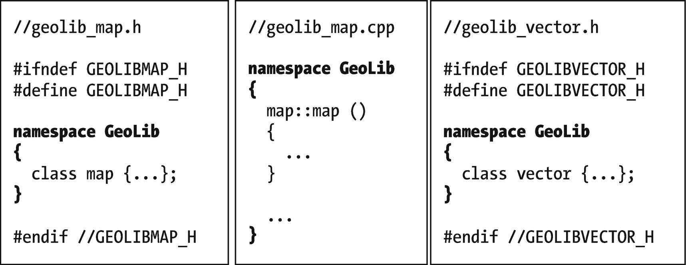
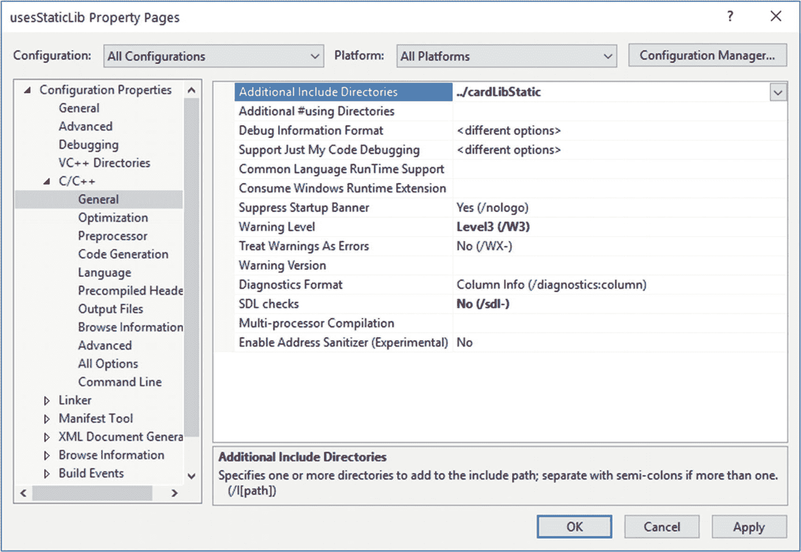
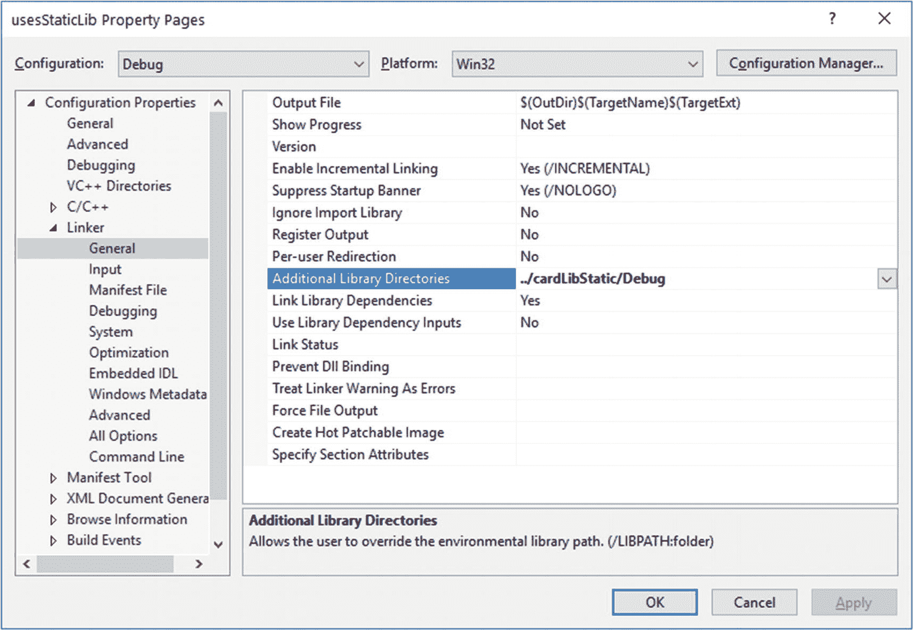

# 二十四、构建更大的项目

有一天你可能想要建立一个更大的项目。本章介绍了一些有用的工具:名称空间、条件编译和库的构造。

## 命名空间

假设我为地理信息编写了一个库，用于地图、划分选区或其他用途。我创建了一些类:`map` s，`vector` s(用于图形的 XY 对)，`region` s，等等。

然后我注意到我不能编译了，因为`map`和`vector`在 C++ 中已经有意义了。好的。称它们为`GeoLib_map`、`GeoLib_vector`等等，就像 SDL 和 SSDL 函数一样。

我使用的是第三方库，它碰巧将`region`定义为别的东西……这变得很乏味。有捷径吗？

当然可以。制作一个**命名空间** `GeoLib`，把你的代码放进去，如图 [24-1](#Fig1) 。



图 24-1

一个命名空间可以包含来自不同文件的代码

程序员现在可以输入`GeoLib` `::` `map`或`std::map`，编译器会知道它们的意思。

如果他们厌倦了反复输入`GeoLib::`，他们可以使用`using`:

```cpp
using GeoLib::region;
         // after this you can omit the GeoLib:: in GeoLib::region

using namespace GeoLib;
         // now *all* GeoLib members can have GeoLib:: omitted

using namespace std;
         // now all std:: members can have std:: omitted too
         // If the compiler gripes, you can still use GeoLib::
         //  or std:: to clarify which you want

```

您还可以用普通的`::`来指定没有在*的任何*名称空间中声明的内容(因此在“全局”名称空间中)，比如:`::myNonNamespaceFunction();`。

为了说明名称空间的构造，示例 [24-3](#PC10) 和 [24-4](#PC11) 示出了名称空间`Cards`的创建；示例 [24-5](#PC12) 使用。

这是一个关于`using namespace <whatever>;`是否邪恶的争论问题，也就是说，不可原谅的可怕。我说你可以在你自己的`.cpp`文件中随心所欲地使用它，但不要把它放在别人可能包括的`.h`文件中，从而搞乱别人的文件。

## 条件编译

现在我正在使用我的`GeoLib`代码，我发现我的计算是错误的，错误的，错误的。很难说哪些功能搞砸了。我想生成这些计算的报告，以便我可以检查它们:

```cpp
map::area(region) thinks area of block group 6709 is 672.4
dist to center is 356.2
map::area(region) thinks area of block group 6904 is 312.5
dist to center is 379.7
...

```

我不希望这段代码一直被打印出来——只是在调试的时候。

所以我在一个`.h`文件中创建了一个`#define`，其他所有文件都包含在其中(例如 [24-1](#PC3) )。

```cpp
// debugSetup.h

#ifndef DEBUGSETUP_H
#define DEBUGSETUP_H

#define DEBUG_GEOLIB             // Yes, that's the whole thing

#endif //DEBUGSETUP_H

Example 24-1A .h file containing #define DEBUG_GEOLIB, for conditional compilation

```

我在任何需要打印调试信息的地方都使用它

```cpp
#ifdef DEBUG_GEOLIB
    cout << " map::area(region) thinks area of block group "
         << bg->id() << " is " << bg->area() << endl;
    cout << "dist to center is "
         << distance (region.loc(), bg->loc()) << endl;
#endif

```

并根据我是否想看到它来注释或取消注释# `define DEBUG_GEOLIB`。

## 图书馆

库有两种风格，**静态**和**共享**。静态库的代码在链接时直接进入可执行程序；共享库在另一个文件中，在运行时加载。所以据说静态库运行起来更快(我从未注意到有什么不同)，而且你不必担心你的共享库被移到哪里了，因为它总是在可执行文件中。但是共享可以节省空间，因为许多程序可以使用相同的代码，而且更容易更新。

我倾向于分享。这在 Unix 中很常见，似乎有助于编译器版本之间的可移植性。

在这里，我将对两种编译器都尝试这两种方法。在我的例子中，我将使用第 19 章中的纸牌游戏代码，以及一般有用的类(`Card`、`Deck`等)。)走进图书馆。蒙大拿的比赛将使用这个图书馆。

您可能会创建一些其他的库。参见本章末尾的“练习”，或者自己选择。

### g++

证明这一点的代码在源代码中，`ch24/g++`。库在子目录`cardLibg++`下，测试程序在子目录`montana`下。

#### 编译库

要创建一个静态库，像往常一样编译目标文件

```cpp
g++ -g -c deck.cpp
...

```

然后链接到

```cpp
ar rcs libcards.a

deck.o card.o cardgroup.o
                             #ar for "archive"; rcs is needed program optionsShared libraries

```

共享库需要在内存中“可重定位”的目标文件，所以像这样编译它们:`g++ -g -fPIC` `-c deck.cpp #PIC: "position independent code." All righty then ...`

在 Unix 中，共享库以`.so`结尾，所以这样链接:`g++ -shared` `-o libcards.so deck.o card.o cardgroup.o`。

Windows 使用扩展名`.dll`，所以对于 MinGW，键入这个:`g++ -shared -o libcards.dll deck.o card.o cardgroup.o`。

#### 链接库

g++ 需要知道在哪里可以找到包含文件，在哪里可以找到库文件，以及使用什么库。

我们用这些命令行选项告诉它:

*   `-I` `<name of directory>`查找包含文件；

*   `-L` `<name of directory>`查找库文件；

*   `-l` `<library>`表示我们想要链接的库。库名的首字母是`lib`，扩展名是`.a`、`.so`或`.dll`，去掉后，如下所示:

```cpp
g++ -o montana -g montana.o io.o montana_main.o 

\1
    -I../cardLibg++ -L../cardLibg++ -lcards
                               #uses libcards.<something>

```

您可以拥有这些选项的任意多个副本。

#### 运行使用动态库的程序

如果你使用了一个静态库，你可以像往常一样运行程序。

如果它是动态的，系统需要知道在哪里可以找到它。解决方案:

*   贿赂系统管理员将`.dll`或`.so`文件放在系统路径中。如果多个程序使用它并且你的程序足够重要，这是有意义的。

*   将`.dll`或`.so`复制到包含可执行文件的文件夹中——这对于单个项目来说很好，但如果您有很多文件夹并因此有很多副本，就不太好了。

*   设置环境变量，以便系统可以找到它。源代码文件夹里有这个的脚本(`runx`、`runw`、`gdbx`等)。，正如 SSDL 的情况一样)。内容是这样的:

```cpp
export LD_LIBRARY_PATH=../cardLibg++ #Unix
PATH="../cardLibg++:$PATH"           #Windows

```

#### 文件

这些长命令重复输入会变得很乏味，所以它们被打包成本章源代码中的文件:用于在 Unix 或 MinGW 中构建库的 Makefiles，就像 SSDL 一样；另一个用于构建使用该库的程序(它适用于两种平台)；以及在后者的文件夹中，用于运行程序的脚本(见上文)。

要创建自己的库，请编辑构建库的 Makefile 文件，选择要创建的库的类型，然后编辑所有文件的路径、可执行文件名称以及您喜欢的任何内容。

### 工具

演示这一点的代码在源代码中。`ch24/VisualStudio`。`cardLib*`(有不同版本；创建库，`uses*`是使用这些库的项目。

#### 静态库:简单的选择

若要在 Visual Studio 中生成静态库，请单击“创建新项目”并选择“静态库”。

当它创建项目时，它希望您使用“预编译头” <sup>[2](#Fn2)</sup> 你可以:

*   **通过在每个源文件**的开头放置这一行来支持这一点:

`#include "``pch.h`T2】

它必须在任何其他包含之前，否则你的代码将无法编译。

或者一步到位:

*   **消除预编译头文件**。在“项目属性”下，对于“所有配置/所有平台”(第一行),将配置属性“➤ C/C++ ➤预编译头➤预编译头”设置为“不使用预编译头”。您可以忽略编译器在项目中提供给您的文件。

然后建图书馆。我这样做是为了调试*和*版本，x86，*和* x64，所以我不需要想我做了什么。

现在创建一个使用该库的项目。它需要知道在哪里可以找到包含文件。在所有配置/所有平台的项目属性下，适当地设置配置属性➤ C/C++ ➤通用➤附加包含目录(见图 [24-2](#Fig2) )。



图 24-2

在 Visual Studio 中告诉项目在哪里可以找到库包含文件

将库的路径添加到配置属性➤链接器➤通用➤附加库目录(图 [24-3](#Fig3) )。它的位置将因配置和平台而异；在名为`Debug`、`Release`和`x64`的子文件夹中搜索。



图 24-3

告诉项目在 Visual Studio 中何处可以找到您的库

现在你必须告诉它*什么是*图书馆。在项目属性下，所有配置/所有平台，在配置属性下添加库名➤链接器➤输入➤附加依赖项(图 [24-4](#Fig4) )。会是`<your library project>.lib`。


图 24-4

在 Visual Studio 中添加库依赖项

#### 动态链接库(dll):不那么容易的选择

要创建自己的 DLL，请回到上一节，但对于项目类型，请选择动态链接库(DLL)。但是先不要建！

在指导新程序使用你的库的时候，当你告诉项目属性关于这个库的时候(图 [24-4](#Fig4) ，它仍然是`<your project>.lib`。我以为我们在创建一个 DLL？是的，但我们实际上是在创建两件事:包含运行时代码的`.dll`，以及在编译时告诉程序“你稍后将从 DLL 中导入这些东西”的`.lib`文件

这就是奇怪的地方。当编译器看到一个函数声明时，它需要知道是要编译和导出它(因为它正在编译库)还是从 DLL 导入它(因为它正在编译一个使用库的程序)。换句话说，就是在声明前面加上`__declspec` `(` `dllexport` `)`或`__declspec(` `dllimport` `)`。`__declspec`的意思是“我马上要告诉你一些关于这个功能的事情”和`dllexport` / `dllimport`，嗯，那是显而易见的。

那么我们是不是应该为每个函数写两个版本，一个用于导入，一个用于导出？

这种常见的黑客手段意味着我们不必。

1.  像示例 [24-2](#PC9) 那样写一个`.h`文件。

```cpp
// Header to make DLL functions import or export
//        -- from _C++20 for Lazy Programmers_

#ifndef CARDSSETUP_H
#define CARDSSETUP_H

# ifdef IM_COMPILING_MY_CARD_LIBRARY_RIGHT_NOW
#  define DECLSPEC __declspec(dllexport)
# else
#  define DECLSPEC __declspec(dllimport)
# endif //IM_COMPILING_MY_CARD_LIBRARY_RIGHT_NOW

#endif //CARDSSETUP_H

Example 24-2A .h file to help with DLL projects

```

现在`DECLSPEC`意味着“这将被导出”*或*“这将被导入”……这取决于我们是在编译库还是在使用它。刚刚好。

1.  在库中的每个`.cpp`文件中，写入这个`#define`:

`#define IM_COMPILING_MY_CARD_LIBRARY_RIGHT_NOW`

这就是它如何知道`DECLSPEC`应该是导出版本。

这必须在与您的项目相关的任何`.h`文件之前完成，这样他们就可以看到它，但是如果我们使用的是`#include "` `pch.h` `"`之后，因为它总是在前面。

1.  将`DECLSPEC`放在从`.cpp`文件导出的所有内容之前。

2.  …以及在`.h`文件中相应的函数声明之前。它们必须匹配。

3.  根据需要，包括步骤 1 中的`.h`文件，以定义整个过程中的`DECLSPEC`。我把它放在`cards.h`。

库文件将看起来像示例 [24-3](#PC10) 和 [24-4](#PC11) 。示例 [24-5](#PC12) 展示了如何在`montana.h`中使用`Cards`成员；在`montana.cpp`中，我只是说了`using` `namespace` `Cards;`，没有做其他改动。

```cpp
// class Montana, for a game of Montana solitaire
//        -- from _C++20 for Lazy Programmers_

#include "gridLoc.h"
#include "cell.h"
#include "deck.h"

#ifndef MONTANA_H
#define MONTANA_H

class Montana
{
public:
    static constexpr int ROWS = 4, CLMS  = 13;
    static constexpr int NUM_EMPTY_CELLS =  4;// 4 empty cells in grid
    ...
private:
    ...

        // dealing and redealing
    void deal               (Cards::Deck& deck, Cards::Waste& waste);
    void cleanup            (Cards::Deck& deck, Cards::Waste& waste);

...

    // data members
    Cards::Cell   grid_ [ROWS][CLMS];     // where the cards are
    GridLoc emptyCells_ [NUM_EMPTY_CELLS];// where the empty cells are
};
#endif //MONTANA_H

Example 24-5Parts of montana.h, showing use of namespace Cards

```

```cpp
// Card class
//        -- from _C++20 for Lazy Programmers_

#include "pch.h
"
#define IM_COMPILING_MY_CARD_LIBRARY_RIGHT_NOW
                   // see cardsSetup.h. Must come before card
                   //  related includes, after "pch.h" if any
#include "card.h"

using namespace std;

namespace
Cards
{
    DECLSPEC void Card::read  (std::istream &in )
    {
        try {   in  >> rank_  >> suit_;  }
        catch (BadRankException&) // if reading rank_ throw an exception
        {
            in >> suit_;          //    consume the suit as well
            throw;                //    and continue throwing the exception
        }
    }

    DECLSPEC istream& operator>> (istream& in, Suit& s)
    {
        ...
    }

    ...
} //namespace Cards

Example 24-4Part of card.cpp, set up to make a DLL and forming a namespace

```

```cpp
// Card class
//        -- from _C++20 for Lazy Programmers__

#ifndef CARD_H
#define CARD_H

#include <iostream>
#include "cardsSetup.h" // defines DECLSPEC

namespace
Cards
{
    // Rank and Suit:  integral parts of Card

    // I make these global so that I don't have to forget
    //  "Card::" over and over when I use them.

    enum class Rank  { ACE=1,  JACK=11, QUEEN, KING    }; // Card rank
    enum class Suit  { HEARTS, DIAMONDS, CLUBS, SPADES }; // Card suit
    enum class Color { BLACK,  RED                     }; // Card color

    inline
    Color toColor(Suit s)           // DECLSPEC isn't needed for inlines
    {
        if (s == HEARTS || s == DIAMONDS) return RED; else return BLACK;
    }

    // I/O on Rank and Suit
    DECLSPEC std::ostream& operator<< (std::ostream& out, Rank r);
    DECLSPEC std::ostream& operator<< (std::ostream& out, Suit s);
    DECLSPEC std::istream& operator>> (std::istream& in, Rank& r);
    DECLSPEC std::istream& operator>> (std::istream& in, Suit& s);

    ...

    class Card
    {
    public:
        Card (Rank r = Rank(0), Suit s = Suit(0)) :
            rank_ (r), suit_ (s)
        {
        }
        Card (const Card& other) : Card(other.rank_, other.suit_){}

        ...

        DECLSPEC void read  (std::istream &in );
    private:
        Suit suit_;
        Rank rank_;
    };

    ...
} //namespace Cards
#endif //CARD_H

Example 24-3Parts of card.h, set up to make a DLL, and forming a namespace

```

如果一切顺利，在使用你的库的程序中还有一件事需要设置:它需要在运行时找到 DLL。

最简单的方法是将 DLL 复制到项目文件夹中。或者将其放在系统路径中(这可能需要管理员访问)。

如果这不是你想要的，转到项目属性(图 [24-5](#Fig5) ，并设置配置属性➤调试➤环境。它需要对 PATH 变量进行更新，不要忘记旧路径……如果 DLL 的位置是`..\cardLibDLL\Debug`，可以给它`PATH=..\cardLibDLL\Debug\;%PATH%`。


图 24-5

在 Visual Studio 中设置路径

#### 防错法

*   **您对项目属性进行了更改，但这些更改没有影响**。很容易忽略项目属性窗口的第一行(图 [24-5](#Fig5) )。有时你纠正了一个配置，但你用的是另一个。我更喜欢尽可能编辑所有配置/所有平台。

*   **编译器抱怨像** `cout` **这样常见的东西不存在。**将`#include "` `pch.h` `"` *放在*之前，其他包含或停止使用预编译头；请参见本节的开头。

*   **在运行时，程序找不到 DLL** **。但是你设置了路径变量。**

    如果不是路径中的错别字，可能是你把`.user`文件抹掉了。这是包含环境信息的内容。重建它应该能解决问题。

*   **运行时，程序不能启动；错误信息不清楚。**也许你的程序平台(Win32 或 x86 对 x64)与 DLL 不匹配。

Exercises

1.  将`PriorityQueue`、`List`、`Time`、`Fraction`或您在之前练习中创建的其他类放入它自己的库中，并将它链接到使用它的某个对象。

2.  创建一个名为`shapes`(在名称空间`Shapes`中)的库，使用第 21 章中的`Shape`层级，随意扩展；并将它链接到一个使用`Shape`的程序中。在`basicSSDLProject`的 vcxproj。

<aside aria-label="Footnotes" class="FootnoteSection" epub:type="footnotes">Footnotes [1](#Fn1_source)

\表示“在下一行继续”

  [2](#Fn2_source)

Microsoft Visual Studio 和 g++ 都有这种帮助编译时间的方法。这个想法是，不需要为包含它的每个源文件重新编译一个`.h`文件，您可以通过编译一次来减少编译时间。我没有感觉到需要，但是随着 STL 和最近的语言变化，头文件看起来确实在不断增长…

 </aside>