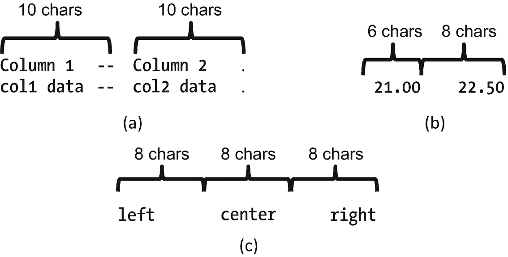
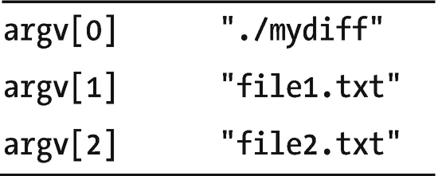
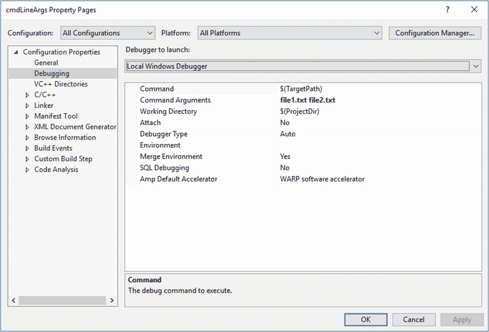

# 二十五、秘籍（推荐）

您现在已经掌握了 C++ 的基本知识以及更多。是时候添加铃铛和口哨了。 <sup>[1](#Fn1)</sup>

在做这一章和接下来的两章之前，回过头来做你可能跳过的“可选”部分是有意义的。我们尤其需要文件 I/O(来自第 13 章)和移动语义(第 18 和 21 章)。

这些章节是这样组织的:

*   第 25 章:新功能——更好的输出格式，使用命令行参数(最后使用`int main (int argc, char** argv)`中的`argc`和`argv`),以及位操作

*   第 26 章:对组织和安全有用的东西

*   第 27 章:更多的组织帮助，在不太常见的情况下有用

我们开始吧。

## `sstream`:像`cin` / `cout`一样使用`strings`

假设您想要将游戏的详细信息打印到您的平视显示器上，居中显示在顶部:

```cpp
Points: 32000  /  Time left: 30.2  /  Mood: Annoyed

```

您可以计算每个标签和每个值的宽度(使用可变宽度的字体，祝您好运),并从中计算打印每个项目的位置……如果您这样做了，现在就交出您的懒惰程序员徽章。

或者您可以进行大量的转换和字符串连接，并将其发送给`SSDL_RenderTextCentered`，如下所示。再一次，交出徽章。

```cpp
string finalString = string ("Points: ")
          + to_string (points) // to_string is in #include <string>
          + "/ Time left: "     
          + to_string (time)
          + " / Mood: " + mood;
SSDL_RenderTextCentered(finalString, SSDL_GetWindowWidth()/2, 10);

```

如果我们发送其他类型的变量，比如`Point2D`，我们将需要更多的字符串转换函数。那是许多工作。

输入`stringstream`。这就像是把`cin`、`cout`和`string`合二为一。您可以向它写入数据，然后提取产生的字符串，或者将一个字符串放入其中并从中读取。

要使用`<<`构建字符串，请执行以下操作:

1.  `#include <``sstream`

2.  声明一个`stringstream`。

3.  使用`<<`打印到`stringstream`。

4.  使用`str()`成员函数访问您构建的字符串。

如果你想再次使用它，你可以将它的内容重置为`""`，就像在`myStringStream.str("")`中一样。 <sup>[2](#Fn2)</sup>

示例 [25-1](#PC3) 使用`stringstream`向`SSDL_RenderTextCentered`发送文本。输出如图 [25-1](#Fig1) 所示。


图 25-1

`stringstream`程序的输出

表 25-1

常用`stringstream`功能，简化

<colgroup><col class="tcol1 align-left"> <col class="tcol2 align-left"></colgroup> 
| `stringstream& operator<< (stringstream&,``const SomeType& thingToPrint);` | 打印到`stringstream`的内容。 |
| `stringstream& operator>> (stringstream&,``SomeType& thingToRead);` | 阅读`stringstream`的内容。 |
| `string stringstream::str () const;` | 返回`stringstream`的内容。 |
| `void   stringstream::str (const string&);` | 设置`stringstream`的内容。 |
| `void   stringstream::clear ();` | 在读取或写入`stringstream`时，清除您可能设置的任何错误条件。 |

```cpp
// Program that uses stringstream to center multiple things on one line
//       -- from _C++20 for Lazy Programmers_

#include <sstream>                       // Step #1: #include <sstream>
#include "SSDL.h"

using namespace std;

int main(int argc, char** argv)
{
    int points = 3200;                 // Some arbitrary data to test
    double time = 30.2;                //  printing to HUD
    char mood = "Annoyed";

    stringstream out;                  // #2: Declare a stringstream
                                       // #3: Print to stringstream
    out << "Points: " << points << "   /   Time left: "
        << time << "   /   Mood: " << mood;

    string result = out.str();         // #4: Access with str()
    SSDL_RenderTextCentered(result.c_str(),
                            SSDL_GetWindowWidth()/2, 10);

    SSDL_WaitKey();         // Wait for user to hit a key
    return 0;
}

Example 25-1A rudimentary heads-up display (HUD) using stringstream

```

您也可以使用`stringstream`作为输入源——使用`str`设置字符串，然后使用`>>`从中提取:

```cpp
dataLine.str ("Flourine  0.52 0.63");
dataLine >> elementName >> firstNumber >> secondNumber;

```

使用`stringstream`输入包括以下步骤:

1.  `#include <``sstream`

2.  声明一个`stringstream`。

3.  用`str()`成员函数初始化`stringstream`。

4.  使用`>>`从`stringstream`中读取。

如果您有可能耗尽输入，您可以调用`clear()`，就像在`dataLine.clear()`中一样，在重用之前清除错误条件。

Exercises

1.  假设我们有一组文件:`file1.txt, file2.txt…file100.txt`。使用`stringstream`为第 x <sup>个</sup>文件构建文件名。

2.  编写并测试一个函数模板，该模板接受一个变量，将其打印成一个字符串，然后返回该字符串。

3.  用包含单词和数字的文本初始化一个字符数组，然后使用`stringstream`将它的各个部分适当地读入变量。

4.  读入一个数字文件，忽略注释标记`#`之后的所有内容。方法如下:排成一行阅读；在你找到任何`#`后丢弃任何东西；然后从剩下的数字中读入所有数字，并将它们推入一个向量中。

## 带有格式字符串的格式化输出

假设我想按列打印表格。我如何把事情安排好？自己数空格？不可能！简单的方法是将它们放入一个**格式的字符串**:

```cpp
cout << format("{0:10} -- {1:10}.\n", "Column 1",  "Column 2");
cout << format("{0:10} -- {1:10}.\n", "col1 data", "col2 data");
...

```

第一行说取第 0 个参数(`"Column 1"`)和第 1 个参数(`"Column 2"`)，把它们放在字符串中，中间有`--`，然后把结果发送给`cout`。每个参数占位符中的`:10`表示其参数至少要占用十个字符；`format`会用空格填充每一个来实现这一点。如果我们打印的内容超过十个字符，它会根据需要占用尽可能多的空间。

由于第二行以同样的方式格式化它的参数，代码产生了均匀排列的列(见图 [25-2](#Fig2) (a))。



图 25-2

`format`命令的输出。(a)两个十字符栏；(b)两列以定点格式显示浮点数，精确到两位数；(c)三列，左对齐、中对齐和右对齐

我通常省略参数的编号；它将按顺序执行这些操作:

```cpp
cout << format("{:10} -- {:10}.\n", "Column 1", "Column 2");

```

如果要打印的东西是浮点数，我可能会添加一个`f`来指定我想要定点，而不是科学记数法(默认是“让`format`决定”)。我也可以指定小数点右边显示多少位数。在这个片段中

`cout << format("{:6.2f}{:8.2f}", 21.0, 22.5) << "\n";`

我希望第一个数字占用六个空格，精度两位数；第二个占用八个空格，也是两位数的精度。输出如图 [25-2](#Fig2) (b)所示。

默认情况下，字符串在它们的列中是左对齐的，如图 [25-2](#Fig2) (a)所示，但是数字默认情况下是右对齐的，如(b)所示。我可以通过要求左(`<`)、中(`^`)或右(`>`)对齐来覆盖默认值。所以`cout << format("{:<7} {:^7} {:>7}\n", "left", "center", "right");`会打印出你在图 [25-2](#Fig2) (c)中看到的内容。

示例 [25-2](#PC7) 使用这些工具打印几个熟悉星球的气候条件。

```cpp
// Program to print temp, pressure for some familiar planets
//       -- from _C++20 for Lazy Programmers_

#include <iostream>
#include <format>

3

using namespace std;

int main()
{
    // planetary temperature and pressure
    constexpr double     VENUS_TEMP = 464;      // celsius
    constexpr double     EARTH_TEMP =  15;
    constexpr double      MARS_TEMP = -62;

    constexpr double VENUS_PRESSURE = 92000;    // millibars
    constexpr double EARTH_PRESSURE = 1000;
    constexpr double  MARS_PRESSURE = 1;

    // Print a 3-column table
    // Left column is 7 chars wide;
    //    char* is left-justified by default
    // Other columns are 11 chars wide, right-justified

    // Headers
    cout << format("{:7} {:>11}  {:>11}\n",
                   "Planet", "Temperature", "Pressure");
    cout << format("{:7} {:>11}  {:>11}\n\n",
                   "", "(celsius)", "(millibars)");

    // Data
    cout << format("{:7} {:11.1f}  {:11.0}\n",
                   "Venus", VENUS_TEMP, VENUS_PRESSURE);
    cout << format("{:7} {:11.1f}  {:11.0}\n",
                   "Earth", EARTH_TEMP, EARTH_PRESSURE);
    cout << format("{:7} {:11.1f}  {:11.0}\n",
                   "Mars",  MARS_TEMP,  MARS_PRESSURE);

    cout << "\n...I think I'll just stay home.\n\n";

    return 0;
}

Example 25-2Program to neatly print a table of astronomical data using format strings

```

以下是示例 [25-2](#PC7) 的输出:

```cpp
Planet  Temperature     Pressure
          (celsius)  (millibars)

Venus         464.0        90000
Earth          15.0         1000
Mars          -62.0            1

I think I'll just stay home.

```

示例 [25-3](#PC9) 展示了如何用`format`做一些更酷的事情。想打印不同格式不同基数或浮点的`int` s？见下文。想打印到一个`string`，就像上一节一样？如图所示使用`format_to`。

```cpp
// Program to illustrate further capabilities of C++20's format strings
//      -- from _C++ for Lazy Programmers_

#include <iostream>
#include <string>
#include <format>

using namespace std;

int main()
{
    // Print the same integer using base 2, 8, 16, and 10
    cout << "Here's 15 written in...\n";
    cout << format("{0:>8}{1:>8}{2:>8}{3:>8}\n",
                   "binary", "octal", "hex

", "decimal");
    //(if you don't specify, you get decimal)
    cout << format("{0:>8b}{0:>8o}{0:>8x}{0:>8}\n\n", 15);
    // We used argument #0 four times; no law against that...

    // Print the same item with different types of padding
    cout << "Here's 15 padded with x's, .'s, and *'s: ";
    cout << format

("{0:x>4} {0:.>4} {0:*>4}\n\n", 15);

    // Print a floating point number with different formats
    cout << "And here's 0.01234 in scientific, fixed, general, ";
    cout << "and default format,\n";
    cout << "showing how they interpret a precision of 2.\n";
    cout << format("{0:>10.2e} {0:>10.2f} {0:>10.2g} {0:>10.2}\n\n",
                   0.01234);

    // You can also print to a string with format_to:
    string str;
    format_to 

(back_inserter(str), "The language of choice is {}.\n",
              "C++");
    cout << str;

    return 0;
}

Example 25-3More format string tricks

```

输出是

```cpp
Here's 15 written in...
  binary   octal     hex decimal
    1111      17       F      15

Here's 15 padded with x's, .'s, and *'s: xx15 ..15 **15

And here's 0.01234 in scientific, fixed, general, and default format,
showing how they interpret a precision of 2.
  1.23e-02       0.01      0.012      0.012

The language of choice is C++.

```

一个论点的规范必须按照特定的顺序来完成。除了开头和结尾{}，可以跳过任何或所有内容。顺序是

*   打开{

*   参数编号

*   :(如果有任何格式规范，则需要)

*   对准:`<`、`^`或`>`。

*   宽度

*   精度:小数点后跟随所需精度的位数

*   浮点类型:`f`、`g`或`e`；整数的`b`、`o`、`x`或`d`(二进制、八进制、十六进制、十进制)

*   关闭}

这是我常用的，但还有更多。参见`cppreference.com`了解`format`能做的所有事情的完整列表。

Online Extra: I/O Manipulators

关于这在 C++20 之前是如何完成的细节，如果你在处理遗留代码的话很有用， <sup>[4](#Fn4)</sup> 在 [`github.com/apress/cpp20-for-lazy-programmers`](https://github.com/apress/cpp20-for-lazy-programmers) 。

### 防错法

格式字符串的错误通常在运行时被检测到，因为直到它尝试，C++ 才知道字符串-参数组合是否有效。你会得到一大堆无法理解的错误信息。只要回到调用`format`的地方，使用调试器中的调用栈，看看哪个`format`有问题。

Exercises

1.  使用`format`打印某人可能填写的表格——可能是一份申请(填写姓名、地址等)。)，可能是更有趣的东西。你决定。

2.  打印一些二进制、八进制、十六进制、十进制的加法题，像这样:

    ```cpp
     1111      17       f      15
    +   1   +   1   +   1   +   1
    -----   -----   -----   -----
    10000      20      10      16

    ```

3.  打印一个表格，显示你每年摔倒的次数，从 2 岁开始，到你现在的年龄结束。我希望它有所下降。弄干净点。

4.  打印一份冲浪用品店各种物品的价格表:冲浪板、冲浪板包、滑冰鞋或其他任何东西。美元金额中的`.`应该对齐。

5.  打印练习 4 中物品重量的表格。

6.  使用科学记数法，打印出在任何给定的一年中，这些事件发生的概率:有一个重大的政治丑闻；生命在火星上自发形成；一颗彗星撞击了尤卡坦半岛，让我们重蹈恐龙的覆辙；比用 C++ 编程更有趣的事情发生了(当然是最低概率)。使用科学符号。编造数字——其他人都是这么做的。

## 命令行参数

有时有必要，尤其是在 Unix 世界中，给程序提供参数:`cd myFolder`、`gdb myProgram`等等。

假设你想让一个程序检查文本文件的差异。该命令可能类似于

```cpp
 ./mydiff file1.txt file2.txt               #in Windows, leave off the ./

```

你需要这样写`main`的第一行:

```cpp
int main (int argc

, char** argv)5

```

`argc`(“参数计数”)是参数的个数，`argv`(“参数向量”，但它是一个数组，而不是`vector`)是一个字符数组的数组，每个数组包含一个参数，以程序名开始。

所以如果你的命令是`./mydiff file1.txt file2.txt`，`argc`将是 3，`argv`将包含如图 [25-3](#Fig3) 所示的值。



图 25-3

可能的命令行参数

示例 [25-4](#PC14) 显示了程序的代码。

首先，它确保我们有正确数量的参数。如果出了问题，通常会告诉用户预期会发生什么。`argv[0]`始终是程序名。(我们不硬编码为“`./mydiff`”，以防程序名改变。)

`cerr`类似于`cout`，但是没有被`>`重定向，所以它对错误消息很有用。但是`cout`也可以。

```cpp
// Program to find the difference between two files
//        -- from _C++20 for Lazy Programmers_

#include <iostream>
#include <fstream>
#include <cstdlib> // for EXIT_FAILURE, EXIT_SUCCESS
#include <string>

using namespace std;

int main (int argc, char** argv)
{
    // Did we get right # of arguments? If not, complain and quit
    if (argc != 3) // 3 args: 1 program name, plus 2 files
    {              // On failure, tell user what user should've entered:
        cerr << "Usage: " << argv[0] << " <file 1> <file 2>\n";
        return EXIT_FAILURE
;
    }

    // Load the 2 files
    ifstream file1(argv[1]), file2(argv[2]); // open files
    if (! file1) // On failure, say which file wouldn't load
    {
       cerr << "Error loading " << argv[1] << endl;
        return EXIT_FAILURE;
    }
    if (!file2) // On failure, say which file wouldn't load
    {
        cerr << "Error loading " << argv[2] << endl;
        return EXIT_FAILURE;
    }

    string line1, line2;

    while (file1 && file2)                  // While BOTH files are not //   finished
    {
        getline (file1, line1);             // read line from file1
        if (!file1) break;

        getline (file2, line2);             //   ...from file2
        if (!file2)                         //   if file2's done but file 1 //      wasn't
        {
            cout << "<: " << line1 << endl; //   spit out last line read from//      file 1
            break;
        }

        if (line1 != line2)                 //   if lines differ print them
        {
            cout << "<: " << line1 << endl; //   < means "first file"
            cout << ">: " << line2 << endl; //   > means "second file"
                                            //   this is conventional
        }
    }

    // If either file has more lines than the other, print remainder
    while (file1)
    {
        getline(file1, line1);
        if (file1) cout << "<: " << line1 << endl;
    }
    while (file2)
    {
        getline(file2, line2);
        if (file2) cout << ">: " << line2 << endl;
    }

    // Clean up and return
    file1.close(); file2.close();

    return EXIT_SUCCESS;
}

Example 25-4A program using command-line arguments. In source code, the executable for g++ is named mydiff. Instructions on how to run and debug it follow the example

```

要从命令行运行它

在 Unix 中，键入`./mydiff file1.txt file2.txt`。

对于 MinGW，键入`mydiff file1.txt file2.txt`。

Visual Studio 用户应该首先将可执行文件从`Debug/`、`Release/`或`x64/`中的某个地方复制到项目文件夹中，这样它就可以找到文本文件。它的名字是`4-cmdLineArgs.exe`，所以打`4-cmdLineArgs file1.txt file2.txt`。或者将其重命名为`mydiff`并使用该命令。

有关在 Windows 中使用命令提示符的提示，请参阅第 13 章的“在 Windows 中设置命令提示符”小节

### 在 Unix 中使用命令行参数进行调试

无论是在`ddd`还是`gdb`，在提示符下，输入`set args file1.txt file2.txt`，你就准备好`run`了。

### 在 Visual Studio 中使用命令行参数进行调试

如果在 Visual Studio 中启动程序，它会像没有参数一样运行，但实际上它没有。要解决这个问题，进入项目菜单➤属性➤配置属性➤调试，设置配置为所有配置和平台为所有平台，并添加您的参数到命令参数(图 [25-4](#Fig4) )。



图 25-4

在 Microsoft Visual Studio 中设置命令参数

项目的命令行参数存储在`.user`文件中。如果您删除它，您将不得不再次添加它们。

Exercises

1.  写一个程序`myGrep`，一个 Unix `grep`实用程序的简化版本。它应该重复标准输入中包含给定单词的所有行。所以如果你有一个带线条的文件`input.txt`

    `alpha`

    `beta`

    `alphabet`

    然后命令`myGrep`(或`./myGrep` ) `alpha < input.txt`应该在屏幕上打印出来:

    `alpha`

    `alphabet`

2.  在前面的练习中，添加一个选项`-n`，如果存在，它会指示`grep`打印每行输出的行号。(以`-`开头的选项在 Unix 命令中很常见。)给定练习 1 的输入，命令`myGrep -n alpha < input.txt`应该打印出来

    `1: alpha`

    `3: alphabet`

3.  编写一个程序，在给定输入和列中的数字的情况下，将只包含指定列的版本打印到标准输出。例如，如果你给它参数`0 3`并得到这样的输入

    `1900 -0.06 -0.05 -0.05 -0.08 -0.07 -0.07`

    `1901 -0.07 -0.21 -0.14 -0.06 -0.2 -0.13`

    `...`

    输出应该只显示第 0 和第 3 列:

    `1900 -0.05`

    `1901 -0.14`

    `...`

    我推荐用`stringstream`，`format`也没坏处。

## 位操作:`&`、`|`、`~`和`<</>>`

许多库，比如 SDL 和它的助手，要求你用单独的位 <sup>[6](#Fn6)</sup> 设置它们的一些特性，并以同样的方式报告特性。嵌入式系统、加密和文件压缩也受益于对单个位的操作。

要启动 SDL 图像库，调用`IMG_Init`，它接受一个类型为`int`的参数，告诉它支持什么图像格式。我们如何把它塞进一个`int`？`SDL_Image.h`提供**标志**(具有指定含义的位):`IMG_INIT_JPG`为 1，`IMG_INIT_PNG`为 2，`IMG_INIT_TIF`为 4，以此类推。我们必须一点一点地将它们组合成一个`int`，没有双关的意思(见图 [25-5](#Fig5) )。


图 25-5

发送到`IMG_Init`的`int`是如何布局的:从右向左读，我们有位 1、位 2、位 4 等等。这个设置为支持 jpg 和 tiffs(位 1 和位 4)

有一些运算符——“按位”运算符——可以帮助我们处理位:


图 25-6

逐位算术

*   按位或，如`x|` `y`:如果`x`*`y`中的任一位为 1，`x|y`中的每一位都为 1(图 [25-6](#Fig6) (a))。*

 **   按位与，如`x` `&` `y`:如果`x`*`y`中的一位都为 1，那么`x&y`中的一位将为 1(图 [25-6](#Fig6) (b))。*

**   按位非，如在`~` `x`中:所有的位都反转(图 [25-6](#Fig6) (c))。

    *   我们可以使用移位操作符`<<`和`>>`向左或向右移动位(现在为流 I/O 和位操作执行双重任务)。`x << 2`是否将`x`中的所有位左移两位(图 [25-6](#Fig6) (d))。* 

 *(还有 xor，`x^y`，这里不介绍，因为它不常用。)

现在我们可以看到如何构造发送给`IMG_Init`的`int`。`int flags = IMG_INIT_JPG |`赋予我们`IMG_INIT_TIF`

`IMG_INIT_JPG` : 000000001

`IMG_INIT_TIF` : 000000100

`flags` : 000000101

我们这样传递它:`IMG_Init (flags);`。

为了更好地发挥这一点，我举了一个超级简化烤箱的例子(例子 [25-5](#PC15) ， [25-6](#PC16) )。你可以将它设置为烘焙和/或烧烤(每个 1 比特)。我想更好地控制上面的两个燃烧器，所以我让最右边的两位控制右边的燃烧器，接下来左边的两位控制左边的燃烧器。它们可以取值为 00 表示关，01 表示低，10 表示中，11 表示高。

我还有一个“火”的条件:如果两个燃烧器都在高温，烤箱设置为烘烤*和*烤。

```cpp
// Program that controls a Super-Simple Demo Oven (SSDO) with flags
//       -- from _C++20 for Lazy Programmers_

#include <iostream>
#include <cassert>

class SSDO                  // A Super-Simple Demo Oven
{
public:
    static constexpr int
        RIGHT = 0b00000011, // This is how to write in binary in C++:
        LEFT  = 0b00001100, //   precede with 0b or 0B
        BAKE  = 0b00010000,
        BROIL = 0b00100000;7
                            // Leftmost two bits are unused

    static constexpr int
        OFF = 0b00,
        LO  = 0b01,
        MD  = 0b10,
        HI  = 0b11;

    // Right burner bits are at the right -- no offset
    static constexpr int RIGHT_BURNER_OFFSET = 0;

    // But the left burners' are offset two to the left
    static constexpr int LEFT_BURNER_OFFSET = 2;

    static constexpr int FIRE = 0b00111111;

Example 25-5Program that uses bit manipulation to set and use flags, part 1

```

为了打开烘焙或烧烤，我对一个成员变量`flags_`使用了按位“或”`|`(见图 [25-7](#Fig7) (a)): `flags_ = flags_ | BAKE;`。


图 25-7

在超级简单的烤箱中打开和关闭`BAKE`钻头

要关闭它，我需要保持所有其他位不变，但将其设置为 0。这样做:得到一个所有位都是 1 的数，除了`BAKE`；“和”与`flags_`(图 [25-7](#Fig7) (b)):

```cpp
flags_ = flags_ & ~BAKE;

```

要设置燃烧器，我必须将该燃烧器的钻头更换为所需的`Condition`–`OFF`、`LO`、`MD`或`HI`–移动到燃烧器的正确位置。为了将左燃烧器设置在`HI`，比方说，我使用`~`和`&`清除左燃烧器位，就像我对`BAKE`所做的那样(图 [25-8](#Fig8) (a))。然后我取`HI`，`0b11`，用`<<`左移两位得到`0b1100`。我用按位或把它们放在一起。


图 25-8

打开`LEFT`燃烧器；检查`FIRE`状态

我通过说`(flags() & FIRE) == FIRE`来确定烤箱是否着火——也就是说，是否所有的东西都开着，燃烧器是否在高处。如果我只说`flags() == FIRE`，可能不行，因为我不知道最左边那两个没用的位是什么(图 [25-8](#Fig8) (b))。防御性编程。

```cpp
    // We're still in class SSDO's public section...

        // ctors and =
    SSDO ()            { flags_ = '\0';   }
    SSDO (const SSDO&)            = delete;
    SSDO& operator= (const SSDO&) = delete;

    // the controls
    void    setBake() { flags_ |=  BAKE;  }
    void  clearBake() { flags_ &= ~BAKE;  }
    void   setBroil() { flags_ |=  BROIL; }
    void clearBroil() { flags_ &= ~BROIL; }

    void   setLeftBurner   (unsigned char c)
    {
        flags_ &= ~LEFT;
        flags_ |= (c<< LEFT_BURNER_OFFSET);
    }
    void    setRightBurner (unsigned char c)
    {
        flags_ &= ~RIGHT;
        flags_ |= (c << RIGHT_BURNER_OFFSET);
    }
    void clearLeftBurner ()            { setLeftBurner (OFF);}
    void clearRightBurner()            { setRightBurner(OFF);}

    // access functions
    unsigned char flags  () const      { return flags_;       }
    bool isSelfCleaning  () const // bake and broil -> self-cleaning mode
    {
        return (flags() & BAKE) && (flags() & BROIL);
    }
    bool isFireHazard    () const  // they're all on, high!
    {
        return  (flags() & FIRE) == FIRE;
    }
private:
    unsigned char flags_; // unsigned char has at least 8 bits --
                          //   that's plenty for us here
};

using namespace std;

int main ()
{
    SSDO myOven;

    // Turning the oven completely on; now it's in self-cleaning mode
    myOven.setBake ();
    myOven.setBroil();
    assert(myOven.isSelfCleaning());
    assert(myOven.flags() == 0b00110000);

    // Playing with the right burner, checking the result...
    myOven.setRightBurner   (SSDO::LO);
    myOven.clearRightBurner ();
    assert ((myOven.flags() & SSDO::RIGHT) == 0);

    // I probably shouldn't do this...
    myOven.setRightBurner   (SSDO::HI);
    myOven.setLeftBurner    (SSDO::HI);
    if (myOven.isFireHazard())
        cout << "Cut the power and call the fire department!\n";

    return 0;
}

Example 25-6Program that uses bit manipulation to set and use flags, part 2

```

输出为`Cut the power and call the fire department!`。所有断言都成功。

在最后的`assert`，我需要在`==`之前的`()`。如果没有它们，它会将表达式解析为`myOven.flags() & (SSDO::RIGHT == 0)`。这既奇怪又没用。

现在我们已经讨论了位操作，我们应该能够设置标志，将信息发送给使用它们的库，并获得这样的信息，或者在我们自己的库中使用它们。

如果 C++20 兼容，你的编译器还提供了一个头文件`<bit>`，带有`rotr`(“向右旋转”)——像`>>`，除了最右边的位被复制到最左边:

```cpp
unsigned char c = 0b00000001; //1 is in the rightmost bit
c = std::rotr (c, 1);         //now it's in the leftmost

```

再加上`rotl`(“向左旋转”)和其他我没怎么用的功能。在写作的时候，你可以在 [`en.cppreference.com/w/cpp/numeric`](https://en.cppreference.com/w/cpp/numeric) 找到一个列表。

### 防错法

*   **你得到了一个比特操纵表达式的错误答案，但是你没有看到如何**。也许你用`&&`代表`&`或者用`||`代表`|`。我做那件事。或者也许你需要一些`()`。

Exercises

1.  写一个函数，通过检查一个数的某一位来确定这个数是奇数还是偶数。

2.  编写一个函数，通过打印每个单独的位来打印一个二进制数。你可能想要`sizeof`。

3.  写一个函数，找到一个`int`的日志 <sub>2</sub> ，用`>>`，不用`/`。

4.  写一个函数来判断一个数中的位序列是否对称(像 11000011 但不是 11010011)。

<aside aria-label="Footnotes" class="FootnoteSection" epub:type="footnotes">Footnotes [1](#Fn1_source)

有额外的东西真好。

  [2](#Fn2_source)

`stringstream`也作为`clear`的功能，但不要被欺骗；它清除错误标志，而不是内容。

  [3](#Fn3_source)

您的编译器可能还没有提供这个 C++20 特性，但是没问题。您可以使用源代码中包含的{fmt}库。参见源代码(ch25/2-格式和 ch25/3-格式)中的示例 [25-2](#PC7) 和 [25-3](#PC9) ，了解您在自己的顶部需要什么。cpp 文件让他们工作。*它在不兼容的编译器上不能工作，只有* #include <格式> *。*

您可以像往常一样复制和使用 newWork 项目 basicSSDLProject 和 basicStandardProject 他们知道在哪里可以找到库，但是你仍然需要参考 ch25/2-format 或 ch25/3-format。cpp 文件。

如果您想从头开始构建您的{ fmt }-使用项目，在 g++ 中，添加编译器选项-I../../external/fmt-master/include；在 Visual Studio 中，设置项目属性➤配置属性➤ C/C++ ➤附加包含目录以包含../../external/fmt-master/include。

  [4](#Fn4_source)

在最新标准之前编写的代码。您可能会遇到这种情况，不仅是在您更新项目时，而且是在您在线寻找某个问题的解决方案并找到使用该语言旧功能的示例时。

  [5](#Fn5_source)

或者 int main (int argc，char* argv[])，更清楚的说明第二个参数是字符数组的数组。唉，char**版本似乎是更常见的写法。

  [6](#Fn6_source)

一个比特是一个二进制(以 2 为基数)数字，0 或 1，是最小的信息。电脑用它们来代表一切。一个`int`的值是其被解释为二进制数的位(除了最左边的，这意味着正或负)。一个`float`的更复杂。在这一节中，我们将把比特序列解释为比特序列。

  [7](#Fn7_source)

通常明智的做法是给每个变量以自己的声明结尾；。为什么呢？因为，和；看起来很像，很容易混淆和出错。

但是正如从乔治·奥威尔到比雅尼·斯特劳斯特鲁普的大师们所指出的，文体规则应该服从眼前的形势。我不能催促任何人打字

static const expr int RIGHT = 0b 00000011；

static const expr int LEFT = 0b 00001100；

静态 constexpr int BAKE = 0b00010000

static const expr int broir = 0b 00100000；

在一本鼓吹懒编程的书里。

 </aside>**