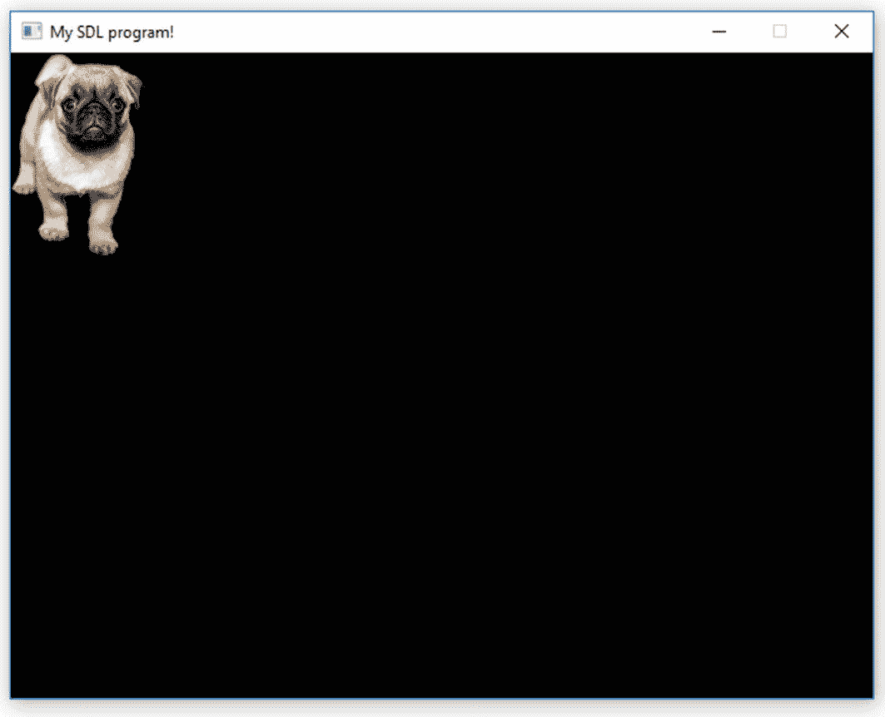

# 二十九、继续 SDL

通过使用 SSDL，你已经朝着成为一名 SDL 程序员迈进了一大步。要坚持下去，你可以

*   甩掉 SSDL，找一个关于 SDL 的教程。你会看到很多你认识的东西。许多 SSDL 函数是 SDL 函数，前面有一个“S”(比如，`SDL_PollEvent`变成了`SSDL_PollEvent`)。通常 SDL 函数需要多一个初始参数，通常是类型`SDL_Window*`或`SDL_Renderer*`，这两种类型你马上就能学会。您通常可以猜到需要什么(提示:名称中带有“Render”的函数可能需要`SDL_Renderer*`)。

*   或者，保留 SSDL，但扩展更多 SDL 功能，比如支持操纵杆。

无论哪种方式，看看 SSDL 背后隐藏的东西都是有用的。让我们从初始化和清理代码开始。

典型的 SDL 程序有一个版本的`main`，看起来像示例 [29-1](#PC1) 。



图 29-1

来自示例 [29-1](#PC1) 、 [29-2](#PC2) 和 [29-3](#PC3) 的 SDL 程序。值得吗？

```cpp
// An SDL program that does nothing of interest (yet)
//      -- from _C++20 for Lazy Programmers_

#include <iostream>
#include "SDL.h"
#include "SDL_image.h"
#include "SDL_mixer.h"
#include "SDL_ttf.h"

int main(int argc, char** argv)
{
    // initialization

    constexpr int DEFAULT_WIDTH = 640, DEFAULT_HEIGHT = 480;
    if (SDL_Init (SDL_INIT_EVERYTHING) < 0) return -1;

    SDL_Window* sdlWindow
        = SDL_CreateWindow ("My SDL program!",
                            SDL_WINDOWPOS_UNDEFINED,
                            SDL_WINDOWPOS_UNDEFINED,
                            DEFAULT_WIDTH, DEFAULT_HEIGHT,
                            0);      // flags are 0 by default
    if (!sdlWindow) return -1;       // nope, it failed

    int rendererIndex = -1;          //pick first renderer that works
    SDL_Renderer* sdlRenderer
        = SDL_CreateRenderer (sdlWindow, rendererIndex,
                              0);    // flags are 0 by default

    if (!sdlRenderer) return -1;    // nope, it failed

    SDL_ClearError();               // Initially, no errors

    static constexpr int IMG_FLAGS  // all available types
        = IMG_INIT_PNG | IMG_INIT_JPG | IMG_INIT_TIF;
    if (! (IMG_Init (IMG_FLAGS) & IMG_FLAGS))  // start SDL_Image
        return -1;

    if (TTF_Init() == -1) return -1;         // ...and SDL_TTF

                                             // ...and SDL_Mixer
    int soundsSupported = Mix_Init
                       (MIX_INIT_FLAC|MIX_INIT_MOD|MIX_INIT_MP3|MIX_INIT_OGG);
    if (!soundsSupported) return -1;

    int soundInitialized = (Mix_OpenAudio(88020, MIX_DEFAULT_FORMAT,
                                          MIX_DEFAULT_CHANNELS, 4096) != -1);
    if (!soundInitialized) SDL_ClearError();
            // if it failed, we can still do the program
            //   -- just forget the error

    // STUFF YOU ACTUALLY WANT TO DO GOES HERE

    // cleanup -- we're about to end the program anyway, but it's considered nice anyway

    if (soundInitialized) { Mix_AllocateChannels(0); Mix_CloseAudio(); }
    Mix_Quit();
    TTF_Quit();
    IMG_Quit();
    SDL_DestroyRenderer(sdlRenderer);
    SDL_DestroyWindow  (sdlWindow);
    SDL_Quit();

    return 0;
}

Example 29-1A simple SDL program

```

在 SSDL，例 [29-1](#PC1) 中的初始化代码是由`SSDL_Display`和`SSDL_SoundSystem`的构造器完成的。示例 [29-1](#PC1) 有所简化。一个大问题是，我们不能在没有 SSDL 的情况下发射`SSDL_Exception`(咄)，所以我们用`return -1;`来处理发射失败。

看它做什么:初始化 SDL(这个必须先做)；创建窗口(好！);创建绘制或粘贴图像所需的“渲染器”；初始化图像和字体所需的 SDL 图像和 SDL TTF。如果出了什么问题，我们就放弃，因为没有这些东西你真的走不下去。

如果可以的话，它还通过初始化 SDL 混合器来支持声音。

清理代码关闭助手库，关闭窗口和渲染器，最后关闭 SDL。

显然，我更喜欢我的方式，因为它有条理、整洁，而且不必在每个新程序中键入所有代码；但是既然我们看到了这一切混乱的内部，我想我们会像游戏程序员经常做的那样把它留在`main`里。至少我没有使用全局变量。

## 编写代码

那么我们能得到一个实际上能做些什么的程序吗？当然，但首先让我谈谈 SSDL 还隐瞒了什么:

*   许多 SSDL 类型代表 SDL 类型，通常是指针。
    *   `SSDL_Color`本质上是一个`SDL_Color`。

    *   `SSDL_Display`本质上是一个`SDL_Renderer` `*`和一个`SDL_Window` `*`。(如果您关心如何将它们传递给需要它们的 SDL 函数，请参见`SSDL_Display`类定义，特别是两个用户定义的转换或转换操作符。)

    *   `SSDL_Font`是一个`TTF_Font` `*`。

    *   `SSDL_Image`是一个`SDL_Texture` `*`。

    *   `SSDL_Music`是一个`Mix_Music` `*`。

    *   `SSDL_Sound`是一个`Mix_Chunk` `*`和一个`int`(针对频道)。

    *   `SSDL_Sprite`是一个`SDL_Texture*`加上许多字段，在一个复杂的调用中被发送到`SDL_RenderCopyEx`(见`SSDL_RenderSprite`)。

        这些类的存在主要是为了保护初学者免受指针的影响，并且每个人都不必自己进行动态分配和清理。

*   除了 RGB，`SDL_Color`和`SSDL_Color`还有一个“alpha”成员，其范围也是从 0 到 255。0 表示完全透明，255 表示完全不透明。要使用它，你需要名字中带有“混合”的 SDL 函数。

*   忘记`ssin`和`sout`；你将使用`TTF_RenderText_Solid`(见`SSDL_Display::RenderTextLine`)。

*   SDL 总是使用动态内存，但是你不能使用`new`和`delete`。SDL 及其助手提供了自己的分配和释放函数，例如，`SDL_CreateTexture`和`SDL_DestroyTexture`；`TTF_OpenFont`和`TTF_CloseFont`。你必须使用它们。

好，让我们做点什么，看看 SSDL 是怎么作弊的。我会在屏幕上显示一个图像，然后等待有人按下一个键。呼-啊！

我将使用来自`SSDL_LoadImage`和`SSDL_RenderImage`的图像代码(在 SSDL 代码中搜索这些代码——它们一定在某个地方)。如果你在追寻自我，请这样做！–你会看到我省略了对`SSDL_Display::Instance`的调用(这只是为了确保初始化代码首先被调用，我们已经这样做了)。我们不会拉伸图像，所以我将省略对`stretchWidth`和`stretchHeight`的引用，使用图像的实际大小。我根据需要重命名变量。再进行一点清理，我得到了示例 [29-2](#PC2) 中的代码，它紧跟在示例 [29-1](#PC1) 中的初始化代码之后。

```cpp
// Draw an image

SDL_Surface* sdlSurface = IMG_Load("media/pupdog.png");
if (!sdlSurface) return -1;

SDL_Texture* image      = SDL_CreateTextureFromSurface
                                  (sdlRenderer, sdlSurface);
if (!image) return -1;
SDL_FreeSurface(sdlSurface);

SDL_Rect dst;                // dst is where it's going on screen
dst.x = 0; dst.y = 0;

SDL_QueryTexture(image, nullptr, nullptr, &dst.w, &dst.h);
                             // get width and height of image
SDL_RenderCopy(sdlRenderer, image, nullptr, &dst);

Example 29-2Displaying an image in SDL

```

等待一把钥匙…我读了`SSDL_WaitKey`，然后是它调用的东西，然后是它调用的东西*，最终可以构造出例子 [29-3](#PC3) 中的怪物。它紧接在示例 [29-2](#PC2) 中的图像显示代码之后。*

最后，我可以看到图 [29-1](#Fig1) 中显示的输出。

```cpp
// Waiting for a response

SDL_Event sdlEvent;

SDL_RenderPresent(sdlRenderer);       // display everything

bool isTimeToQuit = false;
while (!isTimeToQuit)
{
    if (SDL_WaitEvent(&sdlEvent) == 0) return -1;

                                     // handle quit messages
    if (sdlEvent.type == SDL_QUIT) isTimeToQuit = true;
    if (sdlEvent.type == SDL_KEYDOWN
        && sdlEvent.key.keysym.scancode == SDL_SCANCODE_ESCAPE)
      isTimeToQuit = true;

    if (sdlEvent.type == SDL_KEYDOWN)// Got that key? quit
            isTimeToQuit = true;
}

Example 29-3Waiting for a keystroke in SDL

```

你知道吗，这很有效。而我只用了 100 行！

诚然，我在那里写了一些糟糕的代码:一切都在`main`中。但是我已经在建造 SSDL 库的时候做了很好的编码工作(我希望如此)。如果我要写好的 ?? 代码，我会说

```cpp
int main (int argc, char** argv)
{
    const SSDL_Image PUPPY = SSDL_LoadImage("media/pupdog.png");
    SSDL_RenderImage(PUPPY, 0, 0);
    SSDL_WaitKey();

    return 0;
}

```

游戏程序因糟糕的实践而臭名昭著:像这样的长函数、全局变量和指向 wazoo 的指针。当你开始为 SDL 编程时，你可以向每个人展示如何正确地编程。

## 防错法

有时我会在程序结束时崩溃:SDL 或一个助手库在它的部分清理中失败。我可能不应该这样做，但是我承认，我注释掉了清理代码。反正节目结束后就无所谓了。

## 收集

在 Unix 或 MinGW，为你的平台(MinGW 或 Unix)选择一个支持 SSDL 的`Makefile`,并删除所有对 SSDL 的引用。

在 Microsoft Visual Studio 中，获取一个支持 SSDL 的项目(`.vcxproj`，加上`.vcxproj.filters`和`.vcxproj.user`)，加载它，并删除对 SSDL 的所有引用——也就是说，在“项目属性”“➤配置属性”下，针对所有平台(如果可能)和所有配置....

*   C/C++ ➤通用➤附加包含目录:取出 SSDL 包含的路径。

*   链接器➤通用➤附加库目录:取出 SSDL 库的路径。

*   链接器➤输入➤附加依赖:取出 ssdl <whatever it="" is="">.lib</whatever>

然后编译并运行，就像你处理 SSDL 项目一样。

## 更多资源

我认为最好的参考是 libsdl.org。关于 SDL 图像和其他的文档也在那里；你只需要找到它(我在网上搜索我想要的，它会带我去那里)。而且很难击败懒惰的福(lazyfoo.net)的教程。