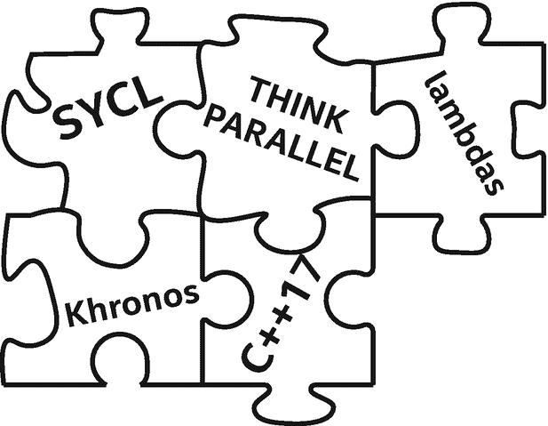
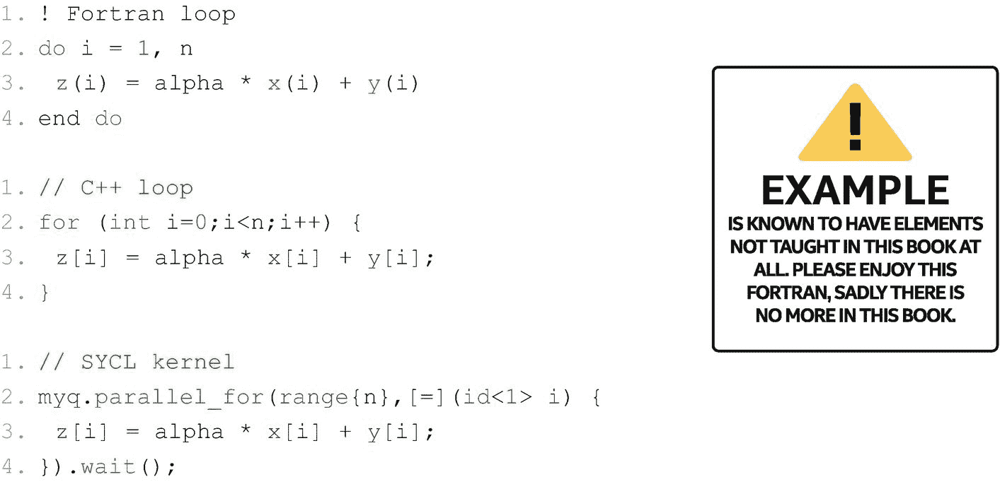
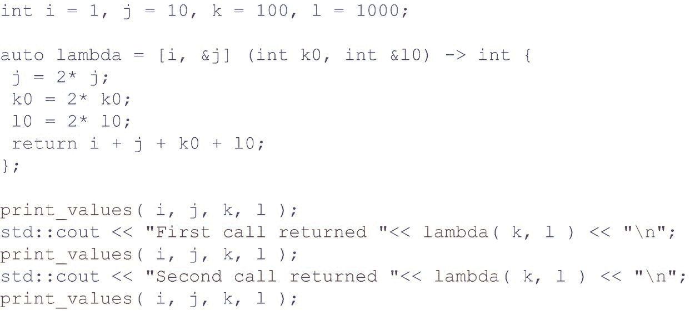

# 一、介绍

本章通过涵盖核心概念(包括术语)奠定了基础，当我们学习如何使用数据并行性来加速 C++ 程序时，这些核心概念对于保持头脑中的新鲜感至关重要。

This chapter lays the foundation by covering core concepts, including terminology, that are critical to have fresh in our minds as we learn how to accelerate C++ programs using data parallelism.

C++ 中的数据并行性支持在现代异构系统中访问并行资源。单个 C++ 应用程序可以使用任何设备组合，包括 GPU、CPU、FPGAs 和人工智能专用集成电路(ASICs)，这些设备组合都适用于当前的问题。

这本书教授使用 C++ 和 SYCL 的数据并行编程。

SYCL(读作*镰刀*)是一个行业驱动的 Khronos 标准，它为异构系统的 C++ 增加了数据并行性。SYCL 程序在与支持 SYCL 的 C++ 编译器(如本书中使用的开源数据并行 C++ (DPC++ ))编译器)配合使用时性能最佳。SYCL 不是首字母缩写词；SYCL 只是一个名字。

DPC++ 是一个开源编译器项目，最初由英特尔员工创建，致力于在 C++ 中大力支持数据并行。DPC++ 编译器基于 SYCL、一些扩展、 [1](#Fn1) 和广泛的异构支持，包括 GPU、CPU 和 FPGA 设备。除了开源版本的 DPC++ 之外，英特尔 oneAPI 工具包中还提供了商业版本。

基于 SYCL 实现的特性受到 DPC++ 编译器的开源和商业版本的支持。本书中的所有例子都可以用*或者*版本的 DPC++ 编译器编译和工作，而且几乎所有例子都可以用最新的 SYCL 编译器编译。在发布时，我们会仔细注意哪些地方使用了特定于 DPC++ 的扩展。

## 读这本书，而不是说明书

没有人想被告知“去读说明书吧！”规范很难读懂，SYCL 规范也不例外。像每一个伟大的语言规范一样，它在动机、用法和教学方面都非常精确和简洁。这本书是教授 SYCL 和使用 DPC++ 编译器的“学习指南”。

正如序言中提到的，这本书无法一次性解释*所有的事情*。因此，这一章做了其他章节都不会做的事情:代码示例包含的编程结构在以后的章节中才会解释。我们应该试着不要完全理解第 [1](#b978-1-4842-5574-2_1) 章中的代码示例，相信每一章都会变得更好。

## SYCL 1.2.1 与 SYCL 2020 和 DPC++ 的对比

在本书付印之际，SYCL 2020 临时规范已经公开征求意见。随着时间的推移，将会出现当前 SYCL 1.2.1 标准的继任者。这个预期的继任者被非正式地称为 SYCL 2020。虽然说这本书教授 SYCL 2020 很好，但这是不可能的，因为该标准尚不存在。

这本书教授 SYCL 扩展，以估计 SYCL 在未来的位置。这些扩展是在 DPC++ 编译器项目中实现的。几乎所有在 DPC++ 中实现的扩展都是临时 SYCL 2020 规范中的新特性。DPC++ 支持的值得注意的新特性是 USM、子组、C++17 支持的语法简化(称为 class 类模板参数演绎)，以及无需命名即可使用匿名 lambdas 的能力。

在发布时，*没有任何* SYCL 编译器(包括 DPC++)实现了 SYCL 2020 临时规范中的*所有*功能。

本书中使用的一些特性是特定于 DPC++ 编译器的。其中许多特性最初是英特尔对 SYCL 的扩展，后来被纳入 SYCL 2020 临时规范，在某些情况下，它们的语法在标准化过程中略有变化。其他功能仍在开发或讨论中，可能会包含在未来的 SYCL 标准中，它们的语法也可能类似地被修改。在语言开发过程中，这样的语法变化实际上是非常可取的，因为我们希望特性不断发展和改进，以满足更广泛的开发人员群体的需求和各种设备的功能。本书中的所有代码示例都使用 DPC++ 语法来确保与 DPC++ 编译器的兼容性。

在努力接近 SYCL 的发展方向的同时，随着标准的发展，几乎肯定需要对本书中的信息进行调整，以与标准保持一致。更新信息的重要资源包括 GitHub 一书和勘误表，可从该书的网页([www . a press . com/9781484255735](https://www.apress.com/9781484255735))以及在线 oneAPI DPC++ 语言参考( [tinyurl. com/ dpcppref](http://tinyurl.com/dpcppref) )中找到。

## 获得 DPC++ 编译器

DPC++ 可以从 GitHub 资源库( [github. com/ intel/ llvm](http://github.com/intel/llvm) )获得。可以在[Intel . GitHub . io/llvm-docs/GetStartedGuide . html](http://intel.github.io/llvm-docs/GetStartedGuide.html)找到 DPC++ 入门指南，包括如何使用 GitHub 的克隆版本构建开源编译器。

还有 DPC++ 编译器的捆绑版本，增加了用于 DPC++ 编程和支持的其他工具和库，作为更大的 oneAPI 项目的一部分提供。该项目带来了对异构系统的广泛支持，包括库、调试器和其他工具，称为 oneAPI。包括 DPC++ 在内的 oneAPI 工具都是免费提供的([oneAPI . com/implementations](http://www.oneapi.com/implementations))。官方 oneAPI DPC++ 编译器文档，包括扩展列表，可以在[Intel . github . io/llvm-docs](http://intel.github.io/llvm-docs)找到。

这本书的在线伴侣，oneAPI DPC++ 语言参考 online ，是一个很好的资源，可以在这本书的基础上获得更多正式的细节。

## GitHub 图书

很快我们会遇到图 [1-1](#Fig1) 中的代码。如果我们想避免全部键入，我们可以很容易地从 GitHub 存储库中下载本书中的所有示例([www . a press . com/9781484255735](https://www.apress.com/9781484255735)—寻找本书的服务:源代码)。该存储库包括带有构建文件的完整代码，因为大多数代码清单省略了重复的或不必要的细节。存储库中有这些例子的最新版本，如果有更新的话，这是很方便的。

图 1-1

你好数据并行编程

## 你好，世界！和 SYCL 程序剖析

图 [1-1](#Fig1) 显示了一个样本 SYCL 程序。使用 DPC++ 编译器编译并运行它，会打印出以下内容:

你好，世界！(还有一些额外的文本留给运行它的人去体验)

在第 4 章结束时，我们会完全理解这个特殊的例子。在此之前，我们可以观察定义所有 SYCL 构造所需的`<CL/sycl.hpp>`(第 1 行)的单个 include。所有 sycl 构造都存在于一个名为 SYCL 的名称空间中:

*   第 3 行让我们避免一遍又一遍地写`sycl::`。

*   第 11 行为指向特定设备的工作请求建立了一个队列(第 [2](02.html#b978-1-4842-5574-2_2) 章)。

*   第 13 行为与设备共享的数据创建一个分配(第 [3](03.html#b978-1-4842-5574-2_3) 章)。

*   第 16 行将工作排入设备队列(第[章第 4](04.html#b978-1-4842-5574-2_4) )。

*   第 17 行是将在设备上运行的唯一一行代码。所有其他代码都在主机(CPU)上运行。

第 17 行是我们希望在设备上运行的*内核*代码。内核代码减少一个字符。借助于`parallel_for()`的能力，内核在我们的秘密字符串中的每个字符上运行，以便将它解码成`result`字符串。所需的工作没有顺序，一旦`parallel_for`将工作排队，它实际上相对于主程序异步运行。在查看结果之前有一个等待(第 18 行)是很关键的，以确保内核已经完成，因为在这个特定的例子中，我们使用了一个方便的特性(统一共享内存，第 [6 章](06.html#b978-1-4842-5574-2_6))。如果没有等待，输出可能会在所有字符被解密之前发生。还有更多要讨论的，但那是后面章节的工作。

## 队列和操作

第 2 章将讨论队列和动作，但是我们现在可以从一个简单的解释开始。队列是唯一允许应用程序在设备上直接完成工作的连接。有两种类型的操作可以放入队列中:(a)要执行的代码和(b)内存操作。要执行的代码通过`single_task`、`parallel_for`(用于图 [1-1](#Fig1) )或`parallel_for_work_group`来表示。内存操作执行主机和设备之间的复制操作或填充操作来初始化内存。如果我们寻求比自动为我们做的更多的控制，我们只需要使用内存操作。这些都将在本书后面从第 [2](02.html#b978-1-4842-5574-2_2) 章开始讨论。现在，我们应该意识到，队列是允许我们命令设备的连接，我们有一组可用于放入队列的操作来执行代码和移动数据。理解被请求的动作被放入队列而不等待也是非常重要的。在将动作提交到队列中之后，主机继续执行程序，而设备将最终异步地执行通过队列请求的动作。

队列将我们与设备联系起来。

我们将动作提交到这些队列中，请求计算工作和数据移动。

动作异步发生。

## 这完全是关于并行性

因为用 C++ 进行数据并行编程完全是关于并行性的，所以让我们从这个关键概念开始。并行编程的目标是更快地计算一些东西。事实证明这有两个方面:*增加吞吐量*和*减少延迟*。

### 生产能力

当我们在一定的时间内完成更多的工作时，程序的吞吐量就会增加。像流水线这样的技术实际上可能会延长完成一项工作所需的时间，以允许工作重叠，从而导致单位时间内完成更多的工作。人类在一起工作时经常会遇到这种情况。分担工作的行为本身就包含了协调的开销，这通常会拖慢做一件事情的时间。然而，多人的力量导致更多的吞吐量。计算机也不例外——将工作分散到更多的处理核心会增加每个工作单元的开销，这可能会导致一些延迟，但目标是完成更多的总工作，因为我们有更多的处理核心一起工作。

### 潜伏

如果我们想更快地完成一件事——例如，分析一个语音命令并制定一个响应，该怎么办？如果我们只关心吞吐量，响应时间可能会变得难以忍受。减少延迟的概念要求我们将一项工作分解成可以并行处理的部分。对于吞吐量，图像处理可能会将整个图像分配给不同的处理单元，在这种情况下，我们的目标可能是优化每秒图像数。对于延迟，图像处理可能会将图像中的每个像素分配给不同的处理核心，在这种情况下，我们的目标可能是最大化单幅图像每秒的像素。

### 平行思考

成功的并行程序员在他们的编程中使用这两种技术。这是我们寻求平行思考的开始。

我们希望调整我们的思维，首先考虑在我们的算法和应用程序中哪里可以找到并行性。我们还会思考表达并行性的不同方式如何影响我们最终实现的性能。那是一次要接受的很多东西。寻求*思考并行*成为并行程序员一生的旅程。我们可以在这里学到一些技巧。

### 阿姆达尔和古斯塔夫森

阿姆达尔定律是由超级计算机先驱吉恩·阿姆达尔在 1967 年提出的，是一个预测使用多个处理器时理论上最大加速的公式。Amdahl 哀叹道，并行性的最大收益受限于`(1/(1-p))`，其中`p`是并行运行的程序的一部分。如果我们只并行运行程序的三分之二，那么程序最多可以加速 3 倍。我们绝对需要这个概念深入人心！这是因为无论我们让程序的三分之二运行得多快，另外三分之一仍然需要同样的时间来完成。即使我们添加 100 个 GPU，我们也只能获得 3 倍的性能提升。

多年来，一些人认为这证明了并行计算不会有成效。1988 年，约翰·古斯塔夫森发表了一篇题为“重新评估阿姆达尔定律”的文章。他观察到并行性不是用来加速固定工作负载的，而是用来支持工作的扩展。人类也经历同样的事情。一个送货人不可能在更多人和卡车的帮助下更快地运送一个包裹。然而，一百个人和一辆卡车可以比一个司机驾驶一辆卡车更快地运送一百个包裹。多个驱动程序肯定会增加吞吐量，通常还会减少包裹交付的延迟。阿姆达尔定律告诉我们，一个司机不可能通过增加九十九个司机自己的卡车来更快地运送一个包裹。古斯塔夫森注意到，有了这些额外的司机和卡车，就有机会更快地运送 100 个包裹。

### 缩放比例

“缩放”一词出现在我们之前的讨论中。缩放是一种衡量当额外计算可用时程序加速多少(简称为“加速”)的方法。如果 100 个包裹与一个包裹在同一时间交付，只要有 100 辆卡车和司机，而不是一辆卡车和司机，就可以实现完美的加速。当然，事实并非如此。在某种程度上，存在一个限制速度提升的瓶颈。配送中心可能没有一百个地方供卡车停靠。在计算机程序中，瓶颈通常涉及到将数据移动到需要处理的地方。向一百辆卡车分发数据类似于向一百个处理核心分发数据。分发的行为不是瞬间的。第 3 章将开始我们探索如何在异构系统中将数据分布到需要的地方的旅程。我们必须知道数据分发是有成本的，而这种成本会影响我们对应用程序的可伸缩性的预期。

### 异构系统

短语“异构系统”偷偷溜进了前一段。出于我们的目的，异构系统是任何包含多种类型的计算设备的系统。例如，具有中央处理单元(CPU)和图形处理单元(GPU)的系统是异构系统。CPU 通常只是被称为处理器，尽管当我们把异构系统中的所有处理单元都称为计算处理器时，这可能会令人混淆。为了避免混淆，SYCL 将处理单元称为*设备*。第 2 章[将开始讨论如何将工作(计算)导向异构系统中的特定设备。](02.html#b978-1-4842-5574-2_2)

GPU 已经发展成为高性能计算设备，因此有时被称为通用 GPU 或 GPGPUs。出于异构编程的目的，我们可以简单地假设我们正在编写这样强大的 GPGPUs，并将它们称为 GPU。

今天，异构系统中的设备集合可以包括 CPU、GPU、FPGAs(现场可编程门阵列)、DSP(数字信号处理器)、ASICs(专用集成电路)和 AI 芯片(图形、神经形态等)。).

这种设备的设计通常包括复制计算处理器(多处理器)和增加与存储器等数据源的连接(增加带宽)。第一种，多重处理，对于提高吞吐量特别有用。在我们的类比中，这是通过增加额外的司机和卡车来完成的。后者，更高的数据带宽，对于减少延迟特别有用。在我们的类比中，这是通过更多的装载码头来实现的，以使卡车能够平行满载。

拥有多种类型的设备，每种设备具有不同的架构，因此具有不同的特性，这导致每种设备具有不同的编程和优化需求。这成为 SYCL、DPC++ 编译器以及本书大部分内容的动机。

SYCL 的创建是为了应对异构系统的 C++ 数据并行编程的挑战。

### 数据并行编程

从这本书的标题开始,“数据并行编程”这个短语就一直没有得到解释。数据并行编程侧重于并行性，可以将并行性想象为一组并行操作的数据。这种重心的转移就像古斯塔夫森对阿姆达尔。我们需要交付 100 个包(实际上是大量数据)，以便在 100 辆卡车和司机之间分配工作。关键概念归结为我们应该划分什么。我们应该处理整个图像还是在更小的图块中处理它们还是逐个像素地处理它们？我们应该将一组对象作为一个单独的集合来分析，还是作为一组更小的对象组来分析，还是逐个对象地分析？

任何使用 SYCL 和 DPC++ 的并行程序员都有责任选择正确的工作分工，并将工作有效地映射到计算资源上。第 4 章开始了这一讨论，并贯穿全书的其余部分。

## DPC++ 和 SYCL 的关键属性

每个 DPC++(或 SYCL)程序也是一个 C++ 程序。SYCL 和 DPC++ 都不依赖于 C++ 的任何语言变化。两者都可以用模板和 lambda 函数完全实现。

SYCL 编译器 [2](#Fn2) 存在的原因是以一种依赖于 SYCL 规范的内置知识的方式来优化代码。缺乏任何 SYCL 内置知识的标准 C++ 编译器无法获得与支持 SYCL 的编译器相同的性能水平。

接下来，我们将检查 DPC++ 和 SYCL 的关键属性:*单源*样式、主机、设备、内核代码和异步任务图。

### 单源

程序可以是单源的，这意味着同一个翻译单元 [3](#Fn3) 既包含定义要在设备上执行的计算内核的代码，也包含协调这些计算内核的执行的主机代码。第 2 章从更详细地了解这种能力开始。如果我们愿意，我们仍然可以将我们的程序源分成不同的文件和主机和设备代码的翻译单元，但关键是我们不必这样做！

### 圣体

每个程序都是从在主机上运行开始的，程序中的大部分*行*代码通常是给主机的。迄今为止，主机一直是 CPU。标准对此没有要求，所以我们小心翼翼地将其描述为主机。这似乎不太可能是 CPU 以外的任何东西，因为主机需要完全支持 C++17 才能支持所有的 DPC++ 和 SYCL 程序。我们很快就会看到，设备不需要支持所有的 C++17。

### 设备

在一个程序中使用多个设备是异构编程的原因。这就是为什么自从几页前对异构系统的解释以来，*设备*这个词一直在本章中反复出现。我们已经了解到，异构系统中的设备集合可以包括 GPU、FPGAs、DSP、ASICs、CPU 和 AI 芯片，但不限于任何固定列表。

设备是 SYCL 承诺的*加速卸载*的目标。卸载计算的想法通常是将工作转移到可以加速工作完成的设备。我们不得不担心弥补移动数据所损失的时间，这是一个需要我们不断思考的话题。

#### 共享设备

在一个有设备的系统上，比如一个 GPU，我们可以想象两个或者更多的程序正在运行并且想要使用一个设备。它们不必是使用 SYCL 或 DPC++ 的程序。如果另一个程序正在使用该设备，则该设备在处理程序时可能会遇到延迟。这与 C++ 程序中通常用于 CPU 的原理是一样的。如果我们在 CPU 上运行太多活动程序(邮件、浏览器、病毒扫描、视频编辑、照片编辑等)，任何系统都可能过载。)一下子。

在超级计算机上，当节点(CPUs 所有连接的设备)被专门授予单个应用程序时，共享通常不是一个问题。在非超级计算机系统上，我们可以注意到，如果有多个应用程序同时使用相同的设备，数据并行 C++ 程序的性能可能会受到影响。

一切仍然工作，没有我们需要做不同的编程。

### 内核代码

设备的代码被指定为内核。这不是 SYCL 或 DPC++ 独有的概念:它是其他卸载加速语言(包括 OpenCL 和 CUDA)的核心概念。

内核代码有一定的限制，以允许更广泛的设备支持和大规模并行。内核代码中不支持的特性列表包括动态多态、动态内存分配(因此没有使用 new 或 delete 操作符的对象管理)、静态变量、函数指针、运行时类型信息(RTTI)和异常处理。不允许从内核代码中调用虚拟成员函数和变量函数。内核代码中不允许递归。

第 3 章将描述如何在内核被调用之前和之后进行内存分配，从而确保内核专注于大规模并行计算。第 [5](05.html#b978-1-4842-5574-2_5) 章将描述与设备相关的异常处理。

C++ 的其余部分是内核中的公平游戏，包括 lambdas、操作符重载、模板、类和静态多态。我们还可以与主机共享数据(参见第 [3 章](03.html#b978-1-4842-5574-2_3))并共享(非全局)主机变量的只读值(通过 lambda 捕获)。

#### 内核:向量加法(DAXPY)

任何从事计算复杂代码工作的程序员都应该对内核很熟悉。考虑实现 DAXPY，它代表“双精度 A 乘以 X 加 Y”，这是几十年来的经典。图 [1-2](#Fig2) 显示了用现代 Fortran、C/C++ 和 SYCL 实现的 DAXPY。令人惊讶的是，计算行(第 3 行)实际上是相同的。第 [4](04.html#b978-1-4842-5574-2_4) 和 [10](10.html#b978-1-4842-5574-2_10) 章将详细解释内核。图 [1-2](#Fig2) 应该有助于消除对内核难以理解的任何担忧——即使术语对我们来说是新的，它们也应该感觉熟悉。

图 1-2

Fortran、C++ 和 SYCL 中的 DAXPY 计算

### 异步任务图

使用 SYCL/DPC++ 编程的异步特性必须*而不是*被忽略。理解异步编程是至关重要的，原因有两个:(1)正确的使用会给我们带来更好的性能(更好的伸缩性),以及(2)错误会导致并行编程错误(通常是竞争条件),使我们的应用程序不可靠。

异步的本质是因为工作是通过请求动作的“队列”转移到设备上的。宿主程序将请求的动作提交到一个队列中，程序继续运行，不等待任何结果。这个*无等待*很重要，这样我们就可以努力让计算资源(设备和主机)一直保持忙碌。如果我们必须等待，那将会束缚主机，而不是让主机做有用的工作。它还会在设备完成时产生串行瓶颈，直到我们排队等待新的工作。如前所述，阿姆达尔定律惩罚我们没有平行工作的时间。我们需要构建我们的程序，以便在设备繁忙时将数据移入和移出设备，并在工作可用时保持设备和主机的所有计算能力繁忙。如果做不到这一点，将会给我们带来阿姆达尔法则的诅咒。

第 [4](04.html#b978-1-4842-5574-2_4) 章将开始讨论把我们的程序想成一个异步任务图，第 [8](08.html#b978-1-4842-5574-2_8) 章大大扩展了这个概念。

#### 我们犯错时的竞争条件

在我们的第一个代码示例(图 [1-1](#Fig1) )中，我们特别在第 18 行做了一个“等待”，以防止第 20 行在`result`的值可用之前将其写出。我们必须记住这种异步行为。在同一个代码示例中还做了另一件微妙的事情——第 14 行使用`std::memcpy`来加载输入。因为`std::memcpy`在主机上运行，所以第 16 行和之后的代码直到第 15 行完成后才执行。在阅读完第 3 章[之后，我们可能会尝试将其改为使用`myQ.memcpy`(使用 SYCL)。我们已经在第 8 行的图](03.html#b978-1-4842-5574-2_3) [1-3](#Fig3) 中完成了。因为这是一个队列提交，所以不能保证它会在第 10 行之前完成。这就产生了一个*竞争条件*，这是一种并行编程错误。当程序的两个部分不协调地访问相同的数据时，就存在争用情况。因为我们希望使用第 8 行写入数据，然后在第 10 行读取数据，所以我们不希望出现第 17 行在第 8 行完成之前执行的竞争！这样的竞争条件会使我们的程序不可预测——我们的程序可能在不同的运行和不同的系统上得到不同的结果。解决这个问题的方法是通过在第 8 行末尾添加`.wait()`来明确等待`myQ.memcpy`完成后再继续。这不是最好的解决办法。我们可以使用事件依赖来解决这个问题(第 [8](08.html#b978-1-4842-5574-2_8) 章)。将队列创建为有序队列还会在`memcpy`和`parallel_for.`之间添加一个隐含的依赖关系。作为替代，在第 [7 章](07.html#b978-1-4842-5574-2_7)中，我们将看到如何使用缓冲区和访问器编程风格来让 SYCL 管理依赖关系并自动等待我们。

图 1-3

添加一个竞争条件来说明关于异步的一点

添加一个`wait()`强制在`memcpy`和内核之间进行主机同步，这与之前让设备一直忙碌的建议背道而驰。本书的大部分内容涵盖了不同的选项和权衡，平衡了程序的简单性和系统的有效使用。

为了帮助检测程序(包括内核)中的数据争用情况，Intel Inspector(在“获取 DPC++ 编译器”中提到的 oneAPI 工具中提供)等工具可能会有所帮助。这些工具使用的有些复杂的方法通常不能在所有设备上工作。检测竞争条件最好的方法是让所有的内核都在一个 CPU 上运行，这可以作为开发工作中的一种调试技术来完成。这个调试技巧在第 [2](02.html#b978-1-4842-5574-2_2) 章中作为方法#2 讨论。

第 4 章会告诉我们“lambdas 不被认为是有害的。”为了更好地使用 DPC++、SYCL 和现代 C++，我们应该熟悉 lambda 函数。

### C++ Lambda 函数

并行编程技术大量使用的现代 C++ 的一个特性是 lambda 函数。内核(在设备上运行的代码)可以有多种表达方式，最常见的是 lambda 函数。第 10 章讨论了内核可以采取的各种形式，包括 lambda 函数。在这里，我们复习了 C++ lambda 函数以及一些关于定义内核的注意事项。第 [10](10.html#b978-1-4842-5574-2_10) 章在我们在中间章节中学习了更多关于 SYCL 的知识后，将详细阐述内核方面。

图 [1-3](#Fig3) 中的代码具有 lambda 函数。我们可以看到它，因为它从非常确定的`[=]`开始。在 C++ 中，lambda 以方括号开始，右方括号前的信息表示如何*捕获在 lambda 中使用的*变量，但这些变量没有作为参数显式传递给它。对于内核，捕获必须是值为的*，这由括号内包含的等号表示。*

对 lambda 表达式的支持是在 C++11 中引入的。它们用于创建匿名函数对象(尽管我们可以将它们赋给命名变量)，这些对象可以从封闭范围中捕获变量。C++ lambda 表达式的基本语法是

在哪里

*   *捕获列表*是一个逗号分隔的捕获列表。我们通过在捕获列表中列出变量名来按值捕获变量。我们通过引用捕获一个变量，在它前面加上一个&符号，例如，`&v` **。**还有适用于所有作用域内自动变量的简写:`[=]`用于通过值和通过引用捕获主体中使用的所有自动变量，`[&]`用于通过引用捕获主体和当前对象中使用的所有自动变量，`[]`什么都不捕获。在 SYCL 中，`[=]`几乎总是被使用，因为在内核中不允许通过引用来捕获变量。根据 C++ 标准，全局变量在 lambda 中不是被捕获的。非全局静态变量*可以在内核中使用*，但是*只能在`const`中使用。*

*   `params`是函数参数列表，就像命名函数一样。SYCL 提供了参数来标识内核被调用来处理的元素:这可以是唯一的 id(一维的)或 2D 或 3D id。这些将在第 4 章中讨论。

*   `ret`是返回类型。如果未指定`->ret`，则从返回语句中推断出来。缺少 return 语句，或者 return 没有值，意味着 return 类型为`void`。SYCL 内核必须*总是*有一个返回类型`void`，所以我们不应该用这个语法来指定内核的返回类型。

*   `body`是函数体。对于 SYCL 内核，这个内核的内容有一些限制(参见本章前面的“内核代码”一节)。

图 [1-4](#Fig4) 显示了一个 C++ lambda 表达式，它通过值捕捉一个变量`i`，通过引用捕捉另一个变量`j`。它还有一个参数`k0`和另一个通过引用接收的参数`l0`。运行该示例将产生如图 [1-5](#Fig5) 所示的输出。

图 1-5

图 [1-4](#Fig4) 中 lambda 函数演示代码的输出

图 1-4

C++ 代码中的 Lambda 函数

我们可以把 lambda 表达式看作一个函数对象的实例，但是编译器为我们创建了类定义。例如，我们在前面的例子中使用的 lambda 表达式类似于图 [1-6](#Fig6) 中所示的类的实例。无论我们在哪里使用 C++ lambda 表达式，我们都可以用一个函数对象的实例来代替它，如图 [1-6](#Fig6) 所示。

图 1-6

函数对象而不是 lambda(在第 [10 章](10.html#b978-1-4842-5574-2_10)中有更多关于这方面的内容)

每当我们定义一个函数对象时，我们都需要给它赋一个名字(图 [1-6](#Fig6) 中的函子)。内嵌表达的 Lambdas(如图 [1-4](#Fig4) 所示)是匿名的，因为它们不需要名字。

### 可移植性和直接编程

可移植性是 SYCL 和 DPC++ 的一个关键目标；但是，两者都不能保证。一门语言和编译器所能做的就是当我们想在应用程序中实现可移植性时，让它变得更容易一些。

可移植性是一个复杂的话题，包括*功能可移植性*和*性能可移植性*的概念。有了功能上的可移植性，我们希望我们的程序可以在各种各样的平台上同等地编译和运行。有了性能可移植性，我们希望我们的程序能在各种平台上获得合理的性能。虽然这是一个相当软的定义，但反过来可能更清楚——我们不希望编写一个在一个平台上运行超快的程序，却发现它在另一个平台上慢得不合理。事实上，我们更希望它能充分利用运行它的任何平台。考虑到异构系统中各种各样的设备，性能可移植性需要我们作为程序员付出巨大的努力。

幸运的是，SYCL 定义了一种可以提高性能可移植性的编码方式。首先，通用内核可以在任何地方运行。在有限的情况下，这可能就足够了。更常见的是，可以为不同类型的设备编写几个版本的重要内核。具体来说，一个内核可能有一个通用的 GPU 版本*和一个通用的 CPU 版本*。有时候，我们可能想为特定的设备(比如特定的 GPU)专门化我们的内核。当这种情况发生时，我们可以编写多个版本，并针对不同的 GPU 模型进行专门化。或者我们可以参数化一个版本，使用 GPU 的属性来修改我们的 GPU 内核如何运行，以适应现有的 GPU。

当我们作为程序员自己负责设计一个有效的性能移植计划时，SYCL 定义了允许我们实现计划的结构。如前所述，功能可以分层，首先为所有设备提供一个内核，然后根据需要逐渐引入更多、更专业的内核版本。这听起来很棒，但是程序的整体流程也会产生深远的影响，因为数据移动和整体算法选择很重要。了解了这一点，就能理解为什么没有人会声称 SYCL(或其他直接编程解决方案)解决了性能可移植性。然而，它是我们工具箱中帮助我们应对这些挑战的工具。

## 并发性与并行性

术语*并发*和*平行*是不等价的，尽管它们有时会被误解。重要的是要知道，并发性所需的任何编程考虑对于并行性也很重要。

术语并发指的是可以前进但不一定在同一时刻的代码。在我们的计算机上，如果我们有一个打开的`Mail`程序和一个`Web Browser`，那么它们是并发运行的。在只有一个处理器的系统上，通过时间分片过程(在运行每个程序之间快速来回切换)，可以发生并发。

Tip

并发性所需的任何编程考虑对于并行性也很重要。

术语并行是指代码可以在同一时刻前进。并行性要求系统实际上一次可以做多件事情。异构系统总是可以并行地做事情，这是由它至少具有两个计算设备的本质决定的。当然，SYCL 程序不需要异构系统，因为它可以在只有主机的系统上运行。今天，任何主机系统都不可能不具备并行执行的能力。

代码的并发执行通常面临与代码的并行执行相同的问题，因为任何特定的代码序列都不能假定它是改变世界(数据位置、I/O 等)的唯一代码。).

## 摘要

本章提供了 SYCL 和 DPC++ 所需的术语，并提供了对 SYCL 和 DPC++ 至关重要的并行编程和 C++ 的关键方面的更新。第 [2](02.html#b978-1-4842-5574-2_2) 、 [3](03.html#b978-1-4842-5574-2_3) 和 [4](04.html#b978-1-4842-5574-2_4) 章详细阐述了 SYCL 编程的三个关键:需要给设备分配工作(发送代码以在其上运行)、提供数据(发送数据以在其上使用)以及拥有编写代码的方法(内核)。

 

**开放存取**本章根据知识共享署名 4.0 国际许可证(http://Creative Commons . org/licenses/by/4.0/)的条款获得许可，该许可证允许以任何媒体或格式使用、共享、改编、分发和复制，只要您适当注明原作者和来源，提供知识共享许可证的链接并指明是否进行了更改。

本章中的图像或其他第三方材料包含在本章的知识共享许可中，除非在材料的信用额度中另有说明。如果材料不包括在本章的知识共享许可中，并且您的预期使用不被法律法规允许或超出了允许的使用范围，您将需要直接从版权所有者处获得许可。

<aside aria-label="Footnotes" class="FootnoteSection">Footnotes [1](#Fn1_source)

DPC++ 团队很快指出，他们希望在将来的某个时候，SYCL 标准会考虑并接受他们所有的扩展。

  [2](#Fn2_source)

称之为支持 SYCL 的 C++ 编译器可能更正确。

  [3](#Fn3_source)

我们可以只说“文件”，但这在这里并不完全正确。翻译单元是编译器的实际输入，由 C 预处理器处理后的源文件构成，用于内联头文件和扩展宏。

 </aside>