# 4.表达平行

现在我们可以把第一批拼图拼在一起了。我们已经知道如何在设备上放置代码(第 [2](02.html#b978-1-4842-5574-2_2) 章)和数据(第 [3](03.html#b978-1-4842-5574-2_3) 章)——我们现在必须做的就是决定如何处理它们。为此，我们现在来补充一些我们到目前为止方便地忽略或掩饰的东西。本章标志着从简单的教学示例到真实世界并行代码的过渡，并扩展了我们在前面章节中随意展示的代码示例的细节。

用一种新的并行语言编写我们的第一个程序似乎是一项艰巨的任务，尤其是如果我们是并行编程的新手。语言规范不是为应用程序开发人员编写的，通常假设他们熟悉一些术语；它们不包含以下问题的答案:

*   为什么排比的表达方式不止一种？

*   我应该用哪种表达排比的方法？

*   我真的需要了解执行模型多少？

本章试图解决这些问题以及更多的问题。我们介绍了数据并行内核的概念，使用工作代码示例讨论了不同内核形式的优缺点，并强调了内核执行模型最重要的方面。

## 内核内部的并行性

近年来，并行内核作为一种表达数据并行性的强大手段出现了。基于内核的方法的主要设计目标是*跨多种设备的可移植性*和高程序员*生产率*。这样，内核通常不被硬编码以与特定数量或配置的硬件资源(例如，内核、硬件线程、SIMD[单指令、多数据]指令)一起工作。相反，内核根据抽象概念来描述并行性，实现(即编译器和运行时的组合)然后可以映射到特定目标设备上可用的硬件并行性。尽管这种映射是由实现定义的，但是我们可以(也应该)相信实现会选择一种合理的、能够有效利用硬件并行性的映射。

以独立于硬件的方式展示大量并行性可确保应用程序可以扩展(或缩小)以适应不同平台的功能，但是…

保证功能的可移植性并不等同于保证高性能！

支持的器件有很大的多样性，我们必须记住，不同的架构是针对不同的使用情况而设计和优化的。每当我们希望在特定设备上实现最高水平的*性能*时，我们应该总是期望需要一些额外的手动优化工作——不管我们使用的是什么编程语言！这种特定于设备的优化的示例包括针对特定高速缓存大小的分块、选择分摊调度开销的粒度、利用专门的指令或硬件单元，以及最重要的是，选择适当的算法。其中一些例子将在第 [15](15.html#b978-1-4842-5574-2_15) 、 [16](16.html#b978-1-4842-5574-2_16) 和 [17](17.html#b978-1-4842-5574-2_17) 章中再次出现。

在应用程序开发过程中，在性能、可移植性和生产力之间取得恰当的平衡是我们都必须面对的挑战——也是本书无法完全解决的挑战。然而，我们希望表明，DPC++ 提供了使用一种高级编程语言来维护通用可移植代码和优化的特定于目标的代码所需的所有工具。剩下的留给读者作为练习！

### 多维核

许多其他语言的并行构造是一维的，将工作直接映射到相应的一维硬件资源(例如，硬件线程的数量)。并行内核是比这更高级的概念，它们的维度更能反映我们的代码通常试图解决的问题(在一维、二维或三维空间中)。

然而，我们必须记住，由并行内核提供的多维索引是在底层一维空间之上实现的，方便了程序员。理解这种映射的行为是某些优化的重要部分(例如，调整内存访问模式)。

一个重要的考虑是哪个维度是*连续的*或*单位步长*(即，多维空间中的哪些位置在一维空间中彼此相邻)。SYCL 中与并行性相关的所有多维量都使用相同的约定:维度从 0 到 N-1 编号，其中维度 N-1 对应于连续维度。在多维数量被写成列表(例如，在构造函数中)或者一个类支持多个下标操作符的地方，这种编号从左到右应用。这个约定与标准 C++ 中多维数组的行为一致。

图 [4-1](#Fig1) 显示了一个使用 SYCL 约定将二维空间映射到线性索引的例子。我们当然可以打破这一惯例，采用自己的指数线性化方法，但必须谨慎行事，因为打破 SYCL 惯例可能会对受益于 stride-1 访问的器件产生负面性能影响。

图 4-1

映射到线性索引的二维大小范围(2，8)

如果一个应用程序需要三个以上的维度，我们必须负责使用模运算手动映射多维和线性索引。

### 循环与内核

迭代循环是一种内在的串行结构:循环的每次迭代都是按顺序执行的(即，按次序)。优化编译器可能能够确定循环的一些或所有迭代可以并行执行，但它必须是保守的——如果编译器不够智能或没有足够的信息来证明并行执行总是安全的，它必须保持循环的顺序语义的正确性。

图 4-2

将向量加法表示为串行循环

考虑图 [4-2](#Fig2) 中的循环，它描述了一个简单的向量加法。即使在这种简单的情况下，证明循环可以并行执行也不是小事:只有当`c`不与`a`或`b`重叠时，并行执行才是安全的，在一般情况下，没有运行时检查就无法证明这一点！为了解决这种情况，语言增加了一些功能，使我们能够为编译器提供额外的信息，这些信息可以简化分析(例如，断言指针不与`restrict`重叠)或完全覆盖所有分析(例如，声明循环的所有迭代都是独立的，或准确定义如何将循环调度到并行资源)。

*并行循环*的确切含义有些模糊——由于不同的并行编程语言对该术语的重载——但是许多常见的并行循环结构表示应用于顺序循环的编译器转换。这种编程模型使我们能够编写连续的循环，并在以后提供关于如何安全并行执行不同迭代的信息。这些模型非常强大，可以与其他最新的编译器优化很好地集成，并极大地简化了并行编程，但并不总是鼓励我们在开发的早期阶段考虑并行性。

并行内核不是一个循环，没有迭代。更确切地说，一个内核描述了一个单一的操作，它可以被实例化多次并应用于不同的输入数据；当内核并行启动时，该操作的多个实例同时执行。

图 4-3

将循环重写(用伪代码)为并行内核

图 [4-3](#Fig3) 显示了我们使用伪代码重写为内核的简单循环示例。这个内核中并行性的机会是清楚而明确的:内核可以由任意数量的实例并行执行，并且每个实例独立地应用于单独的数据。通过将该操作编写为内核，我们断言并行运行是安全的(理想情况下应该是安全的)。

简而言之，基于内核的编程不是一种将并行性改进到现有顺序代码中的方法，而是一种用于编写显式并行应用程序的方法。

我们越早将我们的思维从并行循环转移到内核，使用数据并行 C++ 编写有效的并行程序就越容易。

## 语言功能概述

一旦我们决定编写一个并行内核，我们必须决定我们想要启动什么类型的内核，以及如何在我们的程序中表示它。表达并行内核的方式有很多种，如果我们想掌握这门语言，我们需要熟悉每一种方式。

### 从主机代码中分离内核

我们有几种分离主机和设备代码的替代方法，我们可以在应用程序中混合和匹配它们:C++ lambda 表达式或函数对象(函子)、OpenCL C 源代码字符串或二进制文件。这些选项中的一些已经在第 [2](02.html#b978-1-4842-5574-2_2) 章中介绍过了，所有这些选项都将在第 [10](10.html#b978-1-4842-5574-2_10) 章中详细介绍。

所有这些选项都共享表达并行性的基本概念。为了一致和简洁，本章中的所有代码示例都使用 C++ lambdas 表示内核。

Lambdas Not Considered Harmful

为了开始使用 DPC++，不需要完全理解 C++ 规范中关于 lambda 的所有内容——我们只需要知道 lambda 的主体表示内核，并且捕获的变量(通过值)将作为参数传递给内核。

使用 lambdas 而不是更详细的机制来定义内核不会对性能产生影响。DPC++ 编译器总是能理解 lambda 何时代表并行内核的主体，并能相应地针对并行执行进行优化。

关于 C++ lambda 函数的复习，以及它们在 SYCL 中的用法，请参见第 [1](01.html#b978-1-4842-5574-2_1) 章。关于使用 lambdas 定义内核的更多细节，请参见第 [10](10.html#b978-1-4842-5574-2_10) 章。

### 不同形式的并行内核

有三种不同的内核形式，支持不同的执行模型和语法。使用任何内核形式编写可移植的内核都是可能的，并且以任何形式编写的内核都可以进行调整，以在各种设备类型上实现高性能。然而，有时我们可能希望使用特定的形式来使特定的并行算法更容易表达，或者利用否则无法访问的语言功能。

第一种形式用于*基本的*数据并行内核，并为编写内核提供了最温和的介绍。对于基本内核，我们牺牲了对调度等底层特性的控制，以使内核的表达尽可能简单。单个内核实例如何映射到硬件资源完全由实现来控制，因此随着基本内核复杂性的增加，推断它们的性能变得越来越困难。

第二种形式扩展了基本内核，以提供对低级性能调优特性的访问。出于历史原因，这第二种形式被称为 *ND-range* (N 维范围)数据并行，要记住的最重要的事情是，它使某些内核实例能够被分组在一起，允许我们对数据局部性以及各个内核实例和将用于执行它们的硬件资源之间的映射进行一些控制。

第三种形式提供了另一种语法，使用嵌套的内核结构来简化 ND 范围内核的表达式。这第三种形式被称为*分层*数据并行，指的是出现在用户源代码中的嵌套内核结构的层次结构。

一旦我们更详细地讨论了它们的特性，我们将在本章的最后再次讨论如何在不同的内核形式之间进行选择。

## 基本数据并行内核

并行内核的最基本形式适用于令人尴尬的并行操作(例如，可以完全独立地以任何顺序应用于每一段数据的操作)。通过使用这种形式，我们可以让实现完全控制工作的调度。因此，这是一个*描述性*编程结构的例子——我们*描述*操作是令人尴尬的并行操作，所有的调度决策都由实现做出。

基本的数据并行内核是以单个程序、多数据(SPMD)风格编写的——单个“程序”(内核)应用于多个数据片段。注意，这种编程模型仍然允许内核的每个实例在代码中采用不同的路径，这是数据相关分支的结果。

SPMD 编程模型的最大优势之一是，它允许同一个“程序”映射到多个并行级别和类型，而无需我们给出任何明确的指示。同一个程序的实例可以流水线化，打包在一起用 SIMD 指令执行，分布在多个线程上，或者三者兼而有之。

### 理解基本数据-并行内核

一个基本并行内核的执行空间称为其执行*范围*，内核的每个实例称为一个*项*。这在图 [4-4](#Fig4) 中有图解表示。

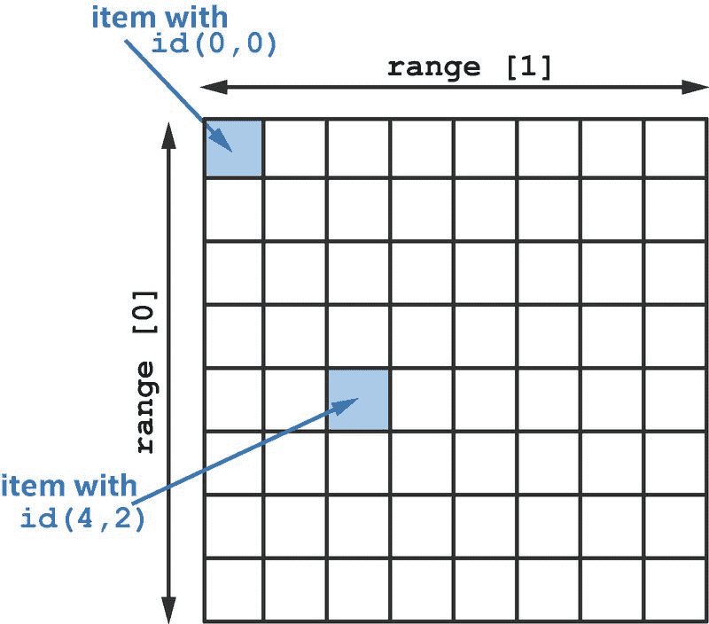

图 4-4

基本并行内核的执行空间，显示了 64 个项目的 2D 范围

基本数据并行内核的执行模型非常简单:它*允许*完全并行执行，但*不保证*或*需要*它。项目可以按任何顺序执行，包括在单个硬件线程上按顺序执行(即没有任何并行性)！假设所有项目将被并行执行(例如，通过尝试同步项目)的内核因此非常容易导致程序在一些设备上挂起。

然而，为了保证正确性，我们必须总是在假设它们*可以*被并行执行的情况下编写我们的内核。例如，我们有责任确保对内存的并发访问被原子内存操作适当地保护(见第 [19 章](19.html#b978-1-4842-5574-2_19))，以防止竞争情况。

### 编写基本数据-并行内核

基本的数据并行内核使用`parallel_for`函数来表示。图 [4-5](#Fig5) 展示了如何使用这个函数来表达一个向量加法，这是我们对“你好，世界！”用于并行加速器编程。

图 4-5

用`parallel_for`表示向量加法核

该函数只接受两个参数:第一个参数是指定在每个维度中启动的项目数量的`range`,第二个参数是为该范围中的每个索引执行的内核函数。有几个不同的类可以作为内核函数的参数，应该使用哪个取决于哪个类公开了所需的功能——我们将在后面再讨论这个问题。

图 [4-6](#Fig6) 显示了该函数的一个非常类似的用法来表示矩阵加法，除了二维数据之外，它(在数学上)与向量加法相同。这反映在内核中——两个代码片段之间的唯一区别是所使用的`range`和`id`类的维度！这样写代码是可能的，因为一个 SYCL `accessor`可以被一个多维`id`索引。虽然看起来很奇怪，但这可能非常强大，使我们能够根据数据的维度编写内核模板。

图 4-6

用`parallel_for`表示矩阵加法核

在 C/C++ 中更常见的是使用多个索引和多个下标操作符来索引多维数据结构，并且这种显式索引也受到访问器的支持。当内核同时对不同维度的数据进行操作时，或者当内核的内存访问模式比直接使用项目的`id`更复杂时，以这种方式使用多个索引可以提高可读性。

例如，图 [4-7](#Fig7) 中的矩阵乘法内核必须提取索引的两个独立分量，以便能够描述两个矩阵的行和列之间的点积。在我们看来，一致地使用多个下标操作符(如`[j][k]`)比混合多种索引模式和构造二维`id`对象(如`id(j,k)`)更具可读性，但这只是个人喜好问题。

本章剩余部分的例子都使用了多个下标操作符，以确保被访问的缓冲区的维数没有歧义。

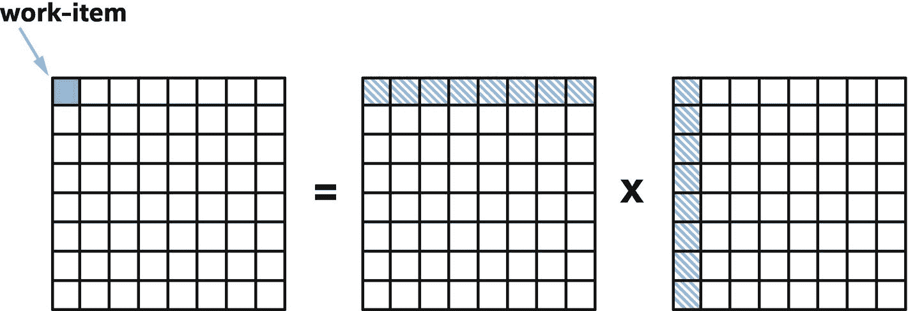

图 4-8

将矩阵乘法工作映射到执行范围内的项目

图 4-7

用`parallel_for`表示方阵的简单矩阵乘法核

图 [4-8](#Fig8) 中的图表显示了矩阵乘法内核中的工作是如何映射到单个项目的。注意，项目的数量来自于*输出*范围的大小，并且相同的输入值可以由多个项目读取:每个项目通过顺序迭代 A 矩阵的(连续)行和 B 矩阵的(非连续)列来计算 C 矩阵的单个值。

### 基本数据的细节-并行内核

基本数据并行内核的功能通过三个 C++ 类公开:`range`、`id`和`item`。我们已经在前面的章节中见过几次`range`和`id`类，但是我们在这里以不同的焦点重新审视它们。

#### `range`类

`range`代表一维、二维或三维范围。`range`的维度是一个模板参数，因此必须在编译时知道，但是它在每个维度上的大小是动态的，在运行时传递给构造函数。`range`类的实例用于描述并行结构的执行范围和缓冲区的大小。

图 [4-9](#Fig9) 显示了`range`类的简化定义，显示了构造函数和查询其范围的各种方法。

图 4-9

`range`类的简化定义

#### `id`类

`id`表示一维、二维或三维范围的索引。`id`的定义在许多方面与`range`相似:它的维数在编译时也必须是已知的，并且它可以用于索引并行结构中内核的单个实例或缓冲区中的偏移量。

如图 [4-10](#Fig10) 中`id`类的简化定义所示，`id`在概念上只不过是一个、两个或三个整数的容器。我们可用的操作也非常简单:我们可以在每个维度中查询索引的组成部分，并且我们可以执行简单的运算来计算新的索引。

虽然我们可以构造一个`id`来表示任意的索引，但是为了获得与特定内核实例相关联的`id`，我们必须接受它(或者包含它的`item`)作为内核函数的参数。这个`id`(或者由它的成员函数返回的值)必须被转发到我们想要在其中查询索引的任何函数——目前没有任何免费的函数可以在程序中的任意点查询索引，但是这可能会在 DPC++ 的未来版本中解决。

接受`id`的内核的每个实例只知道它被分配计算的范围中的索引，而对范围本身一无所知。如果我们希望我们的内核实例知道它们自己的索引*和*范围，我们需要使用`item`类来代替。

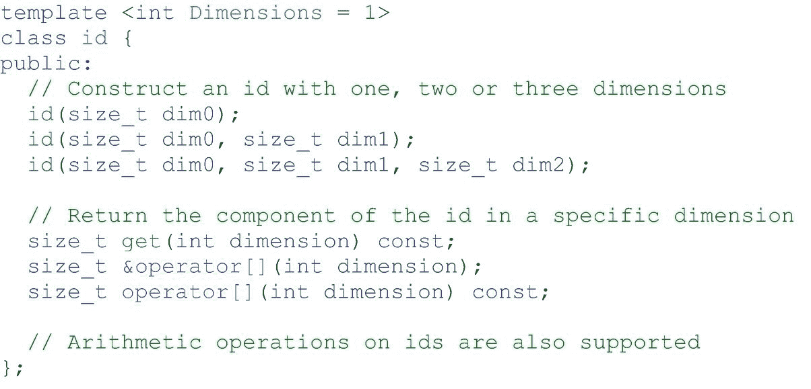

图 4-10

`id`类的简化定义

#### `item`类

一个`item`代表一个内核函数的单个实例，封装了内核的执行范围和该范围内实例的索引(分别使用一个`range`和一个`id`)。像`range`和`id`一样，它的维数必须在编译时已知。

图 [4-11](#Fig11) 给出了`item`等级的简化定义。`item`和`id`的主要区别在于`item`公开了额外的函数来查询执行范围的属性(例如，大小、偏移量)以及计算线性化索引的便利函数。与`id`一样，获得与特定内核实例相关联的`item`的唯一方式是接受它作为内核函数的参数。

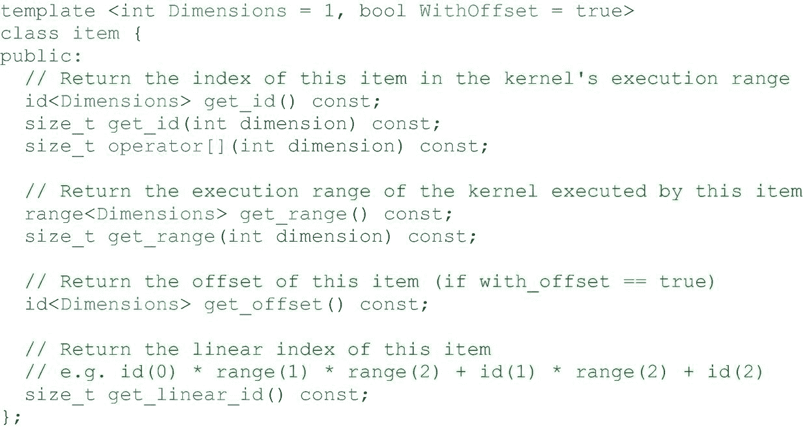

图 4-11

`item`类的简化定义

## 显式 ND 范围核

第二种形式的并行内核用一个项目属于组的执行范围代替了基本数据并行内核的平面执行范围，并且适用于我们希望在内核中表达一些局部性概念的情况。为不同类型的组定义和保证不同的行为，使我们能够更深入地了解和/或控制如何将工作映射到特定的硬件平台。

因此，这些显式的 ND-range 内核是一个更加*规定的*并行构造的例子——我们*规定*将工作映射到每种类型的组，并且实现必须服从该映射。然而，它并不是完全规定的，因为组本身可以以任何顺序执行，并且实现在如何将每种类型的组映射到硬件资源上保留了一些自由。这种说明性和描述性编程的结合使我们能够针对局部性设计和调优我们的内核，而不影响它们的可移植性。

像基本的数据并行内核一样，ND-range 内核以 SPMD 风格编写，其中所有工作项执行应用于多条数据的相同内核“程序”。关键的区别在于，每个程序实例可以查询它在包含它的组中的位置，并且可以访问特定于每种类型的组的附加功能。

### 理解显式 ND 范围并行核

ND-range 内核的执行范围被分为工作组、子组和工作项目。ND-range 表示总的执行范围，该范围被划分成统一大小的工作组(即，工作组大小必须在每个维度上精确地划分 ND-range 大小)。每个工作组可以通过实现进一步划分为子组。理解为工作项和每种类型的组定义的执行模型是编写正确的可移植程序的重要部分。

图 [4-12](#Fig12) 显示了一个 ND 尺寸范围(8，8，8)的示例，该范围分为 8 个尺寸工作组(4，4，4)。每个工作组包含 4 个工作项的 16 个一维子组。请仔细注意维度的编号:子组始终是一维的，因此 nd 范围和工作组的维度 2 成为子组的维度 0。

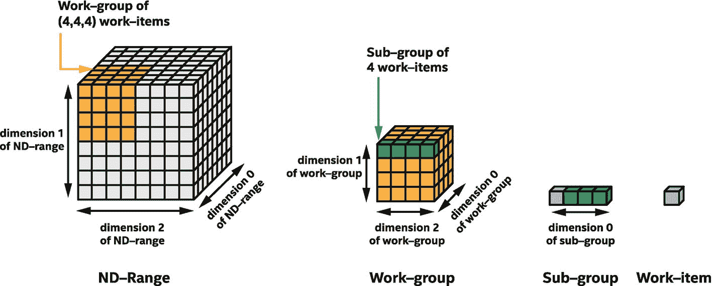

图 4-12

分为工作组、子组和工作项目的三维 ND-range

从每种类型的组到硬件资源的精确映射是*实现定义的*，正是这种灵活性使得程序能够在各种各样的硬件上执行。例如，工作项目可以完全顺序执行，由硬件线程和/或 SIMD 指令并行执行，或者甚至由为特定内核专门配置的硬件流水线执行。

在这一章中，我们只关注 ND-range 执行模型在通用目标平台方面的语义保证，我们不会涉及它到任何一个平台的映射。分别参见第 [15](15.html#b978-1-4842-5574-2_15) 、 [16](16.html#b978-1-4842-5574-2_16) 和 [17](17.html#b978-1-4842-5574-2_17) 章了解 GPU、CPU 和 FPGAs 的硬件映射和性能建议的详细信息。

#### 工作项目

工作项代表一个内核函数的单个实例。在没有其他分组的情况下，工作项目可以以任何顺序执行，并且不能相互通信或同步，除非通过对全局内存的原子内存操作(见第 [19 章](19.html#b978-1-4842-5574-2_19))。

#### 工作组

ND 范围中的工作项被组织成工作组。工作组可以以任何顺序执行，不同工作组中的工作项目不能相互通信，除非通过对全局内存的原子内存操作(见第 [19 章](19.html#b978-1-4842-5574-2_19))。然而，当使用某些结构时，一个工作组中的工作项具有并发调度保证，并且这种局部性提供了一些额外的能力:

1.  一个工作组中的工作项目可以访问*工作组本地存储器*，它可以映射到一些设备上的专用快速存储器(参见第 [9](09.html#b978-1-4842-5574-2_9) 章)。

2.  一个工作组中的工作项可以使用*工作组屏障*来同步，并使用*工作组内存屏障*来保证内存一致性(参见第 [9 章](09.html#b978-1-4842-5574-2_9))。

3.  工作组中的工作项目可以访问*组功能*，提供通用通信例程(参见第 [9](09.html#b978-1-4842-5574-2_9) 章)和通用并行模式(如缩减和扫描)的实现(参见第 [14 章](14.html#b978-1-4842-5574-2_14))。

通常在运行时为每个内核配置工作组中的工作项目数量，因为最佳分组将取决于可用的并行性数量(即 nd 范围的大小)和目标设备的属性。我们可以使用`device`类的查询函数来确定特定设备支持的每个工作组的最大工作项目数(参见第 [12 章](12.html#b978-1-4842-5574-2_12)),我们有责任确保每个内核请求的工作组大小是有效的。

工作组执行模型中有一些微妙之处值得强调。

首先，尽管工作组中的工作项目被调度到单个计算单元，但是在工作组的数量和计算单元的数量之间不需要任何关系。事实上，ND-range 中的工作组数量可能比给定设备可以并发执行的工作组数量大很多倍！我们可能会尝试通过依赖非常聪明的特定于设备的调度来编写跨工作组同步的内核，但我们强烈建议不要这样做——这样的内核今天可能看起来可以工作，但不能保证它们可以在未来的实现中工作，并且在移动到不同的设备时很可能会崩溃。

第二，尽管一个工作组中的工作项是并发调度的，但不能保证它们独立地*向前进展*——在一个工作组内，在障碍和集合之间顺序地执行工作项是一种有效的实现。只有在使用提供的屏障和集合函数执行时，才能保证同一工作组中工作项之间的通信和同步是安全的，并且手工编码的同步例程可能会死锁。

Thinking in Work-Groups

工作组在许多方面类似于其他编程模型中的任务概念(例如，线程构建块):任务可以以任何顺序执行(由调度器控制)；让一台机器超额预定任务是可能的(甚至是可取的);试图在一组任务之间实现屏障通常不是一个好主意(因为它可能非常昂贵或者与调度程序不兼容)。如果我们已经熟悉了基于任务的编程模型，我们可能会发现将工作组想象成数据并行任务是很有用的。

#### 子群体

在许多现代硬件平台上，工作组中被称为子组*的工作项目子集在额外的调度保证下执行。例如，作为编译器向量化的结果，子组中的工作项目可以同时执行，和/或子组本身可以在向前进度保证下执行，因为它们被映射到独立的硬件线程。*

当使用单一平台时，很容易将关于这些执行模型的假设融入到我们的代码中，但这使得它们本质上不安全且不可移植——当在不同编译器之间移动时，甚至当在同一供应商的不同代硬件之间移动时，它们可能会中断！

将子组定义为语言的核心部分，为我们提供了一个安全的替代方案，来做出后来可能被证明是特定于设备的假设。利用子组功能还允许我们在较低的级别(即，接近硬件)推理工作项目的执行，并且是在许多平台上实现非常高的性能水平的关键。

与工作组一样，子组中的工作项可以同步，保证内存一致性，或者通过组函数执行常见的并行模式。但是，对于子组，没有等效的工作组本地内存(即，没有子组本地内存)。相反，子组中的工作项可以使用*混洗*操作(第 [9 章](09.html#b978-1-4842-5574-2_9))直接交换数据，而不需要显式的内存操作。

子组的某些方面是实现定义的，不在我们的控制之内。然而，对于设备、内核和 ND-range 的给定组合，一个子组有一个固定的(一维)大小，我们可以使用`kernel`类的查询函数来查询这个大小(参见第 [10 章](10.html#b978-1-4842-5574-2_10))。默认情况下，每个子组的工作项数量也是由实现选择的——我们可以通过在编译时请求特定的子组大小来覆盖这种行为，但是必须确保我们请求的子组大小与设备兼容。

像工作组一样，子组中的工作项只能保证并发执行——实现可以自由地顺序执行子组中的每个工作项，并且只在遇到子组集合函数时在工作项之间切换。子组的特殊之处在于，一些设备保证它们独立地向前进展——在一些设备上，一个工作组内的所有子组都保证最终执行(取得进展)，这是几个生产者-消费者模式的基石。可以使用设备查询来确定这种独立的前向进度保证是否成立。

Thinking in Sub-Groups

如果我们来自一个要求我们考虑显式矢量化的编程模型，那么将每个子组视为一组打包到 SIMD 寄存器中的工作项可能是有用的，其中子组中的每个工作项对应于一个 SIMD 通道。当多个子组同时运行，并且设备保证它们将向前推进时，这种心理模型扩展到将每个子组视为并行执行的独立矢量指令流。

图 4-13

用 ND-range 表示一个简单的矩阵乘法核`parallel_for`

### 编写显式 ND 范围数据并行内核

图 [4-13](#Fig13) 重新实现了我们之前看到的使用 ND-range 并行内核语法的矩阵乘法内核，图 [4-14](#Fig14) 中的图表显示了该内核中的工作如何映射到每个工作组中的工作项目。以这种方式对我们的工作项进行分组确保了访问的局部性，并且有望提高缓存命中率:例如，图 [4-14](#Fig14) 中的工作组具有(4，4)的局部范围，并且包含 16 个工作项，但是访问的数据是单个工作项的四倍——换句话说，我们从内存中加载的每个值都可以重用四次。

图 4-14

将矩阵乘法映射到工作组和工作项

到目前为止，我们的矩阵乘法示例依赖于硬件缓存来优化来自同一工作组中的工作项对 A 和 B 矩阵的重复访问。这种硬件高速缓存在传统 CPU 架构上很常见，并且在 GPU 架构上变得越来越常见，但是还有其他具有显式管理的“便笺式”存储器的架构(例如，上一代 GPU、FPGAs)。ND-range 内核可以使用*本地访问器*来描述应该放在工作组本地内存中的分配，然后实现可以自由地将这些分配映射到特殊内存(如果存在的话)。该工作组本地存储器的使用将在第 [9](09.html#b978-1-4842-5574-2_9) 章中介绍。

### 显式 ND 范围数据并行内核的详细信息

与基本数据并行内核相比，ND-range 数据并行内核使用不同的类:`range`由`nd_range` `,`代替，`item`由`nd_item`代替。还有两个新的类，代表一个工作项可能属于的不同类型的组:绑定到工作组的功能封装在`group`类中，绑定到子组的功能封装在`sub_group`类中。

#### `nd_range`类

一个`nd_range`使用两个`range`类的实例表示一个分组的执行范围:一个表示全局执行范围，另一个表示每个工作组的局部执行范围。图 [4-15](#Fig15) 给出了`nd_range`等级的简化定义。

可能有点奇怪的是，`nd_range`类根本没有提到子组:子组范围在构造时没有指定，无法查询。这一遗漏有两个原因。首先，子组是底层的实现细节，对于许多内核来说可以忽略。其次，有几个设备正好支持一个有效的子组大小，在任何地方指定这个大小都是不必要的冗长。所有与子组相关的功能都封装在一个专门的类中，稍后将讨论这个类。

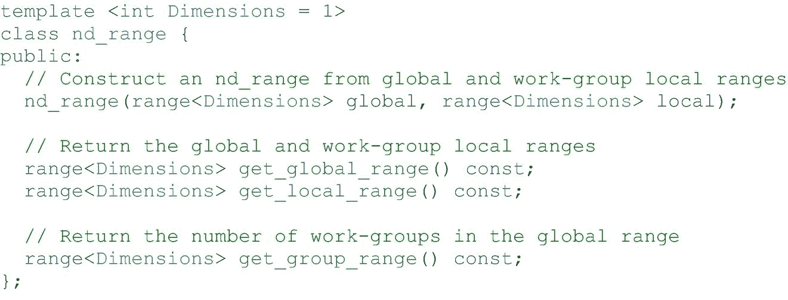

图 4-15

`nd_range`类的简化定义

#### `nd_item`类

一个`nd_item`是一个`item`的 ND-range 形式，同样封装了内核的执行范围和该范围内的项目索引。`nd_item`与`item`的不同之处在于其在范围中的位置是如何查询和表示的，如图 [4-16](#Fig16) 中简化的类定义所示。例如，我们可以使用`get_global_id()`函数查询(全局)ND 范围中的项目索引，或者使用`get_local_id()`函数查询(本地)父工作组中的项目索引。

`nd_item`类还提供了获取描述项目所属的组和子组的类的句柄的函数。这些类为查询 ND 范围内的项目索引提供了另一种接口。我们强烈建议使用这些类来编写内核，而不是直接依赖于`nd_item`:使用`group`和`sub_group`类通常更干净，更清楚地传达意图，并且更符合 DPC++ 的未来方向。

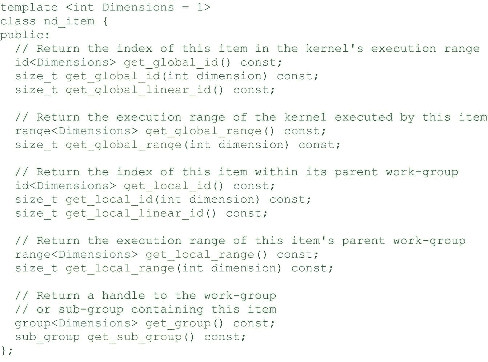

图 4-16

`nd_item`类的简化定义

#### `group`类

`group`类封装了所有与工作组相关的功能，简化的定义如图 [4-17](#Fig17) 所示。

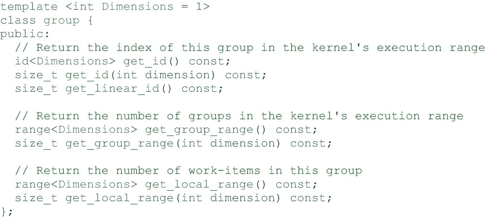

图 4-17

`group`类的简化定义

`group`类提供的许多函数在`nd_item`类中都有等价的函数:例如，调用`group.get_id()`相当于调用`item.get_group_id(),`，调用`group.get_local_range()`相当于调用`item.get_local_range().`如果我们没有使用该类公开的任何工作组函数，我们还应该使用它吗？直接使用`nd_item`中的函数，而不是创建一个中间的`group`对象，不是更简单吗？这里有一个折衷:使用`group`需要我们编写稍微多一点的代码，但是这些代码可能更容易阅读。例如，考虑图 [4-18](#Fig18) 中的代码片段:很明显`body`期望被`group`中的所有工作项调用，很明显`parallel_for`体中的`get_local_range()`返回的`range`是`group`的范围。同样的代码可以很容易地只用`nd_item`来编写，但是读者可能很难理解。

图 4-18

使用`group`类提高可读性

#### `sub_group`类

`sub_group`类封装了与子组相关的所有功能，简化的定义如图 [4-19](#Fig19) 所示。与工作组不同，`sub_group`类是访问子组功能的唯一方式；它的功能在`nd_item`中没有任何重复。`sub_group`类中的查询都是相对于调用工作项来解释的:例如，`get_local_id()`返回子组中调用工作项的本地索引。

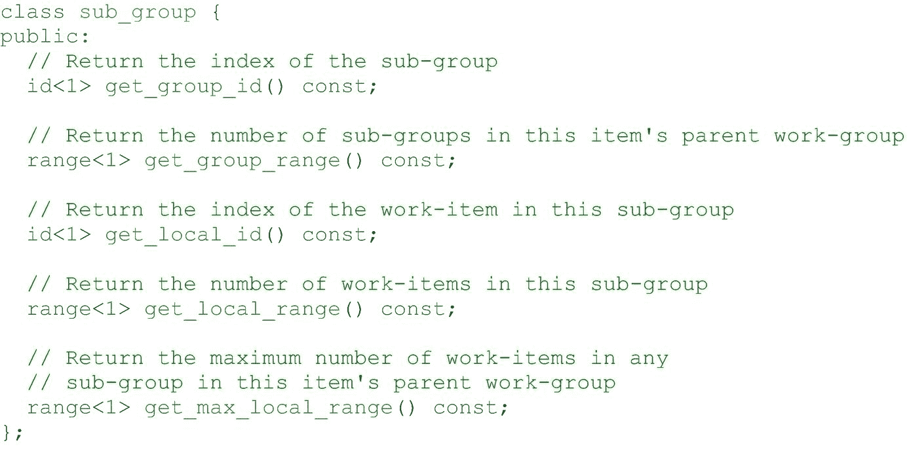

图 4-19

`sub_group`类的简化定义

注意，有单独的函数用于查询当前子组中的工作条目的数量以及工作组内任何子组中的工作条目的最大数量。这些是否不同以及如何不同取决于子组对于特定设备是如何实现的，但是目的是反映编译器所针对的子组大小和运行时子组大小之间的任何差异。例如，非常小的工作组可能包含比编译时子组大小更少的工作项，或者不同大小的子组可用于处理不能被子组大小整除的工作组。

## 分层并行核

分层数据并行内核提供了一种实验性的替代语法，用于根据工作组和工作项来表达内核，其中使用嵌套调用`parallel_for`函数来编程分层的每一层。这种*自顶向下*的编程风格旨在类似于编写并行循环，可能比其他两种内核形式使用的*自底向上*的编程风格更熟悉。

分层内核的一个复杂性是对`parallel_for`的每次嵌套调用都会创建一个单独的 SPMD 环境；每个作用域定义了一个新的“程序”，该程序应该由与该作用域相关联的所有并行工作器执行。这种复杂性要求编译器执行额外的分析，并且会使某些设备的代码生成变得复杂；某些平台上的分层并行内核的编译器技术仍然相对不成熟，性能将与特定编译器实现的质量紧密相关。

由于分层数据并行内核与为特定设备生成的代码之间的关系依赖于编译器，因此分层内核应被视为比显式 ND-range 内核更具*描述性的*构造。然而，由于分级内核保留了控制工作到工作项和工作组的映射的能力，它们比基本内核更具*规定性*。

### 理解分层数据-并行内核

分层数据并行内核的底层执行模型与显式 ND 范围数据并行内核的执行模型相同。工作项、子组和工作组具有相同的语义和执行保证。

然而，编译器将分层内核的不同范围映射到不同的执行资源:外部范围为每个工作组执行一次(如同由单个工作项目执行)，而内部范围由工作组内的工作项目并行执行。不同的作用域还控制着不同变量在内存中的分配位置，作用域的打开和关闭意味着工作组的障碍(以加强内存的一致性)。

尽管一个工作组中的工作项仍然被分成子组，但是目前不能从一个分层的并行内核中访问`sub_group`类；将子组的概念结合到 SYCL 层次并行中需要比引入一个新类更大的改变，这方面的工作正在进行中。

### 编写分层数据并行内核

在分层内核中，`parallel_for`函数被`parallel_for_work_group`和`parallel_for_work_item`函数所取代，它们分别对应于工作组和工作项并行性。在`parallel_for_work_group`范围内的任何代码对于每个工作组只执行一次，在`parallel_for_work_group`范围内分配的变量对于所有工作项都是可见的(也就是说，它们被分配在工作组本地内存中)。`parallel_for_work_item`范围内的任何代码都由工作组的工作项并行执行，分配在`parallel_for_work_item`范围内的变量对单个工作项可见(即，它们被分配在工作项私有内存中)。

如图 [4-20](#Fig20) 所示，使用层次并行表示的内核与 ND-range 内核非常相似。因此，我们应该将层次并行主要视为一种生产力特征；它不会暴露任何尚未通过 ND-range 内核暴露的功能，但它可能会提高我们代码的可读性和/或减少我们必须编写的代码量。

图 4-20

用层次并行表达一个简单的矩阵乘法核

值得注意的是，传递给`parallel_for_work_group`函数的范围指定了组的数量和可选的组大小，**没有指定**工作项目的总数和组大小，就像 ND-range `parallel_for`的情况一样。内核函数接受一个`group`类的实例，反映出外部作用域与工作组相关联，而不是与单个工作项相关联。

`parallel_for_work_item`是`group`类的成员函数，只能在`parallel_for_work_group`范围内调用。在其最简单的形式中，它唯一的参数是一个接受`h_item`类实例的函数，该函数执行的次数等于每个工作组请求的工作项的数量；该功能按*物理*工作项目执行一次。`parallel_for_work_item`的一个额外的生产力特性是它能够支持一个*逻辑*范围，这个范围作为一个额外的参数传递给函数。当指定了逻辑范围时，每个物理工作项目执行零个或多个函数实例，并且逻辑范围的逻辑项目被分配给物理工作项目的循环。

图 [4-21](#Fig21) 显示了由 11 个逻辑工作项组成的逻辑范围和由 8 个物理工作项组成的底层物理范围之间的映射示例。前三个工作项被分配了两个函数实例，所有其他工作项只被分配了一个。

图 4-21

将大小为 11 的逻辑范围映射到大小为 8 的物理范围

如图 [4-22](#Fig22) 所示，将可选的组大小`parallel_for_work_group`与逻辑范围`parallel_for_work_item`结合起来，实现可以自由选择工作组大小，而不会牺牲我们使用嵌套并行结构方便地描述执行范围的能力。请注意，每组完成的工作量与图 [4-20](#Fig20) 中的相同，但是工作量已经从实际的工作组规模中分离出来。

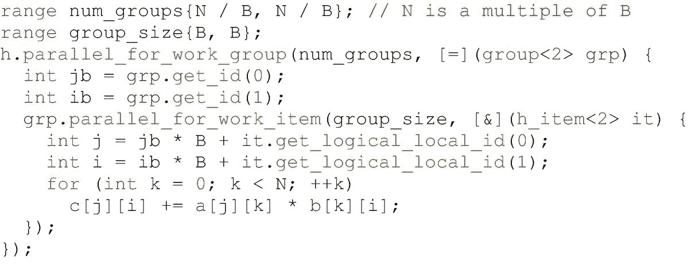

图 4-22

用分层并行性和逻辑范围表达一个简单的矩阵乘法核心

### 分层数据并行内核的详细信息

分层数据并行内核重用了 ND-range 数据并行内核中的`group`类，但是用`h_item`替换了`nd_item`。引入了一个新的`private_memory`类来对`parallel_for_work_group`范围内的分配提供更严格的控制。

#### `h_item`类

一个`h_item`是一个`item`的变体，它只在一个`parallel_for_work_item`范围内可用。如图 [4-23](#Fig23) 所示，它提供了一个与`nd_item`类似的接口，有一个显著的区别:该项的索引可以相对于一个工作组的物理执行范围(用`get_physical_local_id()`)或者一个`parallel_for_work_item`构造的逻辑执行范围(用`get_logical_local_id()`)来查询。

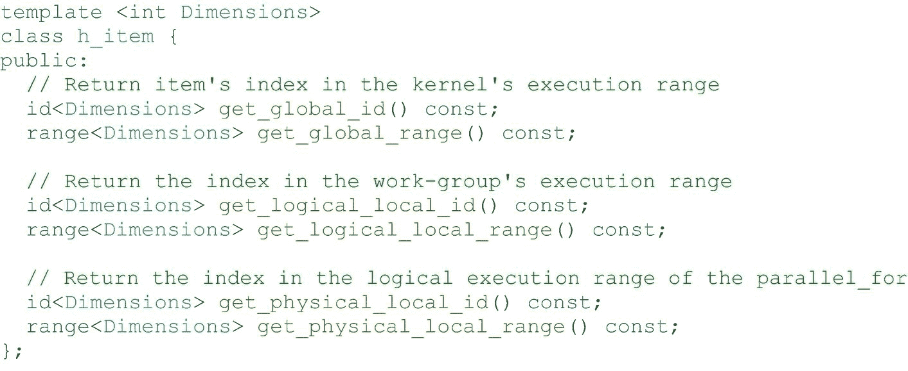

图 4-23

`h_item`类的简化定义

#### `private_memory`类

`private_memory`类提供了一种机制来声明每个工作项私有的变量，但是这些变量可以通过嵌套在同一个`parallel_for_work_group`范围内的多个`parallel_for_work_item`构造来访问。

这个类是必要的，因为在不同的层次并行作用域中声明的变量的行为方式:如果编译器可以证明这样做是安全的，在外部作用域中声明的变量才是私有的，而在内部作用域中声明的变量是逻辑工作项而不是物理工作项的私有变量。对于我们来说，仅仅使用作用域来表达一个变量对于每个物理工作项来说是私有的是不可能的。

为了了解为什么这是一个问题，让我们回到图 [4-22](#Fig22) 中的矩阵乘法内核。`ib`和`jb`变量是在`parallel_for_work_group`范围内声明的，默认情况下应该分配在工作组本地内存中！一个优化的编译器很有可能不会犯这个错误，因为变量是只读的，它们的值足够简单，可以在每个工作项上进行冗余计算，但是语言没有这样的保证。如果我们想确定变量是在工作项私有内存中声明的，我们必须将变量声明包装在`private_memory`类的实例中，如图 [4-24](#Fig24) 所示。

图 4-24

`private_memory`类的简化定义

例如，如果我们要使用`private_memory`类重写矩阵乘法内核，我们会将变量定义为`private_memory<int> ib(grp)`，并且对这些变量的每次访问都会变成`ib[item]`。在这种情况下，使用`private_memory`类会导致代码更难阅读，而在`parallel_for_work_item`范围内声明值会更清晰。

我们的建议是，如果一个工作项私有变量在同一个`parallel_for_work_group`内的多个`parallel_for_work_item`范围内使用，重复计算的代价太大，或者它的计算有副作用，阻止它被冗余地计算，那么只使用`private_memory`类。否则，我们应该默认依赖现代优化编译器的能力，只有在分析失败时才在`parallel_for_work_item`范围内声明变量(记住还要向编译器供应商报告这个问题)。

## 将计算映射到工作项

到目前为止，大多数代码示例都假设一个内核函数的每个实例对应于对一段数据的单个操作。这是一种编写内核的简单方法，但是这种一对一的映射并不是由 DPC++ 或任何内核形式决定的——我们总是能够完全控制数据(和计算)到单个工作项的分配，并且使这种分配参数化是提高性能可移植性的好方法。

### 一对一映射

当我们编写内核时，工作与工作项之间存在一对一的映射，这些内核必须总是以大小与需要完成的工作量完全匹配的`range`或`nd_range`启动。这是编写内核最显而易见的方式，在许多情况下，它工作得非常好——我们可以相信一个实现可以有效地将工作项映射到硬件。

但是，在针对系统和实现的特定组合进行性能调优时，可能有必要更加关注底层调度行为。计算资源的工作组调度是由实现定义的，并且可能是动态的(即，当计算资源完成一个工作组时，它执行的下一个工作组可能来自共享队列)。动态调度对性能的影响不是固定的，并且其重要性取决于包括内核功能的每个实例的执行时间以及调度是在软件(例如，在 CPU 上)还是硬件(例如，在 GPU 上)中实现的因素。

### 多对一映射

另一种方法是编写工作到工作项的多对一映射的内核。在这种情况下，范围的*含义*发生了微妙的变化:范围不再描述要完成的工作量，而是要使用的工人数量。通过改变工人的数量和分配给每个工人的工作量，我们可以微调工作分配以最大化性能。

编写这种形式的内核需要做两处修改:

1.  内核必须接受一个描述工作总量的参数。

2.  内核必须包含一个将工作分配给工作项的循环。

图 [4-25](#Fig25) 给出了这种内核的一个简单例子。注意内核内部的循环有一个稍微不寻常的形式——起始索引是工作项在全局范围内的索引，步距是工作项的总数。数据到工作项的这种*循环*调度确保循环的所有`N`迭代将由一个工作项执行，而且线性工作项访问连续的内存位置(以改善缓存局部性和矢量化行为)。工作可以类似地跨组分布，或者将工作项分布在单个组中，以进一步提高局部性。

图 4-25

具有独立数据和执行范围的内核

这些工作分配模式很常见，当使用具有逻辑范围的分层并行时，可以非常简洁地表达它们。我们期望 DPC++ 的未来版本将引入语法糖来简化 ND-range 内核中工作分配的表达。

## 选择内核形式

在不同的内核形式之间进行选择很大程度上是个人偏好的问题，并且受到其他并行编程模型和语言的经验的严重影响。

选择特定内核形式的另一个主要原因是，它是公开内核所需的某些功能的唯一形式。不幸的是，在开发开始之前很难确定哪些功能是必需的——尤其是当我们还不熟悉不同的内核形式以及它们与各种类的交互时。

为了帮助我们驾驭这个复杂的空间，我们根据自己的经验编写了两本指南。这些指南应该被认为是经验法则，绝对不是要取代我们自己的实验——在不同的内核形式之间进行选择的最佳方式总是花一些时间来编写每一种形式，以便了解哪种形式最适合我们的应用程序和开发风格。

第一个指南是图 [4-26](#Fig26) 中的流程图，它选择一个内核表单基于

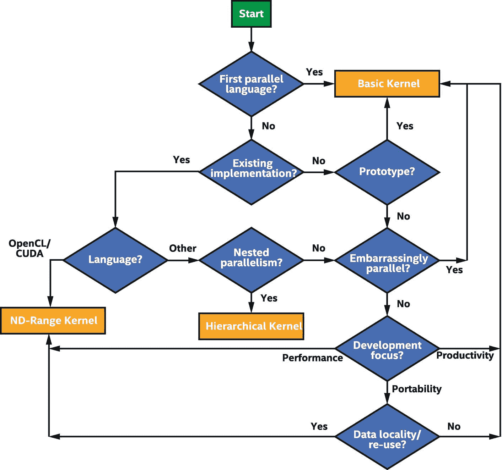

图 4-26

帮助我们为内核选择正确的形式

1.  我们是否有并行编程的经验

2.  无论我们是从头开始编写新代码，还是移植用不同语言编写的现有并行程序

3.  我们的内核是令人尴尬的并行，已经包含嵌套并行，还是在内核函数的不同实例之间重用数据

4.  无论我们是在 SYCL 中编写一个新的内核来最大化性能还是提高代码的可移植性，还是因为它提供了一种比低级语言更有效的表达并行性的方式

第二个指南是图 [4-27](#Fig27) 中的表格，它总结了每种内核形式的功能。值得注意的是，该表反映了本书出版时 DPC++ 的状态，并且每个内核形式可用的特性应该会随着语言的发展而变化。然而，我们预计基本趋势将保持不变:基本数据并行内核将不会公开位置感知功能，显式 ND-range 内核将公开所有性能支持功能，而分层内核在公开功能方面将落后于显式 ND-range 内核，但它们对这些功能的表达将使用更高级别的抽象。

图 4-27

每种内核形式可用的特性

## 摘要

本章介绍了在 DPC++ 中表达并行性的基础，并讨论了编写数据并行内核的每种方法的优缺点。

DPC++ 和 SYCL 支持多种形式的并行性，我们希望我们已经提供了足够的信息，让读者可以开始编写代码了！

我们只是触及了表面，对本章中介绍的许多概念和类的更深入的探究即将到来:本地内存、屏障和通信例程的使用将在第 [9](09.html#b978-1-4842-5574-2_9) 章中讨论；除了使用 lambda 表达式，定义内核的不同方法将在第 10 章[中讨论；第](10.html#b978-1-4842-5574-2_10) [15](15.html#b978-1-4842-5574-2_15) 、 [16](16.html#b978-1-4842-5574-2_16) 和 [17](17.html#b978-1-4842-5574-2_17) 章将探讨 ND-range 执行模型到具体硬件的详细映射；使用 DPC++ 表达通用并行模式的最佳实践将在第 [14](14.html#b978-1-4842-5574-2_14) 章中介绍。

 

**开放存取**本章根据知识共享署名 4.0 国际许可证(http://Creative Commons . org/licenses/by/4.0/)的条款获得许可，该许可证允许以任何媒体或格式使用、共享、改编、分发和复制，只要您适当注明原作者和来源，提供知识共享许可证的链接并指明是否进行了更改。

本章中的图像或其他第三方材料包含在本章的知识共享许可中，除非在材料的信用额度中另有说明。如果材料不包括在本章的知识共享许可中，并且您的预期使用不被法律法规允许或超出了允许的使用范围，您将需要直接从版权所有者处获得许可。