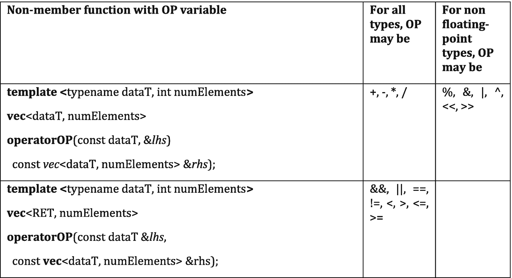
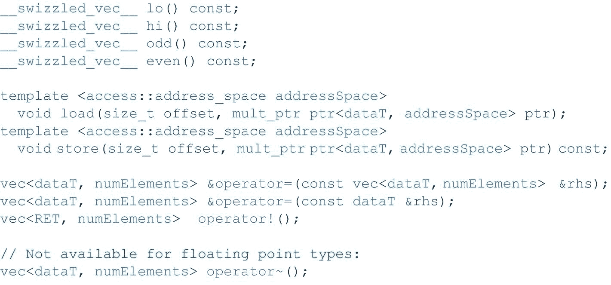
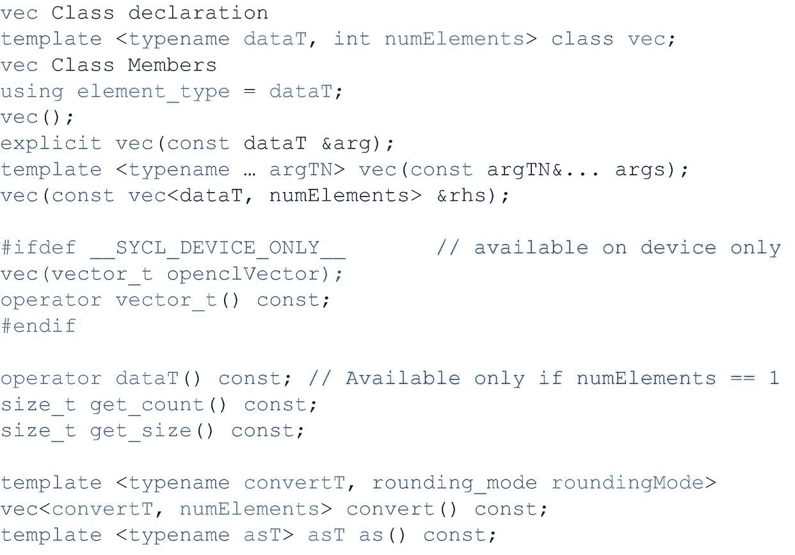
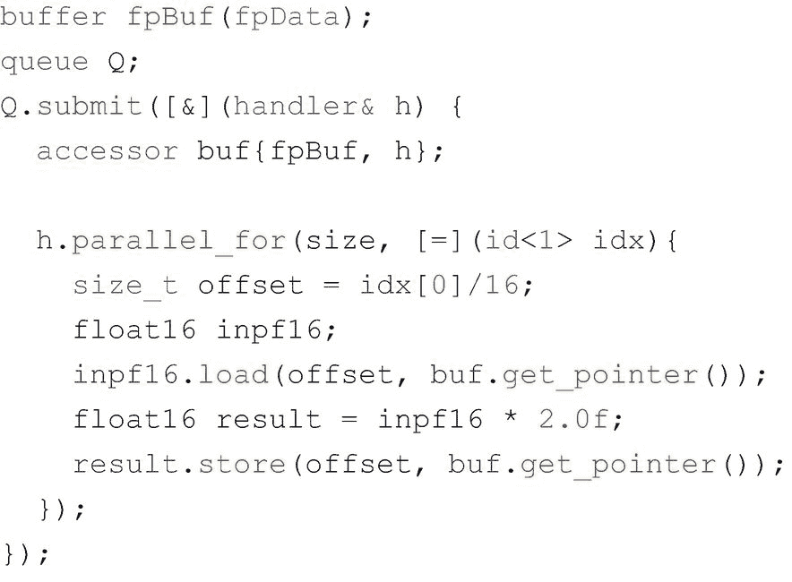
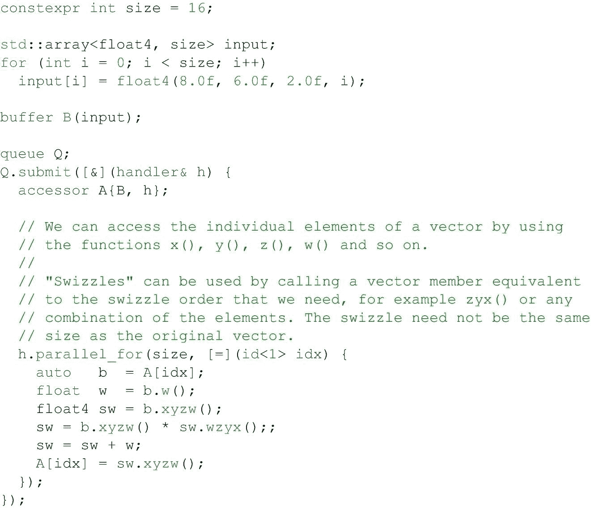
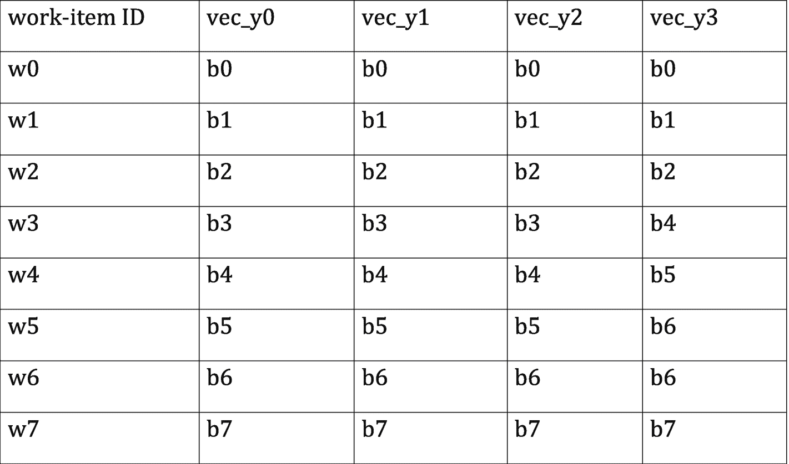
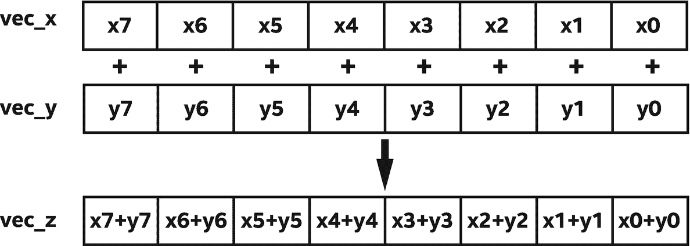

# 11.向量

向量是数据的集合。这可能很有用，因为我们计算机中的并行性来自计算硬件的集合，并且数据通常在相关分组中处理(例如，RGB 像素中的颜色通道)。听起来像是天作之合吗？这非常重要，我们将用一章来讨论向量类型的优点以及如何利用它们。在这一章中，我们不会深入探讨*矢量化*，因为矢量化会因设备类型和实现而异。矢量化将在第 [15](15.html#b978-1-4842-5574-2_15) 和 [16](16.html#b978-1-4842-5574-2_16) 章节中介绍。

本章试图解决以下问题:

*   什么是向量类型？

*   我真的需要了解多少关于 vector 接口的知识？

*   是否应该用向量类型来表示并行性？

*   什么时候应该使用向量类型？

我们使用工作代码示例讨论可用向量类型的优点和缺点，并强调利用向量类型的最重要的方面。

## 如何思考向量

当我们与并行编程专家交谈时，向量是一个令人惊讶的有争议的话题，根据作者的经验，这是因为不同的人以不同的方式定义和思考这个术语。

有两种广义的方式来考虑向量数据类型(数据集合):

1.  **作为一种方便的类型**，它将您可能想要引用和操作的数据分组为一组，例如，将一个像素的颜色通道(如 RGB、YUV)分组为一个变量(如`float3`)，该变量可以是一个向量。我们可以定义一个 pixel 类或结构，并在其上定义像+这样的数学运算符，但是向量类型可以方便地为我们开箱即用。便利类型可以在许多用于编程 GPU 的着色器语言中找到，因此这种思维方式在许多 GPU 开发人员中已经很常见。

2.  作为描述代码**如何映射到硬件中的 SIMD 指令集**的机制。例如，在一些语言和实现中，`float8`上的操作理论上可以映射到硬件中的八通道 SIMD 指令。向量类型在多种语言中被用作针对特定指令集的 CPU 特定 SIMD 内部函数的一种方便的高级替代方法，因此这种思维方式在许多 CPU 开发人员中已经很普遍了。

虽然这两种解释非常不同，但当 SYCL 和其他语言变得适用于 CPU 和 GPU 时，它们无意中被结合在一起并混淆在一起。SYCL 1.2.1 规范中的 vector 与这两种解释都是兼容的(我们将在后面重新讨论这一点)，所以在进一步讨论之前，我们需要澄清一下我们在 DPC++中推荐的思路。

在本书中，我们讨论了如何将工作项组合在一起，以公开强大的通信和同步原语，例如子组障碍和洗牌。为了使这些操作在向量硬件上有效，假设子组中的不同工作项组合并映射到 SIMD 指令。换句话说，多个工作项被编译器组合在一起，此时它们可以映射到硬件中的 SIMD 指令。请记住第 4 章中的内容，这是在矢量硬件上运行的 SPMD 编程模型的基本前提，其中单个工作项构成了硬件中*可能是 SIMD 指令的*通道*，而不是定义硬件中 SIMD 指令的*整个*操作的工作项。当在硬件中映射到 SIMD 指令时，当使用 DPC++编译器以 SPMD 风格编程时，您可以认为编译器总是跨工作项进行矢量化。*

对于本书中描述的功能和硬件，向量主要用于本节的第一种解释——向量是方便的类型，不应被视为映射到硬件中的 SIMD 指令。在适用的平台(CPU、GPU)上，工作项被组合在一起形成硬件中的 SIMD 指令。向量应该被认为是提供了方便的操作符，如 swizzles 和数学函数，使我们的代码中对数据组的常见操作变得简洁(例如，添加两个 RGB 像素)。

对于来自没有向量的语言或来自 GPU 着色语言的开发人员，我们可以将 SYCL 向量视为工作项的本地向量，因为如果添加两个四元素向量，该添加可能需要硬件中的四条指令(从工作项的角度来看，它将被标量化)。向量的每个元素将通过硬件中不同的指令/时钟周期相加。根据这种解释，向量是一种便利，因为我们可以在源代码中的一次操作中添加两个向量，而不是在源代码中执行四次标量操作。

对于来自 CPU 背景的开发人员，我们应该知道，在编译器中默认情况下，隐式向量化到 SIMD 硬件以几种独立于向量类型的方式发生。编译器跨工作项执行这种隐式矢量化，从格式良好的循环中提取矢量操作，或者在映射到矢量指令时支持矢量类型——有关更多信息，请参见第 [16](16.html#b978-1-4842-5574-2_16) 章。

OTHER IMPLEMENTATIONS POSSIBLE!

SYCL 和 DPC++的不同编译器和实现在理论上可以对代码中的向量数据类型如何映射到向量硬件指令做出不同的决定。我们应该阅读供应商的文档和优化指南，以了解如何编写能够映射到高效 SIMD 指令的代码。这本书主要是针对 DPC++编译器编写的，因此记录了围绕它构建的思维和编程模式。

CHANGES ARE ON THE HORIZON

我们刚刚说过，在考虑映射到设备上的硬件时，将向量类型视为便利类型，并期望跨工作项的矢量化。这有望成为 DPC++编译器和工具链未来的默认解释。然而，有两个额外的前瞻性变化需要注意。

首先，我们可以期待一些未来的 DPC++特性，*将*允许我们编写直接映射到硬件中 SIMD 指令的显式矢量代码，特别是对于那些希望针对特定架构调整代码细节并从编译器矢量器中获得控制权的专家。这是一个很少开发人员会使用的利基特性，但是我们可以预期编程机制最终会在可能的地方存在。这些编程机制将非常清楚哪些代码是以显式矢量风格编写的，因此我们今天编写的代码和新的更显式(且可移植性更差)的风格之间不会混淆。

第二，这本书的这一部分(讨论向量的解释)强调了对向量的含义存在混淆，这将在未来的 SYCL 中得到解决。在 SYCL 2020 临时规范中对此有所暗示，其中描述了一种数学数组类型(`marray`)，这显然是本节的第一种解释——一种与矢量硬件指令无关的方便类型。我们应该期待另一种类型也最终出现来覆盖第二种解释，很可能与 C++ `std::simd`模板一致。由于这两种类型与 vector 数据类型的特定解释明确相关，我们作为程序员的意图将从我们编写的代码中变得清晰。这将更不容易出错，更不容易混淆，甚至可能减少专家开发者之间的激烈讨论，当问题出现时“什么是*是*向量？”

## 向量类型

SYCL 中的 Vector 类型是跨平台的类模板，可以在设备和主机 C++代码中高效工作，并允许在主机及其设备之间共享 vector。Vector 类型包括允许从一组重组的组件元素构建新 vector 的方法，这意味着新 vector 的元素可以以任意顺序从旧 vector 的元素中选取。`vec`是一种 vector 类型，可以在目标设备后端编译成内置的 vector 类型，并在主机上提供兼容的支持。

`vec`类根据其元素数量和元素类型进行模板化。元素数参数`numElements`可以是 1、2、3、4、8 或 16 中的一个。任何其他值都将导致编译失败。元素类型参数`dataT`必须是设备代码支持的基本标量类型之一。

SYCL `vec`类模板提供了与由`vector_t`定义的底层向量类型的互操作性，后者仅在为设备编译时可用。`vec`类可以从`vector_t`的实例构建，并且可以隐式转换为`vector_t`的实例，以便支持与来自内核函数的本地 SYCL 后端(例如 OpenCL 后端)的互操作性。当元素数量为 1 时，为了使单元素向量和标量易于互换，`vec`类模板的实例也可以隐式转换为数据类型的实例。

为了编程方便，SYCL 提供了许多形式为`using <type><elems> = vec<<storage-type>`、`<elems>>`的类型别名，其中`<elems>`是 **2** 、 **3** 、 **4** 、 **8** 和 **16** ，整数类型的`<type>`和`<storage-type>`的配对是`char`**【⇔**`int8_t`、`uchar` **⇔** `uint8_t`、`uint8_t` `uint` **⇔** `uint32_t`，`long` **⇔** `int64_t`，`and ulong` **⇔** `uint64_t`对于浮点型`half`，`float`，`double`。 例如，`uint4`是`vec` **<** `uint32_t`，`4` **>** ，`float16`是`vec` **<** `float`，`16` **>** 的别名。

## 矢量接口

向量类型的功能通过类`vec`公开。`vec`类表示一组组合在一起的数据元素。`vec`类模板的构造函数、成员函数和非成员函数的接口如图 [11-1](#Fig1) 、 [11-4](#Fig4) 和 [11-5](#Fig5) 所示。

图 [11-2](#Fig2) 中列出的 XYZW 成员仅在`numElements <= 4`时可用。RGBA 会员仅在`numElements == 4`时可用。

图 [11-3](#Fig3) 中的`lo`、`hi`、`odd`、`even`成员仅在`numElements > 1`时可用。

图 11-5

`vec`非成员函数

图 11-4

`vec`成员函数

图 11-3

`vec`操作员界面

图 11-2

`swizzled_vec`成员函数

图 11-1

`vec`类声明和成员函数

### 加载和存储成员函数

向量加载和存储操作是`vec`类的成员，用于加载和存储向量的元素。这些操作可以对与向量的通道类型相同的元素数组进行。示例如图 [11-6](#Fig6) 所示。

图 11-6

使用加载和存储成员函数。

在`vec`类中，`dataT`和`numElements`是反映`vec`的组件类型和维度的模板参数。

`load()`成员函数模板将从`multi_ptr`地址的内存中读取`dataT`类型的值，在`dataT`的元素中偏移`numElements*offset`，并将这些值写入 *vec* 的通道。

`store()`成员函数模板将读取 *vec* 的通道，并将这些值写入 multi_ptr 地址的内存，在`dataT`的元素中偏移`numElements*offset`。

该参数是一个`multi_ptr`而不是一个访问器，这样本地创建的指针和从主机传递的指针都可以使用。

`multi_ptr`的数据类型是`dataT,``vec`类专门化的组件的数据类型。这要求传递给`load()`或`store()`的指针必须匹配`vec`实例本身的类型。

### 调酒业务

在[图形](https://en.wikipedia.org/wiki/Computer_graphics)应用中，*重组*意味着重新排列向量的数据元素。例如，如果`a = {1, 2, 3, 4,}`，并且知道一个四元素向量的分量可以称为`{x, y, z, w}`，我们可以写`b = a.wxyz().`，变量`b`中的结果将是`{4, 1, 2, 3}`。这种形式的代码在 GPU 应用中很常见，在这些应用中有高效的硬件来执行这种操作。调酒有两种方式:

*   通过调用一个`vec`的 swizzle 成员函数，该函数接受在`0`和`numElements-1`之间的可变数量的整数模板参数，指定 swizzle 索引

*   通过调用一个简单的 swizzle 成员函数，比如`XYZW_SWIZZLE`和`RGBA_SWIZZLE`

请注意，简单的 swizzle 函数仅适用于最多四个元素的向量，并且仅在包含`sycl.hpp`之前定义宏`SYCL_SIMPLE_SWIZZLES`时可用。在这两种情况下，返回类型总是一个`__swizzled_vec__`的实例，一个实现定义的临时类，表示原始`vec`实例的重组。swizzle 成员函数模板和简单的 swizzle 成员函数都允许重复使用 swizzle 索引。图 [11-7](#Fig7) 显示了`__swizzled_vec__`的简单用法。

图 11-7

使用`__swizzled_vec__`类的例子

## 并行内核中的向量执行

如章节 [4](04.html#b978-1-4842-5574-2_4) 和 [9](09.html#b978-1-4842-5574-2_9) 所述，一个工作项是并行层次结构的叶节点，代表一个内核函数的单个实例。工作项目可以以任何顺序执行，并且不能彼此通信或同步，除非通过对本地和全局存储器的原子存储器操作或通过组集合函数(例如，`shuffle`、`barrier`)。

正如本章开始时所描述的，DPC++中的 vector 应该被解释为方便我们编写代码。每个向量对于单个工作项来说是局部的(而不是与硬件中的矢量化相关)，因此可以被认为相当于我们工作项中的私有数组`numElements`。例如，“`float4 y4`”申报的存储相当于`float y4[4]`。考虑图 [11-8](#Fig8) 所示的例子。

图 11-8

向量执行示例

对于标量变量 x，在具有 SIMD 指令的硬件(例如，CPU、GPU)上具有多个工作项目的内核执行的结果可能使用向量寄存器和 SIMD 指令，但是矢量化是跨工作项目的，并且与我们代码中的任何向量类型无关。每个工作项可以在隐式`vec_x`中的不同位置上操作，如图 [11-9](#Fig9) 所示。工作项中的标量数据可以被认为是跨同时执行的工作项隐式矢量化(组合到 SIMD 硬件指令中)，在一些实现中和在一些硬件上，但是我们编写的工作项代码不以任何方式对此进行编码——这是 SPMD 编程风格的核心。

图 11-9

从标量变量`x`到`vec_x[8]`的向量扩展

如图 [11-9](#Fig9) 所示，通过编译器从标量变量`x`到`vec_x[8]`的隐式向量扩展，编译器从出现在多个工作项中的标量操作在硬件中创建 SIMD 操作。

对于向量变量`y4`，多个工作项的内核执行结果，例如八个工作项，不通过使用硬件中的向量运算来处理 vec4。相反，每个工作项独立地看到自己的向量，向量上元素的操作跨多个时钟周期/指令发生(向量被编译器标量化)，如图 [11-10](#Fig10) 所示。

图 11-10

垂直扩展到相当于八个工作项的`y4`的`vec_y[8][4]`

每个工作项都可以看到 y4 的原始数据布局，这为推理和调整提供了一个直观的模型。性能下降是编译器必须为 CPU 和 GPU 生成聚集/分散内存指令，如图 [11-11](#Fig11) 所示(向量在内存中是连续的，相邻的工作项并行操作不同的向量)，因此当编译器跨工作项(例如，跨子组)进行矢量化时，标量通常是一种比显式向量更有效的方法。详见第 [15](15.html#b978-1-4842-5574-2_15) 章和第 [16](16.html#b978-1-4842-5574-2_16) 章。

图 11-11

带有地址转义的矢量代码示例

当编译器能够证明`y4`的地址没有从当前内核工作项中转义或者所有被调用函数都将被内联时，编译器可以执行优化，就像使用一组向量寄存器从`y4`到`vec_y[4][8]`进行水平单位步长扩展一样，如图 [11-12](#Fig12) 所示。在这种情况下，编译器无需为 CPU 和 GPU 生成聚集/分散 SIMD 指令，就能获得最佳性能。编译器优化报告为程序员提供了关于这种类型的转换的信息，无论它是否发生，并且可以提供关于如何调整我们的代码以提高性能的提示。

图 11-12

水平单位步幅扩展到`y4`的`vec_y[4][8]`

## 向量并行性

尽管 DPC++源代码中的向量应该被解释为只局限于单个工作项的便利工具，但是如果没有提到硬件中的 SIMD 指令是如何操作的，这一章关于向量的内容是不完整的。这一讨论与我们源代码中的向量无关，但提供了正交背景，这将有助于我们进入本书后面描述特定设备类型(GPU、CPU、FPGA)的章节。

现代的 CPU 和 GPU 包含 SIMD 指令硬件，其对包含在一个向量寄存器或寄存器文件中的多个数据值进行操作。例如，借助英特尔 x86 AVX-512 和其他现代 CPU SIMD 硬件，SIMD 指令可用于开发数据并行性。在提供 SIMD 硬件的 CPU 和 GPU 上，我们可以考虑一个向量加法运算，比如对一个八元素向量，如图 [11-13](#Fig13) 所示。

图 11-13

八路数据并行的 SIMD 加法

这个例子中的向量加法可以在向量硬件上的单个指令中执行，将向量寄存器`vec_x`和`vec_y`与 SIMD 指令并行相加。

以独立于硬件的方式展示潜在的并行性，确保我们的应用可以扩展(或缩小)以适应不同平台的功能，包括那些具有矢量硬件指令的平台。在应用程序开发过程中，在工作项目和其他形式的并行性之间取得正确的平衡是我们都必须面对的挑战，这将在第 [15](15.html#b978-1-4842-5574-2_15) 、 [16](16.html#b978-1-4842-5574-2_16) 和 [17](17.html#b978-1-4842-5574-2_17) 章中详细介绍。

## 摘要

在编程语言中，术语*向量*有多种解释，当我们想要编写高性能和可伸缩的代码时，理解特定语言或编译器的解释是非常重要的。DPC++和 DPC++编译器是围绕这样的思想构建的，即源代码中的向量是工作项本地的便利函数，编译器跨工作项的隐式向量化可以映射到硬件中的 SIMD 指令。当我们想要编写直接映射到 vector 硬件的代码时，我们应该查看供应商文档以及 SYCL 和 DPC++的未来扩展。使用多个工作项(例如 ND-range)编写我们的内核并依靠编译器跨工作项进行矢量化应该是大多数应用程序的编写方式，因为这样做利用了 SPMD 的强大抽象，它提供了一个易于理解的编程模型，并提供了跨设备和架构的可扩展性能。

本章描述了`vec`接口，当我们想要对相似类型的数据进行分组操作时，它提供了开箱即用的便利(例如，一个像素有多个颜色通道)。它还简要介绍了硬件中的 SIMD 指令，为我们在第 [15](15.html#b978-1-4842-5574-2_15) 和 [16](16.html#b978-1-4842-5574-2_16) 章节中更详细的讨论做准备。

 

**开放存取**本章根据知识共享署名 4.0 国际许可证(http://Creative Commons . org/licenses/by/4.0/)的条款获得许可，该许可证允许以任何媒体或格式使用、共享、改编、分发和复制，只要您适当注明原作者和来源，提供知识共享许可证的链接并指明是否进行了更改。

本章中的图像或其他第三方材料包含在该章的知识共享许可中，除非该材料的信用额度中另有说明。如果材料未包含在本章的知识共享许可中，并且您的预期用途不被法定法规允许或超出了允许的用途，您将需要直接从版权所有者处获得许可。