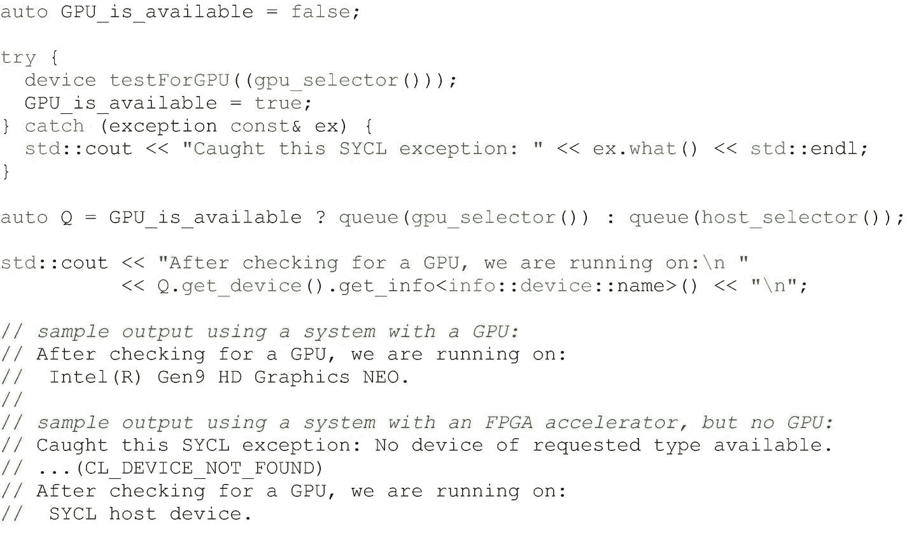
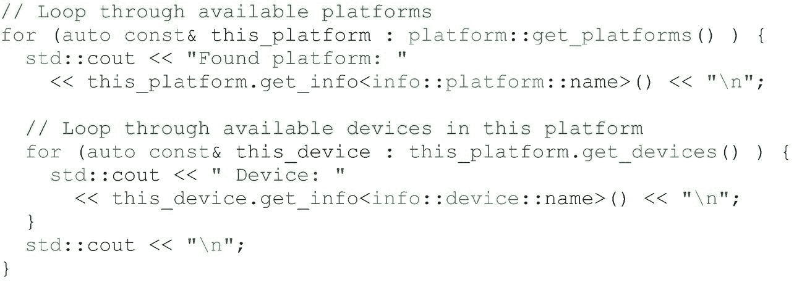
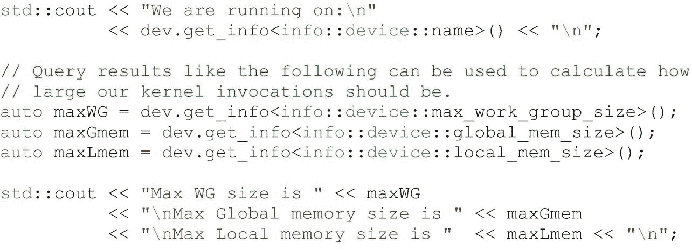

# 12.设备信息

第 2 章向我们介绍了将工作导向特定设备的机制——控制代码执行的*。*在本章中，我们将探讨如何适应运行时出现的设备。

我们希望我们的程序是可移植的。为了便于携带，我们需要我们的程序适应设备的功能。我们可以将程序参数化，只使用现有的功能，并根据设备的具体情况调整代码。如果我们的程序不是为适应而设计的，那么就会发生不好的事情，包括执行缓慢或程序失败。

幸运的是，SYCL 规范的创建者考虑到了这一点，并给了我们接口让我们解决这个问题。SYCL 规范定义了一个`device`类，它封装了一个可以执行内核的设备。查询设备类的能力，使我们的程序能够适应设备的特性和能力，是本章所教授的核心。

我们中的许多人会从有逻辑来弄清楚“是否有 GPU 存在？”通知我们的程序在执行时将做出的选择。这是本章内容的开始。正如我们将看到的，有更多的信息可以帮助我们使我们的程序健壮和高性能。

将程序参数化有助于正确性、可移植性、性能可移植性和未来的检验。

本章深入探讨了最重要的查询以及如何在我们的程序中有效地使用它们。

特定于设备的属性可以使用`get_info, but`来查询。DPC++ 与 SYCL 1.2.1 的不同之处在于，它完全重载了`get_info`,以减少使用`get_work_group_info`来获取工作组信息的需要，而工作组信息实际上是特定于设备的信息。DPC++ 不支持使用`get_work_group_info`。这一变化意味着特定于设备的内核和工作组属性可以作为特定于设备的属性的查询被正确地找到(`get_info`)。这纠正了继承自 OpenCL 的 SYCL 1.2.1 中仍然存在的令人困惑的历史异常。

## 精炼内核代码，使其更具规范性

考虑到我们的编码，一个内核一个内核地，大致可以分为三类:

*   通用内核代码:在任何地方运行，不针对特定的设备类别。

*   特定于设备类型的内核代码:在一种类型的设备(例如，GPU、CPU、FPGA)上运行，不针对设备类型的特定*型号*进行调整。这非常有用，因为许多设备类型具有共同的特性，所以可以放心地做出一些假设，这些假设不适用于为所有设备编写的完全通用的代码。

*   特定于设备的调优内核代码:在一种设备上运行，针对设备的特定参数进行调优——这涵盖了从少量调优到非常详细的优化工作的广泛可能性。

    作为程序员，我们的工作是确定不同的设备类型何时需要不同的模式。我们用第 14 章、 [15 章](15.html#b978-1-4842-5574-2_15)、 [16 章](16.html#b978-1-4842-5574-2_16)和 [17 章](17.html#b978-1-4842-5574-2_17)来阐明这一重要思想。

最常见的是从实现通用内核代码开始，让它工作起来。第 [2](02.html#b978-1-4842-5574-2_2) 章专门讨论了在开始内核实现时什么方法最容易调试。一旦我们有了一个工作的内核，我们就可以对它进行改进，以针对特定设备类型或设备型号的功能。

第 [14](14.html#b978-1-4842-5574-2_14) 章提供了一个思考框架，在我们深入考虑设备之前，先考虑并行性。我们选择的模式(也就是算法)决定了我们的代码，作为程序员，我们的工作就是决定不同的设备何时需要不同的模式。第 [15](15.html#b978-1-4842-5574-2_15) (GPU)、 [16](16.html#b978-1-4842-5574-2_16) (CPU)和 [17](17.html#b978-1-4842-5574-2_17) (FPGA)章节更深入地探究了区分这些设备类型的品质，并激发了对使用模式的选择。当不同设备类型上的方法(模式选择)不同时，正是这些品质促使我们考虑为不同设备编写不同版本的内核。

当我们为特定类型的设备(例如，特定的 CPU、GPU、FPGA 等)编写内核时。)，使其适应特定厂商甚至此类设备的型号是合乎逻辑的。良好的编码风格是基于特性(例如，从设备查询中找到的项目大小支持)对代码进行参数化。

我们应该编写代码来查询描述设备实际功能的参数，而不是其营销信息；查询设备的型号并对其做出反应是非常糟糕的编程实践——这样的代码可移植性较差。

通常为我们想要支持的每种设备类型编写不同的内核(内核的 GPU 版本和内核的 FPGA 版本，可能还有内核的通用版本)。当我们变得更具体时，为了支持特定的设备供应商或甚至设备模型，当我们可以参数化内核而不是复制它时，我们可能会受益。如果我们认为合适，我们可以自由选择。有太多参数调整的代码可能难以阅读，或者在运行时负担过重。然而，参数可以整齐地放入内核的一个版本是很常见的。

当算法大体相同，但针对特定设备的功能进行了调整时，参数化最有意义。当使用完全不同的方法、模式或算法时，编写不同的内核要干净得多。

## 如何枚举设备和功能

第 2 章列举并解释了选择执行设备的五种方法。本质上，方法#1 是最不规范的*在某个地方运行它*，我们进化到最规范的方法#5，它考虑在一系列设备中的一个相当精确的设备模型上执行。介于两者之间的列举方法混合了灵活性和规定性。图 [12-1](#Fig1) 、 [12-2](#Fig2) 和 [12-3](#Fig3) 有助于说明我们如何选择器件。

图 [12-1](#Fig1) 显示，即使我们允许实现为我们选择一个默认设备(第 [2](02.html#b978-1-4842-5574-2_2) 章中的方法#1)，我们仍然可以查询关于所选设备的信息。

图 [12-2](#Fig2) 展示了我们如何尝试使用一个特定的设备(在这个例子中，是一个 GPU)来建立一个队列，但是如果没有 GPU 可用的话，就明确地回到主机上。这给了我们一些设备选择的控制权。如果我们简单地使用默认队列，我们可能会以意外的设备类型(例如，DSP、FPGA)结束。如果我们明确地想要在没有 GPU 设备的情况下使用主机设备，这段代码会为我们做到这一点。回想一下，主机设备总是保证存在的，所以我们不需要担心使用`host_selector`。

不建议我们使用图 [12-2](#Fig2) 所示的解决方案。除了看起来有点吓人和容易出错之外，图 [12-2](#Fig2) 并没有让我们控制选择哪一个 GPU，因为如果有多个可用的 GPU，我们得到哪一个取决于实现。尽管既有启发性又有实用性，但还有更好的方法。建议我们编写自定义的设备选择器，如下一个代码示例所示(图 [12-3](#Fig3) )。

### 自定义设备选择器

图 [12-3](#Fig3) 使用自定义设备选择器。自定义设备选择器在第 [2](02.html#b978-1-4842-5574-2_2) 章中首次讨论，作为选择代码运行位置的方法#5(图 [2-15](02.html#Fig15) )。定制设备选择器使其`operator()`，如图 [12-3](#Fig3) 所示，为应用可用的每个设备调用。所选设备是得分最高的设备。 [1](#Fn1) 在这个例子中，我们将为我们的选择器开一点玩笑:

*   拒绝供应商名称包含“Martian”(return–1)字样的 GPU。

*   偏爱供应商名称包含单词“ACME”的 GPU(返回 824)。

*   其他任何 GPU 都是好的(return 799)。

*   如果没有 GPU，我们选择主机设备(返回 99)。

*   忽略所有其他设备(return–1)。

下一部分，“好奇:`get_info<>`”深入到`get_devices(), get_platforms()`和`get_info<>`提供的丰富信息。这些接口打开了我们可能想要用来挑选设备的任何类型的逻辑，包括图 [2-15](02.html#Fig15) 和 [12-3](#Fig3) 所示的简单的供应商名称检查。

图 12-1

默认情况下分配给我们的设备

关于设备的查询依赖于安装的软件(特殊的用户级驱动程序)来响应关于设备的查询。SYCL 和 DPC++ 依赖于此，就像操作系统需要驱动程序来访问硬件一样——仅仅将硬件安装在机器上是不够的。

图 12-3

定制设备选择器—我们的首选解决方案

图 12-2

如果可能，使用 try-catch 选择 GPU 设备，否则选择主机设备

### 好奇:`get_info<>`

为了让我们的程序“知道”哪些设备在运行时可用，我们可以让我们的程序从 device 类中查询可用的设备，然后我们可以使用`get_info<>`查询特定的设备来了解更多的细节。我们提供了一个简单的程序，名为*好奇*(见图 [12-4](#Fig4) )，它使用这些接口将信息转储出来让我们直接查看。这对于在开发或调试使用这些接口的程序时进行健全性检查非常有用。这个程序不能按预期工作通常可以告诉我们，我们需要的软件驱动程序没有正确安装。图 [12-5](#Fig5) 显示了该程序的示例输出，其中包含关于当前设备的高级信息。

图 12-5

好奇. cpp 的示例输出

图 12-4

设备查询机制的简单使用

### 更好奇:详细的枚举代码

我们提供了一个程序，我们将其命名为 verycurious.cpp(图 [12-6](#Fig6) ，来说明使用`get_info<>`可以获得的一些详细信息。同样，我们发现自己编写这样的代码有助于开发或调试程序。图 [12-5](#Fig5) 显示了该程序的输出样本，以及关于当前设备的底层信息。

现在我们已经展示了如何访问信息，我们将讨论在应用程序中查询和操作最重要的信息字段。

图 12-6

设备查询机制的更详细的使用:query 好奇. cpp

### 好奇:`get_info<>`

`has_extension()`接口允许程序直接测试一个特性，而不是像前面的代码示例那样遍历来自`get_info <info::platform::extensions>`的扩展列表。SYCL 2020 临时规范定义了新的机制来查询设备的扩展和详细方面，但我们不会在本书中涵盖这些功能(这些功能刚刚完成)。更多信息请参考[在线 oneAPI DPC++ 语言参考](https://jamesreinders.com/dpcppref)。

## 设备信息描述符

本章前面使用的“好奇”程序示例利用了最常用的 SYCL 设备类成员函数(即`is_host, is_cpu, is_gpu, is_accelerator, get_info, has_extension`)。这些成员函数记录在 SYCL 规范的“SYCL 设备类的成员函数”表中(在 SYCL 1.2.1 中，是表 4.18)。

“好奇”程序示例也使用`get_info`成员函数查询信息。包括主机设备在内的所有 SYCL 设备都必须支持一组查询。SYCL 规范中题为“器件信息描述符”的表格描述了此类项目的完整列表(在 SYCL 1.2.1 中为表 4.20)。

## 设备特定的内核信息描述符

像平台和设备一样，我们可以使用`get_info`函数查询关于我们内核的信息。这些信息(例如，支持的工作组大小、首选的工作组大小、每个工作项所需的私有内存量)是特定于设备的，因此`kernel`类的`get_info`成员函数接受一个`device`作为参数。

DEVICE-SPECIFIC KERNEL INFORMATION IN SYCL 1.2.1

出于 OpenCL 命名的历史原因，SYCL 继承了名为`kernel::get_info`和`kernel::get_work_group_info`的查询组合，分别返回关于内核对象的信息和关于内核在特定设备上执行的信息。

在 DPC++ 和 SYCL(从 2020 年临时版本开始)中使用重载允许通过单一的`get_info` API 支持这两种类型的信息。

## 细节:那些“正确”的细节

我们将把细节分为关于必要条件(正确性)的信息和对调优有用但对正确性不必要的信息。

在这第一个正确性类别中，我们将列举内核正常启动应该满足的条件。不遵守这些设备限制将导致程序失败。图 [12-7](#Fig7) 显示了我们如何获取这些参数中的一部分，使得这些值可以在主机代码和内核代码中使用(通过 lambda 捕获)。我们可以修改代码来利用这些信息；例如，它可以指导我们关于缓冲区大小或工作组大小的代码。

图 12-7

获取可用于塑造内核的参数

提交不满足这些条件的内核将会产生错误。

### 设备查询

`device_type: cpu, gpu, accelerator, custom,` [2](#Fn2) `automatic, host, all`。这些最常由`is_host(), is_cpu, is_gpu(),`等测试(见图 [12-6](#Fig6) ):

*   `max_work_item_sizes``:``nd_range`工作组每个维度允许的最大工作项数。非定制设备的最小值为`(1, 1, 1)`。

*   在单个计算单元上执行内核的工作组中允许的最大工作项目数。最小值为 1。

*   `global_mem_size:`全局内存的大小，以字节为单位。

*   `local_mem_size:`本地内存的大小，以字节为单位。除定制设备外，最小尺寸为 32 K。

*   在 SYCL 规范中没有详细说明的设备特定信息，通常是供应商特定的，如我们的`verycurious`程序所示(图 [12-6](#Fig6) )。

*   `max_compute_units:`表示设备上可用的并行数量——由实施定义，请小心解读！

*   `sub_group_sizes:`返回设备支持的子组大小集合。

*   如果该设备支持显式 USM 中描述的设备分配，则`usm_device_allocations:`返回`true`。

*   如果该设备可以访问主机分配，则`usm_host_allocations:`返回`true`。

*   如果该设备支持共享分配，则`usm_shared_allocations:`返回`true`。

*   如果该设备支持由设备上的“受限 USM”的限制所管理的共享分配，则`usm_restricted_shared_allocations:`返回`true`。该属性要求属性`usm_shared_allocations`为该设备返回`true`。

*   如果系统分配器可以代替 USM 分配机制用于该设备上的共享分配，则`usm_system_allocator:`返回`true`。

我们建议在程序逻辑中避免 max_compute_units。

我们发现应该避免查询计算单元的最大数量，部分原因是这个定义不够清晰，无法用于代码调优。大多数程序应该表达它们的并行性，并让运行时将其映射到可用的并行性上，而不是使用`max_compute_units`。依赖于`max_compute_units`的正确性只有在增加了特定于实现和设备的信息时才有意义。专家可能会这样做，但大多数开发人员没有也不需要这样做！在这种情况下，让运行时完成它的工作！

### 内核查询

执行这些内核查询需要第 [10](10.html#b978-1-4842-5574-2_10) 章“程序对象中的内核”中讨论的机制:

*   `work_group_size`:返回可用于在特定设备上执行内核的最大工作组大小

*   `compile_work_group_size`:返回由内核指定的工作组大小(如果适用)；否则返回(0，0，0)

*   如果适用，返回由内核指定的子组大小；否则返回 0

*   如果适用，返回由内核指定的子组的数量；否则返回 0

*   `max_sub_group_size:`返回以指定工作组大小启动的内核的最大子组大小

*   `max_num_sub_groups:`返回内核子组的最大数量

## 细节:那些“调整/优化”

有几个额外的参数可以考虑作为我们内核的微调参数。这些可以被忽略，而不会危及程序的正确性。这些允许我们的内核真正利用硬件的细节来提高性能。

关注这些查询的结果有助于优化缓存(如果存在的话)。

### 设备查询

*   `global_mem_cache_line_size` `:`全局内存缓存行的大小，以字节为单位。

*   `global_mem_cache_size:`全局内存缓存的大小，以字节为单位。

*   `local_mem_type:`支持的本地存储器类型。这可以是暗示专用本地存储器存储的`info::local_mem_type::local`，例如 SRAM 或`info::local_mem_type::global`。后一种类型意味着本地内存只是作为全局内存之上的一种抽象来实现，没有任何性能提升。对于自定义设备(仅限)，本地内存类型也可以是`info::local_mem_type::none`，表示不支持本地内存。

### 内核查询

*   `preferred_work_group_size:`在特定设备上执行内核的首选工作组规模。

*   在特定设备上执行内核的首选工作组规模

## 运行时与编译时属性

本章中描述的查询是通过运行时 API(`get_info`)执行的，这意味着直到运行时才知道结果。这涵盖了许多用例，但 SYCL 规范也正在努力提供编译时的属性查询，当工具链知道它们时，允许更高级的编程技术，如基于设备属性的内核模板化。对于现有的运行时查询，基于查询的代码编译时适应是不可能的，这种能力对于高级优化或编写使用一些扩展的内核非常重要。在编写本书时，这些接口还没有定义得足够好来描述这些接口，但是我们可以期待 SYCL 和 DPC++ 中即将出现的更强大的查询和代码适应机制！查看在线 oneAPI DPC++ 语言参考和 SYCL 规范以获取更新。

## 摘要

最具移植性的程序会查询系统中可用的设备，并根据运行时信息调整它们的行为。这一章打开了通向丰富信息的大门，这些信息允许对我们的代码进行这样的裁剪，以适应运行时出现的硬件。

通过将我们的应用程序参数化以适应硬件的特性，我们的程序可以变得更加可移植，性能更加可移植，并且更加经得起未来的考验。我们还可以测试当前的硬件是否在我们在程序设计中所做的任何假设的范围内，并且当发现硬件超出我们的假设范围时，发出警告或中止。

 

**开放存取**本章根据知识共享署名 4.0 国际许可证(http://Creative Commons . org/licenses/by/4.0/)的条款获得许可，该许可证允许以任何媒体或格式使用、共享、改编、分发和复制，只要您适当注明原作者和来源，提供知识共享许可证的链接并指明是否进行了更改。

本章中的图像或其他第三方材料包含在本章的知识共享许可中，除非在材料的信用额度中另有说明。如果材料不包括在本章的知识共享许可中，并且您的预期使用不被法律法规允许或超出了允许的使用范围，您将需要直接从版权所有者处获得许可。

<aside aria-label="Footnotes" class="FootnoteSection">Footnotes [1](#Fn1_source)

如果我们的设备选择器只返回负值，那么在图 [12-2](#Fig2) 中的非 GPU 系统上，`my_selector()`将抛出一个`runtime_error`异常。因为我们为主机返回一个正值，所以这不会发生在图 [12-3](#Fig3) 中。

  [2](#Fn2_source)

本书不讨论定制设备。如果我们发现自己正在编写一个使用*自定义*类型来标识自己的设备，我们将需要研究该设备的文档来了解更多信息。

 </aside>