# 十七、FPGAs 编程


基于内核的编程最初流行起来是作为访问 GPU 的一种方式。因为它现在已经被推广到许多类型的加速器，所以了解我们的编程风格如何影响代码到 FPGA 的映射也很重要。

现场可编程门阵列(FPGA)对于大多数软件开发人员来说是陌生的，部分原因是大多数台式计算机在典型的 CPU 和 GPU 旁边不包括 FPGA。但是 FPGA*值得*了解，因为它们在许多应用中提供了优势。我们需要问与其他加速器相同的问题，比如“我什么时候应该使用 FPGA？”，“我的应用的哪些部分应该卸载到 FPGA？”，以及“如何编写在 FPGA 上运行良好的代码？”

本章为我们提供了开始回答这些问题的知识，至少在这一点上，我们可以决定 FPGA 是否适合我们的应用，并了解哪些结构通常用于实现性能。这一章是一个起点，我们可以从这里开始阅读供应商文档，以填充特定产品和工具链的细节。我们首先概述程序如何映射到 FPGA 等空间架构，然后讨论 FPGA 作为加速器的一些特性，最后介绍用于提高性能的编程结构。

本章中的“如何考虑 FPGA”一节适用于考虑任何 FPGA。SYCL 允许供应商指定 CPU 和 GPU 之外的设备，但没有具体说明如何支持 FPGA。FPGA 的特定供应商支持目前是 DPC++ 独有的，即 FPGA 选择器和管道。FPGA 选择器和管道是本章中使用的唯一的 DPC++ 扩展。人们希望供应商们能够在支持 FPGAs 的相似或兼容的方法上达成一致，这也是 DPC++ 作为一个开源项目所鼓励的。

## 性能警告

与任何处理器或加速器一样，FPGA 设备因供应商而异，甚至因产品的不同而不同；因此，一种设备的最佳实践可能不是另一种设备的最佳实践。无论是现在还是将来，本章中的建议都可能使许多 FPGA 器件受益，但是…

…要实现特定 FPGA 的最佳性能，请务必查阅供应商的文档！

## 如何看待 FPGAs

FPGAs 通常被归类为*空间*架构。与使用指令集架构(ISA)的设备(包括大多数人更熟悉的 CPU 和 GPU)相比，它们受益于非常不同的编码风格和并行形式。为了开始了解 FPGAs，我们将简要介绍基于 ISA 的加速器的一些想法，以便强调关键差异。

就我们的目的而言，基于 ISA 的加速器是指设备可以执行许多不同的指令，一次执行一条或几条。这些指令通常相对简单，比如“从内存地址 A 加载”或“添加下列数字”一连串的操作串在一起形成一个程序，处理器在概念上一个接一个地执行指令。

在基于 ISA 的加速器中，芯片的单个区域(或整个芯片)在每个时钟周期执行来自程序的不同指令。指令在固定的硬件架构上执行，该架构可以在不同的时间运行不同的指令，如图 [17-1](#Fig1) 所示。例如，提供加法运算的内存加载单元可能与提供减法运算的内存加载单元相同。类似地，同一个算术单元可能既用于执行加法指令，也用于执行减法指令。随着程序的执行，芯片上的硬件被不同的指令*重用*。

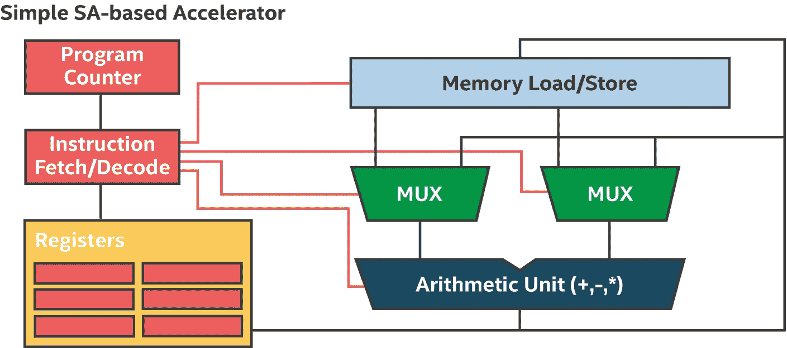

图 17-1

简单的基于 ISA 的(临时)处理:随着时间的推移重用硬件(区域)

空间建筑是不同的。它们不是基于在共享硬件上执行各种指令的机器，而是从相反的角度出发。一个程序的空间实现在概念上把整个程序作为一个整体，并把它一次*放在设备上*。设备的不同区域在程序中执行不同的指令。这在许多方面与随时间推移在指令之间共享硬件(例如 ISA)的观点相反——在空间架构中，每个指令接收其自己的专用硬件，该硬件可以与实现其他指令的硬件同时执行(相同的时钟周期)。图 [17-2](#Fig2) 显示了这个想法，它是整个程序(在这个例子中是一个非常简单的程序)的空间实现。


图 17-2

空间处理:每次操作使用设备的不同区域

对程序的空间实现的这种描述过于简单，但它抓住了这样一个思想，即在空间架构中，程序的不同部分在设备的不同部分上执行，而不是随着时间的推移被发布到一组共享的更通用的硬件上。

由于 FPGA 的不同区域被编程为执行不同的操作，一些通常与基于 ISA 的加速器相关联的硬件是不必要的。例如，图 [17-2](#Fig2) 显示我们不再需要取指令或解码单元、程序计数器或寄存器文件。空间架构将一条指令的输出连接到下一条指令的输入，而不是将数据存储在寄存器文件中供未来指令使用，这就是空间架构通常被称为*数据流*架构的原因。

我们介绍的到 FPGA 的映射出现了几个明显的问题。首先，由于程序中的每条指令都要占用设备空间的一定比例，如果程序需要的空间超过 100%，会发生什么呢？一些解决方案提供了资源共享机制，使更大的程序能够以性能成本来适应，但 FPGAs 确实有程序*适应*的概念。这既是优点也是缺点:

*   好处:如果一个程序使用 FPGA 上的大部分区域，并且每个时钟周期都有足够的工作让所有硬件忙碌，那么在设备上执行程序会非常高效，因为它具有极高的并行性。更一般的架构每个时钟周期可能有大量未使用的硬件，而对于 FPGA，面积的使用可以针对特定应用进行完美定制，不会造成浪费。这种定制可以让应用通过大规模并行运行得更快，通常具有令人信服的能效。

*   不利的一面是:大型程序可能需要调整和重构，以适应设备。编译器的资源共享功能有助于解决这一问题，但通常会降低性能，从而降低使用 FPGA 的优势。基于 ISA 的加速器是非常高效的资源共享实现方式，事实证明，当应用的架构能够充分利用大部分可用区域时，FPGAs 对计算最有价值。

在极端情况下，FPGA 上的资源共享解决方案导致一种看起来像基于 ISA 的加速器的架构，但它内置于可重新配置的逻辑，而不是在固定硅中进行优化。相对于固定芯片设计，可重新配置的逻辑会带来额外开销，因此，通常不会选择 FPGA 来实现 ISA，当应用能够利用资源来实现高效的数据流算法时，FPGA 具有最大的优势，我们将在接下来的章节中讨论这一点。

### 流水线并行性

图 [17-2](#Fig2) 中经常出现的另一个问题是程序的空间实现与时钟频率的关系，以及程序从头到尾执行的速度。在所示的例子中，很容易相信可以从内存中加载数据，执行乘法和加法运算，并将结果存储回内存中，速度非常快。随着程序变得越来越大，可能在整个 FPGA 器件上有成千上万个操作，很明显，对于一个接一个地操作所有指令(操作通常取决于先前操作产生的结果)，考虑到每个操作引入的处理延迟，可能需要很长时间。

操作之间的中间结果在图 [17-3](#Fig3) 所示的空间架构中随时间更新(传播)。例如，加载执行，然后将其结果传递给乘法器，然后将其结果传递给加法器，依此类推。一段时间后，中间数据一直传播到操作链的末端，最终结果可用或存储到内存中。

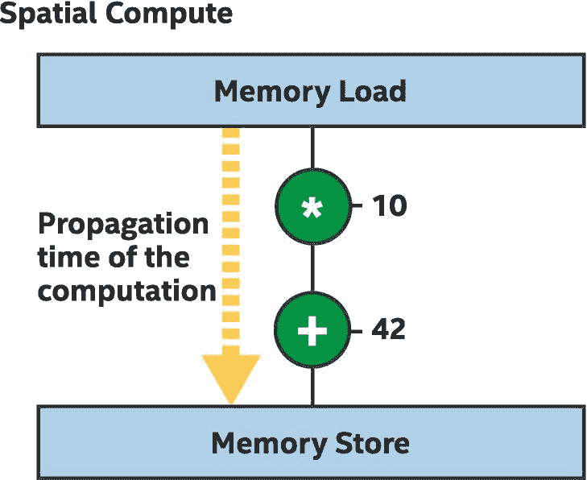

图 17-3

一个简单空间计算实现的传播时间

如图 [17-3](#Fig3) 所示的空间实现是非常低效的，因为大部分硬件只在一小部分时间里做有用的工作。大多数情况下，乘法之类的操作要么等待来自加载的新数据，要么保持其输出，以便链中稍后的操作可以使用其结果。大多数空间编译器和实现通过*流水线*来解决这种低效率，这意味着单个程序的执行分散在许多时钟周期中。这是通过在一些操作之间插入寄存器(硬件中的数据存储原语)来实现的，其中每个寄存器在一个时钟周期内保存一个二进制值。通过保存操作输出的结果，以便链中的下一个操作可以看到并操作该保存的值，前一个操作可以自由地进行不同的计算，而不会影响后续操作的输入。

算法流水线的目标是让每个操作(硬件单元)在每个时钟周期都保持忙碌。图 [17-4](#Fig4) 显示了前面简单例子的流水线实现。请记住，编译器会为我们完成所有的流水线操作和平衡工作！我们讨论这个主题是为了让我们能够理解如何在接下来的部分中用工作填充管道，而不是因为我们需要担心在代码中手工管道化任何东西。

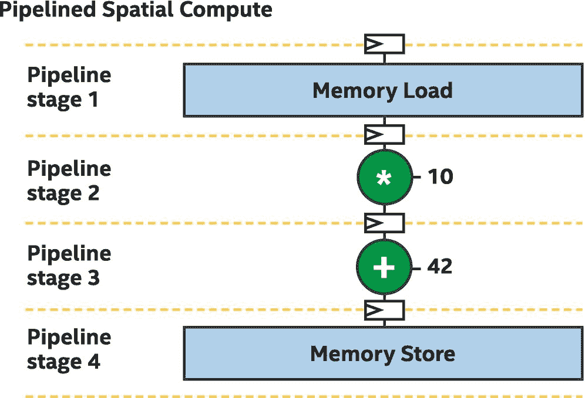

图 17-4

计算的流水线化:阶段并行执行

当空间实现被流水线化时，它变得非常高效，就像工厂流水线一样。每个管道阶段只执行整体工作的一小部分，但是它执行得很快，然后立即开始处理下一个工作单元。从开始到结束，流水线处理一个*单个*计算需要许多时钟周期，但是流水线可以同时对不同数据计算*许多*不同的计算实例。

当足够多的工作开始在流水线中执行时，经过足够多的连续时钟周期，然后每个单独的流水线阶段以及程序中的操作可以在每个时钟周期期间执行有用的工作，这意味着整个空间设备同时执行工作。这就是空间架构的强大之处之一——整个设备可以一直并行工作。我们称之为*流水线并行*。

流水线并行是在 FPGAs 上实现性能的主要并行形式。

PIPELINING IS AUTOMATIC

在用于 FPGA 的 DPC++ 的英特尔实现中，以及在用于 FPGA 的其他高级编程解决方案中，算法的流水线由编译器自动执行。大致了解空间架构上的实现是有用的，如本节所述，因为这样可以更容易地构建应用程序来利用管道并行性。应该明确的是，流水线寄存器插入和平衡是由编译器执行的，而不是由开发人员手动执行的。

真实的程序和算法通常具有控制流(例如，if/else 结构),该控制流使程序的某些部分在时钟周期的某个百分比不活动。FPGA 编译器通常在可能的情况下组合分支两端的硬件，以最小化浪费的空间面积，并在控制流分流期间最大化计算效率。这使得控制流分歧比其他架构，尤其是向量化的架构，成本更低，开发问题更少。

### 内核消耗芯片“面积”

在现有的实现中，DPC++ 应用中的每个内核都会生成一个空间流水线，该流水线会消耗 FPGA 的一些资源(我们可以将此视为设备上的*空间*或*区域*)，这在概念上如图 [17-5](#Fig5) 所示。


图 17-5

同一个 FPGA 二进制文件中的多个内核:内核可以并发运行

由于内核在设备上使用自己的区域，不同的内核可以并发执行。如果一个内核正在等待诸如存储器访问之类的事情，FPGA 上的其他内核可以继续执行，因为它们是芯片上其他地方的独立流水线。这种想法，正式描述为内核之间的独立向前进展，是 FPGA 空间计算的一个关键属性。

## 何时使用 FPGA

与任何加速器架构一样，预测 FPGA 何时是加速器的正确选择，何时是替代方案，通常取决于对架构、应用特性和系统瓶颈的了解。本节描述了要考虑的应用程序的一些特征。

### 很多很多的工作

像大多数现代计算加速器一样，实现良好的性能需要执行大量的工作。如果从单个数据元素计算单个结果，那么利用加速器可能根本没有用(任何种类的)。这和 FPGAs 没什么区别。知道 FPGA 编译器利用流水线并行性后，这一点变得更加明显。一个算法的流水线实现有许多阶段，通常有数千个或更多，每个阶段在任何时钟周期内都应该有不同的工作。如果没有足够的工作在大部分时间占据大部分流水线阶段，那么效率就会很低。我们将一段时间内流水线阶段的平均利用率称为*流水线的占用率*。这和优化 GPU 等其他架构时使用的占有率定义是不一样的！

有多种方法可以在 FPGA 上生成工作来填充流水线阶段，我们将在接下来的章节中讨论。

### 自定义操作或操作宽度

FPGAs 最初设计用于执行有效的整数和按位运算，并作为粘合逻辑，可以调整其他芯片的接口以相互配合工作。虽然 FPGAs 已经发展成为计算能力强大的解决方案，而不仅仅是粘合逻辑解决方案，但它们在按位运算、自定义数据宽度或类型的整数数学运算以及数据包报头中任意位字段的运算方面仍然非常高效。

本章末尾描述的 FPGA 的细粒度架构意味着可以高效地实现新颖和任意的数据类型。例如，如果我们需要 33 位整数乘法器或 129 位加法器，FPGAs 可以非常高效地提供这些自定义操作。由于这种灵活性，FPGAs 通常用于快速发展的领域，例如最近的机器学习，其中数据宽度和操作的变化速度超过了 ASICs 的内置速度。

### 标量数据流

从图 [17-4](#Fig4) 可以明显看出，FPGA 空间流水线的一个重要方面是，操作之间的中间数据不仅留在片内(不存储到外部存储器)，而且每个流水线级之间的中间数据都有专用的存储寄存器。FPGA 并行性来自于计算的流水线操作，使得许多操作同时执行，每个操作在流水线的不同阶段执行。这不同于向量架构，在向量架构中，多个计算作为共享向量指令的通道来执行。

空间管道中并行性的标量性质对于许多应用程序来说是重要的，因为即使在工作单元之间存在紧密的数据依赖性时，它仍然适用。这些数据依赖可以在不损失性能的情况下处理，我们将在本章后面讨论循环携带的依赖时讨论。其结果是，空间管道，因此 FPGAs，对于跨工作单元(如工作项)的数据依赖性不能被破坏并且必须进行细粒度通信的算法来说是有吸引力的。针对其他加速器的许多优化技术关注于通过各种技术打破这些依赖性，或者通过诸如子组之类的特性在受控规模上管理通信。相反，FPGAs 可以很好地执行紧密依赖的通信，并且应该被考虑用于存在这种模式的算法类别。

LOOPS ARE FINE!

对数据流架构的一个常见误解是，具有固定或动态迭代计数的循环会导致数据流性能不佳，因为它们不是简单的前馈管道。至少对于英特尔 DPC++ 和 FPGA 工具链来说，情况并非如此。相反，循环迭代是在管道内产生高占用率的好方法，编译器是围绕允许多个循环迭代以重叠方式执行的概念构建的。循环提供了一种简单的机制来让管道忙于工作！

### 低延迟和丰富的连接

利用器件上丰富的输入和输出收发器的 FPGAs 的更多传统用途同样适用于使用 DPC++ 的开发人员。例如，如图 [17-6](#Fig6) 所示，一些 FPGA 加速卡具有网络接口，可以将数据直接传输到设备中，进行处理，然后将结果直接传输回网络。当需要最小化处理等待时间时，以及当通过操作系统网络栈的处理太慢或需要卸载时，通常寻求这样的系统。


图 17-6

低延迟 I/O 流:FPGA 紧密连接网络数据和计算

当考虑通过 FPGA 收发器进行直接输入/输出时，机会几乎是无限的，但选择确实取决于构成加速器的电路板上的可用器件。由于依赖于特定的加速卡和各种这样的用途，除了在下一节中描述管道语言构造之外，本章不深入这些应用程序。相反，我们应该阅读与特定加速卡相关的供应商文档，或者搜索符合我们特定接口需求的加速卡。

### 定制的内存系统

FPGA 上的存储器系统，例如函数私有存储器或工作组本地存储器，是由小块片上存储器构建而成的。这很重要，因为每个内存系统都是为使用它的算法或内核的特定部分定制的。FPGAs 具有显著的片内存储器带宽，结合定制存储器系统的形成，它们可以在具有非典型存储器访问模式和结构的应用中表现出色。图 [17-7](#Fig7) 显示了在 FPGA 上实现内存系统时，编译器可以执行的一些优化。


图 17-7

FPGA 内存系统是由编译器为我们的特定代码定制的

其他架构，如 GPU，有固定的内存结构，有经验的开发人员很容易推理，但在许多情况下也很难优化。例如，其他加速器上的许多优化都集中在内存模式修改上，以避免存储体冲突。如果我们的算法可以受益于定制的存储器结构，例如每个存储体的不同数量的访问端口或不同寻常的存储体数量，那么 FPGAs 可以提供立竿见影的优势。从概念上讲，区别在于编写代码以有效地使用固定的内存系统(大多数其他加速器)和让编译器定制设计的内存系统对我们的特定代码有效(FPGA)。

## 在 FPGA 上运行

在 FPGA 上运行内核有两个步骤(与任何提前编译加速器一样):

1.  将源代码编译成可以在我们感兴趣的硬件上运行的二进制文件

2.  在运行时选择我们感兴趣的正确加速器

要编译内核以便它们可以在 FPGA 硬件上运行，我们可以使用命令行:

```cpp

dpcpp -fintelfpga my_source_code.cpp -Xshardware

```

该命令告诉编译器将`my_source_code.cpp`中的所有内核转换成可以在英特尔 FPGA 加速器上运行的二进制文件，然后将它们打包到生成的主机二进制文件中。当我们执行主机二进制程序时(例如，通过在 Linux 上运行`./a.out`，在执行提交的内核之前，运行时将根据需要自动编程任何附加的 FPGA，如图 [17-8](#Fig8) 所示。


图 17-8

FPGA 在运行时自动编程

FPGA 编程二进制文件嵌入在我们在主机上运行的已编译的 DPC++ 可执行文件中。FPGA 是在幕后自动为我们配置的。

当我们运行一个主机程序并提交第一个内核以便在 FPGA 上执行时，在内核开始执行之前可能会有一点延迟，因为 FPGA 正在被编程。为额外的执行重新提交内核不会看到同样的延迟，因为内核已经被编程到设备中并准备好运行。

第 [2](02.html#b978-1-4842-5574-2_2) 章介绍了运行时 FPGA 器件的选择。我们需要告诉主机程序我们希望内核在哪里运行，因为除了 FPGA 之外，通常还有多个加速器选项可用，例如 CPU 和 GPU。为了快速回顾在程序执行期间选择 FPGA 的一种方法，我们可以使用如图 [17-9](#Fig9) 所示的代码。

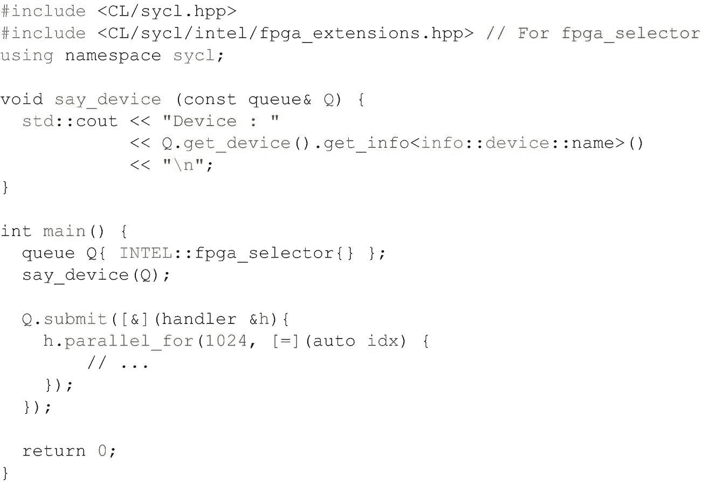

图 17-9

使用`fpga_selector`在运行时选择 FPGA 器件

### 编译时间

传言称，编译 FPGA 设计可能需要很长时间，比编译基于 ISA 的加速器要长得多。谣言是真的！本章结尾概述了 FPGA 的细粒度架构元素，这些元素既带来了 FPGA 的优势，也带来了计算密集型编译(布局布线优化)，在某些情况下可能需要数小时。

从源代码到 FPGA 硬件执行的编译时间足够长，我们不想专门在硬件中开发和迭代我们的代码。FPGA 开发流程提供了几个阶段，最大限度地减少了硬件编译的数量，使我们在硬件编译时间有限的情况下也能高效工作。图 [17-10](#Fig10) 显示了典型的阶段，在这些阶段，我们的大部分时间都花在提供快速周转和快速迭代的早期步骤上。

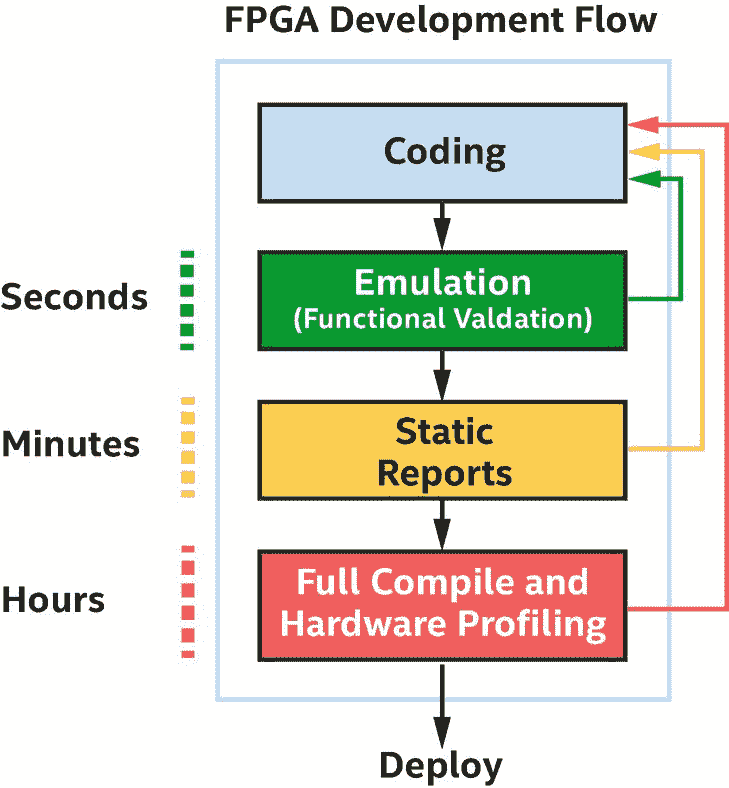

图 17-10

大多数验证和优化发生在冗长的硬件编译之前

来自编译器的仿真和静态报告是 DPC++ 中 FPGA 代码开发的基石。仿真器就像 FPGA 一样工作，包括支持相关扩展和仿真执行模型，但运行在主机处理器上。因此，编译时间与我们预期的编译到 CPU 设备的时间相同，尽管我们不会看到在实际 FPGA 硬件上执行所带来的性能提升。模拟器对于在应用程序中建立和测试功能正确性非常有用。

像仿真一样，静态报告由工具链快速生成。它们报告编译器创建的 FPGA 结构和编译器识别的瓶颈。这两者都可以用来预测我们的设计在 FPGA 硬件上运行时是否会获得良好的性能，并用来优化我们的代码。请阅读供应商的文档以获得关于报告的信息，这些报告通常会随着工具链的发布而不断改进(请参阅文档以了解最新和最棒的特性！).供应商提供了关于如何根据报告进行解释和优化的大量文档。这些信息将是另一本书的主题，所以我们不能在这一章中深入讨论细节。

#### FPGA 仿真器

仿真主要用于从功能上调试我们的应用程序，以确保它的行为符合预期并产生正确的结果。没有理由在编译时间更长的实际 FPGA 硬件上进行这种级别的开发。通过从`dpcpp`编译命令中移除`-Xshardware`标志，同时在我们的主机代码中使用`INTEL::fpga_emulator_selector`而不是`INTEL::fpga_selector`来激活仿真流。我们将使用如下命令进行编译

```cpp

dpcpp -fintelfpga my_source_code.cpp

```

同时，我们将在运行时使用如图 [17-11](#Fig11) 所示的代码选择 FPGA 仿真器。通过使用`fpga_emulator_selector, which`使用主机处理器来仿真 FPGA，我们在必须为实际 FPGA 硬件进行更长时间的编译之前，保持了快速的开发和调试过程。

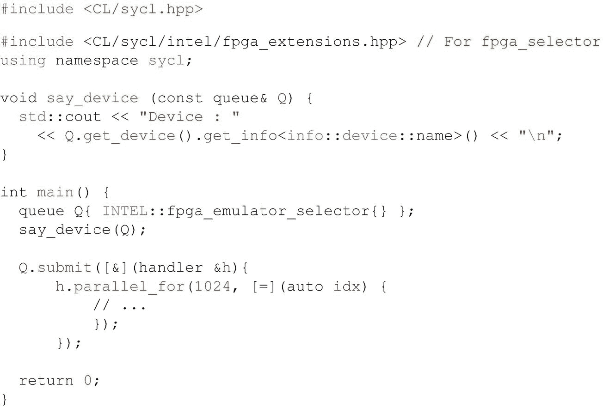

图 17-11

使用`fpga_emulator_selector`进行快速开发和调试

如果我们经常在硬件和仿真器之间切换，在程序中使用宏从命令行在设备选择器之间切换是有意义的。如果需要，请查看供应商的文档和在线 FPGA DPC++ 代码示例。

#### FPGA 硬件编译“提前”发生

图 [17-10](#Fig10) 中的*完全编译和硬件剖析*阶段在 SYCL 术语中是一个提前编译的*。这意味着内核到设备二进制文件的编译发生在我们最初编译程序的时候，而不是程序提交到设备上运行的时候。在 FPGA 上，这一点尤为重要，因为*

1.  编译需要很长时间，这是我们在运行应用程序时通常不希望发生的。

2.  DPC++ 程序可以在没有主处理器的系统上执行。FPGA 二进制文件的编译过程得益于具有大量附加存储器的快速处理器。提前编译让我们可以很容易地选择编译发生的位置，而不是在程序部署的系统上运行。

A LOT HAPPENS BEHIND THE SCENES WITH DPC++ ON AN FPGA!

传统的 FPGA 设计(不使用高级语言)可能非常复杂。除了编写我们的内核之外，还有许多步骤，例如构建和配置与片外存储器通信的接口，以及通过插入所需的寄存器来关闭时序，以使编译后的设计运行得足够快，从而与某些外设通信。DPC++ 为我们解决了这一切，让我们不需要了解任何常规 FPGA 设计的细节就可以实现工作应用！该工具将我们的内核视为优化和提高设备效率的代码，然后自动处理与片外外设对话、关闭时序和为我们设置驱动程序的所有细节。

与任何其他加速器一样，在 FPGA 上实现最高性能仍然需要详细的架构知识，但与传统 FPGA 流程相比，使用 DPC++ 从代码到工作设计的步骤要简单得多，效率也更高。

## 为 FPGAs 编写内核

一旦我们决定在我们的应用中使用 FPGA，或者只是决定试用一种，了解如何编写代码以获得良好的性能是非常重要的。本节描述了突出重要概念的主题，并涵盖了一些经常引起混淆的主题，以使入门更快。

### 暴露并行性

我们已经了解了如何利用流水线并行在 FPGA 上高效执行工作。另一个简单的管道示例如图 [17-12](#Fig12) 所示。

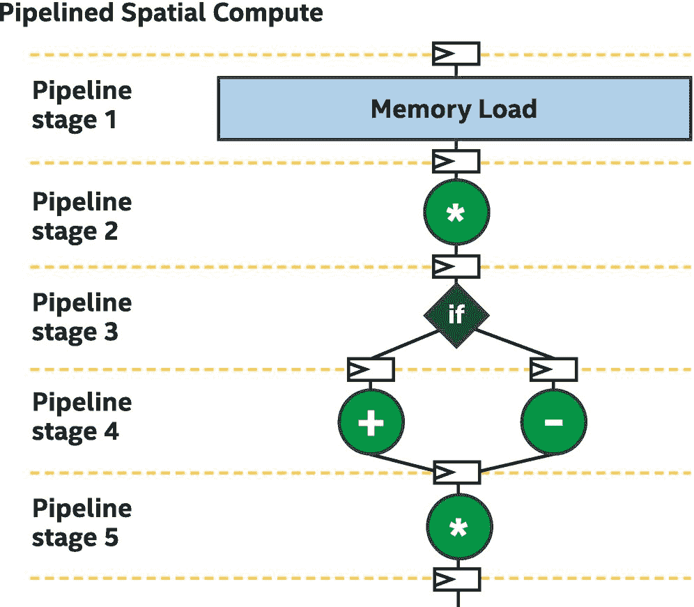

图 17-12

具有五个阶段的简单流水线:六个时钟周期处理一个数据元素

在这条管道中，有五个阶段。每个时钟周期，数据从一个阶段移动到下一个阶段一次，因此在这个非常简单的例子中，从数据进入阶段 1 到从阶段 5 退出需要 6 个时钟周期。

流水线的一个主要目标是使多个数据元素能够在流水线的不同阶段同时被处理。为了确保这一点是清楚的，图 [17-13](#Fig13) 显示了一个没有足够工作的流水线(在这种情况下只有一个数据元素)，这导致每个流水线级在大多数时钟周期内都没有被使用。这是对 FPGA 资源的低效使用，因为大部分硬件在大部分时间都是空闲的。

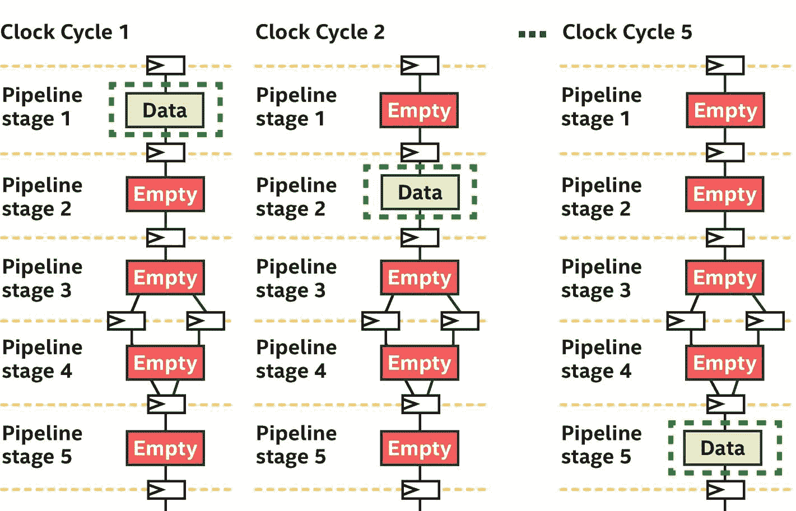

图 17-13

如果只处理单个工作元素，流水线阶段通常是不使用的

为了更好地占用管道阶段，想象一下在第一阶段之前等待的未启动工作队列是有用的，第一阶段*向*管道提供信息。每个时钟周期，流水线可以从队列中消耗并启动多一个工作元素，如图 [17-14](#Fig14) 所示。在一些初始启动周期之后，流水线的每个阶段都被占用，并在每个时钟周期做有用的工作，从而有效利用 FPGA 资源。


图 17-14

当每个流水线级保持忙碌时，就实现了高效利用

接下来的两个部分将介绍一些方法，这些方法可以让队列中充满准备好开始的工作。我们会看看

1.  nd-range 核

2.  环

在这些选项之间进行选择会影响运行在 FPGA 上的内核的基本架构。在某些情况下，算法很适合这种或那种风格，而在其他情况下，程序员的偏好和经验决定了应该选择哪种方法。

#### 使用 ND-range 保持流水线繁忙

第[章第 4](04.html#b978-1-4842-5574-2_4) 节描述了 ND-range 分级执行模型。图 [17-15](#Fig15) 说明了关键的概念:一个 ND-range 执行模型，其中有一个工作项目的层次分组，工作项目是内核定义的基本工作单元。该模型最初被开发来实现 GPU 的高效编程，其中工作项目可以在执行模型层级的不同级别上并发执行。为了匹配 GPU 硬件高效的工作类型，ND 范围工作项在大多数应用程序中不会频繁地相互通信。


图 17-15

ND-range 执行模型:工作项目的层次分组

使用 ND-range 可以非常有效地填充 FPGA 空间流水线。FPGA 完全支持这种编程风格，我们可以将其视为图 [17-16](#Fig16) 所示，在每个时钟周期，不同的工作项进入流水线的第一阶段。

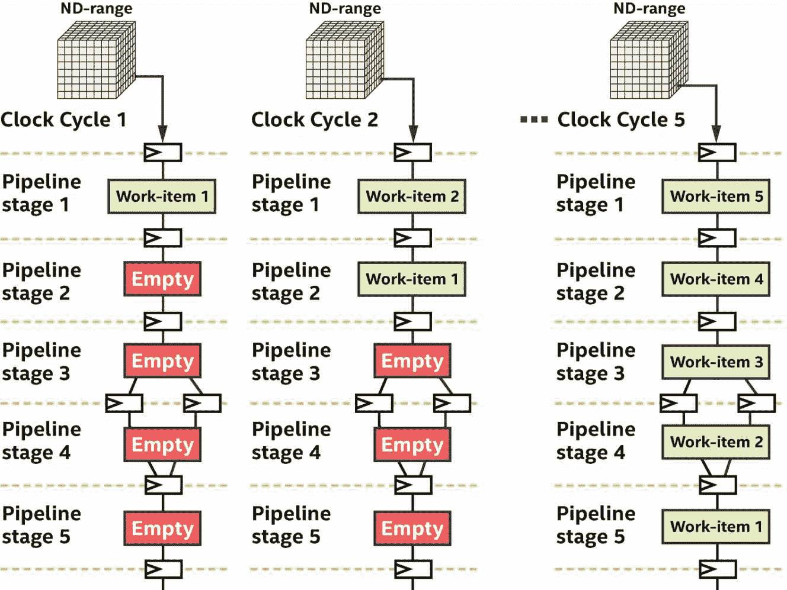

图 17-16

ND-range 供给空间管道

什么时候我们应该使用工作项在 FPGA 上创建一个 ND-range 内核来保持流水线被占用？很简单。每当我们可以将我们的算法或应用程序构建为不需要经常通信(或者理想情况下根本不需要通信)的独立工作项时，我们都应该使用 ND-range！如果工作项确实需要经常通信，或者如果我们不自然地考虑 ND 范围，那么循环(在下一节中描述)也提供了一种表达我们算法的有效方式。

如果我们可以构建我们的算法，使得工作项不需要太多的通信(或者根本不需要),那么 ND-range 是一个生成工作以保持空间管道满的好方法！

一个很好的例子是一个随机数发生器，在这个例子中，序列中的数字的创建独立于先前生成的数字。

图 [17-17](#Fig17) 显示了一个 ND-range 内核，它将为 16 `×` 16 `×` 16 范围内的每个工作项调用一次随机数生成函数。注意随机数生成函数是如何将工作项 id 作为输入的。


图 17-17

多个工作项(16 `×` 16 `×` 16)调用一个随机数生成器

这个例子展示了一个使用了一个`range`的`parallel_for`调用，只指定了一个全局大小。我们也可以使用带有`nd_range`的`parallel_for`调用风格，其中指定了全局工作大小和本地工作组大小。FPGAs 可以非常有效地从片内资源实现工作组本地存储器，因此只要有意义就可以随意使用工作组，因为我们需要工作组本地存储器，或者因为有了工作组 id 可以简化我们的代码。

PARALLEL RANDOM NUMBER GENERATORS

图 [17-17](#Fig17) 中的例子假设`generate_random_number_from_ID(I)`是一个随机数发生器，当以并行方式调用时，它是安全和正确的。例如，如果在`parallel_for`范围内的不同工作项执行该函数，我们期望每个工作项创建不同的序列，每个序列都遵循生成器期望的分布。并行随机数生成器本身就是一个复杂的主题，所以使用库或者通过诸如块跳转算法之类的技术来了解这个主题是一个好主意。

#### 管道不介意数据依赖！

当对一些工作项目作为向量指令通道一起执行的向量架构(例如，GPU)进行编程时，挑战之一是在工作项目之间没有大量通信的情况下构造高效的算法。有些算法和应用程序非常适合矢量硬件，有些则不适合。映射不佳的一个常见原因是算法需要大量共享数据，这是由于数据依赖于在某种意义上相邻的其他计算。如第 [14](14.html#b978-1-4842-5574-2_14) 章所述，子组通过在同一个子组中的工作项之间提供有效的通信来解决向量架构上的一些挑战。

对于不能分解成独立工作的算法，FPGAs 起着重要的作用。FPGA 空间流水线不是跨工作项矢量化，而是跨流水线阶段执行连续的工作项。这种并行性的实现意味着工作项(甚至是不同工作组中的工作项)*之间的细粒度通信可以在空间管道中轻松有效地实现！*

一个例子是随机数发生器，其中输出 N+1 取决于知道输出 N 是什么。这在两个输出之间产生了数据依赖性，并且如果每个输出都是由 nd 范围中的工作项生成的，那么在一些架构上，工作项之间存在数据依赖性，这可能需要复杂并且通常昂贵的同步。当串行编码这样的算法时，通常会编写一个循环，其中迭代 N+1 使用来自迭代 N 的计算，如图 [17-18](#Fig18) 所示。每次迭代依赖于前一次迭代计算的状态。这是一种非常常见的模式。


图 17-18

循环携带的数据相关性(`state`)

空间实现可以非常有效地将结果在管道中向后传递给在稍后的周期中开始的工作(即，在管道中的较早阶段工作)，并且空间编译器围绕该模式实现了许多优化。图 [17-19](#Fig19) 显示了从阶段 5 到阶段 4 的数据反向通信的想法。空间管道不会跨工作项进行矢量化。这通过在管道中向后传递结果实现了高效的数据依赖通信！

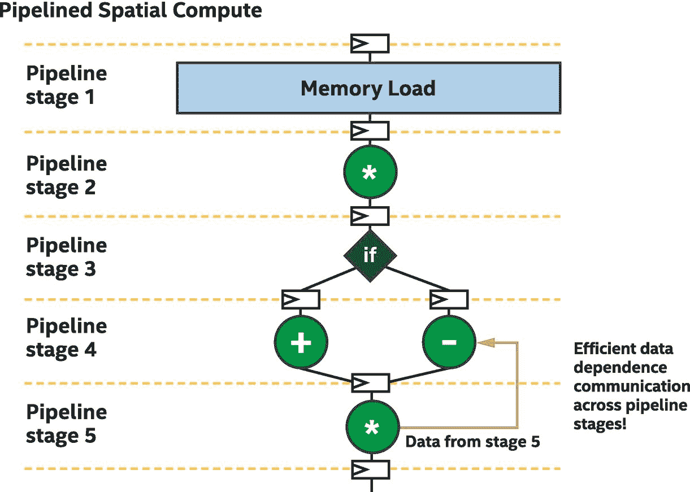

图 17-19

反向通信支持高效的数据相关通信

向后传递数据(传递到管道中的早期阶段)的能力是空间架构的关键，但如何编写利用这一点的代码并不明显。有两种方法可以轻松表达这种模式:

1.  环

2.  具有 ND 范围内核的内核内管道

第二种选择是基于管道的，我们将在本章后面介绍，但它远不如循环那样常见，所以为了完整起见我们提到了它，但在这里就不详述了。供应商文档提供了关于管道方法的更多细节，但是更容易坚持下面描述的循环，除非有理由这样做。

#### 循环的空间流水线实现

当对具有数据依赖性的算法进行编程时，循环是一种自然的选择。循环经常表示迭代之间的依赖关系，即使在最基本的循环例子中，决定循环何时退出的计数器也是跨迭代执行的(图 [17-20](#Fig20) 中的变量`i`)。


图 17-20

具有两个循环携带依赖项(即`i`和`a`)的循环

在图 [17-20](#Fig20) 的简单循环中，`a= a + i`右侧的`a`的值反映了前一次循环迭代存储的值，如果是循环的第一次迭代，则为初始值。当空间编译器实现一个循环时，循环的迭代可以用来填充流水线的各个阶段，如图 [17-21](#Fig21) 所示。注意，现在准备开始的工作队列包含循环迭代，而不是工作项！


图 17-21

由循环的连续迭代供给的流水线阶段

图 [17-22](#Fig22) 显示了一个修改后的随机数发生器示例。在这种情况下，不是根据工作项的 id 生成一个数字，如图 [17-17](#Fig17) 所示，生成器将之前计算的值作为一个参数。


图 17-22

取决于先前生成的值的随机数生成器

这个例子使用了`single_task`而不是`parallel_for`，因为重复的工作是由单个任务中的一个循环表示的，所以没有理由在这个代码中也包含多个工作项(通过`parallel_for`)。`single_task`中的循环使得将之前计算的`temp`值传递给随机数生成函数的每次调用变得更加容易(便于编程)。

在如图 [17-22](#Fig22) 的情况下，FPGA 可以有效地实现循环。在许多情况下，它可以保持一个完全占用的管道，或者至少可以通过报告告诉我们要改变什么来增加占用率。考虑到这一点，很明显，如果用工作项替换循环迭代，这个算法将更加难以描述，其中一个工作项生成的值需要传递给另一个工作项，以便在增量计算中使用。代码的复杂性会迅速增加，特别是如果工作不能被批处理，那么每个工作项实际上是在计算它自己独立的随机数序列。

#### 循环启动间隔

从概念上讲，我们可能认为 C++ 中的循环迭代是一个接一个地执行，如图 [17-23](#Fig23) 所示。这就是编程模型，也是思考循环的正确方式。然而，在实现中，只要程序的大多数行为(即，定义的和无竞争的行为)没有明显改变，编译器就可以自由地执行许多优化。不考虑编译器优化，重要的是循环看起来执行*，就好像*图 [17-23](#Fig23) 是如何发生的。


图 17-23

从概念上讲，循环迭代一个接一个地执行

从空间编译器的角度来看，图 [17-24](#Fig24) 显示了循环流水线优化，其中循环迭代的执行在时间上是重叠的。不同的迭代将执行彼此不同的空间流水线阶段，并且跨流水线阶段的数据依赖性可以由编译器管理，以确保程序看起来好像迭代是连续的一样执行(除了循环将更快地完成执行！).

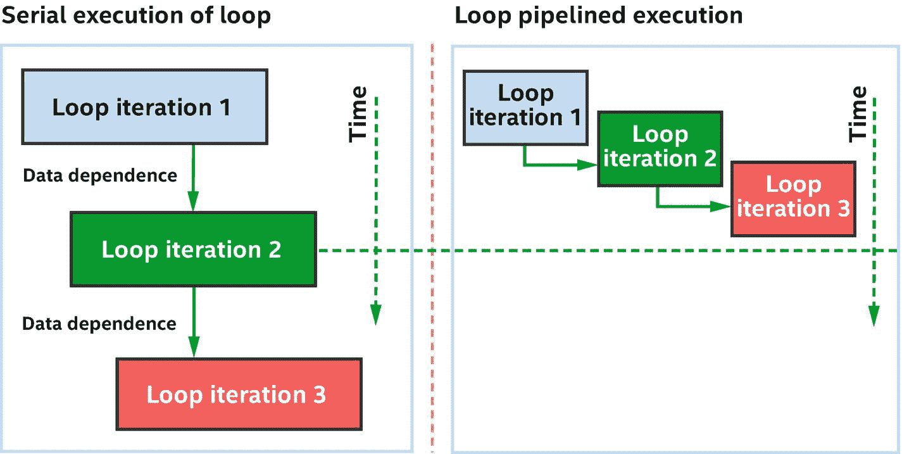

图 17-24

循环流水线操作允许循环的迭代在流水线阶段之间重叠

认识到循环迭代中的许多结果可能在循环迭代完成其所有*工作之前完成计算，并且在空间流水线中，当编译器决定这样做时，结果可以被传递到更早的流水线阶段，循环流水线是容易理解的。图 [17-25](#Fig25) 显示了这个想法，其中阶段 1 的结果在流水线中被反馈，允许未来的循环迭代在前一次迭代完成之前尽早使用该结果。*

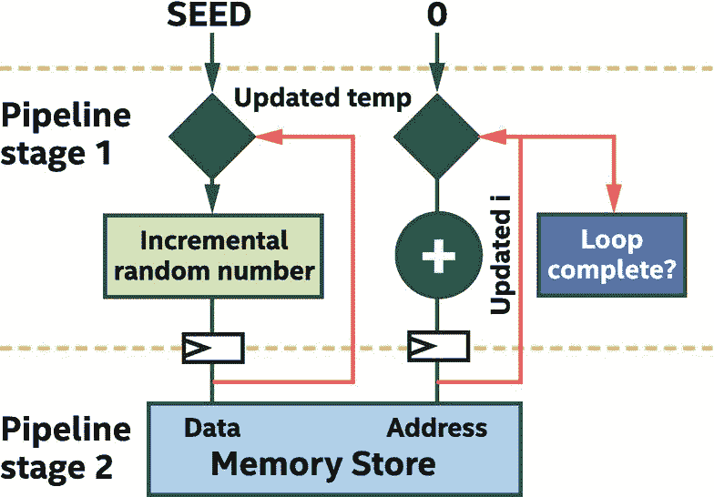

图 17-25

增量随机数发生器的流水线实现

使用循环流水线，一个循环的多次迭代的执行有可能重叠。这种重叠意味着，即使存在循环携带的数据依赖性，循环迭代仍然可以用来填充工作管道，从而实现高效利用。图 [17-26](#Fig26) 显示了在如图 [17-25](#Fig25) 所示的同一条简单流水线中，循环迭代如何重叠它们的执行，即使有循环携带的数据依赖。

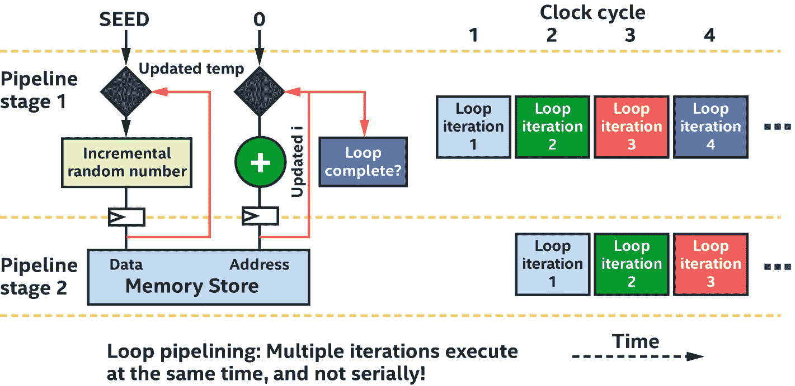

图 17-26

循环流水线同时处理多个循环迭代的部分

在实际算法中，通常不可能在每个时钟周期启动新的循环迭代，因为数据相关性可能需要多个时钟周期来计算。如果存储器查找，特别是从片外存储器的查找，在相关性计算的关键路径上，这经常发生。结果是流水线只能每`N`个时钟周期启动一次新的循环迭代，我们称之为`N`周期的*启动间隔* ( `II`)。示例如图 [17-27](#Fig27) 所示。两个循环启动间隔(`II`)意味着新的循环迭代可以每隔一个周期开始，这导致流水线级的次优占用。


图 17-27

流水线级的次优占用

大于 1 的`II`会导致流水线效率低下，因为每一级的平均占用率会降低。从图 [17-27](#Fig27) 中可以明显看出，其中`II=2`和管道级未使用的比例很大(50%！)的时间。有多种方法可以改善这种情况。

编译器会尽可能地执行大量优化来减少 II，因此它的报告还会告诉我们每个循环的初始间隔是多少，如果发生这种情况，还会告诉我们为什么它大于 1。基于报告在循环中重构计算通常可以减少`II`，特别是因为作为开发人员，我们可以进行编译器不允许的循环结构更改(因为它们会被观察到)。阅读编译器报告，了解如何在特定情况下减少`II`。

另一种降低大于 1 的`II`的低效率的方法是通过嵌套循环，这可以通过将外部循环迭代与具有`II>1`的内部循环迭代交错来填充所有流水线阶段。有关使用这种技术的详细信息，请查阅供应商文档和编译器报告。

### 管道

空间和其他架构中的一个重要概念是先进先出(FIFO)缓冲器。FIFOs 之所以重要，有很多原因，但在考虑编程时，有两个属性特别有用:

1.  伴随数据的还有**隐含的控制信息。这些信号告诉我们 FIFO 是空的还是满的，这在将问题分解成独立的部分时很有用。**

2.  FIFOs 有**存储容量**。这使得在存在动态行为(如访问内存时高度可变的延迟)的情况下实现性能变得更加容易。

图 [17-28](#Fig28) 显示了一个 FIFO 操作的简单例子。


图 17-28

一段时间内 FIFO 的操作示例

在 DPC++ 中，FIFOs 是通过一个名为*管道*的特性公开的。在编写 FPGA 程序时，我们应该关心管道的主要原因是，它们允许我们将问题分解为更小的部分，以便以更模块化的方式专注于开发和优化。它们还允许利用 FPGA 丰富的通信功能。图 [17-29](#Fig29) 用图形显示了这两种情况。


图 17-29

管道简化了模块化设计和对硬件外设的访问

请记住，FPGA 内核可以同时存在于器件上(位于芯片的不同区域),在高效设计中，内核的所有部分在每个时钟周期都是活动的。这意味着优化 FPGA 应用需要考虑内核或部分内核之间的交互方式，而管道提供了一种抽象来简化这一过程。

管道是使用 FPGA 上的片内存储器实现的 FIFOs，因此它们允许我们在运行的内核之间和内部进行通信，而无需将数据移动到片外存储器。这提供了廉价的通信，并且与管道(空/满信号)耦合的控制信息提供了轻量级的同步机制。

DO WE NEED PIPES?

不。不使用管道也可以编写高效的内核。我们可以使用所有的 FPGA 资源，并使用没有管道的传统编程风格实现最高性能。但是对于大多数开发人员来说，编程和优化更模块化的空间设计更容易，管道是实现这一点的好方法。

如图 [17-30](#Fig30) 所示，有四种通用类型的管道可供选择。在本节的剩余部分，我们将讨论第一种类型(内核间管道)，因为它们足以说明什么是管道以及如何使用管道。管道还可以在单个内核中通信，并与主机或输入/输出外围设备通信。关于管道的形式和用途的更多信息，请查阅供应商文档，我们在这里没有空间深入讨论。

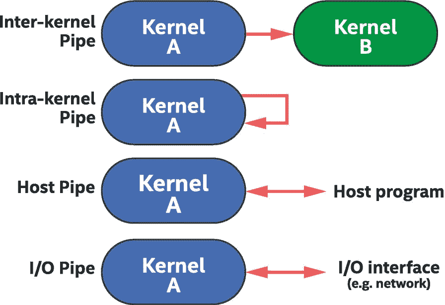

图 17-30

DPC++ 中管道连接的类型

一个简单的例子如图 [17-31](#Fig31) 所示。在这种情况下，有两个内核通过管道进行通信，每个读或写操作在一个`int`单元上进行。


图 17-31

两个内核之间的管道:(1) ND-range 和(2)具有循环的单个任务

从图 [17-31](#Fig31) 中可以观察到几点。首先，两个内核使用管道相互通信。如果内核之间没有访问器或事件依赖，DPC++ 运行时将同时执行两个*，允许它们通过管道而不是完整的 SYCL 内存缓冲区或 USM 进行通信。*

 *使用基于类型的方法识别管道，其中每个管道使用管道类型的参数化进行识别，如图 [17-32](#Fig32) 所示。管道类型的参数化标识了特定的管道。对同一管道类型的读取或写入是对同一 FIFO 的。有三个模板参数共同定义了管道的类型和标识。


图 17-32

管道类型的参数化

建议使用类型别名来定义我们的管道类型，如图 [17-31](#Fig31) 的第一行代码所示，以减少编程错误，提高代码可读性。

使用类型别名来标识管道。这简化了代码，并防止意外创建意外管道。

管道有一个`min_capacity`参数。它默认为 0，这是*自动选择*，但是如果指定，它保证至少该数量的字可以被写入管道而不被读出。此参数在以下情况下很有用

1.  与管道通信的两个内核不同时运行，我们需要管道中有足够的容量供第一个内核在第二个内核开始运行并从管道中读取数据之前写入其所有输出。

2.  如果内核以突发方式生成或消耗数据，那么增加管道的容量可以在内核之间提供隔离，使它们的性能彼此分离。例如，产生数据的内核可以继续写入(直到管道容量变满)，即使消耗该数据的内核很忙，还没有准备好消耗任何东西。这提供了内核相对于彼此执行的灵活性，代价仅仅是 FPGA 上的一些存储器资源。

#### 阻塞和非阻塞管道入口

和大多数 FIFO 接口一样，管道有两种接口风格:*阻塞*和*非阻塞*。阻塞访问等待(阻塞/暂停执行！)以使操作成功，而非阻塞访问会立即返回，并设置一个布尔值来指示操作是否成功。

成功的定义很简单:如果我们从管道中读取，并且有数据可供读取(管道不为空)，那么读取成功。如果我们正在写并且管道还没有满，那么写成功。图 [17-33](#Fig33) 显示了 pipe 类访问成员函数的两种形式。我们看到管道的成员函数允许它被写入或读取。回想一下，对管道的访问可以是阻塞的，也可以是非阻塞的。


图 17-33

允许对其进行读写的管道成员函数

阻塞访问和非阻塞访问都有其用途，这取决于我们的应用程序试图实现的目标。如果内核在从管道中读取数据之前不能做更多的工作，那么使用阻塞读取可能是有意义的。相反，如果内核希望从一组管道中的任何一个读取数据，并且不确定哪个管道可能有可用的数据，那么使用非阻塞调用从管道读取数据更有意义。在这种情况下，内核可以从管道中读取数据并处理数据(如果有数据的话),但是如果管道是空的，它可以继续尝试从下一个可能有数据可用的管道中读取数据。

#### 有关管道的更多信息

在这一章中，我们只能触及管道的表面，但是我们现在应该对它们有一个概念，以及如何使用它们的基本知识。FPGA 供应商文档提供了更多信息，以及它们在不同类型应用中的使用示例，因此，如果我们认为管道与我们的特定需求相关，我们应该查看一下。

### 定制存储系统

在为大多数加速器编程时，大部分优化工作都倾向于使内存访问更加高效。FPGA 设计也是如此，尤其是当输入和输出数据通过片外存储器时。

FPGA 上的存储器访问值得优化有两个主要原因:

1.  减少所需的带宽，特别是在一些带宽使用效率低下的情况下

2.  修改导致空间流水线中不必要的停顿的存储器上的访问模式

有必要简单谈谈空间管道中的*失速*。编译器内置了关于从特定类型的内存中读取或向其写入所需时间的假设，并相应地优化和平衡了流水线，从而隐藏了进程中的内存延迟。但是，如果我们以低效的方式访问内存，我们可能会引入更长的延迟，并且作为一种副产品在流水线中停止，其中早期阶段无法取得执行进展，因为它们被等待某些东西(例如，内存访问)的流水线阶段阻塞。图 [17-34](#Fig34) 显示的就是这样一种情况，负载上方的管线停滞不前，无法前进。

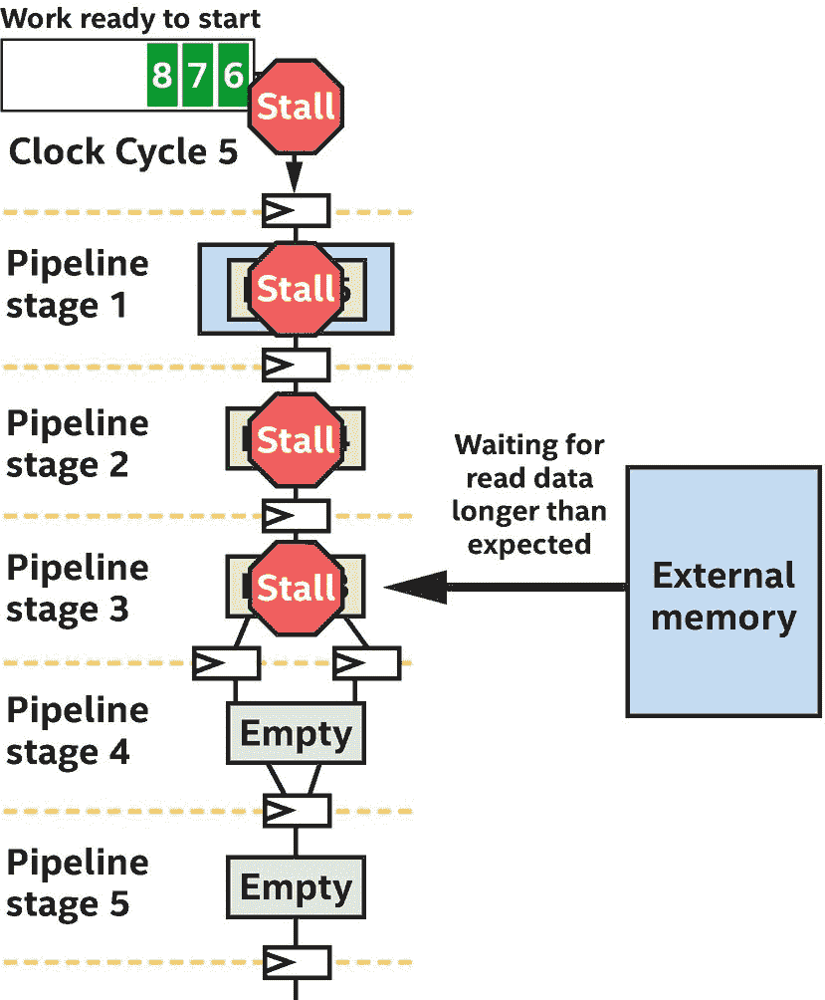

图 17-34

内存停顿如何导致早期管道阶段也停顿

内存系统优化可以在几个方面进行。像往常一样，编译器报告是我们了解编译器为我们实现了什么，以及什么可能值得调整或改进的主要指南。我们在这里列出了几个优化主题，以突出我们可用的一些自由度。优化通常可以通过显式控件和修改代码来实现，以允许编译器推断出我们想要的结构。编译器静态报告和供应商文档是内存系统优化的关键部分，有时会在硬件执行期间与评测工具结合使用，以捕获实际的内存行为，用于验证或最终的调整阶段。

1.  静态合并(Static coalescing):编译器会将内存访问合并成数量更少、范围更广的访问。这降低了存储器系统在流水线中加载或存储单元的数量、存储器系统上的端口、仲裁网络的大小和复杂性以及其它存储器系统细节方面的复杂性。一般来说，我们希望尽可能启用静态合并，这可以通过编译器报告来确认。简化内核中的寻址逻辑有时足以让编译器执行更积极的静态合并，因此请始终检查报告，确保编译器已经推断出我们所期望的内容！

2.  **内存访问** **风格**:编译器为内存访问创建加载或存储单元，这些单元针对被访问的内存技术(例如片上与 DDR 或 HBM)以及从源代码推断的访问模式(例如流、动态合并/加宽，或者可能受益于特定大小的高速缓存)而定制。编译器报告告诉我们编译器推断出了什么，并允许我们在相关的地方修改或添加控制到我们的代码，以提高性能。

3.  **内存系统** **结构**:内存系统(片内和片外)可以具有由编译器实现的分组结构和众多优化。有许多控件和模式修改可用于控制这些结构和调整空间实现的特定方面。

## 一些结束主题

在与初学 FPGAs 的开发人员交谈时，我们发现从较高的层面理解组成器件的元件以及提到时钟频率(这似乎是一个困惑点)通常会有所帮助。我们以这些话题结束这一章。

### FPGA 构建模块

为了帮助理解工具流(特别是编译时)，有必要提一下构成 FPGA 的构建模块。这些构建块是通过 DPC++ 和 SYCL 抽象出来的，它们的知识在典型的应用程序开发中不起作用(至少在使代码功能化的意义上)。然而，它们的存在确实会影响空间架构优化和工具流的直觉发展，例如，在为我们的应用程序选择理想的数据类型时，偶尔会影响高级优化。

一个非常简化的现代 FPGA 器件由五个基本元件组成。

1.  **查找表**:有几根二进制输入线并产生二进制输出的基本块。相对于输入的输出通过编程到查找表中的条目来定义。这些是非常原始的模块，但是在用于计算的典型现代 FPGA 上有许多(数百万)这样的模块。这些是我们大部分设计实现的基础！

2.  **数学引擎**:对于常见的数学运算，如单精度浮点数的加法或乘法，FPGAs 有专门的硬件来使这些运算非常高效。一个现代的 FPGA 有数千个这样的模块——有些设备有超过 8000 个——这样至少这些浮点原语操作可以在每个时钟周期并行执行*！大多数 FPGAs 将这些数学引擎命名为*数字信号处理器*(DSP)。*

3.  **片内存储器**:这是 FPGAs 区别于其他加速器的一个方面，存储器有两种类型(更确切地说，但我们不会在这里讨论):(1)寄存器，用于操作和其他一些目的之间的管道传输，以及(2)块存储器，提供遍布整个设备的小型随机存取存储器。现代 FPGA 可以拥有数百万个寄存器位和超过 10，000 个 20 Kbit RAM 存储模块。由于每一个时钟周期都可以激活，因此如果有效利用，片内存储器容量和带宽会非常可观。

4.  **片外硬件接口**:FPGA 的发展在一定程度上是因为其非常灵活的收发器和输入/输出连接，允许与从片外存储器到网络接口等几乎任何东西进行通信。

5.  **路由结构** **在** **之间所有其他元素**:在一个典型的 FPGA 上，前面提到的每个元素都有很多，它们之间的连接是不固定的。复杂的可编程路由结构允许信号在构成 FPGA 的细粒度元素之间传递。

给定每种特定类型的 FPGA 上的块的数量(一些块以百万计)和那些块的精细粒度，例如查找表，在生成 FPGA 配置比特流时看到的编译时间可能更有意义。不仅需要将功能分配给每个细粒度的资源，还需要在它们之间配置路由。在优化开始之前，大部分编译时间来自于找到我们的设计到 FPGA 结构的第一个合法映射！

### 时钟频率

FPGA 非常灵活且可配置，且与加固到 CPU 或任何其他固定计算机架构中等效设计相比，这种可配置性对 FPGA 运行的频率带来了一些成本。但这不是问题！FPGA 的空间架构不仅弥补了时钟频率，因为有如此多的独立操作同时发生，分布在 FPGA 的整个区域。简而言之，由于可配置的设计，FPGA 的频率低于其他架构，但每个时钟周期会发生更多的变化，从而平衡频率。在基准测试和比较加速器时，我们应该比较计算吞吐量(例如，每秒操作数)而不是原始频率。

也就是说，当 FPGA 上的资源利用率接近 100%时，工作频率可能会开始下降。这主要是由于设备上的信号路由资源被过度使用。有一些方法可以解决这个问题，通常是以增加编译时间为代价。但是，对于大多数应用，最好避免使用 FPGA 上超过 80–90%的资源，除非我们愿意深入细节以抵消频率下降。

经验法则是尽量不要超过 FPGA 上任何资源的 90%,当然也不要超过多个资源的 90%。超出可能会导致路由资源耗尽，从而导致工作频率降低，除非我们愿意深入研究较低级别的 FPGA 细节来抵消这一点。

## 摘要

在本章中，我们介绍了流水线如何将算法映射到 FPGA 的空间架构。我们还讨论了一些概念，这些概念可以帮助我们判断 FPGA 对我们的应用是否有用，并且可以帮助我们更快地启动和运行开发代码。从这一点出发，我们应该能够浏览供应商的编程和优化手册，并开始编写 FPGA 代码！FPGAs 提供的性能和支持的应用在其他加速器上没有意义，所以我们应该把它们放在我们大脑工具箱的前端！

[](https://creativecommons.org/licenses/by/4.0) 

**开放存取**本章根据知识共享署名 4.0 国际许可证(http://Creative Commons . org/licenses/by/4.0/)的条款获得许可，该许可证允许以任何媒体或格式使用、共享、改编、分发和复制，只要您适当注明原作者和来源，提供知识共享许可证的链接并指明是否进行了更改。

本章中的图像或其他第三方材料包含在本章的知识共享许可中，除非在材料的信用额度中另有说明。如果材料不包括在本章的知识共享许可中，并且您的预期使用不被法律法规允许或超出了允许的使用范围，您将需要直接从版权所有者处获得许可。*