# 19.记忆模型和原子

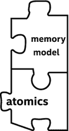

如果我们想成为优秀的并行程序员，内存一致性并不是一个深奥的概念。它是我们难题的关键部分，帮助我们确保数据在我们需要的时候出现在我们需要的地方，并且它的值是我们所期望的。这一章揭示了我们需要掌握的关键东西，以确保我们的程序正确运行。这个主题不是 SYCL 或 DPC++ 所独有的。

对编程语言的内存(一致性)模型有一个基本的理解对于任何想要允许对内存进行并发更新的*程序员来说都是必要的(无论这些更新来自同一个内核中的多个工作项、多个设备，还是两者都有)。不管内存是如何分配的，这都是正确的，无论我们选择使用缓冲区还是 USM 分配，本章的内容对我们来说都是同样重要的。*

在前面的章节中，我们已经关注了简单内核的开发，其中程序实例要么对完全独立的数据进行操作，要么使用结构化的通信模式共享数据，这些模式可以使用语言和/或库功能直接表达。随着我们向编写更复杂和更现实的内核迈进，我们很可能会遇到程序实例需要以更少结构化的方式进行通信的情况——理解内存模型如何与 DPC++ 语言特性和我们所针对的硬件功能相关联是设计正确、可移植和高效程序的必要前提。

标准 C++ 的内存一致性模型足以编写完全在主机设备上执行的应用程序，但 DPC++ 对其进行了修改，以解决在对异构系统进行编程时以及在讨论不能完全映射到 C++ 线程概念的程序实例时可能出现的复杂性。具体来说，我们需要能够

*   系统中的哪些设备可以访问哪些类型的内存分配:使用缓冲区和 USM。

*   在内核执行期间防止不安全的并发内存访问(数据竞争):使用屏障和原子。

*   启用执行相同内核的程序实例之间的安全通信和不同设备之间的安全通信:使用屏障、栅栏、原子、内存顺序和内存范围。

*   防止可能会以不符合我们预期的方式改变并行应用程序行为的优化:使用屏障、栅栏、原子、内存顺序和内存范围。

*   启用依赖于程序员意图知识的优化:使用内存顺序和内存范围。

内存模型是一个复杂的话题，但有一个很好的理由——处理器架构师关心让处理器和加速器尽可能高效地执行我们的代码！在这一章中，我们努力打破这种复杂性，突出最关键的概念和语言特征。这一章让我们不仅对内存模型了如指掌，还享受了很多人不知道的并行编程的一个重要方面。如果在阅读了这里的描述和示例代码后仍有疑问，我们强烈建议访问本章末尾列出的网站或参考 C++、SYCL 和 DPC++ 语言规范。

## 内存模型中有什么？

本节详细阐述了编程语言包含内存模型的动机，并介绍了并行程序员应该熟悉的几个核心概念:

*   数据竞争和同步

*   栅栏和围栏

*   原子操作

*   内存排序

要理解这些概念在 C++、SYCL 和 DPC++ 中的表达和用法，从高层次理解它们是必要的。在并行编程，尤其是使用 C++ 方面有丰富经验的读者可能希望跳过这一步。

### 数据竞争和同步

我们在程序中编写的*操作*通常不会直接映射到单个硬件指令或微操作。一个简单的加法操作，如`data[i] += x`，可以分解成一系列的指令或微操作:

1.  将`data[i]`从内存加载到一个临时寄存器中。

2.  计算`x`和`data[i].`相加的结果

3.  将结果存储回`data[i].`

这不是我们在开发顺序应用程序时需要担心的事情——加法的三个阶段将按照我们期望的顺序执行，如图 [19-1](#Fig1) 所示。

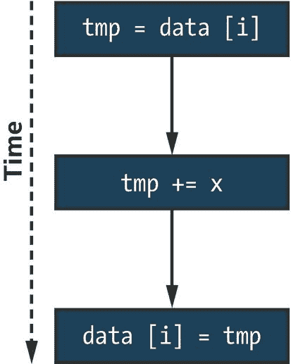

图 19-1

`data[i] += x`的顺序执行分为三个独立的操作

切换到并行应用程序开发带来了额外的复杂性:如果我们有多个操作并发地应用于相同的数据，我们如何确定他们对该数据的观点是一致的？考虑图 [19-2](#Fig2) 所示的情况，其中`data[i] += x`的两次执行已经交错。如果两次执行使用不同的`i`值，应用程序将正确执行。如果它们使用相同的`i`值，两者都从内存中加载相同的值，并且一个结果被另一个覆盖！这只是调度它们的操作的许多可能方式之一，我们的应用程序的行为取决于哪个程序实例先获得哪个数据——我们的应用程序包含一个*数据竞争*。

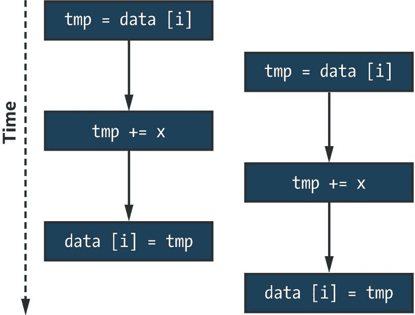

图 19-2

并发执行的`data[i] += x`的一个可能交错

图 [19-3](#Fig3) 中的代码和图 [19-4](#Fig4) 中的输出显示了这在实践中是多么容易发生。如果`M`大于等于`N`，则`j`在每个程序实例中的值是唯一的；否则，`j`的值将会冲突，更新可能会丢失。我们说*可能会丢失*,因为包含数据竞争的程序仍然可以在某些时候或所有时间产生正确的答案(取决于实现和硬件如何调度工作)。编译器和硬件都不可能知道这个程序*打算*做什么，或者`N`和`M`的值在运行时可能是什么——作为程序员，我们有责任了解我们的程序是否可能包含数据竞争，以及它们是否对执行顺序敏感。

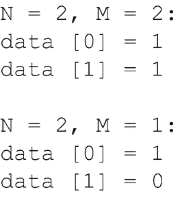

图 19-4

图 [19-3](#Fig3) 中`N`和`M`的小值代码输出示例

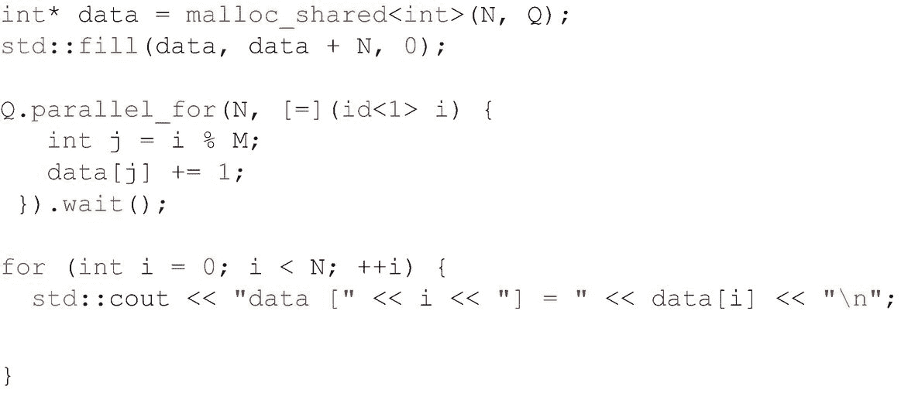

图 19-3

包含数据竞争的内核

一般来说，当开发大规模并行应用程序时，我们不应该关心单个工作项执行的确切顺序——希望有数百个(或数千个！)并发执行的工作项，试图对它们强加特定的顺序将会对可伸缩性和性能产生负面影响。相反，我们的重点应该是开发正确执行的可移植应用程序，这可以通过向编译器(和硬件)提供有关程序实例何时共享数据、共享发生时需要什么保证以及哪些执行顺序是合法的信息来实现。

大规模并行应用程序不应该关心单个工作项执行的确切顺序！

### 栅栏和围栏

防止同一组中的工作项之间的数据竞争的一种方法是使用工作组屏障和适当的内存栅栏在不同的程序实例之间引入同步。我们可以使用一个工作组屏障来排序我们对`data[i]`的更新，如图 [19-5](#Fig5) 所示，我们示例内核的更新版本如图 [19-6](#Fig6) 所示。请注意，因为工作组屏障不同步不同组中的工作项，所以只有将我们自己限制在一个工作组中，我们的简单示例才能保证正确执行！

图 19-6

使用屏障避免数据竞争

图 19-5

被屏障隔开的两个`data[i] += x`实例

虽然使用屏障来实现这种模式是可能的，但是通常并不鼓励这样做——它会强制一个组中的工作项按照特定的顺序依次执行，这可能会导致在出现负载不平衡的情况下长时间处于不活动状态。它也可能引入比严格必要的更多的同步——如果不同的程序实例碰巧使用不同的`i`值，它们仍将被迫在关卡处同步。

屏障同步是一个有用的工具，可以确保工作组或子组中的所有工作项在进入下一个阶段之前完成内核的某个阶段，但是对于细粒度(并且可能依赖于数据)同步来说太笨重了。对于更一般的同步模式，我们必须关注*原子*操作。

### 原子操作

原子操作允许对存储器位置的并发访问，而不会引入数据竞争。当多个原子操作访问同一个内存时，保证它们不会重叠。请注意，如果只有一些访问使用原子性，那么这种保证就不适用，作为程序员，我们有责任确保我们不会使用具有不同原子性保证的操作同时访问相同的数据。

同时在相同的内存位置上混合原子和非原子操作会导致未定义的行为！

如果我们的简单加法是用原子操作来表达的，结果可能如图 [19-8](#Fig8) 所示——每次更新现在都是一个不可分割的工作块，我们的应用程序将总是产生正确的结果。相应的代码如图 [19-7](#Fig7) 所示——我们将在本章后面重新讨论`atomic_ref`类及其模板参数的含义。

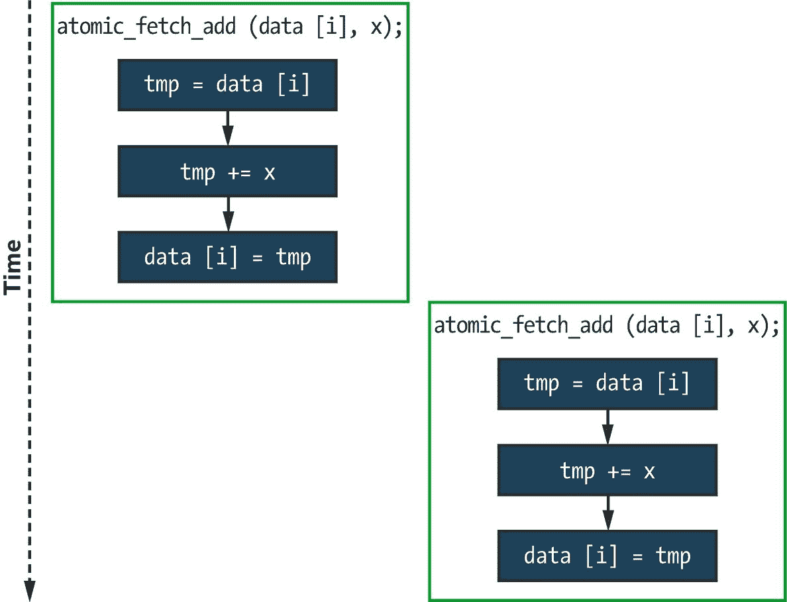

图 19-8

与原子操作同时执行的`data[i] += x`的交错

图 19-7

使用原子操作避免数据竞争

但是，需要注意的是，这仍然只是一种可能的执行顺序。使用原子操作保证了两个更新不会重叠(如果两个实例使用相同的值`i`)，但是仍然不能保证两个实例中的哪一个将首先执行。更重要的是，对于不同程序实例中的任何*非原子*操作，无法保证这些原子操作的顺序。

### 内存排序

即使在顺序应用中，如果优化编译器和硬件不改变应用的可观察行为，它们也可以自由地重新排序操作。换句话说，应用程序必须像程序员编写的那样运行。

不幸的是，这种假设保证不足以帮助我们对并行程序的执行进行推理。我们现在有两个重新排序的来源要担心:编译器和硬件可能会重新排序每个顺序程序实例中语句的执行，程序实例本身可能会以任何顺序(可能是交错的)执行。为了设计和实现程序实例之间的安全通信协议，我们需要能够约束这种重新排序。通过向编译器提供关于我们期望的*内存顺序*的信息，我们可以防止与我们的应用程序的预期行为不兼容的重新排序优化。

三种常用的内存排序是

1.  一个*放松的*记忆排序

2.  一个*获取-释放*或*释放-获取*内存排序

3.  一个*顺序一致的*内存排序

在宽松的存储器排序下，存储器操作可以被重新排序而没有任何限制。宽松内存模型最常见的用法是增加共享变量(例如，单个计数器、直方图计算期间的值数组)。

在获取-释放内存排序下，一个程序实例*释放*一个原子变量，而另一个程序实例*获取*相同的原子变量，这充当这两个程序实例之间的同步点，并保证由释放实例发出的任何先前对内存的写入对获取实例可见。非正式地，我们可以认为原子操作将其他内存操作的副作用释放给其他程序实例，或者获取内存操作对其他程序实例的副作用。如果我们希望通过内存在程序实例对之间传递值，就需要这样的内存模型，这可能比我们想象的更常见。当一个程序*获得*一个锁时，它通常会继续执行一些额外的计算，并在最终*释放*锁之前修改一些内存——只有锁变量会被自动更新，但我们希望由锁保护的内存更新能够避免数据竞争。这种行为依赖于获取-释放内存顺序来保证正确性，试图使用宽松的内存顺序来实现锁是行不通的。

在顺序一致的存储器排序下，获取-释放排序的保证仍然成立，但是另外存在所有原子操作的单个全局顺序。这种内存排序的行为是三种行为中最直观的，也是最接近我们在开发顺序应用程序时习惯依赖的原始假设保证的行为。有了顺序一致性，推理程序实例组(而不是对)之间的通信就变得容易多了，因为所有程序实例必须在所有原子操作的全局排序上达成一致。

了解编程模型和设备的组合支持哪些内存顺序是设计可移植并行应用程序的必要部分。明确描述我们的应用程序所需的内存顺序，可以确保当我们所需的行为不受支持时，它们会以可预测的方式失败(例如，在编译时)，并防止我们做出不安全的假设。

## 记忆模型

到目前为止，本章已经介绍了理解记忆模型所需的概念。本章的剩余部分详细解释了内存模型，包括

*   如何表达我们内核的内存排序需求

*   如何查询特定设备支持的内存顺序

*   关于不相交的地址空间和多个设备，存储器模型如何表现

*   记忆模型如何与障碍、栅栏和原子相互作用

*   缓冲区和 USM 之间原子操作的使用有何不同

内存模型基于标准 C++ 的内存模型，但在一些重要方面有所不同。这些差异反映了我们的长期愿景，即 DPC++ 和 SYCL 应该有助于为未来的 C++ 标准提供信息:类的默认行为和命名与 C++ 标准库紧密结合，旨在扩展标准 C++ 功能，而不是限制它。

图 [19-9](#Fig9) 中的表格总结了不同的内存模型概念如何在标准 C++ (C++11、C++14、C++17、C++20)与 SYCL 和 DPC++ 中作为语言特性公开。C++14、C++17 和 C++20 标准还包括一些影响 C++ 实现的说明。这些澄清不应该影响我们编写的应用程序代码，所以我们在这里不涉及它们。

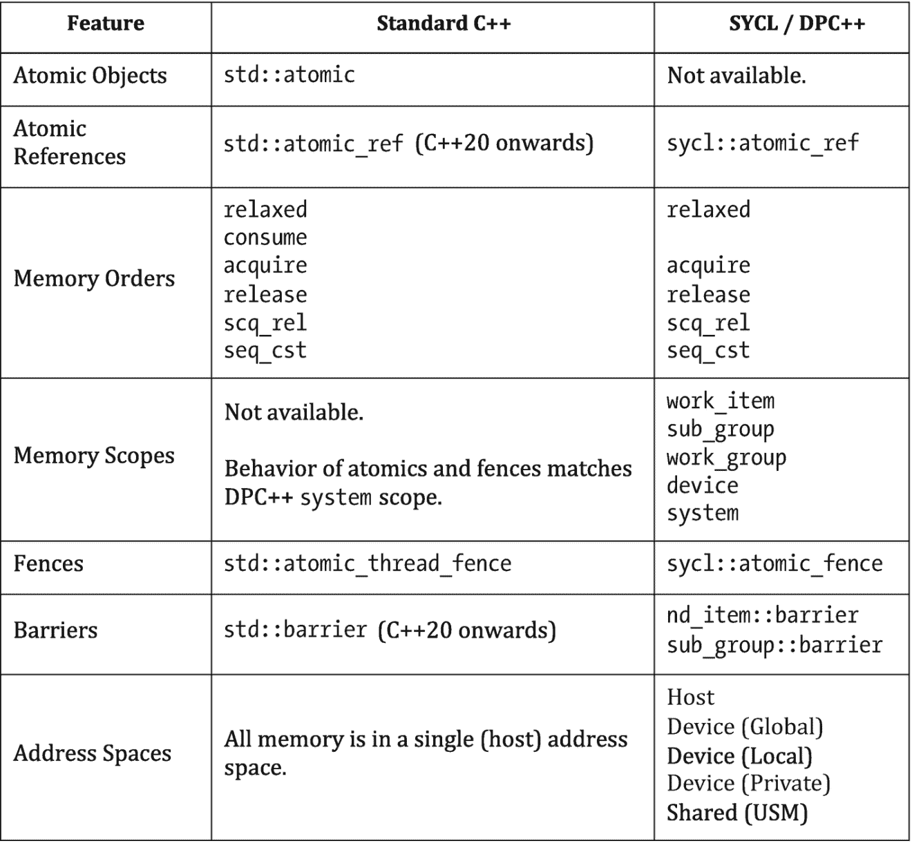

图 19-9

比较标准 C++ 和 SYCL/DPC++ 内存模型

### `memory_order`枚举类

内存模型通过`memory_order`枚举类的六个值公开了不同的内存顺序，这些值可以作为参数提供给栅栏和原子操作。为一个操作提供一个内存顺序参数，告诉编译器相对于该操作的所有其他内存操作*(对任何地址)需要什么样的内存顺序保证，如下所述:*

*   `memory_order::relaxed`

    读写操作可以在操作之前或之后重新排序，没有任何限制。没有订购保证。

*   `memory_order::acquire`

    程序中出现在操作之后的读和写操作必须发生在该操作之后(即，它们不能在操作之前重新排序)。

*   `memory_order::release`

    出现在程序中的操作之前的读和写操作必须发生在它之前(即，它们不能在操作之后被重新排序)，并且之前的写操作保证对于已经被相应的获取操作(即，使用相同变量和`memory_order::acquire`或屏障函数的原子操作)同步的其他程序实例是可见的。

*   `memory_order::acq_rel`

    该操作同时充当获取和释放。读取和写入操作不能围绕操作重新排序，必须使之前的写入可见，如之前针对`memory_order::release`所述。

*   `memory_order::seq_cst`

    根据是读、写还是读-修改-写操作，该操作分别充当获取、释放或两者。具有这种记忆顺序的所有操作都是以连续一致的顺序观察的。

每个操作支持的内存顺序有几个限制。图 [19-10](#Fig10) 中的表格总结了哪些组合是有效的。

图 19-10

用`memory_order`支持原子操作

加载操作不将值写入内存，因此与释放语义不兼容。类似地，存储操作不从内存中读取值，因此与获取语义不兼容。其余的读-修改-写原子操作和栅栏与所有存储器排序兼容。

MEMORY ORDER IN C++

C++ 内存模型还包括`memory_order::consume`，其行为类似于`memory_order::acquire`。然而，C++17 标准不鼓励使用它，指出它的定义正在被修改。因此，它在 DPC++ 中的包含被推迟到未来的版本中。

### `memory_scope`枚举类

标准 C++ 内存模型假设应用程序在具有单一地址空间的单一设备上执行。这些假设对于 DPC++ 应用程序都不成立:应用程序的不同部分在不同的设备上执行(即，主机设备和一个或多个加速器设备)；每个设备具有多个地址空间(即私有、本地和全局)；并且每个设备的全局地址空间可能不相交，也可能不相交(取决于 USM 支持)。

为了解决这个问题，DPC++ 扩展了 C++ 的内存顺序概念，以包括原子操作的*范围*，表示给定内存顺序约束适用的最小工作项集。范围集是通过一个`memory_scope`枚举类来定义的:

*   `memory_scope::work_item`

    内存排序约束仅适用于调用工作项。这个作用域只对图像操作有用，因为一个工作项中的所有其他操作已经保证按程序顺序执行。

*   `memory_scope::sub_group, memory_scope::work_group`

    内存排序约束仅适用于与调用工作项在同一子组或工作组中的工作项。

*   `memory_scope::device`

    内存排序约束仅适用于在与调用工作项相同的设备上执行的工作项。

*   `memory_scope::system`

    内存排序约束适用于系统**中的所有工作项目。**

除了设备能力所施加的限制，所有内存范围都是所有原子和隔离操作的有效参数。但是，在以下三种情况下，范围参数可能会自动降级到更窄的范围:

1.  如果一个原子操作更新了工作组本地内存中的一个值，那么任何比`memory_scope::work_group`更宽的范围都会变窄(因为本地内存只对同一工作组中的工作项可见)。

2.  如果一个设备不支持 USM，指定`memory_scope::system`总是等同于`memory_scope::device`(因为多个设备不能并发访问缓冲区)。

3.  如果一个原子操作使用`memory_order::relaxed`，没有排序保证，内存范围参数实际上被忽略了。

### 查询设备功能

为了确保与以前版本的 SYCL 支持的设备兼容并最大限度地提高可移植性，DPC++ 支持 OpenCL 1.2 设备和其他可能不支持完整 C++ 内存模型的硬件(例如，某些类别的嵌入式设备)。DPC++ 提供设备查询来帮助我们推断系统中可用设备支持的内存顺序和内存范围:

*   `atomic_memory_order_capabilities`

    `atomic_fence_order_capabilities`

    返回特定设备上原子和隔离操作支持的所有内存排序的列表。要求所有设备至少支持`memory_order::relaxed`，要求主机设备支持所有内存排序。

*   `atomic_memory_scope_capabilities`

    `atomic_fence_scope_capabilities`

    返回特定设备上原子和隔离操作支持的所有内存范围的列表。要求所有设备至少支持`memory_order::work_group`，要求主机设备支持所有内存范围。

起初可能很难记住功能和设备能力的哪些组合支持哪些存储器顺序和范围。在实践中，我们可以通过遵循下面概述的两种开发方法之一来避免这种复杂性:

1.  开发具有顺序一致性和系统防护的应用程序。

    仅考虑在性能调优期间采用不太严格的内存顺序。

2.  用宽松的一致性和工作组界限开发应用程序。

    只有在正确性需要时，才考虑采用更严格的内存顺序和更宽的内存范围。

第一种方法确保所有原子操作和栅栏的语义与标准 C++ 的默认行为相匹配。这是最简单、最不容易出错的选项，但是具有最差的性能和可移植性。

第二种方法更符合以前版本的 SYCL 和 OpenCL 等语言的默认行为。虽然更复杂——因为它要求我们更加熟悉不同的内存顺序和范围——但它确保了我们编写的大部分 DPC++ 代码可以在任何设备上工作，而不会影响性能。

### 栅栏和围栏

到目前为止，本书中所有以前使用的障碍和栅栏都忽略了记忆顺序和范围的问题，依赖于默认行为。

DPC++ 中的每个组屏障都充当调用工作项可访问的所有地址空间的获取-释放栅栏，并使之前的写入至少对同一组中的所有其他工作项可见。这确保了一个障碍后一组工作项中的内存一致性，符合我们对同步含义的直觉(以及 C++ 中的 *synchronizes-with* 关系的定义)。

`atomic_fence`函数给了我们比这更细粒度的控制，允许工作项以指定的内存顺序和范围执行栅栏。在 DPC++ 的未来版本中，组栅栏可能同样接受可选参数来调整与栅栏相关联的获取-释放栅栏的内存范围。

### DPC++ 中的原子操作

DPC++ 支持对各种数据类型的多种原子操作。所有器件都保证支持常见操作的原子版本(例如加载、存储、算术运算符)，以及实现无锁算法所需的原子*比较和交换*操作。该语言为所有基本整数、浮点和指针类型定义了这些操作，所有设备都必须支持 32 位类型的这些操作，但 64 位类型的支持是可选的。

#### `atomic`类

C++11 的`std::atomic`类提供了一个创建和操作原子变量的接口。原子类的实例拥有自己的数据，不能移动或复制，只能使用原子操作进行更新。这些限制大大减少了错误使用该类和引入未定义行为的机会。不幸的是，它们也阻止了该类在 DPC++ 内核中的使用——不可能在主机上创建原子对象并将它们传输到设备上！我们可以继续在我们的主机代码中使用`std::atomic`,但是试图在设备内核中使用它会导致编译错误。

ATOMIC CLASS DEPRECATED IN SYCL 2020 AND DPC++

SYCL 1.2.1 规范包含一个`cl::sycl::atomic`类，它松散地基于 C++11 的`std::atomic`类。我们笼统地说*为*，因为这两个类的接口之间存在一些差异，最明显的是 SYCL 1.2.1 版本不拥有自己的数据，默认采用宽松的内存排序。

DPC++ 完全支持`cl::sycl::atomic`类，但是为了避免混淆，不鼓励使用它。我们建议使用`atomic_ref`类(将在下一节中介绍)来代替它。

#### `atomic_ref`类

C++20 的`std::atomic_ref`类为原子操作提供了另一个接口，它比`std::atomic`提供了更大的灵活性。这两个类最大的区别是`std::atomic_ref`的实例不拥有它们的数据，而是从一个现有的非原子变量中构造的。创建原子引用实际上是一种承诺，即在引用的生命周期内，被引用的变量只能被原子地访问。这些正是 DPC++ 所需要的语义，因为它们允许我们在主机上创建非原子数据，将这些数据传输到设备上，并且只有在传输之后才将其视为原子数据。因此，DPC++ 内核中使用的`atomic_ref`类是基于`std::atomic_ref`的。

我们说*是基于*，因为该类的 DPC++ 版本包括三个额外的模板参数，如图 [19-11](#Fig11) 所示。

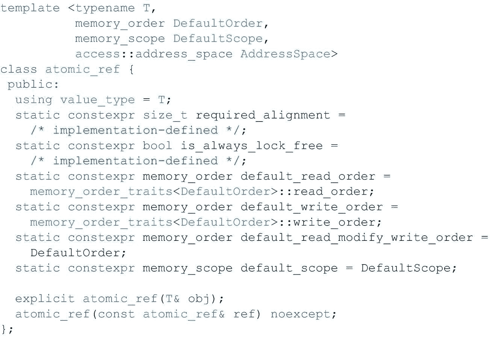

图 19-11

`atomic_ref`类的构造器和静态成员

如前所述，不同的 DPC++ 设备的功能各不相同。为 DPC++ 的原子类选择默认行为是一个困难的命题:默认标准 C++ 行为(即`memory_order::seq_cst, memory_scope::system`)将代码限制为只能在最有能力的设备上执行；另一方面，打破 C++ 惯例，默认使用最小公分母(即`memory_order::relaxed, memory_scope::work_group`)可能会导致在迁移现有 C++ 代码时出现意外行为。DPC++ 采用的设计提供了一个折衷方案，允许我们将我们想要的默认行为定义为对象类型的一部分(使用`DefaultOrder`和`DefaultScope`模板参数)。其他排序和作用域可以作为运行时参数提供给我们认为合适的特定原子操作——`DefaultOrder`和`DefaultScope`只影响我们没有或不能覆盖默认行为的操作(例如，当使用像`+=`这样的简写操作符时)。最后一个模板参数表示被引用对象所分配的地址空间。

原子引用根据其引用的对象类型为不同的操作提供支持。图 [19-12](#Fig12) 显示了所有类型支持的基本操作，提供了将数据自动移入和移出内存的能力。

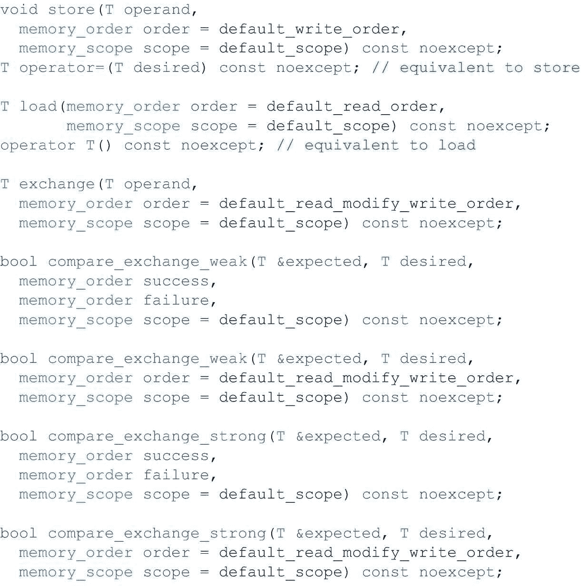

图 19-12

用`atomic_ref`对所有类型进行基本操作

对整型和浮点型对象的原子引用扩展了可用的原子操作集，以包括算术运算，如图 [19-13](#Fig13) 和 [19-14](#Fig14) 所示。要求设备支持原子浮点类型，而不管它们在硬件中是否具有对浮点原子的本机支持，并且许多设备被期望使用原子比较交换来模拟原子浮点加法。这种模拟是在 DPC++ 中提供性能和可移植性的一个重要部分，只要算法需要，我们就可以在任何地方自由使用浮点原子——生成的代码将在任何地方都能正确工作，并将受益于浮点原子硬件的未来改进，而无需任何修改！

图 19-14

使用`atomic_ref`的附加操作仅适用于浮点类型

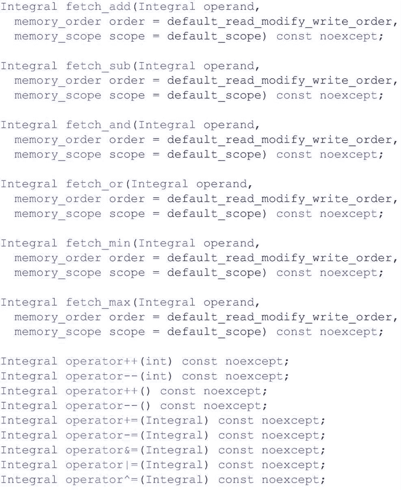

图 19-13

使用`atomic_ref`的附加操作仅适用于整型

#### 使用带缓冲区的原子

正如上一节所讨论的，在 DPC++ 中没有办法分配原子数据并在主机和设备之间移动它。要将原子操作与缓冲区结合使用，我们必须创建一个非原子数据的缓冲区，然后通过原子引用访问该数据。

图 19-15

通过显式创建的`atomic_ref`访问缓冲区

图 [19-15](#Fig15) 中的代码是一个使用显式创建的原子引用对象在 DPC++ 中表达原子性的例子。缓冲区存储普通整数，我们需要一个具有读写权限的访问器。然后，我们可以为每个数据访问创建一个`atomic_ref`实例，使用`+=`操作符作为`fetch_add`成员函数的简写替代。

如果我们希望在同一个内核中混合对缓冲区的原子和非原子访问，以避免在不需要原子操作时支付原子操作的性能开销，这种模式非常有用。如果我们知道缓冲区中只有一个内存位置的子集将被多个工作项同时访问，那么我们只需要在访问那个子集时使用原子引用。或者，如果我们知道同一工作组中的工作项仅在内核的一个阶段(即，在两个工作组屏障之间)并发访问本地存储器，那么我们只需要在该阶段使用原子引用。

有时我们很乐意为每次访问支付原子性的开销，要么是因为每次访问都必须是原子性的，以保证正确性，要么是因为我们对生产率比对性能更感兴趣。对于这种情况，DPC++ 提供了一种声明访问器必须总是使用原子操作的简写方式，如图 [19-16](#Fig16) 所示。

图 19-16

通过原子访问器隐式创建的`atomic_ref`访问缓冲区

缓冲区像以前一样存储普通的整数，但是我们用一个特殊的`atomic_accessor`类型替换了常规的访问器。使用这种原子访问器会自动使用原子引用包装缓冲区的每个成员，从而简化内核代码。

直接使用原子引用类还是通过访问器使用原子引用类是最好的，这取决于我们的用例。为了在原型开发和初始开发过程中简单起见，我们的建议是从访问器开始，只有在性能调优过程中有必要时(例如，如果分析显示原子操作是性能瓶颈)或者只有在定义明确的内核阶段(例如，在本章后面的直方图代码中)才需要原子性时，才使用更显式的语法。

#### 在统一共享内存中使用原子

如图 [19-17](#Fig17) (转载自图 [19-7](#Fig7) )所示，我们可以从 USM 中存储的数据中构造原子引用，就像我们对缓冲区所做的一样。事实上，这段代码与图 [19-15](#Fig15) 所示代码的唯一区别在于 USM 代码不需要缓冲区或存取器。

图 19-17

通过显式创建的`atomic_ref`访问 USM 分配

没有办法只使用标准的 DPC++ 特性来模仿原子访问器为 USM 指针提供的速记语法。然而，我们期望 DPC++ 的未来版本将提供一个建立在为 C++23 提出的`mdspan`类之上的简写。

## 在现实生活中使用原子

原子的潜在用法如此广泛和多样，以至于我们不可能在本书中提供每种用法的例子。我们提供了两个具有代表性的例子，它们在各个领域都有广泛的适用性:

1.  计算直方图

2.  实现设备范围的同步

### 计算直方图

图 [19-18](#Fig18) 中的代码演示了如何使用宽松原子结合工作组障碍来计算直方图。屏障将内核分为三个阶段，每个阶段都有自己的原子性需求。请记住，屏障同时充当同步点和获取-释放栅栏——这确保了一个阶段中的任何读取和写入对于后面阶段中工作组中的所有工作项都是可见的。

第一阶段将一些工作组本地内存的内容设置为零。每个工作组中的工作项通过设计来更新工作组本地内存中的独立位置——不会出现竞争情况，并且不需要原子性。

第二阶段在本地存储器中累积部分直方图结果。同一个工作组中的工作项可能会更新工作组本地内存中的相同位置，但是同步可以推迟到阶段结束时——我们可以使用`memory_order::relaxed`和`memory_scope::work_group`来满足原子性需求。

第三阶段将部分直方图结果贡献给存储在全局存储器中的总数。相同工作组中的工作项保证从工作组本地内存中的独立位置读取，但是可以更新全局内存中的相同位置——我们不再需要工作组本地内存的原子性，并且可以像以前一样使用`memory_order::relaxed`和`memory_scope::system`来满足全局内存的原子性要求。

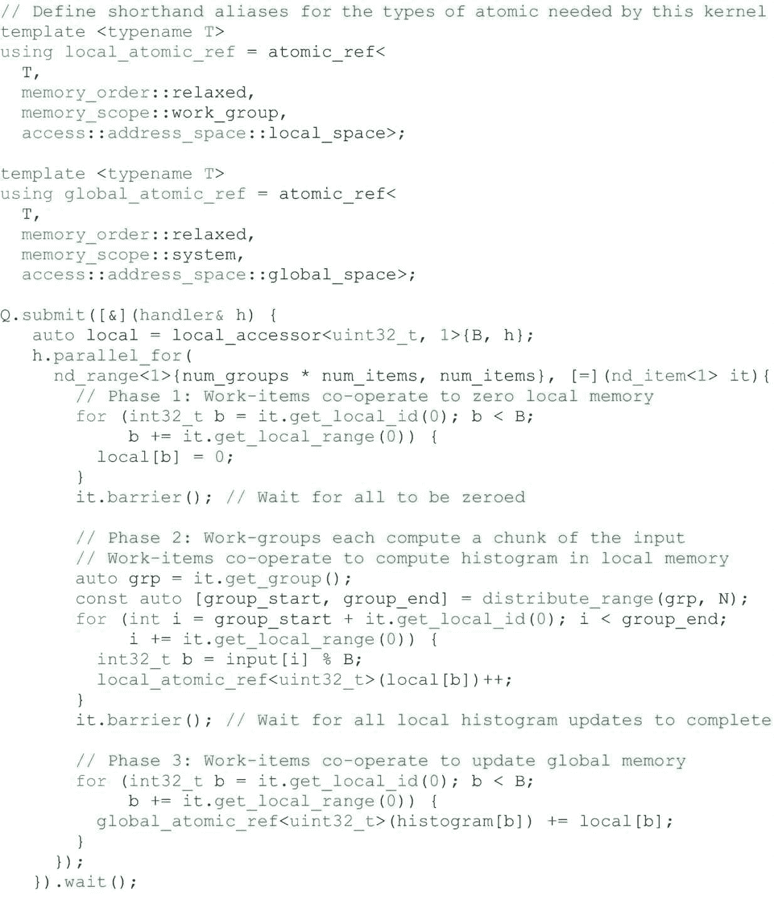

图 19-18

使用不同存储空间中的原子引用计算直方图

### 实现设备范围的同步

回到第 4 章，我们警告过不要编写试图跨工作组同步工作项目的内核。然而，我们完全期望本章的几个读者将渴望在原子操作之上实现他们自己的设备范围的同步例程，并且我们的警告将被忽略。

设备范围的同步目前是不可移植的，最好留给专业程序员。该语言的未来版本将解决这个问题。

本节中讨论的代码是危险的，不应该期望在所有设备上都能工作，因为在调度和并发保证方面存在潜在的差异。由原子提供的存储器排序保证与前向进度保证正交；而且，在撰写本文时，SYCL 和 DPC++ 中的工作组调度完全是由实现定义的。形式化讨论执行模型和调度保证所需的概念和术语是当前活跃的学术研究领域，DPC++ 的未来版本有望在此基础上提供额外的调度查询和控制。目前，这些话题应该被认为是专家专有的。

图 [19-19](#Fig19) 显示了一个简单的设备范围闩锁(一个一次性栅栏)的实现，图 [19-20](#Fig20) 显示了其使用的一个简单例子。每个工作组选择一个工作项来通知该组到达闩锁处，并使用一个简单的旋转循环等待其他组的到达，而其他工作项使用工作组屏障等待所选择的工作项。正是这种自旋循环使得设备范围的同步不安全；如果任何工作组还没有开始执行，或者当前正在执行的工作组没有得到公平的调度，代码可能会死锁。

在没有独立的前向进度保证的情况下，仅仅依靠内存顺序来实现同步原语可能会导致死锁！

为了使代码正确工作，必须满足以下三个条件:

1.  原子操作必须使用至少与所示一样严格的内存顺序，以保证生成正确的栅栏。

2.  ND 范围中的每个工作组必须能够向前进展，以避免循环中旋转的单个工作组使尚未递增计数器的工作组饥饿。

3.  The device must be capable of executing all work-groups in the ND-range concurrently, in order to ensure that all work-groups in the ND-range eventually reach the latch.

    

    图 19-20

    使用图 [19-19](#Fig19) 中的全设备锁

    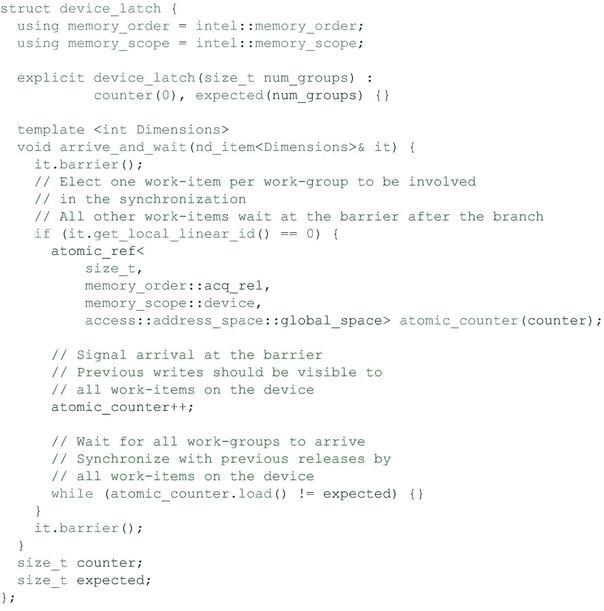

    图 19-19

    在原子引用的基础上构建一个简单的设备级锁存器

虽然不能保证这段代码是可移植的，但我们在这里包含它是为了强调两个要点:1) DPC++ 的表达能力足以支持特定于设备的调优，有时会牺牲可移植性；以及 2) DPC++ 已经包含了实现高级同步例程所必需的构件，这些构件可能包含在该语言的未来版本中。

## 摘要

本章提供了对内存模型和原子类的高级介绍。了解如何使用(以及如何不使用！)这些类是开发正确的、可移植的和高效的并行程序的关键。

内存模型是一个极其复杂的主题，我们在这里的重点是为编写真正的应用程序建立一个基础。如果需要更多的信息，有几个网站、书籍和讲座专门介绍下面提到的记忆模型。

### 更多信息

*   A.Williams， *C++ 并发在行动:实用多线程*，Manning，2012，978-1933988771

*   H.萨特，《原子<>武器:C++ 内存模型和现代硬件》， [`https://herbsutter.com/2013/02/11/atomic-weapons-the-c-memory-model-and-modern-hardware/`](https://herbsutter.com/2013/02/11/atomic-weapons-the-c-memory-model-and-modern-hardware/)

*   H-J. Boehm，《暂时劝阻`memory_order_consume,`[`http://wg21.link/p0371`](http://wg21.link/p0371)

*   C++ 参考，“`std::atomic,`”

    [T2`https://en.cppreference.com/w/cpp/atomic/atomic`](https://en.cppreference.com/w/cpp/atomic/atomic)

*   C++ 参考，“`std::atomic_ref,`”

    [T2`https://en.cppreference.com/w/cpp/atomic/atomic_ref`](https://en.cppreference.com/w/cpp/atomic/atomic_ref)

 

**开放存取**本章根据知识共享署名 4.0 国际许可证(http://Creative Commons . org/licenses/by/4.0/)的条款获得许可，该许可证允许以任何媒体或格式使用、共享、改编、分发和复制，只要您适当注明原作者和来源，提供知识共享许可证的链接并指明是否进行了更改。

本章中的图像或其他第三方材料包含在本章的知识共享许可中，除非在材料的信用额度中另有说明。如果材料不包括在本章的知识共享许可中，并且您的预期使用不被法律法规允许或超出了允许的使用范围，您将需要直接从版权所有者处获得许可。