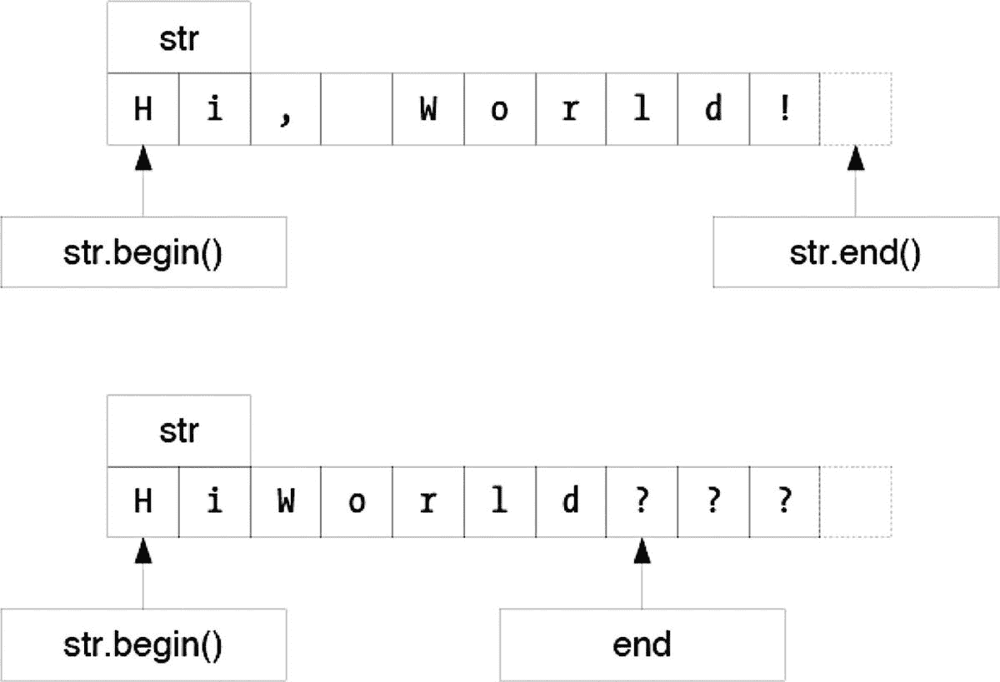

# 二十三、使用迭代器

在前面的探索中，您已经看到了范围适配器和范围算法是如何工作的。大多数范围算法，比如`sort()`，很可能是在基于迭代器的算法之上实现的。即使在处理范围时，您仍然需要使用迭代器，比如`ostream_iterator`。有时候，迭代器比范围更容易使用，比如初始化一个向量。这个探索访问了迭代器和算法，它们提供了范围的替代方案。

## 转换数据

您读过和写过的几个程序都有一个共同的主题:复制一个数据序列，比如一个`vector`或`string`，并对每个元素应用某种转换(转换成小写，将数组中的值加倍，等等)。标准算法`transform`非常适合对序列元素进行任意复杂的转换。

例如，回想一下清单 10-5，它将一个数组中的所有值加倍。清单 [23-1](#PC1) 展示了一种新的方式来编写同样的程序，但是使用了`transform`。

```cpp
import <algorithm>;
import <iostream>;
import <iterator>;
import <vector>;

int times_two(int i)
{
  return i * 2;
}

int plus_three(int i)
{
  return i + 3;
}

int main()
{
   std::vector<int> data{std::istream_iterator<int>(std::cin),
                         std::istream_iterator<int>()};

   std::transform(data.begin(), data.end(), data.begin(), times_two);
   std::transform(data.begin(), data.end(), data.begin(), plus_three);

   std::copy(data.begin(), data.end(),
             std::ostream_iterator<int>(std::cout, "\n"));
}

Listing 23-1.Calling transform to Apply a Function to Each Element of an Array

```

`transform`函数有四个参数:前两个指定输入范围(作为开始迭代器和结束迭代器)，第三个参数是写迭代器，最后一个参数是函数名。像其他基于迭代器的算法一样，`transform`在`<algorithm>`头中声明。

关于第三个参数，通常，您有责任确保输出序列有足够的空间来容纳转换后的数据。在这种情况下，转换后的数据会覆盖原始数据，因此输出范围的起点与输入范围的起点相同。第四个参数只是您必须在源文件中声明或定义的函数的名称。在这个例子中，函数接受一个`int`参数并返回一个`int`。`transform`函数的一般规则是它的参数类型必须匹配输入类型，也就是读迭代器引用的元素的类型。返回值必须匹配输出类型，即结果迭代器引用的类型。`transform`算法为输入范围内的每个元素调用一次该函数。它将函数返回的值复制到输出范围。

请注意，这个版本的程序为了应用两个转换，在这个范围上做了额外的处理。该程序的范围版本可以一次完成两种转换。为了进行一次传递，你需要一个函数，所以你可以写一个函数乘以 2，然后加上 3。在接下来的探索中，你会学到更好的方法来做同样的事情。

重写字数统计程序很简单。该程序基本上与清单 [22-2](22.html#PC4) 相同。不同的是`sanitize()`函数。清单 [22-3](22.html#PC5) 显示了范围版本。清单 [23-2](#PC2) 显示了迭代器版本。

```cpp
/** Test whether to keep a letter.
 * @param ch the character to test
 * @return true to keep @p ch because it may be a character that makes up a word
 */
bool keep(char ch)
{
  return std::isalnum(ch, std::locale{});
}

/** Convert to lowercase.
 * @param ch the character to test
 * @return the character converted to lowercase
 */
char lowercase(char ch)
{
  return std::tolower(ch, std::locale{});
}

/** Sanitize a string by keeping only alphabetic characters.
 * @param str the original string
 * @return a sanitized copy of the string
 */
std::string sanitize(std::string_view str)
{
  std::string result{};
  std::copy_if(str.begin(), str.end(), std::back_inserter(result), keep);
  std::transform(result.begin(), result.end(), result.begin(), lowercase);
  return result;
}

Listing 23-2.Sanitizing a String by Transforming and Filtering It

```

`copy_if`函数充当过滤器，只复制通过谓词的字符。然后，这些字符被添加到结果字符串中。但是在返回之前，结果字符串被就地转换为小写。如你所见，`sanitize()`的迭代器版本还不错。这是清晰和直接的，尽管有大量的重复和噪音，稍微干扰了清晰度。该函数再次对数据进行额外的传递。使用迭代器避免额外的传递比使用范围更困难。

`sanitize()`函数的另一种工作方式是传递一个`std::string`而不是一个`string_view`。如前所述，这需要复制字符串，但是`sanitize`函数已经在做了。让我们来看看如果给它一个`string`它会如何工作。

不是过滤，而是必须从字符串中删除非字母。然后就可以就地转化了，这个我们已经知道怎么做了。`remove_if()`算法似乎删除了匹配谓词的字符，但是真的是这样吗？

图 [23-1](#Fig1) 展示了`remove_if()`如何在之前的*和*之后的*下工作。注意`remove_if()`函数没有改变字符串的大小。相反，它会重新排列字符串，使其看起来删除了字符，并返回必须是字符串新结尾的位置。但是迭代器不能修改字符串的大小，所以这取决于调用者。在这方面，使用迭代器可能很笨拙。*



图 23-1。

从序列中移除元素

字符串末尾剩下的字符呢？他们是垃圾。这就是为什么你必须在`remove_if()`之后调用`erase()`。看看清单 [23-3](#PC3) ，看看`remove_if()`在代码中是如何工作的。

```cpp
/** Test for non-letter.
 * @param ch the character to test
 * @return true if @p ch is not a character that makes up a word
 */
bool non_letter(char ch)
{
  return not std::isalnum(ch, std::locale());
}

/** Convert to lowercase.
 * Use a canonical form by converting to uppercase first,
 * and then to lowercase.
 * @param ch the character to test
 * @return the character converted to lowercase
 */
char lowercase(char ch)
{
  return std::tolower(ch, std::locale());
}

/** Sanitize a string by keeping only alphabetic characters.
 * @param str the original string
 * @return a sanitized copy of the string
 */
std::string sanitize(std::string str)
{
  // Remove all non-letters from the string, and then erase them.
  str.erase(std::remove_if(str.begin(), str.end(), non_letter),
            str.end());

  // Convert the remnants of the string to lowercase.
  std::transform(str.begin(), str.end(), str.begin(), lowercase);

  return str;
}

Listing 23-3.Sanitizing a String by Transforming It

```

`erase`成员函数将两个迭代器作为参数，并删除该范围内的所有元素。`remove_if`函数返回一个迭代器，它指向新的`string`末尾之后的一个迭代器，这意味着它也指向要删除的元素的第一个位置。在范围结束时传递`str.end()`指示`erase`去掉所有被删除的元素。

移除/擦除习惯用法在 C++ 中很常见，所以你应该习惯于看到它，至少在每个人都开始使用 C++ 20 范围之前。标准库有几个类似 remove 的函数，它们都以相同的方式工作。习惯这种方法需要一点时间，但是一旦你习惯了，你会发现它非常容易使用。

## 用迭代器排序

现在您已经看到了迭代器是如何工作的，应该很容易**修改清单** [**22-4**](22.html#PC6) **来使用迭代器而不是范围**。将您的解决方案与清单 [23-4](#PC4) 进行比较。

```cpp
import <algorithm>;
import <iostream>;
import <iterator>;
import <vector>;

/** Predicate for sorting into descending order. */
int descending(int a, int b)
{
  return a > b;
}

int main()
{
  std::vector<int> data{ std::istream_iterator<int>(std::cin),
                         std::istream_iterator<int>() };

  std::sort(data.begin(), data.end(), descending);

  std::copy(data.begin(), data.end(), std::ostream_iterator<int>(std::cout, "\n"));
}

Listing 23-4.Sorting into Descending Order

```

将范围扩展为开始/结束对是一个简单的转换。回文的例子呢？这有多简单？**转换清单** [**22-5**](22.html#PC7) **来使用迭代器**。

这更难。迭代器没有过滤。像`copy_if`这样的算法必须将复制的字符存储在某个地方。使用迭代器算法需要创建一个新的字符串。或者，你可以完全跳过算法，只使用迭代器。清单 [23-5](#PC5) 展示了我版本的使用反向迭代器的`is_palindrome()`函数。

```cpp
/** Determine whether @p str is a palindrome.
 * Only letter characters are tested. Spaces and punctuation don't count.
 * @param str the string to test
 * @return true if @p str is the same forward and backward
 */
bool is_palindrome(std::string_view str)
{
  if (str.empty())
    return true;
  for (auto left{str.begin()}, right{str.end() - 1}; left < right;) {
    if (not letter(*left))
      ++left;
    else if (not letter(*right))
      --right;
    else if (lowercase(*left) != lowercase(*right))
      return false;
    else {
      ++left;
      --right;
    }
  }
  return true;
}

Listing 23-5.Testing for Palindromes

```

通过立即消除空字符串，`for`循环可以用`end() - 1`初始化`right`，即实际最后一个字符的位置。每次循环时，`left`或`right`迭代器都会向前移动，直到都指向字母。然后比较字母，移动迭代器。如果字符串有偶数个字母，迭代器可能会相互传递，但是只要它们指向字符串中的有效位置，就可以安全地使用`<`操作符。

在大型程序中，谓词或转换函数可能在远离其使用位置的地方被声明。通常，一个谓词只使用一次。仅仅为这个谓词定义一个函数，会使你的程序更难理解。人类读者必须阅读所有代码，以确保谓词真正只在一个地方被调用。如果 C++ 提供了一种在使用谓词的地方编写谓词的方法，从而避免这些问题，那就太好了。阅读下一篇探索，了解如何在 C++ 20 中实现这一点。