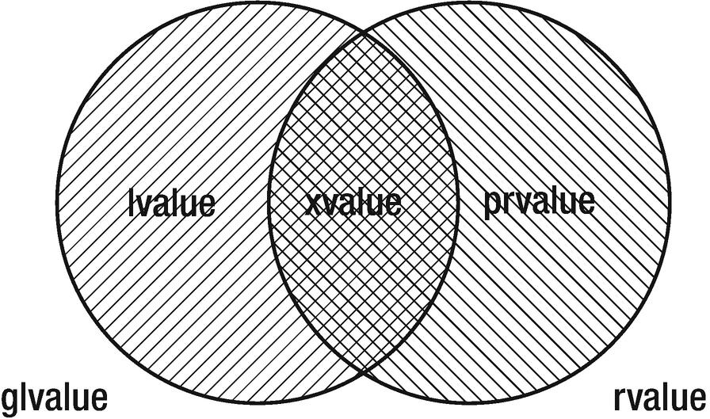

# 六十四、移动带有右值引用的数据

在 Exploration [40](40.html) 中，我介绍了`std::move()`，但没有解释它真正做了什么或如何工作。不知何故，它将数据(如字符串)从一个变量移动到另一个变量，而不是复制字符串内容，但您一定想知道它是如何创造奇迹的。这个函数本身非常简单。这个简单实现背后的概念更加复杂，这就是为什么我一直等到现在才介绍其中的复杂性和微妙之处。

## 复制与移动

如您所知，std::vector 类型存储一个值数组。随着向 vector 添加更多的值，它可能需要分配一个新的数组来保存更多的值。当这种情况发生时，它必须将旧数组复制到新数组中。如果值是大对象，这可能是一个昂贵、耗时的操作。但是，如果值类型允许，vector 将移动这些值，而不是复制它们。想象一下，如果你买了一本*战争与和平*，你必须复制它的内容才能把书带回家，而不是把它从书店搬到家里。

诀窍是编译器知道什么时候可以移动数据，什么时候必须复制数据。例如，普通的赋值需要创建一个赋值源的副本，所以赋值的目标最终得到了源的精确副本。将参数传递给函数也需要制作参数的副本，除非该参数被声明为引用类型。

但有时，函数参数是临时的，编译器知道它是临时的。编译器知道它不必从临时对象中复制数据。临时的即将被摧毁；它不需要保留自己的数据，因此可以将数据移动到目标位置，而无需拷贝。

为了帮助您直观地看到对象被复制时会发生什么，让我们创建一个新的类来包装`std::string`并向您显示它的复制构造器和赋值操作符何时被调用。然后创建一个小程序，从`std::cin`中读取字符串，并将它们添加到一个向量中。**编写程序**，将你的程序与清单 [64-1](#PC1) 中我的程序进行比较。

```cpp
import <iostream>;
import <string>;
import <vector>;

class mystring : public std::string
{
public:
   mystring() : std::string{} { std::cout << "mystring()\n"; }
   mystring(mystring const& copy) : std::string{copy} {
      std::cout << "mystring copy(\"" << *this << "\")\n";
   }
};

std::vector<mystring> read_data()
{
   std::vector<mystring> strings{};
   mystring line{};
   while (std::getline(std::cin, line))
      strings.push_back(line);
   return strings;
}

int main()
{
   std::vector<mystring> strings{};
   strings = read_data();
}

Listing 64-1.Exposing How Strings Are Copied

```

试着用几行输入运行程序。**每个字符串被复制多少次？** ______ 程序将`line`复制到`push_back()`中的矢量中。当编译器将`strings`变量返回给调用者时，它知道自己不必复制向量。它可以移动它。因此，你不会得到任何额外的副本。

怎样才能减少字符串被复制的次数？`line`变量存储临时数据。程序没有理由在调用`push_back()`后保留`line`中的值。所以我们知道将字符串内容从`line`移到`data`是安全的。调用`std::move()`告诉编译器可以将字符串移入向量。您还必须向`mystring`添加一个移动构造器。参见清单 [64-2](#PC2) 中的新程序。现在每个字符串被复制了多少次？ ______

```cpp
import <iostream>;
import <string>;
import <utility>;
import <vector>;

class mystring : public std::string
{
public:
   mystring() : std::string{} { std::cout << "mystring()\n"; }
   mystring(mystring const& copy) : std::string{copy} {
      std::cout << "mystring copy(\"" << *this << "\")\n";
   }
   mystring(mystring&& move) noexcept
   : std::string{std::move(move)} {
      std::cout << "mystring move(\"" << *this << "\")\n";
   }
};

std::vector<mystring> read_data()
{
   std::vector<mystring> strings{};
   mystring line{};
   while (std::getline(std::cin, line))
      strings.emplace_back(std::move(line));
   return strings;
}

int main()
{
   std::vector<mystring> strings;
   strings = read_data();
}

Listing 64-2.Moving Strings Instead of Copying Them

```

新的构造器用一个双&符号(`&&`)声明它的参数。它看起来有点像参考文献。注意参数不是`const`。这是因为从一个对象移动数据必然会修改该对象。最后，回想一下 Exploration [48](48.html) 中的`noexcept`说明符告诉编译器，构造器不能抛出异常。还要注意的是，`mystring`构造器调用`std::move()`将其参数移入`std::string`构造器。您必须为任何命名的对象调用`std::move()`，即使该对象是一个特殊的`&&`引用。

确切的输出取决于你的库的实现，但是大多数从 vector 的少量内存开始，并且开始时增长缓慢，以避免浪费内存。因此，只需添加几个字符串，就可以揭示 vector 在重新分配数组时是如何移动或复制字符串的。表 [64-1](#Tab1) 显示了当我提供三路输入时，列表 [64-1](#PC1) 和列表 [64-2](#PC2) 的输出。

表 64-1。

比较清单 [64-1](#PC1) 和清单 [64-2](#PC2) 的输出

<colgroup><col class="tcol1 align-left"> <col class="tcol2 align-left"></colgroup> 
| 

清单 60-1

 | 

清单 60-2

 |
| --- | --- |
| `mystring()``mystring copy("one")``mystring copy("two")``mystring copy("one")``mystring copy("three")``mystring copy("two")``mystring copy("one")` | `mystring()``mystring move("one")``mystring move("two")``mystring move("one")``mystring move("three")``mystring move("two")``mystring move("one")` |

本文的其余部分解释了 C++ 如何实现这种移动功能。

## 左值、右值等等

回想一下 Exploration [21](21.html) 中的内容，表达式分为两类:左值或右值。非正式地，左值可以出现在赋值的左边，右值出现在右边。至少这是“l”和“r”名字的由来。更具体地说，左值有标识符，存储在内存中的某个地方。右值不一定要有这两者，尽管它们可能有。向函数传递参数类似于赋值:函数参数扮演左值的角色，参数是右值。

区分左值和右值的一个关键方法是你可以获取左值的地址(使用操作符`&`)。编译器不让你获取一个右值的地址，这是有意义的。42 的地址是什么？

编译器会在必要时自动将左值转换为右值，比如将左值作为参数传递给函数，或者将左值用作赋值的右侧。编译器将右值转换为左值的唯一情况是左值的类型是对`const`的引用。例如，一个将其参数声明为`std::string const&`的函数可以将一个右值`std::string`作为参数，编译器将该右值转换为左值。但是除了那种情况，你不能把右值变成左值。

当考虑对象的生存期时，左值和右值之间的区别很重要。您知道变量的作用域决定了它的生存期，所以任何有名称的左值(例如，变量或函数参数)的生存期都由名称的作用域决定。另一方面，右值是暂时的。除非您将名称绑定到该右值(记住名称的类型必须是对`const`的引用)，否则编译器会尽快销毁临时对象。

例如，在下面的表达式中，创建了两个临时的`std::string`对象，然后传递给`operator+`来连接字符串。`operator+`函数将其`std::string const&`参数绑定到相应的参数，从而保证这些参数至少在函数返回之前有效。`operator+`函数返回一个新的临时`std::string`，然后打印到`std::cout`:

```cpp
std::cout << std::string("concat") + std::string("enate");

```

一旦语句执行完毕，临时的`std::string`对象就可以被销毁。`std::move()`函数可以让你区分对象的生命周期和它包含的数据，比如组成一个字符串的字符或者一个向量的元素。该函数接受一个左值(其生存期由作用域决定),并将其转换为右值，因此内容可以被视为临时的。因此，在清单 [64-1](#PC1) 中，`line`的寿命由作用域决定。但是在清单 [64-2](#PC2) 中，通过调用`std::move()`，您说将`line`的字符串内容视为临时是安全的。

因为`std::move()`将左值转换为右值，所以返回类型(使用双&符号)被称为*右值引用*。`mystring` move 构造器的参数也使用双&符号，所以它们的类型是右值引用。单个&符号引用类型称为左值引用，以便与右值引用明确区分开来。

术语上有些混乱，带有右值引用类型的表达式既属于右值表达式范畴，也属于左值范畴。为了减少混淆，给这种表达式起了一个特殊的名字: *xvalue* ，表示“过期值”。也就是说，表达式仍然是一个左值，可以出现在赋值的左边，但它也是一个右值，因为它接近了生命周期的末尾，所以您可以随意窃取它的内容。

不是 xvalues 的右值有不同的名字:*纯右值*，或 *prvalue* 。纯右值是诸如数值、算术表达式、函数调用(如果返回类型不是引用类型)等表达式。完全缺乏对称性，就没有纯粹的左值。取而代之的是，*左值*这一术语用于表示不是 x 值的左值类。新术语*广义左值*，或 *glvalue* ，适用于所有左值和 x 值。图 [64-1](#Fig1) 描述了各种表达式类别。



图 64-1。

表达式类别

所以结果是`std::move()`实际上是一个微不足道的函数。它将左值引用作为参数，并将其转换为右值引用。这种差异对于编译器处理表达式的方式很重要，但是`std::move()`不生成任何代码，对性能没有影响。

总结一下:

*   调用返回左值引用类型的函数会返回左值类别的表达式。

*   调用返回右值引用类型的函数会返回类别 xvalue 的表达式。

*   调用返回非引用类型的函数会返回类别 prvalue 的表达式。

*   编译器将右值(xvalue 或 prvalue)参数与右值引用类型的函数参数进行匹配。它将左值参数与左值引用相匹配。

*   命名对象具有类别左值，即使该对象的类型是右值引用。

*   声明一个右值引用类型的参数(使用双&符号)以从参数中移动数据。

*   调用`std::move()`作为赋值的源，或者当您想要从左值移动数据时，将参数传递给函数。这将左值引用转换为右值引用。

## 实施移动

为`mystring`类实现一个构造器很容易，因为它只是将其参数移动到基类的 move 构造器中。但是像`std::string`或`std::vector`这样的类是如何实现移动功能的呢？回到清单 [63-6](63.html#PC7) 中的`artifact`类。应该可以移动一个`artifact`。想想你会如何去移动一件艺术品。到底需要移动什么？怎么做？

**为** `artifact` **类**写一个 move 构造器。然后将您的解决方案与清单 [64-3](#PC4) 中我的解决方案进行比较。

```cpp
export module artifact;
import <filesystem>;
import <string>;
import <system_error>;

import variables;

export class artifact
{
public:
  using file_time_type = std::filesystem::file_time_type;
  artifact() : name_{}, mod_time_{file_time_type::min()}, vars_{} {}
  artifact(std::string name)
  : name_{std::move(name)}, mod_time_{get_mod_time()}, vars_{}
  {}
  artifact(artifact&& src) noexcept
  : name_{std::move(src.name_)},
    mod_time_{std::move(src.mod_time_)},
    vars_{std::move(src.vars_)}
  {}

  std::string const& name() const { return name_; }
  file_time_type mod_time() const { return mod_time_; }

  file_time_type get_mod_time();

  void define(std::string const& name, std::string const& value);

  std::string expand(std::string const& input) const;

private:
  std::string name_;
  file_time_type mod_time_;
  variables vars_;
};

Listing 64-3.Adding a Move Constructor to the artifact Class

```

## 瓦卢瓦还是卢瓦卢瓦？

所有这些 XYZ 值都会让人感到困惑。为了帮助你理解发生了什么，清单 [64-4](#PC5) 展示了许多不同的表达式作为参数传递给重载的`print()`函数。

```cpp
import <iostream>;
import <string>;
import <utility>;

void print(std::string&& move)
{
   std::cout << "move: " << std::move(move) << '\n';
}

void print(std::string const& copy)
{
   std::cout << "copy: " << copy << '\n';
}

int main()
{
   std::string a{"a"}, b{"b"}, c{"c"};

  print(a);
  print(a + b);
  print(a + b + c);
  print(std::move(a + b));
  print(a + std::move(b));
  print(std::move(a));
}

Listing 64-4.Examining Expression Categories

```

**预测产量。**

*   _____________________________________________________________

*   _____________________________________________________________

*   _____________________________________________________________

*   _____________________________________________________________

*   _____________________________________________________________

*   _____________________________________________________________

当我运行该程序时，我得到以下结果:

```cpp
copy: a
move: ab
move: abc
move: ab
move: ab
move: a

```

不能创建对引用的引用。如果一个类型已经是一个引用，比如说一个 typedef，那么在声明中添加一个额外的引用就会折叠成一个引用级别。如果类型是一个左值引用，你总是得到一个左值引用。如果原始类型是右值引用，那么您将获得与原始引用相同的类型，例如:

```cpp
using lvalue = int&;
using rvalue = int&&;
int i;
lvalue& ref1 = i;    // ref1 has type int&
lvalue&& ref2 = i;   // ref2 has type int&
rvalue& ref3 = i;    // ref3 has type int&
rvalue&& ref4 = 42;  // ref4 has type int&&

```

当使用一个`auto`声明并且你不知道源类型是否是一个引用类型或者它是哪种类型的引用时，那么总是让`auto`声明成为一个右值引用。例如，如果范围迭代器返回左值引用，那么`item`将具有左值引用类型，如果范围迭代器返回右值引用，那么【】将具有右值引用类型。如果迭代器返回非引用类型，那么 item 将是对临时常量值的引用:

```cpp
for (auto&& item : range) do_something(item);

```

## 特殊成员功能

当你写一个移动构造器时，你也应该写一个移动赋值操作符，反之亦然。您还必须考虑是否以及如何编写复制构造器和复制赋值运算符。编译器将通过隐式编写默认实现或删除特殊成员函数来帮助您。这一节将详细介绍编译器的隐式行为和编写您自己的特殊成员函数(构造器、赋值操作符和析构函数)的准则。

编译器可以隐式创建以下任何或所有内容:

*   默认构造器，例如`name()`

*   例如，复制构造器`name(name const&)`

*   例如，移动构造器`name(name&&)`

*   复制赋值运算符，例如`name& operator=(name const&)`

*   移动赋值运算符，例如`name& operator=(name&&)`

*   例如，`~name()`析构函数

一个好的指导方针是，如果你写这些特殊函数中的任何一个，你应该写所有的函数。您可能会认为编译器的隐式函数正是您想要的，在这种情况下，您应该用`=default`明确说明这一点。这有助于维护代码的人了解您的意图。如果你知道编译器会抑制一个特殊的成员，注意用`= delete`显式地。

如您所知，如果您显式编写任何构造器，编译器会删除其隐式默认构造器。隐式默认构造器未初始化指针，所以如果您有任何指针类型的数据成员，您应该编写自己的默认构造器来初始化指向`nullptr`的指针，或者删除默认构造器。

如果您显式提供移动构造器或移动赋值运算符，编译器将删除其复制构造器和复制赋值运算符。

如果您显式提供以下任何特殊成员函数，编译器将删除其移动构造器:移动赋值、复制构造器、复制赋值或析构函数。

如果您显式提供以下任何特殊成员函数，编译器将删除移动赋值运算符:移动构造器、复制构造器、复制赋值或析构函数。

编译器的默认行为是为了确保安全。如果所有数据成员和基类都允许，它将隐式创建复制和移动函数。但是如果你开始编写自己的特殊成员，编译器会认为你最了解，并抑制任何可能不安全的内容。然后由您来添加对您的类有意义的特殊成员。当编译器隐式提供任何特殊成员函数时，它也会在安全和正确的情况下提供`noexcept`说明符，也就是说，当所有的数据成员和基类都声明了函数`noexcept`(或者是内置类型)时。

每当一个类使用外部资源时，比如分配堆内存或打开文件，您必须考虑所有特殊的成员函数，以确保资源得到正确管理。通常，为资源提供接口的 C++ 类会为您处理细节。例如，标准的`<fstream>`类实现移动逻辑并禁止复制；当流对象被销毁时，它们关闭文件。

确保指针类型的数据成员总是被初始化。确保 move 构造器和赋值操作符正确地将源指针设置为`nullptr`。如果必须实现复制构造器或复制赋值运算符，请实现适当的深度复制，或者确保两个对象不都持有相同的指针。确保该类分配的所有内容都被删除。

数据成员的要求适用于该类。因此，如果数据成员缺少复制构造器，则编译器会取消包含类的隐式复制构造器。毕竟，如果它不能复制所有的成员，又怎么能复制类呢？移动功能同上。

所有这些复杂性只适用于实际管理资源的类的作者。即使这样，您也可以利用 C++ 库来简化您的工作。让我们把`artifact`课变得更有趣一点。假设`variables`映射是一个庞大而笨拙的物体，即使是空的。(其实不是，不过我们假装一下。)所以您希望只有当用户真正为目标定义变量时才创建一个。大多数目标没有`variables`映射。因此`variables`映射成为一种需要管理的特殊资源。

为了改变`artifact`,使它有时有一个`variables`映射，有时没有，我们把它改为一个指针，但一种特殊的指针叫做`unique_ptr`。这个指针的独特之处在于它有一个独特的所有者，也就是说，一个`artifact`拥有一个特定的`variables`对象。如果你为`artifact`写一个复制构造器，它不能复制`unique_ptr`，因为两个`artifact`对象将“拥有”同一个`variables`映射，所以所有者不是唯一的。但是您可以移动一个`unique_ptr`，在移动构造器中将所有权从一个所有者转移到另一个所有者。

要创建一个新的`variables`对象，调用`std::make_unique<variables>()`。当唯一指针的所有者被销毁时，那么`variables`对象也将被销毁。修改`artifact`类，将`std::unique_ptr`用于`variables`映射。将您的解决方案与清单 [64-5](#PC9) 进行比较。

```cpp
export module artifact;
import <filesystem>;
import <memory>;
import <string>;
import <system_error>;

import variables;

export class artifact
{
public:
  using file_time_type = std::filesystem::file_time_type;
  artifact() : name_{}, mod_time_{file_time_type::min()}, vars_{} {}
  artifact(std::string name)
  : name_{std::move(name)}, mod_time_{get_mod_time()}, vars_{}
  {}
  artifact(artifact const&) = delete; // move-only
  artifact& operator=(artifact const&) = delete; // move-only
  artifact(artifact&&) = default;
  artifact& operator=(artifact&&) = default;
  ~artifact() = default;

  std::string const& name() const { return name_; }
  file_time_type mod_time() const { return mod_time_; }

  file_time_type get_mod_time();

  void define(std::string const& name, std::string const& value)
  {
     if (not vars_)
        vars_ = std::make_unique<variables>();
     vars_->define(name, value);
  }

  std::string expand(std::string const& input)
  const
  {
     if (vars_)
        return vars_->expand(input);
     else
        return global_variables.expand(input);
  }

private:
  std::string name_;
  file_time_type mod_time_;
  std::unique_ptr<variables> vars_;
};

Listing 64-5.Using a Unique Pointer for the variables Member

```

当需要时，`variables`表被延迟构造。`expand()`函数检查它是否存在，如果不存在，只使用全局变量来扩展输入字符串。`unique_ptr`类实现了移动指针的所有逻辑，因此确保正确处理`variables`资源很容易实现。

`unique_ptr`类并不是 C++ 标准库中唯一的智能指针。接下来的探索将带你深入指针丛林。