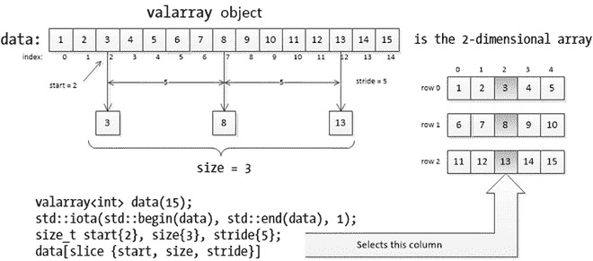
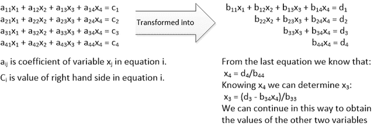
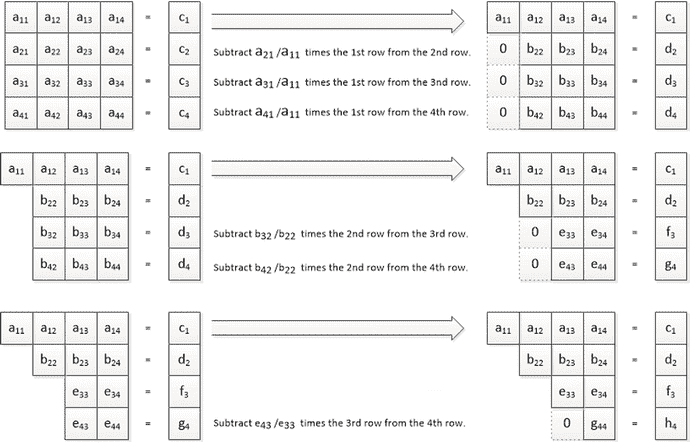
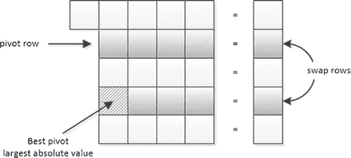
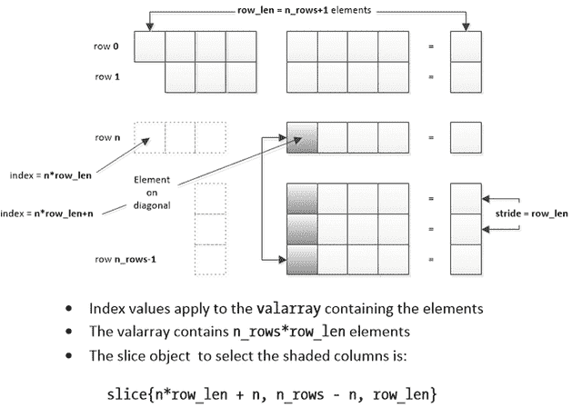
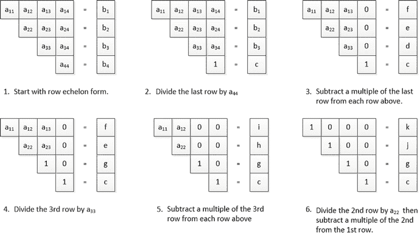
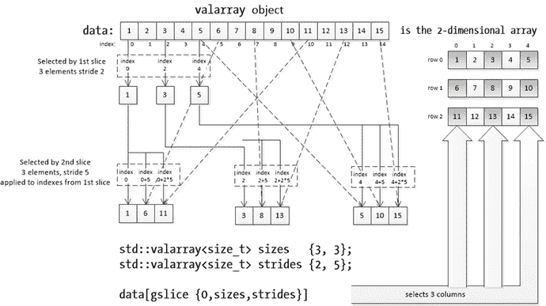

# 十、处理数字、时间和复杂数据

Electronic supplementary material The online version of this chapter (doi:[10.​1007/​978-1-4842-0004-9_​10](http://dx.doi.org/10.1007/978-1-4842-0004-9_10)) contains supplementary material, which is available to authorized users.

这一章是关于 STL 支持的三个领域，它们比其他领域更专业。`numeric`头定义了 STL 特征，使数字数据处理更容易或更有效。`chrono`表头提供处理时间的功能，包括挂钟时间和时间间隔。最后，`complex`头定义了支持复数运算的类模板。

在本章中，您将学习:

*   如何创建用于存储数字数据的`valarray`对象。
*   什么是对象，以及如何创建和使用它们。
*   什么是对象以及如何使用它们。
*   `ratio`类模板的用途以及如何使用它。
*   如何访问和使用硬件的时钟。
*   如何创建封装复数的对象以及可以应用于这些对象的操作。

## 数值计算

数值计算的效率在许多工程、科学和数学领域都非常重要。虽然这些上下文可能是专用的，但是有许多相对常见的应用环境可能涉及密集的数值计算。语音识别或数字录音等音频处理将涉及数字滤波，这是一个非常耗费处理器资源的过程。数字图像处理在 CT 和 MRI 扫描仪等医疗设备中非常普遍，但在其他常见的应用中也是如此——如果您使用过编辑套件来改善照片，您会体验到一些操作可能需要多长时间。在大多数游戏程序中，执行数值计算的效率是至关重要的。下一节是关于数值计算的 STL 算法，其中一些你已经见过了。之后，我将介绍一个类模板，它被设计来尽可能高效地用数字数组进行数值计算。

## 数字算法

在本章中，我偶尔会用到矩阵(复数矩阵)和向量这两个术语。在数学和科学中，矩阵是数字的二维数组。向量是一个一维数组——一个线性数字序列。当我在正文中正常情况下使用术语 vector 时，我指的是一个一维数字数组，它不一定在`vector`容器中，但可能在。一个矩阵通常会被存储为一个`valarray`对象，在我解释完算法之后你会了解到这个。你已经了解了一些处理数字数据的 STL 算法，但是我将在本章中介绍这些算法，以及那些新的算法。所有这些算法都处理由输入迭代器指定范围的数据源。

### 存储范围内的增量值

在`numeric`标题中定义的`iota()`函数模板用`T`类型的连续值填充一个范围。前两个参数是定义范围的前向迭代器，第三个参数是初始的`T`值。指定为第三个参数的值存储在该范围的第一个元素中。存储在第一个元素之后的元素中的值是通过对前面的元素应用递增运算符获得的。当然，这意味着类型`T`必须支持`operator++()`。下面是如何创建一个包含连续浮点值的元素的`vector`容器:

`std::vector<double> data(9);`

`double initial {-4};`

`std::iota(std::begin(data), std::end(data), initial);`

`std::copy(std::begin(data), std::end(data),`

`std::ostream_iterator<double>{std::cout << std::fixed << std::setprecision(1), " "});`

`std::cout << std::endl;              // -4.0 -3.0 -2.0 -1.0 0.0 1.0 2.0 3.0 4.0`

调用`iota() with an initial value of -4`将`data`中元素的值设置为从`-4`到`+4`的连续值。

当然，初始值不必是整数:

`std::iota(std::begin(data), std::end(data), -2.5);                                      // Values are -2.5 -1.5 -0.5 0.5 1.5 2.5 3.5 4.5 5.5`

增量仍然是 1，所以值将和注释中的一样。您可以将`iota()`算法应用于任何类型的范围，只要 increment 运算符有效。这是另一个例子:

`string text {"This is text"};`

`std::iota(std::begin(text), std::end(text), 'K');`

`std::cout << text << std::endl;      // Outputs: KLMNOPQRSTUV`

很容易看出注释中显示的输出是什么——字符串中的每个字符都被设置为代码以“K”开头的字符序列。这个例子中发生的事情并不明显:

`std::vector<string> words (8);`

`std::iota(std::begin(words), std::end(words), "mysterious");`

`std::copy(std::begin(words), std::end(words),std::ostream_iterator<string>{std::cout, " "});`

`std::cout << std::endl;            // mysterious ysterious sterious terious erious rious ious ous`

输出如注释所示。这是该算法的一个有趣的应用，但不是很有用。这仅仅是因为第三个参数是一个字符串。如果参数是`string{"mysterious"}`，它将不会被编译，因为没有为`string`类定义的`operator++()`。对应于字符串文字的参数值是一个类型为`const char*`的指针，并且`++`操作正被应用于该指针。因此，对于第一个元素之后的`words`中的每个元素，指针都会递增，导致从字符串文字的前面删除一个字母。将`++`应用于指针的结果用于创建一个`string`对象，然后存储在当前元素范围内。只要`++`可以应用于一个范围内的元素类型，就可以对它们应用`iota()`算法。

Note

有趣的是，`iota()`算法的思想起源于 IBM 编程语言 APL 中的 iota 运算符ι。在 APL 中，表达式ι `10`创建了一个从 1 到 10 的整数向量。APL 是由 Ken Iverson 在 20 世纪 60 年代开发的。它是一种非常简洁的语言，具有处理向量和数组的隐含能力。一个完整的 APL 程序，从键盘上读取任意数量的值，计算它们的平均值，然后输出结果，可以用 10 个字符表示。

### 对范围求和

您已经见过的`accumulate()`算法的基本版本使用`+`运算符对一系列元素求和。前两个参数是定义范围的输入迭代器，第三个参数是总和的初始值；第三个参数的类型决定了返回值的类型。还有第二个版本，带有第四个参数，是一个二元函数对象，用于定义在 total 和一个元素之间应用的操作。这使您能够在必要时定义自己的加法运算。例如:

`std::vector<int> values {2, 0, 12, 3, 5, 0, 2, 7, 0, 8};`

`int min {3};`

`auto sum = std::accumulate(std::begin(values), std::end(values), 0, min`

`{`

`if(v < min) return sum;`

`return sum + v;`

`});`

`std::cout << "The sum of the elements greater than " << min-1`

`<<" is " << sum << std::endl;                       // 35`

这将忽略值小于 3 的元素。条件可以像你喜欢的那样复杂，例如，你可以在一个给定的范围内对元素求和。运算不需要做加法。它可以是任何操作，只要它不修改操作数或使定义范围的迭代器无效。例如，将数值元素的函数定义为乘法运算将产生元素的乘积，只要初始值为 1。如果初始值为 1，实现浮点元素除法运算的函数将产生元素乘积的倒数。你可以这样生产元素的乘积:

`std::vector<int> values {2, 3, 5, 7, 11, 13};`

`auto product = std::accumulate(std::begin(values), std::end(values), 1,`

`std::multiplies<int>()); // 30030`

它使用函数头中的函数对象作为第四个参数。如果可能有零值元素，您可以用 lambda 表达式忽略它们，就像前面的代码片段中那样。

`string`类支持加法，所以你可以将`accumulate()`应用到一系列`string`对象:

`std::vector<string> numbers {"one", "two",   "three", "four", "five",`

`"six", "seven", "eight", "nine", "ten"};`

`auto s = std::accumulate(std::begin(numbers), std::end(numbers), string{},`

``

`{`

`if(element[0] == 't') return str + ' ' + element;`

`return str;`

`});       // Result: " two three ten"`

这段代码将从`'t'`开始的`string`对象连接起来，并用空格分隔。也有可能执行`accumulate()`算法的结果与应用该算法的范围内的元素类型不同:

`std::vector<int> numbers {1, 2, 3, 10, 11, 12};`

`auto s = std::accumulate(std::begin(numbers), std::end(numbers), string {"The numbers are"},`

``

`{   return str + ": " + std::to_string(n);  });`

`std::cout << s << std::endl;           // Output: The numbers are: 1: 2: 3: 10: 11: 12`

lambda 表达式使用的`to_string()`函数返回数值参数的`string`表示。因此，将`accumulate()`算法应用于这里的整数范围会返回注释中显示的`string`。

### 内积

两个向量的内积是相应元素乘积的和。要做到这一点，向量的长度必须相同。内积是矩阵运算中的基本运算。两个矩阵的乘积是第一个矩阵的每一行与第二个矩阵的每一列的内积。如图 10-1 所示。

图 10-1。

Matrix multiplication and the inner product operation

为了使矩阵乘积成为可能，矩阵中作为左操作数的列数必须与作为右操作数的行数相同。如果左操作数有`m`行和`n`列(一个`m×n`矩阵)，右操作数有 n 行和 k 列(一个`n×k`矩阵)，结果就是一个有`m`行和`k`列的矩阵(一个`m×k`矩阵)。

在`numeric`头中定义的`inner_product()`算法计算两个向量的内积。函数模板有四个参数:前两个是定义第一个向量的输入迭代器，第三个是标识第二个向量的 begin 输入迭代器，第四个参数是总和的初始值。该算法返回向量的内积。这里有一个例子:

`std::vector<int> v1(10);`

`std::vector<int> v2(10);`

`std::iota(std::begin(v1), std::end(v1), 2);      // 2 3 4 5 6 7 8 9 10 11`

`std::iota(std::begin(v2), std::end(v2), 3);      // 3 4 5 6 7 8 9 10 11 12`

`std::cout << std::inner_product(std::begin(v1), std::end(v1), std::begin(v2), 0)`

`<< std::endl;                          // Output: 570`

对于两个向量的内积的标准定义，初始值是 0，但是您可以选择为相应元素的乘积之和指定不同的初始值。使用`inner_product()`时，使用正确类型的文字很重要。下面将说明我的意思:

`std::vector<double> data {0.5, 0.75, 0.85};`

`auto result1 = std::inner_product(std::begin(data), std::end(data), std::begin(data), 0);`

`double result2 = std::inner_product(std::begin(data), std::end(data), std::begin(data), 0);`

`auto result3 = std::inner_product(std::begin(data), std::end(data), std::begin(data), 0.0);`

`std::cout << result1 << " " << result2`

`<< " " << result3 << std::endl;        // Output: 0 0 1.535`

第二个和第三个语句显然做了同样的事情，但是返回值的类型由第四个参数决定。即使迭代器指向浮点参数，当初始值为整数类型时，合并相应元素相乘结果的操作也使用整数运算。这同样适用于`accumulate()`算法，所以要确保文字初始值是适当的类型。幸运的是，当初始值的文字与操作中涉及的元素类型不同时，大多数编译器都会发出警告。在一个工作示例中，我们可以尝试一下`inner_product()`算法和其他一些算法。

#### 应用内积

最小二乘线性回归是一种寻找线的系数`a`和`b`的方法，该线是通过一组`n` x，y 点的最佳拟合，其中这些点通常是某种真实世界的数据样本。由高斯提出的方法找到系数`a`和`b`，使得样本点到直线的垂直距离的平方和最小。我将展示实现这一点的方程，而不去探究它们是如何开发的，但是如果你不想为任何数学问题而烦恼，你可以直接跳到代码。

给定`n`点，(x i ，y i ，该方法涉及求解以下方程:

求解这两个方程的系数`a`和`b`得到:

如果我们可以计算各种总和以及 x 和 y 值的平均值，我们可以将它们代入这些方程，以获得回归线的系数。你在第八章中看到，变量`x`的`n`值的平均值μ的等式是:

显然，`accumulate()`和`inner_product()`算法将会对此非常有帮助。

此示例将对文件中的一组数据点拟合一条回归线。该文件位于代码下载中，记录了几个欧洲国家的每千瓦时电费和人均可再生发电装机容量。程序输出应显示已安装的可再生能源容量和消费者成本之间是否存在线性关系。代码如下:

`// Ex10_01.cpp`

`// Least squares regression`

`#include <numeric>                               // For accumulate(), inner_product()`

`#include <vector>                               // For vector container`

`#include <iostream>                             // For standard streams`

`#include <iomanip>                              // For stream manipulators`

`#include <fstream>                              // For file streams`

`#include <iterator>                             // For iterators and begin() and end()`

`#include <string>                               // For string class`

`using std::string;`

`int main()`

`{`

`// File contains country_name renewables_per_person kwh_cost`

`string file_in {"G:/Beginning_STL/renewables_vs_kwh_cost.txt"};`

`std::ifstream in {file_in};`

`if(!in)                                       // Verify  we have a file`

`{`

`std::cerr << file_in << " not open." << std::endl;`

`exit(1);`

`}`

`std::vector<double> x;                        // Renewables per head`

`std::vector<double> y;                        // Corresponding cost for a kilowatt hour`

`// Read the file and show the data`

`std::cout << "   Country   " << " Watts per Head " << " kwh cost(cents) " << std::endl;`

`while(true)`

`{`

`string country;`

`double renewables {};`

`double kwh_cost {};`

`if((in >> country).eof()) break;                           // EOF read - we are done`

`in >> renewables >> kwh_cost;`

`x.push_back(renewables);`

`y.push_back(kwh_cost);`

`std::cout << std::left << std::setw(12) << country         // Output the record`

`<< std::right`

`<< std::fixed << std::setprecision(2) << std::setw(12) << renewables`

`<< std::setw(16) << kwh_cost << std::endl;`

`}`

`auto n = x.size();                                            // Number of points`

`auto sx = std::accumulate(std::begin(x), std::end(x), 0.0);   // Sum of x values`

`auto sy = std::accumulate(std::begin(y), std::end(y), 0.0);   // Sum of y values`

`auto mean_x = sx/n;                                           // Mean of x values`

`auto mean_y = sy/n;                                           // Mean of y values`

`// Sum of x*y values and sum of x-squared`

`auto sxy = std::inner_product(std::begin(x), std::end(x), std::begin(y), 0.0);`

`auto sx_2 = std::inner_product(std::begin(x), std::end(x), std::begin(x), 0.0);`

`double a {}, b {};                                            // Line coefficients`

`auto num = n*sxy - sx*sy;                                     // Numerator for a`

`auto denom = n*sx_2 - sx*sx;                                  // Denominator for a`

`a = num / denom;`

`b = mean_y - a*mean_x;`

`std::cout << std:: fixed << std::setprecision(3) << "\ny = "  // Output equation`

`<< a << "*x + " << b << std::endl;                  // for regression line`

`}`

在`while`循环中读取文件。只存储数字值，并将每个完整的国家名称、人均可再生能源装机容量的瓦特数以及每千瓦时的费用写入标准输出流。这两个数值存储在向量容器中；x 存储每个国家的人均可再生能源容量，y 存储相应的千瓦时成本。

x 值和 y 值的平均值是通过使用`accumulate()`算法对每个容器中的元素求和，然后将结果除以元素数来计算的。通过`inner_product()`算法计算出`x`值的平方和以及 xy 乘积的和。这些结果用于通过使用我之前展示的等式来计算线的`a`和`b`系数。

注意，我们可以简化系数`a`的等式。如果我们把分子和分母除以`n` `2` ，方程可以这样写:

现在 x 值和 y 值的和并不需要明确。计算系数的代码可以写成:

`auto n = x.size();                                                 // Number of points`

`// Calculate mean values for x, y, xy, and x-squared`

`auto mean_x = std::accumulate(std::begin(x), std::end(x), 0.0)/n;`

`auto mean_y = std::accumulate(std::begin(y), std::end(y), 0.0)/n;`

`auto mean_xy = std::inner_product(std::begin(x), std::end(x), std::begin(y), 0.0)/n;`

`auto mean_x2 = std::inner_product(std::begin(x), std::end(x), std::begin(x), 0.0)/n;`

`// Calculate coefficients`

`auto a = (mean_xy - mean_x*mean_y)/(mean_x2 - mean_x*mean_x);`

`auto b = mean_y - a*mean_x;`

这可以用更少的语句达到相同的结果。图 10-2 在右边显示了程序的输出，在左边显示了回归线和原始数据点的曲线图。

图 10-2。

Result of least squares linear regression

这个情节相当有说服力——原著的观点与它相当接近。看起来好像每增加 100 瓦的人均可再生能源发电量，你使用的每千瓦时的成本就会增加 2 美分。

#### 定义替代的内积工序

您看到的版本`inner_product()`将两个输入范围中的相应元素相乘，然后将结果相加。第二个版本有两个定义函数对象的参数。第二个函数对象定义了要在两个范围中的对应元素对之间应用的二元运算，第一个函数对象定义了要用来代替加法运算以组合结果的二元运算。作为参数提供的函数对象不能使任何迭代器无效，也不能修改任何输入范围内的元素。这里有一个例子，说明如何产生和的乘积，而不是乘积的和:

`std::vector<int> v1(5);`

`std::vector<int> v2(5);`

`std::iota(std::begin(v1), std::end(v1), 2);      // 2 3 4 5 6`

`std::iota(std::begin(v2), std::end(v2), 3);      // 3 4 5 6 7`

`std::cout << std::inner_product(std::begin(v1), std::end(v1), std::begin(v2), 1,`

`std::multiplies<>(), std::plus<>())`

`<< std::endl;                          // Output: 45045`

在`inner_product()`调用中用作参数的函数对象在`functional`头中定义。一个`plus<T>`对象计算类型为`T`的两个值的和，这里的模板实例定义了应用于来自输入范围的类型为`int`的相应元素的操作。作为`inner_product()`的第五个参数的`multiples`的实例通过将结果相乘来组合它们。注意，因为结果是一个乘积，如果您想避免总是得到零结果，初始值一定不能是`0`。函数头还定义了其他二进制算术运算的模板，您可以使用`inner_product()` - `minus`、`divides`和`modulus`。您还可以使用定义位运算的函数对象的模板；这些是`bit_and`、`bit_or`和`bit_eor`。

### 相邻差异

来自`numeric`头的`adjacent_difference()`算法计算一个输入范围内相邻元素对之间的差异，并将结果存储在另一个范围内。将第一个元素原封不动地复制到新范围中，然后从第二个元素中减去第一个元素，作为第二个元素存储在新范围中，从第三个元素中减去第二个元素，作为第三个元素存储在新范围中，依此类推。这里有一个例子:

`std::vector<int> data {2, 3, 5, 7, 11, 13, 17, 19};`

`std::cout << "Differences: ";`

`std::adjacent_difference(std::begin(data), std::end(data),`

`std::ostream_iterator<int>{std::cout, " "});`

`std::cout << std::endl;                        // Differences: 2 1 2 2 4 2 4 2`

因为输出范围的迭代器是写入`cout`的输出流迭代器，所以`data`容器中元素之间的差异由`adjacent_difference()`算法直接输出。这产生的输出显示在注释中。

该算法的第二个版本允许您指定应用于元素对的减法运算符的替代运算符。这里有一个例子:

`std::vector<int> data {2, 3, 5, 7, 11, 13, 17, 19};`

`std::cout << "Products: ";`

`std::adjacent_difference(std::begin(data), std::end(data),`

`std::ostream_iterator<int>{std::cout, " "},`

`std::multiplies<>());`

`std::cout << std::endl;                          // Products: 2 6 15 35 77 143 221 323`

第四个参数是一个 function 对象，它指定元素之间的操作——在本例中是来自`functional`头的`multiplies`的一个实例。你可以看到这产生了`data`中连续元素的乘积。只要不改变输入范围或使迭代器无效，任何二元操作都是可以接受的。下面是一个使用`plus<T>`函数对象作为元素对之间的运算符来计算斐波那契数的示例:

`std::vector<size_t> fib(15, 1);                  // 15 elements initialized with 1`

`std::adjacent_difference(std::begin(fib), std::end(fib)-1, std::begin(fib)+1, std::plus<size_t>());`

`std::copy(std::begin(fib), std::end(fib), std::ostream_iterator<size_t>{std::cout, " "});`

`std::cout << std::endl;                // Output: 1 1 2 3 5 8 13 21 34 55 89 144 233 377 610`

这里的`adjacent_difference()`算法在`fib`容器中添加成对的元素，并将结果从第二个元素开始写回同一个容器。`fib`中的最后一个元素不包括在输入范围内，输入范围内最后两个元素的总和会覆盖最后一个元素中的值。运算后，`fib`将包含一个从 1 开始的斐波那契数列。注释显示了由`copy()`算法产生的输出。

### 部分和

在`numeric`标题中定义的`partial_sum()`算法计算输入范围内元素的部分和，并将结果存储在输出范围内。它从长度为 1 的序列开始计算输入范围内长度递增的序列的和，因此第一个输出值只是第一个元素，下一个值是前两个元素的和，下一个是前三个元素的和，依此类推。这是`adjacent_difference()`算法的逆运算，所以`partial_sum()`撤销`adjacent_difference()`做的事情。这里有一个例子:

`std::vector<int> data {2, 3, 5, 7, 11, 13, 17, 19};`

`std::cout << "Partial sums: ";`

`std::partial_sum(std::begin(data), std::end(data), std::ostream_iterator<int>{std::cout, " "});`

`std::cout << std::endl;                // Partial sums: 2 5 10 17 28 41 58 77`

您可以看到输出由长度稳定增长的序列的总和组成。通过执行以下命令，您可以很容易地证明这一点:

`std::vector<int> data {2, 3, 5, 7, 11, 13, 17, 19};`

`std::cout << "Original data: ";`

`std::copy(std::begin(data), std::end(data), std::ostream_iterator<int>{std::cout, " "});`

`std::adjacent_difference(std::begin(data), std::end(data), std::begin(data));`

`std::cout << "\nDifferences: ";`

`std::copy(std::begin(data), std::end(data), std::ostream_iterator<int>{std::cout, " "});`

`std::cout << "\nPartial sums: ";`

`std::partial_sum(std::begin(data), std::end(data), std::ostream_iterator<int>{std::cout, " "});`

`std::cout << std::endl;`

注意，这里的输出迭代器与输入范围的 begin 迭代器相同。这是合法的。您可能认为数据可能会被覆盖，但是算法被定义为防止这种情况发生。执行这段代码的输出是:

`Original data: 2 3 5 7 11 13 17 19`

`Differences: 2 1 2 2 4 2 4 2`

`Partial sums: 2 3 5 7 11 13 17 19`

输出显示，计算差异的部分和会得到原始值，这并不奇怪。

像`adjacent_difference()`算法一样，您可以提供一个函数对象作为`partial_sum()`的额外参数，它定义了一个用来代替加法的操作符。这可能是如何应用的:

`std::vector<int> data {2, 3, 5, 7, 11, 13, 17, 19};`

`std::cout << "Partial sums: ";`

`std::partial_sum(std::begin(data), std::end(data),`

`std::ostream_iterator<int>{std::cout, " "}, std::minus<int>());`

`std::cout << std::endl;                // Partial sums: 2 -1 -6 -13 -24 -37 -54 -73`

使用减法运算符，因此这些值是、`2`、`2-3`、`2-3-5`、`2-3-5-7`等的结果。

### 最大值和最小值

你已经看到了一些确定最小值和最大值的算法，但我还是会把它们都包含在这一节中。在`algorithm`头中定义了三种适用于范围的算法:`min_element()`返回一个指向输入范围最小值的迭代器，`max_element()`返回一个指向最大值的迭代器，`minmax_element()`返回两者的迭代器作为一个`pair`对象。该范围必须由正向迭代器指定；仅有输入迭代器是不够的。对于这三种算法，除了范围的开始和结束迭代器之外，还可以选择提供第三个参数来定义比较函数。以下代码展示了应用于整数的三种算法:

`std::vector<int> data {2, 12, 3, 5, 17, -11, 113, 117, 19};`

`std::cout << "From values ";`

`std::copy(std::begin(data), std::end(data), std::ostream_iterator<int>{std::cout, " "});`

`std::cout << "\n     Min = " << *std::min_element(std::begin(data), std::end(data))`

`<< "  Max = " << *std::max_element(std::begin(data), std::end(data))`

`<< std::endl;`

`auto start_iter = std::begin(data) + 2;`

`auto end_iter = std::end(data) - 2;`

`auto pr = std::minmax_element(start_iter, end_iter);       // Get min and max`

`std::cout << "From values ";`

`std::copy(start_iter, end_iter, std::ostream_iterator<int>{std::cout, " "});`

`std::cout << "\n     Min = " << *pr.first << "  Max = " << *pr.second << std::endl;`

`min_element()`和`max_element()`用于从应用于相同范围的`data. minmax_element()`中找到最小值和最大值，但是省略了前两个和后两个元素。执行此操作将输出以下内容:

`From values 2 12 3 5 17 -11 113 117 19`

`Min = -11  Max = 117`

`From values 3 5 17 -11 113`

`Min = -11  Max = 113`

`algorithm`头还定义了`min()`、`max()`和`minmax()`的模板，这些模板返回两个对象的最小值、最大值或者最小值和最大值，或者返回对象的初始化列表。你已经看到它们和两个要比较的参数一起使用。下面是一个使用初始化列表的例子:

`auto words = {string {"one"}, string {"two"}, string {"three"}, string {"four"},`

`string {"five"}, string {"six"}, string {"seven"}, string {"eight"}};`

`std::cout << "Min = " << std::min(words)`

`<< std::endl;                // Min = eight`

`auto pr = std::minmax(words, [] (const string& s1, const string& s2)`

`{return s1.back() < s2.back();});`

`std::cout << "Min = " << pr.first << "  Max = " << pr.second`

`<< std::endl;                // Min = one  Max = six`

`words`是`string`对象的初始化列表。重要的是元素是`string`对象。如果你简单地使用`char*`，那么算法将不能正常工作，因为那样你将比较地址而不是字符串内容。`min()`算法使用默认的`operator<()`对象来确定单词中的最小对象。然后使用定制的比较函数比较字符串中的最后几个字符，使用`minmax()`算法找到列表中的最小和最大对象。结果显示在评论中。有一些版本的`min()`和`max()`接受一个函数对象作为定义比较的最后一个参数。

## 存储和使用数值

在`valarray`头中定义的`valarray`类模板定义了可以存储和操作数值序列的对象类型。它主要用于处理整数值和浮点值，但是只要类满足某些条件，您就可以使用它来存储类类型的对象:

*   该类不能是抽象的。
*   公共构造函数必须包括一个默认构造函数和一个复制构造函数。
*   析构函数必须是`public`。
*   该类必须定义赋值运算符，并且必须是`public`。
*   上课绝对不能霸王`operator&()`。
*   函数成员不能抛出异常。

您不能在`valarray`中存储引用，或`const`或`volatile`限定的对象。如果你的课程满足所有这些限制，那么你就成功了。

与任何序列容器(如`vector`)相比，`valarray`模板为数字数据处理提供了更多的功能。首先，也是最重要的，它被设计成使编译器能够以一种不适用于序列容器的方式优化其操作的性能。然而，你的编译器是否优化了`valarray`操作取决于实现。第二，在内置于类型中的`valarray`对象上有大量的一元和二元操作。第三，还有大量内置的一元函数，用于将`cmath`头中定义的许多操作应用到每个元素。第四，`valarray`类型提供了内置的功能，可以根据需要将数据作为任意维数的数组来处理。

创建一个`valarray`对象很容易。以下是一些例子:

`std::valarray<int> numbers(15);                 // 15 elements with default initial values 0`

`std::valarray<size_t> sizes {1, 2, 3};          // 3 elements with values 1 2 and 3`

`std::valarray<size_t> copy_sizes {sizes};       // 3 elements with values 1 2 and 3`

`std::valarray<double> values;                   // Empty array`

`std::valarray<double> data(3.14, 10);           // 10 elements with values 3.14`

每个构造函数用给定数量的元素创建一个对象。在定义`data`的最后一个语句中使用括号是很重要的；如果使用大括号，`data`将包含两个元素，值分别为`3.14`和`10.0`。还可以创建一个`valarray`对象，用普通数组中指定数量的值初始化。例如:

`int vals[] {2, 4, 6, 8, 10, 12, 14};`

`std::valarray<int> vals1 {vals, 5};             // 5 elements from vals: 2 4 6 8 10`

`std::valarray<int> vals2 {vals + 1, 4};         // 4 elements from vals: 4 6 8 10`

我稍后将介绍其他构造函数，因为它们有我尚未解释的类型的参数。

### 对 valarray 对象的基本操作

一个`valarray`对象类似于一个`array`容器，因为您不能添加或删除元素。但是，您可以更改一个`valarray`对象包含的元素数量，并给它们分配一个新值。例如:

`data.resize(50, 1.5);                           // 50 elements with value 1.5`

如果在此操作之前有元素存储在`data`中，它们的值将会丢失。当需要获取元素个数时，可以调用`size()`成员。

`swap()`成员将当前对象的元素与作为参数传递的`valarray`对象的元素进行交换。例如:

`std::valarray<size_t> sizes_3 {1, 2, 3};`

`std::valarray<size_t> sizes_4 {2, 3, 4, 5};`

`sizes_3.swap(sizes_4);                             // sizes_3 now has 4 elements and sizes_4 has 3`

包含在`valarray`对象中的元素数量可以不同，但显然两个对象中的元素必须是同一类型。`swap()`成员没有返回值。有一个非成员`swap()`函数模板做同样的事情，所以最后一个语句可以替换为:

`std::swap(sizes_3, sizes_4);                    // Calls sizes_3.swap(sizes_4)`

通过调用`min()`和`max()`函数成员，可以找到`valarray`中元素的最小值和最大值。例如:

`std::cout << "The elements are from " << sizes_4.min() << " to " << sizes_4.max() << '\n';`

为此，元素必须是支持`operator<()`的类型。

`sum()`成员返回元素的和，它使用`+=`操作符计算元素的和。因此，您可以像这样计算`valarray`中元素的平均值:

`std::cout << "The average of the elements " << sizes_4.sum()/sizes_4.size() << '\n';`

这比必须使用`accumulate()`算法要简单得多。

没有返回元素迭代器的`valarray`成员，但是有专门的非成员版本的`begin()`和`end()`返回随机访问迭代器。这使您能够使用基于范围的`for`循环来访问`valarray`元素，并对它们应用算法；稍后您将看到示例。您不能使用带有`valarray`的插入迭代器，因为实现它所必需的成员不存在，这是因为大小是固定的。

有两个函数成员用于移动元素——移动序列，而不是移动单个值中的位。首先，`shift()`成员按照参数指定的元素数量移动整个元素序列。该函数将结果作为一个新的`valarray`对象返回，保持原来的不变。如果参数为正，元素左移，参数为负，元素右移。这有点像移位。从左侧或右侧移入序列的元素将为 0，或其类型的等效值。当然，如果你不把移位操作的结果存储回同一个`valarray`对象，那么原来的对象是不变的。下面是一些说明这是如何工作的代码:

`std::valarray<int> d1 {1, 2, 3, 4, 5, 6, 7, 8, 9};`

`auto d2 = d1.shift(2);                           // Shift left 2 positions`

`for(int n : d2) std::cout << n << ' ';`

`std::cout << '\n';                               // Result: 3 4 5 6 7 8 9 0 0`

`auto d3 = d1.shift(-3);                          // Shift right 3 positions`

`std::copy(std::begin(d3), std::end(d3), std::ostream_iterator<int>{std::cout, " "});`

`std::cout << std::endl;                          // Result: 0 0 0 1 2 3 4 5 6`

评论解释了发生了什么。我使用不同的方式输出两个案例的结果，只是为了展示可能的结果。`d1`不会因这些陈述而改变。`valarray`模板为对象定义了赋值操作符，所以如果你想替换原来的，你可以写:

`d1 = d1.shift(2);                                // Shift d1 left 2 positions`

移动元素的第二种可能性是使用`cshift()`成员。这将按照参数指定的位置数循环移动元素序列。元素序列向左或向右旋转，这取决于参数是正还是负。这个函数成员也返回一个新的对象。这里有一个例子:

`std::valarray<int> d1 {1, 2, 3, 4, 5, 6, 7, 8, 9};`

`auto d2 = d1.cshift(2);                          // Result d2 contains: 3 4 5 6 7 8 9 1 2`

`auto d3 = d1.cshift(-3);                         // Result d3 contains: 7 8 9 1 2 3 4 5 6`

`apply()`函数是`valarray`的一个非常强大的成员，它将函数应用于每个元素，并将结果作为一个新的`valarray`对象返回。在`valarray`类模板中定义了两个`apply()`函数成员:

`valarray<T> apply(T func(T)) const;`

`valarray<T> apply(T func(const T&)) const;`

有三点需要注意。第一，两个版本都是`const`，所以原始元素不能被函数修改。第二，形参是一个特定形式的函数，带有类型为`T`的实参或引用`T`的`const`，它返回类型为`T`的值；如果你尝试使用`apply()`和一个不对应的参数，它不会编译。第三，返回值是类型`valarray<T>`,所以结果总是与原始类型和大小相同的元素的数组。

下面是一个使用`apply()`成员的例子:

`std::valarray<double> time {0.0, 1.0, 2.0, 3.0, 4.0, 5.0, 6.0, 7.0, 8.0, 9.0};  // Seconds`

`auto distances = time.apply(`

`{`

`const static double g {32.0};  // Acceleration due to gravity ft/sec/sec`

`return 0.5*g*t*t;`

`});                          // Result: 0 16 64 144 256 400 576 784 1024 1296`

如果你把砖块从高楼上扔下来，那么在相应的秒数后，`distances`对象将包含砖块下落的距离；建筑高度必须超过`1296`英尺，最后的结果才有效。请注意，您不能使用 lambda 表达式从封闭范围捕获变量作为参数，因为这与函数模板中的参数规范不匹配。例如，这不会编译:

`const double g {32.0};`

`auto distances = times.apply(g { return 0.5*g*t*t; });   // Won’t compile!`

在 lambda 表达式中通过值捕获`g`会改变它的类型，因此它不符合应用模板规范。对于可接受作为`apply()`的参数的 lambda 表达式，capture 子句必须为空，它必须具有与数组相同类型的参数，并且它必须返回该类型的值。

`valarray`头为来自`cmath`头的大多数函数定义了重载，以便它们应用于`valarray`对象中的所有元素。接受`valarray`对象作为参数的函数有:

`abs()`、`pow()`、`sqrt()`、`exp()`、`log()`、`log10()`

`sin()`、`cos()`、`tan()`、`asin()`、`acos()`、`atan()`、`atan2()`

`sinh()`、`cosh()`、`tanh()`

这里有一个例子，它将本节中的代码片段拖在一起，并提供了一个机会来使用带有`valarray`对象的`cmath`函数之一:

`// Ex10_02.cpp`

`// Dropping bricks safely from a tall building using valarray objects`

`#include <numeric>                                  // For iota()`

`#include <iostream>                                 // For standard streams`

`#include <iomanip>                                  // For stream manipulators`

`#include <algorithm>                                // For for_each()`

`#include <valarray>                                 // For valarray`

`const static double g {32.0};                       // Acceleration due to gravity ft/sec/sec`

`int main()`

`{`

`double height {};                                 // Building height`

`std::cout << "Enter the approximate height of the building in feet: ";`

`std::cin >> height;`

`// Calculate brick flight time in seconds`

`double end_time {std::sqrt(2 * height / g)};`

`size_t max_time {1 + static_cast<size_T>(end_time + 0.5)};`

`std::valarray<double> times(max_time+1);               // Array to accommodate times`

`std::iota(std::begin(times), std::end(times), 0);      // Initialize: 0 to max_time`

`*(std::end(times) - 1) = end_time;                     // Set the last time value`

`// Calculate distances each second`

`auto distances = times.apply( { return 0.5*g*t*t; });`

`// Calculate speed each second`

`auto v_fps = sqrt(distances.apply( { return 2 * g*d;}));`

`// Lambda expression to output results`

`auto print =  { std::cout << std::setw(6) << static_cast<int>(std::round(v)); };`

`// Output the times - the last is a special case...`

`std::cout << "Time (seconds): ";`

`std::for_each(std::begin(times), std::end(times)-1, print);`

`std::cout << std::setw(6) << std::fixed << std::setprecision(2) << *(std::end(times)-1);`

`std::cout << "\nDistances(feet):";`

`std::for_each(std::begin(distances), std::end(distances), print);`

`std::cout << "\nVelocity(fps):  ";`

`std::for_each(std::begin(v_fps), std::end(v_fps), print);`

`// Get velocities in mph and output them`

`auto v_mph = v_fps.apply( { return v*60/88; });`

`std::cout << "\nVelocity(mph):  ";`

`std::for_each(std::begin(v_mph), std::end(v_mph), print);`

`std::cout << std::endl;`

`}`

这决定了当你从高楼上扔下一块砖头时会发生什么。这里是迪拜塔的一些输出示例，假设您从一根足够长的柱子上释放砖块，以避免砖块撞到建筑物的侧面:

`Enter the approximate height of the building in feet: 2722`

`Time (seconds):      0     1     2     3     4     5     6     7     8     9    10    11    12    13 13.04`

`Distances(feet):     0    16    64   144   256   400   576   784  1024  1296  1600  1936  2304  2704  2722`

`Velocity(fps):       0    32    64    96   128   160   192   224   256   288   320   352   384   416   417`

`Velocity(mph):       0    22    44    65    87   109   131   153   175   196   218   240   262   284   285`

首先，如果你真的这么做了，实际上会发生的是你最终会进监狱——或者更糟。其次，我知道计算忽略了阻力，但这本书是关于 STL 的，不是物理。第三，我知道你可以通过加速度乘以经过的时间得到速度，但是我不能把`sqrt()`应用到`valarray`上，对吗？

所有代码都非常简单。常量`g`是在全局范围内定义的，因为这是使它在代码的不同地方可用的最简单的方法，包括 lambda 表达式。以秒为单位存储经过时间的`times`数组由从`0`开始的整数值填充。使用`iota()`算法，最后一个时间值(对应于砖块落地的时间)几乎肯定不是整数，因此存储特定值。我使用了`for_each()`来产生输出，因为它比使用`copy()`和输出流迭代器允许更多的输出值控制。最后一个时间值不太可能是整数秒，因此这被视为输出的特例。`print` lambda 是显式定义的，因此可以重用它来输出每组值。

您可以使用下标操作符`[]`来获取或设置`valarray`中给定索引处元素的值，但是下标操作符的作用远不止这些，您将在本章后面看到。

### 一元运算符

有四个一元运算符可以应用于一个`valarray`对象:`+`、`-`、`∼`和`!`。其效果是将操作符应用于数组中的每个元素，并在新的`valarray`对象中返回结果，保持原来的不变。如果元素类型支持操作符，你只能将它们应用于一个`valarray`对象，它们的作用——特别是对于类类型的对象——将取决于类型。将`!`操作符应用于`valarray`对象所产生的新元素总是属于`bool`类型，因此操作的结果是一个`valarray<bool>`类型的对象。在本章的后面，我将讨论这可能有用的上下文。其他运算符必须生成与原始元素类型相同的结果，运算才合法。例如，一元减法运算符只能反转有符号数值元素的符号，因此它不适用于无符号类型。这显示了`!`操作符的效果:

`std::valarray<int> data {2, 0, -2, 4, -4};`

`auto result = !data;                       // result is of type valarray bool`

`std::copy(std::begin(result), std::end(result),`

`std::ostream_iterator<bool>{std::cout << std::boolalpha, " "});`

`std::cout << std::endl;                    // Output: false true false false false`

当`!`应用于`data`中的值时，这些值首先被隐式转换为`bool`，然后运算符应用于结果。如果您使用`copy()`算法将`data`中的值输出为布尔值，结果将是`true false true true true`，这解释了为什么上面代码的输出如下所示。

`∼`运算符是按位非或 1 的补码。这里有一个例子:

`std::valarray<int> data {2, 0, -2, 4, -4}; // 0x00000002 0 0xfffffffe 0x00000004 0xfffffffc`

`auto result = ∼data;`

`std::copy(std::begin(result), std::end(result), std::ostream_iterator<int>{std::cout, " "});`

`std::cout << std::endl;                    // Output: -3 -1 1 -5 3`

通过翻转原始整数值中的位来产生结果，以产生`result`中的元素。例如，`data`中的第二个元素的所有位都是 0，因此应用∞会产生一个所有位都是 1 的值，这相当于十进制的-1。

`+`运算符对数值没有影响；`-`操作员将改变符号。例如:

`std::valarray<int> data {2, 0, -2, 4, -4};`

`auto result = -data;`

`std::copy(std::begin(result), std::end(result), std::ostream_iterator<int>{std::cout, " "});`

`std::cout << std::endl;                    // Output: -2 0 2 -4 4`

当然，如果您愿意，您可以覆盖原始对象。为了使代码不那么混乱，从现在开始，我将假设有一个针对`std::valarray`的`using`指令生效，并在代码中去掉针对`valarray`类型的`std`名称空间限定符。

### valarray 对象的复合赋值运算符

所有复合赋值运算符都有一个左操作数，即一个`valarray`对象。右操作数可以是与存储的元素类型相同的值，在这种情况下，该值按照运算符确定的方式与每个元素的值组合。右操作数也可以是一个与左操作数拥有相同数量和类型元素的`valarray`对象。在这种情况下，通过组合右操作数中的相应元素来修改左操作数中的元素。此类别中的操作员包括:

*   复合算术赋值运算符`+=`、`-=`、`*=`、`/=`、`%=`，例如:`valarray<int> v1 {1, 2, 3, 4};` `valarray<int> v2 {3, 4, 3, 4};` `v1+= 3;                                // v1 is: 4 5 6 7` `v1 -= v2;                              // v1 is: 1 1 3 3`

*   复合班次赋值运算符`>>=`、`<<=`，例如:`valarray<int> v1 {1, 2, 3, 4};` `valarray<int> v2 {4, 8, 16, 32};` `v2 <<= v1;                             // v2 is: 8 32 128 512` `v2 >>= 2;                              // v1 is: 2 8 32 128`

*   复合按位赋值运算符`&=`、`|=`、【例如:】`valarray<int> v1 {1, 2, 4, 8};` `valarray<int> v2 {4, 8, 16, 32};` `v1 |= 4;                               // v1 is: 5 6 4 12` `v1 &= v2;                              // v1 is: 4 0 0 0` `v1 ^= v2;                              // v1 is: 0 8 16 32`

复合按位和复合移位赋值运算符通常适用于整数类型。

### valarray 对象上的二元运算

您可以将适用于基本类型值的任何二元运算符应用于`valarray`对象，或者组合两个`valarray`对象的相应元素，或者组合`valarray`中具有与元素相同类型值的元素。以下二元运算的非成员运算符函数在`valarray`头中定义:

*   算术运算符`+`、`-`、`*`、`/`、`%`
*   按位运算符`&`、`|`、`^`
*   移位操作符`>>`、`<<`
*   逻辑运算符`&&`、`||`

所有这些操作符都有不同的版本，允许在一个`valarray<T>`对象和一个`T`类型的对象之间，一个`T`类型的对象和一个`valarray`对象之间，或者两个`valarray`对象之间应用操作。两个`valarray`对象之间的操作要求它们都有相同数量的相同类型的元素。逻辑运算符返回一个与`valarray`操作数具有相同元素数量的`valarray<bool>`对象。其他操作符返回一个与`valarray`操作数具有相同类型和元素数量的`valarray`对象。

能够将一个`valarray`对象的内容输出到`cout`来显示发生了什么将会很有用。我将使用下面的函数模板来完成这项工作:

`// perline is the number output per line, width is the field width`

`template<typename T>`

`void print(const std::valarray<T> values,  size_t perline = 8, size_t width = 8)`

`{`

`size_t n {};`

`for(const auto& value : values)`

`{`

`std::cout << std::setw(width) << value << " ";`

`if(++n % perline == 0) std::cout << std::endl;`

`}`

`if(n % perline != 0) std::cout << std::endl;`

`std::cout << std::endl;`

`}`

这将适用于包含支持输出流的`operator<<()`的任何类型`T`元素的`valarray`对象。

我不会反复列举使用所有二元运算符的例子——只是举几个例子说明。下面是一些使用`valarray`对象的二进制算术运算的例子:

`valarray<int> even {2, 4, 6, 8};`

`valarray<int> odd {3, 5, 7, 9};`

`auto r1 = even + 2;`

`print(r1, 4, 3);                       // r1 contains:   4   6  8  10`

`auto r2 = 2*r1 + odd;`

`print(r2, 4, 3);                       // r2 contains: 11  17  23  29`

`r1 += 2*odd - 4*(r2 - even);`

`print(r1, 4, 3);                       // r1 contains: -26 -36 -46 -56`

最后一条语句使用复合赋值运算符(函数成员)将右操作数表达式的结果相加。这展示了如何将涉及`valarray`对象的操作以与数值基本相同的方式组合起来，包括使用括号。下面是一个使用移位操作的语句:

`print(odd << 3, 4, 4);                 // Output is:  24   40   56   72`

`print()`的第一个参数是将`odd`中的元素左移三位产生的`valarray`对象。在宽度为 4 的字段中，输出是 4 个值到一行。

在`valarray`头中还定义了非成员函数，用于将一个`valarray<T>`对象与另一个`valarray<T>`对象进行比较，或者将一个`valarray<T>`对象的每个元素与一个`T`类型的值进行比较。比较的结果是一个`valarray<bool>`对象具有与所涉及的`valarray`相同数量的元素。支持的操作有`==`、`!=`、`<. <=`、`>`和`>=`。以下是使用这些方法的一些例子:

`valarray<int> even {2, 4, 6, 8};`

`valarray<int> odd {3, 5, 7, 9};`

`std::cout << std::boolalpha;`

`print(even + 1 == odd, 4, 6);          // Output is:   true   true   true   true`

`auto result = (odd < 5) && (even + 3 != odd);`

`print(result);                       // Output is:   true   false  false` `false`

倒数第二个语句使用二元&&运算符来组合比较结果。当`3`添加到`even`元素后`odd`元素少于 5 且`even`对应的元素不等于`odd`中的元素时，结果显示；这仅适用于`even`和`odd`中的第一个元素，因为`odd < 5`仅适用于`odd`中的第一个元素`true`，而`even + 3 != odd`始终为`true`。

有一些助手类定义了用于处理`valarray`中元素子集的对象。主要的助手类是`std::slice`和`std::gslice`。我将在代码中删除这些名称空间的`std`限定符。在深入了解如何处理`valarray`对象之前，让我们先来看看如何使用这些助手类来处理`valarray`。

### 访问 valarray 对象中的元素

一个`valarray`对象将其元素存储为一个线性序列。如前所述，您可以获得对任何元素的引用，并通过使用带有下标操作符的索引来获取或设置值。以下是一些例子:

`std::valarray<int> data {1,2,3,4,5,6,7,8,9};`

`data[1] = data[2] + data[3];                     // Data[1] is 7`

`data[3] *= 2;                                    // Data[3] is 8`

`data[4] = ++data[5] - data[2];                   // data[4] is 4, data[5] is 7`

这就像从常规数组中访问元素一样。然而，`valarray`对象的下标操作符可以做更多的事情。您可以使用带有下标操作符的助手类实例来代替索引。这使您能够指定和访问元素的子集。helper 类定义的元素选择机制使您能够像在二维或多维数组中一样处理元素。理解这是如何工作的很重要，因为这是`valarray`相对于序列容器的主要优势之一。

有很多细节需要讨论，所以让我们看看路线图。我们将首先探讨元素选择机制一般是如何工作的，然后讨论如何从二维数组中选择特定的行或列。我将解释助手类如何以各种方式与`valarray`对象一起工作来选择不同的元素子集，以及子集是如何表示的。在我解释了生成子集的各种可能性之后，我将讨论您可以用它做什么。之后，我将介绍如何在应用程序环境中应用这些技术。

#### 创建切片

在`valarray`头中定义了`std::slice`类。一个片由一个`slice`对象定义，您将它传递给一个`valarray`对象的下标操作符，就像一个索引一样。使用`slice`对象作为`valarray`对象的下标，选择两个或更多元素的子集。所选择的元素在阵列中不一定是连续的。`slice`选择的数组元素可作为引用，因此您可以访问和/或更改这些元素的值。

本质上，`slice`对象封装了一系列索引值，用于从`valarray`中选择元素。通过向`slice`构造函数传递三个`size_t`类型的值来定义一个`slice`对象:

*   `valarray`对象中标识子集中第一个元素的起始索引。
*   大小，即子集中元素的数量。
*   跨距，这是从子集中的一个元素到下一个元素的索引增量。

构造函数的参数按照我描述的顺序排列，所以你可以像这样定义一个切片:

`slice my_slice {3, 4, 2};                        // start index = 3, size = 4, stride = 2`

该对象从索引 3 开始标识 4 个元素，随后的索引增量为 2。有一个复制构造函数，所以你可以复制`slice`对象。默认构造函数将起始索引、大小和步幅设置为 0，其唯一目的是允许创建`slice`对象的数组。

您可以通过调用`start()`成员从`slice`对象获得开始索引。一个`slice`对象也有分别返回大小和步幅的`size()`和`stride()`成员。所有三个值都作为类型`size_t`返回。

一般来说，当您使用一个`slice{start, size, stride}`对象作为一个`valarray`对象的下标时，您是在索引值处选择元素:

`start`、`start + stride`、`start + 2*stride`、...`start +(size - 1)*stride`

图 10-3 用一个包含值从 1 到 15 的元素的`valarray`对象举例说明了这一点。

图 10-3。

Subset of elements in a `valarray` selected by a `slice` object

在图 10-3 中，下标操作符应用于带有`slice`对象作为参数的`data`，选择索引位置 3、5、7 和 9 处的元素，它们是数组中的第四、第六、第八和第十个元素。`slice`构造函数的第一个参数是第一个元素的索引，第二个参数是索引值的数量，第三个参数是从一个索引值到下一个索引值的增量。使用一个`slice`对象作为一个`valarray<T>`对象的索引的结果是另一个对象——还能是什么呢？它是一个类型为`slice_array<T>`的对象，封装了对`valarray<T>`中由`slice`选择的元素的引用。在我解释了更多关于如何使用 slice 之后，我将回到你可以用一个`slice_array`对象做什么。

##### 选择一行

假设图 10-3 中的`data`对象中的值表示一个二维数组，其中有三行五个元素——按行顺序排列。图 10-4 显示了如何使用`slice`对象选择第二行。

图 10-4。

Selecting a single row of a two-dimensional array

起始索引是第二行第一个元素的索引，是`5`。步幅是`1`,因为每行中的元素是连续存储的，大小是`5`,因为一行中有`5`个元素。调用代表一行的 slice 对象的`start()`成员将返回该行中第一个元素的索引，这在处理多行时非常有用。当然，由`a_slice`定义的`valarray`对象的行中第`n`个元素(从 0 开始索引)的索引是`a_slice.start()+n`。

##### 选择列

假设您想从二维数组中选择一列。一列中的元素在数组中是不连续的，这可能吗？“这当然是，斯坦利，”奥利会说。图 10-5 显示了如何定义一个`slice`对象来选择与图 10-4 中相同的数组中的第三列。

图 10-5。

Selecting a single column from a two-dimensional array

和往常一样，起始值是子序列中第一个元素的索引。从一列中的一个元素到下一个元素的索引增量是`5`，所以这是跨距值。一列中有三个元素，所以大小是`3`。

##### 使用切片

当您使用`slice`对象作为下标时，`slice_array<T>`对象是从`valarray<T>`对象中选择的元素子集的代理。该模板定义了有限数量的函数成员。唯一可用于`slice_array`的公共构造函数是复制构造函数，所以除了使用`slice`对象作为下标之外，创建对象的唯一可能性是创建一个重复的`slice_array`对象。例如:

`valarray<int> data(15);`

`std::iota(std::begin(data), std::end(data), 1);`

`size_t start {2}, size {3}, stride {5};`

`auto d_slice = data[slice {start, size, stride}]; // References data[2], data[7], data[12]`

`slice_array<int> copy_slice {d_slice};            // Duplicate of d_slice`

没有默认的构造函数，所以你不能创建`slice_array`对象的数组。唯一可以应用于`slice_array`对象的操作是赋值和复合赋值。赋值操作符将一个`slice_array`对象引用的所有元素设置为一个给定值。您也可以使用它来设置引用到另一个`valarray`中相应元素值的元素，只要`valarray`与`slice_array`对象相关的`valarray`具有相同数量的相同类型的元素。例如:

`valarray<int> data {1, 2, 3, 4, 5, 6, 7, 8, 9, 10, 11, 12, 13, 14, 15};`

`valarray<int> more {2, 2, 3, 3, 3, 4, 4, 4, 4,  5,  5,  5,  5,  5,  6};`

`data[slice{0, 5, 1}] = 99;             // Set elements in 1st row to 99`

`data[slice{10, 5, 1}] = more;          // Set elements in last row to values from more`

`std::cout << "data:\n";`

`print(data, 5, 4);`

您可以看到，您可以愉快地使用像`data[slice{0, 5, 1}]`这样的表达式，在赋值的左边创建一个`slice_array`。这调用了`slice_array`对象的`operator=()`成员。右操作数可以是单个元素值，或者是包含相同类型元素的`valarray`，或者是另一个相同类型的`slice_array`。给`slice_array`分配一个值会将它引用的`valarray`中的元素设置为该值。当右操作数是一个`valarray`或一个`slice_array`时，你必须确保它包含的元素至少和左操作数一样多；如果少了，结果不会是你想要的。执行上述代码的输出是:

`data:`

`99   99   99   99   99`

`6    7    8    9   10`

`2    2    3    3    3`

您可以看到数据中的第一行和第三行已经被修改。

您可以对`slice_array`对象使用以下任意复合赋值运算符(`op=`):

*   算术运算:`+=`、`-=`、`*=`、`/-`和`%=`
*   按位运算`&=`、`|=`和`^=`，
*   移位操作`>>=`和`<<=`

在任何情况下，左操作数必须是一个`slice_array`对象，右操作数必须是一个`valarray`对象，包含与`slice_array`相同类型的元素。`op=`操作将在引用了`slice_array`的每个元素和作为右操作数的`valarray`中的相应元素之间应用`op`。请注意，不支持单值的右操作数；你总是需要一个`valarray`对象作为右边的操作数，即使右边所有对应的元素都有相同的值。

作为右操作数的`valarray`通常包含与右操作数相同数量的元素，但这不是绝对必要的。它不能包含更少的元素，但可以包含更多的元素，在这种情况下，如果左操作数的`slice_array`包含`n`元素，则右操作数的第一个`n`元素用于运算。下面是一个使用`+=`修改`valarray`对象的切片的例子:

`valarray<int> data {1, 2, 3, 4, 5, 6, 7, 8, 9, 10, 11, 12, 13, 14, 15};`

`auto d_slice = data[slice {2, 3, 5}];  // References data[2], data[7], data[12]`

`d_slice += valarray<int>{10, 20, 30};  // Combines the slice with the new valarray`

`std::cout << "data:\n";`

`print(data, 5, 4);`

由`d_slice`引用的`data`中的元素具有添加到它们的`more`对象中相应索引位置的元素值。输出是:

`data:`

`1    2   13    4    5`

`6    7   28    9   10`

`11   12   43   14   15`

操作之后，切片选择的`data`数组的列中的元素具有从`3+10`、`8+20`和`13+30`得到的值。将一个切片中的元素相乘同样简单:

`valarray<int> factors {22, 17, 10};`

`data[slice{0, 3, 5}] *= factors;       // Values of the 1st column: 22 102 110`

`slice`对象从`data`中选择第一列，该列中的每个元素都乘以`factors`对象中相应的元素。如果您只想将切片乘以一个给定值，只需创建一个合适的`valarray`对象:

`valarray<int> data {1, 2, 3, 4, 5, 6, 7, 8, 9, 10, 11, 12, 13, 14, 15};`

`slice row3 {10, 5, 1};`

`data[row3] *= valarray<int>(3, row3.size());          // Multiply 3rd row of data by 3`

这将把`data`中的最后一个`5`元素乘以`3`。通过调用`slice`对象的`size()`成员来设置最后一条语句中右操作数`valarray`中的元素数量。这确保了元素的数量与从`data`中选择的数量相同。

假设您想要将`data`中一列的元素添加到另一列。你不能给一个`slice_array`加一个`slice_array`，但是你仍然可以做你想做的事情。一种方法是使用接受`slice_array`作为参数的`valarray`构造函数。使用这个构造函数，`slice_array`对象引用的值用于初始化所创建的`valarray`对象中的元素。然后，您可以使用这个对象作为带有`slice_array`的复合赋值的右操作数。下面是如何将`data`中的第五列添加到第二列和第四列的方法:

`valarray<int> data {1, 2, 3, 4, 5, 6, 7, 8, 9, 10, 11, 12, 13, 14, 15};`

`valarray<int> col5 {data[slice{4, 3, 5}]};            // Same as 5th column in data`

`data[slice{1, 3, 5}] += col5;                         // Add to 2nd column`

`data[slice{3, 3, 5}] += col5;                         // Add to 4th column`

`print(data, 5, 4);`

使用`slice`对象作为`data`的索引生成的`slice_array`对象作为参数传递给`valarray`构造函数以创建对象`col5`。这个`valarray`构造函数没有被定义为`explicit`，所以它可以用于从`slice_array`类型到`valarray`类型的隐式转换。`col5`对象可以这样定义:

`valarray<int> col5 = data[slice{4, 3, 5}];            // Convert slice_array to valarray`

这调用了`col5`对象的`operator=()`成员，它期望右操作数是一个`valarray`对象。编译器将插入对`valarray`构造函数的调用，该构造函数接受一个`slice_array`对象作为参数，将`slice_array`转换为`valarray`。请注意，这与以下语句不同:

`auto col = data[slice{4, 3, 5}];                      // col will be type slice_array`

这里没有转换。这只是将`col`定义为通过用`slice`对象索引`data`而得到的`slice_array`对象。

前面调用`print()`的代码块产生的输出将是:

`1    7    3    9    5`

`6   17    8   19   10`

`11   27   13   29   15`

当然，也可以用一个普通的旧循环做同样的事情:

`size_t row_len {5}, n_rows {3};                       // Row length, number of rows`

`for(size_t i {}; i < n_rows*row_len; i += row_len)`

`{`

`data[i+1] += data[i+4];                             // Increment 2nd column`

`data[i+3] += data[i+4];                             // Increment 4th column`

`}`

循环索引`i`，遍历选择第一列`data`中元素的索引值。使用形式为`i+n`的表达式作为循环体中`data`的下标，选择第`n`列中的元素。让我们看看`slice`对象在一个更像真实应用程序的程序中的运行。

#### 应用切片求解方程

我们可以开发一个程序，用`slice`对象和`valarray`对象来解一组线性方程组。下面是一组典型的线性方程组:

有四个线性方程涉及四个变量，因此只要每个方程独立于其他三个方程，就有可能找到满足这些方程的`x``1``x``2``x``3`和`x` `4` 的值。我们的程序将使用众所周知的高斯消去法来求解一组未知量为`n`的`n`线性方程，我们将使用一个`valarray`对象来存储这些方程。`valarray`对象将存储变量的系数和每个等式右侧的值。例如，您可以将上面的等式存储为下面的`valarray`:

`valarray<double> equations {2, -2, -3,  1, 23,`

`5,  3,  1,  2, 77,`

`1,  1, -2, -1, 14,`

`3,  4,  5,  6, 23 };`

注意，`equations`对象中的数据是一个四行五列的二维矩阵。一般来说，`n`变量中的`n`方程会用`n`行和`n+1`列来表示。在我们能写任何代码之前，我们需要理解方法。

##### 高斯消去法

高斯消去法包括两个基本步骤。第一步是将原始方程组转换成允许确定变量值的不同形式，第二步是确定变量值。图 10-6 说明了这个概念。

图 10-6。

What the Gaussian Elimination method does

图 10-6 显示了四个未知数的四个方程的一般表示，其中`a`是系数，`x`是变量，`c`是方程右边的值。第一步把左边的方程转换成右边的形式，叫做行梯队形式。图 10-6 描述了第二步的程序，该程序从列梯队形式的方程中获得所有变量的值。这个过程叫做回代。那么我们如何将左边的方程组转化为行梯队形式呢？

##### 淘汰过程

我相信你知道，你可以在一个方程的两边加上或减去相同的东西，你仍然有一个有效的方程。这意味着你可以从一个方程中加上或减去另一个方程的倍数，你仍然有一个有效的方程。图 10-7 展示了如何应用这一思想将一组四个线性方程转化为行梯队形式。

图 10-7。

Transforming linear equations into row echelon form

图 10-7 显示了如何分三步将矩阵中连续行的元素设置为零。第一步是从随后的每一行中减去第一行的特定倍数。重复这一过程，减去第二行和第三行的倍数，得到行梯队形式。从第一行开始往下做很方便，但是你可以从任何顺序的行中删除。

矩阵中被选择用来从其他行中消除相应元素的元素称为主元。每一次从一行中减去另一行的倍数的操作都将对应于支点的元素的系数改变为`0`，从而消除它。当然，该操作也会改变其他系数的值，因此这在图 10-7 中通过代表它们的字母的变化反映出来。只要方程是可解的，这个消去过程就是可能的。如果一个方程可以由一个或多个其它方程组合而成，情况就不是这样了。

##### 寻找最佳支点

当然，有些系数可能是零，所以不能任意套用这个消去过程。例如，如果`a` `11` 是`0`，那么从第二行中减去第一行就会导致灾难。您需要确保 pivot 元素不为零。如果它的绝对值在列中是最大的，在数值上也是有利的。矩阵中行所代表的方程的顺序是任意的，所以行的顺序可以在任何时候改变而不会影响问题。因此，如果给定的透视不是最大值，您可以通过将当前透视行与包含最大绝对值的行交换来安排它成为最大值。图 10-8 说明了这一过程。

图 10-8。

Choosing the best pivot

图 10-8 显示了第一次消除完成后五个方程的情况。透视的最佳值在倒数第二行，因此在下一个消除步骤之前，该行与第二行交换。当有许多变量时，交换一行中的所有元素在时间上是昂贵的，所以最好避免这种情况。通过使用`slice`对象来标识行，您可以交换行，而无需移动包含等式矩阵的`valarray`中的任何元素。

我们对高斯消去法如何开发代码有足够的了解。我们将把方程的所有数据存储在一个`valarray<double>`对象中。程序中会有几个函数，所以我会把除了`main()`以外的所有函数的定义放在一个单独的源文件`gaussian.cpp`中。我将从一个从标准输入流中读取方程数据的函数开始。

###### 获取输入数据

`n`变量中的每个方程的形式为:

总会有`n`个方程和`n`个系数、`a` `i` ，对于每个方程和右边的值将作为连续元素存储在`valarray`对象中。因此，输入函数必须读取`n*(n+1)`值并将它们存储在`valarray`中。下面是实现这一点的代码:

`// Read the data for n equations in n unknowns`

`valarray<double> get_data(size_t n)`

`{`

`valarray<double> equations(n*(n + 1));    // n rows of n+1 elements`

`std::cout << "Enter " << n + 1`

`<< " values for each of "<< n << " equations.\n"`

`<< "(i.e. including coefficients that are zero and the rhs):\n";`

`for(auto& coeff: equations) std::cin >> coeff;`

`return equations;`

`}`

该函数期望将与变量数量相同的方程数量作为参数提供，因此调用程序(将是`main()`)必须提供这个参数。这段代码可以做到:

`size_t n_rows {};`

`std::cout << "Enter the number of variables: ";`

`std::cin >> n_rows;`

`auto equations = get_data(n_rows);`

在`get_data()`中创建`valarray`对象，并根据参数值创建所需数量的元素，基于范围的`for`循环从`cin`中读取每个元素的值。在`get_data()`本地创建并返回的对象将被移动到调用位置。

###### 作为切片对象的行

当我们选择一个枢轴时，我们希望避免在`equations`对象中移动数据。我们可以通过创建一个`slice`对象来定义每一行，并将这些对象存储在一个序列容器中。在`main()`中可以这样创建`slice`对象:

`std::vector<slice> row_slices;                        // Objects define rows in sequence`

`std::generate_n(std::back_inserter(row_slices), n_rows,`

`[n_rows]()`

`{ static size_t index {};`

`return slice {(n_rows+1)*index++, n_rows+1, 1};`

`});`

`generate_n()`算法将`n_rows slice`对象存储在`row_slices`容器中，使用 lambda 表达式来创建它们。lambda 通过值捕获`n_rows`。`slice`对象的不同之处仅在于它们的起始索引值，从 0 开始以`n_rows+1`为步长运行，?? 是一行的长度。每个切片代表步长为`1`的`n_rows+1`索引值。要交换两行，我们只需要用`slice`对象交换`row_slices`容器中的那些行；`valarray`中的元素可以留在原处。

您可以在容器中存储指向`slice`对象的指针，但是由于`slice`对象非常小，在我的系统中只有 12 个字节，所以似乎不值得这么麻烦。为了处理这些等式，我们只需要访问包含它们的数据的`valarray`对象和定义矩阵中行的`row_slices`容器。`row_slices`对象的大小是行数，所以当我们访问`row_slices`容器时，我们知道行数和长度。

###### 寻找最佳支点

你在图 10-7 中看到了如何通过从后面的行中减去每一行的倍数来产生方程的行梯队形式。每一步都消除对角线左侧的一列变量，因此最后一行只有一个变量。在每个消除步骤之前，需要从该步骤中涉及的行中找到最佳支点，驱动消除过程的整个循环将从第一行到倒数第二行迭代这些行。寻找支点总是包括在一列中搜索元素，该列从`equations`矩阵的对角线开始，一直到最后一行。通过使用您计算的两个索引值访问`equations`对象中的元素，您可以识别并找到一列中的最大元素。我将使用一个`slice`对象进行练习。

我们需要能够定义一个`slice`对象来选择从任意行的对角线元素开始的一列元素。图 10-9 显示了这是如何确定的。

图 10-9。

Determining the slice object for the column to search for a pivot

图 10-9 中有`n_rows`行表示方程，一行中有`n_rows+1`个元素。第一排是排`0`。从任何元素到下面的元素的跨度总是行长度。第`n`行中第一个元素的索引是`n`乘以行长度。第`n`行中对角线元素的索引将是第`n`行中第一个元素的索引加上`n`。

下面是为任意行设置最佳透视的函数代码:

`// Selects the best pivot in row n (rows indexed from 0)`

`void set_pivot(const valarray<double>& equations, std::vector<slice>& row_slices, size_t n)`

`{`

`size_t n_rows {row_slices.size()};             // Number of rows`

`size_t row_len {n_rows + 1};                   // Row length = number of columns`

`// Create an object containing the elements in column n, starting row n`

`valarray<double> column {equations[slice {n*row_len + n, n_rows - n, row_len}]};`

`column = std::abs(column);                     // Absolute values`

`size_t max_index {};                           // Index to best pivot in column`

`for(size_t i {1}; i < column.size(); ++i)      // Find index for max value`

`{`

`if(column[max_index] < column[i]) max_index = i;`

`}`

`if(max_index > 0)`

`{ // Pivot is not the 1st in column - so swap rows to make it so`

`std::swap(row_slices[n], row_slices[n + max_index]);`

`}`

`else if(!column[0])                            // Check for zero pivot`

`{ // When pivot is 0, matrix is singular`

`std::cerr << "No solution. Ending program." << std::endl;`

`std::exit(1);`

`}`

`}`

这将为第`n`行的枢纽找到最佳选择，该枢纽位于第`n`列。其过程如图 10-9 所示。`column`对象包含感兴趣的列中元素的值，第一个元素在第`n`行。最初假设最佳枢轴是列中的第一个，即第`n`行。如果在第`n`行之后的一行中找到了透视，则透视不能是`0`，因为根据定义，它大于第`n`行中的元素。如果没有找到新的枢纽，则第`n`行的枢纽可能是`0`。这意味着列中的其他元素是`0`，在这种情况下，方程无解。

###### 生成行梯队形式

在减少列中的元素之前，`reduce_matrix()`函数将使用`set_pivot()`函数选择最佳枢轴，将`equations`中的值矩阵转换为行梯队形式:

`// Reduce the equations matrix to row echelon form`

`void reduce_matrix(valarray<double>& equations, std::vector<slice>& row_slices)`

`{`

`size_t n_rows {row_slices.size()};             // Number of rows`

`size_t row_len {n_rows + 1};                   // Row length`

`for(size_t row {}; row < n_rows - 1; ++row)    // From 1st row to second-to-last`

`{`

`set_pivot(equations, row_slices, row);       // Find best pivot`

`// Create an object containing element values for pivot row`

`valarray<double> pivot_row {equations[row_slices[row]]};`

`auto pivot = pivot_row[row];                 // The pivot element`

`pivot_row /= pivot;                          // Divide pivot row by pivot`

`// For each of the rows following the current row,`

`// subtract the pivot row multiplied by the row element in the pivot column`

`for(size_t next_row {row + 1}; next_row < n_rows; ++next_row)`

`{`

`equations[row_slices[next_row]] -=`

`equations[row_slices[next_row].start() + row] * pivot_row;`

`}`

`}`

`}`

该函数从第一行到倒数第二行遍历`equations`中的行。对于每一行，通过调用`set_pivot()`来选择最佳支点。一个`valarray`对象被创建，包含当前行——数据透视表行——中元素的副本。`valarray`对象的`operator/=()`成员将左操作数的每个元素除以右操作数的值，并将其应用于`pivot_row`，将主元元素的值作为右操作数，使主元系数为 1。对于后续的每一行，pivot 行乘以 pivot 列中元素的值，然后从该行中减去结果的`valarray`对象。这会将 pivot 列中元素的值设置为 0。

###### 倒转代换

利用行梯队形式的方程矩阵，我们可以进行回代以找到变量的值。由矩阵中最后一行定义的方程的所有可变系数都为零，除了最后一行。因此，最后一个变量的值将是右手边除以系数值。如果我们将最后一行除以系数，最后一个系数将是 1，变量的值将是该行中最后一个元素的值。然后，我们可以将最后一行乘以前面每一行中变量的系数，并依次从前面每一行中减去它。这将消除所有行中的最后一个变量，倒数第二个变量现在只有一个非零系数。然后我们可以重复这个过程，这听起来很像一个循环。图 10-10 显示了四个方程的过程。

图 10-10。

Back substitution

该过程的结果是，除了对角线上的系数为 1 之外，所有系数都为零。因此，最后一列中的值代表方程的解。下面是实现图 10-10 所示过程的函数代码:

`// Perform back substitution and return the solution`

`valarray<double> back_substitution(valarray<double>& equations,                                                       const std::vector<slice>& row_slices)`

`{`

`size_t n_rows{row_slices.size()};`

`size_t row_len {n_rows + 1};`

`// Divide the last row by the second to last element`

`// Multiply the last row by the second to last element in each row and subtract it from the row.`

`// Repeat for all the other rows`

`valarray<double> results(n_rows);              // Stores the solution`

`for(int row {static_cast<int>(n_rows - 1)}; row >= 0; --row)`

`{`

`equations[row_slices[row]] /=                        valarray<double>(equations[row_slices[row].start() + row], row_len);`

`valarray<double> last_row {equations[row_slices[row]]};`

`results[row] = last_row[n_rows];             // Store value for x[row]`

`for(int i {}; i < row; ++i)`

`{`

`equations[row_slices[i]] -= equations[row_slices[i].start() + row] * last_row;`

`}`

`}`

`return results;`

`}`

最重要的是要记住，在这一点上是`row_slices`定义了方程的序列。寻找最佳枢纽元素的过程几乎肯定会改变方程的顺序，这是通过交换`row_slices`中的元素来完成的，而不是通过移动`equations`数组中的元素。因此，回代过程必须按照`row_slices`确定的顺序处理行，而不是按照它们在`equations`中出现的顺序处理行。因此，有必要定义`results`对象来存储方程解的值。外部循环以相反的顺序遍历行。在外部循环的每次迭代中，当前行除以对角线上的系数。然后创建一个包含当前行副本的`valarray`对象`last_row`。然后，内部循环从每个前面的行中减去`last_row`的倍数，其中倍数是该行中对角线元素的值。当外部循环结束时，返回包含解决方案值的`results`对象。

###### 完整的程序

该程序由两个文件组成。`gaussian.cpp`文件内容将是:

`// Gaussian.cpp`

`// Functions to implement Gaussian elimination`

`#include <valarray>                              // For valarray, slice, abs()`

`#include <vector>                                // For vector container`

`#include <iterator>                              // For ostream iterator`

`#include <algorithm>                             // For copy_n()`

`#include <utility>                               // For swap()`

`#include <iostream>                              // For standard streams`

`#include <iomanip>                               // For stream manipulators`

`using std::valarray;`

`using std::slice;`

`// Definition for get_data() ...`

`// Definition for set_pivot() ...`

`// Definition for reduce_matrix() ...`

`// Definition for back_substitution() ...`

`main()`程序只需读取数据并按正确的顺序调用`gaussian.cpp`中的函数，然后输出结果。`Ex10_03.cpp`的内容将是:

`// Ex10_03.cpp`

`// Using the Gaussian Elimination method to solve a set of linear equations`

`#include <valarray>                              // For valarray, slice, abs()`

`#include <vector>                                // For vector container`

`#include <iterator>                              // For ostream iterator`

`#include <algorithm>                             // For generate_n()`

`#include <utility>                               // For swap()`

`#include <iostream>                              // For standard streams`

`#include <iomanip>                               // For stream manipulators`

`#include <string>                                // For string type`

`using std::string;`

`using std::valarray;`

`using std::slice;`

`// Function prototypes`

`valarray<double> get_data(size_t n);`

`void reduce_matrix(valarray<double>& equations, std::vector<slice>& row_slices);`

`valarray<double> back_substitution(valarray<double>& equations,`

`const std::vector<slice>& row_slices);`

`int main()`

`{`

`size_t n_rows {};`

`std::cout << "Enter the number of variables: ";`

`std::cin >> n_rows;`

`auto equations = get_data(n_rows);`

`// Generate slice objects for rows in row order`

`std::vector<slice> row_slices;                           // Objects define rows in sequence`

`size_t row_len {n_rows + 1};`

`std::generate_n(std::back_inserter(row_slices), n_rows,`

`[row_len]()`

`{ static size_t index {};`

`return slice {row_len*index++, row_len, 1};`

`});`

`reduce_matrix(equations, row_slices);                    // Reduce to row echelon form`

`auto solution = back_substitution(equations, row_slices);`

`// Output the solution`

`size_t count {}, perline {8};`

`std::cout << "\nSolution:\n";`

`string x{"x"};`

`for(const auto& v : solution)`

`{`

`std::cout << std::setw(3) << x + std::to_string(count+1) << " = "`

`<< std::fixed << std::setprecision(2) << std::setw(10)`

`<< v;`

`if(++count % perline) std::cout << '\n';`

`}`

`std::cout << std::endl;`

`}`

`main()`中的第一个动作是读取待输入问题的变量数量。接下来，通过调用`get_data()`读取方程的数据，结果`valarray`对象将被移动到`equations`。在`equations`中选择连续行的`slice`对象的`vector`被创建。起始索引从 0 开始，以行长度为增量递增。所有`slice`对象的大小和步幅分别为行长和 1。调用`reduce_matrix()`后跟`back_substitution()`会返回解决方案，除非没有可能的解决方案。解的值在最后一个循环中输出。您可以使用基于范围的 for 循环来遍历`valarray`对象中的元素，因为迭代器是可用的。

以下是求解六个方程时的输出示例:

`Enter the number of variables: 6`

`Enter 7 values for each of 6 equations.`

`(i.e. including coefficients that are zero and the rhs):`

`1  1  1  1  1  1   8`

`2  3 -5 -1  1  1 -18`

`-1  5  2  7  2  3  40`

`3  1 10  2  1 11 -15`

`3 17  5  1  3  2  41`

`5  7  3 -4  2 -1   9`

`Solution:`

`x1 =      -2.00`

`x2 =       1.00`

`x3 =       3.00`

`x4 =       4.00`

`x5 =       7.00`

`x6 =      -5.00`

您可以通过在`reduce_matrix()`中的适当点添加`equations`的输出来有效地跟踪矩阵缩减的过程。你可以用类似的方式追踪回代机制。这将让您很好地了解高斯消去法的作用。你可以使用本章前面看到的`print()`函数模板来实现。使用`slice`对象很简单。是时候看看更有挑战性的东西了。

#### 多个切片

`valarray`头定义了`gslice`类，这是对`slice`思想的一种概括。一个`gslice`对象从一个起始索引生成索引值，就像一个`slice`，但是它生成两个或更多的片，并且它的方式有点复杂。本质上，`gslice`假设元素是从一个`valarray`对象中选择的，该对象将多维数组表示为元素的线性序列。一个`gslice`对象由三个参数值定义。第一个构造函数参数是一个开始索引，是一个类型为`size_t`的值，它标识第一个片的第一个元素，就像一个`slice`一样。第二个参数是一个`valarray<size_T>`对象，其中每个元素指定一个大小。对于第二个构造函数参数指定的每个大小，都有对应的`stride`；这些跨度由第三个参数定义，它是一个与第二个参数具有相同元素数量的`valarray<size_T>`对象。第二个参数中每个尺寸的步幅是第三个参数中相应的元素。

当然，`gslice`表示的每个切片都有一个起始索引、一个大小和一个步幅。第一个片的起始索引是`gslice`构造函数的第一个参数。第一个切片的大小是大小的`valarray`中的第一个元素，步幅是步幅的`valarray`中的第一个元素。你会发现这很简单，但是现在变得有点棘手，但是坚持下去。

由第一切片生成的索引值是应用第二切片的开始索引。换句话说，第二个切片从第一个切片产生的每个索引中定义了一组新的索引。这个过程还在继续。

第一个切片之后的每个切片被应用到由前一个切片生成的每个索引，并且它们每个都产生一组索引值。例如，如果来自一个`gslice`对象的第一个切片的大小为`3`，它定义了三个索引值；如果第二个切片的大小为`2`，它将生成`2`索引值。第二个切片的大小和跨度使用了三次，第一个切片的每个索引值都作为起始索引。这样你从两个切片中得到了所有的`6`索引值，这就从一个`valarray`中选择了`6`个元素。

使用`gslice`作为`valarray`的下标的结果可以包括对给定元素的多个引用。当`gslice`的最后一个切片产生的索引序列重叠时，就会出现这种情况。图 10-11 显示了一个`gslice`从`valarray`中选择元素的简单示例。

图 10-11。

How a `gslice` object selects elements from a `valarray`

图 10-11 中的`gslice`对象定义了两个切片。图 10-11 显示了第一个切片如何产生`2`索引值，这些索引值是重复应用大小为`3`的第二个切片的开始索引。因为最后两个索引序列重叠，所以索引`5`处值为`6`的元素在结果中是重复的。一般来说，`gslice`对象选择的元素数量是由第二个构造函数参数`valarray`对象定义的大小值的乘积。

与`slice`对象一样，使用`gslice`索引`valarray<T>`会产生一个封装了对`valarray`中元素的引用的对象，但是该对象属于不同的类型——它属于类型`gslice_array<T>`。稍后我将介绍如何使用它。首先，让我们看看我们可以用`gslice`对象做的一些事情。

#### 选择多行或多列

您可以使用一个`gslice`对象作为下标操作符的参数，从一个`valarray`对象中选择多行或多列。所选的行或列必须均匀间隔，这意味着连续行或列中的第一个元素之间的增量是相同的。选择两行或更多行相对简单。`gslice`的起始索引将是被选中的第一行中第一个元素的索引。第一个大小将是行数，对应的步幅将是行与行之间的步长，它是行长度的倍数。第二个大小和步幅值选择每一行中的元素，因此第二个大小是行长度，第二个步幅是 1。

假设你定义了名为`sizes`和`strides`的`valarray`对象，如下所示:

`valarray<size_T> sizes {2, 5};         // Two size values`

`valarray<size_T> strides {10, 1};      // Stride values corresponding to the size values`

从图 10-11 的数组中选择第一行和第三行的表达式为:

`data[gslice{0, sizes, strides}]`

这两行从索引值`0`和`10`开始；这些索引是由起始索引 0 定义的第一个片的结果，起始索引 0 是`gslice`构造函数的第一个参数，第一个大小及其在`valarray`对象中对应的步幅值是`gslice`构造函数的第二个和第三个参数。每一行都有`5`个连续的元素，这些行是由第二个大小`5`及其对应的步幅值 1 选择的。请注意，您没有义务明确定义`sizes`和`strides`。您可以编写表达式来选择两行，如下所示:

`data[gslice{0, {2, 5}, {10, 1}}]`

现在让我们考虑选择两列或更多列的更困难的任务。作为一个例子，让’看看如何从图 10-11 的数组中选择第一、第三和最后一列。图 10-12 说明了这一点，在元素的二维表示中被选中的列是灰色的。

图 10-12。

Selecting multiple columns from a two-dimensional array

第一大小和步幅确定了要选择的每一列中的第一元素的索引值。第二个大小和步幅选择每列中的元素；列中元素之间的增量是行长度。因为第一步是固定的，所以您只能选择两个或更多以这种方式等距的列；例如，您不能选择第一、第二和第五列。

使用定义了可以应用于三维或多维数组的`3`或更多切片的`gslice`对象会变得更加复杂，但它的工作方式是一样的。你需要注意一个`gslice`对象不会创建无效的索引值；如果有，结果不明确，效果肯定不好。大多数时候，`slice`和`gslice`对象被应用于一维或二维数组，所以我将集中讨论这些。

#### 使用 gslice 对象

当你用一个`gslice`对象索引一个`valarray<T>`对象时，你得到的一个`gslice_array<T>`对象与一个`slice_array`对象有很多共同之处。它与`slice_array`具有相同的函数成员范围，因此相同范围的操作符可以应用于它。您有一个赋值操作符和相同范围的`op=`操作符。还有一个接受`gslice_array`对象作为参数的`valarray`构造函数，它可以用于从`gslice_array<T>`类型到`valarray<T>`类型的隐式转换。

让我们考虑一些我们可以用`gslice`做的事情。假设我们定义了下面的`valarray`对象:

`valarray<int> data { 2,  4,  6,  8,      // 4 x 4 matrix`

`10, 12, 14, 16,`

`18, 20, 22, 24,`

`26, 28, 30, 32};`

这有四行四个元素。我们可以使用前面看到的`print()`函数模板输出第二行和第三行:

`valarray<size_T> r23_sizes {2,4};        // 2 and 4 elements`

`valarray<size_T> r23_strides {4,1};  // strides: 4 between rows, 1 between elements in a row`

`gslice row23 {4, r23_sizes, r23_strides};  // Selects 2nd + 3rd rows - 2 rows of 4`

`print(valarray<int>(data[row23]), 4);    // Outputs 10 12 14 16/18 20 22 24`

`row23`对象以 1 为步长定义了行索引序列 4 到 7 和 8 到 11，这将从`data`中选择中间的两行。当然，您可以使用一条语句输出这两行:

`print(valarray<int>(data[gslice{4, valarray<size_T> {2,4}, valarray<size_T> {4,1}}]), 4);`

执行完语句后，`gslice`对象和包含尺寸和步幅的对象被丢弃。我觉得像这样从`data`里面选出来的东西比较难看，但是很管用。做同样事情的另一个较短的可能性是:

`print(valarray<int>(data[gslice{ 4, {2,4}, {4,1} }]), 4);`

下面是如何输出第二和第三列`data`:

`std::valarray<size_T> sizes2 {2,4};    // 2 and 4 elements`

`// strides: 1 between columns, 4 between elements in a column`

`std::valarray<size_T> strides2 {1,4};`

`gslice col23 {1, sizes2, strides2};    // Selects 2nd and 3rd columns - 2 columns of 4`

`print(valarray<int>(data[col23]), 4);  // Outputs 4 12 20 28/6 14 22 30`

`gslice`的起始索引是第二个元素，它是第二列中的第一个元素。现在应该清楚这是如何识别来自`data`的两列的了。

我们现在可以将第二行和第三行的值添加到第二列和第三列，如下所示:

`data[col23] += data[row23];`

`print(data, 4);`

执行这些语句将产生以下输出:

`2       14       24        8`

`10       24       34       16`

`18       34       44       24`

`26       44       54       32`

如果您将它与用于初始化`data`的原始值进行比较，您会看到我们得到了想要的结果。第二列是`4+10`、`12+12`、`20+14`、`28+16`；第三列是`6+18`、`14+20`、`22+22`、`30+24`。

#### 选择任意元素子集

有时候，您可能希望在访问`valarray`元素时比`slice`和`gslice`提供更多的灵活性，它们提供了`valarray`固有的规则索引。在这种情况下，您可以使用包含任意一组索引值的`valarray<size_T>`对象作为`valarray<T>`对象的下标。结果是一个类型为`indirect_array<T>`的对象，它封装了对索引值处元素的引用。注意，索引值必须是类型`size_t`；一个`valarray<int>`不行。

一个`indirect_array`对象和一个`slice_array`对象有相同的函数成员，所以你可以用它做同样的事情。还有一个`valarray`构造函数，支持从类型`indirect_array<T>`到类型`valarray<T>`的隐式转换。

可以使用一个`valarray<size_T>`对象选择数组中元素的任意组合，但是不应该复制索引值。如果一个`indirect_array`对象包含重复的引用，那么对它的操作结果是未定义的；它可能在某些时候有效，但不一定总是有效。下面是一个从`valarray`中选择任意一组元素的例子:

`valarray<double> data {2,  4,  6,  8, 10, 12, 14, 16, 18, 20, 22, 24, 26, 28, 30, 32};`

`std::valarray<size_T> choices {3, 5, 7, 11};     // Indexes to select arbitrary elements`

`print(valarray<double>(data[choices]));          // Values selected:  8  12 16   24`

`data[choices] *= data[choices];                  // Square the values`

`print(valarray<double>(data[choices]));          // Result:          64 144 256 576`

`choices`对象包含从`data`对象中选择四个浮点值的索引值。倒数第二条语句平方由`choices`选择的值，执行这些语句的结果显示在注释中。因为`choices`是一个`valarray`，所以您可以对索引值的集合执行算术运算来产生一个新的集合。例如:

`size_t incr{3};`

`data[choices+incr] += valarray<double>(incr+1, choices.size());  // Add 4 to selected elements`

`print(valarray<double>(data[choices+incr]));                     // 18 22 26 34`

表达式`choices+incr`产生一个新的`valarray<size_T>`对象，它包含来自`choices`的索引值，该值增加了`3`，因此它包含`6`、`8`、`10`和`14`。使用新的`valarray`对象作为`data`的下标操作符的参数返回一个`indirect_array<double>`对象，该对象包含对具有值`14`、`18`、`22`和`30`的`data`元素的引用。`+=`操作通过作为右操作数的`valarray<double>`对象的相应元素的值来增加这些值，这些值都是`4`。

#### 有条件地选择元素

您在前面已经看到，您可以使用比较运算符将一个`valarray<T>`对象中的相应元素与另一个`valarray<T>`对象中的相应元素进行比较，或者与一个类型为`T`的值进行比较。这两种情况的结果都是一个`valarray<bool>`对象，它的元素值是元素比较的结果。您可以将一个`valarray<bool>`对象传递给一个`valarray`的下标操作符，该操作符将选择对应于`true`的元素，这样您就有了一种基于任何条件选择元素的方法。使用`valarray<bool>`对象作为下标的结果是一个`mask_array<T>`对象，其中`T`是被访问数组中的值类型。一个`mask_array`对象与一个`slice_array`对象具有相同的功能。这里有一个非常人为的例子:

`std::uniform_int_distribution<int> dist {0, 25};`

`std::random_device rd;                            // Non-deterministic seed source`

`std::default_random_engine rng {rd()};            // Create random number generator`

`std::valarray<char> letters (52);`

`for(auto& ch: letters)`

`ch = 'a' + dist(rng);                           // Random letter 'a' to 'z'`

`print(letters,26, 2);`

`auto vowels = letters == 'a'||letters =='e'|| letters == 'i' ||`

`letters == 'o' || letters == 'u';`

`valarray<char> chosen {letters[vowels]};             // Contains copies of the vowels in letters`

`size_t count {chosen.size()};                     // The number of vowels`

`std::cout << count << " vowels were generated:\n";`

`print(chosen, 26, 2);`

`letters[vowels] -= valarray<char>('a'-'A', count);`

`print(letters, 26, 2);`

这段代码演示了有条件地选择元素——这肯定不是最好的方法。它顺便借鉴了你在第八章看到的一些东西。`letters`对象存储类型为`char`的元素，并在基于范围的`for`循环中使用均匀离散分布填充随机小写字母。分布`dist`生成范围`0`到`25`的值，因此在循环中我们得到从`'a'`到`'z'`的字母。`vowels`对象是通过对`letters`中的元素与每个元音的比较结果进行或运算而产生的。每次比较都会产生一个与`letters`元素数量相同的`valarray<bool>`对象。当相应的元素是元音时，对象将具有元素`true`。对这些元素进行“或”运算(使用非成员`operator||()`函数)会产生一个`valarray<bool>`对象，其中包含值为`true`的元素，而`letters`的对应元素是任何小写元音。使用`valarray<bool>`对象`vowels`来下标`letters`产生一个`mask_array<char>`对象，该对象引用了`letters`中的元音元素。最后，调用`mask_array<char>`的`operator-=()`成员，将`letters`中为元音的元素减去`'a'`和`'A'`之差，从而转换为大写。

我得到了这样的输出:

`d  a  v  i  d  h  o  T&#x00A0; x  v  i  v  d  o  p  i  i  n  d  q  p  g  r  q  f  s`

`g  i  c  e  w  o  b  r  e  T&#x00A0; a  b  w  l  l  q  j  h  x  f  j  h  n  p  o  y`

`13 vowels were generated.`

`a i o i o i i i e o e a o`

`d  A  v  I  d  h  O  T&#x00A0; x  v  I  v  d  O  p  I  I  n  d  q  p  g  r  q  f  s`

`g  I  c  E  w  O  b  r  E  T&#x00A0; A  b  w  l  l  q  j  h  x  f  j  h  n  p  O  y`

这一成果让我深受鼓舞。前八个随机字母证明了这样一个想法，即有了足够大的数组，并执行代码足够多次，就可以生成莎士比亚的全部作品。

## 理性算术

`ratio`头定义了`ratio`模板类型，这在很多方面都是一个奇怪的东西，特别是因为它所做的一切都是在编译时完成的，而不是在运行时。你不需要创建对象——只需要定义类型的`ratio`类模板的实例。如果你打算使用我将在本章后面讨论的时钟和定时器，理解`ratio`类模板是必不可少的。

有理数只是一个分数——两个整数的比率。如你所知，许多十进制分数不能精确地用二进制数来表示，或者用十进制数来表示。例如，你不能用二进制或十进制精确地表示 2/3；这两种表示都需要无限多的精确数字，所以许多有理数的浮点表示总是与它们的精确值略有偏差。当然，误差很小，对于 24 位尾数，误差通常不会大于 2 -24 。这是可以忽略的——除非你用这些值做一些计算。假设一个有理数有确切的值`V`，但是在浮点中它的值是`V-e`，其中`e`是一个非常小的误差。让我们考虑一个简单的例子，浮点值乘以它自己。该值是`(V-e)*(V-e)`的结果，即评估为`V``2``-2Ve+e``2`。我们想要的确切结果是`V` `2` ，所以剩下的就是对正确结果的偏离。`e` `2` 的部分是按照`2` `-48` 的顺序，我们可以忽略不计，但是其余的部分，`2Ve`就不那么可以忽略不计了。计算结果中的误差比原始值中的误差大`2V`倍，并且作为后续计算的结果，该误差会进一步增加。`ratio`模板和`ratio`头文件定义的其他模板类型提供了一种克服这个问题的方法——至少在编译时。

`ratio template`定义了表示有理数的类型，有理数由分子和分母定义，分子和分母都是类型`intmax_t. intmax_t`的整数值，在`cstdint`头中定义为在您的实现中具有最大范围的整数类型。注意，表示有理数的是类型，而不是对象。因此，您可以通过以下类型来表示`2/3`:

`using v2_3 = std::ratio<2, 3>;                   // A type to represent two thirds`

类型的模板参数是有理数的分子和分母的值。这些值分别存储在类类型的静态成员中，`num`和`den`，它们是常量静态成员，所以在定义了类型之后就不能更改它们。`den`参数有一个默认值`1`，因此您可以通过指定第一个类型参数来定义表示整数的类型。例如，`ratio<99>`是表示值`99`的类型。我将假设有一个针对`std::ratio`的`using`指令对后续代码有效，并删除`std`名称空间名称限定符。

一个`ratio`类型总是用最低的术语表示一个数。例如，如果定义类型`ratio<4,8>`,`num`和`den`将分别具有值`1`和`2`。您可以用下面的语句在运行时输出`v2_3`代表的数字:

`std::cout << "The v2_3 type represents " << v2_3::num << "/" << v2_3::den << std::endl;`

类型之间的算术运算由进一步的模板类型定义，因此由编译器来完成。你可以这样添加`2/3`和`3/7`:

`using v2_3 = ratio<2, 3>;                   // A type to represent two thirds`

`using v3_7 = ratio<3, 7>;                   // A type to represent three sevenths`

`using sum = std::ratio_add<v2_3, v3_7>;     // A type representing the sum of 2/3 and 3/7`

`std::cout << sum::num << "/" << sum::den << std::endl;   // Output: 23/21`

`ratio_add<T1,T2>`的一个实例是`ratio`模板的特殊化，`ratio<T3,T4>. T3`和`T4`将是对应于加法结果的分子和分母的值。因为它是`ratio`类型的特殊化，所以`sum`类型有静态成员`num`和`den`，它们代表从运算中得到的有理数的分子和分母，所以我们能够输出它们。

您不必为每个`ratio`类型定义一个别名。编译器可以推断出类型。您可以将加法定义为:

`using sum = ratio_add< ratio<2, 3>, ratio<3, 7>>;  // A type for the sum of 2/3 and 3/7`

这与前面定义的`sum`别名相同。还有其他表示有理数之间算术运算的模板类型:

*   一个`ratio_subtracT<T1, T2>`类型实例是一个`ratio`类型，它表示从由类型`T1`表示的值中减去由类型`T2`表示的值的结果。
*   一个`ratio_multiply<T1, T2>`类型实例是一个`ratio`类型，它表示由类型`T1`和`T2`表示的值的乘积。
*   一个`ratio_divide<T1, T2>`类型实例是一个`ratio`类型，它表示由类型`T1`表示的值除以由类型`T2`表示的值的结果。

所有这些都在编译时工作，导致了`ratio`模板的专门化，并且您可以将它们应用于任何您喜欢的组合中。结果是一个`ratio`类型，所以结果总是在其最低项。这使得在多次算术运算后分子或分母超出整数类型容量的风险最小化。也有对零分母的检查。下面是一个用`ratio`类型实例进行算术运算的例子:

`using result = std::ratio_multiply<std::ratio_add<ratio<2, 3>, ratio<3, 7>>, ratio<15>>;`

`std::cout << result::num << "/" << result::den << std::endl; // Output: 115/7`

`result`的定义产生了一个从`(2/3+3/7)*15`产生的`ratio`实例。它所代表的值显示在注释中。

有表示两个`ratio`类型所代表的值的比较结果的模板，从模板类型名称中可以明显看出这种比较:

`ratio_equal<RT1, RT2>         ratio_less<RT1, RT2>       ratio_less_equal<RT1, RT2>`

`ratio_not_equal<RT1, RT2>     ratio_greater<RT1, RT2>    ratio_greater_equal<RT1, RT2>`

模板参数是代表有理数的`ratio`模板的实例。每个比较模板类型都有一个静态的`bool`成员`value`，如果`ratio`类型表示的数字的比较结果是`true`，那么这个成员就是`true`。您可以在运行时使用它来检查`ratio`实例之间的关系:

`using div1 = std::ratio_divide<ratio<7, 10>, ratio<11, 7>>;`

`using div2 = std::ratio_divide<ratio<9, 5>, ratio<3, 7>>;`

`std::cout << "(7/10)/(11/7) "`

`<< (std::ratio_greater<div1, div2>::value ? "is" : "is_not")`

`<< " greater than (9/5)/(3/7)" << std::endl;`

所有用于比较`ratio`类型的类型都定义了运算符`bool()`和函数调用运算符`operator()()`。前者允许一个比较类型的对象隐式地转换为类型`bool`，所以您可以写:

`std::ratio_greater<div1, div2> cmp;`

`std::cout << "(7/10)/(11/7) " << (cmp ? "is" : "is_not") << " greater than (9/5)/(3/7)"`

`<< std::endl;`

第一条语句创建一个对象，表示比较`ratio`类型的结果。通过调用对象的`operator bool()`成员，对象在输出语句中被隐式转换为类型`bool`。

您也可以将输出语句写成:

`std::cout << "(7/10)/(11/7) " << (cmp() ? "is" : "is_not") << " greater than (9/5)/(3/7)"`

`<< std::endl;`

这将调用`cmp`对象的`operator()()`，该对象返回值成员，因此结果是相同的。当然，比较的结果是`false`。

`ratio`头还为代表有用 SI 比率的`ratio`类型实例定义了以下别名:

<colgroup><col> <col> <col> <col></colgroup> 
| SI 前缀 | 价值 | 类型别名 | 价值 |
| --- | --- | --- | --- |
| `deca` | `10` | `deci` | `10``-1` |
| `hecto` | `10``2` | `centi` | `10``-2` |
| `kilo` | `10``3` | `milli` | `10``-3` |
| `mega` | `10``6` | `micro` | `10``-6` |
| `giga` | `10``9` | `nano` | `10``-9` |
| `tera` | `10``12` | `pico` | `10``-12` |
| `peta` | `10``15` | `femto` | `10``-15` |
| `exa` | `10``18` | `atto` | `10``-18` |
| `zetta` | `10``21` | `zepto` | `10``-21` |
| `yotta` | `10``24` | `yocto` | `10``-24` |

表示整型常量的类型都有第二个模板参数，因此将`den`成员作为默认值 1；对于其他的，它是第一个模板参数，因此`num`成员是 1。如果类型`intmax_t`在您的系统上所能代表的最大值不够大，类型`yocto`、`zepto`、`zetta`和`yotta`将不会被定义。这些常数有助于将误差的可能性降至最低，尤其是当您需要使用非常大或非常小的 SI 比率时。很容易误填太多或太少的零。

我展示的语句演示了`ratio`模板类型是如何工作的，但是它是做什么用的呢？你不会在编译时用它来做大量的计算。它的目的是允许在编译时容易地定义有理数，特别是通过模板参数值。在编译时用它们执行任何必要的算术运算有助于避免溢出的可能性。在下一节中，您将遇到一个 STL 模板，它要求您提供一个 ratio 模板类型实例作为模板参数值。

## 时态模板

程序中经常需要处理时间间隔。游戏程序是一个显而易见的环境，这可能是必要的，并且需要测量许多应用程序的执行性能。当然，测量时间不仅仅涉及软件。底层硬件提供时钟和间隔计时功能，而您的实现提供的 STL 功能是通过操作系统与硬件的接口。STL 提供的所有时间功能最终将通过操作系统提供的接口与硬件中的计时器连接。

`chrono`头定义了与时间间隔或持续时间、瞬间和时钟相关的类和类模板。稍后您将会看到，您可能想要使用带有时钟时间的`ctime`头的功能。在`chrono`头中的所有名字都在`std::chrono`名称空间中定义。时间间隔、瞬间和时钟是相互关联的，它们之间的关系如下:

*   持续时间是定义为时间刻度数的时间间隔，您可以用秒来指定刻度。因此，分笔成交点是衡量持续时间的基本周期。作为`duration`模板实例的对象类型定义了持续时间。tick 表示的默认时间间隔是一秒，但是您可以将其定义为一秒的倍数或分数。例如，如果您将一个分笔成交点定义为 3600 秒，则意味着持续时间 10 是 10 个小时；例如，您也可以将刻度定义为十分之一秒，在这种情况下，持续时间 10 表示一秒。
*   时钟记录从一个给定的固定瞬间开始的时间流逝——称为一个纪元。一个时期是一个固定的时间点。有三种封装硬件时钟的类类型，我将在后面描述它们。时间是以滴答来度量的，因此给定的时钟将由一个时期和一个决定滴答周期的持续时间来定义。
*   时间上的一个实例称为时间点，它将由一个`time_point`类模板类型的对象来表示。时间点是相对于时间开始点的持续时间，其中时间开始点是由时钟定义的时期。因此，给定的时间点将由提供时期和持续时间的时钟来定义，该持续时间定义相对于时期和滴答周期的滴答数量。

我们先来看看如何定义一个持续时间，以及可以用它做什么。

### 定义持续时间

`chrono`标题中的`std::chrono::duration<T,P>`模板类型代表持续时间。模板参数`T`是值的类型，它通常是基本的算术类型之一，对应于参数`P`的值是分笔成交点表示的秒数，这是对应于值 1 的秒数。`P`的值必须由`ratio`类型指定，其默认值为`ratio<1>`。以下是一些持续时间的示例:

`std::chrono::duration<int,`

`std::milli> IBM650_divide {15};               // A tick is 1 millisecond so 15 milliseconds`

`std::chrono::duration<int> minute {60};       // A tick is 1 second by default so 60 seconds`

`std::chrono::duration<double, ratio<60>> hour {60}; // A tick is 60 seconds so 60 minutes`

`// A tick is a microsecond so 1 millisecond`

`std::chrono::duration<long, std::micro> millisec {1000L};`

`// A tick is fifth of a second so 1.1 seconds`

`std::chrono::duration<double, ratio<1,5>> tiny {5.5};`

第一条语句使用来自对应于`ratio<1, 1000>`的`ratio`报头的`milli`别名。第二条语句省略了第二个模板参数值，所以它是`ratio<1>`，这意味着持续时间以 1 秒为单位。在第三条语句中，`ratio<60>`模板参数值指定一个刻度为`60`秒，因此小时对象的值以分钟为单位，其初始值代表一个小时。第四条语句使用了`ratio`头定义为`ratio<1, 1000000>`的`micro`类型，因此 tick 是一微秒，而`millisec`变量有一个代表毫秒的初始值。最后一条语句定义了一个对象，其中滴答是五分之一秒，`tiny`的初始值是`5.5`五分之一秒，即`1.1`秒。

`chrono`头在`std::chrono`名称空间中为常用的具有整型值的`duration`类型定义了别名。标准别名包括:

`nanoseconds<integer_type, std::nano>          microseconds<integer_type, std::micro>`

`milliseconds<integer_type, std::milli>        seconds<integer_type>`

`minutes<integer_type, std::ratio<60>>         hours<integer_type, std::ratio<3600>>`

具有这些别名的持续时间值的整数类型取决于您的实现，但是 C++ 14 标准要求它们允许至少 292 年的持续时间，正的或负的。在我的系统中，类型`hours`和`minutes`将持续时间存储为类型`int`，其他类型将其存储为类型`long long`。因此，您可以将前面代码片段中的`millisec`变量定义为:

`std::chrono::microseconds millisec {1000};    // Duration is type long long on my system`

这并不完全等同于我系统上之前对`millisec`的定义，因为之前的第一个类型参数是`long`——这里是`long long`。您也可以这样定义`millisec`:

`std::chrono::milliseconds millisec {1};         // Duration is also type long long on my system`

当然，这个定义和原来更不一样。变量的初始值代表相同的时间间隔——1 毫秒——但是这里持续时间的时间单位是 1 毫秒，而在前面的语句中是 1 微秒。`millisec`的前一个定义允许更精确地表示持续时间。

#### 持续时间之间的算术运算

您可以对一个`duration`对象应用前缀和后缀的递增和递减操作符，并且您可以通过调用`count()`成员来获得一个对象所代表的刻度数。下面的代码说明了这一点:

`std::chrono::duration<double, ratio<1,5>> tiny {5.5};     // Measured in 1/5 second`

`std::chrono::microseconds very_tiny {100};                // Measured in microseconds`

`++tiny;`

`very_tiny--;`

`std::cout << "tiny = " << tiny.count()`

`<< " very_tiny = " << very_tiny.count()`

`<< std::endl;                                   // tiny = 6.5 very_tiny = 99`

您可以将任何二进制算术运算符、`+`、`-`、`*`、`/`和`%`应用于`duration`对象，并获得一个`duration`对象作为结果。这些是作为非成员运算符函数实现的。这里有一个例子:

`std::chrono::duration<double, ratio<1,5>> tiny {5.5};`

`std::chrono::duration<double, ratio<1,5>> small {7.5};`

`auto total = tiny + small;`

`std::cout << "total = " << total.count() << std::endl;    // total = 13`

算术运算符还处理类型可以是`std::chrono::duration<T,P>`模板的不同实例的操作数，其中两个模板参数可以不同。这是通过使用在`type_traits`头中定义的`common_type<class... T>`模板的专门化将两个操作数转换成它们的通用类型来实现的。对于类型为`duration<T1, P1>`和`duration <T2, P2>`的参数，返回值将是持续时间类型，`duration<T3, P3>. T3`将是`T1`和`T2`之间的通用类型；这将是通过对这些类型的值应用算术运算而得到的类型。`P3`将是`P1`和`P2`的最大公约数。一个例子将使这一点更加清楚:

`std::chrono::milliseconds ten_minutes {600000};   // A tick is 1 millisecond so 10 minutes`

`std::chrono::minutes half_hour {30};              // A tick is 1 minute so 30 minutes`

`auto total = ten_minutes + half_hour;             // 40 minutes in common tick period`

`std::cout << "total = " << total.count()`

`<< std::endl;                           // total = 2400000`

加法的结果必须是`40`分钟，这样你就可以推断出`total`是一个类型为`milliseconds`的对象。这是另一个例子:

`std::chrono::minutes ten_minutes {10};                            // 10 minutes`

`std::chrono::duration<double, std::ratio<1,5>> interval {4500.0}; // 15 minutes`

`auto total_minutes = ten_minutes + interval;`

`std::cout << "total minutes = " << total_minutes.count()`

`<< std::endl;                                           // total minutes =` `7500`

`total_minutes`的值的类型为`double`。我们知道结果必须是`25`分钟，也就是`1500`秒；结果的值是`7500`，所以它的滴答周期是`ratio<1,5>`——五分之一秒。我认为最好尽可能避免混合`duration`类型的算术运算，因为太容易忘记 tick 是什么。

所有可以应用于`duration`对象的算术运算符都可以在复合赋值中使用，其中左边的运算是一个`duration`对象。这些`+=`和`-=`操作的右操作数必须是一个`duration`对象。使用`*=`和`/=`时，右操作数必须是与左操作数的节拍数类型相同的数值，或者可以隐式转换为该数值。`%=`的右操作数可以是一个`duration`对象或一个数值。它们每一个都会产生你所期望的结果。例如，下面的代码使用了`+=`:

`std::chrono::minutes short_time {20};`

`std::chrono::minutes shorter_time {10};`

`short_time += shorter_time;                                       // 30 minutes`

`std::chrono::hours long_time {3};                                 // 3hrs = 180 minutes`

`short_time += long_time;`

`std::cout << "short_time = " << short_time.count() << std::endl;  // short_time = 210`

第一个`+=`操作的操作数都是相同的类型，所以存储在对象中的值(右操作数)被加到左操作数上。对于第二个`+=`操作，操作数是不同的类型，但是右操作数被隐式转换为左操作数的类型。这是可能的，因为转换是到具有较短分笔成交点周期的持续时间类型。反过来就不行了——所以你不能用`+=`和`long_time`作为左操作数，右操作数作为`short_time`。

#### 持续时间类型之间的转换

一般来说，如果一个`duration`类型和另一个`duration`类型都是浮点值，那么它们总是可以隐式地转换成另一个持续时间类型。对于整数值，只有当源类型的节拍周期是目标类型的节拍周期的整数倍时，隐式转换才是可能的。以下是一些例子:

`std::chrono::duration<int, std::ratio<1, 5>> d1 {50};      // 10 seconds`

`std::chrono::duration<int, std::ratio<1, 10>> d2 {50};     // 5 seconds`

`std::chrono::duration<int, std::ratio<1, 3>> d3 {45};      // 15 seconds`

`std::chrono::duration<int, std::ratio<1, 6>> d4 {60};      // 10 seconds`

`d2 += d1;                                        // OK - implicit conversion of d1`

`d1 += d2;                                        // Won’t compile 1/10 not a multiple of 1/5`

`d1 += d3;                                        // Won’t compile 1/3 not a multiple of 1/5`

`d4 += d3;                                        // OK - implicit conversion of d3`

您可以通过使用`duration_cast`模板显式指定来强制转换。这里有一个例子，假设`d1`和`d2`有上面代码中定义的初始值:

`d1 += std::chrono::duration_cast<std::chrono::duration<int, std::ratio<1, 5>>>(d2);`

`std::cout << d1.count() << std::endl;                      // 75 - i.e. 15 seconds`

第一条语句使用`duration_cast`来允许操作将`d1`增加持续时间`d2`以继续进行。在这种情况下，结果是准确的，但情况并不总是如此。例如:

`std::chrono::duration<int, std::ratio<1, 5>> d1 {50};      // 10 seconds`

`std::chrono::duration<int, std::ratio<1, 10>> d2 {53};     // 5.3 seconds`

`d1 += std::chrono::duration_cast<std::chrono::duration<int, std::ratio<1, 5>>>(d2);`

`std::cout << d1.count() << std::endl;                      // 76 - i.e. 15.2 seconds`

您不能将`duration`值`d1`和`d2`的和表示为`.2`秒的整数倍，因此结果值会稍微有些偏差。如果`d2`的值为`54`，将获得`77`的正确结果。

`duration`类型支持赋值，所以你可以将一个`duration`对象的值赋给另一个。如果我在本节开始时描述的条件适用，隐式转换将适用；否则，您需要显式转换右操作数。

例如，您可以编写以下内容:

`std::chrono::duration<int, std::ratio<1, 5>> d1 {50};      // 10 seconds`

`std::chrono::duration<int, std::ratio<1, 10>> d2 {53};     // 5.3 seconds`

`d2 = d1;                                                   // d2 is 100 = 10 seconds`

#### 比较持续时间

比较两个`duration`对象有完整的操作符。这些被实现为非成员函数，并允许比较不同类型的`duration`对象。该过程确定操作数通用的节拍周期，并比较通用节拍周期中表示的`duration`值。例如:

`std::chrono::duration<int, std::ratio<1, 5>> d1 {50};      // 10 seconds`

`std::chrono::duration<int, std::ratio<1, 10>> d2 {50};     // 5 seconds`

`std::chrono::duration<int, std::ratio<1, 3>> d3 {45};      // 15 seconds`

`if((d1 - d2) == (d3 - d1))`

`std::cout << "both durations are "`

`<< std::chrono::duration_cast<std::chrono::seconds>(d1 - d2).count()`

`<< " seconds" << std::endl;`

这显示了比较算术运算产生的`duration`对象。当然，它们是相等的，所以会产生输出。无论结果的`duration`类型如何，类型`seconds`的转换都允许显示整数秒。如果您想要秒数的非整数值，您可以转换成类型`duration<double>`。

#### 持续时间文字

`chrono`头定义了操作符，使您能够指定属于`duration`对象的文字。这些操作符是在名称空间`std::literals::chrono_literals`中定义的，其中名称空间`literals`和`chrono_literals`是内联的。您可以通过声明对`duration`文字使用文字运算符:

`using namespace std::literals::chrono_literals;`

但是，如果您指定声明，则会自动包含此声明:

`using namespace std::chrono;`

您可以将持续时间文字指定为整数或浮点值，并使用后缀来指定节拍周期。您可以使用六种后缀:

*   `h`是小时。例如`3h`或`1.5h`。
*   `min`是分钟。例如`20min`或`3.5min`。
*   `s`是秒，`10s`或`1.5s`为例。
*   `ms`是毫秒。例如`500ms`或`1.5ms`。
*   `us`是微秒。例如`500us`或`0.5us`。
*   `ns`是纳秒。例如`2ns`或`3.5ns`。

如果一个`duration`文字有一个整数值，它将是那些在`chrono`头中定义的合适的别名类型，因此`24h`将是一个`std::chrono::hours`类型的文字，而`25ms`将是`std::chrono::milliseconds`类型的文字。如果文字的值不是整数，则文字将是具有浮点值类型的`duration`类型。浮点值的周期取决于后缀；对于后缀`h`、`min`、`s`、`ms`、`us`和`ns`，节拍周期分别为`ratio<3600>`、`ratio<60>`和`ratio<1>`、`milli`、`micro`和`nano`。

下面举例说明了它们的一些使用方法:

`using namespace std::literals::chrono_literals;`

`std::chrono::seconds elapsed {10};      // 10 seconds`

`elapsed += 2min;                        // Adding type minutes to type seconds: 130 seconds`

`elapsed -= 15s;                         // 115 seconds`

当您需要按照图示的数量来改变间隔时,`duration`文字非常有用。请记住，为了实现算术运算，右操作数的值的时钟周期必须是左操作数的时钟周期的整数倍。例如:

`elapsed += 100ns;              // Won’t compile!`

`elapsed`变量的周期为 1，不能添加周期小于 1 的`duration`。

您可以使用文本来定义与文本类型相同的变量。例如:

`auto some_time = 10s;          // Variable of type seconds, value 10`

`elapsed = 3min - some_time;    // Set to difference between literal and variable: result 170`

`some_time *= 2;                // Doubles the value - now 20s`

`const auto FIVE_SEC = 5s;      // Cannot be changed`

`elapsed = 2s + (elapsed - FIVE_SEC)/5;  // ResulT  35`

这里，`some_time`将是一个类型为`seconds`的变量，类型为`duration<long long, ratio<1>>`，值为 10。第三条语句说明您可以更改类型为`const seconds`的`some_time. FIVE_SEC`的值，因此您不能更改它的值。最后一条语句显示了一个算术表达式，包含一个`duration`文字、一个`duration`变量、一个`const seconds`对象和一个整数文字。

### 时钟和时间点

STL 定义的时钟类型通过操作系统提供了与硬件时钟的接口。时钟有一个滴答周期，时间由时钟以滴答的数量来度量。在`std::chrono`名称空间中定义了三种时钟:

*   `system_clock`类封装了当前的实际时钟时间。虽然时间一般会随着这个时钟而增加，但也可能随时减少。当然，当在冬季和夏季之间进行季节性调整时，挂钟的时间会减少。如果它移动到不同的时区，它也会改变。
*   `steady_clock`类封装了一个适合记录时间间隔的时钟。这个时钟总是在增加，不能减少。
*   `high_resolution_clock`的一个实例是当前系统中时钟周期最短的时钟。对于某些实现，这可能只是`system_clock`或`steady_clock`的别名，在这种情况下，它不提供额外的分辨率。

每种时钟类型都定义了自己的纪元和持续时间。持续时间决定了时钟的滴答周期和记录相对于纪元的滴答数量的类型。如果时钟记录的时间总是增加，并且总是以相同长度的步长增加，那么它就是稳定的——换句话说，时钟滴答之间的时间是恒定的。并非所有的时钟都是如此。一个`system_clock`通常不是一个稳定的时钟，因为它不能保证总是增加，并且系统活动会影响记录滴答之间的时间。这就是为什么`steady_clock`型是测量时间间隔的首选。

每种时钟类型都封装了一个物理硬件时钟——作为处理器的一部分或其他地方的芯片——但有三种时钟类类型并不意味着您必须有三个不同的时钟。创建时钟对象没有必要，也没什么意义。时钟类型通过`static`成员提供它们与硬件时钟的接口。

所有三种时钟类型都有一个类型为`bool`的数据成员`is_steady`。此成员的值指示时钟是否是稳定时钟。`is_steady`对于`steady_clock`始终是`true`，对于其他时钟类型可以是`true`或`false`，这取决于您的实现。说到这里，`is_steady`通常是`system_clock`的`false`。如果你的代码依赖于一个稳定的时钟，你应该总是检查`is_steady`成员的状态——或者只使用`steady_clock`。检查稳定的时钟很容易:

`std::cout << std::boolalpha << std::chrono::system_clock::is_steady << std::endl;`

这条语句在我的系统上输出`false`，可能也会在你的系统上输出。当然，如果`high_resolution_clock`类型是`system_clock`的别名，那么您只有一个稳定的时钟。每个时钟类都将以下类型别名定义为成员:

*   `rep`是记录分笔成交点数量的算术类型的别名
*   `period`是`ratio`模板类型的别名，它定义了以秒为单位的分笔成交点
*   `duration`是`std::chrono::duration<rep, period>`的别名
*   `time_point`是时间点类型的别名，表示时钟的时间瞬间。这将是`std::chrono::time_point<std::chrono::Clock_Type>`。

因此，当你需要知道一个类型为`system_clock`的时钟的周期时，表达式`system_clock::period`可以提供。这是一个`ratio`类型，所以一个刻度代表的秒数的数值是`system_clock::period::num`除以`system_clock::period::den`。

#### 创建时间点

`time_point`对象表示相对于由时钟定义的时期测量的时间瞬间。因此，`time_point`对象总是基于时期和相对于该时期的持续时间来定义。当你问时钟时间时，你得到一个`time_point`对象。`std::chrono::time_point`类模板定义了`time_point`类型。这个模板有两个类型参数，一个是时钟类型`Clock`，它将提供纪元，另一个是持续时间类型，它将是`Clock`类型默认定义的`duration`类型。因此，当您定义一个第一个模板类型参数值为`std::chrono::system_clock`的`time_point`对象时，第二个类型参数的默认值将为`std::chrono::system_clock::duration`。

一个`time_point`对象总是与一个特定的时钟类型相关，所以当你创建一个对象时，使用一个特定时钟类型的成员`time_point`类型别名通常是很方便的。但是，如果您愿意，可以将时钟类型指定为模板参数值。例如:

`std::chrono::system_clock::time_point tp_sys1;                // Default object - the epoch`

`std::chrono::time_point<std::chrono::system_clock> tp_sys2;   // Default object - the epoch`

两条语句都调用默认的`time_point<system_clock>`构造函数。默认构造函数创建一个对象，表示您指定的时钟类型的纪元，因此持续时间为 0。第一个语句不太详细，因此更可取。通过为时钟和时间点类型定义别名，可以使代码更加简洁，我将在后续的代码中这样做。

您可以使用构造函数的一个`duration`参数创建一个`time_point`对象，表示相对于一个纪元的一个瞬间。`duration`对象定义了添加到纪元中的时间:

`using Clock = std::chrono::steady_clock;`

`using TimePoint = std::chrono::time_point<Clock>;`

`TimePoint tp1 {std::chrono::duration<int> (20)};              // Epoch + 20 seconds`

`TimePoint tp2 {3min};                                         // Epoch + 180 seconds`

`TimePoint tp3 {2h};                                           // Epoch + 720 seconds`

`TimePoint tp4 {5500us};                                       // Epoch + 0.0055 seconds`

这些语句说明了传递给`time_point`构造函数的`duration`对象可以有任意的周期。`TimePoint`别名也可以用这个指令定义:

`using TimePoint = Clock::time_point;`

您可以定义一个`time_point`对象，其时钟周期不同于定义纪元的时钟类型。例如:

`std::chrono::time_point<std::chrono::system_clock, std::chrono::minutes> tp {2h};`

除非你有充分的理由，否则你不会这么做。这定义了一个`time_point`对象`tp`，其纪元由`system_clock`类型定义，周期为分钟，初始值为持续时间，表示两个小时。

#### 时间点的持续时间

您可以通过调用其`time_since_epoch()`函数成员，从表示自纪元以来经过的时间的`time_point`对象中获得一个`duration`对象:

`using Clock = std::chrono::steady_clock;`

`using TimePoint = Clock::time_point;`

`TimePoint tp1 {std::chrono::duration<int> (20)};           // Epoch + 20 seconds`

`auto elapsed = tp1.time_since_epoch();                     // Duration for the time interval`

现在你有了`duration`对象，你有了它所代表的时间。你不知道`elapsed`对象的类型，但是你知道它是一个`duration`类型，因此你可以把它转换成一个已知的`duration`类型。例如，您可以获得`elapsed`表示的纳秒数，如下所示:

`auto ticks_ns = std::chrono::duration_cast<std::chrono::nanoseconds>(elapsed).count();`

`ticks_ns`的值是`elapsed`代表的间隔中的纳秒数。当然，如果您不需要纳秒分辨率的时间，您可以将它转换为其他持续时间类型别名，如`milliseconds`、`seconds`或`hours`。您可以使用`time_since_epoch()`函数来定义一个函数模板，该模板将显示任何`time_point`以秒为单位表示的时间间隔:

`// Outputs the exact interval in seconds for a time_poinT<>`

`template<typename TimePoint>`

`void print_timepoint(const TimePoint& tp, size_t places = 0)`

`{`

`auto elapsed = tp.time_since_epoch();          // duration object for the interval`

`auto seconds = std::chrono::duration_cast<std::chrono::duration<double>>(elapsed).count();`

`std::cout << std::fixed << std::setprecision(places) << seconds << " seconds\n";`

`}`

使用`duration_cast<double>`转换`elapsed`对象会产生一个`duration`对象，其中包含作为`double`值的滴答计数和作为一秒的滴答周期。为此对象调用`count()`将返回以秒为单位的时间，作为类型`double`的值。该值按照第二个参数确定的小数点后的位数写出。我们将在下一节的工作示例中使用`print_timepoint()`函数模板。

#### 带时间点的算术

有一个用于`time_point`对象的复制赋值操作符，你可以将一个`duration`对象添加到一个`time_point`或者从中减去一个`duration`。加法或减法的结果是一个新的`time_point`对象，其间隔是由`duration`对象调整的原始`time_point`的间隔。加法和减法作为非成员运算符函数实现。你也可以使用带有右操作数的`+=`和`-=`操作符作为`duration`对象来递增或递减`time_point`对象。这些是左操作数`time_point`对象的函数成员。下面是演示这些操作的完整程序:

`// Ex10_04.cpp`

`// Arithmetic with time-point objects`

`#include <iostream>                                   // For standard streams`

`#include <iomanip>                                    // For stream manipulators`

`#include <chrono>                                     // For duration, time_point templates`

`#include <ratio>                                      // For ratio templates`

`using namespace std::chrono;`

`// Function template for print_timepoint() goes here...`

`int main()`

`{`

`using TimePoint = time_point<steady_clock>;`

`time_point<steady_clock> tp1 {duration<int>(20)};`

`time_point<system_clock> tp2 {3min};`

`time_point<high_resolution_clock> tp3 {2h};`

`std::cout << "tp1 is ";`

`print_timepoint(tp1);`

`std::cout << "tp2 is ";`

`print_timepoint(tp2);`

`std::cout << "tp3 is ";`

`print_timepoint(tp3);`

`auto tp4 = tp2 + tp3.time_since_epoch();`

`std::cout << "tp4 is tp2 with tp3 added: ";`

`print_timepoint(tp4);`

`std::cout << "tp1 + tp2 is ";`

`print_timepoint(tp1 + tp2.time_since_epoch());`

`tp2 += duration<time_point<system_clock>::rep, std::milli> {20'000};`

`std::cout << "tp2 incremented by 20,000 milliseconds is ";`

`print_timepoint(tp2);`

`}`

用于`std::chrono`名称空间的`using`指令使得类型名可以不受限制地使用，并且隐式地包含了包含用于`duration`文字的运算符函数的名称空间。这个例子展示了与不同类型的时钟相关的`time_point`对象的各种算法应用。这种算法总是要给一个`time_point`加上一个持续时间。您从一个`time_point`对象获得的持续时间并不知道时间间隔是从哪个时钟开始的，所以您可以将它添加到一个基于不同时钟的`time_point`中。输出清楚地表明发生了什么:

`tp1 is 20 seconds`

`tp2 is 180 seconds`

`tp3 is 7200 seconds`

`tp4 is tp2 with tp3 added: 7380 seconds`

`tp1 + tp2 is 200 seconds`

`tp2 incremented by 20,000 milliseconds is 200 seconds`

您可以将一个`time_point`对象转换为一个具有不同持续时间的`time_point`类型的对象。新对象将具有来自与源对象相同的时钟的纪元。如果目的位置的时间长度比源位置的时间长度分辨率低，数据可能会在此过程中丢失。名称空间`std::chrono`中的`time_point_cast`模板进行转换；模板类型参数值是新的`duration`类型。例如:

`using TimePoint = std::chrono::time_point<std::chrono::system_clock, std::chrono::seconds>;`

`TimePoint tp_sec {75s};                          // 75 seconds`

`auto tp_min = std::chrono::time_point_casT<std::chrono::minutes>(tp_sec);`

`print_timepoint(tp_min);                         // 60 seconds`

因为转换成分钟，在原来的持续时间额外的 15 秒钟丢失。

#### 比较时间点

您可以使用任何操作符`==`、`!=`、`<`、`<=`、`>=`和`>`来比较给定时钟的两个`time_point`对象。比较操作数调用`time_since_epoch()`的结果产生比较结果。虽然`time_point`对象必须与同一时钟相关，但它们可以有不同的时钟周期，比较时会考虑到这一点。下面是一些代码，展示了它们的用法示例:

`using TimePoint1 = std::chrono::time_point<std::chrono::system_clock>;`

`using TimePoint2 = std::chrono::time_point<std::chrono::system_clock, std::chrono::minutes>;`

`TimePoint1 tp1 {120s};`

`TimePoint2 tp2 {2min};`

`std::cout << "tp1 ticks: "   << tp1.time_since_epoch().count()`

`<< "  tp2 ticks: " << tp2.time_since_epoch().count() << std::endl;`

`std::cout << "tp1 is " << ((tp1 == tp2) ? "equal":"not equal") << " to tp2" << std::endl;`

这些语句产生输出是:

`tp1 ticks: 1200000000  tp2 ticks: 2`

`tp1 is equal to tp2`

从输出中您可以看到`tp1`和`tp2`的滴答计数根本不相同，因为滴答代表不同的时间量，但是`tp1`和`tp2`代表从`system_clock`的纪元开始测量的相同时刻，因此当比较相等时，它们返回`true`。所有的比较操作符都根据对象所代表的时间段来比较`time_point`对象，而不是它们的节拍数。

#### 带时钟的操作

除了每个时钟类型都有默认的构造函数外，所有时钟类型的函数成员都是`static`。所有时钟都包含一个作为固定时间点的纪元、一个持续时间和一个静态成员`now()`，该静态成员返回一个代表当前时间的`time_point`对象。所有时钟类都将以下类型别名定义为成员:

*   `rep`是用于记录分笔成交点数量的类型。
*   `period`是定义节拍周期的类型，它将是`ratio`模板的一个实例。这种类型的静态成员`num`和`den`的比率定义了时钟滴答的时间周期，以秒为单位。
*   `duration`是持续时间类型，它记录了自纪元以来的滴答数，并将对应于类型`std::chrono::duration<rep, period>`。
*   `time_point`是时钟的`now()`函数成员返回的时间点值的类型。这将是模板类型`std::chrono::time_point<clock_type>`。

除了所有三种时钟类型都实现的`now()`函数之外，`system_clock`类型还定义了另外两个函数成员，它们是`static`。这些提供了在类型为`time_point`的对象(将是`std::chrono::time_poinT<std::chrono::system_clock>`)和类型为`std::time_t`的对象(是在`ctime`头中定义的用于表示时间间隔的类型)之间的转换。`system_clock`的`to_time_t()`成员接受一个`time_point`参数并将其作为类型`time_t`返回，而`from_time_t()`成员执行相反的操作。`to_time_t()`函数特别有用，因为它使您能够使用`ctime`头提供的功能，将`system_clock`的`now()`成员返回的`time_point`对象转换为表示日历时间(时间、日期)的字符串。`ctime`头文件是 C 头文件`time.h`的 C++ 版本。在`ctime`标题中的一些函数被弃用，因为它们是不安全的，但是目前在标准库中没有替代它们的方法。有多种方法可以使用在`ctime`标题中定义的函数来获得包含时间、星期和日期的字符串。我将展示如何输出这些信息，并留给您来进一步研究`ctime`头:

`using Clock = std::chrono::system_clock;`

`auto instant = Clock::now();                  // Returns type std::chrono::time_point<Clock>`

`std::time_t the_time = Clock::to_time_t(instant);`

`std::cout << std::put_time(std::localtime(&the_time),`

`"The time now is: %R.%nToday is %A %e %B %Y. The time zone is %Z.%n");`

Note

使用`localtime()`可能会导致编译器错误，因为该函数是不安全的。备选方案不是标准的 c++——微软 Visual Studio 2015 的`localtime_s()`,或者 Linux 编译器的`localtime_r()`,所以我在代码中使用了`localtime()`。当您编译这个时，请使用适合您环境的任何一个。

此时在我的系统上执行该命令的输出是:

`The time now is: 13:27.`

`Today is Thursday  3 September 2015\. The time zone is GMT Summer Time.`

来自`ctime`头的`localtime()`函数接受一个指向`time_t`对象的指针，并返回一个指向`tm`类型的内部静态对象的指针。这被传递给在`iomanip`头中定义的`put_time()`操纵器，该操纵器返回一个对象，该对象实际上是第一个参数指向的`tm`对象的格式化输出函数。第二个参数是一个格式字符串，它决定了存储在`tm`对象中的数据是如何呈现的。有大量的转换说明符，每个前面都有一个`%`，它指定了一个`tm`对象的各种数据成员是如何以及以什么顺序显示的。

一个`tm`对象是一个`struct`,包含以下类型`int`的成员:

*   `tm_sec` (0 到 60)`tm_min`(0 到 59)`tm_hour`(0 到 23)是指定时间的秒、分、小时。
*   `tm_mday` (1 到 31)、`tm_mon` (0 到 11)、`tm_year`指定日期的年、月、日。
*   `tm_wday` (0 到 6)和`tm_yday` (0 到 365)指定一周中的某一天和一年中的某一天。
*   `tm_isdst`如果夏令时有效，则为正值；如果夏令时无效，则为零；如果信息不可用，则为负值。

您可以通过`local_time()`函数返回的指针访问这些值中的任何一个——例如:

`std::time_t t = Clock::to_time_t(Clock::now());`

`auto p_tm = std::localtime(&t);`

`std::cout << "Time: " << p_tm->tm_hour << ':'`

`<< std::setfill('0') << std::setw(2) << p_tm->tm_min`

`<< std::endl;                // Time: 15:06`

在`put_time()`格式字符串中有一系列特定于`tm struct`成员的格式说明符，它们每个前面都有一个`%`字符。例如，`%H`将`tm_hour`写成 24 小时时钟值，`%I`写成 12 小时时钟值，`%A`写成全天名称`tm_wkday`，以及`%B`写成全月名称`tm_mon`。`tm`对象成员的格式说明符可以是任何序列，并且您可以根据需要在格式字符串中包含其他文本，包括用于换行的%n 和用于制表符的%t。在 C++ 标准库中的`put_time()`文档中，可以找到很多其他的`tm`数据成员的格式说明符。

#### 定时执行

能够测量一个程序执行所用的时间通常是很有用的，你可以使用时钟很容易地做到这一点。为了说明这一点，我们可以向`Ex10_03`中的`main()`添加代码，以确定求解一组方程需要多长时间，并输出经过的时间。这里是`Ex10_05.cpp`的代码:

`// Ex10_05.cpp`

`// Determining the time to solve a set of linear equations`

`#include <valarray>                              // For valarray, slice, abs()`

`#include <vector>                                // For vector container`

`#include <iterator>                              // For ostream iterator`

`#include <algorithm>                             // For generate_n()`

`#include <utility>                               // For swap()`

`#include <iostream>                              // For standard streams`

`#include <iomanip>                               // For stream manipulators`

`#include <string>                                // For string type`

`#include <chrono>                                // For clocks, duration, and time_point`

`using std::string;`

`using std::valarray;`

`using std::slice;`

`using namespace std::chrono;`

`// Function prototypes`

`valarray<double> get_data(size_t n);`

`void reduce_matrix(valarray<double>& equations, std::vector<slice>& row_slices);`

`valarray<double> back_substitution(valarray<double>& equations,`

`const std::vector<slice>& row_slices);`

`// Code for print_timepoint() template goes here...`

`int main()`

`{`

`// Code to read the data for the equations as in Ex10_03.cpp...`

`auto start_time = steady_clock::now();                   // time_point object`

`// Code to generate slice objects for rows as in Ex10_03.cpp...`

`// Code to solve equations as in Ex10_03.cpp...`

`auto end_time = steady_clock::now();                     // time_point object`

`auto elapsed = end_time - start_time.time_since_epoch();`

`std::cout << "Time to solve " << n_rows << " equations is ";`

`print_timepoint(elapsed);`

`// Code to output the solution as in Ex10_03.cpp...`

`}`

这利用了你在本章前面看到的`print_timepoint()`函数模板，当然，也需要来自`Ex10_03`的`gaussian.cpp`文件。完整的程序在代码下载中作为`Ex10_05`。在`main()`中，解决方案代码之前只需要一条语句，之后需要四条语句。类似的代码可用于任何应用中的计算计时。在我的系统上，我得到了求解六个方程的输出:

`Enter the number of variables: 6`

`Enter 7 values for each of 6 equations.`

`(i.e. including coefficients that are zero and the rhs):`

`1  1  1  1  1  1   8`

`2  3 -5 -1  1  1 -18`

`-1  5  2  7  2  3  40`

`3  1 10  2  1 11 -15`

`3 17  5  1  3  2  41`

`5  7  3 -4  2 -1   9`

`Time to solve 6 equations is 0.000219379 seconds`

`Solution:`

`x1 =      -2.00`

`x2 =       1.00`

`x3 =       3.00`

`x4 =       4.00`

`x5 =       7.00`

`x6 =      -5.00`

在我的系统上大概用了 220 微秒就解决了六个方程，一点也不差。

## 复数

复数是形式为`a + bi`的数字，其中`a`和`b`是实数——c++ 代码中的浮点值——而`i`是。`a`被称为复数的实部，与`i`相乘的`b`被称为虚部。使用复数的应用程序往往是专门化的；复数用于电学和电磁学理论，例如数字信号处理，当然也用于数学。复数也被用来为 Mandelbrot 集和 Julia 集生成非常漂亮的分形图像。因为与 STL 提供的其他工具相比，对复数的兴趣更小，所以我将以相当简洁的形式介绍基础知识。如果你对复数一无所知，你可以跳过这一节。

`complex`头定义了处理复数的能力。`complex<T>`模板类型的实例表示复数，该类型定义了三种专门化:`complex<floaT>`、`complex<double>`和`complex<long double>`。我将在本节通篇使用`complex<double>`，但是其他专门化的操作本质上是相同的。

### 创建表示复数的对象

有一个用于`complex<double>`类型的构造函数接受两个参数——第一个参数是实部的值，第二个是虚部的值。例如:

`std::complex<double> z1 {2, 5};        // 2 + 5i`

`std::complex<double> z;                // Default parameter values are 0 so 0 + 0i`

还有一个复制构造函数，所以你可以像这样复制`z1`:

`std::complex<double> z2 {z1};          // 2 + 5i`

很明显，您将需要`complex`文字和`complex`对象，并且在名称空间`std::literals::complex_literals`中定义了三个操作符函数，其中`literals`和`complex_literals`名称空间是内联定义的。您可以使用用于`std::literals::complex_literals`名称空间的`using`指令、用于`std::literals`名称空间的`using`指令或用于`std::complex_literals`名称空间的`using`指令来访问复杂文字的运算符函数。我将假设这些指令中的一个或另一个，并且针对`std::complex`的`using`指令对本节剩余部分的代码有效。

`operator""i()`函数定义了类型为`complex<double>`的文字，其具有`0`的实部。因此`3i`是与`complex<double>{0, 3}`等价的字面意思。当然，您可以用实部和虚部来表示一个复数，例如:

`z = 5.0 + 3i;                          // z is now complex<double>{5, 3}`

这展示了如何定义一个两部分都不为零的复数，顺便演示了赋值操作符是为`complex`对象实现的。对`complex<float>`文字使用后缀`if`，对`complex<long double>`文字使用后缀`il`，例如`22if`或`3.5il`。这些由功能`operator""if()`和`operator""il()`定义。注意不能写`1.0+i`或`2.0+il`，因为这里的`i`和`il`会被解释为变量名；必须写`1.0 +1i`和`2.0+1.0il`。

所有复杂类型都定义了函数成员`real()`和`imag()`。这些可以用来访问对象的实部或虚部，或者通过提供参数来设置这些部分。例如:

`complex<double> z{1.5, -2.5};          // z:  1.5 - 2.5i`

`z.imag(99);                            // z:  1.5 + 99.0i`

`z.real(-4.5);                          // z: -4.5 + 99.0i`

`std::cout << "Real part: " << z.real()`

`<< " Imaginary part: " << z.imag()`

`<< std:: endl;               // Real part: -4.5 Imaginary part: 99`

接受参数的版本`real()`和`imag()`不返回任何内容。

有一些非成员函数模板实现了复杂对象的流提取和插入操作符。当你从一个流中读取一个复数时，它可以只是实数部分，`55`例如，只是圆括号之间的实数部分，`(2.6)`，或者是大括号之间的实数部分和虚数部分，用逗号隔开，就像这样，`(3, -2)`。如果只提供实部，虚部将为 0。这里有一个例子:

`complex<double> z1, z2, z3;            // 3 default objects 0+0i`

`std::cout << "Enter 3 complex numbers: ";`

`std::cin >> z1 >> z2 >> z3;            // Read 3 complex numbers`

`std::cout << "z1 = " << z1 << " z2 = " << z2 << " z3 = " << z3 << std::endl;`

下面是一个输入和输出的示例:

`Enter 3 complex numbers: -4 (6) (-3, 7)`

`z1 = (-4,0) z2 = (6,0) z3 = (-3,7)`

如果复数的输入没有括号，就不可能有虚部。然而，用括号你可以省略虚部。复数的输出总是用括号括起来，即使是`0`也输出虚部。

### 复数运算

`complex`类模板为二元运算符`+`、`-`、`*`和`/`以及一元运算符`+`和`-`定义了非成员函数。有定义`+=`、`-=`、`*=`、`/=`的函数成员。下面是一些使用它们的例子:

`complex<double> z {1,2};               // 1+2i`

`auto z1 = z + 3.0;                     // 4+2i`

`auto z2 = z*z + (2.0 + 4i);            // -1+8i`

`auto z3 = z1 - z2;                     // 5-6i`

`z3 /= z2;                              // -.815385-0.523077i`

注意，`complex`对象和数字文字之间的操作要求数字文字的类型正确。不能向`complex<double>`对象添加整数文字，如`2`；要实现这一点，您必须编写`2.0`。

### 复数的比较和其他运算

有非成员函数模板用于比较两个`complex`对象是否相等。您还可以使用`==`和`!=`操作来比较一个`complex`对象和一个数值，其中该数值被视为一个虚部为 0 的复数。为了平等，两部分必须平等。如果操作数的实部或虚部不同，它们就不相等。例如:

`complex<double> z1 {3,4};                        // 3+4i`

`complex<double> z2 {4,-3};                       // 4-3i`

`std::cout << std::boolalpha`

`<< (z1 == z2) << " "                   // false`

`<< (z1 != (3.0 + 4i)) << " "           // false`

`<< (z2 == 4.0 - 3i)   << '\n';         // true`

注释中的结果应该是清楚的。请注意，在上次比较中，编译器是如何将 4.0 - 3i 视为单个复数的。

比较复数的另一种方法是比较它们的大小。复数的幅度与向量的幅度相同，向量的分量值与实部和虚部相同，所以它是这两个部分的平方和的平方根。非成员函数模板`abs()`接受类型为`complex<T>`的参数，并以类型`T`的形式返回其大小。下面是一个将`abs()`函数应用于`z1`和`z2`的示例，如前面的代码片段中所定义的:

`std::cout << std::boolalpha`

`<< (std::abs(z1) == std::abs(z2))      // true`

`<< " " <<  std::abs(z2 + 4.0 + 9i);    // 10`

最后的输出值是`10`，因为作为`abs()`的参数的表达式计算结果为`(8.0+6i)`；`8` `2` 加上`6` `2` 就是`100`而那个的平方根就是`10`。

还有其他提供复数属性的非成员函数模板:

*   `norm()`函数模板返回一个复数幅度的平方。
*   `arg()`模板返回以弧度为单位的相位角，对于复数`z`对应于`std::atan(z.imag()/z.real())`。
*   `conj()`函数模板返回复共轭，对于数字`a+bi`是`a-bi`。
*   `polar()`函数模板接受幅度和相位角作为参数，并返回与之对应的复杂对象。
*   `proj()`函数模板返回复数，即复数自变量在黎曼球面上的投影。

有一些非成员函数模板为复杂参数提供了一整套三角函数和双曲函数。还有用于复杂参数的`cmath`函数的版本`exp()`、`pow()`、`log()`、`log10()`和`sqrt()`。这里有一个有趣的例子:

`complex<double> zc {0.0, std::acos(-1)};`

`std::cout << (std::exp(zc) + 1.0) << '\n';       // (0, 1.22465e-16) or zero near enough`

`acos(-1)`是π，所以这证明了欧拉惊人方程的真实性，表明π和欧拉数`e`是如何相关的:

### 一个使用复数的简单例子

这个例子使用复数从无限可能的数字中生成一个 Julia 集的分形图像。这不会是一个朱莉娅场景的精彩图像，因为它必须是一个基于角色的演示，但它会给你一个看起来如何的想法。这些通常被绘制成彩色像素，但这需要操作系统函数。通过对复平面中的点 z 应用以下迭代方程，可以创建二次 Julia 集:

，其中`c`为复数常数。c 的值决定了 Julia 集的形状。

每个新的`z`是复杂平面中的不同点。Julia 集由复平面中的点组成，对于复平面，方程可以无限地应用，而`z`的大小不会趋于无穷大。当然，你需要一个策略来决定`z`是否趋于无穷大。在该程序中，该等式将被应用于代表每个像素的复数`z`相当大的次数，如果`z`的幅度保持小于 2，则该点在 Julia 集中。如果它大于 2，它很可能趋向于无穷大，因此不在 Julia 集中。该程序将使用`chrono`标题的特性来确定生成图像需要多长时间。如果字体是方形的，输出看起来最好——我使用的是 8x8 像素的字体。下面是程序代码:

`// Ex10_06.cpp`

`// Using complex objects to generate a fractal image of a Julia set`

`#include <iostream> >                                 // For standard streams`

`#include <iomanip>                                    // For stream manipulators`

`#include <complex>                                    // For complex types`

`#include <chrono>                                     // For clocks, duration, and time_point`

`using std::complex;`

`using namespace std::chrono;`

`using namespace std::literals;`

`// Function template definition for print_timepoint() goes here...`

`int main()`

`{`

`const int width {100}, height {100};                // Image width and height`

`size_t count {100};                                 // Iterate count for recursion`

`char image[width][height];`

`auto start_time = steady_clock::now();              // time_point object for start`

`complex<double> c {-0.7, 0.27015};                  // Constant in z = z*z + c`

`for(int i {}; i < width; ++i)                       // Iterate over pixels in the width`

`{`

`for(int j {}; j < height; ++j)                    // Iterate over pixels in the height`

`{`

`// Scale real and imaginary parts to be between -1 and +1`

`auto re = 1.5*(i - width/2) / (0.5*width);`

`auto im = (j - height/2) / (0.5*height);`

`complex<double> z {re,im};                      // Point in the complex plane`

`image[i][j] = ' ';                              // Point not in the Julia set`

`// Iterate z=z*z+c count times`

`for(size_t k {}; k < count; ++k)`

`{`

`z = z*z + c;`

`}`

`if(std::abs(z) < 2.0)                           // If point not escaping...`

`image[i][j] = '*';                            // ...it’s in the Julia set`

`}`

`}`

`auto end_time = std::chrono::steady_clock::now();   // time_point object for end`

`auto elapsed = end_time - start_time.time_since_epoch();`

`std::cout << "Time to generate a Julia set with " << width << "x" << height << " pixels is ";`

`print_timepoint(elapsed, 9);`

`std::cout << "The Julia set looks like this:\n";`

`for(size_t i {}; i < width; ++i)`

`{`

`for(size_t j {}; j < height; ++j)`

`std::cout << image[i][j];`

`std::cout << '\n';`

`}`

`}`

该程序使用您之前遇到的`print_timepoint()`模板来输出经过的时间。完整的程序代码在代码下载中称为`Ex10_06.cpp`。我得到了以下输出 Julia 集的情节如图 10-13 所示:

图 10-13。

The Julia set generated by Ex10-06

`Time to generate a Julia set with 100x100 pixels is 0.286463017 seconds`

`The Julia set looks like this:`

这涉及到相当多的计算。在我的系统上，计算集合中的点大约需要三分之一秒。

## 摘要

在`valarray`头中定义的`valarray`类模板旨在使编译器能够比其他数组或容器更有效地进行数值计算，并有可能允许并行操作。一个`valarray`对象为 C++ 中的大规模计算密集型数值计算提供了基础。类型为`slice`的对象表示从存储在`valarrary`中的数据中以给定间隔分布的一维元素序列。一个`slice`对象允许你在一个数组的一整行或一整列上表达操作。`gslice`对象是切片的一般化，代表一组均匀间隔的切片对象。一个`gslice`使您能够表达应用于它定义的所有行或列的操作。

`ratio`头定义了`ratio`类模板，每个`ratio`类型定义了一个有理数，所以没有必要定义比率对象。`ratio`头还定义了以下类模板，用于将二进制加、减、乘、除运算应用于两个`ratio`类型所代表的有理数:

`ratio_add<typename R1, typename R2>        ratio_subtract<typename R1, typename R2>`

`ratio_multiply<typename R1, typename R2>   ratio_divide<typename R1, typename R2>`

这些模板中的每一个都定义了一个新的代表操作结果的`ratio`类型。还有一些模板通过比较`ratio`类型生成一个`bool`值。

`chrono`头定义了作为硬件时钟接口的类。为时钟定义了三个等级:

*   `system_clock`表示挂钟时间，可用于确定时间和日期。
*   `steady_clock`是单调时钟，通常用于测量时间间隔。
*   `high_resolution_clock`是为时间测量提供最高分辨率的时钟。该时钟类型可能是其他两种时钟类型之一的别名。

时钟类型只有静态成员，所以不需要定义时钟对象。时钟测量相对于一个固定瞬间的时间，这个瞬间被称为纪元。时钟的`now()`函数成员返回一个时间瞬间，作为一个`time_point`类型的实例，它包含一个对时钟的引用，该引用定义了纪元和相对于纪元的时间间隔。一个时间间隔由一个`duration<typename Rep, typename Period=ratio<1>>`模板的实例表示。时间间隔是用类型`Rep`的值表示的刻度数。一个`tick`是由第二个`duration`模板类型参数`ratio`类型定义的秒数；默认值`ratio<1>`指定一个节拍为 1 秒。

在`complex`头中定义了`complex<T>`类模板。模板的实例是表示复数的类型，其实部和虚部存储为类型`T`的值。对于类型`float`、`double`和`long double`，有`complex`模板的专门化。定义了一系列支持复数运算的函数。

Exercises

Write a program that generates 100,000 floating-point values that are normally distributed between 1 and 100 and stores them in a `valarray`. Consider the array to be 100 rows of 1000 elements. Calculate and output the mean for each row using `slice` objects.   Modify the program from Exercise 1 to calculate the standard deviation for the values in each row in addition to the mean, output the time to complete the calculations, then output the mean and standard deviation for each row. (The formula for the standard deviation is in Chapter 8.) The program should also output the date of execution.   Modify the solution for Exercise 2 to output the time in nanoseconds to calculate the standard deviation for each row.   Modify `Ex10_06` from this chapter to use a `valarray` to store the image.   This exercise is for you if you are a fan of algebra and complex number. Write a program to read the coefficients of an arbitrary quadratic equation:  

使用复杂对象确定并输出方程的根使用标准公式:

