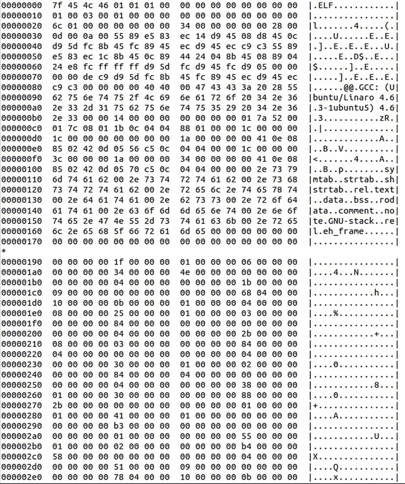
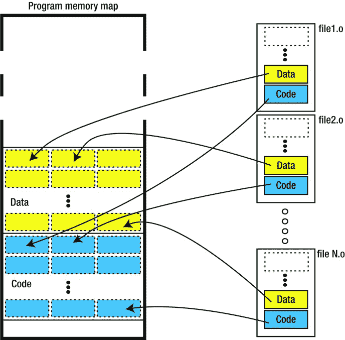
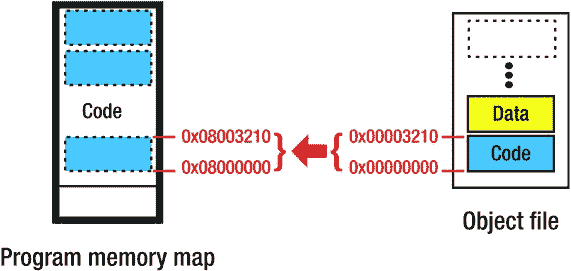
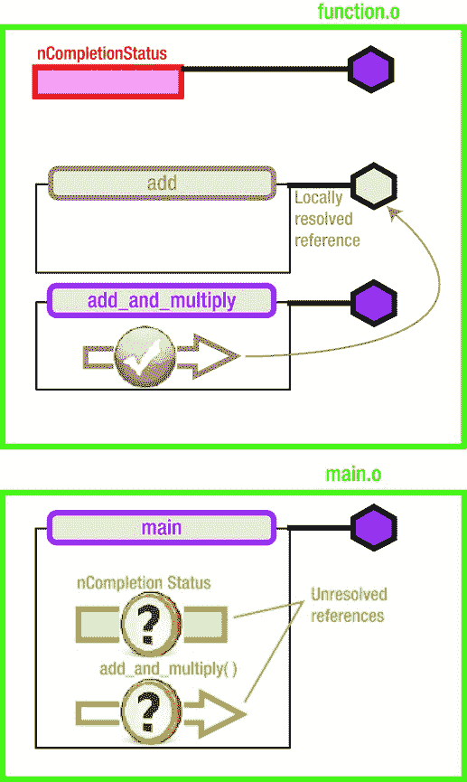
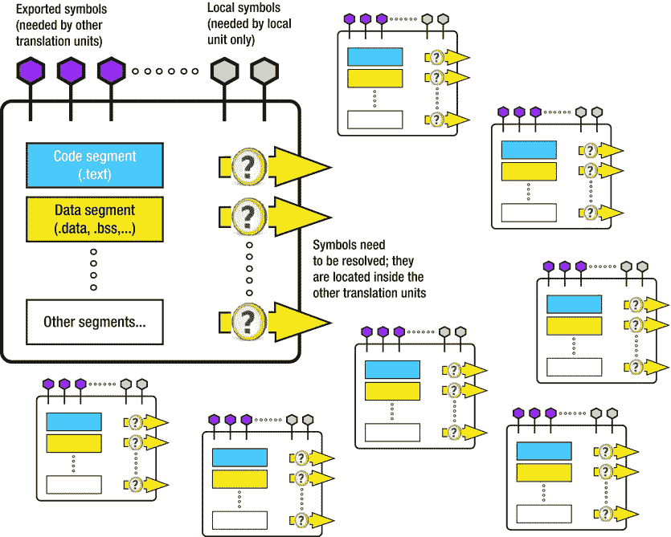

# 2.简单的程序生命周期阶段

Abstract

在前一章中，您已经广泛了解了现代多任务操作系统在程序执行过程中扮演的角色。程序员自然会想到的下一个问题是，为了安排程序执行，要做什么、如何做以及为什么要做。

在前一章中，您已经广泛了解了现代多任务操作系统在程序执行过程中扮演的角色。程序员自然会想到的下一个问题是，为了安排程序执行，要做什么、如何做以及为什么要做。

就像蝴蝶的生命周期由它的毛虫阶段决定一样，程序的生命周期在很大程度上由二进制文件的内部结构决定，操作系统加载程序加载、解包并将其内容放入执行中。我们随后的大部分讨论将致力于准备蓝图并将其恰当地嵌入到二进制可执行文件的主体中，这并不奇怪。我们将假设程序是用 C/C++ 编写的。

为了完全理解整个故事，将非常详细地分析程序生命周期的其余部分，即加载和执行阶段。进一步的讨论将集中在计划生命周期的以下阶段:

Creating the source code   Compiling   Linking   Loading   Executing  

说实话，这一章将会包含更多关于编译阶段的细节。后续阶段(尤其是链接阶段)的覆盖范围仅从本章开始，在这一章中，您将仅看到众所周知的“冰山一角”在链接阶段后面的最基本的思想介绍之后，本书的剩余部分将处理复杂的链接以及程序加载和执行。

## 初始假设

尽管很可能有很大比例的读者属于高级到专家程序员的范畴，但我将从相当简单的初始示例开始。这一章的讨论将与这个非常简单但很能说明问题的例子有关。演示项目由两个简单的源文件组成，它们将首先被编译，然后被链接在一起。编写这段代码的目的是将编译和链接的复杂性保持在尽可能简单的水平。

特别是，在这个演示例子中，没有外部库的链接，特别是动态链接。唯一的例外是与 C 运行时库的链接(这是绝大多数用 C 编写的程序所必需的)。作为 C 程序执行生命周期中的一个常见元素，为了简单起见，我将故意对与 C 运行时库链接的具体细节视而不见，并假设程序是以这样一种方式创建的，即所有来自 C 运行时库的代码都“自动地”插入到程序内存映射的主体中。

通过遵循这种方法，我将以简单明了的形式详细说明程序构建的本质问题。

## 代码编写

鉴于本书的主要主题是程序构建的过程(即，源代码编写后会发生什么)，我不会在源代码创建过程上花太多时间。

除了在少数情况下源代码是由脚本生成的，我们假设用户通过在他选择的编辑器中键入 ASCII 字符来生成满足所选编程语言(在我们的例子中是 C/C++)语法规则的书面语句。选择的编辑器可能各不相同，从最简单的 ASCII 文本编辑器一直到最先进的 IDE 工具。假设这本书的普通读者是一个相当有经验的程序员，那么对于程序生命周期的这个阶段，真的没有什么特别要说的。

然而，有一种特殊的编程实践会显著地影响故事从这一点开始的走向，值得特别关注。为了更好地组织源代码，程序员通常遵循将代码的各种功能部分保存在单独的文件中的做法，导致项目通常由许多不同的源文件和头文件组成。

这种编程实践很早就被采用了，因为开发环境是为早期的微处理器设计的。作为一个非常可靠的设计决策，它一直被实践到现在，因为它被证明提供了可靠的代码组织，并使代码维护任务变得非常容易。

这无疑是有用的编程实践，具有深远的影响。正如你将很快看到的，实践它会在构建过程的后续阶段导致一定量的不确定性，解决这个问题需要一些仔细的思考。

### 概念图:演示项目

为了更好地说明编译过程的复杂性，也为了给读者提供一点动手热身的体验，我们提供了一个简单的演示项目。代码非常简单；它只包含一个头文件和两个源文件。然而，它是经过精心设计的，旨在说明对于理解更广泛的图景极其重要的几点。

以下文件是项目的一部分:

*   源文件 main.c，其中包含了`main()`函数。
*   头文件 function.h，声明被调用的函数和由`main()`函数访问的数据。
*   源文件 function.c，包含函数的源代码实现和由`main()`函数引用的数据的实例化。

用于构建这个简单项目的开发环境将基于运行在 Linux 上的 gcc 编译器。清单 2-1 到 2-3 包含了演示项目中使用的代码。

清单 2-1。`function.h`

`#pragma once`

`#define FIRST_OPTION`

`#ifdef FIRST_OPTION`

`#define MULTIPLIER (3.0)`

`#else`

`#define MULTIPLIER (2.0)#endif`

`float add_and_multiply(float x, float y);`

清单 2-2。`function.c`

`int nCompletionStatus = 0;`

`float add(float x, float y)`

`{`

`float z = x + y;`

`return z;`

`}`

`float add_and_multiply(float x, float y)`

`{`

`float z = add(x,y);`

`z *= MULTIPLIER;`

`return z;`

`}`

清单 2-3。`main.c`

`#include "function.h"`

`extern int nCompletionStatus = 0;`

`int main(int argc, char* argv[])`

`{`

`float x = 1.0;`

`float y = 5.0;`

`float z;`

`z = add_and_multiply(x,y);`

`nCompletionStatus = 1;`

`return 0;`

`}`

## 收集

一旦你写好了你的源代码，是时候让你自己沉浸在代码构建的过程中了，其强制性的第一步是编译阶段。在深入复杂的编译之前，先介绍几个简单的介绍性术语。

### 介绍性定义

广义的编译可以定义为将一种编程语言编写的源代码转换成另一种编程语言的过程。以下一组介绍性事实对于您全面理解编译过程非常重要:

*   编译的过程是由称为编译器的程序执行的。
*   编译器的输入是一个翻译单元。典型的翻译单元是包含源代码的文本文件。
*   一个程序通常由许多翻译单元组成。尽管将项目的所有源代码保存在一个文件中是完全可能和合法的，但是有充分的理由(在前一节中解释过)说明为什么通常不是这样。
*   编译的输出是一组二进制目标文件，每个输入翻译单元一个。
*   为了变得适合执行，目标文件需要通过另一个称为链接的程序构建阶段进行处理。

图 [2-1](#Fig1) 说明了编译的概念。

图 2-1。

The compiling stage

### 相关定义

通常会遇到以下各种编译器用例:

*   严格意义上的编译是指将高级语言的代码翻译成低级语言的代码(通常是汇编程序甚至是机器码)的过程。
*   如果编译是在一个平台(CPU/OS)上执行，以产生要在另一个平台(CPU/OS)上运行的代码，这就叫做交叉编译。通常的做法是使用一些桌面操作系统(Linux、Windows)来为嵌入式或移动设备生成代码。
*   反编译(反汇编)是将低级语言的源代码转换成高级语言的过程。
*   语言翻译是将一种编程语言的源代码转换成另一种相同级别和复杂度的编程语言的过程。
*   语言重写是将语言表达式重写为更适合某些任务(如优化)的形式的过程。

### 编译的各个阶段

汇编过程在本质上不是单一的。事实上，它可以大致分为几个阶段(预处理，语言分析，汇编，优化，代码发射)，其细节将在下面讨论。

#### 预处理

处理源文件的标准第一步是通过称为预处理器的特殊文本处理程序运行它们，该程序执行以下一个或多个操作:

*   将包含定义的文件(包含/头文件)包含到源文件中，如关键字`#include`所指定的。
*   将使用`#define`语句指定的值转换成常量。
*   在调用宏的不同位置将宏定义转换为代码。
*   根据`#if`、`#elif`和`#endif`指令的位置，有条件地包含或排除代码的某些部分。

预处理器的输出是最终形状的 C/C++ 代码，它将被传递到下一个阶段，语法分析。

##### 演示项目预处理示例

gcc 编译器提供了一种模式，在这种模式下，仅对输入源文件执行预处理阶段:

`gcc -i <input file> -o <output preprocessed file>.i`

除非另有说明，预处理器的输出是与输入文件同名的文件，其文件扩展名为. I。对文件`function.c`运行预处理器的结果如清单 2-4 所示。

清单 2-4。`function.i`

`# 1 "function.c"`

`# 1 "`

`# 1 "`

`# 1 "function.h" 1`

`# 11 "function.h"`

`float add_and_multiply(float x, float y);`

`# 2 "function.c" 2`

`int nCompletionStatus = 0;`

`float add(float x, float y)`

`{`

`float z = x + y;`

`return z;`

`}`

`float add_and_multiply(float x, float y)`

`{`

`float z = add(x,y);`

`z *= MULTIPLIER;`

`return z;`

`}`

如果传递给 gcc 的额外标志很少，可能会获得更紧凑、更有意义的预处理器输出，比如

`gcc -E -P -i <input file> -o <output preprocessed file>.i`

这产生了清单 2-5 中所示的预处理文件。

清单 2-5。`function.i (Trimmed Down Version)`

`float add_and_multiply(float x, float y);`

`int nCompletionStatus = 0;`

`float add(float x, float y)`

`{`

`float z = x + y;`

`return z;`

`}`

`float add_and_multiply(float x, float y)`

`{`

`float z = add(x,y);`

`z *=``3.0`T2】

`return z;`

`}`

显然，预处理器替换了符号`MULTIPLIER`，基于定义了`USE_FIRST_OPTION`变量的事实，它的实际值最终是 3.0。

#### 语言分析

在这个阶段，编译器首先将 C/C++ 代码转换成更适合处理的形式(删除注释和不必要的空格，从文本中提取标记等)。).对源代码的这种优化和压缩形式进行词汇分析，目的是检查程序是否满足编写它的编程语言的语法规则。如果检测到与语法规则的偏差，则会报告错误或警告。这些错误足以导致编译终止，而警告可能足够，也可能不够，这取决于用户的设置。

对编译过程的这个阶段的更精确的观察揭示了三个不同的阶段:

*   词法分析，将源代码分成不可分割的标记。下一阶段，
*   解析/语法分析将提取的标记连接成标记链，并验证它们的排序从编程语言规则的角度来看是有意义的。最后，
*   语义分析的目的是发现语法正确的语句实际上是否有意义。例如，将两个整数相加并将结果赋给一个对象的语句将通过语法规则，但可能无法通过语义检查(除非该对象覆盖了赋值运算符)。

在语言分析阶段，编译器可能更应该被称为“抱怨者”，因为它往往更多地抱怨打字错误或遇到的其他错误，而不是实际编译代码。

#### 装配

只有在验证源代码不包含语法错误之后，编译器才会到达这个阶段。在这个阶段，编译器试图将标准语言结构转换成特定于实际 CPU 指令集的结构。不同的 CPU 有不同的功能处理，一般来说，可用的指令、寄存器和中断也不同，这就解释了为什么会有各种各样的编译器适用于更多种类的处理器。

##### 演示项目组装示例

gcc 编译器提供了一种操作模式，在这种模式下，输入文件的源代码被转换成包含特定于芯片和/或操作系统的汇编指令行的 ASCII 文本文件。

`$ gcc` `-S` `<input file> -o <output assembler file>.s`

除非另外指定，否则预处理器的输出是与输入文件同名的文件，其文件扩展名为. s。

生成的文件不适合执行；它仅仅是一个文本文件，带有人类可读的汇编指令助记符，开发人员可以使用它来更好地了解编译过程的内部工作细节。

在 X86 处理器体系结构的特定情况下，汇编代码可以符合两种支持的指令打印格式之一，其选择可以通过向 gcc 汇编程序传递额外的命令行参数来指定。格式的选择大多是开发者个人口味的问题。

*   美国电话电报公司格式
*   英特尔格式

the choice of which may be specified by passing an extra command-line argument to the gcc assembler. The choice of format is mostly the matter of the developer’s personal taste.

##### 美国电话电报公司组件格式示例

当通过运行以下命令将文件`function.c`汇编成 AT & T 格式时

`$ gcc -S -masm=att function.c -o function.s`

它创建了输出汇编文件，如清单 2-6 所示。

清单 2-6。`function.s (AT&T Assembler Format)`

`.file     "function.c"`

`.globl    nCompletionStatus`

`.bss`

`.align 4`

`.type     nCompletionStatus, @object`

`.size     nCompletionStatus, 4`

`nCompletionStatus:`

`.zero     4`

`.text`

`.globl    add`

`.type     add, @function`

`add:`

`.LFB0:`

`.cfi_startproc`

`pushl     %ebp`

`.cfi_def_cfa_offset 8`

`.cfi_offset 5, -8`

`movl      %esp, %ebp`

`.cfi_def_cfa_register 5`

`subl      $20, %esp`

`flds      8(%ebp)`

`fadds     12(%ebp)`

`fstps     -4(%ebp)`

`movl      -4(%ebp), %eax`

`movl      %eax, -20(%ebp)`

`flds      -20(%ebp)`

`leave`

`.cfi_restore 5`

`.cfi_def_cfa 4, 4`

`ret`

`.cfi_endproc`

`.LFE0:`

`.size     add, .-add`

`.globl    add_and_multiply`

`.type     add_and_multiply, @function`

`add_and_multiply:`

`.LFB1:`

`.cfi_startproc`

`pushl     %ebp`

`.cfi_def_cfa_offset 8`

`.cfi_offset 5, -8`

`movl      %esp, %ebp`

`.cfi_def_cfa_register 5`

`subl      $28, %esp`

`movl      12(%ebp), %eax`

`movl      %eax, 4(%esp)`

`movl      8(%ebp), %eax`

`movl      %eax, (%esp)`

`call      add`

`fstps     -4(%ebp)`

`flds      -4(%ebp)`

`flds      .LC1`

`fmulp     %st, %st(1)`

`fstps     -4(%ebp)`

`movl      -4(%ebp), %eax`

`movl      %eax, -20(%ebp)`

`flds      -20(%ebp)`

`leave`

`.cfi_restore 5`

`.cfi_def_cfa 4, 4`

`ret`

`.cfi_endproc`

`.LFE1:`

`.size     add_and_multiply, .-add_and_multiply`

`.section          .rodata`

`.align 4`

`.LC1:`

`.long     1077936128`

`.ident    "GCC: (Ubuntu/Linaro 4.6.3-1ubuntu5) 4.6.3"`

`.section          .note.GNU-stack,"",@progbits`

##### 英特尔组件格式示例

通过运行以下命令，可以将同一个文件(`function.c`)汇编成英特尔汇编程序格式。

`$ gcc -S -masm=intel function.c -o function.s`

这产生了清单 2-7 所示的汇编文件。

清单 2-7。`function.s (Intel Assembler Format)`

`.file     "function.c"`

`.intel_syntax noprefix`

`.globl    nCompletionStatus`

`.bss`

`.align 4`

`.type     nCompletionStatus, @object`

`.size     nCompletionStatus, 4`

`nCompletionStatus:`

`.zero     4`

`.text`

`.globl    add`

`.type     add, @function`

`add:`

`.LFB0:`

`.cfi_startproc`

`push      ebp`

`.cfi_def_cfa_offset 8`

`.cfi_offset 5, -8`

`mov       ebp, esp`

`.cfi_def_cfa_register 5`

`sub       esp, 20`

`fld       DWORD PTR [ebp+8]`

`fadd      DWORD PTR [ebp+12]`

`fstp      DWORD PTR [ebp-4]`

`mov       eax, DWORD PTR [ebp-4]`

`mov       DWORD PTR [ebp-20], eax`

`fld       DWORD PTR [ebp-20]`

`leave`

`.cfi_restore 5`

`.cfi_def_cfa 4, 4`

`ret`

`.cfi_endproc`

`.LFE0:`

`.size     add, .-add`

`.globl    add_and_multiply`

`.type     add_and_multiply, @function`

`add_and_multiply:`

`.LFB1:`

`.cfi_startproc`

`push      ebp`

`.cfi_def_cfa_offset 8`

`.cfi_offset 5, -8`

`mov       ebp, esp`

`.cfi_def_cfa_register 5`

`sub       esp, 28`

`mov       eax, DWORD PTR [ebp+12]`

`mov       DWORD PTR [esp+4], eax`

`mov       eax, DWORD PTR [ebp+8]`

`mov       DWORD PTR [esp], eax`

`call      add`

`fstp      DWORD PTR [ebp-4]`

`fld       DWORD PTR [ebp-4]`

`fld       DWORD PTR .LC1`

`fmulp     st(1), st`

`fstp      DWORD PTR [ebp-4]`

`mov       eax, DWORD PTR [ebp-4]`

`mov       DWORD PTR [ebp-20], eax`

`fld       DWORD PTR [ebp-20]`

`leave`

`.cfi_restore 5`

`.cfi_def_cfa 4, 4`

`ret`

`.cfi_endproc`

`.LFE1:`

`.size     add_and_multiply, .-add_and_multiply`

`.section          .rodata`

`.align 4`

`.LC1:`

`.long     1077936128`

`.ident    "GCC: (Ubuntu/Linaro 4.6.3-1ubuntu5) 4.6.3"`

`.section          .note.GNU-stack,"",@progbits`

#### 最佳化

一旦创建了对应于原始源代码的第一个汇编版本，优化工作就开始了，其中寄存器的使用被最小化。此外，该分析可以指示代码的某些部分实际上不需要被执行，并且代码的这些部分被消除。

#### 代码发射

最后，创建编译输出的时候到了:目标文件，每个翻译单元一个。汇编指令(以人类可读的 ASCII 码编写)在这个阶段被转换成相应机器指令(操作码)的二进制值，并写入目标文件中的特定位置。

目标文件仍然没有准备好作为食物提供给饥饿的处理器。其中的原因是这本书的主题。此时有趣的话题是对一个目标文件的分析。

作为二进制文件，目标文件与预处理和汇编过程的输出有本质的不同，它们都是 ASCII 文件，人天生可读。当我们人类试图更仔细地观察内容时，差异变得最明显。

除了明显选择使用十六进制编辑器(除非你以编写编译器为生，否则没有太大帮助)之外，为了深入了解目标文件的内容，还采用了一个叫做反汇编的特定过程。

在从 ASCII 文件到适合在具体机器上执行的二进制文件的整个路径上，反汇编可以被视为一个小的 U 形转弯，即将就绪的二进制文件被转换成 ASCII 文件，以满足软件开发人员好奇的目光。幸运的是，这个小小的迂回只是为了给开发人员提供更好的方向，没有真正的原因通常不会执行。

#### 演示项目编译示例

gcc 编译器可以被设置为执行完整的编译(预处理、汇编和编译)，这是一个生成二进制目标文件(标准扩展名)的过程。o)其结构遵循 ELF 格式指南。除了通常开销(标题、表格等)。)，它包含所有相关的部分(。文本，。代码，。bss 等。).为了只指定编译(还没有链接)，可以使用下面的命令行:

`$ gcc``-c`T2】

除非另外指定，否则预处理器的输出是与输入文件同名的文件，其文件扩展名为. o。

生成的目标文件的内容不适合在文本编辑器中查看。十六进制编辑器/查看器更合适一些，因为它不会被不可打印的字符和缺少换行符所混淆。图 [2-2](#Fig2) 显示了编译该演示项目文件`function.c`生成的目标文件`function.o`的二进制内容。

图 2-2。

Binary contents of an object file

显然，仅仅看一下目标文件的十六进制值并不能告诉我们太多。分解过程有可能告诉我们更多的信息。

名为 objdump(流行的 binutils 包的一部分)的 Linux 工具专门负责反汇编二进制文件，以及其他许多事情。除了转换特定于给定平台的二进制机器指令序列之外，它还指定指令驻留的地址。

它支持打印汇编代码的美国电话电报公司(默认)和英特尔风格，这并不奇怪。

通过运行简单形式的 objdump 命令，

`$ objdump``-D`T2】

您会在终端屏幕上看到以下内容:

`disassembled output of function.o (AT&` `T assembler format)`

`function.o:     file format elf32-i386`

`Disassembly of section .text:`

`00000000 <add>:`

`0:  55                      push   %ebp`

`1:  89 e5                   mov    %esp,%ebp`

`3:  83 ec 14                sub    $0x14,%esp`

`6:  d9 45 08                flds   0x8(%ebp)`

`9:  d8 45 0c                fadds  0xc(%ebp)`

`c:  d9 5d fc                fstps  -0x4(%ebp)`

`f:  8b 45 fc                mov    -0x4(%ebp),%eax`

`12:  89 45 ec                mov    %eax,-0x14(%ebp)`

`15:  d9 45 ec                flds   -0x14(%ebp)`

`18:  c9                      leave`

`19:  c3                      ret`

`0000001a <add_and_multiply>:`

`1a:  55                      push   %ebp`

`1b:  89 e5                   mov    %esp,%ebp`

`1d:  83 ec 1c                sub    $0x1c,%esp`

`20:  8b 45 0c                mov    0xc(%ebp),%eax`

`23:  89 44 24 04             mov    %eax,0x4(%esp)`

`27:  8b 45 08                mov    0x8(%ebp),%eax`

`2a:  89 04 24                mov    %eax,(%esp)`

`2d:  e8 fc ff ff ff          call   2e <add_and_multiply+0x14>`

`32:  d9 5d fc                fstps  -0x4(%ebp)`

`35:  d9 45 fc                flds   -0x4(%ebp)`

`38:  d9 05 00 00 00 00       flds   0x0`

`3e:  de c9                   fmulp  %st,%st(1)`

`40:  d9 5d fc                fstps  -0x4(%ebp)`

`43:  8b 45 fc                mov    -0x4(%ebp),%eax`

`46:  89 45 ec                mov    %eax,-0x14(%ebp)`

`49:  d9 45 ec                flds   -0x14(%ebp)`

`4c:  c9                      leave`

`4d:  c3                      ret`

`Disassembly of section .bss:`

`00000000 <nCompletionStatus>:`

`0:  00 00                   add    %al,(%eax)`

`...`

`Disassembly of section .rodata:`

`00000000 <.rodata>:`

`0:  00 00                   add    %al,(%eax)`

`2:  40                      inc    %eax`

`3:  40                      inc    %eax`

`Disassembly of section .comment:`

`00000000 <.comment>:`

`0:  00 47 43                add    %al,0x43(%edi)`

`3:  43                      inc    %ebx`

`4:  3a 20                   cmp    (%eax),%ah`

`6:  28 55 62                sub    %dl,0x62(%ebp)`

`9:  75 6e                   jne    79 <add_and_multiply+0x5f>`

`b:  74 75                   je     82 <add_and_multiply+0x68>`

`d:  2f                      das`

`e:  4c                      dec    %esp`

`f:  69 6e 61 72 6f 20 34    imul   $0x34206f72,0x61(%esi),%ebp`

`16:  2e 36 2e 33 2d 31 75    cs ss xor %cs:%ss:0x75627531,%ebp`

`1d:  62 75`

`1f:  6e                      outsb  %ds:(%esi),(%dx)`

`20:  74 75                   je     97 <add_and_multiply+0x7d>`

`22:  35 29 20 34 2e          xor    $0x2e342029,%eax`

`27:  36 2e 33 00             ss xor %cs:%ss:(%eax),%eax`

`Disassembly of section .eh_frame:`

`00000000 <.eh_frame>:`

`0:  14 00                   adc    $0x0,%al`

`2:  00 00                   add    %al,(%eax)`

`4:  00 00                   add    %al,(%eax)`

`6:  00 00                   add    %al,(%eax)`

`8:  01 7a 52                add    %edi,0x52(%edx)`

`b:  00 01                   add    %al,(%ecx)`

`d:  7c 08                   jl     17 <.eh_frame+0x17>`

`f:  01 1b                   add    %ebx,(%ebx)`

`11:  0c 04                   or     $0x4,%al`

`13:  04 88                   add    $0x88,%al`

`15:  01 00                   add    %eax,(%eax)`

`17:  00 1c 00                add    %bl,(%eax,%eax,1)`

`1a:  00 00                   add    %al,(%eax)`

`1c:  1c 00                   sbb    $0x0,%al`

`1e:  00 00                   add    %al,(%eax)`

`20:  00 00                   add    %al,(%eax)`

`22:  00 00                   add    %al,(%eax)`

`24:  1a 00                   sbb    (%eax),%al`

`26:  00 00                   add    %al,(%eax)`

`28:  00 41 0e                add    %al,0xe(%ecx)`

`2b:  08 85 02 42 0d 05       or     %al,0x50d4202(%ebp)`

`31:  56                      push   %esi`

`32:  c5 0c 04                lds    (%esp,%eax,1),%ecx`

`35:  04 00                   add    $0x0,%al`

`37:  00 1c 00                add    %bl,(%eax,%eax,1)`

`3a:  00 00                   add    %al,(%eax)`

`3c:  3c 00                   cmp    $0x0,%al`

`3e:  00 00                   add    %al,(%eax)`

`40:  1a 00                   sbb    (%eax),%al`

`42:  00 00                   add    %al,(%eax)`

`44:  34 00                   xor    $0x0,%al`

`46:  00 00                   add    %al,(%eax)`

`48:  00 41 0e                add    %al,0xe(%ecx)`

`4b:  08 85 02 42 0d 05       or     %al,0x50d4202(%ebp)`

`51:  70 c5                   jo     18 <.eh_frame+0x18>`

`53:  0c 04                   or     $0x4,%al`

`55:  04 00                   add    $0x0,%al`

`...`

类似地，通过指定英特尔风格，

`$ objdump -D -M intel <input file>.o`

您会在终端屏幕上看到以下内容:

`disassembled output of function.o (Intel assembler format)`

`function.o:     file format elf32-i386`

`Disassembly of section .text:`

`00000000 <add&gt:`

`0:  55                      push   ebp`

`1:  89 e5                   mov    ebp,esp`

`3:  83 ec 14                sub    esp,0x14`

`6:  d9 45 08                fld    DWORD PTR [ebp+0x8]`

`9:  d8 45 0c                fadd   DWORD PTR [ebp+0xc]`

`c:  d9 5d fc                fstp   DWORD PTR [ebp-0x4]`

`f:  8b 45 fc                mov    eax,DWORD PTR [ebp-0x4]`

`12:  89 45 ec                mov    DWORD PTR [ebp-0x14],eax`

`15:  d9 45 ec                fld    DWORD PTR [ebp-0x14]`

`18:  c9                      leave`

`19:  c3                      ret`

`0000001a <add_and_multiply>:`

`1a:  55                     push   ebp`

`1b:  89 e5                  mov    ebp,esp`

`1d:  83 ec 1c               sub    esp,0x1c`

`20:  8b 45 0c               mov    eax,DWORD PTR [ebp+0xc]`

`23:  89 44 24 04            mov    DWORD PTR [esp+0x4],eax`

`27:  8b 45 08               mov    eax,DWORD PTR [ebp+0x8]`

`2a:  89 04 24               mov    DWORD PTR [esp],eax`

`2d:  e8 fc ff ff ff         call   2e <add_and_multiply+0x14>`

`32:  d9 5d fc               fstp   DWORD PTR [ebp-0x4]`

`35:  d9 45 fc               fld    DWORD PTR [ebp-0x4]`

`38:  d9 05 00 00 00 00      fld    DWORD PTR ds:0x0`

`3e:  de c9                  fmulp  st(1),st`

`40:  d9 5d fc               fstp   DWORD PTR [ebp-0x4]`

`43:  8b 45 fc               mov    eax,DWORD PTR [ebp-0x4]`

`46:  89 45 ec               mov    DWORD PTR [ebp-0x14],eax`

`49:  d9 45 ec               fld    DWORD PTR [ebp-0x14]`

`4c:  c9                     leave`

`4d:  c3                     ret`

`Disassembly of section .bss:`

`00000000 <nCompletionStatus>:`

`0:  00 00                  add    BYTE PTR [eax],al`

`...`

`Disassembly of section .rodata:`

`00000000 <.rodata>:`

`0:  00 00                  add    BYTE PTR [eax],al`

`2:  40                     inc    eax`

`3:  40                     inc    eax`

`Disassembly of section .comment:`

`00000000 <.comment>:`

`0:  00 47 43               add    BYTE PTR [edi+0x43],al`

`3:  43                     inc    ebx`

`4:  3a 20                  cmp    ah,BYTE PTR [eax]`

`6:  28 55 62               sub    BYTE PTR [ebp+0x62],dl`

`9:  75 6e                  jne    79 <add_and_multiply+0x5f>`

`b:  74 75                  je     82 <add_and_multiply+0x68>`

`d:  2f                     das`

`e:  4c                     dec    esp`

`f:  69 6e 61 72 6f 20 34   imul   ebp,DWORD PTR [esi+0x61],0x34206f72`

`16:  2e 36 2e 33 2d 31 75   cs ss xor ebp,DWORD PTR cs:ss:0x75627531`

`1d:  62 75`

`1f:  6e                     outs   dx,BYTE PTR ds:[esi]`

`20:  74 75                  je     97 <add_and_multiply+0x7d>`

`22:  35 29 20 34 2e         xor    eax,0x2e342029`

`27:  36 2e 33 00            ss xor eax,DWORD PTR cs:ss:[eax]`

`Disassembly of section .eh_frame:`

`00000000 <.eh_frame>:`

`0:  14 00                  adc    al,0x0`

`2:  00 00                  add    BYTE PTR [eax],al`

`4:  00 00                  add    BYTE PTR [eax],al`

`6:  00 00                  add    BYTE PTR [eax],al`

`8:  01 7a 52               add    DWORD PTR [edx+0x52],edi`

`b:  00 01                  add    BYTE PTR [ecx],al`

`d:  7c 08                  jl     17 <.eh_frame+0x17>`

`f:  01 1b                  add    DWORD PTR [ebx],ebx`

`11:  0c 04                  or     al,0x4`

`13:  04 88                  add    al,0x88`

`15:  01 00                  add    DWORD PTR [eax],eax`

`17:  00 1c 00               add    BYTE PTR [eax+eax*1],bl`

`1a:  00 00                  add    BYTE PTR [eax],al`

`1c:  1c 00                  sbb    al,0x0`

`1e:  00 00                  add    BYTE PTR [eax],al`

`20:  00 00                  add    BYTE PTR [eax],al`

`22:  00 00                  add    BYTE PTR [eax],al`

`24:  1a 00                  sbb    al,BYTE PTR [eax]`

`26:  00 00                  add    BYTE PTR [eax],al`

`28:  00 41 0e               add    BYTE PTR [ecx+0xe],al`

`2b:  08 85 02 42 0d 05      or     BYTE PTR [ebp+0x50d4202],al`

`31:  56                     push   esi`

`32:  c5 0c 04               lds    ecx,FWORD PTR [esp+eax*1]`

`35:  04 00                  add    al,0x0`

`37:  00 1c 00               add    BYTE PTR [eax+eax*1],bl`

`3a:  00 00                  add    BYTE PTR [eax],al`

`3c:  3c 00                  cmp    al,0x0`

`3e:  00 00                  add    BYTE PTR [eax],al`

`40:  1a 00                  sbb    al,BYTE PTR [eax]`

`42:  00 00                  add    BYTE PTR [eax],al`

`44:  34 00                  xor    al,0x0`

`46:  00 00                  add    BYTE PTR [eax],al`

`48:  00 41 0e               add    BYTE PTR [ecx+0xe],al`

`4b:  08 85 02 42 0d 05      or     BYTE PTR [ebp+0x50d4202],al`

`51:  70 c5                  jo     18 <.eh_frame+0x18>`

`53:  0c 04                  or     al,0x4`

`55:  04 00                  add    al,0x0`

`...`

### 目标文件属性

编译过程的输出是一个或多个二进制目标文件，其结构自然是下一个感兴趣的主题。正如您将很快看到的，目标文件的结构包含许多在真正理解更广阔的图景的道路上重要的细节。

在草图中，

*   目标文件是翻译其原始对应源文件的结果。编译的结果是项目中有多少源文件就有多少目标文件的集合。

编译完成后，目标文件在程序构建过程的后续阶段继续表示其原始源文件。

*   目标文件的基本成分是符号(对程序或数据存储器中存储地址的引用)以及段。

在目标文件中最常见的部分是代码(。文本)、初始化数据(。数据)、未初始化的数据(。bss)，以及一些更专业的部分(调试信息等)。).

*   构建程序的最终目的是将编译单个源文件获得的部分组合(平铺)成一个二进制可执行文件。

这样的二进制文件将包含相同类型的部分(。文本，。数据，。bss，。。。)是通过将各个文件的部分平铺在一起而获得的。形象地说，一个对象文件可以被看作是一个简单的瓷砖，等待在进程内存映射的巨大马赛克中找到自己的位置。

*   然而，目标文件的内部结构并没有暗示各个部分最终将驻留在程序存储器映射中的什么位置。由于这个原因，每个目标文件中每个部分的地址范围被暂时设置为从零值开始。

目标文件中某一段最终驻留在程序映象中的实际地址范围将在程序建立过程的后续阶段(链接)中确定。

*   在将目标文件的段平铺到结果程序内存映射中的过程中，唯一真正重要的参数是其段的长度，或者更准确地说，是其地址范围。
*   目标文件不包含对堆栈和/或堆有贡献的部分。存储器映射的这两个部分的内容完全是在运行时确定的，除了默认的字节长度之外，不需要特定于程序的初始设置。
*   目标文件对程序的贡献。bss(未初始化数据)部分非常初级；那个。bss 部分仅通过其字节长度来描述。这些信息正是加载程序建立。bss 段作为内存的一部分，其中将存储一些数据。

一般来说，信息是根据以二进制格式规范的形式概括的一组规则存储在目标文件中的，这些规则的细节在不同的平台上有所不同(Windows 与 Linux、32 位与 64 位、x86 与 ARM 处理器系列)。

通常，二进制格式规范旨在支持 C/C++ 语言结构和相关的实现问题。二进制格式规范经常涵盖各种二进制文件模式，如可执行文件、静态库和动态库。

在 Linux 上，可执行可链接格式(ELF)已经得到了普及。在 Windows 上，二进制文件通常符合 PE/COFF 格式规范。

### 编译过程限制

一步一步，程序构建过程的巨大拼图的碎片开始就位，整个故事的广阔而清晰的画面慢慢浮现。到目前为止，您已经了解了编译过程将 ASCII 源文件翻译成相应的二进制目标文件集合。每个目标文件都包含段，每个段的命运都是最终成为程序内存映射的巨大拼图的一部分，如图 [2-3](#Fig3) 所示。

图 2-3。

Tiling the individual sections into the final program memory map

剩下的任务是将存储在单个目标文件中的单个部分拼接到程序内存映射体中。正如前面提到的，这个任务需要留给程序构建过程的另一个阶段，叫做链接。

细心的观察者不禁会问(在进入链接过程的细节之前),为什么我们需要构建过程的全新阶段，或者更准确地说，为什么到目前为止描述的编译过程不能完成任务的平铺部分？

拆分构建过程有几个非常充分的理由，本节的其余部分将试图阐明导致这种决定的环境。

简而言之，答案可以用几句简单的话来提供。首先，将这些部分组合在一起(尤其是代码部分)并不总是简单的。这一因素肯定起一定的作用，但并不充分；有许多编程语言的程序构建过程可以一步完成(换句话说，它们不需要将过程分成两个阶段)。

第二，应用于程序构建过程的代码重用原则(以及将来自不同项目的二进制部分组合在一起的能力)明确肯定了将 C/C++ 构建实现为两步(编译和链接)过程的决定。

#### 是什么让组合变得如此复杂？

在很大程度上，将源代码翻译成二进制目标文件是一个相当简单的过程。代码行被翻译成特定于处理器的机器代码指令；为初始化变量保留空间，并向其中写入初始值；未初始化变量的空间被保留并用零填充，等等。

然而，整个故事中有一部分注定会引起一些问题:即使源代码被分组到专用的源文件中，成为同一个程序的一部分意味着一定存在某些相互的联系。事实上，代码不同部分之间的连接通常是通过以下两种方式建立的:

*   功能独立的代码体之间的函数调用:

例如，聊天应用的 GUI 相关源文件中的函数可以调用 TCP/IP 网络源文件中的函数，该函数又可以调用位于加密源文件中的函数。

*   外部变量:

在 C 编程语言领域(在 C++ 领域要少得多)，通常的做法是保留全局可见的变量，以维护代码各个部分的状态。更广泛使用的变量通常在一个源文件中声明为全局变量，并作为外部变量从所有其他源文件中引用。

一个典型的例子是标准 C 库中使用的 errno 变量，用于保存最后遇到的错误的值。

为了访问这两个(通常称为符号)中的任何一个，必须知道它们的地址(更准确地说，是函数在程序存储器中的地址和/或全局变量在数据存储器中的地址)。

但是，在将各个段合并到相应的程序段之前(即，在段平铺完成之前)，无法知道实际地址！！！).在此之前，函数和它的调用者之间的有意义的连接和/或对外部变量的访问是不可能建立的，这两者都被适当地报告为未解析的引用。请注意，如果函数或全局变量是从定义它的同一个源文件中引用的，就不会出现这种问题。在这种特殊的情况下，函数/变量和它们的调用者/用户最终都是同一个部分的一部分，并且它们相对于彼此的位置在“大拼图完成”之前就已经知道了在这种情况下，一旦切片完成，相对内存地址就变得具体和可用。

正如本节前面提到的，解决这种问题仍然不要求构建过程必须分为两个不同的阶段。事实上，许多不同的语言都成功地实现了一遍构建过程。然而，应用于构建程序领域的重用概念(在本例中是二进制重用)最终确定了将程序构建分为两个阶段(编译和链接)的决策。

## 连接

程序构建过程的第二阶段是链接。链接过程的输入是由先前完成的编译阶段创建的目标文件的集合。每个目标文件可以被看作是对所有类型的程序存储器映射部分(代码、初始化数据、未初始化数据、调试信息等)的单独源文件贡献的二进制存储。).链接器的最终任务是从单个贡献中形成结果程序内存映射部分，并解析所有引用。提醒一下，虚拟存储器的概念简化了链接器的任务，因为它允许假设链接器需要填充的程序存储器映射是对于每个程序的相同大小的从零开始的地址范围，而不管操作系统在运行时给进程什么地址范围。

为了简单起见，我将在这个例子中涵盖最简单的可能情况，其中对程序存储器映射部分的贡献仅仅来自属于同一个项目的文件。实际上，由于二进制重用概念的发展，这可能不是真的。

### 链接阶段

链接过程通过一系列阶段(重定位、引用解析)进行，这将在下面详细讨论。

#### 重新安置

链接程序的第一阶段就是平铺，在这个过程中，包含在单个目标文件中的各种类型的段被组合在一起，以创建程序存储器映射段(见图 [2-4](#Fig4) )。为了完成这个任务，先前中立的、从零开始的起作用的段的地址范围被转换成结果程序存储器映射的更具体的地址范围。

图 2-4。

Relocation, the first phase of the linking stage

措辞“更具体”用于强调由链接器创建的结果程序映像本身仍然是中性的。请记住，虚拟寻址机制使每个程序都有可能拥有相同的、相同的、简单的程序地址空间视图(驻留在 0 到 2N 之间)，而程序执行的实际物理地址在运行时由操作系统确定，对程序和程序员是不可见的。

一旦重新定位阶段完成，大多数(但不是全部！)的程序存储器映射已经被创建。

#### 解析引用

现在是困难的部分。以段为例，将它们的地址范围线性转换成程序存储器映射地址范围是相当容易的任务。更困难的任务是在代码的各个部分之间建立所需的连接，从而使程序同质。

让我们假设(考虑到这个演示程序的简单性，这是正确的)前面的所有构建阶段(完整的编译以及节重定位)都已经成功完成。现在是指出哪种问题留到最后的链接阶段解决的时候了。

如前所述，链接问题的根本原因相当简单:源自不同翻译单元(即源文件)的代码片段试图相互引用，但不可能知道这些项目将驻留在内存中的什么位置，直到目标文件被平铺到程序内存映射的主体中。导致问题最多的代码组件是那些与程序内存(函数入口点)或数据内存(全局/静态/外部)变量中的地址紧密绑定的组件。

在这个特定的代码示例中，您有以下情况:

*   函数`add_and_multiply`调用函数`add`，该函数驻留在同一个源文件中(即同一个目标文件中的同一个翻译单元)。在这种情况下，函数`add(`在程序存储器中的地址在某种程度上是一个已知的量，可以用它相对于目标文件`function.o`代码段的偏移量来表示。
*   现在函数`main`调用函数`add_and_multiply`并且引用外部变量`nCompletionStatus`，并且在计算它们所在的实际程序内存地址时遇到了巨大的问题。事实上，它只能假设这两个符号将在未来的某个时刻驻留在进程内存映射中的某个位置。但是，在内存映射形成之前，有两个条目只能被认为是未解决的引用。

这种情况在图 [2-5](#Fig5) 中用图形描述。

图 2-5。

The problem of unresolved references in its essential form

为了解决这类问题，必须出现解析引用的链接阶段。在这种情况下，链接器需要做的是

*   检查程序存储器映射中已经平铺在一起的部分。
*   找出代码的哪个部分调用了其原始部分之外的部分。
*   找出代码引用部分的确切位置(在内存映射中的哪个地址)。
*   最后，通过用程序存储器映射的实际地址替换机器指令中的虚拟地址来解析引用。

一旦链接器完成了它的魔法，情况可能看起来如图 [2-6](#Fig6) 所示。

图 2-6。

Resolved references

#### 演示项目链接示例

有两种方法可以编译和链接完整的演示项目来创建可执行文件，以便它可以运行。

在分步方法中，您将首先在两个源文件上调用编译器来生成目标文件。在接下来的步骤中，您将把两个目标文件链接到输出可执行文件中。

`$ gcc -c function.c main.c`

`$ gcc function.o main.o -o demoApp`

在一次性全部完成的方法中，只需一个命令就可以通过调用编译器和链接器来完成相同的操作。

`$ gcc function.c main.c -o demoApp`

为了这个演示的目的，让我们采取一步一步的方法，因为它将生成`main.o`对象文件，其中包含我想在这里演示的非常重要的细节。

文件的反汇编`main.o,`

`$ objdump -D -M intel main.o`

显示它包含未解析的引用。

`disassembled output of main.o (Intel assembler format)`

`main.o:     file format elf32-i386`

`Disassembly of section .text:`

`00000000 <main>:`

`0:  55                     push   ebp`

`1:  89 e5                  mov    ebp,esp`

`3:  83 e4 f0               and    esp,0xfffffff0`

`6:  83 ec 20               sub    esp,0x20`

`9:  b8 00 00 80 3f         mov    eax,0x3f800000`

`e:  89 44 24 14            mov    DWORD PTR [esp+0x14],eax`

`12:  b8 00 00 a0 40         mov    eax,0x40a00000`

`17:  89 44 24 18            mov    DWORD PTR [esp+0x18],eax`

`1b:  8b 44 24 18            mov    eax,DWORD PTR [esp+0x18]`

`1f:  89 44 24 04            mov    DWORD PTR [esp+0x4],eax`

`23:  8b 44 24 14            mov    eax,DWORD PTR [esp+0x14]`

`27:  89 04 24               mov    DWORD PTR [esp],eax`

`2a:  e8 fc ff ff ff         call` `2b  <main + 0x2b>`

`2f:  d9 5c 24 1c            fstp   DWORD PTR [esp+0x1c]`

`33:  c7 05 00 00 00 00 01   mov    DWORD PTR``ds:0x0`T2】

`3a:  00 00 00`

`3d:  b8 00 00 00 00         mov    eax,0x0`

`42:  c9                     leave`

`43:  c3                     ret   :`

2a 行有一个跳转到自身的调用指令(很奇怪吧？)而第 33 行显示了对驻留在地址 0x0 的变量的访问(更奇怪)。显然，这两个明显奇怪的值是链接器有目的地插入的。

然而，输出可执行文件的反汇编输出表明，不仅`main.o`目标文件的内容已经被重新定位到从地址 0x08048404 开始的地址范围，而且这两个问题点已经被链接器解决。

`$ objdump -D -M intel demoApp`

`disassembled output of demoApp (Intel assembler format)`

`080483ce <add_and_multiply>:`

`80483ce:        55                           push   ebp`

`80483cf:        89 e5                        mov    ebp,esp`

`80483d1:        83 ec 1c                     sub    esp,0x1c`

`80483d4:        8b 45 0c                     mov    eax,DWORD PTR [ebp+0xc]`

`80483d7:        89 44 24 04                  mov    DWORD PTR [esp+0x4],eax`

`80483db:        8b 45 08                     mov    eax,DWORD PTR [ebp+0x8]`

`80483de:        89 04 24                     mov    DWORD PTR [esp],eax`

`80483e1:        e8 ce ff ff ff               call   80483b4 <add>`

`80483e6:        d9 5d fc                     fstp   DWORD PTR [ebp-0x4]`

`80483e9:        d9 45 fc                     fld    DWORD PTR [ebp-0x4]`

`80483ec:        d9 05 20 85 04 08            fld    DWORD PTR ds:0x8048520`

`80483f2:        de c9                        fmulp  st(1),st`

`80483f4:        d9 5d fc                     fstp   DWORD PTR [ebp-0x4]`

`80483f7:        8b 45 fc                     mov    eax,DWORD PTR [ebp-0x4]`

`80483fa:        89 45 ec                     mov    DWORD PTR [ebp-0x14],eax`

`80483fd:        d9 45 ec                     fld    DWORD PTR [ebp-0x14]`

`8048400:        c9                           leave`

`8048401:        c3                           ret`

`8048402:        90                           nop`

`8048403:        90                           nop`

`08048404 <main>:`

`8048404:        55                           push   ebp`

`8048405:        89 e5                        mov    ebp,esp`

`8048407:        83 e4 f0                     and    esp,0xfffffff0`

`804840a:        83 ec 20                     sub    esp,0x20`

`804840d:        b8 00 00 80 3f               mov    eax,0x3f800000`

`8048412:        89 44 24 14                  mov    DWORD PTR [esp+0x14],eax`

`8048416:        b8 00 00 a0 40               mov    eax,0x40a00000`

`804841b:        89 44 24 18                  mov    DWORD PTR [esp+0x18],eax`

`804841f:        8b 44 24 18                  mov    eax,DWORD PTR [esp+0x18]`

`8048423:        89 44 24 04                  mov    DWORD PTR [esp+0x4],eax`

`8048427:        8b 44 24 14                  mov    eax,DWORD PTR [esp+0x14]`

`804842b:        89 04 24                     mov    DWORD PTR [esp],eax`

`804842e:        e8 9b ff ff ff               call   80483ce` `<add_and_multiply>`

`8048433:        d9 5c 24 1c                  fstp   DWORD PTR [esp+0x1c]`

`8048437:        c7 05 18 a0 04 08 01         mov    DWORD PTR``ds:0x804a018`T2】

`804843e:        00 00 00`

`8048441:        b8 00 00 00 00               mov    eax,0x0`

`8048446:        c9                           leave  t:`

存储器映射地址 0x8048437 处的行引用地址 0x804a018 处的变量。现在唯一悬而未决的问题是在那个特定的地址上驻留了什么？

多功能的 objdump 工具可能会帮助您找到这个问题的答案(后续章节的相当一部分专门讨论这个非常有用的工具)。

通过运行以下命令

`$ objdump -x -j .bss demoApp`

你可以拆开。携带未初始化数据的 bss 部分，它揭示了您的变量`nCompletionStatus`正好位于地址 0x804a018，如图 [2-7](#Fig7) 所示。

图 2-7。

bss disassembled

### 链接者的观点

“当你手里拿着一把锤子时，所有东西看起来都像钉子”——手用锤子综合症

但是说真的，伙计们。。。。

现在您已经知道了链接任务的复杂性，这有助于缩小一点范围，并尝试总结在运行其常规任务时指导链接器的原理。事实上，链接器是一种特殊的工具，不像它的哥哥编译器，它对编写代码的微小细节不感兴趣。相反，它将世界视为一组目标文件，这些文件(很像拼图)将被组合在一起，形成一个更大的程序内存映射图，如图 [2-8](#Fig8) 所示。

图 2-8。

The linker’s view of the world

发现图 [2-8](#Fig8) 与图 [2-9](#Fig9) 的左边部分有很多相似之处并不需要太多的想象力，而链接者的最终任务可以由同一图的右边部分来表示。

图 2-9。

Linker’s view of the world as seen by humans

## 可执行文件属性

链接过程的最终结果是二进制可执行文件，其布局遵循适合于目标平台的可执行格式的规则。不管实际的格式差异如何，可执行文件通常包含结果节(。文本，。数据，。bss，以及许多更狭义的专门化的文件)。最值得注意的是，代码(。text)部分不仅包含来自目标文件的各个图块，而且链接器对其进行了修改，以确保各个图块之间的所有引用都已被解析，从而代码不同部分之间的函数调用以及变量访问都是准确且有意义的。

在可执行文件包含的所有符号中，有一个非常独特的地方属于`main`函数，因为从 C/C++ 程序的角度来看，它是整个程序执行开始的函数。然而，这并不是程序启动时执行的第一部分代码。

需要指出的一个非常重要的细节是，可执行文件并不完全由从项目源文件编译的代码组成。事实上，负责启动程序执行的一段具有重要战略意义的代码是在链接阶段添加到程序存储器映射中的。链接器通常将此目标代码存储在程序内存映射的开头，它有两种变体:

*   crt0 是“普通的”入口点，是在内核控制下执行的程序代码的第一部分。
*   crt1 是更现代的启动例程，支持在执行`main`函数之前和程序终止之后完成的任务。

考虑到这些细节，可执行程序的整体结构可以用图 [2-10](#Fig10) 来象征性地表示。

图 2-10。

Overall structure of an executable file

正如您将在后面专门讨论动态库和动态链接的章节中看到的那样，由操作系统提供的这段额外的代码几乎决定了可执行程序和动态库之间的所有区别；后者没有这部分代码。

下一章将讨论程序开始执行时发生的一系列步骤的更多细节。

### 各种截面类型

就像没有马达和一组四个轮子就无法想象汽车的行驶一样，没有代码就无法想象程序的执行。文本)和数据(。数据和/或。bss)部分。这些成分自然是最基本的程序功能的精华部分。

然而，就像汽车不只是马达和四个轮子，二进制文件包含更多的部分。为了很好地同步各种操作任务，链接器创建更多不同的节类型并插入到二进制文件中。

按照惯例，节名以点(.)性格。最重要的节类型的名称是独立于平台的；不管平台和它所属的二进制格式是什么，它们的名称都是一样的。

在本书的整个过程中，将详细讨论某些部分类型在整个事物中的意义和作用。希望在通读这本书的时候，读者将对二进制文件部分有更广泛和更集中的理解。

在表 [2-1](#Tab1) 中，Linux 的流行 ELF 二进制格式的规范带来了以下( [`http://man7.org/linux/man-pages/man5/elf.5.html`](http://man7.org/linux/man-pages/man5/elf.5.html) )按字母顺序提供的各种节类型的列表。尽管对单个部分的描述有点贫乏，但在这一点上看一眼各种部分可能会让读者对各种可用的部分有相当好的了解。

表 2-1。

Linker Section Types

<colgroup><col> <col></colgroup> 
| 部分名称 | 描述 |
| --- | --- |
| 。英国标准规格 | 这个部分保存了未初始化的数据，这些数据构成了程序的内存映像。根据定义，当程序开始运行时，系统用零初始化数据。该部分的类型为`SHT_NOBITS`。属性类型为`SHF_ALLOC`和`SHF_WRITE`。 |
| 。评论 | 此部分包含版本控制信息。该部分的类型为`SHT_PROGBITS`。不使用任何属性类型。 |
| 。科特斯 | 这个部分保存指向 C++ 构造函数的初始化指针。该部分的类型为`SHT_PROGBITS`。属性类型为`SHF_ALLOC`和`SHF_WRITE`。 |
| 。数据 | 这个部分保存初始化的数据，这些数据有助于程序的内存映像。该部分的类型为`SHT_PROGBITS`。属性类型为`SHF_ALLOC`和`SHF_WRITE`。 |
| .数据 1 | 这个部分保存初始化的数据，这些数据有助于程序的内存映像。该部分的类型为`SHT_PROGBITS`。属性类型为`SHF_ALLOC`和`SHF_WRITE`。 |
| 。调试 | 本节包含符号调试的信息。内容不明。该部分的类型为`SHT_PROGBITS`。不使用任何属性类型。 |
| 。析构函数表 | 这个部分保存指向 C++ 析构函数的初始化指针。该部分的类型为`SHT_PROGBITS`。属性类型为`SHF_ALLOC`和`SHF_WRITE`。 |
| 。动态的 | 这个部分包含动态链接信息。该部分的属性包括`SHF_ALLOC`位。`SHF_WRITE`位是否置位取决于处理器。该部分属于`SHT_DYNAMIC`类型。请参见上面的属性 |
| 。dynstr | 此部分包含动态链接所需的字符串，最常见的是表示与符号表条目相关联的名称的字符串。该部分的类型为`SHT_STRTAB`。使用的属性类型是`SHF_ALLOC`。 |
| 。dynsym | 此部分保存动态链接符号表。该部分的类型为`SHT_DYNSYM`。使用的属性是`SHF_ALLOC`。 |
| 。菲尼 | 这个部分保存了构成进程终止代码的可执行指令。当一个程序正常退出时，系统安排执行该段代码。该部分的类型为`SHT_PROGBITS`。使用的属性是`SHF_ALLOC`和`SHF_EXECINSTR`。 |
| . gnu 版本 | 这个部分保存版本符号表，这是一个 ElfN_Half 元素的数组。该部分的类型为`SHT_GNU_versym`。使用的属性类型是`SHF_ALLOC`。 |
| . gnu .版本 _d | 这个部分包含版本符号定义，一个 ElfN_Verdef 结构表。该部分的类型为`SHT_GNU_verdef`。使用的属性类型是`SHF_ALLOC`。 |
| 。gnu_version.r 版 | 这个部分包含版本符号所需的元素，一个 ElfN_Verneed 结构表。该部分的类型为`SHT_GNU_versym`。使用的属性类型是`SHF_ALLOC`。 |
| 。得到 | 此部分保存全局偏移表。该部分的类型为`SHT_PROGBITS`。这些属性是特定于处理器的。 |
| . got.plt | 这个部分保存了过程链接表。该部分的类型为`SHT_PROGBITS`。这些属性是特定于处理器的。 |
| 。混杂 | 这个部分包含一个符号哈希表。该部分的类型为`SHT_HASH`。使用的属性是`SHF_ALLOC`。 |
| 。初始化 | 这一部分包含有助于进程初始化代码的可执行指令。当一个程序开始运行时，系统安排在调用主程序入口点之前执行本节中的代码。该部分的类型为`SHT_PROGBITS`。使用的属性是`SHF_ALLOC`和`SHF_EXECINSTR`。 |
| 。插值函数 | 这个部分保存了程序解释器的路径名。如果文件有一个包含该段的可加载段，则该段的属性将包含`SHF_ALLOC`位。否则，该位将关闭。该部分属于`SHT_PROGBITS`类型。 |
| 。线条 | 这个部分保存了符号调试的行号信息，它描述了程序源和机器码之间的对应关系。内容不明。该部分的类型为`SHT_PROGBITS`。不使用任何属性类型。 |
| 。注意 | 该部分以“注释部分”的格式保存信息。该部分的类型为`SHT_NOTE`。不使用任何属性类型。OpenBSD 本地可执行文件通常包含一个. note.openbsd.ident 部分来标识自己，以便内核在加载文件时绕过任何兼容性 ELF 二进制仿真测试。 |
| . note.GNU-stack | 这个部分在 Linux 目标文件中用于声明堆栈属性。该部分的类型为`SHT_PROGBITS`。唯一使用的属性是`SHF_EXECINSTR`。这向 GNU 链接器表明目标文件需要一个可执行堆栈。 |
| 。血小板计数 | 这个部分保存了过程链接表。该部分的类型为`SHT_PROGBITS`。这些属性是特定于处理器的。 |
| 。relNAME | 如下所述，该部分保存重定位信息。如果文件有一个包含重定位的可加载段，该段的属性将包含`SHF_ALLOC`位。否则，该位将被关闭。按照惯例，“名称”由重定位应用到的部分提供。因此形成了一个重新定位部分。文本通常名为. rel.text。该部分的类型为`SHT_REL`。 |
| 。重新命名 | 如下所述，该部分保存重定位信息。如果文件有一个包含重定位的可加载段，该段的属性将包含`SHF_ALLOC`位。否则，该位将被关闭。按照惯例，“名称”由重定位应用到的部分提供。因此，重新定位部分。文本的名称通常为. rela.text。该部分的类型为`SHT_RELA`。 |
| .滚动 | 该部分保存只读数据，这些数据通常是进程映像中不可写的部分。该部分的类型为`SHT_PROGBITS`。使用的属性是`SHF_ALLOC`。 |
| .rodata1 | 该部分保存只读数据，这些数据通常是进程映像中不可写的部分。该部分的类型为`SHT_PROGBITS`。使用的属性是`SHF_ALLOC`。 |
| 。shrstrtab | 该部分包含部分名称。该部分的类型为`SHT_STRTAB`。不使用任何属性类型。 |
| 。strtab | 此部分保存字符串，最常见的是表示与符号表条目相关的名称的字符串。如果文件有一个包含符号字符串表的可加载段，该段的属性将包含`SHF_ALLOC`位。否则，钻头将会脱落。该部分属于`SHT_STRTAB`类型。 |
| 。西蒙 tab | 这个部分包含一个符号表。如果文件有一个包含符号表的可加载段，该段的属性将包含`SHF_ALLOC`位。否则，该位将被关闭。该部分属于`SHT_SYMTAB`类型。 |
| 。文本 | 这个部分包含程序的“文本”或可执行指令。该部分的类型为`SHT_PROGBITS`。使用的属性是`SHF_ALLOC`和`SHF_EXECINSTR`。 |

### 各种符号类型

ELF 格式提供了种类繁多的链接器符号类型，远远超出了您在理解错综复杂的链接过程的早期阶段的想象。目前，您可以清楚地分辨出符号可以是局部范围的，也可以是其他模块通常需要的更广的可见性。在随后的整本书材料中，我们将更详细地讨论各种符号类型。

表 [2-2](#Tab2) 显示了各种符号类型，如有用的 nm 符号检查实用程序的手册页( [`http://linux.die.net/man/1/nm`](http://linux.die.net/man/1/nm) )所示。一般来说，除非明确指出(如“U”与“U”的情况)，小写字母表示局部符号，而大写字母表示更好的符号可视性(外部、全局)。

表 2-2。

Linker Symbol Types

<colgroup><col> <col></colgroup> 
| 符号类型 | 描述 |
| --- | --- |
| “一个” | 符号的值是绝对的，不会因进一步链接而改变。 |
| " B "还是" B " | 该符号在未初始化的(。bss)数据段。 |
| “C” | 这个符号很常见。通用符号是未初始化的数据。链接时，多个通用符号可能以相同的名称出现。如果在任何地方定义了符号，公共符号将被视为未定义的引用。 |
| " D "还是" D " | 该符号位于初始化数据部分。 |
| " G "还是" G " | 该符号位于小对象的初始化数据段中。一些对象文件格式允许更有效地访问小数据对象，例如与大型全局数组相反的全局`int`变量。 |
| “我” | 对于 PE 格式文件，这表明该符号位于特定于 dll 实现的节中。对于 ELF 格式文件，这表明该符号是一个间接函数。这是对 ELF 符号类型标准集的 GNU 扩展。它表示一个符号，如果被重定位引用，则不计算其地址，而是必须在运行时调用。运行时执行将返回在重定位中使用的值。 |
| “N” | 该符号是调试符号。 |
| “p” | 符号位于堆栈展开节中。 |
| " R "还是" R " | 该符号位于只读数据段中。 |
| " S "还是" S " | 该符号位于小对象的未初始化数据段中。 |
| “T”还是“T” | 该符号位于文本(代码)部分。 |
| " U " | 该符号未定义。事实上，这个二进制文件并没有定义这个符号，而是期望它最终作为加载动态库的结果出现。 |
| " u " | 该符号是一个独特的全球符号。这是对 ELF 符号绑定标准集的 GNU 扩展。对于这样的符号，动态链接器将确保在整个进程中只有一个符号使用这个名称和类型。 |
| " V "还是" V " | 这个符号是一个弱物体。当弱定义符号与正常定义符号链接时，正常定义符号被正确使用。当弱未定义符号被链接且该符号未被定义时，该弱符号的值变为零而没有错误。在某些系统上，大写字母表示已经指定了默认值。 |
| “W”还是“W” | 该符号是一个弱符号，没有被专门标记为弱对象符号。当弱定义符号与正常定义符号链接时，正常定义符号被正确使用。当弱未定义符号被链接且该符号未被定义时，该符号的值以特定于系统的方式被确定而没有错误。在某些系统上，大写字母表示已经指定了默认值。 |
| "-" | 该符号是一个`a.out`目标文件中的 stabs 符号。在这种情况下，打印的下一个值是 stabs other 字段、stabs desc 字段和 stab type。Stabs 符号用于保存调试信息。 |
| "?" | 符号类型未知，或者目标文件格式特定。 |