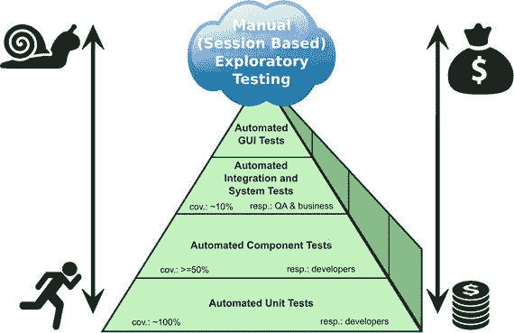
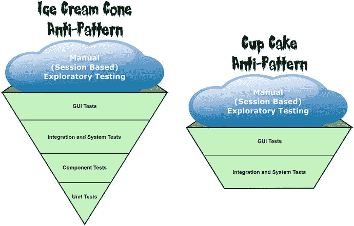
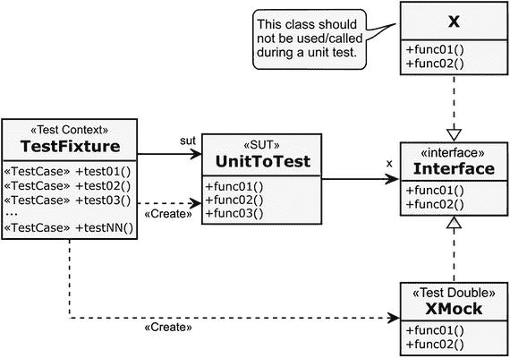

# 2.建立一个安全网

测试是一种技能。虽然这可能会让一些人感到惊讶，但这是一个简单的事实。——Mark few ster 和 Dorothy Graham，软件测试自动化，1999 年

我用关于测试的一章开始本书的主要部分可能会让一些读者感到惊讶，但这是有几个好的理由的。在过去的几年中，某些级别的测试已经成为现代软件开发的重要基石。一个好的测试策略的潜在好处是巨大的。所有类型的测试，如果设计得好，都是有益的。在这一章中，我将描述为什么我认为单元测试对于确保软件的高质量是必不可少的。

请注意，这一章是关于有时被称为 POUT(“普通旧单元测试”)的东西，而不是设计支持工具测试驱动开发(TDD)，我将在本书后面讨论。

## 测试的需要

1962: NASA Mariner 1

水手 1 号宇宙飞船于 1962 年 7 月 22 日发射，作为一次飞越金星进行行星探索的任务。由于定向天线的问题，Atlas-Agena B 发射火箭工作不可靠，发射后不久就失去了地面控制的控制信号。

在火箭的设计和建造过程中已经考虑了这一例外情况。Atlas-Agena 运载火箭由机载制导计算机转为自动控制。不幸的是，这台计算机的软件中的一个错误导致了错误的控制命令，导致了严重的航向偏差，使转向不可能。火箭直接射向地球，指向一个关键区域。

在 T+293 秒时，靶场安全员发出自毁指令，炸毁火箭。美国宇航局的一份检查报告 [<sup>1</sup>](#Fn1) 提到了计算机源代码中的一个错别字，缺少一个连字符('-')，作为错误的原因。总损失为 1850 万美元，这在当时是一笔巨款。

如果问软件开发人员为什么测试是好的和必要的，我认为最常见的答案将是减少错误、错误或缺陷。毫无疑问，这基本上是正确的:测试是质量保证的基本部分。

软件错误通常被认为是令人讨厌的麻烦。用户对程序产生无效输出的错误行为感到恼火，或者对经常性的崩溃感到非常恼火。有时，即使是一些零碎的东西，如用户界面对话框中被截断的文本，也足以在日常工作中严重困扰软件用户。结果可能是对软件越来越不满意，最坏的情况是被另一种产品取代。除了经济损失之外，软件制造商的形象也受到了缺陷的影响。在最坏的情况下，公司会陷入严重的困境，许多人会失业。

但是前面描述的场景并不适用于每一个软件。一个 bug 的含义可能更加戏剧化。

1986: Therac-25 Medical Accelerator Disaster

这个案例可能是软件开发历史上最严重的失败。Therac-25 是一种放射治疗设备。它由国有企业加拿大原子能有限公司(AECL)从 1982 年到 1985 年研制和生产。在美国和加拿大的诊所生产并安装了 11 台设备。

由于控制软件的缺陷、质量保证过程的不足以及其他缺陷，三名患者因辐射过量而丧生。另外三名病人受到了辐射，并带走了永久的、严重的健康损害。

对这个案例的分析得出的结果是，除了其他事情之外，软件仅仅是由一个负责测试的人编写的。

当人们想到计算机时，他们脑海中通常会出现台式机、笔记本电脑、平板电脑或智能手机。如果他们想到软件，他们通常会想到网上商店、办公套件或商业 IT 系统。

但是这些软件和计算机只占我们每天接触的所有系统的很小一部分。我们周围的大多数软件控制着与世界进行物理交互的机器。我们的整个生活都由软件管理。一言以蔽之:没有软件就没有今天的生活！软件无处不在，是我们基础设施的重要组成部分。

如果我们登上电梯，我们的生命就掌握在软件手中。飞机是由软件控制的，整个世界范围的空中交通管制系统都依赖于软件。我们的现代汽车包含大量带有软件的小型计算机系统，这些系统通过网络进行通信，负责车辆的许多安全关键功能。空调、自动门、医疗设备、火车、工厂里的自动化生产线……无论我们现在在做什么，我们都会永久地接触到软件。随着数字革命和物联网(IoT)的发展，软件与我们生活的相关性将再次显著增加。几乎没有任何其他话题比自动驾驶汽车更明显了。

我认为没有必要强调这些软件密集型系统中的任何错误都可能带来灾难性的后果。这些重要系统的故障或失灵可能会威胁到生命或身体状况。在最坏的情况下，数百人可能在飞机坠毁中丧生，这可能是由电传操纵子系统的子程序中的错误`if`语句引起的。在这种系统中，质量是没有商量余地的。决不！

但是，即使在没有功能安全需求的系统中，错误也可能有严重的影响，特别是如果它们的破坏性更微妙的话。很容易想象，金融软件中的缺陷可能会引发当今世界范围的银行危机。假设任意一家大银行的财务软件由于一个 bug，每次过账都执行两次，这个问题几天内都不会被注意到。

1990: The AT&T Crash

1990 年 1 月 15 日，美国电话电报公司长途电话网络崩溃，9 个小时内 7500 万次电话中断。停电是由软件升级中的一行代码(一个错误的`break`声明)引起的，该软件升级在 1989 年 12 月被部署到所有 114 个计算机操作的电子开关(4ESS)中。问题始于 1 月 15 日下午，当时美国电话电报公司的曼哈顿控制中心发生故障，导致连锁反应，整个网络一半的交换机瘫痪。

美国电话电报公司的损失估计为 6000 万美元，对于依赖电话网络的企业来说，这可能是一笔巨大的损失。

## 测试简介

在软件开发项目中有不同层次的质量保证措施。这些级别通常以金字塔的形式出现，即所谓的测试金字塔。这个基本概念是由美国软件开发人员 Mike Cohn 开发的，他是 Scrum 联盟的创始人之一。他在他的书《敏捷的成功》中描述了测试自动化金字塔。借助于金字塔，Cohn 描述了高效软件测试所需的自动化程度。在接下来的几年里，测试金字塔被不同的人进一步发展。图 [2-1](#Fig1) 中描绘的是我的版本。



图 2-1。

The Test Pyramid

当然，金字塔的形状不是巧合。其背后的信息是，你应该比其他类型的测试有更多的低级单元测试(大约 100%的代码覆盖率)。但这是为什么呢？

经验表明，关于测试的实现和维护的总成本正在向金字塔的顶端增加。大型系统测试和手工用户验收测试通常很复杂，经常需要大量的组织工作，并且不容易自动化。例如，自动化的 UI 测试很难编写，通常很脆弱，并且相对较慢。因此，这些测试通常是手动执行的，这适合于客户批准(验收测试)和 QA 的常规探索性测试，但是对于开发期间的日常使用来说太耗时和昂贵了。

此外，大型系统测试，或者 UI 驱动的测试，完全不适合检查整个系统中所有可能的执行路径。软件系统中有许多代码处理可选路径、异常和错误处理、横切关注点(安全性、事务处理、日志记录……)以及其他所需的辅助功能，但通常无法通过普通用户界面实现。

最重要的是，如果系统级的测试失败，错误的确切原因可能很难定位。系统测试通常基于系统的用例。在用例的执行过程中，会涉及到许多组件。这意味着要执行数百甚至数千行代码。哪一行是测试失败的原因？这个问题通常不容易回答，需要进行耗时且昂贵的分析。

不幸的是，在一些软件开发项目中，你会发现退化的测试金字塔，如图 [2-2](#Fig2) 所示。在这样的项目中，巨大的努力被投入到更高层次的测试中，而基本的单元测试被忽略了(冰淇淋甜筒反模式)。在极端情况下，它们完全消失了(杯形蛋糕反模式)。



图 2-2。

Degenerated Test Pyramids (Anti-Patterns)

因此，一个廉价的、精心制作的、非常快速的、定期维护的、完全自动化的单元测试的广泛基础，在一系列有用的组件测试的支持下，可以成为确保软件系统相当高质量的坚实基础。

## 单元测试

没有测试的“重构”不是重构，它只是在移动狗屎。——科里·海恩斯(@科里·海恩斯)，2013 年 12 月 20 日，在推特上

单元测试是一段代码，它在特定的上下文中执行生产代码库的一小部分。该测试将在一瞬间向您展示您的代码如您所期望的那样工作。如果单元测试覆盖率相当高，并且您可以在不到一分钟的时间内检查到您正在开发的系统的所有部分都工作正常，那么它将有许多优点:

*   大量的调查和研究已经证明，在软件发布后修复 bug 比进行单元测试要昂贵得多。
*   单元测试给你的整个代码库一个即时的反馈。假设测试覆盖率足够高(大约。100%)，开发人员只需几秒钟就能知道代码是否正常工作。
*   单元测试让开发人员有信心重构他们的代码，而不用担心做错什么会破坏代码。事实上，在没有单元测试安全网的情况下，代码库的结构变化是危险的，不应该被称为重构。
*   单元测试的高覆盖率可以避免耗时和令人沮丧的调试会话。使用调试器查找错误原因的时间通常长达数小时，这可以大大减少。当然，您永远也不可能完全消除调试器的使用。这个工具仍然可以用来分析微妙的问题，或者找到单元测试失败的原因。但它将不再是确保代码质量的关键开发工具。
*   单元测试是一种可执行的文档，因为它们准确地显示了代码是如何被设计使用的。可以说，它们是某种用法的例子。
*   单元测试可以很容易地检测到回归，也就是说，它们可以立即显示曾经可以工作，但是在代码发生变化后意外停止工作的东西。
*   单元测试有助于创建干净且格式良好的接口。它可以帮助避免单元之间不必要的依赖。可测试性设计也是一个好的可用性设计，也就是说，如果一段代码可以轻松地安装到测试夹具上，那么它通常也可以轻松地集成到系统的生产代码中。
*   单元测试使开发更快。

特别是这个列表中的最后一项似乎是矛盾的，需要一点解释。单元测试有助于开发更快地进行——怎么可能呢？这似乎不符合逻辑。

毫无疑问:编写单元测试意味着努力。首先也是最重要的，管理者只是看到了这种努力，并不理解为什么开发人员应该为测试投入时间。尤其是在项目的初始阶段，单元测试对开发速度的积极作用可能看不到。在项目的早期阶段，当系统的复杂性相对较低并且大多数事情都运行良好时，编写单元测试起初似乎只是花费精力。但是时代在变…

当系统变得越来越大(+ 100，000 LOC)，复杂性增加，理解和验证系统就变得越来越困难(还记得我在第 [1](1.html) 章描述过的软件熵吗)。通常，当不同团队中的许多开发人员在一个巨大的系统上工作时，他们每天都要面对其他开发人员编写的代码。如果没有单元测试，这可能会成为一项非常令人沮丧的工作。我相信每个人都知道那些愚蠢的、无休止的调试会话，在单步模式下遍历代码，同时一次又一次地分析变量的值。…这是对时间的巨大浪费！而且会大大降低开发速度。

特别是在开发的中后期，以及产品交付后的维护阶段，好的单元测试展现了它们的积极作用。单元测试节省的时间最多的时候是在编写测试后的几个月或几年，这时单元或它的 API 需要改变或扩展。

如果测试覆盖率很高，那么无论一段由开发人员编辑的代码是由他自己写的还是由另一个开发人员写的，都是无关紧要的。好的单元测试可以帮助开发人员快速理解另一个人写的一段代码，即使它是三年前写的。如果一个测试失败了，它会准确地显示出一些行为被破坏的地方。开发人员可以相信，如果所有测试都通过了，一切仍然正常工作。冗长而恼人的调试会话变得罕见，调试器主要用于快速找到失败测试的原因，如果这个原因不明显的话。这很好，因为这样工作很有趣。这是激励，它导致更快更好的结果。开发人员将对代码库有更大的信心，并对它感到满意。不断变化的需求或新功能需求？没问题，因为他们能够快速、经常、高质量地运送新产品。

Unit Test Frameworks

有几种不同的单元测试框架可用于 C++开发，例如，CppUnit，Boost。测试，可爱，谷歌测试，还有更多。

原则上，所有这些框架都遵循所谓的 xUnit 的基本设计，这是几个单元测试框架的统称，这些框架的结构和功能都来自 Smalltalk 的 SUnit。除了本章的内容并不局限于特定的单元测试框架，而且因为它的内容适用于一般的单元测试，所以对所有可用框架的全面和详细的比较超出了本书的范围。此外，选择合适的框架取决于许多因素。例如，如果你认为用最少的工作量快速添加新的测试非常重要，那么这可能是某些框架的淘汰标准。

## QA 呢？

一个开发人员可能会有这样的态度:“为什么我要测试我的软件？我们有测试人员和质量保证部门，这是他们的工作。”

基本问题是:软件质量是质量保证部门唯一关心的事情吗？

简单明了的答案是:不！我以前说过，现在我再说一遍。尽管你的公司可能有一个单独的 QA 团队来测试软件，但是开发团队的目标应该是让 QA 没有发现任何错误。—罗伯特·c·马丁，干净的编码者[马丁 11]

将一个已知包含 bug 的软件交给 QA 是非常不专业的。专业开发人员从不将系统质量的责任推给其他部门。相反，专业的软件工匠与 QA 人员建立了富有成效的合作关系。他们应该密切合作，相辅相成。

当然，交付 100%无缺陷的软件是一个非常雄心勃勃的目标。QA 时不时会发现不对劲的地方。这很好。质量保证是我们的第二道安全网。他们检查以前的质量保证措施是否充分和有效。

从我们的错误中，我们可以学习并变得更好。专业开发人员通过修复 QA 发现的错误，并通过编写自动化单元测试来在未来捕捉这些错误，从而立即弥补这些质量缺陷。然后他们应该仔细思考这个问题:“以上帝的名义，我们怎么会忽略了这个问题？”回顾的结果应该作为改进开发过程的输入。

## 良好单元测试的规则

我见过很多非常无用的单元测试。单元测试应该给你的项目增加价值。为了实现这个目标，应该遵循一些基本的规则，我将在本节中描述这些规则。

### 测试代码质量

对产品代码的同样高质量的要求必须对单元测试代码有效。我会更进一步:理想情况下，生产和测试代码之间不应该有判断上的区别——两者是平等的。如果我们说一方面有生产代码，另一方面有测试代码，那么我们就把那些不可分割的东西分开了。不要那样做！分两类考虑生产和测试代码，为在项目后期忽略测试打下了基础。

### 单元测试命名

如果一个单元测试失败了，开发人员想立即知道:

*   单位名称是什么；谁的测试失败了？
*   测试了什么，测试的环境是什么(测试场景)？
*   预期的测试结果是什么，失败测试的实际测试结果是什么？

因此，单元测试的表达性和描述性命名非常重要。我的建议是为所有测试建立命名标准。

首先，以这样一种方式命名单元测试模块(取决于单元测试框架，它们被称为测试装具或测试夹具)是一个好的实践，以便被测试的单元可以容易地从它派生出来。显然，它们应该有一个类似于`<Unit_under_Test>Test`的名字，占位符`<Unit_under_Test>`必须由测试对象的名字代替。例如，如果你的被测系统(SUT)是单元`Money`，那么对应的连接到该单元并包含所有单元测试用例的测试夹具应该被命名为`MoneyTest`(见图 [2-3](#Fig3) )。


图 2-3。

The system under test (SUT) and its Test Context

除此之外，单元测试必须有表达性和描述性的名称。如果单元测试有或多或少无意义的名字，如`testConstructor()`、`test4391()`或`sumTest()`，这是没有帮助的。这里有两个给它们取个好名字的建议。

对于可以在不同上下文中使用的通用、多用途类，一个表达性名称可以包含以下部分:

*   测试场景的前提条件，即执行测试之前 SUT 的状态。
*   被测单元的被测部分，通常是被测过程、函数或方法(API)的名称。
*   预期的测试结果。

这就产生了一个单元测试过程/方法的命名模板，如下所示:

```cpp
<PreconditionAndStateOfUnitUnderTest>_<TestedPartOfAPI>_<ExpectedBehavior>

```

这里有几个例子:

```cpp
void CustomerCacheTest::cacheIsEmpty_addElement_sizeIsOne();

void CustomerCacheTest::cacheContainsOneElement_removeElement_sizeIsZero();

void ComplexNumberCalculatorTest::givenTwoComplexNumbers_add_Works();

void MoneyTest:: givenTwoMoneyObjectsWithDifferentBalance_theInequalityComparison_Works();

void MoneyTest::createMoneyObjectWithParameter_getBalanceAsString_returnsCorrectString();

void InvoiceTest::invoiceIsReadyForAccounting_getInvoiceDate_returnsToday();
Listing 2-1.Some examples for

good and expressive unit test names

```

构建表达性单元测试名称的另一种可能的方法是在名称中体现特定的需求。这些名称通常反映了应用程序域的要求。例如，它们来源于涉众的需求。

```cpp
void UserAccountTest::creatingNewAccountWithExistingEmailAddressThrowsException();

void ChessEngineTest::aPawnCanNotMoveBackwards();

void ChessEngineTest::aCastlingIsNotAllowedIfInvolvedKingHasBeenMovedBefore();

void ChessEngineTest::aCastlingIsNotAllowedIfInvolvedRookHasBeenMovedBefore();

void HeaterControlTest::ifWaterTemperatureIsGreaterThan92DegTurnHeaterOff();

void BookInventoryTest::aBookThatIsInTheInventoryCanBeBorrowedByAuthorizedPeople();

void BookInventoryTest::aBookThatIsAlreadyBorrowedCanNotBeBorrowedTwice();
Listing 2-2.Some more examples

of unit test names that verify domain-specific requirements

```

当您阅读这些测试方法名称时，很明显，即使这里没有显示测试的实现和测试方法，也可以很容易地从中获得许多有用的信息。如果这样的测试会失败，这也是一个很大的优势。几乎所有的单元测试框架都在标准输出(stdout)中写入失败测试的名称。因此，极大地方便了错误定位。

### 单元测试独立性

每个单元测试必须独立于所有其他单元测试。如果测试必须以特定的顺序执行，这将是致命的，因为一个测试是基于前一个测试的结果。永远不要编写其结果是后续测试先决条件的单元测试。不要让测试中的单元处于被改变的状态，这是下面测试的先决条件。

主要问题可能是由全局状态引起的，例如，在测试单元中使用单例或静态成员。单例不仅增加了软件单元之间的耦合。他们还经常持有一个规避单元测试独立性的全局状态。例如，如果某个全局状态是成功测试的先决条件，但是先前的测试已经改变了该全局状态，那么这可能会导致严重的问题。

尤其是在遗留系统中，遗留系统中经常充斥着单例，这就引出了一个问题:我如何才能摆脱对这些单例的所有令人讨厌的依赖，并使我的代码更易于测试？嗯，这是我在第 6 章的依赖注入一节中讨论的一个重要问题。

Dealing with Legacy Systems

如果你面对所谓的遗留系统，并且在试图添加单元测试时面临许多困难，我推荐 Michael C. Feathers 的书《有效地使用遗留代码》。Feathers 的书包含了许多使用大型的、未经测试的遗留代码库的策略。它还包括 24 种打破依赖的技术目录。这些策略和技术超出了本书的范围。

### 每个测试一个断言

我知道这是一个有争议的话题，但我会试着解释为什么我认为这很重要。我的建议是限制单元测试只使用一个断言，就像这样:

```cpp
void MoneyTest::givenTwoMoneyObjectsWithDifferentBalance_theInequalityComparison_Works() {
  const Money m1(-4000.0);
  const Money m2(2000.0);
  ASSERT_TRUE(m1 != m2);
}
Listing 2-3.A unit test that checks the not-equal-operator of a Money class

```

有人可能会说，我们还可以检查其他比较操作符(例如，`Money::operator==()`)在这个单元测试中是否工作正常。通过简单地添加更多的断言，很容易做到这一点，如下所示:

```cpp
void MoneyTest::givenTwoMoneyObjectsWithDifferentBalance_testAllComparisonOperators() {
  const Money m1(-4000.0);
  const Money m2(2000.0);
  ASSERT_TRUE(m1 != m2);
  ASSERT_FALSE(m1 == m2);
  ASSERT_TRUE(m1 < m2);
  ASSERT_FALSE(m1 > m2);
  // ...more assertions here...
}
Listing 2-4.Question: Is it really a good idea to check all comparison operators in one unit test?

```

我认为这种方法的问题是显而易见的:

*   如果一个测试由于多种原因而失败，开发人员很难快速找到错误的原因。最重要的是，失败的早期断言掩盖了额外的错误，也就是说，它隐藏了后续的断言，因为测试的执行被停止了。
*   正如在单元测试命名一节中已经解释过的，我们应该以一种精确和有表现力的方式来命名一个测试。有了多重断言，一个单元测试实际上测试了很多东西(顺便说一下，这违反了单一责任原则；见第 6 章)，很难为它找到一个好名字。上面的`…testAllComparisonOperators()`不够精确。

### 单元测试环境的独立初始化

这条规则有点类似于单元测试独立性。当一个干净实现的测试完成时，所有与该测试相关的状态必须消失。更具体地说:当运行所有单元测试时，每个测试都必须是应用程序的一个孤立的部分实例化。每个测试都必须完全独立地建立和初始化它所需要的环境。这同样适用于测试执行后的清理。

### 排除 Getters 和 Setters

不要为一个类的普通 getters 和 setters 编写单元测试，就像这样:

```cpp
void Customer::setForename(const std::string& forename) {
  this->forename = forename;
}

std::string Customer::getForename() const {
  return forename;
}

Listing 2-5.A simple setter and getter

```

你真的认为这样简单的方法会出错吗？这些成员函数非常简单，为它们编写单元测试是愚蠢的。此外，通常的 getters 和 setters 由其他更重要的单元测试隐式测试。

注意，我刚刚写了没有必要测试通常和简单的 getters 和 setters。有时候，getters 和 setters 并不那么简单。根据我们将在后面讨论的信息隐藏原理(参见第 [3 章](3.html)中的信息隐藏一节)，如果一个 getter 简单而愚蠢，或者如果它必须做出复杂的事情来确定它的返回值，那么它应该为客户端隐藏。因此，为 getter 或 setter 编写显式测试有时会很有用。

### 排除第三方代码

不要为第三方代码写测试！我们不必验证库或框架是否如预期的那样工作。例如，我们可以问心无愧地假设 C++标准库中无数次使用过的成员函数`std::vector::push_back()`工作正常。相反，我们可以期待第三方代码自带单元测试。在您的项目中不使用没有自己的单元测试并且质量可疑的库或框架可能是一个明智的架构决策。

### 排除外部系统

对于外部系统，第三方代码也是如此。不要为你要开发的系统环境中的系统编写测试，因为这不在你的职责范围内。例如，如果您的财务软件使用现有的、通过互联网连接的外部货币转换系统，您就不应该测试它。除了此类系统无法提供明确的答案(货币之间的换算系数每分钟都在变化)以及此类系统可能因网络问题而无法到达之外，我们不对外部系统负责。

我的建议是模仿(见本章后面的测试替身(假对象)一节)这些东西，并测试你的代码，而不是他们的。

### 我们用数据库做什么？

如今，许多 IT 系统都包含(关系)数据库。他们需要将大量的对象或数据保存到长期存储中，以便这些对象或数据可以以一种舒适的方式被查询，并且在系统关闭后仍然存在。

一个重要的问题是:在单元测试期间，我们应该如何处理数据库？在这个问题上，我的第一条也是最重要的一条建议是:如果没有数据库也能进行测试，那就不要用数据库！——杰勒德·梅萨罗什，xUnit Patterns

在单元测试期间，数据库可能会导致各种各样的、有时是微妙的问题。例如，如果许多单元测试使用同一个数据库，那么该数据库往往会成为一个大型的中央存储，这些测试必须为了不同的目的而共享该存储。这种共享可能会对我在本章前面讨论的单元测试的独立性产生负面影响。很难保证每个单元测试所需的先决条件。一个单元测试的执行可能会通过常用的数据库对其他测试产生不必要的副作用。

另一个问题是数据库基本上很慢。它们比访问本地计算机内存要慢得多。与数据库交互的单元测试比完全在内存中运行的测试要慢得多。假设您有几百个单元测试，每个测试平均需要 500 ms 的额外时间，这是由数据库查询引起的。总的来说，所有的测试都比没有数据库的测试多花几分钟时间。

我的建议是模拟数据库(参见本章后面关于测试双精度/模拟对象的部分)，并且只在内存中执行所有单元测试。不要担心:数据库，如果它存在的话，将会涉及到集成和系统测试层面。

### 不要将测试代码和生产代码混在一起

有时开发人员会想到用测试代码来装备他们的产品代码。例如，一个类可能包含在测试期间以如下方式处理对协作类的依赖的代码:

```cpp
#include <memory>

#include "DataAccessObject.h"

#include "CustomerDAO.h"

#include "FakeDAOForTest.h"

using DataAccessObjectPtr = std::unique_ptr<DataAccessObject>;

class Customer {

public:

  Customer() {}
  explicit Customer(bool testMode) : inTestMode(testMode) {}

  void save() {
    DataAccessObjectPtr dataAccessObject = getDataAccessObject();
    // ...use dataAccessObject to save this customer...
  };

  // ...

private:

  DataAccessObjectPtr getDataAccessObject() const {
    if (inTestMode) {
      return std::make_unique<FakeDAOForTest>();
    } else {
      return std::make_unique<CustomerDAO>();
    }
  }
  // ...more operations here...

  bool inTestMode{ false };
  // ...more attributes here...
};

Listing 2-6.One possible solution to deal with a dependency during test

```

`DataAccessObject`是具体道的抽象基类，在这里是`CustomerDAO`和`FakeDAOForTest`。最后一个是所谓的伪对象，它只不过是一个测试替身(参见本章后面关于测试替身(伪对象)的部分)。它旨在取代真正的 DAO，因为我们不想测试它，并且我们不想在测试期间保存客户(记住我关于数据库的建议)。使用两个 DAO 中的哪一个由布尔数据成员`inTestMode`控制。

这个代码可以工作，但是这个解决方案有几个缺点。

首先，我们的生产代码充斥着测试代码。虽然乍看起来并不引人注目，但它会增加复杂性并降低可读性。我们需要一个额外的成员来区分我们系统的测试模式和生产使用。这个布尔成员与客户无关，更不用说与我们系统的域有关。很容易想象，在我们的系统中，许多类都需要这样的成员。

此外，我们的类`Customer`依赖于`CustomerDAO`和`FakeDAOForTest`。您可以在源代码顶部的包含列表中看到它。这意味着测试假人`FakeDAOForTest`也是生产环境中系统的一部分。希望在生产中永远不会调用 test double 的代码，而是编译、链接和部署它。

当然，有更好的方法来处理这些依赖性，并使产品代码远离测试代码。例如，我们可以将特定的 DAO 作为引用参数注入到`Customer::save()`中。

```cpp
class DataAccessObject;

class Customer {

public:

  void save(DataAccessObject& dataAccessObject) {
    // ...use dataAccessObject to save this customer...
  }

  // ...
};

Listing 2-7.Avoiding dependencies to test code (1)

```

或者，这可以在构造类型`Customer`的实例时完成。在这种情况下，我们必须将对 DAO 的引用作为类的属性。此外，我们必须通过编译器抑制默认构造函数的自动生成，因为我们不希望任何`Customer`的用户可以创建它的不正确初始化的实例。

```cpp
class DataAccessObject;

class Customer {

public:

  Customer() = delete;
  Customer(DataAccessObject& dataAccessObject) : dataAccessObject(dataAccessObject) {}
  void save() {
    // ...use member dataAccessObject to save this customer...
  }

  // ...

private:

  DataAccessObject& dataAccessObject;
  // ...
};

Listing 2-8.Avoiding dependencies

to test code (2)

```

Deleted Functions [C++11]

在 C++中，如果没有声明自己的类型，编译器会自动为该类型生成所谓的特殊成员函数(默认构造函数、复制构造函数、复制赋值运算符和析构函数)。从 C++11 开始，move 构造函数和 move 赋值操作符扩展了这个特殊成员函数列表。C++11(及更高版本)提供了一种简单的声明式方法来禁止自动创建任何特殊的成员函数，以及普通的成员函数和非成员函数:您可以删除它们。例如，您可以通过以下方式防止创建默认构造函数:

```cpp
class Clazz {

public:

  Clazz() = delete;
};

```

另一个例子:你可以删除操作符`new`来防止类在堆上被动态分配:

```cpp
class Clazz {

public:

  void* operator new(std::size_t) = delete;
};

```

第三种可能是特定的 DAO 是由`Customer`知道的工厂创建的(参见第 [9](9.html) 章中关于设计模式的工厂一节)。如果系统在测试环境中运行，可以从外部配置这个工厂来创建所需的 DAO 类型。无论您选择这些可能的解决方案中的哪一个，`Customer`都没有测试代码。在`Customer`中没有对特定道的依赖。

### 测试必须快速运行

在大型项目中，总有一天你会达到拥有成千上万个单元测试的地步。这在软件质量方面是非常棒的。但一个尴尬的副作用可能是，人们会在签入源代码库之前停止运行这些测试，因为这需要太长时间。

很容易想象运行测试所花费的时间和团队的生产力之间有很强的相关性。如果运行所有的单元测试需要 15 分钟，1/2 小时，或者更长时间，开发人员会被阻止工作，浪费时间等待测试结果。即使每个单元测试的执行平均“只”需要半秒钟，执行 1000 个测试也需要 8 分钟以上。这意味着每天执行整个测试套件 10 次将导致总共大约 1.5 小时的等待时间。因此，开发人员运行测试的频率会降低。

我的建议是:测试必须快速运行！单元测试应该为开发人员建立一个快速的反馈回路。一个大型项目的所有单元测试的执行时间不应该超过 3 分钟，甚至更短。为了在开发期间更快地执行本地测试(< =几秒钟)，测试框架应该提供一种简单的方法来暂时关闭不相关的测试组。

不用说，在自动化构建系统中，每次在构建最终产品之前，所有的测试都必须无一例外地连续执行。如果构建系统上的一个或多个测试失败，开发团队应该会立即收到通知。例如，这可以通过电子邮件或在显著位置的光学可视化(例如，由于墙上的平面屏幕，或由构建系统控制的“交通灯”)的帮助来完成。即使只有一个测试失败，在任何情况下你都不应该发布和运输产品！

### 测试替身(假物体)

如果在测试执行过程中被测试的单元完全独立于协作者，也就是说，被测试的单元不使用其他单元或外部系统，那么单元测试应该只被称为“单元测试”。例如，虽然在集成测试期间数据库的参与是不重要的和必需的，因为这是集成测试的目的，但是在真实的单元测试期间对数据库的访问(例如，查询)是被禁止的(参见第节和我们如何处理数据库？本章前面)。因此，要测试的单元对其他模块或外部系统的依赖性应该由所谓的测试替身来代替，也称为假对象或模型。

为了以一种优雅的方式使用这样的测试替身，被测单元的松耦合是要努力争取的(参见“要有原则”一章中的松耦合一节)。例如，一个抽象(例如，一个纯抽象类形式的接口)可以在对一个测试不需要的合作者进行访问时被引入，如图 [2-4](#Fig4) 所示。



图 2-4。

An interface makes it easy to replace `X` with a Test Double `XMock`

让我们假设您想要开发一个使用外部 web 服务进行当前货币兑换的应用程序。在单元测试期间，您不能自然地使用这个外部服务，因为它每秒都提供不同的转换因子。而且通过互联网查询服务，基本上很慢，可能会失败。并且不可能模拟临界情况。因此，在单元测试期间，您必须用一个测试 double 替换真实的货币转换。

首先，我们必须在代码中引入一个变化点，在这里我们可以用一个 test double 替换与货币转换服务通信的模块。这可以在接口的帮助下完成，接口在 C++中是一个抽象类，只有纯虚拟成员函数。

```cpp
class CurrencyConverter {

public:

  virtual ∼CurrencyConverter() { }
  virtual long double getConversionFactor() const = 0;
};
Listing 2-9.An abstract interface for currency converters

```

通过互联网对货币兑换服务的访问被封装在一个实现`CurrencyConverter interface`的类中。

```cpp
class RealtimeCurrencyConversionService : public CurrencyConverter {

public:

  virtual long double getConversionFactor() const override;
  // ...more members here that are required to access the service...
};
Listing 2-10.The class that accesses the realtime currency conversion service

```

出于测试目的，存在第二个实现:Test Double `CurrencyConversionServiceMock`。该类的对象将返回一个已定义且可预测的转换因子，因为它是单元测试所必需的。此外，该类的对象还提供了从外部设置转换因子的能力，例如，模拟临界情况。

```cpp
class CurrencyConversionServiceMock : public CurrencyConverter {

public:

  virtual long double getConversionFactor() const override {
    return conversionFactor;
  }

  void setConversionFactor(const long double value) {
    conversionFactor = value;
  }

private:

  long double conversionFactor{0.5};
};

Listing 2-11.The Test Double

```

在产品代码中使用货币转换器的地方，现在使用接口来访问服务。由于这种抽象，客户端代码在运行时使用哪种实现是完全透明的——是真实的货币转换器还是它的测试 Double。

```cpp
#include <memory>

class CurrencyConverter;

class UserOfConversionService {

public:

  UserOfConversionService() = delete;
  UserOfConversionService(const std::shared_ptr<CurrencyConverter>& conversionService);
  void doSomething();
  // More of the public class interface follows here...

private:

  std::shared_ptr<CurrencyConverter> conversionService;
  //...internal implementation...
};

Listing 2-12.The header of the class that uses the service

```

```cpp
UserOfConversionService::UserOfConversionService   (const std::shared_ptr<CurrencyConverter>& conversionService) :
  conversionService(conversionService) { }

void UserOfConversionService::doSomething() {
  long double conversionFactor = conversionService->getConversionFactor();
  // ...
}

Listing 2-13.An excerpt from the implementation file

```

在对类`UserOfConversionService`的单元测试中，测试用例现在能够通过初始化构造函数传递模拟对象。另一方面，在软件的正常操作中，真正的服务可以通过构造函数传递。这种技术被称为依赖注入的设计模式，在“设计模式”一章的同名章节中有详细讨论。

```cpp
std::shared_ptr<CurrencyConverter> serviceToUse = std::make_shared<name of the desired class here */>();
UserOfConversionService user(serviceToUse);
// The instance of UserOfConversionService is ready for use...
user.doSomething();
Listing 2-14.An example how UserOfConversionService gets its required CurrencyConverter object

```

Footnotes [1](#Fn1_source)

NASA 国家空间科学数据中心(NSSDC):水手 1 号， [`http://nssdc.gsfc.nasa.gov/nmc/spacecraftDisplay.do?id=MARIN1`](http://nssdc.gsfc.nasa.gov/nmc/spacecraftDisplay.do?id=MARIN1) ，检索 2014-04-28。