# 3.流程图

在第 [2](02.html#b978-1-4842-4398-5_2) 章中，我们介绍了一组匹配我们在应用中经常遇到的模式的算法。那些太棒了！我们应该尽可能地使用它们。不幸的是，并不是所有的应用程序都适合这些盒子；它们可能会很乱。当事情开始变得混乱时，我们会变成控制狂，试图对每件事都进行微观管理，或者只是决定“随波逐流”，对事情的发展做出反应。TBB 让我们选择任何一条道路。

在第 [10](10.html#b978-1-4842-4398-5_10) 章中，我们讨论了如何直接使用任务来创建我们自己的算法。任务既有高级接口，也有低级接口，所以如果我们直接使用任务，如果我们真的想成为控制狂，我们可以选择。

然而，在本章中，我们将关注线程构建模块流程图界面。第 [2](02.html#b978-1-4842-4398-5_2) 章中的大多数算法都是面向那些我们预先有大量数据，并且需要创建任务来分割和并行处理这些数据的应用程序的。流程图适用于在数据可用时做出反应的应用程序，或者具有比简单结构所能表达的更复杂的依赖性的应用程序。流图接口已经成功地用于广泛的领域，包括图像处理、人工智能、金融服务、医疗保健和游戏。

流图接口让我们表达包含并行性的程序，这些并行性可以用图来表达。在许多情况下，这些应用程序通过一组过滤器或计算来传输数据流。我们称这些*数据流图为*。图形还可以表达操作之间的前后关系，允许我们表达不能用并行循环或管道容易表达的依赖结构。一些线性代数计算，例如乔莱斯基分解，有高效的并行实现，通过跟踪较小操作的依赖性来避免重量级的同步点。我们称表达这些前后关系的图为*依赖图*。

在第 [2](02.html#b978-1-4842-4398-5_2) 章中，我们介绍了两种通用的并行算法，像流程图一样，不需要提前知道所有的数据，`parallel_do`和`parallel_pipeline`。这些算法在应用时非常有效；然而，这两种算法都有流图所没有的限制。一个`parallel_do`只有一个单一的体函数，当它可用时应用于每个输入项。A `parallel_pipeline`在输入项流经管道时对其应用一系列线性过滤器。在第 [2](02.html#b978-1-4842-4398-5_2) 章的最后，我们看了一个 3D 立体示例，它比一系列线性滤镜具有更多的并行性。流程图 API 让我们表达比`parallel_do`或`parallel_pipeline`更复杂的结构。

在这一章中，我们首先讨论基于图的并行性为什么重要，然后讨论 TBB 流图 API 的基础知识。之后，我们探索两种主要类型的流图的例子:数据流图和依赖图。

## 为什么要用图来表示并行？

用计算图表示的应用程序公开了可以在运行时有效地用来并行调度其计算的信息。我们可以看看图 [3-1(a)](#Fig1) 中的代码作为例子。


图 3-1。

可以表示为数据流图的应用程序

在图 [3-1(a)](#Fig1) 中 while 循环的每次迭代中，一幅图像被读取，然后通过一系列过滤器:f1、f2、f3 和 f4。我们可以绘制这些过滤器之间的数据流，如图 [3-1(b)](#Fig1) 所示。在此图中，用于传递从每个函数返回的数据的变量被替换为从生成值的节点到消费值的节点的边。

现在，让我们假设图 [3-1(b)](#Fig1) 中的图表捕获了这些功能之间共享的所有数据。如果是这样，我们(以及像 TBB 这样的库)可以推断出很多关于并行执行什么是合法的，如图 [3-2](#Fig2) 所示。

图 [3-2](#Fig2) 显示了从我们的小例子的数据流图表示中可以推断出的并行类型。在图中，我们通过图表传输四个图像。因为节点 f2 和 f3 之间没有边，所以它们可以并行执行。在相同的数据上并行执行两个不同的功能是*功能并行*(任务并行)的一个例子。如果我们假设这些函数是无副作用的，也就是说，它们不更新全局状态，只从它们的传入消息中读取和写入它们的传出消息，那么我们也可以在图中重叠不同消息的处理，利用*流水线并行*。最后，如果函数是*线程安全的*，也就是说，我们可以在不同的输入上并行执行每个函数，那么我们也可以选择在同一节点中重叠两个不同映像的执行，以利用*数据并行性*。

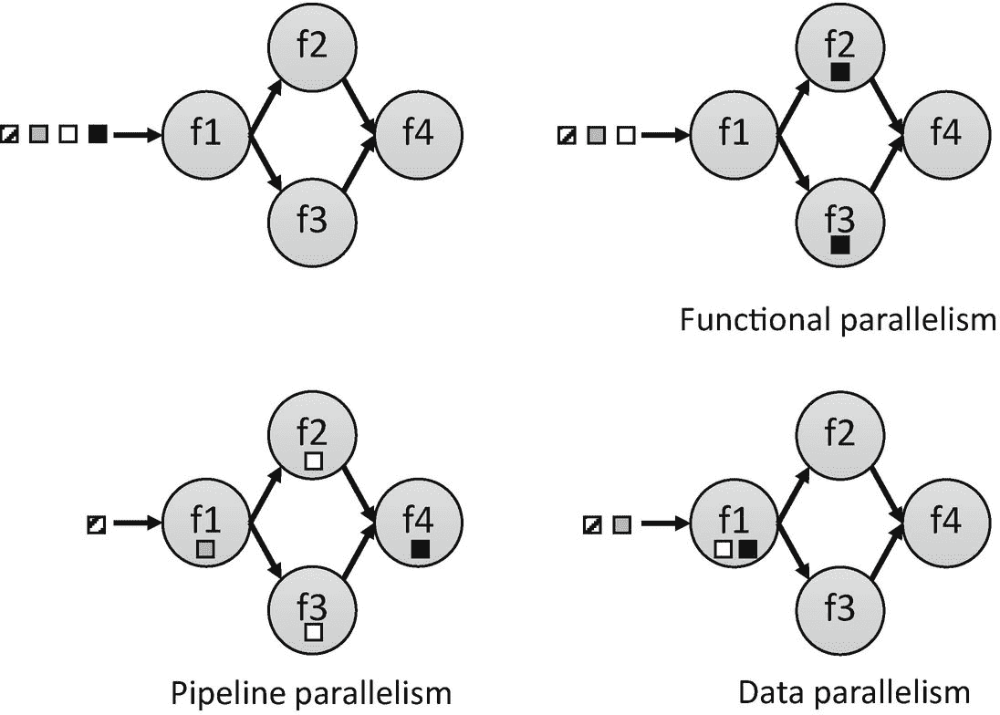

图 3-2。

从图表中可以推断出的平行度的种类

当我们使用 TBB 流图接口将我们的应用表示为图形时，我们向库提供了利用这些不同种类的并行性所需的信息，因此它可以将我们的计算映射到平台硬件以提高性能。

## TBB 流程图界面的基础

TBB 流图的类和函数在`flow_graph.h`中定义，并包含在`tbb::flow`名称空间中。包罗万象的`tbb.h`也包括`flow_graph.h`，所以如果我们使用那个头，我们不需要包括任何其他东西。

为了使用流图，我们首先创建一个*图*对象。然后我们创建*节点*来对流经图的消息执行操作，比如应用用户计算、连接、分离、缓冲或重新排序消息。我们用*边*来表示这些节点之间的消息通道或依赖关系。最后，在我们从图对象、节点对象和边组装了一个图之后，我们将*消息*输入到图中。消息可以是基本类型、对象或指向对象的指针。如果我们想等待处理完成，我们可以使用 graph 对象作为句柄。

图 [3-3](#Fig3) 显示了一个小例子，它执行了使用 TBB 流图所需的五个步骤。在本节中，我们将更详细地讨论这些步骤。

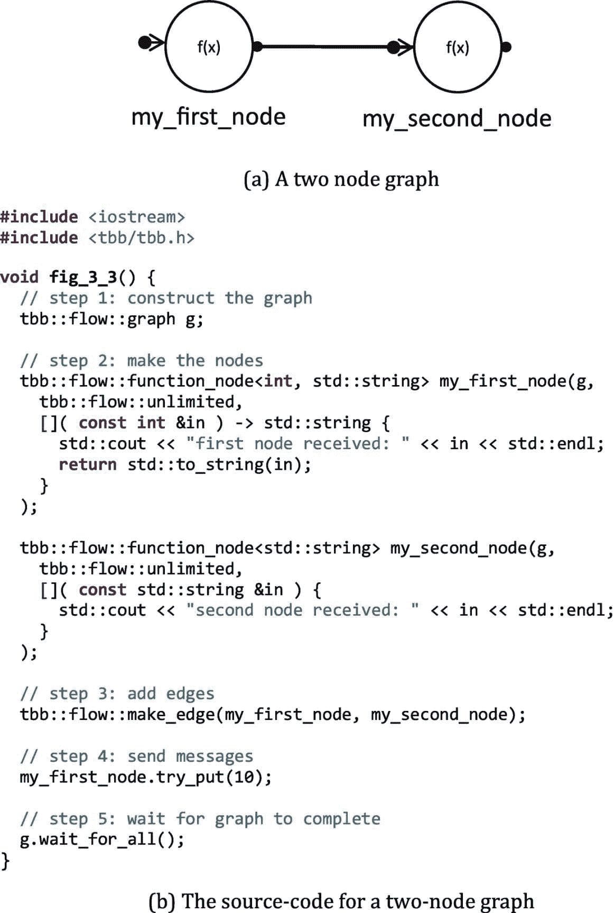

图 3-3。

具有两个节点的示例流程图

### 步骤 1:创建图形对象

创建流图的第一步是构造一个图形对象。在流程图界面中，图对象用于调用整个图的操作，例如等待与图的执行相关的所有任务完成，重置图中所有节点的状态，以及取消图中所有节点的执行。当构建一个图时，每个节点恰好属于一个图，并且在同一个图中的节点之间形成边。一旦我们构建了图，那么我们需要构建实现图的计算的节点。

### 步骤 2:制作节点

TBB 流图接口定义了一组丰富的节点类型(图 [3-4](#Fig4) )，大致可以分为三组:功能节点类型、控制流节点类型(包括连接节点类型)和缓冲节点类型。在附录 b 的“流图:节点”一节中可以找到对 graph 类提供的接口和所有节点类型提供的接口的详细回顾。我们并不期望您现在就详细阅读这些表，而是希望您知道在本章和后续章节中使用节点类型时可以引用它们。

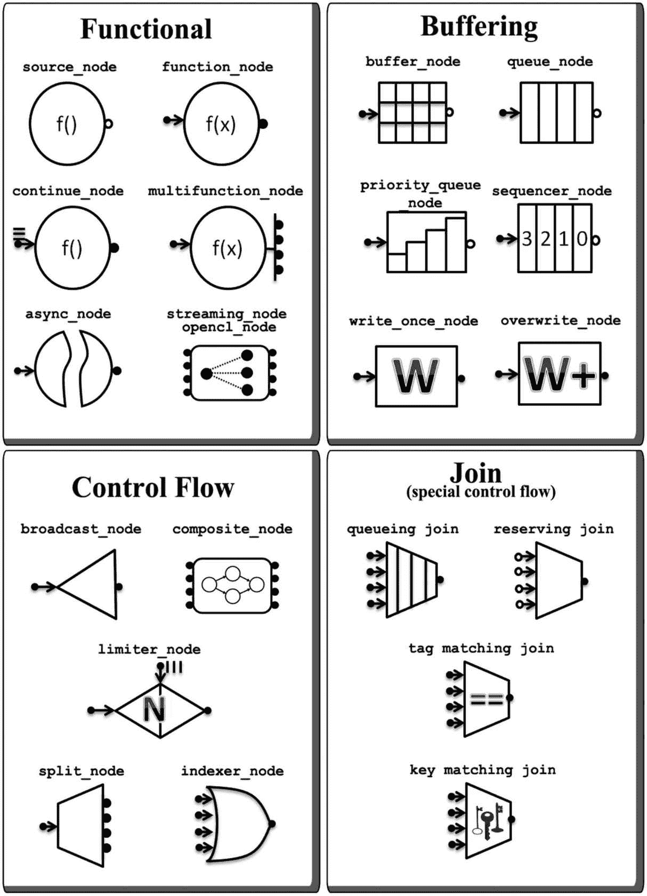

图 3-4。

流程图节点类型(参见章节 [3](#b978-1-4842-4398-5_3) 、 [17](17.html#b978-1-4842-4398-5_17) 、 [18](18.html#b978-1-4842-4398-5_18) 、[19](19.html#b978-1-4842-4398-5_19)；附录 B)中的接口细节

像所有的函数节点一样，`function_node`将 lambda 表达式作为其参数之一。我们在功能节点中使用这些主体参数来提供我们想要应用于传入消息的代码。在图 [3-3](#Fig3) 中，我们定义了第一个节点来接收一个`int`值，打印该值，然后将其转换为一个`std::string,`，返回转换后的值。该节点复制如下:


节点通常通过边相互连接，但是我们也可以显式地向节点发送消息。例如，我们可以通过调用`try_put`向`my_first_node`发送消息:

```cpp

my_first_node.try_put(10);

```

这导致 TBB 库产生一个任务来执行`int`消息 10 上的`my_first_node`主体，产生如下输出

```cpp

first node received: 10

```

与我们提供主体参数的功能节点不同，控制流节点类型执行预定义的操作，这些操作在消息流经图时连接、拆分或定向消息。例如，我们可以创建一个`join_node`，它将来自多个输入端口的输入连接在一起，通过提供元组类型、连接策略和对图形对象的引用来创建一个类型为`std::tuple<int, std::string, double>`的输出:


这个`join_node`、`j`，有三个输入端口和一个输出端口。输入端口 0 将接受类型为`int`的消息。输入端口 1 将接受类型为`std::string`的消息。输入端口 2 将接受`double`类型的消息。将有一个单一的输出端口来广播`std::tuple<int, std::string, double>.`类型的消息

一个`join_node`可以有四个连接策略之一:`queueing`、`reserving, key_matching`和`tag_matching`。对于`queueing`、`key_matching`和`tag_matching`策略，`join_node`在消息到达其每个输入端口时对其进行缓冲。`queueing`策略将传入的消息存储在每个端口的队列中，使用先进先出的方法将消息加入到一个元组中。`key_matching`和`tag_matching`策略将传入的消息存储在每个端口的映射中，并根据匹配的键或标签连接消息。

预留`join_node`根本不缓冲传入的消息。相反，它跟踪前面的缓冲区的状态——当它认为每个输入端口都有可用的消息时，它会尝试为每个输入端口保留一个项目。当保留被保持时，保留防止任何其他节点消费该项目。只有当`join_node`能够成功地为每个输入端口获取一个元素的预留时，它才消费这些消息；否则，它释放所有的预留并将消息留在前面的缓冲区中。如果一个预留`join_node`未能预留所有的输入，它稍后再试。我们将在第 17 章中看到这种预留策略的使用案例。

缓冲节点输入缓冲消息。由于功能节点`function_node`和`multifunction_node,`在其输入端包含缓冲器，而`source_node`在其输出端包含缓冲器，因此缓冲节点在有限的情况下使用——通常与预留节点`join_node`一起使用(参见第 [17 章](17.html#b978-1-4842-4398-5_17))。

### 步骤 3:添加边缘

在我们构建了一个图形对象和节点之后，我们使用`make_edge`调用来设置消息通道或依赖关系:

```cpp

make_edge(predecessor_node, successor_node);

```

如果一个节点有多个输入端口或输出端口，我们使用`input_port`和`output_port`功能模板来选择端口:

```cpp

make_edge(output_port<0>(predecessor_node),
          input_port<1>(successor_node));

```

在图 [3-3](#Fig3) 中，我们在简单的双节点图中的`my_first_node`和`my_second_node`之间做了一条边。图 [3-5](#Fig5) 显示了一个稍微复杂一点的流程图，有四个节点。

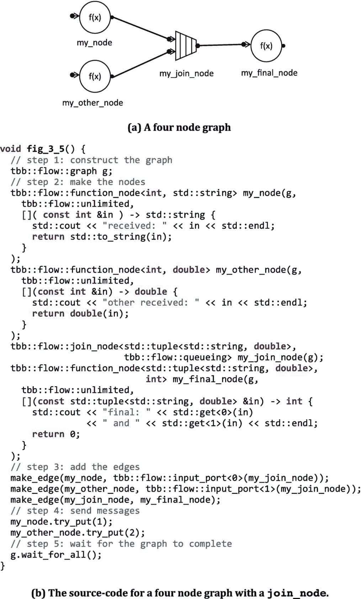

图 3-5。

具有四个节点的示例流程图

图 [3-5](#Fig5) 中的前两个节点生成结果，这些结果通过排队`join_node`、`my_join_node`连接在一起成为一个元组。当边缘被制作到`join_node`的输入端口时，我们需要指定端口号:

```cpp

make_edge(my_node, tbb::flow::input_port<0>(my_join_node));
make_edge(my_other_node, tbb::flow::input_port<1>(my_join_node));

```

`join_node`的输出，即`std::tuple<std::string, double>`，被发送到`my_final_node`。当只有一个端口时，我们不需要指定端口号:

```cpp

make_edge(my_join_node, my_final_node);

```

### 第四步:开始绘制图表

创建和使用 TBB 流图的第四步是开始执行图。消息进入图有两种主要方式:( 1)通过一个显式的`try_put`到一个节点，或者(2)作为一个`source_node`的输出。在图 [3-3](#Fig3) 和图 [3-5](#Fig5) 中，我们在节点上调用`try_put`来开始消息流入图中。

默认情况下，在活动状态下构建一个`source_node`。每当形成传出边缘时，它立即开始跨边缘发送消息。不幸的是，我们认为这很容易出错，所以我们总是在非活动状态下构造源节点，也就是说，将 false 作为`is_active`参数传递。为了在我们的图被完全构建后让消息流动，我们在所有不活动的节点上调用`activate()`函数

图 [3-6](#Fig6) 展示了如何使用`source_node`代替串行回路向图形提供信息。在图 [3-6(a)](#Fig6) 中，一个循环在一个节点`my_node`上重复调用`try_put`，向其发送消息。在图 [3-6(b)](#Fig6) 中，a `source_node`用于相同的目的。

`source_node`的返回值就像串行循环中的布尔条件一样使用——如果为真，则执行循环体的另一次执行；否则，循环停止。由于`source_node`的返回值用于表示布尔条件，所以它通过更新提供给其主体的参数来返回其输出值。在图 [3-6(b)](#Fig6) 中，`source_node`取代了图 [3-6(a)](#Fig6) 中的计数回路。

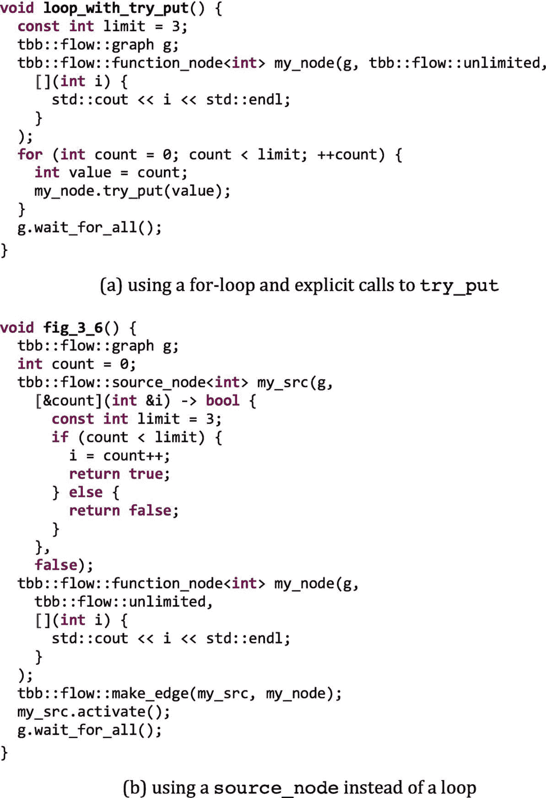

图 3-6。

在(a)中，循环将`int`值`0, 1`和`2`发送到节点`my_node`。在(b)中，a `source_node`将`int`值`0, 1`和`2`发送到节点`my_node`。

使用`source_node`而不是循环的主要优点是它响应图中的其他节点。在第 17 章[中，我们将讨论如何使用`source_node`和预留`join_node`或`limiter_node`来控制允许多少消息进入一个图。如果我们使用一个简单的循环，我们可以用输入来淹没我们的图，如果节点跟不上，迫使节点缓冲许多消息。](17.html#b978-1-4842-4398-5_17)

### 步骤 5:等待图形完成执行

一旦我们使用`try_put`或`source_node`将消息发送到图表中，我们就通过调用图表对象上的`wait_for_all()`来等待图表的执行完成。我们可以在图 [3-3](#Fig3) 、图 [3-5](#Fig5) 和图 [3-6](#Fig6) 中看到这些呼叫。

如果我们构建并执行图 [3-3](#Fig3) 中的图形，我们会看到如下输出

```cpp

    first node received: 10
    second node received: 10

```

如果我们构建并执行图 [3-5](#Fig5) 中的图表，我们会看到如下输出

```cpp

    other received: received: 21

    final: 1 and 2

```

图 [3-5](#Fig5) 的输出看起来有点混乱，确实如此。前两个功能节点并行执行，都流向`std::cout`。在我们的输出中，我们看到两个输出混杂在一起，因为我们打破了我们在本章早些时候讨论基于图的并行性时所做的假设——我们的节点不是没有副作用的！这两个节点并行执行，并且都影响全局`std::cout`对象`.`的状态。在本例中，这是可以的，因为输出只是为了通过图形显示消息的进度。但这是需要记住的重要一点。

图 [3-5](#Fig5) 中的最后一个`function_node`只有当来自前面函数节点的两个值被`join_node`连接在一起并传递给它时才会执行。因此，这个最终节点自己执行，因此它将预期的最终输出流式传输到`std::cout:`“final:1 和 2”。

## 数据流图的一个更复杂的例子

在第 [2](02.html#b978-1-4842-4398-5_2) 章中，我们介绍了一个将红-青 3D 立体效果应用于左右图像对的例子。在第 [2](02.html#b978-1-4842-4398-5_2) 章中，我们用一个 TBB `parallel_pipeline`对这个例子进行了并行化，但这样做意味着我们通过线性化流水线阶段在桌面上留下了一些并行性。输出示例如图 [3-7](#Fig7) 所示。

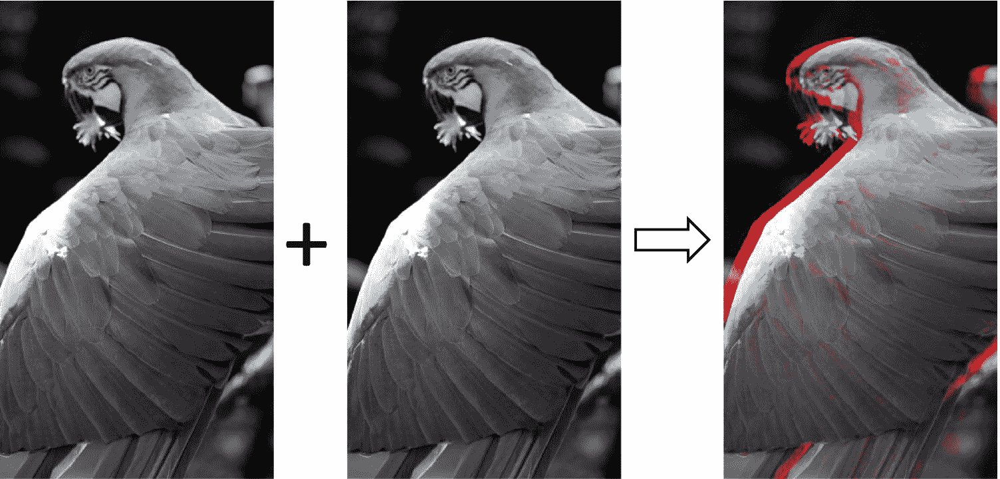

图 3-7。

左图像和右图像用于生成红-青立体图像。原始照片由埃琳娜·亚当斯拍摄。

图 [3-8](#Fig8) 显示了图 [2-28](02.html#Fig28) 所示串行代码中的数据和控制依赖关系。数据依赖关系显示为实线，控制依赖关系显示为虚线。从这个图中，我们可以看到对`getLeftImage`和`increasePNGChannel`的调用并不依赖于对`getRightImage`和`increasePNGChannel`的调用。因此，这两个系列的调用可以彼此并行进行。我们还可以看到，`mergePNGImages`无法继续，直到左右图像上的`increasePNGChannel`都已完成。最后，`write`必须等到对`mergePNGImages`的调用结束。

与第 2 章[不同，在第 2 章](02.html#b978-1-4842-4398-5_2)中，我们使用线性管道，使用 TBB 流图，我们现在可以更准确地表达依赖性。为此，我们需要首先理解应用程序中保持正确执行的约束。例如，while 循环的每次迭代直到前一次迭代完成后才开始，但这可能只是使用串行 while 循环的副作用。我们需要确定哪些约束是真正必要的。

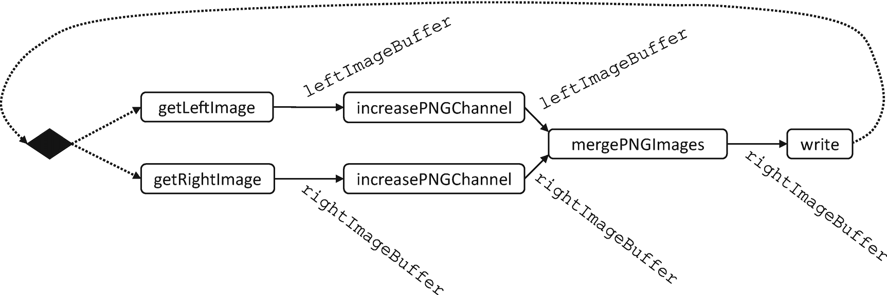

图 3-8。

图 [2-28](02.html#Fig28) 中代码示例的控制和数据依赖，其中实线代表数据依赖，虚线代表控制依赖

在这个例子中，让我们假设图像代表从文件或照相机中按顺序读取的帧。由于图像必须按顺序读取，我们不能同时多次调用`getLeftImage`或`getRightImage`；这些是串行操作。然而，我们可以将对`getLeftImage`的调用与对`getRightImage`的调用重叠，因为这些函数不会相互干扰。除了这些约束，我们将假设`increasePNGChannel`、`mergePNGImages`和`write`在不同的输入上并行执行是安全的(它们都是无副作用和线程安全的)。因此，while 循环的迭代不能完全并行执行，但是只要保留这里确定的约束，我们就可以在迭代内部和迭代之间利用一些并行性。

### 将示例实现为 TBB 流程图

现在，让我们逐步完成实现我们的立体 3D 样本的 TBB 流图的构造。我们将要创建的流程图的结构如图 [3-9](#Fig9) 所示。这个图看起来与图 [3-8](#Fig8) 不同，因为现在节点代表 TBB 流图节点对象，边代表 TBB 流图边。

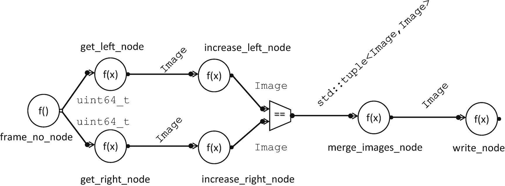

图 3-9。

表示图 [2-28](02.html#Fig28) 中调用的图表。圆圈封装了图 [2-28](02.html#Fig28) 中的功能。边缘代表中间值。梯形表示将消息连接成二元组的节点。

图 [3-10](#Fig10) 显示了使用 TBB 流程图接口实现的立体 3D 示例。方框中概述了五个基本步骤。首先，我们创建一个图形对象。接下来，我们创建八个节点，包括一个`source_node`、几个`function_node`实例和一个`join_node`。然后，我们使用对`make_edge`的调用来连接节点。在创建边之后，我们激活源节点。最后，我们等待图形完成。

在图 [3-9](#Fig9) 的图表中，我们看到`frame_no_node`是图表的输入源，在图 [3-10](#Fig10) 中，该节点使用`source_node`实现。只要一个`source_node`的主体继续返回`true`，运行时库就会继续衍生出新的任务来执行它的主体，进而调用`getNextFrameNumber()`。

正如我们前面提到的，`getLeftImage`和`getRightImage`函数必须串行执行。在图 [3-10](#Fig10) 的代码中，我们通过将这些节点的并发约束设置为`flow::serial`来将该约束传达给运行时库。对于这些节点，我们使用类`function_node`。你可以在附录 b 中看到更多关于`function_node`的细节。如果一个节点用`flow::serial`声明，运行时库将不会产生下一个任务来执行它的主体，直到任何未完成的主体任务完成。


图 3-10。

作为 TBB 血流图的立体 3D 例子

相比之下，`increase_left_node`和`increase_rigt_node`对象是用`flow::unlimited.`的并发约束构造的，无论何时有消息到达，运行时库都会立即生成一个任务来执行这些节点的主体。

在图 [3-9](#Fig9) 中，我们看到`merge_images_node`函数需要一个右图像和一个左图像。在最初的串行代码中，我们确保图像来自同一帧，因为 while 循环一次只对一帧进行操作。然而，在我们的流程图版本中，多个帧可以通过流程图流水线化，因此可以同时进行。因此，我们需要确保只合并对应于同一帧的左右图像。

为了给我们的`merge_images_node`提供一对匹配的左右图像，我们用`tag_matching`策略创建了`join_images_node`。你可以在附录 b 中了解`join_node`及其不同的策略。在图 [3-10](#Fig10) 中，`join_images_node`被构造为具有两个输入端口，并基于匹配其`frameNumber`成员变量创建一个`Image`对象元组。对构造函数的调用现在包括两个 lambda 表达式，用于从两个输入端口上的传入消息中获取标记值。`merge_images_node`接受一个元组并生成一个合并的图像。

图 [3-10](#Fig10) 中创建的最后一个节点是`write_node`。接收`Image`对象并调用`write`将每个传入缓冲区存储到输出文件的是一个`flow::unlimited function_node`。

一旦构建完成，节点通过调用`make_edge`相互连接，创建如图 [3-9](#Fig9) 所示的拓扑。我们应该注意，只有一个输入或输出的节点不需要指定端口。然而，对于像`join_images_node`这样有多个输入端口的节点，端口访问器函数用于将特定的端口传递给`make_edge`调用。

最后，在图 [3-10](#Fig10) 中，`frame_no_node`被激活，调用`wait_for_all`来等待图形完成执行。

### 了解数据流图的性能

值得注意的是，与其他一些数据流框架不同，TBB 流图中的节点不是作为线程实现的。相反，当消息到达节点并且并发限制允许时，TBB 任务被反应性地产生。一旦任务产生，它们就被调度到 TBB 工作线程上，使用与 TBB 通用算法相同的工作窃取方法(参见第 [9](pt2.html#b978-1-4842-4398-5_9) 章了解工作窃取调度器的详细信息)。

有三个主要因素会限制 TBB 流图的性能:(1)串行节点，(2)工作线程的数量，以及(3)并行执行 TBB 任务的开销。

让我们考虑如何将我们的 3D 立体图形映射到 TBB 任务，以及如何执行这些任务。节点`frame_no_node`、`get_left_node`和`get_right_node`是`flow::serial`节点。剩下的节点是`flow::unlimited`。

串行节点会导致工作线程空闲，因为它们限制了任务的可用性。在我们的立体 3D 示例中，按顺序读取图像。一旦每个图像被读取，图像的处理可以立即开始，并且可以与系统中的任何其他工作重叠。因此，这三个串行节点是我们图中限制任务可用性的节点。如果读取这些图像的时间支配了其余的处理，我们将看到很少的加速。然而，如果处理时间比读取图像的时间长得多，我们可能会看到明显的加速。

如果图像读取不是我们的限制因素，那么性能就会受到工作线程数量和并行执行开销的限制。当我们使用流程图时，我们在可能在不同工作线程上执行的节点之间传递数据，同样，在处理器内核上也是如此。我们还重叠不同功能的执行。跨线程传递数据和在不同线程上同时执行函数都会影响内存和缓存行为。我们将在本书的第 2 部分更详细地讨论局部性和开销优化。

## 依赖图的特例

TBB 流图接口支持数据流和依赖图。数据流图中的边是数据在节点之间传递的通道。我们在本章前面构建的立体 3D 示例是数据流图的一个示例—`Image`对象在图中从一个节点到另一个节点的边上通过。

依赖图中的边表示正确执行必须满足的前后关系。在依赖图中，数据通过共享内存从一个节点传递到另一个节点，而不是通过边上的消息直接传递。图 [3-11](#Fig11) 显示了制作花生酱和果冻三明治的依赖关系图；边传达了一个节点直到其所有的**完成后才能开始。**

 **

图 3-11。

制作花生酱和果冻三明治的依赖图。这里的边代表前后关系。

为了使用 TBB 流图类来表达依赖图，我们使用类`continue_node`作为节点并传递类型`continue_msg`的消息。`function_node`和`continue_node`的主要区别在于它们对信息的反应。你可以在附录 b 中看到`continue_node`的细节

当一个`function_node`接收到一个消息时，它将它的主体应用于该消息——要么立即产生一个任务，要么缓冲该消息直到合法产生一个任务来应用主体。相比之下，`continue_node`计算它接收的消息数量。当它接收到的消息数等于它拥有的前辈的数量时，它产生一个任务来执行它的主体，然后重置它的消息接收计数。例如，如果我们使用`continue_nodes`来实现图 [3-11](#Fig11) ，那么“将切片放在一起”节点将在每次接收到两个`continue_msg`对象时执行，因为它在图中有两个前置对象。

对象对消息进行计数，并且不跟踪每个单独的前任已经发送的消息。例如，如果一个节点有两个前置节点，它将在收到两个消息后执行，而不管消息来自哪里。这使得这些节点的开销更低，但也要求依赖图是非循环的。此外，虽然依赖图可以重复执行直到完成，但是将`continue_msg`对象流入依赖图是不安全的。在这两种情况下，当存在循环或者如果我们将项目流式传输到依赖图中，简单的计数机制意味着节点可能会错误地触发，因为当它真正需要等待来自不同后继者的输入时，它会对从相同后继者接收的消息进行计数。

### 实现依赖图

使用依赖图的步骤与使用数据流图的步骤相同；我们创建一个图形对象，制作节点，添加边，并将消息输入图形。主要的区别是只使用了`continue_node`和`broadcast_node`类，图必须是非循环的，并且我们必须在每次向图中输入消息时等待图执行完成。

现在，让我们构建一个示例依赖图。对于我们的例子，让我们使用一个 TBB `parallel_do`来实现我们在第 [2](02.html#b978-1-4842-4398-5_2) 章中实现的同一个正向替换例子。你可以参考那一章中串行例子的详细描述。

图 [3-12](#Fig12) 再现了该示例的串行平铺实现。

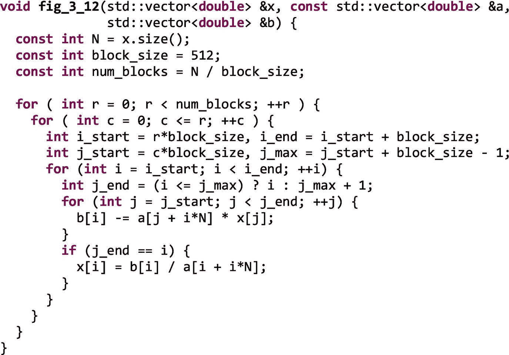

图 3-12。

用于直接实现正向替换的串行阻塞代码。编写该实现是为了使算法清晰明了，而不是为了获得最佳性能。

在第 [2](02.html#b978-1-4842-4398-5_2) 章中，我们讨论了本例中操作之间的依赖关系，并注意到，如图 [3-13](#Fig13) 所示，在计算的对角线上可以看到一个并行波前。当使用`parallel_do`时，我们创建了一个原子计数器的 2D 阵列，并且必须手动跟踪每个块何时可以被安全地提供给`parallel_do`算法来执行。虽然有效，但这很麻烦且容易出错。

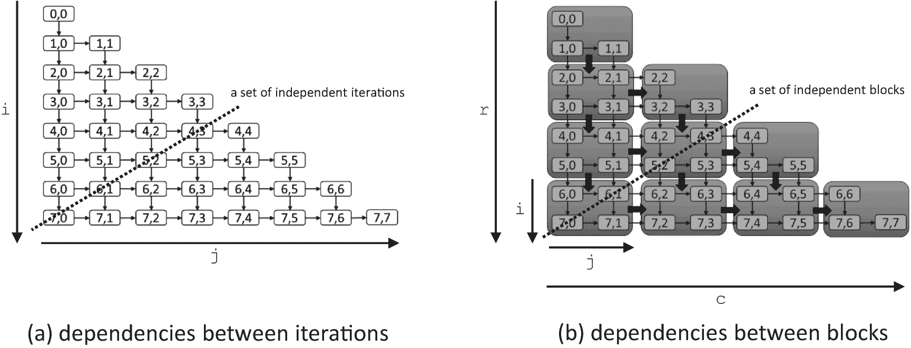

图 3-13。

8 × 8 小矩阵正向代换中的依赖性。在(a)中，显示了迭代之间的依赖性。在(b)中，迭代被分组为块以减少调度开销。在(a)和(b)中，每个节点都必须等待它上面的邻居和它左边的邻居完成，然后才能执行。

在第 2 章[的](02.html#b978-1-4842-4398-5_2)中，我们注意到在这个例子中我们也可以使用一个`parallel_reduce`来表达并行性。我们可以在图 [3-14](#Fig14) 中看到这样的实现。

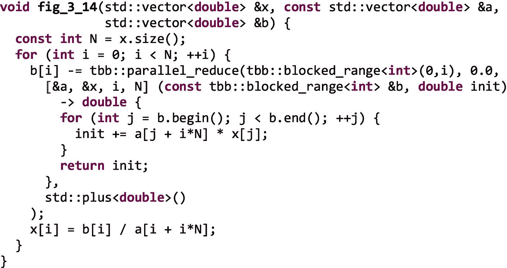

图 3-14。

使用`parallel_reduce`进行正向并行替换

然而，正如我们在图 [3-15](#Fig15) 中看到的，主线程必须等待每个`parallel_reduce`完成，然后才能继续下一个。行之间的这种同步增加了不必要的同步点。例如，一旦块 1，0 完成，立即开始处理 2，0 是安全的，但是我们必须等到 fork-join `parallel_reduce`算法完成，直到我们移动到那一行。

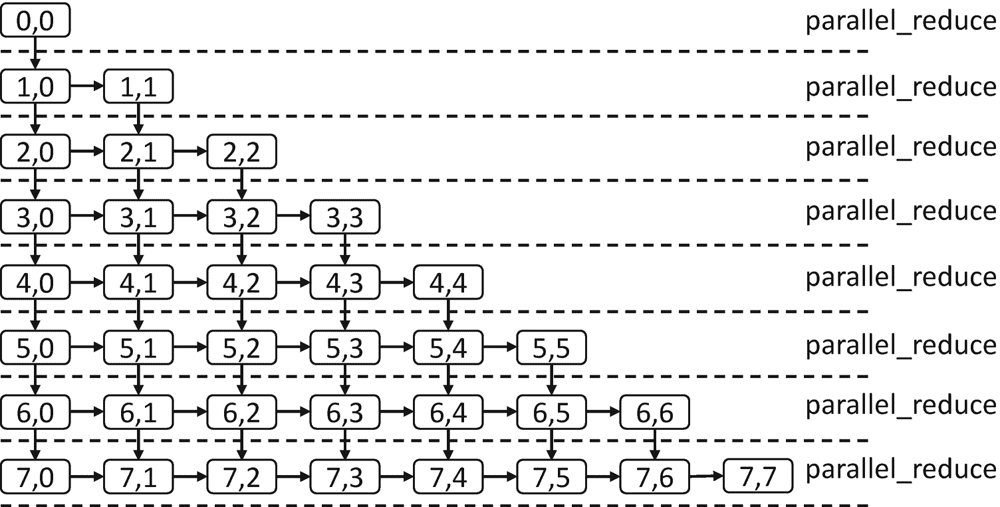

图 3-15。

主线程必须等待每个`parallel_reduce`完成，然后才能移动到下一个`parallel_reduce`，引入同步点

使用依赖图，我们简单地直接表达依赖关系，并允许 TBB 库发现和利用图中可用的并行性。我们不必像第 [2 章](02.html#b978-1-4842-4398-5_2)中的`parallel_do`版本那样明确地维护计数或跟踪完成，我们也不会像图 [3-14](#Fig14) 那样引入不必要的同步点。

图 [3-16](#Fig16) 显示了该示例的依赖图版本。我们使用一个`std::vector nodes`来保存一组`continue_node`对象，每个节点代表一个迭代块。为了创建图形，我们遵循常见的模式:(1)创建图形对象，(2)创建节点，(3)添加边，(4)向图形中输入消息，以及(5)等待图形完成。然而，我们现在使用循环嵌套创建图结构，如图 [3-16](#Fig16) 所示。函数`createNode`为每个块创建一个新的`continue_node`对象，函数`addEdges`将节点连接到必须等待其完成的邻居。

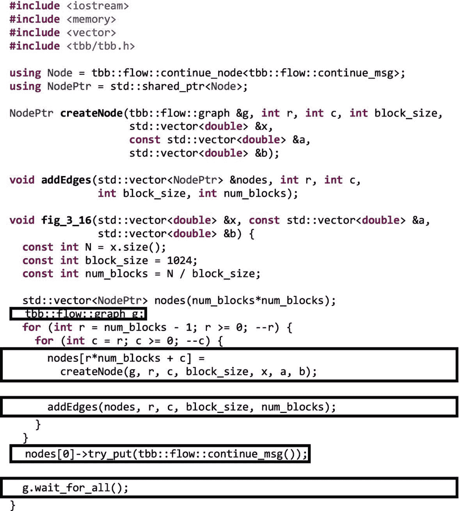

图 3-16。

正向替换示例的依赖图实现

在图 [3-17](#Fig17) 中，我们展示了`createNode.`的实现。

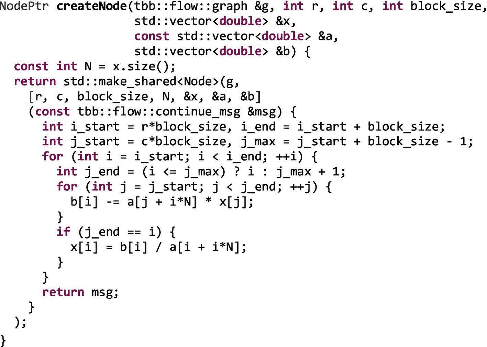

图 3-17。

`createNode`功能实现

在`createNode`中创建的`continue_node`对象使用一个 lambda 表达式，该表达式封装了图 [3-12](#Fig12) 中所示的前向替换的阻塞版本的两个内部循环。由于没有数据通过依赖图的边传递，每个节点需要的数据通过共享内存使用 lambda 表达式捕获的指针来访问。在图 [3-17](#Fig17) 中，节点通过值捕获整数`r`、`c`、`N`和`block_size`，以及对向量`x`、`a`和`b`的引用。

在图 [3-18](#Fig18) 中，函数`addEdges`使用`make_edge`调用将每个节点连接到它的右下邻居，因为它们必须等待新节点完成后才能执行。当图 [3-16](#Fig16) 中的循环嵌套完成后，一个类似于图 [3-13](#Fig13) 中的依赖图就被构建好了。


图 3-18。

`addEdges`功能实现

如图 [3-16](#Fig16) 所示，一旦构建了完整的图，我们通过向左上角的节点发送一个`continue_msg`来开始它。任何没有前置任务的`continue_node`都会在收到消息时执行。向左上角的节点发送消息会启动依赖图。同样，我们使用`g.wait_for_all()`来等待图形执行完毕。

### 评估依赖图的可伸缩性

适用于数据流图的相同性能限制也适用于依赖图。然而，因为依赖图必须是非循环的，所以更容易估计它们的可伸缩性上限。在本讨论中，我们使用由麻省理工学院 Cilk 项目引入的符号(参见，例如， *Blumofe，Joerg，Kuszmaul，Leiserson，Randall 和 Zhou，“Cilk:一个高效的多线程运行时系统”，并行编程的原理和实践，1995* )。

我们用 T <sub>`1`</sub> 表示执行图中所有节点的时间之和；1 表示如果我们只有一个执行线程，这是执行图形所花费的时间。我们将沿着关键(最长)路径执行节点的时间表示为 T <sub>∞</sub> ，因为这是最小可能的执行时间，即使我们有无限数量的线程可用。通过依赖图中的并行性可实现的最大加速是 T <sub>`1`</sub> /T <sub>∞</sub> 。在 P 个处理器的平台上执行时，执行时间绝不能小于 T <sub>`1`</sub> /P 和 T <sub>∞</sub> 中的最大值。

例如，为了简单起见，让我们假设图 [3-13(a)](#Fig13) 中的每个节点花费相同的时间来执行。我们将这个时间称为`t` <sub>`n`</sub> 。图中有 36 个节点(行数`*`列数)，所以`T`<sub>`1`</sub>`= 36t`<sub>`n`</sub>。从`0,0`到`7,7`的最长路径包含 15 个节点(行数`+`列数–1)，因此对于此图`T`<sub>`= 15t`<sub>`n`</sub>。即使我们有无限数量的处理器，关键路径上的节点也必须按顺序执行，不能重叠。因此，我们对于这个小 8 `×` 8 图的最大加速是`36t`<sub>`n`</sub>`/15t`<sub>`n`</sub>`= 2.4`。然而，如果我们有一个更大的方程组要解，让我们假设一个`512×512`矩阵，沿着关键路径将有`512×512=131,328`节点和`512+512-1=1023`节点，对于`131,328/1023` ≈ `128`的最大加速。</sub>

如果可能，如果您正在考虑实现串行应用程序的依赖图版本，那么分析您的串行代码、收集每个潜在节点的时间并估计关键路径长度是一个很好的实践。然后，您可以使用前面描述的简单计算来估计可实现的加速上限。

## TBB 流图的高级主题

TBB 流图有一组丰富的节点和接口，我们在这一章才刚刚开始触及这个表面。在第 [17](17.html#b978-1-4842-4398-5_17) 章中，我们更深入地研究 API 来回答一些重要的问题，包括

*   我们如何在流程图中控制资源的使用？

*   我们什么时候需要使用缓冲？

*   有需要避免的反模式吗？

*   有没有有效的模式可以模仿？

此外，流程图支持异步和异构的能力，我们将在第 [18](18.html#b978-1-4842-4398-5_18) 和 [19](19.html#b978-1-4842-4398-5_19) 章中探讨。

## 摘要

在这一章中，我们学习了让我们开发数据流和依赖图的`tbb::flow namespace`中的类和函数。我们首先讨论了为什么用图来表达并行性是有用的。然后，我们学习了 TBB 流图界面的基础知识，包括界面中可用的不同节点类别的简要概述。接下来，我们一步一步地构建了一个小型数据流图，该图将 3D 立体效果应用于左右图像集。之后，我们讨论了如何将这些节点映射到 TBB 任务，以及流图的性能限制是什么。接下来，我们看了依赖图，这是数据流图的一个特例，其中边传递依赖消息而不是数据消息。我们还构建了一个向前替换的例子作为依赖图，并讨论了如何估计它的最大加速比。最后，我们提到了一些重要的高级主题，这些主题将在本书的后面部分讨论。

图 [2-28a](https://doi.org/10.1007/978-1-4842-4398-5_2Fig#28a) 、 [2-29](https://doi.org/10.1007/978-1-4842-4398-5_2Fig#29) 和 [3-7](#Fig7) 中使用的照片由 Elena Adams 拍摄，经 Halide 项目教程 [`http://halide-lang.org`](http://halide-lang.org) 许可使用。

[](https://creativecommons.org/licenses/by-nc-nd/4.0) 

**开放存取**本章根据知识共享署名-非商业-非专用 4.0 国际许可协议(http://Creative Commons . org/licenses/by-NC-nd/4.0/)的条款进行许可，该协议允许以任何媒体或格式进行任何非商业使用、共享、分发和复制，只要您适当注明原作者和来源，提供知识共享许可协议的链接，并指出您是否修改了许可材料。根据本许可证，您无权共享从本章或其部分内容派生的改编材料。

本章中的图像或其他第三方材料包含在该章的知识共享许可中，除非该材料的信用额度中另有说明。如果材料未包含在本章的知识共享许可中，并且您的预期用途不被法定法规允许或超出了允许的用途，您将需要直接从版权所有者处获得许可。**