# 16.调优 TBB 算法:粒度、局部性、并行性和确定性

在第 [2](02.html#b978-1-4842-4398-5_2) 章中，我们描述了 TBB 图书馆提供的通用并行算法，并给出了几个例子来展示如何使用它们。在这样做的时候，我们注意到算法的默认行为通常是足够好的，但是我们声称如果需要的话，有办法调整性能。在这一章中，我们通过回顾一些 TBB 算法来支持这一观点，并讨论可以用来改变它们默认行为的重要特性。

有三个问题将主导我们的讨论。第一个是粒度——任务完成的工作量。TBB 库在调度任务方面很有效，但是我们需要考虑我们的算法将创建的任务的大小，因为任务大小会对性能产生重大影响，特别是如果任务非常小或非常大。第二个问题是数据局部性。正如在前言中详细讨论的，应用程序如何使用缓存和内存可以决定应用程序的性能。最后一个问题是可用的并行性。使用 TBB 时，我们的目标当然是引入并行性，但我们不能在不考虑粒度和位置的情况下盲目地这么做。调优应用程序的性能通常是在这三个问题之间进行权衡的一项工作。

TBB 算法和其他接口(如并行 STL)的一个关键区别是，TBB 算法提供了钩子和特性，让我们围绕这三个问题来影响它们的行为。TBB 算法不仅仅是我们无法控制的黑匣子！

在这一章中，我们将首先讨论任务粒度，并得出一个关于任务大小的经验法则。然后，我们将关注简单的循环算法，以及如何使用范围和分割器来控制任务粒度和数据局部性。我们还简要讨论了确定性及其在性能调优时对灵活性的影响。在本章的最后，我们将注意力转向 TBB 流水线算法，并讨论其特性如何影响粒度、数据局部性和最大并行度。

## 任务粒度:多大才算够大？

为了让 TBB 库在跨线程平衡负载方面拥有最大的灵活性，我们希望将一个算法完成的工作分成尽可能多的部分。同时，为了最小化工作窃取和任务调度的开销，我们希望创建尽可能大的任务。因为这些力是相互对立的，所以一个算法的最佳性能是在中间的某个地方找到的。

更复杂的是，确切的最佳任务大小因平台和应用程序而异，因此没有放之四海而皆准的确切准则。尽管如此，有一个大概的数字作为粗略的指导还是很有用的。考虑到这些警告，我们因此提供以下经验法则:

### 经验法则

TBB 任务应该平均大于 1 微秒，以有效地隐藏偷工减料的开销。这相当于几千个 CPU 周期——如果您喜欢使用周期，我们建议使用 10，000 个周期的经验法则。

重要的是要记住，不是每个任务都需要大于 1 微秒，事实上，这通常是不可能的。例如，在分而治之的算法中，我们可能使用小任务来划分工作，然后在叶子上使用更大的任务。这就是 TBB `parallel_for`算法的工作原理。TBB 任务既用于分割范围，又用于将主体应用于最终的子范围。分割任务通常做很少的工作，而循环体任务要大得多。在这种情况下，我们不能使所有的任务都大于 1 微秒，但是我们可以致力于使任务大小的平均值大于 1 微秒。

当我们使用像`parallel_invoke`这样的算法或者直接使用 TBB 任务时，我们可以完全控制任务的大小。例如，在第 [2](02.html#b978-1-4842-4398-5_2) 章中，我们使用`parallel_invoke`实现了并行版本的快速排序，并在数组大小(以及任务执行时间)低于截止阈值时将递归并行实现定向到串行实现:


当我们使用简单的循环算法时，比如`parallel_for`、`parallel_reduce`和`parallel_scan`，它们的范围和划分器参数为我们提供了我们需要的控制。我们将在下一节更详细地讨论这些。

## 为循环选取范围和分割器

正如第二章[所介绍的，一个范围代表一组递归可分的值——通常是一个循环的迭代空间。我们使用带有简单循环算法的范围:`parallel_for`、`parallel_reduce`、`parallel_deterministic_reduce`和`parallel_scan`。TBB 算法划分其范围，并使用 TBB 任务将算法的主体对象应用于这些子范围。与分割器相结合，范围提供了一种简单但强大的方法来表示迭代空间，并控制如何将它们划分为任务和分配给工作线程。这种划分可用于调整任务粒度和数据局部性。](02.html#b978-1-4842-4398-5_2)

要成为一个范围，一个类必须模拟如图 [16-1](#Fig1) 所示的范围概念。范围可以被复制，可以使用*拆分构造器*进行拆分，并且可以可选地提供*比例拆分构造器*。它还必须提供检查它是否为空或可分的方法，并提供一个布尔常量，如果它定义了比例分割构造函数，则该常量为真。

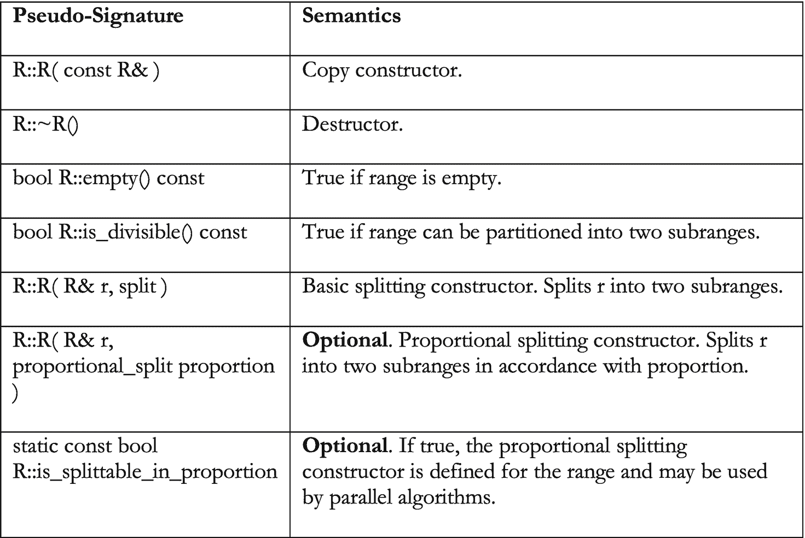

图 16-1

范围概念

虽然我们可以定义自己的范围类型，但 TBB 库提供了如图 [16-2](#Fig2) 所示的阻塞范围，这将涵盖大多数情况。例如，我们可以用`blocked_range2d<int, int> r(i_begin, i_end, j_begin, j_end )`来表示以下嵌套循环的迭代空间:


图 16-2

TBB 图书馆提供的封锁范围

对于感兴趣的读者，我们在本章末尾的“深入讨论”部分描述了如何定义一个自定义范围类型。

### 划分器概述

除了范围，TBB 算法还支持指定算法如何划分其范围的划分器。不同的分隔器类型如图 [16-3](#Fig3) 所示。


图 16-3

TBB 图书馆提供的隔板

一个`simple_partitioner`用于递归划分一个范围，直到它的`is_divisible`方法返回 false。对于被阻止的范围类型，这意味着该范围将被分割，直到其大小小于或等于其粒度。如果我们已经高度调整了我们的粒度(我们将在下一节讨论这个)，我们希望使用一个`simple_partitioner`，因为它确保最终的子范围符合提供的粒度。

一个`auto_partitioner`使用一个动态算法来充分分割一个范围以平衡负载，但是它不一定像`is_divisible`所允许的那样细分一个范围。当与 blocked range 类一起使用时，粒度仍然为最终块的大小提供了一个下限，但是由于`auto_partitioner`可以决定使用更大的粒度，所以它就不那么重要了。因此，使用粒度为 1 并让`auto_partitioner`决定最佳粒度通常是可以接受的。在 TBB 2019 中，`parallel_for`、`parallel_reduce`和`parallel_scan`使用的默认划分器类型是粒度为 1 的`auto_partitioner`。

A `static_partitioner`尽可能均匀地在工作线程上分配范围，没有进一步负载平衡的可能性。工作分配和线程映射是确定性的，只取决于迭代次数、粒度和线程数量。在所有分区中，`static_partitioner`的开销最低，因为它不做动态决策。使用`static_partitioner`还可以改善缓存行为，因为调度模式将在同一个循环的执行中重复。然而，A `static_partitioner`严重限制了负载平衡，因此需要谨慎使用。在“使用`static_partitioner`”一节中，我们将重点介绍`static_partitioner`的优点和缺点。

`affinity_partitioner`结合了`auto_partitioner`和`static_partitioner`的优点，如果在相同的数据集上重新执行循环时重用相同的分割器对象，则可以提高缓存亲和力。与`static_partitioner`一样，`affinity_partitioner`最初创建一个统一的分布，但允许额外的负载平衡。它还记录了哪个线程执行了该范围的哪个块，并试图在后续执行中重新创建这种执行模式。如果一个数据集完全适合处理器的缓存，重复调度模式可以显著提高性能。

### 选择粒度(或不选择粒度)来管理任务粒度

在本章的开始，我们谈到了任务粒度的重要性。当我们使用阻塞范围类型时，我们应该总是高度调整我们的粒度，对吗？不一定。在使用阻塞范围时，选择正确的粒度可能极其重要——或者几乎无关紧要——这完全取决于所使用的划分器。

如果我们使用一个`simple_partitioner`，粒度是传递给主体的范围大小的唯一决定因素。当使用`simple_partitioner`时，范围被递归细分，直到`is_divisible`返回 false。相比之下，所有其他划分器都有自己的内部算法来决定何时停止划分范围。选择 1 的粒度对于那些只使用`is_divisible`作为下限的划分器来说已经足够了。

为了演示粒度对不同划分器的影响，我们可以使用一个简单的`parallel_for`微基准测试，并改变循环中的迭代次数(N)、粒度、每次循环迭代的执行时间以及划分器。


图 16-4

使用划分器(`p`)、粒度(`gs`)和每次迭代时间(`tpi`)来测量用`N`次迭代执行`parallel_for`的时间的函数

本章介绍的所有性能结果都是在单插槽服务器上收集的，该服务器采用英特尔至强处理器 E3-1230，具有四个内核，每个内核支持两个硬件线程；该处理器的基本频率为 3.4 GHz，共享 8 MB 三级高速缓存，每核 256 KB L2 高速缓存。该系统运行的是 SUSE Linux Enterprise Server 12。所有样本均使用英特尔 C++编译器 19.0 线程构建模块 2019 进行编译，使用编译器标志“–STD = c++ 11–O2–TBB”。

图 [16-5](#Fig5) 显示了图 [16-4](#Fig4) 中的程序在 N=2 <sup>18</sup> 时的结果，使用了 TBB 可用的每种划分器类型，粒度范围也有所不同。我们可以看到，对于非常小的`10 n` s 的`time_per_iteration`，当粒度为> = 128 时，`simple_partitioner`接近另一个`partitioner`的最大性能。随着每次迭代时间的增加，`simple_partitioner`更快地接近最大性能，因为需要更少的迭代来克服调度开销。

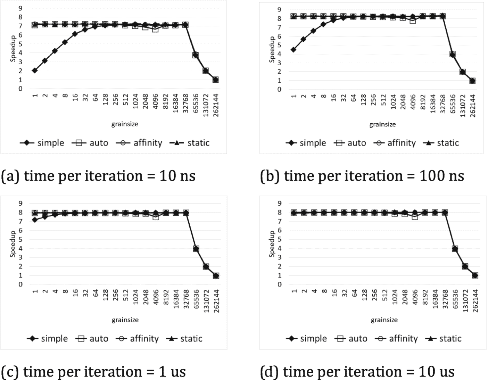

图 16-5

加速不同的分区类型和增加粒度。正在测试的循环中的总迭代次数是 2 <sup>18</sup> == 262144

对于图 [16-5](#Fig5) 中显示的除`simple_partitioner`之外的所有划分器类型，我们看到从粒度 1 到 4096 的最大性能。我们的平台有 8 个逻辑内核，因此我们需要一个小于或等于 2 <sup>18</sup> /8 == 32，768 的粒度来为每个线程提供至少一个块；因此，在粒度达到 32768 之后，所有的划分器都开始变小。我们可能还会注意到，在粒度为 4096 的情况下，`auto_partitioner`和`affinity_partitioner`在所有图中都表现出性能下降。这是因为选择大粒度限制了这些算法的选择，干扰了它们完成自动划分的能力。

这个小实验证实了粒度对`simple_partitioner`至关重要。我们可以使用一个`simple_partitioner`来手动选择任务的大小，但是当我们这样做的时候，我们需要更准确地选择。

第二点是，当主体大小接近 1 us (10ns x 128 = 1.28 us)时，可以看到高效的执行，加速接近线性上限。这个结果加强了我们在本章前面介绍的经验法则！这并不奇怪，因为像这样的经验和实验首先是我们的经验法则的原因。

### 范围、分区器和数据缓存性能

范围和分区器可以通过启用缓存无关算法或启用缓存关联来提高数据缓存性能。当数据集太大而无法放入数据缓存时，缓存无关算法非常有用，但是如果使用分而治之的方法解决这个问题，就可以在算法中重用数据。相比之下，当数据集完全适合缓存时，缓存相似性非常有用。高速缓存关联用于将一个范围的相同部分重复调度到相同的处理器上，以便可以从相同的高速缓存中再次访问适合高速缓存的数据。

#### 缓存无关算法

高速缓存不经意算法是一种不依赖于硬件高速缓存参数知识就能实现良好(甚至最佳)使用数据高速缓存的算法。该概念类似于循环平铺或循环分块，但不需要精确的平铺或分块大小。缓存无关算法通常递归地将问题分成越来越小的子问题。在某种程度上，这些小的子问题开始适合机器的缓存。递归细分可能会一直持续到尽可能小的大小，或者可能会有一个效率分界点，但这个分界点是与缓存大小相关的 ***而不是*** ，并且通常会创建访问大小远低于任何合理缓存大小的数据的模式。

因为*高速缓存无关算法*对高速缓存性能一点也不感兴趣，我们已经听到了许多其他建议的名称，例如*高速缓存不可知*，因为这些算法针对它们遇到的任何高速缓存进行优化；和*缓存偏执*，因为他们假设可以有无限级缓存。但是缓存遗忘是文献中使用的名称，并且它已经被记住了。

这里，我们将使用矩阵转置作为一个算法示例，它可以从缓存无关的实现中获益。矩阵转置的非缓存无关串行实现如图 [16-6](#Fig6) 所示。

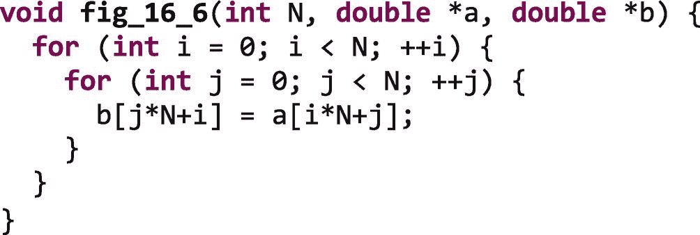

图 16-6

矩阵转置的串行实现

为了简单起见，让我们假设四个元素适合我们机器中的一个缓存行。图 [16-7](#Fig7) 显示了在 N×N 矩阵`a`的前两行转置期间将被访问的缓存行。如果高速缓存足够大，它可以在第一行`a`的转置期间保留在`b`中访问的所有高速缓存行，而不需要在第二行`a`的转置期间重新加载这些高速缓存行。但是如果它不够大，这些缓存线将需要重新加载——导致每次访问矩阵`b`时缓存未命中。在图中，我们展示了一个 16×16 的阵列，但是想象一下如果它非常大。


图 16-7

转置矩阵`a`的前两行时访问的缓存行。为简单起见，我们在每个高速缓存行中显示四个项目。

该算法的高速缓存无关实现减少了在相同高速缓存行或数据项的重复使用之间访问的数据量。如图 [16-8](#Fig8) 所示，如果我们在移动到矩阵`a`的其他块之前，只专注于转置矩阵`a`的一个小块，我们可以减少缓存行的数量，这些缓存行保存需要保留在缓存中的 b 的元素，以获得缓存行重用带来的性能提升。


图 16-8

一次转置一个块可以减少需要保留的缓存行的数量，从而有利于重用

图 [16-9](#Fig9) 显示了矩阵转置的缓存无关实现的串行实现。它沿`i`和`j`维度递归细分问题，并在范围低于阈值时使用串行 for 循环。

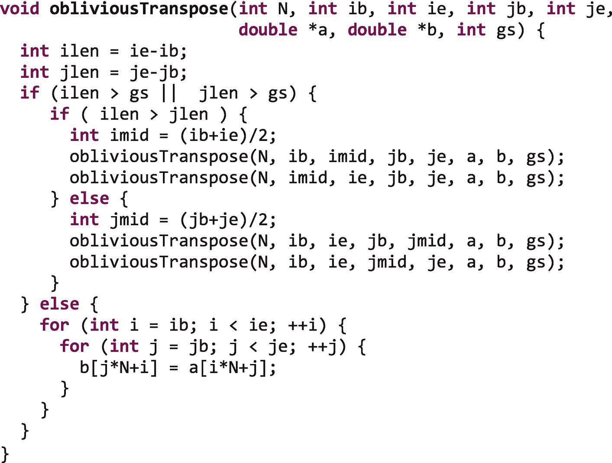

图 16-9

矩阵转置的串行高速缓存无关实现

因为实现在`i`和`j`方向的划分之间交替，矩阵`a`使用图 [16-10](#Fig10) 所示的遍历模式转置，首先完成块 1，然后 2，然后 3，等等。如果`gs`是 4，我们的缓存行大小是 4，我们在每个块内得到重用，如图 [16-8](#Fig8) 所示。但是，如果我们的缓存行是 8 项而不是 4 项(这对于实际系统来说更有可能)，我们不仅可以在最小的块内重用，还可以跨块重用。例如，如果数据高速缓存可以保留在块 1 和块 2 期间加载的所有高速缓存行，则当转置块 3 和块 4 时，这些高速缓存行将被重用。


图 16-10

一种遍历模式，在移动到其他块之前计算`a`的子块的转置

这就是缓存无关算法的真正威力——我们不需要确切知道内存层次结构的级别大小。随着子问题变得越来越小，它们在内存层次结构中的位置也越来越小，从而提高了每一级的重用性。

TBB 循环算法和 TBB 调度程序是专门为支持高速缓存无关算法而设计的。因此，我们可以使用图 [16-11](#Fig11) 所示的`parallel_for`、`blocked_range2d`和`simple_partitioner`快速实现矩阵转置的缓存无关并行实现。我们使用一个`blocked_range2d`，因为我们希望迭代空间被细分成二维块。我们使用`simple_partitioner`,因为只有当块被细分为小于缓存大小时，我们才能从重用中获益；其他类型的分区器优化负载平衡，因此如果范围大小足以平衡负载，可以选择更大的范围大小。

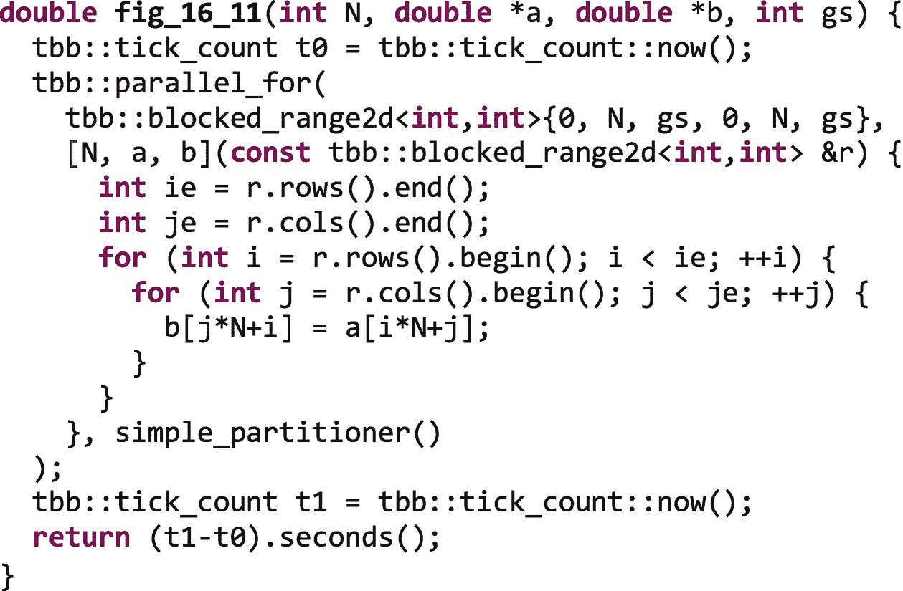

图 16-11

矩阵转置的高速缓存无关并行实现，使用一个`simple_partitioner`、一个`blocked_range2d`和一个粒度(`gs`)

图 [16-12](#Fig12) 显示了 TBB `parallel_for`递归细分范围的方式创建了我们想要的缓存无关实现的相同块。TBB 调度器的深度优先工作和宽度优先窃取行为也意味着块将以类似于图 [16-10](#Fig10) 所示的顺序执行。

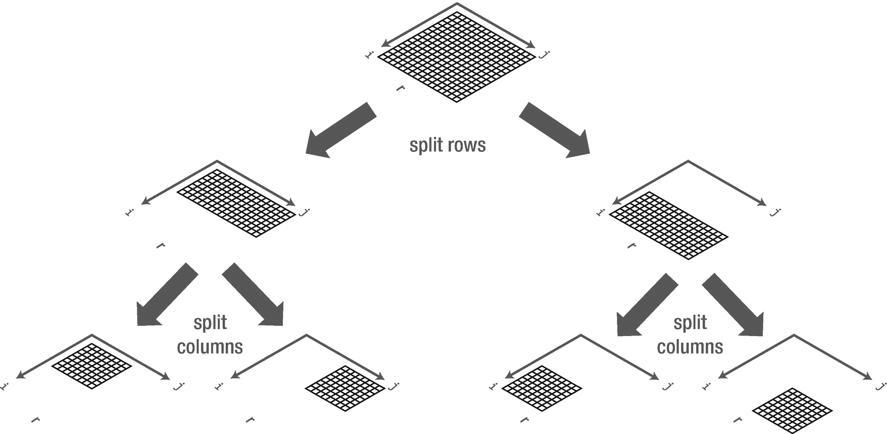

图 16-12

blocked2d_range 的递归细分提供了一个与我们的高速缓存无关并行实现所需的块相匹配的划分

图 [16-13](#Fig13) 显示了图 [16-9](#Fig9) 中串行缓存无关实现的性能，使用 1D `blocked_range`的实现的性能，以及类似于图 [16-11](#Fig11) 中的`blocked_range2d`实现的性能。我们实现了我们的并行版本，这样我们可以很容易地改变粒度和划分器。所有版本的代码都可以在`fig_16_11.cpp`找到。

在图 [16-13](#Fig13) 中，我们展示了与图 [16-6](#Fig6) 中的简单串行实现相比，我们在 8192×8192 矩阵上实现的加速。


图 16-13

在我们的测试机上，对于 N=8192，使用不同粒度和划分器的加速比

矩阵转置受限于我们读写数据的速度——没有任何计算。从图 [16-13](#Fig13) 中我们可以看到，不管我们使用的粒度大小如何，我们的 1D `blocked_range`并行实现比我们的简单串行实现性能更差。串行实现已经受到内存带宽的限制——添加额外的线程只会给已经不堪重负的内存子系统增加更多压力，而且于事无补。

我们的串行缓存忽略算法对内存访问进行了重新排序，减少了缓存未命中的数量。它明显优于简单版本。当我们在我们的并行实现中使用一个`blocked_range2d`时，我们同样得到 2D 细分。但是正如我们在图 [16-13](#Fig13) 中看到的，只有当我们使用一个`simple_partitioner`时，它才完全表现得像一个缓存无关的算法。事实上，我们的高速缓存无关并行算法通过一个`blocked_range2d`和一个`simple_partitioner`降低了内存层次的压力，现在使用多线程可以提高串行高速缓存无关实现的性能！

不是所有的问题都有缓存无关的解决方案，但是很多常见的问题都有。值得花时间研究问题，看看缓存无关的解决方案是否可行，是否值得。如果是这样，阻塞范围类型和`simple_partitioner`将使得用 TBB 算法实现一个变得非常容易。

#### 缓存相似性

缓存无关算法通过将具有数据局部性但不适合缓存的问题分解成适合缓存的较小问题来提高缓存性能。相比之下，高速缓存相似性解决了跨已经适合高速缓存的数据重复执行范围的问题。由于数据适合缓存，如果在后续执行中将相同的子范围分配给相同的处理器，则可以更快地访问缓存的数据。我们可以使用`affinity_partitioner`或`static_partitioner`来为 TBB 循环算法启用缓存关联。图 [16-14](#Fig14) 显示了一个简单的微基准，它为 1D 数组中的每个元素增加一个值。该函数接收对分割器的引用——我们需要接收分割器作为在`affinity_partitioner`对象中记录历史的引用。

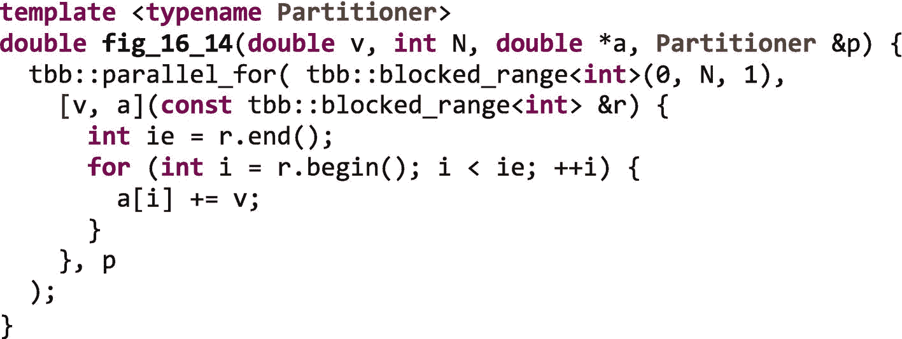

图 16-14

使用 TBB `parallel_for`向 1D 数组的所有元素添加值的函数

为了查看缓存关联性的影响，我们可以重复执行这个函数，为`N`发送相同的值，并发送相同的数组`a`。当使用`auto_partitioner`时，线程子范围的调度将随着调用的不同而不同。即使数组`a`完全适合处理器的缓存，在随后的执行中，`a`的相同区域可能不会落在同一个处理器上:


然而，如果我们使用一个`affinity_partitioner`，TBB 库将记录任务调度，并使用相似性提示在每次执行时重新创建它(参见第 [13 章](13.html#b978-1-4842-4398-5_13)了解更多关于相似性提示的信息)。因为历史记录在分区器中，所以我们必须在后续执行中传递相同的分区器对象，而不能像使用`auto_partitioner`那样简单地创建一个临时对象:


最后，我们还可以使用一个`static_partitioner`来创建缓存亲缘关系。因为当我们使用`static_partitioner`时调度是确定的，所以我们不需要为每次执行传递相同的 partitioner 对象:


我们在测试机上使用 N=100，000 和 M=10，000 执行了这个微基准测试。我们的 doubles 数组的大小将是 100，000 × 8 = 800 K。我们的测试机器有四个 256 K L2 数据缓存，每个内核一个。使用`affinity_partitioner`时，测试完成速度比使用`auto_partitioner`时快 1.4 倍。当使用`static_partitioner`时，测试完成速度比使用`auto_partitioner!`时快 2.4 倍，因为数据能够适合 L2 缓存的总大小(4 × 256 K = 1 MB)，重放相同的调度对执行时间有显著影响。在下一节中，我们将讨论为什么在这种情况下`static_partitioner`的表现优于`auto_partitioner`，以及为什么我们不应该对此过于惊讶或兴奋。如果我们将 N 增加到 1，000，000 个元素，我们将不再看到执行时间的巨大差异，因为数组`a`现在太大了，不适合我们测试系统的缓存——在这种情况下，有必要重新思考实现平铺/分块以利用缓存局部性的算法。

### 使用`static_partitioner`

`static_partitioner`是开销最低的分区器，它可以在一个竞技场中的线程间快速提供阻塞范围的均匀分布。由于分区是确定性的，所以当一个循环或一系列循环在同一范围内重复执行时，它还可以改善缓存行为。在上一节中，我们看到它在微基准测试中明显优于`affinity_partitioner`。但是，因为它创建的块刚好够给竞技场中的每个线程提供一个块，所以没有机会通过工作窃取来动态平衡负载。实际上，`static_partitioner`禁用了 TBB 图书馆的工作窃取调度方法。

尽管 TBB 有一个很好的理由将`static_partitioner`包括在内。随着内核数量的增加，随机窃取工作变得更加昂贵；尤其是当从应用程序的串行部分过渡到并行部分时。当主线程第一次产生新的工作时，所有的工作线程都会醒来，像一群*雷鸣般的*试图找到工作去做。更糟糕的是，他们不知道去哪里查找，开始随机地不仅查看主线程的 dequee，还查看彼此的本地 dequee。一些工作线程最终会在主线程中找到该工作并对其进行细分，另一个工作线程最终会找到这个细分的片段，对其进行细分，以此类推。过了一段时间，事情就会稳定下来，所有的工人都会找到事情做，并愉快地在他们自己的地方工作。

但是，如果我们已经知道工作负载得到了很好的平衡，系统没有超额预订，并且我们所有的内核都同样强大，那么我们真的需要所有这些窃取工作的开销来在工作人员之间实现均匀分布吗？如果我们用一个`static_partitioner`就不会！它就是为这种情况而设计的。它将任务均匀地分配给工作线程，这样它们就不必窃取任务了。当应用时，`static_partitioner`是划分循环最有效的方式。

但是不要对`static_partitioner!`过于兴奋，如果工作负载不均匀或者任何内核都超额订阅了额外的线程，那么使用`static_partitioner`会破坏性能。例如，图 [16-15](#Fig15) 显示了我们在图 [16-5(c)](#Fig5) 中用来检验粒度对性能影响的相同微基准配置。但是图 [16-15](#Fig15) 显示了如果我们添加一个在其中一个内核上运行的额外线程会发生什么。对于除了`static_partitioner`之外的所有线程，由于额外的线程，影响很小。然而,`static_partitioner`假设所有的内核能力相同，并在它们之间均匀地分配工作。结果，过载的内核成为瓶颈，加速性能受到严重影响。

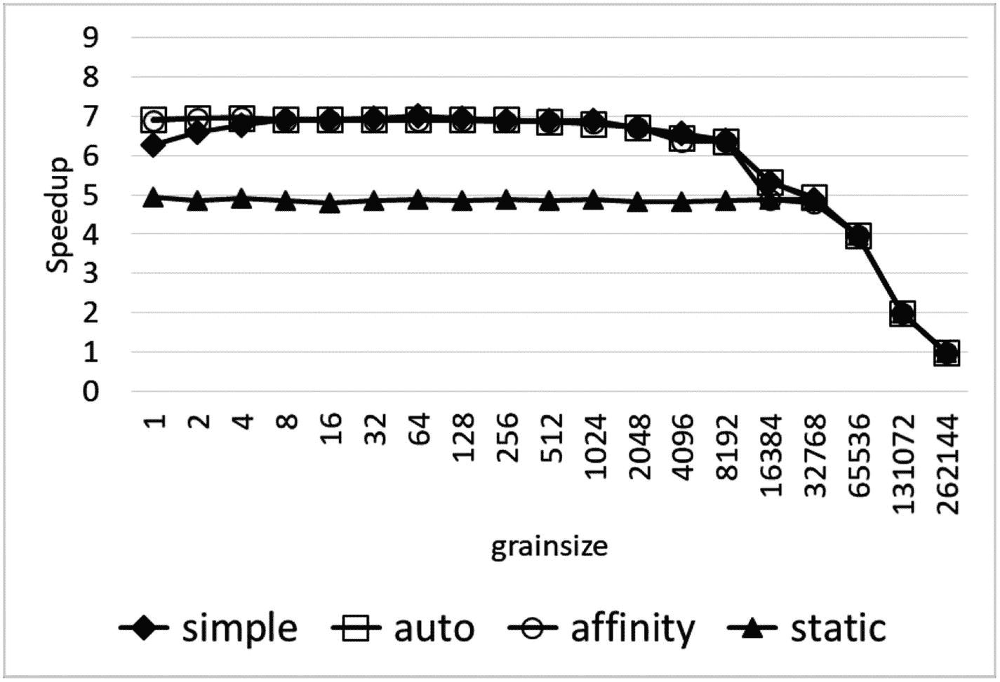

图 16-15

当一个额外的线程在后台执行自旋循环时，不同分区类型的加速和粒度的增加。每次迭代的时间被设置为 1 us。

图 [16-16](#Fig16) 显示了一个工作随着每次迭代而增加的循环。如果使用了一个`static_partitioner`，得到最低迭代集的线程将比得到最高迭代集的不幸线程有更少的工作要做。


图 16-16

在每次迭代中工作量增加的循环

如果我们使用 N=1000 的每种划分器类型运行图 [16-16](#Fig16) 中的循环十次，我们会看到以下结果:

```cpp

auto_partitioner = 0.629974 seconds
affinity_partitioner = 0.630518 seconds
static_partitioner = 1.18314 seconds

```

`auto_partitioner`和`affinity_partitioner`能够在线程间重新平衡负载，而`static_partitioner`仍坚持其最初的统一但不公平的分配。

因此，`static_partitioner`几乎只在高性能计算(HPC)应用中有用。这些应用程序运行在具有多个内核的系统上，并且通常以批处理模式运行，即一次运行一个应用程序。如果工作负载不需要 ***任何*** 的动态负载平衡，那么`static_partitioner`将几乎总是优于其他划分器。不幸的是，平衡良好的工作负载和单用户、批处理模式的系统是例外，而不是规则。

### 限制调度程序以实现确定性

在第 [2 章](02.html#b978-1-4842-4398-5_2)中，我们讨论了**结合律和浮点类型**。我们注意到浮点数的任何实现都是近似的，所以当我们依赖于结合性或交换性等属性时，并行性会导致不同的结果——这些结果不一定是错误的；他们只是不同而已。尽管如此，在归约的情况下，如果我们想确保在同一台机器上对相同的输入数据执行时得到相同的结果，TBB 提供了一个`parallel_deterministic_reduce`算法。

正如我们可能猜测的那样，`parallel_deterministic_reduce`只接受`simple_partitioner`或`static_partitioner`，因为子范围的数量对于这两种划分器类型都是确定的。无论有多少线程动态参与执行，任务如何映射到线程，在给定的机器上,`parallel_deterministic_reduce`也总是执行相同的一组拆分和连接操作——而`parallel_reduce`算法可能不会。结果是`parallel_deterministic_reduce`在同一台机器上运行时总是返回相同的结果——但是牺牲了一些灵活性。

图 [16-17](#Fig17) 显示了使用`parallel_reduce` ( `r-auto`、`r-simple`、`r-static`)和`parallel_deterministic_reduce` ( `d-simple`、`d-static`)实现时第 [2 章](02.html#b978-1-4842-4398-5_2)中 pi 计算示例的加速。两者的最大加速是相似的；然而，`auto_partitioner`对于`parallel_reduce`来说表现很好，而这根本不是`parallel_deterministic_reduce.`的选项。如果需要，我们可以实现我们的基准的确定性版本，但必须处理选择良好粒度的复杂性。

虽然`parallel_deterministic_reduce`会有一些额外的开销，因为它必须执行所有的拆分和连接，但这种开销通常很小。更大的限制是我们不能使用任何自动为我们找到块大小的分割器。

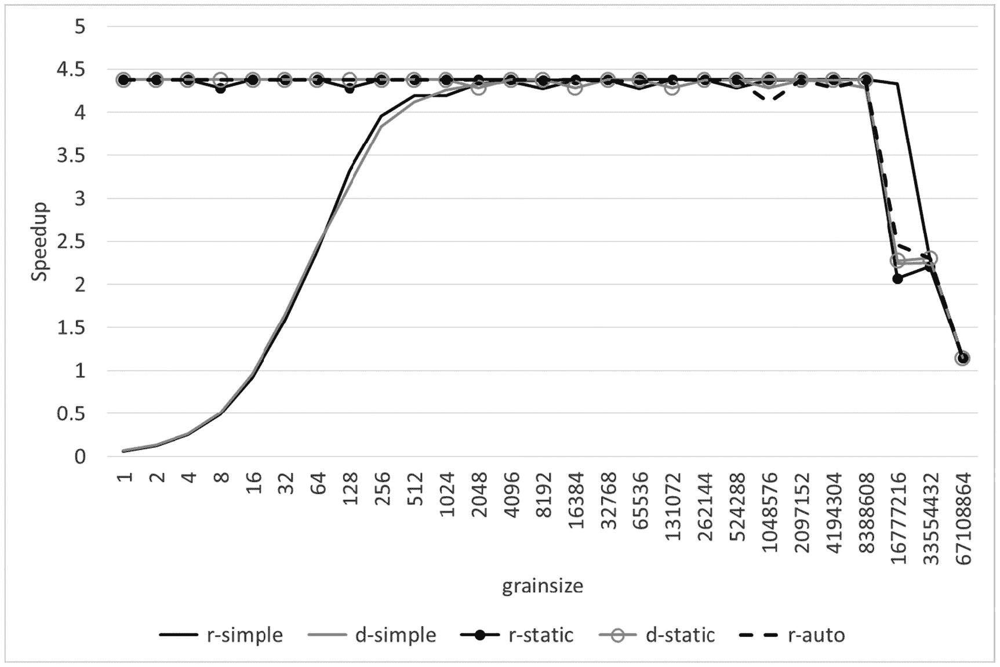

图 16-17

使用带有一个`auto_partitioner` ( `r-auto`)、一个`simple_partitioner` ( `r-simple`)和一个`static_partitioner` ( `r-static`)的`parallel_reduce`，加速第 [2](02.html#b978-1-4842-4398-5_2) 章中的 pi 示例；还有`parallel_deterministic_reduce`带一个`simple_partitioner` ( `d-simple`)和一个`static_partitioner` ( `d-static`)。我们显示了粒度范围从 1 到`N`的结果。

## 优化 TBB 管道:过滤器、模式和令牌的数量

正如循环算法一样，TBB 流水线的性能受到粒度、位置和可用并行度的影响。与循环算法不同，TBB 管道不支持范围和分割器。相反，用于优化管道的控制包括过滤器数量、过滤器执行模式以及运行时传递给管道的令牌数量。

TBB 管道过滤器是作为任务产生的，并由 TBB 库调度，因此，正如循环算法创建的子范围一样，我们希望过滤器体执行足够长的时间以减少开销，但我们也希望有足够的并行性。我们通过将工作分解成过滤器来平衡这些关注。由于最慢的串行级将成为瓶颈，因此过滤器还应该在执行时间上很好地平衡。

如第 [2](02.html#b978-1-4842-4398-5_2) 章所述，管道过滤器也是用执行模式创建的:`serial_in_order`、`serial_out_of_order`或`parallel`。使用`serial_in_order`模式时，一个过滤器一次最多只能处理一个项目，并且必须按照第一个过滤器生成它们的顺序进行处理。一个`serial_out_of_order`过滤器被允许以任何顺序执行项目。允许对不同的项目并行执行一个`parallel`过滤器。我们将在本节的后面讨论这些不同的模式是如何限制性能的。

运行时，我们需要为 TBB 管道提供一个`max_number_of_live_tokens`参数，该参数约束在任何给定时间允许流经管道的项目数量。

图 [16-18](#Fig18) 显示了我们将用来探索这些不同控件的微基准的结构。在图中，两个管道都显示有八个过滤器，但我们将在实验中改变这个数字。顶部管道的过滤器使用相同的执行`mode,`，并且都有相同的`spin_time`——所以这代表了一个非常平衡的管道。底部管道有一个比`imbalance * spin_time`旋转的过滤器——我们将改变这个不平衡因子，看看不平衡对加速的影响。


图 16-18

平衡的管道微基准和不平衡的管道微基准

### 了解平衡的管道

让我们首先考虑一下我们对于任务大小的经验法则在管道中的应用情况。1 微秒的滤波器体足以减少开销吗？图 [16-19](#Fig19) 显示了在仅使用单个令牌的情况下，当输入 8000 个项目时，我们的平衡管道微基准测试的加速。显示了不同过滤器执行时间的结果。因为只有一个令牌，所以一次只允许一个项目流过管道。结果是管道的序列化执行(即使过滤器执行模式设置为并行)。

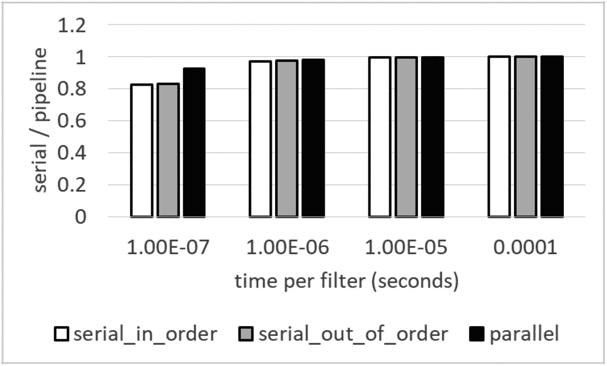

图 16-19

当在我们的测试机器上执行具有八个过滤器、一个令牌和 8000 个项目的平衡管道时，不同过滤器执行模式所看到的开销

与真正的串行执行相比，在真正的串行执行中，我们在 for 循环中执行适当数量的旋转，我们看到了将工作管理为 TBB 流水线的影响。在图 [16-19](#Fig19) 中，我们看到当`spin_time`接近 1 微秒时，开销相当低，我们非常接近真正串行执行的执行时间。似乎我们的经验法则也适用于 TBB 管道！

现在，让我们看看过滤器的数量如何影响性能。在串行流水线中，并行性仅来自不同滤波器的重叠。在具有并行过滤器的流水线中，并行性也通过对不同的项目同时执行并行过滤器来获得。我们的目标平台支持八个线程，因此我们预计并行执行的加速比最多为 8。

图 [16-20](#Fig20) 显示了当令牌数设置为 8 时，我们的平衡管道微基准测试的加速。对于这两种串行模式，加速会随着滤波器数量的增加而增加。记住这一点很重要，因为串行流水线的加速不像 TBB 循环算法那样随数据集大小而变化。然而，包含所有并行过滤器的平衡流水线即使只有一个过滤器也具有 8 倍的加速比。这是因为 8000 个输入项可以在单个过滤器中并行处理——没有串行过滤器会成为瓶颈。

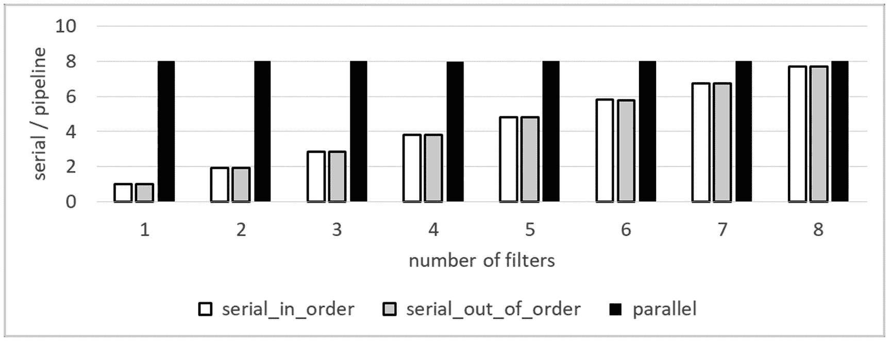

图 16-20

当执行具有 8 个令牌、8000 个项目和不断增加的过滤器数量的平衡管道时，不同的过滤器执行模式实现的加速。过滤器旋转 100 微秒。

在图 [16-21](#Fig21) 中，我们看到了使用八个过滤器但令牌数量不同时，我们的平衡流水线的加速。因为我们的平台有八个线程，如果我们的令牌少于八个，那么就没有足够的项目来保持所有线程的忙碌。一旦管道中至少有八个项目，所有线程都可以参与。将令牌数量增加到八个以上对性能几乎没有影响。

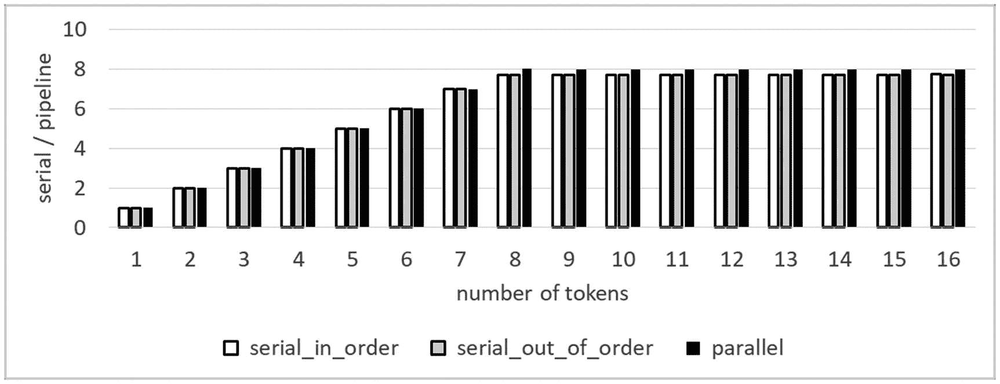

图 16-21

当执行具有八个过滤器、8000 个项目和不断增加的令牌数量的平衡管道时，不同过滤器执行模式实现的加速。过滤器旋转 100 微秒。

### 了解不平衡的管道

现在，让我们看看图 [16-18](#Fig18) 中不平衡管道的性能。在这个微基准测试中，除了一个过滤器旋转了`spin_time * imbalance`秒之外，所有的过滤器都旋转了`spin_time`秒。因此，当`N`物品通过我们带有八个过滤器的不平衡管道时，处理这些物品所需的工作量为


在稳定状态下，串行流水线受到最慢串行级的限制。当不平衡滤波器以串行模式执行时，同一流水线的临界路径长度等于


图 [16-22](#Fig22) 显示了在我们的测试平台上使用不同的不平衡系数执行不平衡流水线的结果。我们还包括理论上的最大加速，标记为“工作/关键路径”，计算为


不出所料，图 [16-22](#Fig22) 显示串行流水线受到最慢滤波器的限制——测量结果接近我们的工作/关键路径长度计算预测。


图 16-22

当执行具有八个过滤器、8000 个项目和不同不平衡因子的不平衡管道时，不同过滤器执行模式实现的加速。七个过滤器旋转 100 微秒，其他的旋转`imbalance * 100`微秒。

相比之下，图 [16-22](#Fig22) 中的并行管道不受最慢阶段的限制，因为 TBB 调度程序可以将最慢过滤器的执行与同一过滤器的其他调用重叠。您可能想知道将令牌数量增加到八个以上是否会有帮助，但在这种情况下，没有帮助。我们的测试系统只有八个线程，因此我们最多可以重叠最慢过滤器的八个实例。虽然在某些情况下，临时负载不平衡可以通过拥有比线程数量更多的令牌来消除，但在我们的微基准测试中，不平衡是一个常数，我们实际上受到关键路径长度和线程数量的限制，任何数量的额外令牌都不会改变这一点。

但是，在一些算法中，令牌数量不足会妨碍窃取工作的 TBB 调度程序的自动负载平衡功能。这种情况发生在各级不平衡，并且有一系列级使管道停止工作的时候。A. Navarro 等人证明了(参见本章末尾的“更多信息”部分),如果使用正确的令牌数进行适当配置，在 TBB 中实现的流水线算法可以产生最佳性能。她设计了一个基于排队论的分析模型，有助于找到这个关键参数。这篇论文的一个主要观点是，当令牌的数量足够大时，TBB 中的工作窃取模拟了一个能够为所有线程提供服务的全局队列(在排队论中，一个具有由所有资源服务的单个全局队列的理论集中式系统是已知的理想情况)。然而，在现实中，当一个全局单队列由大量线程服务时，它会出现争用。TBB 实现的根本优势在于，它采用了分布式解决方案，每个线程一个队列，由于工作窃取调度器的作用，该队列表现为一个全局队列。也就是说，分散式 TBB 实现像理想的集中式系统一样运行，但是没有集中式系统的瓶颈。

### 管道和数据局部性以及线程关联性

对于 TBB 循环算法，我们使用阻塞范围类型`affinity_partitioner`和`static_partitioner`来调整缓存性能。TBB `parallel_pipeline`功能和`pipeline`类没有类似的选项。但是并没有失去一切！TBB 管道中内置的执行顺序旨在增强时态数据局部性，而无需做任何特殊处理。

当 TBB 主线程或工作线程完成 TBB 过滤器的执行时，它执行流水线中的下一个过滤器，除非该过滤器由于执行模式的限制而不能被执行。例如，如果过滤器 f <sub>0</sub> 生成一个项目`i`，并且其输出被传递到下一个过滤器 f <sub>1</sub> ，运行 f <sub>0</sub> 的同一线程将继续执行 f<sub>1</sub>——除非下一个过滤器是一个`serial_out_of_order`过滤器，并且它当前正在处理其他东西，或者如果它是一个`serial_in_order`过滤器并且项目`i`不是队列中的下一个项目。在这种情况下，该项在下一个过滤器中被缓冲，线程将寻找其他工作去做。否则，为了最大化局部性，线程将跟踪它刚刚生成的数据，并通过执行下一个过滤器来处理该项。

在内部，过滤器`f` <sub>`0`</sub> 中的一个项目的处理被实现为由线程/核执行的任务。过滤完成后，任务会自行回收(参见第 [10 章](10.html#b978-1-4842-4398-5_10)中的任务回收)以执行下一个过滤`f` <sub>`1`</sub> 。本质上，垂死的任务`f` <sub>`0`</sub> 转世成新的`f` <sub>`1`</sub> 任务，绕过调度器——执行`f` <sub>`0`</sub> 的同一线程/内核也将执行`f` <sub>`1`</sub> 。就数据局部性和性能而言，这比常规/简单的管道实现要好得多:filter `f` <sub>0</sub> (由一个或多个线程服务)将项目排入 filter `f` <sub>`1`</sub> 的队列中(其中 f <sub>1</sub> 也由一个或多个线程服务)。这种幼稚的实现破坏了局部性，因为由过滤器`f` <sub>`0`</sub> 在一个核上处理的项目很可能由过滤器`f` <sub>`1`</sub> 在不同的核上处理。在 TBB，如果`f` <sub>`0`</sub> 和`f` <sub>`1`</sub> 满足前面提到的条件，这种情况永远不会发生。因此，TBB 管道偏向于在管道开始注入更多物品之前完成已经在飞行中的物品；这种行为不仅利用了数据局部性，而且通过减少串行筛选器所需的队列大小，使用了更少的内存。

不幸的是，TBB 管道过滤器*不支持*相似性提示。没有办法暗示我们想要特定的过滤器在特定的工作线程上执行。但是，也许令人惊讶的是，有一个硬亲和机制。然而，使用`thread_bound_filter`需要使用更容易出错、类型不安全的`tbb::pipeline`接口，我们将在下一节“深入讨论”中对此进行描述

## 杂草深处

本节涵盖了一些 TBB 用户很少使用的功能，但在需要时，它们会非常有用。如果您需要创建自己的范围类型或在 TBB 管道中使用`thread_bound_filter`,您可以选择跳过这一节，按需阅读。或者，如果你真的想尽可能多地了解 TBB，请继续读下去！

### 打造您自己的产品系列

正如本章前面提到的，被阻止的范围类型包含了最常见的情况。在我们使用 TBB 的这些年里，我们个人只遇到过少数几个实施我们自己的 Range 类型有意义的情况。但是如果我们需要，我们可以通过实现模拟图 [16-1](#Fig1) 中描述的范围概念的类来创建我们自己的范围类型。

作为一个有用但非典型的范围类型的例子，我们可以再次回顾快速排序算法，如图 [16-23](#Fig23) 所示。


图 16-23

串行快速排序的实现

在这里，我们将并行化快速排序，而不是作为一个递归算法，而是使用一个`parallel_for`和我们自己的自定义`ShuffleRange.`我们的`pforQuicksort`实现如图 [16-24](#Fig24) 所示。

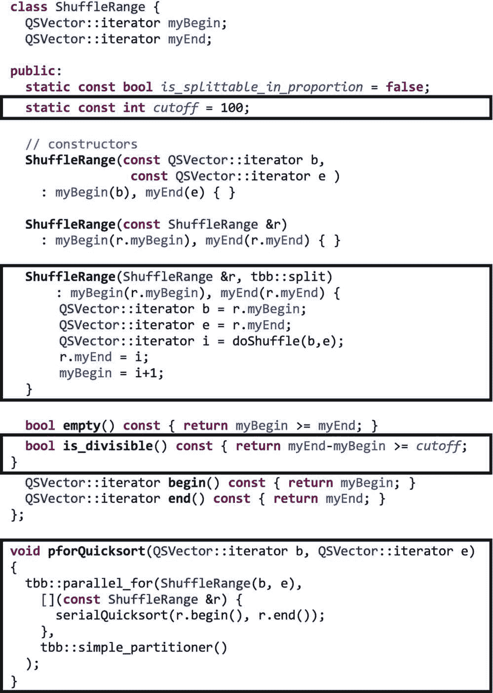

图 16-24

使用一个`parallel_for`和一个实现范围的自定义`ShuffleRange`实现并行快速排序

在图 [16-24](#Fig24) 中，我们可以看到`parallel_for`体λ表达式是基础情况，这里我们称之为`serialQuicksort`。我们还使用了一个`simple_partitioner`，这意味着我们的范围将被递归分割，直到它从它的`is_divisible`方法返回 false。因此，快速排序的所有洗牌魔力都需要发生在`ShuffleRange`类中，因为它将自己分成了子范围。`ShuffleRange`的等级定义如图 [16-24](#Fig24) 所示。

`ShuffleRange`对范围概念建模，定义复制构造函数、拆分构造函数、`empty`方法、`is_divisible`方法和设置为`false`的`is_splittable_in_proportion`成员变量。这个类还包含描述数组元素的`begin`和`end`迭代器以及一个`cutoff`值。

先说`empty`。如果其`begin`迭代器位于或超过其`end`迭代器，则范围为空。

我们使用临界值来确定是否应该进一步划分范围。记住，我们使用的是`simple_partitioner`，所以`parallel_for`将继续划分范围，直到`is_divisible`返回 false。因此，`ShuffleRange is_divisible`实现只是对这个截止值的检查。

好了，现在我们可以看看我们实现的核心，图 [16-24](#Fig24) 所示的`ShuffleRange`分裂构造函数。它接收一个对需要分割的原始`ShuffleRange r`的引用和一个用于区分这个构造函数和复制构造函数的`tbb::split`对象。构造函数的主体是基本的旋转和洗牌算法。它将原始范围`r`更新为左分区，并将新构建的`ShuffleRange`更新为右分区。

在我们的测试平台上执行我们的`pforQuicksort`产生的性能结果与第 [2](02.html#b978-1-4842-4398-5_2) 章中的`parallel_invoke`实现非常相似。但是这个例子显示了范围概念的灵活性。我们可能认为范围的递归划分在`parallel_for`中可以忽略不计，但在我们的`pforQuicksort`实现中却不是这样。我们依靠`ShuffleRange`的分裂来完成大部分的工作。

### 管道类和线程绑定过滤器

正如我们在本章前面的讨论中提到的，`tbb::parallel_pipeline`不支持相似性提示。我们不能表达我们更喜欢特定的过滤器在特定的线程上执行。然而，如果我们使用旧的、线程不安全的`tbb::pipeline`类，那么它支持线程绑定过滤器！TBB 工作线程根本不处理这些线程绑定的筛选器；相反，我们需要通过直接调用它们的`process_item`或`try_process_item`函数来显式处理这些过滤器中的项目。

通常情况下，`thread_bound_filter`并不用于改善数据局部性，而是在过滤器必须在特定线程上执行时使用——可能是因为只有该线程有权访问完成过滤器执行的操作所需的资源。这种情况在实际应用中可能会出现，例如，当一个通信或卸载库要求所有通信都来自一个特定线程时。

让我们考虑一个模拟这种情况的人为例子，其中只有主线程可以访问一个打开的文件。要使用`thread_bound_filter,`，我们需要使用`tbb::pipeline`的类型不安全类接口。使用`tbb::parallel_pipeline`功能时，我们无法创建`thread_bound_filter`。我们很快就会明白为什么使用带有`parallel_pipeline`接口的`thread_bound_filter`是没有意义的。

在我们的例子中，我们创建了三个过滤器。我们的大多数过滤器将继承自`tbb::filter`，覆盖`operator()`函数:


我们的`SourceFilter`，如图 [16-25](#Fig25) 所示，是从`tbb::filter`继承而来的`serial_in_order`过滤器，产生一系列数字。由`tbb::pipeline`实现的类型不安全接口要求我们将每个过滤器的输出作为`void *`返回。`NULL`用于指示输入流的结束。我们可以很容易地理解为什么新的`parallel_pipeline`接口在应用时更受青睐。

我们创建的第二个过滤器类型`MultiplyFilter`，将传入的值乘以 2 并返回它。它也将是一个`serial_in_order`过滤器，并从`tbb::filter`继承而来。

最后，`BadWriteFilter`实现了一个过滤器，将输出写到一个文件中。该类也继承自`tbb::filter`，如图 [16-25](#Fig25) 所示。

函数`fig_16_25`将所有这些类放在一起——同时故意引入一个错误。它使用我们的过滤器类和`tbb::pipeline`接口创建了一个三级管道。它创建一个管道对象，然后一个接一个地添加每个过滤器。为了运行管道，它调用`void pipeline::run(size_t max_number_of_live_tokens)`传入八个令牌。

正如我们在运行这个例子时应该预料到的那样，`BadWriteFilter wf`有时在主线程之外的线程上执行，所以我们看到了输出

```cpp

Error!
Done.

```

虽然这个例子看起来有些做作，但是请记住，当需要在特定线程上执行时，我们试图模拟真实的情况。本着这种精神，让我们假设我们不能简单地让所有线程都可以访问`ofstream`，而是必须在主线程上进行写操作。


图 16-25

一个错误的例子，如果`BadWriteFilter`试图从一个工作线程写入`output`就会失败

图 [16-26](#Fig26) 显示了我们如何使用`thread_bound_filter`来解决这个限制。为此，我们创建了一个从`thread_bound_filter.`继承而来的过滤器类`ThreadBoundWriteFilter`。事实上，除了改变该类继承的内容之外，过滤器类的实现与`BadWriteFilter`相同。

虽然类的实现是相似的，但是我们对过滤器的使用必须有很大的变化，如函数`fig_16_26`所示。我们现在从一个单独的线程运行管道——我们需要这样做，因为我们必须保持主线程可用，以服务线程绑定过滤器。我们还添加了一个 while 循环，重复调用我们的`ThreadBoundWriteFilter`对象上的`process_item`函数。过滤器就是在这里执行的。while 循环一直继续，直到对`process_item`的调用返回`tbb::thread_bound_filter::end_of_stream`,表明不再有要处理的项目。

运行图 [16-26](#Fig26) 中的示例，我们看到我们已经解决了问题:


图 16-26

仅从主线程写入`output`的示例

```cpp

Done.

```

## 摘要

在这一章中，我们深入研究了可以用来调整 TBB 算法的特性。我们围绕调优 TBB 应用程序时的三个常见问题展开讨论:任务粒度、可用并行性和数据局部性。

对于循环算法，我们主要关注阻塞范围类型和不同的划分器类型。我们发现，我们可以使用 1 微秒作为任务应该执行多长时间的一般指导，以减轻任务调度的开销。这一粗略的准则适用于两种循环算法，如`parallel_for`，也适用于`parallel_pipeline`中的滤波器尺寸。

我们讨论了如何使用阻塞范围类型来控制粒度以及优化内存层次结构。我们使用了`blocked_range2d`和`simple_partitioner`来实现矩阵转置的缓存无关实现。然后，我们展示了如何使用`affinity_partitioner`或`static_partitioner`来重放范围调度，以便相同的线程重复访问相同的数据。我们发现，虽然`static_partitioner`在以批处理模式执行时对于平衡的工作负载是性能最好的分区器，但是一旦负载不平衡或者系统被过量订阅，它就会因为工作窃取而无法动态平衡负载。然后，我们简要回顾了确定性，描述了`deterministic_parallel_reduce`如何提供确定性结果，但是只能通过强迫我们使用`simple_partitioner`并仔细选择粒度，或者使用`static_partitioner`并牺牲动态负载平衡。

接下来，我们将注意力转向`parallel_pipeline`以及过滤器数量、执行模式和令牌数量如何影响性能。我们讨论了平衡和不平衡管道的行为。最后，我们还注意到，虽然 TBB 管道没有为我们提供挂钩来调整缓存关联性，但它旨在通过让线程在项目流经管道时跟随项目来实现时间局部性。

我们以一些高级主题结束了这一章，包括如何创建我们自己的范围类型以及如何使用一个`thread_bound_filter`。

## 更多信息

有关高速缓存无关算法的更多信息:

*   马特奥·弗里戈、查尔斯·莱瑟森、哈拉尔德·普罗科普和斯里达尔·拉马钱德兰。2012.缓存无关算法。 *ACM 运输。算法* 8，1，第 4 篇(2012 年 1 月)，22 页。

有关流水线并行性的更深入的讨论:

*   Angeles Navarro 等人，“流水线并行性的分析建模”，ACM-IEEE 并行架构和编译技术国际会议(PACT'09)。2009.

如需了解更多关于雷群问题的信息:

*   [T2`https://en.wikipedia.org/wiki/Thundering_herd_problem`](https://en.wikipedia.org/wiki/Thundering_herd_problem)

[](https://creativecommons.org/licenses/by-nc-nd/4.0) 

**开放存取**本章根据知识共享署名-非商业-非专用 4.0 国际许可协议(http://Creative Commons . org/licenses/by-NC-nd/4.0/)的条款进行许可，该协议允许以任何媒体或格式进行任何非商业使用、共享、分发和复制，只要您适当注明原作者和来源，提供知识共享许可协议的链接，并指出您是否修改了许可材料。根据本许可证，您无权共享从本章或其部分内容派生的改编材料。

本章中的图像或其他第三方材料包含在该章的知识共享许可中，除非该材料的信用额度中另有说明。如果材料未包含在本章的知识共享许可中，并且您的预期用途不被法定法规允许或超出了允许的用途，您将需要直接从版权所有者处获得许可。