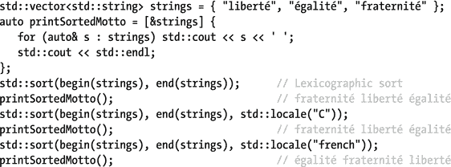
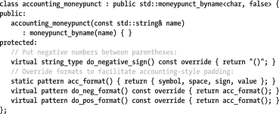
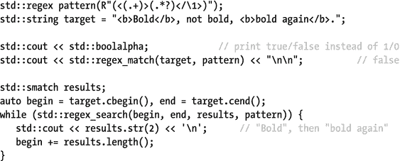

# 6.字符和字符串

## 字符串`<string>`

该标准定义了四种不同的字符串类型，每种类型对应一种不同的类似于`char`的类型:

<colgroup><col> <col> <col> <col></colgroup> 
|   | 字符串类型 | 特性 | 典型字符大小 |
| --- | --- | --- | --- |
| 窄字符串 | `std::string` | `char` | 8 位 |
| 宽弦 | `std::wstring` | `wchar_t` | 16 或 32 位 |
| UTF-16 字符串 | `std::u16string` | `char16_t` | 16 位 |
| UTF-32 字符串 | `std::u32string` | `char32_t` | 32 位 |

第一列中的名字纯粹是指示性的，因为字符串完全不知道它们所包含的类似于`char`的项目——或者代码单元——所使用的字符编码。例如，窄字符串可用于存储 ASCII 字符串，以及使用 UTF-8 或 DBCS 编码的字符串。

为了说明，我们将主要使用`std::string`。不过，本节中的所有内容同样适用于所有类型。除非另有说明，此后讨论的区域设置和正则表达式功能只需要为窄字符串和宽字符串实现。

所有四种字符串类型都是同一个类模板`std::basic_string<CharT>`的实例化。一个`basic_string<CharT>`本质上是一个`vector<CharT>`，它有额外的函数和重载，或者是为了方便普通的字符串操作，或者是为了兼容 C 风格的字符串(`const CharT*`)。`vector`的所有成员也都是为字符串提供的，除了就位功能(对字符用处不大)。这意味着，与其他主流语言不同，如。NET、Python 和 Java，C++ 中的字符串是可变的。这也意味着，例如，字符串可以很容易地用于第 [4](4.html) 章中的所有算法:


本节的剩余部分将重点介绍与`vector`相比，字符串增加的功能。对于字符串与`vector`共有的功能，我们参考第 [3 章](3.html)。有一点需要注意，特定于字符串的函数和重载大多是基于索引的，而不是基于迭代器的。例如，前一个示例中的最后三行可以更方便地写成


或者


在处理字符串索引时，`end()`迭代器的等效物是`basic_string::npos`。这个常量一贯用于表示半开放范围(也就是说，表示“直到字符串末尾”)，并且，正如您接下来看到的，作为类似`find()`的函数的“未找到”返回值。

### 在字符串中搜索

字符串提供了六个成员函数来搜索子字符串或字符:`find()`和`rfind()`、`find_first_of()`和`find_last_of()`以及`find_first_not_of()`和`find_last_not_of()`。这些总是成对出现:一个从前到后搜索，一个从后到前搜索。所有这些也都具有以下形式的相同的四个重载:


要搜索的模式可以是单个字符，也可以是字符串，后者表示为 C++ 字符串、以 null 结尾的 C-string，或者是使用第一个`n`值的字符缓冲区。`(r)find()`函数搜索完整模式的一次出现，`find_xxx_of()` / `find_xxx_not_of()`函数族搜索模式中出现/未出现的任何单个字符。结果是从开头或结尾开始的第一个匹配项的索引，如果没有找到匹配项，则为`npos`。

最可选的`pos`参数是搜索应该开始的索引。对于向后搜索的功能，`pos`的默认值为`npos`。

### 修改字符串

要修改一个字符串，可以使用从`vector`开始已知的所有成员，包括`erase()`、`clear()`、`push_back()`等等(参见第 [3 章](3.html))。附加函数或具有字符串特定重载的函数有`assign()`、`insert()`、`append()`、`+=`和`replace()`。他们的行为应该是明显的；只有`replace()`可能需要一些解释。首先，让我们介绍一下这五个函数的大量有用的重载。这些通常是这样的形式:


对于移动字符串，`assign(string&&)`也被定义。因为`+=`操作符本质上只有一个参数，自然只有`C++ string`、C 风格的字符串和初始化列表重载是可能的。

类似于它的`vector`对应物，对于`insert()`，标有`(*)`的重载返回一个`iterator`而不是一个`string`。出于同样的原因，`insert()`函数有两个额外的重载:


只有`insert()`和`replace()`需要一个`Position`。对于`insert()`，这通常是一个索引(一个`size_t`，除了最后两个重载，它是一个迭代器(再次类似于`vector::insert()`)。对于`replace()`，`Position`是一个范围，使用两个`const_iterator`指定(不适用于`substring`重载)，或者使用一个起始索引和一个长度指定(不适用于最后两个重载)。

换句话说，`replace()`并不像您所期望的那样，用另一个字符或字符串替换出现的给定字符或字符串。相反，它用一个新的序列(字符串、子字符串、填充模式等，长度可能不同)替换指定的子范围。您之前已经看到了它的使用示例(2 是被替换范围的长度):

```cpp
s.replace(s.find("be"), 2, "are");

```

要替换所有出现的子字符串或给定模式，您可以使用正则表达式和本章稍后解释的`std::regex_replace()`函数。为了替换单个字符，第 4 章中的通用`std::replace()`和`replace_if()`算法也是一种选择。

最后一个修改函数与它的`vector`对应物有一个显著的不同，那就是`erase()`:除了两个基于迭代器的重载，它还有一个处理索引的重载。用它来删除尾部或子区域，或者，如果你愿意，可以`clear()`它:

```cpp
string& erase(size_t pos = 0, size_t len = npos);

```

### 构造字符串

除了创建一个空字符串的默认构造函数之外，该构造函数还有与前一小节中的函数相同的七个重载，当然还有一个用于`string&&`。(和其他容器一样，所有的字符串构造函数都有一个可选的自定义分配器参数，但这只是高级用法。)

从 C++14 开始，各种字符类型的`basic_string`对象也可以通过添加后缀`s`从相应的字符串文字中构造。这个文字运算符是在`std::literals::string_literals`名称空间中定义的:


### 字符串长度

要获得`string`的长度，可以使用典型的容器成员`size()`或其特定于字符串的别名`length()`。两者都返回字符串包含的类似于`char`的元素的数量。但是要注意:C++ 字符串不知道所使用的字符编码，所以它们的长度等于技术上所说的代码单元的数量，这可能大于代码点或字符的数量。众所周知的编码是可变长度 Unicode 编码 UTF-8 和 UTF-16，其中并非所有字符都表示为单个代码单元:


获得码位数的一种方法是先转换成 UTF-32 编码的字符串，使用本章后面介绍的字符编码转换工具。

### 复制(子)字符串

另一个有特定字符串别名的`vector`函数(紧挨着`size()`)是`data()`，它的等价函数是`c_str()`。两者都返回一个指向内部字符数组的`const`指针(没有复制)。要将字符串复制到 C 风格的字符串，请使用`copy()`:

```cpp
size_t copy(char* out, size_t len, size_type pos = 0) const;

```

这会将从`pos`开始的`len char`值复制到`out`。也就是说，它也可以用来复制子串。要将子字符串创建为 C++ 字符串，请使用`substr()`:

```cpp
string substr(size_t pos = 0, size_t len = npos) const;

```

### 比较字符串

可以使用非成员比较运算符(`==`、`<`、`>=`等)或它们的`compare()`成员，将字符串与其他 C++ 字符串或 C 风格字符串进行词典式比较。后者具有以下重载:

```cpp
int compare(const string& str) const noexcept;
int compare(size_type pos1, size_type n1, const string& str
            [, size_type pos2, size_type n2 = npos]) const;
int compare(const char* s) const;
int compare(size_type pos1, size_type n1, const char* s
            [, size_type n2]) const;

```

`pos1` / `pos2`是第一个/第二个字符串中应该开始比较的位置，`n1` / `n2`是从第一个/第二个字符串开始比较的字符数。如果两个字符串相等，返回值为零；如果第一个字符串小于/大于第二个字符串，返回值为负/正数。

### 字符串转换

为了从字符串中解析各种类型的整数，定义了以下形式的一系列非成员函数:

```cpp
int stoi(const (w)string&, size_t* index = nullptr, int base = 10);

```

有以下几种变体:`stoi()`、`stol()`、`stoll()`、`stoul()`、`stoull()`，其中`i`代表`int`、`l`代表`long`、`u`代表`unsigned`。这些函数跳过所有前导空白字符，之后解析由`base`确定的语法所允许的尽可能多的字符。如果提供了一个`index`指针，它将接收未转换的第一个字符的索引。

类似地，为了解析浮点数，存在一组如下形式的函数:

```cpp
float stof(const (w)string&, size_t* index = nullptr);

```

提供`stof()`、`stod()`、`stold()`分别转换为`float`、`double`、`long double`。

为了进行相反的转换，将数值型转换为 a `(w)string`，提供了函数`to_(w)string(` X `)`，其中 X 可以是`int`、`unsigned`、`long`、`unsigned long`、`long long`、`unsigned long long`、`float`、`double`或`long double`。返回值是一个`std::(w)string`。

## 人物分类<cctype>，</cctype>

`<cctype>`和`<cwctype>`标题提供了一系列函数来分别对`char`和`wchar_t`字符进行分类。这些函数是`std::is`类`(int)`(只为代表`char` s 的`int` s 定义)和`std::isw`类`(wint_t)`(类比；`wint_t`是一个整数`typedef`，其中 class 等于表 [6-1](#Tab1) 中的一个值。如果给定的字符属于该类，所有函数都返回非零值`int`，否则返回零。

表 6-1。

The 12 Standard Character Classes

<colgroup><col> <col></colgroup> 
| 班级 | 描述 |
| --- | --- |
| `cntrl` | 控制字符:所有非`print`字符。包括:`'\0'`、`'\t'`、`'\n'`、`'\r'`等。 |
| `print` | 可打印字符:数字、字母、空格、标点符号等。 |
| `graph` | 带图形表示的字符:除“”以外的所有`print`字符。 |
| `blank` | 一行中分隔单词的白色字符。至少“”和`'\t'`。 |
| `space` | 空白字符:至少所有的`blank`字符、`'\n'`、`'\r'`、`'\v'`和`'\f'`。从不`alpha`人物。 |
| `digit` | 十进制数字(`0`–`9`)。 |
| `xdigit` | 十六进制数字(`0`–`9`、`A`–`F`、`a`–`f`)。 |
| `alpha` | 字母字符。至少是所有的`lowercase`和`uppercase`字符，而绝不是`cntrl`、`digit`、`punct`和`space`字符中的任何一个。 |
| `lower` | 小写字母`alpha`(默认区域设置为`a`–`z`)。 |
| `upper` | 大写字母`alpha`(默认区域设置为`A`–`Z`)。 |
| `alnum` | 字母数字字符:所有`alpha`和`digit`字符的组合。 |
| `punct` | 标点符号(`! " # $ % & ' ( ) * + , - . / : ; < = > ? @ [ \ ] ^ _ ` { &#124; } ∼`为默认区域设置)。从来没有一个`space`或`alnum`的角色。 |

相同的头还提供了`tolower()` / `toupper()`和`towlower()` / `towupper()`函数，用于在小写和大写字符之间进行转换。字符再次使用整数`int`和`wint_t`类型表示。如果转换没有定义或不可能，这些函数只返回它们的输入值。

所有字符分类和转换的确切行为取决于活动的 C 语言环境。本章稍后将详细解释区域设置，但本质上这意味着活动的语言和区域设置可能会导致不同的字符集被认为是字母、小写或大写、数字、空白等等。表 [6-1](#Tab1) 列出了不同字符类别的所有一般属性和关系，并给出了一些默认`C`区域设置的例子。

Note

在“本地化”部分，您还可以看到 C++ `<locale>`头提供了一个重载列表，这些重载用于使用给定的`locale`而不是活动的`C`语言环境的`std::is` `class` `()`和`std::tolower()` / `toupper()`(都在字符类型上模板化)。

## 字符编码转换<locale>，</locale>

字符编码决定了代码点(许多但不是所有代码点都是字符)如何表示为二进制代码单元。示例包括 ASCII(具有 7 位代码单元的经典编码)、固定长度的 UCS-2 和 UCS-4 编码(分别为 16 位和 32 位代码单元)，以及三种主要的 Unicode 编码:固定长度的 UTF-32(对每个代码点使用单个 32 位代码单元)和可变长度的 UTF-8 和 UTF-16 编码(分别将每个代码点表示为一个或多个 8 位或 16 位代码单元；UTF-8 最多 4 个单元，UTF-16 最多 2 个单元)。Unicode 和各种字符编码和转换的细节可以写满一本书；我们在这里解释在实践中在编码之间转换你需要知道什么。

包含低级编码转换逻辑的对象的类模板是`std::codecvt<CharType1, CharType2, State>` ( `cvt`可能是`converter`的简称)。它是在`<locale>`中定义的(正如您在下一节中看到的，这实际上是一个 locale 方面)。前两个参数是 C++ 字符类型，用于表示两种编码的代码单元。对于所有标准实例化，`CharType2`是`char. State`是一个高级参数，我们不做进一步解释(所有标准专门化都使用来自`<cwchar>`的`std::mbstate_t`)。

表 [6-2](#Tab2) 中列出的四个`codecvt`专门化在`<locale>`中定义。此外，`<codecvt>`标题定义了表 [6-3](#Tab3) 中列出的三个`std::codecvt`子类。 [<sup>1</sup>](#Fn1) 对于这些，`CharT`对应`codecvt`基类的`CharType1`参数；如前所述，`CharType2`永远是`char`。

表 6-3。

Character-Encoding Conversion Classes Defined in `<codecvt>`

<colgroup><col> <col></colgroup> 
| `codecvt_utf8<CharT>` `codecvt_utf16<CharT>` | UCS-2(用于 16 位`CharT` s)或 UCS-4(用于 32 位`CharT` s)与 UTF-8 / UTF-16 之间的转换。UTF-16 字符串也是用 8 位`char`表示的，所以这是针对二进制 UTF-16 编码的。 |
| `codecvt_utf8_utf16<CharT>` | UTF-16 和 UTF-8 之间的转换(`CharT`必须至少为 16 位)。 |

表 6-2。

Character-Encoding Conversion Classes Defined in `<locale>`

<colgroup><col> <col></colgroup> 
| `codecvt<char,char,mbstate_t>` | 身份转换 |
| `codecvt<char16_t,char,mbstate_t>` | UTF-16 和 UTF-8 之间的转换 |
| `codecvt<char32_t,char,mbstate_t>` | UTF-32 和 UTF-8 之间的转换 |
| `codecvt<wchar_t,char,mbstate_t>` | 本机宽字符编码和窄字符编码之间的转换(特定于实现) |

尽管理论上可以直接使用`codecvt`实例，但是使用来自`<locale>`的`std::wstring_convert<CodecvtT, WCharT=wchar_t>`类要容易得多。这个助手类方便了`char`字符串和(通常更宽的)字符类型`WCharT`字符串之间的双向转换。尽管`wstring_convert`的名字容易引起误解(已经过时)，但它也可以与`u16string`s 或`u32string`s 相互转换，而不仅仅是与`wstring`s 相互转换。

<colgroup><col> <col></colgroup> 
| 方法 | 描述 |
| --- | --- |
| (构造者) | 存在这样的构造函数，它接受一个指向现有的`CodecvtT`(其中`wstring_convert`拥有所有权)和一个初始状态(没有进一步讨论)的指针。两者都是可选的。最终构造函数接受两个错误字符串:一个由`to_bytes()`在失败时返回，另一个由`from_bytes()`返回(后者是可选的)。 |
| `from_bytes()` | 将单个`char`或一串`char`(C 风格的`char*`字符串、`std::string`或由两个`char*`指针限定的序列)转换为`std::basic_string<WCharT>`，并返回结果。失败时抛出`std::range_error`,除非构造时提供了一个错误字符串:在这种情况下，返回这个错误字符串。 |
| `to_bytes()` | 从`WCharT`到`char`的相反转换，具有类似的过载。 |
| `converted()` | 返回上一次`from_bytes()`或`to_bytes()`转换处理的输入字符数。 |
| `state()` | 返回当前状态(主要是`mbstate_t`:不做进一步讨论)。 |

回想一下`std::string`长度部分的以下例子:


要将该字符串转换为 UTF-32，您可能希望实现以下功能:


不幸的是，这不能编译。对于在`<codecvt>`中定义的转换器子类，这将编译。但是`codecvt`基类的析构函数是`protected`(像所有标准的 locale facets 一样:稍后讨论)，并且`wstring_convert`析构函数调用它来删除它拥有的转换器实例。这种设计缺陷可以通过使用如下的帮助器包装器来规避(类似的技巧可以应用于使任何受保护的函数可公开访问，而不仅仅是析构函数):


为了编译代码，您可以将第一行替换为下面的 [<sup>2</sup>](#Fn2) :

```cpp
typedef deletable<std::codecvt<char32_t,char,std::mbstate_t>> cvt;

```

要使用这些转换器潜在的特定于语言环境的变体(见下一节)，请使用以下代码(除了`""`之外，也可以使用其他语言环境名称):

```cpp
typedef deletable<std::codecvt_byname<char32_t,char,std::mbstate_t>> cvt;
std::wstring_convert<cvt, char32_t> convertor(new cvt(""));

```

一个相关的类是`wbuffer_convert<CodecvtT, WCharT=wchar_t>`，它包装了一个`basic_streambuf<char>`并使其充当一个`basic_streambuf<WCharT>`(流缓冲区在第 [5 章](5.html)中有非常简要的解释)。一个`wbuffer_convert`实例由一个可选的`basic_streambuf<char>*`、`CodecvtT*`和状态构成。包装缓冲区的 getter 和 setter 都被称为`rdbuf()`，当前转换状态可以使用`state()`获得。下面的代码构造了一个接受宽字符串的流，但是将它写入一个 UTF-8 编码的文件(需要`<fstream>`):


## 本地化`<locale>`

日期、货币值和数字的文本表示由区域和文化约定控制。举例来说，以下三个句子是类似的，但是使用本地货币、数字和日期格式编写:

```cpp
In the U.S., John Doe has won $100,000.00 on the lottery on 3/14/2015.
In India, Ashok Kumar has won ₹1,00,000.00 on the lottery on 14-03-2015.
En France, Monsieur Brun a gagné 100.000,00 € à la loterie sur 14/3/2015.

```

在 C++ 中，所有与以特定于语言环境的方式处理文本相关的参数和功能都包含在一个`std::locale`对象中。这些不仅包括刚刚说明的数值和日期的格式化，还包括特定于地区的字符串排序和转换。

### 区域名称

标准的`locale`对象是由一个地区名构成的:

```cpp
std::locale(const char* locale_name);
std::locale(const std::string& locale_name);

```

这些名称通常由两个字母的 ISO-639 语言代码和两个字母的 ISO-3166 国家代码组成。然而，精确的格式是特定于平台的:例如，在 Windows 上，英美地区的名称是`"en-US"`，而在基于 POSIX 的系统上是`"en_US"`。大多数平台支持，或者有时需要额外的规范，比如区域代码、字符编码等等。有关支持的区域设置名称和选项的完整列表，请参考您的平台文档。

只有两个可移植的语言环境名称，`""`和`"C"`:

*   使用`""`，您可以从程序的执行环境(也就是操作系统)中获取用户偏好的区域和语言设置来构造一个`std::locale`。
*   `"C"`语言环境表示经典或中性语言环境，这是所有 C 和 C++ 程序默认使用的标准化、可移植的语言环境。

使用`"C"`语言环境，前面的例句变成了

```cpp
Anywhere, a C/C++ programmer may win 100000 on the lottary on 3/14/2015.

```

Tip

当写入计算机程序要读取的文件(配置文件、数字数据输出等)时，强烈建议您使用非特定的`"C"`语言环境，以避免解析过程中出现问题。当向用户显示值时，应该考虑使用基于用户偏好的语言环境(`""`)。

### 全球语言环境

活动的全局语言环境影响各种格式化或解析文本的标准 C++ 函数，最直接的是本章后面讨论的正则表达式算法和第 [5](5.html) 章中看到的 I/O 流。是有一个程序范围的全局区域设置实例，还是每个执行线程有一个，这取决于实现。

全球语言环境总是以经典的`"C"`语言环境开始。要设置全局语言环境，可以使用静态的`std::locale::global()`函数。要获得当前活动的全局语言环境的副本，只需默认构造一个`std::locale`。例如:


Note

为了避免竞争情况，标准 C++ 对象(比如新创建的流或`regex`对象)总是在构造时复制全局`locale`。因此调用`global()`不会影响现有的对象，包括`std::cout`和`<iostream>`的其他标准流。要更改他们的区域设置，您必须调用他们的`imbue()`成员。

### 基本标准::区域设置成员

下表列出了由一个`std::locale`提供的最基本的功能，不包括复制成员。用于组合或自定义区域设置的更多高级成员将在本节末尾讨论:

<colgroup><col> <col></colgroup> 
| 成员 | 描述 |
| --- | --- |
| `global()` | 设置活动全局语言环境的静态函数(前面已经讨论过了)。 |
| `classic()` | 静态函数返回对经典`"C" locale`的常量引用。 |
| `locale()` | 默认构造函数:创建全局区域设置的副本。 |
| `locale(name)` | 如前所述，根据区域名称进行构造。如果传递了一个不存在的名字，抛出一个`std::runtime_exception`。 |
| `name()` | 返回区域设置名称(如果有)。如果`locale`表示定制的或组合的语言环境(稍后讨论)，则返回`"*"`。 |
| `==` / `!=` | 比较两个`locale`对象。只有当自定义或组合的语言环境是相同的对象或者是另一个的副本时，它们才是相等的。 |

### 局部多面

从上一小节可以明显看出，`std::locale`公共接口没有提供太多的功能。所有的本地化工具都以 facets 的形式提供。每个`locale`对象封装了许多这样的方面，对这些方面的引用可以通过`std::use_facet<FacetType>()`函数获得。例如，下面的示例使用经典区域设置的数字标点符号方面来打印区域设置的十进制标记，以格式化浮点数:


对于所有标准刻面，不能复制、移动、交换或删除由`use_facet()`的结果引用的实例。该方面由给定的`locale`共同拥有，并与拥有它的(最后一个)`locale`一起被删除。当请求给定的`locale`不拥有的`FacetType`时，引发`bad_cast`异常。要验证刻面的存在，您可以使用`std::has_facet<FacetType>()`。

Caution

永远不要做类似于`auto& f = use_facet<...>(std::locale("..."));`的事情:facet `f`由临时`locale`对象拥有，所以使用它可能会崩溃。

默认情况下，`locale` s 包含本节剩余部分中介绍的所有刻面的专门化，每个刻面又至少专门化了`char`和`wchar_t`字符类型(其他最低要求将在本节中讨论)。实现可能包括更多的方面，程序甚至可以自己添加定制的方面，这将在后面解释。

我们现在按顺序讨论表 [6-4](#Tab4) 中列出的 12 个标准刻面类别，按类别分组。之后，我们将展示如何组合不同地区的方面并创建定制的方面。虽然这可能不是大多数程序员经常使用的东西，但是偶尔确实需要定制方面。无论如何，了解本地化的范围和各种影响，并在开发显示或处理用户文本的程序(即大多数程序)时将它们牢记在心是值得的。

表 6-4。

Overview of the 12 Basic Facet Classes , Grouped by Category

<colgroup><col> <col></colgroup> 
| 种类 | 面状 |
| --- | --- |
| `numeric` | `numpunct<C>`、`num_put<C>`、`num_get<C>` |
| `monetary` | `moneypunct<C, International>`、`money_put<C>`、`money_get<C>` |
| `time` | `time_put<C>`，`time_get<C>` |
| `ctype` | `ctype<C>`，`codecvt<C1, C2, State>` |
| `collate` | `collate<C>` |
| `messages` | `messages<C>` |

#### 数字格式

`numeric`和`monetary`类别的方面遵循相同的模式:有一个`punct`方面(标点符号的缩写)带有特定于地区的格式参数，另外还有一个`put`和一个`get`方面分别负责实际的格式和值的解析。后两个方面主要供第 [5](5.html) 章中介绍的流对象使用。它们用来读取或写入值的具体格式由在`punct` facet 中设置的参数和使用流成员或流操纵器设置的其他参数的组合决定。

##### 数字标点符号

`std::numpunct<CharT>`方面提供了检索以下与数值和布尔值格式相关的信息的函数:

*   `decimal_point()`:返回小数点分隔符
*   `thousands_sep()`:返回千位分隔符
*   `grouping()`:返回一个编码数字分组的`std::string`
*   `truename()`和`falsename()`:返回带有布尔值文本表示的`basic_string<CharT>`

在本节开头的彩票示例中，数值 100000.00 使用三种不同的语言环境格式化:`"100,000.00"`、`"1,00,000.00"`和`"100.000,00"`。前两个区域分别使用逗号(`,`)和点(`.`)作为千位和小数点分隔符，而第三个区域则相反。

数字`grouping()`被编码为一系列`char`值，表示每组中的数字数量，从最右边组中的数字开始。序列中的最后一个`char`也用于所有后续组。例如，大多数地区将数字三个一组，编码为`"\3"`。(注意:不要使用`"3"`，因为`'3'` ASCII 字符会产生值为 51 的`char`；也就是:`'3' == '\51'`。)然而，对于印度地区，如`"1,00,000.00"`所示，只有最右边的组包含三位数；所有其他组只包含两个。这被编码为`"\3\2"`。为了表示无限组，可以在最后一个位置使用`std::numeric_limits<char>::max()`值。空的`grouping()` `string`表示根本不应该使用分组，例如，对于经典的`"C"`语言环境就是这种情况。

##### 数值的格式化和解析

`std::num_put`和`num_get`方面构成了第 [5](5.html) 章中描述的`<<`和`>>`流操作符的实现，并提供了具有以下签名的两组方法:

```cpp
Iter put(Iter target, ios_base& stream, char fill, X value)
Iter get(Iter begin, Iter end, ios_base& stream, iostate& error, X& result)

```

这里的`X`可以是`bool`、`long`、`long long`、`unsigned int`、`unsigned long`、`unsigned long long`、`double`、`long double`，也可以是一个`void`指针。对于`get()`，`unsigned short`，`float`也是可以的。这些方法要么格式化一个给定的数字`value`，要么尝试解析范围`[begin, end)`中的字符。在这两种情况下，`ios_base`参数是对一个流的引用，从该流中获取区域设置和格式信息(例如，包括流的格式标志和精度:参见第 [5](5.html) 章)。

所有的`put()`函数在写入格式化后的字符序列后简单地返回`target`。如果格式化长度小于`stream.width()`，则使用`fill`字符进行填充(填充规则参见第 [5](5.html) 章)。

如果解析成功，`get()`将数值存储在`result`中。如果输入与格式不匹配，`result`被设置为零，并且`iostate`参数中的`failbit`被设置(参见第 [5 章](5.html))。如果解析值对于类型`X`过大/过小，则`failbit`也被设置，并且`result`被设置为`std::numeric_limits<X>::max()` / `lowest()`(参见第 [1 章](1.html))。如果到达输入的结尾(可能是成功或失败)，则`eofbit`被设置。返回解析序列后第一个字符的迭代器。

我们在这里没有展示示例代码，但是这些方面类似于接下来介绍的货币格式化方面，对此我们包括了一个完整的示例。

#### 货币格式

##### 货币标点符号

`std::moneypunct<CharType, International=false>`方面提供了检索以下与格式化货币值相关的信息的函数:

*   `decimal_point()`、`thousands_sep()`、`grouping()`:类似前面看到的数字标点符号成员。
*   `frac_digits()`:返回小数点后的位数。典型值是`2`。
*   `curr_symbol()`:如果`International`模板参数为`false`，则返回货币符号，如`'€'`，如果`International`为`true`，则返回国际货币代码(通常为三个字母)后加一个空格，如`"EUR"`。
*   `pos_format()`和`neg_format()`返回一个`money_base::pattern`结构(稍后讨论),描述如何格式化正负货币值。
*   `positive_sign()`和`negative_sign()`:返回正负货币值的格式`string`。

后四个成员需要更多的解释。它们使用在`moneypunct`的基类`std::money_base`中定义的类型。定义为`struct pattern{ char field[4]; }`的`money_base::pattern`结构是一个包含`money_base::part`枚举的四个值的数组，这些值受支持:

<colgroup><col> <col></colgroup> 
| `part` | 描述 |
| --- | --- |
| `none` | 可选的空白字符，除了最后出现的`none`。 |
| `space` | 至少一个空白字符。 |
| `symbol` | `curr_symbol()`货币符号。 |
| `sign` | 由`positive_sign()`或`negative_sign()`返回的第一个字符。附加字符出现在格式化货币值的末尾。 |
| `value` | 货币价值。 |

比如，假设`neg_format()`模式是`{none, symbol, sign, value}`，货币符号是`'$'`，`negative_sign()`返回`"()"`，`frac_digits()`返回`2`。然后值`-123456`被格式化为`"$(1,234.56)"`。

Note

对于美国和许多欧洲地区，`frac_digits()`等于`2`，这意味着无格式的值要用分来表示，而不是美元或欧元。不过，情况并不总是这样:例如，对于日本的语言环境来说，`frac_digits()`就是`0`。

##### 货币值的格式化和解析

方面`std::money_put`和`money_get`处理货币值的格式化和解析，主要供第 [5](5.html) 章中讨论的`put_money()`和`get_money()` I/O 操纵器使用。方面提供了这种形式的方法:

```cpp
Iter put(Iter target, bool intl, ios_base& stream, char fill, X value)
Iter get(Iter begin, Iter end, bool intl, ios_base& stream,
                                            iostate& error, X& result)

```

这里的`X`不是`std::string`就是`long double`。参数的行为和含义与之前讨论的`num_put`和`num_get`相似。如果`intl`为`false`，则使用类似`$`的货币符号；否则，使用类似`USD`的字符串。

下面说明了如何使用这些方面，尽管您通常简单地使用`std::put_` / `get_money()`(使用`<cassert>`和`<sstream>`):


#### 时间和日期格式

两个面`std::time_get`和`time_put`处理时间和日期的解析和格式化，并为第五章[中的`get_time()`和`put_time()`操纵器提供动力。它们提供具有以下签名的方法:](5.html)

```cpp
Iter put(Iter target, ios_base& stream, char fill, tm* value, <format>)
Iter get(Iter begin, Iter end, ios_base& stream, iostate& error, tm* result,
         <format>)

```

`<format>`或者是`'const char* from, const char* to'`，指向使用与第 [2](2.html) 章中解释的`strftime()`相同的语法表达的时间格式模式，或者是具有可选修饰符`'char format, char modifier'`的相同语法的单个时间格式说明符。参数的行为和含义类似于数字和货币格式方面的行为和含义。第 [2](2.html) 章也解释了`std::tm`的结构。只有那些在格式化模式中提到的成员被使用/写入。

除了通用的`get()`函数之外，`time_get`方面还有一系列更受限制的解析函数，所有这些函数都有以下签名:

<colgroup><col> <col></colgroup> 
| 成员 | 描述 |
| --- | --- |
| `get_time()` | 尝试将时间解析为`%H:%M:%S`。 |
| `get_date()` | 尝试使用依赖于方面的`date_order()`成员的值的格式来解析日期:可以是`no_order` : `%m%d%y`、`dmy` : `%d%m%y`、`mdy` : `%m%d%y`、`ymd` : `%y%m%d`或`ydm` : `%y%d%m`。这个`date_order()`枚举值反映了区域设置的`%X`日期格式。 |
| `get_weekday()` `get_monthname()` | 尝试分析工作日或月份的名称，可能是缩写。 |
| `get_year()` | 尝试解析年份。是否支持两位数的年份取决于您的实现。 |

```cpp
Iter get_x(Iter begin, Iter end, ios_base& stream, iostate& error, tm*)

```

#### 字符分类、变换和转换

##### 字符分类和转换

`ctype<CharType>`方面提供了一系列依赖于地区的字符分类和转换函数，包括前面看到的`<cctype>`和`<cwctype>`头文件的等价函数。

为了在下面列出的字符分类函数中使用，定义了 12 个位掩码类型的成员常量`ctype_base::mask`(`ctype_base`是`ctype`的基类)，每个字符类一个。它们的名称与表 [6-1](#Tab1) 中给出的类名相同。虽然它们的值未指定，`alnum == alpha|digit`和`graph == alnum|punct`。下表列出了所有分类功能(输入字符范围用两个`CharType*`指针`b`和`e`表示):

<colgroup><col> <col></colgroup> 
| 成员 | 描述 |
| --- | --- |
| `is(mask,c)` | 检查给定的字符`c`是否属于由`mask`指定的任何一个字符类。 |
| `is(b,e,mask*)` | 为范围`[b`，`e)`中的每个字符标识完整的`mask`值，该值对其所属的所有类进行编码，并将结果存储在最后一个参数指向的输出范围中。返回`e`。 |
| `scan_is(mask,b,e)` `scan_not(mask,b,e)` | 扫描字符范围[ `b`，`e`，返回一个指针，指向属于/不属于`mask`指定的任何类别的第一个字符。如果没有找到，结果是`e`。 |

相同的方面也提供这些转换功能:

<colgroup><col> <col></colgroup> 
| 成员 | 描述 |
| --- | --- |
| `tolower(c)``toupper(c)``tolower(b,e)`T3】 | 对单个字符(返回结果)或字符范围[ `b`，`e`)(就地转换)执行从上至下的转换，反之亦然；`e`又回来了)。无法转换的字符保持不变。 |
| `widen(c)` `widen(b,e,o)` | 将`char`值转换为单个字符(返回结果)或字符范围[ `b`，`e`]上的刻面的字符类型(转换后的字符放入从`*o`开始的输出范围中)；`e`又回来了)。变换的角色从不属于它们的源角色不属于的类。 |
| `narrow(c,d)` `narrow(b,e,d,o)` | 转换到`char`；与`widen()`相反。然而，只有对于 96 个基本源字符(除了`$`、```cpp和`@`之外的所有`space`和【ASCII 字符)，关系`widen(narrow(c,0)) == c`才保证成立。如果没有现成的转换字符，则使用给定的默认值`char d`。 |

`<locale>`头为`ctype`面的那些函数定义了一系列方便函数，这些函数也存在于`<cctype> and <cwctype>` : `std::is`类`(c, locale&)`中，a 类名称来自表 [6-1](#Tab1) 和`tolower(c, locale&)` / `toupper(c, locale&)`。它们的实现都有如下形式(返回类型不是`bool`就是`CharT`):

```
template <typename CharT> ... function(CharT c, const std::locale& l) {
   return std::use_facet<std::ctype<CharT>>(l).function(c);
}

```cpp

##### 字符编码转换

一个`std::codecvt`刻面在两种字符编码之间转换字符序列。这在前面的“字符编码转换”中有所解释，因为这些方面在语言环境之外也很有用。每个`std::locale`至少包含表 [6-2](#Tab2) 中列出的四个`codecvt`专门化的实例，它们实现了潜在的特定于地区的转换器。这些被 Chapter [5](5.html) 的流隐式地使用，例如在宽字符串和窄字符串之间进行转换。因为不建议直接使用这些低级方面，所以我们在这里不解释它们的成员。请始终使用“字符编码转换”一节中讨论的助手类。

#### 字符串排序和散列

`std::collate<CharType>`方面实现了以下依赖于地区的字符串排序比较和散列函数。使用 begin(包含)和 end(不包含)`CharType*`指针指定所有字符序列:

<colgroup><col> <col></colgroup> 
| 成员 | 描述 |
| --- | --- |
| `compare()` | 两个字符序列的依赖于区域设置的三向比较，如果第一个在第二个之前，则返回- `1`，如果两个相等，则返回`0`，否则返回`+1`。不一定等同于简单的字典序比较。 |
| `transform()` | 将给定的字符序列转换为特定的规范化形式，该形式作为`basic_string<CharType>`返回。对两个转换后的字符串应用简单的词典排序(就像对它们的`operator<`)会返回与对未转换的序列应用 facet 的`compare()`函数相同的结果。 |
| `hash()` | 返回给定序列的一个`long`散列值(参见第 [3 章](3.html)的散列),该散列值对于所有`transform()`具有相同规范化形式的序列都是相同的。 |

一个`std::locale`本身是一个类似于`std::less<std::basic_string<CharT>>`的函子(见第 [2](2.html) 章),使用其`collate<CharT>` facet 的`compare()`函数比较两个`basic_string<CharT>`。下面的示例使用经典区域设置和法语区域设置(要使用的区域设置名称是特定于平台的)按字典顺序对法语字符串进行排序。除了`<locale>`，还需要`<vector>`、`<string>`、`<algorithm>`:



#### 消息检索

`std::messages<CharT>`方面有助于从消息目录中检索文本消息。这些目录本质上是将一系列整数映射到本地化字符串的关联数组。原则上，这可用于根据错误类别和代码检索翻译后的错误信息(参见第 [8](8.html) 章)。哪些目录可用，以及它们的结构如何，完全是特定于平台的。对于某些应用程序，使用了标准化的消息目录 API(比如 POSIX 的`catgets()`或 GNU 的`gettext()`)，而其他应用程序可能不提供任何目录(Windows 通常就是这种情况)。方面提供了以下功能:

<colgroup><col> <col></colgroup> 
| 成员 | 描述 |
| --- | --- |
| `open(n,l)` | 基于给定的特定于平台的字符串`n` (a `basic_string<CharT>`)和给定的`std::locale l`打开一个目录。返回某个有符号整数类型的唯一标识符`catalog`。 |
| `get(c,set,id,def)` | 从具有给定的`catalog`标识符`c`的目录中检索由`set`和`id`(两个`int`值，其解释特定于目录)标识的消息，并将其作为`basic_string<CharT>`返回。如果没有找到这样的消息，则返回`def`。 |
| `close(c)` | 用给定的`catalog`标识符`c`关闭目录。 |

### 组合和自定义语言环境

在组合或定制语言环境方面时，`<locale>`库的构造被设计得非常灵活。

#### 组合面

`std::locale`提供`combine<FacetType>(const locale& c)`，它返回调用`combine()`的`locale`的副本，除了从给定参数复制的`FacetType`方面。这里有一个例子(`using namespace std`是假设的):


或者，`std::locale`有一个构造函数，它接受一个基类`locale`和一个重载方面，这个重载方面做的和`combine()`一样。例如，前面示例中的`combined`的创建可以表示如下:

```
locale combined(locale::classic(), &use_facet<moneypunct<char>>(chinese));

```cpp

此外，`std::locale`有许多构造函数可以一次覆盖一个或多个类别的所有方面(`String`或者是一个`std::string`或者是一个表示特定地区名称的 C 风格字符串):

```
locale(const locale& base, String name, category cat)
locale(const locale& base, const locale& overrides, category cat)

```cpp

对于表 [6-4](#Tab4) 中列出的六个类别中的每一个，`std::locale`定义了一个具有该名称的常数。`std::locale::category`类型是位掩码类型，这意味着可以使用位运算符组合类别。例如，`all`常数被定义为`collate | ctype | monetary | numeric | time | messages`。这些构造函数可以用来创建一个类似于前面的`combined`方面:

```
locale combined(locale::classic(), chinese, locale::monetary);

```cpp

#### 自定义方面

facet 的所有公共函数 func `()`简单地调用 facet 上的一个受保护的虚拟方法，这个方法叫做`do_` func `()`。 [<sup>3</sup>](#Fn3) 你可以通过继承现有的方法并覆盖这些`do`-方法来实现定制的方面。

第一个简单的例子改变了`numpunct`方面的行为，使用字符串`"yes"`和`"no"`代替`"true"`和`"false"`进行布尔输入和输出:

```
class yes_no_numpunct : public std::numpunct<char> {
protected:
   virtual string_type do_truename() const override { return "yes"; }
   virtual string_type do_falsename() const override { return "no"; }
};

```cpp

您可以使用这个自定义方面，例如，通过将它注入到流中。下面将`"yes / no"`打印到控制台:

```
std::cout.imbue(std::locale(std::cout.getloc(), new yes_no_numpunct));
std::cout << std::boolalpha << true << " / " << false << std::endl;

```cpp

回想一下，facet 是引用计数的，`std::locale`的析构函数因此正确地清理了您的自定义 facet。

从像`numpunct`和`moneypunct`这样的方面派生的缺点是，这些通用基类实现了与地区无关的行为。相反，要从特定于地区的方面开始，可以使用方面类，如`numpunct_byname`。对于到目前为止看到的所有刻面，除了`numeric`和`monetary put`和`get`刻面之外，还有一个同名的刻面子类，但是附加了`_byname`。它们是通过传递一个地区名(`const char*`或`std::string`)来构造的，然后表现得好像取自相应的`locale`。您可以从这些方面重写，以便只修改给定区域设置的方面的特定方面。

下一个示例修改了货币标点方面，以便使用会计中的格式标准进行输出:负数放在括号中，填充以特定的方式完成。您可以从`std::moneypunct_byname` ( `string_type`在`std::moneypunct`中定义)开始，而无需覆盖一个地区的货币符号或大多数其他设置:



该面可用于如下用途(参见第 [5 章](5.html)了解`<iomanip>`的流 I/O 操纵器的详细信息):


这个程序的输出应该是

```
$   1,000.00
$     (5.00)

```cpp

理论上，您可以通过直接从`std::facet`继承来创建一个新的 facet 类，并使用相同的构造函数将其添加到`locale`中，以便稍后在您自己的库代码中使用。唯一的额外要求是定义一个默认构造的静态常量，名为`std::locale::id`类型的`id`。

### c 处所〔t0〕

C 标准库中的区域敏感函数(包括`<cctype>`中的大多数函数以及`<cstdio>`和`<ctime>`的 I/O 操作)不会直接受到全局 C++ `locale`的影响。相反，它们由相应的 C 语言环境控制。这个 C 语言环境通过以下两个函数之一进行更改:

*   `std::locale::global()`保证修改 C 语言环境以匹配给定的 C++ `locale`，只要后者有名字。否则，它对 C 语言环境的影响(如果有的话)是由实现定义的。
*   使用`<clocale>`的`std::setlocale()`功能。这丝毫不会影响 C++ 的全局`locale`。

换句话说，当使用标准语言环境时，C++ 程序应该简单地调用`std::locale::global()`。然而，为了在组合多个地区时编写可移植的代码，您必须同时调用 C++ 和 C 函数，因为当将`global()` C++ 地区更改为组合的`locale`时，并非所有的实现都如预期的那样设置 C 地区。这是按如下方式完成的:


`setlocale()`函数采用单个类别号(不是位掩码类型；支持的值至少包括`LC_ALL, LC_COLLATE`、`LC_CTYPE`、`LC_MONETARY`、`LC_NUMERIC`和`LC_TIME`以及一个语言环境名，所有这些都类似于它们的 C++ 等价物。如果成功，它将返回活动 C 语言环境的名称，作为指向重用的全局缓冲区的`char*`指针，如果失败，则返回`nullptr`。如果为语言环境名传递了`nullptr`，则 C 语言环境不会被修改。

不幸的是，C 语言环境的功能远不如 C++ 强大:定制方面或选择单个方面进行组合是不可能的，这使得在可移植代码中使用这种高级语言环境变得不可能。

`<clocale>`表头还有一个功能:`std::localeconv()`。它返回一个指向全局`std::lconv struct`的指针，其公共成员相当于`std::numpunct` ( `decimal_point`、`thousands_sep`、`grouping`)和`std::moneypunct`方面(`mon_decimal_point`、`mon_thousands_sep`、`mon_grouping`、`positive_sign`、`negative_sign`、`currency_symbol`、`frac_digits`等)的函数。这些值应该被视为只读的:写入它们会导致未定义的行为。

## 正则表达式`<regex>`

正则表达式是与目标字符序列匹配的一个或多个模式的文本表示。例如，正则表达式`ab*a`匹配任何以字符`a`开始、后跟零个或多个`b`并再次以`a`结束的目标序列。正则表达式可用于搜索或替换目标中的特定模式，或者验证它是否匹配所需的模式。稍后您将看到如何使用`<regex>`库来执行这些操作；首先，我们介绍如何形成和创建正则表达式。

### ECMAScript 正则表达式语法

用于以文本形式表达模式的语法是由语法定义的。默认情况下，`<regex>`使用 ECMAScript 脚本语言(以其广泛使用的方言 JavaScript、JScript 和 ActionScript 而闻名)使用的语法的修改版本。以下是这种语法的简明、全面的参考。

正则表达式模式是术语序列的析取，每个术语要么是一个原子，要么是一个断言，要么是一个量化的原子。表 [6-5](#Tab5) 和表 [6-6](#Tab6) 中列出了支持的原子和断言，表 [6-7](#Tab7) 显示了原子如何被量化以表达重复模式。这些术语在没有分隔符的情况下连接在一起，然后使用`|`运算符选择性地组合成析取项。允许空析取，模式`|`匹配给定模式或空序列。一些例子应该阐明:

*   `\r\n?|\n`匹配所有主要平台的换行符序列(即`\r`、`\r\n`或`\n`)。
*   `<(.+)>(.*)</\1>`匹配一个类似 XML 的序列，其形式为`<`标签`>`任何东西`</`标签`>`，使用反向引用来匹配结束标签，并在中间进行额外的分组以允许检索第二子匹配(稍后讨论)。
*   `(?:\d{1,3}\.){3}\d{1,3}`匹配 IPv4 地址。不过，这个天真的版本也匹配非法地址，比如`999.0.0.1`，而且糟糕的分组会阻止四个匹配的数字在以后被检索。注意，如果没有`?:`，`\1`仍然只表示第三个匹配的号码。

表 6-7。

Quantifiers That Can Be Used for Repeated Matches of Atoms

<colgroup><col> <col></colgroup> 
| 数量词 | 意义 |
| --- | --- |
| 原子 `*` | 贪婪地匹配 atom 零次或多次。 |
| 原子 `+` | 贪婪地匹配 atom 一次或多次。 |
| 原子 `?` | 贪婪地匹配原子零次或一次。 |
| 原子 `{i}` | 贪婪地精确匹配 atom】次。 |
| 原子 `{i,}` | 贪婪地匹配 atom `i`或更多次。 |
| 原子 `{i,j}` | 贪婪地在`i`和`j`之间匹配 atom 次。 |

表 6-6。

Assertions Supported by the ECMAScript Grammar

<colgroup><col> <col></colgroup> 
| 主张 | 如果当前位置为，则匹配... |
| --- | --- |
| ^ | 目标的开始(除非指定了`match_not_bol`)，或者紧随行结束符之后的位置。[<sup>4</sup>T4】](#Fn4) |
| `$` | 目标的结尾(除非指定了`match_not_eol`)，或者行结束符的位置。 |
| `\b` | 单词边界:下一个字符是单词字符 [<sup>5</sup>](#Fn5) ，而前一个字符不是，反之亦然。如果目标以单词字符开始/结束(并且没有分别指定`match_not_bow` / `match_not_eow`)，则目标的开始和结束也是单词边界。 |
| `\B` | 不是单词边界:上一个和下一个字符都是单词或非单词字符。当目标的开始和结束是字边界时，见`\b`。 |
| `(?=`图案`)` | 给定模式的下一个匹配位置。这被称为积极的前瞻。 |
| `(?!`图案`)` | 给定模式下一次不匹配的位置。这被称为消极前瞻。 |

表 6-5。

All Atoms with a Special Meaning in the ECMAScript Grammar

<colgroup><col> <col></colgroup> 
| 原子 | 比赛 |
| --- | --- |
| `.` | 除行结束符 4 之外的任何单个字符。 |
| `\0`、`\f`、`\n`、`\r`、`\t`、`\v` | 常见的控制字符之一:空、换页(FF)、换行(LF)、回车(CR)、水平制表符(HT)和垂直制表符(VT)。 |
| `\c`信 | 其代码单位等于给定 ASCII 小写或大写字母模 32 的控制字符。例如`\cj == \cJ == \n` (LF) as(码元为`j`或`J` ) % 32 = (106 或 74)% 32 = 10 = LF 的码元。 |
| `\x` hh | 带有十六进制代码单位 hh(正好两个十六进制数字)的 ASCII 字符。例如`\x0A == \n` (LF)，以及\x6A `== J`。 |
| `\u` hhhh | 带有十六进制代码单位 hhhh(正好四个十六进制数字)的 Unicode 字符。例如`\u006A == J`和`\u03c0 ==` π(希腊字母 pi)。 |
| `[`类`]` | 给定类的一个角色(见正文):`[abc]`、`[a-z]`、`[[:alpha:]]`等等。 |
| `[^`类`]` | 不属于给定类别的字符(见正文)。例如:`[^0-9]`、`[^[:s:]]`等等。 |
| `\d` | 十进制数字字符(简称`[[:d:]]`或`[[:digit:]]`)。 |
| `\s` | 空白字符(是`[[:s:]]`或`[[:space:]]`的缩写)。 |
| `\w` | 一个单词字符，即:一个字母数字或下划线字符(简称`[[:w:]]`或`[_[:alnum:]]`)。 |
| `\D`、`\S`、`\W` | `\d`、`\s`、`\w`的补语。换句话说，任何不是十进制数字、空格或单词字符的字符(简称`[^[:d:]]`等等)。 |
| `\`人物 | 给定的字符。只对`\ . * + ? ^ $ ( ) [ ] { } &#124;`有要求，因为没有转义，这些有特殊意义；但是可以使用任何字符，只要`\`字符没有特殊含义。 |
| `(`图案`)` | 匹配模式并创建一个标记的子表达式，将它转换成可以量化的原子。它匹配的序列(称为子匹配)可以从`match_results`中检索或使用反向引用(稍后讨论)引用，当使用`regex_replace()`时，可以在周围模式或替换模式中进一步引用。 |
| `(?:`图案`)` | 同上，但是子表达式没有标记，这意味着子匹配没有存储在`match_results`中，也不能被引用。 |
| `\`整数 | 反向引用:匹配与前面带有索引整数的标记子表达式完全相同的序列。子表达式按照它们的左括号在完整模式中出现的顺序从左到右计数，从 1 开始(回忆:`\0`匹配空字符)。 |

Tip

当在 C++ 程序中以字符串形式输入正则表达式时，必须对所有反斜杠进行转义。第一个例子变成了`"\\r\\n?|\\n"`。因为这既乏味又晦涩，我们建议使用原始字符串:例如，`R"(\r\n?|\n)"`。请记住，括号是原始字符串文字符号的一部分，并不构成正则表达式组。

原子和断言的区别在于，前者消耗目标序列中的字符(通常是一个)，而后者不消耗。模式中的(量化的)原子一个接一个地消耗目标字符，同时从左到右通过模式和目标序列。对于匹配的断言，特定的条件必须保持在目标中的当前位置(在键入文本时，将其视为插入符号位置)。

表 [6-5](#Tab5) 中的大部分原子匹配单个字符；只有子表达式和反向引用可以匹配一个序列。任何其他单个字符也是简单匹配该字符的原子。表 [6-6](#Tab6) 中提到的 match_ xxx 标志可选地传递给后面讨论的匹配函数或迭代器。

#### 字符类别

一个字符类是一个`[` d `]`或`[^` d `]`原子，它定义了一组可能(对于`[` d `]`)或可能(`[^` d `]`)匹配的字符。类定义 d 是一系列的类原子，每一个都

*   个性。
*   从`-`到(包括边界)的字符范围。
*   以反斜杠(`\`)开始:表 [6-5](#Tab5) 中任何原子的等价物，除了反向引用，具有明显的含义。注意，在这个上下文中，像`* + . $`这样的字符不需要转义，但是`- [ ] : ^`可能需要。同样，在类定义中，`\b`表示退格字符(`\u0008`)。
*   包围在嵌套方括号中的三种特殊字符类原子之一(稍后描述)。

描述符没有分隔符连接在一起。例如:`[_a-zA-Z]`匹配下划线或 A-Z 或 A-Z 范围内的单个字符，而`[^\d]`匹配任何非十进制数字的单个字符。

第一个特殊类原子具有形式`[:`名称`:]`。至少支持以下名称:字符分类一节中解释的所有 12 个字符类的等价物— `alnum`、`alpha`、`blank`、`cntrl`、`digit`、`graph`、`lower`、`print`、`punct`、`space`、`upper`、`xdigit`—以及`d`、`s`、`w`。后者中，`d`和`s`是`digit`和`space`的简称，`w`是与`[:w:]`相当于`_[:alnum:]`的一类字符(注意下划线！).也就是对于经典的`"C"`地区，`[[:w:]] == [_a-zA-Z]`。再比如，`[\D] == [^\d] == [^[:d:]] == [^[:digit:]] == [^0-9]`。

第二种特殊的类原子类似于`[.` name `.]`，其中 name 是特定于地区和实现的整理元素名。这个名字可以是单个字符 c，在这种情况下`[[.` c `.]]`相当于`[` c `]`。类似地，`[[.comma.]]`可能等于`[,]`。有些名称指的是多字符排序元素:即，在特定字母表及其排序顺序中被视为单个字符的多个字符。后者的可能名称包括有向图的名称:`ae`、`ch`、`dz`、`ll`、`lj`、`nj`、`ss`等等。例如，`[[.ae.]]`匹配两个字符，而`[ae]`匹配一个字符。

最后，形式为`[=` name `=]`的类原子类似于`[.` name `.]`，除了它们匹配作为命名整理元素的相同主等价类的一部分的所有字符。本质上，这意味着法语中的`[=e=]`不仅要匹配 E，还要匹配é、è、ê、E、é等等。同样，德语中的`[=ss=]`应该匹配有向图 ss，但也要匹配 Eszett 字符()。

#### 贪婪与非贪婪量化

默认情况下，表 [6-7](#Tab7) 中定义的量化原子是贪婪的:它们首先匹配尽可能长的序列，如果匹配不成功，只尝试较短的序列。为了使它们不贪婪，也就是说，让它们首先尝试最短的可能序列，在量词后面添加一个问号(`?`)。

回想一下，比如之前的例子`"<(.+)>(.*)</\1>"`。当在`"<b>Bold</b>, not bold, <b>bold again</b>"`中搜索或替换其第一个匹配时，该模式匹配整个序列。非贪婪版本`"<(.+)>(.*?)</\1>"`，只匹配想要的`"<b>Bold</b>"`。

作为非贪婪量词的替代，也可以考虑负字符类(可能更有效)，比如`"<(.+)>([^<]*)</\1>"`。

### 正则表达式对象

`<regex>`库将正则表达式建模为`std::basic_regex<CharT>`对象。其中，至少有两种专门化可用于窄串(`char`序列)和宽串(`wchar_t`序列):`std::regex`和`std::wregex`。示例使用了`regex`，但是`wregex`完全类似。

#### 构造和语法选项

默认构造的`regex`不匹配任何序列。更有用的`regular expressions`是使用以下形式的构造函数创建的:

```
regex(Pattern, regex::flag_type flags = regex::ECMAScript);

```cpp

期望的正则表达式`Pattern`可以表示为`std::string`、空终止的`char*`数组、具有`size_t`长度的`char*`(要从缓冲区读取的`char`的数量)、`initializer_list<char>`或由开始和结束迭代器形成的范围。

当给定的模式无效时(不匹配的括号、错误的反向引用等等)，抛出一个`std::regex_error`。这是一个带有额外的`code()`成员的`std::runtime_exception`，返回类型为`std::regex_constants::error_type` ( `error_paren`、`error_backref`等等)的 11 个错误代码之一。

最后一个参数决定使用哪种语法，并可用于切换某些语法选项。`flag_type`值是`std::regex_constants::syntax_option_type`值的别名。因为它是位掩码类型，所以它的值可以使用`|`操作符进行组合。支持以下语法选项:

<colgroup><col> <col></colgroup> 
| [计]选项 | 影响 |
| --- | --- |
| `collate` | 形式`[a-z]`的字符范围变得对地区敏感。例如，对于法语地区，`[a-z]`应该匹配é、è等等。 |
| `icase` | 字符匹配以不区分大小写的方式进行。 |
| `nosubs` | 没有子表达式的子匹配存储在`match_results`(稍后讨论)。反向引用也可能会失败。 |
| `optimize` | 在构造正则表达式对象的过程中，提示实现优先考虑提高匹配速度而不是性能。 |
| `ECMAScript` | 使用基于 ECMAScript 的正则表达式语法(默认)。 |
| `basic` | 使用 POSIX 基本正则表达式语法(BRE)。 |
| `extended` | 使用 POSIX 扩展正则表达式语法(ERE)。 |
| `grep` | 使用 POSIX 实用程序`grep`(一个 BRE 变种)的语法。 |
| `egrep` | 使用 POSIX 实用程序`grep –E`(一个 ERE 变体)的语法。 |
| `awk` | 使用 POSIX 实用程序`awk`(另一个 ERE 变体)的语法。 |

最后六个选项中，只允许指定一个；如果未指定，则默认使用`ECMAScript`。所有 POSIX 语法都比 ECMAScript 语法老，功能也不如 ECMAScript 语法。因此，使用它们的唯一原因是您已经熟悉它们，或者已经有了预先存在的正则表达式。不管怎样，没有理由在这里详述这些语法。

#### 基本成员函数

`A regex` object 主要用于传递给一个全局函数或迭代器适配器，这将在后面解释，因此没有多少成员函数对其进行操作:

*   一个`regex`可以被复制、移动和交换。
*   可以使用一个新的正则表达式和可选的语法选项使用`assign()`对它进行(重新)初始化，它具有与其非默认构造函数完全相同的一组签名。
*   `flags()`成员返回初始化时使用的语法选项标志，`mark_count()`返回其正则表达式中被标记的子表达式的个数(见表 [6-5](#Tab5) )。
*   正则表达式`std::locale`由`getloc()`返回。这以多种方式影响匹配行为，并在构造时用活动的全局 C++ 语言环境进行初始化。施工后，可使用`imbue()`功能进行更改。

### 匹配和搜索模式

`std::regex_match()`函数验证完整的目标序列与给定的模式匹配，而类似的`std::regex_search()`函数搜索目标中模式的第一次出现。如果没有找到匹配，两者都返回`false`。这些函数模板有一组类似的重载，所有重载都具有以下形式的签名:

```
bool regex_match (Target [, Results&], const Regex&, match_flag_type = 0);
bool regex_search(Target [, Results&], const Regex&, match_flag_type = 0);

```cpp

除了最后一个参数之外，所有参数都以相同的字符类型`CharT`为模板，至少有`char`和`wchar_t`可以实现。至于论点:

<colgroup><col> <col></colgroup> 
| 匹配标志 | 影响 |
| --- | --- |
| `match_default` | 使用默认匹配行为(该常量的值为零)。 |
| `match_not_bol``match_not_eol``match_not_bow`T3】 | 目标序列中的第一个或最后一个位置不再被认为是行/词的开始/结束。影响`^`、`$`、`\b`和`\B`注释，如表 [6-6](#Tab6) 中所述。 |
| `match_any` | 如果一个析取关系中的多个析取关系匹配，不需要找到它们中最长的匹配:任何匹配都可以(例如，找到第一个，如果这样可以加快速度的话)。与 ECMAScript 语法无关，因为它已经规定了对析取使用最左边的成功匹配。 |
| `match_not_null` | 该模式将与空序列不匹配。 |
| `match_continuous` | 该模式只匹配从目标序列开始处开始的序列(暗示用于`regex_match()`)。 |
| `match_prev_avail` | 当决定`^`、`$`、`\b`和`\B`注释的行和词的边界时，匹配算法查看`--first`处的字符，其中`first`指向目标序列的开始。置位时，`match_not_bol`和`match_not_bow`被忽略。在连续的目标子序列上重复调用`regex_search()`时非常有用。后面解释的迭代器可以正确地做到这一点，并且是枚举匹配的推荐方法。 |

*   前三个参数的典型组合是`(w)string`、`(w)smatch`、`(w)regex`。
*   除了`basic_string<CharT>`，`Target`序列也可以表示为空终止的`CharT` *数组(也用于字符串),或者一对双向迭代器，用于标记`CharT`序列的边界。在这两种情况下，正常的`Results`类型变成了`std::(w)cmatch`。
*   用于可选匹配输出参数的类型将在下一小节中讨论。
*   传递的`Regex`对象没有被复制，所以这些函数不能使用临时对象调用。
*   为了控制匹配行为，可以传递位掩码类型`std::regex_constants::match_flag_type`的值。下表显示了支持的值:

如果任何一个算法失败，就会产生一个`std::regex_error`。因为正则表达式的语法已经在构造`regex`对象时得到了验证(见前面)，如果算法耗尽了资源，这种情况很少发生在非常复杂的表达式中。

#### 匹配结果

一个`std::match_results<CharIter>`实际上是一个`sub_match<CharIter>`元素的顺序容器(参见第 [3](3.html) 章),这些元素是指向目标序列的双向`CharIter`的`std::pair`,标记子匹配序列的边界。在索引 0 处，有一个用于完全匹配的`sub_match`，后面是每个标记的子表达式的一个`sub_match`，按照它们的左括号在正则表达式中出现的顺序(见表 [6-5](#Tab5) )。提供了以下模板专门化:

<colgroup><col> <col> <col> <col></colgroup> 
| 目标 | 匹配结果 | 子匹配 | 宪章 |
| --- | --- | --- | --- |
| `std::string` `std::wstring` | `std::smatch` `std::wsmatch` | `std::ssub_match` `std::wssub_match` | `std::string::const_iterator` `std::wstring::const_iterator` |
| `const char*` `const wchar_t*` | `std::cmatch` `std::wcmatch` | `std::csub_match``std::wcsub_`T2】 | `const char*` `const wchar_t*` |

##### 标准::子匹配

除了从`std::pair`继承的`first`和`second`成员，`sub_match` es 还有第三个成员变量叫做`matched`。如果匹配失败或者如果相应的子表达式没有参与匹配，则该布尔为`false`。例如，如果子表达式是非匹配析取项的一部分，或者是用`?`、`*`或`{0,` n `}`量化的非匹配原子的一部分，则会出现后一种情况。例如，当将`"(a)?b|(c)"`与`"b"`进行匹配时，匹配成功，匹配的`match_result`包含两个空的`sub_match`和`matched == false`。

下表总结了可用于`sub_match` es 的操作:

<colgroup><col> <col></colgroup> 
| 操作 | 描述 |
| --- | --- |
| `length()` | 匹配序列的长度(如果不是`matched`则为 0) |
| `str()` /演职人员 | 将匹配序列作为`std::basic_string`返回 |
| `compare()` | 如果`sub_match`等于给定的`sub_match`、`basic_string`或空终止字符数组，则返回 0，如果大于/小于给定的`sub_match`、【】或空终止字符数组，则返回正/负数 |
| `==, !=,` `<, <=, >, >=` | 用于在`sub_match`和`sub_match`、`basic_string`或字符数组之间进行`compare()`运算的非成员运算符，反之亦然 |
| `<<` | 流向输出流的非成员运算符 |

##### 标准::匹配结果

使用`==`和`!=`可以复制、移动、交换和比较`match_results`是否相等。除了这些操作之外，还可以使用以下成员函数(省略了与自定义分配器相关的函数)。注意，与字符串不同，`size()`和`length()`在这里是不等价的:

<colgroup><col> <col></colgroup> 
| 操作 | 描述 |
| --- | --- |
| `ready()` | 默认构造的`match_results`未就绪，在执行匹配算法后变为就绪。 |
| `empty()` | 返回`size()==0`(如果不是`ready()`或者匹配失败后返回`true`)。 |
| `size()` | 如果`ready()`匹配成功，返回包含的`sub_match`的数量(1 加上标记的子表达式的数量)，否则返回零。 |
| `max_size()` | 由于实施或内存限制，理论上的最大值`size()`。 |
| `operator[]` | 返回带有指定索引 n 的`sub_match`(见前面)或带有`sub.matched == false`的空`sub_match sub`(如果 n `>= size()`)。 |
| `length(size_t=0)` | `results.length(` n `)`相当于`results[` n `].length()`。 |
| `str(size_t=0)` | `results.str(` n `)`相当于`results[` n `].str()`。 |
| `position(size_t=0)` | 目标序列的起点和`results[` n `].first`之间的距离。 |
| `prefix()` | 返回从目标序列开始(包含)到匹配序列开始(不包含)的范围内的一个`sub_match`。对于`regex_match()`总是空的。未定义如果不是`ready()`。 |
| `suffix()` | 返回一个`sub_match`，范围从完全匹配的结尾(不包括)到目标序列的结尾(包括)。对于`regex_match()`总是空的。未定义如果不是`ready()`。 |
| `begin()`、`cbegin()`、`end()`、`cend()` | 返回指向包含在`match_results`中的第一个或者倒数第二个`sub_match`的迭代器。 |
| `format()` | 根据指定的格式格式化匹配的序列。不同的重载(基于字符串或基于迭代器)有输出、模式和格式标志参数，类似于后面解释的`std::regex_replace()`函数。任何`match_xxx`标志都被忽略；只使用`format_yyy`旗。 |

#### 例子

下面的例子说明了`regex_match()`、`regex_search()`和`match_results` ( `smatch`)的用法:



但是枚举所有匹配的首选方法是使用下一小节中讨论的迭代器。

### 匹配迭代器

`std::regex_iterator`和`regex_token_iterator`类有助于遍历目标序列中模式的所有匹配。和`match_results`一样，两者都是用一种字符迭代器(`CharIter`)模板化的。对于最常见的情况，也存在四种类似的`typedef`:前缀为`s`、`ws`、`c`或`wc`的迭代器类型。例如，上一小节末尾示例中的`while`循环可以重写如下:


换句话说，`regex_iterator`是一个前向迭代器，它枚举一个模式的所有`sub_match` es，就像通过重复调用`regex_search()`找到的一样。之前的`for_each()`循环不仅更短更清晰，而且总体上比我们天真的`while`循环更正确:例如，迭代器在第一次迭代后设置`match_prev_avail`标志。只有一个非平凡的构造函数可用，创建一个指向目标序列中给定`Regex`的第一个`sub_match`(如果有的话)的`regex_iterator<CharIter>`，该目标序列由两个双向`CharIters`限定:

```
regex_iterator(CharIter, CharIter, const Regex&, match_flag_type = 0);

```cpp

类似于 a `regex_iterator`枚举`match_results`，a `regex_token_iterator`枚举这些`match_results`中包含的所有或特定的`sub_match` es。例如，同一个示例可以写成


`regex_token_iterator`的构造函数类似于`regex_iterator`的构造函数，但是有一个额外的参数来指示要枚举哪些`sub_match`。为单个`int`(如示例中所示)、`vector<int>`、`int[`、`]`和`initializer_list<int>`定义重载。例如，将示例中的`2`替换为`{0,1}`，输出`"<b>Bold</b>"`、`"b"`、`"<b>bold again</b>"`，然后输出`"b"`。省略时，该参数默认为`0`，表示仅枚举完整模式`sub_match`(然后该示例打印`"<b>Bold</b>"`和`"<b>bold again</b>"`)。

regex_token_iterator 的最后一个参数也可以是-1，这将把它变成一个字段拆分器或标记器。这是对来自<cstring>的 C 函数 strtok()的安全替代。在这种模式下，regex_token_iterator 遍历所有不匹配正则表达式模式的子序列。例如，它可以用于将逗号分隔的字符串拆分成不同的字段(或标记)。在这种情况下使用的正则表达式只是“，”。</cstring>

### 替换模式

最终的正则表达式算法`std::regex_replace()`，用另一个模式替换给定模式的所有匹配。签名如下:

```
String regex_replace(Target, Regex&, Format, match_flag_type = 0);

Out regex_replace(Out, Begin, End, Regex&, Format, match_flag_type = 0);

```cpp

和以前一样，参数类型被模板化为相同的字符类型`CharT`，至少支持`char`和`wchar_t`。替换的`Format`被表示为一个`(w)string`或者一个空终止的 C 风格字符串。对于目标序列，有两组重载。第一个函数将`Target`表示为一个`(w)string`或 C 风格的字符串，并将结果作为`(w)string`返回。第二个使用双向`Begin`和`End`字符迭代器表示目标，并将结果复制到输出迭代器`Out`。后者的返回值是一个迭代器，指向输出的最后一个字符之后的一个字符。

给定`Regex`的所有匹配被替换为`Format`序列，默认情况下可能包含以下特殊字符序列:

<colgroup><col> <col></colgroup> 
| 格式 | 更换 |
| --- | --- |
| 【例】n | 匹配的第 n 个标记子表达式的副本，其中 n > 0 被计为具有反向引用:参见表 [6-5](#Tab5) 。 |
| `$&` | 整场比赛的拷贝。 |
| `$`` | 前缀的副本，即匹配之前的目标部分。 |
| `$´` | 后缀的一个副本，后缀是匹配之后的目标的一部分。 |
| `$$` | 一个`$`字符(这是唯一需要的转义)。 |

与前面类似，只有当算法没有足够的资源来评估匹配时，才会抛出一个`std::regex_` `error`。

例如，下面的代码打印了`"d*v*w*l*d"`和`"debolded"`:

```
std::regex vowels("[aeiou]");
std::cout << std::regex_replace("devoweled", vowels, "*") << '\n';

std::regex bolds("<b>(.*?)</b>");
std::string target = "<b>debolded</b>";
std::ostream_iterator<char> out(std::cout);
std::regex_replace(out, target.cbegin(), target.cend(), bolds, "$1");

```

最后一个参数也是一个`std::regex_constants::match_flag_` `type`，对于`regex_replace()`,它可以用来调整正则表达式的匹配行为——使用前面列出的相同的`match_xxx`值——以及替换的格式。对于后者，支持以下值:

<colgroup><col> <col></colgroup> 
| 格式标志 | 影响 |
| --- | --- |
| `format_default` | 使用默认格式(该常量的值为零)。 |
| `format_sed` | 对`Format`使用与 POSIX 实用程序`sed`相同的语法。 |
| `format_no_copy` | `Target`序列中与正则表达式模式不匹配的部分不会被复制到输出中。 |
| `format_first_only` | 只有第一次出现的模式会被替换。 |

Footnotes [1](#Fn1_source)

这些类还有两个可选的模板参数:一个指定要无错误输出的最大代码点的数字，一个带有可能值`little_endian`(输出编码)和`consume_header` / `generate_header`(读/写初始 BOM 头以确定字符顺序)的`codecvt_mode`位掩码值(默认为`0`)。

  [2](#Fn2_source)

此示例在 Visual Studio 2015 中不起作用。将`char32_t`替换为`__int32`，将`u32string`替换为`basic_string<__int32>`后编译，但结果是错误的。

  [3](#Fn3_source)

几乎所有的函数:为了性能，`ctype<char>`专门化的`is()`、`scan_is()`和`scan_not()`不调用虚函数，而是在`mask*`数组中执行查找(`ctype::classic_table()`用于`"C"`地区)。可以通过将自定义查找数组传递给方面的构造函数来创建自定义实例。

  [4](#Fn4_source)

行结束符是以下四种字符之一:换行符(`\n`)、回车符(`\r`)、行分隔符(`\u2028`)或段落分隔符(`\u2029`)。

  [5](#Fn5_source)

单词字符是`[[:w:]]`或`[_[:alnum:]]`类中的任何字符:即下划线或任何字母或数字字符。