## 第二章

快速应用开发
使用 Qt

<big class="calibre11">**A**</big> 虽然 Qt 最初是作为一个开发带有图形用户界面的跨平台应用程序的工具，但它已经扩展成为一个用于构建所有类型软件的工具——命令行应用程序、嵌入式软件和用于大型工作站应用程序的图形用户界面。

Qt 的历史根源使得创建图形用户界面和围绕它构建应用程序变得非常容易。本章通过几个简单的步骤，从最初的想法一直到一个工作的应用程序。

### 素描

当开发软件时，有一个计划总是好的——一个显示你试图实现的目标的草图。这一章的目标是一个非常简单的电话簿，其中包含了联系人和电话号码的列表。

从现在开始，图形用户界面 UI 将围绕两个对话框构建:一个用于显示列表和可用操作，另一个用于编辑联系人。图 2-1 显示了这两个对话框的初稿。

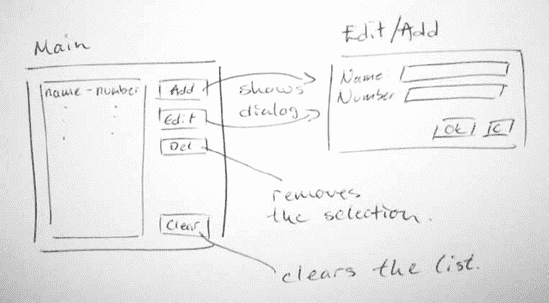

**图 2-1。** *用户界面的初稿*

流程的下一步是将草图中的想法转化为可以实施的结构。为此，您必须理解 Qt 应用程序是如何工作的。

### 事件驱动的应用程序

所有的 Qt 应用程序都是事件驱动的，所以你不能直接跟踪从`main`函数到应用程序所有部分的执行路径。相反，您从`main`函数初始化您的应用程序，然后`main`函数调用`QApplication`对象上的`exec`方法。这将启动应用程序的事件循环。(事件可以是从网络上接收到的新包、经过了一定时间、或者用户按下了键或移动了鼠标。)

`QApplication`对象等待这些事件，并将它们传递给任何受影响的`QObject`。例如，当用户点击[图 2-1](#the_first_draft_of_the_user_interface) 所示电话簿对话框中的 *Clear All* 按钮时，应用程序的事件循环会接收到该点击。然后，`QApplication`对象接受`clicked`事件并将其传递给受影响的对象:在本例中，是代表按钮的`QPushButton`对象。然后，这个按钮对象对事件做出反应，并发出相关信号。

通过将用于被点击的按钮和被选择的列表项的信号连接到实现应用程序的实际功能的插槽，用户界面被设置为对用户交互做出反应。因此，开发应用程序时，一个好的起点是识别用户可以通过图 2-1 所示的 UI 采取的动作。

* * *

提示这里确定的行为非常像统一建模语言(UML)中的用例，这意味着这两种方法非常兼容。

* * *

*   第一步是启动应用程序。发生这种情况时，会显示列表对话框。
*   从列表对话框中，用户添加一个新项目。这将显示一个空的编辑对话框。
*   从列表对话框中，用户编辑当前选定的项目。这将显示一个已填写的编辑对话框。
*   用户从列表对话框中移除当前选定的项目。
*   从列表对话框中，用户清除列表。
*   从列表对话框中，用户退出应用程序。
*   在编辑对话框中，用户批准所做的更改。这意味着更改将反映在列表对话框中。
*   从编辑对话框中，用户取消所做的更改。

从列表的顶部开始，主机操作系统必须负责启动应用程序。你在这个过程中的角色是从`main`函数中显示列表对话框。其余的操作显示为组成 UI 的两个对话框上的按钮。

总结一下:这个应用程序由一个主函数、一个列表对话框和一个编辑对话框组成。每个对话框由一个表单——也就是 UI 的 XML 描述——和一个组成 Qt 感兴趣的实际`QDialog`的类组成。这些信息足以创建一个项目文件。结果如[清单 2-1](#phone_book_application_apostrophy_s_proj) 所示。注意，它从应用程序模板`app`开始，这是所有 Qt 应用程序的起点。项目文件的其余部分只是一个需要创建的文件列表，这也是您在本章余下部分要做的事情。

**清单 2-1。** *电话簿应用的项目文件*

```cpp
TEMPLATE = app

TARGET = addressbook

SOURCES += main.cpp editdialog.cpp listdialog.cpp

HEADERS += editdialog.h listdialog.h

FORMS   += editdialog.ui listdialog.ui
```

现在为应用程序创建一个新目录，并将项目文件放入其中。当您将本章中显示的其余文件放在该目录中时，您将得到一个完整的应用程序。

### 使用设计器

Designer 是 Qt 附带的用于设计用户界面的工具。本节向您展示如何使用设计器来构建列表对话框。然后学习编辑对话框的规范，这样您就可以自己组装了。

让我们从启动 Designer 开始。你会看到如图 2-2 所示的对话框。对于列表对话框，选择创建底部带有按钮的对话框，然后单击创建。

* * *

**提示**如果你运行的是 Windows，可以从开始菜单中选择 designer，或者启动 Qt 命令提示符，然后在控制台键入 **designer** 来启动 Designer。运行 Mac OS X 的人可以使用 Finder 找到 Designer 并启动它。在 Unix 平台上，这个过程可能稍有不同——尤其是如果您同时安装了 Qt 的第 3 版和第 4 版。可能的命令可以是`designer`或`designer-qt4`。如果你已经使用软件包管理器安装了 Qt 4，你很可能在你的程序菜单中找到它。阅读发行版的文档以获得更多信息。

* * *

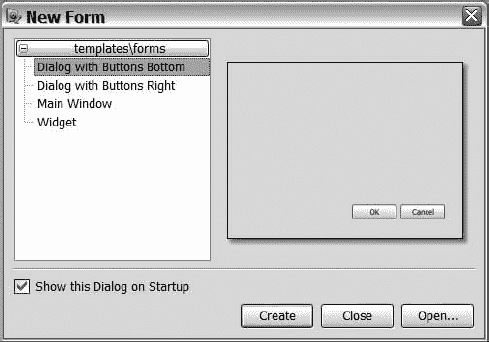

**图 2-2。** *用于创建新表单的设计器对话框*

出现设计者的用户界面。让我们先快速概述一下这个界面。设计器可以以两种模式运行:*停靠窗口*或*多个顶层窗口*。您可以通过选择编辑用户界面模式来更改设置。拥有多个顶层窗口对于多屏设置来说是非常好的，但是如果您同时运行多个应用程序和 Designer，可能会导致工作空间混乱。尝试两种配置，以确定您更喜欢哪一种。

在任一 UI 模式中，设计器都由下面列出的许多组件组成。这些组件中的每一个都可以从工具菜单中显示或隐藏。我不喜欢总是显示所有的组件——通常小部件框和属性编辑器对我来说已经足够了——但是可以自由地进行实验以获得您喜欢的工作环境。

*   微件框，如图 2-3 所示，包含所有可用微件的列表，这些微件被分成多个类别。
*   图 2-4 中的[所示的属性编辑器显示了工作表单中当前选中的小部件的所有可设计属性。](#designer_apostrophy_s_property_editor)
*   如图 2-5 中的[所示，对象检查器显示了哪个对象是哪个对象的父对象。](#designer_apostrophy_s_object_inspector)
*   信号/插槽编辑器，也称为连接编辑器，如图 2-6 中的[所示，用于管理组成工作表单的对象之间的连接。](#designer_apostrophy_s_signal_solidus_slo)
*   资源编辑器，如图 2-7 所示，用于管理编译成可执行文件的图标等资源。
*   动作编辑器，如图[图 2-8](#designer_apostrophy_s_action_editor) 所示，用于管理动作；也就是说，在 UI 中的许多地方都表示的对象，例如菜单栏、工具栏和键盘快捷键。


**图 2-3。** *设计师的小部件框连同工具栏和菜单*

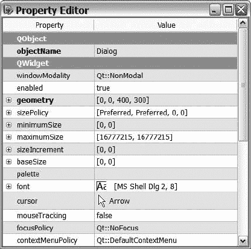

**图 2-4。** *设计师的属性编辑*

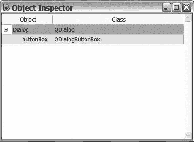

**图 2-5。** *设计师的对象检查器*


**图 2-6。** *设计师的信号/槽编辑*

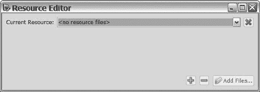

**图 2-7。** *设计师的资源编辑器*

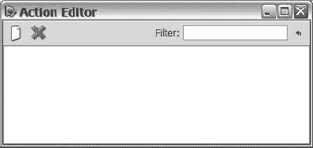

**图 2-8。** *设计师的动作编辑*

[图 2-9](#the_form_fresh_from_the_template) 显示了从模板创建的表单。内容由包含两个按钮的按钮框组成:OK 和 Cancel。按钮盒是一个小部件，所有使用 Qt 构建的对话框和窗口都由小部件和布局组成。小部件是 UI 的一部分，例如按钮、标签或滑块。微件按布局组织。使用布局而不是仅仅记住每个小部件的坐标的原因是，你可以自由地调整字体和对话框的大小。此外，翻译人员可以编写任何标签文本，因为标签可以根据文本调整大小。小部件和布局有许多方面需要更详细地介绍([第 3 章](03.html#widgets_and_layouts)会更详细地讨论)。

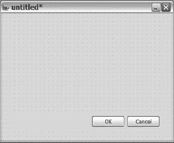

**图 2-9。** *表单从模板中新鲜出炉*

* * *

**注意**我将对话框称为表单，因为可以使用 Designer 设计包含其他窗口小部件、主窗口和对话框的窗口小部件。它们都在 Designer 中显示为一个表单，但最终结果是不同的。

* * *

通过选择对话框中的按钮框并按 Delete 键，可以在 Designer 中开始工作。您会看到如图[图 2-10](#the_form_cleared_from_buttons) 所示的清除对话框。


**图 2-10。** *从按钮中清除表单*

删除小组件后，您现在可以开始添加小组件。确保您处于编辑小部件的模式。从[图 2-11](#the_working_modes_are_open_parenthesis_f) 所示的工具栏中选择工作模式。


**图 2-11。** *工作模式为(从左至右):编辑小工具、编辑连接、编辑好友、编辑标签顺序。*

现在浏览部件框并找到按钮(在按钮组中)。当您单击并按住按钮时，鼠标指针会变成一个实际的按钮。将该按钮拖到表单上，并将其放在右上角。在第一个按钮下方的垂直行中再添加两个按钮；然后在右下角添加第四个按钮之前留出一个间隙。完成后，表格看起来应该类似于图 2-12 。

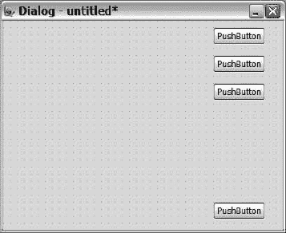

**图 2-12。** *带按钮的表单*

现在在小部件框中找到垂直间隔(它在顶部附近的间隔组中)。将垫片拖动到对话框中，将其放置在上面三个按钮和下面一个按钮之间的空隙中，如图[图 2-13](#the_form_after_the_spacer_has_been_added) 所示。

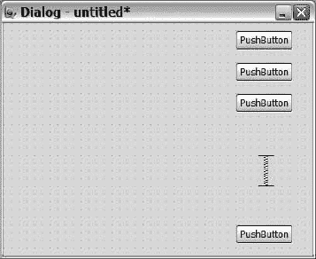

**图 2-13。** *添加间隔符后的形状*

现在选择四个按钮和弹簧，然后应用垂直布局，这样你就得到如图[图 2-15](#all_widgets_in_a_vertical_layout) 所示的表单。通过单击并按住 Shift 键或拖动包含要选择的项目的框，可以选择多个项目。请注意，您不希望从小部件框添加布局。相反，在布局中选择你想要的部件，并点击工具栏中的垂直布局按钮，如图[图 2-14](#the_layout_toolbar) 所示。这些按钮如下(从左到右):

*   应用水平布局将小部件放置在水平行中。
*   应用垂直布局将小部件放置在垂直行中。
*   水平分割器将小部件放置在水平行中，但也允许用户调整小部件的大小。
*   垂直分割器将小部件放置在垂直行中，但也允许用户调整小部件的大小。
*   应用网格布局将小部件放置在可拉伸的网格中。
*   中断布局移除任何当前布局。
*   调整大小调整当前布局的大小，以适合包含的小部件。

尝试将指针放在工具栏按钮上，找到工具提示垂直排列的按钮，这就是您想要的按钮。


**图 2-14。** *布局工具栏*


**图 2-15。** *垂直布局的所有部件*

您可以在微件框的组项目微件中找到列表微件。将它放在表单上自由空间的中间。然后点击表单上的一个空闲点，这样就选择了实际的表单。通过查看对象检查器，您可以看到您已经选择了实际的表单。当对话框被选中时，你就有了正确的选择。现在，通过单击工具栏中的相应按钮来应用网格布局。在选择了包含其他小部件的小部件时应用布局会将该布局应用于表单(布局是父小部件的属性，而不是其中的子小部件的属性)。[图 2-16](#the_list_widget_has_been_added) 显示了添加列表小部件后的表单，[图 2-17](#a_grid_layout_has_been_applied_to_the_fo) 显示了应用布局后的表单。

* * *

**提示**如果在调整对话框大小时，对话框的内容没有被拉伸，问题很可能是你忘记添加顶层布局了。选择对话框表单本身并应用一个布局——这应该可以解决问题。

* * *

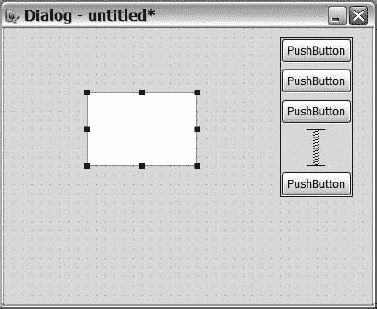

**图 2-16。** *增加了列表控件*

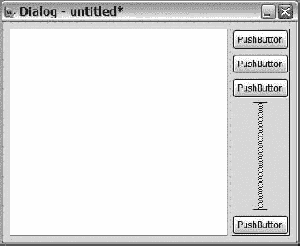

**图 2-17。** *表格布局已经应用到表格本身及其所有内容*

现在，您已经在布局中放置了许多小部件，形成了一个对话框。您可以使用“表单”菜单中的预览功能尝试不同样式的对话框。尝试调整对话框的大小，看看布局是如何交互的，并在 Qt 支持的不同平台上尝试不同的样式来查看对话框。然而，在对话结束之前，还有一些细节需要整理。首先，必须设置所有文本和小部件名称。

选择一个按钮会在属性编辑器中显示其属性。只需点击该值，并编辑它来改变它。[表 2-1](#properties_to_change) 自上而下显示了应用于按钮的名称和文本。请注意，对话框和列表小部件都有需要更改的属性。[图 2-18](#names_and_texts_have_been_updated) 显示了修改后的对话框。

**表 2-1。** *属性改变*

<colgroup><col valign="top" width="25%" class="calibre28"> <col valign="top" width="25%" class="calibre28"> <col valign="top" width="50%" class="calibre28"></colgroup> 
| 小部件 | **属性** | **值** |
| --- | --- | --- |
| 顶部按钮 | `name` | `addButton` |
| 顶部按钮 | `text` | 添加新的 |
| 第二个按钮 | `name` | `editButton` |
| 第二个按钮 | `text` | 编辑 |
| 第三个按钮 | `name` | `deleteButton` |
| 第三个按钮 | `text` | 删除 |
| 底部按钮 | `name` | `clearButton` |
| 底部按钮 | `text` | 清理所有 |
| 列表小部件 | `name` | `list` |
| 对话 | `name` | `ListDialog` |
| 对话 | `window title` | 电话簿 |


**图 2-18。** *姓名和文字已更新*

`name`属性用于给每个小部件一个变量名，这是您稍后从源代码访问小部件时将使用的名称。这意味着`name`属性必须是有效的 C++ 标识符名称；也就是说，不要以数字开头，只使用英文字母、数字和下划线。

* * *

**提示**如果你想调整一个小部件的主要属性(例如，标签或按钮的文本)，只需选择小部件并按 F2 键。

* * *

在 Designer 中构建表单的一个好处是可以用图形方式建立联系。从工作模式工具栏中选择编辑连接的模式。然后点击并从`clearButton`值拖动到`list`值。当在列表上释放鼠标按钮时，显示如图[图 2-19](#making_the_connection_by_picking_the_sig) 所示的对话框。

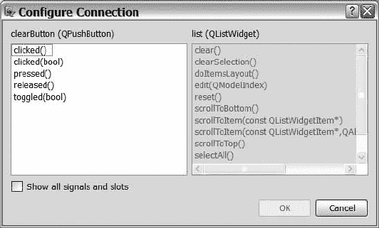

**图 2-19。** *通过选择左边的信号和右边的插槽进行连接*

左侧显示了来自`clearButton`值的可用信号；在右边，显示了`list`值的槽。选择`clicked()`信号和`clear()`插槽，然后按 OK。由此产生的连接在表格中显示为一个箭头(见[图 2-20](#the_connection_shown_directly_in_the_for) )。

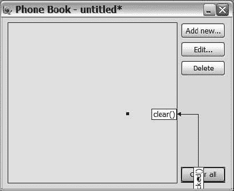

**图 2-20。** *将连接直接显示在表单中*

连接也可以在连接编辑器中看到，如图[图 2-21](#the_connection_shown_in_the_connection_e) 所示。

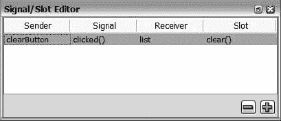

**图 2-21。** *连接编辑器中显示的连接*

准备表单的最后一步是设置 tab 键顺序，这是用户使用 Tab 键在小部件之间跳转时访问它们的顺序。为此，首先从工作模式工具栏中选择 tab 键顺序模式。现在，每个小部件都用一个数字显示在一个蓝框中，这就是 tab 键顺序。开始按你觉得正确的顺序点击蓝框，数字会变。[图 2-22](#the_form_with_the_tab_order_set) 显示了带有我的标签顺序的对话框——如果你喜欢，可以随意使用其他顺序。当你感到满意时，预览对话框，并通过按 Tab 键移动部件。

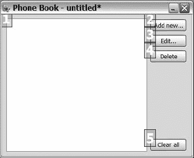

**图 2-22。** *用 tab 键顺序设置表单*

现在剩下的就是保存你的工作成果。将文件另存为`listdialog.ui`，与清单 2-1 中的项目文件放在同一个目录下。

为了试验您的新设计技能，我将编辑对话框的细节展示如下，但是您必须自己创建它。请注意，如果您从底部有按钮的模板开始，所有连接都是自动设置的。[图 2-23](#editing_dialog) 显示了结果对话框，以及标签、按钮和对话框的文本属性。


**图 2-23。** *编辑对话框*

对象检查器如[图 2-24](#objects_in_the_editing_dialog) 所示。您可以从该视图中分辨出不同对象的名称，以及哪些对象属于哪个布局。要创建网格布局，请按某种顺序放置小部件，选择它们，然后应用网格布局。Designer 通常在第一次尝试时就能得到正确的网格，但有时可能需要中断布局(可从布局工具栏获得)，重新排列小部件，然后再次应用它。这是一个熟能生巧的地方。


**图 2-24。**编辑对话框中的*对象*

[图 2-25](#connections_in_the_editing_dialog) 显示了对话框中的连接。它们已经在模板中制作好了，所以您不应该对它们做任何事情。

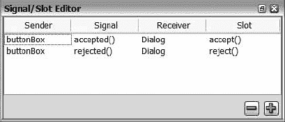

**图 2-25。**编辑对话框中的*连接*

最后，[图 2-26](#tab_order_of_the_editing_dialog) 显示了我选择的 tab 顺序。请随意设置适合您的标签顺序。

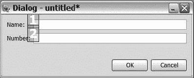

**图 2-26。** *编辑对话框的标签顺序*

为了确保对话框以正确的方式组合在一起，请确保对象检查器视图和表单本身看起来百分之百正确。连接和 tab 键顺序也很重要，但是其他两个视图是最容易出现错误的地方。完成后，将对话框和其他文件保存为`editdialog.ui`。

### 从设计师到代码

在 Designer 中创建的文件是用户界面的定义。如果在文本编辑器中打开它们，可以看到它们是 XML 文件。

* * *

**注意**如果你习惯于使用 Qt 和 Designer 的早期版本，你会注意到事情已经发生了变化。Qt 4 带来了一个全新的设计器应用程序，以及一种全新的从应用程序代码中使用设计的方法。您不能再使用设计器向项目中添加代码；相反，您可以从代码中使用 Designer 的结果。

* * *

通过在项目文件中包含对这些 XML 文件的引用(如[清单 2-1](#phone_book_application_apostrophy_s_proj) 所示)，在构建项目时会自动生成一个 C++ 文件。如果设计器文件名为`foo.ui`，则生成的 C++ 文件名为`ui_foo.h`。如果设计的表单被命名为`FooDialog`，那么产生的类就是`Ui::FooDialog`。

* * *

**注意**`Ui::FooDialog`被放在`Ui`名称空间中以避免名称空间冲突，因为你可能想要调用你的最终对话框类`FooDialog`。生成的文件也在全局名称空间中创建了一个类。它叫做`Ui_FooDialog`，和`Ui::FooDialog`一模一样。我更喜欢使用来自`Ui`名称空间的类，因为它感觉比在类名前面加上`Ui_`更正确，但是您可以自由地做您想做的。

* * *

生成的 C++ 文件由用户界面编译器(uic)创建。它与构建过程的交互有点像元对象编译器，但它不是采用 C++ 头文件，而是采用用户界面的 XML 描述。图 2-27 显示了它们是如何组合在一起的。通过使用 QMake 来生成 Makefile，一切都是自动处理的。


**图 2-27。***Qt 项目是由源代码、生成的元对象和用户界面描述构建而成的。*

在 Qt 应用程序中，所有对话框都继承自`QDialog`类。uic 生成的代码不继承该类；事实上，它甚至没有继承`QObject`。结论是你必须创建一个基于`QDialog`的类。让我们从查看列表对话框开始。

清单 2-2 显示了列表对话框的头文件。创建了一个名为`ListDialog`的类，它继承了`QDialog`。该类有插槽，所以`Q_OBJECT`宏必须在那里。然后，在最后，`Ui::ListDialog`类被用来创建私有成员变量`ui`。

**清单 2-2。** *头文件为* `ListDialog` *类*

```cpp
#ifndef LISTDIALOG_H

#define LISTDIALOG_H

#include <QDialog>

#include "ui_listdialog.h"

class ListDialog : public QDialog

{

  Q_OBJECT

public:

  ListDialog();

private slots:

  void addItem();

  void editItem();

  void deleteItem();

private:

  Ui::ListDialog ui;

};

#endif // LISTDIALOG_H
```

`ui`对象由一组指针组成，指向组成对话框的所有小部件和布局。它还包含两个函数:`setupUi`(用于用窗口小部件和布局填充`QDialog`)和`retranslateUi`(用于国际化应用程序——在[第 10 章](10.html#internationalization_and_localization)中有更详细的介绍)。

`ListDialog`构造器的实现展示了如何使用`ui`对象(参见[清单 2-3](#constructor_of_the_listdialog_class) )。首先，调用`setupUi`来创建对话框的 UI。当调用`setupUi`时，在 Designer 中建立的连接被设置。其余的连接通过调用`connect`手动完成。在调用中，`ui`对象用于访问对话框中的小部件。

不需要手动连接。通过实现一个名为`on_addButton_clicked()`的插槽，`setupUi`调用自动将来自`addButton`的`clicked`信号连接到那个插槽。这适用于使用`on_` `widget name_signal name( signal arguments )`方案命名的所有插槽。即使这是可能的，我也建议不要使用它，因为它不鼓励为插槽提供清晰的名称来反映它们的功能。此外，当连接几个信号导致相同的动作时，这种方法会失败。您最终会有几个插槽调用同一个函数，或者——更糟糕的是——包含相同的代码。在对话框类的构造器中建立所有的连接确保了代码易于理解和阅读——您刚刚创建了一个表格，显示了用户界面如何连接到执行实际工作的插槽。

**清单 2-3。***`ListDialog`*类*的构造器*

```cpp
ListDialog::ListDialog() : QDialog()

{

  ui.setupUi( this );

  connect( ui.addButton, SIGNAL(clicked()), this, SLOT(addItem()) );

  connect( ui.editButton, SIGNAL(clicked()), this, SLOT(editItem()) );

  connect( ui.deleteButton, SIGNAL(clicked()), this, SLOT(deleteItem()) );

}

```

* * *

**注意** 除了这里显示的方法之外，还有更多方法可以使用在 Designer 中从`QDialog`对象创建的 UI。这里使用的方法叫做*单一继承方法*。在 Designer 用户手册中，描述了两种替代方法:多重继承方法*(继承`QDialog`和`Ui`类)和直接方法*(使用对话框从方法中创建一个`QDialog`和一个`Ui`)。我更喜欢使用单一继承方法，并将在本书中通篇使用。它通过`ui`对象将生成的代码与手动编写的源代码分开——这有助于使更改更加可控。如果你想的话，请随意查阅设计者用户手册并尝试其他选择。**

* * *

[清单 2-4](#adding_a_new_item_to_the_list) 显示了`addItem`插槽的实现。该函数看起来非常简单，使用了`EditDialog`类(还没有讨论)。在继续之前，让我们看看对话框是如何使用的。首先，创建了`dlg`变量。传递给`EditDialog`的`this`指针将`dlg`的父指针设置为列表对话框。然后调用对话框的`exec`方法，该方法显示处于应用程序模态状态的对话框。一个对话框是应用程序模态的，这意味着在该对话框关闭之前，应用程序的其他对话框或窗口都不能获得 UI 焦点，这迫使用户使用或关闭显示的对话框。

`exec`方法从对话框返回一个状态，其中`Qt::Accepted`意味着 OK 按钮是最后被点击的(或者说`accept`插槽被调用来关闭对话框)。另一个可能的结果是`Qt::Rejected`，意味着对话框从标题栏被关闭或取消。

当使用`exec`显示对话框，并且结果是`Qt::Accepted`时，一个新的项目被添加到列表小部件:`ui.list`。新条目是使用编辑对话框中的`name`和`number` getter 成员构建的(你将在本章后面看到它们)。

**清单 2-4。** *向列表添加新项目*

`void ListDialog::addItem()
{
  EditDialog dlg( this );

  if( dlg.exec() == Qt::Accepted )
    ui.list->addItem( dlg.name() + " -- " + dlg.number() );
}`

添加一个新条目的反义词如[清单 2-5](#deleting_an_item_of_the_list) 所示。删除一个列表小部件条目只需要在上面调用`delete`就可以了。当前选中的项目是从`currentItem`方法返回的，所以只需删除该方法返回的内容。

如果没有选择任何项目，返回值是`0`(零，一个空指针)，但是在调用`delete`时这不是问题——它只是被忽略。

**清单 2-5。** *删除列表中的一项*

```cpp
void ListDialog::deleteItem()

{

  delete ui.list->currentItem();

}
```

当试图编辑当前项目时，确保`currentItem`是一个有效的指针是很重要的，这就是为什么[清单 2-6](#editing_an_item_of_the_list) 中的`editItem`槽通过检查它开始。如果返回的指针是一个空指针，那么槽不做任何事情就返回。

如果遇到一个有效的指针，那么使用`split`方法将当前列表小部件项目的文本分成一个名称和一个数字。它们用于设置编辑对话框。当设置名称和编号时，分割文本的部分被修剪，这意味着从字符串的末端移除所有额外的空白(*空白*由所有占用空间但不显示的字符组成)。空白的例子有空格、制表符、换行符、换行符等等。

编辑对话框一旦建立，代码看起来就非常像`addItem`槽，只是当前项目的文本被改变，而不是向列表小部件添加新的项目。

**清单 2-6。** *编辑列表中的一项*

```cpp
void ListDialog::editItem()

{

  if( !ui.list->currentItem() )

    return;

  QStringList parts = ui.list->currentItem()->text().split( "--" );

  EditDialog dlg( this );

  dlg.setName( parts[0].trimmed() );

  dlg.setNumber( parts[1].trimmed() );

  if( dlg.exec() == Qt::Accepted )

    ui.list->currentItem()->setText( dlg.name() + " -- " + dlg.number() );

}
```

现在你已经使用了两次编辑对话框，所以是时候看看它了。在[清单 2-7](#editing_dialog_class) 中，你可以看到类声明。`EditDialog`类继承了`QDialog`，并有一个名为`ui`的私有变量，包含用户界面的生成代码。这很像`ListDialog`级。

该类包含两个属性的 getters 和 setter:`name`和`number`。因为对话框是专门为应用程序设计的，根本不可能在其他环境中重用，所以我冒昧地避开了 getters 和 setters 的策略。设置器不是插槽，也没有在属性改变时发出的任何信号。当一个类显然不会被重用时，过度设计它以使其可重用是没有意义的。

因为没有信号或插槽，所以省略了`Q_OBJECT`宏，所以该类没有元对象。这可以在运行时节省内存，并使编译稍微快一些。

**清单 2-7。** *编辑对话框类*

```cpp
class EditDialog : public QDialog

{

public:

  EditDialog( QWidget *parent=0 );

  const QString name() const;

  void setName( const QString& );

  const QString number() const;

  void setNumber( const QString& );

private:

  Ui::EditDialog ui;

};
```

如清单 2-8 所示，构造器非常简单。因为所有的连接都是在 Designer 中完成的，所以只需要对`setupUi`进行一次调用。查看 Designer 中的连接，您会看到来自按钮盒的`accepted`和`rejected`信号连接到`accept`和`reject`插槽。当用户点击确定时发出`accepted`信号，取消时发出`rejected`。`accept`和`reject`插槽将从`exec`返回的结果设置为`Qt::Accepted`或`Qt::Rejected`，然后关闭对话框。这意味着从调用者的角度来看，对话已经按预期工作了。

**清单 2-8。** *编辑列表中的一项*

```cpp
EditDialog::EditDialog( QWidget *parent ) : QDialog( parent )

{

  ui.setupUi( this );

}
```

`name`和`number`属性以相同的方式实现。在[清单 2-9](#editing_an_item_of_the_list-003) 中，显示了`name`属性。设置器`setName`很简单，只是将值传递给右边的`QLineEdit`。getter，`name`，稍微复杂一些。它不是简单地从行编辑中返回文本，而是使用`replace`删除所有出现的双破折号(`"--"`)。所有出现的双破折号都被替换为空字符串，这与删除它们是一回事。它们必须被删除，因为在列表对话框中名称和编号被双破折号分开，编辑槽`editItem`(见[清单 2-9](#editing_an_item_of_the_list-003) )依赖于此。在返回没有双破折号的字符串之前，它还调用`trimmed`来删除文本末尾的任何空格。这可以防止用户不小心在名称后留下空格或制表符。

**清单 2-9。** *编辑列表中的一项*

```cpp
const QString EditDialog::name() const

{

  return ui.nameEdit->text().replace("--","").trimmed();

}

void EditDialog::setName( const QString &name )

{

  ui.nameEdit->setText( name );

}
```

`number`属性的实现看起来与`name`属性的实现相同。唯一不同的是所涉及的`QLineEdit`的名称:`nameEdit`用于名称，`numberEdit`用于编号。

### 最后一笔

现在项目文件中唯一缺少的部分是`main`函数。在[清单 2-10](#editing_an_item_of_the_list-004) 中，你可以看到实现。首先，创建一个`QApplication`对象；然后创建列表对话框。在应用程序的`exec`方法被调用之前，这个对话框就会显示出来。

调用`exec`意味着`QApplication`对象开始处理系统事件，并将它们传递给适当的`QObject`实例——应用程序是事件驱动的。该函数在所有窗口和对话框关闭后立即返回，因此当您关闭列表对话框时，`exec`返回，应用程序到达其结尾。

**清单 2-10。** *编辑列表中的一项*

```cpp
int main( int argc, char **argv )

{

  QApplication app( argc, argv );

  ListDialog dlg;

  dlg.show();

  return app.exec();

}
```

回头看看您希望用户能够执行的用户操作列表，您可以看到大多数操作都是由一个连接表示的。可以在设计器中建立连接，也可以在对话框类的构造器中使用`connect`调用来建立连接。让应用程序运行的最后一步是`main`函数。它的工作是显示列表对话框并启动事件循环。

为了测试这个应用程序，首先在您开始的项目文件上运行`qmake`来生成一个 Makefile。现在使用`make`或您的系统的等价物构建应用程序，这会为您生成一个可执行文件。在[图 2-28](#the_application_is_put_to_use) 中，我第一次测试这个应用程序——看起来一切正常。

该应用程序不是很有用，因为它不能保存和加载数据。但是，用户界面功能齐全。


**图 2-28。** *应用程序投入使用。*

### 总结

本章展示了 Qt 应用程序中可用的两类对话框:主动的或被动的；聪明还是愚蠢。

列表对话框包含用户可以执行的每个操作的位置。这称为主动或智能对话。任何需要用户尽可能简单的输入的对话框都可以激活。小的活动元素可以使对话框更容易使用。

编辑对话框不包含任何插槽；它仅仅依赖于内置在所使用的小部件和`accept`和`reject`插槽中的智能。这对于非常简单的对话框来说已经足够了，在这些对话框中，用户可以填写不同类型的字段。这被称为被动或无声对话。一个应用程序中有几个被动对话框是很常见的；事实上，没有它们，应用程序就无法工作。

尽管编辑对话框对用户来说是被动的，但它对开发人员来说也不一定是被动的。编辑对话框使用`name`和`number`属性很好地隐藏了图形用户界面的实际实现。这使得保持`ui`变量私有成为可能，代价是几行琐碎的代码。通过这样做，您可以确保在不使用编辑对话框更改代码的情况下更改 UI。在将来维护和扩展应用程序时，将应用程序的 UI 和代码分开通常会有所帮助。*