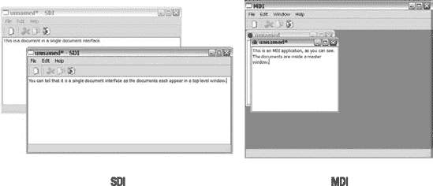
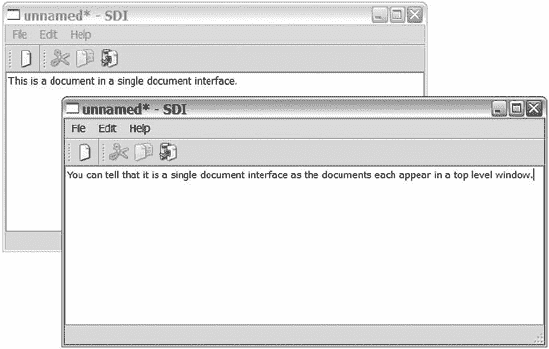
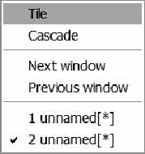

## 第四章

主窗口

到目前为止，在本书中，你主要使用对话框与用户交流。然而，虽然当您需要一个小部件来保存小部件并指导用户完成特定任务或配置特定主题的选项时，对话框是一个很好的解决方案，但大多数应用程序并不仅仅基于一个特定的任务，而是基于一个文档。这是主窗口进入画面的地方。

*主窗口*是应用程序所基于的顶层窗口。它可以有菜单栏、工具栏、状态栏以及工具箱和其他支持窗口可以停靠的区域。可以从主窗口打开应用程序的对话框，主窗口包含工作文档。

* * *

**注**除非另有说明，在本书的上下文中，术语*文档*不指用于文字处理目的的文件。相反，在 Qt 的上下文中，文档是指用户与之交互的实际数据。这些数据可以代表任何东西，从供观看的电影到宇宙飞船的 CAD 模型。定义一个文档代表什么以及用户可以对它做什么几乎就是桌面应用程序开发的全部内容。

* * *

### 窗口和文档

在 windows 中排列文档有两种思路:单文档界面(SDI)和多文档界面(MDI)。区别在于每个文档是位于一个新窗口中，还是应用程序对所有文档分别只使用一个窗口。图 4-1 展示了两者的对比。MDI 界面的例子有 Qt Designer 和 Photoshop 流行的 SDI 应用程序有写字板、谷歌地球和一个无标签的网络浏览器。

MDI 概念在 Windows 3.x 时代非常普遍，而 SDI 在 X11 上一直占主导地位。大约在 Windows 95 的时候，微软的政策开始转变，今天大多数 Windows 产品都有 SDI 接口。

为了比较这两种架构和它们带来的结构，您将围绕`QTextEdit`小部件构建两个应用程序，其中文本编辑器将充当文档小部件。



**图 4-1。** *单文档界面与多文档界面的对比*

#### 单文档界面

让我们从单个文档界面开始。在 SDI 驱动的环境中，每个主窗口对应一个文档。文档本身保存在一个名为*中心小部件*的小部件中。每个主窗口都有一个中心小部件，它出现在添加了所有菜单栏、停靠小部件、工具栏等的窗口的中心区域。

这为我们的应用程序提供了一个围绕主窗口及其中心小部件构建的结构。这两个对象一起将包含几乎所有对用户交互作出反应的槽，所以对用户动作的所有响应都是从这两个类中的一个发起的。

主窗口的窗口与诸如禁用和启用菜单项、创建新文件和关闭窗口之类的任务相关联——内务处理任务。中央小部件的插槽处理修改实际文档的用户交互——工作任务。这些任务可以包括标准的剪贴板操作，例如使用剪切、复制和粘贴；执行特定于文档的操作，例如旋转图像；停止播放；或者运行向导——任何适用于相关应用程序文档的操作。

**文本编辑器**

让我们基于`QTextEdit`小部件创建一个简单的 SDI 驱动的应用程序，它可以用作多行`QLineEdit`的等价物或简单的文字处理器。你可以在[清单 4-1](#constructor_of_the_sdi_main_window) 所示的主窗口的构造函数中看到它和一些 SDI 特有的细节。应用程序的截图如[图 4-2](#a_single_document_application_with_two_d) 所示。

**清单 4-1。***SDI 主窗口的构造器*

```cpp
SdiWindow::SdiWindow( QWidget *parent ) : QMainWindow( parent )

{

  setAttribute( Qt::WA_DeleteOnClose );

  setWindowTitle( QString("%1[*] - %2" ).arg("unnamed"-).arg(-"SDI") );

  docWidget = new QTextEdit( this );

  setCentralWidget( docWidget );

  connect( docWidget->document(), SIGNAL(modificationChanged(bool)),

    this, SLOT(setWindowModified(bool)) );

  createActions();

  createMenus();

  createToolbars();

  statusBar()->showMessage( "Done" );

}

```



**图 4-2。** *一个单文档应用两个文档*

让我们研究一下这段代码。首先，将 window 属性设置为`Qt::WA_DeleteOnClose`,这样 Qt 会在窗口关闭后立即从内存中删除它。这意味着需要担心的内存管理更少。

接下来，窗口标题被设置为`QString("%1[*] - %2" ).arg("unnamed").arg("SDI")`。`arg`方法调用插入`"unnamed"`和`"SDI"`字符串，其中`%1`和`%2`符号出现在第一个字符串中。最左边的`arg`代替了`%1`；下一个替换`%2`；等等。使用这种方法，最多可以将九个字符串与一个主字符串合并。

您可以使用`setWindowTitle`来设置任何窗口标题。您使用前面例子中显示的标题，因为它允许 Qt 帮助我们管理部分标题(例如，指示当前文档是否已被修改)。这解释了命令的一部分，但是没有解释为什么第一个字符串在对`tr`的调用中，或者为什么你不马上使用`"unnamed[*] - SDI"`。你希望能够支持其他语言(你会在第 10 章中了解到更多)。

现在，记住显示给用户的所有字符串都需要包含在对`tr()`的调用中。虽然这是由 Designer 自动完成的，但是当你通过代码创建用户界面和设置文本时，你需要自己管理它。

* * *

**提示**脚本可以用来查找丢失的字符串`tr()`。如果您使用的是 Unix shell，您可以使用下面这行代码来查找它们:`grep -n '"' *.cpp | grep -v 'tr('`。另一种方法是阻止 Qt 自动将`char*`字符串转换成`QString`对象。这将导致编译器错误的所有时间，你错过了调用`tr()`。您可以通过在项目文件中添加一行`DEFINES += QT_NO_CAST_FROM_ASCII`来禁用转换。

* * *

您使用`arg`方法是因为从翻译者的角度来看，字符串`unnamed`和`SDI`是独立的。比如字符串`SDI`用的地方比较多。通过分割字符串，您可以确保它被翻译一次，避免任何可能的不一致。此外，通过使用一个插入了`unnamed`和`SDI`字符串的主字符串，您可以让翻译者重新排序这些字符串，并在它们周围添加更多的文本，使应用程序更能适应其他文化和语言。

关于设置主窗口标题的另一件事是:字符串`[*]`充当一些应用程序使用的文档修改标记的占位符。当`windowModified`属性设置为`true`时，显示标记；也就是文档被修改的时间。让 Qt 处理标记的显示有两个原因。首先，它避免了在所有应用程序中重复处理它的代码。在 Mac OS X 上，标题文本的颜色用于指示文档是否已被修改。通过在窗口标题中不加星号，明确地使用您自己的代码并让 Qt 来处理，您也让 Qt 处理了所支持的不同平台的任何其他方面。

这是一个窗口标题的大量信息！继续向下[清单 4-1](#constructor_of_the_sdi_main_window) 到创建`QTextEdit`的行，并将其设置为主窗口的中心小部件。这意味着它将填充整个主窗口，并作为用户的文档视图。

下一行将文本编辑器文档的修改状态连接到主窗口的`windowModified`属性。它让 Qt 在修改文档时显示星号并改变标题文本的颜色。信号从`docWidget-> document()`发出，而不是直接从`docWidget`发出，因为格式化的文本由`QTextDocument`表示。`QTextEdit`只是格式化文本的查看器和编辑器，所以文档是被修改的，而不是编辑器——因此信号是从文档发出的。

**采取行动**

继续回顾清单 4-1 中的[，你会看到设置菜单、工具栏和状态栏的四行代码。在创建这些实际菜单之前，创建*动作*。包含在类`QAction`中的动作可以将文本、工具提示、键盘快捷键、图标等存储到一个类中。每个动作都会发出信号`triggered()`——当被用户调用时，还可能发出信号`toggled(bool)`。当动作配置为可检查时，会发出切换信号。动作的工作方式很像按钮，既可以是可检查的，也可以是可点击的。](#constructor_of_the_sdi_main_window)

好的一面是，同样的操作可以添加到菜单和工具栏中，所以如果用户通过按工具栏按钮进入高级编辑模式，相应的菜单项会被自动选中。这也适用于启用和停用操作时，菜单和按钮会自动同步。此外，唯一需要的连接是从动作到动作插槽的连接。

[清单 4-2](#creating_actions_for_the_sdi_application) 向您展示了如何在方法`createActions`中创建动作，该方法是从[清单 4-1](#constructor_of_the_sdi_main_window) 中所示的构造函数中调用的。我对清单进行了略微的删减，向您展示了所使用的三种主要类型的操作。在考虑差异之前，先看看相似之处；例如，每个动作都被创建为一个`QAction`。`QAction`构造函数接受一个可选的`QIcon`，后跟一个文本和一个父对象。对于需要键盘快捷键的动作，调用`setShortcut(const QKeySequence&)`方法。使用`setStatusTip(const QString& )`，每个动作被分配一个提示，当该动作作为一个菜单项并被悬停时，该提示将显示在状态栏上。(试试吧！)这个图标奇怪的文件路径是一个所谓的资源路径(它的用法将在下面的资源部分解释)。

**清单 4-2。** *为 SDI 应用程序创建动作*

`void SdiWindow::createActions()
{
  newAction = new QAction( QIcon(":/img/new.png"), tr("&New"), this );
  newAction->setShortcut( tr("Ctrl+N") );
  newAction->setStatusTip( tr("Create a new document") );
  connect( newAction, SIGNAL(triggered()), this, SLOT(fileNew()) );
...
  cutAction = new QAction( QIcon(":/img/cut.png"), tr("Cu&t"), this );
  cutAction->setShortcut( tr("Ctrl+X") );
  cutAction->setStatusTip( tr("Cut") );
  cutAction->setEnabled(false);
  connect( docWidget, SIGNAL(copyAvailable(bool)),
    cutAction, SLOT(setEnabled(bool)) );
  connect( cutAction, SIGNAL(triggered()), docWidget, SLOT(cut()) );
...
  aboutQtAction = new QAction( tr("About &Qt"), this );
  aboutQtAction->setStatusTip( tr("About the Qt toolkit") );
  connect( aboutQtAction, SIGNAL(triggered()), qApp, SLOT(aboutQt()) );
}`

首先是`newAction`，它连接到主窗口中的一个插槽。这是合乎逻辑的地方，因为创建新文档不是由文档本身来处理的(除了初始化，而是放在文档的构造函数中)。相反，文档的创建和关闭是由主窗口处理的。请注意，使用`setShortcut`设置的键盘快捷键包含在`tr()`调用中，这给了翻译人员将快捷键更改为本地化版本的自由。

接下来是`cutAction`。它的`triggered`信号在用户调用动作时发出，连接到文档中的一个槽。这也是合乎逻辑的，因为剪切会从文档中获取数据并修改文档。从`copyAvailable`到`setEnabled`的连接是如何启用和禁用动作的一个例子。一旦选择了，就会发出`copyAvailable`，并以`true`作为参数。当没有可用选项时，参数为`false`。因此，该操作在适用时被启用，在所有其他时间被禁用。

最后一个动作是`aboutQtAction`，它连接到`qApp`对象。application 对象管理应用程序全局任务，例如关闭所有窗口和显示一个对话框，其中包含有关正在使用的 Qt 版本的信息。

* * *

**注意**全局`qApp`指针变量总是被设置为指向激活的`QApplication`对象。要访问这个指针，你一定不要忘记在你使用它的文件中包含`<QApplication>`头文件。

* * *

**菜单和工具栏**

回头看看清单 4-1 中的[，你可以看到在调用`createActions`之后，接下来的步骤是`createMenus`和`createToolbars`方法。这些方法采用新创建的动作，并将它们放在正确的位置。](#constructor_of_the_sdi_main_window)

清单 4-3 显示了文件菜单和文件操作的工具栏是如何被动作填充的。因为每个动作已经有了文本和图标，所以只需要调用`addAction(QAction*)`就可以让文本和图标出现在菜单中。`menuBar()`和`addToolBar(const QString&)`调用是主窗口类的一部分。第一次调用`menuBar`时，会创建一个菜单栏。后面的调用将引用这个菜单栏，因为每个窗口只有一个菜单。工具栏是用`addToolBar`方法创建的，你可以为每个窗口创建任意数量的工具栏。使用`addSeparator()`方法，你可以把动作分成组，在菜单和工具栏中都可以使用。

**清单 4-3。** *菜单和工具栏被填充。*

```cpp
void SdiWindow::createMenus()

{

  QMenu *menu;

  menu = menuBar()->addMenu( tr("&File") );

  menu->addAction( newAction );

  menu->addAction( closeAction );

  menu->addSeparator();

  menu->addAction( exitAction );

...

}

void SdiWindow::createToolbars()

{

  QToolBar *toolbar;

  toolbar = addToolBar( tr("File") );

  toolbar->addAction( newAction );

...

}
```

再次参考清单 4-1 中的[——你会看到，在动作被添加到菜单和工具栏后，构造函数中的最后一个调用创建了一个状态栏，并在其中显示了消息`"Done"`。`statusBar()`方法的工作方式就像`menuBar()`一样:在第一次调用时创建并返回一个条，然后在随后的调用中返回一个指向它的指针。](#constructor_of_the_sdi_main_window)

**新建文档并关闭打开的文档**

您将使用`QTextEdit`类作为您的文档类，因为它包含了您需要的所有功能。它可以处理创建和编辑文本，以及从剪贴板复制和粘贴。这使得您只需要实现创建新文档和关闭任何打开的文档的功能。

创建新文档很容易。所有需要做的就是打开一个新的主窗口——清单 4-1 中的构造函数将会完成所有困难的工作。[清单 4-4](#creating_a_new_document) 显示了`fileNew()`插槽的简单实现。它创建一个新窗口，然后显示它。

**清单 4-4。** *创建新文档*

```cpp
void SdiWindow::fileNew()

{

  (new SdiWindow())->show();

}
```

关闭文档更复杂，因为文档(或包含文档的窗口)可以用许多不同的方式关闭。一个可能的原因是窗口管理器由于各种原因告诉窗口关闭。例如，用户可能试图通过单击标题栏中的关闭按钮来关闭窗口。或者计算机正在关闭。或者用户从应用程序的文件菜单中选择退出或关闭。

为了拦截所有这些试图关闭当前窗口的用户操作，您可以通过覆盖`closeEvent(QCloseEvent*)`方法来实现 close 事件的事件处理程序。清单 4-5 展示了 SDI 应用程序的实现。

**清单 4-5。** *关闭文档*

```cpp
void SdiWindow::closeEvent( QCloseEvent *event )

{

  if( isSafeToClose() )

    event->accept();

  else

    event->ignore();

}

bool SdiWindow::isSafeToClose()

{

  if( isWindowModified() )

{

    switch( QMessageBox::warning( this, tr("SDI"),

      tr("The document has unsaved changes.\n"

         "Do you want to save it before it is closed?"),

         QMessageBox::Discard | QMessageBox::Cancel ) )

    {

    case QMessageBox::Cancel:

      return false;

    default:

      return true;

    }

  }

  return true;

}
```

你可以选择`accept()`或`ignore()`一个事件:忽略一个关闭事件让窗口打开，接受它关闭窗口。为了确保关闭窗口是安全的，使用`isSafeToClose`方法，该方法使用`isWindowModified()`确定文档是否被修改。如果文档没有被修改，关闭它是安全的。如果文档已经被修改，询问用户是否可以使用`QMessageBox`放弃修改。

* * *

向用户显示简短的信息时，提示 `QMessageBox`非常有用。四个静态方法`information`、`question`、`warning`和`critical`可以用来显示不同重要性的消息。这四种方法都接受五个参数:父部件、标题文本、消息文本、要显示的按钮组合以及将用作默认按钮的按钮。按钮和默认按钮都有默认设置。


按钮可以通过对`QMessageBox::StandardButtons`枚举类型的成员进行“或”运算来配置。可用按钮有:`Ok`、`Open`、`Save`、`Cancel`、`Close`、`Discard`、`Apply`、`Reset`、`RestoreDefaults`、`Help`、`SaveAll`、`Yes`、`YesToAll`、`No`、`NoToAll`、`Abort`、`Retry`和`Ignore`。可以从同一列表中选择默认按钮，但只允许将一个按钮设置为默认按钮。四种方法之一的返回值是选中的按钮，如列表中所示。

* * *

如果文档没有被修改，或者如果用户选择用`Discard`按钮关闭消息框，并且`closeEvent`成员接受事件，那么`isSafeToClose`成员的结果是`true`。如果用户点击`Cancel`，关闭事件被忽略。

关闭事件可以有几个来源:用户可能点击了关闭或退出文件菜单，或者用户可能使用当前平台的功能关闭了窗口。如果 close 事件的来源是正在退出的应用程序，那么被忽略的 close 事件意味着不再有窗口被关闭。用户取消退出的整个过程，而不仅仅是当前窗口的关闭，这使得使用单个文档中显示的`QMessageBox`的`Cancel`按钮来取消整个应用程序的整个关闭过程成为可能

在第 8 章的[中，你将会了解到如果你扩展`isSafeToClose`方法，在关闭时整合保存的更改真的很容易。该结构现在看起来不必要的复杂，因为您还需要能够处理关闭前保存选项。](08.html#files_comma_streams_comma_and_xml)

**构建应用**

要从`SdiWindow`类创建，需要提供一个普通的`main`函数，在创建和显示`SdiWindow`之前初始化一个`QApplication`对象。然后，应用程序自行运行，为新文档创建新窗口，并在所有文档关闭后结束。

要构建它，您还必须创建一个项目文件——使用通过运行`qmake -project`创建的文件就足够了。然后简单地运行`qmake`然后运行`make`来编译和链接应用程序。

#### 多单据界面

为了比较 SDI 和 MDI 方法并了解它们的区别，您将基于上一节中使用的相同主题创建一个 MDI 应用程序。在[图 4-3](#a_multiple_document_application_with_two) 中提供了应用程序的屏幕截图。


**图 4-3。** *一个多文档应用有两个文档*

在应用程序中，每个文档在主窗口中都有一个较小的窗口，这是使用一个文档小部件类和一个`QWorkspace`实现的。工作区是包含所有文档窗口的区域。

从用户的角度来看，MDI 应用程序与 SDI 应用程序相同，除了图 4-4 中的[所示的窗口菜单，它可以排列文件窗口并移动到当前活动文件以外的文件。](#window_menu)



**图 4-4。** *窗口菜单*

**文档和主窗口**

在 SDI 应用程序中，可能的用户操作分为文档、主窗口和应用程序。这同样适用于 MDI 应用程序，只是文档的所有事件都必须通过主窗口，因为主窗口必须决定将事件传递给哪个文档小部件。让我们先来看看文档小部件类。你可以在[清单 4-6](#document_widget_class_for_the_mdi_applic) 中看到类的定义。

**清单 4-6。***MDI 应用程序的文档小部件类*

```cpp
class DocumentWindow : public QTextEdit

{

  Q_OBJECT

public:

  DocumentWindow( QWidget *parent = 0 );

protected:

  void closeEvent( QCloseEvent *event );

  bool isSafeToClose();

};
```

MDI 应用程序中的 document 类可以与 SDI 应用程序主窗口的精简版本相比较。它包含的所有内容都是文档的细节，因此它需要剥离所有应用程序全局代码以及用于创建新文档的函数。

该类继承了`QTextEdit`类并获得了相同的接口。`isSafeToClose`和`closeEvent`方法的交互就像 SDI 示例一样，而构造函数看起来略有不同。[清单 4-7](#constructor_of_the_document_widget_class) 显示了构造函数，它告诉 Qt 在设置标题和在文档的修改状态和文档窗口本身的`windowModified`属性之间建立联系之前，一旦关闭文档窗口就删除文档窗口。

**清单 4-7。** *文档控件类的构造器*

```cpp
DocumentWindow::DocumentWindow( QWidget *parent ) : QTextEdit( parent )

{

  setAttribute( Qt::WA_DeleteOnClose );

  setWindowTitle( QString("%1[*]" ).arg("unnamed") );

  connect( document(), SIGNAL(modificationChanged(bool)),

    this, SLOT(setWindowModified(bool)) );

}
```

这就是文档窗口的全部内容——只需设置一个标题并建立一个连接，让 Qt 指示文档是否被修改过。同样，使用`arg`方法将`unnamed`添加到窗口标题的方法给了翻译人员更多修改文本的自由。Qt 使用窗口标题的`[*]`部分来显示或隐藏星号，以表明文件是否被修改。

让我们转到主窗口。它显示在[清单 4-8](#constructor_of_the_main_window_with_diff) 中，看起来非常像 SDI 应用程序构造器的其余部分——除了一点小的增加。

清单中突出显示的行显示了如何创建一个`QWorkspace`并将其设置为主窗口的中心小部件。工作区是一个小部件，它将放入其中的所有小部件视为 MDI 子部件。(参见[图 4-3](#a_multiple_document_application_with_two)——这两个文档是放在工作区内的小部件。)

接下来，来自工作区的信号`windowActivated`连接到主窗口的`enableActions`。无论是因为用户更改了文档还是因为用户关闭了最后一个文档，当前活动窗口一改变，就会发出`windowActivated`信号。无论哪种方式，您都必须确保只启用相关的操作。(你很快就会回到这个话题。)

**清单 4-8。** *主窗口的构造器，高亮显示 MDI 和 SDI 之间的差异*

```cpp
MdiWindow::MdiWindow( QWidget *parent ) : QMainWindow( parent )

{

  setWindowTitle( tr( "MDI" ) );

  workspace = new QWorkspace;

  setCentralWidget( workspace );

  connect( workspace, SIGNAL(windowActivated(QWidget *)),

    this, SLOT(enableActions()));

  mapper = new QSignalMapper( this );

  connect( mapper, SIGNAL(mapped(QWidget*)),

    workspace, SLOT(setActiveWindow(QWidget*)) );

  createActions();

  createMenus();

  createToolbars();

  statusBar()->showMessage( tr("Done") );

  enableActions();

}
```

接下来，创建并连接一个名为`QSignalMapper`的信号映射对象。*信号映射器*用于将信号源与另一个信号的自变量联系起来。在这个例子中，对应于窗口菜单中每个窗口的菜单项的动作被绑定到实际的文档窗口。动作依次连接到`mapper`。当动作发出`triggered`信号时，发送动作已经与对应文档窗口的`QWidget*`关联。这个指针被用作信号映射对象发出的`mapped(QWidget*)`信号中的参数。

建立信号映射对象后，就像在 SDI 应用程序中一样建立操作、菜单和工具栏。然后，构造函数的最后一行确保动作被正确启用。

**管理动作**

在创建主窗口的动作时，这个过程与 SDI 应用程序的过程非常相似。主要区别如下:

*   文档窗口是通过从工作区中移除它们来关闭的，而不是通过关闭包含文档的主窗口来关闭的。
*   窗口菜单的操作包括平铺窗口、层叠窗口、下一个窗口和上一个窗口。
*   直接连接到 SDI 应用程序中的文档的动作连接到 MDI 应用程序中的主窗口。

[清单 4-9](#creating_actions_for_the_mdi_application) 显示了`createActions`方法的部分内容。首先，你可以看到`closeAction`连接到`workspace`的`closeActiveWindow()`。然后你可以看到一个窗口菜单项:`tileAction`。它连接到`workspace`的相应插槽，并使工作区平铺所有包含的文档，以便可以一次看到所有文档。排列文档窗口的其他操作有层叠窗口、下一个窗口和上一个窗口。它们的设置方式与 tile 动作相同:只需将动作的`triggered`信号连接到工作空间的适当位置。下一个动作是`separatorAction`，它作为一个分隔符。为什么在这里创建它将很快变得清楚。你现在只需要知道，它是用来让窗口菜单看起来像预期的那样。

**清单 4-9。** *为 MDI 应用程序创建动作*

```cpp
void MdiWindow::createActions()

{

...

  closeAction = new QAction( tr("&Close"), this );

  closeAction->setShortcut( tr("Ctrl+W") );

  closeAction->setStatusTip( tr("Close this document") );

  connect( closeAction, SIGNAL(triggered()), workspace, SLOT(closeActiveWindow()) );

...

  tileAction = new QAction( tr("&Tile"), this );

  tileAction->setStatusTip( tr("Tile windows") );

  connect( tileAction, SIGNAL(triggered()), workspace, SLOT(tile()) );

...

  separatorAction = new QAction( this );

  separatorAction->setSeparator( true );

...

}
```

确保只启用可用的操作是很重要的，这样可以防止用户因显示可用的菜单项和工具栏按钮而产生混淆，这些菜单项和按钮用于在应用程序的当前状态下无效的任务。例如，当你没有打开一个文档时，你不能粘贴一些东西——这是没有意义的。因此，只要没有活动文档，就必须禁用`pasteAction`动作。

在[清单 4-10](#enabling_and_disabling_actions) 中，方法`enableActions()`显示在助手方法`activeDocument()`旁边。后者从`QWorkspace::activeWindow`获取`QWidget*`返回值，并使用`qobject_cast`将其转换成句柄`DocumentWindow*`。`qobject_cast`函数使用可用于所有`QObject`和下降类的类型信息来提供类型安全转换。如果不能进行所请求的造型，则返回`0`。

如果没有活动窗口或者活动窗口不是`DocumentWindow`类型，则`activeDocument`方法返回`NULL`(或`0`)。它被用在`enableActions`法中。两个布尔值用来使代码更容易阅读:`hasDocuments`和`hasSelection`。如果工作区有一个正确类型的活动文档，大多数项目都被启用，并且`separatorAction`是可见的。复制和剪切操作不仅需要一个文档，还需要一个有效的选择，因此只有当`hasSelection`为`true`时才启用。

**清单 4-10。** *启用和禁用动作*

```cpp
DocumentWindow *MdiWindow::activeDocument()

{

  return qobject_cast<DocumentWindow*>(workspace->activeWindow());

}

void MdiWindow::enableActions()

{

  bool hasDocuments = (activeDocument() != 0 );

  closeAction->setEnabled( hasDocuments );

  pasteAction->setEnabled( hasDocuments );

  tileAction->setEnabled( hasDocuments );

  cascadeAction->setEnabled( hasDocuments );

  nextAction->setEnabled( hasDocuments );

  previousAction->setEnabled( hasDocuments );

  separatorAction->setVisible( hasDocuments );

  bool hasSelection = hasDocuments && activeDocument()->textCursor().hasSelection();

  cutAction->setEnabled( hasSelection );

  copyAction->setEnabled( hasSelection );

}
```

助手函数`activeDocument`用在了几个地方。一个示例将信号从主窗口传递到实际的文档窗口。做这件事的函数如[清单 4-11](#passing_signals_from_the_main_window_to) 所示。在构建基于 MDI 的应用程序时，所有的`QActions`如菜单项和工具栏按钮都必须像这样通过主窗口。

**清单 4-11。** *将信号从主窗口传递到文档控件*

```cpp
void MdiWindow::editCut()

{

  activeDocument()->cut();

}

void MdiWindow::editCopy()

{

  activeDocument()->copy();

}

void MdiWindow::editPaste()

{

  activeDocument()->paste();

}
```

**窗口菜单**

与启用和禁用操作密切相关的是处理窗口菜单的功能。窗口菜单(参见[图 4-4](#window_menu) )允许用户排列文件窗口和在不同文件之间切换。

[清单 4-12](#creating_the_window_menu) 展示了菜单是如何创建的。除了窗口菜单之外的所有菜单都是通过将操作放入其中来创建的，就像在 SDI 应用程序中一样。窗口菜单是不同的，因为它随着文档的打开和关闭而变化。因为您需要能够改变它，所以指向它的指针—称为`windowMenu`—保存在类中。现在，来自菜单的信号`aboutToShow()`被连接到填充菜单的自定义插槽`updateWindowList()`，而不是向菜单添加动作。`aboutToShow`信号在菜单显示给用户之前发出，因此菜单总是有有效的内容。

**清单 4-12。** *创建窗口菜单*

```cpp
void MdiWindow::createMenus()

{

  QMenu *menu;

  menu = menuBar()->addMenu( tr("&File") );

  menu->addAction( newAction );

  menu->addAction( closeAction );

  menu->addSeparator();

  menu->addAction( exitAction );

...

  windowMenu = menuBar()->addMenu( tr("&Window") );

  connect( windowMenu, SIGNAL(aboutToShow()), this, SLOT(updateWindowList()) );

...

}
```

清单 4-13 中的[显示了`updateWindowList`插槽。在该槽中，在添加预定义的动作之前，菜单被清除。之后，每个窗口都被添加为一个操作，前九个窗口都有一个数字作为前缀，如果使用键盘导航(用户已经按下 Alt+W 到达窗口菜单)，该数字将作为快捷方式。图 4-5](#updating_the_window_menu) 中的[显示了一个打开了九个以上文件的窗口菜单。](#window_menu_with_more_than_nine_open_doc)

**清单 4-13。** *更新窗口菜单*

```cpp
void MdiWindow::updateWindowList()

{

  windowMenu->clear();

  windowMenu->addAction( tileAction );

  windowMenu->addAction( cascadeAction );

  windowMenu->addSeparator();

  windowMenu->addAction( nextAction );

  windowMenu->addAction( previousAction );

  windowMenu->addAction( separatorAction );

  int i=1;

  foreach( QWidget *w, workspace->windowList() )

  {

    QString text;

    if( i<10 )

      text = QString("&%1 %2").arg( i++ ).arg( w->windowTitle() );

    else

      text = w->windowTitle();

    QAction *action = windowMenu->addAction( text );

    action->setCheckable( true );

    action->setChecked( w == activeDocument() );

    connect( action, SIGNAL(triggered()), mapper, SLOT(map()) );

    mapper->setMapping( action, w );

  }

}

```


**图 4-5。** *窗口菜单有九个以上打开的文档*

在列出窗口的`foreach`循环中，每个窗口由一个`QAction`表示。这些动作是从一个`QString`创建的，并且属于`windowMenu`对象，这意味着调用插槽中的第一个`clear()`可以正确地删除它们。来自每个动作的`triggered`信号被连接到信号映射对象的`map()`槽。然后对`setMapping(QObject*, QWidget*)`的调用将发出的动作与正确的文档窗口关联起来。如您所知，来自信号映射对象的`mapped`信号连接到`workspace`的`setActiveWindow`插槽。信号映射对象确保右边的`QWidget*`作为参数发送，而`mapped`信号取决于连接到`map`的原始信号源。

如果没有要添加到列表中的文档窗口，`separatorAction`将作为一个分隔符悬空，下面没有任何项目——这就是为什么它在`enableActions`槽中是隐藏的而不是禁用的。

**创建和关闭单据**

SDI 应用程序和 MDI 应用程序的区别在于处理文档的方式。这种差异在创建和关闭新文档的方法中表现得非常明显。

从清单 4-14 中的[所示的主窗口的`fileNew()`槽开始，你可以看到诀窍是创建一个新的文档窗口而不是一个新的主窗口。随着新窗口的创建，一些连接也需要注意。一旦发出`copyAvailable(bool)`信号，当前活动文档就会丢失选择或有新的选择。这必须通过复制和剪切动作来反映，这就是两个`connect`调用所做的。](#creating_a_new_document-008)

当另一个文档被激活时，复制和剪切启用的状态在`enableActions()`槽中管理。

**清单 4-14。** *创建新文档*

`void MdiWindow::fileNew()
{
  DocumentWindow *document = new DocumentWindow;
  workspace->addWindow( document );

  connect( document, SIGNAL(copyAvailable(bool)),
    cutAction, SLOT(setEnabled(bool)) );
  connect( document, SIGNAL(copyAvailable(bool)),
    copyAction, SLOT(setEnabled(bool)) );

  document->show();
}`

当用户试图关闭主窗口时，所有文档都必须关闭。如果任何文档有未保存的更改，`DocumentWindow`类会询问用户是否可以关闭(如果不可以就取消事件)。主窗口的`closeEvent`试图使用`QWorkspace`的`closeAllWindows()`方法关闭所有文档窗口。在关闭主窗口之前，它会检查是否有任何文档处于打开状态。如果是这样，关闭事件被取消，因为用户已经选择保留文档。您可以在[清单 4-15](#closing_all_documents_and_the_main_windo) 中看到主窗口关闭事件的源代码。

**清单 4-15。** *关闭所有文件和主窗口*

```cpp
void MdiWindow::closeEvent( QCloseEvent *event )

{

  workspace->closeAllWindows();

  if( activeDocument() )

    event->ignore();

}
```

**构建应用**

类似于 SDI 应用程序过程，您需要一个简单的 main 函数来开始。在这种情况下，该函数需要做的就是初始化`QApplication`对象，然后创建并显示一个`MdiWindow`对象。

运行`qmake -project`，然后运行`qmake`和`make`，应该可以编译并链接应用程序。

#### 比较单个和多个文档界面

如果比较单文档和多文档界面方法，您会很快注意到几个重要的区别。对用户来说，最重要的区别是 SDI 应用程序通常符合普通用户的期望。在 MDI 应用程序中很容易丢失文档——至少在最大化一个文档时是这样。使用 SDI 意味着所有文档都出现在任务栏中，每个窗口总是对应一个文档。

从软件开发的角度来看，SDI 应用程序更简单。测试一个窗口就足够了，因为每个窗口只处理一个文档。从开发的角度来看，MDI 方法有一个优点:文档与主窗口明显分离。这在 SDI 案例中也是可以实现的，但是需要更多的训练。您绝不能在主窗口中添加影响文档的功能；而是放在文档小部件类中。

MDI 方法还有另一个优点:可以有几种类型的文档窗口，同时仍然保持使用单一应用程序的感觉。这可能是一个不寻常的要求，但有时它是有用的。

因为 SDI 和 MDI 都很容易使用 Qt 实现，而且这两种方法都很常见，所以最终的决定取决于您。记得评估所需的开发工作，看看你的用户将如何使用应用程序；然后选择最适合你项目的。

### 应用资源

在创建动作的代码中，您可能已经注意到图标是如何创建的。代码看起来像这样:`QIcon(":/img/new.png")`。查看`QIcon`的构造函数，可以看到唯一一个以`QString`作为参数的构造函数期望一个文件名，这就是`:/img/new.png`的内容。

冒号(`:`)前缀通知 Qt 文件处理方法，正在讨论的文件将从*应用程序资源*中获取，这是一个在构建时嵌入到应用程序中的文件。因为它不是外部文件，所以您不必担心它在文件系统中的位置。如您所见，您仍然可以使用资源中的路径和目录来引用文件。资源文件包含一个自己的小文件系统。

#### 资源文件

因此，您可以使用`:`前缀从应用程序资源中访问文件。但是如何将文件放入资源中呢？关键在于扩展名为`qrc`的 Qt 资源文件。之前的 SDI 和 MDI 应用程序使用了[图 4-6](#the_four_icons_used_in_the_sdi_and_mdi_a) 中所示的四个图标。图像文件位于`project`目录下的一个名为`images`的目录中。


**图 4-6。***SDI 和 MDI 应用中使用的四个图标*

图像的基于 XML 的 Qt 资源文件如清单 4-16 中的[所示。这是您创建的一个文件，用来告诉 Qt 将哪些文件作为资源嵌入。](#qt_resource_file_for_the_sdi_and_mdi_app)

* * *

**提示**你可以在设计器中创建资源文件。从工具菜单中调出资源编辑器，开始添加文件。

* * *

`DOCTYPE`、`RCC`和 qresource 标签都是必需的。每个要包含的文件都列在一个`file`标签中。在[清单 4-16](#qt_resource_file_for_the_sdi_and_mdi_app) 所示的文件中，`file`标签以最简单的形式使用，没有任何属性。

**清单 4-16。***SDI 和 MDI 应用程序的 Qt 资源文件*

```cpp
<!DOCTYPE RCC>< RCC version="1.0">

<qresource>

    <file>img/new.png</file>

    <file>img/cut.png</file>

    <file>img/copy.png</file>

    <file>img/paste.png</file>

</qresource>

</RCC>
```

如果您想通过一个名称而不是用于构建资源的文件来引用一个资源文件，您可以使用`alias`属性。如果您为不同的平台使用不同的资源，这样做可能会很方便。通过别名化文件名，您可以在应用程序中引用单个文件名，并根据目标平台将不同的文件放入资源中。[清单 4-17](#using_alias_to_change_the_resource_file) 展示了如何使用`alias`属性来改变一个文件的名称或者仅仅是改变资源文件中的位置。

**清单 4-17。** *使用* `alias` *来改变资源文件名*

```cpp
<file alias="other-new.png">img/new.png</file>

<file alias="new.png">img/new.png</file>
```

如果你想改变一个资源文件中几个文件的位置，你可以使用`qresource`标签的`prefix`属性。它可用于将资源文件的文件分组到虚拟目录中。清单 4-18 展示了如何使用多个`qresource`标签将图像划分到文件和编辑目录中。例如，在生成的应用程序中，`new.png`文件可以作为`:/file/img/new.png`被访问。

**清单 4-18。** *使用* `prefix` *来改变资源文件的位置*

```cpp
<qresource prefix="/file">

    <file>img/new.png</file>

</qresource>

<qresource prefix="/edit">

    <file>img/cut.png</file>

    <file>img/copy.png</file>

    <file>img/paste.png</file>

</qresource>
```

#### 项目文件

在您可以从您的应用程序访问资源之前，您必须告诉 Qt 您需要哪些资源文件。没有限制资源文件的数量—您可以有一个、几个或者没有。

使用资源编译器`rcc`将资源文件编译成 C++ 源文件。这是由 QMake 处理的，就像`moc`和`uic`一样。只需在项目文件中添加一行`RESOURCES +=` `filename` `.qrc`，然后重新构建。

生成的文件被命名为`qrc_filename.cpp`，因此`foo.qrc`生成`qrc_foo.cpp`，它被编译并链接到应用程序中，就像任何其他 C++ 源文件一样。当 Qt 遇到以`:`开头的文件名时，它会将资源文件中的文件添加到 Qt 使用的虚拟文件树中。

#### 应用图标

到目前为止，你看到的所有应用程序都使用标准的 Qt 图标。相反，您可能希望在应用程序窗口的标题栏中显示您自己的图标。您可以通过用方法`setWindowIcon`为所有顶层窗口和小部件设置一个窗口图标来做到这一点。例如，在 SDI 和 MDI 应用程序中，在每个主窗口的构造函数中添加一个对`setWindowIcon( QIcon(":/img/logo.png") )`的调用就可以做到这一点。

这个过程确保了正在运行的应用程序的所有窗口都显示正确的图标。如果你想改变应用程序可执行文件的图标，即*应用程序图标*，你需要区别对待每个平台。

* * *

**注意**您需要辨别应用程序图标和 windows 图标之间的区别。它们可以相同，但不要求必须相同。

* * *

**窗户**

Windows 系统上的可执行文件通常有一个应用程序图标。图标是一个`ico`文件格式的图像。您可以使用许多免费工具创建`ico`文件，例如 Gimp ( `[http://www.gimp.org](http://www.gimp.org)`)或 png2ico ( `[http://www.winterdrache.de/freeware/png2ico/index.html](http://www.winterdrache.de/freeware/png2ico/index.html)`)。你也可以使用微软的 Visual Studio 来创建`ico`文件。

创建了一个`ico`文件后，必须使用下面一行将它放入一个特定于 Windows 的资源文件中:

```cpp
IDI_ICON1 ICON DISCARDABLE "filename.ico"
该行的文件名部分是图标的文件名。将 Windows 资源文件另存为`filename` `.rc`，其中`filename`是资源文件的名称(可以不同于图标)。最后，在 QMake 项目文件中添加一行代码`RC_FILE =` `filename` `.rc`。
 **Mac OS X** 
在 Mac OS X 系统上，可执行文件通常有一个应用程序图标。图标使用的文件格式是`icns`。您可以使用 Iconverter 等免费工具轻松创建`icns`文件。你也可以使用 OS X 附带的苹果图标编辑器来完成这项任务。
现在你所要做的就是将图标应用到你的可执行文件中，将行`ICON =` `filename` `.icns`添加到你的 QMake 项目文件中。
 **Unix 桌面**
在 Unix 环境中，应用程序的可执行文件没有图标(这个概念在平台上是未知的)。然而，现代的 Unix/Linux 桌面使用由 freedesktop.org 组织指定的桌面入口文件。它看起来很好，也很有结构，但问题是不同的发行版使用不同的文件位置来存储图标。(这个话题在[第 15 章](15.html#building_qt_projects)中有更详细的介绍。)
可停靠的部件
虽然示例 SDI 和 MDI 应用程序只使用了一个文档窗口，但有时显示文档的其他方面也很有用。在其他时候，工具栏过于有限，无法显示您需要提供的工具范围。这就是`QDockWidget`进入画面的地方。
[图 4-7](#each_main_window_has_a_central_widget_su) 显示了停靠窗口小部件可以出现在中央窗口小部件的周围，但是在工具栏内部。该图显示了可以放置工具栏和 dock 小工具的位置。如果它们不占用空间，中央的小部件会伸展以填充尽可能多的区域。

**图 4-7。** *每个主窗口都有一个中央小部件，周围是可停靠的小部件和工具栏。*

 **注意**顺便问一下，你知道工具栏可以移动和隐藏吗？尝试构建如下所述的应用程序，然后右键单击其中一个工具栏将其隐藏。也试着拖动工具栏的手柄来移动它。

Dock 窗口小部件也可以显示、隐藏和移动，以贴在主窗口的不同部分。此外，它们可以在主窗口外分离和移动。(一个 *dock widget* 是一个放置在`QDockWidget`中的普通 widget。)然后，`QDockWidget`对象被添加到主窗口，一切正常。[图 4-8](#docks_can_be_shown_in_many_different_way) 显示了多种显示停靠的方式:停靠、浮动和选项卡式。

**图 4-8。** *码头可以用许多不同的方式展示。*
使用 SDI 应用程序作为基础，尝试添加一个 dock 小部件。它将通过`QTextEdit::document()`方法监听来自`QTextDocument`的`contentsChange(int, int, int)`信号。文本文档一更改，就会发出信号，告诉您更改发生在哪里，删除了多少字符，添加了多少字符。将创建一个名为`InfoWidget`的新小部件，它监听信号并显示来自最新发射信号的信息。
[清单 4-19](#infowidget_class) 显示了`InfoWidget`的类声明。如您所见，小部件基于`QLabel`，由一个构造函数和一个插槽组成。

**清单 4-19。** `InfoWidget` *类*
class InfoWidget : public QLabel

{

  Q_OBJECT

public:

  InfoWidget( QWidget *parent=0 );

public slots:

  void documentChanged( int position, int charsRemoved, int charsAdded );

}; 
现在你到达了`InfoWidget`的构造器。源代码如[清单 4-20](#constructor_of_the_infowidget_class) 所示。代码使用`setAlignment(Qt::Alignment)`设置标签来显示水平和垂直居中的文本。如果需要，通过将`wordWrap`属性设置为`true`，确保文本被换行。最后，初始文本被设置为`Ready`。

**清单 4-20。***`InfoWidget`*类*的构造函数*```
InfoWidget::InfoWidget( QWidget *parent ) : QLabel( parent )

{

  setAlignment( Qt::AlignCenter );

  setWordWrap( true );

  setText( tr("Ready") );

}
```cpp

`InfoWidget`类有趣的部分是插槽的实现。插槽参数是三个名为`position`、`charsRemoved`和`charsAdded`的整数，与`QTextDocument::contentsChange`信号完全匹配。清单 4-21 中的代码采用`charsRemoved`和`charsAdded`，然后在每次发出信号时为小部件构建一个新的文本。`tr()`方法的`tr(QString,QString,int)`版本用于允许翻译者定义复数形式，这意味着`charsRemoved`和`charsAdded`值用于挑选翻译。它不影响英文版本，因为`"1 removed"`和`"10 removed"`都是有效文本。(对于其他语言，情况并不总是如此。你会在第 10 章学到更多。)

**清单 4-21。** *插槽根据参数更新文本。*

```
void InfoWidget::documentChanged( int position, int charsRemoved, int charsAdded )

{

  QString text;

  if( charsRemoved )

    text = tr("%1 removed", "", charsRemoved).arg( charsRemoved );

  if( charsRemoved && charsAdded )

    text += tr(", ");

  if( charsAdded )

    text += tr("%1 added", "", charsAdded).arg( charsAdded );

  setText( text );

}
```cpp

如果你认为创建`InfoWidget`很简单，你会发现使用它甚至更容易。这些变化影响了`SdiWindow`类，其中添加了一个名为`createDocks()`的新方法(见[清单 4-22](#creating_the_dock_widget) )。创建 dock 小部件的步骤是创建一个新的`QDockWidget`，创建您的小部件——`InfoWidget`,并将其放入 dock 小部件中，最后调用`addDockWidget(Qt:: DockWidgetArea, QDockWidget*)`将 dock 小部件添加到主窗口中。将它添加到主窗口时，您还必须指定希望它出现的位置:左侧、右侧、顶部或底部。使用`QDockWidget`的`allowedAreas`属性，您可以控制添加 dock 的位置。这个属性的缺省值是`AllDockWidgetAreas`，它给予用户完全的控制权。

在`createDocks`方法准备好之前，从文本文档到`InfoWidget`的信号被连接。

**清单 4-22。** *创建 dock widget* 

```
void SdiWindow::createDocks()

{

  dock = new QDockWidget( tr("Information"), this );

  InfoWidget *info = new InfoWidget( dock );

  dock->setWidget( info );

  addDockWidget( Qt::LeftDockWidgetArea, dock );

  connect( docWidget->document(), SIGNAL(contentsChange(int, int, int)),

    info, SLOT(documentChanged(int, int, int)) );

}
```cpp

这就是启用 dock 小部件的全部内容，但是因为用户可以关闭它，所以您还必须为用户提供一个显示它的方法。这通常在视图菜单中处理(或者可能在工具或窗口菜单中，取决于应用程序)。添加一个视图菜单，并使显示和隐藏 dock 小部件变得非常容易。因为这是一个常见的任务，`QDockWidget`类已经为此提供了`QAction`。该操作可通过`toggleViewAction()`方法获得。对`SdiWindow`的`createMenus`方法需要做的修改如[清单 4-23](#creating_a_new_view_menu_for_the_main_wi) 所示。

**清单 4-23。** *为主窗口创建新的视图菜单*

```
void SdiWindow::createMenus()

{

  QMenu *menu;

  menu = menuBar()->addMenu( tr("&File") );

  menu->addAction( newAction );

  menu->addAction( closeAction );

  menu->addSeparator();

  menu->addAction( exitAction );

  menu = menuBar()->addMenu( tr("&Edit") );

  menu->addAction( cutAction );

  menu->addAction( copyAction );

  menu->addAction( pasteAction );

  menu = menuBar()->addMenu( tr("&View") );

  menu->addAction( dock->toggleViewAction() );

  menu = menuBar()->addMenu( tr("&Help") );

  menu->addAction( aboutAction );

  menu->addAction( aboutQtAction );

}
```cpp

在构建修改后的 SDI 应用程序之前，必须确保将头文件和源文件`InfoWidget`添加到项目文件中。然后运行`qmake`和`make`来构建可执行文件。[图 4-9](#the_sdi_application_with_dock_widgets) 显示了运行两个文档的应用程序:一个文档有一个浮动信息 dock 另一个文档停靠在主窗口。


**图 4-9。** *带有 dock widgets 的 SDI 应用*

### 总结

有些应用程序最好以单个对话框的形式实现，但大多数应用程序都是基于文档的。对于这些应用程序，主窗口是应用程序窗口的最佳基础类，因为它提供了一个沿着工具栏、菜单、状态栏和可停靠部件的文档视图。

使用 Qt 的`QMainWindow`类，你可以在已建立的单文档和多文档界面之间进行选择，也可以“滚动你自己的”自定义界面。你所要做的就是在主窗口中提供一个中心部件。对于 SDI 应用程序，中心小部件是您的文档小部件；对于 MDI 应用程序，它是一个`QWorkspace`小部件，您可以在其中添加文档小部件。

对话框、SDI 应用程序和 MDI 应用程序的开发方法是相同的。设置用户界面，并将用户动作发出的所有有趣信号连接到执行实际工作的插槽。

信号可以来自菜单项、键盘快捷键、工具栏按钮或任何其他可以想到的来源。要管理它，你可以使用`QAction`对象，这使你能够在不同的地方放置相同的动作，并使用一个单一的信号到插槽连接来处理所有的信号源。

当提供工具栏(还有菜单)时，能够给每个动作添加图标是很好的。为了避免将应用程序可执行文件与图标图像文件集合一起发布，可以使用参考资料。通过构建一个基于 XML 的`qrc`文件并在项目文件中添加一行`RESOURCES`，您可以将文件嵌入到您的可执行文件中。在运行时，你可以通过在文件名前加上前缀`:`来访问文件。

使用 Qt 时，为应用程序的可执行文件提供图标是您必须管理的少数依赖于平台的任务之一。对于 Windows 和 Mac OS X，有一些标准化的方法可以将图标添加到可执行文件中；在 Unix 上，您仍然需要将安装包定位到特定的发行版。这里已经做了很多工作，所以我相信很快就会有一个标准的方法。

本章向您展示了通过使用 Qt 中主窗口可用的框架可以做些什么。在本书的后面，您将在应用程序中使用`QMainWindow`类，所以还会有更多内容！* 
```