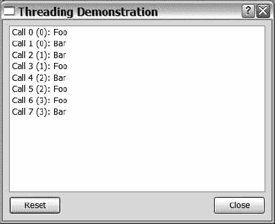
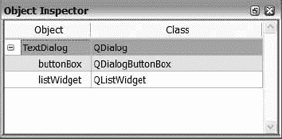
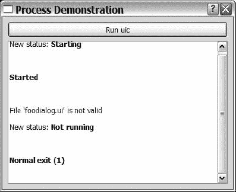
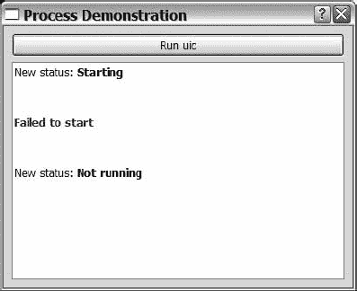

## 第十二章

并行做事

在编写软件时，你经常会遇到一大块工作必须执行的情况。如果在图形应用程序中书写，图形用户界面有时会冻结。幸运的是，使用线程时可以避免这种情况。

每个应用程序通常作为*进程*运行。在大多数现代操作系统中，几个应用程序可以同时运行，这意味着几个任务正在并行执行。这两个过程是分离的，互不相关。

在每个进程内部，可以有一个或多个*线程*在运行。这些线程共享资源和内存，并且需要相互了解。他们也可以合作完成任务，分担繁重的工作。这也有助于多处理器系统高效地工作，因为单个应用程序可以拆分到几个处理器上。

回到最初的问题——用户界面冻结——线程会有所帮助。通过在单独的线程中执行之前冻结应用程序的大量工作，主线程可以专注于更新和响应来自用户界面的事件。

处理器之间线程和进程的分配，以及进程和线程之间的切换，都是由底层操作系统来处理的，所以线程化是一个非常依赖于平台的话题。Qt 提供了线程和进程的公共类，以及让它们协作和共享数据的工具。然而，不同平台的执行顺序、速度和优先级都有所不同，因此在应用中实现线程化时必须格外小心。

### 基本穿线

让我们先来看看 Qt 的线程类，看看如何使用 Qt 开始使用线程。

重要的是要理解，一旦应用程序启动，它实际上是作为一个线程运行的，称为*主线程*。这意味着对`QApplication::exec`方法的调用是从主线程发出的，而`QApplication`对象驻留在该线程中。主线程有时被称为*图形用户界面(GUI)线程*，因为所有的窗口小部件和其他用户界面对象都必须由这个线程处理。

主线程通常由一个`event`循环和一组在该线程中创建的对象组成。通过子类化 Qt `QThread`类，您可以创建具有自己的`event`循环和对象的新线程。`QThread`类代表一个执行在`run`方法中实现的工作的线程。通过为您的线程实现一个定制的`run`方法，您已经创建了一个独立于主线程的线程，可以执行它的任务。

#### 构建简单的线程应用程序

清单 12-1 展示了一个类的类声明，它实现了一个名为`TextThread`的独立线程。您可以看出该类实现了一个单独的线程，因为它继承了`QThread`类。当这样做时，也有必要实现`run`方法。

线程的构造函数接受一个文本字符串，然后在运行时每秒向调试控制台输出一次该文本。

**清单 12-1。***`TextThread`*类声明**

```cpp
class TextThread : public QThread

{

public:

  TextThread( const QString &text );

  void run();

private:

  QString m_text;

};
```

清单 12-2 中的[实现了`TextThread`类。首先有一个全局变量`stopThreads`，用于停止所有线程的执行。通过使用`terminate`方法可以停止一个线程，但是这可以与让一个线程崩溃相比较。什么都不清理，不保证成功。](#the_textthread_class_implementation_and)

在构造函数中，给定的文本被注意到并存储在文本线程的私有成员中。确保调用`QThread`构造函数，以便正确初始化线程。

在`run`方法中，当`stopThreads`被设置为`true`时，执行进入一个循环。在循环中，在线程使用`sleep`方法休眠至少一秒钟之前，使用`qDebug`将文本发送到调试控制台。注意`sleep`让线程等待*至少*指定的时间。这意味着睡眠可以持续比指定时间更长的时间，并且在调用`sleep`之间花费的睡眠时间可以不同。

* * *

**提示**`sleep`方法可以让你暂停一个线程几秒钟。用`msleep`，可以用毫秒(千分之一秒)来指定休眠周期；使用`usleep`，你可以用微秒(百万分之一秒)来指定睡眠时间。睡眠的可能最短持续时间由硬件和当前软件平台决定。由于这些限制，请求睡眠一微秒很可能会导致更长的睡眠时间。

* * *

**清单 12-2。***`TextThread`*类实现和全局变量* `stopThreads`*

```cpp
bool stopThreads = false;

TextThread::TextThread( const QString &text ) : QThread()

{

  m_text = text;

}

void TextThread::run()

{

  while( !stopThreads )

  {

    qDebug() << m_text;

    sleep( 1 );

  }

}
```

在[清单 12-3](#an_application_using_the_textthread_clas) 中，`TextThread`类用于实例化两个对象，只要对话框打开，这两个对象就会启动并保持运行。当用户关闭对话框时，`stopThreads`标志被设置为`true`，在退出`main`函数之前，您等待线程实现这一点。这种等待可能长达一秒钟，因为当标志改变时，线程可能正在休眠。

**清单 12-3。** *一个应用使用了* `TextThread` *类*

```cpp
int main( int argc, char **argv )

{

  QApplication app( argc, argv );

  TextThread foo( "Foo" ), bar( "Bar" );

  foo.start();

  bar.start();

  QMessageBox::information( 0, "Threading", "Close me to stop!" );

  stopThreads = true;

  foo.wait();

  bar.wait();

  return 0;

}
```

在`main`函数中，线程对象就像任何其他对象一样被创建。然后使用`start`方法启动线程。当线程预计要停止时，主线程通过为每个线程调用`wait`方法来等待它们。您可以通过给`wait()`一个以毫秒为单位的时间限制，在特定的时间间隔后强制线程停止。否则，不传递参数会导致应用程序一直等到线程停止。当`wait`调用返回时，您可以使用`isFinished`或`isRunning`方法来确定`wait`调用是否超时，或者线程是否完成并停止执行。

**强制线程终止**

如果一个线程停止失败，可以调用`terminate`强行结束它的执行。请记住，这很可能会导致内存泄漏和其他问题。如果你使用一个保护标志比如`stopThreads`或者为每个线程实现一个`stopMe`槽，你就可以强制线程停止，而不必依赖于强力方法比如`terminate`。唯一不起作用的时候是线程挂起的时候——这时你正在处理一个应该解决的软件错误。

**运行线程化应用**

运行应用程序时，您会看到输出`"Foo"`和`"Bar"`成对出现，如清单 12-4 中的[所示。有时顺序会改变，这样`"Foo"`会出现在`"Bar"`之前，反之亦然，因为`sleep`调用会让线程休眠至少一秒钟，操作系统可以以不同于线程休眠时的顺序唤醒线程。](#a_test_run_of_the_textthread_class)

这个结果展示了使用线程时的许多陷阱之一:您永远不能假设任何事情；如果您这样做，在其他平台上的行为可能会略有不同。重要的是只依赖 Qt 文档中的保证——别无其他。

**清单 12-4。***`TextThread`*级*的试运行*

```cpp
"Foo"

"Bar"

"Bar"

"Foo"

"Bar"

"Foo"

"Bar"

"Foo"

"Bar"

"Foo"

"Foo"

"Bar"

"Bar"

"Foo"
```

### 安全同步

有时候你需要让两个或者更多的线程关注其他线程在做什么。这被称为*同步*线程，这可能发生在一个线程使用另一个线程的结果时；然后，第一个线程需要等待，直到另一个线程实际上已经产生了可以处理的东西。另一个常见的场景是几个线程共享一个公共资源；它们都需要确保没有其他线程同时使用相同的资源。

为了同步线程，你可以使用一个叫做*互斥*的特殊锁，它可以被锁定和解锁。如果一个不同的线程试图锁定一个已经锁定的互斥体，它将不得不等待直到它被当前的持有者解锁，然后才能锁定它。据说方法*阻塞*直到它能被完成。锁定和解锁操作是*原子的*，这意味着它们被视为单个不可见的操作，在执行过程中不能被中断。这很重要，因为锁定互斥体是一个两步过程。首先，线程检查互斥锁没有被锁定；然后将它标记为锁定。如果第一个线程在检查后被中断，然后第二个线程检查并锁定互斥体，第一个线程将认为互斥体在恢复时被解锁。然后，它会将一个已经锁定的互斥体标记为已锁定，这就造成了两个线程都认为它们已经锁定了互斥体的情况。因为锁定操作是原子的，第一个线程在检查和锁定之间不会被中断，因此第二个线程将检查并找到一个锁定的互斥体。

在 Qt 中，互斥是由`QMutex`类实现的。锁定和解锁的方法称为`lock`和`unlock`。另一种方法`tryLock`，仅当互斥体不属于另一个线程时才锁定互斥体。

通过修改清单 12-1 、 [12-2](#the_textthread_class_implementation_and) 和 [12-3](#an_application_using_the_textthread_clas) 中的应用程序，您可以确保`"Foo"`和`"Bar"`文本总是以相同的顺序出现。清单 12-5 显示了修改后的`run`方法。添加的代码行已经突出显示。

添加的行确保每个线程在打印文本和睡眠时持有锁。在此期间，另一个线程也调用`lock`，然后阻塞，直到当前持有者解锁互斥体。

必须添加`if`语句，因为`main`函数可能会在线程阻塞`lock`调用时开始关闭。如果它不在那里，被阻塞的线程会在意识到`stopThreads`是`true`之前输出一次过多的文本。

**清单 12-5。** *新的* `run` *方法用互斥量进行排序*

```cpp
QMutex mutex;

void TextThread::run()

{

  while( !stopThreads )

  {

    mutex.lock();

    if( stopThreads ){

      mutex.unlock();

      return;

    }

    qDebug() << m_text;

    sleep( 1 );

    mutex.unlock();

  }

}
```

再次运行这个例子，你会看到`"Foo"`或`"Bar"`每秒打印一次，并且总是以相同的顺序。这使得原始应用程序的速度减半，在原始应用程序中，`"Foo"`和`"Bar"`都是每秒打印一次。不能保证哪一个文本先被打印出来— `bar`可能比`foo`更快初始化，即使`start`先被`foo`调用。订单也不能保证。通过增加执行线程的系统的工作负载或缩短睡眠时间，顺序可以改变。它之所以有效，是因为解锁互斥体的线程到达`lock`调用和阻塞需要不到一秒钟的时间。

* * *

**提示**保证线程的顺序是可能的，但是它需要两个互斥体和对`run`方法的更大改变。

* * *

#### 保护您的数据

互斥不是为了保证线程的顺序；当几个线程试图同时访问数据时，它们保护数据不被破坏。

在详细了解这一点之前，您需要了解实际问题是什么。例如，考虑表达式`n += 5`。计算机可能会分三步执行:

1.  从存储器中读取`n`。
2.  将`5`加到数值上。
3.  将值写回到存储`n`的存储器中。

如果两个线程试图同时执行该语句，顺序可能会如下所示:

1.  线程 A 读取`n`的原始值。
2.  线程 A 将`5`加到该值上。
3.  操作系统切换到线程 b。
4.  线程 B 读取`n`的原始值。
5.  线程 B 将`5`加到该值上。
6.  线程 B 将该值写回到存储`n`的内存中。
7.  操作系统切换到线程 a。
8.  线程 A 将该值写回到存储`n`的内存中。

前面描述的执行结果将是线程 A 和 B 都将值`n+5`存储在内存中，并且线程 A 覆盖线程 B 写入的值。结果是`n`的值不正确(它应该是`n+10`，但它是`n+5`)。

通过使用互斥体来保护`n`，当线程 A 正在处理它时，你可以防止线程 B 到达该值，反之亦然。一个线程阻塞，而另一个线程工作，因此代码的关键部分是串行执行，而不是并行执行。通过保护类中所有潜在的关键部分不被并行访问，可以从多个线程中安全地调用这些对象。据说这个类是线程安全的。

#### 受保护计数

让线程通过一个`TextDevice`对象操作，而不是让`TextThread`线程直接向`qDebug`写文本。它被称为*文本设备*，因为它模拟了打印文本的共享设备。要使用设备打印文本，使用`write`方法，它将给定的文本写入调试控制台。它还列举了所有文本，这样您就可以知道`write`方法被调用了多少次。

在清单 12-6 的[中可以看到`TextDevice`类声明。该类包含了您所期望的内容:一个构造函数，一个`write`方法，一个用于枚举调用的计数器，以及一个用于保护计数器的`QMutex`。](#the_textdevice_class_declaration)

**清单 12-6。***`TextDevice`*类声明**

```cpp
class TextDevice

{

public:

  TextDevice();

  void write( const QString& );

private:

  int count;

  QMutex mutex;

};
```

`TextDevice`类的实现展示了一个新技巧。[清单 12-7](#the_textdevice_class_implementation) 展示了如何使用`QMutexLocker`类来锁定互斥体。互斥锁一构造就锁定互斥体，然后在互斥体被析构时解锁互斥体。

您可以选择显式调用`lock`和`unlock`的解决方案，但是通过使用`QMutexLocker`，您可以确保互斥体被解锁，即使您在方法中途退出`return`语句或者到达方法末尾时也是如此。结果是`write`方法不能从不同的线程进入两次——调用将被序列化。

**清单 12-7。***`TextDevice`*类实现**

```cpp
TextDevice::TextDevice()

{

  count = 0;

}

void TextDevice::write( const QString& text )

{

  QMutexLocker locker( &mutex );

  qDebug() << QString( "Call %1: %2" ).arg( count++ ).arg( text );

}
```

`TextThread` class' `run`方法与原来的[清单 12-2](#the_textthread_class_implementation_and) 相比变化不大。现在调用的是`write`方法而不是`qDebug`。清单 12-8 中突出显示了这一变化。

`m_device`成员变量是指向要使用的`TextDevice`对象的指针。它是从构造函数中的给定指针初始化的。

**清单 12-8。***`TextThread::run`*方法现在调用* `write` *，而不是直接输出到* `qDebug`*

```cpp
void TextThread::run()

{

  while( !stopThreads )

  {

    m_device->write( m_text );

    sleep( 1 );

  }

}
```

与您在清单 12-3 中看到的[相比，`main`函数也做了轻微的修改。新版本创建了一个在`TextThread`线程对象上传递的`TextDevice`对象。新版本可以在清单 12-9](#an_application_using_the_textthread_clas) 中看到，其中的变化被突出显示。

**清单 12-9。** *一个* `TextDevice` *对象被实例化并传递给* `TextThread` *线程对象*

```cpp
int main( int argc, char **argv )

{

  QApplication app( argc, argv );

  TextDevice device;

  TextThread foo( "Foo", &device ), bar( "Bar", &device );

  foo.start();

  bar.start();

  QMessageBox::information( 0, "Threading", "Close me to stop!" );

  stopThreads = true;

  foo.wait();

  bar.wait();

  return 0;

}
```

构建和执行应用程序会产生一个编号为`"Foo"`和`"Bar"`的文本列表(在[清单 12-10](#a_test_run_of_the_counting_textdevice) 中可以看到一个例子)。输出的顺序是不确定的，但是枚举总是有效的——这要感谢保护计数器的互斥体。

**清单 12-10。** *一次试运行的计数* `TextDevice`

```cpp
"Call 0: Foo"

"Call 1: Bar"

"Call 2: Bar"

"Call 3: Foo"

"Call 4: Bar"

"Call 5: Foo"

"Call 6: Bar"

"Call 7: Foo"

"Call 8: Bar"

"Call 9: Foo"

"Call 10: Bar"

"Call 11: Foo"
```

#### 锁定读写

使用互斥体来保护变量有时会导致潜在的性能下降。两个线程可以同时读取共享变量的值而不锁定它，但是如果第三个线程进入场景并试图更新该变量，它必须锁定它。

为了处理这种情况，Qt 提供了`QReadWriteLock`类。这个类的工作很像`QMutex`，但是它提供了`lockForRead`和`lockForWrite`方法，而不是`lock`方法。就像使用`QMutex`一样，你可以直接使用这些方法，也可以使用`QReadLocker`和`QWriteLocker`类，它们在构造时锁定一个`QReadWriteLock`，在被析构时解锁它。

让我们尝试在应用程序中使用`QReadWriteLock`。您将更改`TextDevice`的行为，这样计数器就不会从`write`方法更新，而是从一个名为`increase`的新方法更新。`TextThread`对象仍将在那里调用`write`，但是您将添加另一个线程类来增加计数器。这个名为`IncreaseThread`的类只是每隔一段时间调用一个给定的`TextDevice`对象的`increase`。

让我们先看看新的`TextDevice`类的类声明，如[清单 12-11](#the_textdevice_class_declaration_with_a) 所示。与[清单 12-6](#the_textdevice_class_declaration) 中的代码相比，`QMutex`被一个`QReadWriteLock`取代，并且在接口中加入了`increase`方法。

**清单 12-11。***`TextDevice`*类声明带* `QReadWriteLock`*

```cpp
class TextDevice

{

public:

  TextDevice();

  void increase();

  void write( const QString& );

private:

  int count;

  QReadWriteLock lock;

};
```

在清单 12-12 所示的实现中，您可以看到对`TextDevice`类所做的更改。新方法`increase`在改变计数器之前创建一个引用`QReadWriteLock`的`QWriteLocker`。更新后的`write`方法在创建发送到调试控制台的文本时，在使用计数器之前，以同样的方式创建一个`QReadLocker`。尽管新实现的保护功能是一个相当复杂的概念，但代码相当容易阅读和理解。

**清单 12-12。***`TextDevice`*类实现使用* `QReadLocker` *和* `QWriteLocker` *来保护* `count` *成员变量**

```cpp
TextDevice::TextDevice()

{

  count = 0;

}

void TextDevice::increase()

{

  QWriteLocker locker( &lock );

  count++;

}

void TextDevice::write( const QString& text )

{

  QReadLocker locker( &lock );

  qDebug() << QString( "Call %1: %2" ).arg( count ).arg( text );

}
```

`IncreaseThread`类与`TextThread`类有许多相似之处(类声明如清单 12-13 中的[所示)。因为它是一个线程，所以它继承了`QThread`。构造函数接受一个指向`TextDevice`对象的指针来调用`increase`，这个类包含一个指向这样一个设备(名为`m_device`)的私有指针来保存这个指针。](#the_increasethread_class_declaration)

**清单 12-13。***`IncreaseThread`*类声明**

```cpp
class IncreaseThread : public QThread

{

public:

  IncreaseThread( TextDevice *device );

  void run();

private:

  TextDevice *m_device;

};
```

`IncreaseThread`类的实现反映了你从类声明中学到的东西(你可以在[清单 12-14](#the_increasethread_class_implementation) 中看到代码)。在构造函数中初始化`m_device`，调用`QThread`构造函数初始化基类。

在`run`方法中，每 1.2 秒调用一次`m_device`的`increase`方法，当`stopThreads`置为`true`时循环停止。

**清单 12-14。***`IncreaseThread`*类实现**

```cpp
IncreaseThread::IncreaseThread( TextDevice *device ) : QThread()

{

  m_device = device;

}

void IncreaseThread::run()

{

  while( !stopThreads )

  {

    msleep( 1200 );

    m_device->increase();

  }

}
```

`TextDevice`类不受这些变化的影响，它与[清单 12-8](#the_textthread_colon_colon_run_method_no) 中显示的类相同。`main`函数也非常类似于前面的例子。唯一的变化是添加了一个`IncreaseThread`对象。[清单 12-15](#the_main_function_comma_setting_up_a_tex) 显示了`main`函数，并突出显示了添加的行。

**清单 12-15。***`main`*功能，设置了一个* `TextDevice`，*，*，*和一个* `IncreaseThread`*

```cpp
int main( int argc, char **argv )

{

  QApplication app( argc, argv );

  TextDevice device;

  IncreaseThread inc( &device );

  TextThread foo( "Foo", &device ), bar( "Bar", &device );

  foo.start();

  bar.start();

  inc.start();

  QMessageBox::information( 0, "Threading", "Close me to stop!" );

  stopThreads = true;

  foo.wait();

  bar.wait();

  inc.wait();

  return 0;

}
```

应用程序输出可以在[清单 12-16](#the_textdevice_with_a_separate_increase) 中看到。`"Foo"`和`"Bar"`文本的顺序可以随时改变，计数器以稍微不同的间隔更新，因此有时您会得到具有相同计数器值的四个字符串；有时你会得到两根弦。在某些情况下，您可能最终得到一个带有一个计数器值的单个`"Foo"`或`"Bar"`(或者三个——如果`IncreaseThread`碰巧在来自`TextThread`对象的两个`write`调用之间调用`increase`)。

**清单 12-16。***`TextDevice`*用单独的* `increase` *方法运行**

```cpp
"Call 0: Foo"

"Call 0: Bar"

"Call 0: Foo"

"Call 0: Bar"

"Call 1: Bar"

"Call 1: Foo"

"Call 2: Bar"

"Call 2: Foo"

"Call 3: Bar"

"Call 3: Foo"

"Call 4: Bar"

"Call 4: Foo"

"Call 4: Foo"

"Call 4: Bar"

"Call 5: Bar"

"Call 5: Foo"
```

### 线程间共享资源

当访问需要序列化时，互斥锁和读写锁有利于保护共享变量和其他共享项。有时，您的线程不仅需要共享一个变量，还需要共享有限数量的资源，如缓冲区的字节数。这就是*信号量*的用武之地。

信号量可以看作是计数互斥量，互斥量可以看作是二元信号量。它们实际上是一回事，但是信号量是用一个值而不是一个锁位来初始化的。当您锁定一个互斥体时，您*从信号量中获取*一个值，这会减少信号量的值。信号量的值永远不能小于零，因此，如果一个线程试图获取比信号量更多的资源，该线程将一直阻塞，直到请求的数量可用。当您完成获取的值时，您*将它释放回信号量，这增加了信号量的值。通过释放，可以增加信号量的值，使其超过信号量的初始值。*

Qt 类`QSemaphore`实现了信号量特性。您可以使用`acquire`方法从信号量对象获取一个值，或者如果您不想在请求的值不可用时阻塞，可以使用`tryAcquire`方法。如果采集成功，则`tryAcquire`方法返回`true`，如果请求的数量不可用，则返回`false`。使用`release`方法将一个值释放回信号量对象。如果想在不影响信号量的情况下知道信号量对象的值，可以使用`available`方法。如果信号量表示共享资源的可用性，并且您希望向用户显示有多少资源正在被使用，这将非常方便。

在[清单 12-17](#the_available_value_of_a_semaphore_is_ch) 中，您可以看到当信号量对象被使用时，可用值是如何变化的。在进行一系列的`acquire`和`release`调用之前，信号量被初始化为值`10`。突出显示的行显示了对`tryAcquire`的方法调用失败，因为该调用试图获取比可用的更多的内容。因为调用失败，信号量的可用值保持不变。

**清单 12-17。** *信号量的可用值因为对象被使用而改变。*

```cpp
QSemaphore s( 10 );

s.acquire();      // s.available() = 9

s.acquire(5);     // s.available() = 4

s.release(2);     // s.available() = 6

s.release();      // s.available() = 7

s.release(5);     // s.available() = 12

s.tryAcquire(15); // s.available() = 12
```

#### 陷入困境

实现线程系统的最大风险之一是*死锁*，当两个线程互相阻塞从而都阻塞时，就会发生死锁。因为两个线程都被阻塞，所以都不能释放被另一个线程阻塞的资源。结果是系统冻结。

* * *

**注意**即使只有一个线程，也会发生死锁。想象一个线程试图从一个信号量中获取一个高于可能值的值。

* * *

用来形象化这一点的一个最常见的例子是哲学家进餐的问题。[图 12-1](#the_philosophers_are_getting_ready_to_di) 展示了一张桌子，五个哲学家坐在上面吃饭。每个人都有一个盘子，盘子的两边都有筷子。


**图 12-1。** *哲学家们正准备开饭。*

哲学家使用的吃饭算法分为五个步骤:

1.  拿起左边的筷子。
2.  获得合适的筷子。
3.  吃吧。
4.  松开右边的筷子。
5.  松开左边的筷子。

因为所有的哲学家都一样饿，所以他们都立刻拿起左边的筷子。问题是，一个哲学家的左筷子是另一个哲学家的右筷子。因此，当他们试图获得正确的筷子时，他们都会受阻。出现了僵局，他们都饿死了。

如你所见，死锁是危险的，甚至是致命的。那么，它们是如何避免的呢？第一个任务是识别可能发生死锁的潜在危险情况。寻找竞争多个资源的线程，这些线程也在不同的时间获取这些资源。如果每个哲学家都试图在一次操作中获得两只筷子，这个问题就永远不会发生。

当发现潜在的危险情况时，必须消除它。通过不盲目地获得第二根筷子，而是*尝试*去获得它，可以避免一次阻碍。如果拿不到第二根筷子，松开第一根也很重要，这样可以避免挡住邻居。当错过第二根筷子并返回第一根筷子时，最好的行动是睡一会儿，让相邻的哲学家吃完饭，然后再试图获得两根筷子。这将大致转化为以下算法:

1.  拿起左边的筷子。
2.  试着找到合适的筷子。
3.  如果两个操纵杆都已获得，继续步骤 6。
4.  松开左边的筷子。
5.  在继续第一步之前思考一会儿。
6.  吃吧。
7.  松开右边的筷子。
8.  松开左边的筷子。

这种进食算法在最坏的情况下可以饿死最多三个哲学家，但至少其中两个会得到食物——避免了僵局。因为对于所有五个哲学家来说，得到两根筷子的概率是相等的，所以在现实生活中，五个哲学家会时不时地吃点东西。

#### 生产者和消费者

信号量派上用场的一个常见线程场景是，一个或多个线程产生数据，一个或多个线程消耗数据。这些线程被称为*生产者*和*消费者*。

通常生产者和消费者共享一个用来发送信息的缓冲区。通过让一个信号量跟踪缓冲区中的空闲空间，让另一个信号量跟踪缓冲区中的可用数据，可以让使用者并行工作，直到缓冲区满了或空了(生产者或使用者必须停下来等待，直到有更多的空闲空间或数据可用)。

**通过共享循环缓冲区传递数据**

为了展示如何使用信号量，您将创建一个由生产者和消费者组成的应用程序。生产者将给定的文本通过循环缓冲区传递给消费者，消费者将把接收到的文本打印到调试控制台。

因为只有一个循环缓冲区，所以你已经将它实现为一组全局变量，如[清单 12-18](#the_variables_making_a_semaphore-monitor) 所示。如果您计划使用几个缓冲区，显而易见的解决方案是在一个类中声明这些全局变量。然后使用缓冲区将每个生产者和消费者引用到该类的一个实例。

缓冲区由大小`bufferSize`和实际缓冲区`buffer`组成。因为您计划移动`QChar`对象，所以缓冲区就是那种类型的。缓冲区还需要两个信号量:一个用于跟踪可用的空闲空间，另一个用于跟踪可用数据项的数量。最后，有一个名为`atEnd`的标志，告诉消费者生产者将不再生产数据。

**清单 12-18。** *创建信号量监控的线程安全缓冲区的变量*

```cpp
const int bufferSize = 20;

QChar buffer[ bufferSize ];

QSemaphore freeSpace( bufferSize );

QSemaphore availableData( 0 );

bool atEnd = false;
```

缓冲器将从索引`0`填充到`bufferSize-1`，然后从`0`开始增加。在将一个字符放入缓冲区之前，生产者将从`freeSpace`信号量中获取。当字符被放入缓冲区时，生产者将释放给`availableData`信号量。这意味着，如果没有任何东西消耗缓冲区中的数据，缓冲区将被填充，并且`availableData`信号量值将等于`bufferSize`，生产者将无法获得任何更多的空闲空间。

应用程序中的生产者类称为`TextProducer`。它的构造函数期望一个`QString`作为参数，并将字符串存储在私有成员变量`m_text`中。生产者的工作在[清单 12-19](#the_run_method_of_the_producer_class) 所示的`run`方法中执行。如前所述，`for`循环遍历文本，然后将`QChar`对象逐个放入缓冲区，与消费者同步。当整个文本已经被发送时，`atEnd`标志被设置为`true`，因此消费者知道整个文本已经被发送。

**清单 12-19。***`run`*生产者类的方法**

```cpp
void TextProducer::run()

{

  for( int i=0; i<m_text.length(); ++i )

  {

    freeSpace.acquire();

    buffer[ i % bufferSize ] = m_text[ i ];

    if( i == m_text.length()-1 )

      atEnd = true;

    availableData.release();

  }

}
```

消费线程的读取顺序与填充顺序相同——从索引`0`到`bufferSize-1`,然后再次从`0`开始。在读取之前，它试图从`availableData`信号量中获取。当从缓冲区中读取一个字符后，它会释放给`freeSpace`信号量，因为缓冲区的索引可以被生产者重用。

名为`TextConsumer`的消费者类只实现了一个`run`方法(参见[清单 12-20](#the_run_method_of_the_consumer_class) )。`run`方法的实现非常简单。

**清单 12-20。***`run`*消费类的方法**

```cpp
void TextConsumer::run()

{

  int i = 0;

  while( !atEnd || availableData.available() )

  {

    availableData.acquire();

    qDebug() << buffer[ i ];

    i = (i+1) % bufferSize;

    freeSpace.release();

  }

}
```

当需要同步生产者和消费者以及他们对缓冲区的访问时，保持对流程发生顺序的控制是非常重要的。在数据被放入缓冲器之前，必须获取空闲空间*，并且在*数据被写入缓冲器之后，必须释放可用数据*。从缓冲器中取出数据也是如此——在*之前获取可用数据*,在*之后释放空闲空间*。在*释放自由空间之前更新`atEnd`标志*也是很重要的，以避免当`atEnd`标志为`true`时，消费者陷入等待可用数据信号量。使用`atEnd`解决方案，还必须有至少一个字节的数据要传输；不然消费者就挂了。一种解决方案是首先传输数据长度，或者最后传输数据结束标记。*

[清单 12-21](#a_main_function_using_the_textproducer_a) 显示了一个使用`TextProducer`和`TextConsumer`类的`main`函数。它用一些虚构的拉丁文文本初始化生成器，启动两个线程，然后等待它们都完成。它们的启动顺序和等待调用的顺序是不相关的——两个线程都将使用信号量来同步自己。

**清单 12-21。** *一* `main` *功能使用* `TextProducer` *和* `TextConsumer` *类*

```cpp
int main( int argc, char **argv )

{

  QApplication app( argc, argv );

  TextProducer producer( "Lorem ipsum dolor sit amet, "

                         "consectetuer adipiscing elit. "

                         "Praesent tortor." );

  TextConsumer consumer;

  producer.start();

  consumer.start();

  producer.wait();

  consumer.wait();

  return 0;

}
```

看前面的例子，注意到有一个与`acquire`和`release`调用相关的性能成本。使用互斥锁和读写锁也有类似的成本，所以有时将传输的数据分成块可以提高性能。例如，将字符串作为单词而不是一个字符一个字符地发送可能会更快，这意味着在生产者线程中一次为几个字符获取空间，而不是一次一个字符，并且每次进行稍微多一点的处理。当然，这会引入性能损失，即缓冲区并不总是被充分利用，因为即使缓冲区中有空闲空间，生产者有时也会阻塞。

**与竞争生产商打交道**

生产者-消费者场景的一个常见版本是让几个生产者为一个消费者提供数据。例如，可以有几个工作线程为主线程提供数据。主线程是唯一可以更新用户界面的线程，因此使其成为消费者是合乎逻辑的(它也可以是生产者——一个线程可以同时是生产者和消费者)。

在将几个`TextProducer`对象与[清单 12-20](#the_run_method_of_the_consumer_class) 中的`TextConsumer`类一起使用之前，您需要处理两个问题。第一个问题是`atEnd`标志，它需要被转换成信号量。它将在`TextProducer`构造函数中被释放，并在生产者用完`run`方法中的数据时被获取。在消费端，`while`循环无法检查`atEnd`；用`atEnd.available()`代替。

第二个问题是用于写入缓冲区的索引。因为可能有几个生产者更新缓冲区，所以他们必须共享一个必须由互斥体保护的索引。

让我们看看从`TextProducer`类开始更新的`run`方法(参见[清单 12-22](#the_textproducer_run_method_comma_update) )。突出显示的行显示了共享索引变量`index`和它的互斥体`indexMutex`。互斥体在包含`index++`的行周围被锁定和解锁。那是唯一引用和更新`index`的地方。这里不能使用`QMutexLocker`,因为这会锁定整个`run`方法中的互斥体，并阻塞其他生产者线程。相反，互斥锁必须被锁定尽可能短的时间。

**清单 12-22。***`TextProducer run`*方法，更新为处理几个同时发生的生产者**

```cpp
void TextProducer::run()

{

  static int index = 0;

  static QMutex indexMutex;

  for( int i=0; i<m_text.length(); ++i )

  {

    freeSpace.acquire();

    indexMutex.lock();

    buffer[ index++ % bufferSize ] = m_text[ i ];

    indexMutex.unlock();

    if( i == m_text.length()-1 )

      atEnd.acquire();

      availableData.release();

  }

}
```

`TextConsumer`类的`run`方法只进行了少量的更新。清单 12-23 中突出显示的一行显示了在`while`循环中如何使用`atEnd`信号量。将此与清单 12-20 中的进行比较，其中`atEnd`是一个标志。

**清单 12-23。***`TextConsumer run`*方法，更新为同时交到几个制作人手中**

```cpp
void TextConsumer::run()

{

  int i = 0;

  while( atEnd.available() || availableData.available() )

  {

    availableData.acquire();

    qDebug() << buffer[ i ];

    i = (i+1) % bufferSize;

    freeSpace.release();

  }

}
```

请注意，在比较单个生产者版本和多个生产者版本时，生产者和消费者之间使用信号量来获取可用数据和空闲空间的实际交互是不变的。

[清单 12-24](#a_main_function_with_two_producers_and_o) 显示了一个`main`函数，它设置了两个生产者和一个消费者。生产者和消费者被设置和启动；然后，该函数等待它们完成，就像在单生产者版本中一样。

**清单 12-24。** *一个* `main` *函数有两个生产者和一个消费者*

```cpp
int main( int argc, char **argv )

{

  QApplication app( argc, argv );

  TextProducer p1( "this text is written using lower case characters."

    "it will compete with text written using upper case characters." );

  TextProducer p2( "THIS TEXT IS WRITTEN USING UPPER CASE CHARACTERS!"

    "IT WILL COMPETE WITH TEXT WRITTEN USING LOWER CASE CHARACTERS!" );

  TextConsumer consumer;

  p1.start();

  p2.start();

  consumer.start();

  p1.wait();

  p2.wait();

  consumer.wait();

  return 0;

}
```

尽管双生产者版本的不同执行的结果有时不同，但是有一个重复的模式。清单 12-25 显示了一次执行的结果。你可以看到小写的生产者先取得控制权，大写的生产者插队，他们转移一两次，其中一个线程领先。开始的线程随时间而变化，并且主导线程变化的次数也随时间而变化。每次重复的模式是两个线程之间的分布不均匀。一个线程总是提供大多数字符。

这种模式的原因是线程被安排在失去焦点之前运行几毫秒。当缓冲区已被填满并且生产者无法获得更多的空闲空间时，任一线程都可以在空闲空间再次出现时取得领先。

**清单 12-25。** *所收的人物* `TextConsumer`

```cpp
this text is writTHteIS TEXT nIS WRITTEN USING UPP ER CASE CHARACTEuRS

!IT WILL COMPEsTE WITH TEXT WiRITTEN USING LOnWER CASE CHARACTgERS!

lower case characters.it will compete with text written using upper

case characters.
```

### 跨越线程屏障的信令

到目前为止，您一直依赖共享缓冲区在线程之间传递数据。还有一个稍微贵一点(但简单得多)的解决方案:使用信号和插槽。使用它们可以避免创建和使用缓冲区；相反，您可以在整个应用程序中使用事件驱动的范例。

* * *

**提示**在 Qt 4.0 之前的 Qt 版本中，无法在线程间发送信号。相反，您必须依赖于在线程之间传递自定义事件。这在 Qt 4.0 中仍然支持，但是使用信号和插槽要容易得多。

* * *

在线程间传递信号和在一个线程内使用信号是有一些区别的。当在单线程应用程序或单线程中发出信号时，发出调用直接调用所有连接的插槽，发出代码一直等待，直到插槽完成。当向另一个线程中的对象发出信号时，信号被排队。这意味着发出调用将在插槽被激活之前或同时返回。

也可以在一个线程中使用排队信号。你所需要做的就是明确地告诉`connect`你想要创建一个排队连接。默认情况下，`connect`使用线程内的直接连接和线程间的排队连接。这是最有效的选择，因此自动设置总是有效的，但是如果您指定要排队的连接，您将获得性能。

#### 在线程间传递字符串

让我们从本章开始回到`TextThread`和`TextDevice`类。不是让文本线程调用文本设备来传递文本，而是发送一个信号。信号将从文本线程传递到主线程中的文本设备。

新的`TextThread`类可以在[清单 12-26](#the_textthread_with_the_writetext_signal) 中看到。突出显示的行显示了添加信号和`stop`方法所做的更改。

在早期版本中，该类依赖于一个全局标志变量，该变量指示线程应该暂停执行；在这个版本中，标志`m_stop`是内部的，使用`stop`方法设置。

为了允许信号，添加了`Q_OBJECT`宏，以及一个`signals`部分和一个实际信号`writeText`，带有一个`QString`作为参数。

**清单 12-26。***`TextThread`*同* `writeText` *信号**

```cpp
class TextThread : public QThread

{

  Q_OBJECT

public:

  TextThread( const QString& text );

  void run();

  void stop();

signals:

  void writeText( const QString& );

private:

  QString m_text;

  bool m_stop;

};

```

`TextDevice`类已经变成了一个线程——它现在继承了`QThread`,并且拥有与`TextThread`类相同的停止机制。(类声明可以在[清单 12-27](#the_textdevice_class_declared_as_a_threa) 中看到。)突出显示的行显示了`Q_OBJECT`宏、`public slots`部分和接受`QString`作为参数的实际插槽(`write`)。

**清单 12-27。** *将* `TextDevice` *类声明为线程*

`class TextDevice : public QThread
{
`  Q_OBJECT`
public:
  TextDevice();

  void run();
  void stop();

`public slots:`
`  void write( const QString& text );`

private:
  int m_count;
  QMutex m_mutex;
};`

[清单 12-28](#the_implementation_of_the_textthread_cla) 显示了`TextThread`类的完整实现。这三个方法体看起来都很简单——事实也的确如此。构造函数初始化私有成员，并将调用传递给`QThread`构造函数。`stop`方法简单地将`m_stop`设置为`true`。`run`方法由监控所述`m_stop`标志的`while`循环组成。只要它运行，每秒钟就会发出一次携带`m_text`作为自变量的`writeText`信号。

**清单 12-28。***`TextThread`*类*的实现*

```cpp
TextThread::TextThread( const QString&text ) : QThread()

{

  m_text = text;

  m_stop = false;

}

void TextThread::stop()

{

  m_stop = true;

}

void TextThread::run()

{

  while( !m_stop )

  {

    emit writeText( m_text );

    sleep( 1 );

  }

}
```

`TextDevice run`方法非常简单，因为该类在没有收到信号调用的情况下不执行任何工作。查看清单 12-29 中的[，你可以看到这个方法简单地调用`exec`进入线程的`event`循环，等待信号到达。`event`循环一直运行，直到`quit`被调用(这是 stop 方法中唯一发生的事情)。](#the_write_slot_and_the_run_method_of_the)

在同一清单中，您还可以看到`write`插槽的实现。因为这个插槽可以同时被几个线程调用，所以它使用一个互斥体来保护`m_count`计数器。该槽可以作为函数直接调用，也可以被发出的信号调用，所以不能因为信号被一个接一个地排队和服务就忘记这一点。

**清单 12-29。***`write`*槽和* `TextDevice` *类*的 `run` *方法**

```cpp
void TextDevice::run()

{

  exec();

}

void TextDevice::stop()

{

  quit();

}

void TextDevice::write( QString text )

{

  QMutexLocker locker( &m_mutex );

  qDebug() << QString( "Call %1: %2" ).arg( m_count++ ).arg( text );

}
```

使用`TextThread`和`TextDevice`类很简单。请看清单 12-30 中的`main`函数设置两个文本线程和一个设备的例子。

因为数据是通过信号和插槽交换的，所以不同的线程对象不需要知道彼此；它们只是通过对`connect`的两个调用相互连接。当连接建立后，它们将被启动，并显示一个对话框。一旦对话框关闭，所有三个线程都将停止。然后，该函数在应用程序结束之前等待它们真正停止。

**清单 12-30。** *一* `main` *功能使用* `TextThread` *和* `TextDevice` *类*

```cpp
int main( int argc, char **argv )

{

  QApplication app( argc, argv );

  TextDevice device;

  TextThread foo( "Foo" ), bar( "Bar" );

  QObject::connect( &foo, SIGNAL(writeText(const QString&)),

                    &device, SLOT(write(const QString&)) );

  QObject::connect( &bar, SIGNAL(writeText(const QString&)),

                    &device, SLOT(write(const QString&)) );

  foo.start();

  bar.start();

  device.start();

  QMessageBox::information( 0, "Threading", "Close me to stop!" );

  foo.stop();

  bar.stop();

  device.stop();

  foo.wait();

  bar.wait();

  device.wait();

  return 0;

}
```

运行这个应用程序会得到类似于清单 12-10 中所示的结果:一个编号字符串的列表。

#### 在线程间发送你自己的类型

无需任何额外的工作，您就可以通过排队连接发送各种类的对象，如`QString`、`QImage`、`QVariant`等等。在某些情况下，您应该在连接中使用自己的类型。这实际上是很常见的，因为大多数应用程序都包含一个或多个自定义类型，这些类型很容易与信号一起传递。

如果你试图通过一个排队的连接传递一个自定义类型，你将会遇到运行时错误，看起来非常类似于清单 12-31 中显示的错误。由于信号及其参数的排队方式，在建立和引发连接时会出现错误。

**清单 12-31。** *试图通过排队连接传递自定义类型*

```cpp
QObject::connect: Cannot queue arguments of type 'TextAndNumber'

(Make sure 'TextAndNumber' is registed using qRegisterMetaType().)

QObject::connect: Cannot queue arguments of type 'TextAndNumber'

(Make sure 'TextAndNumber' is registed using qRegisterMetaType().)
```

当一个信号被排队时，它和它的参数一起排队。这意味着参数在传递到插槽之前被复制并存储在一个队列中。为了能够对一个参数进行排队，Qt 需要构造、析构和复制这样一个对象。

为了让 Qt 知道如何做到这一点，所有定制类型都需要使用`qRegisterMetaType`进行注册，就像错误消息所说的那样。让我们看看现实生活中是如何做到这一点的。

首先，你需要一些背景知识，了解你想要达到的目标。在线程信号和插槽演示中，您将文本字符串从`TextThread`对象发送到了`TextDevice`对象。文本设备计算它接收到的字符串的数量。您将通过让`TextThread`对象记录它们发送了多少条文本来扩展这一功能。然后，它们会将包含文本及其计数的`TextAndNumber`对象发送到文本设备。

`TextAndNumber`类是将通过排队连接传递的自定义类型，它将保存一个`QString`和一个整数。清单 12-32 显示了它的类声明。

该类本身由两个构造函数组成:一个不带参数；另一个接受文本和整数。元类型注册需要不带任何参数的构造函数，而另一个构造函数是为了方便起见而提供的——稍后在发出时会用到它。`text`和`number`是公开的，所以您不需要担心它们的 setter 和 getter 方法。

要将该类用作元类型，还必须提供一个公共析构函数和一个公共复制构造函数。因为这个类不包含默认版本不能处理的数据，所以不需要显式实现它们。

清单最后突出显示的一行包含对`Q_DECLARE_METATYPE`宏的引用。通过将类型传递给这个宏，该类型可以与`QVariant`对象结合使用，这是使用`qRegisterMetaType`注册它所必需的。

**清单 12-32。***`TextAndNumber`*类声明**

```cpp
class TextAndNumber

{

public:

  TextAndNumber();

  TextAndNumber( int, QString );

  int number;

  QString text;

};

Q_DECLARE_METATYPE( TextAndNumber );
```

对`qRegisterMetaType`的实际调用来自`main`函数，可以在清单 12-33 中的[的第一个高亮行中看到。另外两条更改的线路是连接呼叫。自从您传递了`QString`对象后，它们已经发生了变化，因为信号和插槽现在都有了新的参数类型。](#the_main_function_registering_textandnum)

**清单 12-33。** *主函数将* `TextAndNumber` *注册为元类型，并为新的信号和插槽*建立连接

```cpp
int main( int argc, char **argv )

{

  QApplication app( argc, argv );

  qRegisterMetaType<TextAndNumber>("TextAndNumber");

  TextDevice device;

  TextThread foo( "Foo" ), bar( "Bar" );

  QObject::connect( &foo, SIGNAL(writeText(TextAndNumber)),

                    &device, SLOT(write(TextAndNumber)) );

  QObject::connect( &bar, SIGNAL(writeText(TextAndNumber)),

                    &device, SLOT(write(TextAndNumber)) );

...

}
```

对`TextDevice`类的更改仅限于`write`槽。如[清单 12-34](#the_textdevice_apostrophy_s_write_slot_a) 所示，该插槽现在接受一个`TextAndNumber`对象作为参数，而不是一个`QString`。它打印自己的计数器值、收到的文本和收到的数字。

**清单 12-34。***`TextDevice`*`write`*槽接受一个* `TextAndNumber` *对象作为自变量***

```cpp
void TextDevice::write( TextAndNumber tan )

{

  QMutexLocker locker( &m_mutex );

  qDebug() << QString( "Call %1 (%3): %2" )

    .arg( m_count++ )

    .arg( tan.text )

    .arg( tan.number );

}
```

`TextThread`类得到了稍微多一点的改变，这可以在清单 12-35 中的[方法中看到。首先，现在发出的信号带有一个`TextAndNumber`参数——这里使用了前面提到的方便的构造函数。另一个变化是每个文本线程现在都有一个本地计数器，它在 emit 调用中更新，并且不受任何互斥体的保护，因为它只在一个线程中使用。](#the_textthread_run_method_now_updates_a)

**清单 12-35。***`TextThread run`*方法现在更新一个计数器并发出一个* `TextAndNumber` *对象而不是一个* `QString`。*

```cpp
void TextThread::run()

{

  while( !m_stop )

  {

    emit writeText( TextAndNumber( m_count++, m_text ) );

    sleep( 1 );

  }

}
```

运行所描述的应用程序会产生类似于[清单 12-36](#running_the_text_thread_application_with) 中所示的结果。调用由`TextDevice`对象计数，而每个字符串的出现次数由每个`TextThread`对象计数。如您所见，文本线程的顺序是不受控制的。

**清单 12-36。** *用线程本地计数器运行文本线程应用*

```cpp
"Call 0 (0): Foo"

"Call 1 (0): Bar"

"Call 2 (1): Bar"

"Call 3 (1): Foo"

"Call 4 (2): Foo"

"Call 5 (2): Bar"

"Call 6 (3): Bar"

"Call 7 (3): Foo"

"Call 8 (4): Foo"

"Call 9 (4): Bar"

"Call 10 (5): Foo"

"Call 11 (5): Bar"

"Call 12 (6): Foo"

"Call 13 (6): Bar"
```

### 线程、对象和规则

在关于线程间连接的小节中，您了解到了`connect`调用会自动在不同线程中的对象之间创建排队连接。所有的`QObject`实例都知道它们属于哪个线程——据说它们具有*线程相似性*。

有一些限制适用于`QObject`和线程:

*   `QObject`的子线程必须与`QObject`本身属于同一个线程。
*   事件驱动的对象只能在一个线程中使用。
*   所有的`QObject`必须在它们所属的`QThread`被删除之前被删除。

第一条规则意味着`QThread`本身不应该被用作父线程，因为它是在另一个线程中创建的。

第二条规则适用于定时器和网络套接字等机制。除了计时器或套接字的线程之外，您不能在其他线程中启动计时器或建立套接字连接，因为每个线程都有自己的`event`循环。如果你计划在一个线程中使用事件，你必须调用`QThread::exec`方法来启动线程的本地`event`循环。

第三个规则很容易管理:让您创建的所有对象在线程的`run`方法的堆栈上都有一个父对象(或祖父对象)。

理解一个`QObject`可以同时在几个线程中使用是很重要的——但是 Qt 提供的大多数对象都被设计成在一个线程中使用，所以你的收获可能会有所不同。

#### 穿线时的陷阱

Qt 的一些部分很容易在单线程中使用。这并不意味着它们不能从一个`QThread`对象中使用，或者它们与线程化的应用程序不兼容；最好将所有这样的对象放在一个线程中。如果需要与其他线程交互，可以使用信号、插槽和管理相关对象的线程的方法来执行。

保存在一个线程中的对象类型包括整个 SQL 模块以及`QTimer`、`QTcpSocket`、`QUdpSocket`、`QHttp`、`QFtp`和`QProcess`对象。

“行为不当”的一个例子是从一个线程创建一个`QFtp`对象，然后从另一个线程与之交互。这个过程可能会起作用，但它可能会导致神秘且难以调试的问题。为了避免寻找这些幽灵 bug，在使用线程时要小心。

#### 用户界面线程

所有的窗口小部件和用户界面对象必须由主线程(调用`QApplication::exec`的线程)处理。这意味着所有用户界面都将充当某种消费者——从执行实际工作的线程那里获得可视化信息。

将应用程序分成这些部分的好处是，当应用程序遇到繁重的任务时，用户界面不会冻结。相反，当处理在另一个线程中进行时，一些`QAction`对象可能被禁用。当结果准备好时，它通过缓冲区、自定义事件、共享缓冲区或其他机制反馈给主线程。

**文本和带有小工具的数字**

为了显示一个用来自线程的数据更新的简单用户界面，您将用一个对话框替换来自`TextAndNumber`应用程序的`TextDevice`类。来自`TextThread`生产者的数据传递是通过信号到插槽的连接完成的。运行应用如图 12-2 中[所示。](#the_textdialog_in_action)



**图 12-2。***`TextDialog`*在行动**

 *对话框类的类声明可以在[清单 12-37](#the_textdialog_class_declaration) 中看到。对话框类被称为`TextDialog`，通过`showText`插槽接受`TextAndNumber`对象。

从类声明中可以学到更多的东西。您可以看到该对话框使用了使用 Designer 制作的设计，因为它包含一个`Ui::TextDialog`成员变量。它还有一个专用插槽，用于连接名为`buttonClicked`的用户接口信号。

**清单 12-37。***`TextDialog`*类声明**

```cpp
class TextDialog : public QDialog

{

  Q_OBJECT

public:

  TextDialog();

public slots:

  void showText( TextAndNumber tan );

private slots:

  void buttonClicked( QAbstractButton* );

private:

  int count;

  QMutex mutex;

  Ui::TextDialog ui;

};
```

对话框如图[图 12-2](#the_textdialog_in_action) 所示，来自设计器的对象层次结构如图[图 12-3](#the_textdialog_object_hierarchy) 所示。列表小部件和按钮框在实际的对话框中以网格布局排列。

按钮框的关闭按钮连接到对话框的`reject`槽来关闭它，而重置按钮会在源代码中连接。



**图 12-3。***`TextDialog`*对象层次**

 *在[清单 12-38](#the_user_interface_handling_part_of_the) 中可以看到`TextDialog`类的部分实现。您可以看到建立用户界面、将按钮盒连接到`buttonClicked`插槽并初始化计数器的构造函数。

清单中还显示了`buttonClicked`插槽。当点击关闭和重置按钮时，该插槽被调用。通过检查抽象按钮的角色，可以确定是否单击了 Reset。在这种情况下，list 小部件将从它可能包含的任何列表项中清除。

**清单 12-38。** *用户界面处理部分* `TextDialog`

```cpp
TextDialog::TextDialog() : QDialog()

{

  ui.setupUi( this );

  connect( ui.buttonBox, SIGNAL(clicked(QAbstractButton*)),

           this, SLOT(buttonClicked(QAbstractButton*)) );

  count = 0;

}

void TextDialog::buttonClicked( QAbstractButton *button )

{

  if( ui.buttonBox->buttonRole( button ) == QDialogButtonBox::ResetRole )

    ui.listWidget->clear();

}
```

`TextDialog`类实现的剩余部分是`showText`槽。它可以在[清单 12-39](#the_showtext_slot_of_the_textdialog) 中看到，并且与[清单 12-34](#the_textdevice_apostrophy_s_write_slot_a) 中显示的`TextDevice`类的`write`插槽几乎相同。这表明两个`QThread`对象之间的通信和`QThread`对象与主线程之间的通信没有区别。同样的规则适用，同样的限制仍然存在。

**清单 12-39。***`showText`*`TextDialog`的插槽**

```cpp
void TextDialog::showText( TextAndNumber tan )

{

  QMutexLocker locker( &mutex );

  ui.listWidget->addItem( QString( "Call %1 (%3): %2" )

    .arg( count++ )

    .arg( tan.text )

    .arg( tan.number ) );

}
```

启动线程和显示对话框的`main`函数与清单 12-33 中的[相比没有太大变化，除了用`TextDialog`代替了`TextDevice`。对话框现在作为线程启动，但在`QApplication::exec`启动前显示。当该调用返回时，`TextThread`线程停止并等待来自`exec`调用的返回值返回。](#the_main_function_registering_textandnum)

在[图 12-2](#the_textdialog_in_action) 中可以看到该应用程序的运行。注意，您可以在 list 小部件中上下移动，并独立于两个线程清除它；他们会在主线程中发生任何事情的同时继续添加条目。

### 处理流程

与线程密切相关的是*进程*，它可以由几个线程组成，但不像线程那样共享内存和资源。属于单个进程的线程共享内存和资源，并且都是同一应用程序的一部分。一个进程就是你通常所说的另一个应用程序。它有自己的内存和资源，过着自己的生活。Qt 通过`QProcess`类处理进程。

如果从应用程序中启动一个进程，则通过通道(称为标准输入、标准输出和标准错误通道)与它进行通信。这些是控制台应用程序可用的通道，数据仅限于字节流。

#### 运行 uic

要使用使用`QProcess`类的进程编写文本，您将构建一个启动`uic`的小应用程序。`uic`应用程序是一个很好的玩法，因为如果你是 Qt 开发者，你就可以使用它(它和 Qt 捆绑在一起)。`uic`应用程序产生标准输出和标准误差的输出。它还可以处理您传递给它的一些不同的参数。

使用`QProcess`的应用程序由一个简单的对话框类`ProcessDialog`组成(参见[图 12-4](#the_uic_process_running_and_completing_s) )。在清单 12-40 中可以看到类声明。突出显示的行显示了与`QProcess`级可用信号相匹配的插槽范围。

**清单 12-40。***`ProcessDialog`*类声明**

```cpp
class ProcessDialog : public QDialog

{

  Q_OBJECT

public:

  ProcessDialog();

private slots:

  void runUic();

  void handleError( QProcess::ProcessError );

  void handleFinish( int, QProcess::ExitStatus );

  void handleReadStandardError();

  void handleReadStandardOutput();

  void handleStarted();

  void handleStateChange( QProcess::ProcessState );

private:

  QProcess *process;

  Ui::ProcessDialog ui;

};
```

从`QProcess`类发出的信号可用于监控已启动流程的进度或故障:

*   进程遇到了某种内部错误。
*   `started()`:流程已经开始。
*   `finished( int code, QProcess::ExitStatus status )`:进程已经退出。
*   `readyReadStandardError()`:有数据要从标准错误通道读取。
*   `readyReadStandardOutput()`:标准输出通道有数据要读取。
*   `stateChanged( QProcess::ProcessState newState )`:流程进入了一个新的状态。

当有数据准备读取时，您可以使用`readAllStandardError`方法或`readAllStandardOutput`方法读取，具体取决于您感兴趣的通道。使用 set `standardOutputFile`和`setStandardErrorFile`，您可以将任一通道的输出重定向到一个文件。

过程状态可以在三种状态`NotRunning`、`Starting`和`Running`之间变化。当进入`NotRunning`时，你就知道这个过程已经结束或者即将结束。状态变为`NotRunning`后可以接收结束信号，但错误信号一般在`stateChanged`信号之前发出。

在您可以接收任何信号之前，您需要从`runUic`槽开始一个新的进程。你可以在清单 12-41 的[中看到插槽实现。在创建一个新的`QProcess`对象和设置连接之前，非高亮显示的行禁用用户界面并清除用于显示应用程序输出的`QTextEdit`小部件。](#a_qprocess_object_is_created_comma_conne)

突出显示的行显示了如何初始化和启动流程。首先，在调用`start`之前，参数被组装到一个`QStringList`对象中。`start`调用将可执行文件的名称和参数作为参数。在`start`方法调用之后，就是等待信号的到来。

**清单 12-41。** *一个* `QProcess` *对象被创建、连接并启动。*

```cpp
void ProcessDialog::runUic()

{

  ui.uicButton->setEnabled( false );

  ui.textEdit->setText( "" );

  if( process )

    delete process;

  process = new QProcess( this );

  connect( process, SIGNAL(error(QProcess::ProcessError)),

           this, SLOT(handleError(QProcess::ProcessError)) );

  connect( process, SIGNAL(finished(int,QProcess::ExitStatus)),

           this, SLOT(handleFinish(int,QProcess::ExitStatus)) );

  connect( process, SIGNAL(readyReadStandardError()),

           this, SLOT(handleReadStandardError()) );

  connect( process, SIGNAL(readyReadStandardOutput()),

           this, SLOT(handleReadStandardOutput()) );

  connect( process, SIGNAL(started()),

           this, SLOT(handleStarted()) );

  connect( process, SIGNAL(stateChanged(QProcess::ProcessState)),

           this, SLOT(handleStateChange(QProcess::ProcessState)) );

  QStringList arguments;

  arguments << "-tr" << "MYTR" << "processdialog.ui";

  process->start( "uic", arguments );

}
```

当信号到达时，插槽将使输出在用于显示执行结果的`QTextEdit`小部件中可见。因为几乎所有插槽看起来都一样，所以看一下`handleFinish`。你可以在[清单 12-42](#the_handlefinish_slot_implementation) 中看到源代码。

插槽通过一个`switch`语句传递枚举类型，将其转换成一个字符串。然后，它将生成的文本作为新段落以粗体追加到文本编辑中。所有粗体文本都是状态消息，而正常粗细的文本是应用程序的实际输出。

**清单 12-42。***`handleFinish`*槽实现**

```cpp
void ProcessDialog::handleFinish( int code, QProcess::ExitStatus status )

{

  QString statusText;

  switch( status )

  {

    case QProcess::NormalExit:

      statusText = "Normal exit";

      break;

    case QProcess::CrashExit:

      statusText = "Crash exit";

      break;

  }

  ui.textEdit->append( QString( "<p><b>%1 (%2)</b><p>" )

    .arg( statusText )

    .arg( code ) );

}
```

运行该应用程序显示了在流程生命周期的不同阶段发出的不同信号。[图 12-4](#the_uic_process_running_and_completing_s) 显示了成功执行的结果。发出的信号如下:

1.  `stateChanged( Starting )`
2.  `started()`
3.  `readyReadStandardOutput()`(几次)
4.  `stateChanged( NotRunning )`
5.  `finished( 0, NormalExit )`


**图 12-4。***`uic`*流程成功运行并完成。顶部图像显示输出文本的顶部；底部的图像显示了同一文本的结尾。**

 ** * *

**注意**您使用 append 调用将应用程序的输出添加到`QTextEdit`中，这将导致每个新的文本块作为一个新段落被添加。这就是为什么截图中的输出看起来有点奇怪。

* * *

[图 12-5](#the_uic_process_exits_because_of_an_erro) 中的运行显示了一个因失败而退出的流程。问题是启动的`uic`实例找不到指定的输入文件。发出的信号如下:

1.  `stateChanged( Starting )`
2.  `started()`
3.  `readyReadStandardError()`(可能几次)
4.  `stateChanged( NotRunning )`
5.  `finished( 1, NormalExit )`

如您所见，除了输出被发送到标准错误通道而不是标准输出通道之外，唯一真正的区别是退出代码非零。这是约定，但不保证。从`QProcess`对象的角度来看，执行进行得很顺利——所有问题都由启动的可执行文件处理。



**图 12-5。***`uic`*流程因出错退出；它找不到指定的输入文件。**

 *如果您为进程指定了一个无效的可执行文件名称，问题将会在进程启动之前出现。这导致了图 12-6 中[所示的信号:](#the_process_can_apostrophy_t_be_started)

1.  `stateChanged( Starting )`
2.  `error( FailedToStart )`
3.  `stateChanged( NotRunning )`

该故障由`QProcess`对象检测，并通过`error`信号报告。将不会有任何完成的信号或输出要读取，因为该过程永远不会到达`Running`状态。



**图 12-6。** *进程无法启动，因为指定的可执行文件丢失。*

#### 外壳和方向

使用流程时有几个常见的障碍。第一个原因是命令行 shell 在将参数传递给可执行文件之前对其进行了处理。例如，在 Unix shell 中编写`uic *.ui`会将所有匹配`*.ui`的文件名作为参数提供给`uic`。当使用`QProcess`启动进程时，您必须注意它并找到实际的文件名(使用一个`QDir`对象)。

第二个问题与第一个问题密切相关。管道由命令行 shell 管理。命令`ls −l | grep foo`确实意味着 shell 将`−l | grep foo`作为参数传递给`ls`，但是如果您开始使用`QProcess`，就会发生这种情况。相反，您必须将`ls −l`作为一个进程运行，并将结果数据传递给另一个运行`grep foo`的进程。

这就把你带到了最后一个障碍:渠道的方向。流程的标准输出是您的输入。进程所写的就是你的应用程序所读的。这也适用于标准错误通道——进程向它写入数据，以便应用程序从中读取数据。标准输入正好相反——进程从中读取数据，因此应用程序必须向其写入数据。

### 总结

使用线程会增加应用程序的复杂性，但会提高性能。随着多处理器系统变得越来越普遍，这一点尤其重要。

开发多线程应用程序时，必须确保不要对时间或性能做任何假设。你永远不能依赖于以一定的顺序或速度发生的事情。如果您意识到了这一点，那么开始真的很容易—只需继承`QThread`类并实现`run`方法。

使用`QMutex`和`QMutexLocker`类可以很容易地保护共享资源。如果您主要是从一个值中读取，为了获得更好的性能，更好的选择是将`QReadWriteLock`与`QReadLocker`和`QWriteLocker`结合使用。对于大量使用的共享资源，`QSemphore`是您的最佳选择。

线程化时，必须确保`QObject`实例被保持在一个线程中。您可以从创建对象的线程之外的线程访问`QObject`的成员。只要确保保护任何共享数据。一些`QObject`衍生工具根本不打算共享:网络类、整个数据库模块和`QProcess`类。图形类更挑剔——它们必须在主线程中使用。********************************